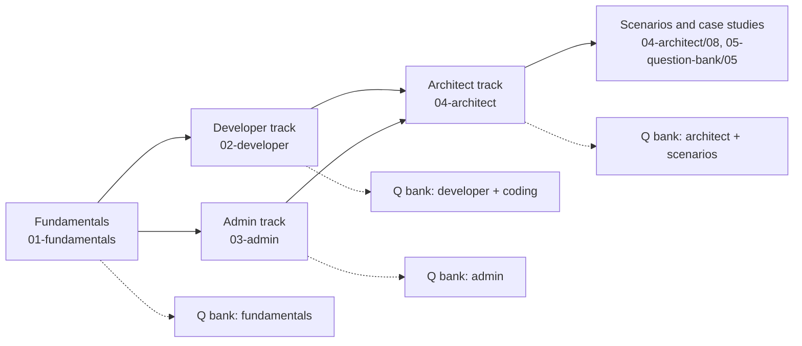
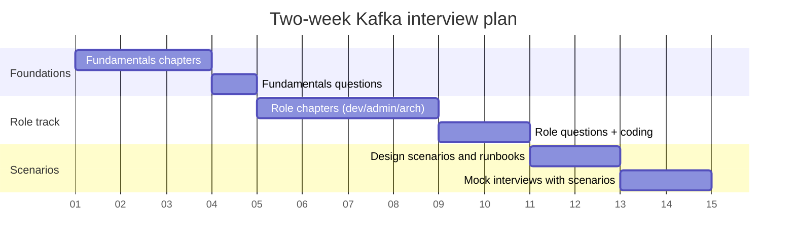

# Learning Roadmaps by Role

Three reading orders through the same book. Each roadmap lists the chapters in the order to read them,
the question sets to attempt after each stage, and the hands-on milestone that proves the stage is done.

Legend: `[F]` fundamentals, `[D]` developer, `[A]` admin, `[R]` architect, `[Q]` question bank, `[Ref]` reference.

---

## Roadmap 1 – Kafka Developer

| Stage | Read | Then attempt | Milestone |
|-------|------|--------------|-----------|
| 1. Foundations | `01-fundamentals/01` core concepts, `01-fundamentals/04` producer internals, `01-fundamentals/05` consumer internals | `05-question-bank/01` Q1–Q40 | Run the docker-compose stack from `02-developer/08` and produce/consume with the CLI |
| 2. Client APIs | `02-developer/01` producer API, `02-developer/02` consumer API, `02-developer/07` error handling | `05-question-bank/02` producer/consumer sections; coding exercises 1–8 | Write a producer and a consumer with manual commits, rebalance listener, and graceful shutdown |
| 3. Schemas and contracts | `02-developer/05` schema registry | `05-question-bank/02` schema section; coding exercise 20 | Evolve an Avro schema backward-compatibly and prove old consumers still work |
| 4. Exactly-once | `01-fundamentals/02` replication sections, `02-developer/06` transactions | `05-question-bank/02` transactions section; coding exercise 6, 7 | Build consume-transform-produce with EOS and verify no duplicates after a kill -9 |
| 5. Stream processing | `02-developer/03` Kafka Streams | `05-question-bank/02` Streams section; coding exercises 9–14 | Windowed aggregation with a KTable join, tested with TopologyTestDriver |
| 6. Integration | `02-developer/04` Kafka Connect, `04-architect/05` integration patterns | `05-question-bank/02` Connect section; coding exercises 18, 19 | Debezium CDC from Postgres into a topic, with an SMT and a DLQ |
| 7. Testing and delivery | `02-developer/08` testing | coding exercises 21, 22 | Integration test suite on Testcontainers running in CI |
| 8. Operate what you build | `03-admin/05` monitoring, `03-admin/09` troubleshooting (client sections) | `05-question-bank/05` developer-relevant scenarios | Dashboard for your app's lag, error rate, and commit latency |

---

## Roadmap 2 – Kafka Administrator / SRE

| Stage | Read | Then attempt | Milestone |
|-------|------|--------------|-----------|
| 1. Foundations | all of `01-fundamentals` | `05-question-bank/01` | Explain replication, ISR, high watermark, and KRaft quorum on a whiteboard |
| 2. Build a cluster | `03-admin/01` installation, `03-admin/02` configuration | `05-question-bank/03` install/config sections | 3-controller + 3-broker KRaft cluster with rack awareness and production `server.properties` |
| 3. Topics and data | `03-admin/03` topic and partition management, `01-fundamentals/03` storage | `05-question-bank/03` topics section | Reassign partitions with throttling, reset a consumer group, purge a topic |
| 4. Day-2 operations | `03-admin/04` cluster operations | `05-question-bank/03` operations section | Rolling restart with zero URP, decommission a broker |
| 5. Observability | `03-admin/05` monitoring, `06-reference/03` metrics cheat sheet | `05-question-bank/03` monitoring section | Prometheus + Grafana with the top 12 alerts firing in a test |
| 6. Security | `03-admin/06` security | `05-question-bank/03` security section | mTLS + SCRAM + ACLs with least-privilege for a producer and a consumer team |
| 7. Resilience and DR | `03-admin/07` backup/DR, `04-architect/03` resiliency | `05-question-bank/03` DR section | MirrorMaker 2 active-passive with tested failover and offset translation |
| 8. Upgrades and migration | `03-admin/08` upgrades and migration | `05-question-bank/03` migration section | ZooKeeper to KRaft migration on a lab cluster, then upgrade to 4.0 |
| 9. Incident practice | `03-admin/09` troubleshooting runbooks | `05-question-bank/05` all admin scenarios | Run 5 game-day drills from the runbooks |

---

## Roadmap 3 – Kafka Architect

| Stage | Read | Then attempt | Milestone |
|-------|------|--------------|-----------|
| 1. Deep foundations | all of `01-fundamentals`, `02-developer/06` transactions | `05-question-bank/01` ★★★ questions | Explain the durability matrix and every place data can be lost |
| 2. Sizing and cost | `04-architect/01` capacity planning | `05-question-bank/04` sizing section | Capacity model for a given workload including cross-AZ cost |
| 3. Performance | `04-architect/02` performance tuning | `05-question-bank/04` tuning section | Tuning profiles for low-latency and high-throughput workloads, benchmarked |
| 4. Resilience | `04-architect/03` resiliency and HA, `03-admin/07` DR | `05-question-bank/04` resiliency section | Failure-mode table with RPO/RTO per pattern |
| 5. Multi-region | `04-architect/04` multi-DC | `05-question-bank/04` multi-region section | Reference architecture for active-active with offset translation |
| 6. Data architecture | `04-architect/05` integration patterns, `02-developer/03`, `02-developer/04` | `05-question-bank/04` patterns section | Event model and topic design for a domain, with schema contracts |
| 7. Platform and governance | `04-architect/07` governance, `03-admin/06` security | `05-question-bank/04` governance section | Multi-tenant platform standard: naming, quotas, ACL model, chargeback |
| 8. Cloud strategy | `04-architect/06` cloud and managed Kafka, `03-admin/08` migration | `05-question-bank/04` cloud/migration section | Managed vs self-managed decision record for your org |
| 9. Design practice | `04-architect/08` design scenarios | `05-question-bank/05` all scenarios | Present 3 case studies end-to-end with diagrams |

---

## Interview preparation plan (2 weeks)

Daily rhythm: 60 minutes reading, 30 minutes answering questions out loud, 30 minutes hands-on.
