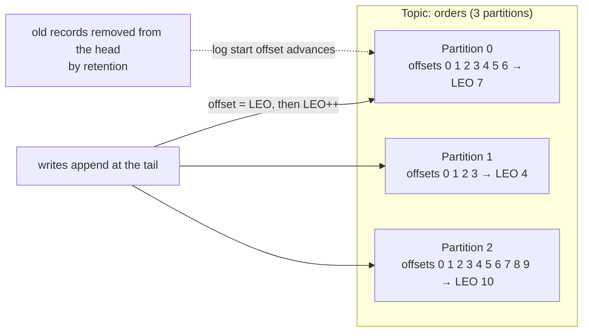
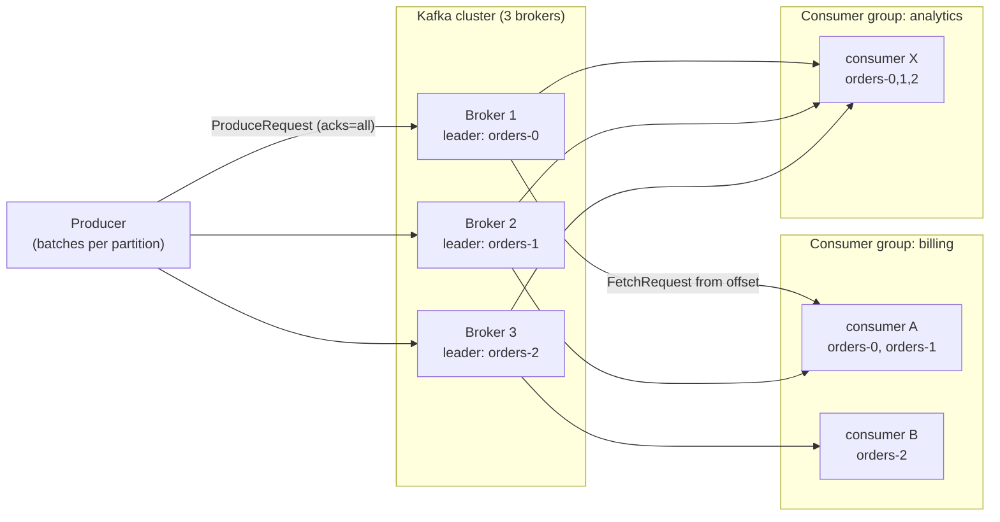
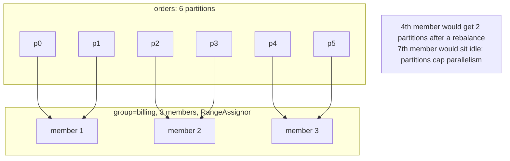
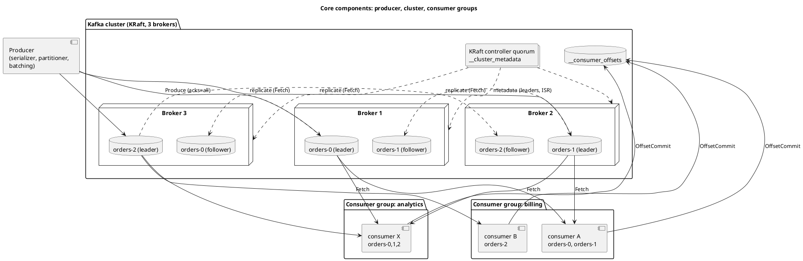
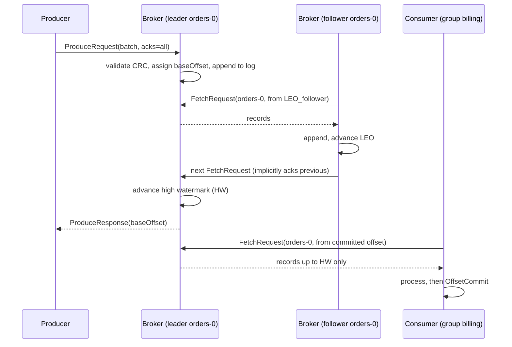

# Core Concepts: Events, Topics, Partitions and the Log

**Roles:** [ARCH] [ADMIN] [DEV]   **Level:** Foundation
**Prerequisites:** none – this is the first chapter of the guide

## What you will learn
- What a Kafka record is, how it is laid out on the wire, and what its timestamp really means
- How topics, partitions and offsets form an append-only, partitioned commit log
- How keys decide partition placement and what ordering Kafka does and does not guarantee
- How producers, consumers, consumer groups and brokers cooperate in a cluster
- Why the log abstraction differs from a traditional message queue, and how Kafka compares to RabbitMQ, Pulsar and Kinesis
- The vocabulary you need for every later chapter (ISR, leader, retention, lag, offset commit)

## 1. Concept

### 1.1 Events and records

Kafka stores **events** (also called records or messages). A record is an immutable fact: "order 42 was placed", "sensor 7 read 21.4 °C", "user 9 changed email". Kafka never modifies a record after it has been written; the only ways it disappears are retention (age or size) and compaction (a newer record with the same key supersedes it).

A record consists of:

| Field | Type | Notes |
|-------|------|-------|
| key | bytes, nullable | Used by the partitioner and by log compaction. Not unique, not an index. |
| value | bytes, nullable | The payload. A `null` value on a compacted topic is a **tombstone**. |
| timestamp | int64 ms | Either set by the producer (`CreateTime`) or overwritten by the broker (`LogAppendTime`). |
| headers | ordered list of `(String, bytes)` | Metadata such as trace ids, schema ids, content type. Since 0.11 (KIP-82). Duplicate header keys are allowed. |
| offset | int64 | Assigned by the broker on append. Not part of the producer-side record. |
| partition | int32 | Chosen by the partitioner, or set explicitly by the producer. |

Kafka is payload-agnostic: keys and values are byte arrays. Serialization (JSON, Avro, Protobuf, plain strings) is the client's job. This is why a schema registry is a separate component and not part of the broker.

### 1.2 Topics and partitions

A **topic** is a named stream of records. A topic is split into one or more **partitions**; each partition is an ordered, immutable, append-only sequence of records stored on disk as a log. Partitions are the unit of:

- **parallelism** – one partition is consumed by at most one consumer instance in a group at a time,
- **ordering** – order is guaranteed only within a partition,
- **replication and placement** – each partition has its own leader and replica set,
- **storage** – each partition is a directory of segment files on a broker.

Within a partition every record gets an **offset**: a monotonically increasing 64-bit number that is unique within that partition. Offsets are never reused, even after records are deleted; the log simply has a `log start offset` (oldest retained) and a `log end offset` (next offset to be written).



Important consequences:

- Offsets are **per partition**. Offset 5 in partition 0 and offset 5 in partition 2 are unrelated records.
- A topic has no global order. If you need total order you need exactly one partition, which caps throughput at what a single broker can serve for that partition.
- The number of partitions can be **increased** but never decreased. Increasing partitions changes the key-to-partition mapping for future records (see 1.3), so decide partition counts deliberately.

> **Production tip:** Choose partition count from the target throughput and the maximum consumer parallelism you will ever need, then add head-room. It is far cheaper to over-partition moderately at creation than to repartition a keyed topic later.

### 1.3 Keys and partitioning

The producer's **partitioner** decides which partition a record goes to:

| Situation | Behaviour (Kafka 3.3+ default partitioner, KIP-794) |
|-----------|------------------------------------------------------|
| Partition set explicitly in `ProducerRecord` | That partition is used. |
| Key present | `murmur2(keyBytes) mod numPartitions` (over all partitions, including offline ones). Same key always lands on the same partition as long as the partition count does not change. |
| Key `null` | "Uniform sticky" behaviour: the producer fills a batch for one partition (up to `batch.size` bytes) then switches partition, so throughput is spread evenly while batches stay large. |

Key semantics are therefore a design decision, not an implementation detail:

- Key by an entity id (order id, account id, device id) when you need per-entity ordering and want compaction to keep the latest state per entity.
- Use `null` keys for fire-and-forget metrics where distribution matters more than ordering.
- Avoid low-cardinality keys (country code, boolean flags): they create **hot partitions** where one partition receives most traffic.

Because the hash is computed by the client, a Java producer and a librdkafka producer using murmur2 agree on placement, but a client using a different hash (for example some older clients used CRC32 or `random`) will not. Mixed-language producers to a keyed topic must agree on the partitioner.

### 1.4 Producers, consumers and consumer groups

- A **producer** appends records to topics. It batches records per partition, compresses batches, and waits for the acknowledgment level configured in `acks` (see chapter 04).
- A **consumer** reads records from partitions by polling, starting at an offset it controls. Consumers are pull-based: the broker never pushes.
- A **consumer group** is a set of consumers sharing a `group.id`. Kafka assigns each partition of the subscribed topics to exactly one member of the group. Multiple groups can read the same topic independently; each group tracks its own committed offsets.



The group owns partitions, not records. This is the key difference from a queue: nothing is "removed" when consumed. A consumer reports progress by **committing** the next offset to read, stored in the internal topic `__consumer_offsets`. If the consumer crashes, another member of the group takes over its partitions and resumes from the last committed offset.



### 1.5 Brokers and the cluster

A **broker** is one Kafka server process. It stores partitions on local disk, serves produce and fetch requests, and replicates partitions from other brokers. A **cluster** is a set of brokers that share one metadata log managed by the KRaft controller quorum (chapter 02). Every partition has exactly one **leader** broker that serves all reads and writes, and zero or more **follower** brokers that replicate it. Clients discover leaders through a `MetadataRequest` sent to any broker from the `bootstrap.servers` list.

Since 4.0 the cluster runs **KRaft only**: there is no ZooKeeper. Metadata (topics, partitions, leaders, ISR, configs, ACLs) lives in the internal `__cluster_metadata` log replicated by a Raft quorum of controller nodes.

The component view below (source: `diagrams/01-core-concepts-producer-consumer-flow.puml`) shows how the pieces relate: producers write to partition leaders, followers replicate, and each consumer group keeps its own offsets in `__consumer_offsets`.



### 1.6 Retention

Kafka keeps records for a configured time or size regardless of whether anyone consumed them:

| Setting (broker default / topic override) | Default | Meaning |
|--------------------------------------------|---------|---------|
| `log.retention.hours` / `retention.ms` | 168 h (7 days) | Delete whole segments whose newest record is older than this. |
| `log.retention.bytes` / `retention.bytes` | -1 (unlimited) | Delete oldest segments when a partition exceeds this size. Per partition, not per topic. |
| `log.cleanup.policy` / `cleanup.policy` | `delete` | `delete`, `compact`, or `compact,delete`. |
| `log.retention.check.interval.ms` | 300000 | How often the retention thread checks. |

Retention runs at **segment** granularity: a record is deletable only when the whole segment it lives in is deletable. That is why retention appears "late" by up to a segment. Details are in chapter 03.

## 2. How it works internally

### 2.1 The record batch format (v2, since 0.11)

Producers never send individual records; they send **record batches**. Since message format v2 (0.11, KIP-98) a batch is the unit of compression, CRC and idempotence bookkeeping. The layout is:

```
RecordBatch (header 61 bytes, then records)
  baseOffset            int64   first offset in the batch (assigned by broker)
  batchLength           int32
  partitionLeaderEpoch  int32   set by broker, used for truncation safety
  magic                 int8    = 2
  crc                   uint32  CRC-32C over everything after this field
  attributes            int16   bits 0-2 compression codec, bit 3 timestampType,
                                bit 4 isTransactional, bit 5 isControlBatch,
                                bit 6 hasDeleteHorizonMs
  lastOffsetDelta       int32
  baseTimestamp         int64
  maxTimestamp          int64
  producerId            int64   -1 if not idempotent
  producerEpoch         int16
  baseSequence          int32   -1 if not idempotent
  records               [Record]  (varint-encoded, compressed as a unit)

Record
  length                varint
  attributes            int8    unused
  timestampDelta        varlong  relative to baseTimestamp
  offsetDelta           varint   relative to baseOffset
  keyLength / key       varint + bytes  (-1 = null)
  valueLength / value   varint + bytes  (-1 = null)
  headers               varint count, then (keyLength,key,valueLength,value)*
```

Design consequences:

- Offsets and timestamps inside the batch are **deltas**, so the broker can assign `baseOffset` without decompressing and rewriting the records. This makes the produce path cheap.
- Because compression is per batch, larger batches compress better. `linger.ms` and `batch.size` on the producer therefore affect both throughput and disk usage.
- The broker stores exactly the bytes the producer sent (after CRC check) and later sends exactly those bytes to consumers. Consumers decompress. The broker only recompresses if the topic's `compression.type` differs from the producer's codec (default topic value `producer` means "keep whatever the producer used").
- Message formats v0 and v1 are gone: since 4.0 brokers no longer down-convert to v0/v1 for very old clients (KIP-724), so clients older than 0.11 cannot talk to a 4.0 cluster.

### 2.2 Timestamps: `CreateTime` versus `LogAppendTime`

Every record carries one timestamp. The topic setting `message.timestamp.type` (broker default `log.message.timestamp.type=CreateTime`) decides who owns it:

| Type | Set by | Use when | Gotcha |
|------|--------|----------|--------|
| `CreateTime` (default) | Producer, at `send()` time (or explicitly in `ProducerRecord`) | You need event time for stream processing, windowing, or late-data handling | Clock skew and replay can put arbitrary timestamps in the log. Time index lookups (`offsetsForTimes`) assume timestamps are roughly monotonic. |
| `LogAppendTime` | Broker leader, when the batch is appended | You need ingestion time for retention accounting or auditing, or you cannot trust producer clocks | The original producer timestamp is lost. Rewrites the batch's `maxTimestamp` and sets the timestamp-type attribute bit. |

Since 3.6 (KIP-937) brokers can reject records whose `CreateTime` is too far from broker time using `log.message.timestamp.before.max.ms` and `log.message.timestamp.after.max.ms` (both default to `Long.MAX_VALUE`, that is, no check). Retention for the delete policy uses the **largest timestamp in each segment**, so one far-future timestamp can keep a segment alive far longer than intended. That is the main reason to consider `LogAppendTime` on topics fed by untrusted or replaying producers.

### 2.3 The produce and fetch path in one picture



Two offsets on the leader matter:

- **Log end offset (LEO)** – next offset to append.
- **High watermark (HW)** – the highest offset replicated to all in-sync replicas. Consumers can only read up to the HW, so a record is visible only once it is safe against leader failure. Chapter 02 explains the replication protocol.

### 2.4 Ordering guarantees, precisely

Kafka guarantees:

1. Records sent by **one producer** to **one partition** are appended in the order they were sent, provided the producer is idempotent (default since 3.0) or `max.in.flight.requests.per.connection=1`. With a non-idempotent producer and more than one in-flight request, a retry can reorder batches.
2. A consumer reads a partition's records in **offset order**.
3. Across partitions there is **no** ordering guarantee, and across producers there is no guarantee beyond "whichever batch arrives at the leader first gets the lower offset".

Kafka does not guarantee:

- Global topic order.
- Timestamp order. Offsets are ordered; timestamps in `CreateTime` mode are whatever the producer said.
- Order after a partition count change for keyed data (old and new records of the same key may now live on different partitions).
- Order across a consumer's multiple assigned partitions: `poll()` returns records from several partitions interleaved.

## 3. Configuration that matters

| Parameter (scope) | Default | Recommended | Why |
|-------------------|---------|-------------|-----|
| `num.partitions` (broker) | 1 | Set explicitly per topic; disable auto-creation | Default for auto-created topics. One partition means no consumer parallelism. |
| `auto.create.topics.enable` (broker) | `true` | `false` in production | Typos create topics with default settings; producers to non-existent topics should fail. |
| `default.replication.factor` (broker) | 1 | 3 | Applies to auto-created topics. Factor 1 means data loss on a single disk failure. |
| `log.retention.hours` (broker) / `retention.ms` (topic) | 168 | Per topic, from the replay window you need | Storage cost vs replay ability. |
| `log.message.timestamp.type` / `message.timestamp.type` | `CreateTime` | `CreateTime` for event streams, `LogAppendTime` for audit/ingest topics | Decides who owns the timestamp. |
| `message.max.bytes` (broker) / `max.message.bytes` (topic) | 1048588 | Keep at 1 MB; put large payloads in object storage and send a reference | Large records hurt batching, page cache efficiency and replication latency. |
| `compression.type` (topic) | `producer` | `producer` | Keeps the producer's codec; avoids broker CPU for recompression. |
| `min.insync.replicas` (broker/topic) | 1 | 2 with replication factor 3 | Together with `acks=all` defines durability. Chapter 02. |

## 4. Failure modes and how to detect them

| Symptom | Likely cause | Metric / log to check | Fix |
|---------|--------------|-----------------------|-----|
| One partition receives most traffic, one consumer lags while others idle | Low-cardinality or skewed key | `kafka.server:type=BrokerTopicMetrics,name=MessagesInPerSec` per topic-partition; consumer `records-lag` per partition | Choose a higher-cardinality key, or add a salt for hot keys and re-aggregate downstream. |
| Records for the same key arrive at different consumers after a partition increase | Partition count changed on a keyed topic | Topic history; `kafka-topics.sh --describe` | Plan partitions up front; if unavoidable, drain and migrate to a new topic. |
| Old data never deleted, disk fills | Segment contains a record with a far-future `CreateTime` | `kafka-dump-log.sh` on the segment; `log.retention` metrics; `kafka.log:type=Log,name=Size` | Set `log.message.timestamp.after.max.ms` or use `LogAppendTime` on that topic. |
| Records "disappear" after 7 days | Default retention | topic config | Set `retention.ms` explicitly per topic. |
| Duplicate records in consumer | At-least-once processing, consumer restarted before commit | consumer `commit-latency-avg`, application logs | Idempotent processing or exactly-once semantics (dev chapters). |
| Consumer group members idle | More members than partitions | `kafka-consumer-groups.sh --describe --group X` shows members with no partitions | Increase partitions or reduce members. |

## 5. Design guidance (architect view)

### 5.1 The log abstraction versus a queue

| Property | Classic message queue (JMS, AMQP) | Kafka log |
|----------|-----------------------------------|-----------|
| What happens on consume | Message removed (after ack) | Nothing; consumer moves its offset |
| Multiple independent readers | Needs fan-out (topic exchange, bindings) and a copy per subscriber | Free: every consumer group has its own offset |
| Replay | Not possible once acked | Reset offset and re-read within retention |
| Ordering | Per queue, broken by competing consumers | Per partition, preserved because a partition has one consumer per group |
| Per-message routing / selectors | Rich (headers, routing keys) | None inside the broker; route by topic/partition, filter in client |
| Per-message acknowledgment / redelivery | Yes, with dead-letter queues | Offset-based only (share groups in 4.0 add per-record acks, see chapter 05) |
| Throughput model | Broker tracks state per message | Broker does sequential I/O and page-cache reads; state is one integer per partition per group |
| Backpressure | Broker-side queue growth | Consumer lag; the log absorbs bursts up to retention |

Choose Kafka when you need durable, replayable, high-throughput streams consumed by several independent systems. Choose a queue when you need per-message routing, priority, TTL per message, or complex redelivery semantics for a single consumer pool.

### 5.2 Kafka versus RabbitMQ, Pulsar and Kinesis

| Aspect | Apache Kafka 4.0 | RabbitMQ (AMQP 0-9-1, plus Streams) | Apache Pulsar | AWS Kinesis Data Streams |
|--------|------------------|------------------------------------|---------------|--------------------------|
| Core model | Partitioned, replicated append-only log | Exchanges route to queues; per-message ack; Streams plugin adds a log | Topics backed by Apache BookKeeper ledgers; segment-centric storage separated from serving brokers | Shards (equivalent to partitions) as a managed service |
| Storage / compute | Coupled on brokers (tiered storage since 3.9 moves cold segments to object store) | Broker-local | Decoupled: brokers stateless, BookKeeper bookies store data | Fully managed |
| Ordering | Per partition | Per queue with a single consumer; Streams per stream | Per partition (or per key with Key_Shared) | Per shard, per partition key |
| Consumer model | Pull, consumer groups, offsets | Push with prefetch, per-message ack | Push-style subscriptions: exclusive, failover, shared, key_shared; per-message ack | Pull via GetRecords, checkpoints in DynamoDB (KCL) or Enhanced Fan-Out push |
| Retention | Time/size per topic, compaction, tiered | Until acked (queues) or retention (Streams) | Time/size, tiered offload to object storage | 24 h default, up to 365 days |
| Multi-tenancy | Quotas, ACLs, one cluster = one tenant boundary in practice | vhosts | First-class tenants and namespaces | Per account/stream |
| Geo-replication | External (MirrorMaker 2, vendor tools) | Federation / shovel | Built-in geo-replication | Cross-region via application |
| Exactly-once | Idempotent producer + transactions | No end-to-end EOS | Transactions (since 2.8) | No |
| Stream processing | Kafka Streams, ksqlDB (Confluent), Flink connectors | None built-in | Pulsar Functions | Kinesis Data Analytics / Flink |
| Operations | Self-managed or vendor (Confluent, MSK, Redpanda is a separate API-compatible implementation) | Self-managed or vendor | Self-managed or StreamNative | Managed only; shard limits (indicative: 1 MB/s in, 2 MB/s out per shard) |
| Sweet spot | High-throughput event streaming, event sourcing, CDC, stream processing | Task queues, RPC-style messaging, routing-heavy workloads | Multi-tenant streaming with queue-like semantics and geo-replication | AWS-native, low-ops workloads with modest throughput |

> **Anti-pattern:** Using Kafka as a work queue with one partition per "priority" and expecting per-message redelivery, TTL, or dead-lettering to exist in the broker. Those semantics have to be built in the consumer (or, since 4.0 early access, with share groups).

### 5.3 Partition count decision table

| Driver | Rule of thumb |
|--------|---------------|
| Target throughput | `partitions >= max(target_in / per_partition_producer_throughput, target_out / per_partition_consumer_throughput)`; measure per-partition throughput on your hardware, it is workload dependent. |
| Consumer parallelism | At least the maximum number of consumer instances you plan to run in the largest group. |
| Key cardinality | Enough partitions that the busiest key is a small fraction of one partition's load. |
| Broker limits | Total partitions per broker matter for recovery time and metadata size; a few thousand per broker is a common comfort zone on KRaft, but treat this as indicative and test. |
| Ordering | If total order is required, exactly one partition; otherwise ordering is per key. |

## 6. Hands-on

Create a topic, produce keyed records and observe partition placement.

```bash
# Create a topic with 3 partitions and replication factor 3
kafka-topics.sh --bootstrap-server localhost:9092 \
  --create --topic orders --partitions 3 --replication-factor 3 \
  --config retention.ms=604800000 --config min.insync.replicas=2

kafka-topics.sh --bootstrap-server localhost:9092 --describe --topic orders

# Produce keyed records: "key:value" with ':' as separator
printf 'cust-1:order-1\ncust-2:order-2\ncust-1:order-3\ncust-3:order-4\n' | \
kafka-console-producer.sh --bootstrap-server localhost:9092 --topic orders \
  --property parse.key=true --property key.separator=:

# Consume and print partition, offset, timestamp, key and value
kafka-console-consumer.sh --bootstrap-server localhost:9092 --topic orders \
  --from-beginning --property print.partition=true --property print.offset=true \
  --property print.timestamp=true --property print.key=true --property print.headers=true

# Watch a consumer group's offsets and lag
kafka-consumer-groups.sh --bootstrap-server localhost:9092 --describe --group billing

# Inspect earliest and latest offsets per partition
kafka-get-offsets.sh --bootstrap-server localhost:9092 --topic orders --time earliest
kafka-get-offsets.sh --bootstrap-server localhost:9092 --topic orders --time latest

# Dump a segment to see the batch format (run on a broker host)
kafka-dump-log.sh --files /var/lib/kafka/data/orders-0/00000000000000000000.log --print-data-log
```

Minimal Java producer and consumer showing key, headers and timestamp:

```java
Properties p = new Properties();
p.put(ProducerConfig.BOOTSTRAP_SERVERS_CONFIG, "localhost:9092");
p.put(ProducerConfig.KEY_SERIALIZER_CLASS_CONFIG, StringSerializer.class.getName());
p.put(ProducerConfig.VALUE_SERIALIZER_CLASS_CONFIG, StringSerializer.class.getName());
try (KafkaProducer<String, String> producer = new KafkaProducer<>(p)) {
    ProducerRecord<String, String> rec =
        new ProducerRecord<>("orders", null, System.currentTimeMillis(), "cust-1", "order-1");
    rec.headers().add("trace-id", "abc123".getBytes(StandardCharsets.UTF_8));
    RecordMetadata md = producer.send(rec).get();
    System.out.printf("partition=%d offset=%d ts=%d%n", md.partition(), md.offset(), md.timestamp());
}

Properties c = new Properties();
c.put(ConsumerConfig.BOOTSTRAP_SERVERS_CONFIG, "localhost:9092");
c.put(ConsumerConfig.GROUP_ID_CONFIG, "billing");
c.put(ConsumerConfig.KEY_DESERIALIZER_CLASS_CONFIG, StringDeserializer.class.getName());
c.put(ConsumerConfig.VALUE_DESERIALIZER_CLASS_CONFIG, StringDeserializer.class.getName());
c.put(ConsumerConfig.AUTO_OFFSET_RESET_CONFIG, "earliest");
try (KafkaConsumer<String, String> consumer = new KafkaConsumer<>(c)) {
    consumer.subscribe(List.of("orders"));
    while (true) {
        for (ConsumerRecord<String, String> r : consumer.poll(Duration.ofMillis(500))) {
            System.out.printf("%s-%d@%d key=%s type=%s ts=%d%n",
                r.topic(), r.partition(), r.offset(), r.key(), r.timestampType(), r.timestamp());
        }
    }
}
```

## 7. Interview questions for this chapter

### Q1. What is a partition and why does Kafka have them?
**Role:** [DEV] | **Difficulty:** ★☆☆ | **Topic:** Core model

**Answer.**
A partition is an ordered, immutable, append-only log that is the unit of parallelism, ordering, replication and storage in Kafka. Topics are split into partitions so that writes and reads can be spread across brokers and across consumers in a group, while ordering is still guaranteed inside each partition. Each partition has its own offsets starting at 0, its own leader broker and its own replica set. The trade-off is that there is no global order across a topic, and the partition count caps the parallelism of any single consumer group.

**Follow-up probes.** Can you reduce the number of partitions? What happens to keyed data when you increase it?

### Q2. How does a producer choose the partition for a record?
**Role:** [DEV] | **Difficulty:** ★★☆ | **Topic:** Partitioning

**Answer.**
If the record names a partition it is used as-is; otherwise, with a key, the default partitioner hashes the key bytes with murmur2 and takes the result modulo the total partition count; with a `null` key the 3.3+ default partitioner (KIP-794) sticks to one partition until a batch of `batch.size` bytes is full, then moves to another, spreading load evenly while keeping batches large. The hash uses the total partition count, not only available partitions, so the mapping is stable across broker outages but changes whenever partitions are added. Custom partitioners implement `org.apache.kafka.clients.producer.Partitioner` and are set with `partitioner.class`.

**Follow-up probes.** Why do mixed-language producers sometimes disagree on placement? What is a hot partition and how would you fix it?

### Q3. What ordering guarantees does Kafka give?
**Role:** [ARCH] | **Difficulty:** ★★☆ | **Topic:** Ordering

**Answer.**
Kafka guarantees order within a partition for records from a single producer, and consumers see a partition in offset order. It does not guarantee order across partitions, across producers, or by timestamp. Even per-partition order from one producer can break if the producer is not idempotent and `max.in.flight.requests.per.connection` is greater than 1, because a failed batch may be retried after a later batch succeeded; the idempotent producer (default since 3.0) fixes this using sequence numbers. Order also breaks for a key when the partition count changes, since the key maps to a different partition afterwards.

**Follow-up probes.** How do you keep ordering with retries and high throughput? How does Kafka Streams handle out-of-order timestamps?

### Q4. Explain `CreateTime` versus `LogAppendTime` and when you would pick each.
**Role:** [ADMIN] | **Difficulty:** ★★☆ | **Topic:** Record format

**Answer.**
`CreateTime` (the default via `message.timestamp.type`) keeps the timestamp the producer set, which is what stream processing needs for event-time windows; `LogAppendTime` makes the leader overwrite it with the append time, which gives trustworthy ingestion time and predictable retention. The gotcha is that time-based retention uses the largest timestamp in each segment, so a producer with a wrong clock or a replay job writing far-future `CreateTime` values can prevent segments from ever expiring. Since 3.6 you can bound accepted timestamps with `log.message.timestamp.before.max.ms` and `log.message.timestamp.after.max.ms`.

**Follow-up probes.** What does `offsetsForTimes` return if timestamps are not monotonic? Which timestamp does Kafka Streams use by default?

### Q5. A consumer group has 12 members reading a topic with 8 partitions. What happens?
**Role:** [DEV] | **Difficulty:** ★☆☆ | **Topic:** Consumer groups

**Answer.**
Four members will be idle: a partition is assigned to at most one member of a group, so at most 8 members can be active. The idle members still participate in the group (heartbeats, rebalances) and will take over if an active member leaves. To use all 12 instances you would need at least 12 partitions. This is the main reason partition counts should be chosen with future consumer parallelism in mind.

**Follow-up probes.** How would you scale reads without adding partitions? What do share groups (KIP-932) change here?

### Q6. Why is Kafka described as a "distributed commit log" rather than a message queue?
**Role:** [ARCH] | **Difficulty:** ★★☆ | **Topic:** Log abstraction

**Answer.**
Because consuming does not remove data: records are appended once and stay for the retention period, and each consumer group just advances an offset. That gives cheap fan-out (any number of independent readers), replay (reset the offset), and very high throughput (sequential disk I/O, page cache, zero-copy sends, one integer of state per partition per group). A queue tracks state per message and deletes on ack, which enables per-message routing and redelivery but makes fan-out and replay expensive. The trade-off is that Kafka pushes per-message semantics (priority, TTL, dead-lettering) to the consumer.

**Follow-up probes.** When would you still choose RabbitMQ? How does log compaction fit into this model?

### Q7. What is inside a record batch and why are offsets stored as deltas?
**Role:** [DEV] | **Difficulty:** ★★★ | **Topic:** Record format

**Answer.**
A v2 batch has a 61-byte header (base offset, length, partition leader epoch, magic=2, CRC-32C, attributes, last offset delta, base and max timestamp, producer id, producer epoch, base sequence, record count) followed by the records, which are compressed together as one unit. Each record stores its offset and timestamp as varint deltas from the batch base. The broker only needs to write `baseOffset` and `partitionLeaderEpoch` in the header and can leave the compressed body untouched, so appending is nearly a memcpy and the same bytes are served to consumers without recompression. The producer id, epoch and base sequence are what make idempotent and transactional writes possible.

**Follow-up probes.** What does the broker do if the topic's `compression.type` differs from the producer's codec? Why did 4.0 drop support for message formats v0 and v1?

### Q8. Compare Kafka with Kinesis for a team already on AWS.
**Role:** [ARCH] | **Difficulty:** ★★☆ | **Topic:** Platform comparison

**Answer.**
Kinesis is fully managed and integrates with AWS IAM and Lambda, but its shards have fixed throughput ceilings (indicative: 1 MB/s in and 2 MB/s out per shard), retention is 24 hours by default up to 365 days, there are no transactions or compaction, and stream processing means Flink on KDA. Kafka (self-managed or MSK) offers higher per-partition throughput, long retention with tiered storage, compaction, exactly-once semantics, Kafka Streams and Connect, and portability off AWS. Pick Kinesis for modest-volume AWS-native pipelines with minimal operations; pick Kafka when you need the richer semantics, higher throughput per unit, or a vendor-neutral platform.

**Follow-up probes.** How does MSK differ from self-managed Kafka on EC2? How would you migrate from Kinesis to Kafka?

### Q9. Where are consumer offsets stored and what happens to them when a group is inactive?
**Role:** [ADMIN] | **Difficulty:** ★★☆ | **Topic:** Consumer groups

**Answer.**
Committed offsets live in the internal compacted topic `__consumer_offsets` (50 partitions by default via `offsets.topic.num.partitions`, replication factor from `offsets.topic.replication.factor`, default 3), keyed by group, topic and partition. When a group has been empty for longer than `offsets.retention.minutes` (default 10080, 7 days) the coordinator writes tombstones and the offsets are removed; a consumer that returns afterwards starts according to `auto.offset.reset`. This is a frequent cause of "we re-read everything after a two-week outage" incidents.

**Follow-up probes.** How can you reset offsets for a group manually? Why must the group be inactive to do so?

## Key takeaways
- A topic is a set of independent, ordered, append-only partition logs; offsets are per partition and never reused.
- Keys decide placement through `murmur2 mod partitions`; changing the partition count changes the mapping.
- Consumers pull and track their own offsets; a consumer group assigns each partition to one member, so partitions cap parallelism.
- The v2 record batch is the unit of compression, CRC and idempotence, and is stored and served byte-for-byte.
- `CreateTime` is the default and feeds event-time processing; `LogAppendTime` makes retention predictable.
- Order is guaranteed only within a partition; everything else must be designed for.

## Further reading
- Apache Kafka documentation: "Introduction" and "Design" sections (kafka.apache.org/documentation)
- KIP-82: Add Record Headers
- KIP-98: Exactly Once Delivery and Transactional Messaging (introduces message format v2)
- KIP-794: Strictly Uniform Sticky Partitioner
- KIP-937: Improve Message Timestamp Validation
- KIP-724: Drop support for message formats v0 and v1
