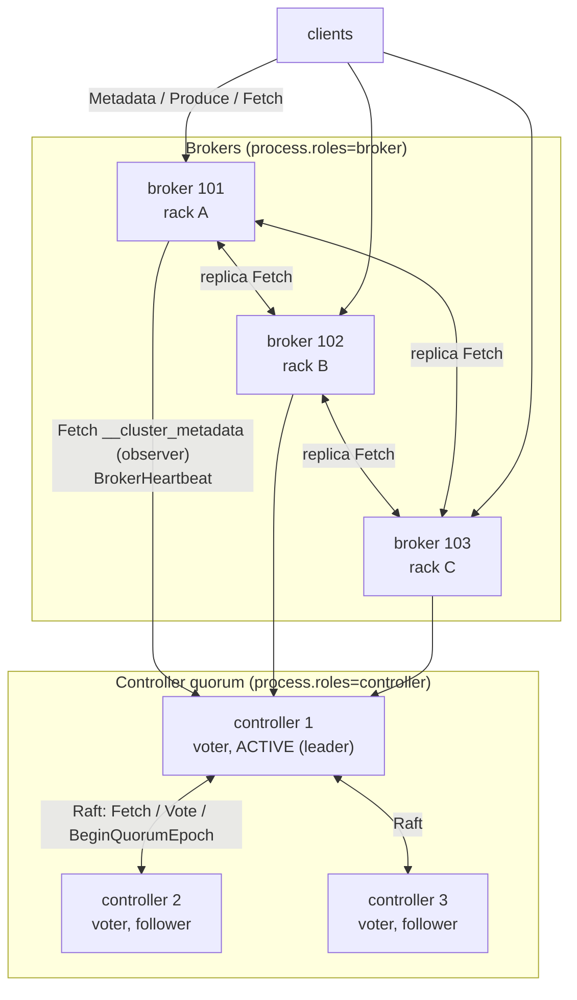
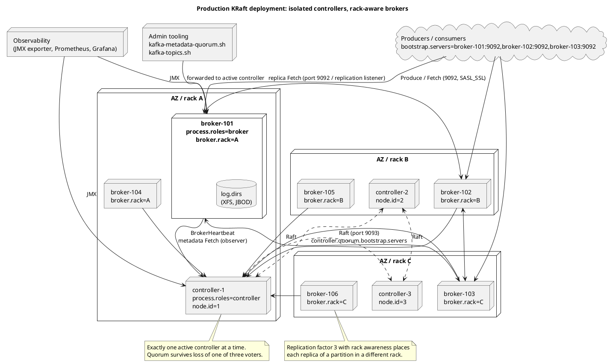
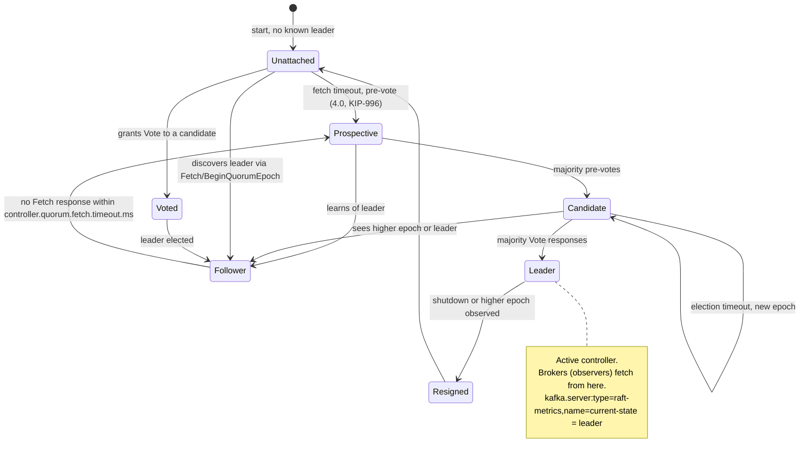
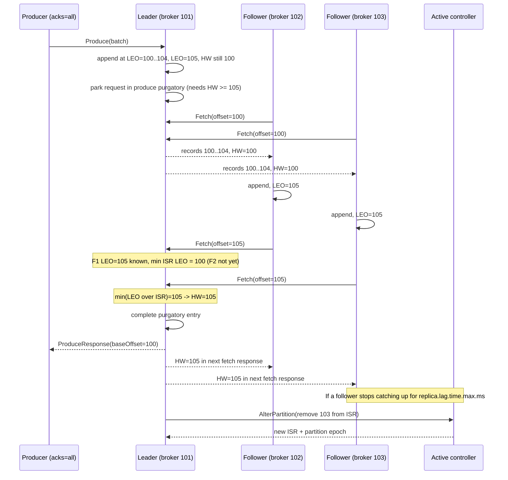
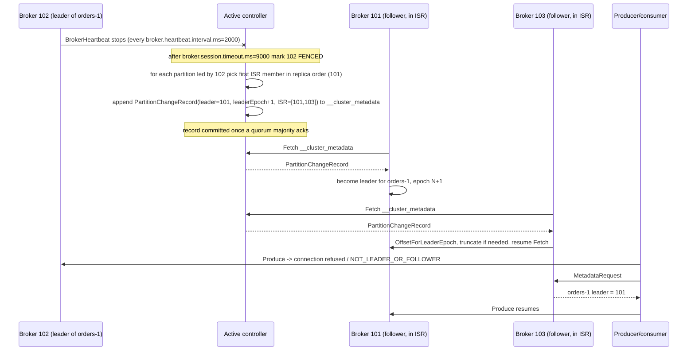
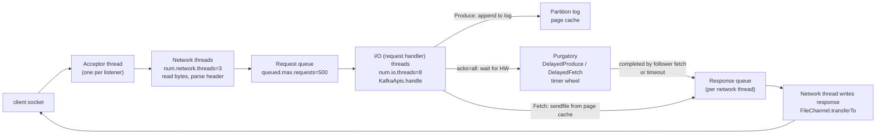

# Cluster Architecture: Brokers, KRaft and Replication

**Roles:** [ARCH] [ADMIN] [DEV]   **Level:** Intermediate
**Prerequisites:** [01-core-concepts.md](01-core-concepts.md)

## What you will learn
- What a broker does and how the KRaft controller quorum replaces ZooKeeper (Raft, `__cluster_metadata`, voters and observers, combined vs isolated mode)
- How partition replication really works: fetch-based followers, log end offset, high watermark, leader epoch and the ISR
- How `acks`, `min.insync.replicas` and `unclean.leader.election.enable` combine into a durability contract
- What happens, step by step, when a broker or the active controller dies
- How a broker processes a request: network threads, request queue, I/O threads, purgatory and zero-copy
- Rack awareness and the sizing/topology decisions an architect owns

## 1. Concept

### 1.1 Roles of a node

Since KRaft, every Kafka node is configured with `process.roles`:

| `process.roles` | Node type | Responsibilities |
|-----------------|-----------|------------------|
| `broker` | Broker | Stores partition replicas, serves Produce/Fetch, replicates from leaders, hosts group and transaction coordinators, applies metadata it fetches from the controller. |
| `controller` | Controller | Participates in the Raft quorum for `__cluster_metadata`; the elected **active controller** owns all metadata changes (topic creation, leader election, ISR changes, broker registration, configs, ACLs). |
| `broker,controller` | Combined | Both in one JVM. Fine for development and small clusters; production guidance is to isolate controllers so broker load (GC, disk, network saturation) cannot starve the quorum. |

Timeline: KRaft was introduced as early access in 2.8, declared production-ready in 3.3 (KIP-833), ZooKeeper-to-KRaft migration was supported from 3.4/3.5, and ZooKeeper was removed entirely in 4.0 (KIP-500 completed). A 4.0 cluster must be KRaft; clusters still on ZooKeeper have to migrate on a 3.9 release first.

### 1.2 What ZooKeeper used to do (legacy)

For readers maintaining 3.x clusters: ZooKeeper stored cluster metadata (brokers, topics, partition assignments, ISR, configs, ACLs) and elected a single controller broker via an ephemeral znode. The controller pushed state to brokers with `LeaderAndIsr` and `UpdateMetadata` requests, and ISR changes were written by partition leaders directly to ZooKeeper. Problems: metadata was held twice (ZooKeeper and controller memory), controller failover required re-reading everything from ZooKeeper (seconds to minutes with hundreds of thousands of partitions), and operators had to run and secure a second distributed system. KRaft fixes all three by making metadata itself a replicated Kafka log.

### 1.3 Cluster topology



Brokers never serve client requests for metadata changes; they forward admin requests (create topic, alter config) to the active controller via the envelope mechanism. Clients talk only to brokers; the controller listener (`controller.listener.names`) is not advertised to clients.

The deployment diagram below (source: `diagrams/02-cluster-architecture-deployment.puml`) shows a production layout with an isolated three-node controller quorum, six brokers across three racks or availability zones, and the client and observability paths.



### 1.4 KRaft controller quorum

The controller quorum is a Raft group whose replicated log is the topic `__cluster_metadata` (one partition, stored under `metadata.log.dir`, or the first entry of `log.dirs` if unset, in the directory `__cluster_metadata-0`). Every metadata mutation is a record in that log: `RegisterBrokerRecord`, `TopicRecord`, `PartitionRecord`, `PartitionChangeRecord`, `ConfigRecord`, `FeatureLevelRecord`, and so on.

| Term | Meaning |
|------|---------|
| Voter | A controller node that votes in elections and whose acknowledgment counts towards committing a record. Configured statically with `controller.quorum.voters=1@c1:9093,2@c2:9093,3@c3:9093` or, since 3.9 (KIP-853), dynamically via `controller.quorum.bootstrap.servers` plus `kafka-metadata-quorum.sh add-controller / remove-controller`. |
| Observer | A node that replicates the metadata log but does not vote. Every broker is an observer: it fetches `__cluster_metadata` from the active controller and applies records to its local metadata cache. Standby controllers are also observers until they become voters. |
| Active controller | The Raft leader. Only it appends metadata records. It also runs the cluster-wide logic (leader election, ISR management, broker fencing). |
| Leader epoch (Raft) | Monotonic term number; a new election starts a new epoch. Distinct from the partition leader epoch discussed in 2.2 but built on the same idea. |
| High watermark (metadata) | Highest committed metadata offset: acknowledged by a majority of voters. Brokers only apply committed records. |
| Snapshot | A compacted image of the full metadata state, written when `metadata.log.max.record.bytes.between.snapshots` (default 20971520) bytes have been appended since the last snapshot or `metadata.log.max.snapshot.interval.ms` (default 3600000) elapsed. Files are named `<offset>-<epoch>.checkpoint`. New observers load the latest snapshot then replay the tail. |

Because the same replicated-log machinery is used for metadata and for data, controller failover is a Raft leader election plus a replay of at most a few uncommitted records: the new leader already has the log in memory. There is no "reload from ZooKeeper" step. A standby controller can take over in about the election timeout (`controller.quorum.election.timeout.ms`, default 1000) plus a backoff.

Quorum sizing: with N voters the quorum tolerates `floor((N-1)/2)` failures. Three voters (tolerates one) is the standard; five (tolerates two) is used where controller maintenance and an unplanned failure must overlap. Even numbers add cost without adding fault tolerance.

## 2. How it works internally

### 2.1 KRaft quorum states



Key timings: followers fetch from the leader continuously; if `controller.quorum.fetch.timeout.ms` (default 2000) passes without a successful fetch, a voter starts an election. Since 4.0 (KIP-996) a **pre-vote** round asks other voters whether they would vote before incrementing the epoch, which prevents a partitioned voter from disrupting a healthy leader when it rejoins. The election itself must complete within `controller.quorum.election.timeout.ms` (default 1000) or it retries with backoff up to `controller.quorum.election.backoff.max.ms` (default 1000).

### 2.2 Partition replication protocol

Every partition has a replica set (`replication.factor` copies), one of which is the leader. Followers do not receive pushes; they run **replica fetcher threads** that issue `FetchRequest`s to the leader exactly like consumers do, starting from their own log end offset.

Definitions:

| Term | Definition |
|------|------------|
| LEO (log end offset) | Next offset to be written on a given replica. Each replica has its own LEO. |
| HW (high watermark) | On the leader: the minimum LEO across the ISR. Records below the HW are **committed**; only those are visible to consumers and only those survive a leader change. The leader propagates the HW to followers in fetch responses. |
| ISR (in-sync replicas) | The leader plus every follower whose fetch has caught up to the leader's LEO within `replica.lag.time.max.ms` (default 30000). Membership changes are recorded in `__cluster_metadata` via the controller (`AlterPartition` request). |
| Leader epoch (partition) | A 32-bit counter incremented by the controller every time the partition's leader changes. Stamped into every batch (`partitionLeaderEpoch`) and persisted in `leader-epoch-checkpoint`. Used to truncate divergent logs safely (KIP-101, KIP-279). |
| Log start offset | Oldest retained offset; advanced by retention or `DeleteRecords`. |



Two subtleties worth knowing:

1. A follower's fetch at offset N tells the leader that the follower has everything below N. The HW therefore advances one fetch round-trip after data was replicated, which is why produce latency with `acks=all` is roughly two follower fetch cycles (`replica.fetch.wait.max.ms`, default 500, bounds the wait when there is no data, but new data completes the leader's delayed fetch immediately).
2. The HW on a follower lags the leader's HW by one round trip. After a leader change, the new leader's HW may be temporarily lower than the old leader's; this is safe because anything the old leader exposed to consumers was already on all ISR members.

**ISR shrink and expand.** The leader checks every `replica.lag.time.max.ms / 2` whether any follower has failed to catch up to the LEO within `replica.lag.time.max.ms`. It measures *time since the follower was last caught up*, not message count (the old `replica.lag.max.messages` was removed in 0.9 because bursts kept kicking healthy followers out). A slow follower is removed via `AlterPartition`; when it catches up to the HW again it is re-added. Metrics: `kafka.server:type=ReplicaManager,name=IsrShrinksPerSec` and `IsrExpandsPerSec`.

**Leader epoch and truncation.** When a follower (re)starts or a new leader is elected, a follower must find where its log diverges from the leader's. It sends `OffsetForLeaderEpoch(epoch = its latest epoch)`; the leader replies with the end offset of that epoch in its own log; the follower truncates everything beyond it and resumes fetching. Before KIP-101 (0.11) followers truncated to the HW, which could lose committed data or leave logs diverged after fast leader flips.

### 2.3 `acks`, `min.insync.replicas` and unclean leader election

The durability contract is the intersection of three settings:

| Setting | Owner | Effect |
|---------|-------|--------|
| `acks` | Producer (default `all` since 3.0) | `0`: no wait. `1`: leader has appended to its log (page cache). `all`/`-1`: leader waits until HW covers the batch, that is, all current ISR members have it. |
| `min.insync.replicas` | Broker/topic (default 1) | With `acks=all`, the leader rejects the write with `NotEnoughReplicasException` if the ISR is smaller than this. It has **no effect** with `acks=0` or `acks=1`. |
| `unclean.leader.election.enable` | Broker/topic (default `false`) | If every ISR member is offline, allow an out-of-sync replica to become leader (availability over durability, committed data may be lost). |

Interplay table for replication factor 3:

| `acks` | `min.insync.replicas` | Write succeeds when | Survives | Risk |
|--------|-----------------------|---------------------|----------|------|
| 1 | any | Leader appended | Nothing if leader dies before followers fetch | Acked data lost on leader crash |
| all | 1 | ISR has it; ISR may be leader only | One failure if ISR was 3; none if ISR had shrunk to 1 | Silent durability degradation when ISR shrinks |
| all | 2 | At least leader + 1 follower | One broker failure with zero acked-data loss | Writes rejected when 2 of 3 replicas are down |
| all | 3 | All three | Two failures | Any single broker outage stops writes; rarely appropriate |

> **Production tip:** The standard durability recipe is replication factor 3, `min.insync.replicas=2`, `acks=all`, `unclean.leader.election.enable=false`. Monitor `kafka.server:type=ReplicaManager,name=UnderMinIsrPartitionCount`: any non-zero value means producers to those partitions are failing right now.

> **Anti-pattern:** Setting `min.insync.replicas` equal to the replication factor. It turns every rolling restart into a write outage.

### 2.4 Leader election when a broker fails



Timing budget for an unplanned broker crash: detection takes up to `broker.session.timeout.ms` (default 9000), election is a single committed metadata record, and clients recover on their next metadata refresh (triggered immediately by the `NOT_LEADER_OR_FOLLOWER` error, or at `metadata.max.age.ms`). A **controlled shutdown** is much faster: the broker tells the controller it wants to shut down via its heartbeat, the controller moves leadership away first, and clients see a clean `NOT_LEADER_OR_FOLLOWER` rather than a timeout.

Leader choice rules: the controller picks the first replica in the partition's assignment order that is in the ISR and not fenced (this is why the first replica is called the **preferred leader**). If the ISR is empty and `unclean.leader.election.enable=false`, the partition goes **offline** (`kafka.controller:type=KafkaController,name=OfflinePartitionsCount` > 0) until an ISR member returns. KIP-966 (Eligible Leader Replicas, arriving across 3.9/4.x releases and gated by the `eligible.leader.replicas.version` feature) adds an ELR set so that replicas that were in the ISR when the HW last advanced remain safe election candidates even after the ISR shrinks to the leader alone; check the release notes of your version for its status.

When the failed broker returns, `auto.leader.rebalance.enable=true` (default) makes the controller move leadership back to preferred leaders every `leader.imbalance.check.interval.seconds` (default 300) once imbalance exceeds `leader.imbalance.per.broker.percentage` (default 10). You can trigger it manually with `kafka-leader-election.sh --election-type PREFERRED`.

### 2.5 Controller failover and metadata propagation

If the active controller dies, the remaining voters detect the missing fetch responses within `controller.quorum.fetch.timeout.ms`, run an election, and the winner becomes active. Since it already holds the committed log, it only needs to replay any uncommitted tail and rebuild in-memory indexes, which takes milliseconds to a few seconds even with a large cluster. Brokers learn about the new leader from the Raft `Fetch` response (they are redirected) and continue fetching metadata.

Metadata propagation is **pull-based**: each broker continuously fetches `__cluster_metadata` and applies committed records to its `MetadataCache`, which is what it serves in `MetadataResponse`s to clients. There is no `UpdateMetadata` push as in ZooKeeper mode. The lag between the controller committing a record and a broker applying it is exposed as `kafka.server:type=broker-metadata-metrics,name=last-applied-record-lag-ms`; on a healthy cluster it is a few milliseconds.

Broker lifecycle in KRaft:

| State | Meaning |
|-------|---------|
| Registered, fenced | Broker has registered but is not yet serving: still catching up on metadata, or has missed heartbeats. Fenced brokers are not eligible as leaders and are excluded from ISR. |
| Unfenced (active) | Broker is caught up and heartbeating; leaders can be placed on it. |
| Controlled shutdown | Broker asked to shut down; controller moves leaders off it before allowing it to stop. |

### 2.6 Rack awareness

`broker.rack` tags each broker with a failure domain (rack, availability zone). When the controller assigns replicas for a new partition it spreads them across racks (KIP-36) so that a single-rack failure cannot take out all replicas. Two consumer-side features build on it:

- `replica.selector.class=org.apache.kafka.common.replica.RackAwareReplicaSelector` on brokers plus `client.rack` on consumers lets consumers fetch from a follower in the same rack (KIP-392, 2.4) to save cross-AZ bandwidth. Followers serve reads only up to the HW they know, so latency is slightly higher.
- KIP-881 (3.4) makes the consumer group assignors rack-aware so partitions are preferably assigned to consumers in the same rack as a replica.

Rack awareness only applies at assignment time. Reassignments made by hand (`kafka-reassign-partitions.sh`) must respect racks themselves, and a cluster that grew from one rack to three keeps its old placements until moved.

### 2.7 Request processing inside a broker



Stages and what to measure:

| Stage | Threads / structure | Metric |
|-------|---------------------|--------|
| Accept and read | Acceptor per listener; network (processor) threads `num.network.threads` (default 3) per listener | `kafka.network:type=SocketServer,name=NetworkProcessorAvgIdlePercent` (alert below ~0.3) |
| Queue | Bounded request queue `queued.max.requests` (default 500); when full, network threads stop reading sockets, which is natural backpressure | `kafka.network:type=RequestChannel,name=RequestQueueSize`, `RequestQueueTimeMs` |
| Handle | I/O threads `num.io.threads` (default 8) run `KafkaApis`: validate, append to log, read from log | `kafka.server:type=KafkaRequestHandlerPool,name=RequestHandlerAvgIdlePercent` (alert below ~0.3), `LocalTimeMs` |
| Wait | Purgatory: a hierarchical timing wheel holding delayed operations (`DelayedProduce` for `acks=all`, `DelayedFetch` for `fetch.min.bytes`/`fetch.max.wait.ms`, `DelayedJoin` for rebalances) | `kafka.server:type=DelayedOperationPurgatory,delayedOperation=Produce,name=PurgatorySize`, `RemoteTimeMs` |
| Respond | Response queue per network thread; the network thread writes to the socket | `ResponseQueueTimeMs`, `ResponseSendTimeMs`, `TotalTimeMs` per request type |

Reading the per-request-type latency breakdown (`kafka.network:type=RequestMetrics,name=*TimeMs,request=Produce|FetchConsumer|FetchFollower`) is the fastest way to tell *where* a slow broker is slow: high `RequestQueueTimeMs` means I/O threads are saturated, high `LocalTimeMs` means disk, high `RemoteTimeMs` on Produce means followers are slow (replication), high `ResponseSendTimeMs` means network or a slow client.

**Zero-copy.** For fetches, the I/O thread does not read the segment into the JVM. It resolves the offset to a file position via the index and hands the network thread a `FileRecords` slice; the network thread calls `FileChannel.transferTo`, which on Linux is `sendfile(2)`: bytes move from the page cache to the socket buffer inside the kernel. This is why a broker can serve many consumers at line rate with little CPU and why a hot dataset in page cache matters more than JVM heap. Zero-copy is lost when (a) the listener uses TLS, since the broker must read the bytes into user space to encrypt them (Kafka does not use kernel TLS), or (b) the broker has to transform the batch, such as recompressing because the topic `compression.type` differs, or the historical down-conversion for old message formats, which 4.0 removed.

## 3. Configuration that matters

| Parameter | Default | Recommended | Why |
|-----------|---------|-------------|-----|
| `process.roles` | (none, required) | `controller` and `broker` on separate nodes in production | Isolates the quorum from broker load. |
| `node.id` | (required) | Unique per node, never reused | Identity in the metadata log; a reused id with a different `meta.properties` cluster id refuses to start. |
| `controller.quorum.voters` / `controller.quorum.bootstrap.servers` | (required, one of them) | 3 voters (5 for very large or maintenance-heavy fleets); prefer the dynamic form (3.9+, KIP-853) | Odd numbers only; dynamic quorum allows adding/removing controllers without restarts. |
| `controller.listener.names` | (required) | Dedicated listener, e.g. `CONTROLLER`, on its own port, not exposed to clients | Separates control-plane traffic. |
| `metadata.log.dir` | first of `log.dirs` | Separate fast disk on controllers | Metadata fsync latency bounds controller throughput. |
| `default.replication.factor` | 1 | 3 | Baseline durability. |
| `min.insync.replicas` | 1 | 2 | Pairs with `acks=all`. |
| `unclean.leader.election.enable` | `false` | `false` (per-topic `true` only for loss-tolerant metrics topics) | Never lose acked data by default. |
| `replica.lag.time.max.ms` | 30000 | 30000; raise to 45000-60000 only for known-slow cross-AZ links | Too low causes ISR flapping; too high delays detection of a dead follower and inflates `acks=all` latency. |
| `num.replica.fetchers` | 1 | 2-4 on brokers with many partitions or high ingest | Parallel replication threads per source broker. |
| `replica.fetch.max.bytes` / `replica.fetch.response.max.bytes` | 1048576 / 10485760 | Raise `replica.fetch.max.bytes` at least to `message.max.bytes` | A batch larger than the fetch limit still replicates (the first batch is always returned) but throughput drops. |
| `broker.heartbeat.interval.ms` / `broker.session.timeout.ms` | 2000 / 9000 | Defaults | Failure detection window for brokers. |
| `controller.quorum.fetch.timeout.ms` / `controller.quorum.election.timeout.ms` | 2000 / 1000 | Defaults | Controller failure detection and election bound. |
| `num.network.threads` / `num.io.threads` | 3 / 8 | Tune from idle-percent metrics; `num.io.threads` at least the number of disks | Threads, not cores, are usually the bottleneck when idle percent drops below 30 %. |
| `queued.max.requests` | 500 | 500 | Bigger queues hide overload behind latency. |
| `broker.rack` | null | Rack or AZ id | Enables rack-aware placement and follower fetching. |
| `replica.selector.class` | null (leader only) | `RackAwareReplicaSelector` when consumers are cross-AZ and egress cost matters | Follower fetching. |
| `auto.leader.rebalance.enable` | `true` | `true` | Restores preferred leaders after restarts. |
| `controlled.shutdown.enable` | `true` | `true` | Moves leaders before stopping. |

## 4. Failure modes and how to detect them

| Symptom | Likely cause | Metric / log to check | Fix |
|---------|--------------|-----------------------|-----|
| Producers get `NotEnoughReplicasException` | ISR below `min.insync.replicas`: broker down, slow disk, or network partition | `UnderMinIsrPartitionCount`, `UnderReplicatedPartitions`, `IsrShrinksPerSec` | Restore the broker; if it is a disk, replace and let it re-replicate; do not lower `min.insync.replicas` as a "fix". |
| `UnderReplicatedPartitions` stays high after a restart | Follower cannot catch up: `replica.fetch.max.bytes` too small for large records, too few fetchers, saturated disk | `kafka.server:type=FetcherLagMetrics,name=ConsumerLag,clientId=ReplicaFetcherThread-*`, broker logs "Shrinking ISR" | Raise fetch sizes and `num.replica.fetchers`; throttle reassignment traffic with `leader.replication.throttled.rate`. |
| ISR flaps every few seconds | `replica.lag.time.max.ms` too low for the network, GC pauses on follower | `IsrShrinksPerSec`/`IsrExpandsPerSec` both non-zero, GC logs | Fix GC (heap, G1 or ZGC settings), then consider a higher lag time. |
| Partition offline, producers and consumers blocked | All ISR members down and unclean election disabled | `OfflinePartitionsCount`, `kafka-topics.sh --describe --unavailable-partitions` | Bring back an ISR member. Last resort: `kafka-leader-election.sh --election-type UNCLEAN` on that partition, accepting data loss. |
| `ActiveControllerCount` is 0 across all controllers, or > 1 summed | Quorum lost majority, or metadata disk stalled | `kafka.controller:type=KafkaController,name=ActiveControllerCount`, `kafka.server:type=raft-metrics,name=current-state`, `kafka-metadata-quorum.sh describe --status` | Restore voters; check `metadata.log.dir` disk latency. |
| Brokers report stale metadata, clients hit `NOT_LEADER_OR_FOLLOWER` repeatedly | Broker metadata apply lag or fenced broker | `last-applied-record-lag-ms`, `kafka.server:type=broker-metadata-metrics,name=metadata-apply-error-count` | Investigate controller connectivity; a fenced broker will log "fenced" in `server.log`. |
| Produce latency spikes with `acks=all` while brokers look idle | Slow follower (disk, cross-AZ latency) | `RemoteTimeMs` for Produce high, `LocalTimeMs` low | Locate the slow follower via fetcher lag metrics. |
| Request handler idle < 30 %, latency up across all request types | Too few I/O threads or a slow disk stalling handlers | `RequestHandlerAvgIdlePercent`, `RequestQueueTimeMs` | Add I/O threads if CPU allows; otherwise the disk is the bottleneck. |
| Broker refuses to start: "Cluster ID mismatch" or "No meta.properties" | Storage not formatted for this cluster, or a disk from another cluster | `server.log`, `meta.properties` under each log dir | `kafka-storage.sh format` for a new disk; never mix disks between clusters. |

## 5. Design guidance (architect view)

### 5.1 Topology decision table

| Decision | Options | Guidance |
|----------|---------|----------|
| Controller placement | Combined vs isolated | Isolated for anything production; combined only for dev, edge, or clusters of three nodes where hardware cost dominates. |
| Number of voters | 3 vs 5 | 3 covers one failure; choose 5 when planned maintenance of one controller must coincide with tolerance for another failure. |
| Broker count vs size | Few large vs many small | More brokers reduce blast radius and recovery time per broker (re-replication is proportional to data per broker) but increase metadata size and cross-node traffic. Aim for a broker to hold what can be re-replicated within your recovery objective. |
| Replication factor | 2, 3, 4+ | 3 is the default answer. 2 loses durability at the first failure (ISR of 1). 4+ is for extremely valuable data or stretch clusters with `min.insync.replicas=3`. |
| Failure domains | Single rack, multi-rack, multi-AZ, multi-region | Multi-AZ with `broker.rack` is standard in cloud. Multi-region single clusters (stretch) work only with low latency (indicative: well under 50 ms round trip) and pay it on every `acks=all` write; otherwise replicate with MirrorMaker 2 or vendor replication. |
| Listeners | Single vs separate client / replication / controller listeners | Separate listeners let you isolate replication traffic on a different NIC or subnet and keep the controller port unreachable from clients. |

### 5.2 Anti-patterns

> **Anti-pattern:** Running controllers on the same disks as high-throughput broker logs. Metadata commits wait on fsync; a saturated disk stalls the whole control plane.

> **Anti-pattern:** Relying on `acks=1` for "important" data because it is faster. The latency saved is one follower round trip; the cost is silent loss on every leader failover.

> **Anti-pattern:** Enabling `unclean.leader.election.enable=true` cluster-wide to "improve availability". It converts every double failure into silent data loss and diverged replicas.

> **Production tip:** Rehearse a controller failover and a broker crash in staging, and watch `ActiveControllerCount`, `OfflinePartitionsCount`, `UnderMinIsrPartitionCount` and client error rates. The numbers you see are the recovery objective you can actually promise.

## 6. Hands-on

Inspect the quorum, metadata and replication state on a running cluster.

```bash
# Quorum status: leader id, epoch, high watermark, voter and observer lag
kafka-metadata-quorum.sh --bootstrap-server localhost:9092 describe --status
kafka-metadata-quorum.sh --bootstrap-server localhost:9092 describe --replication

# Add a controller dynamically (3.9+, KIP-853). Run this on the new controller node after it has been
# formatted with the cluster id and started (it joins as an observer first, then is promoted to voter)
kafka-metadata-quorum.sh --bootstrap-controller controller-1:9093 add-controller

# Feature levels (metadata version) and upgrade
kafka-features.sh --bootstrap-server localhost:9092 describe
kafka-features.sh --bootstrap-server localhost:9092 upgrade --metadata 4.0

# Browse the metadata log offline (run on a controller host)
kafka-metadata-shell.sh --directory /var/lib/kafka/metadata/__cluster_metadata-0
# inside the shell: ls /topics, cat /brokers/101, ls /image/partitions

# Partition health
kafka-topics.sh --bootstrap-server localhost:9092 --describe --under-replicated-partitions
kafka-topics.sh --bootstrap-server localhost:9092 --describe --under-min-isr-partitions
kafka-topics.sh --bootstrap-server localhost:9092 --describe --unavailable-partitions

# Force preferred leader election for all partitions, or unclean for one partition (last resort)
kafka-leader-election.sh --bootstrap-server localhost:9092 --election-type PREFERRED --all-topic-partitions
kafka-leader-election.sh --bootstrap-server localhost:9092 --election-type UNCLEAN --topic orders --partition 1

# Set durability defaults on a topic
kafka-configs.sh --bootstrap-server localhost:9092 --alter --entity-type topics --entity-name orders \
  --add-config min.insync.replicas=2,unclean.leader.election.enable=false

# Request latency breakdown for Produce (JMX via jmxterm or your exporter); the key beans are
#   kafka.network:type=RequestMetrics,name=RequestQueueTimeMs,request=Produce
#   kafka.network:type=RequestMetrics,name=LocalTimeMs,request=Produce
#   kafka.network:type=RequestMetrics,name=RemoteTimeMs,request=Produce
#   kafka.network:type=RequestMetrics,name=ResponseSendTimeMs,request=Produce
```

Minimal `server.properties` for an isolated controller and a broker (KRaft, 3.9/4.0):

```properties
# controller-1
process.roles=controller
node.id=1
controller.quorum.bootstrap.servers=controller-1:9093,controller-2:9093,controller-3:9093
listeners=CONTROLLER://controller-1:9093
controller.listener.names=CONTROLLER
listener.security.protocol.map=CONTROLLER:PLAINTEXT
metadata.log.dir=/var/lib/kafka/metadata

# broker-101
process.roles=broker
node.id=101
controller.quorum.bootstrap.servers=controller-1:9093,controller-2:9093,controller-3:9093
listeners=CLIENT://broker-101:9092,REPLICATION://broker-101:9094
advertised.listeners=CLIENT://broker-101:9092,REPLICATION://broker-101:9094
inter.broker.listener.name=REPLICATION
controller.listener.names=CONTROLLER
listener.security.protocol.map=CLIENT:SASL_SSL,REPLICATION:SSL,CONTROLLER:SSL
broker.rack=A
log.dirs=/var/lib/kafka/data-1,/var/lib/kafka/data-2
default.replication.factor=3
min.insync.replicas=2
unclean.leader.election.enable=false
```

Format storage before first start (the cluster id must be identical on every node):

```bash
CLUSTER_ID=$(kafka-storage.sh random-uuid)
kafka-storage.sh format --cluster-id "$CLUSTER_ID" --config /etc/kafka/server.properties \
  --standalone   # only on the first controller when bootstrapping a dynamic quorum
kafka-storage.sh format --cluster-id "$CLUSTER_ID" --config /etc/kafka/server.properties  # other nodes
```

## 7. Interview questions for this chapter

### Q1. What does the KRaft controller quorum replace and why is failover faster than with ZooKeeper?
**Role:** [ARCH] | **Difficulty:** ★★☆ | **Topic:** KRaft

**Answer.**
It replaces both ZooKeeper (metadata store and controller election) and the controller broker's in-memory copy of that metadata with a single Raft-replicated log, `__cluster_metadata`. Failover is faster because every standby controller already has the committed log applied in memory; the new leader only replays an uncommitted tail instead of re-reading the whole state from ZooKeeper. Brokers pull metadata from the controller as observers, so there is no push storm of `UpdateMetadata` requests either. Since 3.3 KRaft is production-ready, and since 4.0 it is the only mode.

**Follow-up probes.** How many voters would you deploy and why an odd number? What is the difference between a voter and an observer?

### Q2. Walk through how the high watermark advances and why consumers cannot read beyond it.
**Role:** [DEV] | **Difficulty:** ★★☆ | **Topic:** Replication

**Answer.**
The leader appends the batch and moves its LEO; followers fetch the new records and append them; on their *next* fetch the leader learns each follower's new LEO, computes the minimum LEO across the ISR and sets that as the HW. Consumers are only served up to the HW because a record above it exists only on some replicas and would vanish if the leader died and a follower without it were elected. That is also why `acks=all` produce latency is roughly two follower fetch cycles.

**Follow-up probes.** What does the follower use the HW for? Why did KIP-101 introduce leader epochs instead of truncating to the HW?

### Q3. With replication factor 3, `acks=all` and `min.insync.replicas=1`, can acknowledged data be lost?
**Role:** [ARCH] | **Difficulty:** ★★☆ | **Topic:** Durability

**Answer.**
Yes. `acks=all` waits only for the *current* ISR, and with `min.insync.replicas=1` the ISR may have shrunk to the leader alone (for example after two followers fell behind for `replica.lag.time.max.ms`). A write is then acknowledged after landing on one broker; if it fails before followers catch up, the partition goes offline or, with unclean election enabled, a stale follower becomes leader and the acked record is gone. `min.insync.replicas=2` closes the hole by rejecting writes whenever fewer than two replicas are in sync.

**Follow-up probes.** What error does the producer see when the ISR is too small? Why not set `min.insync.replicas=3`?

### Q4. A broker crashes. Describe what happens to the partitions it led and how long clients are affected.
**Role:** [ADMIN] | **Difficulty:** ★★☆ | **Topic:** Failover

**Answer.**
The controller stops receiving the broker's heartbeats and fences it after `broker.session.timeout.ms` (default 9000). For each partition the dead broker led, the controller chooses the first ISR member in the assignment order, bumps the leader epoch and appends a `PartitionChangeRecord`; once the quorum commits it, brokers apply it from their metadata fetch and the new leader starts serving. Clients get `NOT_LEADER_OR_FOLLOWER` or a connection error, refresh metadata immediately and reconnect. Impact is roughly the session timeout plus one metadata round trip, which is why controlled shutdown, which moves leaders *before* stopping, is so much cheaper than a crash.

**Follow-up probes.** What if the ISR was empty? What does `auto.leader.rebalance.enable` do afterwards?

### Q5. What is a leader epoch and what problem does it solve?
**Role:** [DEV] | **Difficulty:** ★★★ | **Topic:** Replication

**Answer.**
A partition leader epoch is a counter the controller increments on every leader change; the leader stamps it into every batch and replicas persist the epoch-to-start-offset mapping in `leader-epoch-checkpoint`. When a replica starts following a new leader it asks `OffsetForLeaderEpoch` for the end offset of its last epoch and truncates exactly to the divergence point. Before KIP-101 replicas truncated to their HW, which lagged the leader's by one round trip, so a fast leader flip could either delete committed records or leave two replicas with different data at the same offset. Epochs are also how a fenced ex-leader's stale writes are rejected.

**Follow-up probes.** How does the Raft leader epoch in KRaft relate to this? What is `partitionLeaderEpoch` in the batch header used for on the consumer side?

### Q6. Explain the path of a Produce request inside a broker and how you would find which stage is slow.
**Role:** [ADMIN] | **Difficulty:** ★★★ | **Topic:** Request handling

**Answer.**
A network thread reads the request and puts it on the bounded request queue; an I/O thread validates it and appends to the partition log (page cache); with `acks=all` the request is parked in the produce purgatory until the HW covers it, then a response is queued and the original network thread writes it back. The `kafka.network:type=RequestMetrics` beans split latency by stage: `RequestQueueTimeMs` high means I/O threads are saturated (check `RequestHandlerAvgIdlePercent`), `LocalTimeMs` high means disk, `RemoteTimeMs` high means followers are slow to replicate, `ResponseSendTimeMs` high means the network or a slow client. Fixing the wrong stage (adding threads to a disk problem) is a common waste.

**Follow-up probes.** Why does `queued.max.requests` act as backpressure? What is the purgatory built on?

### Q7. What is zero-copy in Kafka and when do you lose it?
**Role:** [ARCH] | **Difficulty:** ★★☆ | **Topic:** Performance

**Answer.**
For fetches the broker hands the network thread a file slice and calls `FileChannel.transferTo`, which is `sendfile(2)` on Linux: the kernel copies bytes from the page cache straight into the socket, never into the JVM. Combined with producers, followers and consumers all sharing identical batch bytes, this is why brokers serve many consumers at line rate with modest CPU. You lose it when the listener uses TLS (encryption happens in user space), when the broker must recompress because the topic `compression.type` differs from the producer's codec, and historically when down-converting for old clients, which 4.0 removed by dropping message formats v0 and v1.

**Follow-up probes.** How does page cache sizing interact with this? Does TLS between brokers matter as much as TLS to clients?

### Q8. How does rack awareness work, and what does it not do?
**Role:** [ARCH] | **Difficulty:** ★★☆ | **Topic:** Topology

**Answer.**
`broker.rack` tags brokers with a failure domain; the controller uses it when assigning replicas for new partitions so that a partition's replicas land in different racks (KIP-36), and with `replica.selector.class=RackAwareReplicaSelector` plus `client.rack` consumers can read from a same-rack follower (KIP-392) to cut cross-AZ egress. It does not retroactively move existing replicas, it does not constrain manual reassignments, and it does not make the cluster survive losing a majority of racks: with three racks and replication factor 3 you survive one rack, and `min.insync.replicas=2` still needs two racks up for writes.

**Follow-up probes.** What are the latency implications of fetching from followers? How would you verify existing partitions are rack-balanced?

### Q9. Scenario: your five-node cluster runs `process.roles=broker,controller` on every node. What are the risks and how would you migrate?
**Role:** [ARCH] | **Difficulty:** ★★★ | **Topic:** KRaft topology

**Situation.** Five combined nodes; heavy produce load; occasional GC pauses.
**Constraints.** No downtime; existing cluster id must be kept.
**Expected reasoning.** Combined mode couples the quorum to broker health: a GC pause or saturated disk on a voter delays metadata commits and can trigger controller elections during peak load; with five voters an election also needs three healthy nodes. Since 3.9 (KIP-853) voters can be changed dynamically.
**Model answer.** Provision three dedicated controller nodes with fast local disks, format them with the same cluster id, start them as observers pointing at `controller.quorum.bootstrap.servers`, then `kafka-metadata-quorum.sh add-controller` for each and `remove-controller` for the five brokers' controller role one at a time, verifying `describe --status` after each step. Finally restart the brokers with `process.roles=broker`. Watch `ActiveControllerCount`, quorum lag and `last-applied-record-lag-ms` throughout.

## Key takeaways
- A 4.0 cluster is brokers plus a KRaft controller quorum; the active controller writes all metadata to `__cluster_metadata`, and brokers pull it as observers.
- Replication is fetch-based; the HW is the minimum ISR LEO, and consumers only see committed records.
- Durability is `replication.factor=3`, `min.insync.replicas=2`, `acks=all`, `unclean.leader.election.enable=false`. Each setting alone is not enough.
- Leader epochs make truncation safe; the ISR is time-based via `replica.lag.time.max.ms`.
- Broker failover costs about `broker.session.timeout.ms` plus one metadata refresh; controlled shutdown is nearly free.
- Latency is diagnosed by stage: queue, local, remote, response. Zero-copy makes fetches cheap until TLS or transformation gets in the way.

## Further reading
- KIP-500: Replace ZooKeeper with a Self-Managed Metadata Quorum
- KIP-631: The Quorum-based Kafka Controller
- KIP-833: Mark KRaft as Production Ready
- KIP-853: KRaft Controller Membership Changes (dynamic quorum, 3.9)
- KIP-996: Pre-Vote (4.0)
- KIP-101: Alter Replication Protocol to use Leader Epoch Rather Than High Watermark for Truncation
- KIP-279: Fix log divergence between leader and follower after fast leader fail over
- KIP-36: Rack aware replica assignment; KIP-392: Allow consumers to fetch from closest replica
- KIP-966: Eligible Leader Replicas
- Apache Kafka documentation: "Replication", "KRaft" and "Monitoring" sections
