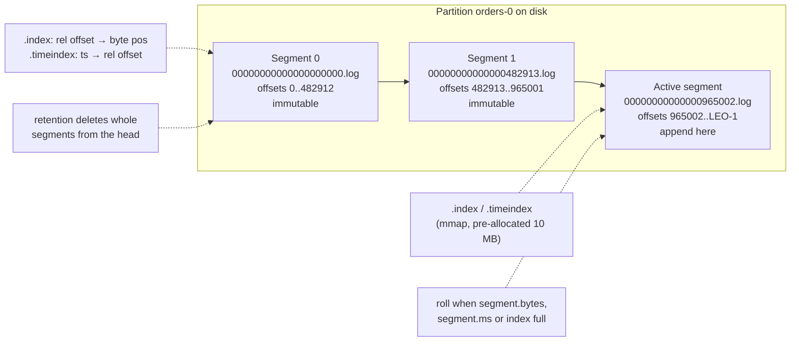
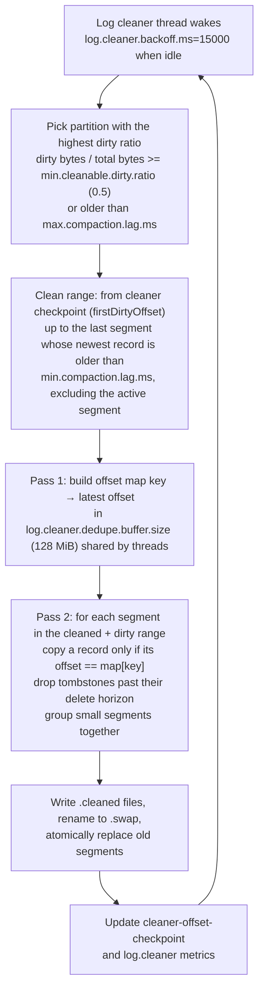
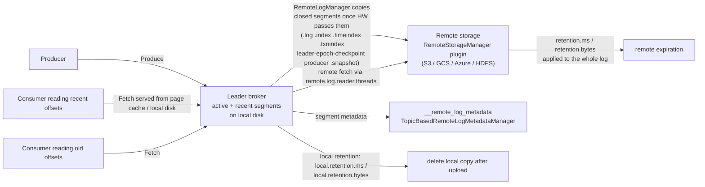
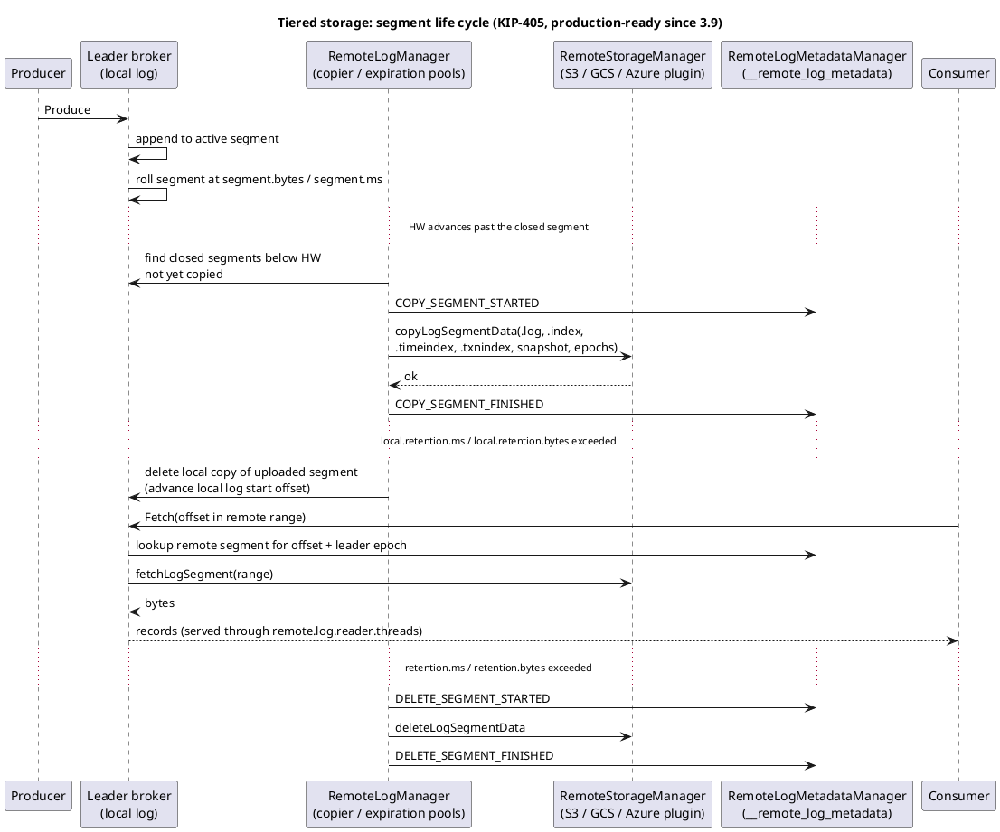

# Storage Internals: Segments, Indexes, Compaction and Tiered Storage

**Roles:** [ARCH] [ADMIN] [DEV]   **Level:** Intermediate
**Prerequisites:** [01-core-concepts.md](01-core-concepts.md), [02-cluster-architecture.md](02-cluster-architecture.md)

## What you will learn
- How a partition is laid out on disk: log directories, segments, `.log`, `.index`, `.timeindex`, `.txnindex`, `.snapshot` and checkpoint files
- When a segment rolls and how offset and timestamp lookups work through sparse indexes
- Why Kafka leans on the OS page cache and `sendfile` instead of its own cache and fsync
- How retention and the two cleanup policies (`delete`, `compact`) work, including the compaction algorithm, tombstones and lag settings
- How tiered storage (KIP-405) splits the log into local and remote parts, and when to use it
- Record batch v2 on disk, compression codec trade-offs, and disk layout best practices (JBOD vs RAID, XFS, multiple log dirs)

## 1. Concept

### 1.1 Log directories and partition directories

Each broker has one or more **log directories** (`log.dirs`, comma-separated; the older single-valued `log.dir` defaults to `/tmp/kafka-logs` and must be changed). Each partition replica the broker hosts lives in exactly one log directory, in a folder named `<topic>-<partition>`:

```
/var/lib/kafka/data-1/
  meta.properties                       cluster.id, node.id, directory.id (KIP-858, 3.7+)
  recovery-point-offset-checkpoint      last offset flushed to disk per partition
  replication-offset-checkpoint         high watermark per partition
  log-start-offset-checkpoint           log start offset per partition
  cleaner-offset-checkpoint             how far the cleaner has compacted per partition
  orders-0/
    00000000000000000000.log            segment: records from offset 0
    00000000000000000000.index          offset index for that segment
    00000000000000000000.timeindex      timestamp index
    00000000000000000000.txnindex       aborted-transaction index (only if transactions were used)
    00000000000000482913.log            next segment starts at offset 482913
    00000000000000482913.index
    00000000000000482913.timeindex
    00000000000000482913.snapshot       producer state snapshot at that offset
    leader-epoch-checkpoint             (epoch, start offset) pairs
    partition.metadata                  topic id (since 2.8, KIP-516)
  __cluster_metadata-0/                 only on controllers, or brokers using log.dirs for metadata
```

File names are the **base offset** of the segment, zero-padded to 20 digits so they sort lexically. The **active segment** is the last one; only it is written to. All older segments are immutable and are the units that retention deletes and compaction rewrites.

When a broker has several log directories, a new partition replica is placed in the directory with the **fewest partitions** (not the most free space). Since 3.7 (KIP-858) each directory has a `directory.id` recorded in metadata, so the controller knows which directory a replica lives in and can fail over only the partitions on a failed disk instead of the whole broker.

### 1.2 Segment layout



A `.log` file is nothing but a sequence of v2 record batches, exactly as they arrived from the producer (chapter 01, section 2.1), with `baseOffset` and `partitionLeaderEpoch` filled in by the leader. There is no per-record framing beyond the batch; there is no B-tree; there is no in-place update.

### 1.3 Why a log on the page cache beats a database file

Kafka's storage design rests on three facts about disks and operating systems:

1. Sequential writes and reads are fast on both HDD and SSD; random I/O is not. Appending to a segment is sequential; a fetch is a sequential read of a range.
2. The OS page cache is a better cache than anything a JVM can build: it is shared across processes, survives broker restarts (as long as the machine stays up), uses all free RAM automatically, and is written back by the kernel's writeback threads.
3. `sendfile(2)` can move data from page cache to socket without entering user space. A consumer reading recent data costs the broker almost no CPU and no heap.

Consequences for operators: give brokers modest JVM heaps (indicative: 6-8 GB is common even on 64 GB machines) and leave the rest to the page cache; watch for consumers that read old data (cold reads evict the hot set); keep the OS from swapping (`vm.swappiness=1`) and tune writeback (`vm.dirty_background_ratio`, `vm.dirty_ratio`) so flushes are smooth rather than bursty.

## 2. How it works internally

### 2.1 Append path and segment roll

On a Produce request the I/O thread:

1. Validates the batch (CRC, magic, optional timestamp bounds, `max.message.bytes`), assigns offsets, and, if the topic uses `LogAppendTime`, rewrites the batch timestamp.
2. Appends the bytes to the active segment's `FileChannel` (this is a write into the page cache, not to disk).
3. Every `log.index.interval.bytes` (default 4096) of appended data, adds one entry to `.index` and, if the batch's max timestamp is larger than the last indexed one, to `.timeindex`.
4. Updates producer state (last sequence per producer id) for idempotence and the aborted-transaction index if applicable.
5. Advances the LEO; if this replica is the leader, the HW is updated as followers fetch (chapter 02).

The active segment is **rolled** (closed and a new one opened) when any of the following is true:

| Condition | Setting (topic / broker) | Default |
|-----------|--------------------------|---------|
| Segment size reached | `segment.bytes` / `log.segment.bytes` | 1073741824 (1 GiB) |
| Segment age reached (measured from the first record's timestamp or creation time) | `segment.ms` / `log.roll.hours`, plus jitter `segment.jitter.ms` / `log.roll.jitter.ms` | 7 days / 0 |
| Offset index or time index full | `segment.index.bytes` / `log.index.size.max.bytes` | 10485760 (10 MiB, fits 1,310,720 offset entries) |
| Relative offset would overflow `Int32` | fixed | offset - baseOffset > 2^31 - 1 |
| Record batch does not fit in remaining `segment.bytes` | fixed | |

Rolling is cheap: it closes the previous files, trims their pre-allocated indexes, and creates new files. Rolling too often (small `segment.bytes` on high-throughput topics) inflates file counts and open file handles; rolling too rarely (huge segments on low-throughput topics) delays retention, because a segment cannot be deleted until it is closed *and* its newest record is past retention.

> **Production tip:** For low-volume topics with short retention (say `retention.ms=3600000`) set `segment.ms` to a fraction of the retention (for example 15 minutes) or retention will lag by the default 7-day roll interval.

### 2.2 Index files and lookups

Both indexes are **sparse** and memory-mapped:

| File | Entry | Size | Lookup |
|------|-------|------|--------|
| `.index` | (relative offset: int32, physical position: int32) | 8 bytes per entry | Binary search for the largest indexed offset <= target, then scan the `.log` forward from that byte position batch by batch. |
| `.timeindex` | (timestamp: int64, relative offset: int32) | 12 bytes per entry | Binary search for the first entry with timestamp >= target, then use `.index` to find the position, then scan. Used by `offsetsForTimes` (`ListOffsets` with a timestamp) and time-based retention. |
| `.txnindex` | aborted transaction (producer id, first offset, last offset, last stable offset) | 24 bytes | Lets `read_committed` consumers skip aborted batches without scanning. |

Relative offsets (offset minus segment base offset) keep entries at 4 bytes and are why a segment cannot span more than 2^31 offsets. Because entries are added only every `log.index.interval.bytes`, a fetch at an arbitrary offset scans at most about 4 KB of log to find the exact batch; the index stays small enough to mmap for every open segment.

A fetch for offset N on partition P therefore costs: find the segment whose base offset is the largest <= N (a `ConcurrentSkipListMap` in memory), binary search in that segment's `.index`, one small sequential scan, then `sendfile` from the found position up to `max.partition.fetch.bytes`/`fetch.max.bytes` or the HW, whichever comes first.

### 2.3 Flushing, fsync and why replication is the durability mechanism

Kafka does **not** fsync every write. The relevant settings are:

| Setting | Default | Meaning |
|---------|---------|---------|
| `log.flush.interval.messages` / `flush.messages` | `Long.MAX_VALUE` | Force fsync after this many messages on a partition. |
| `log.flush.interval.ms` / `flush.ms` | null (falls back to `log.flush.scheduler.interval.ms`, `Long.MAX_VALUE`) | Force fsync after this much time. |
| `log.flush.offset.checkpoint.interval.ms` | 60000 | How often `recovery-point-offset-checkpoint` is written. |
| `log.flush.start.offset.checkpoint.interval.ms` | 60000 | How often `log-start-offset-checkpoint` is written. |

With defaults, data reaches disk when the kernel's writeback decides, when a segment rolls (closed segments are flushed), or on clean shutdown. A crash can lose the unflushed tail *on that replica*, but the recovery procedure on restart (replay from the recovery point, rebuild indexes, truncate to the last valid batch using CRCs) makes the log consistent again, and the replica then re-fetches whatever it lost from the leader. Durability of acknowledged data comes from **`acks=all` with `min.insync.replicas>=2`**: the data is in the page cache of at least two independent machines before the producer hears back. Two machines losing power at the same instant is the failure Kafka does not protect against by default; a rack-aware layout across availability zones makes that improbable, and per-topic `flush.messages=1` is the (expensive) option if you need it.

> **Anti-pattern:** Setting `log.flush.interval.messages=1` cluster-wide "for safety". It turns every append into a synchronous fsync, cuts throughput by an order of magnitude on most disks, and still does not protect against the correlated failures that replication does.

The one place Kafka *does* fsync eagerly is the KRaft metadata log (`__cluster_metadata`): Raft requires that a voter's acknowledgment means the record is durable on that voter, so controllers need low-latency disks.

### 2.4 Retention with `cleanup.policy=delete`

A background thread (`kafka-log-retention`, part of the `background.threads` pool, default 10) runs every `log.retention.check.interval.ms` (default 300000) and for every partition:

1. **Time:** deletes closed segments whose largest timestamp (from `.timeindex`, falling back to file modification time) is older than `retention.ms`.
2. **Size:** while the partition's total size exceeds `retention.bytes`, deletes the oldest segment. Note `retention.bytes` is **per partition**; a topic with 12 partitions and `retention.bytes=1073741824` can occupy 12 GiB per replica.
3. **Log start offset:** deletes segments entirely below the log start offset, which can be advanced by `DeleteRecords` (`kafka-delete-records.sh`).

Deletion renames the files with a `.deleted` suffix, then removes them after `log.segment.delete.delay.ms` (default 60000) so in-flight reads finish. The active segment is never deleted, even if every record in it is expired.

### 2.5 Log compaction (`cleanup.policy=compact`)

Compaction keeps at least the **latest record for every key** and removes older records with the same key. It provides a changelog-as-table semantics: consumers that read from the beginning get the current state of every key. It is what `__consumer_offsets`, Kafka Streams changelogs, Connect's config/offset/status topics and CDC "current state" topics rely on.



Key mechanics:

- The log is split into a **clean** head (already compacted, at most one record per key) and a **dirty** tail (appended since the last clean). The boundary is the checkpointed `firstDirtyOffset`.
- The **dirty ratio** is dirty bytes divided by total bytes. A partition is eligible when the ratio is at least `min.cleanable.dirty.ratio` (default 0.5). Lower values compact more often, cost more I/O, and keep less garbage.
- The **offset map** is built over the dirty range only, but pass 2 rewrites clean *and* dirty segments, because an old clean record may now be superseded. The map's capacity (`log.cleaner.dedupe.buffer.size`, default 134217728 bytes, divided among `log.cleaner.threads`, default 1, at load factor `log.cleaner.io.buffer.load.factor`, 0.9) bounds how many keys one round can handle; with 24-byte entries (MD5 of key plus offset) a 128 MiB buffer covers about 5 million keys per round. If the dirty range has more distinct keys, the cleaner compacts as far as fits and picks up the rest next round.
- **Offsets are preserved.** Compaction never renumbers; gaps appear in the offset sequence. Consumers must tolerate non-contiguous offsets (all official clients do).
- **Tombstones**: a record with a `null` value marks the key as deleted. Compaction keeps a tombstone long enough for consumers to see it, then removes it. The retention window is `delete.retention.ms` (default 86400000, 24 h) measured from when the tombstone entered the clean section; newer brokers stamp a delete horizon into the batch header (the `hasDeleteHorizonMs` attribute bit) so the horizon survives further cleanings. A consumer that is offline for longer than `delete.retention.ms` may miss the delete and keep a stale key.
- `min.compaction.lag.ms` (default 0) keeps a record uncompacted for at least that long after it was written, guaranteeing that consumers that are less than this lag behind see every version. `max.compaction.lag.ms` (default `Long.MAX_VALUE`) forces a segment to become eligible after that long even if the dirty ratio is low; use it when compliance requires deleted keys to actually disappear within a deadline.
- `cleanup.policy=compact,delete` applies both: keys are deduplicated *and* segments older than `retention.ms` are dropped. Useful for keyed topics where very old keys are not needed.
- The active segment is never compacted, and a record must be in a *rolled* segment to be eligible. On a low-volume compacted topic, set `segment.ms` accordingly or compaction never happens.
- Compaction requires keys: a `null` key on a compacted topic is rejected by the broker with `InvalidRecordException` ("Compacted topic cannot accept message without key").

Cleaner metrics to watch: `kafka.log:type=LogCleanerManager,name=max-dirty-percent`, `kafka.log:type=LogCleanerManager,name=time-since-last-run-ms`, `kafka.log:type=LogCleaner,name=max-buffer-utilization-percent` (near 100 means the dedupe buffer is too small), `kafka.log:type=LogCleaner,name=cleaner-recopy-percent`, `kafka.log:type=LogCleaner,name=max-clean-time-secs`, and `kafka.log:type=LogCleanerManager,name=uncleanable-partitions-count` (a partition is marked uncleanable after a cleaning error, typically a corrupted segment).

### 2.6 Tiered storage (KIP-405)

Tiered storage was early access in 3.6 and declared production-ready in 3.9. It splits each partition's log into a **local** part on broker disks and a **remote** part in object storage (S3, GCS, Azure Blob, HDFS, or anything with a `RemoteStorageManager` plugin). Brokers keep serving all reads; cold reads are fetched from remote storage on demand.



How it works:

1. The leader's `RemoteLogManager` periodically (`remote.log.manager.task.interval.ms`, default 30000) finds closed segments whose end offset is below the HW and that have not been uploaded, and copies the segment plus its indexes, producer snapshot and leader epoch state to remote storage. Since 3.9 the copy and expiration work run in separate pools (`remote.log.manager.copier.thread.pool.size`, `remote.log.manager.expiration.thread.pool.size`).
2. It records the segment's metadata (offsets, epochs, remote id, state) through the `RemoteLogMetadataManager`; the default implementation stores it in the internal topic `__remote_log_metadata` so every replica can learn it.
3. Local segments are deleted once they are uploaded **and** past `local.retention.ms` / `local.retention.bytes` (topic-level, default -2 meaning "same as `retention.ms`/`retention.bytes`", so you must set them for tiering to shorten local retention).
4. `retention.ms` / `retention.bytes` now describe the total (local plus remote) log. Remote segments past retention are deleted by the expiration task.
5. A consumer fetch for an offset below the local log start offset is served by reading the remote segment through `remote.log.reader.threads` (default 10). Only the leader serves remote reads. Responses are bounded by `remote.log.reader.max.pending.tasks` and the remote fetch limits.
6. Followers replicate only the local part; when a follower falls behind past the local log start offset it uses the remote metadata (leader epoch state) to skip ahead rather than re-download everything. This is why a broker with tiered storage can be replaced or expanded far faster: it only needs to sync the local window.

Constraints (as of 4.0): compacted topics cannot be tiered (`cleanup.policy` must be `delete`); the internal topics and `__cluster_metadata` are never tiered; `remote.storage.enable` can be turned off again per topic since 3.9 (KIP-950) with `remote.log.disable.policy`. Transactional data works (the `.txnindex` is uploaded). JBOD with tiered storage is supported since 3.9. The plugin JARs and their credentials live on every broker (`remote.log.storage.manager.class.path`).

The sequence below (source: `diagrams/03-storage-internals-tiered-storage.puml`) shows a segment's life with tiered storage enabled.



**When to use tiered storage:** long retention (weeks to years) with mostly-recent reads; fast broker replacement and scaling; cost reduction when object storage is far cheaper than broker-attached disk. **When not to:** compacted topics, workloads that routinely read the entire history (remote reads are slower and pay egress), latency-critical consumers that must never be served from remote, or environments without reliable object storage.

### 2.7 Compression codecs

Compression is applied per batch by the producer (`compression.type`) and preserved end-to-end by default (topic `compression.type=producer`). If the topic sets a specific codec, the leader decompresses and recompresses, which costs CPU and defeats zero-copy for that topic.

| Codec | Ratio (indicative, JSON payloads) | Compress CPU | Decompress CPU | Notes |
|-------|-----------------------------------|--------------|----------------|-------|
| `none` | 1.0 | none | none | Best when payloads are already compressed (images, encrypted data). |
| `gzip` | best of the classic codecs | high | moderate | Levels tunable via `compression.gzip.level` (3.8, KIP-390); good for archival topics where storage dominates. |
| `snappy` | moderate | low | low | Historic default choice for balanced throughput; no level. |
| `lz4` | moderate, slightly better than snappy | very low | very low | Fastest decompression; `compression.lz4.level` since 3.8. Common recommendation for throughput. |
| `zstd` | close to gzip | low-moderate | low | Since 2.1 (KIP-110); `compression.zstd.level` since 3.8. Usually the best ratio-per-CPU. Requires clients >= 2.1. |

Compression ratio depends heavily on batch size: a batch with one 200-byte JSON record barely compresses; a 64 KB batch of similar records compresses several times over. Tune `linger.ms` and `batch.size` together with the codec (chapter 04). Producer-side compression is not entirely free for brokers either: the leader decompresses batches on the produce path to validate records (offsets, sizes, timestamps) before appending the original compressed bytes, but that is far cheaper than recompressing, and followers and consumers receive the original bytes untouched.

## 3. Configuration that matters

| Parameter (topic / broker) | Default | Recommended | Why |
|----------------------------|---------|-------------|-----|
| `log.dirs` | (`log.dir=/tmp/kafka-logs`) | One directory per physical disk, on XFS, never `/tmp` | Spread I/O; `/tmp` is wiped on reboot. |
| `segment.bytes` / `log.segment.bytes` | 1073741824 | Default; 256 MiB to 512 MiB for topics with short retention | Retention and compaction operate per segment. |
| `segment.ms` / `log.roll.hours` | 7 days | A fraction of `retention.ms` on low-volume topics | Otherwise retention lags by up to 7 days. |
| `retention.ms` / `log.retention.hours` | 168 h | Per topic, from the replay requirement | Storage budget. |
| `retention.bytes` / `log.retention.bytes` | -1 | Set as a safety cap per partition on shared clusters | Bounds a runaway producer. Remember it is per partition. |
| `cleanup.policy` / `log.cleanup.policy` | `delete` | `compact` for state/changelog topics, `compact,delete` for keyed data with a time bound | Semantics of the topic. |
| `min.cleanable.dirty.ratio` / `log.cleaner.min.cleanable.ratio` | 0.5 | 0.5; lower (0.1-0.3) for topics where read-from-beginning time matters more than cleaner I/O | Compaction frequency vs I/O. |
| `delete.retention.ms` / `log.cleaner.delete.retention.ms` | 86400000 | At least the longest expected consumer outage | Tombstone visibility. |
| `min.compaction.lag.ms` / `log.cleaner.min.compaction.lag.ms` | 0 | Set when consumers must see every version within a window | Delays compaction of fresh data. |
| `max.compaction.lag.ms` / `log.cleaner.max.compaction.lag.ms` | `Long.MAX_VALUE` | Set for GDPR-style deletion deadlines | Forces cleaning regardless of dirty ratio. |
| `log.cleaner.threads` | 1 | 2-4 on brokers with many compacted partitions | Parallel compaction. |
| `log.cleaner.dedupe.buffer.size` | 134217728 | Raise if `max-buffer-utilization-percent` is near 100 | Keys per cleaning round. Divided among cleaner threads. |
| `log.cleaner.io.max.bytes.per.second` | `Double.MAX_VALUE` | Throttle on I/O-bound brokers | Protect producers/consumers from cleaner bursts. |
| `log.index.interval.bytes` / `index.interval.bytes` | 4096 | Default | Index density vs scan length. |
| `log.flush.interval.messages`, `log.flush.interval.ms` | `Long.MAX_VALUE`, null | Leave unset; rely on replication | fsync per write is prohibitively slow. |
| `log.retention.check.interval.ms` | 300000 | Default | Retention granularity in time. |
| `log.segment.delete.delay.ms` | 60000 | Default | Grace period for in-flight reads. |
| `remote.log.storage.system.enable` | `false` | `true` when tiering | Cluster-wide switch. |
| `remote.storage.enable` (topic) | `false` | `true` on selected topics | Per-topic tiering. |
| `local.retention.ms` / `local.retention.bytes` (topic) | -2 | Hours to a few days / a size that fits the hot set in page cache and local disk | Local window when tiering. |
| `remote.log.metadata.manager.class.name` | `TopicBasedRemoteLogMetadataManager` | Default | Metadata in `__remote_log_metadata`. |
| `remote.log.reader.threads` | 10 | Scale with concurrent cold readers | Remote fetch parallelism. |
| `message.max.bytes` / `max.message.bytes` | 1048588 | Keep near 1 MB | Larger batches must also fit `replica.fetch.max.bytes` and consumer fetch limits. |

## 4. Failure modes and how to detect them

| Symptom | Likely cause | Metric / log to check | Fix |
|---------|--------------|-----------------------|-----|
| Disk full on one broker while others are fine | Partition imbalance across brokers or log dirs, or a hot partition | `kafka.log:type=Log,name=Size,topic=*,partition=*`; `kafka-log-dirs.sh --describe` | Reassign partitions; enable `retention.bytes` caps; consider tiered storage. |
| Broker marks a log dir offline, partitions move or go offline | Disk I/O error | `kafka.server:type=ReplicaManager,name=OfflineReplicaCount`, `kafka.log:type=LogManager,name=OfflineLogDirectoryCount`, `server.log` "Stopping serving logs in dir" | Replace the disk; with JBOD and KIP-858 the controller fails over only affected replicas. |
| Retention does not free space | Segment not rolled (`segment.ms` at 7 days), far-future timestamps, or `retention.bytes` per partition misunderstood | `kafka-dump-log.sh --files ... --print-data-log \| head`; `.timeindex` last entry | Lower `segment.ms`; bound timestamps (KIP-937) or use `LogAppendTime`. |
| Compacted topic grows without bound | Cleaner not running or too slow: dedupe buffer full, single cleaner thread, `uncleanable-partitions-count` > 0 | `max-dirty-percent`, `time-since-last-run-ms`, `max-buffer-utilization-percent`, `log-cleaner.log` | Add cleaner threads and buffer; fix corrupt segment (delete the partition replica and let it re-replicate). |
| Consumers miss deletes on a compacted topic | Consumer offline longer than `delete.retention.ms` | Consumer lag history | Raise `delete.retention.ms`; treat missing keys as deletes when rebuilding state. |
| Producer error "Compacted topic cannot accept message without key" | `null` key on `cleanup.policy=compact` | Producer logs | Always set keys on compacted topics. |
| High `LocalTimeMs` for Produce, page cache misses | Consumers reading old data evict the hot set, or too little RAM | `vmstat`, `sar -B`, iostat, `kafka.network:type=RequestMetrics,name=LocalTimeMs,request=Produce` | More RAM, tiered storage for cold reads, throttle backfill consumers with quotas. |
| Slow restart, "Loading logs" for minutes | Unclean shutdown forces recovery of every segment past the recovery point; many partitions and small segments | `server.log` "Recovering unflushed segment" | Use controlled shutdown; increase `num.recovery.threads.per.data.dir` (default 1). |
| Remote fetches fail or are slow after enabling tiering | Plugin misconfigured, credentials, `__remote_log_metadata` under-replicated | `kafka.server:type=BrokerTopicMetrics,name=RemoteFetchRequestsPerSec`, `RemoteFetchErrorsPerSec`, `RemoteCopyLagBytes`, `RemoteCopyLagSegments`, `RemoteDeleteLagBytes` | Validate plugin config on every broker; check object store throttling. |
| Offsets are not contiguous when consuming | Compaction removed records, or transactions aborted | Expected behaviour | Do not assume `offset+1`; use returned offsets. |

## 5. Design guidance (architect view)

### 5.1 Disk layout

| Choice | Guidance |
|--------|----------|
| File system | XFS is the community recommendation (fast large-file appends, good parallel allocation). ext4 works. Mount with `noatime`. Avoid network file systems. |
| JBOD vs RAID | JBOD (one `log.dirs` entry per disk) is preferred since KRaft JBOD support (3.7, KIP-858): replication already provides redundancy, JBOD gives full capacity and per-disk failover. RAID 10 halves capacity and used to be chosen only to avoid broker-wide failure on one disk, which KIP-858 addresses. Never RAID 5/6 (write penalty). |
| Multiple log dirs | Partition placement is by partition count, not size, so mixed-size partitions can leave disks unbalanced; use `kafka-reassign-partitions.sh` with `--replica-alter-log-dirs` to move replicas between directories on the same broker. |
| Disk type | NVMe/SSD for latency-sensitive workloads and for controllers; HDD can still serve sequential-heavy workloads if page cache holds the hot set. Cloud: prefer network volumes with provisioned throughput; instance-local NVMe is fast but ephemeral. |
| Capacity planning | `replicas x ingest_rate x retention` plus 20-30 % head-room for segment roll, compaction rewrite space (the cleaner needs room for the `.cleaned` copy) and `.deleted` grace files. |
| Page cache | Size RAM for the hot set: `ingest_rate x consumer_lag_window` for all partitions on the broker. |

### 5.2 Decision table: cleanup policy and tiering

| Topic type | `cleanup.policy` | Retention | Tiered? |
|------------|------------------|-----------|---------|
| Event stream (clickstream, telemetry) | `delete` | Days to weeks | Yes if retention is long |
| Change log / entity state | `compact` | n/a (keys live forever) | No (unsupported) |
| Keyed state with expiry (sessions) | `compact,delete` | `retention.ms` = expiry | No |
| Audit / compliance archive | `delete` | Months to years | Yes |
| Stream-processing repartition topics | `delete` | Short (hours); Streams purges explicitly | No |

> **Anti-pattern:** Using one giant segment size (`segment.bytes` at several GiB) to "reduce file count" on compacted topics. The cleaner rewrites whole segments and needs equal free space; large segments also delay when records become eligible.

> **Production tip:** Alert on `uncleanable-partitions-count > 0` and `time-since-last-run-ms` on brokers hosting `__consumer_offsets`; if that topic stops compacting, group coordinator load times after failover grow from seconds to minutes.

## 6. Hands-on

```bash
# Where is what? Log directory usage per broker and partition
kafka-log-dirs.sh --bootstrap-server localhost:9092 --describe --topic-list orders

# Segment files on a broker
ls -la /var/lib/kafka/data-1/orders-0/

# Decode a segment, index and time index
kafka-dump-log.sh --files /var/lib/kafka/data-1/orders-0/00000000000000000000.log --print-data-log | head -20
kafka-dump-log.sh --files /var/lib/kafka/data-1/orders-0/00000000000000000000.index
kafka-dump-log.sh --files /var/lib/kafka/data-1/orders-0/00000000000000000000.timeindex
kafka-dump-log.sh --files /var/lib/kafka/data-1/orders-0/00000000000000000000.snapshot   # producer state

# Create a compacted topic with tuned cleaner settings
kafka-topics.sh --bootstrap-server localhost:9092 --create --topic customer-state \
  --partitions 6 --replication-factor 3 \
  --config cleanup.policy=compact \
  --config min.cleanable.dirty.ratio=0.3 \
  --config delete.retention.ms=172800000 \
  --config min.compaction.lag.ms=60000 \
  --config segment.ms=3600000 \
  --config segment.bytes=268435456

# Write a value and then a tombstone for the same key
printf 'cust-1:{"tier":"gold"}\n' | kafka-console-producer.sh --bootstrap-server localhost:9092 \
  --topic customer-state --property parse.key=true --property key.separator=:
printf 'cust-1:NULL\n' | kafka-console-producer.sh --bootstrap-server localhost:9092 \
  --topic customer-state --property parse.key=true --property key.separator=: --property null.marker=NULL

# Change retention on an existing topic and force faster rolling
kafka-configs.sh --bootstrap-server localhost:9092 --alter --entity-type topics --entity-name orders \
  --add-config retention.ms=86400000,segment.ms=900000

# Delete records below an offset (advances log start offset)
cat > /tmp/delete.json <<'JSON'
{"partitions":[{"topic":"orders","partition":0,"offset":100000}],"version":1}
JSON
kafka-delete-records.sh --bootstrap-server localhost:9092 --offset-json-file /tmp/delete.json

# Enable tiered storage on a topic (cluster must have remote.log.storage.system.enable=true
# and a RemoteStorageManager plugin configured on every broker)
kafka-configs.sh --bootstrap-server localhost:9092 --alter --entity-type topics --entity-name orders \
  --add-config remote.storage.enable=true,local.retention.ms=21600000,retention.ms=7776000000

# Move a replica to another log directory on the same broker
cat > /tmp/move.json <<'JSON'
{"version":1,"partitions":[{"topic":"orders","partition":0,"replicas":[101,102,103],
 "log_dirs":["/var/lib/kafka/data-2","any","any"]}]}
JSON
kafka-reassign-partitions.sh --bootstrap-server localhost:9092 --reassignment-json-file /tmp/move.json --execute
```

Broker-side settings for tiered storage (example with a hypothetical S3 plugin; class names depend on the plugin you deploy):

```properties
remote.log.storage.system.enable=true
remote.log.storage.manager.class.name=<vendor>.S3RemoteStorageManager
remote.log.storage.manager.class.path=/opt/kafka/plugins/tiered-storage/*
remote.log.metadata.manager.class.name=org.apache.kafka.server.log.remote.metadata.storage.TopicBasedRemoteLogMetadataManager
remote.log.metadata.manager.listener.name=REPLICATION
rlmm.config.remote.log.metadata.topic.replication.factor=3
remote.log.reader.threads=10
remote.log.manager.copier.thread.pool.size=10
remote.log.manager.expiration.thread.pool.size=10
```

## 7. Interview questions for this chapter

### Q1. What files make up a partition on disk and what is each for?
**Role:** [ADMIN] | **Difficulty:** ★☆☆ | **Topic:** Storage layout

**Answer.**
A partition directory `<topic>-<partition>` holds segments named by base offset: `.log` (the record batches), `.index` (sparse relative-offset to byte-position map), `.timeindex` (timestamp to relative offset), optionally `.txnindex` (aborted transactions for `read_committed` readers) and `.snapshot` (producer id/sequence state for idempotence recovery). The directory also has `leader-epoch-checkpoint` for truncation safety and `partition.metadata` with the topic id. Only the last segment is written; older segments are immutable and are the unit of retention and compaction.

**Follow-up probes.** Why are file names 20 digits? Why is the index sparse instead of one entry per record?

### Q2. How does the broker find offset 1,234,567 in a partition?
**Role:** [DEV] | **Difficulty:** ★★☆ | **Topic:** Indexes

**Answer.**
It looks up the segment with the greatest base offset not exceeding the target in an in-memory sorted map, binary-searches that segment's memory-mapped `.index` for the greatest entry at or below the relative offset, jumps to that byte position in the `.log`, and scans forward batch by batch, at most about `log.index.interval.bytes` (4096) of data, until it reaches the batch containing the offset. From there the fetch response is a `sendfile` of the following bytes up to the fetch size or the high watermark. Timestamp lookups do the same through `.timeindex` first.

**Follow-up probes.** What happens if the index is corrupt after a crash? How big can a segment get before the relative offset overflows?

### Q3. Kafka does not fsync on every write. How can it claim durability?
**Role:** [ARCH] | **Difficulty:** ★★☆ | **Topic:** Flush and replication

**Answer.**
Durability of acknowledged data comes from replication, not fsync: with `acks=all` and `min.insync.replicas=2` a write is acknowledged only after it sits in the page cache of at least two brokers, and rack awareness puts them in different failure domains. If one broker loses power, recovery truncates its log to the last valid batch and re-fetches from the leader. Per-write fsync (`log.flush.interval.messages=1`) would cut throughput by an order of magnitude and still not protect against correlated failures such as a bad deploy. The exception is the KRaft metadata log, which Raft requires to be fsynced before a voter acknowledges.

**Follow-up probes.** What would you configure for a topic whose data must survive a simultaneous two-AZ power loss? How does `recovery-point-offset-checkpoint` speed up restarts?

### Q4. Explain the log compaction algorithm and the role of the dirty ratio.
**Role:** [ADMIN] | **Difficulty:** ★★★ | **Topic:** Compaction

**Answer.**
The cleaner thread picks the partition with the highest dirty ratio (bytes appended since the last clean divided by total bytes) that is at least `min.cleanable.dirty.ratio` (0.5), builds an in-memory map of key to latest offset over the dirty range (bounded by `log.cleaner.dedupe.buffer.size`), then rewrites clean and dirty segments keeping only records whose offset matches the map, dropping tombstones past `delete.retention.ms`, and swaps the new segments in atomically. Offsets are preserved so gaps appear. The active segment and anything younger than `min.compaction.lag.ms` are excluded; `max.compaction.lag.ms` forces eligibility for compliance deadlines. A lower dirty ratio means more frequent cleaning and less garbage at the cost of I/O.

**Follow-up probes.** What limits the number of keys per cleaning round? What does a consumer that was offline two days see for a key deleted yesterday?

### Q5. Why does retention sometimes keep data far longer than `retention.ms`?
**Role:** [ADMIN] | **Difficulty:** ★★☆ | **Topic:** Retention

**Answer.**
Retention works on closed segments, using the largest timestamp in each. Three common causes: the active segment is never deleted and by default rolls only at 1 GiB or 7 days (`segment.bytes`, `segment.ms`), so a low-volume topic keeps data up to a week beyond retention; a single record with a far-future `CreateTime` pins its whole segment; and `retention.bytes` is per partition, so operators underestimate the total. Fixes are a smaller `segment.ms`, timestamp bounds via `log.message.timestamp.after.max.ms` or `LogAppendTime`, and sizing by partition count.

**Follow-up probes.** Does `kafka-delete-records.sh` free disk immediately? What is `log.segment.delete.delay.ms` for?

### Q6. What does tiered storage change about the broker's job, and what are its limits?
**Role:** [ARCH] | **Difficulty:** ★★★ | **Topic:** Tiered storage

**Answer.**
With KIP-405 (production-ready in 3.9) the leader uploads closed segments below the HW to object storage through a `RemoteStorageManager`, records their metadata in `__remote_log_metadata`, and deletes local copies after `local.retention.ms`/`local.retention.bytes`; `retention.ms` now governs the combined log. Recent reads still hit the page cache; old reads are proxied from remote storage by the leader's reader threads, with higher latency. Followers only replicate the local window, so scaling and replacing brokers becomes fast and retention becomes cheap. Limits: no compacted topics, only the leader serves remote reads, remote read latency and egress cost, and the plugin plus credentials must be deployed identically on every broker.

**Follow-up probes.** What happens to a consumer that reads the whole history every day? How does a new follower catch up when the local log start offset is beyond its position?

### Q7. Compare lz4, zstd and gzip for a high-throughput JSON topic.
**Role:** [DEV] | **Difficulty:** ★★☆ | **Topic:** Compression

**Answer.**
For throughput-first workloads `lz4` gives the lowest CPU on both producer and consumer with a moderate ratio; `zstd` (since 2.1) achieves close to gzip's ratio at a fraction of gzip's CPU and is the usual best trade-off when network or storage is the constraint; `gzip` compresses best but is slow to compress and should be reserved for archival topics. Since 3.8 (KIP-390) `compression.zstd.level`, `compression.gzip.level` and `compression.lz4.level` tune each codec. Whatever the codec, the ratio depends on batch size, so pair it with `linger.ms` and `batch.size`, and keep the topic at `compression.type=producer` so brokers do not recompress.

**Follow-up probes.** When does the broker decompress a batch? Why can old consumers fail on a zstd topic?

### Q8. JBOD or RAID 10 for Kafka data disks on a 4.0 cluster?
**Role:** [ARCH] | **Difficulty:** ★★☆ | **Topic:** Disk layout

**Answer.**
JBOD, one `log.dirs` entry per disk, is the default answer on 3.7+: replication already provides redundancy, JBOD delivers full capacity and throughput, and with KIP-858 the controller knows which directory each replica is in, so a failed disk fails over only its partitions rather than the whole broker. RAID 10 halves usable capacity and was justified mainly in the ZooKeeper era when one bad disk took the broker down. Use XFS with `noatime`, avoid RAID 5/6 because of write amplification, and remember that partition placement across directories is by count, so watch per-disk balance and use `--replica-alter-log-dirs` reassignments to fix it.

**Follow-up probes.** How does tiered storage change the disk sizing? What happens on a JBOD disk failure during a reassignment?

## Key takeaways
- A partition is a directory of immutable segments plus sparse mmap'd indexes; only the active segment is written and only closed segments can be deleted or compacted.
- Kafka trusts the page cache and `sendfile`; durability is replication with `acks=all` and `min.insync.replicas`, not per-write fsync.
- Retention is segment-granular and timestamp-driven; `segment.ms` matters as much as `retention.ms` on quiet topics.
- Compaction keeps the latest record per key, preserves offsets, and needs `delete.retention.ms`, `min.compaction.lag.ms` and `max.compaction.lag.ms` set deliberately.
- Tiered storage (KIP-405, GA in 3.9) decouples retention from broker disk but not for compacted topics.
- Prefer JBOD on XFS, one directory per disk, and size RAM for the hot set rather than the heap.

## Further reading
- Apache Kafka documentation: "Log Compaction", "Persistence", "Tiered Storage" sections
- KIP-405: Kafka Tiered Storage; KIP-950: Tiered Storage Disablement
- KIP-858: Handle JBOD broker disk failure in KRaft
- KIP-516: Topic Identifiers
- KIP-390: Support Compression Level
- KIP-110: Add Codec for ZStandard Compression
- KIP-354: Add a Maximum Log Compaction Lag; KIP-58: Make Log Compaction Point Configurable
