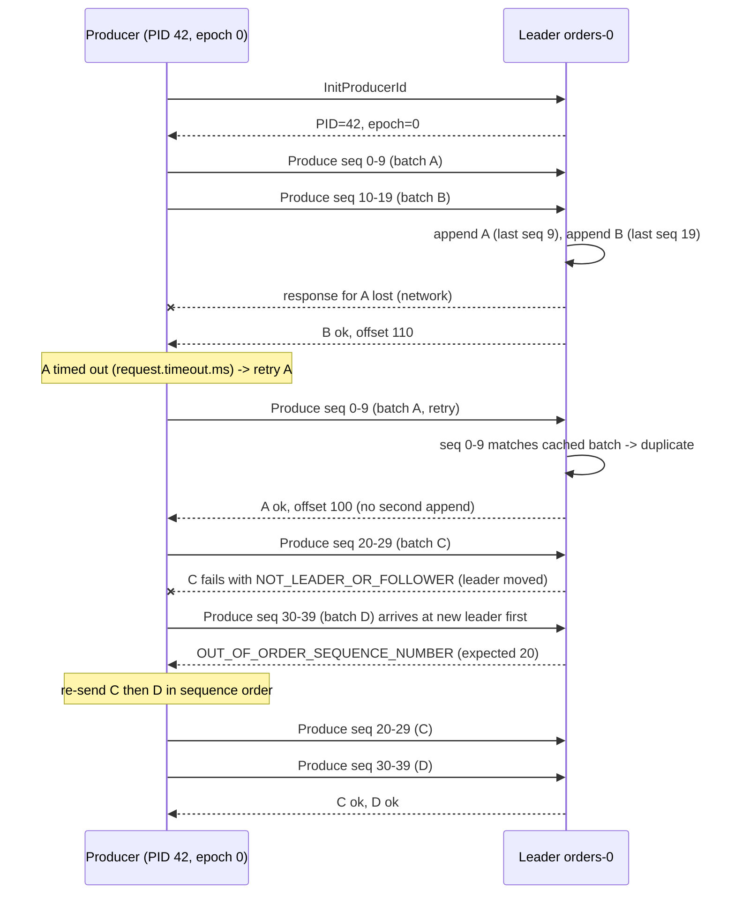
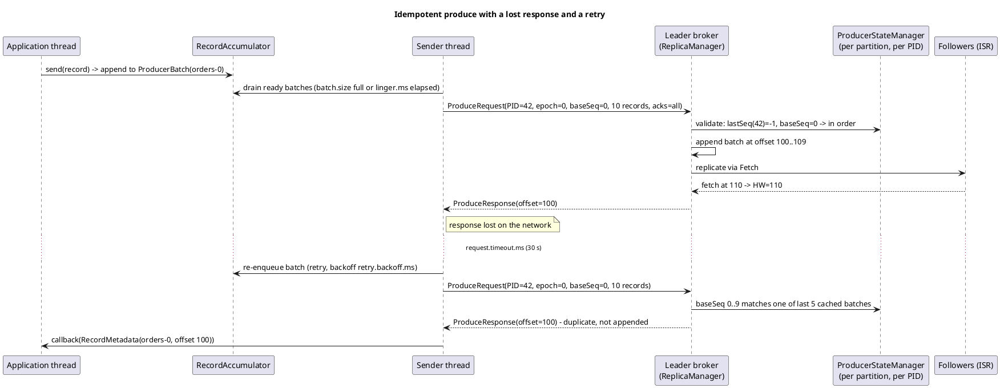

# Producer Internals: Batching, Idempotence and Delivery Guarantees

**Roles:** [ARCH] [ADMIN] [DEV]   **Level:** Intermediate
**Prerequisites:** [01-core-concepts.md](01-core-concepts.md), [02-cluster-architecture.md](02-cluster-architecture.md)

## What you will learn
- The producer pipeline: serializer, partitioner, record accumulator, sender thread, broker
- How `batch.size`, `linger.ms`, `buffer.memory` and `max.block.ms` shape throughput, latency and backpressure
- What `acks` really promises, and how `retries`, `delivery.timeout.ms` and `request.timeout.ms` fit inside one another
- How the idempotent producer (default since 3.0) uses producer ids, epochs and sequence numbers to prevent duplicates and reordering with up to 5 in-flight requests
- Partitioners: the 3.3+ uniform sticky default (KIP-794), round-robin, key hashing, custom
- Compression, metadata refresh, and where transactions fit (details in the developer chapters)

## 1. Concept

### 1.1 The pipeline

```mermaid
flowchart LR
    App["Application thread<br/>send(record, callback)"] --> Int["Interceptors<br/>interceptor.classes"]
    Int --> Ser["Serializers<br/>key.serializer / value.serializer"]
    Ser --> Part["Partitioner<br/>explicit / key hash / uniform sticky"]
    Part --> Acc["RecordAccumulator<br/>buffer.memory=32 MiB<br/>one deque of ProducerBatch per partition<br/>batch.size=16384"]
    Acc -->|"batch ready: full, linger.ms elapsed,<br/>or buffer exhausted"| Snd["Sender thread<br/>groups ready batches by leader broker"]
    Snd --> Net["NetworkClient<br/>max.in.flight.requests.per.connection=5<br/>request.timeout.ms=30000"]
    Net -->|"ProduceRequest per broker<br/>(many partitions per request)"| Brk["Broker (partition leader)"]
    Brk -->|"ProduceResponse: offset / error"| Snd
    Snd -->|"complete future, run callback<br/>on sender thread"| App
    Snd -.->|"retriable error: re-enqueue batch<br/>after retry.backoff.ms"| Acc
    Snd -.->|"metadata stale / NOT_LEADER"| Meta["Metadata refresh<br/>metadata.max.age.ms=300000"]
```

`KafkaProducer.send()` is asynchronous. The calling thread only serializes, partitions and appends to an in-memory buffer; a single background **sender thread** (`kafka-producer-network-thread | <client.id>`) drains the buffer and talks to brokers.



Stages in detail:

| Stage | What happens | Runs on |
|-------|--------------|---------|
| Interceptors | `ProducerInterceptor.onSend` may mutate the record (tracing headers, auditing). | Caller |
| Serialization | Key and value become `byte[]`. Errors here throw synchronously from `send()`. | Caller |
| Partitioning | Explicit partition, key hash, or sticky choice (section 2.3). Waits for metadata for the topic if not cached, up to `max.block.ms`. | Caller |
| Accumulation | The record is appended to the last `ProducerBatch` in the partition's deque; if it does not fit, a new batch is allocated from the `BufferPool`. Size check against `max.request.size` (default 1048576) happens here. | Caller |
| Sending | The sender picks partitions whose batches are ready, groups them by leader, and builds one `ProduceRequest` per broker. Batches are compressed as they are built. | Sender thread |
| Completion | The response completes the `Future<RecordMetadata>` and invokes the callback. Callbacks run on the sender thread, so they must be fast and never block. | Sender thread |

A batch is **ready** when any of: it is full (`batch.size` reached), `linger.ms` has elapsed since the batch was created, the buffer pool is exhausted and another thread is waiting for memory, a retry backoff has elapsed, or `flush()`/`close()` was called.

### 1.2 Batching and latency

| Setting | Default | Meaning |
|---------|---------|---------|
| `batch.size` | 16384 | Maximum bytes per batch per partition. A batch larger than this is sent immediately as a single-record batch; the setting is a cap, not a minimum. |
| `linger.ms` | 0 | How long the sender waits for more records before sending a non-full batch. With 0 the sender sends as soon as it runs, which under load still produces multi-record batches because records arrive faster than the sender loop. |
| `buffer.memory` | 33554432 (32 MiB) | Total memory for unsent batches across all partitions. |
| `max.block.ms` | 60000 | How long `send()` and `partitionsFor()` block when the buffer is full or metadata is unavailable before throwing `TimeoutException`. |
| `max.request.size` | 1048576 | Maximum bytes per record (after serialization) and per request. Must also fit the broker's `message.max.bytes` and the topic's `max.message.bytes`. |
| `compression.type` | `none` | `gzip`, `snappy`, `lz4`, `zstd`. Applied per batch by the sender. |

The intuition: `linger.ms` trades a bounded latency increase for larger batches, which means fewer requests, better compression and higher throughput. On a busy producer, a `linger.ms` of 5-20 ms often *reduces* end-to-end latency because the broker handles fewer, larger requests. `batch.size` should be raised together with `linger.ms` (a 5 ms linger on a 100 MB/s partition would want ~512 KB batches, far beyond the 16 KiB default).

Backpressure is `buffer.memory`: when the accumulator is full, `send()` blocks up to `max.block.ms` and then throws. This is the only point where a slow cluster pushes back on the application thread. Metric: `buffer-available-bytes`, `bufferpool-wait-ratio` (fraction of time threads spend waiting for buffer space), `waiting-threads`.

> **Production tip:** Never call `send().get()` per record in a hot loop. It serializes the pipeline to one in-flight batch and throws away batching. Use callbacks and let the sender pipeline requests.

### 1.3 `acks`

| `acks` | Broker replies when | Durability | Latency | Notes |
|--------|---------------------|------------|---------|-------|
| `0` | Never (fire and forget; the response is not waited on) | None; the record may be lost even without failures if the buffer is discarded | Lowest | Retries are meaningless; `RecordMetadata.offset()` is -1. Idempotence requires `acks=all`, so `acks=0` disables it. |
| `1` | Leader has appended to its local log (page cache) | Lost if the leader fails before followers fetch | Low | Idempotence also requires `acks=all`; with `acks=1` you must set `enable.idempotence=false` explicitly. |
| `all` / `-1` (default since 3.0) | HW has advanced past the batch: all current ISR members have it, and ISR size >= `min.insync.replicas` | Survives `min.insync.replicas - 1` simultaneous failures without loss | One extra follower fetch round trip | The default. Combined with `min.insync.replicas=2` this is the standard durable configuration. |

Decision table:

| Workload | `acks` | `min.insync.replicas` | `enable.idempotence` |
|----------|--------|-----------------------|----------------------|
| Financial / audit / anything replayed downstream | `all` | 2 | `true` |
| Operational metrics where a small loss is acceptable | `1` | n/a | `false` |
| High-volume sampled telemetry, losses tolerated, lowest cost | `0` | n/a | `false` |
| Exactly-once pipeline (Streams, transactional producer) | `all` (forced) | 2 | `true` (forced) |

## 2. How it works internally

### 2.1 Retries and the timeout hierarchy

Since 2.1 (KIP-91) the meaningful bound is `delivery.timeout.ms`; `retries` is effectively unlimited by default and the producer stops retrying when the delivery timeout expires.

| Setting | Default | Scope |
|---------|---------|-------|
| `delivery.timeout.ms` | 120000 | Upper bound from `send()` returning to the callback firing, including linger, in-flight time and all retries. Must be >= `linger.ms + request.timeout.ms`. |
| `request.timeout.ms` | 30000 | How long the sender waits for one `ProduceResponse` before considering the request failed (and retrying). |
| `retries` | 2147483647 | Number of retries; in practice bounded by `delivery.timeout.ms`. |
| `retry.backoff.ms` / `retry.backoff.max.ms` | 100 / 1000 | Exponential backoff with jitter between retries (KIP-580, 3.7). |
| `max.in.flight.requests.per.connection` | 5 | Unacknowledged requests per broker connection. With idempotence, at most 5 are allowed and ordering is still preserved. |
| `max.block.ms` | 60000 | Blocking time inside `send()` itself (metadata or buffer). Not part of `delivery.timeout.ms`. |

```
send() returns  ── linger ──▶ in flight ─ request.timeout ─▶ retry ─▶ ... ─▶ callback
|◀──────────────────────────── delivery.timeout.ms (120 s) ───────────────────────▶|
```

Retriable errors (the producer retries automatically): `NOT_LEADER_OR_FOLLOWER`, `LEADER_NOT_AVAILABLE`, `NOT_ENOUGH_REPLICAS`, `NOT_ENOUGH_REPLICAS_AFTER_APPEND`, `REQUEST_TIMED_OUT`, `NETWORK_EXCEPTION`, `UNKNOWN_TOPIC_OR_PARTITION`, `KAFKA_STORAGE_ERROR`, throttling. Non-retriable errors surface immediately: `RECORD_TOO_LARGE`, `INVALID_TOPIC`, `TOPIC_AUTHORIZATION_FAILED`, serialization errors, `INVALID_REQUIRED_ACKS`.

The important subtlety is `NOT_ENOUGH_REPLICAS_AFTER_APPEND`: the leader appended the batch but the ISR shrank before the HW advanced. The producer retries, and without idempotence that retry is a **duplicate**. This, plus network timeouts where the broker did append but the response was lost, is exactly why idempotence is on by default.

### 2.2 Idempotent producer

Enabled by `enable.idempotence=true` (default since 3.0, KIP-679). It requires `acks=all`, `retries > 0` and `max.in.flight.requests.per.connection <= 5`. The producer resolves conflicts in two ways: if you set `enable.idempotence=true` explicitly together with a conflicting value (for example `acks=1`), construction fails with `ConfigException`; if you leave `enable.idempotence` at its default and set `acks=1`, `retries=0` or more than 5 in-flight requests, the producer silently turns idempotence off and only logs the fact. Set `enable.idempotence` and `acks` explicitly so the behaviour is visible in the configuration rather than in a log line.

Mechanism:

1. On first send the producer asks any broker for a **producer id (PID)** with `InitProducerId`. The PID is a cluster-unique int64 allocated by the controller in blocks (`ProducerIdsRecord` in `__cluster_metadata`). The producer also gets a **producer epoch** (int16), initially 0 for non-transactional producers.
2. For every partition the producer keeps a **sequence number** starting at 0; each batch carries `producerId`, `producerEpoch`, `baseSequence` and the record count (so the last sequence is `baseSequence + count - 1`).
3. The leader keeps, per partition and per PID, the **last 5 batch sequences** it appended (`ProducerStateManager`, persisted in `.snapshot` files). On append:
   - if the batch's `baseSequence == lastSequence + 1`: append, update state;
   - if the batch matches one of the cached 5 most recent (same sequence range): it is a **duplicate** and the broker returns success with the original offset without appending (`DUPLICATE_SEQUENCE_NUMBER` is handled as a success internally);
   - if the sequence is ahead of `lastSequence + 1`: an earlier batch is missing (it failed and is being retried out of order); the broker returns `OUT_OF_ORDER_SEQUENCE_NUMBER` and the producer re-sends batches in order, which is how ordering survives with up to 5 in flight;
   - if the epoch is older than the broker's current epoch for that PID: `INVALID_PRODUCER_EPOCH` / fenced, fatal for that producer instance.
4. If the producer loses track (an unrecoverable sequence error, or the broker expired the PID after `producer.id.expiration.ms`, default 86400000), a non-transactional producer bumps its epoch (`InitProducerId` again) and resets sequences to 0 (KIP-360, 2.5); pending batches are re-sent under the new epoch, so duplicates within the previous epoch remain impossible while the producer keeps working.



Guarantees: **no duplicates and no reordering within one producer session per partition**, with pipelining of up to 5 requests. Not covered: duplicates across producer restarts (a new PID has no memory of the old one) and duplicates caused by the application calling `send()` twice. Those need transactions or idempotent consumers.

Cost: a few bytes per batch and a small per-partition map on the broker; there is no measurable throughput penalty, which is why it became the default.

The PlantUML version below (source: `diagrams/04-producer-internals-idempotent-produce.puml`) adds the internal components on both sides.



### 2.3 Partitioners

| Partitioner | Behaviour | When |
|-------------|-----------|------|
| Built-in default (3.3+, KIP-794) | Key present: `murmur2(key) mod partitions`. Key `null`: **uniform sticky**: all records go to the current partition until `batch.size` bytes have been accumulated (not until `linger.ms`), then the next partition is chosen; with `partitioner.adaptive.partitioning.enable=true` (default) partitions on slow brokers (measured by queue depth) are chosen less often, and `partitioner.availability.timeout.ms` (default 0, disabled) can exclude partitions whose broker has not accepted a batch for that long. `partitioner.ignore.keys=true` makes even keyed records use the sticky path. | Default; almost always right. |
| `DefaultPartitioner` / `UniformStickyPartitioner` (classes) | The pre-3.3 sticky partitioner (KIP-480, 2.4) switched partition when the batch was sent, which under `linger.ms` skewed load towards slow brokers. Deprecated in 3.3, removed in 4.0. | Do not use. |
| `RoundRobinPartitioner` | Ignores the key and cycles through partitions record by record. | When you need per-record spreading and do not care about batching efficiency. |
| Custom (`partitioner.class`) | Implement `org.apache.kafka.clients.producer.Partitioner`; `partition(topic, key, keyBytes, value, valueBytes, cluster)` returns an int. | Tenant-aware placement, hot-key salting, compatibility with a non-murmur2 client. |

> **Anti-pattern:** Computing `hash(key) % partitionsFor(topic).size()` in application code and setting the partition explicitly "to be safe". It duplicates the default behaviour, breaks when partitions are added, and prevents adaptive partitioning.

### 2.4 Metadata

The producer caches cluster metadata (brokers, topics, partition leaders) obtained from `MetadataRequest`. It refreshes:

- immediately when a response says `NOT_LEADER_OR_FOLLOWER`, `UNKNOWN_TOPIC_OR_PARTITION` or `LEADER_NOT_AVAILABLE`,
- when a new topic is sent to for the first time (blocking `send()` up to `max.block.ms`),
- every `metadata.max.age.ms` (default 300000) regardless,
- and forgets topics not used for `metadata.max.idle.ms` (default 300000).

Bootstrap: `bootstrap.servers` is used only for the first metadata request; afterwards the producer connects to leaders from the metadata. Since 4.0 (KIP-899) `metadata.recovery.strategy=rebootstrap` is the default: if every known broker becomes unreachable the client re-resolves `bootstrap.servers` rather than spinning forever on stale addresses.

### 2.5 Compression on the producer

The sender compresses each batch with `compression.type` when the batch is closed. Since 3.8 (KIP-390) the level is tunable: `compression.gzip.level` (1-9, default -1 meaning the library default of 6), `compression.lz4.level` (1-17, default 9), `compression.zstd.level` (1-22, default 3). The compressed size, not the raw size, is checked against `max.request.size`, and `batch.size` applies to the *uncompressed* estimate (the accumulator uses an estimated compression ratio, refined at runtime). Metric `compression-rate-avg` shows the ratio achieved; a value near 1.0 means your batches are too small to compress or your payload is already compressed.

### 2.6 Transactions in one paragraph

A transactional producer (`transactional.id` set) extends idempotence across partitions and across restarts: the transaction coordinator (a broker) fences older instances of the same `transactional.id` by bumping the epoch, and `beginTransaction()`, `send()`, `sendOffsetsToTransaction()`, `commitTransaction()` / `abortTransaction()` write control records so that `read_committed` consumers see all or none of the transaction's writes. Transactions force `acks=all`, idempotence on, and `max.in.flight.requests.per.connection <= 5`. Since 3.5 (KIP-890 part 1, completed in 4.0) the coordinator verifies that partitions added to a transaction really belong to the current epoch, closing the "hanging transaction" bug. The developer chapters cover the API and the `transaction.timeout.ms` (default 60000) and coordinator settings.

## 3. Configuration that matters

| Parameter | Default | Recommended | Why |
|-----------|---------|-------------|-----|
| `acks` | `all` | `all` | Keep the default; pair with `min.insync.replicas=2`. |
| `enable.idempotence` | `true` | `true`, set explicitly | Prevents duplicates and reordering on retry. |
| `max.in.flight.requests.per.connection` | 5 | 5 | Maximum that preserves order with idempotence. |
| `batch.size` | 16384 | 64 KiB - 512 KiB for high-throughput topics | Larger batches: fewer requests, better compression. |
| `linger.ms` | 0 | 5 - 50 ms for throughput; 0 - 1 for latency-critical | Bounded latency added to fill batches. |
| `buffer.memory` | 33554432 | Raise for many partitions or high throughput (indicative: `batch.size x partitions x 2` as a floor) | Avoid `max.block.ms` timeouts on bursts. |
| `max.block.ms` | 60000 | Lower (5-10 s) so a dead cluster surfaces quickly in the application | Fail fast vs absorb bursts. |
| `delivery.timeout.ms` | 120000 | Match your SLA; keep >= `linger.ms + request.timeout.ms` | Total time before a send is declared failed. |
| `request.timeout.ms` | 30000 | 30000 | Per-attempt timeout; too low creates spurious retries. |
| `retry.backoff.ms` / `retry.backoff.max.ms` | 100 / 1000 | Defaults | Exponential backoff since 3.7. |
| `compression.type` | `none` | `lz4` or `zstd` | Network and disk savings; see chapter 03. |
| `max.request.size` | 1048576 | Keep aligned with `message.max.bytes` | Oversized records fail synchronously. |
| `partitioner.class` | null (built-in) | null | The 3.3+ built-in partitioner is what you want. |
| `partitioner.adaptive.partitioning.enable` | `true` | `true` | Steers null-key traffic away from slow brokers. |
| `metadata.max.age.ms` | 300000 | Default | Periodic refresh. |
| `metadata.recovery.strategy` | `rebootstrap` (4.0) | `rebootstrap` | Recover when all known brokers change addresses. |
| `client.id` | "" | Meaningful name per application | Shows up in broker quotas, logs and metrics. |
| `transactional.id` | null | Set only for transactional producers, stable per instance | Fencing identity. |

## 4. Failure modes and how to detect them

| Symptom | Likely cause | Metric / log to check | Fix |
|---------|--------------|-----------------------|-----|
| `TimeoutException: Failed to allocate memory within the configured max blocking time` | Buffer full: brokers slow or down, or throughput above what the cluster accepts | `buffer-available-bytes`, `bufferpool-wait-ratio`, `record-queue-time-avg`, broker `RequestQueueTimeMs` | Fix the cluster; raise `buffer.memory`; enable compression; apply application-side backpressure. |
| `TimeoutException: Topic X not present in metadata after 60000 ms` | Topic does not exist and auto-create is off, or ACL denies `Describe`, or cannot reach bootstrap | Producer log, broker authorizer log | Create topic; grant ACL; check connectivity. |
| `TimeoutException: Expiring N record(s) ... has passed since batch creation` | `delivery.timeout.ms` elapsed: leader unavailable, ISR below `min.insync.replicas`, or network partition | `record-error-rate`, `record-retry-rate`; broker `UnderMinIsrPartitionCount` | Restore ISR; do not blindly raise timeouts. |
| `NotEnoughReplicasException` in callbacks | ISR < `min.insync.replicas` | broker `UnderMinIsrPartitionCount` | Cluster-side fix. |
| `RecordTooLargeException` | Record > `max.request.size` or > topic `max.message.bytes` | Synchronous exception from `send()` or callback | Reduce payload, compress, or raise limits consistently on producer, broker (`message.max.bytes`, `replica.fetch.max.bytes`) and consumers. |
| `OutOfOrderSequenceException` surfaced to the application | Broker lost producer state (log truncation, PID expired after `producer.id.expiration.ms`) and the producer could not recover | Producer log "ProducerId ... epoch bump" | Since 2.5 the producer usually recovers by bumping the epoch; if the exception reaches you, recreate the producer. |
| `ProducerFencedException` / `InvalidProducerEpochException` | Another instance with the same `transactional.id` started, or transaction timed out | Application logs | Close this producer; ensure one live instance per `transactional.id`. |
| Throughput low, `batch-size-avg` near record size, `records-per-request-avg` near 1 | `linger.ms=0` with low per-partition rate, or `send().get()` per record | `batch-size-avg`, `records-per-request-avg`, `request-rate` | Add `linger.ms`, use async callbacks. |
| One broker's `request-latency-avg` high, others fine | Slow broker (disk, GC) | Per-node producer metrics `request-latency-avg` with node tag | Investigate the broker; adaptive partitioning already shifts null-key load. |
| Duplicates in the topic despite idempotence | Producer restarted between send and ack, or application retried at a higher level | Application logs | Use transactions with a stable `transactional.id`, or make consumers idempotent by key. |
| `produce-throttle-time-avg` > 0 | Broker quota (`producer_byte_rate`) hit | `produce-throttle-time-avg`, broker `kafka.server:type=Produce,user=*,client-id=*` | Raise quota or reduce rate. |

## 5. Design guidance (architect view)

### 5.1 Trade-offs

| Goal | Turn | Cost |
|------|------|------|
| Maximum throughput | `linger.ms` 10-100, `batch.size` 128-512 KiB, `compression.type=lz4|zstd`, more partitions | Latency up to `linger.ms`; memory |
| Minimum latency | `linger.ms=0`, small batches, `acks=1` if loss is acceptable | Throughput, compression, durability |
| No loss, no duplicates from the producer | `acks=all`, `min.insync.replicas=2`, idempotence | One follower round trip |
| Exactly-once across topics or with consumer offsets | Transactions | Coordinator round trips per commit; `transaction.timeout.ms` tuning; consumers must use `read_committed` |
| Fail fast when the cluster is down | Low `max.block.ms`, `delivery.timeout.ms` | Bursts are surfaced as errors instead of absorbed |

### 5.2 Producer instances and threads

One `KafkaProducer` is thread-safe and should be shared by all threads of a process that write to the same cluster: it has one sender thread, one connection per broker and one buffer, and sharing maximizes batching. Reasons to run more than one: different `transactional.id`s (each transactional producer is a separate identity), different security principals, or a proven sender-thread CPU bottleneck (rare; check `io-ratio` and `io-wait-ratio`).

> **Anti-pattern:** Creating a `KafkaProducer` per request or per message. Each instance opens connections, fetches metadata, allocates 32 MiB of buffer and starts a thread; the result is metadata storms on the brokers and tiny batches.

> **Production tip:** Always register a callback (or check the future) and monitor `record-error-rate`. A producer with `acks=all` that never inspects results is a producer that can lose data silently when `delivery.timeout.ms` expires.

## 6. Hands-on

Producer with explicit, durable settings and a proper callback:

```java
Properties p = new Properties();
p.put(ProducerConfig.BOOTSTRAP_SERVERS_CONFIG, "broker-101:9092,broker-102:9092,broker-103:9092");
p.put(ProducerConfig.CLIENT_ID_CONFIG, "orders-service");
p.put(ProducerConfig.KEY_SERIALIZER_CLASS_CONFIG, StringSerializer.class.getName());
p.put(ProducerConfig.VALUE_SERIALIZER_CLASS_CONFIG, ByteArraySerializer.class.getName());
p.put(ProducerConfig.ACKS_CONFIG, "all");
p.put(ProducerConfig.ENABLE_IDEMPOTENCE_CONFIG, "true");
p.put(ProducerConfig.MAX_IN_FLIGHT_REQUESTS_PER_CONNECTION, "5");
p.put(ProducerConfig.LINGER_MS_CONFIG, "10");
p.put(ProducerConfig.BATCH_SIZE_CONFIG, String.valueOf(128 * 1024));
p.put(ProducerConfig.COMPRESSION_TYPE_CONFIG, "zstd");
p.put(ProducerConfig.DELIVERY_TIMEOUT_MS_CONFIG, "120000");
p.put(ProducerConfig.REQUEST_TIMEOUT_MS_CONFIG, "30000");
p.put(ProducerConfig.MAX_BLOCK_MS_CONFIG, "10000");

KafkaProducer<String, byte[]> producer = new KafkaProducer<>(p);

producer.send(new ProducerRecord<>("orders", orderId, payload), (md, ex) -> {
    if (ex != null) {
        if (ex instanceof RetriableException) {
            // delivery.timeout.ms already elapsed with retries; treat as failed
        }
        log.error("send failed for key {}", orderId, ex);   // do not block here
        return;
    }
    log.debug("acked {}-{}@{}", md.topic(), md.partition(), md.offset());
});

// on shutdown: flush then close so buffered batches are delivered
producer.flush();
producer.close(Duration.ofSeconds(30));
```

Command-line experiments:

```bash
# Throughput test with batching and compression; watch batch-size-avg and records-per-request-avg
kafka-producer-perf-test.sh --topic orders --num-records 1000000 --record-size 512 \
  --throughput -1 --producer-props bootstrap.servers=localhost:9092 \
  acks=all linger.ms=10 batch.size=131072 compression.type=lz4 --print-metrics

# Same test with linger.ms=0 and no compression for comparison
kafka-producer-perf-test.sh --topic orders --num-records 1000000 --record-size 512 \
  --throughput -1 --producer-props bootstrap.servers=localhost:9092 acks=all linger.ms=0

# Observe producer state on the broker: PID, epoch, last sequence per partition
kafka-dump-log.sh --files /var/lib/kafka/data-1/orders-0/00000000000000000000.snapshot
kafka-dump-log.sh --files /var/lib/kafka/data-1/orders-0/00000000000000000000.log --print-data-log | \
  grep -o 'producerId: [0-9-]* producerEpoch: [0-9-]* baseSequence: [0-9-]*' | head

# Producer quota to see throttling behaviour
kafka-configs.sh --bootstrap-server localhost:9092 --alter --entity-type clients --entity-name orders-service \
  --add-config producer_byte_rate=1048576
```

Key producer metrics (JMX `kafka.producer:type=producer-metrics,client-id=*`): `record-send-rate`, `record-error-rate`, `record-retry-rate`, `request-latency-avg`, `batch-size-avg`, `records-per-request-avg`, `compression-rate-avg`, `record-queue-time-avg`, `buffer-available-bytes`, `bufferpool-wait-ratio`, `produce-throttle-time-avg`, and per node `kafka.producer:type=producer-node-metrics,node-id=*` `request-latency-avg`.

## 7. Interview questions for this chapter

### Q1. Describe what happens between `producer.send()` and the callback.
**Role:** [DEV] | **Difficulty:** ★☆☆ | **Topic:** Pipeline

**Answer.**
`send()` runs interceptors, serializes key and value, picks a partition (waiting for metadata up to `max.block.ms` if needed), and appends the record to the partition's current batch in the `RecordAccumulator`, blocking if `buffer.memory` is exhausted; it then returns a future. The single sender thread drains batches that are full or older than `linger.ms`, groups them per leader broker into `ProduceRequest`s, pipelines up to `max.in.flight.requests.per.connection` per broker, and on the response completes the future and runs the callback on the sender thread. Retriable errors re-enqueue the batch until `delivery.timeout.ms` elapses.

**Follow-up probes.** Why must callbacks not block? What thread runs them?

### Q2. What do `batch.size` and `linger.ms` do, and why can raising `linger.ms` lower latency?
**Role:** [DEV] | **Difficulty:** ★★☆ | **Topic:** Batching

**Answer.**
`batch.size` (16384 bytes) caps the bytes per partition batch; `linger.ms` (0) is how long the sender waits for a non-full batch to fill. Raising `linger.ms` to a few milliseconds lets records accumulate into larger batches, which means fewer requests per second, better compression and less broker work per record; under load the broker's request queue and I/O threads are the bottleneck, so fewer larger requests often reduce end-to-end latency even though each record waits slightly longer in the accumulator. The two must be raised together: a long linger with a 16 KiB cap just produces many small full batches.

**Follow-up probes.** What does `batch-size-avg` near the record size tell you? How does `buffer.memory` interact?

### Q3. How does the idempotent producer prevent duplicates while keeping 5 requests in flight?
**Role:** [DEV] | **Difficulty:** ★★★ | **Topic:** Idempotence

**Answer.**
Each producer gets a producer id and epoch from `InitProducerId`, and stamps every batch with a per-partition sequence number. The leader stores the last five batch sequence ranges per producer per partition in its `ProducerStateManager` (persisted in `.snapshot` files): a batch whose range matches a cached one is acknowledged without being appended (duplicate), a batch whose sequence skips ahead gets `OUT_OF_ORDER_SEQUENCE_NUMBER` so the producer re-sends earlier batches first, and a batch with a stale epoch is fenced. Five cached entries is exactly why `max.in.flight.requests.per.connection` may be at most 5 with idempotence. Since 2.5 the producer bumps its epoch to recover from unrecoverable sequence errors instead of failing.

**Follow-up probes.** What is not covered by idempotence? What happens when `producer.id.expiration.ms` passes?

### Q4. Explain `delivery.timeout.ms`, `request.timeout.ms` and `retries`.
**Role:** [ADMIN] | **Difficulty:** ★★☆ | **Topic:** Timeouts

**Answer.**
`request.timeout.ms` (30000) bounds one attempt: how long the sender waits for a response before treating the request as failed and retrying. `delivery.timeout.ms` (120000) bounds the whole life of a record from `send()` returning to the callback, including linger, every in-flight attempt and every backoff; when it expires the record fails with a `TimeoutException` no matter how many retries remain. `retries` defaults to `Integer.MAX_VALUE` and is effectively governed by the delivery timeout. `max.block.ms` is separate and covers time blocked inside `send()` itself waiting for metadata or buffer space.

**Follow-up probes.** Why must `delivery.timeout.ms >= linger.ms + request.timeout.ms`? What error class do retriable failures implement?

### Q5. What changed with the KIP-794 partitioner and why?
**Role:** [ARCH] | **Difficulty:** ★★☆ | **Topic:** Partitioning

**Answer.**
The 2.4 sticky partitioner (KIP-480) kept a partition until its batch was *sent*, so when `linger.ms` is set and one broker is slow, its batches stay open longer and receive more records, skewing load towards the slowest broker. Since 3.3 the built-in partitioner switches partitions after `batch.size` bytes regardless of send timing, producing uniform distribution, and with `partitioner.adaptive.partitioning.enable=true` it weights partitions by broker queue depth so slow brokers get fewer null-key records. `DefaultPartitioner` and `UniformStickyPartitioner` were deprecated in 3.3 and removed in 4.0; keyed records still hash with murmur2.

**Follow-up probes.** Does adaptive partitioning affect keyed records? What does `partitioner.availability.timeout.ms` do?

### Q6. A producer with `acks=all` reports success but the record is missing after a failover. How?
**Role:** [ARCH] | **Difficulty:** ★★★ | **Topic:** Durability

**Answer.**
`acks=all` waits for the current ISR, so if `min.insync.replicas=1` and the ISR had shrunk to the leader alone, the ack came from one broker; when it died, `unclean.leader.election.enable=true` let a stale follower take over and the record was truncated away. Other possibilities: `acks` was overridden per producer, the topic's `min.insync.replicas` was lowered, or the "success" was an application-level assumption without checking the callback. The fix is the standard recipe: replication factor 3, `min.insync.replicas=2`, unclean election disabled, and monitoring `UnderMinIsrPartitionCount` and `record-error-rate`.

**Follow-up probes.** What does the producer see when the ISR is too small? How would you prove which case happened from broker logs?

### Q7. Should a service create one `KafkaProducer` or one per thread?
**Role:** [DEV] | **Difficulty:** ★☆☆ | **Topic:** Client design

**Answer.**
One, shared. `KafkaProducer` is thread-safe; a single instance owns one sender thread, one connection per broker and one 32 MiB buffer, and sharing it maximizes batching across threads. Extra instances make sense only for distinct `transactional.id`s, distinct credentials, or when profiling proves the sender thread is CPU-bound. A producer per request is an anti-pattern: each construction fetches metadata, opens connections and allocates buffers, and each tiny instance sends tiny batches.

**Follow-up probes.** What must you do on shutdown? What happens to buffered records if you forget `close()`?

### Q8. How do compression and batching interact, and where is CPU spent?
**Role:** [ADMIN] | **Difficulty:** ★★☆ | **Topic:** Compression

**Answer.**
The sender compresses each batch as one unit, so the ratio depends on batch size: tiny batches hardly compress, large batches of similar records compress several-fold. CPU is spent on the producer (compress) and consumer (decompress); the broker decompresses only to validate the batch and stores the producer's bytes as-is when the topic keeps `compression.type=producer`, so brokers stay cheap and zero-copy applies. `zstd` usually wins on ratio per CPU, `lz4` on raw speed; since 3.8 levels are tunable with `compression.<codec>.level`. Watch `compression-rate-avg` to verify the effect.

**Follow-up probes.** What happens if the topic sets `compression.type=gzip` while producers use lz4? Does `batch.size` apply before or after compression?

### Q9. Scenario: a producer throws `TimeoutException` on `send()` during a two-minute broker outage. What would you change?
**Role:** [ARCH] | **Difficulty:** ★★☆ | **Topic:** Backpressure

**Situation.** Single leader broker unavailable for ~2 minutes; producer writes ~5 MB/s to that partition set; `buffer.memory` default.
**Constraints.** Records must not be lost; the service must not hang indefinitely.
**Expected reasoning.** 5 MB/s fills 32 MiB in about 6 seconds; after that `send()` blocks for `max.block.ms` (60 s) then throws. Retries for already-buffered batches continue until `delivery.timeout.ms` (120 s), so the batches themselves may still succeed once leadership moves (which should take seconds if other brokers are up).
**Model answer.** First check why failover took two minutes (controller health, `broker.session.timeout.ms`, controlled shutdown). Then size `buffer.memory` for the outage you must absorb, lower `max.block.ms` so the application sees backpressure early and can shed load or spool to disk, keep `delivery.timeout.ms` above the expected failover time, and alert on `bufferpool-wait-ratio` and `record-error-rate`.

## Key takeaways
- `send()` is asynchronous; batching happens in the accumulator and one sender thread does all the I/O.
- `linger.ms` and `batch.size` are a pair; `buffer.memory` and `max.block.ms` are the backpressure path.
- `acks=all` plus `min.insync.replicas=2` is the durability contract; `acks` alone promises nothing about replicas.
- Idempotence (default since 3.0) removes duplicates and reordering from retries with PID, epoch and sequence numbers, at no meaningful cost.
- `delivery.timeout.ms` is the real retry bound; `request.timeout.ms` is per attempt.
- The 3.3+ partitioner is uniform and adaptive; do not reimplement it.

## Further reading
- Apache Kafka documentation: "Producer Configs" and "Message Delivery Semantics"
- KIP-98: Exactly Once Delivery and Transactional Messaging
- KIP-679: Producer will enable the strongest delivery guarantee by default (3.0)
- KIP-91: Provide Intuitive User Timeouts in The Producer (`delivery.timeout.ms`)
- KIP-360: Improve reliability of idempotent/transactional producer
- KIP-480: Sticky Partitioner; KIP-794: Strictly Uniform Sticky Partitioner
- KIP-580: Exponential Backoff for Kafka Clients
- KIP-899: Allow producer and consumer clients to rebootstrap
- KIP-890: Transactions Server-Side Defense
