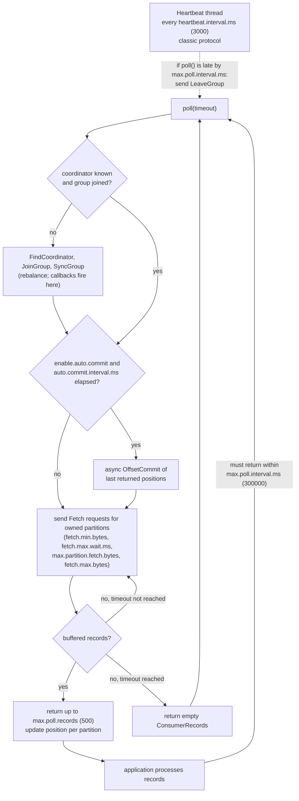
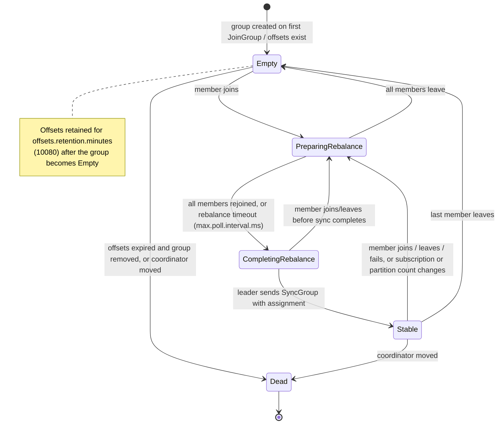
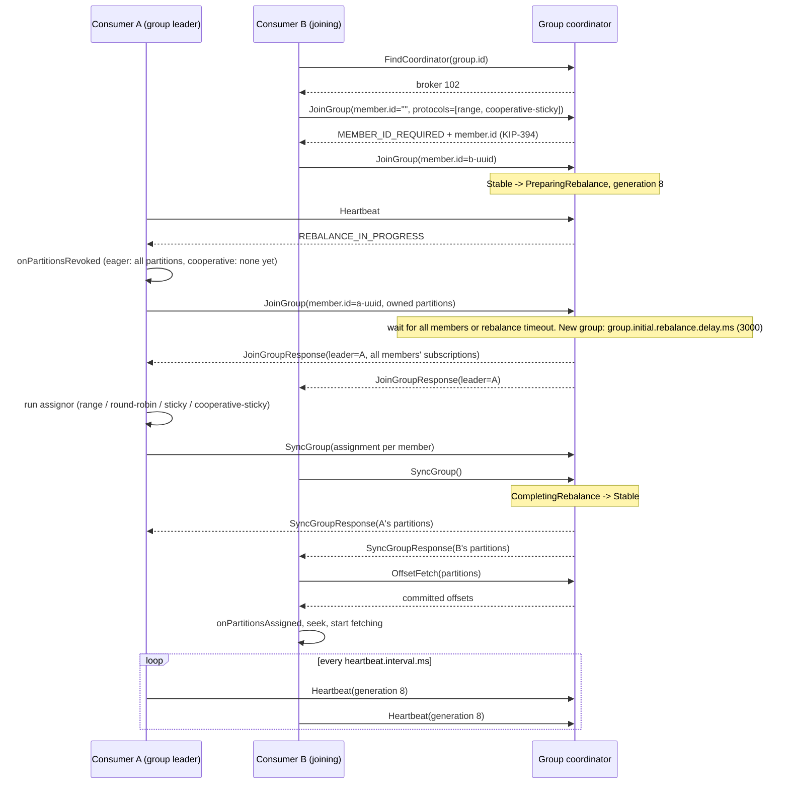
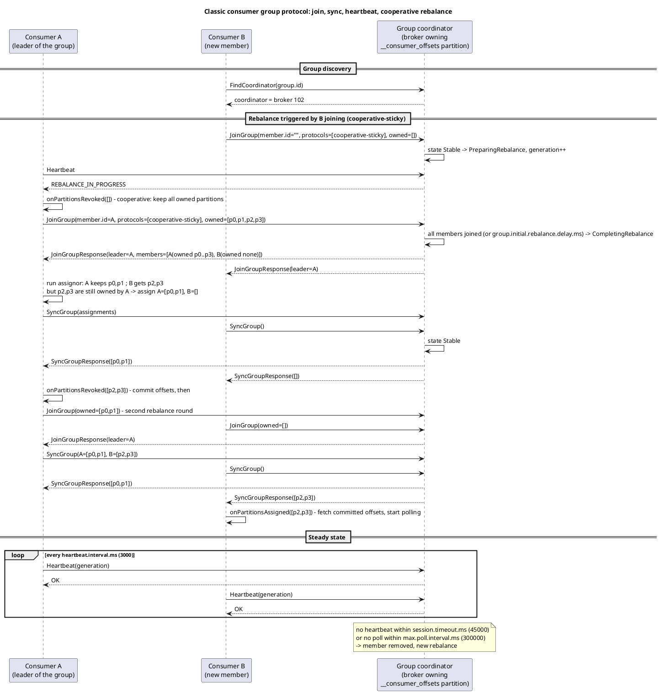
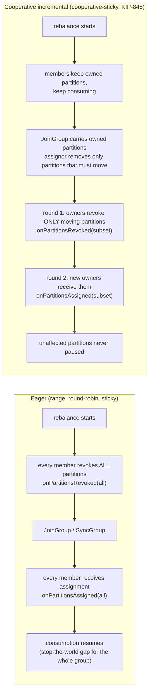

# Consumer Internals: Groups, Rebalancing, Offsets and Delivery Semantics

**Roles:** [ARCH] [ADMIN] [DEV]   **Level:** Intermediate
**Prerequisites:** [01-core-concepts.md](01-core-concepts.md), [02-cluster-architecture.md](02-cluster-architecture.md), [04-producer-internals.md](04-producer-internals.md)

## What you will learn
- How the consumer group protocol works: group coordinator, `__consumer_offsets`, JoinGroup/SyncGroup/Heartbeat, and the group state machine
- Eager versus cooperative incremental rebalancing (KIP-429), the built-in assignors, and static membership (`group.instance.id`)
- The new KIP-848 consumer group protocol (server-side assignment, `group.protocol=consumer`, GA in 4.0)
- The poll loop and its timers: `max.poll.interval.ms`, `session.timeout.ms`, `heartbeat.interval.ms`, `max.poll.records`
- Offset commit strategies, `auto.offset.reset`, fetch tuning, and consumer lag
- At-most-once, at-least-once and exactly-once from the consumer's side, and share groups / "Queues for Kafka" (KIP-932)

## 1. Concept

### 1.1 The consumer and the group

A `KafkaConsumer` pulls records with `poll()`. Alone (`assign()`), it is just a reader of specific partitions with offsets it manages. In a **consumer group** (`subscribe()` with a `group.id`) the cluster coordinates membership so that each partition of the subscribed topics is owned by exactly one member, and progress is stored centrally as **committed offsets**.

Two broker-side pieces make this work:

| Piece | Role |
|-------|------|
| Group coordinator | A broker, chosen as the leader of the `__consumer_offsets` partition that `hash(group.id) mod offsets.topic.num.partitions` (default 50) points to. It runs the membership protocol, tracks heartbeats, triggers rebalances and stores offsets. Every group has exactly one coordinator at a time; coordinator failover follows partition leader failover. |
| `__consumer_offsets` | Internal compacted topic (`offsets.topic.replication.factor` default 3, `offsets.topic.num.partitions` default 50, `offsets.topic.segment.bytes` default 104857600). Keys are `(group, topic, partition)` for offsets and `(group)` for group metadata; values are offset plus metadata and the leader epoch. Compaction keeps the latest commit per key. Offsets of an empty group expire after `offsets.retention.minutes` (default 10080, 7 days). |

Consumers find their coordinator with `FindCoordinator`, then all group traffic (JoinGroup, SyncGroup, Heartbeat, OffsetCommit, OffsetFetch, LeaveGroup) goes to that broker, while Fetch requests go to the partition leaders.

### 1.2 The poll loop

Everything a consumer does happens inside `poll()`: it sends heartbeats (via a background thread in the classic protocol), joins or rejoins the group, fetches data, and, if `enable.auto.commit=true`, commits offsets. The application's obligation is to keep calling `poll()`.



Two independent liveness checks exist, and confusing them is the most common source of "rebalance storms":

| Timer | Default | Checked by | Meaning |
|-------|---------|------------|---------|
| `session.timeout.ms` | 45000 (since 3.0, KIP-735; was 10000) | Coordinator | No heartbeat received for this long: the member is dead, remove it and rebalance. Must be between broker `group.min.session.timeout.ms` (6000) and `group.max.session.timeout.ms` (1800000). |
| `heartbeat.interval.ms` | 3000 | Consumer heartbeat thread | How often to heartbeat; should be no more than one third of `session.timeout.ms`. Heartbeats also carry rebalance signals from the coordinator. |
| `max.poll.interval.ms` | 300000 | Consumer heartbeat thread | If the application has not called `poll()` for this long, the consumer sends `LeaveGroup` itself (it assumes processing is stuck). The rebalance is triggered from the client side; the broker sees a graceful leave. |

The heartbeat thread means a consumer blocked in slow processing stays "alive" from the coordinator's point of view for up to `max.poll.interval.ms`, not `session.timeout.ms`. Before 0.10.1 (KIP-62) there was only `session.timeout.ms` and processing had to fit inside it.

### 1.3 Consumer group states (classic protocol)



`kafka-consumer-groups.sh --describe --state` shows the state. A group that oscillates between `PreparingRebalance` and `CompletingRebalance` without reaching `Stable` has a member that keeps failing to rejoin in time.

## 2. How it works internally

### 2.1 The classic protocol: JoinGroup, SyncGroup, Heartbeat

In the classic protocol (`group.protocol=classic`, the default in 3.x and still supported in 4.0) partition assignment is computed **on the client**: one member is elected group leader and runs the assignor.



Details that matter in production:

- **Generation.** Every rebalance increments the group generation. Commits carry the generation; a commit from an old generation is rejected with `ILLEGAL_GENERATION` (or `REBALANCE_IN_PROGRESS`), which is how the coordinator prevents a zombie member from overwriting a newer member's progress.
- **Rebalance timeout** is the member's `max.poll.interval.ms`. A member that does not rejoin within it is dropped from the new generation. This is why a slow consumer thread blocks *the whole group* for up to 5 minutes by default on every rebalance.
- **`group.initial.rebalance.delay.ms`** (broker, default 3000) delays the first rebalance of a new group so that members starting together join in one round.
- **Group leader.** The first member to join becomes leader. Only the leader computes the assignment; all members must agree on a common assignor from `partition.assignment.strategy` (the coordinator picks the first protocol supported by all members, in the order listed by each).

The PlantUML version (source: `diagrams/05-consumer-internals-rebalance.puml`) shows the same flow for a cooperative rebalance, including the second round.



### 2.2 Eager versus cooperative incremental rebalancing (KIP-429)



| Aspect | Eager | Cooperative |
|--------|-------|-------------|
| Partitions revoked per rebalance | All | Only those that change owner |
| Consumption during rebalance | Stops for the whole group | Continues on unaffected partitions |
| Rebalance rounds | 1 | Up to 2 (revoke, then assign) |
| Assignors | `RangeAssignor`, `RoundRobinAssignor`, `StickyAssignor` | `CooperativeStickyAssignor` (2.4+, KIP-429); server-side assignors in KIP-848 |
| `onPartitionsRevoked` semantics | Called with all owned partitions before every rebalance | Called only for partitions being taken away, after the assignment is known |
| Migration | n/a | From eager to cooperative in a classic group requires two rolling restarts: first add `cooperative-sticky` to `partition.assignment.strategy` alongside the old assignor, then remove the old one. Mixing eager and cooperative members in a single generation is an error. |

### 2.3 Assignors

| Assignor (`partition.assignment.strategy`) | Algorithm | Best for | Downside |
|--------------------------------------------|-----------|----------|----------|
| `RangeAssignor` (first in the default list) | Per topic, sort partitions and members, give each member a contiguous range. | Co-partitioned joins: the same member gets partition N of every subscribed topic. | Unbalanced when partitions per topic is not a multiple of members; the first members always get more. |
| `RoundRobinAssignor` | Interleave all partitions of all topics across members. | Even balance when all members subscribe to the same topics. | No stickiness; every rebalance shuffles everything. |
| `StickyAssignor` | Balanced, and minimizes movement from the previous assignment. | Reduces state rebuilding (e.g. caches) across rebalances. | Still eager: all partitions are revoked, then mostly re-assigned to the same owner. |
| `CooperativeStickyAssignor` (second in the default list) | Sticky, plus the cooperative protocol so only moving partitions are revoked. | The recommended classic-protocol assignor for most applications since 2.4. | Two rebalance rounds; needs the migration procedure above. |
| Rack-aware variants (KIP-881, 3.4) | The built-in assignors prefer members whose `client.rack` matches a replica's rack. | Cross-AZ cost reduction with follower fetching. | Balance can be sacrificed for locality. |

The default `partition.assignment.strategy` is `[RangeAssignor, CooperativeStickyAssignor]`: range is used unless every member also lists cooperative-sticky and it wins selection, which in practice means the default stays eager range unless you reorder the list.

### 2.4 Static membership (`group.instance.id`)

Setting `group.instance.id` to a stable value per instance (for example the pod ordinal) makes the member **static**: on restart it rejoins with the same id and the coordinator hands back the same partitions without triggering a rebalance, as long as it returns within `session.timeout.ms`. This is why `session.timeout.ms` was raised to 45 seconds and why static members commonly set it even higher. Trade-off: a static member that dies silently is only detected after `session.timeout.ms`, so partitions sit idle longer. Two live instances with the same `group.instance.id` fence each other with `FencedInstanceIdException` (KIP-345, 2.3).

### 2.5 The KIP-848 consumer group protocol (`group.protocol=consumer`)

KIP-848 rewrites the group protocol: assignment moves to the **broker**, JoinGroup/SyncGroup disappear, and a single `ConsumerGroupHeartbeat` request carries membership, subscription, owned partitions and the target assignment. It was early access in 3.7, preview in 3.8/3.9, and GA in 4.0 for consumers. Kafka Streams and Connect use it in later releases (Streams via KIP-1071).

| Aspect | Classic (`group.protocol=classic`) | KIP-848 (`group.protocol=consumer`) |
|--------|------------------------------------|-------------------------------------|
| Where assignment is computed | Group leader consumer, using client-side assignors | Group coordinator, using server-side assignors: `uniform` (default) or `range`, chosen with `group.remote.assignor`; broker allows `group.consumer.assignors` |
| Requests | JoinGroup, SyncGroup, Heartbeat, LeaveGroup | `ConsumerGroupHeartbeat` only (plus offset and metadata requests) |
| Rebalance model | Global generation; all members must rejoin | Per-member **epochs**; the coordinator reconciles each member incrementally: revoke, then assign, one member at a time, no group-wide barrier |
| Group states | Empty, PreparingRebalance, CompletingRebalance, Stable, Dead | Empty, Assigning, Reconciling, Stable, Dead |
| Rebalance timeout | `max.poll.interval.ms` | Still `max.poll.interval.ms` for revocation deadlines |
| Session and heartbeat | Client configs `session.timeout.ms`, `heartbeat.interval.ms` | Broker configs `group.consumer.session.timeout.ms` (45000) and `group.consumer.heartbeat.interval.ms` (5000); the client-side values are ignored |
| Static membership | `group.instance.id` | `group.instance.id` supported |
| Client threading | Heartbeat thread plus user thread | New "async consumer" implementation: a background network thread does all I/O; `poll()` reads from an event queue |
| Upgrade | n/a | Rolling: a classic group is converted online when members with `group.protocol=consumer` join; downgrade is also supported (KIP-848 "online migration") |
| Broker requirement | any | `group.coordinator.rebalance.protocols` must include `consumer` (default `classic,consumer` since 4.0) and metadata version 4.0 |

Why it matters: rebalances no longer stop the world or wait on the slowest member; adding one consumer to a group of 500 moves a handful of partitions and only those members participate. Assignment logic lives in one place (the broker) and can be evolved without upgrading every client library.

### 2.6 Offset commits

A committed offset is the offset of the **next record to read**, not the last processed one. Committing `offset + 1` after processing `offset` is the convention the client library follows automatically.

| Strategy | API | Semantics | Risk |
|----------|-----|-----------|------|
| Auto commit | `enable.auto.commit=true`, `auto.commit.interval.ms=5000` | On each `poll()` (and on close/rebalance) commit the positions returned by the *previous* poll if the interval elapsed. | At-least-once as long as processing finishes before the next `poll()`; duplicates on crash up to one interval. Data loss if you hand records to another thread and poll again before they are processed. |
| Sync commit per batch | `commitSync()` after processing a poll's records | Blocks until the coordinator acknowledges; retries on retriable errors. | Latency per batch (one round trip); simplest correct at-least-once. |
| Async commit | `commitAsync(callback)` | Non-blocking; no retry (a retry could reorder commits). | Failed commits mean re-processing after failover; combine with a final `commitSync()` on shutdown and in `onPartitionsRevoked`. |
| Commit specific offsets | `commitSync(Map<TopicPartition, OffsetAndMetadata>)` | Fine-grained progress, for example every N records or per partition. | Bookkeeping in the application. |
| External offsets | Store offsets in the same transaction as the processed data (database), `seek()` on assignment | Exactly-once between Kafka and that store. | The group's committed offsets become informational only; monitoring tools show stale lag. |
| Transactional (`sendOffsetsToTransaction`) | Producer-side, for consume-transform-produce | Offsets committed atomically with output records. | Only covers Kafka-to-Kafka pipelines. |

`auto.offset.reset` (`latest` by default; `earliest`; `none` throws `NoOffsetForPartitionException`) applies only when there is **no committed offset** for the group and partition (new group, expired offsets after `offsets.retention.minutes`, or the committed offset is out of range because the data was deleted). Since 4.0 (KIP-1106) `by_duration:<ISO-8601 duration>` (for example `by_duration:PT1H`) starts from the offset whose timestamp is that far back.

### 2.7 Fetch tuning

| Setting | Default | Effect |
|---------|---------|--------|
| `fetch.min.bytes` | 1 | Broker waits until at least this many bytes are available (across the partitions in the request) before responding. |
| `fetch.max.wait.ms` | 500 | Upper bound on that wait. Together with `fetch.min.bytes` this is the consumer-side batching knob: raise both on high-volume topics to cut request rate and broker CPU. |
| `max.partition.fetch.bytes` | 1048576 | Maximum bytes per partition per response. Must be at least the topic's `max.message.bytes`; the first batch is always returned even if larger (since 2.0, KIP-74 semantics). |
| `fetch.max.bytes` | 52428800 | Maximum bytes per fetch response across partitions; same first-batch exception. |
| `max.poll.records` | 500 | Maximum records returned by one `poll()`. Controls processing time per poll, hence how much work must fit in `max.poll.interval.ms`; it does not change fetch sizes. |
| `receive.buffer.bytes` | 65536 | Socket buffer; raise for high-latency links (or -1 for OS default). |
| `client.rack` | null | Enables follower fetching with `RackAwareReplicaSelector` on the brokers (KIP-392). |
| `isolation.level` | `read_uncommitted` | `read_committed` hides records from open or aborted transactions and stops at the last stable offset (LSO). |

The consumer keeps one in-flight fetch per broker and pre-fetches: while the application processes the current batch, the next response is already arriving. `fetch-latency-avg`, `fetch-size-avg`, `records-per-request-avg` and `bytes-consumed-rate` (JMX `kafka.consumer:type=consumer-fetch-manager-metrics`) show whether fetches are efficient.

### 2.8 Consumer lag

Lag for a partition is `log end offset (HW) - committed offset` from the cluster's perspective (`kafka-consumer-groups.sh --describe`), or `HW - current position` from the consumer's (`records-lag` and `records-lag-max` in `consumer-fetch-manager-metrics`, per partition since KIP-225). The two differ by whatever has been fetched but not committed. Lag growing steadily means the group is slower than the producers; lag jumping after restarts means offsets were not committed before shutdown; lag at zero with no throughput means nothing is produced. External tools (Burrow, kafka-lag-exporter) compute lag from `__consumer_offsets` and the log end offsets without touching the consumers.

### 2.9 Delivery semantics from the consumer side

| Semantics | How | Failure behaviour |
|-----------|-----|-------------------|
| At most once | Commit before processing (`commitSync()` right after `poll()`, or auto commit with processing in another thread). | A crash after commit and before processing loses those records. |
| At least once | Process, then commit. Default with auto commit when processing is synchronous in the poll loop. | A crash after processing and before commit re-delivers records; processing must be idempotent by key or a deduplication store is needed. |
| Exactly once (Kafka to Kafka) | Transactional producer, `sendOffsetsToTransaction`, consumers downstream use `isolation.level=read_committed`. Kafka Streams `processing.guarantee=exactly_once_v2`. | Offsets and outputs commit atomically; aborted transactions are invisible to `read_committed` readers. |
| Exactly once (Kafka to external store) | Store offset with the data in one atomic write, `seek()` to stored offsets in `onPartitionsAssigned`. | Depends on the store's atomicity; the group's committed offsets are not the source of truth. |

### 2.10 Share groups: Queues for Kafka (KIP-932)

Share groups give queue-like semantics on top of unchanged topics. A `KafkaShareConsumer` subscribes with a `group.id` like a regular consumer, but the group is a *share group* (a distinct group type managed by the same coordinator) and its members do **not** own partitions exclusively: any number of members can read the same partition, records are handed out in acquired batches with a lock (`group.share.record.lock.duration.ms`, default 30000), and each record is acknowledged individually as `ACCEPT`, `RELEASE` (make it available again) or `REJECT` (do not redeliver); a record delivered more than `group.share.delivery.count.limit` times (default 5) is archived. Ordering is not guaranteed, offsets are not committed the classic way (the coordinator persists per-record state in a share-group state partition, `__share_group_state`), and the number of consumers is no longer capped by the partition count.

Status: early access in 4.0 (requires `unstable.feature.versions.enable=true` on brokers and `share` in `group.coordinator.rebalance.protocols`), with preview and GA status arriving in later 4.x releases; check the release notes for your version before relying on it. Use share groups for work-queue patterns (many workers, per-message retry, no ordering requirement); keep consumer groups for ordered, partitioned stream processing.

## 3. Configuration that matters

| Parameter | Default | Recommended | Why |
|-----------|---------|-------------|-----|
| `group.id` | null | Stable, meaningful per application | Identity of offsets and membership. |
| `group.protocol` | `classic` | `consumer` once brokers are 4.0 and clients >= 4.0 | Incremental server-side rebalancing. |
| `group.remote.assignor` | null (broker default `uniform`) | `uniform`; `range` for co-partitioned joins | KIP-848 assignor. |
| `partition.assignment.strategy` | `[RangeAssignor, CooperativeStickyAssignor]` | `CooperativeStickyAssignor` (classic protocol) | Avoid stop-the-world rebalances. |
| `group.instance.id` | null | Set for stateful or slow-starting consumers | Static membership; restarts without rebalance. |
| `session.timeout.ms` | 45000 | 45000; higher for static members that restart slowly | Failure detection window (classic). |
| `heartbeat.interval.ms` | 3000 | One third of session timeout at most | Heartbeat cadence (classic). |
| `max.poll.interval.ms` | 300000 | Set to your worst-case batch processing time plus margin; lower `max.poll.records` instead of raising this far | Rebalance timeout and stuck-consumer detection. |
| `max.poll.records` | 500 | Size so that processing fits comfortably in `max.poll.interval.ms` | Work per poll. |
| `enable.auto.commit` | `true` | `false` with explicit `commitSync` after processing for anything important | Control over at-least-once. |
| `auto.commit.interval.ms` | 5000 | Default when auto commit is used | Duplicate window on crash. |
| `auto.offset.reset` | `latest` | `earliest` for pipelines that must not skip data; `none` where a missing offset is a bug | Behaviour without committed offsets. |
| `fetch.min.bytes` / `fetch.max.wait.ms` | 1 / 500 | 64 KiB to 1 MiB / 500 on high-volume topics; leave at 1 / lower for latency-critical | Fetch batching vs latency. |
| `max.partition.fetch.bytes` | 1048576 | >= `max.message.bytes` | Avoid stuck consumers on large records. |
| `fetch.max.bytes` | 52428800 | Default | Memory bound per fetch. |
| `isolation.level` | `read_uncommitted` | `read_committed` downstream of transactional producers | Hide aborted data. |
| `client.rack` | null | Set to the AZ in multi-AZ clusters with follower fetching | Cross-AZ cost. |
| `offsets.retention.minutes` (broker) | 10080 | Longer than your longest planned consumer outage | Avoid unexpected `auto.offset.reset`. |
| `group.initial.rebalance.delay.ms` (broker) | 3000 | Default | Batch initial joins. |
| `group.consumer.session.timeout.ms` / `group.consumer.heartbeat.interval.ms` (broker) | 45000 / 5000 | Defaults | KIP-848 liveness. |
| `group.coordinator.rebalance.protocols` (broker) | `classic,consumer` (4.0) | Add `share` only to enable share groups | Enabled protocols. |

## 4. Failure modes and how to detect them

| Symptom | Likely cause | Metric / log to check | Fix |
|---------|--------------|-----------------------|-----|
| Continuous rebalances, group never `Stable` | Processing exceeds `max.poll.interval.ms`; consumer logs "consumer poll timeout has expired" and leaves | consumer `rebalance-rate-per-hour`, `failed-rebalance-total`, `last-poll-seconds-ago`; broker `kafka.coordinator.group:type=GroupMetadataManager,name=NumGroupsPreparingRebalance` | Lower `max.poll.records`, speed up processing, or raise `max.poll.interval.ms`; move heavy work off the poll thread with pause/resume. |
| `CommitFailedException: ... the group has already rebalanced` | Commit from an old generation after the member was kicked out | Same as above | Fix the poll interval issue; commit in `onPartitionsRevoked`. |
| Lag jumps after every deploy | Offsets not committed before shutdown, or eager rebalance with long revocation | consumer `commit-rate`, deploy timeline vs lag graph | `commitSync()` in shutdown and in `onPartitionsRevoked`; cooperative assignor or KIP-848; static membership. |
| Consumer stuck, no records, no errors | A record larger than `max.partition.fetch.bytes` on an old client, or `read_committed` blocked by a hanging transaction (LSO not advancing) | `fetch-size-avg` 0, broker `kafka.log:type=Log,name=LastStableOffsetLag`; `kafka-transactions.sh find-hanging` | Raise fetch size; abort the hanging transaction (`kafka-transactions.sh abort`), upgrade to brokers with KIP-890. |
| Group restarts from `latest` and skips data, or from `earliest` and reprocesses days | Offsets expired (`offsets.retention.minutes`) or wrong `auto.offset.reset` | `kafka-consumer-groups.sh --describe` shows no current offset | Raise retention; set `auto.offset.reset` deliberately; monitor group idle time. |
| Duplicate processing after crash | At-least-once with commit after processing | Expected | Idempotent sinks keyed by record key and offset, or transactions. |
| Records lost after crash | Auto commit with records handed to worker threads | Application design | Commit only after workers finish; use manual commits. |
| `UNKNOWN_MEMBER_ID` / `FencedInstanceIdException` | Two instances share a `group.instance.id`, or a member was removed and rejoined with a stale id | Application logs | Ensure unique static ids; restart the consumer. |
| One member gets all partitions of a topic, others idle | `RangeAssignor` with fewer partitions than members, or subscription mismatch across members | `kafka-consumer-groups.sh --describe --members --verbose` | Use uniform/cooperative-sticky assignor; align subscriptions. |
| High broker CPU from consumer fetches | `fetch.min.bytes=1` with many consumers polling empty partitions | broker `FetchConsumer` request rate | Raise `fetch.min.bytes` and keep `fetch.max.wait.ms`. |
| Coordinator load spikes, slow commits | `__consumer_offsets` not compacting, or one partition of it hot (many groups hash to it) | `kafka.log:type=LogCleanerManager,name=uncleanable-partitions-count`, `kafka.coordinator.group:type=GroupMetadataManager,name=NumOffsets` | Fix cleaner; spread `group.id`s; avoid per-request groups. |

## 5. Design guidance (architect view)

### 5.1 Decision table

| Need | Choose |
|------|--------|
| Ordered processing per key with parallelism | Consumer group, partitions >= max members, keyed topic |
| Work queue, many workers, per-message retry, no ordering | Share group (KIP-932) when GA for your version; until then a consumer group plus a retry topic and dead-letter topic pattern |
| Stateful consumers with long start-up (caches, local stores) | Static membership plus cooperative-sticky or KIP-848; generous `session.timeout.ms` |
| Hundreds of members, frequent scaling | KIP-848 (`group.protocol=consumer`) |
| Exactly-once into Kafka | Transactions (`read_committed` downstream) or Kafka Streams EOS |
| Exactly-once into a database | Offsets stored with the data, `seek()` on assignment |
| Cross-AZ cost reduction | `client.rack` plus `RackAwareReplicaSelector`, rack-aware assignors (KIP-881) |

### 5.2 Anti-patterns and tips

> **Anti-pattern:** Doing slow, blocking work (external HTTP calls with retries, batch database writes) directly in the poll loop with `max.poll.records=500` and the default `max.poll.interval.ms`. One slow downstream turns into a rebalance storm for the whole group. Use `pause()`/`resume()` with an internal work queue, or lower `max.poll.records`.

> **Anti-pattern:** One consumer group per request or per instance with random `group.id`s. Each creates offsets and group metadata in `__consumer_offsets` and never expires quickly; use `assign()` for ad-hoc readers that do not need coordination.

> **Production tip:** Alert on lag *trend* per group (derivative), not absolute lag, and on `last-poll-seconds-ago` per consumer; the second catches stuck consumers before they leave the group.

> **Production tip:** Commit in `onPartitionsRevoked` and call `close()` on shutdown. With cooperative rebalancing `onPartitionsRevoked` receives only the partitions being moved, so commit exactly those.

## 6. Hands-on

Manual-commit consumer with rebalance listener and cooperative assignment (classic protocol):

```java
Properties c = new Properties();
c.put(ConsumerConfig.BOOTSTRAP_SERVERS_CONFIG, "broker-101:9092,broker-102:9092");
c.put(ConsumerConfig.GROUP_ID_CONFIG, "billing");
c.put(ConsumerConfig.GROUP_INSTANCE_ID_CONFIG, System.getenv("POD_NAME"));   // static membership
c.put(ConsumerConfig.KEY_DESERIALIZER_CLASS_CONFIG, StringDeserializer.class.getName());
c.put(ConsumerConfig.VALUE_DESERIALIZER_CLASS_CONFIG, ByteArrayDeserializer.class.getName());
c.put(ConsumerConfig.ENABLE_AUTO_COMMIT_CONFIG, "false");
c.put(ConsumerConfig.AUTO_OFFSET_RESET_CONFIG, "earliest");
c.put(ConsumerConfig.PARTITION_ASSIGNMENT_STRATEGY_CONFIG, CooperativeStickyAssignor.class.getName());
c.put(ConsumerConfig.MAX_POLL_RECORDS_CONFIG, "200");
c.put(ConsumerConfig.MAX_POLL_INTERVAL_MS_CONFIG, "120000");
c.put(ConsumerConfig.FETCH_MIN_BYTES_CONFIG, "65536");
c.put(ConsumerConfig.FETCH_MAX_WAIT_MS_CONFIG, "500");
c.put(ConsumerConfig.ISOLATION_LEVEL_CONFIG, "read_committed");
// KIP-848 instead of the classic protocol (4.0 brokers): replace the assignor line with
// c.put(ConsumerConfig.GROUP_PROTOCOL_CONFIG, "consumer");
// c.put(ConsumerConfig.GROUP_REMOTE_ASSIGNOR_CONFIG, "uniform");

KafkaConsumer<String, byte[]> consumer = new KafkaConsumer<>(c);
Map<TopicPartition, OffsetAndMetadata> pending = new HashMap<>();

consumer.subscribe(List.of("orders"), new ConsumerRebalanceListener() {
    @Override public void onPartitionsRevoked(Collection<TopicPartition> parts) {
        Map<TopicPartition, OffsetAndMetadata> toCommit = new HashMap<>();
        for (TopicPartition tp : parts) if (pending.containsKey(tp)) toCommit.put(tp, pending.remove(tp));
        if (!toCommit.isEmpty()) consumer.commitSync(toCommit);
    }
    @Override public void onPartitionsAssigned(Collection<TopicPartition> parts) { /* warm caches */ }
});

try {
    while (running) {
        ConsumerRecords<String, byte[]> records = consumer.poll(Duration.ofMillis(500));
        for (ConsumerRecord<String, byte[]> r : records) {
            process(r);                                              // idempotent by key
            pending.put(new TopicPartition(r.topic(), r.partition()),
                        new OffsetAndMetadata(r.offset() + 1));      // next offset to read
        }
        if (!pending.isEmpty()) {
            consumer.commitAsync(pending, (offsets, ex) -> { if (ex != null) log.warn("commit failed", ex); });
            pending.clear();
        }
    }
} finally {
    try { consumer.commitSync(); } finally { consumer.close(Duration.ofSeconds(10)); }
}
```

Operations:

```bash
# Describe a group: members, assignment, current offset, log end offset, lag
kafka-consumer-groups.sh --bootstrap-server localhost:9092 --describe --group billing
kafka-consumer-groups.sh --bootstrap-server localhost:9092 --describe --group billing --members --verbose
kafka-consumer-groups.sh --bootstrap-server localhost:9092 --describe --group billing --state

# List groups, optionally filtered by group type (classic vs consumer) or state
kafka-consumer-groups.sh --bootstrap-server localhost:9092 --list --type consumer
kafka-consumer-groups.sh --bootstrap-server localhost:9092 --list --state Stable

# Reset offsets (group must be inactive): to earliest, to a timestamp, or shift back
kafka-consumer-groups.sh --bootstrap-server localhost:9092 --group billing --topic orders \
  --reset-offsets --to-earliest --execute
kafka-consumer-groups.sh --bootstrap-server localhost:9092 --group billing --topic orders \
  --reset-offsets --to-datetime 2026-09-01T00:00:00.000 --execute
kafka-consumer-groups.sh --bootstrap-server localhost:9092 --group billing --all-topics \
  --reset-offsets --shift-by -1000 --dry-run

# Delete a group (removes offsets); must be empty
kafka-consumer-groups.sh --bootstrap-server localhost:9092 --delete --group old-billing

# Share groups in 4.0 early access (dev only): set in server.properties on every broker and restart
#   unstable.feature.versions.enable=true
#   group.coordinator.rebalance.protocols=classic,consumer,share
kafka-console-share-consumer.sh --bootstrap-server localhost:9092 --topic orders --group work-queue

# Consumer-side throughput test
kafka-consumer-perf-test.sh --bootstrap-server localhost:9092 --topic orders --messages 1000000 \
  --group perf --print-metrics

# Read committed offsets from __consumer_offsets directly (debugging)
kafka-console-consumer.sh --bootstrap-server localhost:9092 --topic __consumer_offsets \
  --formatter "org.apache.kafka.tools.consumer.OffsetsMessageFormatter" --from-beginning | head
```

Key consumer metrics (JMX `kafka.consumer:type=consumer-coordinator-metrics` and `consumer-fetch-manager-metrics`): `rebalance-latency-avg`, `rebalance-total`, `failed-rebalance-total`, `last-rebalance-seconds-ago`, `commit-latency-avg`, `commit-rate`, `records-lag-max`, `records-lag` (per partition), `fetch-latency-avg`, `records-consumed-rate`, `bytes-consumed-rate`, and `kafka.consumer:type=consumer-metrics` `last-poll-seconds-ago`, `poll-idle-ratio-avg`, `time-between-poll-avg`.

## 7. Interview questions for this chapter

### Q1. What is the group coordinator and how does a consumer find it?
**Role:** [DEV] | **Difficulty:** ★☆☆ | **Topic:** Group protocol

**Answer.**
The group coordinator is the broker that leads the `__consumer_offsets` partition selected by `hash(group.id) mod offsets.topic.num.partitions` (default 50). A consumer sends `FindCoordinator` to any broker, receives the coordinator's id, and from then on sends membership traffic (JoinGroup/SyncGroup/Heartbeat in the classic protocol, `ConsumerGroupHeartbeat` in KIP-848) and offset commits and fetches to it, while data fetches go to partition leaders. If that partition's leadership moves, the coordinator moves with it and consumers rediscover it after a `NOT_COORDINATOR` error.

**Follow-up probes.** Where are committed offsets stored physically? What happens to offsets when the group is empty for eight days?

### Q2. Explain the difference between `session.timeout.ms` and `max.poll.interval.ms`.
**Role:** [DEV] | **Difficulty:** ★★☆ | **Topic:** Liveness

**Answer.**
`session.timeout.ms` (45000 since 3.0) is enforced by the coordinator: if no heartbeat arrives within it, the member is declared dead and a rebalance starts. Heartbeats are sent by a background thread every `heartbeat.interval.ms` (3000), so a consumer whose application thread is busy still looks alive. `max.poll.interval.ms` (300000) is enforced by the consumer itself: if the application does not call `poll()` within it, the consumer sends `LeaveGroup`, assuming processing is stuck. So a hard crash is detected after the session timeout, a hung or slow application after the poll interval, and the poll interval is also the rebalance timeout every member must rejoin within.

**Follow-up probes.** Why did KIP-62 introduce the second timer? What does `max.poll.records` have to do with it?

### Q3. Walk through a classic-protocol rebalance and what makes it "stop the world".
**Role:** [DEV] | **Difficulty:** ★★☆ | **Topic:** Rebalancing

**Answer.**
A member joins, leaves or fails, so the coordinator moves the group to `PreparingRebalance` and tells every member through heartbeat responses; each member calls `onPartitionsRevoked`, and with an eager assignor revokes everything, then sends `JoinGroup`. When all members have rejoined (or the rebalance timeout expires), the coordinator picks a leader and returns all subscriptions to it; the leader runs the assignor and sends the assignment in `SyncGroup`; the coordinator distributes it and the group becomes `Stable`. Between revocation and the new assignment nobody consumes, and the wait for the slowest member to rejoin is bounded only by `max.poll.interval.ms`, which is the stop-the-world cost.

**Follow-up probes.** How does cooperative rebalancing change the revocation step? Why are there two rounds?

### Q4. What does KIP-848 change and how do you adopt it?
**Role:** [ARCH] | **Difficulty:** ★★★ | **Topic:** New group protocol

**Answer.**
KIP-848 moves partition assignment to the group coordinator and replaces JoinGroup/SyncGroup with a single `ConsumerGroupHeartbeat`; each member has its own epoch and the coordinator reconciles members incrementally (revoke from the current owner, then assign to the new one) without a group-wide barrier, so rebalances no longer wait for the slowest member or stop unaffected members. Liveness moves to broker settings (`group.consumer.session.timeout.ms`, `group.consumer.heartbeat.interval.ms`) and assignors are server-side (`uniform`, `range`, selected by `group.remote.assignor`). It is GA in 4.0 for plain consumers: brokers need `group.coordinator.rebalance.protocols` to include `consumer`, then clients switch with `group.protocol=consumer` in a rolling restart; the coordinator converts the group online and can convert it back.

**Follow-up probes.** Does `partition.assignment.strategy` still apply? What about Kafka Streams and Connect?

### Q5. When should you use static membership, and what is its cost?
**Role:** [ADMIN] | **Difficulty:** ★★☆ | **Topic:** Static membership

**Answer.**
Use `group.instance.id` when consumers restart often or slowly (rolling deploys, Kubernetes pods, stateful consumers with local caches): a static member that returns within `session.timeout.ms` gets its previous partitions back without any rebalance, so the rest of the group is undisturbed. The cost is slower detection of real failures, because the coordinator waits the full session timeout before reassigning a silent member's partitions, and the operational discipline of keeping ids unique (two live instances with the same id fence each other). It combines well with `CooperativeStickyAssignor` or KIP-848.

**Follow-up probes.** What session timeout would you pick for a 90-second pod restart? What error do you see with a duplicate id?

### Q6. Compare auto commit, `commitSync` and `commitAsync` in terms of delivery semantics.
**Role:** [DEV] | **Difficulty:** ★★☆ | **Topic:** Offset management

**Answer.**
Auto commit (`enable.auto.commit=true`, every `auto.commit.interval.ms=5000` on the next `poll()`) commits the positions of the previous poll, giving at-least-once only if processing is synchronous inside the loop; if records are handed to other threads it becomes at-most-once and can lose data. `commitSync` after processing a batch blocks for one round trip and retries, giving simple at-least-once with a duplicate window of one batch. `commitAsync` does not block and does not retry (retries could reorder commits), so it is paired with a final `commitSync` on shutdown and in `onPartitionsRevoked`. Whatever the method, the committed value is the next offset to read, and idempotent processing is what turns at-least-once into effectively-once.

**Follow-up probes.** Why does `commitAsync` not retry? How do you achieve exactly-once into a relational database?

### Q7. A consumer group's lag is fine for hours, then jumps to millions after a deploy, then recovers. Explain.
**Role:** [ADMIN] | **Difficulty:** ★★☆ | **Topic:** Lag

**Answer.**
The classic symptom of offsets not being committed before shutdown combined with eager rebalancing: instances stop without `close()` or a final `commitSync`, so the group restarts from offsets up to `auto.commit.interval.ms` old, and during the stop-the-world rebalance nothing is consumed while producers keep writing; lag spikes then drains. If the lag jumps to the beginning of the topic, offsets expired (`offsets.retention.minutes`) or `auto.offset.reset=earliest` kicked in for a renamed group. Fixes: commit in `onPartitionsRevoked` and on shutdown, use `CooperativeStickyAssignor` or KIP-848, static membership for rolling deploys, and alert on lag trend.

**Follow-up probes.** How does `kafka-consumer-groups.sh` compute lag? Why can consumer-side `records-lag` differ?

### Q8. What are share groups and how do they differ from consumer groups?
**Role:** [ARCH] | **Difficulty:** ★★★ | **Topic:** Queues for Kafka

**Answer.**
Share groups (KIP-932, early access in 4.0) let many consumers read the *same* partitions cooperatively: records are leased in batches with a lock (`group.share.record.lock.duration.ms`, default 30000), acknowledged per record as accept, release or reject, and redelivered up to `group.share.delivery.count.limit` (default 5) times before being archived. That gives queue semantics: worker count is not capped by partitions, and failed records retry individually. The trade-offs are no ordering guarantee, no classic offset commits (the coordinator tracks per-record state), and, in 4.0, early-access status that requires enabling the `share` protocol and feature explicitly. Use them for work queues, not for ordered stream processing.

**Follow-up probes.** How is per-record state persisted? What happens to a record whose lock expires?

### Q9. Scenario: 40 consumers, 40 partitions, each record takes up to 2 seconds to process, deploys happen hourly. Design the consumer configuration.
**Role:** [ARCH] | **Difficulty:** ★★★ | **Topic:** Consumer design

**Situation.** Slow per-record processing (external calls), frequent rolling deploys, at-least-once acceptable, order per key required.
**Constraints.** No rebalance storms; lag must not spike on deploys; brokers are 4.0.
**Expected reasoning.** 500 records x 2 s far exceeds `max.poll.interval.ms`; the poll loop must be bounded. Rolling deploys mean many join/leave events; eager rebalances would stop all 40 consumers each time.
**Model answer.** `max.poll.records=50` (worst case 100 s) with `max.poll.interval.ms=180000`; `enable.auto.commit=false`, commit after each batch and in `onPartitionsRevoked`; `group.protocol=consumer` (KIP-848) so only moving partitions pause, or on classic `CooperativeStickyAssignor`; `group.instance.id` per pod with `session.timeout.ms` (or `group.consumer.session.timeout.ms` on the broker) above the pod restart time so restarts do not trigger reassignment; `pause()` partitions while a downstream call is retrying rather than blocking the loop; alert on `last-poll-seconds-ago` and lag trend. If ordering per key were not required, a share group would remove the partition/consumer coupling entirely once GA.

## Key takeaways
- The coordinator is the leader of a `__consumer_offsets` partition; committed offsets are "next to read" and expire after `offsets.retention.minutes` once the group is empty.
- Two timers govern liveness: `session.timeout.ms` (heartbeats, coordinator-enforced) and `max.poll.interval.ms` (poll cadence, client-enforced, also the rebalance timeout).
- Eager rebalances stop the whole group; `CooperativeStickyAssignor` moves only what must move, and KIP-848 (`group.protocol=consumer`, GA in 4.0) makes rebalancing per member and server-driven.
- Static membership removes rebalances from restarts at the cost of slower failure detection.
- Delivery semantics are decided by *when* you commit relative to processing; exactly-once needs transactions or an atomic external store.
- Share groups (KIP-932) bring queue semantics; in 4.0 they are early access.

## Further reading
- Apache Kafka documentation: "Consumer Configs", "Consumer Groups", "Monitoring: consumer metrics"
- KIP-62: Allow consumer to send heartbeats from a background thread
- KIP-345: Static membership
- KIP-429: Kafka Consumer Incremental Rebalance Protocol
- KIP-735: Increase default consumer session timeout
- KIP-848: The Next Generation of the Consumer Rebalance Protocol
- KIP-881: Rack-aware Partition Assignment for Kafka Consumers
- KIP-932: Queues for Kafka
- KIP-1106: Add duration based offset reset option for consumer clients
- KIP-1071: Streams Rebalance Protocol
