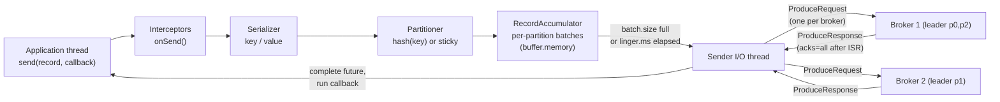
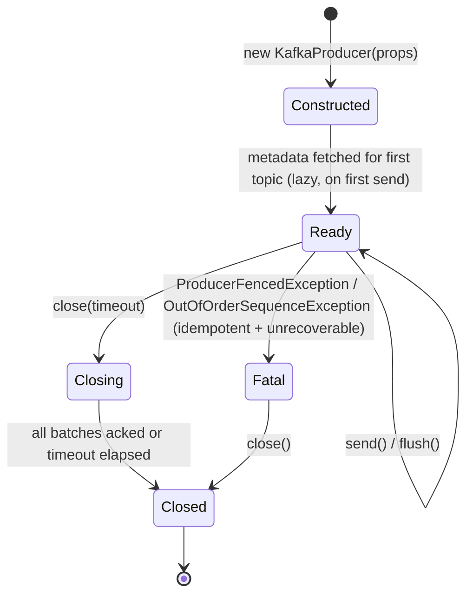
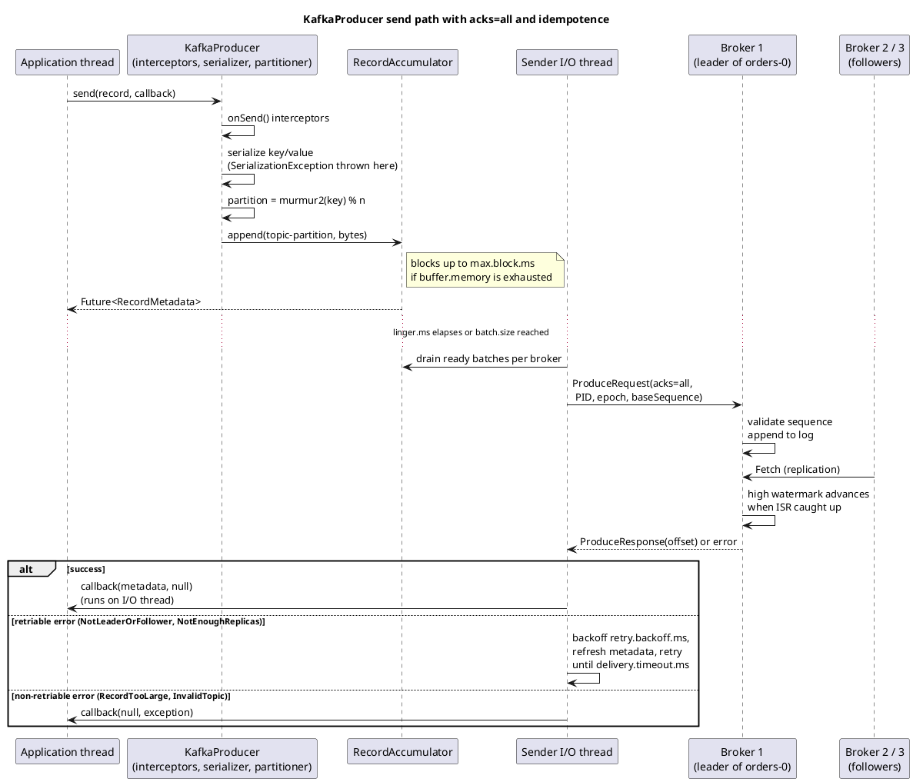

# Producer API

**Roles:** [DEV] [ARCH] [ADMIN]   **Level:** Intermediate
**Prerequisites:** [Fundamentals: producer internals](../01-fundamentals/04-producer-internals.md), [Cluster architecture](../01-fundamentals/02-cluster-architecture.md) (log structure, ISR, `acks`)

## What you will learn
- The lifecycle of a `KafkaProducer` and what happens between `send()` and the broker acknowledgement
- Synchronous vs asynchronous sends, callbacks, and why ignoring the returned future is dangerous
- Keyed vs unkeyed records, headers, custom partitioners, custom serializers and interceptors
- Which exceptions are retriable, which are fatal, and how to react to each
- Graceful shutdown (`flush()`, `close()`), the producer metrics that matter, and how the same ideas map onto Spring Kafka and Python

## 1. Concept

A `KafkaProducer` is a thread-safe, long-lived client that turns `ProducerRecord` objects into batched, compressed, acknowledged writes on partition leaders. One producer instance is intended to serve an entire application (or at least a whole thread pool); it owns a background I/O thread, a memory pool (`buffer.memory`), per-partition batches, and connections to every broker that leads a partition it writes to.

The important mental model is that `send()` is **not** a network call. It serializes, partitions and enqueues the record into the `RecordAccumulator`, then returns a `Future<RecordMetadata>`. The I/O ("Sender") thread drains full or expired batches, groups them per broker into `ProduceRequest`s and completes the futures when acknowledgements arrive.



Key consequences:

| Consequence | Why it matters |
|-------------|----------------|
| `send()` can block | When `buffer.memory` is exhausted or metadata for a topic is missing, `send()` blocks up to `max.block.ms` and then throws `TimeoutException` |
| Callbacks run on the I/O thread | Never do blocking work inside a `Callback`; you will stall every batch behind it |
| Ordering is per partition, per producer | With `enable.idempotence=true` (default since 3.0) the broker de-duplicates and keeps order for up to `max.in.flight.requests.per.connection=5` |
| Batching is where throughput comes from | `linger.ms`, `batch.size`, and `compression.type` govern the trade-off between latency and throughput |

## 2. How it works internally

### 2.1 Lifecycle



1. **Construction** creates the accumulator, the `Sender` thread (named `kafka-producer-network-thread | <client.id>`), and registers JMX metrics. No network I/O happens yet.
2. **First `send()`** for a topic triggers a metadata fetch (blocks up to `max.block.ms`). If `enable.idempotence=true`, the producer also obtains a producer ID (PID) via `InitProducerId`.
3. **Steady state**: the application thread appends to batches; the Sender drains them.
4. **`flush()`** blocks until every record enqueued so far is acknowledged or failed.
5. **`close(Duration)`** stops accepting new records, waits up to the timeout for in-flight batches, then releases the I/O thread and sockets. `close()` without a timeout waits indefinitely (`Long.MAX_VALUE` ms), which is what you want in a shutdown hook.

### 2.2 Detailed send sequence

Source: [`diagrams/producer-api-send-sequence.puml`](../diagrams/producer-api-send-sequence.puml)



### 2.3 The delivery timeline

Each record moves through several time budgets. Since KIP-91 (Kafka 2.1) they are unified under `delivery.timeout.ms`:

```
send() ──► queue in accumulator ──► in flight ──► ack
          |◄─ linger.ms ─►|        |◄ request.timeout.ms ►| (× retries, with retry.backoff.ms)
          |◄──────────────────── delivery.timeout.ms ──────────────────────►|
```

`delivery.timeout.ms` (default 120 000) must be at least `linger.ms + request.timeout.ms`. When it expires the future completes with a `TimeoutException`, regardless of how many retries remain. `retries` defaults to `Integer.MAX_VALUE` and is effectively bounded by `delivery.timeout.ms`.

### 2.4 Idempotence and sequence numbers

With `enable.idempotence=true` every batch carries `(producerId, producerEpoch, baseSequence)`. The leader keeps the last five sequence numbers per partition per PID and rejects duplicates (`DuplicateSequenceException`, silently treated as success) or gaps (`OutOfOrderSequenceException`). Idempotence requires `acks=all`, `retries > 0` and `max.in.flight.requests.per.connection <= 5`; the client validates this on startup and throws `ConfigException` if you set contradictory values.

## 3. Configuration that matters

| Parameter | Default (3.9) | Recommended | Why |
|-----------|---------------|-------------|-----|
| `bootstrap.servers` | – | 3+ brokers from different racks | Only used for the initial metadata fetch; list several so startup survives one broker being down |
| `acks` | `all` | `all` | With `min.insync.replicas=2` gives durability against a single broker loss. `1` is faster but loses data on leader failover; `0` is fire-and-forget |
| `enable.idempotence` | `true` | `true` | Removes duplicates caused by retries; effectively free |
| `max.in.flight.requests.per.connection` | 5 | 5 | Higher values break ordering guarantees even with idempotence |
| `linger.ms` | 0 (3.9); 5 (4.0, KIP-1030) | 5–20 for throughput, 0 for lowest latency | Waits for batches to fill; a few ms usually raises throughput several-fold |
| `batch.size` | 16384 | 64–256 KiB for high-volume topics | Upper bound per partition batch; records larger than this are sent alone |
| `compression.type` | `none` | `lz4` or `zstd` | Compression happens per batch on the producer; brokers store as-is when `compression.type=producer` |
| `buffer.memory` | 33554432 (32 MiB) | 64–128 MiB for many partitions | Total memory for unsent batches; exhaustion blocks `send()` |
| `max.block.ms` | 60000 | 5000–10000 | How long `send()`/`partitionsFor()` may block; long values hide problems in request threads |
| `delivery.timeout.ms` | 120000 | 120000 | Total time before a record is failed; must be ≥ `linger.ms + request.timeout.ms` |
| `request.timeout.ms` | 30000 | 30000 | Per-request timeout; must be less than `delivery.timeout.ms` |
| `max.request.size` | 1048576 | match broker `message.max.bytes` | Producer-side cap; the broker and topic also enforce their own |
| `partitioner.class` | `null` (built-in) | built-in | Since 3.3 (KIP-794) the default partitioner is uniform sticky for null keys with adaptive partitioning (`partitioner.adaptive.partitioning.enable=true`) |
| `partitioner.ignore.keys` | `false` | `false` | `true` makes keyed records use the sticky partitioner too (ordering by key is lost) |
| `interceptor.classes` | empty | as needed | Comma-separated `ProducerInterceptor` implementations |
| `client.id` | empty | app-name + instance | Appears in broker logs, quotas and metrics |
| `transactional.id` | `null` | only for EOS | See [Transactions](06-transactions-exactly-once.md) |
| `metadata.max.age.ms` | 300000 | 300000 | Forces a metadata refresh even without errors; lower it if partitions are added frequently |

> **Production tip:** Set `client.id` to something meaningful (`orders-service-pod-7`). Quotas, request logs, and `kafka-configs.sh --describe --entity-type clients` all key on it.

## 4. Failure modes and how to detect them

| Symptom | Likely cause | Metric / log to check | Fix |
|---------|--------------|-----------------------|-----|
| `send()` blocks then throws `TimeoutException: Failed to allocate memory within the configured max blocking time` | `buffer.memory` exhausted because brokers are slow or unreachable | `buffer-available-bytes` near 0, `bufferpool-wait-ratio` > 0 | Fix broker latency; raise `buffer.memory`; add backpressure in the app |
| Futures complete with `TimeoutException: Expiring N record(s) for topic-0: 120000 ms has passed since batch creation` | Leader unavailable, ISR shrunk below `min.insync.replicas`, or network partition | `record-error-rate`, broker `UnderMinIsrPartitionCount` | Fix cluster health; do not just raise `delivery.timeout.ms` |
| `RecordTooLargeException` immediately from `send()` | Serialized record > `max.request.size` (client) or > `message.max.bytes` (broker/topic, returned in response) | Exception message shows the size | Compress, chunk, or use the claim-check pattern (chapter 7) |
| `NotLeaderOrFollowerException` in logs (retried automatically) | Leader election in progress; producer had stale metadata | `record-retry-rate` spikes, broker `LeaderElectionRateAndTimeMs` | Nothing if transient; investigate frequent elections |
| `NotEnoughReplicasException` / `NotEnoughReplicasAfterAppendException` | ISR below `min.insync.replicas` with `acks=all` | broker `UnderMinIsrPartitionCount` | Restore replicas; the producer retries until `delivery.timeout.ms` |
| Throughput low, `batch-size-avg` ≈ record size | `linger.ms=0` and low per-partition rate; every record ships alone | `batch-size-avg`, `records-per-request-avg` | Raise `linger.ms` to 5–20, enable compression |
| High `request-latency-avg` | Slow brokers, `acks=all` with a slow follower, or GC on the broker | `request-latency-avg`, broker `RemoteTimeMs` | Check follower lag; tune broker |
| `OutOfOrderSequenceException` (fatal) | Broker lost producer state (log truncation, retention expired all data for the PID) with `max.in.flight > 1` | Producer log at ERROR | Recreate the producer; since 2.5 (KIP-360) most cases are recoverable via epoch bump |
| `ProducerFencedException` | Another producer with the same `transactional.id` started | Producer log | Close this instance; it is a zombie |

## 5. Design guidance (architect view)

### 5.1 Keyed vs unkeyed records

| | Keyed (`key != null`) | Unkeyed (`key == null`) |
|---|---|---|
| Partition choice | `murmur2(keyBytes) % numPartitions` (deterministic) | Sticky: fill one batch, then switch partition; adaptive to broker speed since 3.3 |
| Ordering | Per key, as long as the partition count never changes | None across records |
| Hot partitions | Possible when key cardinality is skewed (one big customer) | Even by construction |
| Log compaction | Works (compaction keys on the record key) | Meaningless |
| Use when | Per-entity ordering, compaction, joins in Streams | Fire-and-forget events, metrics, logs |

> **Anti-pattern:** Changing the partition count of a keyed topic in production. `hash(key) % n` changes for almost every key, so ordering per key breaks at the moment of the change and Streams/Connect state built on the old mapping is invalid. Over-provision partitions at creation time instead.

### 5.2 Sync vs async

| Style | Code | Throughput | When |
|-------|------|------------|------|
| Fire-and-forget | `producer.send(rec)` | highest | Never in production unless data loss is acceptable (metrics sampling) |
| Sync | `producer.send(rec).get()` | one record in flight per thread; batching disabled in practice | Low-volume, strictly ordered, must-know-before-replying flows |
| Async with callback | `producer.send(rec, callback)` | full batching | Default choice |

### 5.3 Decision table

| Requirement | Setting |
|-------------|---------|
| No data loss on single broker failure | `acks=all`, topic `min.insync.replicas=2`, RF=3 |
| No duplicates from retries | `enable.idempotence=true` (default) |
| Strict per-key order | keyed records, `max.in.flight.requests.per.connection<=5` with idempotence, never change partition count |
| Lowest p99 latency | `linger.ms=0`, `compression.type=none` or `lz4`, `acks=1` only if loss is acceptable |
| Highest throughput | `linger.ms=10-50`, `batch.size=128K-256K`, `compression.type=zstd` or `lz4` |
| Atomic multi-topic writes | transactions (chapter 6) |

## 6. Hands-on

### 6.1 Complete producer with sync and async sends

Maven dependency:

```xml
<dependency>
  <groupId>org.apache.kafka</groupId>
  <artifactId>kafka-clients</artifactId>
  <version>3.9.0</version>
</dependency>
```

```java
package guide.producer;

import org.apache.kafka.clients.producer.*;
import org.apache.kafka.common.header.Headers;
import org.apache.kafka.common.serialization.StringSerializer;

import java.nio.charset.StandardCharsets;
import java.time.Duration;
import java.util.Properties;
import java.util.concurrent.ExecutionException;

public class OrderProducer implements AutoCloseable {

    private final KafkaProducer<String, String> producer;
    private final String topic;

    public OrderProducer(String bootstrapServers, String topic) {
        Properties props = new Properties();
        props.put(ProducerConfig.BOOTSTRAP_SERVERS_CONFIG, bootstrapServers);
        props.put(ProducerConfig.CLIENT_ID_CONFIG, "order-service");
        props.put(ProducerConfig.KEY_SERIALIZER_CLASS_CONFIG, StringSerializer.class.getName());
        props.put(ProducerConfig.VALUE_SERIALIZER_CLASS_CONFIG, StringSerializer.class.getName());
        // durability
        props.put(ProducerConfig.ACKS_CONFIG, "all");
        props.put(ProducerConfig.ENABLE_IDEMPOTENCE_CONFIG, true);
        // throughput
        props.put(ProducerConfig.LINGER_MS_CONFIG, 10);
        props.put(ProducerConfig.BATCH_SIZE_CONFIG, 64 * 1024);
        props.put(ProducerConfig.COMPRESSION_TYPE_CONFIG, "lz4");
        // fail fast instead of hanging request threads
        props.put(ProducerConfig.MAX_BLOCK_MS_CONFIG, 10_000);
        props.put(ProducerConfig.DELIVERY_TIMEOUT_MS_CONFIG, 120_000);
        props.put(ProducerConfig.REQUEST_TIMEOUT_MS_CONFIG, 30_000);

        this.producer = new KafkaProducer<>(props);
        this.topic = topic;
    }

    /** Synchronous send: blocks until the leader (and ISR, with acks=all) acknowledged. */
    public RecordMetadata sendSync(String orderId, String payload) throws InterruptedException {
        ProducerRecord<String, String> record = new ProducerRecord<>(topic, orderId, payload);
        try {
            return producer.send(record).get();
        } catch (ExecutionException e) {
            // cause is the real KafkaException (TimeoutException, RecordTooLargeException, ...)
            throw new IllegalStateException("send failed for order " + orderId, e.getCause());
        }
    }

    /** Asynchronous send: returns immediately, the callback runs on the producer I/O thread. */
    public void sendAsync(String orderId, String payload, String traceId) {
        ProducerRecord<String, String> record = new ProducerRecord<>(topic, orderId, payload);
        Headers headers = record.headers();
        headers.add("trace-id", traceId.getBytes(StandardCharsets.UTF_8));
        headers.add("content-type", "application/json".getBytes(StandardCharsets.UTF_8));
        headers.add("schema-version", "2".getBytes(StandardCharsets.UTF_8));

        producer.send(record, (metadata, exception) -> {
            if (exception == null) {
                // keep this cheap: no blocking I/O on the I/O thread
                System.out.printf("acked %s -> %s-%d@%d%n",
                        orderId, metadata.topic(), metadata.partition(), metadata.offset());
            } else {
                handleSendFailure(orderId, exception);
            }
        });
    }

    private void handleSendFailure(String orderId, Exception exception) {
        if (exception instanceof org.apache.kafka.common.errors.RecordTooLargeException) {
            // non-retriable: record is bigger than max.request.size / message.max.bytes
            System.err.println("dropping oversized order " + orderId + ": " + exception.getMessage());
        } else if (exception instanceof org.apache.kafka.common.errors.TimeoutException) {
            // delivery.timeout.ms expired after internal retries; the record may or may not be written
            System.err.println("timed out order " + orderId + ", enqueue for later replay");
        } else if (exception instanceof org.apache.kafka.common.errors.RetriableException) {
            // the client already retried; reaching here means retries are exhausted
            System.err.println("retriable exhausted for " + orderId + ": " + exception);
        } else {
            System.err.println("fatal for " + orderId + ": " + exception);
        }
    }

    public void flush() {
        producer.flush();
    }

    @Override
    public void close() {
        // waits for in-flight batches; use a bounded timeout in a shutdown hook if needed
        producer.close(Duration.ofSeconds(30));
    }

    public static void main(String[] args) throws Exception {
        try (OrderProducer op = new OrderProducer("localhost:9092", "orders")) {
            Runtime.getRuntime().addShutdownHook(new Thread(op::close));
            RecordMetadata md = op.sendSync("order-1", "{\"id\":\"order-1\",\"total\":42.0}");
            System.out.println("sync ack at offset " + md.offset());
            for (int i = 2; i <= 1000; i++) {
                op.sendAsync("order-" + i, "{\"id\":\"order-" + i + "\"}", "trace-" + i);
            }
            op.flush();
        }
    }
}
```

`RecordMetadata` exposes `topic()`, `partition()`, `offset()`, `timestamp()`, `serializedKeySize()`, and `serializedValueSize()`. `hasOffset()` is false when `acks=0`.

### 6.2 Custom partitioner

Use case: route all records for a "VIP" tenant to a dedicated partition and hash everything else normally.

```java
package guide.producer;

import org.apache.kafka.clients.producer.Partitioner;
import org.apache.kafka.common.Cluster;
import org.apache.kafka.common.PartitionInfo;
import org.apache.kafka.common.utils.Utils;

import java.util.List;
import java.util.Map;

public class TenantPartitioner implements Partitioner {

    private String vipTenant;

    @Override
    public void configure(Map<String, ?> configs) {
        Object v = configs.get("tenant.partitioner.vip");
        this.vipTenant = v == null ? "vip" : v.toString();
    }

    @Override
    public int partition(String topic, Object key, byte[] keyBytes,
                         Object value, byte[] valueBytes, Cluster cluster) {
        List<PartitionInfo> partitions = cluster.partitionsForTopic(topic);
        int numPartitions = partitions.size();
        if (keyBytes == null) {
            throw new IllegalArgumentException("TenantPartitioner requires a key");
        }
        if (key instanceof String s && s.startsWith(vipTenant + ":")) {
            return numPartitions - 1;                 // last partition reserved for VIP
        }
        // same hash as the default partitioner, over the remaining partitions
        return Utils.toPositive(Utils.murmur2(keyBytes)) % (numPartitions - 1);
    }

    @Override
    public void close() { }
}
```

Register it with:

```java
props.put(ProducerConfig.PARTITIONER_CLASS_CONFIG, TenantPartitioner.class.getName());
props.put("tenant.partitioner.vip", "acme");
```

Alternatively, pass an explicit partition in the record: `new ProducerRecord<>(topic, 3, key, value)` bypasses the partitioner entirely.

### 6.3 Custom serializer

```java
package guide.producer;

import com.fasterxml.jackson.databind.ObjectMapper;
import org.apache.kafka.common.errors.SerializationException;
import org.apache.kafka.common.header.Headers;
import org.apache.kafka.common.serialization.Serializer;

import java.nio.charset.StandardCharsets;
import java.util.Map;

public class JsonSerializer<T> implements Serializer<T> {

    private final ObjectMapper mapper = new ObjectMapper();
    private boolean addTypeHeader = true;

    @Override
    public void configure(Map<String, ?> configs, boolean isKey) {
        Object flag = configs.get("json.serializer.add.type.header");
        if (flag != null) addTypeHeader = Boolean.parseBoolean(flag.toString());
    }

    @Override
    public byte[] serialize(String topic, T data) {
        return serialize(topic, null, data);
    }

    @Override
    public byte[] serialize(String topic, Headers headers, T data) {
        if (data == null) return null;                    // null value = tombstone on compacted topics
        try {
            if (headers != null && addTypeHeader) {
                headers.add("__TypeId__", data.getClass().getName().getBytes(StandardCharsets.UTF_8));
            }
            return mapper.writeValueAsBytes(data);
        } catch (Exception e) {
            throw new SerializationException("cannot serialize " + data.getClass(), e);
        }
    }
}
```

`SerializationException` is thrown synchronously from `send()` (not through the future) because serialization happens on the caller's thread. The `serialize(topic, headers, data)` overload (since 2.1) lets the serializer stamp headers, which is how Schema Registry serializers and Spring's `JsonSerializer` carry type information.

### 6.4 Producer interceptor

```java
package guide.producer;

import org.apache.kafka.clients.producer.ProducerInterceptor;
import org.apache.kafka.clients.producer.ProducerRecord;
import org.apache.kafka.clients.producer.RecordMetadata;

import java.nio.charset.StandardCharsets;
import java.util.Map;
import java.util.concurrent.atomic.LongAdder;

public class AuditInterceptor implements ProducerInterceptor<String, String> {

    private final LongAdder sent = new LongAdder();
    private final LongAdder failed = new LongAdder();

    @Override
    public ProducerRecord<String, String> onSend(ProducerRecord<String, String> record) {
        // runs on the caller thread before serialization; may return a modified record
        record.headers().add("producer-host",
                System.getenv().getOrDefault("HOSTNAME", "unknown").getBytes(StandardCharsets.UTF_8));
        record.headers().add("sent-at", Long.toString(System.currentTimeMillis()).getBytes(StandardCharsets.UTF_8));
        return record;
    }

    @Override
    public void onAcknowledgement(RecordMetadata metadata, Exception exception) {
        // runs on the I/O thread; must be fast and must not throw
        if (exception == null) sent.increment(); else failed.increment();
    }

    @Override
    public void close() {
        System.out.printf("AuditInterceptor: sent=%d failed=%d%n", sent.sum(), failed.sum());
    }

    @Override
    public void configure(Map<String, ?> configs) { }
}
```

Enable with `props.put(ProducerConfig.INTERCEPTOR_CLASSES_CONFIG, AuditInterceptor.class.getName())`. Exceptions thrown from an interceptor are logged and ignored, so they cannot be used to veto a send.

### 6.5 Error handling reference

```java
import org.apache.kafka.common.errors.*;

void classify(Exception e) {
    if (e instanceof ProducerFencedException
            || e instanceof OutOfOrderSequenceException
            || e instanceof AuthorizationException
            || e instanceof UnsupportedVersionException) {
        // FATAL: close the producer and recreate it (or fail the application)
    } else if (e instanceof RecordTooLargeException
            || e instanceof SerializationException
            || e instanceof InvalidTopicException) {
        // NON-RETRIABLE, record-specific: skip / dead-letter the record, keep the producer
    } else if (e instanceof RetriableException) {
        // NotLeaderOrFollowerException, NotEnoughReplicasException, NetworkException, TimeoutException:
        // the producer already retried until delivery.timeout.ms; decide to re-enqueue or alert
    } else {
        // KafkaException: treat as non-retriable unless you know better
    }
}
```

Note that `TimeoutException` extends `RetriableException`. After a timeout the record state is *unknown*: it may have been written. With idempotence enabled a re-send from the same producer instance is de-duplicated only while the producer session is alive; a re-send from a new instance can create a duplicate, which is why consumers should be idempotent (chapter 7).

### 6.6 Graceful shutdown

```java
Runtime.getRuntime().addShutdownHook(new Thread(() -> {
    try {
        producer.flush();                       // push what is queued
    } finally {
        producer.close(Duration.ofSeconds(30)); // wait for acks, then release threads
    }
}, "producer-shutdown"));
```

Calling `close()` from inside a `Callback` deadlocks (the I/O thread would wait for itself); the client detects this and instead logs a warning and forces `close(0)`.

### 6.7 Metrics to watch

All producer metrics live under the JMX domain `kafka.producer:type=producer-metrics,client-id=<id>` (per-topic variants under `producer-topic-metrics`).

| Metric | Healthy | Meaning |
|--------|---------|---------|
| `record-error-rate` | 0 | Records that failed permanently per second. Any non-zero value is an incident |
| `record-retry-rate` | ~0 | Retries per second; spikes during leader elections |
| `batch-size-avg` | approaching `batch.size` on busy topics | Tiny batches mean `linger.ms` is too low or partitions too many |
| `buffer-available-bytes` | close to `buffer.memory` | Falling toward 0 means the app produces faster than brokers accept |
| `bufferpool-wait-ratio` | 0 | Fraction of time `send()` waited for buffer space |
| `request-latency-avg` / `request-latency-max` | low ms | Round trip to broker including replication when `acks=all` |
| `record-queue-time-avg` | ≈ `linger.ms` | Time in the accumulator; much larger means the Sender is starved |
| `compression-rate-avg` | < 1 | Compressed / uncompressed size |
| `waiting-threads` | 0 | Threads blocked in `send()` waiting for memory |

Read them programmatically with `producer.metrics()` (a `Map<MetricName, ? extends Metric>`), or export via JMX / Micrometer (`KafkaClientMetrics` in Micrometer binds them automatically).

### 6.8 Spring Kafka `KafkaTemplate`

```yaml
# application.yml
spring:
  kafka:
    bootstrap-servers: localhost:9092
    producer:
      key-serializer: org.apache.kafka.common.serialization.StringSerializer
      value-serializer: org.springframework.kafka.support.serializer.JsonSerializer
      acks: all
      properties:
        enable.idempotence: true
        linger.ms: 10
        compression.type: lz4
        max.block.ms: 10000
```

```java
@Service
public class OrderPublisher {

    private final KafkaTemplate<String, OrderCreated> template;

    public OrderPublisher(KafkaTemplate<String, OrderCreated> template) {
        this.template = template;
    }

    public void publish(OrderCreated event) {
        ProducerRecord<String, OrderCreated> record =
                new ProducerRecord<>("orders", event.orderId(), event);
        record.headers().add("trace-id", event.traceId().getBytes(StandardCharsets.UTF_8));

        // Spring Kafka 3.x returns CompletableFuture<SendResult<K,V>>
        template.send(record).whenComplete((result, ex) -> {
            if (ex != null) {
                log.error("publish failed for {}", event.orderId(), ex);
            } else {
                RecordMetadata md = result.getRecordMetadata();
                log.debug("published {} to {}-{}@{}", event.orderId(), md.topic(), md.partition(), md.offset());
            }
        });
    }

    public void publishAndWait(OrderCreated event) throws Exception {
        template.send("orders", event.orderId(), event).get(10, TimeUnit.SECONDS);
    }
}
```

`KafkaTemplate` wraps a `ProducerFactory`; the default `DefaultKafkaProducerFactory` caches a single producer per template (or per thread when `producerPerThread=true`), so you get the same single-instance behaviour as the raw client. `template.flush()` delegates to `producer.flush()`.

### 6.9 Python (confluent-kafka)

```python
from confluent_kafka import Producer, KafkaError

producer = Producer({
    "bootstrap.servers": "localhost:9092",
    "client.id": "order-service-py",
    "acks": "all",
    "enable.idempotence": True,
    "linger.ms": 10,
    "compression.type": "lz4",
})

def on_delivery(err, msg):
    if err is not None:
        print(f"delivery failed for key={msg.key()}: {err}")   # err is a KafkaError
    else:
        print(f"delivered to {msg.topic()}[{msg.partition()}]@{msg.offset()}")

for i in range(1000):
    producer.produce(
        "orders",
        key=f"order-{i}",
        value=f'{{"id":"order-{i}"}}',
        headers={"trace-id": f"trace-{i}"},
        on_delivery=on_delivery,
    )
    producer.poll(0)          # serve delivery callbacks without blocking

producer.flush(30)            # wait up to 30 s for outstanding deliveries
```

The Python client (librdkafka) delivers callbacks only when you call `poll()` or `flush()`; forgetting `poll()` is the Python equivalent of ignoring futures.

### 6.10 Anti-patterns

> **Anti-pattern:** Creating a `KafkaProducer` per message or per request. Each instance opens sockets to every broker, fetches metadata, allocates `buffer.memory`, starts a thread, and (with idempotence) performs `InitProducerId`. Under load this exhausts file descriptors and broker connection quotas, and batching never happens. Use one producer per application and share it across threads.

> **Anti-pattern:** Ignoring the `Future` returned by `send()`. Without a callback or `get()`, a `TimeoutException` or `RecordTooLargeException` disappears silently; the only trace is `record-error-rate`. Always attach a callback that at least logs and counts failures.

> **Anti-pattern:** Catching `Exception` in the callback and swallowing it. The record is gone, the business process continues as if it succeeded, and nobody learns until reconciliation weeks later. Fail loudly, route to a retry store, or at minimum increment an alerting counter.

> **Anti-pattern:** Blocking inside a callback (database write, HTTP call, `producer.send(...).get()`). The callback runs on the single I/O thread; a slow callback stalls acknowledgement processing for every partition.

## 7. Interview questions for this chapter

### Q1. What does `KafkaProducer.send()` actually do before it returns?
**Role:** [DEV] | **Difficulty:** ★☆☆ | **Topic:** Producer internals

**Answer.**
It runs interceptors, serializes key and value, selects a partition, and appends the record to a per-partition batch in the `RecordAccumulator`, then returns a `Future<RecordMetadata>`. No network I/O happens on the calling thread; the background Sender thread ships batches when they fill (`batch.size`) or age out (`linger.ms`). The call can still block up to `max.block.ms` if the buffer is full or topic metadata is missing, and it throws `SerializationException` synchronously.

**Follow-up probes.** Which thread runs the callback? What happens if the callback throws?

### Q2. Compare `acks=0`, `acks=1` and `acks=all`.
**Role:** [DEV] [ARCH] | **Difficulty:** ★☆☆ | **Topic:** Durability

**Answer.**
`acks=0`: the producer does not wait for any response, offsets are unknown, data is lost if the leader dies. `acks=1`: the leader writes to its log and responds; data is lost if the leader fails before followers replicate. `acks=all` (default since 3.0): the leader waits until every replica in the ISR has the record, and the broker rejects the write with `NotEnoughReplicasException` if the ISR is smaller than `min.insync.replicas`. Durability against a single broker loss therefore needs `acks=all` *and* `min.insync.replicas=2` with RF=3.

**Follow-up probes.** Does `acks=all` mean all replicas or all in-sync replicas? What does the producer see if a follower is slow?

### Q3. How does the idempotent producer prevent duplicates, and what are its limits?
**Role:** [DEV] | **Difficulty:** ★★☆ | **Topic:** Idempotence

**Answer.**
Each producer session gets a producer ID and epoch; every batch carries a per-partition sequence number. The leader stores the last five sequences per PID/partition and rejects a duplicate (acknowledges it as success) or a gap (`OutOfOrderSequenceException`). It only protects against retries within one producer session and one partition: a new producer instance gets a new PID, so re-sending after an application restart can still duplicate. Cross-partition and cross-session guarantees require transactions.

**Follow-up probes.** Why must `max.in.flight.requests.per.connection` be at most 5? What changed with KIP-360?

### Q4. A record fails with `RecordTooLargeException`. Which configs are involved and what are the options?
**Role:** [DEV] [ADMIN] | **Difficulty:** ★★☆ | **Topic:** Limits

**Answer.**
The producer checks the serialized (uncompressed) size against `max.request.size` (default 1 MiB) and against `buffer.memory`; the broker checks the batch against `message.max.bytes` (broker default) or the topic-level `max.message.bytes`. Consumers must have `max.partition.fetch.bytes` / `fetch.max.bytes` large enough or they stall. Options: enable compression (broker checks compressed size for the batch), split the payload (chunking), or store the blob elsewhere and send a reference (claim-check). Raising limits everywhere is possible but affects broker memory and replication.

**Follow-up probes.** Does compression help if you send one big record per batch? What error does the consumer see if a record is bigger than its fetch size?

### Q5. Why is creating a producer per request an anti-pattern?
**Role:** [DEV] [ARCH] | **Difficulty:** ★☆☆ | **Topic:** Client lifecycle

**Answer.**
Every `KafkaProducer` opens TCP connections to all brokers it needs, performs a metadata request, allocates `buffer.memory` (32 MiB by default), starts an I/O thread, and with idempotence performs `InitProducerId`. Per-request creation destroys batching (each instance sends single-record batches), burns file descriptors and broker connection slots, and produces frequent "connection created/closed" churn on brokers. The client is thread-safe; one instance per JVM shared by all threads is the intended design.

**Follow-up probes.** When would you use more than one producer? (Different `transactional.id`s, different security principals, isolating a noisy topic.)

### Q6. Which producer exceptions are retriable and how should code react to each class?
**Role:** [DEV] | **Difficulty:** ★★☆ | **Topic:** Error handling

**Answer.**
`RetriableException` subclasses (`NotLeaderOrFollowerException`, `NotEnoughReplicasException`, `NetworkException`, `TimeoutException`) are retried automatically by the client until `delivery.timeout.ms`; if the callback sees one, retries are exhausted and the app must decide (re-enqueue, alert). Record-level non-retriable errors (`RecordTooLargeException`, `SerializationException`, `InvalidTopicException`) mean the record is bad; skip or dead-letter it. Fatal errors (`ProducerFencedException`, `OutOfOrderSequenceException`, `AuthorizationException`) invalidate the producer instance; close and recreate.

**Follow-up probes.** After a `TimeoutException`, was the record written? How do you make the downstream tolerant of that ambiguity?

### Q7. What does `linger.ms` trade off, and why did 4.0 change its default?
**Role:** [DEV] [ARCH] | **Difficulty:** ★★☆ | **Topic:** Batching

**Answer.**
`linger.ms` is the maximum time the producer waits for more records before shipping a non-full batch. A higher value increases batch size (better compression, fewer requests, higher throughput) at the cost of added latency bounded by `linger.ms`. With the default of 0 in 3.x, a low-rate producer sends one record per request. KIP-1030 changed the default to 5 ms in 4.0 because the small added latency is almost always worth the large reduction in request rate.

**Follow-up probes.** How does `batch.size` interact with `linger.ms`? What does `batch-size-avg` tell you?

### Q8. How do you shut a producer down without losing buffered records?
**Role:** [DEV] | **Difficulty:** ★☆☆ | **Topic:** Lifecycle

**Answer.**
Call `flush()` to block until every queued record is acknowledged or failed, then `close(Duration)` to wait for in-flight requests and release the I/O thread. `close()` without a timeout waits indefinitely; a bounded timeout (for example 30 s) is safer in a container shutdown hook, since the orchestrator will SIGKILL after its grace period anyway. Never call `close()` from a callback (it runs on the I/O thread and would deadlock; the client forces `close(0)` in that case).

**Follow-up probes.** What happens to records still in the buffer when `close(0)` is called? How does `KafkaTemplate` handle this?

### Q9. You see `request-latency-avg` rise from 5 ms to 200 ms while `record-error-rate` stays 0. What do you investigate?
**Role:** [ADMIN] [DEV] | **Difficulty:** ★★★ | **Topic:** Diagnostics

**Answer.**
Nothing is failing yet, but every produce round trip is slow. With `acks=all` the leader waits for the slowest ISR follower, so check follower fetch lag and broker `RemoteTimeMs` in `RequestMetrics`. Also check broker request queue time (`RequestQueueTimeMs`), GC pauses, disk `LogFlushRateAndTimeMs`, and whether producer batches got large (`batch-size-avg`) after a compression change. On the client side, watch `buffer-available-bytes`: if it is falling, the slowdown will soon turn into `TimeoutException`s.

**Follow-up probes.** Would switching to `acks=1` be an acceptable mitigation? What if only one partition is slow?

## Key takeaways
- `send()` enqueues; the Sender thread ships. Throughput comes from batching (`linger.ms`, `batch.size`, compression), and latency from how quickly batches close.
- Always attach a callback or wait on the future. Classify exceptions: retriable-exhausted, record-level, fatal.
- One long-lived, thread-safe producer per application. `flush()` then `close()` on shutdown.
- Keyed records give per-key ordering and compaction; never change a keyed topic's partition count casually.
- Watch `record-error-rate`, `batch-size-avg`, `buffer-available-bytes`, `request-latency-avg`.

## Further reading
- Apache Kafka documentation: Producer configs (`kafka.apache.org/documentation/#producerconfigs`)
- KIP-91: Provide intuitive user timeouts in the producer (`delivery.timeout.ms`)
- KIP-98: Exactly Once Delivery and Transactional Messaging (idempotent producer)
- KIP-360: Improve reliability of idempotent/transactional producer
- KIP-794: Strictly uniform sticky partitioner
- KIP-1030: Change constraints and default values for various configurations (4.0 `linger.ms`)
- Spring for Apache Kafka reference, section "Sending Messages"
- confluent-kafka-python documentation, `Producer`
