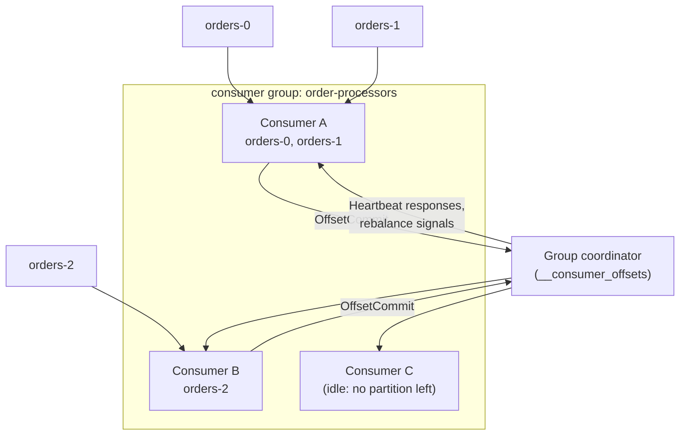
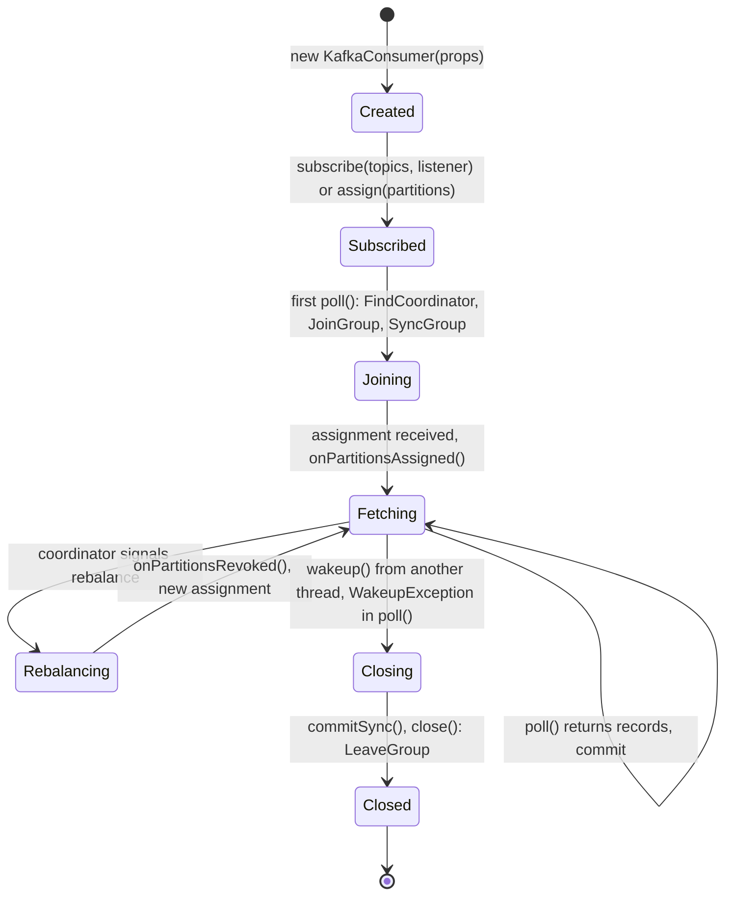
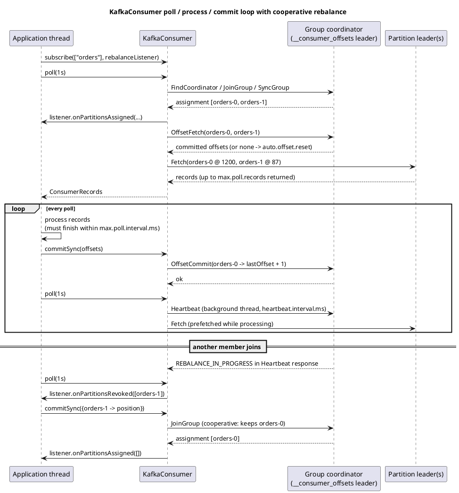
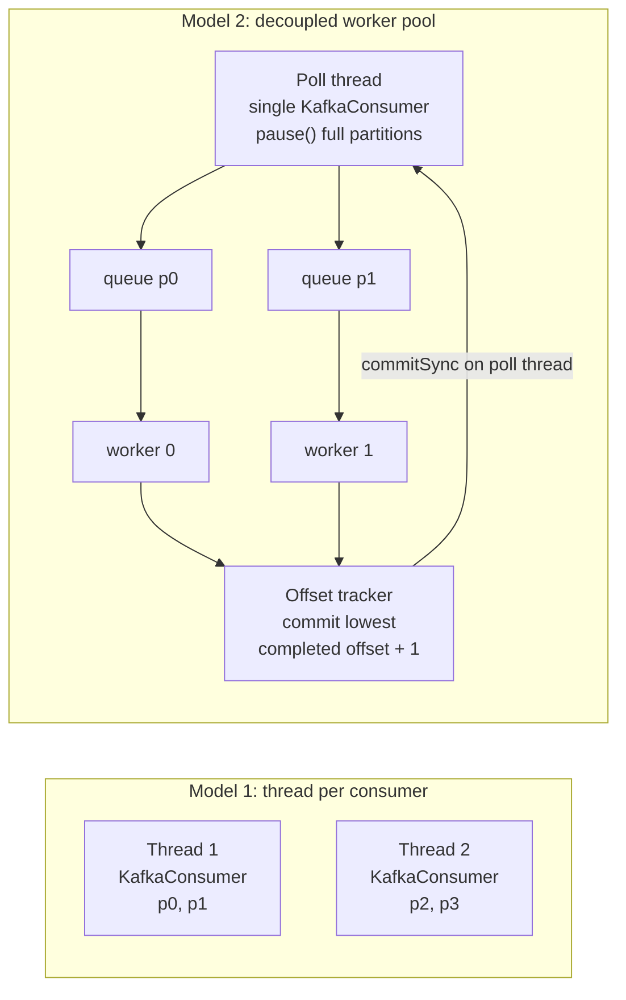

# Consumer API

**Roles:** [DEV] [ARCH] [ADMIN]   **Level:** Intermediate
**Prerequisites:** [Fundamentals: consumer internals](../01-fundamentals/05-consumer-internals.md), [Producer API](01-producer-api.md)

## What you will learn
- The `KafkaConsumer` lifecycle, what `poll()` really does, and how to stop a consumer cleanly with `wakeup()`
- Manual commit patterns: `commitSync` per batch, `commitAsync` with a final sync, per-partition offsets, and committing on revoke with `ConsumerRebalanceListener`
- Seeking by offset and by timestamp, and pause/resume for backpressure
- Multi-threaded consumption: thread-per-consumer vs a decoupled worker pool with offset tracking
- Poison pills, `isolation.level=read_committed`, Spring `@KafkaListener`, and the consumer metrics that reveal lag and rebalance trouble

## 1. Concept

A `KafkaConsumer` is a **single-threaded, pull-based** client. Unlike the producer it is *not* thread-safe: every method except `wakeup()` must be called from the same thread. The application drives everything by calling `poll(Duration)` in a loop; inside `poll()` the consumer joins its group, receives a partition assignment, fetches records, sends heartbeats (since 0.10.1 heartbeats run on a background thread, but rebalance participation still happens inside `poll()`), and auto-commits if enabled.

Three ideas explain most consumer behaviour:

1. **Offsets are the consumer's bookmark, stored in `__consumer_offsets`.** The committed offset is the *next* offset to read, so after processing record at offset 41 you commit 42. Nothing is "acknowledged" per record; committing is a checkpoint.
2. **A partition is owned by exactly one consumer in a group.** Parallelism is bounded by partition count; extra consumers idle.
3. **Liveness has two clocks.** `session.timeout.ms` (default 45 000 since 3.0) is enforced by the coordinator via heartbeats; `max.poll.interval.ms` (default 300 000) is enforced by the client: if the app does not call `poll()` in time, the consumer leaves the group and its partitions are reassigned.



## 2. How it works internally

### 2.1 Lifecycle and the poll loop



`poll(Duration timeout)` does, in order: ensure coordinator is known; join/rejoin the group if needed (this is where rebalances and `ConsumerRebalanceListener` callbacks run); fetch committed offsets for newly assigned partitions (or apply `auto.offset.reset`); return already-buffered records, otherwise send `Fetch` requests and wait up to `timeout`; trigger an auto-commit if `enable.auto.commit=true` and `auto.commit.interval.ms` has elapsed. It returns at most `max.poll.records` records; remaining fetched records stay buffered for the next `poll()`, and the consumer prefetches in the background so the next call usually returns immediately.

### 2.2 Detailed poll/commit/rebalance sequence

Source: [`diagrams/consumer-api-poll-commit-sequence.puml`](../diagrams/consumer-api-poll-commit-sequence.puml)



### 2.3 Rebalance protocols

| Protocol | Config | Behaviour | Since |
|----------|--------|-----------|-------|
| Eager (classic) | `partition.assignment.strategy=RangeAssignor` or `RoundRobinAssignor` | All partitions revoked, then reassigned ("stop the world") | original |
| Cooperative (classic) | `partition.assignment.strategy=CooperativeStickyAssignor` | Only moved partitions are revoked; two-phase JoinGroup; consumers keep processing the rest | 2.4 (KIP-429) |
| Static membership | `group.instance.id=<stable id>` | Restart within `session.timeout.ms` keeps the assignment, no rebalance | 2.3 (KIP-345) |
| Consumer group protocol (KIP-848) | `group.protocol=consumer` | Assignment computed on the broker, incremental, no `JoinGroup`/`SyncGroup`; `session.timeout.ms` and assignor become server-side settings | 3.7 early access, GA in 4.0 |

The default `partition.assignment.strategy` in 3.x is `[RangeAssignor, CooperativeStickyAssignor]`, which lets a rolling upgrade move to cooperative. With KIP-848 on a 4.0 cluster, set `group.protocol=consumer` and the client no longer needs an assignor; the broker's `group.consumer.assignors` (uniform or range) applies.

## 3. Configuration that matters

| Parameter | Default (3.9) | Recommended | Why |
|-----------|---------------|-------------|-----|
| `group.id` | – | one per logical application | Required for `subscribe()`; two apps sharing an id split the partitions between them |
| `enable.auto.commit` | `true` | `false` for anything that must not lose records | Auto-commit commits *the position of the last poll* on the next poll; records still being processed at a crash are lost |
| `auto.commit.interval.ms` | 5000 | – | Only relevant when auto-commit is on |
| `auto.offset.reset` | `latest` | `earliest` for most pipelines | Applies only when there is no committed offset (new group) or the committed offset is out of range |
| `max.poll.records` | 500 | size so a batch processes well within `max.poll.interval.ms` | Upper bound per `poll()`; does not affect fetch size |
| `max.poll.interval.ms` | 300000 | budget for the slowest batch × 2 | Exceeding it makes the consumer leave the group and triggers a rebalance |
| `session.timeout.ms` | 45000 | 45000 | Coordinator detects a dead process after this; must be within broker `group.min.session.timeout.ms`–`group.max.session.timeout.ms` |
| `heartbeat.interval.ms` | 3000 | ≤ ⅓ of session timeout | Background heartbeat cadence |
| `fetch.min.bytes` / `fetch.max.wait.ms` | 1 / 500 | raise `fetch.min.bytes` (e.g. 64 KiB) on high-volume topics | Lets the broker batch responses; lowers request rate at the cost of latency |
| `max.partition.fetch.bytes` | 1048576 | ≥ largest record | A record larger than this stalls the partition (the broker still returns it since KIP-74, but memory must be sufficient) |
| `fetch.max.bytes` | 52428800 | – | Total per fetch response |
| `isolation.level` | `read_uncommitted` | `read_committed` when upstream uses transactions | Hides aborted records and stops at the LSO |
| `partition.assignment.strategy` | `[RangeAssignor, CooperativeStickyAssignor]` | `CooperativeStickyAssignor` | Incremental rebalances |
| `group.instance.id` | `null` | pod-stable id for stateful consumers | Avoids rebalance on restart |
| `group.protocol` | `classic` | `consumer` on 4.0 clusters | KIP-848 |
| `client.rack` | – | AZ id | Fetch from the closest replica (KIP-392, since 2.4) to save cross-AZ cost |
| `client.id` | – | app + instance | Quotas, logs, metrics |

> **Production tip:** `max.poll.records × per-record processing time` must be well under `max.poll.interval.ms`. If one poison record can take 60 s (slow external call with retries), either lower `max.poll.records` or time-box the processing.

## 4. Failure modes and how to detect them

| Symptom | Likely cause | Metric / log to check | Fix |
|---------|--------------|-----------------------|-----|
| Repeated rebalances, log `Member ... sending LeaveGroup request due to consumer poll timeout has expired` | Processing exceeds `max.poll.interval.ms` | `rebalance-total`, `failed-rebalance-total`, `last-poll-seconds-ago` | Lower `max.poll.records`, offload work, raise interval |
| `CommitFailedException: Commit cannot be completed since the group has already rebalanced` | Consumer was kicked out (poll timeout) and another member owns the partition | Consumer log | Same as above; commit inside `onPartitionsRevoked` |
| Duplicate processing after restart | Auto-commit or commit after crash; at-least-once semantics | `commit-rate`, app logs | Idempotent processing (chapter 7); commit more often |
| Lost records after restart | Auto-commit committed before processing finished, or `commitAsync` at close | – | `enable.auto.commit=false`, `commitSync` at end of batch and in shutdown |
| Consumer stuck on one partition, others advance | Record larger than `max.partition.fetch.bytes` | `records-lag` for that partition only, broker log | Raise fetch size |
| Lag grows while CPU idle | Not enough partitions/consumers, or `fetch.max.wait.ms` too high for low-rate topics | `records-lag-max`, `fetch-latency-avg`, `poll-idle-ratio-avg` | Add partitions/consumers; tune fetch |
| Consumer stops after one bad record, same offset forever | Deserialization exception thrown out of `poll()` (poison pill) | `RecordDeserializationException` in logs | Skip via `seek(tp, offset + 1)` and dead-letter; see 6.6 |
| `read_committed` consumer stalls at an offset | Open transaction blocking the LSO (hung transaction) | broker `PartitionsWithLateTransactionsCount`, LSO vs HW | Fix or abort the transaction; broker aborts after `transaction.max.timeout.ms` |
| Consumer never receives records after `assign()` | Using `assign()` with a `group.id` but expecting group semantics; or committed offset beyond end | `position()` vs `endOffsets()` | Understand assign vs subscribe |
| Uneven lag across consumers | Range assignor with many topics; hot keys | `assigned-partitions` per member, per-partition lag | Switch to sticky/uniform assignor; fix key distribution |

## 5. Design guidance (architect view)

### 5.1 Delivery semantics from the consumer's viewpoint

| Pattern | Semantics | Duplicate window |
|---------|-----------|------------------|
| Auto-commit | At-least-once in practice, but at-most-once for records in flight during a crash | up to `auto.commit.interval.ms` of records |
| Commit after batch (`commitSync`) | At-least-once | one batch (≤ `max.poll.records`) |
| Commit per record | At-least-once, very slow | one record |
| Commit before processing | At-most-once | none, but data loss possible |
| Store offset with output atomically (DB transaction, or Kafka transaction) | Exactly-once effect | none |

### 5.2 Threading models

| Model | Ordering | Complexity | Throughput per partition | When |
|-------|----------|------------|--------------------------|------|
| One consumer per thread (N threads, N consumers, same group) | Per partition preserved | Low | Bounded by one thread | Default; scale by partitions |
| One consumer, worker pool, offsets tracked per partition | Preserved if workers are keyed by partition; otherwise lost | High (must track lowest completed offset, pause partitions) | High | Slow per-record work (HTTP, DB) with few partitions |
| One consumer, worker pool, commit only when whole batch done | Preserved within batch boundaries | Medium | Medium | Simplest parallel variant; batch latency = slowest record |
| Kafka Streams / Parallel Consumer library | Per key | Managed by library | High | Prefer over hand-rolled worker pools |



### 5.3 Decision table

| Requirement | Choice |
|-------------|--------|
| Simple at-least-once pipeline | `enable.auto.commit=false`, `commitSync` after each batch, cooperative assignor |
| Zero duplicate side effects | Idempotent sink keyed by (topic, partition, offset) or transactional consume-transform-produce (chapter 6) |
| Long-running per-record work | Worker pool with `pause()`/`resume()` and offset tracker, or reduce `max.poll.records` |
| Replay from a point in time | `offsetsForTimes()` + `seek()`; or `kafka-consumer-groups.sh --reset-offsets --to-datetime` while the group is inactive |
| Stateful consumers with expensive startup | `group.instance.id` static membership |
| Reading only committed transactional data | `isolation.level=read_committed` |

> **Anti-pattern:** Sharing one `KafkaConsumer` between threads with `synchronized`. The client throws `ConcurrentModificationException` on concurrent access, and serializing calls defeats the purpose. Use one consumer per thread or a single poll thread with a worker pool.

> **Anti-pattern:** Calling `commitSync()` after every record. Each call is a blocking round trip to the coordinator; throughput drops to a few hundred records per second per consumer.

## 6. Hands-on

### 6.1 Complete consumer with clean shutdown and commit-on-revoke

```java
package guide.consumer;

import org.apache.kafka.clients.consumer.*;
import org.apache.kafka.common.TopicPartition;
import org.apache.kafka.common.errors.WakeupException;
import org.apache.kafka.common.serialization.StringDeserializer;

import java.time.Duration;
import java.util.*;
import java.util.concurrent.CountDownLatch;

public class OrderConsumer implements Runnable {

    private final KafkaConsumer<String, String> consumer;
    private final Map<TopicPartition, OffsetAndMetadata> pending = new HashMap<>();
    private final CountDownLatch stopped = new CountDownLatch(1);

    public OrderConsumer(String bootstrapServers, String groupId) {
        Properties props = new Properties();
        props.put(ConsumerConfig.BOOTSTRAP_SERVERS_CONFIG, bootstrapServers);
        props.put(ConsumerConfig.GROUP_ID_CONFIG, groupId);
        props.put(ConsumerConfig.CLIENT_ID_CONFIG, "order-consumer-" + UUID.randomUUID());
        props.put(ConsumerConfig.KEY_DESERIALIZER_CLASS_CONFIG, StringDeserializer.class.getName());
        props.put(ConsumerConfig.VALUE_DESERIALIZER_CLASS_CONFIG, StringDeserializer.class.getName());
        props.put(ConsumerConfig.ENABLE_AUTO_COMMIT_CONFIG, false);
        props.put(ConsumerConfig.AUTO_OFFSET_RESET_CONFIG, "earliest");
        props.put(ConsumerConfig.MAX_POLL_RECORDS_CONFIG, 200);
        props.put(ConsumerConfig.MAX_POLL_INTERVAL_MS_CONFIG, 300_000);
        props.put(ConsumerConfig.PARTITION_ASSIGNMENT_STRATEGY_CONFIG,
                CooperativeStickyAssignor.class.getName());
        props.put(ConsumerConfig.ISOLATION_LEVEL_CONFIG, "read_committed");
        this.consumer = new KafkaConsumer<>(props);
    }

    @Override
    public void run() {
        try {
            consumer.subscribe(List.of("orders"), new ConsumerRebalanceListener() {
                @Override
                public void onPartitionsRevoked(Collection<TopicPartition> partitions) {
                    // called on the poll thread before ownership is lost: commit what we processed
                    Map<TopicPartition, OffsetAndMetadata> toCommit = new HashMap<>();
                    for (TopicPartition tp : partitions) {
                        OffsetAndMetadata om = pending.remove(tp);
                        if (om != null) toCommit.put(tp, om);
                    }
                    if (!toCommit.isEmpty()) consumer.commitSync(toCommit);
                    System.out.println("revoked " + partitions + ", committed " + toCommit);
                }

                @Override
                public void onPartitionsAssigned(Collection<TopicPartition> partitions) {
                    System.out.println("assigned " + partitions);
                }

                @Override
                public void onPartitionsLost(Collection<TopicPartition> partitions) {
                    // we are no longer the owner (e.g. poll timeout): do NOT commit, just drop state
                    partitions.forEach(pending::remove);
                }
            });

            while (true) {
                ConsumerRecords<String, String> records = consumer.poll(Duration.ofSeconds(1));
                for (ConsumerRecord<String, String> record : records) {
                    process(record);
                    // committed offset = next offset to read
                    pending.put(new TopicPartition(record.topic(), record.partition()),
                            new OffsetAndMetadata(record.offset() + 1, "order-consumer"));
                }
                if (!pending.isEmpty()) {
                    consumer.commitSync(pending);   // per batch, blocking, retried internally
                    pending.clear();
                }
            }
        } catch (WakeupException e) {
            // expected on shutdown: wakeup() was called from another thread
        } finally {
            try {
                if (!pending.isEmpty()) consumer.commitSync(pending);
            } finally {
                consumer.close(Duration.ofSeconds(10));  // sends LeaveGroup, triggers rebalance now
                stopped.countDown();
            }
        }
    }

    private void process(ConsumerRecord<String, String> record) {
        System.out.printf("%s-%d@%d key=%s value=%s headers=%s%n",
                record.topic(), record.partition(), record.offset(),
                record.key(), record.value(), record.headers());
    }

    /** Safe to call from any thread. */
    public void shutdown() throws InterruptedException {
        consumer.wakeup();
        stopped.await();
    }

    public static void main(String[] args) throws Exception {
        OrderConsumer oc = new OrderConsumer("localhost:9092", "order-processors");
        Thread t = new Thread(oc, "order-consumer");
        Runtime.getRuntime().addShutdownHook(new Thread(() -> {
            try { oc.shutdown(); } catch (InterruptedException ignored) { }
        }));
        t.start();
        t.join();
    }
}
```

`wakeup()` is the only thread-safe method: it makes the next (or currently blocking) `poll()` throw `WakeupException`. The `finally` block commits and then calls `close()`, which sends `LeaveGroup` so the group rebalances immediately instead of waiting for `session.timeout.ms`.

### 6.2 `commitAsync` with a final `commitSync`

`commitAsync` does not block and does not retry (a retry could commit an older offset after a newer one). The standard pattern is async in the loop, sync on shutdown:

```java
while (running) {
    ConsumerRecords<String, String> records = consumer.poll(Duration.ofMillis(500));
    for (ConsumerRecord<String, String> r : records) process(r);
    consumer.commitAsync((offsets, exception) -> {
        if (exception != null) {
            log.warn("async commit failed for {}", offsets, exception); // do not retry here
        }
    });
}
// on the way out:
try {
    consumer.commitSync();     // retries until success or a non-retriable error
} finally {
    consumer.close();
}
```

`commitAsync()` with no arguments commits the current `position()` of every assigned partition, i.e. everything returned by the last `poll()`.

### 6.3 Committing specific offsets per partition mid-batch

Useful when a batch is large and you want a checkpoint every N records:

```java
Map<TopicPartition, OffsetAndMetadata> offsets = new HashMap<>();
int count = 0;
for (ConsumerRecord<String, String> r : records) {
    process(r);
    offsets.put(new TopicPartition(r.topic(), r.partition()), new OffsetAndMetadata(r.offset() + 1));
    if (++count % 100 == 0) {
        consumer.commitAsync(offsets, null);   // offsets map is copied by the client
    }
}
consumer.commitSync(offsets);
```

Alternatively, process partition by partition with `records.partitions()` and `records.records(tp)`, committing after each partition's slice: the last record of the slice gives the offset to commit.

### 6.4 Seeking: by offset, to beginning, by timestamp

```java
// requires an assignment; with subscribe() do this inside onPartitionsAssigned
Set<TopicPartition> assigned = consumer.assignment();

// 1. absolute offset
consumer.seek(new TopicPartition("orders", 0), 1200L);

// 2. beginning / end
consumer.seekToBeginning(assigned);
consumer.seekToEnd(assigned);

// 3. by timestamp: earliest offset whose timestamp >= given time
long sinceMs = Instant.now().minus(Duration.ofHours(2)).toEpochMilli();
Map<TopicPartition, Long> query = new HashMap<>();
for (TopicPartition tp : assigned) query.put(tp, sinceMs);
Map<TopicPartition, OffsetAndTimestamp> result = consumer.offsetsForTimes(query);
result.forEach((tp, ot) -> {
    if (ot != null) consumer.seek(tp, ot.offset());   // null when no record at or after the timestamp
    else consumer.seekToEnd(List.of(tp));
});

// inspecting positions
long pos = consumer.position(new TopicPartition("orders", 0));
Map<TopicPartition, Long> end = consumer.endOffsets(assigned);
Map<TopicPartition, OffsetAndMetadata> committed = consumer.committed(assigned);
```

`seek()` only changes the in-memory fetch position; the new position becomes durable when you commit. For a stateless bulk reset, prefer the CLI (`kafka-consumer-groups.sh --bootstrap-server localhost:9092 --group order-processors --topic orders --reset-offsets --to-datetime 2026-09-01T00:00:00.000 --execute`), which requires the group to be empty.

### 6.5 Pause and resume for backpressure

`pause(partitions)` makes `poll()` keep heartbeating and rebalancing but return no records for those partitions. This is the correct way to slow down without leaving the group.

```java
Set<TopicPartition> paused = new HashSet<>();
while (running) {
    ConsumerRecords<String, String> records = consumer.poll(Duration.ofMillis(200));
    for (ConsumerRecord<String, String> r : records) {
        TopicPartition tp = new TopicPartition(r.topic(), r.partition());
        if (!workQueue(tp).offer(r)) {          // bounded queue full
            consumer.pause(List.of(tp));
            paused.add(tp);
            consumer.seek(tp, r.offset());       // re-read this record later; poll already advanced position
            break;
        }
    }
    for (Iterator<TopicPartition> it = paused.iterator(); it.hasNext();) {
        TopicPartition tp = it.next();
        if (workQueue(tp).remainingCapacity() > 0) {
            consumer.resume(List.of(tp));
            it.remove();
        }
    }
}
```

Paused state is per consumer instance and is lost on rebalance for partitions that move; re-pause in `onPartitionsAssigned` if needed. `consumer.paused()` returns the current set.

### 6.6 Poison pills: skipping a record that cannot be deserialized

When a deserializer throws, `poll()` throws `RecordDeserializationException` (since 2.8, KIP-334 exposes the partition and offset; since 3.8 it also carries the raw key/value bytes and headers). The position does **not** advance, so the loop would fail forever without intervention.

```java
try {
    records = consumer.poll(Duration.ofSeconds(1));
} catch (RecordDeserializationException e) {
    TopicPartition tp = e.topicPartition();
    long badOffset = e.offset();
    log.error("poison pill at {}@{}: {}", tp, badOffset, e.getMessage());
    deadLetterProducer.send(new ProducerRecord<>("orders.dlt", null,
            e.keyBuffer() == null ? null : toBytes(e.keyBuffer()),
            e.valueBuffer() == null ? null : toBytes(e.valueBuffer()),
            e.headers()));
    consumer.seek(tp, badOffset + 1);   // skip it
    continue;
}
```

For records that deserialize but fail in business logic, catch the exception in the processing code, write to a dead-letter topic with diagnostic headers, and keep going (chapter 7 covers retry topics).

> **Anti-pattern:** Wrapping the whole `poll()` loop in `try { ... } catch (Exception e) { log.error(e); }` with no `seek()`. The consumer re-polls, gets the same bad record, and logs the same error forever while lag grows on every other partition it owns.

### 6.7 Worker pool with per-partition offset tracking

The pattern: one poll thread, one bounded queue and one single-threaded executor per partition (keeps order within a partition), and an offset tracker that commits the lowest completed contiguous offset. Partitions are paused while their queue is full.

```java
package guide.consumer;

import org.apache.kafka.clients.consumer.*;
import org.apache.kafka.common.TopicPartition;

import java.time.Duration;
import java.util.*;
import java.util.concurrent.*;

public class PartitionWorkerPoolConsumer {

    private final KafkaConsumer<String, String> consumer;
    private final Map<TopicPartition, ExecutorService> executors = new HashMap<>();
    private final Map<TopicPartition, Long> nextToCommit = new ConcurrentHashMap<>();
    private final Map<TopicPartition, Integer> inFlight = new ConcurrentHashMap<>();
    private static final int MAX_IN_FLIGHT = 1000;

    public PartitionWorkerPoolConsumer(KafkaConsumer<String, String> consumer) {
        this.consumer = consumer;
    }

    public void run() {
        consumer.subscribe(List.of("orders"), new ConsumerRebalanceListener() {
            @Override public void onPartitionsRevoked(Collection<TopicPartition> parts) {
                for (TopicPartition tp : parts) {
                    ExecutorService ex = executors.remove(tp);
                    if (ex != null) {
                        ex.shutdown();
                        try { ex.awaitTermination(30, TimeUnit.SECONDS); } catch (InterruptedException ignored) { }
                    }
                }
                commitCompleted(parts, true);
            }
            @Override public void onPartitionsAssigned(Collection<TopicPartition> parts) {
                for (TopicPartition tp : parts) {
                    executors.put(tp, Executors.newSingleThreadExecutor(r -> new Thread(r, "worker-" + tp)));
                    inFlight.put(tp, 0);
                }
            }
        });

        while (true) {
            ConsumerRecords<String, String> records = consumer.poll(Duration.ofMillis(200));
            for (TopicPartition tp : records.partitions()) {
                for (ConsumerRecord<String, String> r : records.records(tp)) {
                    inFlight.merge(tp, 1, Integer::sum);
                    executors.get(tp).submit(() -> {
                        try {
                            process(r);
                        } finally {
                            // single thread per partition => completion is in offset order
                            nextToCommit.put(tp, r.offset() + 1);
                            inFlight.merge(tp, -1, Integer::sum);
                        }
                    });
                }
                if (inFlight.get(tp) >= MAX_IN_FLIGHT) consumer.pause(List.of(tp));
            }
            for (TopicPartition tp : consumer.paused()) {
                if (inFlight.getOrDefault(tp, 0) < MAX_IN_FLIGHT / 2) consumer.resume(List.of(tp));
            }
            commitCompleted(consumer.assignment(), false);
        }
    }

    private void commitCompleted(Collection<TopicPartition> parts, boolean sync) {
        Map<TopicPartition, OffsetAndMetadata> offsets = new HashMap<>();
        for (TopicPartition tp : parts) {
            Long next = nextToCommit.remove(tp);
            if (next != null) offsets.put(tp, new OffsetAndMetadata(next));
        }
        if (offsets.isEmpty()) return;
        if (sync) consumer.commitSync(offsets); else consumer.commitAsync(offsets, null);
    }

    private void process(ConsumerRecord<String, String> r) { /* slow work here */ }
}
```

If you need parallelism *within* a partition (workers keyed by record key, not partition), the tracker must keep a sorted set of completed offsets per partition and commit only up to the first gap. The open-source Confluent Parallel Consumer library implements exactly this; use it rather than hand-rolling when key-level parallelism is required.

### 6.8 Spring Kafka `@KafkaListener`

```yaml
spring:
  kafka:
    bootstrap-servers: localhost:9092
    consumer:
      group-id: order-processors
      auto-offset-reset: earliest
      enable-auto-commit: false
      key-deserializer: org.apache.kafka.common.serialization.StringDeserializer
      value-deserializer: org.springframework.kafka.support.serializer.ErrorHandlingDeserializer
      properties:
        spring.deserializer.value.delegate.class: org.springframework.kafka.support.serializer.JsonDeserializer
        spring.json.value.default.type: guide.OrderCreated
        isolation.level: read_committed
        partition.assignment.strategy: org.apache.kafka.clients.consumer.CooperativeStickyAssignor
    listener:
      ack-mode: MANUAL_IMMEDIATE
      concurrency: 3
```

```java
@Configuration
public class ListenerConfig {

    @Bean
    public DefaultErrorHandler errorHandler(KafkaTemplate<Object, Object> template) {
        // retry 3 times with 1 s back-off, then publish to <topic>.DLT (same partition number)
        DeadLetterPublishingRecoverer recoverer = new DeadLetterPublishingRecoverer(template);
        DefaultErrorHandler handler = new DefaultErrorHandler(recoverer, new FixedBackOff(1000L, 3));
        handler.addNotRetryableExceptions(IllegalArgumentException.class, DeserializationException.class);
        return handler;
    }
}

@Component
public class OrderListener {

    @KafkaListener(
            id = "orders-listener",
            topics = "orders",
            groupId = "order-processors",
            concurrency = "3")            // 3 KafkaConsumer instances in this JVM
    public void onOrder(ConsumerRecord<String, OrderCreated> record, Acknowledgment ack) {
        handle(record.value());
        ack.acknowledge();                 // MANUAL_IMMEDIATE: commitSync for this record's offset + 1
    }

    @KafkaListener(topics = "orders", groupId = "order-batchers", batch = "true",
            containerFactory = "batchFactory")
    public void onBatch(List<ConsumerRecord<String, OrderCreated>> records, Acknowledgment ack) {
        records.forEach(r -> handle(r.value()));
        ack.acknowledge();
    }
}
```

`concurrency` creates that many consumer threads within one container, each with its own `KafkaConsumer`; it cannot exceed the partition count usefully. `DefaultErrorHandler` (Spring Kafka 2.8+) replaces `SeekToCurrentErrorHandler`: on failure it seeks back so the record is re-polled, applies the back-off, and after exhaustion invokes the recoverer. `ErrorHandlingDeserializer` turns deserialization failures into a header-carrying record so the error handler can dead-letter it instead of poisoning the loop.

### 6.9 Metrics to watch

JMX domain `kafka.consumer`, grouped by `type`:

| Group | Metric | Meaning / threshold |
|-------|--------|---------------------|
| `consumer-fetch-manager-metrics` | `records-lag-max` | Largest lag (in records) over the partitions this consumer owns; rising steadily = falling behind |
| | `records-lag` (per partition tag) | Lag per partition; one partition lagging suggests a hot key or fetch-size stall |
| | `fetch-latency-avg` / `fetch-latency-max` | Time per fetch; near `fetch.max.wait.ms` on a quiet topic is normal |
| | `records-consumed-rate`, `bytes-consumed-rate` | Throughput |
| | `fetch-size-avg` | Small values with high lag = `fetch.min.bytes` too small or broker slow |
| `consumer-coordinator-metrics` | `commit-latency-avg` | Round trip for `OffsetCommit`; hundreds of ms means the coordinator is overloaded |
| | `commit-rate` | Commits per second; very high = committing per record |
| | `rebalance-latency-avg`, `rebalance-total`, `failed-rebalance-total` | Rebalance churn |
| | `last-rebalance-seconds-ago` | Alert if it resets constantly |
| | `assigned-partitions` | Detect idle consumers (0) |
| `consumer-metrics` | `time-between-poll-avg`, `time-between-poll-max` | Must stay well under `max.poll.interval.ms` |
| | `last-poll-seconds-ago` | Stalled consumer detector |
| | `poll-idle-ratio-avg` | Fraction of time spent inside `poll()` waiting; ~1 means starved of data, ~0 means the app is the bottleneck |

Group-level lag from the outside: `kafka-consumer-groups.sh --bootstrap-server localhost:9092 --describe --group order-processors`, or an exporter such as Burrow or kafka-lag-exporter. Client-side `records-lag-max` disappears when the consumer dies; external lag monitoring does not.

## 7. Interview questions for this chapter

### Q1. Why is `KafkaConsumer` not thread-safe, and what is the one method you may call from another thread?
**Role:** [DEV] | **Difficulty:** ★☆☆ | **Topic:** Threading

**Answer.**
The consumer keeps fetch positions, buffered records, and group-membership state that must be mutated in a defined order relative to `poll()`; guarding all of that with locks would serialize the loop anyway, so the client instead detects concurrent access and throws `ConcurrentModificationException`. The exception is `wakeup()`, which is designed to be called from another thread to abort a blocking `poll()` with `WakeupException`, giving a clean shutdown path.

**Follow-up probes.** How do you get parallelism then? What does the heartbeat thread do?

### Q2. What does the committed offset represent, and what happens if you commit `record.offset()` instead of `record.offset() + 1`?
**Role:** [DEV] | **Difficulty:** ★☆☆ | **Topic:** Offsets

**Answer.**
The committed offset is the next offset the group should read. Committing `record.offset()` reprocesses the last record of every batch after a restart or rebalance, which is a subtle duplicate source. `commitSync()` with no arguments commits `position()`, which already is "last returned + 1", so the bug only appears when building the map manually.

**Follow-up probes.** Where are offsets stored? What is the `metadata` string in `OffsetAndMetadata` for?

### Q3. Explain the difference between `session.timeout.ms` and `max.poll.interval.ms`.
**Role:** [DEV] [ADMIN] | **Difficulty:** ★★☆ | **Topic:** Liveness

**Answer.**
`session.timeout.ms` (45 s) is the coordinator's view: if no heartbeat arrives within it, the member is declared dead and a rebalance starts. Heartbeats come from a background thread, so a process that is alive but stuck in processing still heartbeats. `max.poll.interval.ms` (5 min) is the client's own check: if the application does not call `poll()` within it, the client stops heartbeating and sends `LeaveGroup`, and the next commit fails with `CommitFailedException`. The first detects dead processes; the second detects live-but-stuck ones.

**Follow-up probes.** Which timeout would you tune for slow processing? Why not just set both to an hour?

### Q4. Auto-commit is enabled. Can you lose records? Can you duplicate them?
**Role:** [DEV] | **Difficulty:** ★★☆ | **Topic:** Delivery semantics

**Answer.**
Both. Auto-commit commits the position of the previous `poll()` at the start of the next `poll()` (if the interval elapsed). Records returned but not yet processed when the process dies are already committed by the next poll, so they are lost. Conversely, records processed but not yet committed (up to 5 s worth) are reprocessed after a restart. Turn it off and commit after processing for at-least-once, then make processing idempotent.

**Follow-up probes.** Does auto-commit happen on `close()`? (Yes, `close()` performs a final synchronous commit when auto-commit is on.)

### Q5. Describe a correct pattern for consuming with a worker pool while preserving at-least-once.
**Role:** [DEV] [ARCH] | **Difficulty:** ★★★ | **Topic:** Threading

**Answer.**
One poll thread owns the consumer; it dispatches records to per-partition (or per-key) executors and pauses partitions whose queues are full so that `poll()` keeps heartbeating without pulling more data. Workers report completion to an offset tracker; the poll thread commits, per partition, the lowest offset such that every earlier offset is complete (a contiguous prefix). On `onPartitionsRevoked`, drain or cancel workers for those partitions and commit synchronously. Never commit from a worker thread.

**Follow-up probes.** What happens to in-flight records after `onPartitionsLost`? How does this compare to Kafka Streams' model?

### Q6. What does `isolation.level=read_committed` change in the consumer?
**Role:** [DEV] | **Difficulty:** ★★☆ | **Topic:** Transactions

**Answer.**
The consumer only reads up to the last stable offset (LSO), the offset before the earliest open transaction, and it filters out records from aborted transactions using the abort index and control records. Under `read_uncommitted` (default) it reads to the high watermark and sees aborted data. The cost is added latency equal to the transaction commit interval, and a hung transaction can freeze the LSO, stalling the consumer.

**Follow-up probes.** What is a control record? How does the broker know which records were aborted?

### Q7. How does `CooperativeStickyAssignor` reduce rebalance impact compared to eager assignors?
**Role:** [ARCH] [DEV] | **Difficulty:** ★★☆ | **Topic:** Rebalancing

**Answer.**
Eager protocols revoke every partition from every member at the start of a rebalance, so all consumers stop until the new assignment is synced. Cooperative rebalancing (KIP-429, 2.4) runs two rounds: the first computes the new assignment while members keep their current partitions; only partitions that move are revoked, and a second round assigns them. Members keep processing unaffected partitions throughout. KIP-848 (`group.protocol=consumer`, GA in 4.0) goes further by computing assignments on the broker with incremental, per-member reconciliation.

**Follow-up probes.** Why can you not switch from eager to cooperative in a single rolling restart without the two-strategy list? What does `onPartitionsLost` mean under cooperative?

### Q8. Your consumer's `records-lag-max` grows but CPU is at 10%. Walk through your diagnosis.
**Role:** [ADMIN] [DEV] | **Difficulty:** ★★★ | **Topic:** Diagnostics

**Answer.**
Low CPU with growing lag means the consumer is waiting, not computing. Check `poll-idle-ratio-avg`: near 0 means processing (blocked on I/O such as a DB or HTTP call) is the bottleneck; near 1 means fetches are slow or small (`fetch-latency-avg`, `fetch-size-avg`, broker load, `client.rack` mismatch). Check whether lag is on one partition only (`records-lag` per partition), which points to a hot key or an oversized record. Then look at `time-between-poll-avg` and `rebalance-total` to rule out rebalance storms. Fixes range from adding partitions and consumers, raising `fetch.min.bytes`, to parallelizing I/O with a worker pool.

**Follow-up probes.** Would raising `max.poll.records` help? When does it hurt?

### Q9. How do you replay a topic from 2 hours ago for a running consumer group?
**Role:** [DEV] [ADMIN] | **Difficulty:** ★★☆ | **Topic:** Seeking

**Answer.**
Inside the application: in `onPartitionsAssigned`, call `offsetsForTimes()` with the target timestamp for each assigned partition and `seek()` to the returned offsets (a null entry means no record at or after that time, so `seekToEnd`). Then commit so the new position is durable. From the outside: stop all members, run `kafka-consumer-groups.sh --bootstrap-server localhost:9092 --group <g> --topic <t> --reset-offsets --to-datetime <ISO8601> --execute`, restart. Timestamp lookups use the record timestamp index, so they depend on `message.timestamp.type` (`CreateTime` vs `LogAppendTime`).

**Follow-up probes.** What if the group has active members during the CLI reset? What about compacted topics?

## Key takeaways
- The consumer is single-threaded and pull-based; everything, including rebalances and callbacks, happens inside `poll()`. Stop it with `wakeup()` from another thread.
- Disable auto-commit for anything important; commit `lastOffset + 1` after processing, per batch, and again in `onPartitionsRevoked` and before `close()`.
- `pause()`/`resume()` give backpressure without leaving the group; a poison pill needs `seek(offset + 1)` plus a dead letter.
- Parallelism is by partition. Worker pools need an offset tracker and paused partitions; libraries (Streams, Parallel Consumer) do this for you.
- Alert on `records-lag-max`, `time-between-poll-max`, `rebalance-total`, and `commit-latency-avg`.

## Further reading
- Apache Kafka documentation: Consumer configs and `KafkaConsumer` Javadoc (multithreaded processing section)
- KIP-62: Allow consumer to send heartbeats from a background thread
- KIP-345: Static membership
- KIP-429: Kafka Consumer Incremental Rebalance Protocol
- KIP-848: The Next Generation of the Consumer Rebalance Protocol
- KIP-392: Allow consumers to fetch from closest replica
- Spring for Apache Kafka reference: "Receiving Messages", "Handling Exceptions"
