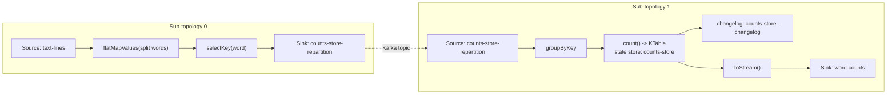
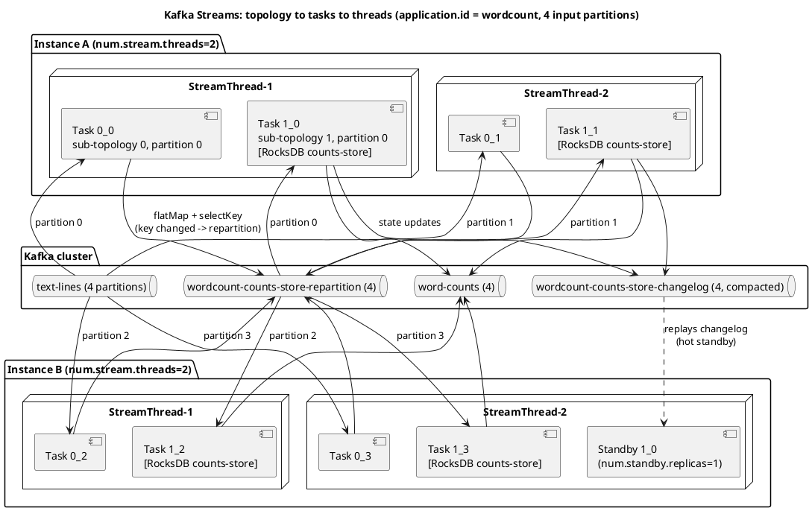
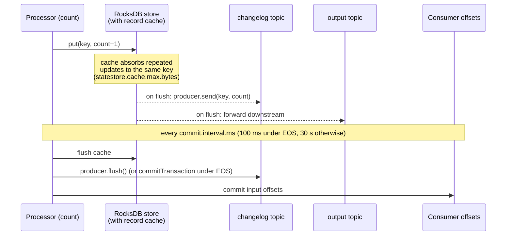
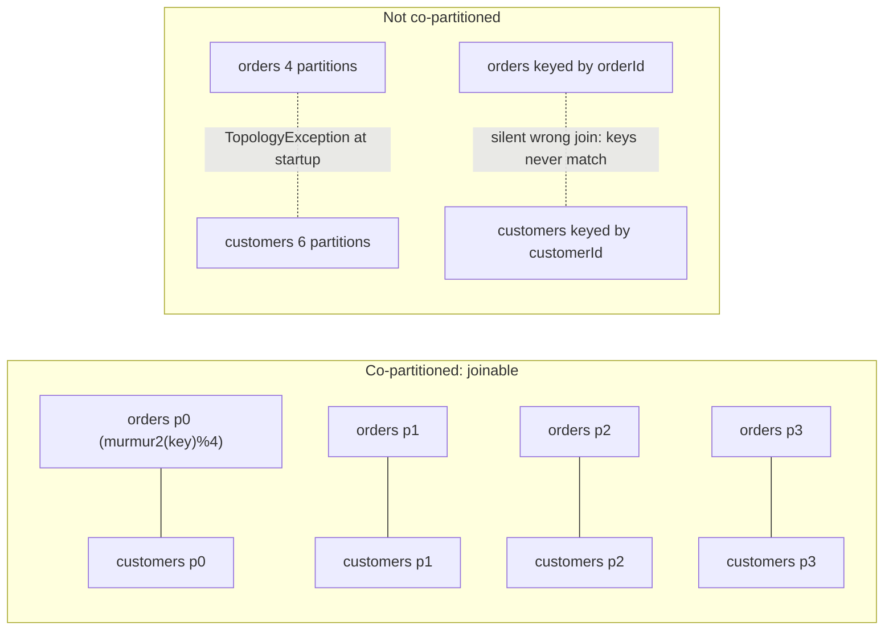

# Kafka Streams

**Roles:** [DEV] [ARCH] [ADMIN]   **Level:** Advanced
**Prerequisites:** [Producer API](01-producer-api.md), [Consumer API](02-consumer-api.md), [Transactions and exactly-once](06-transactions-exactly-once.md) (for `exactly_once_v2`)

## What you will learn
- How a topology becomes sub-topologies, tasks and threads, and where state stores, changelog and repartition topics come from
- DSL vs Processor API; `KStream`, `KTable` and `GlobalKTable` semantics; stateless and stateful operators, joins and the co-partitioning rule
- Windowing (tumbling, hopping, sliding, session), grace periods, `suppress()`, and time semantics
- Exactly-once (`exactly_once_v2`), standby replicas, RocksDB tuning and interactive queries
- Runnable word-count, windowed aggregation and join examples, `TopologyTestDriver` tests, common failures, and how Streams compares with ksqlDB and Flink

## 1. Concept

Kafka Streams is a Java library (not a cluster) for building stream-processing applications on top of the consumer and producer clients. An application is a **topology**: a graph of source nodes (topics), processor nodes (operations) and sink nodes (topics). You run the same JAR on N instances; they form a consumer group (`application.id`) and Kafka's group protocol distributes work among them. State lives locally (RocksDB or in-memory) and is made durable by mirroring every update to a **changelog topic**, so a failed instance's state can be rebuilt elsewhere.

Vocabulary you must have straight:

| Term | Meaning |
|------|---------|
| Topology | The whole processing graph built with `StreamsBuilder` (DSL) or `Topology` (Processor API) |
| Sub-topology | A connected component of the graph that reads from its own set of topics; created whenever data crosses a repartition topic |
| Task | Sub-topology × input partition. Task `1_3` = sub-topology 1, partition 3. The unit of parallelism and of state ownership |
| Stream thread | `num.stream.threads` per instance; each thread owns a consumer, a producer (or one per task under EOS v1, removed in 4.0), and a set of tasks |
| State store | Local key-value / window / session store attached to a processor; `Materialized` in the DSL |
| Changelog topic | `<application.id>-<store-name>-changelog`, compacted; backs every persistent store |
| Repartition topic | `<application.id>-<name>-repartition`; created automatically when the key changes before a stateful operation |
| Standby task | A passive replica of a task's state on another instance, kept warm from the changelog |



## 2. How it works internally

### 2.1 From topology to tasks

Source: [`diagrams/kafka-streams-task-assignment.puml`](../diagrams/kafka-streams-task-assignment.puml)



The number of tasks is fixed by the topology and the partition counts of its input topics: with 4 partitions and 2 sub-topologies there are 8 tasks, no matter how many instances or threads you start. Threads beyond 8 idle. Scaling therefore starts with partition count.

The assignor (`StreamsPartitionAssignor`, running inside the consumer group's leader) assigns active tasks preferring instances that already have the state on disk ("sticky"), warms up standbys on other instances, and since 2.6 (KIP-441) moves an active task only when the target's lag is below `acceptable.recovery.lag` (default 10 000 records), probing every `probing.rebalance.interval.ms` (10 min) until then.

### 2.2 State store and changelog flow



On restart, a task with a persistent store reads its local `.checkpoint` file (offset of the changelog it has applied) and replays only the delta. Without a checkpoint (fresh instance, or after an unclean shutdown under EOS where the checkpoint is deleted) the whole changelog is replayed, which is why restoration time is proportional to changelog size and why `num.standby.replicas >= 1` matters for large stores.

### 2.3 Time semantics

| Time | Source | Config |
|------|--------|--------|
| Event time | Producer-set record timestamp (`CreateTime`) | default `FailOnInvalidTimestamp` extractor |
| Ingestion time | Broker-set timestamp (`LogAppendTime` on the topic) | same extractor, timestamp comes from broker |
| Processing time | Wall clock when the record is processed | `WallclockTimestampExtractor` |
| Custom | Field inside the payload | implement `TimestampExtractor` |

Set with `default.timestamp.extractor`. Alternatives to the failing default: `LogAndSkipOnInvalidTimestamp`, `UsePartitionTimeOnInvalidTimestamp`. Stream time per task is the maximum event time seen so far and only moves forward; windows close relative to stream time, so a topic that stops receiving data never closes its last window until new data arrives.

### 2.4 Windows

```mermaid
gantt
    title Window types over event time (size 10 s where applicable)
    dateFormat ss
    axisFormat %S
    section Tumbling (size 10)
    w0           :00, 10s
    w1           :10, 10s
    w2           :20, 10s
    section Hopping (size 10, advance 5)
    h0           :00, 10s
    h1           :05, 10s
    h2           :10, 10s
    h3           :15, 10s
    section Session (gap 5)
    s0 (events 1,3,6)      :01, 10s
    s1 (events 18,20)      :18, 7s
```



| Window | Builder | Semantics |
|--------|---------|-----------|
| Tumbling | `TimeWindows.ofSizeAndGrace(Duration.ofMinutes(5), Duration.ofMinutes(1))` | Fixed, non-overlapping, aligned to epoch |
| Hopping | `TimeWindows.ofSizeAndGrace(size, grace).advanceBy(step)` | Fixed size, overlapping; each record lands in `size/step` windows |
| Sliding | `SlidingWindows.ofTimeDifferenceAndGrace(Duration.ofMinutes(5), grace)` | One window per record-pair within the time difference; since 2.7 (KIP-450) |
| Session | `SessionWindows.ofInactivityGapAndGrace(Duration.ofMinutes(30), grace)` | Data-driven, merges when a record bridges two sessions |
| Join window | `JoinWindows.ofTimeDifferenceAndGrace(Duration.ofMinutes(5), grace)` | For stream-stream joins |

**Grace period** is how long after a window's end late records are still accepted; records later than that are dropped (metric `dropped-records-total`). Since 3.0 the `ofSizeWithNoGrace` / `ofSizeAndGrace` constructors force an explicit choice; the deprecated `of()` had a 24-hour default grace which surprised many teams.

**`suppress()`** holds intermediate results until the window closes (`Suppressed.untilWindowCloses(BufferConfig.unbounded())`), emitting exactly one final result per window. Without it, every update to a window is emitted downstream (the KTable semantics of a windowed aggregation). Emit-final semantics are also available directly since 3.4 via `EmitStrategy.onWindowClose()` on windowed aggregations.

## 3. Configuration that matters

| Parameter | Default (3.9) | Recommended | Why |
|-----------|---------------|-------------|-----|
| `application.id` | – | stable, versioned name | Consumer group id, prefix for all internal topics, and state directory name |
| `bootstrap.servers` | – | – | |
| `num.stream.threads` | 1 | ≤ cores, ≤ tasks per instance | Threads per instance |
| `processing.guarantee` | `at_least_once` | `exactly_once_v2` when correctness of aggregates matters | Uses transactions; `exactly_once` and `exactly_once_beta` were removed in 4.0 |
| `commit.interval.ms` | 30000 (100 with EOS) | keep defaults; lower for freshness | Also bounds transaction size and output latency under EOS |
| `statestore.cache.max.bytes` | 10485760 (10 MiB) per instance | 100 MiB+ for heavy aggregations | Replaces `cache.max.bytes.buffering` (deprecated 3.4). Reduces downstream updates and changelog writes |
| `num.standby.replicas` | 0 | 1 for large stores | Hot standby for fast failover |
| `state.dir` | `${java.io.tmpdir}/kafka-streams` | persistent volume | Local RocksDB files; on tmpfs you restore from changelog every restart |
| `replication.factor` | -1 (broker default since 3.0) | 3 | Internal topics |
| `default.key.serde` / `default.value.serde` | none (must set, since 3.0) | explicit | Serdes for operators without explicit `Consumed`/`Produced` |
| `default.timestamp.extractor` | `FailOnInvalidTimestamp` | – | See time semantics |
| `default.deserialization.exception.handler` | `LogAndFailExceptionHandler` | `LogAndContinueExceptionHandler` plus DLQ for tolerant pipelines | Poison pills |
| `default.production.exception.handler` | `DefaultProductionExceptionHandler` (fail) | custom | e.g. skip `RecordTooLargeException` |
| `processing.exception.handler` | `LogAndFailProcessingExceptionHandler` | custom | Since 3.9 (KIP-1033): handle exceptions thrown inside processors |
| `max.task.idle.ms` | 0 | 0 or small | How long a task waits for data on an empty input partition before choosing among the others (affects join time ordering) |
| `acceptable.recovery.lag` | 10000 | – | KIP-441 warm-up threshold |
| `rack.aware.assignment.tags` / `client.tag.*` | – | AZ tags | Keep standby in another AZ (KIP-708, 3.2) |
| `topology.optimization` | `none` | `all` | Reuses source topic as changelog for `KTable`s, merges repartition topics |
| `rocksdb.config.setter` | – | custom class | Memory limits (see 6.7) |
| `upgrade.from` | null | set during rolling upgrades across incompatible versions | |

## 4. Failure modes and how to detect them

| Symptom | Likely cause | Metric / log to check | Fix |
|---------|--------------|-----------------------|-----|
| `StreamsException: ... Deserialization exception handler is set to fail` | Poison pill with default handler | log, thread dies (`SHUTDOWN_CLIENT` default) | `LogAndContinueExceptionHandler`, send to DLQ in a custom handler |
| `LockException: Failed to lock the state directory for task 1_0` | Another thread/instance still holds the task directory (previous thread not yet closed, two instances sharing `state.dir`) | log | Unique `state.dir` per instance; wait for `state.cleanup.delay.ms`; do not share volumes |
| `TaskMigratedException` | Task was reassigned during a rebalance (consumer lost partitions, or producer fenced under EOS) | log at WARN, thread rejoins automatically | Normal during rebalances; frequent occurrence = `max.poll.interval.ms` exceeded |
| Rebalancing storm: `rebalance-total` climbing, `state` flapping REBALANCING/RUNNING | Long restores blocking `poll()`, instances crash-looping, `session.timeout.ms` too low for GC | `kafka.streams:type=stream-metrics` `state`, consumer `rebalance-total` | Standbys, static membership (`group.instance.id` via consumer prefix), larger heap, fewer tasks per thread |
| Restore takes minutes/hours | Big changelog, no local state | `restore-latency`? use `restore-total`, `active-restore-ratio` (3.5+) | `num.standby.replicas=1`, persistent volumes, `topology.optimization=all` |
| Repartition topic with far more partitions than expected | Repartition inherits upstream partition count; multiple `groupBy` stages | `describe()` output | `Repartitioned.numberOfPartitions()`, reduce key changes |
| Output has duplicates after crash | `at_least_once` | – | `exactly_once_v2` or idempotent sink |
| Windowed results missing / late data dropped | Grace too short, or event time of stuck partition never advances | `dropped-records-total` (stream-task-metrics) | Longer grace; `max.task.idle.ms`; fix upstream timestamps |
| High CPU with tiny throughput | Cache disabled (`statestore.cache.max.bytes=0`) causing every update to hit RocksDB and changelog | `process-rate`, `commit-latency-avg` | Enable caching, tune `commit.interval.ms` |
| OOM / off-heap growth | RocksDB memtables and block cache per store × stores per instance | container RSS vs heap | Shared block cache via `RocksDBConfigSetter`, cap `num.stream.threads` |
| `ProducerFencedException` / `InvalidProducerEpochException` under EOS | Zombie thread after a long pause | log; thread rejoins | Expected fencing; check `max.poll.interval.ms` and `transaction.timeout.ms` |

## 5. Design guidance (architect view)

### 5.1 KStream vs KTable vs GlobalKTable

| | `KStream` | `KTable` | `GlobalKTable` |
|---|---|---|---|
| Semantics | Append-only sequence of facts | Changelog: latest value per key (upsert; null = delete) | Same as KTable but every instance holds the *whole* table |
| Partitioning | Partitioned | Partitioned (each task holds its partitions' keys) | Not partitioned; fully replicated |
| Join key | Record key (or foreign key via `selectKey` + repartition) | Record key; foreign-key join since 2.4 (KIP-213) | Arbitrary `KeyValueMapper` from the stream record |
| Co-partitioning needed | Yes | Yes (except FK join, which repartitions internally) | No |
| Time handling | Event time drives windows | Versioned updates; versioned stores since 3.5 (KIP-889) | Bootstrapped fully before processing starts |
| Use when | Events, enrichment inputs | Entity state, aggregations | Small, slowly changing reference data (currencies, product catalog < a few GB) |

### 5.2 Joins and co-partitioning



Co-partitioning means: same number of partitions, same partitioning strategy (default murmur2 on the serialized key), and the same key type/serialization. Streams checks the partition count and throws `TopologyException`; it cannot check the strategy or key semantics. When keys differ, `selectKey()`/`map()` followed by a stateful operation triggers an automatic repartition topic, which restores co-partitioning at the cost of an extra topic.

| Join | Input types | Windowed | Result | Notes |
|------|-------------|----------|--------|-------|
| Stream-stream | `KStream.join/leftJoin/outerJoin(KStream, joiner, JoinWindows, StreamJoined)` | Yes | KStream | Both sides buffered in window stores; since 3.1 outer/left joins emit only after the window closes (KIP-633 spurious result fix) |
| Stream-table | `KStream.join/leftJoin(KTable, joiner, Joined)` | No | KStream | Table lookups at stream record time; table updates alone emit nothing |
| Table-table | `KTable.join/leftJoin/outerJoin(KTable, joiner)` | No | KTable | Either side update emits |
| Table-table foreign key | `KTable.join(KTable, foreignKeyExtractor, joiner)` | No | KTable | Two internal subscription topics; since 2.4 |
| Stream-GlobalKTable | `KStream.join/leftJoin(GlobalKTable, keyMapper, joiner)` | No | KStream | No co-partitioning; global table fully loaded at startup |

### 5.3 DSL vs Processor API

| | DSL (`StreamsBuilder`) | Processor API (`Topology`, `Processor<KIn,VIn,KOut,VOut>`) |
|---|---|---|
| Abstraction | Declarative operators, automatic state and repartition management | Manual: `addSource`, `addProcessor`, `addStateStore`, `addSink` |
| State access | Via `Materialized` | Direct `context().getStateStore(name)` |
| Timers | None (only windows) | `context.schedule(interval, PunctuationType.WALL_CLOCK_TIME or STREAM_TIME, punctuator)` |
| Mixing | `process()` / `processValues()` (3.3+) embed a processor in the DSL | – |
| Use | 90% of applications | Custom TTL stores, timers, complex routing |

### 5.4 Exactly-once, standbys and cost

`processing.guarantee=exactly_once_v2` (2.6, KIP-447) uses one transactional producer per stream thread; input offsets, changelog writes and outputs are committed in one transaction every `commit.interval.ms` (100 ms). Indicative cost: 10–30% throughput and output latency equal to the commit interval; consumers of the output need `read_committed` to see the guarantee. Zombie threads are fenced by the producer epoch (chapter 6).

`num.standby.replicas=1` doubles the disk and changelog read traffic but turns a failover from "replay the entire changelog" into "catch up a few seconds". Pair with `rack.aware.assignment.tags` so the standby is in another zone.

### 5.5 Streams vs ksqlDB vs Flink

| | Kafka Streams | ksqlDB (Confluent) | Apache Flink |
|---|---|---|---|
| Deployment | Library in your JVM app; scale by running more instances | Server cluster; SQL over REST/CLI | Separate cluster (JobManager/TaskManagers) or Kubernetes operator |
| Language | Java/Kotlin/Scala | SQL with UDFs in Java | Java, Scala, Python, SQL |
| Sources/sinks | Kafka only (use Connect for others) | Kafka plus embedded Connect | Many connectors (Kafka, JDBC, files, Iceberg, ...) |
| State | RocksDB local + changelog | Same (built on Streams) | RocksDB/heap with checkpoints to object storage |
| Exactly-once | Kafka transactions, Kafka-to-Kafka only | Same | Two-phase commit sinks; end-to-end with transactional sinks |
| Event time / watermarks | Stream time per task, grace periods | Same | Watermarks with allowed lateness; richer late handling |
| Operational owner | Application team | Platform team | Platform team |
| Fit | Microservices that embed processing, Kafka-to-Kafka pipelines | Quick SQL pipelines on Confluent | Large-scale analytics, complex event processing, non-Kafka sinks |

> **Anti-pattern:** Running a Streams application on ephemeral disk with large stores and no standbys. Every deploy restores gigabytes from changelogs, during which the task is blocked; a rolling deploy of 10 pods turns into an hour-long rebalance chain.

> **Anti-pattern:** Reusing an `application.id` for a different topology. Internal topics and committed offsets belong to the id; the new topology reads old repartition data with a different schema. Use `kafka-streams-application-reset.sh` or a new id.

## 6. Hands-on

Dependencies: `org.apache.kafka:kafka-streams:3.9.0` and, for tests, `org.apache.kafka:kafka-streams-test-utils:3.9.0`.

### 6.1 Word count

```java
package guide.streams;

import org.apache.kafka.common.serialization.Serdes;
import org.apache.kafka.streams.*;
import org.apache.kafka.streams.errors.LogAndContinueExceptionHandler;
import org.apache.kafka.streams.errors.StreamsUncaughtExceptionHandler;
import org.apache.kafka.streams.kstream.*;

import java.util.Arrays;
import java.util.Properties;
import java.util.concurrent.CountDownLatch;

public class WordCountApp {

    public static Topology buildTopology() {
        StreamsBuilder builder = new StreamsBuilder();

        KStream<String, String> lines = builder.stream("text-lines",
                Consumed.with(Serdes.String(), Serdes.String()).withName("lines-source"));

        KTable<String, Long> counts = lines
                .flatMapValues(line -> Arrays.asList(line.toLowerCase().split("\\W+")), Named.as("split-words"))
                .filter((k, word) -> !word.isBlank(), Named.as("drop-blank"))
                .groupBy((k, word) -> word, Grouped.with("by-word", Serdes.String(), Serdes.String()))
                .count(Named.as("count-words"),
                       Materialized.<String, Long, org.apache.kafka.streams.state.KeyValueStore<org.apache.kafka.common.utils.Bytes, byte[]>>as("counts-store")
                               .withKeySerde(Serdes.String())
                               .withValueSerde(Serdes.Long()));

        counts.toStream(Named.as("counts-to-stream"))
              .to("word-counts", Produced.with(Serdes.String(), Serdes.Long()).withName("counts-sink"));

        return builder.build();
    }

    public static Properties config(String bootstrap) {
        Properties p = new Properties();
        p.put(StreamsConfig.APPLICATION_ID_CONFIG, "wordcount-v1");
        p.put(StreamsConfig.BOOTSTRAP_SERVERS_CONFIG, bootstrap);
        p.put(StreamsConfig.DEFAULT_KEY_SERDE_CLASS_CONFIG, Serdes.String().getClass());
        p.put(StreamsConfig.DEFAULT_VALUE_SERDE_CLASS_CONFIG, Serdes.String().getClass());
        p.put(StreamsConfig.NUM_STREAM_THREADS_CONFIG, 2);
        p.put(StreamsConfig.PROCESSING_GUARANTEE_CONFIG, StreamsConfig.EXACTLY_ONCE_V2);
        p.put(StreamsConfig.NUM_STANDBY_REPLICAS_CONFIG, 1);
        p.put(StreamsConfig.STATESTORE_CACHE_MAX_BYTES_CONFIG, 64L * 1024 * 1024);
        p.put(StreamsConfig.STATE_DIR_CONFIG, "/var/lib/kafka-streams");
        p.put(StreamsConfig.REPLICATION_FACTOR_CONFIG, 3);
        p.put(StreamsConfig.TOPOLOGY_OPTIMIZATION_CONFIG, StreamsConfig.OPTIMIZE);
        p.put(StreamsConfig.DEFAULT_DESERIALIZATION_EXCEPTION_HANDLER_CLASS_CONFIG, LogAndContinueExceptionHandler.class);
        return p;
    }

    public static void main(String[] args) throws InterruptedException {
        Topology topology = buildTopology();
        System.out.println(topology.describe());     // print sub-topologies, processors, stores

        KafkaStreams streams = new KafkaStreams(topology, config("localhost:9092"));
        streams.setUncaughtExceptionHandler(ex -> {
            // REPLACE_THREAD keeps the instance alive; use SHUTDOWN_APPLICATION for unrecoverable errors
            return StreamsUncaughtExceptionHandler.StreamThreadExceptionResponse.REPLACE_THREAD;
        });
        streams.setStateListener((newState, oldState) ->
                System.out.println("state " + oldState + " -> " + newState));

        CountDownLatch latch = new CountDownLatch(1);
        Runtime.getRuntime().addShutdownHook(new Thread(() -> {
            streams.close(java.time.Duration.ofSeconds(30));
            latch.countDown();
        }));
        streams.start();
        latch.await();
    }
}
```

`topology.describe()` output for this app (abbreviated) shows the two sub-topologies and the automatically inserted repartition topic:

```
Topologies:
   Sub-topology: 0
    Source: lines-source (topics: [text-lines])
      --> split-words
    Processor: split-words (stores: [])
      --> drop-blank
    Processor: drop-blank (stores: [])
      --> by-word-repartition-filter
    ...
    Sink: by-word-repartition-sink (topic: by-word-repartition)
  Sub-topology: 1
    Source: by-word-repartition-source (topics: [by-word-repartition])
      --> count-words
    Processor: count-words (stores: [counts-store])
      --> counts-to-stream
    Processor: counts-to-stream (stores: [])
      --> counts-sink
    Sink: counts-sink (topic: word-counts)
```

Naming every operator with `Named`/`Grouped`/`Consumed.withName` keeps internal topic and store names stable when you insert operators later; unnamed operators get index-based names (`KSTREAM-FLATMAPVALUES-0000000001`) that shift and break compatibility with existing changelog topics.

### 6.2 Windowed aggregation with grace and suppress

Count page views per user in 5-minute tumbling windows, accept 1 minute of lateness, emit only final results:

```java
public static Topology pageViewsPerUser() {
    StreamsBuilder builder = new StreamsBuilder();

    KStream<String, PageView> views = builder.stream("page-views",
            Consumed.with(Serdes.String(), pageViewSerde())
                    .withTimestampExtractor((record, partitionTime) -> ((PageView) record.value()).timestampMs()));

    views.groupByKey()
         .windowedBy(TimeWindows.ofSizeAndGrace(Duration.ofMinutes(5), Duration.ofMinutes(1)))
         .aggregate(
                 () -> 0L,
                 (userId, view, agg) -> agg + 1,
                 Materialized.<String, Long, WindowStore<Bytes, byte[]>>as("views-per-user")
                         .withValueSerde(Serdes.Long())
                         .withRetention(Duration.ofHours(1)))     // must be >= size + grace
         .suppress(Suppressed.untilWindowCloses(Suppressed.BufferConfig.unbounded()))
         .toStream()
         .map((windowedKey, count) -> KeyValue.pair(
                 windowedKey.key() + "@" + windowedKey.window().startTime(), count))
         .to("views-per-user-5m", Produced.with(Serdes.String(), Serdes.Long()));

    return builder.build();
}
```

The key of a windowed aggregation is `Windowed<K>`; serialize it with `WindowedSerdes.timeWindowedSerdeFrom(String.class, windowSizeMs)` if you write it to a topic directly.

### 6.3 Joins: stream-table enrichment and stream-stream correlation

```java
public static Topology orderEnrichment() {
    StreamsBuilder builder = new StreamsBuilder();

    // KTable of customers keyed by customerId (compacted topic)
    KTable<String, Customer> customers = builder.table("customers",
            Consumed.with(Serdes.String(), customerSerde()),
            Materialized.as("customers-store"));

    // GlobalKTable of currencies: small reference data, no co-partitioning required
    GlobalKTable<String, Double> fxRates = builder.globalTable("fx-rates",
            Consumed.with(Serdes.String(), Serdes.Double()));

    KStream<String, Order> orders = builder.stream("orders", Consumed.with(Serdes.String(), orderSerde()));

    // orders are keyed by orderId; re-key by customerId to co-partition with the customers table
    KStream<String, EnrichedOrder> enriched = orders
            .selectKey((orderId, order) -> order.customerId())
            .repartition(Repartitioned.with(Serdes.String(), orderSerde()).withName("orders-by-customer"))
            .join(customers,
                  (order, customer) -> new EnrichedOrder(order, customer),
                  Joined.with(Serdes.String(), orderSerde(), customerSerde()))
            .join(fxRates,
                  (customerId, eo) -> eo.order().currency(),   // key mapper into the global table
                  (eo, rate) -> eo.withUsdTotal(eo.order().total() * rate));

    // stream-stream join: match payments to orders within 15 minutes, keyed by orderId
    KStream<String, Payment> payments = builder.stream("payments", Consumed.with(Serdes.String(), paymentSerde()));
    orders.join(payments,
                (order, payment) -> new PaidOrder(order, payment),
                JoinWindows.ofTimeDifferenceAndGrace(Duration.ofMinutes(15), Duration.ofMinutes(2)),
                StreamJoined.with(Serdes.String(), orderSerde(), paymentSerde()).withStoreName("order-payment-join"))
          .to("paid-orders", Produced.with(Serdes.String(), paidOrderSerde()));

    enriched.selectKey((customerId, eo) -> eo.order().orderId())
            .to("enriched-orders", Produced.with(Serdes.String(), enrichedOrderSerde()));
    return builder.build();
}
```

`orders` and `payments` must have the same partition count; `orders` and `customers` are made co-partitioned by the explicit `repartition()`; `fx-rates` needs neither.

### 6.4 Processor API with a punctuator

```java
public class TtlProcessor implements Processor<String, String, String, String> {
    private ProcessorContext<String, String> context;
    private KeyValueStore<String, Long> lastSeen;

    @Override
    public void init(ProcessorContext<String, String> context) {
        this.context = context;
        this.lastSeen = context.getStateStore("last-seen");
        context.schedule(Duration.ofMinutes(1), PunctuationType.WALL_CLOCK_TIME, now -> {
            try (KeyValueIterator<String, Long> it = lastSeen.all()) {
                while (it.hasNext()) {
                    KeyValue<String, Long> kv = it.next();
                    if (now - kv.value > Duration.ofHours(1).toMillis()) {
                        lastSeen.delete(kv.key);
                        context.forward(new Record<>(kv.key, "EXPIRED", now));
                    }
                }
            }
        });
    }

    @Override
    public void process(Record<String, String> record) {
        lastSeen.put(record.key(), record.timestamp());
        context.forward(record);
    }
}

// wiring
Topology t = new Topology();
t.addSource("src", Serdes.String().deserializer(), Serdes.String().deserializer(), "sessions")
 .addProcessor("ttl", TtlProcessor::new, "src")
 .addStateStore(Stores.keyValueStoreBuilder(
         Stores.persistentKeyValueStore("last-seen"), Serdes.String(), Serdes.Long()), "ttl")
 .addSink("out", "session-events", Serdes.String().serializer(), Serdes.String().serializer(), "ttl");
```

### 6.5 Interactive queries

```java
// local instance
ReadOnlyKeyValueStore<String, Long> store = streams.store(
        StoreQueryParameters.fromNameAndType("counts-store", QueryableStoreTypes.keyValueStore()));
Long local = store.get("kafka");

// find which instance holds the key (application.server=host:port must be configured)
KeyQueryMetadata meta = streams.queryMetadataForKey("counts-store", "kafka", Serdes.String().serializer());
HostInfo host = meta.activeHost();   // forward an HTTP request there if it is not this instance

// IQv2 (since 3.2): typed queries, can read from standbys
StateQueryRequest<Long> req = StateQueryRequest.inStore("counts-store")
        .withQuery(KeyQuery.<String, Long>withKey("kafka"))
        .enableExecutionInfo();
StateQueryResult<Long> result = streams.query(req);
```

### 6.6 Testing with `TopologyTestDriver`

```java
class WordCountTopologyTest {

    private TopologyTestDriver driver;
    private TestInputTopic<String, String> input;
    private TestOutputTopic<String, Long> output;

    @BeforeEach
    void setUp() {
        Properties props = new Properties();
        props.put(StreamsConfig.APPLICATION_ID_CONFIG, "test");
        props.put(StreamsConfig.BOOTSTRAP_SERVERS_CONFIG, "dummy:1234");
        props.put(StreamsConfig.DEFAULT_KEY_SERDE_CLASS_CONFIG, Serdes.String().getClass());
        props.put(StreamsConfig.DEFAULT_VALUE_SERDE_CLASS_CONFIG, Serdes.String().getClass());
        driver = new TopologyTestDriver(WordCountApp.buildTopology(), props);
        input = driver.createInputTopic("text-lines", new StringSerializer(), new StringSerializer());
        output = driver.createOutputTopic("word-counts", new StringDeserializer(), new LongDeserializer());
    }

    @AfterEach
    void tearDown() { driver.close(); }

    @Test
    void countsWordsAcrossLines() {
        input.pipeInput("k1", "Kafka streams");
        input.pipeInput("k2", "kafka rocks");
        Map<String, Long> latest = output.readKeyValuesToMap();   // last value per key
        assertEquals(2L, latest.get("kafka"));
        assertEquals(1L, latest.get("streams"));
        assertEquals(1L, latest.get("rocks"));

        KeyValueStore<String, Long> store = driver.getKeyValueStore("counts-store");
        assertEquals(2L, store.get("kafka"));
    }
}
```

For windowed topologies use `input.pipeInput(key, value, Instant)` and `driver.advanceWallClockTime(Duration)` for wall-clock punctuators; stream time advances from the record timestamps you pipe in.

### 6.7 RocksDB tuning

Each store opens its own RocksDB instance with its own memtables (write buffers) and block cache. With many partitions and windowed stores (which create several segments each), off-heap memory multiplies. Bound it with a config setter that shares one cache and write-buffer manager:

```java
public class BoundedMemoryRocksDBConfig implements RocksDBConfigSetter {
    private static final long TOTAL_OFF_HEAP = 512L * 1024 * 1024;
    private static final long TOTAL_MEMTABLE = 128L * 1024 * 1024;
    private static final Cache CACHE = new LRUCache(TOTAL_OFF_HEAP, -1, false, 0.1);
    private static final WriteBufferManager WBM = new WriteBufferManager(TOTAL_MEMTABLE, CACHE);

    @Override
    public void setConfig(String storeName, Options options, Map<String, Object> configs) {
        BlockBasedTableConfig table = (BlockBasedTableConfig) options.tableFormatConfig();
        table.setBlockCache(CACHE);
        table.setCacheIndexAndFilterBlocks(true);
        table.setPinTopLevelIndexAndFilter(true);
        table.setBlockSize(32 * 1024);
        options.setTableFormatConfig(table);
        options.setWriteBufferManager(WBM);
        options.setMaxWriteBufferNumber(3);
        options.setWriteBufferSize(16L * 1024 * 1024);
        options.setCompactionStyle(CompactionStyle.LEVEL);
        options.setCompressionType(CompressionType.LZ4_COMPRESSION);
    }

    @Override
    public void close(String storeName, Options options) { /* shared objects: do not close here */ }
}
// props.put(StreamsConfig.ROCKSDB_CONFIG_SETTER_CLASS_CONFIG, BoundedMemoryRocksDBConfig.class);
```

Monitor `kafka.streams:type=stream-state-metrics` (`block-cache-usage`, `size-all-mem-tables`, `estimate-num-keys`, `bytes-written-rate`) with `metrics.recording.level=DEBUG` for per-store values. Give containers memory headroom beyond `-Xmx` for RocksDB.

### 6.8 Resetting an application

```bash
# stop all instances first
kafka-streams-application-reset.sh --bootstrap-server localhost:9092 \
  --application-id wordcount-v1 \
  --input-topics text-lines \
  --to-earliest
# then on each instance delete the local state (or call streams.cleanUp() before start())
```

The tool resets input offsets, deletes internal repartition/changelog topics, and skips output topics. `KafkaStreams.cleanUp()` removes the local `state.dir` for the application and must be called before `start()`.

## 7. Interview questions for this chapter

### Q1. How does Kafka Streams decide how many tasks an application has, and how does that limit scaling?
**Role:** [DEV] [ARCH] | **Difficulty:** ★★☆ | **Topic:** Architecture

**Answer.**
Tasks = sum over sub-topologies of the maximum partition count among that sub-topology's input topics. A topology with two sub-topologies over 12-partition topics has 24 tasks regardless of instance count. Threads and instances beyond the task count sit idle, so throughput scaling starts with partition count at topic creation. Repartition topics inherit the upstream partition count unless overridden with `Repartitioned.numberOfPartitions()`.

**Follow-up probes.** What creates a new sub-topology? Can two tasks share a state store?

### Q2. Why do joins require co-partitioning, and what happens if it is violated?
**Role:** [DEV] | **Difficulty:** ★★☆ | **Topic:** Joins

**Answer.**
A task processes one partition of each input; for a join to see matching keys in the same task, both topics must have the same partition count and route the same key to the same partition number (same partitioner and serialized key). Streams verifies the partition count at startup and throws `TopologyException`; it cannot verify the partitioner or key type, so a mismatch there silently produces empty joins. `GlobalKTable` joins avoid the rule by replicating the whole table; foreign-key table joins handle it internally with subscription topics.

**Follow-up probes.** How do you fix a mismatch for a stream keyed by a different id? What is the cost of a `GlobalKTable`?

### Q3. Explain grace period, stream time, and why a window may never close.
**Role:** [DEV] | **Difficulty:** ★★☆ | **Topic:** Windowing

**Answer.**
Stream time per task is the maximum record timestamp seen so far; it never goes backward. A window `[start, end)` closes when stream time passes `end + grace`; records arriving after that are dropped and counted in `dropped-records-total`. Because stream time only advances with new records, a partition that stops receiving data leaves its last window open indefinitely, and `suppress(untilWindowCloses)` will not emit. Send heartbeat records or accept that final results arrive with the next event.

**Follow-up probes.** What is the difference between window retention and grace? What did 3.0 change about default grace?

### Q4. What does `exactly_once_v2` do differently from at-least-once inside a stream thread?
**Role:** [DEV] [ARCH] | **Difficulty:** ★★★ | **Topic:** EOS

**Answer.**
Each stream thread uses a single transactional producer (`transactional.id` = application id + thread id since KIP-447). Every `commit.interval.ms` (100 ms) the thread flushes state-store caches, writes changelog and output records inside the open transaction, adds the consumed input offsets with `sendOffsetsToTransaction`, and commits. On failure the transaction aborts, the state store checkpoint is discarded, state is rebuilt from the committed changelog, and processing resumes from the committed offsets. Downstream consumers must use `read_committed`. Cost: more frequent commits, smaller batches, and output latency of one commit interval.

**Follow-up probes.** Why was `exactly_once` (v1) removed in 4.0? What fences a zombie thread?

### Q5. An instance restarts and takes 40 minutes before it processes anything. What is happening and how do you fix it?
**Role:** [ADMIN] [ARCH] | **Difficulty:** ★★☆ | **Topic:** State restoration

**Answer.**
The instance is restoring state stores from changelog topics: either `state.dir` was not persistent, the checkpoint was invalid (unclean shutdown under EOS), or the task moved to a new instance with no local copy. Fixes: mount `state.dir` on a persistent volume, set `num.standby.replicas=1` so a warm copy exists elsewhere, and rely on KIP-441's warm-up assignment (`acceptable.recovery.lag`) which keeps the active task on an instance with state until the new one has caught up. Monitor `active-restore-ratio` and consumer lag on the changelog topics.

**Follow-up probes.** Does `topology.optimization=all` help? (Yes for source `KTable`s: the source topic is used as changelog.)

### Q6. When would you choose the Processor API over the DSL?
**Role:** [DEV] | **Difficulty:** ★★☆ | **Topic:** API design

**Answer.**
When you need timers (`context.schedule` with wall-clock or stream-time punctuation), custom state layouts or TTL logic, per-record routing to multiple sinks based on content, or access to headers and offsets in a way the DSL does not expose. The DSL covers aggregation, joins and windows with far less code and automatic repartitioning; the two mix via `KStream.process()` / `processValues()`, so start with the DSL and drop into a processor where needed.

**Follow-up probes.** How does a processor emit downstream? What is the difference between `process` and `processValues` regarding repartitioning?

### Q7. What is `LockException: Failed to lock the state directory` and how do you avoid it?
**Role:** [ADMIN] [DEV] | **Difficulty:** ★★☆ | **Topic:** Operations

**Answer.**
Each task directory under `state.dir/<application.id>/<task>` is protected by a file lock. The exception means another thread (usually one in the same JVM that has not finished closing the task after a rebalance) or another process (two instances sharing a volume, or a crashed process whose lock file remains on NFS) holds it. Streams retries the lock for a while; persistent failures mean shared or stale storage. Give each instance its own `state.dir` on local or per-pod persistent storage, never a shared filesystem.

**Follow-up probes.** What does `state.cleanup.delay.ms` control? What happens to standby directories?

### Q8. Compare Kafka Streams and Flink for a team building a fraud-scoring pipeline.
**Role:** [ARCH] | **Difficulty:** ★★★ | **Topic:** Technology choice

**Answer.**
If inputs and outputs are Kafka topics, the team owns a JVM service anyway, and state fits on local disks, Streams keeps the architecture simplest: no extra cluster, scaling is `kubectl scale`, EOS is built in. Choose Flink when you need non-Kafka sinks with exactly-once (Iceberg, JDBC), watermark-driven late handling across many sources, very large state with incremental checkpoints to object storage, SQL/Python authoring, or a central platform team operating jobs for many teams. The decision is mostly about operational ownership and state size, not raw throughput; both are indicative of similar per-core performance for simple pipelines.

**Follow-up probes.** How does each handle a schema change on the input? What is the equivalent of a savepoint in Streams? (There is none; you rely on changelogs and offsets.)

### Q9. Your Streams app rebalances every few minutes. List the causes you would check in order.
**Role:** [ADMIN] [DEV] | **Difficulty:** ★★★ | **Topic:** Diagnostics

**Answer.**
First, `max.poll.interval.ms` violations: a thread stuck in a long restore or a slow external call inside a processor (check `TaskMigratedException` and consumer `time-between-poll-max`). Second, crash-looping instances (OOM from RocksDB off-heap, uncaught exceptions with `SHUTDOWN_CLIENT`). Third, probing rebalances from KIP-441 warm-up: with `num.standby.replicas` or new instances, a rebalance every `probing.rebalance.interval.ms` (10 min) is expected until lag drops below `acceptable.recovery.lag`. Fourth, GC pauses exceeding `session.timeout.ms`. Fifth, autoscalers adding and removing pods. Use static membership and standbys to make each rebalance cheaper while you fix the cause.

**Follow-up probes.** How do you set `group.instance.id` in Streams? (`consumer.group.instance.id` prefix, one per instance and thread.)

## Key takeaways
- Task count = partitions × sub-topologies; scale partitions first, then threads and instances.
- Key changes create repartition topics; stateful operators create RocksDB stores plus changelog topics. Name your operators.
- Joins need co-partitioning (same partition count, partitioner and key); `GlobalKTable` sidesteps it for small reference data.
- Windows close on stream time plus grace; `suppress()` or `EmitStrategy.onWindowClose()` gives one final result.
- `exactly_once_v2` plus `num.standby.replicas=1` on persistent disks is the production baseline for stateful apps; test topologies with `TopologyTestDriver`.

## Further reading
- Kafka Streams Developer Guide and Architecture pages (`kafka.apache.org/documentation/streams/`)
- KIP-129: Streams Exactly-Once Semantics; KIP-447: Producer scalability for exactly-once
- KIP-441: Smooth scaling out for Kafka Streams
- KIP-213: Support non-key joining in KTable
- KIP-450: Sliding windows; KIP-633: Deprecate 24-hour default grace period
- KIP-889: Versioned state stores; KIP-1033: Processing exception handler
- KIP-1071: Streams rebalance protocol (early access in 4.0/4.1)
