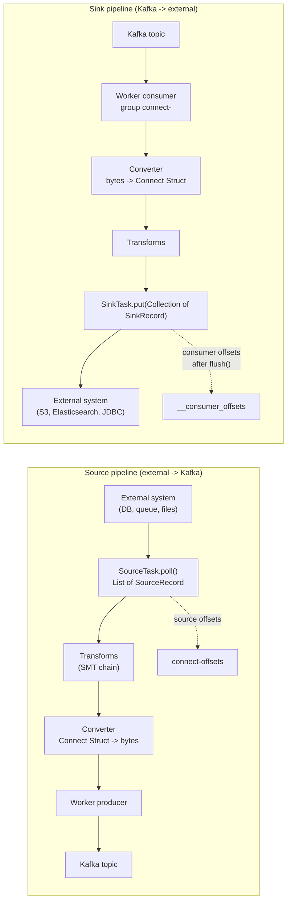
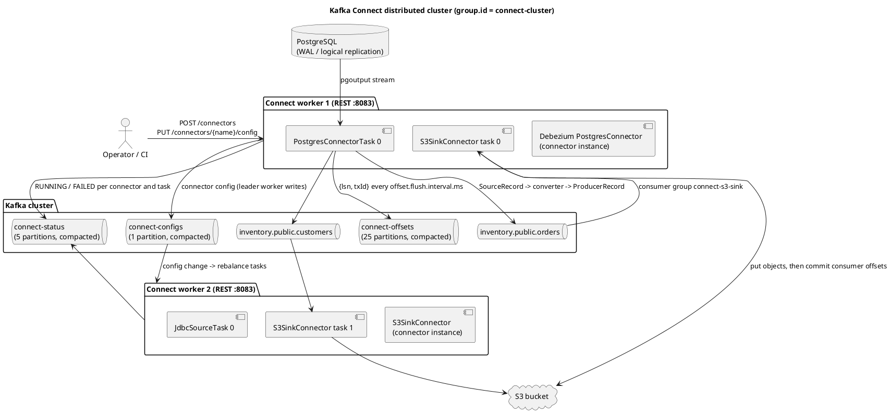
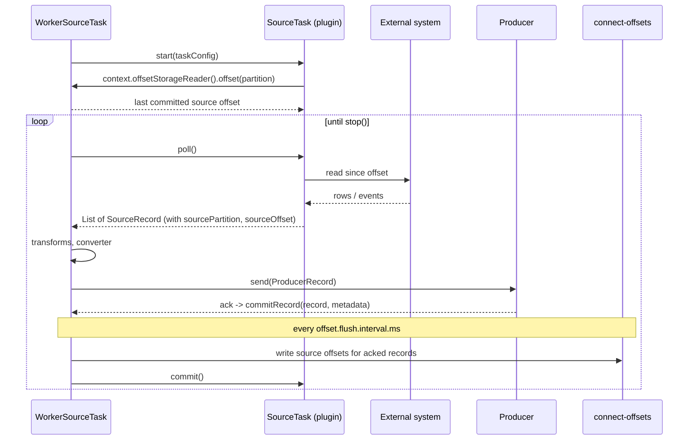
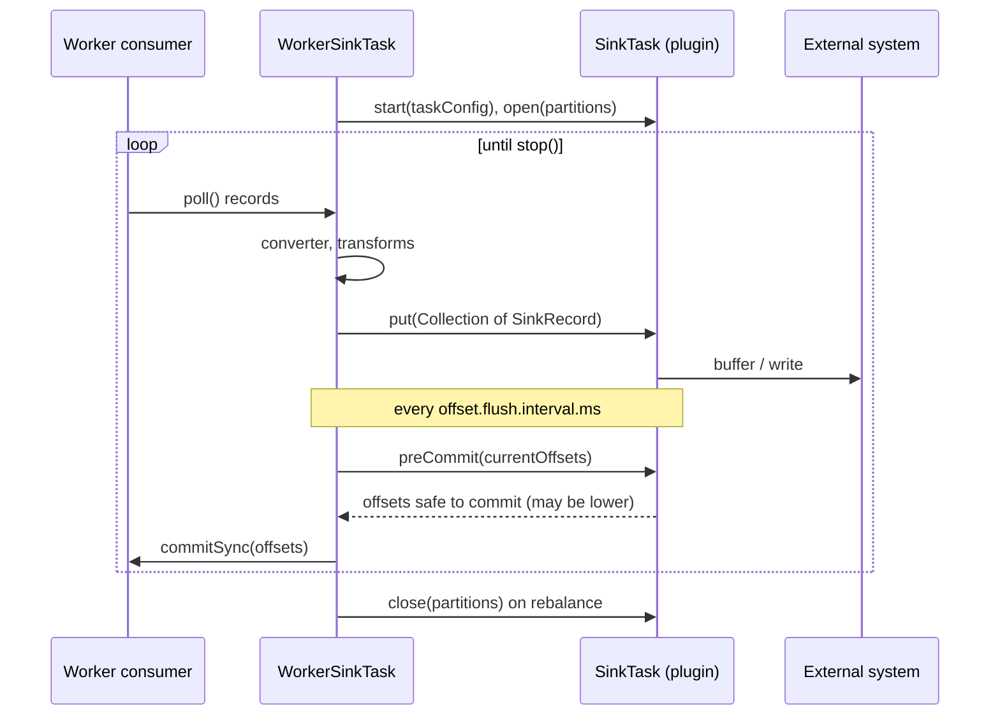
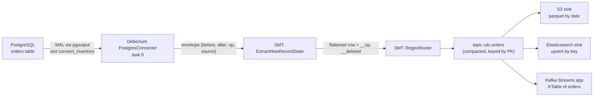

# Kafka Connect

**Roles:** [DEV] [ADMIN] [ARCH]   **Level:** Intermediate
**Prerequisites:** [Producer API](01-producer-api.md), [Consumer API](02-consumer-api.md), [Schema Registry and serialization](05-schema-registry-serialization.md) (for converters)

## What you will learn
- Connect architecture: workers, connectors, tasks, converters, transforms; standalone vs distributed; the three internal topics
- The REST API for creating, validating, pausing, stopping, restarting and deleting connectors, and for resetting offsets (KIP-875)
- Source vs sink flow, popular connectors (JDBC, Debezium CDC, S3, Elasticsearch, HDFS), Single Message Transforms and converters
- Error handling (`errors.tolerance`, dead letter queue), exactly-once sources (KIP-618), scaling tasks, secrets via config providers
- Writing a custom `SourceConnector`/`SourceTask`, a full Debezium Postgres config, and the metrics to monitor

## 1. Concept

Kafka Connect is the framework shipped with Apache Kafka for moving data between Kafka and external systems without writing producer/consumer code. You deploy **workers** (JVM processes, `connect-distributed.sh`), and submit **connector** configurations over REST. A connector is a plugin class that knows how to talk to one system type; it splits its work into **tasks**, which are the units that actually read from or write to the system and run on the workers' thread pools. Data enters and leaves the framework as `SourceRecord`/`SinkRecord` objects carrying Connect's own schema model; **converters** translate that model to bytes on the Kafka side (JSON, Avro, Protobuf, String), and **transforms** (SMTs) can mutate each record in between.



| Mode | Command | Config/offset storage | Use |
|------|---------|-----------------------|-----|
| Standalone | `connect-standalone.sh worker.properties connector1.properties` | Local file (`offset.storage.file.filename`) | Development, single-host file tailing |
| Distributed | `connect-distributed.sh worker.properties` | Kafka internal topics; connectors submitted via REST | Production; workers with the same `group.id` form a cluster and rebalance connectors/tasks |

## 2. How it works internally

### 2.1 Cluster architecture

Source: [`diagrams/kafka-connect-cluster-architecture.puml`](../diagrams/kafka-connect-cluster-architecture.puml)



Internal topics (distributed mode):

| Topic (config) | Partitions | Content | Notes |
|----------------|------------|---------|-------|
| `config.storage.topic` | must be 1 | Connector and task configs, session keys | Compacted; one partition keeps ordering of config changes |
| `offset.storage.topic` | `offset.storage.partitions` (25) | Source connector offsets keyed by `[connector, partition-map]` | Compacted; sinks use `__consumer_offsets` instead |
| `status.storage.topic` | `status.storage.partitions` (5) | Connector/task state (RUNNING, PAUSED, FAILED, STOPPED) and trace | Compacted |

Workers join a consumer-group-style group (`group.id`) using the Connect protocol; since 2.3 the default `connect.protocol=sessioned` gives incremental cooperative rebalancing (KIP-415), so adding a worker moves only some tasks. One worker is elected leader and is the only one that writes to the config topic; REST requests to a follower are forwarded to the leader.

### 2.2 Source task flow



Source offsets are opaque maps defined by the connector (for Debezium Postgres: `{"lsn": ..., "txId": ...}`; for JDBC incrementing mode: `{"incrementing": 1234}`). Without exactly-once support there is a window between the producer ack and the offset flush during which a crash causes re-delivery, so sources are at-least-once by default.

### 2.3 Sink task flow



Sink connectors control their own commit point through `preCommit()`: a connector that batches writes (S3 files, bulk indexing) returns only the offsets whose data is durably written. Because the consumer group is `connect-<connector-name>`, you can inspect sink lag with `kafka-consumer-groups.sh --describe --group connect-s3-sink`.

## 3. Configuration that matters

Worker (`connect-distributed.properties`):

| Parameter | Default | Recommended | Why |
|-----------|---------|-------------|-----|
| `bootstrap.servers` | – | – | |
| `group.id` | `connect-cluster` | unique per Connect cluster | Must not collide with a consumer group |
| `key.converter` / `value.converter` | – | `AvroConverter` (Confluent) or `JsonConverter` | Default for connectors; overridable per connector |
| `key.converter.schemas.enable` / `value.converter.schemas.enable` | `true` (JsonConverter) | `false` for plain JSON topics | With `true`, JSON payloads are wrapped in `{"schema":..., "payload":...}` |
| `config.storage.topic`, `offset.storage.topic`, `status.storage.topic` | – | `connect-<cluster>-configs` etc. | Create with RF 3 or set `*.replication.factor` |
| `config.storage.replication.factor` etc. | -1 (broker default) | 3 | |
| `offset.flush.interval.ms` | 60000 | 10000 | Bounds re-delivery window on crash |
| `offset.flush.timeout.ms` | 5000 | – | |
| `plugin.path` | – | `/usr/share/java,/opt/connectors` | Directories scanned for plugin jars (classloader isolation per plugin) |
| `plugin.discovery` | `hybrid_warn` (3.6) | `service_load` once all plugins have `ServiceLoader` manifests | Faster startup (KIP-898) |
| `listeners` | `http://:8083` | `https://...` with `listeners.https.*` | REST endpoint |
| `rest.advertised.host.name` | – | routable hostname | Used for leader forwarding |
| `connector.client.config.override.policy` | `All` | `Principal` or `All` | Which `producer.override.*`/`consumer.override.*` keys connectors may set |
| `exactly.once.source.support` | `disabled` | `enabled` (after `preparing` round) | KIP-618 |
| `config.providers` | – | `file,env` | Secrets |
| `task.shutdown.graceful.timeout.ms` | 5000 | – | |
| `scheduled.rebalance.max.delay.ms` | 300000 | 60000 | How long lost tasks wait for a worker to return before being reassigned |

Connector-level (common):

| Parameter | Meaning |
|-----------|---------|
| `connector.class` | Plugin class name or alias |
| `tasks.max` | Upper bound on tasks; the connector decides the actual number |
| `topics` / `topics.regex` | Sink only |
| `key.converter`, `value.converter`, `header.converter` | Override worker defaults |
| `transforms`, `transforms.<name>.type`, `transforms.<name>.*` | SMT chain in order |
| `predicates`, `transforms.<name>.predicate`, `transforms.<name>.negate` | Conditional SMTs (KIP-585, 2.6) |
| `errors.tolerance` | `none` (fail task) or `all` (skip) |
| `errors.deadletterqueue.topic.name` | Sink only; DLQ topic |
| `errors.deadletterqueue.context.headers.enable` | Adds `__connect.errors.*` headers |
| `errors.log.enable`, `errors.log.include.messages` | Log failed records |
| `errors.retry.timeout`, `errors.retry.delay.max.ms` | Retry retriable operations (converter/transform/put) |
| `producer.override.*`, `consumer.override.*` | Per-connector client settings (e.g. `consumer.override.max.poll.records`) |
| `topic.creation.default.partitions`, `topic.creation.default.replication.factor` | Source topic auto-creation (KIP-158, 2.6) |

## 4. Failure modes and how to detect them

| Symptom | Likely cause | Metric / log to check | Fix |
|---------|--------------|-----------------------|-----|
| Task `FAILED` with `DataException` / `SerializationException` | Converter mismatch (Avro data read with `JsonConverter`, or `schemas.enable=true` on plain JSON) | `GET /connectors/{name}/status` trace | Fix converter; restart task |
| Task `FAILED` immediately on start | Bad connector config, unreachable system, missing driver jar | status trace, worker log `ClassNotFoundException` | Validate config via REST, add jar to `plugin.path` |
| Connector RUNNING, tasks 0 | Connector could not compute tasks (no tables matched, no topics matched) | connector log | Fix `table.include.list` / `topics` |
| Sink lag growing | Slow external system, too few tasks, `consumer.override.max.poll.records` too high | `sink-record-read-rate` vs `sink-record-send-rate`, `put-batch-avg-time-ms`, consumer group lag | Add tasks (up to partitions), batch tuning |
| Source re-delivers records after restart | At-least-once offset flush window | – | Shorter `offset.flush.interval.ms`; enable exactly-once source |
| Debezium: `replication slot ... is active` | Old task still holds the slot, or slot from another Connect cluster | Postgres `pg_replication_slots` | Wait/kill backend; unique `slot.name` |
| Debezium: WAL disk growing on Postgres | Connector stopped/paused but slot retains WAL | `pg_replication_slots.confirmed_flush_lsn` | Resume or drop slot; set `heartbeat.interval.ms` for low-traffic DBs |
| Worker rebalance every few minutes | Worker flapping (OOM, GC), `scheduled.rebalance.max.delay.ms` cycles | `connect-worker-metrics` `rebalance-avg-time-ms`, `task-count` | Fix worker health; check heap |
| Secrets in `GET /connectors/{name}` output | Config passed in plain text | – | Use `${file:...}` / `${env:...}` config providers |
| Records skipped silently | `errors.tolerance=all` without DLQ or logging | `total-records-skipped` (task-error-metrics) | Enable DLQ and `errors.log.enable=true` |

## 5. Design guidance (architect view)

### 5.1 Popular connectors

| Connector | Type | Mechanism | Notes |
|-----------|------|-----------|-------|
| JDBC Source (Confluent, community) | Source | Polls tables with `mode=incrementing|timestamp|timestamp+incrementing|bulk` | Misses deletes and in-between updates; needs an indexed monotonic column; prefer CDC for anything transactional |
| Debezium (Postgres, MySQL, SQL Server, MongoDB, Oracle) | Source | Log-based CDC: Postgres `pgoutput` logical replication, MySQL binlog | Captures inserts/updates/deletes with before/after images; initial snapshot; exactly-once capable |
| JDBC Sink | Sink | Upserts via `insert.mode=upsert`, `pk.mode=record_key` | Needs schema-aware converter (Avro/JSON with schemas) to create tables (`auto.create`) |
| S3 Sink (Confluent) / Aiven S3 | Sink | Buffers to files by `flush.size` / `rotate.interval.ms`, partitioners (`TimeBasedPartitioner`) | Exactly-once to S3 when using deterministic partitioner and `rotate.interval.ms` with record timestamps |
| Elasticsearch Sink | Sink | Bulk indexing, key as document id (`key.ignore=false`) | Idempotent upserts by id |
| HDFS 2/3 Sink | Sink | Same model as S3 sink with Hive integration | Legacy; most teams moved to object storage |
| MirrorMaker 2 | Source (`MirrorSourceConnector`, `MirrorCheckpointConnector`, `MirrorHeartbeatConnector`) | Cross-cluster replication built on Connect | Covered in the admin section |

### 5.2 Converters

| Converter class | Schema handling | Payload | When |
|-----------------|-----------------|---------|------|
| `org.apache.kafka.connect.json.JsonConverter` | `schemas.enable=true` embeds schema in every message (verbose); `false` = schemaless JSON | JSON | No registry available; simple pipelines |
| `io.confluent.connect.avro.AvroConverter` | Schema Registry (`schema.registry.url`) | Avro binary with 5-byte header | Default in Confluent deployments; compact, evolvable |
| `io.confluent.connect.protobuf.ProtobufConverter` | Schema Registry | Protobuf | Protobuf-first organizations |
| `io.confluent.connect.json.JsonSchemaConverter` | Schema Registry | JSON | JSON with governance |
| `org.apache.kafka.connect.storage.StringConverter` | None | UTF-8 string | Keys, log lines |
| `org.apache.kafka.connect.converters.ByteArrayConverter` | None | Raw bytes | Pass-through, MirrorMaker |
| `io.apicurio.registry.utils.converter.AvroConverter` | Apicurio Registry | Avro | Apicurio deployments |

> **Production tip:** Set converters at the worker level for the common case and override per connector. A sink reading Avro topics with the worker's `JsonConverter` default is the single most common Connect misconfiguration.

### 5.3 Scaling and placement

- Source parallelism is connector-defined: JDBC source creates up to `tasks.max` tasks by splitting tables; Debezium Postgres always runs **one** task (a replication slot is single-reader); Debezium MySQL is one task per connector.
- Sink parallelism is bounded by the input partition count; `tasks.max` beyond that idles.
- Run separate Connect clusters for workloads with different SLAs or blast radius (CDC vs bulk archival), since a bad plugin can take down a worker JVM.
- Since 3.5 (KIP-875), `tasks.max.enforce=true` (default) fails the connector if it generates more tasks than `tasks.max`.

### 5.4 Exactly-once source connectors (KIP-618, since 3.3)

Worker: `exactly.once.source.support=enabled` (roll out with `preparing` first on all workers). Connector: `exactly.once.support=required`, `transaction.boundary=poll|interval|connector` (`interval` with `transaction.boundary.interval.ms`). The worker wraps produced records and the offset write in one Kafka transaction; a zombie task is fenced by the transactional producer. The connector must implement `exactlyOnceSupport()` returning `ExactlyOnceSupport.SUPPORTED` (Debezium and MirrorMaker 2 do). Sinks have no equivalent; sink exactly-once depends on the target's idempotency.

> **Anti-pattern:** Putting JDBC source (polling) in front of a transactional system and calling it CDC. Timestamp mode misses rows updated within the same second as the last poll unless `timestamp.delay.interval.ms` is set, never sees deletes, and hammers the database. Use Debezium.

> **Anti-pattern:** One giant Connect cluster running every connector in the company with a shared `plugin.path`. A memory leak in one connector plugin restarts the worker and rebalances everyone's tasks.

## 6. Hands-on

### 6.1 REST API tour

```bash
CONNECT=http://localhost:8083

# plugins available on the worker
curl -s $CONNECT/connector-plugins | jq '.[].class'

# validate a config before creating it (returns per-field errors)
curl -s -X PUT $CONNECT/connector-plugins/io.debezium.connector.postgresql.PostgresConnector/config/validate \
  -H 'Content-Type: application/json' -d @debezium-pg.json | jq '.error_count, .configs[] | select(.value.errors | length > 0)'

# create (POST with name+config) or create/update idempotently (PUT config)
curl -s -X PUT $CONNECT/connectors/inventory-cdc/config \
  -H 'Content-Type: application/json' -d @debezium-pg.json | jq

# list with status in one call
curl -s "$CONNECT/connectors?expand=status&expand=info" | jq

# status of one connector and its tasks
curl -s $CONNECT/connectors/inventory-cdc/status | jq

# pause (tasks keep assignment, stop consuming/producing) and resume
curl -s -X PUT $CONNECT/connectors/inventory-cdc/pause
curl -s -X PUT $CONNECT/connectors/inventory-cdc/resume

# stop (since 3.5, KIP-875): tasks are shut down and deallocated; required before offset reset
curl -s -X PUT $CONNECT/connectors/inventory-cdc/stop

# restart connector and only its failed tasks (KIP-745, since 3.0)
curl -s -X POST "$CONNECT/connectors/inventory-cdc/restart?includeTasks=true&onlyFailed=true"
# restart a single task
curl -s -X POST $CONNECT/connectors/inventory-cdc/tasks/0/restart

# topics the connector has used
curl -s $CONNECT/connectors/inventory-cdc/topics | jq

# change a logger at runtime
curl -s -X PUT $CONNECT/admin/loggers/io.debezium -H 'Content-Type: application/json' -d '{"level":"DEBUG"}'

# delete
curl -s -X DELETE $CONNECT/connectors/inventory-cdc
```

### 6.2 Offsets API (KIP-875, since 3.6)

```bash
# read source offsets (or sink consumer offsets)
curl -s $CONNECT/connectors/inventory-cdc/offsets | jq
# {"offsets":[{"partition":{"server":"inventory"},"offset":{"lsn":23456789,"txId":812,"ts_usec":...}}]}

# alter offsets: connector must be STOPPED
curl -s -X PUT $CONNECT/connectors/inventory-cdc/stop
curl -s -X PATCH $CONNECT/connectors/inventory-cdc/offsets -H 'Content-Type: application/json' -d '{
  "offsets": [
    {"partition": {"server": "inventory"}, "offset": {"lsn": 23000000, "txId": 800}}
  ]}'

# reset all offsets (source: deletes from connect-offsets; sink: deletes consumer group offsets)
curl -s -X DELETE $CONNECT/connectors/inventory-cdc/offsets
curl -s -X PUT $CONNECT/connectors/inventory-cdc/resume

# sink connectors use a consumer-group shaped partition
curl -s -X PATCH $CONNECT/connectors/s3-orders/offsets -H 'Content-Type: application/json' -d '{
  "offsets": [{"partition": {"kafka_topic": "orders", "kafka_partition": 0}, "offset": {"kafka_offset": 1000}}]}'
```

Before 3.6 the only way to reset a source connector was to produce a tombstone with the exact key to `connect-offsets` or delete the connector and recreate it with a new name.

### 6.3 Debezium PostgreSQL full configuration

```json
{
  "connector.class": "io.debezium.connector.postgresql.PostgresConnector",
  "tasks.max": "1",
  "database.hostname": "postgres",
  "database.port": "5432",
  "database.user": "${file:/opt/connect/secrets/pg.properties:user}",
  "database.password": "${file:/opt/connect/secrets/pg.properties:password}",
  "database.dbname": "inventory",
  "topic.prefix": "inventory",
  "plugin.name": "pgoutput",
  "slot.name": "connect_inventory",
  "publication.name": "connect_inventory_pub",
  "publication.autocreate.mode": "filtered",
  "table.include.list": "public.orders,public.customers",
  "snapshot.mode": "initial",
  "heartbeat.interval.ms": "10000",
  "tombstones.on.delete": "true",
  "decimal.handling.mode": "string",
  "time.precision.mode": "connect",
  "topic.creation.default.partitions": "6",
  "topic.creation.default.replication.factor": "3",
  "topic.creation.default.cleanup.policy": "compact",
  "key.converter": "io.confluent.connect.avro.AvroConverter",
  "key.converter.schema.registry.url": "http://schema-registry:8081",
  "value.converter": "io.confluent.connect.avro.AvroConverter",
  "value.converter.schema.registry.url": "http://schema-registry:8081",
  "transforms": "unwrap,route",
  "transforms.unwrap.type": "io.debezium.transforms.ExtractNewRecordState",
  "transforms.unwrap.drop.tombstones": "false",
  "transforms.unwrap.delete.handling.mode": "rewrite",
  "transforms.unwrap.add.fields": "op,source.ts_ms",
  "transforms.route.type": "org.apache.kafka.connect.transforms.RegexRouter",
  "transforms.route.regex": "inventory\\.public\\.(.*)",
  "transforms.route.replacement": "cdc.$1",
  "errors.tolerance": "none",
  "errors.log.enable": "true",
  "exactly.once.support": "required",
  "transaction.boundary": "poll",
  "producer.override.compression.type": "lz4"
}
```

Postgres side: `wal_level=logical`, a user with `REPLICATION` privilege, and `REPLICA IDENTITY FULL` on tables if you need full before-images for updates/deletes. Topics are named `<topic.prefix>.<schema>.<table>` before routing. For MySQL, the equivalent class is `io.debezium.connector.mysql.MySqlConnector` with `database.server.id`, `schema.history.internal.kafka.bootstrap.servers` and `schema.history.internal.kafka.topic` (MySQL needs DDL history; Postgres does not).



### 6.4 Common SMTs

```json
{
  "transforms": "addTs,mask,keyFromId,dropInternal,tsRoute,filterTombstones",

  "transforms.addTs.type": "org.apache.kafka.connect.transforms.InsertField$Value",
  "transforms.addTs.timestamp.field": "ingested_at",
  "transforms.addTs.static.field": "source_system",
  "transforms.addTs.static.value": "erp",

  "transforms.mask.type": "org.apache.kafka.connect.transforms.MaskField$Value",
  "transforms.mask.fields": "ssn,card_number",
  "transforms.mask.replacement": "***",

  "transforms.keyFromId.type": "org.apache.kafka.connect.transforms.ValueToKey",
  "transforms.keyFromId.fields": "order_id",

  "transforms.dropInternal.type": "org.apache.kafka.connect.transforms.ReplaceField$Value",
  "transforms.dropInternal.exclude": "internal_notes,legacy_flag",
  "transforms.dropInternal.renames": "cust_id:customer_id",

  "transforms.tsRoute.type": "org.apache.kafka.connect.transforms.TimestampRouter",
  "transforms.tsRoute.topic.format": "${topic}-${timestamp}",
  "transforms.tsRoute.timestamp.format": "yyyyMM",

  "transforms.filterTombstones.type": "org.apache.kafka.connect.transforms.Filter",
  "transforms.filterTombstones.predicate": "isTombstone",
  "predicates": "isTombstone",
  "predicates.isTombstone.type": "org.apache.kafka.connect.transforms.predicates.RecordIsTombstone"
}
```

Other built-ins: `ExtractField$Key/Value` (pull one field out as the whole key/value), `HoistField`, `Flatten`, `Cast`, `TimestampConverter`, `SetSchemaMetadata`, `HeaderFrom`, `InsertHeader`, `DropHeaders`, `RegexRouter`. Predicates: `HasHeaderKey`, `RecordIsTombstone`, `TopicNameMatches`. SMTs run per record on the task thread; keep them cheap and never call external systems from one. For anything stateful or joining, use Kafka Streams downstream instead.

### 6.5 Sink with dead letter queue

```json
{
  "name": "es-orders",
  "config": {
    "connector.class": "io.confluent.connect.elasticsearch.ElasticsearchSinkConnector",
    "tasks.max": "3",
    "topics": "cdc.orders",
    "connection.url": "http://elasticsearch:9200",
    "key.ignore": "false",
    "schema.ignore": "true",
    "behavior.on.null.values": "delete",
    "write.method": "upsert",
    "errors.tolerance": "all",
    "errors.deadletterqueue.topic.name": "dlq.es-orders",
    "errors.deadletterqueue.topic.replication.factor": "3",
    "errors.deadletterqueue.context.headers.enable": "true",
    "errors.log.enable": "true",
    "errors.log.include.messages": "true",
    "errors.retry.timeout": "60000",
    "errors.retry.delay.max.ms": "5000",
    "consumer.override.max.poll.records": "200"
  }
}
```

DLQ records carry the original bytes plus headers `__connect.errors.topic`, `__connect.errors.partition`, `__connect.errors.offset`, `__connect.errors.connector.name`, `__connect.errors.task.id`, `__connect.errors.stage` (e.g. `VALUE_CONVERTER`, `TRANSFORMATION`), `__connect.errors.class.name`, `__connect.errors.exception.class.name`, `__connect.errors.exception.message`, `__connect.errors.exception.stacktrace`. The DLQ covers failures in conversion, transformation and (since 2.6 for `put()`) the sink's own retriable errors; there is no DLQ for source connectors because the failure happens before a Kafka record exists.

### 6.6 Secrets with config providers

Worker:

```properties
config.providers=file,env,dir
config.providers.file.class=org.apache.kafka.common.config.provider.FileConfigProvider
config.providers.env.class=org.apache.kafka.common.config.provider.EnvVarConfigProvider
config.providers.env.param.allowlist.pattern=^CONNECT_.*
config.providers.dir.class=org.apache.kafka.common.config.provider.DirectoryConfigProvider
```

Connector values: `${file:/opt/connect/secrets/pg.properties:password}`, `${env:CONNECT_PG_PASSWORD}`, `${dir:/run/secrets:pg-password}` (Kubernetes secret mounted as files). The worker resolves them in memory when starting tasks; the REST API and config topic keep the placeholder, so secrets never appear in `GET /connectors/{name}`. `EnvVarConfigProvider` has existed since 3.5 (KIP-887); `FileConfigProvider` since 2.0 (KIP-297); `DirectoryConfigProvider` since 2.7. Vault and cloud secret managers are available as third-party providers.

### 6.7 Custom source connector skeleton

```java
package guide.connect;

import org.apache.kafka.common.config.ConfigDef;
import org.apache.kafka.connect.connector.Task;
import org.apache.kafka.connect.source.ExactlyOnceSupport;
import org.apache.kafka.connect.source.SourceConnector;

import java.util.*;

public class HttpPollSourceConnector extends SourceConnector {

    public static final String URLS = "urls";
    public static final String INTERVAL_MS = "poll.interval.ms";
    public static final String TOPIC = "topic";

    static final ConfigDef CONFIG_DEF = new ConfigDef()
            .define(URLS, ConfigDef.Type.LIST, ConfigDef.Importance.HIGH, "Endpoints to poll")
            .define(INTERVAL_MS, ConfigDef.Type.LONG, 10_000L, ConfigDef.Range.atLeast(100), ConfigDef.Importance.MEDIUM, "Poll interval")
            .define(TOPIC, ConfigDef.Type.STRING, ConfigDef.Importance.HIGH, "Target topic");

    private Map<String, String> config;

    @Override public String version() { return "1.0.0"; }

    @Override public void start(Map<String, String> props) { this.config = props; }

    @Override public Class<? extends Task> taskClass() { return HttpPollSourceTask.class; }

    @Override
    public List<Map<String, String>> taskConfigs(int maxTasks) {
        // split the URL list across tasks: each task gets a disjoint subset
        List<String> urls = Arrays.asList(config.get(URLS).split(","));
        int n = Math.min(maxTasks, urls.size());
        List<Map<String, String>> configs = new ArrayList<>();
        for (int i = 0; i < n; i++) {
            List<String> slice = new ArrayList<>();
            for (int j = i; j < urls.size(); j += n) slice.add(urls.get(j));
            Map<String, String> tc = new HashMap<>(config);
            tc.put(URLS, String.join(",", slice));
            configs.add(tc);
        }
        return configs;
    }

    @Override public void stop() { }

    @Override public ConfigDef config() { return CONFIG_DEF; }

    @Override
    public ExactlyOnceSupport exactlyOnceSupport(Map<String, String> props) {
        return ExactlyOnceSupport.SUPPORTED;   // offsets are deterministic per URL
    }
}
```

```java
package guide.connect;

import org.apache.kafka.connect.data.Schema;
import org.apache.kafka.connect.data.SchemaBuilder;
import org.apache.kafka.connect.data.Struct;
import org.apache.kafka.connect.source.SourceRecord;
import org.apache.kafka.connect.source.SourceTask;

import java.net.URI;
import java.net.http.HttpClient;
import java.net.http.HttpRequest;
import java.net.http.HttpResponse;
import java.util.*;
import org.slf4j.Logger;
import org.slf4j.LoggerFactory;

public class HttpPollSourceTask extends SourceTask {

    private static final Logger log = LoggerFactory.getLogger(HttpPollSourceTask.class);

    private static final Schema VALUE_SCHEMA = SchemaBuilder.struct().name("guide.HttpPayload")
            .field("url", Schema.STRING_SCHEMA)
            .field("status", Schema.INT32_SCHEMA)
            .field("body", Schema.STRING_SCHEMA)
            .field("fetched_at", Schema.INT64_SCHEMA)
            .build();

    private final HttpClient http = HttpClient.newHttpClient();
    private List<String> urls;
    private String topic;
    private long intervalMs;
    private final Map<String, Long> lastFetched = new HashMap<>();

    @Override public String version() { return "1.0.0"; }

    @Override
    public void start(Map<String, String> props) {
        urls = Arrays.asList(props.get(HttpPollSourceConnector.URLS).split(","));
        topic = props.get(HttpPollSourceConnector.TOPIC);
        intervalMs = Long.parseLong(props.getOrDefault(HttpPollSourceConnector.INTERVAL_MS, "10000"));
        // resume from committed source offsets
        for (String url : urls) {
            Map<String, Object> offset = context.offsetStorageReader().offset(Map.of("url", url));
            if (offset != null && offset.get("fetched_at") != null) {
                lastFetched.put(url, (Long) offset.get("fetched_at"));
            }
        }
    }

    @Override
    public List<SourceRecord> poll() throws InterruptedException {
        List<SourceRecord> out = new ArrayList<>();
        long now = System.currentTimeMillis();
        for (String url : urls) {
            if (now - lastFetched.getOrDefault(url, 0L) < intervalMs) continue;
            try {
                HttpResponse<String> resp = http.send(
                        HttpRequest.newBuilder(URI.create(url)).GET().build(),
                        HttpResponse.BodyHandlers.ofString());
                Struct value = new Struct(VALUE_SCHEMA)
                        .put("url", url).put("status", resp.statusCode())
                        .put("body", resp.body()).put("fetched_at", now);
                out.add(new SourceRecord(
                        Map.of("url", url),                 // source partition
                        Map.of("fetched_at", now),          // source offset
                        topic, null,                        // topic, kafka partition (null = partitioner)
                        Schema.STRING_SCHEMA, url,          // key
                        VALUE_SCHEMA, value,                // value
                        now));                              // timestamp
                lastFetched.put(url, now);
            } catch (Exception e) {
                // retriable: leave lastFetched unchanged so the URL is retried on the next poll
                log.warn("fetch failed for {}: {}", url, e.toString());
            }
        }
        if (out.isEmpty()) Thread.sleep(200);   // poll() may block briefly; never busy-spin
        return out;
    }

    @Override
    public void commitRecord(SourceRecord record, org.apache.kafka.clients.producer.RecordMetadata metadata) {
        // called after the producer acks; useful for acking upstream queues
    }

    @Override public void stop() { }
}
```

Package the classes with a `META-INF/services/org.apache.kafka.connect.source.SourceConnector` file listing the connector class so `plugin.discovery=service_load` finds it, and place the jar (with dependencies, excluding `connect-api`) in its own directory under `plugin.path`.

### 6.8 Monitoring Connect

JMX domain `kafka.connect`:

| MBean type | Metric | Watch for |
|------------|--------|-----------|
| `connect-worker-metrics` | `connector-count`, `task-count`, `connector-startup-failure-total`, `task-startup-failure-total` | Startup failures > 0 |
| `connect-worker-rebalance-metrics` | `rebalance-avg-time-ms`, `completed-rebalances-total`, `time-since-last-rebalance-ms` | Frequent rebalances |
| `connector-task-metrics` (per connector, task) | `status` (running/paused/failed), `batch-size-avg`, `offset-commit-avg-time-ms`, `offset-commit-failure-percentage` | Any task not `running`; commit failures |
| `source-task-metrics` | `source-record-poll-rate`, `source-record-write-rate`, `source-record-active-count`, `poll-batch-avg-time-ms` | Active count climbing = producer cannot keep up |
| `sink-task-metrics` | `sink-record-read-rate`, `sink-record-send-rate`, `put-batch-avg-time-ms`, `partition-count`, `offset-commit-seq-no` | Slow `put()` |
| `task-error-metrics` | `total-record-errors`, `total-record-failures`, `total-records-skipped`, `total-retries`, `deadletterqueue-produce-requests`, `last-error-timestamp` | Skips and DLQ writes |

Also scrape the REST `status` endpoint (a task in `FAILED` state stays failed until restarted) and, for sinks, consumer group lag of `connect-<name>`. Debezium exposes its own MBeans (`debezium.postgres:type=connector-metrics,context=streaming,...` with `MilliSecondsBehindSource`, `QueueRemainingCapacity`).

## 7. Interview questions for this chapter

### Q1. What are the roles of connector, task, converter and transform in Connect?
**Role:** [DEV] | **Difficulty:** ★☆☆ | **Topic:** Architecture

**Answer.**
A connector is the coordinating instance: it validates config and decides how to split work into task configs (`taskConfigs(maxTasks)`). Tasks do the I/O: `SourceTask.poll()` returns records, `SinkTask.put()` receives them. Converters serialize between Connect's `Struct`/`Schema` model and bytes on the Kafka side (JSON, Avro, Protobuf, String). Transforms are single-message functions applied in order between the task and the converter (source) or between the converter and the task (sink). Only tasks move data; the connector itself runs on one worker and is idle most of the time.

**Follow-up probes.** Where does `tasks.max` apply? What happens if a connector returns fewer task configs?

### Q2. How do distributed workers share configuration and survive a worker crash?
**Role:** [ADMIN] | **Difficulty:** ★★☆ | **Topic:** Internals

**Answer.**
Workers with the same `group.id` join a group using the Connect rebalance protocol. Connector configs are written by the leader worker to the single-partition, compacted `config.storage.topic`; every worker tails it, so a REST call to any worker ends up in the same shared state. Source offsets go to `offset.storage.topic`, statuses to `status.storage.topic`. When a worker dies, the group rebalances and its connectors and tasks are reassigned; with `connect.protocol=sessioned` the rebalance is incremental, and lost tasks wait up to `scheduled.rebalance.max.delay.ms` for the worker to return before moving.

**Follow-up probes.** Why must the config topic have exactly one partition? What happens to source offsets during the move?

### Q3. A sink task keeps failing with `DataException: Converting byte[] to Kafka Connect data failed due to serialization error`. What is wrong?
**Role:** [DEV] [ADMIN] | **Difficulty:** ★★☆ | **Topic:** Converters

**Answer.**
The converter does not match the bytes on the topic: typically the topic holds Avro (5-byte registry header) but the worker default is `JsonConverter`, or the topic holds plain JSON while `value.converter.schemas.enable=true` expects the `{"schema":..,"payload":..}` envelope. Check the topic with `kcat -C -f '%s'` and set the connector's `value.converter` explicitly (`AvroConverter` with `schema.registry.url`, or `JsonConverter` with `schemas.enable=false`). Restart the task after fixing.

**Follow-up probes.** How would `errors.tolerance=all` with a DLQ change the behaviour? Is that a good idea here?

### Q4. Compare JDBC source and Debezium for replicating a Postgres orders table.
**Role:** [ARCH] | **Difficulty:** ★★☆ | **Topic:** CDC

**Answer.**
JDBC source polls `SELECT ... WHERE updated_at > ?` on an interval: simple, but it misses deletes, misses intermediate updates between polls, depends on a reliable monotonic column, and loads the database. Debezium reads the WAL through a logical replication slot: it sees every insert, update and delete in commit order with before/after images, adds negligible DB load, takes a consistent initial snapshot, and supports exactly-once source semantics. Debezium requires `wal_level=logical`, slot management (an unattended slot retains WAL and can fill the disk), and one task per connector. For anything transactional, Debezium; JDBC is acceptable for append-only reference tables.

**Follow-up probes.** What does `ExtractNewRecordState` do? How do you handle a Postgres failover with a replication slot?

### Q5. How do you reset a source connector's offsets in 3.6+ and before?
**Role:** [ADMIN] | **Difficulty:** ★★☆ | **Topic:** Operations

**Answer.**
Since 3.6 (KIP-875): `PUT /connectors/{name}/stop`, then `DELETE /connectors/{name}/offsets` to reset or `PATCH /connectors/{name}/offsets` with a JSON body to set specific values, then `PUT .../resume`. Before that, options were deleting the connector and recreating it under a new name (offsets are keyed by connector name), or producing a tombstone record with the exact JSON key to `offset.storage.topic`. Sink connectors could be reset with `kafka-consumer-groups.sh --reset-offsets` on `connect-<name>` while stopped.

**Follow-up probes.** Why must the connector be STOPPED and not just PAUSED? What is the offset format for a sink?

### Q6. Explain `errors.tolerance`, the DLQ, and why source connectors have no DLQ.
**Role:** [DEV] | **Difficulty:** ★★☆ | **Topic:** Error handling

**Answer.**
`errors.tolerance=none` (default) fails the task on the first error in conversion, transformation or the sink `put()`; `all` skips the record after `errors.retry.timeout` of retries and continues. With `errors.deadletterqueue.topic.name` set on a sink, the skipped record's original bytes are produced to that topic, with `__connect.errors.*` headers when `context.headers.enable=true`. Sources have no DLQ because the failure happens while turning an external object into a Kafka record; there are no bytes to forward. Always pair `tolerance=all` with `errors.log.enable=true` and monitor `total-records-skipped`.

**Follow-up probes.** Does the DLQ capture errors thrown from inside the sink's external client after retries? Which stage header tells you where it failed?

### Q7. How does exactly-once work for source connectors (KIP-618)?
**Role:** [ARCH] [DEV] | **Difficulty:** ★★★ | **Topic:** EOS

**Answer.**
With `exactly.once.source.support=enabled`, each source task gets a transactional producer; the worker writes the task's records and its source offsets (to the offsets topic) in one Kafka transaction per boundary (`transaction.boundary=poll`, `interval`, or connector-defined). A restarted or zombie task is fenced by the producer epoch, so it cannot commit stale data. The connector must declare `ExactlyOnceSupport.SUPPORTED` and produce deterministic offsets. Rollout requires all workers on `preparing` first (so they use the new offsets topic layout) and then `enabled`. Consumers must read with `read_committed`.

**Follow-up probes.** Why is there no exactly-once for sinks? What about Debezium's snapshot phase?

### Q8. Where do connector secrets live and how do you keep them out of the REST API?
**Role:** [ADMIN] | **Difficulty:** ★☆☆ | **Topic:** Security

**Answer.**
Register config providers on the worker (`config.providers=file,env` with `FileConfigProvider` and `EnvVarConfigProvider`) and reference values as `${file:/path/secrets.properties:password}` or `${env:PG_PASSWORD}`. The placeholder is what gets stored in the config topic and returned by `GET /connectors/{name}`; the worker resolves it only when instantiating tasks. Combine with TLS and authentication on the REST listener (`listeners=https://...`, a `rest.extension.classes` basic-auth extension or a reverse proxy) and ACLs on the internal topics.

**Follow-up probes.** How are secrets rotated without restarting connectors? (`config.reload.action=restart` and TTL support in providers.)

## Key takeaways
- Connect is a worker cluster running connector plugins; tasks move data, converters shape bytes, SMTs tweak single records.
- Three compacted internal topics hold config, source offsets and status; sink offsets are ordinary consumer group offsets.
- Match converters to what is actually on the topic; most Connect failures are converter mismatches.
- Debezium over JDBC polling for CDC; `stop` then `PATCH/DELETE /offsets` for replays (3.6+); `errors.tolerance=all` only with a DLQ and logging.
- Keep secrets in config providers and scrape `connector-task-metrics` status plus `task-error-metrics`.

## Further reading
- Apache Kafka documentation: Kafka Connect user guide and REST API
- KIP-297: Externalizing secrets; KIP-887: `EnvVarConfigProvider`
- KIP-298: Error handling in Connect (`errors.*`, DLQ)
- KIP-415: Incremental cooperative rebalancing in Connect
- KIP-585: Filter and conditional SMTs; KIP-745: Connect restart API
- KIP-618: Exactly-once support for source connectors
- KIP-875: First-class offsets support in Kafka Connect
- Debezium documentation: PostgreSQL connector, `ExtractNewRecordState`
