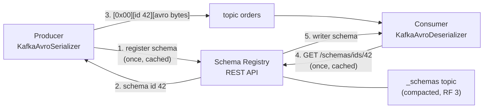
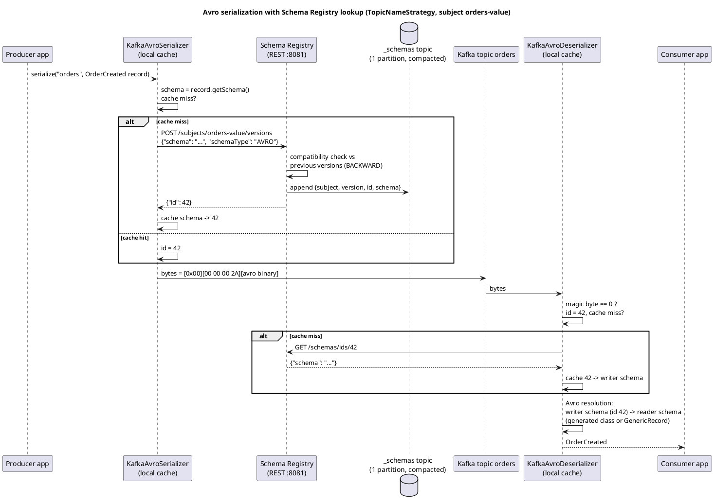
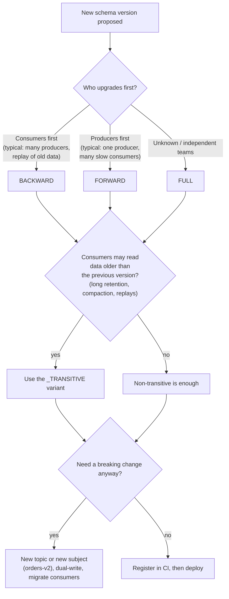

# Schema Registry and Serialization

**Roles:** [DEV] [ARCH] [ADMIN]   **Level:** Intermediate
**Prerequisites:** [Producer API](01-producer-api.md), [Consumer API](02-consumer-api.md)

## What you will learn
- Why a schema contract between producers and consumers matters, and how Confluent Schema Registry stores it (`_schemas`, subjects, versions, IDs)
- The wire format (magic byte + 4-byte schema ID), subject naming strategies, and compatibility modes with the table of allowed changes
- Avro vs Protobuf vs JSON Schema, and an Avro evolution example with defaults
- Java producer/consumer code with `KafkaAvroSerializer`, specific vs generic records, schema references, and the REST API
- Security, high availability, alternatives (Apicurio, AWS Glue), and schema governance in CI

## 1. Concept

Kafka brokers store bytes; they never inspect payloads. Producers and consumers therefore need an out-of-band agreement on what the bytes mean. Without it, a producer changing a field type breaks every consumer at runtime, hours later, in a different team. A **schema registry** makes that agreement explicit, versioned, and enforceable: the producer registers the schema, the registry checks it against the compatibility rule for that subject, and consumers can always fetch the exact writer schema that produced a given record.

Apache Kafka itself does not ship a schema registry. **Confluent Schema Registry** (Confluent Community License, open source, the de facto standard and what this chapter describes unless stated otherwise), **Apicurio Registry** (Apache 2.0, Red Hat), **AWS Glue Schema Registry** (MSK ecosystem) and **Karapace** (Aiven, Apache 2.0) all implement the same idea, and most implement Confluent's REST API for compatibility.



Core objects:

| Term | Meaning |
|------|---------|
| Schema | An Avro, Protobuf or JSON Schema definition, stored once, addressed by a **global ID** (int, unique per registry cluster) |
| Subject | A named lineage of schema versions, e.g. `orders-value`. Compatibility is enforced per subject |
| Version | Position of a schema within a subject (1, 2, 3, ...). The same schema ID can appear in several subjects |
| Compatibility level | Rule applied when a new version is registered to a subject (BACKWARD by default, globally or per subject) |
| `_schemas` | The single-partition, compacted Kafka topic that is the registry's only durable store |

## 2. How it works internally

### 2.1 Architecture and storage

Schema Registry is a stateless-looking HTTP service backed by Kafka. Every write (`POST /subjects/{s}/versions`, config changes, deletes) is appended to `_schemas` by the **leader** instance; every instance (leader and followers) consumes `_schemas` from the beginning into an in-memory `KafkaStore`, so reads are served locally and the whole registry is rebuilt from the topic on startup. Followers forward writes to the leader. Leader election uses the Kafka group protocol (`schema.registry.group.id`, default `schema-registry`), and `leader.eligibility=false` can pin read-only replicas (useful in a DR region).

Consequences:
- `_schemas` must have `cleanup.policy=compact`, one partition (ordering of version assignment), and RF 3 with `min.insync.replicas=2`. Losing it loses every schema and ID mapping, and every record on every topic becomes undecodable. Back it up (MirrorMaker 2 or Schema Exporter).
- IDs are assigned by the leader and are monotonically increasing; after a restore from another cluster IDs can differ unless you use IMPORT mode.

### 2.2 Serialization flow

Source: [`diagrams/schema-registry-serialization-flow.puml`](../diagrams/schema-registry-serialization-flow.puml)



The registry is on the hot path only on cache misses. A producer that has registered its schema once never calls the registry again for that schema; a consumer calls it once per distinct schema ID it encounters. Registry downtime therefore breaks *new* producers/consumers (and new schemas), not running ones.

### 2.3 Wire format

```
byte 0        : magic byte, always 0x00
bytes 1..4    : schema ID, 4-byte big-endian int
bytes 5..     : payload
                Avro      -> Avro binary encoding (no embedded schema, no header)
                Protobuf  -> message-index array (zigzag varints: length, then indexes; [0] is encoded as a single 0 byte)
                             followed by the protobuf-encoded message
                JSON      -> UTF-8 JSON text
```

The magic byte lets deserializers reject non-registry payloads early (`SerializationException: Unknown magic byte!` is the classic symptom of a plain-JSON producer writing to an Avro topic). The 5-byte header is the entire overhead; Avro binary carries no field names, which is why Avro records are typically 5–10× smaller than the equivalent JSON.

### 2.4 Subject naming strategies

| Strategy (`key.subject.name.strategy` / `value.subject.name.strategy`) | Subject | Topic contains | Use when |
|---|---|---|---|
| `io.confluent.kafka.serializers.subject.TopicNameStrategy` (default) | `<topic>-key`, `<topic>-value` | One record type | Most topics; compatibility is per topic |
| `RecordNameStrategy` | `<fully.qualified.record.name>` | Many types, any topic | Event types shared across topics; compatibility per type globally |
| `TopicRecordNameStrategy` | `<topic>-<fully.qualified.record.name>` | Many types per topic | Event streams with several event types on one topic (e.g. an entity's lifecycle), with per-topic evolution rules |

With `RecordName*` strategies the deserializer no longer knows from the topic which class to expect; use `GenericRecord`, or Avro unions/Protobuf `oneof`, or a schema reference wrapping (2.5).

## 3. Configuration that matters

Client-side (serializer/deserializer properties, prefixed as given):

| Parameter | Default | Recommended | Why |
|-----------|---------|-------------|-----|
| `schema.registry.url` | – | comma-separated list of all instances or a load balancer | Client fails over across the list |
| `auto.register.schemas` | `true` | `false` in production producers | Schemas are registered by CI; a producer with an unregistered schema fails fast instead of silently creating versions |
| `use.latest.version` | `false` | `true` together with `auto.register.schemas=false` | Producer uses the latest registered version instead of the one embedded in its class (needed for schema references / union subjects) |
| `latest.compatibility.strict` | `true` | – | With `use.latest.version`, verify the local schema is compatible with the latest |
| `specific.avro.reader` | `false` | `true` when generated classes are on the classpath | Deserialize into `SpecificRecord` classes instead of `GenericRecord` |
| `key.subject.name.strategy` / `value.subject.name.strategy` | `TopicNameStrategy` | see table | |
| `basic.auth.credentials.source` | – | `USER_INFO` | With `basic.auth.user.info=user:password` |
| `schema.registry.ssl.*` | – | truststore/keystore | mTLS to the registry |
| `max.schemas.per.subject` (client cache) | 1000 | – | Client-side cache size |
| `value.deserializer` | – | `io.confluent.kafka.serializers.KafkaAvroDeserializer` (Avro), `KafkaProtobufDeserializer`, `KafkaJsonSchemaDeserializer` | |

Server-side (`schema-registry.properties`):

| Parameter | Default | Recommended | Why |
|-----------|---------|-------------|-----|
| `kafkastore.bootstrap.servers` | – | – | Cluster holding `_schemas` |
| `kafkastore.topic` | `_schemas` | – | |
| `kafkastore.topic.replication.factor` | 3 | 3 | |
| `schema.compatibility.level` | `backward` | `backward` or `full_transitive` for shared topics | Global default; override per subject |
| `listeners` | `http://0.0.0.0:8081` | `https://...` | |
| `schema.registry.group.id` | `schema-registry` | unique per registry cluster | Two registries on one Kafka must use different group ids **and** different `kafkastore.topic` |
| `leader.eligibility` | `true` | `false` on DR/read-only nodes | |
| `mode` | `READWRITE` | `IMPORT` during migration, `READONLY` in DR | Preserves IDs when importing |
| `resource.extension.class` | – | security plugin / RBAC | Confluent Platform feature |

## 4. Failure modes and how to detect them

| Symptom | Likely cause | Metric / log to check | Fix |
|---------|--------------|-----------------------|-----|
| `SerializationException: Unknown magic byte!` | Consumer expects registry format but the topic has raw JSON/String, or the wrong topic | Consumer log | Match deserializer to producer; check with `kcat -C -f '%s'` |
| `Schema being registered is incompatible with an earlier schema` (HTTP 409) | Producer (auto-register) or CI tried to register a breaking change | Registry log, producer exception on first send | Fix the schema (add default, do not remove required field) or, deliberately, change compatibility level |
| `Subject not found` (40401) / `Schema not found` (40403) | Consumer sees an ID from another registry (wrong URL, cluster migrated without IMPORT mode) | Consumer log | Point to the right registry; migrate with `mode=IMPORT` preserving IDs |
| Producer hangs on first send, then `TimeoutException` | Registry unreachable (`schema.registry.url` wrong, TLS) | Producer log shows `RestClientException` / `ConnectException` | Fix connectivity; the serializer has no fallback |
| Consumer gets `AvroTypeException` / `ClassCastException` with specific records | Generated class older than the writer schema and reader schema lacks defaults; or `specific.avro.reader` false but code casts to class | Consumer log | Regenerate classes; set `specific.avro.reader=true`; add defaults |
| Many versions per subject, unexpected | `auto.register.schemas=true` in several services with slightly different schemas (field order, docs, namespaces) | `GET /subjects/{s}/versions` | Disable auto-register; canonicalize schemas in CI |
| Registry rebuilds slowly / OOM at startup | Huge `_schemas` (thousands of subjects × versions) | JVM heap, startup log | Increase heap; prune soft-deleted subjects with permanent delete |
| Registry returns 500 / leader election loops | `_schemas` unavailable, `min.insync.replicas` not met | Registry log, broker `UnderMinIsr` | Fix Kafka first |
| Two registries corrupt each other | Same `schema.registry.group.id` or same `kafkastore.topic` on one Kafka cluster | Registry log | Unique group id and topic per registry |

## 5. Design guidance (architect view)

### 5.1 Compatibility modes

| Mode | Check new schema against | Consumers using new schema can read... | Producers... | Allowed changes |
|------|---------------------------|----------------------------------------|--------------|-----------------|
| `BACKWARD` (default) | latest version | data written with the previous version | upgrade after consumers | Delete fields; add fields **with defaults** |
| `BACKWARD_TRANSITIVE` | all previous versions | data written with any earlier version | after consumers | Same, cumulatively |
| `FORWARD` | latest version | (old consumers can read new data) | upgrade before consumers | Add fields; delete fields **that have defaults** |
| `FORWARD_TRANSITIVE` | all previous versions | old consumers read all newer data | before consumers | Same, cumulatively |
| `FULL` | latest version | both directions with the previous version | any order | Add or delete fields only when they have defaults |
| `FULL_TRANSITIVE` | all previous versions | both directions across all versions | any order | Same, cumulatively |
| `NONE` | nothing | no guarantee | – | Anything |

Allowed change table for Avro (BACKWARD viewpoint, i.e. the reader has the new schema):

| Change | BACKWARD | FORWARD | FULL |
|--------|----------|---------|------|
| Add field with default | yes | yes | yes |
| Add field without default | no | yes | no |
| Remove field with default | yes | yes | yes |
| Remove field without default | yes | no | no |
| Rename field (without alias) | no (= remove + add without default) | no | no |
| Rename field with `aliases` | yes | yes (if old name kept via alias) | depends |
| Widen type `int` -> `long`, `float` -> `double` | yes | no | no |
| Narrow type `long` -> `int` | no | yes | no |
| Add enum symbol | no (old data fine, but new symbol unknown to old readers is a FORWARD issue) | yes with enum default | with default |
| Change field order | yes (Avro matches by name) | yes | yes |
| Change namespace/record name | no | no | no |



> **Production tip:** Default to `BACKWARD` for topics consumed by many teams (consumers can always be upgraded first and old data replayed), and `FULL_TRANSITIVE` for compacted topics and long-retention event stores, where a reader may see any version ever written.

### 5.2 Avro vs Protobuf vs JSON Schema

| | Avro | Protobuf | JSON Schema |
|---|---|---|---|
| Encoding | Compact binary, no tags, schema required to decode | Compact binary with field tags; decodable without schema (as unknown fields) | Text JSON |
| Size (indicative) | smallest | small | 3–10× larger |
| Schema evolution | Defaults and aliases; field matched by name; unions | Field numbers; never reuse numbers; `optional` and `oneof`; very forgiving | Depends on `additionalProperties` and `required`; open content model by default |
| Code generation | `avro-maven-plugin`; also dynamic `GenericRecord` | `protoc`; generated classes required | Optional (Jackson POJOs) |
| Registry compatibility rules | Full Avro resolution rules | Checks for removed/renamed fields, tag reuse, type changes | Checks via JSON Schema subset rules; `additionalProperties=false` makes evolution stricter |
| Ecosystem | Kafka-native ecosystems, Hadoop/Spark, Connect | gRPC shops, polyglot services | Web/JS-centric, human-readable payloads |
| Gotchas | Union handling in generated code; logical types (`decimal`, timestamps) need care | Message indexes in wire format; enum default 0 | Weak typing (`number`), no strong evolution story |

Choose Avro when Kafka is the centre of gravity and you want the tightest evolution rules; Protobuf when the same schemas serve gRPC APIs; JSON Schema when payloads must stay human-readable and consumers are JavaScript-heavy.

### 5.3 Schema references

A schema can reference another registered schema instead of inlining it (since Confluent Platform 5.5). This lets a shared `Address` type be versioned once and lets one topic carry multiple event types in an Avro union or Protobuf `oneof` while keeping `TopicNameStrategy`:

```json
{
  "schema": "[\"com.acme.OrderCreated\", \"com.acme.OrderCancelled\"]",
  "schemaType": "AVRO",
  "references": [
    {"name": "com.acme.OrderCreated",   "subject": "com.acme.OrderCreated",   "version": 3},
    {"name": "com.acme.OrderCancelled", "subject": "com.acme.OrderCancelled", "version": 1}
  ]
}
```

Producers of such a topic set `auto.register.schemas=false` and `use.latest.version=true` so the serializer resolves the union subject rather than trying to register the concrete record's schema under `orders-value`.

### 5.4 Governance and CI

- Schemas live in a repository (per domain or per service), reviewed like code; `avro-maven-plugin` generates classes at build time.
- CI runs the Confluent `kafka-schema-registry-maven-plugin` goals: `validate` (syntax), `test-compatibility` (against the target registry), and `register` on merge to main. Producers run with `auto.register.schemas=false` so an unregistered schema is a deploy-time failure.
- Naming conventions: `<domain>.<Entity><Event>` record names, subject = topic-value, one compatibility level per topic documented in the topic catalogue.
- Never permanently delete a subject that has data on a topic; soft delete hides it from listings but keeps IDs resolvable.
- Treat `_schemas` like a database: RF 3, `min.insync.replicas=2`, backed up, replicated to DR with IDs preserved (Schema Linking in Confluent, or MirrorMaker 2 plus `mode=IMPORT`).

> **Anti-pattern:** `auto.register.schemas=true` in production services. Every developer laptop or hotfix that tweaks a doc string or namespace creates a new version, compatibility checks happen at first send in production, and the registry becomes the place where breaking changes are discovered.

> **Anti-pattern:** Sharing one registry cluster and one `_schemas` topic across environments (dev/staging/prod). A dev experiment changing a subject's compatibility to `NONE` affects prod.

## 6. Hands-on

### 6.1 Avro schema and evolution with defaults

`src/main/avro/OrderCreated.avsc`, version 1:

```json
{
  "type": "record",
  "name": "OrderCreated",
  "namespace": "com.acme.orders",
  "doc": "Emitted when an order is accepted",
  "fields": [
    {"name": "orderId",    "type": "string"},
    {"name": "customerId", "type": "string"},
    {"name": "amount",     "type": {"type": "bytes", "logicalType": "decimal", "precision": 12, "scale": 2}},
    {"name": "currency",   "type": "string", "default": "EUR"},
    {"name": "createdAt",  "type": {"type": "long", "logicalType": "timestamp-millis"}}
  ]
}
```

Version 2, BACKWARD-compatible: add an optional field with a default, remove `currency` (had a default), widen nothing:

```json
{
  "type": "record",
  "name": "OrderCreated",
  "namespace": "com.acme.orders",
  "fields": [
    {"name": "orderId",    "type": "string"},
    {"name": "customerId", "type": "string"},
    {"name": "amount",     "type": {"type": "bytes", "logicalType": "decimal", "precision": 12, "scale": 2}},
    {"name": "createdAt",  "type": {"type": "long", "logicalType": "timestamp-millis"}},
    {"name": "channel",    "type": ["null", {"type": "enum", "name": "Channel", "symbols": ["WEB", "APP", "STORE", "UNKNOWN"], "default": "UNKNOWN"}], "default": null},
    {"name": "tags",       "type": {"type": "array", "items": "string"}, "default": []}
  ]
}
```

A consumer on v2 reading v1 data fills `channel=null` and `tags=[]`, and ignores `currency`. A consumer still on v1 reading v2 data would fail on the missing `currency` only if it had no default; because v1 declared `"default": "EUR"`, this change is FULL-compatible as well.

Maven code generation:

```xml
<plugin>
  <groupId>org.apache.avro</groupId>
  <artifactId>avro-maven-plugin</artifactId>
  <version>1.12.0</version>
  <executions>
    <execution>
      <phase>generate-sources</phase>
      <goals><goal>schema</goal></goals>
      <configuration>
        <sourceDirectory>${project.basedir}/src/main/avro</sourceDirectory>
        <outputDirectory>${project.build.directory}/generated-sources/avro</outputDirectory>
        <stringType>String</stringType>
        <enableDecimalLogicalType>true</enableDecimalLogicalType>
      </configuration>
    </execution>
  </executions>
</plugin>
```

Dependencies (Confluent artifacts come from `https://packages.confluent.io/maven/`): `io.confluent:kafka-avro-serializer:7.7.1`, `org.apache.avro:avro:1.12.0`, and `kafka-clients:3.9.0`.

### 6.2 Producer with `KafkaAvroSerializer` (specific record)

```java
package guide.schema;

import com.acme.orders.Channel;
import com.acme.orders.OrderCreated;
import io.confluent.kafka.serializers.AbstractKafkaSchemaSerDeConfig;
import io.confluent.kafka.serializers.KafkaAvroSerializer;
import org.apache.kafka.clients.producer.*;
import org.apache.kafka.common.serialization.StringSerializer;

import java.math.BigDecimal;
import java.time.Instant;
import java.util.List;
import java.util.Properties;

public class AvroOrderProducer {
    public static void main(String[] args) throws Exception {
        Properties props = new Properties();
        props.put(ProducerConfig.BOOTSTRAP_SERVERS_CONFIG, "localhost:9092");
        props.put(ProducerConfig.KEY_SERIALIZER_CLASS_CONFIG, StringSerializer.class);
        props.put(ProducerConfig.VALUE_SERIALIZER_CLASS_CONFIG, KafkaAvroSerializer.class);
        props.put(AbstractKafkaSchemaSerDeConfig.SCHEMA_REGISTRY_URL_CONFIG, "http://localhost:8081");
        props.put(AbstractKafkaSchemaSerDeConfig.AUTO_REGISTER_SCHEMAS, false);   // CI registers
        props.put(AbstractKafkaSchemaSerDeConfig.USE_LATEST_VERSION, true);
        // registry auth, if enabled:
        // props.put(AbstractKafkaSchemaSerDeConfig.BASIC_AUTH_CREDENTIALS_SOURCE, "USER_INFO");
        // props.put(AbstractKafkaSchemaSerDeConfig.USER_INFO_CONFIG, "svc-orders:secret");

        try (KafkaProducer<String, OrderCreated> producer = new KafkaProducer<>(props)) {
            OrderCreated event = OrderCreated.newBuilder()
                    .setOrderId("o-1001")
                    .setCustomerId("c-42")
                    .setAmount(new BigDecimal("199.90"))
                    .setCreatedAt(Instant.now())
                    .setChannel(Channel.WEB)
                    .setTags(List.of("promo"))
                    .build();
            producer.send(new ProducerRecord<>("orders", event.getOrderId(), event), (md, ex) -> {
                if (ex != null) ex.printStackTrace();
                else System.out.printf("written to %s-%d@%d%n", md.topic(), md.partition(), md.offset());
            }).get();
        }
    }
}
```

### 6.3 Consumer: specific and generic records

```java
package guide.schema;

import com.acme.orders.OrderCreated;
import io.confluent.kafka.serializers.AbstractKafkaSchemaSerDeConfig;
import io.confluent.kafka.serializers.KafkaAvroDeserializer;
import io.confluent.kafka.serializers.KafkaAvroDeserializerConfig;
import org.apache.avro.generic.GenericRecord;
import org.apache.kafka.clients.consumer.*;
import org.apache.kafka.common.serialization.StringDeserializer;

import java.time.Duration;
import java.util.List;
import java.util.Properties;

public class AvroOrderConsumer {

    static Properties base(String group) {
        Properties props = new Properties();
        props.put(ConsumerConfig.BOOTSTRAP_SERVERS_CONFIG, "localhost:9092");
        props.put(ConsumerConfig.GROUP_ID_CONFIG, group);
        props.put(ConsumerConfig.AUTO_OFFSET_RESET_CONFIG, "earliest");
        props.put(ConsumerConfig.KEY_DESERIALIZER_CLASS_CONFIG, StringDeserializer.class);
        props.put(ConsumerConfig.VALUE_DESERIALIZER_CLASS_CONFIG, KafkaAvroDeserializer.class);
        props.put(AbstractKafkaSchemaSerDeConfig.SCHEMA_REGISTRY_URL_CONFIG, "http://localhost:8081");
        return props;
    }

    /** Specific: generated class, compile-time safety; reader schema = the class's schema. */
    static void specific() {
        Properties props = base("orders-specific");
        props.put(KafkaAvroDeserializerConfig.SPECIFIC_AVRO_READER_CONFIG, true);
        try (KafkaConsumer<String, OrderCreated> consumer = new KafkaConsumer<>(props)) {
            consumer.subscribe(List.of("orders"));
            while (true) {
                for (ConsumerRecord<String, OrderCreated> r : consumer.poll(Duration.ofSeconds(1))) {
                    OrderCreated o = r.value();
                    System.out.printf("%s %s %s %s%n", o.getOrderId(), o.getAmount(), o.getChannel(), o.getTags());
                }
            }
        }
    }

    /** Generic: no generated classes; reader schema = writer schema; good for routers, audits, tooling. */
    static void generic() {
        Properties props = base("orders-generic");
        try (KafkaConsumer<String, GenericRecord> consumer = new KafkaConsumer<>(props)) {
            consumer.subscribe(List.of("orders"));
            while (true) {
                for (ConsumerRecord<String, GenericRecord> r : consumer.poll(Duration.ofSeconds(1))) {
                    GenericRecord g = r.value();
                    System.out.printf("schema=%s v? orderId=%s channel=%s%n",
                            g.getSchema().getFullName(), g.get("orderId"),
                            g.hasField("channel") ? g.get("channel") : "<absent in writer schema>");
                }
            }
        }
    }
}
```

Specific records fail at startup if the generated class is incompatible with data on the topic; generic records never fail to deserialize but push type checks to runtime.

### 6.4 REST API examples

```bash
SR=http://localhost:8081
CT='Content-Type: application/vnd.schemaregistry.v1+json'

# register (idempotent: same schema returns the same id)
curl -s -X POST $SR/subjects/orders-value/versions -H "$CT" \
  -d "{\"schemaType\":\"AVRO\",\"schema\":$(jq -Rs . < src/main/avro/OrderCreated.avsc)}"
# {"id":42}

# list subjects and versions
curl -s $SR/subjects
curl -s $SR/subjects/orders-value/versions
curl -s $SR/subjects/orders-value/versions/latest | jq
curl -s $SR/schemas/ids/42 | jq -r .schema | jq

# test compatibility without registering
curl -s -X POST $SR/compatibility/subjects/orders-value/versions/latest -H "$CT" \
  -d "{\"schema\":$(jq -Rs . < OrderCreated-v2.avsc)}"
# {"is_compatible":true}   (add ?verbose=true for the reason when false)

# compatibility level: global and per subject
curl -s $SR/config
curl -s -X PUT $SR/config/orders-value -H "$CT" -d '{"compatibility":"FULL_TRANSITIVE"}'

# find which subjects/versions use a schema id
curl -s $SR/schemas/ids/42/versions

# soft delete, then permanent delete (permanent only after soft)
curl -s -X DELETE $SR/subjects/orders-value
curl -s -X DELETE "$SR/subjects/orders-value?permanent=true"

# registry mode (IMPORT to preserve ids during migration)
curl -s -X PUT $SR/mode -H "$CT" -d '{"mode":"IMPORT"}'
```

### 6.5 Security and HA

| Concern | Setting |
|---------|---------|
| TLS on REST | `listeners=https://0.0.0.0:8081`, `ssl.keystore.location`, `ssl.truststore.location`, `ssl.client.auth=true` for mTLS |
| Auth to Kafka for `_schemas` | `kafkastore.security.protocol=SASL_SSL`, `kafkastore.sasl.mechanism=SCRAM-SHA-512`, `kafkastore.sasl.jaas.config=...` |
| Client auth | Basic auth via reverse proxy or `resource.extension.class` (Confluent RBAC); clients set `basic.auth.credentials.source=USER_INFO` |
| ACLs on Kafka | Registry principal needs `Read/Write/Describe` on `_schemas` and `Read` on group `schema-registry` |
| HA | 2+ instances behind a load balancer, same `schema.registry.group.id` and `kafkastore.topic`; `_schemas` RF 3, `min.insync.replicas=2` |
| DR | Second registry in the DR cluster in `READONLY`/`IMPORT` mode fed by Schema Linking (Confluent) or MirrorMaker 2 of `_schemas` |

### 6.6 Alternatives

| Registry | API compatibility | Notes |
|----------|-------------------|-------|
| Apicurio Registry (Red Hat) | Native REST plus Confluent-compatible endpoint `/apis/ccompat/v7` | Storage in Kafka (KafkaSQL) or SQL DB; own serializers (`io.apicurio.registry.serde.avro.AvroKafkaSerializer`) or Confluent serializers against ccompat; artifact groups and rules |
| AWS Glue Schema Registry | Own API (AWS SDK) | Serializers `com.amazonaws.services.schemaregistry.serializers.GlueSchemaRegistryKafkaSerializer`; different wire format (its own header, not the 0x00 magic byte); IAM auth; integrates with MSK and Flink |
| Karapace (Aiven) | Confluent-compatible | Drop-in for Confluent clients |
| Redpanda Schema Registry | Confluent-compatible | Built into the Redpanda broker |

A Confluent-compatible API means the same `KafkaAvroSerializer` works unchanged; Glue is the one that requires different client libraries and cannot share topics with Confluent-format consumers without conversion.

### 6.7 CI compatibility check (Maven)

```xml
<plugin>
  <groupId>io.confluent</groupId>
  <artifactId>kafka-schema-registry-maven-plugin</artifactId>
  <version>7.7.1</version>
  <configuration>
    <schemaRegistryUrls><param>https://schema-registry.prod:8081</param></schemaRegistryUrls>
    <userInfoConfig>${env.SR_USER}:${env.SR_PASSWORD}</userInfoConfig>
    <subjects>
      <orders-value>src/main/avro/OrderCreated.avsc</orders-value>
    </subjects>
    <schemaTypes><orders-value>AVRO</orders-value></schemaTypes>
  </configuration>
</plugin>
```

```bash
mvn io.confluent:kafka-schema-registry-maven-plugin:validate            # syntax
mvn io.confluent:kafka-schema-registry-maven-plugin:test-compatibility  # PR check
mvn io.confluent:kafka-schema-registry-maven-plugin:register            # on merge
```

## 7. Interview questions for this chapter

### Q1. What exactly is in the first five bytes of a registry-serialized record and why?
**Role:** [DEV] | **Difficulty:** ★☆☆ | **Topic:** Wire format

**Answer.**
Byte 0 is the magic byte `0x00` identifying the Confluent wire format; bytes 1–4 are the schema's global ID as a big-endian int. The payload follows (Avro binary, or Protobuf with a message-index prefix, or JSON). The ID lets the consumer fetch the exact writer schema, which Avro needs to decode at all, without embedding the schema in every message. `Unknown magic byte!` means the bytes were not produced by a registry serializer.

**Follow-up probes.** How big is the overhead? What is different for Protobuf?

### Q2. Explain BACKWARD vs FORWARD compatibility and which side must upgrade first.
**Role:** [DEV] [ARCH] | **Difficulty:** ★★☆ | **Topic:** Compatibility

**Answer.**
BACKWARD means a consumer with the new schema can read data written with the old one, so consumers upgrade first; allowed changes are deleting fields and adding fields with defaults. FORWARD means a consumer with the old schema can read data written with the new one, so producers upgrade first; allowed changes are adding fields and deleting fields that had defaults. FULL is both; `_TRANSITIVE` variants check against every earlier version rather than just the latest, which matters for compacted or long-retention topics where old data is still read.

**Follow-up probes.** Why is "add field without default" BACKWARD-incompatible? What does `NONE` buy you?

### Q3. Why is `auto.register.schemas=true` discouraged in production?
**Role:** [ARCH] [ADMIN] | **Difficulty:** ★★☆ | **Topic:** Governance

**Answer.**
It moves schema registration, and therefore the compatibility check, to the first `send()` in production: an incompatible change fails the producer at runtime instead of in CI, and any trivial difference (doc string, namespace, field order in some cases) silently creates new versions. With `auto.register.schemas=false` plus `use.latest.version=true`, CI registers reviewed schemas, and a service deploying an unregistered schema fails fast on startup. It also lets you lock registry write access to the CI principal.

**Follow-up probes.** How do you register schemas in CI? What does `latest.compatibility.strict` do?

### Q4. When do you use `RecordNameStrategy` or `TopicRecordNameStrategy` instead of the default?
**Role:** [DEV] [ARCH] | **Difficulty:** ★★☆ | **Topic:** Subjects

**Answer.**
The default `TopicNameStrategy` assumes one record type per topic, since compatibility is checked per subject `<topic>-value`. When a topic must carry several event types (an entity's lifecycle events in order), `TopicRecordNameStrategy` gives each type its own subject per topic (`orders-com.acme.OrderCreated`) so each evolves independently while staying scoped to the topic. `RecordNameStrategy` ties compatibility to the type across all topics. The alternative that keeps `TopicNameStrategy` is a union schema with references. The consumer then needs `GenericRecord` or a union-typed class to dispatch on type.

**Follow-up probes.** How does the deserializer know the class with `RecordNameStrategy`? Can Connect sinks handle multiple types per topic?

### Q5. What happens to a running producer and consumer if Schema Registry goes down?
**Role:** [ADMIN] | **Difficulty:** ★★☆ | **Topic:** Operations

**Answer.**
Nothing, as long as they only use schemas already in their local caches: the serializer caches schema-to-ID and the deserializer caches ID-to-schema. New processes, new schemas, or a consumer encountering an ID it has not seen will fail with a `RestClientException`-wrapped `SerializationException`. Kafka Connect workers and Streams apps behave the same. The mitigation is HA (multiple instances in `schema.registry.url`) and treating `_schemas` as a critical topic; the registry itself rebuilds fully from `_schemas` on restart.

**Follow-up probes.** Can you pre-warm caches? What is the impact on Connect task restarts?

### Q6. Compare Avro and Protobuf for schema evolution.
**Role:** [ARCH] | **Difficulty:** ★★☆ | **Topic:** Formats

**Answer.**
Avro matches fields by name at read time using both writer and reader schemas; evolution relies on defaults and aliases, and the registry enforces full Avro resolution rules, making incompatibilities explicit. Protobuf identifies fields by number, so renaming is free, unknown fields are skipped, and almost any additive change is forward and backward compatible, but reusing a tag number or changing a type is silently corrupting; the registry checks a narrower rule set. Avro is more compact and stricter; Protobuf is more forgiving and shares schemas with gRPC. Both are far better than schemaless JSON for a multi-team platform.

**Follow-up probes.** How does each represent "optional"? What about `decimal`?

### Q7. Describe migrating schemas from one registry to another while keeping consumers working.
**Role:** [ADMIN] [ARCH] | **Difficulty:** ★★★ | **Topic:** Migration

**Answer.**
Consumers embed schema IDs in every record, so the target registry must contain the same schemas under the same IDs. Put the target in `mode=IMPORT`, replay `_schemas` (MirrorMaker 2, or a script that reads each subject/version from the source and `POST`s it with the explicit `id` and `version` fields, allowed only in IMPORT mode), verify with `GET /schemas/ids/{id}`, then switch to `READWRITE`. Freeze registrations on the source during the cut-over; afterwards point clients at the new URL. Confluent Schema Linking automates this with exporters and keeps IDs consistent.

**Follow-up probes.** What breaks if IDs differ? How do you handle two registries that each assigned ID 42 to different schemas?

### Q8. A consumer using generated classes throws `AvroTypeException: Found com.acme.OrderCreated, expecting com.acme.OrderCreated, missing required field currency`. What happened?
**Role:** [DEV] | **Difficulty:** ★★☆ | **Topic:** Evolution

**Answer.**
The consumer's generated class (reader schema) still declares `currency` without a default, while the producer wrote with a newer schema that removed it. The registry allowed the removal under BACKWARD because from the *new* reader's perspective it is fine; the problem is an old reader reading new data, which is FORWARD compatibility, not enforced. Fixes: give `currency` a default in the consumer's schema (or upgrade the consumer), and set `FULL` compatibility on that subject if consumers cannot be upgraded first.

**Follow-up probes.** Why did the same data work with `GenericRecord`? Which compatibility mode would have rejected the change?

## Key takeaways
- A schema registry turns the implicit producer/consumer contract into versioned, checked, discoverable artifacts; `_schemas` is the single point of truth and must be protected.
- The wire format is `0x00 + 4-byte ID + payload`; clients cache lookups, so the registry is off the hot path once warm.
- Choose compatibility per subject: BACKWARD by default, FULL_TRANSITIVE for compacted or long-lived topics; know the allowed-change table.
- Use `auto.register.schemas=false` in production and register via CI; specific records for services, generic records for tooling.
- Confluent, Apicurio, Karapace and Redpanda share the API; AWS Glue is a different wire format.

## Further reading
- Confluent Schema Registry documentation: "Schema Evolution and Compatibility", "Wire Format", "Subject Name Strategy", "Schema References"
- Apache Avro specification, section "Schema Resolution"
- Protocol Buffers language guide, "Updating a Message Type"
- Apicurio Registry documentation (Confluent-compatible API)
- AWS Glue Schema Registry developer guide
- `kafka-schema-registry-maven-plugin` documentation
