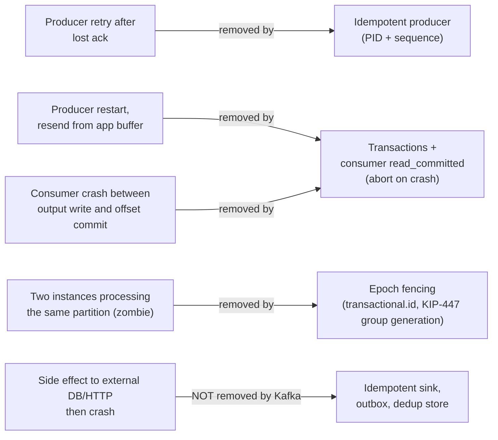
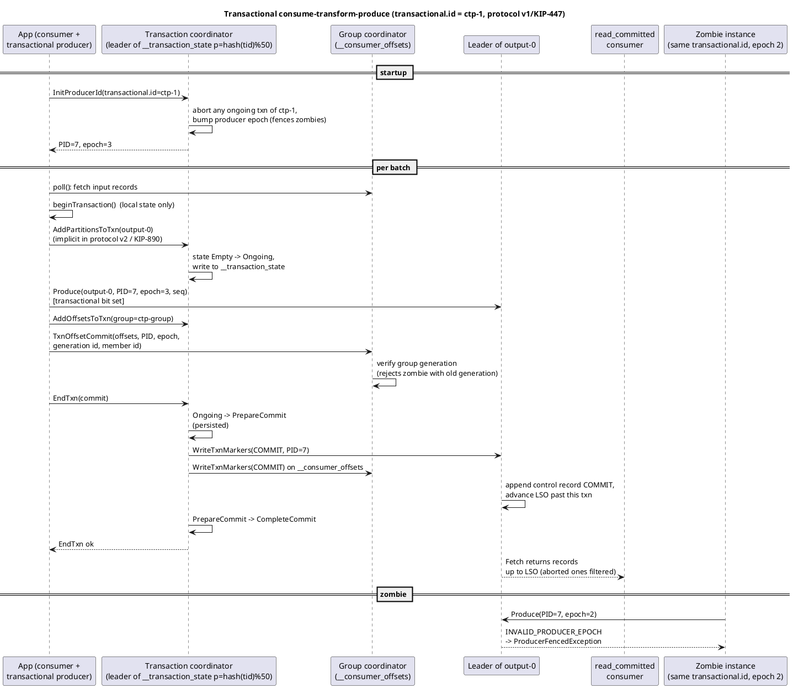
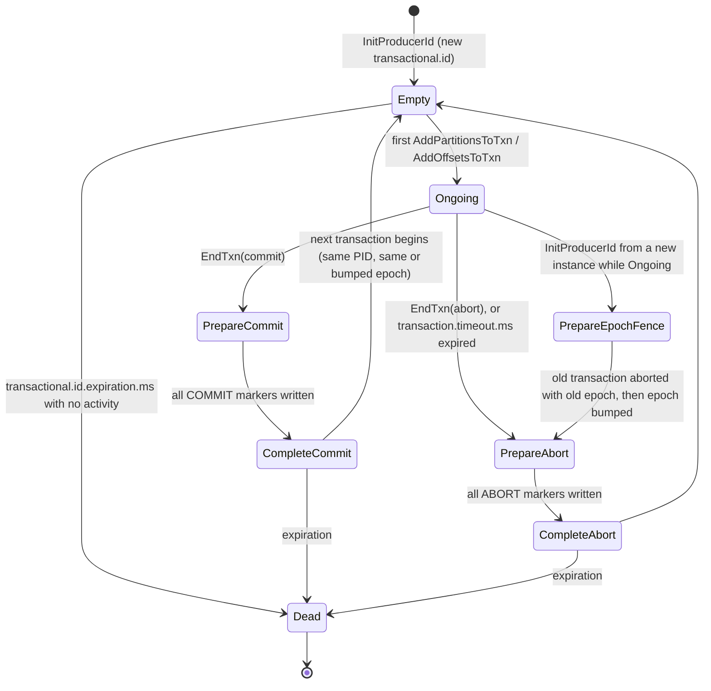
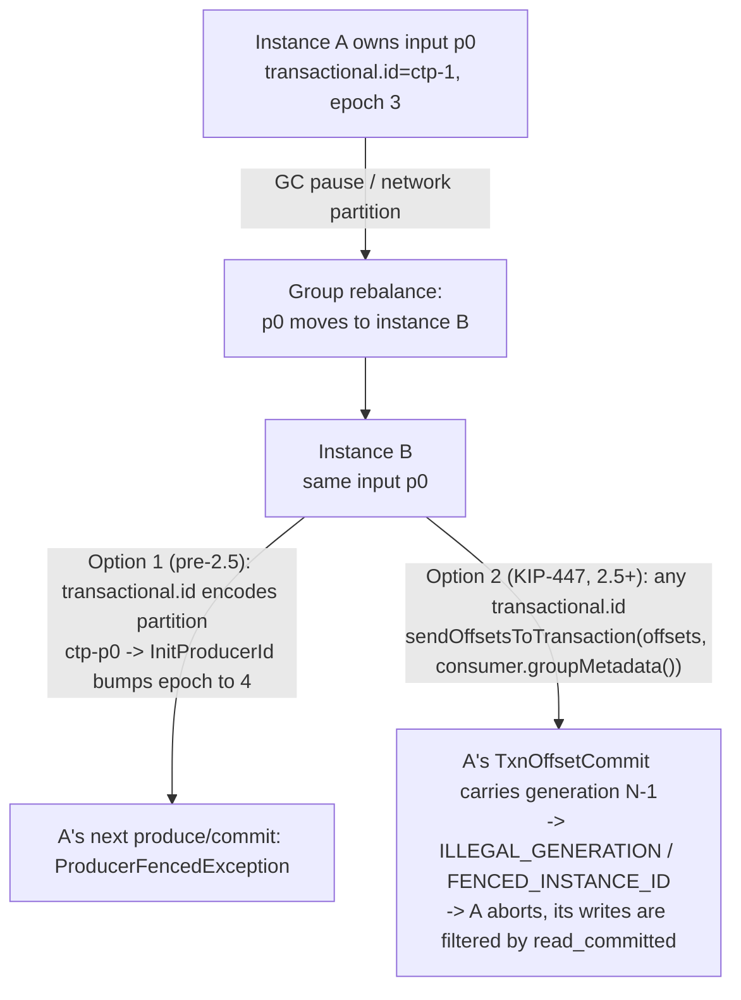

# Transactions and Exactly-Once Semantics

**Roles:** [DEV] [ARCH] [ADMIN]   **Level:** Advanced
**Prerequisites:** [Producer API](01-producer-api.md) (idempotence), [Consumer API](02-consumer-api.md) (offsets, `read_committed`)

## What you will learn
- What at-most-once, at-least-once and exactly-once actually mean in Kafka, and where duplicates come from
- How the idempotent producer and the transactional producer work: `transactional.id`, `initTransactions`, `beginTransaction`, `sendOffsetsToTransaction`, `commitTransaction`, `abortTransaction`
- The transaction coordinator, `__transaction_state`, producer epochs and zombie fencing, control records, the last stable offset and `read_committed`
- The state machine of a transaction and the timeouts that govern it, KIP-447 (2.5) and KIP-890 transaction protocol v2 (4.0)
- A full consume-transform-produce example, the throughput cost of EOS, and the limits when external systems are involved (idempotent sinks, outbox)

## 1. Concept

### 1.1 Delivery semantics, precisely

"Exactly-once" in Kafka means: **the effect of processing a record is applied once, even though the record may be delivered more than once**. It is a property of a Kafka-to-Kafka pipeline (read from topics, write to topics and offsets atomically), not a promise about arbitrary side effects.

| Semantics | Producer side | Consumer side | Failure result |
|-----------|---------------|---------------|----------------|
| At-most-once | `acks=0`, or retries disabled | commit before processing | loss |
| At-least-once | `acks=all`, retries (default) | commit after processing | duplicates |
| Exactly-once (Kafka to Kafka) | idempotent + transactional producer | offsets committed inside the transaction; downstream `read_committed` | neither, within Kafka |

Where duplicates come from, and what removes them:



### 1.2 Idempotent producer (recap)

`enable.idempotence=true` (default since 3.0) gives each producer session a producer ID (PID) and epoch; each batch carries a per-partition sequence number. The partition leader keeps the last five batches' sequence metadata per PID and drops duplicates. Scope: one producer session, one partition. It does not cover "the application re-sends after a restart" or "writes to two partitions are atomic".

### 1.3 Transactional producer

Setting `transactional.id` upgrades the producer to transactional: idempotence is required, and the producer can group writes to any number of partitions, plus consumer offset commits, into a unit that is either entirely visible to `read_committed` consumers or entirely invisible. The `transactional.id` is a stable, application-chosen identity that survives restarts; it is what allows the broker to fence a previous incarnation.

## 2. How it works internally

### 2.1 Components

| Component | Role |
|-----------|------|
| Transaction coordinator | A broker-side module, one per broker, that owns transactions for the `transactional.id`s hashed to its `__transaction_state` partitions (`partition = hash(transactional.id) % transaction.state.log.num.partitions`, default 50) |
| `__transaction_state` | Compacted internal topic (RF `transaction.state.log.replication.factor`=3, `min.isr` 2) storing `transactional.id -> {PID, epoch, state, partitions, timeout, last update}` |
| Producer epoch | 16-bit counter bumped by the coordinator on every `InitProducerId` (and, since KIP-360/KIP-890, on aborts and commits); older epochs are rejected everywhere |
| Control records | Special records (attribute bit set) written by the coordinator to every partition of a transaction: `COMMIT` or `ABORT` markers, containing the PID and epoch |
| Last stable offset (LSO) | Per partition: the offset of the first record belonging to a still-open transaction (or the high watermark if none). `read_committed` consumers fetch only up to the LSO |
| Aborted transaction index (`.txnindex`) | Per log segment; lets the broker tell a `read_committed` fetcher which ranges to filter |

### 2.2 Sequence

Source: [`diagrams/transactions-exactly-once-sequence.puml`](../diagrams/transactions-exactly-once-sequence.puml)



Two-phase commit, Kafka style: once the coordinator has persisted `PrepareCommit` in `__transaction_state`, the outcome is decided; even if the coordinator crashes, its successor replays the log and finishes writing markers. The producer's `commitTransaction()` returns after the coordinator acknowledges `EndTxn`, which happens after `PrepareCommit` is durable (markers may still be in flight).

### 2.3 Transaction state machine



Each transition is written to `__transaction_state` before the coordinator responds. `PrepareEpochFence` is the interesting one: when a new producer instance calls `initTransactions()` with a `transactional.id` whose previous incarnation has an open transaction, the coordinator first aborts that transaction (with the old epoch), then bumps the epoch and hands it to the new instance. The old instance is now a **zombie**: any request it sends carries the stale epoch and is rejected with `INVALID_PRODUCER_EPOCH` (`ProducerFencedException` in the client).

### 2.4 Zombie fencing and KIP-447



Before 2.5 the only fencing mechanism was the producer epoch, so each input partition needed its own producer with `transactional.id = <app>-<topic>-<partition>`; a Streams app with 1000 tasks needed 1000 producers. KIP-447 (Kafka 2.5) adds the consumer group **generation** to `TxnOffsetCommit`: a zombie's offset commit is rejected because its generation is stale, and since offsets are part of the transaction, the whole transaction aborts. Now one transactional producer per *thread* suffices with any stable `transactional.id`. Requirements: brokers 2.5+, the `sendOffsetsToTransaction(Map, ConsumerGroupMetadata)` overload (the `String groupId` overload was deprecated in 3.0 and removed in 4.0), and `isolation.level=read_committed` on the consumer side so it never reads a zombie's uncommitted output.

### 2.5 KIP-890: transaction protocol v2 (4.0)

The v1 protocol allowed "hanging transactions": a produce request that arrived at a partition leader after the transaction had been aborted (delayed on the network) could be appended as part of a *new* transaction that never included that partition, blocking the LSO forever. KIP-890 fixes this in two parts:

| Part | Version | Change |
|------|---------|--------|
| 1 | 3.8 | Partition leaders verify with the coordinator that the partition is really part of the ongoing transaction before appending (`AddPartitionsToTxn` verification); no client change |
| 2 | 4.0 (`transaction.version=2` feature) | Clients no longer send `AddPartitionsToTxn`; the leader adds the partition implicitly on the first transactional produce. The epoch is bumped on **every** commit or abort, so any late request from the previous transaction is rejected by epoch. Requires 4.0 clients for the new path; old clients keep using v1 with server-side verification |

Operationally: after upgrading to 4.0 brokers, enable with `kafka-features.sh --bootstrap-server localhost:9092 upgrade --feature transaction.version=2`. The admin chapter covers feature flags.

## 3. Configuration that matters

Producer:

| Parameter | Default | Recommended | Why |
|-----------|---------|-------------|-----|
| `transactional.id` | null | stable per instance/thread (`<app>-<pod-ordinal>-<thread>`) | Identity for fencing; must be unique among live producers, stable across restarts |
| `enable.idempotence` | true | true (required) | |
| `transaction.timeout.ms` | 60000 | 10000–60000 | Max time from `beginTransaction` (first write) to `EndTxn`; the coordinator aborts after this. Must be ≤ broker `transaction.max.timeout.ms` or `InitProducerId` fails |
| `acks` | all | all (required) | |
| `max.in.flight.requests.per.connection` | 5 | ≤ 5 (required) | |
| `delivery.timeout.ms` | 120000 | < `transaction.timeout.ms` is *not* required, but a send that times out forces an abort | |

Consumer (for consume-transform-produce):

| Parameter | Default | Recommended | Why |
|-----------|---------|-------------|-----|
| `isolation.level` | `read_uncommitted` | `read_committed` | Never process a zombie's or aborted output as input |
| `enable.auto.commit` | true | false (required) | Offsets go through `sendOffsetsToTransaction` only |
| `max.poll.interval.ms` | 300000 | > processing time per transaction | Exceeding it causes rebalance and fencing |

Broker:

| Parameter | Default | Recommended | Why |
|-----------|---------|-------------|-----|
| `transaction.max.timeout.ms` | 900000 | 900000 | Upper bound for client `transaction.timeout.ms` |
| `transaction.state.log.replication.factor` | 3 | 3 | |
| `transaction.state.log.min.isr` | 2 | 2 | |
| `transaction.state.log.num.partitions` | 50 | 50 | Fixed after creation |
| `transactional.id.expiration.ms` | 604800000 (7 d) | 7 d | Idle transactional ids are forgotten (`Dead`); a producer returning later just re-initializes |
| `transaction.abort.timed.out.transaction.cleanup.interval.ms` | 10000 | 10000 | How often the coordinator scans for expired transactions |
| `transaction.partition.verification.enable` | true (3.8+) | true | KIP-890 part 1 |

## 4. Failure modes and how to detect them

| Symptom | Likely cause | Metric / log to check | Fix |
|---------|--------------|-----------------------|-----|
| `ProducerFencedException` | Another instance initialized the same `transactional.id` (correct fencing), or a duplicate id in the config | Producer log | Close producer; ensure unique ids; check for two pods with the same ordinal |
| `InvalidProducerEpochException` on commit | Transaction timed out (`transaction.timeout.ms`) and the coordinator aborted and bumped the epoch (KIP-360) | Producer log; broker `transaction-coordinator-metrics` | Shorter transactions or longer timeout; handle by abort and retry with a new transaction |
| `TimeoutException` from `commitTransaction` / `initTransactions` | Coordinator unavailable (`__transaction_state` under min ISR), or `max.block.ms` too small | Broker `UnderMinIsrPartitionCount` for `__transaction_state` | Fix ISR; `initTransactions` retries until `max.block.ms` |
| `read_committed` consumer stuck, lag grows, LSO frozen | Hanging transaction (pre-3.8 bug class) or a producer that began a transaction and hung without timeout | `kafka-transactions.sh --bootstrap-server ... find-hanging --broker 1`; `PartitionsWithLateTransactionsCount` | `kafka-transactions.sh abort`; upgrade for KIP-890 |
| Throughput drops sharply after enabling EOS | Committing per record or tiny batches | producer `txn-commit-time-ns-total` (KIP-761, 3.1+) growing relative to `record-send-rate` | Batch hundreds of records per transaction; 100 ms commit interval as in Streams |
| Duplicates downstream despite EOS | Downstream consumer uses `read_uncommitted`; or output goes to a non-Kafka system | Consumer config | `isolation.level=read_committed`; idempotent sinks |
| `InvalidTxnStateException` | API misuse: `send` before `beginTransaction`, `commitTransaction` twice, `sendOffsetsToTransaction` outside a transaction | Exception | Fix call order |
| `UnsupportedForMessageFormatException` / `UnsupportedVersionException` | Broker or topic on message format < 2 (pre-0.11) | Log | Not applicable on 3.9/4.0 unless very old topics |
| `CONCURRENT_TRANSACTIONS` retries in logs | A new transaction started while the previous one's markers were still being written | Producer debug log | Benign; the client retries |

## 5. Design guidance (architect view)

### 5.1 When EOS is worth it

| Use case | Verdict |
|----------|---------|
| Kafka Streams aggregations, joins, counters (Kafka in, Kafka out) | Yes: `processing.guarantee=exactly_once_v2`, one config line |
| Consume-transform-produce microservice between topics | Yes, if duplicates would be visible (financial events, inventory counts) |
| Fan-out to several topics that must be all-or-nothing | Yes: transactions give multi-partition atomicity even without offsets |
| Consumer writing to a database / HTTP API | No: Kafka transactions cannot span external systems; use idempotent writes keyed by (topic, partition, offset) or an event id, or a DB transaction that stores the offset alongside the data |
| Fire-and-forget telemetry, logs | No: at-least-once with idempotent consumers is cheaper |
| Very low latency (< 10 ms end-to-end) | Reconsider: consumers see output only after commit, so latency is at least one commit interval |

Indicative cost: with batches of a few hundred records per transaction and a 100 ms commit interval, the overhead is on the order of 10–30% throughput and one commit interval of latency; the overhead per transaction is roughly constant (three to four extra round trips: `AddPartitions`/`AddOffsets`, `TxnOffsetCommit`, `EndTxn`, markers), so it is amortized by batching. Committing per record can cost an order of magnitude.

### 5.2 EOS boundaries and the outbox pattern

Kafka's transaction is a Kafka-internal 2PC; nothing outside the cluster participates. Three ways to extend correctness to external systems:

| Approach | Mechanism | Guarantees |
|----------|-----------|------------|
| Idempotent sink | External write keyed by a deterministic id (`topic-partition-offset` or a business key); duplicates become no-ops (upsert, `INSERT ... ON CONFLICT DO NOTHING`) | Effectively-once for the sink; requires the sink to support keys |
| Offsets stored with data | Consumer writes data and the offset in one DB transaction, seeks to the stored offset on start (`assign()` + `seek()`), ignores Kafka's committed offsets | Exactly-once for the DB; Kafka-side offset only advisory |
| Transactional outbox | Service writes business row and an outbox row in one DB transaction; Debezium (or a poller) publishes outbox rows to Kafka; consumers dedupe on the event id | Exactly-once *publication* of DB changes; at-least-once delivery with dedup |

See chapter 7 for the outbox implementation and dedup stores.

> **Anti-pattern:** Assuming `transactional.id` must encode the partition. Since 2.5 (KIP-447) it must only be *stable and unique per live producer*; deriving it from the partition forces one producer per partition and hurts scalability.

> **Anti-pattern:** Random `transactional.id` per startup (`UUID`). It defeats fencing (the old incarnation is never fenced, its open transaction only dies at `transaction.timeout.ms`, blocking the LSO meanwhile) and leaks `__transaction_state` entries until `transactional.id.expiration.ms`.

## 6. Hands-on

### 6.1 Consume-transform-produce with exactly-once

```java
package guide.txn;

import org.apache.kafka.clients.consumer.*;
import org.apache.kafka.clients.producer.*;
import org.apache.kafka.common.TopicPartition;
import org.apache.kafka.common.errors.*;
import org.apache.kafka.common.serialization.StringDeserializer;
import org.apache.kafka.common.serialization.StringSerializer;

import java.time.Duration;
import java.util.*;

public class ExactlyOnceProcessor {

    private final KafkaConsumer<String, String> consumer;
    private final KafkaProducer<String, String> producer;
    private volatile boolean running = true;

    public ExactlyOnceProcessor(String bootstrap, String instanceId) {
        Properties c = new Properties();
        c.put(ConsumerConfig.BOOTSTRAP_SERVERS_CONFIG, bootstrap);
        c.put(ConsumerConfig.GROUP_ID_CONFIG, "payments-enricher");
        c.put(ConsumerConfig.KEY_DESERIALIZER_CLASS_CONFIG, StringDeserializer.class);
        c.put(ConsumerConfig.VALUE_DESERIALIZER_CLASS_CONFIG, StringDeserializer.class);
        c.put(ConsumerConfig.ENABLE_AUTO_COMMIT_CONFIG, false);              // required
        c.put(ConsumerConfig.ISOLATION_LEVEL_CONFIG, "read_committed");      // required for end-to-end EOS
        c.put(ConsumerConfig.AUTO_OFFSET_RESET_CONFIG, "earliest");
        c.put(ConsumerConfig.MAX_POLL_RECORDS_CONFIG, 500);
        consumer = new KafkaConsumer<>(c);

        Properties p = new Properties();
        p.put(ProducerConfig.BOOTSTRAP_SERVERS_CONFIG, bootstrap);
        p.put(ProducerConfig.KEY_SERIALIZER_CLASS_CONFIG, StringSerializer.class);
        p.put(ProducerConfig.VALUE_SERIALIZER_CLASS_CONFIG, StringSerializer.class);
        p.put(ProducerConfig.TRANSACTIONAL_ID_CONFIG, "payments-enricher-" + instanceId); // stable per instance
        p.put(ProducerConfig.ENABLE_IDEMPOTENCE_CONFIG, true);
        p.put(ProducerConfig.ACKS_CONFIG, "all");
        p.put(ProducerConfig.TRANSACTION_TIMEOUT_CONFIG, 30_000);
        p.put(ProducerConfig.LINGER_MS_CONFIG, 5);
        producer = new KafkaProducer<>(p);
    }

    public void run() {
        producer.initTransactions();          // fences previous incarnation, aborts its open txn
        consumer.subscribe(List.of("payments"), new ConsumerRebalanceListener() {
            @Override public void onPartitionsRevoked(Collection<TopicPartition> parts) {
                // nothing to commit here: offsets are committed inside transactions only
            }
            @Override public void onPartitionsAssigned(Collection<TopicPartition> parts) { }
        });

        while (running) {
            ConsumerRecords<String, String> records = consumer.poll(Duration.ofMillis(200));
            if (records.isEmpty()) continue;

            try {
                producer.beginTransaction();
                for (ConsumerRecord<String, String> r : records) {
                    String enriched = enrich(r.value());
                    producer.send(new ProducerRecord<>("payments-enriched", r.key(), enriched));
                    if (isLarge(enriched)) {
                        producer.send(new ProducerRecord<>("payments-large", r.key(), enriched)); // same txn, other topic
                    }
                }
                // input offsets become part of the transaction; group metadata enables KIP-447 fencing
                producer.sendOffsetsToTransaction(offsetsToCommit(records), consumer.groupMetadata());
                producer.commitTransaction();
            } catch (ProducerFencedException | OutOfOrderSequenceException | AuthorizationException e) {
                // fatal: this producer instance is unusable. Do not call abortTransaction().
                System.err.println("fatal, shutting down: " + e);
                running = false;
            } catch (KafkaException e) {
                // includes InvalidProducerEpochException (txn timed out), TimeoutException, and
                // CommitFailedException-like rebalance conditions: abort and reprocess from last committed offsets
                System.err.println("aborting transaction: " + e);
                producer.abortTransaction();
                resetToCommitted();
            }
        }
        producer.close(Duration.ofSeconds(10));
        consumer.close(Duration.ofSeconds(10));
    }

    private static Map<TopicPartition, OffsetAndMetadata> offsetsToCommit(ConsumerRecords<String, String> records) {
        Map<TopicPartition, OffsetAndMetadata> offsets = new HashMap<>();
        for (TopicPartition tp : records.partitions()) {
            List<ConsumerRecord<String, String>> list = records.records(tp);
            long last = list.get(list.size() - 1).offset();
            offsets.put(tp, new OffsetAndMetadata(last + 1));
        }
        return offsets;
    }

    /** After an abort, rewind so the next poll re-delivers the uncommitted records. */
    private void resetToCommitted() {
        Set<TopicPartition> assigned = consumer.assignment();
        Map<TopicPartition, OffsetAndMetadata> committed = consumer.committed(assigned);
        for (TopicPartition tp : assigned) {
            OffsetAndMetadata om = committed.get(tp);
            if (om != null) consumer.seek(tp, om.offset());
            else consumer.seekToBeginning(List.of(tp));
        }
    }

    private String enrich(String v) { return v + "|enriched"; }
    private boolean isLarge(String v) { return v.length() > 1024; }

    public void stop() { running = false; consumer.wakeup(); }

    public static void main(String[] args) {
        String instance = System.getenv().getOrDefault("POD_ORDINAL", "0");
        ExactlyOnceProcessor p = new ExactlyOnceProcessor("localhost:9092", instance);
        Runtime.getRuntime().addShutdownHook(new Thread(p::stop));
        p.run();
    }
}
```

Rules embedded in the code:
- `initTransactions()` exactly once per producer, before any transaction; it blocks up to `max.block.ms`.
- Every `send()` in a transaction is asynchronous; `commitTransaction()` flushes and waits for all of them, and throws if any failed. Do not call `get()` on each future.
- Offsets are committed **only** via `sendOffsetsToTransaction`; `consumer.commitSync()` would break atomicity.
- Fatal exceptions (`ProducerFencedException`, `OutOfOrderSequenceException`, `AuthorizationException`, `UnsupportedVersionException`) mean "close the producer"; every other `KafkaException` means "abort and retry".
- After an abort, rewind the consumer to the last committed offsets; the transaction's output is invisible to `read_committed` readers.

### 6.2 Multi-topic atomic write without a consumer

```java
producer.initTransactions();
try {
    producer.beginTransaction();
    producer.send(new ProducerRecord<>("orders", orderId, orderJson));
    producer.send(new ProducerRecord<>("order-audit", orderId, auditJson));
    producer.send(new ProducerRecord<>("inventory-reservations", sku, reservationJson));
    producer.commitTransaction();     // all three visible together, or none
} catch (ProducerFencedException e) {
    producer.close();
    throw e;
} catch (KafkaException e) {
    producer.abortTransaction();
    throw e;
}
```

### 6.3 Inspecting transactions

```bash
# describe the transactional id and its state
kafka-transactions.sh --bootstrap-server localhost:9092 describe --transactional-id payments-enricher-0

# list all known transactions and their state (Empty, Ongoing, PrepareCommit, ...)
kafka-transactions.sh --bootstrap-server localhost:9092 list

# find transactions that appear hung on a broker (LSO blocked longer than --max-transaction-timeout)
kafka-transactions.sh --bootstrap-server localhost:9092 find-hanging --broker 1

# abort a hung transaction (last resort; data of that txn becomes ABORTED)
kafka-transactions.sh --bootstrap-server localhost:9092 abort \
  --topic payments-enriched --partition 3 --producer-id 7 --producer-epoch 3 --coordinator-epoch 12

# feature level for KIP-890 v2 on a 4.0 cluster
kafka-features.sh --bootstrap-server localhost:9092 describe
kafka-features.sh --bootstrap-server localhost:9092 upgrade --feature transaction.version=2
```

Consumer-side: `kafka-console-consumer.sh --bootstrap-server localhost:9092 --topic payments-enriched --isolation-level read_committed --from-beginning`.

Broker metrics: `kafka.server:type=ReplicaManager,name=PartitionsWithLateTransactionsCount` (partitions whose LSO is blocked by a transaction older than `transaction.max.timeout.ms`), `kafka.coordinator.transaction:type=TransactionMarkerChannelManager,name=UnknownDestinationQueueSize` and `LogAppendRetryQueueSize` (marker writes backing up), and `kafka.server:type=transaction-coordinator-metrics` `partition-load-time-avg` (coordinator failover cost). Producer-side (KIP-761, 3.1+): `txn-init-time-ns-total`, `txn-begin-time-ns-total`, `txn-send-offsets-time-ns-total`, `txn-commit-time-ns-total`, `txn-abort-time-ns-total` under `producer-metrics`. For LSO lag on a partition, compare `LogEndOffset` with `LastStableOffset` from `kafka.log:type=Log`.

### 6.4 Streams equivalent

```java
props.put(StreamsConfig.PROCESSING_GUARANTEE_CONFIG, StreamsConfig.EXACTLY_ONCE_V2);
props.put(StreamsConfig.COMMIT_INTERVAL_MS_CONFIG, 100);   // default under EOS
```

Streams does everything in 6.1 for you per stream thread, including state-store changelog writes inside the same transaction and restoring state from the committed changelog after an abort.

## 7. Interview questions for this chapter

### Q1. What does "exactly-once" mean in Kafka and what does it not cover?
**Role:** [ARCH] [DEV] | **Difficulty:** ★☆☆ | **Topic:** Semantics

**Answer.**
It means that for a Kafka-to-Kafka pipeline, input offset commits and output writes (across any partitions) are atomic, and duplicates from producer retries are removed, so each input record's effect appears once in Kafka. It does not cover side effects outside Kafka (databases, HTTP), it does not remove duplicates for consumers reading with `read_uncommitted`, and it does not de-duplicate business-level duplicates the producer itself creates (two distinct records with the same content).

**Follow-up probes.** How would you make a database sink effectively-once? What does `read_committed` cost?

### Q2. Walk through what happens when `commitTransaction()` is called.
**Role:** [DEV] | **Difficulty:** ★★☆ | **Topic:** Internals

**Answer.**
The producer flushes all pending batches and waits for their acks (any failure throws). It then sends `EndTxn(commit)` to the transaction coordinator. The coordinator writes `PrepareCommit` to `__transaction_state` (the point of no return), then sends `WriteTxnMarkers` to the leaders of every partition in the transaction (including `__consumer_offsets` partitions for offsets), each appending a `COMMIT` control record that advances the LSO. When all markers are acked it writes `CompleteCommit` and responds to the producer. If the coordinator dies after `PrepareCommit`, its successor replays the log and finishes writing markers.

**Follow-up probes.** Is the data visible to `read_committed` consumers when `commitTransaction()` returns? What happens if a marker write fails?

### Q3. How does zombie fencing work, and what did KIP-447 change?
**Role:** [DEV] [ARCH] | **Difficulty:** ★★★ | **Topic:** Fencing

**Answer.**
Each `initTransactions()` with a given `transactional.id` makes the coordinator bump the producer epoch and abort any open transaction of the previous epoch; brokers reject requests with an older epoch (`ProducerFencedException`). Before 2.5 this was the only fence, so every input partition needed its own `transactional.id` (encoding the partition) to guarantee that a zombie owning that partition would be fenced when the partition moved. KIP-447 added the consumer group generation to `TxnOffsetCommit`: a zombie that lost its partitions in a rebalance has a stale generation, its offset commit is rejected, and therefore its transaction cannot commit. That allows one producer per thread with any stable id, which is what Streams' `exactly_once_v2` relies on.

**Follow-up probes.** Why must the consumer use `read_committed` for KIP-447 fencing to be complete? What does 4.0 remove?

### Q4. What is the LSO and how can it get stuck?
**Role:** [ADMIN] | **Difficulty:** ★★☆ | **Topic:** Broker internals

**Answer.**
The last stable offset of a partition is the offset of the earliest record still belonging to an open transaction; `read_committed` consumers cannot read beyond it. If a producer begins a transaction, writes to the partition, then hangs or disappears without a proper abort (a random `transactional.id` per start is the usual cause), the LSO stays frozen until `transaction.timeout.ms` expires and the coordinator aborts. A "hanging transaction" (pre-KIP-890 bug class where a late produce joins a transaction that never gets a marker) blocks it forever; `kafka-transactions.sh find-hanging` and `abort` fix it, and 3.8+/4.0 prevent it.

**Follow-up probes.** Which metric shows late transactions? How does `transaction.max.timeout.ms` interact?

### Q5. Why is `transaction.timeout.ms` a safety mechanism and what happens when it fires?
**Role:** [DEV] [ADMIN] | **Difficulty:** ★★☆ | **Topic:** Timeouts

**Answer.**
It bounds how long an open transaction can block the LSO if the producer stalls. When it fires, the coordinator moves the transaction to `PrepareAbort`, writes ABORT markers, and bumps the producer epoch (KIP-360). The producer's next call fails with `InvalidProducerEpochException` (or `ProducerFencedException` on older brokers); the application should abort locally, rewind the consumer to committed offsets, and start a new transaction. Keep it short enough to limit consumer stall and long enough for the largest batch; it must not exceed the broker's `transaction.max.timeout.ms` (15 min default) or `initTransactions()` is rejected.

**Follow-up probes.** How does Streams pick its transaction size? What is `max.poll.interval.ms`'s relationship to it?

### Q6. Where does the throughput cost of transactions come from, and how do you minimize it?
**Role:** [ARCH] | **Difficulty:** ★★☆ | **Topic:** Performance

**Answer.**
Per transaction: extra round trips to the coordinator (`AddPartitionsToTxn` in v1, `AddOffsetsToTxn`, `EndTxn`), an offset commit, marker writes to every involved partition, and the `flush()` inside `commitTransaction()` that drains batches early. Per record the cost is near zero. So the cost is amortized by processing many records per transaction (hundreds to thousands) with commit intervals around 100 ms to 1 s, at the price of output latency equal to the interval. Protocol v2 (KIP-890, 4.0) removes the explicit `AddPartitionsToTxn` round trip. Committing per record is the mistake that makes EOS look 10× slower.

**Follow-up probes.** How does batching interact with `linger.ms` inside a transaction? What happens to `read_committed` latency?

### Q7. Your service consumes from Kafka and writes rows to PostgreSQL. Product asks for exactly-once. What do you propose?
**Role:** [ARCH] | **Difficulty:** ★★★ | **Topic:** EOS boundaries

**Answer.**
Kafka transactions cannot include Postgres, so the answer is idempotency rather than atomicity. Option A: make the write idempotent with a natural or synthetic key (`INSERT ... ON CONFLICT (event_id) DO NOTHING` or an upsert), keep at-least-once from Kafka; duplicates become no-ops. Option B: store the Kafka offset in the same DB transaction as the data (a `consumer_offsets` table), disable Kafka offset commits, and on startup `assign()` and `seek()` to the stored offsets; this is exactly-once for the DB at the cost of custom partition management. Option A is simpler and is what most teams should do; B fits when there is no natural key.

**Follow-up probes.** What about ordering across partitions? How does the outbox pattern relate if the flow were reversed (DB to Kafka)?

### Q8. What changes in 4.0 for transactions?
**Role:** [ADMIN] [DEV] | **Difficulty:** ★★★ | **Topic:** Versions

**Answer.**
KIP-890 part 2 introduces transaction protocol v2 (`transaction.version=2` feature flag): clients no longer send `AddPartitionsToTxn` (the partition is added implicitly on the first transactional produce), the producer epoch is bumped on every commit and abort, so late messages from a finished transaction are rejected by epoch, eliminating hanging transactions; 3.8 already added server-side partition verification for old clients. Also in 4.0: the deprecated `sendOffsetsToTransaction(Map, String groupId)` overload is removed (use the `ConsumerGroupMetadata` overload), and Streams' `exactly_once`/`exactly_once_beta` values are gone, leaving `exactly_once_v2`.

**Follow-up probes.** Does enabling `transaction.version=2` require client upgrades? What happens with a mixed 3.9/4.0 client fleet?

## Key takeaways
- Idempotence removes retry duplicates within a producer session; transactions make multi-partition writes plus offset commits atomic and let `read_committed` consumers ignore aborted data.
- The coordinator persists state in `__transaction_state`; `PrepareCommit` is the point of no return; markers advance the LSO.
- Fencing = producer epoch (`transactional.id` must be stable and unique) plus, since KIP-447, consumer group generation; one producer per thread is enough.
- Handle `ProducerFencedException`/`OutOfOrderSequenceException` as fatal; abort and rewind on anything else. Keep transactions short and batched.
- EOS stops at Kafka's edge; for external systems use idempotent sinks, offsets-with-data, or the outbox pattern.

## Further reading
- KIP-98: Exactly Once Delivery and Transactional Messaging (design document)
- KIP-129: Streams Exactly-Once Semantics; KIP-447: Producer scalability for exactly-once semantics
- KIP-360: Improve reliability of idempotent/transactional producer (epoch bump on abort)
- KIP-664: Provide tooling to detect and abort hanging transactions (`kafka-transactions.sh`)
- KIP-890: Transactions Server-Side Defense (protocol v2)
- Apache Kafka documentation: `KafkaProducer` Javadoc, "Transactional producer" section; `isolation.level` in consumer configs
