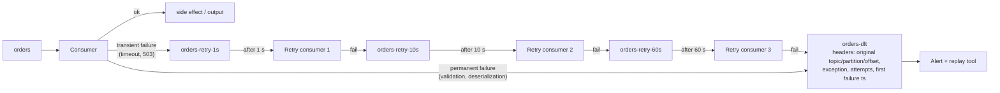
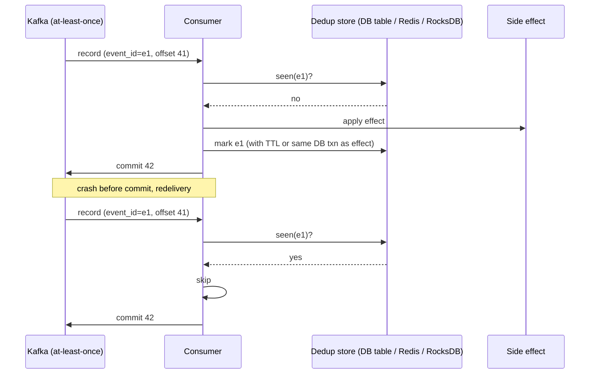
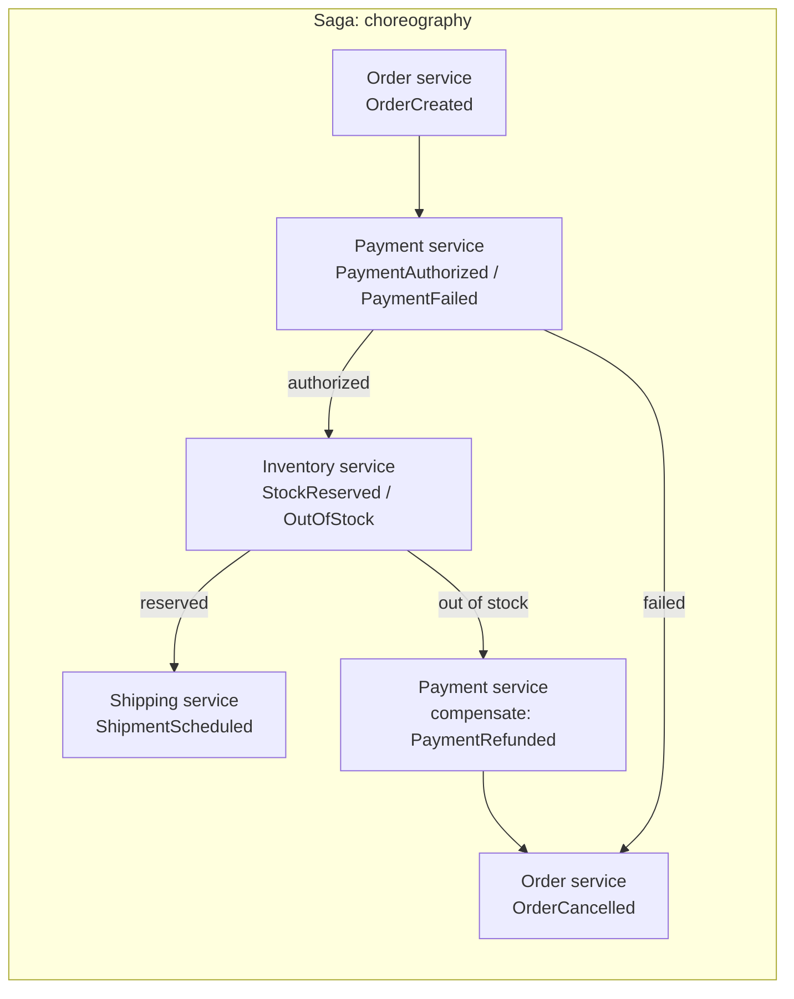
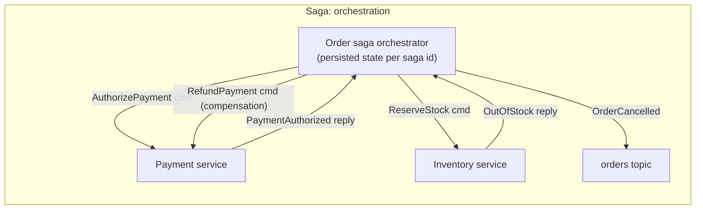
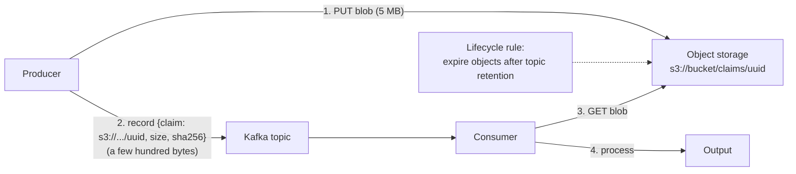
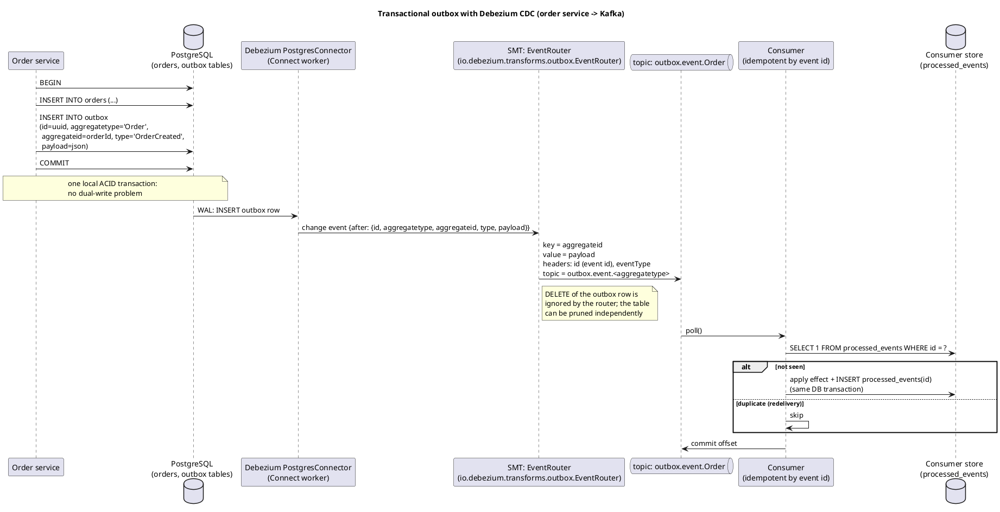

# Error Handling and Messaging Patterns

**Roles:** [DEV] [ARCH]   **Level:** Intermediate
**Prerequisites:** [Producer API](01-producer-api.md), [Consumer API](02-consumer-api.md), [Transactions and exactly-once](06-transactions-exactly-once.md)

## What you will learn
- Retry topics with backoff (topic-per-delay), dead letter topics with diagnostic headers, Spring's `@RetryableTopic`, poison pills and `ErrorHandlingDeserializer`
- Idempotent consumers with dedup stores and idempotency keys; ordering vs parallelism; batching and backpressure
- Large messages: chunking, claim-check with object storage, and the full `max.message.bytes` chain of configs
- Message design (keys, headers, envelopes, versioning) and event patterns: notification, event-carried state transfer, event sourcing, CQRS, sagas, transactional outbox with CDC
- Request-reply over Kafka and compacted topics as a key-value store

## 1. Concept

Kafka gives you an ordered, replayable log per partition and at-least-once delivery by default. Everything in this chapter is about the consequences: what to do with a record that cannot be processed now (retry later without blocking the partition), one that can never be processed (dead-letter it with enough context to debug), and one that arrives twice (make the effect idempotent). The second half covers how to shape messages and topics so that these mechanisms compose into reliable systems.

The central tension: **a partition is a queue with one consumer**. Anything that blocks on one record (a slow downstream, a retry loop) blocks every record behind it. Non-blocking retries move the problem record out of the way at the cost of ordering; blocking retries keep ordering at the cost of latency for everyone in the partition. Choose per topic, deliberately.



## 2. How it works internally

### 2.1 Retry topics with backoff (topic-per-delay)

Each retry level is a topic whose consumer enforces a minimum age before processing: read the record, compute `readyAt = firstFailureTs + delay` (or use a header written by the previous level), and if it is in the future, `pause()` the partition and sleep or `seek()` back until it is due. Because every record in `orders-retry-10s` waits the same 10 seconds, the topic stays ordered by arrival and the consumer never needs to skip ahead. A record that fails at the last level goes to the dead letter topic (DLT).

Properties of the pattern:
- Non-blocking: the main consumer keeps going; ordering across the original partition is lost for retried records (a retried `OrderUpdated` may land after a later `OrderCancelled`). Only use it for handlers that are commutative or that re-read current state.
- Attempts and timing are explicit in headers, so a DLT record explains itself.
- Retry topics must have the same key so the record's retry lands in a deterministic partition; give them the partition count of the source topic.

### 2.2 Dead letter topic headers

Recommended header set (Spring Kafka's `DeadLetterPublishingRecoverer` writes the `kafka_dlt-*` equivalents automatically):

| Header | Content |
|--------|---------|
| `x-original-topic`, `x-original-partition`, `x-original-offset` | Where the record came from; needed for replay and for correlating with logs |
| `x-original-timestamp` | Record timestamp |
| `x-exception-fqcn`, `x-exception-message` | Class and message of the last failure |
| `x-exception-stacktrace` | Truncated stack trace (keep under a few KB) |
| `x-retry-attempts` | Number of attempts before giving up |
| `x-first-failure-ts`, `x-last-failure-ts` | Epoch millis |
| `x-consumer-group`, `x-app-version` | Which deployment produced the DLT record |
| `x-dlt-reason` | `deserialization`, `validation`, `retries-exhausted`, `handler-fatal` |

Keep the original key and the original value bytes unchanged (use a `byte[]` producer for the DLT) so the record can be replayed to the source topic without re-serialization.

### 2.3 Idempotent consumers



The idempotency key must be chosen by the *producer* (a UUID in a header, or a business key such as `paymentId`), because `topic-partition-offset` changes if the record is replayed through a retry topic or re-published from a DLT. If the side effect and the dedup marker can share a transaction (same relational DB), the pattern is exactly-once for that store; otherwise, mark *after* the effect and accept a tiny double-apply window, or make the effect itself an upsert.

## 3. Configuration that matters

The large-message chain (a record must fit at every hop):

| Where | Parameter | Default | Meaning |
|-------|-----------|---------|---------|
| Producer | `max.request.size` | 1048576 | Max serialized (pre-compression) record size and max request size |
| Producer | `buffer.memory` | 33554432 | Must hold at least one record |
| Producer | `batch.size` | 16384 | Records larger than this are sent unbatched (fine, but no batching benefit) |
| Broker | `message.max.bytes` | 1048588 | Max batch size (after compression) the broker accepts; topic-level `max.message.bytes` overrides |
| Topic | `max.message.bytes` | inherits broker | Per-topic override; set only on the topics that need it |
| Broker | `replica.fetch.max.bytes` | 1048576 | Followers must be able to fetch the batch or the partition goes under-replicated (since KIP-74 the first batch is always returned, but memory must allow it) |
| Broker | `replica.fetch.response.max.bytes` | 10485760 | Total per replica fetch |
| Consumer | `max.partition.fetch.bytes` | 1048576 | Since KIP-74 (0.10.1) a larger record is still returned as the first batch, but set it to the max size for predictable memory |
| Consumer | `fetch.max.bytes` | 52428800 | Total per fetch |
| Connect / Streams | `producer.override.max.request.size`, `producer.max.request.size` | inherit | Same chain applies to framework clients |

Retry and DLT related (Spring Kafka, for reference):

| Parameter / class | Meaning |
|-------------------|---------|
| `DefaultErrorHandler(recoverer, BackOff)` | Blocking retries in place with `FixedBackOff` / `ExponentialBackOffWithMaxRetries`, then recoverer |
| `DeadLetterPublishingRecoverer(template)` | Publishes to `<topic>.DLT` (same partition by default) with `kafka_dlt-*` headers |
| `@RetryableTopic` | Non-blocking retries via generated topics `<topic>-retry-<n>` and `<topic>-dlt` |
| `spring.deserializer.value.delegate.class` | Delegate of `ErrorHandlingDeserializer` |
| `spring.kafka.listener.ack-mode` | `MANUAL`, `MANUAL_IMMEDIATE`, `RECORD`, `BATCH` |

## 4. Failure modes and how to detect them

| Symptom | Likely cause | Metric / log to check | Fix |
|---------|--------------|-----------------------|-----|
| One partition's lag grows while others are fine | Blocking retries on a poison record, or a hot key | per-partition `records-lag`; error logs with the same offset repeating | Bound blocking retries, then DLT; or non-blocking retries |
| DLT fills up with the same exception | Downstream outage treated as permanent; retries too short | DLT topic rate, exception header histogram | Longer/more retry levels for transient errors; circuit breaker that pauses consumption instead |
| Retried records processed out of order cause wrong state | Non-blocking retry on a handler that is not order-tolerant | Business reconciliation | Blocking retries for that topic, or make handlers read current state |
| Duplicates after retry-topic replay | Idempotency key based on offset | – | Producer-assigned event id in a header |
| `RecordTooLargeException` at producer, or broker `MESSAGE_TOO_LARGE` | Size chain not aligned | Producer callback exception, broker `MessagesInPerSec` unchanged | Claim-check, chunking, or align the chain |
| Consumer OOM with large messages | `max.partition.fetch.bytes` × partitions × prefetch | Heap dumps | Lower partition count per consumer, smaller `fetch.max.bytes` |
| Request-reply timeouts under load | Reply topic partitions not matched to instances; correlation misrouting | Reply consumer lag | Partition reply topic per instance or use `ReplyingKafkaTemplate` with `reply-partition` header |
| Compacted topic read returns stale/duplicate keys | Compaction has not run (`min.cleanable.dirty.ratio`) or tombstones expired | `kafka-log-dirs.sh`, `LogCleaner` metrics | Consumers must treat the topic as a changelog (last write wins) |
| Outbox table grows unbounded | Rows never pruned | Table size | Delete rows after CDC captured them (Debezium's router ignores deletes) or periodic job |
| Saga stuck halfway | Missing compensation or lost step event | Saga state store, timeout alarms | Timeouts per step, compensations idempotent, orchestrator with persisted state |

## 5. Design guidance (architect view)

### 5.1 Message design

| Element | Guidance |
|---------|----------|
| Key | The entity id whose ordering matters (`orderId`, `accountId`). Same key = same partition = ordered. Avoid low-cardinality keys (country code) and hot keys |
| Headers | Metadata that is not business payload: `event-id`, `event-type`, `schema-version`, `trace-id`/`traceparent`, `producer`, `content-type`. Consumers can route on headers without deserializing the value |
| Envelope | Either a fixed wrapper (`{id, type, version, occurredAt, source, data}`) or, with Schema Registry, the schema itself as the type and headers for metadata. Do not duplicate the key inside the value unless the value must be self-contained |
| Versioning | Additive changes under a compatibility rule (chapter 5); breaking changes get a new topic or record name (`orders-v2`), never a silent change on the same topic |
| Timestamps | `occurredAt` in the payload (event time), separate from the Kafka record timestamp; store times in UTC epoch millis or ISO-8601 |
| Size | Keep values in the low KBs; put blobs in object storage (claim-check) |

### 5.2 Event patterns

| Pattern | What the event carries | Consumers do | Trade-off |
|---------|------------------------|--------------|-----------|
| Event notification | Minimal: id and type ("order 42 changed") | Call back the source for details | Loose coupling, small events; adds a synchronous dependency and load on the source |
| Event-carried state transfer | Full current state of the entity | Maintain a local copy; no callbacks | Autonomy and read performance; larger events, eventual consistency, duplicated data |
| Event sourcing | The state change itself (`ItemAdded`, `Paid`) as the system of record | Rebuild state by replaying; snapshots for speed | Full audit and temporal queries; complex reads, schema evolution over years, Kafka is a poor per-entity store (no key lookup) |
| CQRS | Commands mutate the write model; events project into read models | Build read-optimized views (Elasticsearch, Redis, KTable) | Scales reads and writes independently; eventual consistency between models |
| Saga (choreography) | Each service reacts to the previous event and emits its own | Local transactions plus compensating events on failure | No central coordinator; hard to see the whole flow, cyclic dependencies |
| Saga (orchestration) | An orchestrator sends commands and consumes replies | Orchestrator persists saga state and drives compensation | Explicit flow and timeouts; orchestrator is a dependency and a state store |
| Transactional outbox | Event written in the same DB transaction as the state change, published by CDC | Deduplicate on event id | Removes dual-write inconsistency; adds Connect/Debezium and an outbox table |





Choreography works for three or four steps with an obvious happy path; beyond that, orchestration (a state machine per saga instance, often itself a Kafka Streams app or a workflow engine) keeps timeouts, retries and compensation visible in one place.

### 5.3 Ordering vs parallelism, batching, backpressure

| Need | Approach |
|------|----------|
| Strict order per entity, high throughput | Key by entity, many partitions, one consumer thread per partition; parallelism = partitions |
| Order irrelevant, slow per-record I/O | Worker pool or Parallel Consumer with key-level ordering off; non-blocking retries |
| Batch writes to a sink (bulk insert, S3) | Accumulate up to N records or T ms, write once, then commit the batch's last offsets; bound the batch by `max.poll.records` and `max.poll.interval.ms` |
| Backpressure from a slow sink | `pause()` partitions while the in-flight count is above a threshold; never let `poll()` stop (rebalance) |
| Consumer must not overwhelm an external API | Rate limiter in the handler plus `pause()`; or route to a retry topic on 429 with the server's `Retry-After` |

> **Anti-pattern:** Infinite in-place retries ("retry until it works"). One unavailable dependency blocks the partition forever, lag alarms fire for every topic sharing the consumer, and the poison record is never identified. Bound attempts and dead-letter.

> **Anti-pattern:** A DLT nobody reads. A dead letter topic without an alert, an owner, and a replay procedure is a data-loss mechanism with extra steps. Alert on DLT production rate and review it in on-call handovers.

### 5.4 Large messages: claim-check



Rules: write the blob before the record (a consumer must never find a dangling claim), make the object key content-addressed or a UUID (never overwrite), encrypt at rest, and align the bucket lifecycle with topic retention plus replay margin. Chunking (splitting one payload into N records with `chunk-index`/`chunk-count` headers and reassembling in the consumer) keeps everything in Kafka but breaks with retention, compaction and any consumer that is not chunk-aware; use it only when object storage is unavailable.

## 6. Hands-on

### 6.1 Retry-topic consumer with delay enforcement and DLT (plain Java)

```java
package guide.patterns;

import org.apache.kafka.clients.consumer.*;
import org.apache.kafka.clients.producer.*;
import org.apache.kafka.common.TopicPartition;
import org.apache.kafka.common.header.Header;
import org.apache.kafka.common.header.Headers;

import java.nio.charset.StandardCharsets;
import java.time.Duration;
import java.util.*;

/** Consumes one retry level (e.g. orders-retry-10s), enforces the delay, and escalates. */
public class RetryLevelConsumer {

    private final KafkaConsumer<byte[], byte[]> consumer;
    private final KafkaProducer<byte[], byte[]> producer;
    private final String topic;
    private final long delayMs;
    private final String nextTopic;     // next retry level, or null
    private final String dltTopic;
    private final Handler handler;

    interface Handler { void handle(ConsumerRecord<byte[], byte[]> r) throws Exception; }

    RetryLevelConsumer(KafkaConsumer<byte[], byte[]> consumer, KafkaProducer<byte[], byte[]> producer,
                       String topic, long delayMs, String nextTopic, String dltTopic, Handler handler) {
        this.consumer = consumer; this.producer = producer; this.topic = topic;
        this.delayMs = delayMs; this.nextTopic = nextTopic; this.dltTopic = dltTopic; this.handler = handler;
    }

    void run() {
        consumer.subscribe(List.of(topic));
        while (true) {
            ConsumerRecords<byte[], byte[]> records = consumer.poll(Duration.ofMillis(500));
            for (TopicPartition tp : records.partitions()) {
                for (ConsumerRecord<byte[], byte[]> r : records.records(tp)) {
                    long readyAt = headerLong(r.headers(), "x-retry-ready-at", r.timestamp() + delayMs);
                    long wait = readyAt - System.currentTimeMillis();
                    if (wait > 0) {
                        // not due yet: rewind to this record, pause the partition, come back later
                        consumer.seek(tp, r.offset());
                        consumer.pause(List.of(tp));
                        scheduleResume(tp, wait);
                        break;                       // later records in this partition are even younger
                    }
                    try {
                        handler.handle(r);
                    } catch (TransientException e) {
                        escalate(r, e);
                    } catch (Exception e) {
                        toDlt(r, e, "handler-fatal");
                    }
                    consumer.commitSync(Map.of(tp, new OffsetAndMetadata(r.offset() + 1)));
                }
            }
            resumeDue();
        }
    }

    private void escalate(ConsumerRecord<byte[], byte[]> r, Exception e) {
        int attempts = (int) headerLong(r.headers(), "x-retry-attempts", 0) + 1;
        if (nextTopic == null) { toDlt(r, e, "retries-exhausted"); return; }
        ProducerRecord<byte[], byte[]> next = new ProducerRecord<>(nextTopic, null, r.key(), r.value(), copy(r.headers()));
        Headers h = next.headers();
        h.remove("x-retry-attempts").add("x-retry-attempts", bytes(Integer.toString(attempts)));
        h.remove("x-retry-ready-at").add("x-retry-ready-at", bytes(Long.toString(System.currentTimeMillis() + nextDelayMs())));
        h.remove("x-last-exception").add("x-last-exception", bytes(e.getClass().getName() + ": " + e.getMessage()));
        if (h.lastHeader("x-first-failure-ts") == null) h.add("x-first-failure-ts", bytes(Long.toString(System.currentTimeMillis())));
        if (h.lastHeader("x-original-topic") == null) {
            h.add("x-original-topic", bytes(r.topic()));
            h.add("x-original-partition", bytes(Integer.toString(r.partition())));
            h.add("x-original-offset", bytes(Long.toString(r.offset())));
        }
        producer.send(next, (md, ex) -> { if (ex != null) throw new IllegalStateException("retry publish failed", ex); });
    }

    private void toDlt(ConsumerRecord<byte[], byte[]> r, Exception e, String reason) {
        ProducerRecord<byte[], byte[]> dead = new ProducerRecord<>(dltTopic, null, r.key(), r.value(), copy(r.headers()));
        Headers h = dead.headers();
        h.add("x-dlt-reason", bytes(reason));
        h.add("x-exception-fqcn", bytes(e.getClass().getName()));
        h.add("x-exception-message", bytes(String.valueOf(e.getMessage())));
        h.add("x-exception-stacktrace", bytes(stackTrace(e, 4000)));
        h.add("x-last-failure-ts", bytes(Long.toString(System.currentTimeMillis())));
        h.add("x-consumer-group", bytes(consumer.groupMetadata().groupId()));
        producer.send(dead);
    }

    // --- helpers -------------------------------------------------------------
    private final Map<TopicPartition, Long> resumeAt = new HashMap<>();
    private void scheduleResume(TopicPartition tp, long waitMs) { resumeAt.put(tp, System.currentTimeMillis() + waitMs); }
    private void resumeDue() {
        long now = System.currentTimeMillis();
        for (Iterator<Map.Entry<TopicPartition, Long>> it = resumeAt.entrySet().iterator(); it.hasNext();) {
            Map.Entry<TopicPartition, Long> e = it.next();
            if (e.getValue() <= now && consumer.assignment().contains(e.getKey())) {
                consumer.resume(List.of(e.getKey()));
                it.remove();
            }
        }
    }
    private long nextDelayMs() { return delayMs * 6; }   // 1s -> 6s -> 36s; or read from a table
    private static byte[] bytes(String s) { return s.getBytes(StandardCharsets.UTF_8); }
    private static long headerLong(Headers h, String k, long dflt) {
        Header hd = h.lastHeader(k);
        return hd == null ? dflt : Long.parseLong(new String(hd.value(), StandardCharsets.UTF_8));
    }
    private static Headers copy(Headers src) {
        org.apache.kafka.common.header.internals.RecordHeaders h = new org.apache.kafka.common.header.internals.RecordHeaders();
        src.forEach(x -> h.add(x.key(), x.value()));
        return h;
    }
    private static String stackTrace(Throwable t, int max) {
        java.io.StringWriter sw = new java.io.StringWriter();
        t.printStackTrace(new java.io.PrintWriter(sw));
        String s = sw.toString();
        return s.length() > max ? s.substring(0, max) : s;
    }
    static class TransientException extends RuntimeException { TransientException(String m, Throwable c) { super(m, c); } }
}
```

The main consumer uses the same `escalate`/`toDlt` logic with `nextTopic = "orders-retry-1s"`. Note `pause()` keeps `poll()` alive so the delay never triggers a rebalance, and the paused-partition `seek()` guarantees the delayed record is re-read rather than skipped.

### 6.2 Spring Kafka non-blocking retries with `@RetryableTopic`

```java
@Component
public class OrderListener {

    @RetryableTopic(
            attempts = "4",                                   // 1 main + 3 retries
            backoff = @Backoff(delay = 1000, multiplier = 3.0, maxDelay = 60000),
            topicSuffixingStrategy = TopicSuffixingStrategy.SUFFIX_WITH_INDEX_VALUE,
            dltTopicSuffix = "-dlt",
            autoCreateTopics = "true",
            include = { TransientException.class, SocketTimeoutException.class },  // only these are retried
            exclude = { ValidationException.class })         // straight to DLT
    @KafkaListener(topics = "orders", groupId = "order-processor")
    public void onOrder(ConsumerRecord<String, OrderCreated> record,
                        @Header(KafkaHeaders.RECEIVED_TOPIC) String topic,
                        @Header(name = KafkaHeaders.ORIGINAL_OFFSET, required = false) byte[] originalOffset) {
        service.handle(record.value());   // throws TransientException on 503 etc.
    }

    @DltHandler
    public void onDlt(ConsumerRecord<String, OrderCreated> record,
                      @Header(KafkaHeaders.EXCEPTION_FQCN) String exceptionClass,
                      @Header(KafkaHeaders.EXCEPTION_MESSAGE) String message,
                      @Header(KafkaHeaders.ORIGINAL_TOPIC) String originalTopic,
                      @Header(KafkaHeaders.ORIGINAL_OFFSET) byte[] originalOffset) {
        alerting.deadLetter(record.key(), exceptionClass, message, originalTopic);
    }
}
```

Spring creates `orders-retry-0`, `orders-retry-1`, `orders-retry-2` and `orders-dlt` (with `SUFFIX_WITH_INDEX_VALUE`; the default suffixes with the delay value, e.g. `orders-retry-1000`), one listener container per level that enforces the delay by pausing, and stamps `kafka_original-topic`, `kafka_original-partition`, `kafka_original-offset`, `kafka_original-timestamp`, `kafka_exception-fqcn`, `kafka_exception-message`, `kafka_exception-stacktrace`, and `kafka_dlt-*` headers. Requires a `KafkaTemplate` bean and `@EnableKafkaRetryTopic` (or Spring Boot auto-configuration).

### 6.3 Deserialization errors with `ErrorHandlingDeserializer`

```yaml
spring:
  kafka:
    consumer:
      key-deserializer: org.springframework.kafka.support.serializer.ErrorHandlingDeserializer
      value-deserializer: org.springframework.kafka.support.serializer.ErrorHandlingDeserializer
      properties:
        spring.deserializer.key.delegate.class: org.apache.kafka.common.serialization.StringDeserializer
        spring.deserializer.value.delegate.class: io.confluent.kafka.serializers.KafkaAvroDeserializer
        schema.registry.url: http://localhost:8081
        specific.avro.reader: true
```

```java
@Bean
public DefaultErrorHandler errorHandler(KafkaTemplate<Object, Object> template) {
    DeadLetterPublishingRecoverer recoverer = new DeadLetterPublishingRecoverer(template,
            (record, ex) -> new TopicPartition(record.topic() + ".DLT", record.partition()));
    DefaultErrorHandler handler = new DefaultErrorHandler(recoverer, new ExponentialBackOffWithMaxRetries(3));
    // DeserializationException is already non-retryable by default; add business validation errors
    handler.addNotRetryableExceptions(ValidationException.class);
    return handler;
}
```

When the delegate throws, `ErrorHandlingDeserializer` returns `null` for the value and attaches a `springDeserializerExceptionValue` header containing the serialized `DeserializationException` (with the raw bytes). The container detects the header and hands the record to the error handler, which dead-letters the *original bytes* without ever blocking the partition. Without this wrapper, the `KafkaConsumer` throws from `poll()` and the container loops on the same offset.

### 6.4 Idempotent consumer with a relational dedup store

```java
@Transactional
public void handle(ConsumerRecord<String, PaymentCaptured> r) {
    String eventId = header(r, "event-id");                   // producer-assigned UUID
    int inserted = jdbc.update(
            "INSERT INTO processed_events (event_id, processed_at) VALUES (?, now()) ON CONFLICT DO NOTHING",
            eventId);
    if (inserted == 0) {
        log.info("duplicate {} skipped", eventId);
        return;                                                 // already applied
    }
    jdbc.update("UPDATE accounts SET balance = balance + ? WHERE id = ?",
            r.value().amount(), r.value().accountId());
    // same DB transaction: marker and effect commit together; offset commit happens after return
}
```

Prune `processed_events` by `processed_at` older than the topic's retention plus replay window. For very high volume, a RocksDB or Redis set with TTL is a reasonable substitute, with the caveat that the marker and the effect are then not atomic.

### 6.5 Transactional outbox with Debezium

Source: [`diagrams/error-handling-and-patterns-outbox-cdc.puml`](../diagrams/error-handling-and-patterns-outbox-cdc.puml)



```sql
CREATE TABLE outbox (
  id            uuid PRIMARY KEY,
  aggregatetype varchar(255) NOT NULL,
  aggregateid   varchar(255) NOT NULL,
  type          varchar(255) NOT NULL,
  payload       jsonb        NOT NULL,
  created_at    timestamptz  NOT NULL DEFAULT now()
);
```

Debezium connector additions (on top of the Postgres config in chapter 4):

```json
{
  "table.include.list": "public.outbox",
  "transforms": "outbox",
  "transforms.outbox.type": "io.debezium.transforms.outbox.EventRouter",
  "transforms.outbox.route.by.field": "aggregatetype",
  "transforms.outbox.route.topic.replacement": "outbox.event.${routedByValue}",
  "transforms.outbox.table.field.event.key": "aggregateid",
  "transforms.outbox.table.field.event.payload": "payload",
  "transforms.outbox.table.fields.additional.placement": "type:header:eventType",
  "transforms.outbox.table.expand.json.payload": "true",
  "tombstones.on.delete": "false"
}
```

The service can `DELETE` the outbox row right after the insert in the same transaction (Debezium still sees the insert in the WAL); the router drops delete events, so the table stays empty without a cleanup job.

### 6.6 Request-reply over Kafka (Spring `ReplyingKafkaTemplate`)

```java
@Bean
public ReplyingKafkaTemplate<String, PriceRequest, PriceReply> replyingTemplate(
        ProducerFactory<String, PriceRequest> pf,
        ConcurrentKafkaListenerContainerFactory<String, PriceReply> factory) {
    ConcurrentMessageListenerContainer<String, PriceReply> replies =
            factory.createContainer("price-replies");
    replies.getContainerProperties().setGroupId("pricing-client-" + instanceId);   // each client instance reads all replies
    ReplyingKafkaTemplate<String, PriceRequest, PriceReply> t = new ReplyingKafkaTemplate<>(pf, replies);
    t.setDefaultReplyTimeout(Duration.ofSeconds(5));
    return t;
}

// client side
RequestReplyFuture<String, PriceRequest, PriceReply> f =
        replyingTemplate.sendAndReceive(new ProducerRecord<>("price-requests", sku, new PriceRequest(sku)));
PriceReply reply = f.get(5, TimeUnit.SECONDS).value();

// server side: @SendTo routes the return value to the kafka_replyTopic header, with kafka_correlationId copied
@KafkaListener(topics = "price-requests", groupId = "pricing")
@SendTo
public PriceReply price(PriceRequest req) { return pricing.quote(req.sku()); }
```

Kafka is not a natural RPC transport: replies for all clients share a topic (filter by `kafka_correlationId`, or use a partition per client instance with the `kafka_replyPartition` header), latency is bounded below by `linger.ms` and fetch waits, and a client restart loses in-flight correlations. Use it for occasional command/ack interactions inside an event-driven system, not as a general replacement for HTTP/gRPC.

### 6.7 Compacted topic as a key-value store

```bash
kafka-topics.sh --bootstrap-server localhost:9092 --create --topic customer-profiles \
  --partitions 12 --replication-factor 3 \
  --config cleanup.policy=compact \
  --config min.cleanable.dirty.ratio=0.1 \
  --config min.compaction.lag.ms=60000 \
  --config delete.retention.ms=86400000 \
  --config segment.ms=3600000
```

Semantics: the latest value per key survives; a `null` value (tombstone) deletes the key after `delete.retention.ms`; the active segment is never compacted, so readers always see some history until `segment.ms`/`segment.bytes` rolls it. Consumers must treat the topic as an upsert stream (read from the beginning into a map or a `KTable`), never as "one record per key". Good for reference data, configuration, and Streams changelogs; bad for lookups by key from outside (Kafka has no point reads), so materialize into a store or a `GlobalKTable`.

## 7. Interview questions for this chapter

### Q1. Compare blocking and non-blocking retries; when is each appropriate?
**Role:** [DEV] [ARCH] | **Difficulty:** ★★☆ | **Topic:** Retries

**Answer.**
Blocking retries re-process the same record in place (Spring `DefaultErrorHandler` with a `BackOff`): ordering is preserved, but every record behind it in the partition waits, and the retry budget must fit in `max.poll.interval.ms`. Non-blocking retries publish the failed record to delay topics (`orders-retry-1s`, `-10s`, `-60s`) processed by separate consumers, then to a DLT: the main partition keeps flowing, at the cost of reordering the retried record relative to later ones with the same key. Use blocking for short transient errors on order-sensitive handlers; non-blocking for slow dependencies and handlers that tolerate reordering or re-read current state.

**Follow-up probes.** How does the retry consumer enforce the delay without triggering a rebalance? What goes into the DLT headers?

### Q2. A record cannot be deserialized. What happens in a plain consumer, and how do you handle it?
**Role:** [DEV] | **Difficulty:** ★★☆ | **Topic:** Poison pills

**Answer.**
`KafkaConsumer.poll()` throws `RecordDeserializationException` and does not advance the position, so a naive loop retries the same offset forever while lag grows. Handle it by catching the exception, publishing the raw bytes and the exception details to a DLT, and `seek(partition, offset + 1)`. In Spring, `ErrorHandlingDeserializer` wraps the real deserializer, returns a record with a `springDeserializerException*` header, and the `DefaultErrorHandler` plus `DeadLetterPublishingRecoverer` dead-letter it without stalling.

**Follow-up probes.** Why must the DLT producer use `byte[]` serializers? How do you replay a fixed record?

### Q3. What is an idempotent consumer and what should the idempotency key be?
**Role:** [DEV] [ARCH] | **Difficulty:** ★★☆ | **Topic:** Idempotency

**Answer.**
A consumer whose side effect can be applied any number of times with the result of applying it once: either naturally (upsert, set-a-flag) or via a dedup store that records processed event ids. The key must be assigned by the producer and travel with the record (a UUID header or a business id such as `paymentId`), because `topic-partition-offset` changes when the record passes through retry topics, DLT replays, or MirrorMaker. Store the marker in the same transaction as the effect when possible; otherwise mark after the effect and accept a small double-apply window.

**Follow-up probes.** How long do you keep markers? What about a dedup store that is not transactional with the effect?

### Q4. Explain the full chain of configs involved when a 5 MB message must flow producer to consumer.
**Role:** [ADMIN] [DEV] | **Difficulty:** ★★☆ | **Topic:** Large messages

**Answer.**
Producer `max.request.size` (1 MiB default) and `buffer.memory`; broker `message.max.bytes` or topic `max.message.bytes` (checked after compression); broker `replica.fetch.max.bytes` so followers can replicate it; consumer `max.partition.fetch.bytes` and `fetch.max.bytes` (since KIP-74 an oversized first batch is still returned, but memory must be planned); the same for Connect (`producer.override.max.request.size`) and Streams. Raising all of them works but increases broker and consumer memory and replication latency; the better answer for multi-MB payloads is the claim-check pattern with object storage.

**Follow-up probes.** What error does the producer get when the broker rejects? Does compression help?

### Q5. Describe the transactional outbox pattern and the dual-write problem it solves.
**Role:** [ARCH] | **Difficulty:** ★★☆ | **Topic:** Outbox

**Answer.**
Dual write: a service updates its database and then publishes to Kafka (or vice versa); a crash between the two leaves them inconsistent, and there is no distributed transaction across Postgres and Kafka. The outbox pattern writes the event into an `outbox` table in the same local DB transaction as the state change, and a CDC connector (Debezium with the `EventRouter` SMT) publishes each outbox row to a topic keyed by the aggregate id. Publication is then guaranteed at least once, and consumers deduplicate on the outbox row id. The cost is a Connect cluster, an outbox table, and at-least-once semantics rather than exactly-once.

**Follow-up probes.** How is the outbox table kept small? What if CDC is unavailable, is polling the outbox acceptable?

### Q6. Choreography or orchestration for a 6-step order saga across five services?
**Role:** [ARCH] | **Difficulty:** ★★★ | **Topic:** Sagas

**Answer.**
Orchestration. With six steps and compensations, choreography spreads the flow across five codebases; nobody can answer "where is order 42 stuck" without tracing events, timeouts are per-service and inconsistent, and adding a step means changing several consumers. An orchestrator (a service with persisted saga state per order, driven by command and reply topics, possibly implemented as a Kafka Streams app keyed by order id) makes the state machine, timeouts and compensation order explicit. Choreography stays attractive for two or three steps with independent teams and a trivial compensation story.

**Follow-up probes.** How does the orchestrator survive restarts? How do you make compensations idempotent?

### Q7. When would you choose event-carried state transfer over event notification?
**Role:** [ARCH] | **Difficulty:** ★★☆ | **Topic:** Event patterns

**Answer.**
Event-carried state transfer when consumers need to act without calling back the source: it removes runtime coupling and load on the source, enables consumers to keep local read models (and serve reads during source outages), and works well with compacted topics as the latest-state snapshot. Event notification when payloads are large, when data ownership rules forbid copying, or when consumers need only a fraction of the entity and a callback is cheap. The trade-off is data duplication and eventual consistency versus a synchronous dependency.

**Follow-up probes.** How do you version a state-transfer event? What happens to consumers created after months of events, with compaction on?

### Q8. Is Kafka a good fit for request-reply? What would you watch for?
**Role:** [DEV] [ARCH] | **Difficulty:** ★★☆ | **Topic:** Request-reply

**Answer.**
It works (`ReplyingKafkaTemplate`, correlation id and reply topic headers) but it is not what Kafka optimizes for. Latency is bounded by producer batching, fetch waits and consumer poll cycles, so single-digit milliseconds is hard; a shared reply topic means every client instance reads every reply unless partitions are dedicated per instance; correlation state lives in the client's memory and is lost on restart; and you lose the decoupling that made Kafka attractive. Use it for occasional command/ack flows inside an already event-driven system, and HTTP/gRPC for real synchronous APIs.

**Follow-up probes.** How does `@SendTo` know the reply topic? What is the timeout behaviour?

### Q9. How does a compacted topic differ from a regular topic for consumers, and what mistakes do people make?
**Role:** [DEV] | **Difficulty:** ★★☆ | **Topic:** Compaction

**Answer.**
A compacted topic retains at least the latest record per key, deleting older values lazily (only when `min.cleanable.dirty.ratio` is exceeded and never in the active segment), and removes keys with tombstones after `delete.retention.ms`. Consumers must therefore expect multiple records per key and apply last-write-wins, and must read from the beginning to build state. Mistakes: expecting one record per key, sending records without keys (unusable), relying on compaction for immediate deletion (GDPR needs encryption-based erasure or short `segment.ms` plus verification), and using it as a lookup service (no point reads; materialize into a store).

**Follow-up probes.** Why is the active segment never compacted? What does `min.compaction.lag.ms` protect?

## Key takeaways
- Bound retries and dead-letter with diagnostic headers; non-blocking retry topics keep partitions flowing at the cost of ordering.
- Deserialization errors need a wrapper (`ErrorHandlingDeserializer`) or explicit `seek(offset + 1)`; otherwise the partition stalls forever.
- Duplicates are normal; producer-assigned event ids plus a dedup store or upserts make consumers idempotent.
- Align the size chain or use claim-check; design messages with entity keys, metadata headers, and additive versioning.
- Outbox with CDC removes dual writes; orchestration beats choreography for long sagas; compacted topics are changelogs, not databases.

## Further reading
- Spring for Apache Kafka reference: "Non-Blocking Retries", "Handling Exceptions", "Request/Reply Semantics"
- Debezium documentation: "Outbox Event Router"
- Enterprise Integration Patterns: Claim Check, Dead Letter Channel, Idempotent Receiver
- Apache Kafka documentation: Log compaction
- KIP-74: Add fetch response size limit in bytes; KIP-334: Include partitions in exceptions raised during consumer record deserialization
