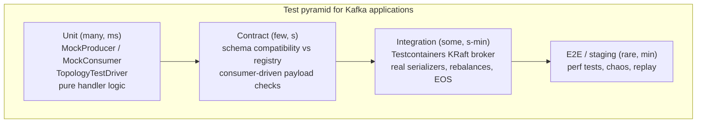
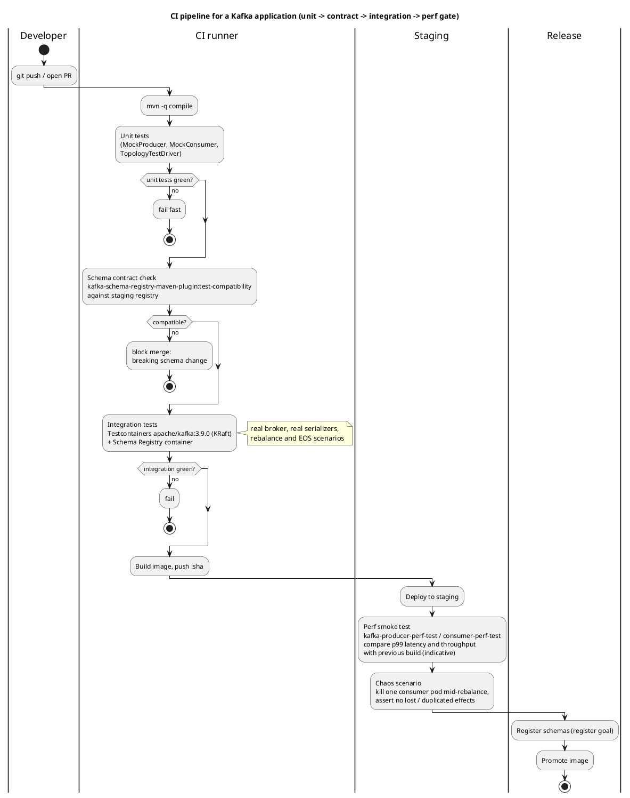
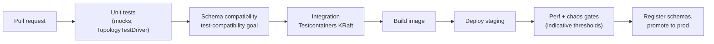

# Testing and Local Development

**Roles:** [DEV] [ADMIN]   **Level:** Intermediate
**Prerequisites:** [Producer API](01-producer-api.md), [Consumer API](02-consumer-api.md), [Kafka Streams](03-kafka-streams.md), [Schema Registry](05-schema-registry-serialization.md)

## What you will learn
- Unit testing with `MockProducer`, `MockConsumer` and `TopologyTestDriver`, and what each does not cover
- Integration testing with Testcontainers (`apache/kafka` KRaft image) and Spring's `@EmbeddedKafka`; contract tests for schemas
- A complete docker-compose for a single KRaft broker, Schema Registry, Connect and a Kafka UI
- CLI dev loop with `kafka-console-*`, `kcat`, and performance testing with `kafka-producer-perf-test.sh` / `kafka-consumer-perf-test.sh`
- Chaos testing consumers during rebalances, and a CI pipeline pattern for Kafka applications

## 1. Concept

Kafka applications fail in ways unit tests do not reach: rebalances mid-batch, duplicate delivery, serialization mismatches, offsets committed at the wrong moment. A useful test strategy therefore has three layers with clear responsibilities, and a local environment that is close enough to production to reproduce real client behaviour (KRaft, the same client version, a real Schema Registry).



| Layer | Tool | Proves | Does not prove |
|-------|------|--------|----------------|
| Unit | `MockProducer`, `MockConsumer` | Your code calls the client correctly (keys, headers, commit points, error branches) | Broker behaviour, batching, rebalances, serialization against a registry |
| Unit (Streams) | `TopologyTestDriver` | Topology logic, windows, state stores, punctuators, deterministic time | Threading, rebalancing, RocksDB memory, EOS |
| Contract | Schema Registry Maven plugin, JSON schema validation | Producers and consumers agree on payloads across versions | Runtime wiring |
| Integration | Testcontainers, `@EmbeddedKafka` | End-to-end through a real broker: offsets, transactions, `read_committed`, group rebalances, Connect/SR interplay | Performance, multi-broker failure modes |
| Staging | perf tests, chaos | Throughput/latency envelope, resilience to kills and rebalances | Long-tail production behaviour |

## 2. How it works internally

### 2.1 How the mocks behave

`MockProducer<K,V>` records every `send()` in `history()` and, with `autoComplete=true`, completes futures immediately with fake `RecordMetadata`; with `autoComplete=false` you drive completion with `completeNext()` or `errorNext(exception)`, which is how you test callback error paths. It applies the partitioner and serializers you pass, so key-to-partition logic and custom serializers are exercised. It supports the transactional API (`initTransactions`, `beginTransaction`, `commitTransaction`, `abortTransaction`, `sendOffsetsToTransaction`) with inspection methods (`transactionCommitted()`, `transactionAborted()`, `consumerGroupOffsetsHistory()`).

`MockConsumer<K,V>` has no broker: you `assign()` partitions (or `subscribe()` and call `rebalance()` to simulate an assignment), set `updateBeginningOffsets`/`updateEndOffsets`, and `addRecord()` records to be returned by the next `poll()`. `schedulePollTask(Runnable)` runs code inside the next `poll()`, which is where you inject `wakeup()` or a rebalance to test shutdown and `ConsumerRebalanceListener` code. Commits are recorded (`committed()`), and `seek()` works. In 3.9 it is constructed with `new MockConsumer<>(OffsetResetStrategy.EARLIEST)`; 4.0 deprecates that in favour of `new MockConsumer<>("earliest")` (KIP-1060, `AutoOffsetResetStrategy`).

### 2.2 CI flow

Source: [`diagrams/testing-and-local-dev-ci-flow.puml`](../diagrams/testing-and-local-dev-ci-flow.puml)





## 3. Configuration that matters

Test-specific settings that keep tests fast and deterministic:

| Where | Parameter | Value in tests | Why |
|-------|-----------|----------------|-----|
| Broker (container/compose) | `KAFKA_OFFSETS_TOPIC_REPLICATION_FACTOR`, `KAFKA_TRANSACTION_STATE_LOG_REPLICATION_FACTOR`, `KAFKA_TRANSACTION_STATE_LOG_MIN_ISR` | 1 | Single broker cannot satisfy RF 3 |
| Broker | `KAFKA_GROUP_INITIAL_REBALANCE_DELAY_MS` | 0 | Default 3000 ms delays the first rebalance of every new group |
| Broker | `KAFKA_AUTO_CREATE_TOPICS_ENABLE` | `true` locally, `false` in integration tests that assert topic configs | Explicit topics catch partition-count assumptions |
| Broker | `KAFKA_LOG_FLUSH_INTERVAL_MESSAGES` etc. | defaults | Do not tune durability in tests |
| Consumer | `auto.offset.reset` | `earliest` | Tests produce before the consumer joins |
| Consumer | `session.timeout.ms`, `heartbeat.interval.ms` | 6000 / 2000 | Faster failure detection in chaos tests (respect broker `group.min.session.timeout.ms`=6000) |
| Producer | `linger.ms` | 0 | Deterministic timing in assertions |
| Streams | `state.dir` | `@TempDir` per test | Avoid lock conflicts between tests |
| Streams | `commit.interval.ms` | small (e.g. 100) in integration tests | Faster output visibility |
| Testcontainers | `withReuse(true)` + `testcontainers.reuse.enable=true` in `~/.testcontainers.properties` | dev only | Skip container start between runs |
| Spring | `spring.kafka.bootstrap-servers=${spring.embedded.kafka.brokers}` | with `@EmbeddedKafka` | Wire the app to the embedded broker |

## 4. Failure modes and how to detect them

| Symptom | Likely cause | Metric / log to check | Fix |
|---------|--------------|-----------------------|-----|
| Integration test flaky: consumer receives nothing | Consumer subscribed after produce with `auto.offset.reset=latest`; or first rebalance delayed 3 s | Test logs | `earliest`; `group.initial.rebalance.delay.ms=0`; await assignment before producing |
| `TopologyTestDriver` output empty for windowed aggregation | Stream time never passed window end plus grace; `suppress` holding | – | Pipe a later record or advance event time; use `pipeInput(k, v, Instant)` |
| `LockException` between Streams tests | Shared `state.dir` | – | `@TempDir`, unique `application.id` per test |
| Testcontainers cannot connect: `Connection to node -1 (localhost/127.0.0.1:9092) could not be established` | Using the fixed port instead of `getBootstrapServers()` | – | Always use the mapped port |
| `@EmbeddedKafka` tests slow (seconds per class) | Broker started per test class | – | One shared context; `@DirtiesContext` sparingly; consider Testcontainers with reuse |
| Serialization works in unit tests, fails in integration | Mocks bypass the registry; wrong `schema.registry.url` or `specific.avro.reader` | `Unknown magic byte!` | Add a Schema Registry container; contract tests |
| Perf test shows low throughput on laptop | Single broker on Docker Desktop with file sync overhead | – | Treat local numbers as relative only; run perf on staging |
| Chaos test shows duplicates | Expected under at-least-once; test asserts wrong property | – | Assert on idempotent effect, or use EOS and `read_committed` |
| Chaos test shows lost records | Auto-commit or commit before processing | – | Fix commit strategy (chapter 2) |

## 5. Design guidance (architect view)

| Decision | Guidance |
|----------|----------|
| Mocks vs embedded broker for unit tests | Mocks: test handler logic and client call patterns; they run in milliseconds. Do not test "does Kafka deliver" with mocks |
| `@EmbeddedKafka` vs Testcontainers | Testcontainers runs the real `apache/kafka` image with KRaft, matching production behaviour and version; `@EmbeddedKafka` runs an in-JVM broker (KRaft-based since Spring Kafka 3.x) and is faster to start but shares the JVM heap and classpath with your app. Prefer Testcontainers when Docker is available in CI |
| Contract tests | Run schema compatibility in CI against the *staging* registry, with the same compatibility level as production. Consumer-driven contract tests (assert a consumer can deserialize samples from the producer's repo) complement registry checks for JSON without a registry |
| Local environment | One KRaft broker, Schema Registry, Connect, and a UI in docker-compose; same client/broker major version as production; auto topic creation on locally, off in CI |
| What to chaos-test | Kill a consumer mid-batch, restart during a rebalance, pause a broker (single-broker: stop the container) while producing with `acks=all`; assert idempotent effects and committed offsets, not "no duplicates" unless EOS is on |
| Perf numbers | Local perf tests are relative (before/after a change); absolute numbers come from staging with production-like brokers. Say "indicative" in reports |

> **Anti-pattern:** Sleeping in tests (`Thread.sleep(5000)` then assert). Use Awaitility or poll until the condition holds with a timeout; sleeps make suites slow and still flaky.

> **Anti-pattern:** A test suite that passes with mocks only. The first production incident will be a rebalance, a serialization mismatch, or an offset committed too early, none of which a mock can reproduce.

## 6. Hands-on

### 6.1 Unit test with `MockProducer`

```java
package guide.test;

import org.apache.kafka.clients.producer.MockProducer;
import org.apache.kafka.clients.producer.ProducerRecord;
import org.apache.kafka.common.errors.TimeoutException;
import org.apache.kafka.common.serialization.StringSerializer;
import org.junit.jupiter.api.Test;

import java.nio.charset.StandardCharsets;
import java.util.List;
import java.util.concurrent.atomic.AtomicReference;

import static org.junit.jupiter.api.Assertions.*;

class OrderPublisherTest {

    @Test
    void publishesKeyedRecordWithHeaders() {
        MockProducer<String, String> producer =
                new MockProducer<>(true, new StringSerializer(), new StringSerializer());   // autoComplete
        OrderPublisher publisher = new OrderPublisher(producer, "orders");

        publisher.publish("o-1", "{\"id\":\"o-1\"}", "trace-1");

        List<ProducerRecord<String, String>> sent = producer.history();
        assertEquals(1, sent.size());
        assertEquals("o-1", sent.get(0).key());
        assertEquals("trace-1", new String(sent.get(0).headers().lastHeader("trace-id").value(), StandardCharsets.UTF_8));
    }

    @Test
    void failureIsReportedThroughCallback() {
        MockProducer<String, String> producer =
                new MockProducer<>(false, new StringSerializer(), new StringSerializer());  // manual completion
        AtomicReference<Exception> seen = new AtomicReference<>();
        OrderPublisher publisher = new OrderPublisher(producer, "orders", seen::set);

        publisher.publish("o-2", "{}", "trace-2");
        producer.errorNext(new TimeoutException("Expiring 1 record(s)"));                  // complete with failure

        assertNotNull(seen.get());
        assertInstanceOf(TimeoutException.class, seen.get());
    }

    @Test
    void transactionIsCommitted() {
        MockProducer<String, String> producer =
                new MockProducer<>(true, new StringSerializer(), new StringSerializer());
        producer.initTransactions();
        producer.beginTransaction();
        producer.send(new ProducerRecord<>("orders", "k", "v"));
        producer.commitTransaction();
        assertTrue(producer.transactionCommitted());
        assertEquals(1, producer.history().size());
    }
}
```

### 6.2 Unit test with `MockConsumer`

```java
package guide.test;

import org.apache.kafka.clients.consumer.*;
import org.apache.kafka.common.TopicPartition;
import org.junit.jupiter.api.Test;

import java.util.*;

import static org.junit.jupiter.api.Assertions.*;

class OrderConsumerLoopTest {

    @Test
    void processesRecordsCommitsNextOffsetAndStopsOnWakeup() throws Exception {
        MockConsumer<String, String> consumer = new MockConsumer<>(OffsetResetStrategy.EARLIEST);
        TopicPartition tp = new TopicPartition("orders", 0);
        List<String> processed = new ArrayList<>();

        // simulate subscribe + assignment on the first poll
        consumer.schedulePollTask(() -> {
            consumer.rebalance(List.of(tp));                         // triggers onPartitionsAssigned
            consumer.updateBeginningOffsets(Map.of(tp, 0L));
            consumer.addRecord(new ConsumerRecord<>("orders", 0, 0L, "o-1", "{\"id\":1}"));
            consumer.addRecord(new ConsumerRecord<>("orders", 0, 1L, "o-2", "{\"id\":2}"));
        });
        // second poll: stop the loop
        consumer.schedulePollTask(consumer::wakeup);

        OrderConsumerLoop loop = new OrderConsumerLoop(consumer, "orders", processed::add);
        loop.run();                                                  // returns after WakeupException

        assertEquals(List.of("{\"id\":1}", "{\"id\":2}"), processed);
        OffsetAndMetadata committed = consumer.committed(Set.of(tp)).get(tp);
        assertEquals(2L, committed.offset(), "committed offset must be last processed + 1");
        assertTrue(consumer.closed());
    }
}
```

`OrderConsumerLoop` is the poll loop from chapter 2 with the consumer injected through the constructor. Because `MockConsumer` runs `schedulePollTask` inside `poll()`, the `rebalance()` call invokes your `ConsumerRebalanceListener`, so commit-on-revoke logic is testable too (schedule `consumer.rebalance(List.of())` to revoke).

### 6.3 `TopologyTestDriver`

Covered in chapter 3, section 6.6. Two additions for time-based logic:

```java
// event time for windows: supply timestamps explicitly
input.pipeInput("user-1", view("home"), Instant.parse("2026-09-07T10:00:00Z"));
input.pipeInput("user-1", view("cart"), Instant.parse("2026-09-07T10:04:00Z"));
input.pipeInput("user-1", view("checkout"), Instant.parse("2026-09-07T10:07:00Z")); // closes the 10:00-10:05 window (with 1 min grace)
assertEquals(2L, output.readKeyValue().value);

// wall-clock punctuators
driver.advanceWallClockTime(Duration.ofMinutes(2));
```

### 6.4 Integration test with Testcontainers (KRaft)

Dependencies: `org.testcontainers:kafka:1.20.4`, `org.testcontainers:junit-jupiter:1.20.4`, `org.awaitility:awaitility:4.2.2`.

```java
package guide.it;

import org.apache.kafka.clients.admin.*;
import org.apache.kafka.clients.consumer.*;
import org.apache.kafka.clients.producer.*;
import org.apache.kafka.common.serialization.*;
import org.junit.jupiter.api.*;
import org.testcontainers.junit.jupiter.Container;
import org.testcontainers.junit.jupiter.Testcontainers;
import org.testcontainers.kafka.KafkaContainer;      // new module class, KRaft by default, apache/kafka image

import java.time.Duration;
import java.util.*;

import static org.awaitility.Awaitility.await;
import static org.junit.jupiter.api.Assertions.*;

@Testcontainers
class ExactlyOnceProcessorIT {

    @Container
    static final KafkaContainer KAFKA = new KafkaContainer("apache/kafka:3.9.0")
            .withEnv("KAFKA_GROUP_INITIAL_REBALANCE_DELAY_MS", "0")
            .withEnv("KAFKA_TRANSACTION_STATE_LOG_MIN_ISR", "1")
            .withEnv("KAFKA_TRANSACTION_STATE_LOG_REPLICATION_FACTOR", "1");

    static String bootstrap;

    @BeforeAll
    static void topics() throws Exception {
        bootstrap = KAFKA.getBootstrapServers();
        try (Admin admin = Admin.create(Map.of(AdminClientConfig.BOOTSTRAP_SERVERS_CONFIG, bootstrap))) {
            admin.createTopics(List.of(
                    new NewTopic("payments", 3, (short) 1),
                    new NewTopic("payments-enriched", 3, (short) 1))).all().get();
        }
    }

    @Test
    void enrichesEveryRecordExactlyOnceUnderReadCommitted() throws Exception {
        // produce input
        Properties pp = new Properties();
        pp.put(ProducerConfig.BOOTSTRAP_SERVERS_CONFIG, bootstrap);
        pp.put(ProducerConfig.KEY_SERIALIZER_CLASS_CONFIG, StringSerializer.class);
        pp.put(ProducerConfig.VALUE_SERIALIZER_CLASS_CONFIG, StringSerializer.class);
        try (KafkaProducer<String, String> p = new KafkaProducer<>(pp)) {
            for (int i = 0; i < 100; i++) p.send(new ProducerRecord<>("payments", "k" + i, "v" + i));
            p.flush();
        }

        // run the processor from chapter 6 in a background thread
        ExactlyOnceProcessor proc = new ExactlyOnceProcessor(bootstrap, "it-0");
        Thread t = new Thread(proc::run, "processor");
        t.start();

        // consume output with read_committed
        Properties cp = new Properties();
        cp.put(ConsumerConfig.BOOTSTRAP_SERVERS_CONFIG, bootstrap);
        cp.put(ConsumerConfig.GROUP_ID_CONFIG, "verifier");
        cp.put(ConsumerConfig.AUTO_OFFSET_RESET_CONFIG, "earliest");
        cp.put(ConsumerConfig.ISOLATION_LEVEL_CONFIG, "read_committed");
        cp.put(ConsumerConfig.KEY_DESERIALIZER_CLASS_CONFIG, StringDeserializer.class);
        cp.put(ConsumerConfig.VALUE_DESERIALIZER_CLASS_CONFIG, StringDeserializer.class);
        Map<String, String> seen = new HashMap<>();
        try (KafkaConsumer<String, String> c = new KafkaConsumer<>(cp)) {
            c.subscribe(List.of("payments-enriched"));
            await().atMost(Duration.ofSeconds(30)).untilAsserted(() -> {
                for (ConsumerRecord<String, String> r : c.poll(Duration.ofMillis(200))) seen.put(r.key(), r.value());
                assertEquals(100, seen.size());
            });
        } finally {
            proc.stop();
            t.join(10_000);
        }
        assertEquals("v42|enriched", seen.get("k42"));
    }
}
```

`org.testcontainers.kafka.KafkaContainer` (Testcontainers 1.19.7+) targets the official `apache/kafka` image and starts in KRaft combined mode; the older `org.testcontainers.containers.KafkaContainer` targets `confluentinc/cp-kafka` and needs `.withKraft()`. Both expose `getBootstrapServers()` with the mapped port, which is the only address you should use. Add `org.testcontainers:testcontainers` `GenericContainer` for Schema Registry (`confluentinc/cp-schema-registry:7.7.1`, env `SCHEMA_REGISTRY_KAFKASTORE_BOOTSTRAP_SERVERS` pointing at the Kafka container's *internal* listener via a shared `Network`).

### 6.5 Spring `@EmbeddedKafka`

```java
@SpringBootTest(properties = {
        "spring.kafka.bootstrap-servers=${spring.embedded.kafka.brokers}",
        "spring.kafka.consumer.auto-offset-reset=earliest"
})
@EmbeddedKafka(partitions = 3, topics = {"orders", "orders.DLT"}, kraft = true,
        brokerProperties = {"group.initial.rebalance.delay.ms=0", "transaction.state.log.replication.factor=1"})
class OrderListenerSpringTest {

    @Autowired KafkaTemplate<String, String> template;
    @Autowired EmbeddedKafkaBroker broker;
    @Autowired OrderRepository repo;

    @Test
    void listenerStoresOrder() {
        template.send("orders", "o-1", "{\"id\":\"o-1\"}");
        await().atMost(Duration.ofSeconds(10)).until(() -> repo.findById("o-1").isPresent());
    }

    @Test
    void poisonPillGoesToDlt() {
        template.send("orders", "bad", "not-json");
        Map<String, Object> props = KafkaTestUtils.consumerProps("dlt-verifier", "true", broker);
        try (Consumer<String, String> c = new DefaultKafkaConsumerFactory<>(props,
                new StringDeserializer(), new StringDeserializer()).createConsumer()) {
            broker.consumeFromAnEmbeddedTopic(c, "orders.DLT");
            ConsumerRecord<String, String> dead = KafkaTestUtils.getSingleRecord(c, "orders.DLT", Duration.ofSeconds(10));
            assertEquals("bad", dead.key());
            assertNotNull(dead.headers().lastHeader("kafka_dlt-exception-fqcn"));
        }
    }
}
```

The `kraft` attribute exists since Spring Kafka 3.0; its default has changed between minor versions, so set it explicitly. `spring-kafka-test` also provides `KafkaTestUtils.getRecords`, `EmbeddedKafkaBroker.addTopics`, and the `EmbeddedKafkaKraftBroker` class for programmatic use in non-Spring tests.

### 6.6 Contract tests for schemas

```bash
# in CI, against the staging registry with production compatibility levels
mvn -q io.confluent:kafka-schema-registry-maven-plugin:validate \
       io.confluent:kafka-schema-registry-maven-plugin:test-compatibility \
       -Dschema.registry.url=https://schema-registry.staging:8081
```

For JSON without a registry, a consumer-driven contract test keeps sample payloads in the producer repository and runs the consumer's deserializer against them:

```java
@ParameterizedTest
@ValueSource(strings = {"samples/order-created-v1.json", "samples/order-created-v2.json"})
void consumerCanReadAllPublishedVersions(String path) throws Exception {
    byte[] bytes = Files.readAllBytes(Path.of(path));
    OrderCreated event = new JsonDeserializer<>(OrderCreated.class).deserialize("orders", bytes);
    assertNotNull(event.orderId());
}
```

### 6.7 docker-compose: KRaft broker + Schema Registry + Connect + Kafka UI

```yaml
# docker-compose.yml  (docker compose up -d)
services:
  kafka:
    image: apache/kafka:3.9.0
    container_name: kafka
    ports:
      - "9092:9092"       # host clients
    environment:
      KAFKA_NODE_ID: 1
      KAFKA_PROCESS_ROLES: broker,controller
      KAFKA_CONTROLLER_QUORUM_VOTERS: 1@kafka:9093
      KAFKA_LISTENERS: PLAINTEXT://0.0.0.0:19092,CONTROLLER://0.0.0.0:9093,PLAINTEXT_HOST://0.0.0.0:9092
      KAFKA_ADVERTISED_LISTENERS: PLAINTEXT://kafka:19092,PLAINTEXT_HOST://localhost:9092
      KAFKA_LISTENER_SECURITY_PROTOCOL_MAP: CONTROLLER:PLAINTEXT,PLAINTEXT:PLAINTEXT,PLAINTEXT_HOST:PLAINTEXT
      KAFKA_INTER_BROKER_LISTENER_NAME: PLAINTEXT
      KAFKA_CONTROLLER_LISTENER_NAMES: CONTROLLER
      KAFKA_OFFSETS_TOPIC_REPLICATION_FACTOR: 1
      KAFKA_TRANSACTION_STATE_LOG_REPLICATION_FACTOR: 1
      KAFKA_TRANSACTION_STATE_LOG_MIN_ISR: 1
      KAFKA_GROUP_INITIAL_REBALANCE_DELAY_MS: 0
      KAFKA_AUTO_CREATE_TOPICS_ENABLE: "true"
      KAFKA_NUM_PARTITIONS: 3
      KAFKA_LOG_DIRS: /var/lib/kafka/data
      CLUSTER_ID: MkU3OEVBNTcwNTJENDM2Qk      # any base64 UUID; keep stable to reuse the volume
    volumes:
      - kafka-data:/var/lib/kafka/data
    healthcheck:
      test: ["CMD-SHELL", "/opt/kafka/bin/kafka-broker-api-versions.sh --bootstrap-server localhost:19092 > /dev/null 2>&1"]
      interval: 5s
      timeout: 5s
      retries: 20

  schema-registry:
    image: confluentinc/cp-schema-registry:7.7.1
    container_name: schema-registry
    depends_on:
      kafka:
        condition: service_healthy
    ports:
      - "8081:8081"
    environment:
      SCHEMA_REGISTRY_HOST_NAME: schema-registry
      SCHEMA_REGISTRY_KAFKASTORE_BOOTSTRAP_SERVERS: PLAINTEXT://kafka:19092
      SCHEMA_REGISTRY_LISTENERS: http://0.0.0.0:8081
      SCHEMA_REGISTRY_KAFKASTORE_TOPIC_REPLICATION_FACTOR: 1
      SCHEMA_REGISTRY_SCHEMA_COMPATIBILITY_LEVEL: backward

  connect:
    image: confluentinc/cp-kafka-connect:7.7.1
    container_name: connect
    depends_on:
      kafka:
        condition: service_healthy
      schema-registry:
        condition: service_started
    ports:
      - "8083:8083"
    environment:
      CONNECT_BOOTSTRAP_SERVERS: kafka:19092
      CONNECT_REST_PORT: 8083
      CONNECT_REST_ADVERTISED_HOST_NAME: connect
      CONNECT_GROUP_ID: connect-local
      CONNECT_CONFIG_STORAGE_TOPIC: _connect-configs
      CONNECT_OFFSET_STORAGE_TOPIC: _connect-offsets
      CONNECT_STATUS_STORAGE_TOPIC: _connect-status
      CONNECT_CONFIG_STORAGE_REPLICATION_FACTOR: 1
      CONNECT_OFFSET_STORAGE_REPLICATION_FACTOR: 1
      CONNECT_STATUS_STORAGE_REPLICATION_FACTOR: 1
      CONNECT_KEY_CONVERTER: org.apache.kafka.connect.storage.StringConverter
      CONNECT_VALUE_CONVERTER: io.confluent.connect.avro.AvroConverter
      CONNECT_VALUE_CONVERTER_SCHEMA_REGISTRY_URL: http://schema-registry:8081
      CONNECT_PLUGIN_PATH: /usr/share/java,/usr/share/confluent-hub-components,/opt/connectors
      CONNECT_CONFIG_PROVIDERS: file,env
      CONNECT_CONFIG_PROVIDERS_FILE_CLASS: org.apache.kafka.common.config.provider.FileConfigProvider
      CONNECT_CONFIG_PROVIDERS_ENV_CLASS: org.apache.kafka.common.config.provider.EnvVarConfigProvider
    volumes:
      - ./connectors:/opt/connectors        # drop Debezium / JDBC plugin directories here

  kafka-ui:
    image: ghcr.io/kafbat/kafka-ui:latest
    container_name: kafka-ui
    depends_on:
      kafka:
        condition: service_healthy
    ports:
      - "8080:8080"
    environment:
      KAFKA_CLUSTERS_0_NAME: local
      KAFKA_CLUSTERS_0_BOOTSTRAPSERVERS: kafka:19092
      KAFKA_CLUSTERS_0_SCHEMAREGISTRY: http://schema-registry:8081
      KAFKA_CLUSTERS_0_KAFKACONNECT_0_NAME: connect-local
      KAFKA_CLUSTERS_0_KAFKACONNECT_0_ADDRESS: http://connect:8083

volumes:
  kafka-data:
```

Notes: the broker advertises `kafka:19092` to containers and `localhost:9092` to the host, which is the usual two-listener setup; the CLI inside the container uses `--bootstrap-server localhost:19092`. Schema Registry and Connect are Confluent images (Community License); swap in `apicurio/apicurio-registry` and a plain `apache/kafka` container running `connect-distributed.sh` if you need Apache-only components. Kafka UI is the Kafbat fork of the former Provectus project.

### 6.8 CLI dev loop

```bash
# topics
kafka-topics.sh --bootstrap-server localhost:9092 --create --topic orders --partitions 3 --replication-factor 1
kafka-topics.sh --bootstrap-server localhost:9092 --describe --topic orders

# produce keyed records with headers (key:value separated by ':')
kafka-console-producer.sh --bootstrap-server localhost:9092 --topic orders \
  --property parse.key=true --property key.separator=: \
  --property parse.headers=true --property headers.delimiter='|' --property headers.separator=, --property headers.key.separator=:
# then type:   trace-id:abc,content-type:json|o-1:{"id":"o-1"}

# consume with key, partition, offset, timestamp and headers
kafka-console-consumer.sh --bootstrap-server localhost:9092 --topic orders --from-beginning \
  --property print.key=true --property print.partition=true --property print.offset=true \
  --property print.timestamp=true --property print.headers=true

# consume Avro through Schema Registry (Confluent CLI, in the schema-registry container)
kafka-avro-console-consumer --bootstrap-server kafka:19092 --topic orders --from-beginning \
  --property schema.registry.url=http://schema-registry:8081

# consumer groups
kafka-consumer-groups.sh --bootstrap-server localhost:9092 --describe --group order-processors
kafka-consumer-groups.sh --bootstrap-server localhost:9092 --group order-processors --topic orders \
  --reset-offsets --to-earliest --execute      # group must be inactive

# kcat (formerly kafkacat)
kcat -b localhost:9092 -L                                          # metadata
kcat -b localhost:9092 -t orders -C -o beginning -f 'p=%p o=%o k=%k h=%h\n%s\n'   # consume with format
kcat -b localhost:9092 -t orders -P -K: -H trace-id=abc <<< 'o-9:{"id":"o-9"}'   # produce keyed with header
kcat -b localhost:9092 -t orders -C -o -5 -e                       # last 5 records per partition, then exit
kcat -b localhost:9092 -G my-group orders                          # consume as a group member
kcat -b localhost:9092 -t orders -C -s value=avro -r http://localhost:8081 -o beginning   # Avro via registry
kcat -b localhost:9092 -t orders -Q -t orders:0:1725700000000     # offset for timestamp
```

### 6.9 Performance testing

```bash
# producer: 1M records of 1 KiB, unbounded rate, production-like settings; prints throughput and latency percentiles
kafka-producer-perf-test.sh --topic perf --num-records 1000000 --record-size 1024 --throughput -1 \
  --producer-props bootstrap.servers=localhost:9092 acks=all linger.ms=10 batch.size=65536 \
                   compression.type=lz4 enable.idempotence=true \
  --print-metrics
# sample line: 1000000 records sent, 285000.5 records/sec (278.32 MB/sec), 12.4 ms avg latency, 210 ms max latency,
#              9 ms 50th, 31 ms 95th, 78 ms 99th, 190 ms 99.9th   (indicative; depends entirely on hardware)

# with transactions
kafka-producer-perf-test.sh --topic perf --num-records 200000 --record-size 1024 --throughput -1 \
  --transactional-id perf-txn --transaction-duration-ms 100 \
  --producer-props bootstrap.servers=localhost:9092

# consumer: read 1M messages, report MB/s and records/s
kafka-consumer-perf-test.sh --bootstrap-server localhost:9092 --topic perf --messages 1000000 \
  --group perf-consumer --show-detailed-stats --reporting-interval 5000 \
  --consumer.config consumer-perf.properties      # e.g. fetch.min.bytes=65536, isolation.level=read_committed

# end-to-end latency (producer -> consumer round trip through the broker)
kafka-e2e-latency.sh localhost:9092 perf 10000 all 1024
```

Compare runs by changing one variable at a time (`linger.ms`, `compression.type`, `acks`, partition count) and keep the topic's partition count and replication factor identical to production for anything you want to extrapolate. Local single-broker numbers are indicative only.

### 6.10 Chaos: killing consumers during a rebalance

Goal: prove that killing an instance mid-batch loses nothing and that the effect is idempotent.

```bash
# 1. produce a known set of keyed records with a counter in the value
kafka-producer-perf-test.sh --topic orders --num-records 50000 --record-size 200 --throughput 2000 \
  --producer-props bootstrap.servers=localhost:9092 acks=all &

# 2. start three consumer instances (same group) writing to a DB/table keyed by event id

# 3. while producing, kill one instance without grace (no LeaveGroup, forces session timeout / poll timeout path)
docker kill --signal=SIGKILL consumer-2
# and a second one during the resulting rebalance
sleep 2 && docker kill --signal=SIGKILL consumer-3

# 4. restart them, wait for lag 0
kafka-consumer-groups.sh --bootstrap-server localhost:9092 --describe --group order-processors

# 5. assert: every produced event id appears in the store exactly once (dedup) or at least once (plain at-least-once)
```

Vary the kill point: during `poll()`, after processing but before commit, inside `onPartitionsRevoked`. With static membership (`group.instance.id`) also test a restart within `session.timeout.ms` and verify no rebalance happened (`rebalance-total` unchanged). For broker-side chaos on a multi-broker staging cluster, stop the leader of a partition while producing with `acks=all` and verify `record-error-rate` stays 0 and the producer only logs `NotLeaderOrFollowerException` retries.

Automate the same scenario in Testcontainers by running two consumer threads against the container and interrupting one thread (or calling `consumer.close(Duration.ZERO)` from another thread to skip the graceful `LeaveGroup`), then asserting on the effect store.

## 7. Interview questions for this chapter

### Q1. What can `MockProducer` and `MockConsumer` test, and what can they not?
**Role:** [DEV] | **Difficulty:** ★☆☆ | **Topic:** Unit testing

**Answer.**
They test your code's use of the client API: which records were sent with which keys and headers (`history()`), how callbacks handle failures (`errorNext`), transactional call ordering, and, for the consumer, the poll loop, commit offsets (`committed()`), rebalance listener code (`rebalance()`) and shutdown via `wakeup()` scheduled with `schedulePollTask`. They cannot test broker behaviour: batching and timeouts, real rebalances, `read_committed` filtering, serialization against a registry, or ordering under retries. Those need an integration test with a real broker.

**Follow-up probes.** How do you test a `ConsumerRebalanceListener` with `MockConsumer`? What changed in 4.0's `MockConsumer` constructor?

### Q2. Testcontainers or `@EmbeddedKafka`?
**Role:** [DEV] | **Difficulty:** ★★☆ | **Topic:** Integration testing

**Answer.**
Testcontainers runs the real `apache/kafka` image (KRaft) in Docker, so the broker version and behaviour match production, the JVM under test is isolated from broker classes, and the same container can host Schema Registry and Connect; it costs Docker in CI and a few seconds of startup (reusable containers help). `@EmbeddedKafka` starts a broker inside the test JVM, which is faster and needs no Docker, but shares heap and classpath, is tied to the `kafka_2.13` server jars on the test classpath, and can drift from the production version. Prefer Testcontainers where Docker is available; use `@EmbeddedKafka` for quick Spring listener tests.

**Follow-up probes.** How do you connect to the container from the test? Why never hard-code port 9092?

### Q3. Why does a consumer integration test sometimes receive nothing, and how do you make it deterministic?
**Role:** [DEV] | **Difficulty:** ★★☆ | **Topic:** Flaky tests

**Answer.**
Common causes: the consumer joined after the records were produced with `auto.offset.reset=latest`; the group's first rebalance was delayed by `group.initial.rebalance.delay.ms` (3 s default); auto topic creation raced with the subscription; or the assertion ran before `poll()` was called enough times. Fixes: `earliest`, set the broker delay to 0, create topics explicitly before the test, wait for assignment (a rebalance listener latch or `consumer.assignment()` non-empty), and use Awaitility polling instead of sleeps.

**Follow-up probes.** What is the difference between `assignment()` being non-empty and having a committed offset?

### Q4. How do you test a windowed Kafka Streams aggregation without a broker?
**Role:** [DEV] | **Difficulty:** ★★☆ | **Topic:** Streams testing

**Answer.**
`TopologyTestDriver` executes the topology synchronously in-process with in-memory or real RocksDB stores. Pipe records with explicit timestamps (`pipeInput(key, value, Instant)`) so stream time advances deterministically; windows close when a record with a timestamp past `windowEnd + grace` arrives, at which point `suppress()` emits. Read results with `TestOutputTopic.readKeyValuesToList()` and inspect stores with `driver.getWindowStore()`. Use `advanceWallClockTime` for wall-clock punctuators. It does not exercise threads, rebalances, or EOS; those need an integration test.

**Follow-up probes.** Why can the last window "never close" in production but close in the test? How do you test late records?

### Q5. What belongs in the CI pipeline for a Kafka microservice?
**Role:** [ARCH] [DEV] | **Difficulty:** ★★☆ | **Topic:** CI

**Answer.**
Unit tests with mocks and `TopologyTestDriver` on every commit; a schema compatibility check against the staging registry (`test-compatibility`) that blocks merges on breaking changes; integration tests with Testcontainers covering commit semantics, rebalance, DLT and, if used, transactions with `read_committed`; then image build. Post-deploy to staging: a short `kafka-producer-perf-test` / `kafka-consumer-perf-test` smoke comparing against the previous build (indicative), and a chaos scenario killing a consumer mid-rebalance. Schema registration (`register` goal) runs on release, not on PR.

**Follow-up probes.** Where do you get a registry for PR checks? How do you avoid registering schemas from feature branches?

### Q6. How do you run a realistic single-node Kafka locally in 2026?
**Role:** [DEV] [ADMIN] | **Difficulty:** ★☆☆ | **Topic:** Local dev

**Answer.**
One `apache/kafka:3.9.0` (or 4.0) container in KRaft combined mode (`KAFKA_PROCESS_ROLES=broker,controller`, `KAFKA_CONTROLLER_QUORUM_VOTERS=1@kafka:9093`), two listeners (internal `kafka:19092` for other containers, `localhost:9092` for the host), internal topic replication factors set to 1, `group.initial.rebalance.delay.ms=0`; plus Schema Registry, Connect and a UI in the same compose file. No ZooKeeper: since 3.3 KRaft is production-ready and 4.0 removed ZooKeeper entirely, so local setups should match.

**Follow-up probes.** Why two listeners? What is `CLUSTER_ID` for?

### Q7. Interpret this perf-test output: 280k records/s, 99th percentile 78 ms, `acks=all`, single broker.
**Role:** [ADMIN] [DEV] | **Difficulty:** ★★☆ | **Topic:** Performance

**Answer.**
Throughput is a function of batching and compression (`linger.ms=10`, `batch.size=64K`, `lz4`), and on a single broker `acks=all` equals `acks=1` because the ISR is one replica, so the number says nothing about replication cost. The p99 of 78 ms is dominated by `linger.ms` plus queueing in the accumulator under unbounded rate (`--throughput -1`); with a bounded rate, p99 usually drops sharply. Treat it as a relative baseline for A/B changes on the same machine; absolute capacity must be measured on staging with RF 3 and `min.insync.replicas=2`.

**Follow-up probes.** Which metric shows whether the producer was memory-bound? What would you change first to lower p99?

### Q8. Design a chaos test that proves a consumer does not lose records.
**Role:** [ARCH] [DEV] | **Difficulty:** ★★★ | **Topic:** Resilience

**Answer.**
Produce a known set of records with unique ids at a steady rate; run several consumer instances writing to a store keyed by id; SIGKILL one instance mid-batch (no graceful `LeaveGroup`), then a second during the resulting rebalance; restart; wait for lag 0; assert every id is present (no loss) and, with dedup or EOS, present exactly once. Repeat with kill points at poll, between process and commit, and inside `onPartitionsRevoked`. Record `rebalance-total` and time-to-recover as secondary metrics. The test proves the commit strategy and idempotency together; a test that only asserts "no duplicates" under plain at-least-once is testing the wrong property.

**Follow-up probes.** How does static membership change the expected outcome? How would you automate the kill in Testcontainers?

## Key takeaways
- Mocks test your code's use of the client; `TopologyTestDriver` tests topology logic; only a real broker tests rebalances, commits, transactions and serialization.
- Use Testcontainers with `apache/kafka` KRaft images and the mapped `getBootstrapServers()`; make tests deterministic with `earliest`, zero initial rebalance delay, explicit topics and Awaitility.
- Put schema compatibility checks in CI before integration tests; register schemas only on release.
- Keep a docker-compose with broker, Schema Registry, Connect and a UI that mirrors production versions; learn `kcat` and the perf-test scripts.
- Chaos-test the commit strategy: kill consumers mid-rebalance and assert on idempotent effects.

## Further reading
- Apache Kafka Javadoc: `MockProducer`, `MockConsumer`; Kafka Streams "Testing" developer guide
- Testcontainers documentation: Kafka module (`org.testcontainers.kafka.KafkaContainer`)
- Spring for Apache Kafka reference: "Testing Applications" (`@EmbeddedKafka`, `KafkaTestUtils`)
- Apache Kafka `apache/kafka` Docker image documentation (KRaft configuration via environment variables)
- `kafka-producer-perf-test.sh` / `kafka-consumer-perf-test.sh` usage (`--help`)
- kcat README (edenhill/kcat)
- KIP-1060: `AutoOffsetResetStrategy` and `MockConsumer` changes (4.0)
