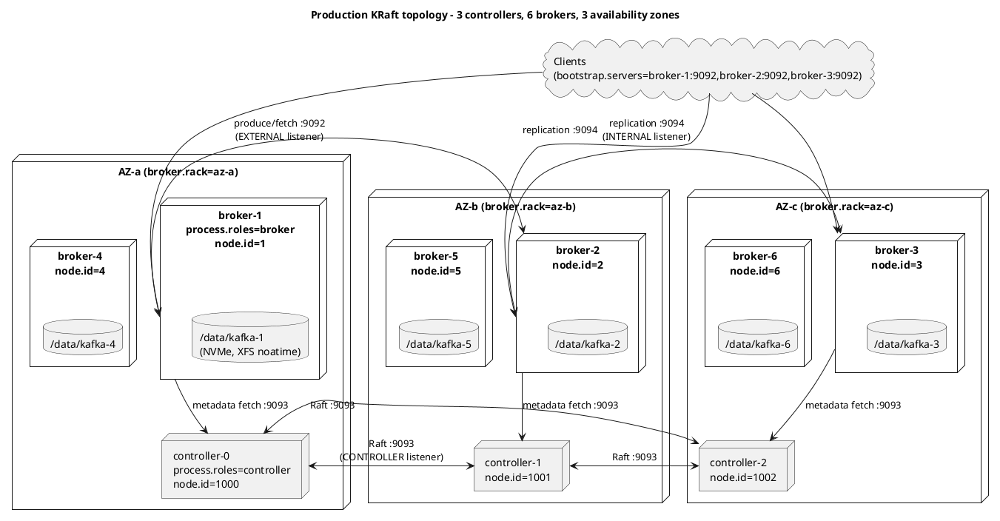
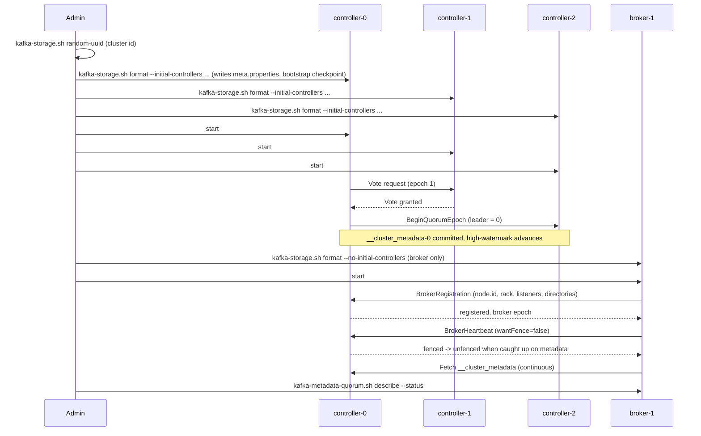
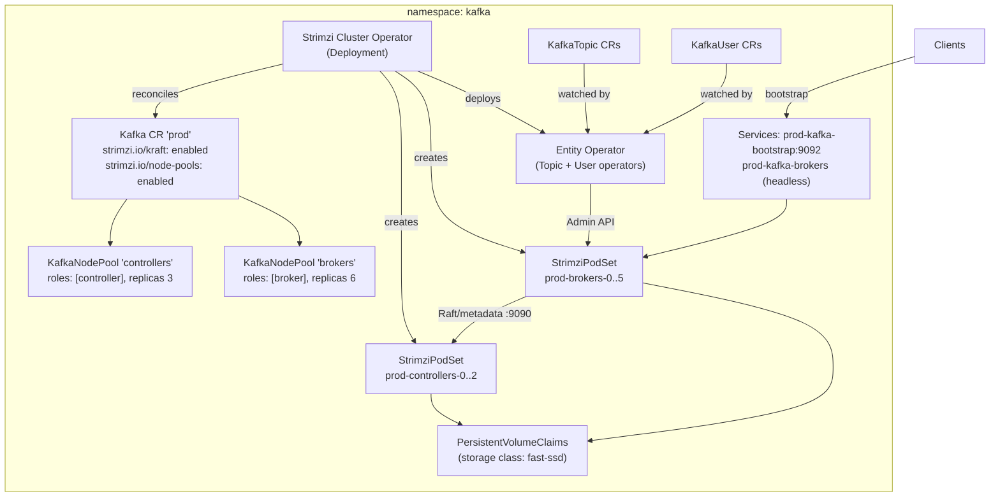

# Installation and Deployment (KRaft)

**Roles:** [ADMIN] [ARCH]   **Level:** Foundation
**Prerequisites:** `01-architecture/` chapters on brokers, partitions, replication and the KRaft controller quorum.

## What you will learn
- How to size hardware for a broker and a controller and what actually limits throughput.
- Which OS and JVM settings matter and the exact values to start from.
- How to bootstrap a KRaft cluster with static (`controller.quorum.voters`) and dynamic (KIP-853, `controller.quorum.bootstrap.servers`) quorums.
- When to run combined vs isolated controllers, and 3 vs 5 voters.
- How to deploy with systemd, Docker Compose (`apache/kafka` image), and Kubernetes (Strimzi node pools).
- How to verify that a new cluster is healthy before handing it over.

## 1. Concept

A Kafka deployment is two independent groups of processes sharing one cluster id:

| Group | Role | State it owns | Scaling driver |
|-------|------|---------------|----------------|
| Controller quorum | `process.roles=controller` | `__cluster_metadata` log (topics, partitions, ISR, configs, ACLs, producer ids) | Availability only: 3 or 5 voters, never more |
| Broker fleet | `process.roles=broker` | Topic partitions in `log.dirs` | Throughput, storage, partition count |

Since 3.3 KRaft is production-ready, since 3.5 ZooKeeper mode is deprecated, and since 4.0 ZooKeeper is removed. Everything in this chapter assumes KRaft on Kafka 3.9 or 4.0. Note the Java baseline: Kafka 3.9 brokers run on Java 11 or 17; Kafka 4.0 brokers and tools require Java 17 (clients and Streams still support Java 11).

The deployment questions an administrator has to settle, in order:

1. Hardware and OS: page cache, disk layout, file descriptors.
2. JVM: heap size and GC.
3. Cluster identity: cluster id, node ids, quorum membership.
4. Network: listeners, advertised listeners, controller listener.
5. Placement: racks / availability zones.
6. Process management: systemd, container, or operator.
7. Verification.

### 1.1 Deployment topology (isolated controllers, three AZs)



Source: `diagrams/admin-01-installation-and-deployment-topology.puml`.

## 2. How it works internally

### 2.1 Hardware guidance

| Component | Broker | Controller (isolated) | Why |
|-----------|--------|-----------------------|-----|
| CPU | 12-32 cores; more cores if TLS or compression is done on the broker | 4-8 cores | Network and I/O thread pools scale with cores; TLS encrypts every byte on the broker |
| RAM | 32-128 GB; heap 6-8 GB, the rest is page cache | 8-16 GB, heap 2-4 GB | Kafka serves reads from page cache; more RAM means fewer disk reads for lagging consumers |
| Disk | NVMe or SATA SSD; multiple SSD/HDD as JBOD (`log.dirs` comma list) or RAID-10 | Small SSD (tens of GB) | Sequential I/O; metadata log is small but latency-sensitive (fsync on every commit) |
| Disk to avoid | NFS/NAS, shared SAN with noisy neighbours, RAID-5/6 | same | fsync latency and the "one full disk breaks the broker" behaviour |
| Network | 10 GbE minimum, 25 GbE for high-throughput clusters | 1 GbE is enough | Replication traffic is (RF-1) times the ingress |
| Cloud example (indicative) | AWS `m6i.4xlarge`/`i3en`, EBS `gp3` with provisioned IOPS/throughput, or local NVMe | `m6i.large`-`xlarge`, `gp3` | Local NVMe is fastest but data is lost on instance replacement; EBS survives it |

Sizing rule of thumb (indicative, not a benchmark): a well-tuned broker on 10 GbE sustains on the order of hundreds of MB/s of produce traffic; the network, not the disk, is usually the first bottleneck. Compute required storage as `ingress_per_day * retention_days * replication_factor * 1.3` (30 % headroom for segments awaiting deletion and for reassignment copies).

> **Production tip:** Keep OS, Kafka logs (`LOG_DIR`) and data (`log.dirs`) on separate volumes. A runaway `server.log` must never fill the data disk, and a full data disk must never stop the OS.

### 2.2 OS tuning

| Setting | Value | Where | Why |
|---------|-------|-------|-----|
| Open files | `ulimit -n 200000` (or `LimitNOFILE=200000` in systemd) | `/etc/security/limits.conf`, unit file | Every segment holds a file handle for `.log`, `.index`, `.timeindex`; every connection is a socket |
| `vm.swappiness` | `1` | `/etc/sysctl.d/99-kafka.conf` | Avoid swapping the heap; `0` can trigger OOM-killer earlier on some kernels |
| `vm.dirty_background_ratio` | `5` | sysctl | Start background writeback early so flushes are small and steady |
| `vm.dirty_ratio` | `60`-`80` | sysctl | Allow a large dirty page cache; Kafka relies on the OS, not `log.flush.*`, to flush |
| `vm.max_map_count` | `262144` or more | sysctl | Each segment mmaps its index files; 100k partitions x segments can exceed the 65530 default |
| `fs.file-max` | `1000000` | sysctl | Kernel-wide file handle ceiling |
| `net.core.rmem_max` / `wmem_max` | `134217728` | sysctl | Let `socket.receive.buffer.bytes` / `socket.send.buffer.bytes` grow for cross-AZ links |
| `net.ipv4.tcp_rmem` / `tcp_wmem` | `4096 87380 67108864` / `4096 65536 67108864` | sysctl | Same |
| `net.core.netdev_max_backlog` | `50000` | sysctl | Burst absorption on 10/25 GbE |
| Transparent Huge Pages | `never` | `/sys/kernel/mm/transparent_hugepage/enabled` | THP compaction causes latency spikes on JVMs with large heaps |
| Filesystem | XFS (ext4 acceptable) | mkfs | XFS handles many large files and parallel appends well |
| Mount options | `noatime,nodiratime` (XFS: `noatime` alone implies `nodiratime`) | `/etc/fstab` | Skip inode updates on every read |
| I/O scheduler | `none` or `mq-deadline` for NVMe/SSD, `deadline` for HDD | `/sys/block/<dev>/queue/scheduler` | Avoid CFQ reordering sequential writes |
| Clock | chrony/NTP | | Timestamps in records, TLS validity, log rotation |

```bash
# /etc/sysctl.d/99-kafka.conf
cat <<'EOF' | sudo tee /etc/sysctl.d/99-kafka.conf
vm.swappiness=1
vm.dirty_background_ratio=5
vm.dirty_ratio=60
vm.max_map_count=262144
fs.file-max=1000000
net.core.rmem_max=134217728
net.core.wmem_max=134217728
net.ipv4.tcp_rmem=4096 87380 67108864
net.ipv4.tcp_wmem=4096 65536 67108864
net.core.netdev_max_backlog=50000
EOF
sudo sysctl --system

# THP off (persist via a systemd unit or tuned profile)
echo never | sudo tee /sys/kernel/mm/transparent_hugepage/enabled
echo never | sudo tee /sys/kernel/mm/transparent_hugepage/defrag

# XFS data volume
sudo mkfs.xfs -f /dev/nvme1n1
echo '/dev/nvme1n1 /data/kafka xfs noatime,nodiratime,logbufs=8 0 0' | sudo tee -a /etc/fstab
sudo mkdir -p /data/kafka && sudo mount /data/kafka
sudo chown -R kafka:kafka /data/kafka

# file descriptors for the kafka user
cat <<'EOF' | sudo tee /etc/security/limits.d/kafka.conf
kafka soft nofile 200000
kafka hard nofile 200000
kafka soft nproc  65536
kafka hard nproc  65536
EOF
```

### 2.3 JVM settings

Kafka's own memory footprint is small; the heap holds request buffers, index caches, the replica fetcher queues and the metadata image. Everything else should be left to the page cache.

| Variable | Recommended | Notes |
|----------|-------------|-------|
| `KAFKA_HEAP_OPTS` | `-Xms6g -Xmx6g` (brokers), `-Xms2g -Xmx2g` (controllers) | `kafka-server-start.sh` defaults to 1 GB. 6-8 GB covers most brokers; above 12 GB usually means something is wrong (huge `replica.fetch.response.max.bytes`, too many partitions, large compaction buffers) |
| `KAFKA_JVM_PERFORMANCE_OPTS` | G1: `-server -XX:+UseG1GC -XX:MaxGCPauseMillis=20 -XX:InitiatingHeapOccupancyPercent=35 -XX:+ExplicitGCInvokesConcurrent -XX:MaxInlineLevel=15 -Djava.awt.headless=true` | This is the script default; keep it unless you have a reason |
| ZGC alternative (Java 17+) | `-XX:+UseZGC -XX:+ZGenerational` (generational ZGC is Java 21+) | Sub-millisecond pauses on large heaps; slightly higher CPU. Test under load before switching |
| `KAFKA_GC_LOG_OPTS` | `-Xlog:gc*:file=/var/log/kafka/kafkaServer-gc.log:time,tags:filecount=10,filesize=100M` | Always keep GC logs for post-mortems |
| `KAFKA_JMX_OPTS` / `JMX_PORT` | `JMX_PORT=9999` plus `-Dcom.sun.management.jmxremote.authenticate=false -Dcom.sun.management.jmxremote.ssl=false -Djava.rmi.server.hostname=<host>` | Only if you scrape JMX remotely; the Prometheus JMX exporter javaagent (`KAFKA_OPTS=-javaagent:/opt/jmx_exporter/jmx_prometheus_javaagent.jar=7071:/opt/jmx_exporter/kafka.yml`) is the usual choice |
| `LOG_DIR` | `/var/log/kafka` | Location of `server.log`, `controller.log`, `state-change.log`, `log-cleaner.log` |

> **Anti-pattern:** Giving the broker 32 GB of heap "because the machine has 64 GB". Reads then miss the page cache and go to disk, GC pauses grow, and ISR shrinks happen during pauses. Keep the heap small and the page cache large.

### 2.4 KRaft bootstrap flow



Key points about the flow:

- Formatting writes `meta.properties` (cluster id, node id, `directory.id`) into every `log.dirs` and `metadata.log.dir`. A broker whose `meta.properties` does not match the cluster id refuses to start; that is the intended protection against joining the wrong cluster.
- A freshly started broker is *fenced* until it has caught up on the metadata log and sent a heartbeat. Fenced brokers are not leaders and are not returned to clients.
- The controller leader is elected by Raft among the voters; brokers are *observers* of the metadata log and never vote.

## 3. Configuration that matters

### 3.1 Identity and roles

| Parameter | Default | Recommended | Why |
|-----------|---------|-------------|-----|
| `process.roles` | (none) | `controller` on controllers, `broker` on brokers; `broker,controller` only for dev/test | Isolates metadata fsync latency from client traffic |
| `node.id` | -1 | Unique int; brokers 1..N, controllers 1000..1004 | Must be unique across brokers *and* controllers; keeps ranges readable |
| `controller.quorum.voters` | (none) | `1000@controller-0:9093,1001@controller-1:9093,1002@controller-2:9093` (static quorum) | Pre-3.9 way; still supported in 3.9/4.0 but cannot be changed without restarts |
| `controller.quorum.bootstrap.servers` | (none) | `controller-0:9093,controller-1:9093,controller-2:9093` (dynamic quorum, KIP-853, since 3.9) | Voters are stored in the metadata log; add/remove voters at runtime. Set on controllers and brokers instead of `controller.quorum.voters` |
| `controller.listener.names` | (none) | `CONTROLLER` | Names the listener(s) that carry Raft and broker-to-controller traffic |
| `metadata.log.dir` | first of `log.dirs` | Dedicated SSD on controllers | Metadata log is fsynced on every batch |
| `broker.rack` | null | AZ or rack id, e.g. `az-a` | Rack-aware replica placement and, since 2.4 (KIP-392), follower fetching |
| `metadata.log.max.record.bytes.between.snapshots` | 20971520 | default | Controls snapshot frequency; larger means slower controller failover replay |

### 3.2 Listeners

| Parameter | Example | Notes |
|-----------|---------|-------|
| `listeners` | `INTERNAL://0.0.0.0:9094,EXTERNAL://0.0.0.0:9092,CONTROLLER://0.0.0.0:9093` (broker) / `CONTROLLER://0.0.0.0:9093` (controller) | What the process binds |
| `advertised.listeners` | `INTERNAL://broker-1.kafka.internal:9094,EXTERNAL://broker-1.example.com:9092` | What clients and other brokers connect to; must be resolvable *from the client* |
| `listener.security.protocol.map` | `INTERNAL:SSL,EXTERNAL:SASL_SSL,CONTROLLER:SSL` | Map listener names to protocols |
| `inter.broker.listener.name` | `INTERNAL` | Replication traffic; keep it off the client listener so client floods cannot starve replication |
| `controller.listener.names` | `CONTROLLER` | Brokers use the first controller listener to reach the quorum |

Rule: `inter.broker.listener.name` and `controller.listener.names` must not overlap, and every name in `listeners` must appear in `listener.security.protocol.map` (unless the name equals a protocol).

### 3.3 Combined vs isolated controllers, 3 vs 5 voters

| Decision | Choose | Because |
|----------|--------|---------|
| Combined mode (`broker,controller`) | Dev, CI, single-node, edge clusters with 1-3 nodes | Fewer processes; but a broker overloaded by clients delays metadata commits and controller failover restarts client traffic |
| Isolated mode | Any production cluster, anything over ~3 brokers | Metadata latency is independent of client load; controllers can be tiny machines; rolling brokers does not trigger controller elections |
| 3 controllers | Default for production | Tolerates 1 failure; quorum = 2 |
| 5 controllers | Multi-region or when maintenance regularly takes one voter down for long periods | Tolerates 2 failures; quorum = 3; every commit now waits for 3 fsyncs, so write latency to metadata grows slightly |
| 4 or 6 controllers | Never | Even counts add a node without raising the failure tolerance |
| 7+ | Never | Raft replication cost grows; no realistic benefit |

Controllers must be placed in different failure domains (AZs). With 3 AZs and 3 controllers, losing an AZ leaves a quorum of 2.

## 4. Failure modes and how to detect them

| Symptom | Likely cause | Metric / log to check | Fix |
|---------|--------------|-----------------------|-----|
| Broker exits at start with `InconsistentClusterIdException` | `meta.properties` from another cluster in `log.dirs` | `server.log` first 50 lines | Wipe the directory or fix `log.dirs`; never copy a data dir between clusters |
| Broker starts but stays fenced; topics show no leader on it | Broker cannot reach any controller (firewall, wrong `controller.quorum.bootstrap.servers`, TLS mismatch on CONTROLLER listener) | `kafka.server:type=broker-metadata-metrics,name=last-applied-record-lag-ms`; `server.log` "Unable to connect to controller" | Fix connectivity; check `controller.listener.names` protocol map |
| Clients time out although broker is up | `advertised.listeners` resolves to an address clients cannot reach (Docker, NAT, K8s) | `kafka-broker-api-versions.sh` from the client network | Advertise the externally reachable name |
| `Too many open files` | `ulimit -n` too low | `lsof -p <pid> | wc -l` | Raise `LimitNOFILE`, restart |
| Long GC pauses, ISR shrinks in bursts | Heap too large or too small; THP enabled | GC log, `kafka.server:type=ReplicaManager,name=IsrShrinksPerSec` | Set heap 6-8 GB, disable THP |
| Controller quorum never elects a leader | Fewer than a majority of voters up, or voters disagree on `controller.quorum.voters` | `kafka-metadata-quorum.sh describe --status` shows `LeaderId: -1` | Start missing voters; make the voter list identical on all nodes |
| High produce latency only on one broker | Disk with different characteristics or `broker.rack` mismatch causing cross-AZ leaders | `kafka.log:type=LogFlushStats,name=LogFlushRateAndTimeMs` p99 | Check disk, run preferred leader election |

## 5. Design guidance (architect view)

### 5.1 Multi-AZ placement

- Put brokers evenly across 3 AZs and set `broker.rack` to the AZ id on each. The controller then spreads replicas of each partition across racks (best effort, RF ≥ number of racks gives one replica per AZ).
- Put one controller per AZ. With `replica.selector.class=org.apache.kafka.common.replica.RackAwareReplicaSelector` on brokers and `client.rack` on consumers, consumers read from the follower in their own AZ and save cross-AZ egress cost.
- Do *not* stretch a single cluster across regions with >20-30 ms RTT; use MirrorMaker 2 or Cluster Linking (Confluent-specific) instead.

### 5.2 Log dir layout

```
/data/kafka/                          <- log.dirs (one entry per disk for JBOD)
├── meta.properties                   <- cluster.id, node.id, directory.id, version=1
├── __cluster_metadata-0/             <- only when metadata.log.dir defaults here (brokers keep a replica)
│   ├── 00000000000000000000.log
│   ├── 00000000000000123456-0000000012.checkpoint   <- metadata snapshot
│   └── quorum-state                  <- Raft voted-for / epoch
├── orders-0/
│   ├── 00000000000000000000.log
│   ├── 00000000000000000000.index
│   ├── 00000000000000000000.timeindex
│   ├── 00000000000000045000.snapshot <- producer id state
│   ├── leader-epoch-checkpoint
│   └── partition.metadata            <- topic id
├── recovery-point-offset-checkpoint
├── replication-offset-checkpoint
├── log-start-offset-checkpoint
└── cleaner-offset-checkpoint
```

JBOD (`log.dirs=/data/kafka-1,/data/kafka-2`) is supported in KRaft since 3.7 (KIP-858). A failed directory goes offline and the broker keeps serving partitions from the healthy ones; see chapter `04-cluster-operations.md`.

### 5.3 Deployment platform decision

| Platform | Choose when | Watch out for |
|----------|-------------|---------------|
| Bare metal / VMs + systemd | Predictable I/O, highest throughput per node, teams with strong Linux ops | You own every upgrade step |
| Docker Compose | Local dev, integration tests | Not a production platform; no rescheduling, no storage class management |
| Kubernetes + Strimzi | Standardised platform teams, GitOps, many small clusters | Storage class must be block storage with real IOPS; pod anti-affinity across zones is mandatory |
| Confluent for Kubernetes (Confluent-specific) | Licensed Confluent Platform users wanting Tiered Storage, RBAC, Self-Balancing on K8s | Licence cost; CRDs differ from Strimzi |
| Managed (MSK, Confluent Cloud, Aiven) | Team has no SRE bandwidth for Kafka | Less control over broker configs; network egress cost dominates |

## 6. Hands-on

### 6.1 Install the binaries

```bash
KAFKA_VERSION=3.9.0
SCALA_VERSION=2.13
curl -fsSLO "https://downloads.apache.org/kafka/${KAFKA_VERSION}/kafka_${SCALA_VERSION}-${KAFKA_VERSION}.tgz"
sudo useradd --system --home /opt/kafka --shell /usr/sbin/nologin kafka
sudo tar -xzf "kafka_${SCALA_VERSION}-${KAFKA_VERSION}.tgz" -C /opt
sudo ln -sfn "/opt/kafka_${SCALA_VERSION}-${KAFKA_VERSION}" /opt/kafka
sudo mkdir -p /var/log/kafka /data/kafka /etc/kafka
sudo chown -R kafka:kafka /opt/kafka/ /var/log/kafka /data/kafka
```

Kafka 4.0 ships a single `config/server.properties`, `config/broker.properties` and `config/controller.properties`; 3.9 keeps the KRaft samples under `config/kraft/`.

### 6.2 Controller configuration (`/etc/kafka/controller.properties`)

```properties
process.roles=controller
node.id=1000
controller.quorum.bootstrap.servers=controller-0.kafka.internal:9093,controller-1.kafka.internal:9093,controller-2.kafka.internal:9093
listeners=CONTROLLER://0.0.0.0:9093
advertised.listeners=CONTROLLER://controller-0.kafka.internal:9093
controller.listener.names=CONTROLLER
listener.security.protocol.map=CONTROLLER:PLAINTEXT
log.dirs=/data/kafka
metadata.log.dir=/data/kafka-metadata
```

### 6.3 Broker configuration (`/etc/kafka/broker.properties`)

```properties
process.roles=broker
node.id=1
broker.rack=az-a
controller.quorum.bootstrap.servers=controller-0.kafka.internal:9093,controller-1.kafka.internal:9093,controller-2.kafka.internal:9093
controller.listener.names=CONTROLLER
listeners=INTERNAL://0.0.0.0:9094,EXTERNAL://0.0.0.0:9092
advertised.listeners=INTERNAL://broker-1.kafka.internal:9094,EXTERNAL://broker-1.example.com:9092
listener.security.protocol.map=INTERNAL:PLAINTEXT,EXTERNAL:PLAINTEXT,CONTROLLER:PLAINTEXT
inter.broker.listener.name=INTERNAL
log.dirs=/data/kafka
```

Full production settings for both files are in `02-configuration-reference.md`.

### 6.4 Format storage and start (dynamic quorum, KIP-853, Kafka 3.9+)

```bash
# 1. one cluster id for the whole cluster (run once, store in your secrets/inventory)
CLUSTER_ID=$(/opt/kafka/bin/kafka-storage.sh random-uuid)
echo "$CLUSTER_ID"     # e.g. MkU3OEVBNTcwNTJENDM2Qk

# 2. On EACH controller: format with the initial voter set.
#    Each voter needs a directory id; generate one per controller with random-uuid.
DIR_ID_0=$(/opt/kafka/bin/kafka-storage.sh random-uuid)
DIR_ID_1=$(/opt/kafka/bin/kafka-storage.sh random-uuid)
DIR_ID_2=$(/opt/kafka/bin/kafka-storage.sh random-uuid)

sudo -u kafka /opt/kafka/bin/kafka-storage.sh format \
  --cluster-id "$CLUSTER_ID" \
  --config /etc/kafka/controller.properties \
  --initial-controllers "1000@controller-0.kafka.internal:9093:${DIR_ID_0},1001@controller-1.kafka.internal:9093:${DIR_ID_1},1002@controller-2.kafka.internal:9093:${DIR_ID_2}"
# The same --initial-controllers string (with the same directory ids) must be used on all three controllers.

# Single-controller dev cluster instead:
#   kafka-storage.sh format --cluster-id "$CLUSTER_ID" --standalone --config /etc/kafka/controller.properties

# 3. On EACH broker: format without voters (brokers discover them via controller.quorum.bootstrap.servers)
sudo -u kafka /opt/kafka/bin/kafka-storage.sh format \
  --cluster-id "$CLUSTER_ID" \
  --config /etc/kafka/broker.properties \
  --no-initial-controllers

# 4. Start controllers first, then brokers
sudo systemctl enable --now kafka-controller   # on controllers
sudo systemctl enable --now kafka-broker       # on brokers
```

Static quorum (pre-3.9 style, still valid) replaces steps 2-3 with `controller.quorum.voters=1000@controller-0:9093,1001@controller-1:9093,1002@controller-2:9093` in every properties file and a plain `kafka-storage.sh format --cluster-id "$CLUSTER_ID" --config /etc/kafka/controller.properties` on every node. The `kraft.version` feature stays at 0 and you cannot add or remove voters without restarting the quorum.

### 6.5 systemd unit (`/etc/systemd/system/kafka-broker.service`)

```ini
[Unit]
Description=Apache Kafka broker (KRaft)
Documentation=https://kafka.apache.org/documentation/
After=network-online.target
Wants=network-online.target

[Service]
Type=simple
User=kafka
Group=kafka
Environment="KAFKA_HEAP_OPTS=-Xms6g -Xmx6g"
Environment="KAFKA_JVM_PERFORMANCE_OPTS=-server -XX:+UseG1GC -XX:MaxGCPauseMillis=20 -XX:InitiatingHeapOccupancyPercent=35 -XX:+ExplicitGCInvokesConcurrent -XX:MaxInlineLevel=15 -Djava.awt.headless=true"
Environment="KAFKA_GC_LOG_OPTS=-Xlog:gc*:file=/var/log/kafka/kafkaServer-gc.log:time,tags:filecount=10,filesize=100M"
Environment="KAFKA_OPTS=-javaagent:/opt/jmx_exporter/jmx_prometheus_javaagent.jar=7071:/opt/jmx_exporter/kafka.yml"
Environment="LOG_DIR=/var/log/kafka"
ExecStart=/opt/kafka/bin/kafka-server-start.sh /etc/kafka/broker.properties
ExecStop=/opt/kafka/bin/kafka-server-stop.sh
# controlled shutdown can take a while on brokers with many leaders
TimeoutStopSec=300
KillSignal=SIGTERM
SuccessExitStatus=143
Restart=on-failure
RestartSec=10
LimitNOFILE=200000
LimitNPROC=65536
OOMScoreAdjust=-500

[Install]
WantedBy=multi-user.target
```

The controller unit is identical except for `Description`, `ExecStart=... /etc/kafka/controller.properties` and `KAFKA_HEAP_OPTS=-Xms2g -Xmx2g`.

`kafka-server-stop.sh` sends SIGTERM, which triggers controlled shutdown (leaders are moved away before the process exits). Never use `KillSignal=SIGKILL`.

### 6.6 Docker Compose with the `apache/kafka` image

Three combined-mode nodes for local development (do not use combined mode in production):

```yaml
# docker-compose.yml
services:
  kafka-1:
    image: apache/kafka:3.9.0
    hostname: kafka-1
    ports: ["19092:19092"]
    environment:
      CLUSTER_ID: MkU3OEVBNTcwNTJENDM2Qk
      KAFKA_NODE_ID: 1
      KAFKA_PROCESS_ROLES: broker,controller
      KAFKA_CONTROLLER_QUORUM_VOTERS: 1@kafka-1:9093,2@kafka-2:9093,3@kafka-3:9093
      KAFKA_LISTENERS: INTERNAL://:9092,CONTROLLER://:9093,EXTERNAL://:19092
      KAFKA_ADVERTISED_LISTENERS: INTERNAL://kafka-1:9092,EXTERNAL://localhost:19092
      KAFKA_LISTENER_SECURITY_PROTOCOL_MAP: INTERNAL:PLAINTEXT,CONTROLLER:PLAINTEXT,EXTERNAL:PLAINTEXT
      KAFKA_INTER_BROKER_LISTENER_NAME: INTERNAL
      KAFKA_CONTROLLER_LISTENER_NAMES: CONTROLLER
      KAFKA_OFFSETS_TOPIC_REPLICATION_FACTOR: 3
      KAFKA_TRANSACTION_STATE_LOG_REPLICATION_FACTOR: 3
      KAFKA_TRANSACTION_STATE_LOG_MIN_ISR: 2
      KAFKA_GROUP_INITIAL_REBALANCE_DELAY_MS: 0
      KAFKA_LOG_DIRS: /var/lib/kafka/data
    volumes:
      - kafka-1-data:/var/lib/kafka/data
  kafka-2:
    image: apache/kafka:3.9.0
    hostname: kafka-2
    ports: ["29092:29092"]
    environment:
      CLUSTER_ID: MkU3OEVBNTcwNTJENDM2Qk
      KAFKA_NODE_ID: 2
      KAFKA_PROCESS_ROLES: broker,controller
      KAFKA_CONTROLLER_QUORUM_VOTERS: 1@kafka-1:9093,2@kafka-2:9093,3@kafka-3:9093
      KAFKA_LISTENERS: INTERNAL://:9092,CONTROLLER://:9093,EXTERNAL://:29092
      KAFKA_ADVERTISED_LISTENERS: INTERNAL://kafka-2:9092,EXTERNAL://localhost:29092
      KAFKA_LISTENER_SECURITY_PROTOCOL_MAP: INTERNAL:PLAINTEXT,CONTROLLER:PLAINTEXT,EXTERNAL:PLAINTEXT
      KAFKA_INTER_BROKER_LISTENER_NAME: INTERNAL
      KAFKA_CONTROLLER_LISTENER_NAMES: CONTROLLER
      KAFKA_OFFSETS_TOPIC_REPLICATION_FACTOR: 3
      KAFKA_TRANSACTION_STATE_LOG_REPLICATION_FACTOR: 3
      KAFKA_TRANSACTION_STATE_LOG_MIN_ISR: 2
      KAFKA_LOG_DIRS: /var/lib/kafka/data
    volumes:
      - kafka-2-data:/var/lib/kafka/data
  kafka-3:
    image: apache/kafka:3.9.0
    hostname: kafka-3
    ports: ["39092:39092"]
    environment:
      CLUSTER_ID: MkU3OEVBNTcwNTJENDM2Qk
      KAFKA_NODE_ID: 3
      KAFKA_PROCESS_ROLES: broker,controller
      KAFKA_CONTROLLER_QUORUM_VOTERS: 1@kafka-1:9093,2@kafka-2:9093,3@kafka-3:9093
      KAFKA_LISTENERS: INTERNAL://:9092,CONTROLLER://:9093,EXTERNAL://:39092
      KAFKA_ADVERTISED_LISTENERS: INTERNAL://kafka-3:9092,EXTERNAL://localhost:39092
      KAFKA_LISTENER_SECURITY_PROTOCOL_MAP: INTERNAL:PLAINTEXT,CONTROLLER:PLAINTEXT,EXTERNAL:PLAINTEXT
      KAFKA_INTER_BROKER_LISTENER_NAME: INTERNAL
      KAFKA_CONTROLLER_LISTENER_NAMES: CONTROLLER
      KAFKA_OFFSETS_TOPIC_REPLICATION_FACTOR: 3
      KAFKA_TRANSACTION_STATE_LOG_REPLICATION_FACTOR: 3
      KAFKA_TRANSACTION_STATE_LOG_MIN_ISR: 2
      KAFKA_LOG_DIRS: /var/lib/kafka/data
    volumes:
      - kafka-3-data:/var/lib/kafka/data
volumes:
  kafka-1-data:
  kafka-2-data:
  kafka-3-data:
```

```bash
docker compose up -d
docker compose exec kafka-1 /opt/kafka/bin/kafka-topics.sh --bootstrap-server kafka-1:9092 --create --topic smoke --partitions 3 --replication-factor 3
# from the host
/opt/kafka/bin/kafka-topics.sh --bootstrap-server localhost:19092 --describe --topic smoke
```

The image formats storage automatically from `CLUSTER_ID` on first start; any `KAFKA_*` variable is translated to the matching `server.properties` key (uppercase, dots to underscores).

### 6.7 Kubernetes with Strimzi (KRaft node pools)



```yaml
apiVersion: kafka.strimzi.io/v1beta2
kind: KafkaNodePool
metadata:
  name: controllers
  labels:
    strimzi.io/cluster: prod
spec:
  replicas: 3
  roles: [controller]
  storage:
    type: jbod
    volumes:
      - id: 0
        type: persistent-claim
        size: 20Gi
        class: fast-ssd
        deleteClaim: false
  resources:
    requests: { cpu: "1", memory: 4Gi }
    limits:   { cpu: "2", memory: 4Gi }
  jvmOptions:
    -Xms: 2g
    -Xmx: 2g
  template:
    pod:
      affinity:
        podAntiAffinity:
          requiredDuringSchedulingIgnoredDuringExecution:
            - labelSelector:
                matchLabels: { strimzi.io/pool-name: controllers }
              topologyKey: topology.kubernetes.io/zone
---
apiVersion: kafka.strimzi.io/v1beta2
kind: KafkaNodePool
metadata:
  name: brokers
  labels:
    strimzi.io/cluster: prod
spec:
  replicas: 6
  roles: [broker]
  storage:
    type: jbod
    volumes:
      - id: 0
        type: persistent-claim
        size: 2Ti
        class: fast-ssd
        deleteClaim: false
  resources:
    requests: { cpu: "4", memory: 32Gi }
    limits:   { cpu: "8", memory: 32Gi }
  jvmOptions:
    -Xms: 6g
    -Xmx: 6g
  template:
    pod:
      topologySpreadConstraints:
        - maxSkew: 1
          topologyKey: topology.kubernetes.io/zone
          whenUnsatisfiable: DoNotSchedule
          labelSelector:
            matchLabels: { strimzi.io/pool-name: brokers }
---
apiVersion: kafka.strimzi.io/v1beta2
kind: Kafka
metadata:
  name: prod
  annotations:
    strimzi.io/node-pools: enabled
    strimzi.io/kraft: enabled
spec:
  kafka:
    version: 3.9.0
    metadataVersion: 3.9-IV0
    listeners:
      - name: internal
        port: 9092
        type: internal
        tls: true
        authentication: { type: scram-sha-512 }
      - name: external
        port: 9094
        type: loadbalancer
        tls: true
        authentication: { type: scram-sha-512 }
    rack:
      topologyKey: topology.kubernetes.io/zone
    config:
      default.replication.factor: 3
      min.insync.replicas: 2
      offsets.topic.replication.factor: 3
      transaction.state.log.replication.factor: 3
      transaction.state.log.min.isr: 2
      auto.create.topics.enable: false
      num.partitions: 6
    metricsConfig:
      type: jmxPrometheusExporter
      valueFrom:
        configMapKeyRef: { name: kafka-metrics, key: kafka-metrics-config.yml }
  entityOperator:
    topicOperator: {}
    userOperator: {}
```

Notes:
- `spec.kafka.rack.topologyKey` makes Strimzi set `broker.rack` from the node label and inject the rack-aware replica selector.
- Strimzi 0.46+ supports only KRaft and Kafka 4.0+; 0.45 is the last release that can migrate from ZooKeeper.
- Cruise Control (`spec.cruiseControl: {}`) and `KafkaRebalance` CRs handle rebalancing after scaling `replicas`.

Confluent for Kubernetes (Confluent-specific) uses its own CRDs: a `KRaftController` resource for the quorum and a `Kafka` resource whose `spec.dependencies.kRaftController.controllerClusterRef` points to it. It adds Tiered Storage, RBAC and Self-Balancing Clusters, which Strimzi does not ship.

### 6.8 Verify the cluster

```bash
BS=broker-1.example.com:9092

# quorum health: leader, epoch, high watermark, voter and observer lag
/opt/kafka/bin/kafka-metadata-quorum.sh --bootstrap-server $BS describe --status
# ClusterId:              MkU3OEVBNTcwNTJENDM2Qk
# LeaderId:               1000
# LeaderEpoch:            5
# HighWatermark:          128734
# MaxFollowerLag:         0
# MaxFollowerLagTimeMs:   12
# CurrentVoters:          [{"id": 1000, ...}, {"id": 1001, ...}, {"id": 1002, ...}]
# CurrentObservers:       [{"id": 1, ...}, ... {"id": 6, ...}]

/opt/kafka/bin/kafka-metadata-quorum.sh --bootstrap-server $BS describe --replication
# NodeId  DirectoryId  LogEndOffset  Lag  LastFetchTimestamp  LastCaughtUpTimestamp  Status
# 1000    ...          128734        0    ...                 ...                    Leader
# 1001    ...          128734        0    ...                 ...                    Follower
# 1       ...          128734        0    ...                 ...                    Observer

# every broker answers, and which API versions each supports
/opt/kafka/bin/kafka-broker-api-versions.sh --bootstrap-server $BS | grep -E '^[a-z0-9.-]+:[0-9]+ '

# cluster id and finalized feature levels (metadata.version, kraft.version=1 means dynamic quorum)
/opt/kafka/bin/kafka-cluster.sh cluster-id --bootstrap-server $BS
/opt/kafka/bin/kafka-features.sh --bootstrap-server $BS describe

# smoke test: RF=3, min ISR=2, produce and consume
/opt/kafka/bin/kafka-topics.sh --bootstrap-server $BS --create --topic smoke \
  --partitions 6 --replication-factor 3 --config min.insync.replicas=2
/opt/kafka/bin/kafka-topics.sh --bootstrap-server $BS --describe --topic smoke
echo "hello $(date -Is)" | /opt/kafka/bin/kafka-console-producer.sh --bootstrap-server $BS --topic smoke --producer-property acks=all
/opt/kafka/bin/kafka-console-consumer.sh --bootstrap-server $BS --topic smoke --from-beginning --max-messages 1 --timeout-ms 10000
/opt/kafka/bin/kafka-topics.sh --bootstrap-server $BS --delete --topic smoke

# no under-replicated partitions anywhere
/opt/kafka/bin/kafka-topics.sh --bootstrap-server $BS --describe --under-replicated-partitions
```

Hand-over checklist: quorum has a leader and all voters at lag 0; every broker appears as an observer; `--under-replicated-partitions` prints nothing; `broker.rack` is set on every broker (`kafka-configs.sh --bootstrap-server $BS --describe --entity-type brokers --entity-name 1 --all | grep broker.rack`); JMX exporter answers on port 7071.

## 7. Interview questions for this chapter

### Q1. Why is the recommended broker heap only 6-8 GB on a 64 GB machine?
**Role:** [ADMIN] | **Difficulty:** ★☆☆ | **Topic:** JVM

**Answer.**
Because Kafka serves most reads from the OS page cache, not from the JVM heap. The broker does zero-copy transfers (`sendfile`) from page cache to socket; the heap only holds request/response buffers, index caches and replica fetcher state. A large heap steals memory from the page cache (more disk reads for lagging consumers) and lengthens GC pauses, which can exceed `replica.lag.time.max.ms` and cause ISR shrinks. Set `KAFKA_HEAP_OPTS=-Xms6g -Xmx6g`, keep G1 with `MaxGCPauseMillis=20`, and leave the rest of RAM to the kernel.

**Follow-up probes.** When would you go above 8 GB? (very high partition counts, large compaction buffers, big `replica.fetch.response.max.bytes`). What symptom tells you the heap is too small? (frequent full GCs in the GC log).

### Q2. What does `kafka-storage.sh format` actually write, and why is it required?
**Role:** [ADMIN] | **Difficulty:** ★★☆ | **Topic:** KRaft bootstrap

**Answer.**
It writes `meta.properties` into every directory in `log.dirs` and `metadata.log.dir`, containing `cluster.id`, `node.id` and a per-directory `directory.id`, plus (on controllers) a bootstrap checkpoint for the `__cluster_metadata` log that records the initial feature levels and, with `--initial-controllers` or `--standalone`, the initial voter set. Without it a KRaft node has no identity and refuses to start; with a mismatching cluster id it refuses to join, which prevents accidental cross-cluster contamination. It is a one-time operation per node; re-running it on a node with data is refused unless `--ignore-formatted` is passed.

**Follow-up probes.** Difference between `--standalone`, `--initial-controllers` and `--no-initial-controllers`? What happens if two brokers share the same `node.id`?

### Q3. Static `controller.quorum.voters` vs dynamic `controller.quorum.bootstrap.servers`: what changed in 3.9?
**Role:** [ARCH] | **Difficulty:** ★★★ | **Topic:** KIP-853

**Answer.**
Before 3.9 the voter set was a static config (`controller.quorum.voters`) that every node had to have identical; changing it meant editing every config and restarting the quorum. KIP-853 (Kafka 3.9, `kraft.version=1`) stores the voter set inside the metadata log itself. Nodes only need `controller.quorum.bootstrap.servers` to find *some* controller; the actual voters are learned from the log. Voters are then added or removed at runtime with `kafka-metadata-quorum.sh --bootstrap-server ... add-controller` / `remove-controller`, each voter is identified by `node.id` plus `directory.id`, so a controller whose disk was replaced is treated as a new replica rather than a corrupted old one. The trade-off is one more concept (directory ids) to manage in inventories.

**Follow-up probes.** How do you migrate an existing static quorum to dynamic? (upgrade `kraft.version` with `kafka-features.sh upgrade --feature kraft.version=1`, then switch configs). How many voters can you lose during an `add-controller`?

### Q4. When would you run combined mode (`process.roles=broker,controller`) in production?
**Role:** [ARCH] | **Difficulty:** ★★☆ | **Topic:** Topology

**Answer.**
Practically never beyond tiny edge clusters. In combined mode a broker overloaded by client traffic, GC or disk stalls also delays Raft commits and heartbeats for the whole cluster, and every broker restart is also a controller restart, so a rolling upgrade of 3 combined nodes causes leader elections on the quorum three times. Isolated controllers are cheap (small VMs, small disks) and decouple metadata availability from data-plane load. The Apache Kafka docs recommend isolated mode for production; combined mode is for development, CI and single-node setups.

**Follow-up probes.** How do you convert a combined cluster to isolated? (add isolated controllers via KIP-853, remove the combined voters, then change `process.roles` on the brokers).

### Q5. A broker starts, logs nothing alarming, but no partitions get leaders on it and clients never see it. What do you check?
**Role:** [ADMIN] | **Difficulty:** ★★☆ | **Topic:** Troubleshooting

**Answer.**
The broker is probably still fenced: it registered but never became unfenced because it cannot fetch the metadata log or its heartbeats fail. Check `kafka-metadata-quorum.sh --bootstrap-server ... describe --replication` to see whether the broker appears as an observer and what its lag is; check `server.log` for connection errors to the CONTROLLER listener (wrong `controller.quorum.bootstrap.servers`, security protocol mismatch in `listener.security.protocol.map`, firewall on 9093). A second cause is `advertised.listeners` pointing to a name that other brokers or clients cannot resolve; `kafka-broker-api-versions.sh --bootstrap-server <that-broker>` from a client host confirms that.

**Follow-up probes.** What does a fenced broker do with its existing partitions? Which metric exposes metadata lag on a broker?

### Q6. Why 3 or 5 controllers and not 4?
**Role:** [ARCH] | **Difficulty:** ★☆☆ | **Topic:** Raft quorum

**Answer.**
Raft needs a strict majority to commit and elect. 3 voters tolerate 1 failure (majority 2); 4 voters still tolerate only 1 (majority 3); 5 tolerate 2 (majority 3). An even count adds a node, more replication traffic and one more fsync in the commit path without increasing fault tolerance. Use 3 for a single-region cluster with 3 AZs; use 5 when maintenance regularly removes one voter for long periods or when you need to survive an AZ loss *and* a concurrent single-node failure.

**Follow-up probes.** What happens to brokers when the quorum loses its majority? (existing leaders keep serving; no metadata changes, no new leader elections, no new brokers can register).

### Q7. Which OS settings have caused real incidents when left at default?
**Role:** [ADMIN] | **Difficulty:** ★★☆ | **Topic:** OS tuning

**Answer.**
Three recurrent ones: (1) `ulimit -n` at 1024 causes `Too many open files` once a broker hosts a few thousand segments; (2) `vm.max_map_count` at 65530 fails with "Map failed" on brokers with many partitions because every segment mmaps two index files; (3) default `vm.swappiness=60` lets the kernel swap heap pages under page cache pressure, producing multi-second pauses that look like GC problems. Transparent Huge Pages and `noatime` are the next two: THP compaction stalls and atime writes both add latency to every read.

**Follow-up probes.** Why `vm.swappiness=1` rather than 0? How does `vm.dirty_ratio` interact with `log.flush.interval.messages`?

### Q8. Scenario: you must deploy Kafka on Kubernetes across three zones. What do you insist on?
**Role:** [ARCH] | **Difficulty:** ★★★ | **Topic:** Kubernetes

**Situation.** Platform team offers a shared cluster with a default storage class backed by network block storage; nodes are spread across 3 zones.
**Constraints.** RF=3, `min.insync.replicas=2`, survive a zone outage, no data loss.
**Expected reasoning.** Storage, placement, rack awareness, operator, resource isolation.
**Model answer.** Use Strimzi with KRaft node pools: a 3-replica controller pool with required pod anti-affinity on `topology.kubernetes.io/zone`, and a broker pool with a topology spread constraint (`maxSkew: 1`) across zones. Set `spec.kafka.rack.topologyKey` so `broker.rack` equals the zone and replicas are spread one per zone. Demand a block storage class with guaranteed IOPS and `volumeBindingMode: WaitForFirstConsumer` so PVCs are created in the pod's zone; reject NFS-backed classes. Give brokers guaranteed QoS (requests = limits) with heap 6 GB inside a 32 GB limit so the page cache is inside the cgroup. Expose an internal TLS listener for in-cluster clients and, if needed, a per-broker external listener (loadbalancer/ingress) because `advertised.listeners` must be reachable per broker. Add Cruise Control for rebalancing after scaling.

**Follow-up probes.** What breaks if the storage class is `Immediate` binding in a multi-zone cluster? How do you upgrade Kafka versions with Strimzi (`spec.kafka.version` then `metadataVersion`)?

## Key takeaways
- Page cache is the performance budget: small heap (6-8 GB), lots of RAM, XFS with `noatime`, `vm.swappiness=1`, THP off, `ulimit -n` ≥ 100k.
- Production clusters use isolated controllers (3 or 5) in separate failure domains and `broker.rack` on every broker.
- Bootstrap = one cluster id, `kafka-storage.sh format` on every node, controllers up first. Since 3.9 use `controller.quorum.bootstrap.servers` with `--initial-controllers` for a dynamic quorum.
- Keep replication (`inter.broker.listener.name`), controller (`controller.listener.names`) and client traffic on separate listeners.
- Verify with `kafka-metadata-quorum.sh describe --status/--replication`, `kafka-broker-api-versions.sh` and a produce/consume smoke test before declaring the cluster ready.

## Further reading
- Apache Kafka documentation: "KRaft" section (`Configuration`, `Storage Tool`, `Provisioning Nodes`), "Hardware and OS", "Java Version".
- KIP-500 (Replace ZooKeeper with a self-managed metadata quorum), KIP-631 (KRaft controller), KIP-853 (KRaft controller membership changes), KIP-858 (JBOD in KRaft), KIP-392 (fetch from closest replica).
- Strimzi documentation: "Configuring node pools", "KRaft mode".
- `apache/kafka` Docker image README (Docker Hub / `docker/examples` in the Kafka repository).
