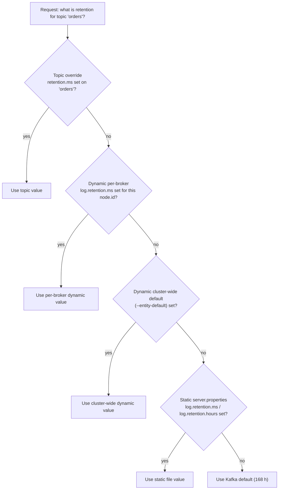
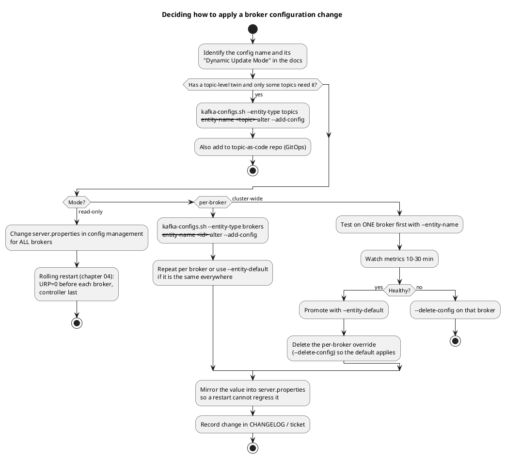

# Broker Configuration Reference

**Roles:** [ADMIN] [ARCH] [DEV]   **Level:** Intermediate
**Prerequisites:** `03-admin/01-installation-and-deployment.md`, `01-architecture/` chapters on the log, replication and the group coordinator.

## What you will learn
- Which of the several hundred broker configs actually matter, grouped by subsystem, with defaults and production values.
- How topic-level overrides, dynamic per-broker, dynamic cluster-wide and static settings are layered.
- How to read the "Dynamic Update Mode" column in the official docs and what it means for your change process.
- A production `server.properties` for a broker and for a controller you can start from.
- A production checklist to run before go-live.

## 1. Concept

Kafka has three configuration scopes and one override mechanism:

| Scope | Where it lives | Applies to | Changed with |
|-------|----------------|------------|--------------|
| Static broker config | `server.properties` on disk | that process | Edit file + restart |
| Dynamic cluster-wide default | `__cluster_metadata` log (KRaft) | every broker that does not have a per-broker value | `kafka-configs.sh --entity-type brokers --entity-default` |
| Dynamic per-broker | `__cluster_metadata` log | one broker (`--entity-name <id>`) | `kafka-configs.sh --entity-type brokers --entity-name <id>` |
| Topic override | `__cluster_metadata` log | one topic | `kafka-configs.sh --entity-type topics --entity-name <topic>` or `kafka-topics.sh --config` at creation |

Many broker configs have a topic-level twin with a different name (`log.retention.ms` on the broker is `retention.ms` on the topic; `message.max.bytes` is `max.message.bytes`). The broker value acts as the default for topics that do not override it.

### 1.1 Precedence



The exact order documented by Apache Kafka for broker configs is: dynamic per-broker > dynamic cluster-wide default > static `server.properties` > Kafka default. Topic overrides sit on top of all four for the configs that have a topic-level twin. (Some third-party summaries list cluster-wide above per-broker; that is wrong - a per-broker value is the most specific and wins.)

`kafka-configs.sh --describe --all` shows the whole chain in the `synonyms` field, for example:

```
log.retention.ms=259200000 sensitive=false synonyms={DYNAMIC_BROKER_CONFIG:log.retention.ms=259200000, DYNAMIC_DEFAULT_BROKER_CONFIG:log.retention.ms=604800000, STATIC_BROKER_CONFIG:log.retention.hours=168, DEFAULT_CONFIG:log.retention.hours=168}
```

## 2. How it works internally

### 2.1 Dynamic Update Mode

Every broker config in the official documentation carries a **Dynamic Update Mode**:

| Mode | Meaning | Change procedure |
|------|---------|------------------|
| `read-only` | Only from `server.properties`; needs a restart | Config management + rolling restart (chapter 04) |
| `per-broker` | Can be set dynamically for one broker; typically things that differ per host (listeners, SSL keystores, `log.dirs` related thread counts) | `--entity-name <id>`; also settable with `--entity-default` |
| `cluster-wide` | Can be set dynamically as a cluster default; brokers pick it up without restart | `--entity-default`; a per-broker value can still override it |

Examples (3.9/4.0):

| Config | Mode |
|--------|------|
| `process.roles`, `node.id`, `log.dirs`, `controller.quorum.bootstrap.servers`, `inter.broker.listener.name`, `num.partitions`, `default.replication.factor`, `auto.create.topics.enable`, `offsets.topic.*`, `transaction.state.log.*`, `group.initial.rebalance.delay.ms`, `socket.request.max.bytes`, `queued.max.requests` | `read-only` |
| `listeners`, `advertised.listeners`, `listener.security.protocol.map`, `ssl.keystore.location/password`, `ssl.truststore.*`, `sasl.jaas.config`, `sasl.login.*` | `per-broker` |
| `log.retention.ms/bytes`, `log.segment.bytes`, `log.flush.*`, `log.cleaner.*`, `message.max.bytes`, `min.insync.replicas`, `unclean.leader.election.enable`, `num.io.threads`, `num.network.threads`, `num.replica.fetchers`, `num.recovery.threads.per.data.dir`, `background.threads`, `log.cleaner.threads`, `max.connections`, `max.connections.per.ip`, `compression.type`, `log.message.timestamp.type`, `metric.reporters` | `cluster-wide` |

Thread pool sizes can be changed dynamically but only within a factor of two of the value at startup (halving or doubling) in a single step; make larger changes in several steps.

Dynamic values are stored in the metadata log as `ConfigRecord`s, replicated to every broker through its metadata fetch, and applied by the broker's `DynamicBrokerConfig` reconfiguration handlers. Sensitive values (passwords) are encrypted at rest only when `password.encoder.secret` is set (ZooKeeper era); in KRaft they are stored as-is in the metadata log, so secure the metadata log directory.

### 2.2 Config change decision flow



Source: `diagrams/admin-02-configuration-reference-change-flow.puml`.

> **Production tip:** Dynamic configs survive restarts (they live in the metadata log), but a static value in `server.properties` is *below* them in precedence, so a later edit to the file has no effect while a dynamic override exists. Either keep the two in sync, or adopt a rule: dynamic for emergency tuning, then promote to the file and delete the dynamic entry.

## 3. Configuration that matters

Defaults are for Kafka 3.9 / 4.0 unless stated. "Recommended" is a production starting point for a 3-AZ cluster with RF=3.

### 3.1 General and identity

| Parameter | Default | Recommended | Why |
|-----------|---------|-------------|-----|
| `process.roles` | - | `broker` or `controller` | Isolated mode in production |
| `node.id` | -1 | unique per node | Identity in the metadata log |
| `broker.rack` | null | AZ id | Rack-aware placement; follower fetching |
| `controller.quorum.bootstrap.servers` | - | all controllers `host:9093` | Dynamic quorum discovery (3.9+, KIP-853) |
| `controller.listener.names` | - | `CONTROLLER` | Which listener carries Raft/metadata traffic |
| `log.dirs` | `/tmp/kafka-logs` | one path per data disk | `/tmp` is wiped on reboot |
| `metadata.log.dir` | first `log.dirs` entry | dedicated SSD on controllers | Latency of metadata commits |
| `auto.create.topics.enable` | true | **false** | Typos create topics with `num.partitions`/`default.replication.factor`; consumers subscribing to a missing topic create it |
| `delete.topic.enable` | true | true (protect with ACLs) | Needed for lifecycle management |
| `num.partitions` | 1 | 6-12 | Default only for auto-created topics; explicit creation should always set it |
| `default.replication.factor` | 1 | 3 | RF=1 loses data on any broker failure |
| `min.insync.replicas` | 1 | 2 | With `acks=all`, 2 of 3 replicas must ack; tolerates 1 broker down without data loss |
| `unclean.leader.election.enable` | false | false | true trades durability for availability; enable per topic only for metrics-style data |
| `controlled.shutdown.enable` | true | true | ZooKeeper-era name; in KRaft a SIGTERM always triggers controlled shutdown through the broker heartbeat |
| `broker.heartbeat.interval.ms` | 2000 | default | Broker to controller heartbeat |
| `broker.session.timeout.ms` | 9000 | default | Controller fences a broker after this silence |
| `metadata.max.idle.interval.ms` | 500 | default | Controller writes a no-op record to advance the HWM when idle |

### 3.2 Listeners and network

| Parameter | Default | Recommended | Why |
|-----------|---------|-------------|-----|
| `listeners` | `PLAINTEXT://:9092` | `INTERNAL://0.0.0.0:9094,EXTERNAL://0.0.0.0:9092` | Separate replication from clients |
| `advertised.listeners` | = `listeners` | resolvable host names per listener | What clients connect to |
| `listener.security.protocol.map` | identity map | `INTERNAL:SSL,EXTERNAL:SASL_SSL,CONTROLLER:SSL` | Protocol per listener |
| `inter.broker.listener.name` | null | `INTERNAL` | Replication and controller-to-broker requests |
| `num.network.threads` | 3 | 8 (more with TLS) | Threads reading/writing sockets per listener |
| `num.io.threads` | 8 | 16 (>= number of disks x 2, up to cores) | Request handler threads doing disk I/O |
| `num.replica.fetchers` | 1 | 2-4 | Fetcher threads per source broker; raise when follower lag is high with idle disks |
| `queued.max.requests` | 500 | 500-1000 | Request queue depth before network threads stop reading |
| `socket.send.buffer.bytes` | 102400 | 1048576 for cross-AZ | -1 uses OS default |
| `socket.receive.buffer.bytes` | 102400 | 1048576 | same |
| `socket.request.max.bytes` | 104857600 | default | Max single request size (protects heap) |
| `connections.max.idle.ms` | 600000 | default | Idle connection close |
| `max.connections` | Int.MAX | e.g. 10000 | Broker-wide connection cap; protects file descriptors |
| `max.connections.per.ip` | Int.MAX | e.g. 500 | Stops a misbehaving client host |
| `max.connections.per.ip.overrides` | "" | `10.0.0.5:2000` for NAT gateways | |
| `connection.failed.authentication.delay.ms` | 100 | 1000 | Slows brute force |
| `request.timeout.ms` | 30000 | default | Controller/broker-side request timeout |
| `replica.selector.class` | null | `org.apache.kafka.common.replica.RackAwareReplicaSelector` | Lets consumers with `client.rack` fetch from the local AZ |

### 3.3 Log and retention

| Parameter | Default | Recommended | Why |
|-----------|---------|-------------|-----|
| `log.retention.hours` (`.minutes`, `.ms`) | 168 | per use case; `.ms` wins over `.minutes` over `.hours` | Time retention |
| `log.retention.bytes` | -1 | set per topic; broker-level as a safety cap | Per *partition* size cap, not per topic |
| `log.retention.check.interval.ms` | 300000 | default | How often the deleter runs |
| `log.segment.bytes` | 1073741824 | default (1 GiB); smaller on compacted/low-traffic topics | Retention and compaction act on closed segments |
| `log.roll.hours` (`.ms`) | 168 | default | Time-based segment roll; use `segment.ms` per topic |
| `log.segment.delete.delay.ms` | 60000 | default | Delay before a deleted segment file is removed |
| `log.index.size.max.bytes` | 10485760 | default | Index size per segment; rolls segment when full |
| `log.index.interval.bytes` | 4096 | default | Index entry density |
| `log.flush.interval.messages` / `.ms` | Long.MAX / null | leave unset | Rely on replication + page cache; forced fsync destroys throughput |
| `log.message.timestamp.type` | `CreateTime` | `CreateTime` (or `LogAppendTime` for audit topics) | Which timestamp goes in the record and time index |
| `log.message.timestamp.before.max.ms` / `.after.max.ms` (3.6+) | Long.MAX / Long.MAX | e.g. 7 days / 1 hour | Reject records with absurd `CreateTime` that would break time-based retention |
| `message.max.bytes` | 1048588 | 1048588; raise per topic only | Max record batch size after compression; must be <= `replica.fetch.max.bytes` and client `max.request.size`/`fetch.max.bytes` |
| `compression.type` | `producer` | `producer` | Broker keeps the producer's codec; `lz4`/`zstd` recompresses on the broker (CPU cost) |
| `num.recovery.threads.per.data.dir` | 1 | cores / number of `log.dirs` | Speeds up log recovery after unclean shutdown |
| `log.dir.failure.timeout.ms` (3.8+) | 30000 | default | Broker shuts down if a failed dir is not handled in time |
| `remote.log.storage.system.enable` | false | true only if using tiered storage (production-ready since 3.9, KIP-405) | Enables the tiered storage plugin path |

### 3.4 Log cleaner (compaction)

| Parameter | Default | Recommended | Why |
|-----------|---------|-------------|-----|
| `log.cleaner.enable` | true | true | Required for `__consumer_offsets` |
| `log.cleaner.threads` | 1 | 2-4 on brokers with many compacted partitions | Parallel compaction |
| `log.cleaner.dedupe.buffer.size` | 134217728 | 268435456-536870912 | Offset map size; too small means many passes on large partitions (`log.cleaner.io.buffer.load.factor` 0.9) |
| `log.cleaner.io.max.bytes.per.second` | Double.MAX | throttle on HDD | Compaction I/O cap |
| `log.cleaner.min.cleanable.ratio` | 0.5 | default | Dirty ratio before a log is eligible |
| `log.cleaner.min.compaction.lag.ms` | 0 | per topic | Minimum age before a record may be compacted |
| `log.cleaner.max.compaction.lag.ms` | Long.MAX | per topic | Force compaction even under the dirty ratio |
| `log.cleaner.delete.retention.ms` | 86400000 | default | How long tombstones survive |
| `log.cleaner.backoff.ms` | 15000 | default | Sleep when nothing to clean |
| `log.cleanup.policy` | `delete` | topic-level `cleanup.policy` | `delete`, `compact`, or `compact,delete` |

### 3.5 Replication

| Parameter | Default | Recommended | Why |
|-----------|---------|-------------|-----|
| `replica.lag.time.max.ms` | 30000 | 30000 (10000 on low-latency clusters) | Follower is dropped from ISR after this without catching up |
| `replica.fetch.max.bytes` | 1048576 | >= `message.max.bytes` | Per-partition fetch size for followers |
| `replica.fetch.response.max.bytes` | 10485760 | default | Total fetch response for followers |
| `replica.fetch.wait.max.ms` | 500 | default | Follower long-poll; must be < `replica.lag.time.max.ms` |
| `replica.fetch.min.bytes` | 1 | default | |
| `replica.socket.timeout.ms` | 30000 | default | |
| `replica.high.watermark.checkpoint.interval.ms` | 5000 | default | |
| `auto.leader.rebalance.enable` | true | true | Preferred leader restoration |
| `leader.imbalance.check.interval.seconds` | 300 | default | |
| `leader.imbalance.per.broker.percentage` | 10 | default | |
| `num.replica.alter.log.dirs.threads` | = number of `log.dirs` | default | Intra-broker moves between disks |
| `replication.quota.window.num` / `.size.seconds` | 11 / 1 | default | Throttle accounting window for reassignments |

### 3.6 Controller / KRaft

| Parameter | Default | Recommended | Why |
|-----------|---------|-------------|-----|
| `controller.quorum.voters` | - | only for static quorums | Pre-3.9 voter list |
| `controller.quorum.election.timeout.ms` | 1000 | default | Follower waits this long without leader traffic before starting an election |
| `controller.quorum.fetch.timeout.ms` | 2000 | default | Voter starts election after no successful fetch for this long |
| `controller.quorum.request.timeout.ms` | 2000 | default | |
| `controller.quorum.election.backoff.max.ms` | 1000 | default | |
| `controller.quorum.append.linger.ms` | 25 | default | Batches metadata records before fsync |
| `metadata.log.segment.bytes` | 1073741824 | default | |
| `metadata.max.retention.bytes` / `.ms` | 104857600 / 604800000 | default | Retention of metadata log segments already covered by a snapshot |
| `metadata.log.max.record.bytes.between.snapshots` | 20971520 | default | Snapshot frequency by bytes |
| `metadata.log.max.snapshot.interval.ms` | 3600000 | default | Snapshot frequency by time |
| `controller.socket.timeout.ms` | 30000 | default | |
| `initial.broker.registration.timeout.ms` | 60000 | default | Broker gives up if it cannot register |

### 3.7 Coordinators (offsets, transactions, groups)

| Parameter | Default | Recommended | Why |
|-----------|---------|-------------|-----|
| `offsets.topic.replication.factor` | 3 | 3 | `__consumer_offsets`; creation fails until this many brokers exist |
| `offsets.topic.num.partitions` | 50 | 50 (cannot be changed after creation) | Coordinator parallelism |
| `offsets.topic.segment.bytes` | 104857600 | default | Small segments compact faster |
| `offsets.retention.minutes` | 10080 | 10080 or higher | Committed offsets of empty groups expire after this |
| `offsets.commit.timeout.ms` | 5000 | default | |
| `transaction.state.log.replication.factor` | 3 | 3 | `__transaction_state` |
| `transaction.state.log.min.isr` | 2 | 2 | |
| `transaction.state.log.num.partitions` | 50 | 50 | |
| `transaction.max.timeout.ms` | 900000 | default | Cap on producer `transaction.timeout.ms` |
| `transactional.id.expiration.ms` | 604800000 | default | Producer id/epoch cleanup |
| `group.initial.rebalance.delay.ms` | 3000 | 3000 (0 in tests) | Wait for more members before the first rebalance of a new group |
| `group.min.session.timeout.ms` / `group.max.session.timeout.ms` | 6000 / 1800000 | default | Bounds for classic consumer `session.timeout.ms` |
| `group.coordinator.rebalance.protocols` | `classic,consumer` (4.0); `classic` (3.9) | `classic,consumer` | KIP-848 next-generation consumer protocol; GA in 4.0 |
| `group.consumer.session.timeout.ms` / `.heartbeat.interval.ms` | 45000 / 5000 | default | Server-side values for the KIP-848 protocol (client no longer sets them) |
| `group.consumer.max.size` | Int.MAX | e.g. 1000 | Cap group size |

### 3.8 Quotas

| Parameter | Default | Recommended | Why |
|-----------|---------|-------------|-----|
| `quota.window.num` | 11 | default | Samples kept for client quotas |
| `quota.window.size.seconds` | 1 | default | |
| `controller.quota.window.num` | 11 | default | Controller mutation quotas (topic creation rate) |
| `client.quota.callback.class` | null | custom only | Plug in tenant-aware quota logic |
| `max.incremental.fetch.session.cache.slots` | 1000 | 1000-10000 with many consumers | Fetch session cache |

Quotas themselves (`producer_byte_rate`, `consumer_byte_rate`, `request_percentage`, `controller_mutation_rate`) are entities in the metadata log, not broker configs; see chapter `03-topic-and-partition-management.md`.

### 3.9 Topic-level overrides

| Topic config | Broker equivalent | Default | Typical use |
|--------------|-------------------|---------|-------------|
| `cleanup.policy` | `log.cleanup.policy` | `delete` | `compact` for KV/changelog topics |
| `retention.ms` | `log.retention.ms` | 604800000 | Per-topic retention |
| `retention.bytes` | `log.retention.bytes` | -1 | Per-partition cap |
| `segment.bytes` | `log.segment.bytes` | 1073741824 | Smaller for compacted topics (e.g. 104857600) |
| `segment.ms` | `log.roll.ms` | 604800000 | Force roll so retention/compaction can act |
| `min.insync.replicas` | `min.insync.replicas` | 1 | 2 for durable topics |
| `max.message.bytes` | `message.max.bytes` | 1048588 | Larger payloads on one topic |
| `compression.type` | `compression.type` | `producer` | |
| `message.timestamp.type` | `log.message.timestamp.type` | `CreateTime` | |
| `message.timestamp.before.max.ms` / `.after.max.ms` | same prefix `log.` | Long.MAX | |
| `min.compaction.lag.ms` / `max.compaction.lag.ms` | `log.cleaner.*` | 0 / Long.MAX | |
| `min.cleanable.dirty.ratio` | `log.cleaner.min.cleanable.ratio` | 0.5 | |
| `delete.retention.ms` | `log.cleaner.delete.retention.ms` | 86400000 | Tombstone lifetime |
| `unclean.leader.election.enable` | same | false | |
| `flush.messages` / `flush.ms` | `log.flush.interval.*` | Long.MAX | Almost never |
| `index.interval.bytes`, `segment.index.bytes`, `segment.jitter.ms`, `preallocate`, `file.delete.delay.ms` | `log.*` | | Rare tuning |
| `leader.replication.throttled.replicas` / `follower.replication.throttled.replicas` | - | "" | Set by `kafka-reassign-partitions.sh --throttle` |
| `message.downconversion.enable` | `log.message.downconversion.enable` | true | Deny old clients on large topics (removed in 4.0 with the old formats) |
| `remote.storage.enable`, `local.retention.ms`, `local.retention.bytes` | `remote.log.*` | false / -2 / -2 | Tiered storage (3.9+) |

## 4. Failure modes and how to detect them

| Symptom | Likely cause | Metric / log to check | Fix |
|---------|--------------|-----------------------|-----|
| Topics appear with 1 partition, RF=1 | `auto.create.topics.enable=true` with defaults | `kafka-topics.sh --describe` shows `ReplicationFactor: 1` | Set `auto.create.topics.enable=false`; recreate the topics correctly |
| Producer gets `NotEnoughReplicasException` | `min.insync.replicas` > available ISR, often because RF=2 with min ISR=2 | `kafka.server:type=ReplicaManager,name=UnderMinIsrPartitionCount` | RF=3 with min ISR=2; fix the down broker |
| `RecordTooLargeException` on producer, or followers stop replicating a topic | `max.message.bytes` raised on topic but `replica.fetch.max.bytes` not | `server.log` on followers; URP for that topic | Raise `replica.fetch.max.bytes` (dynamic) >= `max.message.bytes` |
| Request handler idle % near 0 | `num.io.threads` too low for disk count or slow disks | `kafka.server:type=KafkaRequestHandlerPool,name=RequestHandlerAvgIdlePercent` | Raise `num.io.threads` dynamically (max 2x per step) |
| Network idle % near 0 with TLS | `num.network.threads` too low | `kafka.network:type=SocketServer,name=NetworkProcessorAvgIdlePercent` | Raise `num.network.threads` |
| `__consumer_offsets` grows without bound | `log.cleaner.enable=false` or cleaner thread died | `kafka.log:type=LogCleanerManager,name=uncleanable-partitions-count`, `log-cleaner.log` | Enable cleaner; restart broker if the thread died (3.x restarts it automatically in most cases) |
| Static change "does not apply" after restart | A dynamic override exists for the same key | `kafka-configs.sh --describe --all` synonyms show `DYNAMIC_BROKER_CONFIG` | Delete the dynamic entry or change it instead |
| Records disappear "too early" | `retention.bytes` is per partition; or `LogAppendTime` vs `CreateTime` confusion; or producers sending future timestamps | `kafka-get-offsets.sh --time -2` shows the log start offset moving | Correct retention math; set `message.timestamp.after.max.ms` |
| Consumer group offsets reset to `auto.offset.reset` after a weekend | `offsets.retention.minutes` shorter than the idle period of an empty group | `__consumer_offsets` tombstones; group state `Empty` | Raise `offsets.retention.minutes`; keep at least one member alive |

## 5. Design guidance (architect view)

### 5.1 Recommended production `server.properties` for a broker

```properties
############################# Identity #############################
process.roles=broker
node.id=1
broker.rack=az-a
controller.quorum.bootstrap.servers=controller-0.kafka.internal:9093,controller-1.kafka.internal:9093,controller-2.kafka.internal:9093
controller.listener.names=CONTROLLER

############################# Listeners #############################
listeners=INTERNAL://0.0.0.0:9094,EXTERNAL://0.0.0.0:9092
advertised.listeners=INTERNAL://broker-1.kafka.internal:9094,EXTERNAL://broker-1.example.com:9092
listener.security.protocol.map=INTERNAL:SSL,EXTERNAL:SASL_SSL,CONTROLLER:SSL
inter.broker.listener.name=INTERNAL
num.network.threads=8
num.io.threads=16
queued.max.requests=500
socket.send.buffer.bytes=1048576
socket.receive.buffer.bytes=1048576
socket.request.max.bytes=104857600
max.connections=10000
max.connections.per.ip=500
connection.failed.authentication.delay.ms=1000
replica.selector.class=org.apache.kafka.common.replica.RackAwareReplicaSelector

############################# Security (see 03-admin/06-security) #############################
ssl.keystore.location=/etc/kafka/ssl/broker-1.keystore.p12
ssl.keystore.password=changeit
ssl.keystore.type=PKCS12
ssl.truststore.location=/etc/kafka/ssl/truststore.p12
ssl.truststore.password=changeit
ssl.truststore.type=PKCS12
ssl.client.auth=required
sasl.enabled.mechanisms=SCRAM-SHA-512
sasl.mechanism.inter.broker.protocol=SCRAM-SHA-512
authorizer.class.name=org.apache.kafka.metadata.authorizer.StandardAuthorizer
super.users=User:kafka-admin;User:CN=broker-1.kafka.internal
allow.everyone.if.no.acl.found=false

############################# Log #############################
log.dirs=/data/kafka-1,/data/kafka-2
num.recovery.threads.per.data.dir=4
log.retention.hours=168
log.retention.bytes=-1
log.retention.check.interval.ms=300000
log.segment.bytes=1073741824
log.message.timestamp.type=CreateTime
log.message.timestamp.after.max.ms=3600000
message.max.bytes=1048588
compression.type=producer

############################# Log cleaner #############################
log.cleaner.enable=true
log.cleaner.threads=2
log.cleaner.dedupe.buffer.size=268435456

############################# Topic defaults #############################
auto.create.topics.enable=false
delete.topic.enable=true
num.partitions=6
default.replication.factor=3
min.insync.replicas=2
unclean.leader.election.enable=false

############################# Replication #############################
num.replica.fetchers=4
replica.lag.time.max.ms=30000
replica.fetch.max.bytes=1048576
replica.fetch.response.max.bytes=10485760
auto.leader.rebalance.enable=true
leader.imbalance.check.interval.seconds=300
leader.imbalance.per.broker.percentage=10

############################# Coordinators #############################
offsets.topic.replication.factor=3
offsets.topic.num.partitions=50
offsets.retention.minutes=20160
transaction.state.log.replication.factor=3
transaction.state.log.min.isr=2
transaction.state.log.num.partitions=50
group.initial.rebalance.delay.ms=3000
group.coordinator.rebalance.protocols=classic,consumer

############################# Metrics #############################
metric.reporters=
kafka.metrics.reporters=
```

### 5.2 Recommended production `server.properties` for a controller

```properties
process.roles=controller
node.id=1000
controller.quorum.bootstrap.servers=controller-0.kafka.internal:9093,controller-1.kafka.internal:9093,controller-2.kafka.internal:9093
listeners=CONTROLLER://0.0.0.0:9093
advertised.listeners=CONTROLLER://controller-0.kafka.internal:9093
controller.listener.names=CONTROLLER
listener.security.protocol.map=CONTROLLER:SSL

ssl.keystore.location=/etc/kafka/ssl/controller-0.keystore.p12
ssl.keystore.password=changeit
ssl.keystore.type=PKCS12
ssl.truststore.location=/etc/kafka/ssl/truststore.p12
ssl.truststore.password=changeit
ssl.truststore.type=PKCS12
ssl.client.auth=required
authorizer.class.name=org.apache.kafka.metadata.authorizer.StandardAuthorizer
super.users=User:kafka-admin;User:CN=controller-0.kafka.internal;User:CN=broker-1.kafka.internal

log.dirs=/data/kafka-controller
metadata.log.dir=/data/kafka-controller
metadata.log.segment.bytes=1073741824
metadata.max.retention.bytes=104857600
metadata.log.max.record.bytes.between.snapshots=20971520
metadata.log.max.snapshot.interval.ms=3600000

controller.quorum.election.timeout.ms=1000
controller.quorum.fetch.timeout.ms=2000
controller.quorum.append.linger.ms=25

# controllers accept admin requests on the controller listener (kafka-metadata-quorum.sh --bootstrap-controller)
```

The `super.users` list on controllers must include every broker principal, otherwise brokers cannot register.

### 5.3 Trade-off table

| Decision | Option A | Option B | Guidance |
|----------|----------|----------|----------|
| Durability default | `min.insync.replicas=2`, RF=3 | `min.insync.replicas=1` | A for anything you cannot regenerate; B only with explicit topic-level opt-out |
| Broker-side compression | `compression.type=producer` | `zstd` on broker | A; recompressing on the broker burns broker CPU that is better spent on TLS |
| Timestamp type | `CreateTime` | `LogAppendTime` | A for event semantics and Streams; B for audit/ingestion-time retention where clients are untrusted |
| Segment size | 1 GiB | 100-256 MiB | A for high-volume delete topics; B for compacted or low-volume topics so cleanup can act |
| Quotas | none | per-client-id defaults | Always set default quotas in multi-tenant clusters |

> **Anti-pattern:** Setting `log.flush.interval.messages=1` to "guarantee durability". Kafka's durability comes from replication and `acks=all` + `min.insync.replicas`, not from fsync per message; forced flushes cut throughput by an order of magnitude and do not protect against correlated failure of the whole rack.

## 6. Hands-on

```bash
BS=broker-1.example.com:9092

# Show effective config of one broker with the full precedence chain
/opt/kafka/bin/kafka-configs.sh --bootstrap-server $BS --describe --entity-type brokers --entity-name 1 --all | head -50

# Show only dynamic cluster-wide defaults
/opt/kafka/bin/kafka-configs.sh --bootstrap-server $BS --describe --entity-type brokers --entity-default

# Cluster-wide dynamic change (no restart): shorten default retention to 3 days
/opt/kafka/bin/kafka-configs.sh --bootstrap-server $BS --alter --entity-type brokers --entity-default \
  --add-config log.retention.ms=259200000

# Per-broker dynamic change: more I/O threads on broker 1 only (max 2x per step)
/opt/kafka/bin/kafka-configs.sh --bootstrap-server $BS --alter --entity-type brokers --entity-name 1 \
  --add-config num.io.threads=16

# Remove the per-broker override so the cluster default applies again
/opt/kafka/bin/kafka-configs.sh --bootstrap-server $BS --alter --entity-type brokers --entity-name 1 \
  --delete-config num.io.threads

# Rotate a keystore without restart (per-broker, same path, new file already in place)
/opt/kafka/bin/kafka-configs.sh --bootstrap-server $BS --alter --entity-type brokers --entity-name 1 \
  --add-config listener.name.external.ssl.keystore.location=/etc/kafka/ssl/broker-1.keystore.p12

# Add a listener dynamically (per-broker)
/opt/kafka/bin/kafka-configs.sh --bootstrap-server $BS --alter --entity-type brokers --entity-name 1 \
  --add-config "listeners=[INTERNAL://0.0.0.0:9094,EXTERNAL://0.0.0.0:9092,METRICS://0.0.0.0:9095],advertised.listeners=[INTERNAL://broker-1.kafka.internal:9094,EXTERNAL://broker-1.example.com:9092,METRICS://broker-1.kafka.internal:9095],listener.security.protocol.map=[INTERNAL:SSL,EXTERNAL:SASL_SSL,CONTROLLER:SSL,METRICS:PLAINTEXT]"

# Topic override and its removal
/opt/kafka/bin/kafka-configs.sh --bootstrap-server $BS --alter --entity-type topics --entity-name orders \
  --add-config retention.ms=2592000000,min.insync.replicas=2
/opt/kafka/bin/kafka-configs.sh --bootstrap-server $BS --describe --entity-type topics --entity-name orders
/opt/kafka/bin/kafka-configs.sh --bootstrap-server $BS --alter --entity-type topics --entity-name orders \
  --delete-config retention.ms

# Export every non-default topic config for backup / GitOps drift detection
for t in $(/opt/kafka/bin/kafka-topics.sh --bootstrap-server $BS --list | grep -v '^__'); do
  echo "== $t"; /opt/kafka/bin/kafka-configs.sh --bootstrap-server $BS --describe --entity-type topics --entity-name "$t"
done > topic-configs-$(date +%F).txt

# Verify a static file before restart (unknown keys are only logged as warnings, so grep for them after start)
grep -E '^(process.roles|node.id|log.dirs|controller.quorum)' /etc/kafka/broker.properties
```

### 6.1 Production checklist

- [ ] `process.roles` isolated; `node.id` unique across brokers and controllers; `broker.rack` set on every broker.
- [ ] `log.dirs` on dedicated XFS volumes, not `/tmp`; `metadata.log.dir` on SSD for controllers.
- [ ] `auto.create.topics.enable=false`; `default.replication.factor=3`; `min.insync.replicas=2`; `unclean.leader.election.enable=false`.
- [ ] `offsets.topic.replication.factor=3`, `transaction.state.log.replication.factor=3`, `transaction.state.log.min.isr=2`.
- [ ] Separate listeners: client, inter-broker, controller; TLS on all of them; `authorizer.class.name` set and `allow.everyone.if.no.acl.found=false`.
- [ ] `num.io.threads`, `num.network.threads`, `num.replica.fetchers` sized to hardware; `num.recovery.threads.per.data.dir` >= 4.
- [ ] `message.max.bytes` <= `replica.fetch.max.bytes`; client `max.request.size` and `fetch.max.bytes` agree.
- [ ] `log.cleaner.enable=true`, `log.cleaner.dedupe.buffer.size` >= 256 MiB.
- [ ] `max.connections`, `max.connections.per.ip` and default client quotas defined.
- [ ] JMX exporter or metrics reporter enabled; GC logging on.
- [ ] `server.properties` under configuration management, identical across brokers except `node.id`, `broker.rack`, `advertised.listeners`, keystore paths.
- [ ] No dynamic overrides that disagree with the file (`kafka-configs.sh --describe --all | grep DYNAMIC`).

## 7. Interview questions for this chapter

### Q1. What is the precedence between a topic override, a dynamic broker config and `server.properties`?
**Role:** [ADMIN] | **Difficulty:** ★☆☆ | **Topic:** Configuration

**Answer.**
Topic override > dynamic per-broker > dynamic cluster-wide default > static `server.properties` > Kafka built-in default. The topic override only exists for configs with a topic-level twin (`retention.ms`, `min.insync.replicas`, `max.message.bytes`, ...). A consequence: once someone sets `log.retention.ms` dynamically, editing `server.properties` has no visible effect until the dynamic entry is deleted with `kafka-configs.sh --alter --entity-type brokers --entity-default --delete-config log.retention.ms`. `--describe --all` shows the chain in the `synonyms` field.

**Follow-up probes.** Where are dynamic configs persisted in KRaft? What happens to them when a broker is re-formatted?

### Q2. Why should `auto.create.topics.enable` be false in production?
**Role:** [ARCH] | **Difficulty:** ★☆☆ | **Topic:** Governance

**Answer.**
Because auto-created topics take `num.partitions` and `default.replication.factor` from the broker, so a typo in a producer's topic name or a consumer subscribing before deployment silently creates a mis-sized topic with no owner, no ACL review and possibly RF=1. It also makes cleanup hard: nobody knows which topics are real. Turn it off, create topics through a GitOps pipeline (Strimzi `KafkaTopic`, Terraform, julie-ops) and let the producer fail fast with `UNKNOWN_TOPIC_OR_PARTITION`.

**Follow-up probes.** Which client-side setting also creates topics? (`allow.auto.create.topics` on the consumer, default true, only effective if the broker allows it.) How do Kafka Streams internal topics get created when auto-create is off? (Streams uses the Admin API explicitly, so it still works.)

### Q3. Explain the relationship between `message.max.bytes`, `replica.fetch.max.bytes`, `max.request.size` and `fetch.max.bytes`.
**Role:** [DEV] | **Difficulty:** ★★☆ | **Topic:** Sizing

**Answer.**
`message.max.bytes` (broker) / `max.message.bytes` (topic) is the largest record *batch* the broker accepts after compression. The producer's `max.request.size` caps the request it sends, so it must be >= the batch size, and `batch.size` caps what it tries to batch. Followers copy data with `replica.fetch.max.bytes` per partition, so if you raise the topic limit above it, followers can still make progress (since KIP-74 the first batch is always returned even if oversized) but throughput drops; keep `replica.fetch.max.bytes` >= `max.message.bytes`. Consumers have `fetch.max.bytes` and `max.partition.fetch.bytes`; the same KIP-74 rule guarantees progress, but memory planning should assume the largest batch. Rule: raise it per topic, not cluster-wide, and update all four sides.

**Follow-up probes.** Why is the 3.x default `1048588` rather than `1048576`? (12 bytes of batch header overhead added in KIP-126 so a 1 MiB producer batch still fits.)

### Q4. Which thread pool settings would you touch first on an overloaded broker, and how do you know which?
**Role:** [ADMIN] | **Difficulty:** ★★☆ | **Topic:** Threads

**Answer.**
Read the two idle-percent metrics. If `kafka.network:type=SocketServer,name=NetworkProcessorAvgIdlePercent` is below 0.3, network threads are saturated (typical with TLS): raise `num.network.threads`. If `kafka.server:type=KafkaRequestHandlerPool,name=RequestHandlerAvgIdlePercent` is below 0.3, the I/O handlers are the bottleneck: raise `num.io.threads` or fix slow disks. If follower lag grows while disks are idle, raise `num.replica.fetchers`. All three are cluster-wide dynamic configs, but a single change may only double or halve the value, and more threads than cores just adds context switching. Check `kafka.network:type=RequestChannel,name=RequestQueueSize` to confirm queueing before the handlers.

**Follow-up probes.** What does `queued.max.requests` do when the queue is full? (network threads stop reading from sockets - backpressure to clients.)

### Q5. What does the "Dynamic Update Mode" column in the docs tell you, and how does it change your change-management process?
**Role:** [ADMIN] | **Difficulty:** ★★☆ | **Topic:** Operations

**Answer.**
It says whether a config can be changed at runtime and at what scope: `read-only` (restart), `per-broker` (per node, e.g. listeners and keystores), `cluster-wide` (one command for everyone). For `read-only` you schedule a rolling restart; for the others you can test on one broker with `--entity-name`, watch metrics, then promote with `--entity-default` and remove the per-broker entry. Your process should require the file to be updated afterwards so a rebuild does not silently regress, and it should forbid dynamic changes that are not mirrored into configuration management.

**Follow-up probes.** Name three read-only configs people often expect to be dynamic. (`num.partitions`, `default.replication.factor`, `log.dirs`, `inter.broker.listener.name`.)

### Q6. Why do `offsets.topic.replication.factor=3` and `transaction.state.log.min.isr=2` matter more than ordinary topic settings?
**Role:** [ARCH] | **Difficulty:** ★★☆ | **Topic:** Coordinators

**Answer.**
`__consumer_offsets` and `__transaction_state` are created once, on first use, with whatever values the broker has at that moment, and their replication factor is never revisited automatically. A cluster bootstrapped with RF=1 for these topics loses every committed offset (consumers restart from `auto.offset.reset`) or every in-flight transaction state when one broker dies, and fixing it later requires a manual reassignment with `kafka-reassign-partitions.sh`. Setting the defaults to 3 / min ISR 2 before the first client connects avoids that. Creation also fails until at least 3 brokers are live, which is a good guard against clients hitting a half-built cluster.

**Follow-up probes.** How would you repair an existing `__consumer_offsets` with RF=1? Can `offsets.topic.num.partitions` be changed later? (no; it is baked into the coordinator hashing.)

### Q7. A team asks you to set `unclean.leader.election.enable=true` cluster-wide "for availability". Respond.
**Role:** [ARCH] | **Difficulty:** ★★★ | **Topic:** Durability

**Answer.**
Decline cluster-wide, offer per-topic. Unclean election lets an out-of-sync replica become leader when all ISR members are gone, which truncates acknowledged records: the new leader's log end becomes the truth, and rejoining ISR members discard anything beyond it. For metrics or logs that is an acceptable trade; for orders or ledgers it is silent data loss. Since the config is topic-level, put `unclean.leader.election.enable=true` only on the topics whose owners accept loss, keep RF=3 and `min.insync.replicas=2` so a clean election is almost always possible, and in a real emergency an operator can trigger one explicitly with `kafka-leader-election.sh --election-type UNCLEAN --topic <t> --partition <p>` without changing the standing policy.

**Follow-up probes.** Which metric counts unclean elections? (`kafka.controller:type=ControllerStats,name=UncleanLeaderElectionsPerSec`.) What does a producer with `acks=all` observe during the window with no leader?

### Q8. Scenario: after a config rollout, one broker keeps reporting a different `log.retention.ms` from the rest. Diagnose.
**Role:** [ADMIN] | **Difficulty:** ★★☆ | **Topic:** Troubleshooting

**Situation.** Config management pushed `log.retention.hours=72` and restarted all brokers. Broker 4 still deletes after 7 days.
**Constraints.** No further restarts allowed today.
**Expected reasoning.** Precedence chain, per-broker dynamic entries, unit confusion.
**Model answer.** Run `kafka-configs.sh --bootstrap-server ... --describe --entity-type brokers --entity-name 4 --all | grep log.retention`. Two likely findings: a `DYNAMIC_BROKER_CONFIG:log.retention.ms=604800000` left from an earlier incident, which outranks the file, or the file sets `log.retention.hours` while a `log.retention.ms` (higher-priority unit) is also present. Fix without restart: `kafka-configs.sh --alter --entity-type brokers --entity-name 4 --delete-config log.retention.ms`, verify with `--describe`, then make the file consistent for the next restart. Also check topic-level `retention.ms` overrides, which would affect all brokers equally and are therefore not the cause here.

**Follow-up probes.** Which of `log.retention.ms`, `.minutes`, `.hours` wins when several are set? (ms, then minutes, then hours.)

## Key takeaways
- Precedence: topic override > dynamic per-broker > dynamic cluster-wide > `server.properties` > default; `--describe --all` shows the chain.
- Production defaults that prevent most incidents: `auto.create.topics.enable=false`, RF=3, `min.insync.replicas=2`, `unclean.leader.election.enable=false`, coordinator topics at RF=3.
- Size thread pools from the idle-percent metrics, change them dynamically at most 2x per step.
- Keep `message.max.bytes`, `replica.fetch.max.bytes` and the client-side sizes consistent.
- Every dynamic change must be mirrored into configuration management or explicitly removed.

## Further reading
- Apache Kafka documentation: "3.1 Broker Configs" (Dynamic Update Mode column), "3.2 Topic-Level Configs", "Updating Broker Configs".
- KIP-226 (Dynamic broker configuration), KIP-74 (fetch response size limit), KIP-126 (batch size accounting), KIP-405 (Tiered Storage), KIP-848 (next-generation consumer group protocol), KIP-853 (KRaft quorum membership).
