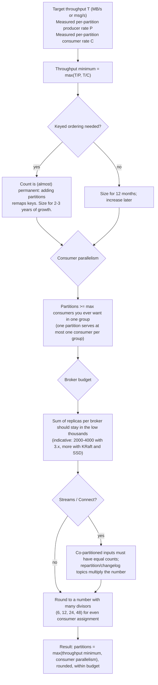
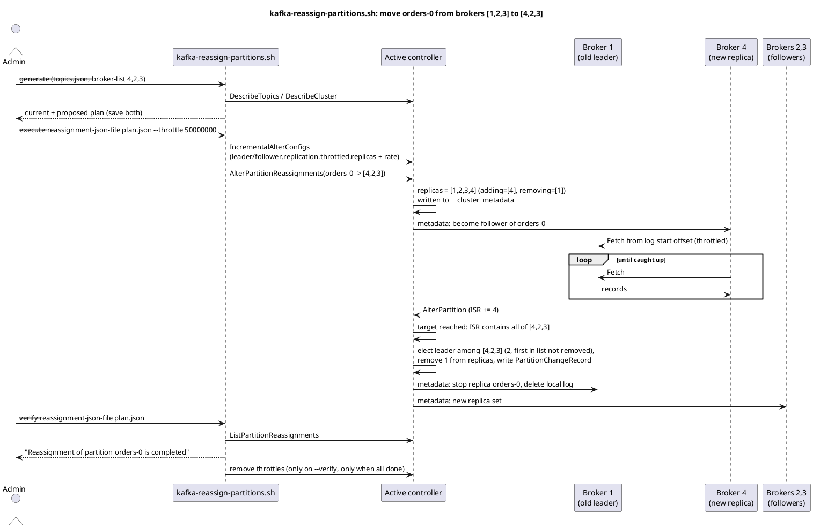
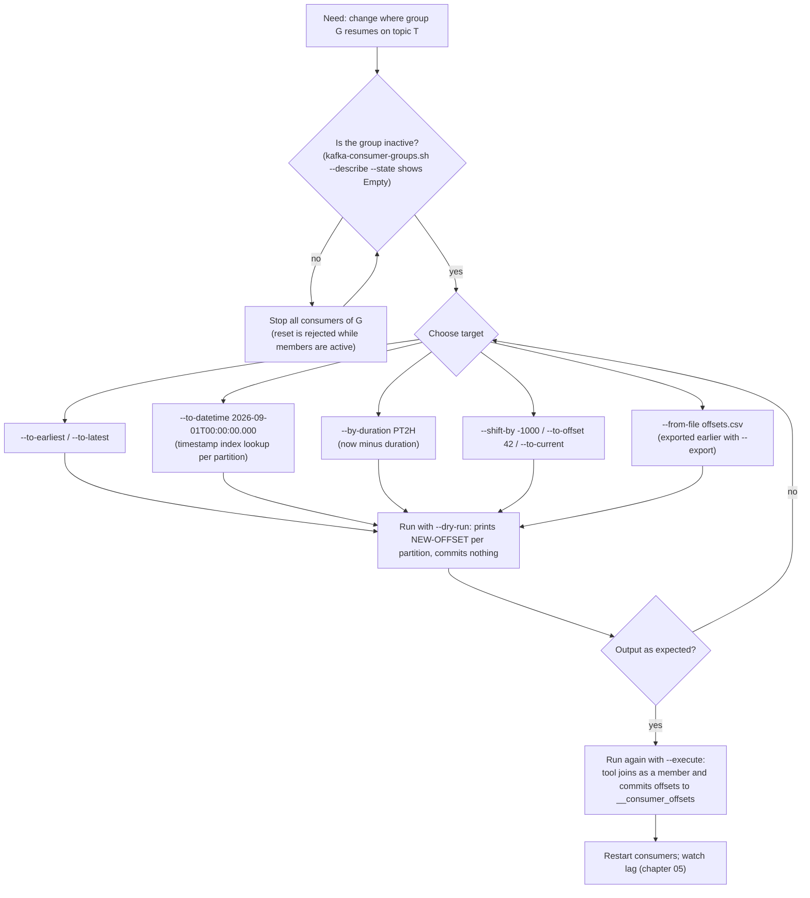

# Topic and Partition Management

**Roles:** [ADMIN] [ARCH] [DEV]   **Level:** Intermediate
**Prerequisites:** `03-admin/02-configuration-reference.md`, `01-architecture/` chapters on partitions, replication and consumer groups.

## What you will learn
- How to create topics with the right replication factor, partition count and per-use-case configs, and how to name them.
- How to choose and later increase a partition count, and what it does to key ordering.
- How to move replicas between brokers and disks with `kafka-reassign-partitions.sh`, throttled and verifiable.
- How to keep leaders balanced (`kafka-leader-election.sh`, `auto.leader.rebalance.enable`, Cruise Control).
- How to apply quotas, purge data, and administer consumer groups and offsets.

## 1. Concept

A topic is a name plus a set of partitions; each partition is an ordered, replicated log. The administrator's decisions per topic are:

| Decision | Set at | Can change later? |
|----------|--------|-------------------|
| Name | creation | No (recreate + migrate) |
| Partition count | creation | Increase only (`--alter --partitions`), never decrease |
| Replication factor | creation | Yes, via reassignment with more/fewer replicas |
| Replica placement | creation (rack-aware, automatic) | Yes, via reassignment |
| Topic configs (`retention.ms`, `cleanup.policy`, ...) | creation or later | Yes, dynamic |
| Quotas | any time, on user/client-id | Yes, dynamic |

### 1.1 Naming conventions

- Lowercase, `[a-z0-9.-]`, max 249 characters. Do not mix `.` and `_` in a cluster: Kafka replaces both with the same character in metric names, so `orders.created` and `orders_created` collide in JMX (the broker logs a warning at creation).
- One agreed pattern, for example `<domain>.<entity>.<event>.<version>`: `payments.invoice.created.v1`, or with an environment/tenant prefix when clusters are shared: `prod.payments.invoice.created.v1`.
- Prefixes drive ACLs (`--resource-pattern-type prefixed`) and quotas; choose the prefix boundary to match team ownership.
- Reserve `_`/`__` prefixes for internal topics (`__consumer_offsets`, `__transaction_state`, `__cluster_metadata`, `_schemas`, Connect and Streams internals such as `<app-id>-<store>-changelog`).

> **Anti-pattern:** Encoding the partition count or the current owner in the name (`orders-12p-teamA`). Both change; the name cannot.

## 2. How it works internally

### 2.1 Choosing the partition count



Worked example (indicative numbers): target 300 MB/s, measured 30 MB/s per partition on the producer side and 60 MB/s on the consumer side gives `max(10, 5) = 10`; the consuming service wants to scale to 24 pods, so take 24; it is keyed by customer id, so plan for 3x growth and choose 48.

Cost of too many partitions:

| Cost | Mechanism |
|------|-----------|
| Longer unavailability on broker failure | Every leader on the failed broker needs a new leader; the controller processes them in batches, clients see `NOT_LEADER_OR_FOLLOWER` meanwhile |
| Producer memory and latency | One in-flight batch per partition; `linger.ms` fills batches slower when spread over many partitions |
| Open file handles and mmap | ~3 files per segment per partition; check `ulimit -n` and `vm.max_map_count` |
| Metadata size | Every metadata response carries all partitions of subscribed topics |
| Replication fetch overhead | Followers issue fetches per partition; many nearly-empty partitions waste round trips |
| End-to-end latency | More partitions per fetch response means larger responses per round trip |

KRaft raised the ceiling (the controller no longer writes one ZooKeeper znode per partition; millions of partitions per cluster are the stated design goal), but the broker-side costs above did not disappear. Treat ~4000 partition replicas per broker as a review threshold, not a hard limit.

### 2.2 Why you cannot decrease partitions, and what increasing does to keys

Data and committed consumer offsets are per partition. Removing partition 11 would need its records interleaved into others with new offsets, breaking every consumer's committed position and every key-to-partition mapping. Kafka therefore only supports adding partitions. Adding partitions changes `hash(key) % numPartitions` for most keys: records for key K written before the change sit in partition `p1`, records after the change in `p2`. Consumers relying on per-key ordering see K's history split across partitions. Compacted topics are hit hardest: the old value of K in `p1` is never compacted away by the new value in `p2`. Kafka Streams applications with co-partitioned joins stop working unless all inputs change together.

Safe ways to grow a keyed topic: create `topic.v2` with the new count, dual-write or mirror, cut consumers over at a chosen offset, then retire `topic.v1`.

### 2.3 Partition reassignment flow



Source: `diagrams/admin-03-topic-and-partition-management-reassignment.puml`.

Two details that matter operationally:

- The throttle is set as topic configs (`leader.replication.throttled.replicas`, `follower.replication.throttled.replicas`) and broker configs (`leader.replication.throttled.rate`, `follower.replication.throttled.rate`). It is removed only by a `--verify` run that finds everything complete. Forgetting `--verify` leaves the throttle in place and slows normal replication forever.
- Throttling applies to the *moving* replicas only, but a throttle lower than the topic's normal ingress means the new replica never catches up. Set it above ingress; a reassignment that never finishes is a common ticket.

### 2.4 Consumer offset reset flow



## 3. Configuration that matters

### 3.1 Topic configs per use case

| Use case | Config set | Why |
|----------|------------|-----|
| Event log (facts, replayable) | `cleanup.policy=delete`, `retention.ms=604800000` (7 d) or longer, `min.insync.replicas=2`, `segment.bytes=1073741824` | Replay window drives retention; big segments are cheap for delete-only |
| Compacted key-value / changelog | `cleanup.policy=compact`, `segment.bytes=104857600`, `segment.ms=86400000`, `min.cleanable.dirty.ratio=0.1`-`0.5`, `min.compaction.lag.ms=60000`, `delete.retention.ms=86400000`, `max.compaction.lag.ms` if bounded staleness is required | Small segments let the cleaner act; `min.compaction.lag.ms` protects readers from seeing a key vanish mid-read |
| High-throughput metrics / logs | `cleanup.policy=delete`, `retention.ms=86400000`, `retention.bytes=<per-partition cap>`, `min.insync.replicas=1` (or RF=2), `unclean.leader.election.enable=true`, `compression.type=producer` with `zstd`/`lz4` producers | Availability over durability; per-partition byte cap protects disks |
| Transactional / exactly-once | `min.insync.replicas=2`, RF=3, `retention.ms` >= producer `transaction.timeout.ms` by a wide margin, `message.timestamp.type=CreateTime` | Aborted markers and idempotent sequences need stable replicas |
| Compact + delete (state with TTL) | `cleanup.policy=compact,delete`, `retention.ms=<TTL>` | Keeps latest value per key but also drops keys not updated within TTL |
| Large messages | `max.message.bytes=10485760`, matching `replica.fetch.max.bytes` on brokers and `max.request.size` / `fetch.max.bytes` on clients | Per-topic limit rather than cluster-wide |

### 3.2 Broker configs affecting topic management

| Parameter | Default | Recommended | Why |
|-----------|---------|-------------|-----|
| `auto.create.topics.enable` | true | false | Explicit lifecycle only |
| `num.partitions` / `default.replication.factor` | 1 / 1 | 6 / 3 | Only used when a create omits them |
| `auto.leader.rebalance.enable` | true | true | Restores preferred leaders automatically |
| `leader.imbalance.check.interval.seconds` | 300 | 300 | Frequency of the automatic check |
| `leader.imbalance.per.broker.percentage` | 10 | 10 | Trigger threshold |
| `delete.topic.enable` | true | true | Otherwise `--delete` only marks |
| `log.retention.check.interval.ms` | 300000 | 300000 | Affects how fast the "retention 1000 ms" purge trick works |
| `max.incremental.fetch.session.cache.slots` | 1000 | scale with consumers | Fetch sessions per broker |
| `quota.window.num`, `quota.window.size.seconds` | 11, 1 | default | Quota sampling |

## 4. Failure modes and how to detect them

| Symptom | Likely cause | Metric / log to check | Fix |
|---------|--------------|-----------------------|-----|
| `--under-replicated-partitions` lists a topic after adding partitions | New partitions assigned to a broker that is fenced/slow | `kafka.server:type=ReplicaManager,name=UnderReplicatedPartitions` | Fix the broker or reassign the new partitions |
| Reassignment never completes | Throttle lower than ingress; target broker's disk full | `kafka.server:type=ReplicaFetcherManager,name=MaxLag,clientId=Replica`; `--verify` output | Raise throttle with `--execute --throttle <higher>` on the same JSON; free disk |
| Cluster slow after a reassignment finished | `--verify` never run, throttle still applied | `kafka-configs.sh --describe --entity-type brokers --entity-name <id>` shows `leader.replication.throttled.rate` | Run `--verify`; or delete the throttle configs manually |
| One broker has 40 % of leaders | Rolling restart moved leaders; automatic rebalance disabled or waiting | `kafka.server:type=ReplicaManager,name=LeaderCount` per broker | `kafka-leader-election.sh --election-type PREFERRED --all-topic-partitions` |
| Consumer keeps consuming the same records after a reset | Reset ran with `--dry-run` only, or a member was still active | `--describe --group` shows unchanged `CURRENT-OFFSET` | Stop members, run with `--execute` |
| `kafka-consumer-groups.sh --delete` fails with "group is not empty" | Members still connected | `--describe --members` | Stop consumers, retry |
| Producer throttled although quota looks generous | `request_percentage` quota hit before `producer_byte_rate` (small messages, high request rate) | `kafka.server:type=Produce,user=...,client-id=...` `throttle-time` | Batch on the producer (`linger.ms`, `batch.size`), or raise `request_percentage` |
| Topic deleted but disk not freed | `file.delete.delay.ms` and segment deletion pending; or a broker holding the replica was offline | `server.log` "Deleted log for partition"; `kafka.controller:type=KafkaController,name=ReplicasIneligibleToDeleteCount` (ZK-era name) | Wait for the broker to return; deletion completes then |
| Key ordering complaints after partition increase | Hash remapping | Producer logs, application evidence | Migrate to a new topic; document that partition count of keyed topics is fixed |

## 5. Design guidance (architect view)

### 5.1 Balancing: manual, Cruise Control or Self-Balancing

| Approach | Pros | Cons | Use when |
|----------|------|------|----------|
| Manual `kafka-reassign-partitions.sh` | No extra components; full control | Plan quality depends on the operator; `--generate` only balances replica counts, not bytes or leaders | Small clusters, one-off moves, decommissioning a broker |
| LinkedIn Cruise Control (open source) | Goal-based optimiser (rack, capacity, disk/network/CPU balance, leader distribution); anomaly detector; self-healing; REST API; Strimzi integration via `KafkaRebalance` | Extra service, needs its metrics reporter on brokers (`metric.reporters=com.linkedin.kafka.cruisecontrol.metricsreporter.CruiseControlMetricsReporter`), needs capacity config per broker | Clusters over ~10 brokers, frequent scaling |
| Confluent Self-Balancing Clusters (Confluent-specific) | Built into the broker (`confluent.balancer.enable=true`); rebalances on `EMPTY_BROKER` or `ANY_UNEVEN_LOAD`; `kafka-remove-brokers` CLI | Confluent Platform licence | Confluent Platform users |

Cruise Control essentials:

- Hard goals (must be satisfied): `RackAwareGoal`, `ReplicaCapacityGoal`, `DiskCapacityGoal`, `NetworkInboundCapacityGoal`, `NetworkOutboundCapacityGoal`, `CpuCapacityGoal`.
- Soft goals (best effort, in order): `ReplicaDistributionGoal`, `PotentialNwOutGoal`, `DiskUsageDistributionGoal`, `NetworkInboundUsageDistributionGoal`, `NetworkOutboundUsageDistributionGoal`, `CpuUsageDistributionGoal`, `TopicReplicaDistributionGoal`, `LeaderReplicaDistributionGoal`, `LeaderBytesInDistributionGoal`, `PreferredLeaderElectionGoal`.
- Anomaly detector: goal violations, broker failures (`broker.failure.self.healing.enabled`), disk failures, metric anomalies, topic anomalies; `self.healing.enabled=true` lets it fix them automatically after `broker.failure.alert.threshold.ms` / `broker.failure.self.healing.threshold.ms`.
- Execution is throttled with `default.replication.throttle` and limited by `num.concurrent.partition.movements.per.broker` and `num.concurrent.leader.movements`.

> **Production tip:** Enable Cruise Control's self-healing for *goal violations* only after you trust its proposals; leave *broker failure* self-healing off unless replacing a broker within `broker.failure.self.healing.threshold.ms` is impossible, because moving terabytes automatically at 03:00 can be worse than a temporary URP.

### 5.2 Quota design

Quotas are applied per broker, in bytes per second and in percentage of request handler + network thread time. Precedence (most specific first): `user + client-id` > `user + default client` > `user` > `default user + client-id` > `default user + default client` > `default user` > `client-id` > `default client`. Set cluster-wide defaults (`--entity-type clients --entity-default`) so an unknown client cannot monopolise a broker, then raise for named tenants. Remember that a `producer_byte_rate=10485760` quota is per broker: a producer writing evenly to 6 brokers gets 60 MB/s in total.

## 6. Hands-on

```bash
BS=broker-1.example.com:9092
```

### 6.1 Create, describe, alter, delete

```bash
# create with explicit RF, partitions and configs
/opt/kafka/bin/kafka-topics.sh --bootstrap-server $BS --create --topic payments.invoice.created.v1 \
  --partitions 24 --replication-factor 3 \
  --config min.insync.replicas=2 --config retention.ms=2592000000 --config cleanup.policy=delete

# create a compacted changelog topic
/opt/kafka/bin/kafka-topics.sh --bootstrap-server $BS --create --topic customers.profile.state.v1 \
  --partitions 12 --replication-factor 3 \
  --config cleanup.policy=compact --config segment.bytes=104857600 --config segment.ms=86400000 \
  --config min.cleanable.dirty.ratio=0.2 --config min.compaction.lag.ms=60000 --config min.insync.replicas=2

# create with a manual replica assignment (partition 0 -> leader 1, followers 2,3; partition 1 -> 2,3,1)
/opt/kafka/bin/kafka-topics.sh --bootstrap-server $BS --create --topic manual.placement \
  --replica-assignment 1:2:3,2:3:1,3:1:2

# list, describe
/opt/kafka/bin/kafka-topics.sh --bootstrap-server $BS --list --exclude-internal
/opt/kafka/bin/kafka-topics.sh --bootstrap-server $BS --describe --topic payments.invoice.created.v1
/opt/kafka/bin/kafka-topics.sh --bootstrap-server $BS --describe --topics-with-overrides

# health filters (empty output is the goal)
/opt/kafka/bin/kafka-topics.sh --bootstrap-server $BS --describe --under-replicated-partitions
/opt/kafka/bin/kafka-topics.sh --bootstrap-server $BS --describe --unavailable-partitions
/opt/kafka/bin/kafka-topics.sh --bootstrap-server $BS --describe --at-min-isr-partitions
/opt/kafka/bin/kafka-topics.sh --bootstrap-server $BS --describe --under-min-isr-partitions

# increase partitions (never decrease). Requires --partitions greater than current
/opt/kafka/bin/kafka-topics.sh --bootstrap-server $BS --alter --topic payments.invoice.created.v1 --partitions 48

# change configs (kafka-topics.sh --alter --config is not supported since 3.0; use kafka-configs.sh)
/opt/kafka/bin/kafka-configs.sh --bootstrap-server $BS --alter --entity-type topics \
  --entity-name payments.invoice.created.v1 --add-config retention.ms=1209600000

# delete
/opt/kafka/bin/kafka-topics.sh --bootstrap-server $BS --delete --topic manual.placement
```

### 6.2 Partition reassignment

```bash
# 1. topics to move
cat > topics.json <<'EOF'
{"version":1,"topics":[{"topic":"payments.invoice.created.v1"},{"topic":"customers.profile.state.v1"}]}
EOF

# 2. generate a proposal spreading replicas over brokers 1-6 (rack aware if broker.rack is set)
/opt/kafka/bin/kafka-reassign-partitions.sh --bootstrap-server $BS --generate \
  --topics-to-move-json-file topics.json --broker-list "1,2,3,4,5,6" | tee proposal.txt
# The output has two JSON blocks: "Current partition replica assignment" (save as rollback.json)
# and "Proposed partition reassignment configuration" (save as plan.json).

# Plan format (edit by hand if needed). "log_dirs" is optional; "any" means broker chooses.
cat > plan.json <<'EOF'
{"version":1,"partitions":[
  {"topic":"payments.invoice.created.v1","partition":0,"replicas":[4,2,3],"log_dirs":["any","any","any"]},
  {"topic":"payments.invoice.created.v1","partition":1,"replicas":[5,3,1],"log_dirs":["any","any","any"]}
]}
EOF

# 3. execute with a 50 MB/s inter-broker throttle (per broker, bytes/s)
/opt/kafka/bin/kafka-reassign-partitions.sh --bootstrap-server $BS --execute \
  --reassignment-json-file plan.json --throttle 50000000

# 4. progress / completion. Run until every line says "completed"; this also removes the throttle
/opt/kafka/bin/kafka-reassign-partitions.sh --bootstrap-server $BS --verify --reassignment-json-file plan.json

# raise the throttle on a running reassignment (same JSON, --execute again with --additional not needed)
/opt/kafka/bin/kafka-reassign-partitions.sh --bootstrap-server $BS --execute \
  --reassignment-json-file plan.json --throttle 200000000

# list in-progress reassignments, or cancel them (replicas revert to the original set)
/opt/kafka/bin/kafka-reassign-partitions.sh --bootstrap-server $BS --list
/opt/kafka/bin/kafka-reassign-partitions.sh --bootstrap-server $BS --cancel --reassignment-json-file plan.json

# change replication factor from 3 to 4 for one partition: list 4 replicas
cat > rf4.json <<'EOF'
{"version":1,"partitions":[{"topic":"payments.invoice.created.v1","partition":0,"replicas":[4,2,3,6]}]}
EOF
/opt/kafka/bin/kafka-reassign-partitions.sh --bootstrap-server $BS --execute --reassignment-json-file rf4.json

# move a replica between log dirs on the same broker (JBOD): give the absolute path in log_dirs
cat > logdir.json <<'EOF'
{"version":1,"partitions":[{"topic":"payments.invoice.created.v1","partition":0,"replicas":[4,2,3],"log_dirs":["/data/kafka-2","any","any"]}]}
EOF
/opt/kafka/bin/kafka-reassign-partitions.sh --bootstrap-server $BS --execute \
  --reassignment-json-file logdir.json --replica-alter-log-dirs-throttle 100000000
/opt/kafka/bin/kafka-reassign-partitions.sh --bootstrap-server $BS --verify --reassignment-json-file logdir.json

# see which log dir holds which replica
/opt/kafka/bin/kafka-log-dirs.sh --bootstrap-server $BS --describe --broker-list 4 --topic-list payments.invoice.created.v1
```

### 6.3 Leader balance

```bash
# who leads what
/opt/kafka/bin/kafka-topics.sh --bootstrap-server $BS --describe --topic payments.invoice.created.v1 | grep -c 'Leader: 1'

# preferred leader election for everything (safe, no data movement)
/opt/kafka/bin/kafka-leader-election.sh --bootstrap-server $BS --election-type PREFERRED --all-topic-partitions

# for one partition, or a list from a file
/opt/kafka/bin/kafka-leader-election.sh --bootstrap-server $BS --election-type PREFERRED \
  --topic payments.invoice.created.v1 --partition 3
cat > elect.json <<'EOF'
{"partitions":[{"topic":"payments.invoice.created.v1","partition":0},{"topic":"payments.invoice.created.v1","partition":1}]}
EOF
/opt/kafka/bin/kafka-leader-election.sh --bootstrap-server $BS --election-type PREFERRED --path-to-json-file elect.json

# last resort for an offline partition whose ISR is empty: accepts data loss
/opt/kafka/bin/kafka-leader-election.sh --bootstrap-server $BS --election-type UNCLEAN \
  --topic metrics.host.cpu.v1 --partition 7
```

### 6.4 Cruise Control REST examples

```bash
CC=http://cruise-control.kafka.internal:9090/kafkacruisecontrol

curl -s "$CC/state?substates=executor,monitor&json=true"
curl -s "$CC/load?json=true"                                  # per-broker load model
curl -s "$CC/proposals?json=true&goals=RackAwareGoal,DiskUsageDistributionGoal,LeaderReplicaDistributionGoal"
curl -s -X POST "$CC/rebalance?dryrun=true&json=true"         # plan only
curl -s -X POST "$CC/rebalance?dryrun=false&json=true&replication_throttle=50000000&concurrent_partition_movements_per_broker=5"
curl -s -X POST "$CC/add_broker?brokerid=7&dryrun=false&json=true"
curl -s -X POST "$CC/remove_broker?brokerid=3&dryrun=false&json=true&throttle_removed_broker=true"
curl -s -X POST "$CC/demote_broker?brokerid=3&dryrun=false&json=true"   # move leaders away before restart
curl -s "$CC/user_tasks?json=true"
curl -s -X POST "$CC/stop_proposal_execution"
```

With Strimzi, the same actions are `KafkaRebalance` custom resources (`spec.mode: full | add-brokers | remove-brokers`) approved with `kubectl annotate kafkarebalance <name> strimzi.io/rebalance=approve`.

### 6.5 Quotas

```bash
# defaults for every client-id: 10 MB/s in, 20 MB/s out, 50 % of one request-handler thread
/opt/kafka/bin/kafka-configs.sh --bootstrap-server $BS --alter --entity-type clients --entity-default \
  --add-config 'producer_byte_rate=10485760,consumer_byte_rate=20971520,request_percentage=50'

# a named user (SASL principal) gets more
/opt/kafka/bin/kafka-configs.sh --bootstrap-server $BS --alter --entity-type users --entity-name payments-svc \
  --add-config 'producer_byte_rate=104857600,consumer_byte_rate=209715200,request_percentage=200'

# user + client-id combination (most specific)
/opt/kafka/bin/kafka-configs.sh --bootstrap-server $BS --alter \
  --entity-type users --entity-name payments-svc --entity-type clients --entity-name batch-loader \
  --add-config 'producer_byte_rate=52428800'

# limit how fast a principal may create/delete partitions (controller mutation quota, KIP-599)
/opt/kafka/bin/kafka-configs.sh --bootstrap-server $BS --alter --entity-type users --entity-name ci-bot \
  --add-config 'controller_mutation_rate=10'

# inspect and remove
/opt/kafka/bin/kafka-configs.sh --bootstrap-server $BS --describe --entity-type users --entity-name payments-svc
/opt/kafka/bin/kafka-configs.sh --bootstrap-server $BS --describe --entity-type clients --entity-default
/opt/kafka/bin/kafka-configs.sh --bootstrap-server $BS --alter --entity-type users --entity-name payments-svc \
  --delete-config producer_byte_rate
```

### 6.6 Purging and deleting data

```bash
# Option A: temporarily set retention to 1 s, wait for log.retention.check.interval.ms (default 5 min) + segment roll, restore
/opt/kafka/bin/kafka-configs.sh --bootstrap-server $BS --alter --entity-type topics --entity-name staging.events \
  --add-config retention.ms=1000
# The active segment is never deleted by retention; force a roll if it is large:
/opt/kafka/bin/kafka-configs.sh --bootstrap-server $BS --alter --entity-type topics --entity-name staging.events \
  --add-config segment.ms=1000
sleep 360
/opt/kafka/bin/kafka-configs.sh --bootstrap-server $BS --alter --entity-type topics --entity-name staging.events \
  --delete-config retention.ms,segment.ms

# Option B (preferred): delete records up to an offset per partition; offset -1 means "everything up to the high watermark"
cat > purge.json <<'EOF'
{"version":1,"partitions":[
  {"topic":"staging.events","partition":0,"offset":-1},
  {"topic":"staging.events","partition":1,"offset":-1},
  {"topic":"staging.events","partition":2,"offset":120000}
]}
EOF
/opt/kafka/bin/kafka-delete-records.sh --bootstrap-server $BS --offset-json-file purge.json
# This advances the log start offset; consumers below it get OffsetOutOfRange and apply auto.offset.reset.

# Option C: delete and recreate the topic (loses configs and ACL bindings if pattern-type literal on that name only)
```

### 6.7 Consumer group administration

```bash
# groups and their state
/opt/kafka/bin/kafka-consumer-groups.sh --bootstrap-server $BS --list
/opt/kafka/bin/kafka-consumer-groups.sh --bootstrap-server $BS --list --state Stable,Empty
/opt/kafka/bin/kafka-consumer-groups.sh --bootstrap-server $BS --describe --group invoice-mailer
# GROUP  TOPIC  PARTITION  CURRENT-OFFSET  LOG-END-OFFSET  LAG  CONSUMER-ID  HOST  CLIENT-ID
/opt/kafka/bin/kafka-consumer-groups.sh --bootstrap-server $BS --describe --group invoice-mailer --members --verbose
/opt/kafka/bin/kafka-consumer-groups.sh --bootstrap-server $BS --describe --group invoice-mailer --state
/opt/kafka/bin/kafka-consumer-groups.sh --bootstrap-server $BS --describe --all-groups --offsets

# reset offsets: group must be Empty (stop the consumers first). Always --dry-run first.
G=invoice-mailer; T=payments.invoice.created.v1
/opt/kafka/bin/kafka-consumer-groups.sh --bootstrap-server $BS --group $G --topic $T --reset-offsets --to-earliest --dry-run
/opt/kafka/bin/kafka-consumer-groups.sh --bootstrap-server $BS --group $G --topic $T --reset-offsets --to-latest --dry-run
/opt/kafka/bin/kafka-consumer-groups.sh --bootstrap-server $BS --group $G --topic $T --reset-offsets --to-current --dry-run
/opt/kafka/bin/kafka-consumer-groups.sh --bootstrap-server $BS --group $G --topic $T:0,1 --reset-offsets --to-offset 150000 --dry-run
/opt/kafka/bin/kafka-consumer-groups.sh --bootstrap-server $BS --group $G --topic $T --reset-offsets --shift-by -5000 --dry-run
/opt/kafka/bin/kafka-consumer-groups.sh --bootstrap-server $BS --group $G --topic $T --reset-offsets --to-datetime 2026-09-01T00:00:00.000 --dry-run
/opt/kafka/bin/kafka-consumer-groups.sh --bootstrap-server $BS --group $G --topic $T --reset-offsets --by-duration PT2H --dry-run
/opt/kafka/bin/kafka-consumer-groups.sh --bootstrap-server $BS --group $G --all-topics --reset-offsets --to-earliest --dry-run

# export the plan, edit, apply
/opt/kafka/bin/kafka-consumer-groups.sh --bootstrap-server $BS --group $G --topic $T --reset-offsets --to-datetime 2026-09-01T00:00:00.000 --export > reset.csv
cat reset.csv   # topic,partition,new-offset
/opt/kafka/bin/kafka-consumer-groups.sh --bootstrap-server $BS --group $G --reset-offsets --from-file reset.csv --execute

# commit it
/opt/kafka/bin/kafka-consumer-groups.sh --bootstrap-server $BS --group $G --topic $T --reset-offsets --to-datetime 2026-09-01T00:00:00.000 --execute

# delete offsets for one topic only, or the whole group (group must be Empty)
/opt/kafka/bin/kafka-consumer-groups.sh --bootstrap-server $BS --delete-offsets --group $G --topic $T
/opt/kafka/bin/kafka-consumer-groups.sh --bootstrap-server $BS --delete --group $G
```

### 6.8 `kafka-get-offsets.sh`

```bash
# latest (high watermark) and earliest (log start) offsets per partition
/opt/kafka/bin/kafka-get-offsets.sh --bootstrap-server $BS --topic payments.invoice.created.v1 --time latest
/opt/kafka/bin/kafka-get-offsets.sh --bootstrap-server $BS --topic payments.invoice.created.v1 --time earliest
# -1 / -2 are the legacy spellings of latest / earliest; max-timestamp (-3) gives the offset of the largest timestamp
/opt/kafka/bin/kafka-get-offsets.sh --bootstrap-server $BS --topic payments.invoice.created.v1 --partitions 0,1 --time -1
/opt/kafka/bin/kafka-get-offsets.sh --bootstrap-server $BS --topic payments.invoice.created.v1 --time max-timestamp
# first offset at or after a timestamp (epoch millis)
/opt/kafka/bin/kafka-get-offsets.sh --bootstrap-server $BS --topic payments.invoice.created.v1 --time 1756684800000
# regex over many topics
/opt/kafka/bin/kafka-get-offsets.sh --bootstrap-server $BS --topic-partitions 'payments\..*:0-3' --time latest

# message count per partition = latest - earliest (approximate on compacted topics)
```

## 7. Interview questions for this chapter

### Q1. How do you choose the number of partitions for a new topic?
**Role:** [ARCH] | **Difficulty:** ★★☆ | **Topic:** Partitioning

**Answer.**
Start from throughput: `partitions >= max(target / per-partition producer rate, target / per-partition consumer rate)`, with the per-partition rates measured on your hardware, not assumed. Then take the maximum consumer parallelism you want in any single group, because one partition feeds at most one consumer per group. If the topic is keyed and ordering matters, over-provision for years of growth because adding partitions later remaps keys. Round to a number with many divisors (12, 24, 48) for even assignment, and check the broker budget: total replicas per broker in the low thousands. Kafka Streams inputs that are joined must have identical counts.

**Follow-up probes.** What is the cost of 10x too many partitions? How does `linger.ms` interact with partition count?

### Q2. Why can't you reduce the partition count, and what really happens to keys when you increase it?
**Role:** [DEV] | **Difficulty:** ★★☆ | **Topic:** Partitioning

**Answer.**
Offsets and committed consumer positions are per partition; removing one would require merging its records into others with new offsets, invalidating every committed offset and every `hash(key) % n` mapping, so Kafka only supports increasing. Increasing changes the modulus: key K that used to land in partition 3 may now land in partition 17, so its history is split across two partitions and consumers can see an "old" record for K after a "new" one. Compacted topics keep both versions forever. The safe path for keyed topics is a new topic with the desired count and a controlled migration.

**Follow-up probes.** Which partitioner is default since 3.3 and how does it treat null keys (KIP-794 uniform sticky)? What happens to a Kafka Streams app if only one of two joined topics grows?

### Q3. Walk through a throttled partition reassignment and the mistake people make at the end.
**Role:** [ADMIN] | **Difficulty:** ★★☆ | **Topic:** Reassignment

**Answer.**
`--generate` with a topics JSON and `--broker-list` gives a proposal plus the current assignment (keep it for rollback); `--execute --reassignment-json-file plan.json --throttle <bytes/s>` submits `AlterPartitionReassignments` to the controller and sets `leader/follower.replication.throttled.replicas` and `.rate`; new replicas fetch from the leader, join the ISR, then the controller drops the removed replicas and elects a leader from the target list. `--verify` reports progress. The mistake: not running `--verify` after completion, which is the *only* step that removes the throttle, so the cluster keeps throttling normal replication. The second mistake is a throttle below the topic's ingress, so the move never finishes.

**Follow-up probes.** How do you cancel a reassignment (`--cancel`)? How do you move a replica between disks on the same broker (`log_dirs` in the JSON, `--replica-alter-log-dirs-throttle`)?

### Q4. What does preferred leader election do and when do you run it manually?
**Role:** [ADMIN] | **Difficulty:** ★☆☆ | **Topic:** Leadership

**Answer.**
The first replica in a partition's replica list is its preferred leader; the initial assignment spreads preferred leaders evenly. After restarts leadership drifts to whichever replica was up, so one broker ends up leading far more partitions and taking most client traffic. `kafka-leader-election.sh --election-type PREFERRED --all-topic-partitions` moves leadership back with no data movement. The controller does it automatically when `auto.leader.rebalance.enable=true` and imbalance exceeds `leader.imbalance.per.broker.percentage` (10 %) at each `leader.imbalance.check.interval.seconds` (300 s); you run it manually right after a rolling restart or when the automatic check is disabled to control the timing.

**Follow-up probes.** Why might someone disable automatic rebalance? (leader moves cause brief client errors; they prefer a controlled window.) Difference from `--election-type UNCLEAN`?

### Q5. Explain how Kafka quotas are enforced and the precedence of user vs client-id quotas.
**Role:** [ADMIN] | **Difficulty:** ★★☆ | **Topic:** Quotas

**Answer.**
Quotas are per broker, sampled over `quota.window.num` windows of `quota.window.size.seconds`. When a client exceeds `producer_byte_rate`, `consumer_byte_rate` or `request_percentage`, the broker delays the response (and since KIP-219 tells the client the throttle time so it mutes its channel) rather than rejecting. Precedence from most to least specific: user+client-id, user+default client, user, default user+client-id, default user+default client, default user, client-id, default client. Because it is per broker, the cluster-wide allowance is roughly the quota times the number of brokers the client talks to. `request_percentage` protects CPU from many tiny requests that byte quotas do not catch.

**Follow-up probes.** How does a client know it was throttled (`produce-throttle-time-avg` metric)? What is `controller_mutation_rate`?

### Q6. A consumer group must reprocess the last two hours. Give the exact procedure.
**Role:** [DEV] | **Difficulty:** ★★☆ | **Topic:** Offsets

**Answer.**
Stop every consumer in the group (the reset is rejected unless the group is Empty; check with `kafka-consumer-groups.sh --bootstrap-server ... --describe --group G --state`). Run `kafka-consumer-groups.sh --bootstrap-server ... --group G --topic T --reset-offsets --by-duration PT2H --dry-run` and read the NEW-OFFSET column; the tool resolves the timestamp per partition via the time index. Re-run with `--execute` to commit, then restart the consumers and watch lag fall. Alternatives: `--to-datetime` for an absolute time, `--shift-by -N`, or `--export` to a CSV you can edit and apply with `--from-file`. Make the consumer idempotent first: it will see duplicates.

**Follow-up probes.** What does the reset do on a topic with `LogAppendTime`? What if the timestamp is older than retention (resolves to earliest)?

### Q7. Compare Cruise Control with manual reassignment for a 30-broker cluster.
**Role:** [ARCH] | **Difficulty:** ★★★ | **Topic:** Balancing

**Answer.**
Manual `--generate` only balances replica *counts* per broker and ignores bytes, leaders, disks and CPU, so on 30 brokers with skewed topics it produces bad plans and the operator must hand-edit JSON. Cruise Control builds a load model from its metrics reporter, optimises against ordered goals (rack awareness and capacity as hard goals, then disk/network/CPU distribution, then leader distribution), executes with throttles and concurrency limits, and exposes `add_broker`, `remove_broker` and `demote_broker`, which makes scaling and decommissioning a single API call. Its anomaly detector can self-heal goal violations and broker failures. The cost is one more service to operate, a capacity file to keep accurate, and the need to review self-healing thresholds so it does not move terabytes during an incident. Confluent's Self-Balancing Clusters offers similar behaviour inside the broker but is Confluent-specific.

**Follow-up probes.** Which goals would you make hard? How do you stop an execution that is hurting latency (`stop_proposal_execution`)?

### Q8. Scenario: a team wants to "empty" a production topic before a replay. Options and risks?
**Role:** [ADMIN] | **Difficulty:** ★★☆ | **Topic:** Data lifecycle

**Situation.** Topic `orders.v1`, 24 partitions, live consumers with committed offsets, ACLs bound to the name.
**Constraints.** No topic deletion (ACLs, dashboards), consumers must resume cleanly.
**Expected reasoning.** `kafka-delete-records.sh` vs retention trick vs recreate; consumer offset consequences.
**Model answer.** Use `kafka-delete-records.sh --bootstrap-server ... --offset-json-file` with `offset: -1` for every partition: it advances the log start offset immediately, keeps topic identity, configs and ACLs, and is auditable. Consumers whose committed offsets are now below the log start offset get `OffsetOutOfRangeException` and apply `auto.offset.reset`, so either reset the group to `--to-latest` (or `--to-earliest`, which is now the new start) before restarting them, or make sure `auto.offset.reset` is what you want. The retention-to-1000 ms trick works but is slower (waits for `log.retention.check.interval.ms` and needs `segment.ms` to roll the active segment) and easy to forget to revert. Deleting and recreating loses the topic id, so Streams and Connect state referencing it can break.

**Follow-up probes.** What does delete-records do on a compacted topic? How would you verify the purge (`kafka-get-offsets.sh --time earliest`)?

## Key takeaways
- Create topics explicitly with RF=3, `min.insync.replicas=2`, a partition count derived from throughput and consumer parallelism, and a naming convention that drives ACL prefixes.
- Partition counts only go up; for keyed topics plan for growth or plan a topic migration.
- Reassign with a throttle above ingress, keep the rollback JSON, and always finish with `--verify`.
- Restore leader balance with `kafka-leader-election.sh --election-type PREFERRED`; use Cruise Control on larger clusters.
- Quotas are per broker and follow user > client-id precedence; set defaults before tenants arrive.
- Offset resets need an Empty group, `--dry-run` first, `--execute` second.

## Further reading
- Apache Kafka documentation: "Basic Kafka Operations" (adding/modifying topics, expanding the cluster, balancing leadership, quotas), tool help output (`--help`) for each script.
- KIP-455 (partition reassignment API), KIP-113 (JBOD replica movement), KIP-599 (controller mutation quotas), KIP-219 (client throttling), KIP-794 (uniform sticky partitioner), KIP-122 (offset reset tool).
- LinkedIn Cruise Control wiki: goals, REST API, anomaly detector configuration.
