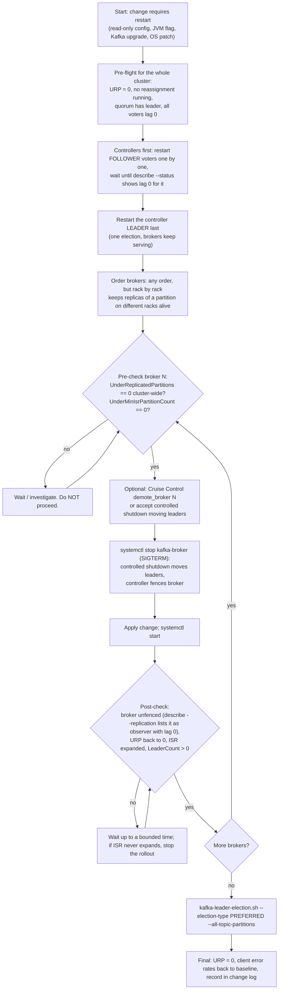
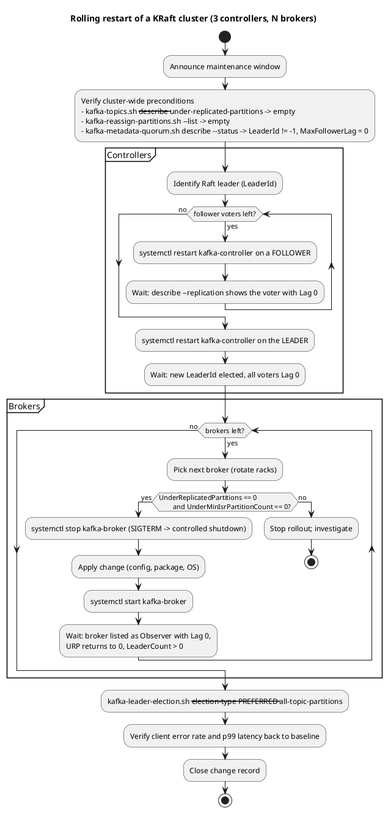
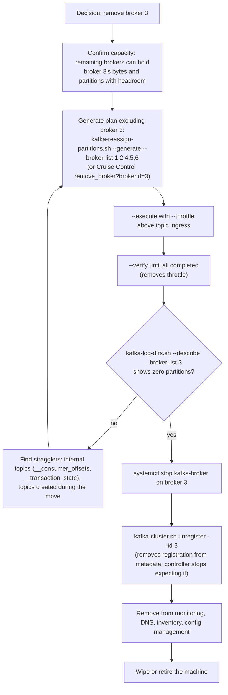
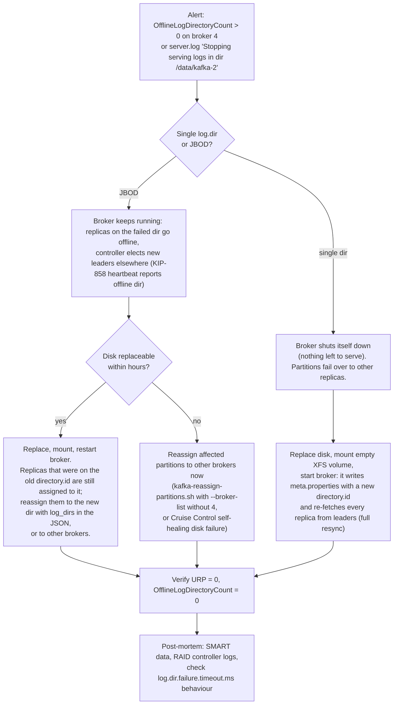

# Cluster Operations (Day-2)

**Roles:** [ADMIN] [ARCH]   **Level:** Advanced
**Prerequisites:** `03-admin/01-installation-and-deployment.md`, `03-admin/02-configuration-reference.md`, `03-admin/03-topic-and-partition-management.md`.

## What you will learn
- A rolling restart procedure that never drops below `min.insync.replicas` and never restarts the controller leader first.
- How to add, decommission and replace brokers and disks, and how to grow or shrink the controller quorum (KIP-853, Kafka 3.9+).
- Runbooks for the recurring incidents: full disk, under-replicated partitions, stuck controller, leader imbalance, log cleaner death, `__consumer_offsets` growth.
- What to back up in a KRaft cluster and how topic-as-code (GitOps) removes a whole class of change tickets.

## 1. Concept

Day-2 operations on Kafka reduce to two invariants that every procedure must protect:

1. **Every partition keeps at least `min.insync.replicas` in-sync replicas at all times.** With RF=3 and `min.insync.replicas=2` that means exactly one broker may be down or catching up at any moment. Two brokers restarting at once can make partitions reject `acks=all` writes (`NotEnoughReplicas`) even though nothing was lost.
2. **The controller quorum keeps a majority.** With 3 voters, one may be down. Restart the Raft leader last so only one election happens.

Everything else - adding capacity, replacing disks, changing configs - is a sequence of steps that keeps the two invariants true while data moves. The tools are `kafka-topics.sh --describe --under-replicated-partitions` (invariant 1) and `kafka-metadata-quorum.sh describe --status` (invariant 2), plus the metrics `kafka.server:type=ReplicaManager,name=UnderReplicatedPartitions` and `kafka.controller:type=KafkaController,name=ActiveControllerCount`.

> **Production tip:** Write every procedure so it can be stopped after any step and leave the cluster healthy. If a step cannot be safely interrupted (a reassignment with a throttle, a controller removal), say so in the runbook.

## 2. How it works internally

### 2.1 Rolling restart



Why each check exists:

| Check | Protects against |
|-------|------------------|
| `UnderReplicatedPartitions == 0` before stopping the next broker | Stopping the second replica of a partition whose third replica is still catching up, which takes ISR below `min.insync.replicas` |
| Restarting controller followers before the leader | Two elections instead of one; a window with no leader while a follower is also down |
| SIGTERM (controlled shutdown), never SIGKILL | Uncontrolled shutdown means leaders die with the process; clients get errors until the controller notices via `broker.session.timeout.ms` (9 s) and elects new leaders; recovery on restart is slower (`num.recovery.threads.per.data.dir`) |
| Wait for unfenced + ISR expansion, not just for the process | A broker that is up but still fenced or lagging is not a replica yet |
| Preferred leader election at the end | Leadership drifts to the brokers restarted last |

KRaft-specific: the controller fences a broker whose heartbeat stops. During controlled shutdown the broker sends a heartbeat with `wantShutDown=true`; the controller moves leadership away and replies when it is safe to exit. `controlled.shutdown.enable` still exists as a config name but KRaft brokers always perform this handshake on SIGTERM.

### 2.2 Rolling restart as an activity diagram



Source: `diagrams/admin-04-cluster-operations-rolling-restart.puml`.

### 2.3 Broker decommission



`kafka-cluster.sh unregister` is a KRaft-only command (available in 3.x KRaft releases and 4.0) and only works while the broker is *not* running; a registered-but-dead broker otherwise stays in the metadata forever and confuses `--generate` (it is still a candidate for placement).

### 2.4 Disk failure decision tree (JBOD, KRaft 3.7+)



## 3. Configuration that matters

| Parameter | Default | Recommended | Why |
|-----------|---------|-------------|-----|
| `controlled.shutdown.enable` | true | true | Leaders move before exit (KRaft always does this on SIGTERM) |
| `broker.session.timeout.ms` | 9000 | 9000 | How long the controller waits before fencing a silent broker |
| `broker.heartbeat.interval.ms` | 2000 | 2000 | Heartbeat cadence |
| `replica.lag.time.max.ms` | 30000 | 30000 | Slow follower is dropped from ISR after this |
| `num.recovery.threads.per.data.dir` | 1 | 4-8 | Parallel log recovery after an unclean stop; the single biggest lever on restart time |
| `log.dir.failure.timeout.ms` | 30000 | 30000 | Broker exits if the controller does not acknowledge a failed dir in time (3.8+) |
| `auto.leader.rebalance.enable` | true | true | Automatic preferred leader restoration after restarts |
| `leader.imbalance.check.interval.seconds` | 300 | 300 | |
| `metadata.log.max.record.bytes.between.snapshots` | 20971520 | default | More frequent snapshots make new controllers/brokers catch up faster |
| `metadata.max.retention.bytes` | 104857600 | default | Metadata log size retained beyond the last snapshot |
| `log.cleaner.dedupe.buffer.size` | 134217728 | 268435456+ | Cleaner memory; undersizing causes repeated passes and a growing `__consumer_offsets` |
| `log.cleaner.threads` | 1 | 2-4 | Cleaner parallelism |
| `offsets.retention.minutes` | 10080 | 10080-20160 | Expiry of committed offsets for empty groups |
| `log.retention.check.interval.ms` | 300000 | 300000 | How quickly emergency retention cuts take effect |
| `replica.alter.log.dirs.io.max.bytes.per.second` (via tool `--replica-alter-log-dirs-throttle`) | unlimited | set during intra-broker moves | Protects the healthy disk |

## 4. Failure modes and how to detect them

| Symptom | Likely cause | Metric / log to check | Fix |
|---------|--------------|-----------------------|-----|
| Disk 100 % full on a broker | Retention too long for ingress growth; a runaway producer; compaction stalled | `df`, `kafka.log:type=Log,name=Size,topic=*,partition=*` summed per topic, `kafka-log-dirs.sh --describe` | See 6.5 runbook: cut retention on the largest topics, delete records, then move partitions off |
| Persistent under-replicated partitions | One broker slow (disk, GC, network), fetcher threads saturated, throttle left on, broker fenced | `UnderReplicatedPartitions`, `IsrShrinksPerSec`, `kafka.server:type=ReplicaFetcherManager,name=MaxLag,clientId=Replica`, `server.log` on the follower | Fix the slow broker; raise `num.replica.fetchers`; remove leftover throttles |
| Metadata changes hang (topic create times out, reassignments stuck), `MetadataErrorCount` > 0 | Controller leader cannot commit: disk latency on `metadata.log.dir`, quorum lost majority, controller stuck in a long GC | `kafka.controller:type=KafkaController,name=MetadataErrorCount`, `kafka.server:type=raft-metrics,name=commit-latency-avg`, `high-watermark` flat, `controller.log` | Restart the leader controller (forces election), fix disk, restore voters |
| One broker has most leaders after maintenance | Rolling restart moved them, automatic rebalance waiting or disabled | `kafka.server:type=ReplicaManager,name=LeaderCount` per broker | `kafka-leader-election.sh --election-type PREFERRED --all-topic-partitions` |
| Compacted topics grow, `__consumer_offsets` in GB | Cleaner thread died, corrupt segment, buffer too small, cleaner disabled | `kafka.log:type=LogCleaner,name=DeadThreadCount`, `kafka.log:type=LogCleanerManager,name=uncleanable-partitions-count`, `log-cleaner.log` | Restart broker (thread restarts), raise `log.cleaner.dedupe.buffer.size`, remove the corrupt segment |
| `__consumer_offsets` growth with healthy cleaner | Many unique group ids (console consumers with random ids, per-pod group names) | `kafka-consumer-groups.sh --list | wc -l` | Fix clients; expired groups are compacted after `offsets.retention.minutes` |
| Broker restart takes 30+ minutes | Unclean shutdown + `num.recovery.threads.per.data.dir=1` on a disk with thousands of partitions | `server.log` "Recovering unflushed segment" | Raise recovery threads; always stop with SIGTERM; give systemd `TimeoutStopSec` >= 300 |
| Producers get `NotEnoughReplicasException` during a rollout | Two replicas of a partition down at once | `UnderMinIsrPartitionCount` | Stop the rollout until URP = 0; restart one broker at a time |
| Broker registers with a different `node.id` after rebuild and old id lingers | Config management gave a new id; old id never unregistered | `kafka-metadata-quorum.sh describe --replication` observer list | `kafka-cluster.sh unregister --id <old>` |

## 5. Design guidance (architect view)

### 5.1 Capacity headroom

| Resource | Steady-state ceiling | Reason |
|----------|----------------------|--------|
| Disk usage per broker | 60-70 % | Reassignment copies data before deleting; retention must survive a producer burst; a broker loss redistributes its share |
| Network utilisation | 50-60 % of NIC | Losing one of three AZs pushes 50 % more replication onto survivors; follower catch-up after a restart is a burst |
| CPU | 50-60 % | TLS handshakes after a restart, compaction, recovery |
| Request handler idle % | > 30 % | Below that, latency climbs non-linearly |
| Partition replicas per broker | review at ~4000 | Failover time, file handles, fetch overhead |

Plan capacity so that the cluster survives one AZ (one third of brokers) with all invariants intact: (N-1)/N of the fleet must carry 100 % of the load below the ceilings above.

### 5.2 Maintenance windows and change management

- Classify changes: **routine** (dynamic config, topic create, quota) - no window, peer review; **rolling** (restart, upgrade, scale) - announced window, on-call aware, one cluster at a time; **structural** (controller membership, listener changes, security changes) - rehearsed in staging, rollback tested, two operators.
- Every change has: precondition checks (commands, expected output), steps, post-checks, rollback, and an "abort here if" line per step.
- Freeze rolling changes during known traffic peaks and while any reassignment is running.
- Record dynamic config changes in the same ticket as static ones so drift is visible.

### 5.3 Runbook template

```markdown
# RB-<id>: <title>
Owner: <team>   Severity when triggered: <S1-S4>   Last rehearsed: <date>
## Trigger
Alert name / symptom / metric threshold.
## Preconditions (run all, expected output shown)
- kafka-topics.sh --bootstrap-server $BS --describe --under-replicated-partitions   # expect: empty
- kafka-metadata-quorum.sh --bootstrap-server $BS describe --status               # expect: LeaderId != -1
## Steps
1. <command>   # expect: ...   ABORT IF: ...
2. ...
## Post-checks
## Rollback
## Known pitfalls
## Escalation
```

### 5.4 Backups in KRaft

There is no `kafka-backup.sh`. What you protect and how:

| Asset | Where | How to back up | Restore |
|-------|-------|----------------|---------|
| Cluster metadata (topics, partitions, configs, ACLs, SCRAM credentials, producer ids, quotas) | `metadata.log.dir/__cluster_metadata-0/` on controllers; snapshots `*.checkpoint` | Copy the latest `.checkpoint` file from a controller (they are immutable) plus `quorum-state`; inspect with `kafka-metadata-shell.sh --snapshot <file>` or `kafka-dump-log.sh --cluster-metadata-decoder --files <file>` | Rebuild the quorum from the snapshot only with vendor/community guidance; the practical restore path is *declarative*: re-apply topics, configs and ACLs from GitOps |
| Topic and config definitions | metadata | `kafka-topics.sh --describe`, `kafka-configs.sh --describe --entity-type topics`, `kafka-acls.sh --list`, exported nightly to a repo | Re-create with the same tools or a GitOps controller |
| Data | `log.dirs` | Not file copies. Use MirrorMaker 2 (or Confluent Cluster Linking, Confluent-specific) to a second cluster; tiered storage (3.9+) puts closed segments in object storage but is not a backup by itself | Consumers fail over to the mirror; offsets translated by MM2's checkpoints |
| Consumer group offsets | `__consumer_offsets` | Periodic `kafka-consumer-groups.sh --describe --all-groups` export; MM2 `sync.group.offsets.enabled=true` | `--reset-offsets --from-file` |
| Broker configs, keystores, unit files | hosts | Configuration management repo, secrets manager | Re-provision |

### 5.5 Topic-as-code (GitOps)

| Tool | Model | Notes |
|------|-------|-------|
| Strimzi Topic Operator (`KafkaTopic` CR) | One CR per topic; operator reconciles create/alter (partitions up, configs) and deletes when the CR is deleted (if `STRIMZI_USE_FINALIZERS` and topic deletion enabled) | Since Strimzi 0.39 unidirectional (Kubernetes is the source of truth). Best when Kafka runs in Kubernetes |
| julie-ops | One YAML "topology" per project with topics, configs, ACLs/RBAC, schemas, Connect; `julie-ops --brokers ... --topology descriptor.yaml --plans plans.yaml --dry-run` | Prefix-based ownership; supports Confluent RBAC |
| kafka-gitops (devshawn) | Declarative `state.yaml` of topics/services/users with derived ACLs; `plan`/`apply` like Terraform | Good ACL derivation from service intent |
| Terraform (`Mongey/kafka` provider; `confluentinc/confluent` for Confluent Cloud) | `kafka_topic`, `kafka_acl`, `kafka_quota` resources in HCL | Fits teams already on Terraform; state file must be protected |
| Kafka Admin API scripts in CI | Custom | Last resort; re-implements diffing |

Strimzi example:

```yaml
apiVersion: kafka.strimzi.io/v1beta2
kind: KafkaTopic
metadata:
  name: payments.invoice.created.v1
  labels:
    strimzi.io/cluster: prod
spec:
  partitions: 24
  replicas: 3
  config:
    retention.ms: 2592000000
    min.insync.replicas: 2
    cleanup.policy: delete
```

Terraform example (`Mongey/kafka`):

```hcl
resource "kafka_topic" "invoice_created" {
  name               = "payments.invoice.created.v1"
  partitions         = 24
  replication_factor = 3
  config = {
    "retention.ms"        = "2592000000"
    "min.insync.replicas" = "2"
    "cleanup.policy"      = "delete"
  }
}
```

> **Anti-pattern:** Letting the pipeline also *delete* topics that are not in the repo without a manual gate. A bad merge then deletes production data. Require an explicit `deleted: true` marker or a separate approval for deletions.

## 6. Hands-on

```bash
BS=broker-1.example.com:9092
CTL=controller-0.kafka.internal:9093
```

### 6.1 Rolling restart of one broker (the loop body)

```bash
N=3
# preconditions
test -z "$(/opt/kafka/bin/kafka-topics.sh --bootstrap-server $BS --describe --under-replicated-partitions)" || { echo "URP != 0, abort"; exit 1; }
test -z "$(/opt/kafka/bin/kafka-reassign-partitions.sh --bootstrap-server $BS --list | grep -v 'No partition reassignments')" || { echo "reassignment running, abort"; exit 1; }
/opt/kafka/bin/kafka-metadata-quorum.sh --bootstrap-server $BS describe --status | grep -E 'LeaderId|MaxFollowerLag'

# optional: move leaders away first (Cruise Control) so clients see one transition instead of a controlled-shutdown burst
# curl -s -X POST "http://cruise-control:9090/kafkacruisecontrol/demote_broker?brokerid=$N&dryrun=false"

ssh broker-$N sudo systemctl stop kafka-broker      # SIGTERM -> controlled shutdown
ssh broker-$N sudo systemctl start kafka-broker

# post-checks: registered, unfenced, caught up
until /opt/kafka/bin/kafka-metadata-quorum.sh --bootstrap-server $BS describe --replication | awk -v id=$N '$1==id && $4==0 && $7=="Observer"' | grep -q .; do sleep 5; done
until test -z "$(/opt/kafka/bin/kafka-topics.sh --bootstrap-server $BS --describe --under-replicated-partitions)"; do sleep 5; done
/opt/kafka/bin/kafka-broker-api-versions.sh --bootstrap-server broker-$N.example.com:9092 | head -1
```

After the last broker:

```bash
/opt/kafka/bin/kafka-leader-election.sh --bootstrap-server $BS --election-type PREFERRED --all-topic-partitions
```

### 6.2 Adding a broker

```bash
# on the new host, after installing and writing broker.properties with a new node.id (7) and broker.rack
CLUSTER_ID=$(/opt/kafka/bin/kafka-cluster.sh cluster-id --bootstrap-server $BS | awk '{print $NF}')
sudo -u kafka /opt/kafka/bin/kafka-storage.sh format --cluster-id "$CLUSTER_ID" \
  --config /etc/kafka/broker.properties --no-initial-controllers
sudo systemctl enable --now kafka-broker

# verify registration
/opt/kafka/bin/kafka-metadata-quorum.sh --bootstrap-server $BS describe --replication | grep -E '^7 '
/opt/kafka/bin/kafka-broker-api-versions.sh --bootstrap-server broker-7.example.com:9092 | head -1

# move data onto it: either Cruise Control...
# curl -s -X POST "http://cruise-control:9090/kafkacruisecontrol/add_broker?brokerid=7&dryrun=false&replication_throttle=100000000"
# ...or a manual plan across all brokers including 7
/opt/kafka/bin/kafka-topics.sh --bootstrap-server $BS --list --exclude-internal | \
  python3 -c 'import sys,json; print(json.dumps({"version":1,"topics":[{"topic":t.strip()} for t in sys.stdin if t.strip()]}))' > topics.json
/opt/kafka/bin/kafka-reassign-partitions.sh --bootstrap-server $BS --generate \
  --topics-to-move-json-file topics.json --broker-list "1,2,3,4,5,6,7" > proposal.txt
# extract "Proposed partition reassignment configuration" block into plan.json, review, then:
/opt/kafka/bin/kafka-reassign-partitions.sh --bootstrap-server $BS --execute --reassignment-json-file plan.json --throttle 100000000
/opt/kafka/bin/kafka-reassign-partitions.sh --bootstrap-server $BS --verify --reassignment-json-file plan.json
```

New brokers receive no partitions until something is reassigned or a new topic is created; they are not "auto-balanced".

### 6.3 Decommissioning a broker

```bash
OLD=3
# 1. plan without the broker (include internal topics!)
/opt/kafka/bin/kafka-topics.sh --bootstrap-server $BS --list | \
  python3 -c 'import sys,json; print(json.dumps({"version":1,"topics":[{"topic":t.strip()} for t in sys.stdin if t.strip()]}))' > all-topics.json
/opt/kafka/bin/kafka-reassign-partitions.sh --bootstrap-server $BS --generate \
  --topics-to-move-json-file all-topics.json --broker-list "1,2,4,5,6" > proposal.txt
# 2. execute + verify
/opt/kafka/bin/kafka-reassign-partitions.sh --bootstrap-server $BS --execute --reassignment-json-file plan.json --throttle 100000000
/opt/kafka/bin/kafka-reassign-partitions.sh --bootstrap-server $BS --verify --reassignment-json-file plan.json
# 3. nothing left on the broker
/opt/kafka/bin/kafka-log-dirs.sh --bootstrap-server $BS --describe --broker-list $OLD | tail -1 | python3 -c 'import sys,json; d=json.load(sys.stdin); print(sum(len(l["partitions"]) for b in d["brokers"] for l in b["logDirs"]))'
# expect 0
# 4. stop and unregister
ssh broker-$OLD sudo systemctl disable --now kafka-broker
/opt/kafka/bin/kafka-cluster.sh unregister --bootstrap-server $BS --id $OLD
/opt/kafka/bin/kafka-metadata-quorum.sh --bootstrap-server $BS describe --replication | grep -E "^$OLD " || echo "broker $OLD gone"
```

### 6.4 Scaling the controller quorum (KIP-853, Kafka 3.9+)

Requires `kraft.version=1` (`kafka-features.sh --bootstrap-server $BS describe | grep kraft.version`). Add a voter:

```bash
# on the new controller host (node.id=1003), controller.properties with controller.quorum.bootstrap.servers pointing at existing voters
CLUSTER_ID=$(/opt/kafka/bin/kafka-cluster.sh cluster-id --bootstrap-server $BS | awk '{print $NF}')
sudo -u kafka /opt/kafka/bin/kafka-storage.sh format --cluster-id "$CLUSTER_ID" \
  --config /etc/kafka/controller.properties --no-initial-controllers
sudo systemctl enable --now kafka-controller          # starts as an observer, catches up on the metadata log

# wait until it is caught up
/opt/kafka/bin/kafka-metadata-quorum.sh --bootstrap-server $BS describe --replication | grep -E '^1003 '

# promote to voter. Run ON the new controller: --command-config reads its node.id and directory.id
sudo -u kafka /opt/kafka/bin/kafka-metadata-quorum.sh --command-config /etc/kafka/controller.properties \
  --bootstrap-controller $CTL add-controller

/opt/kafka/bin/kafka-metadata-quorum.sh --bootstrap-server $BS describe --status | grep -A4 CurrentVoters
```

Remove a voter (also how you replace one whose disk was lost: remove old directory id, add the rebuilt node):

```bash
# directory id from describe --status (CurrentVoters) or from meta.properties on the node
DIR_ID=$(/opt/kafka/bin/kafka-metadata-quorum.sh --bootstrap-server $BS describe --status | python3 -c '
import sys,re,json
txt=sys.stdin.read(); m=re.search(r"CurrentVoters:\s*(\[.*?\])", txt, re.S)
print([v["directoryId"] for v in json.loads(m.group(1)) if v["id"]==1002][0])')
/opt/kafka/bin/kafka-metadata-quorum.sh --bootstrap-server $BS remove-controller \
  --controller-id 1002 --controller-directory-id "$DIR_ID"
# then stop the process and update controller.quorum.bootstrap.servers everywhere at the next rolling restart
```

Rules: add before you remove (3 -> 4 -> 3 keeps a majority of 3 during the swap); one membership change at a time; never remove the current leader without first letting it step down (removing the leader triggers an election, which is acceptable but noisy).

### 6.5 Runbook: disk full

```bash
B=4
# 1. what is big? (bytes per partition, per log dir)
/opt/kafka/bin/kafka-log-dirs.sh --bootstrap-server $BS --describe --broker-list $B | tail -1 | python3 -c '
import sys,json,collections
d=json.load(sys.stdin); s=collections.Counter()
for b in d["brokers"]:
  for l in b["logDirs"]:
    for p in l["partitions"]: s[p["partition"].rsplit("-",1)[0]]+=p["size"]
for t,v in s.most_common(10): print(f"{v/2**30:8.1f} GiB  {t}")'

# 2. immediate relief on the biggest topic: shorten retention (dynamic, takes effect at the next retention check <= 5 min)
/opt/kafka/bin/kafka-configs.sh --bootstrap-server $BS --alter --entity-type topics --entity-name metrics.host.cpu.v1 \
  --add-config retention.ms=21600000
# or delete records up to an offset on selected partitions (immediate)
# /opt/kafka/bin/kafka-delete-records.sh --bootstrap-server $BS --offset-json-file purge.json

# 3. structural fix: move partitions off the broker/disk, or add a disk to log.dirs and move replicas onto it
# (kafka-reassign-partitions.sh with log_dirs, chapter 03 section 6.2)

# 4. if the broker died with the disk 100% full and will not start: stop it, delete the OLDEST closed segments
#    (.log/.index/.timeindex triplets) of a high-retention partition to free space, start, then do steps 2-3.
#    Never delete the active (highest-offset) segment or anything under __cluster_metadata-0.
```

### 6.6 Runbook: stuck or unhealthy controller

```bash
/opt/kafka/bin/kafka-metadata-quorum.sh --bootstrap-server $BS describe --status
# LeaderId -1            -> no leader: check that a majority of voters is running and reachable on 9093
# HighWatermark not moving across two calls 10 s apart -> leader cannot commit (disk, GC, partition)
/opt/kafka/bin/kafka-metadata-quorum.sh --bootstrap-server $BS describe --replication
# a voter with growing Lag and old LastFetchTimestamp -> that node is down or its disk is slow

# metrics on the controllers
curl -s controller-0.kafka.internal:7071/metrics | grep -E 'kafka_controller_kafkacontroller_metadataerrorcount|kafka_server_raft_metrics_(current_state|high_watermark|commit_latency_avg|current_leader)'

# logs
ssh controller-0 'sudo tail -200 /var/log/kafka/controller.log | grep -Ei "error|exception|election|fenc"'

# remediation ladder
# a) restart the leader controller only  -> forces one election; brokers keep serving during it
# b) if a voter is permanently lost: replace it (6.4 remove-controller then add-controller)
# c) if MetadataErrorCount > 0 persists after restart: collect controller.log and __cluster_metadata dump before touching anything else
/opt/kafka/bin/kafka-dump-log.sh --cluster-metadata-decoder --files /data/kafka-controller/__cluster_metadata-0/00000000000000000000.log | tail -50
```

### 6.7 Runbook: log cleaner and `__consumer_offsets`

```bash
# cleaner health on broker B
curl -s broker-$B.example.com:7071/metrics | grep -E 'kafka_log_logcleaner_deadthreadcount|kafka_log_logcleanermanager_uncleanable_partitions_count|kafka_log_logcleanermanager_max_dirty_percent|kafka_log_logcleaner_max_buffer_utilization_percent'
ssh broker-$B 'sudo grep -E "ERROR|uncleanable|Corrupt" /var/log/kafka/log-cleaner.log | tail -20'

# size of __consumer_offsets per broker
/opt/kafka/bin/kafka-log-dirs.sh --bootstrap-server $BS --describe --topic-list __consumer_offsets --broker-list $B | tail -1 | python3 -c 'import sys,json; d=json.load(sys.stdin); print(sum(p["size"] for b in d["brokers"] for l in b["logDirs"] for p in l["partitions"])/2**30, "GiB")'

# how many groups exist (unique ids inflate the topic)
/opt/kafka/bin/kafka-consumer-groups.sh --bootstrap-server $BS --list | wc -l

# fixes
/opt/kafka/bin/kafka-configs.sh --bootstrap-server $BS --alter --entity-type brokers --entity-default --add-config log.cleaner.dedupe.buffer.size=536870912,log.cleaner.threads=2
# DeadThreadCount > 0: restart that broker (rolling restart body in 6.1)
# uncleanable partition due to a corrupt segment: stop broker, move the named segment out of the partition dir, start; the replica re-fetches from the leader
```

### 6.8 Metadata backup

```bash
# nightly on one controller: copy the newest snapshot and quorum state
SNAP=$(ls -t /data/kafka-controller/__cluster_metadata-0/*.checkpoint | head -1)
sudo cp "$SNAP" /data/kafka-controller/__cluster_metadata-0/quorum-state /backup/kafka-metadata/$(date +%F)/

# inspect what is inside
/opt/kafka/bin/kafka-metadata-shell.sh --snapshot "$SNAP" <<'EOF'
ls /image/topics/byName
cat /image/configs/TOPIC/payments.invoice.created.v1
exit
EOF

# declarative export (what you would actually use to rebuild)
/opt/kafka/bin/kafka-topics.sh --bootstrap-server $BS --describe > topics-$(date +%F).txt
/opt/kafka/bin/kafka-acls.sh --bootstrap-server $BS --list > acls-$(date +%F).txt
/opt/kafka/bin/kafka-configs.sh --bootstrap-server $BS --describe --entity-type users > users-quotas-$(date +%F).txt
/opt/kafka/bin/kafka-consumer-groups.sh --bootstrap-server $BS --describe --all-groups > offsets-$(date +%F).txt
```

## 7. Interview questions for this chapter

### Q1. What must be true before you stop the next broker in a rolling restart, and why?
**Role:** [ADMIN] | **Difficulty:** ★☆☆ | **Topic:** Rolling restart

**Answer.**
`UnderReplicatedPartitions` must be 0 cluster-wide (equivalently `kafka-topics.sh --describe --under-replicated-partitions` prints nothing), no reassignment is running, and the previous broker is unfenced and back in every ISR. Otherwise a partition that already lost one replica loses a second, its ISR drops below `min.insync.replicas=2`, and `acks=all` producers get `NotEnoughReplicasException` while consumers may lose their leader. Also stop with SIGTERM so controlled shutdown moves leaders first, and restart the controller leader last so only one Raft election occurs.

**Follow-up probes.** Why restart rack by rack? What is the role of `broker.session.timeout.ms` if you SIGKILL?

### Q2. How do you decommission a broker in KRaft and what is different from the ZooKeeper era?
**Role:** [ADMIN] | **Difficulty:** ★★☆ | **Topic:** Scaling down

**Answer.**
Generate a reassignment with `--broker-list` excluding the broker (including internal topics), execute with a throttle above ingress, `--verify` to completion, confirm with `kafka-log-dirs.sh --describe --broker-list <id>` that it holds nothing, stop it, then run `kafka-cluster.sh unregister --bootstrap-server ... --id <id>`. The last step is new in KRaft: the controller keeps a broker registration in the metadata log until told otherwise, so a stopped broker would otherwise remain a placement candidate and show up in `describe --replication` forever. In ZooKeeper mode the ephemeral znode disappeared by itself.

**Follow-up probes.** Why must internal topics be in the plan? What happens if you unregister a running broker (it is rejected)?

### Q3. A JBOD broker loses one of four disks. What happens automatically and what do you do?
**Role:** [ADMIN] | **Difficulty:** ★★★ | **Topic:** Disk failure

**Answer.**
Since 3.7 (KIP-858) KRaft supports JBOD: the broker marks the directory offline, reports it in its heartbeat, and the controller elects new leaders for the replicas on that directory from other brokers; the broker keeps serving the other three disks. Producers and consumers see a brief leader change. Your job: replace the disk, mount it, restart the broker; the empty directory gets a fresh `directory.id` in `meta.properties`. Replicas are still assigned to the old directory id, so move them explicitly with `kafka-reassign-partitions.sh` (a `log_dirs` entry pointing at the new path, or to other brokers), then verify URP = 0 and `OfflineLogDirectoryCount` = 0. If the disk cannot be replaced soon, reassign the affected partitions to other brokers immediately. With a single `log.dirs` entry the broker instead shuts down and everything fails over.

**Follow-up probes.** What does `log.dir.failure.timeout.ms` do? Why is RAID-10 still popular despite JBOD support (no reassignment after a disk swap)?

### Q4. Explain how to replace a failed controller in a 3.9 dynamic quorum without losing quorum.
**Role:** [ARCH] | **Difficulty:** ★★★ | **Topic:** KIP-853

**Answer.**
Add before remove. Provision the replacement (new or same host) with `kafka-storage.sh format --no-initial-controllers`, start it so it joins as an observer and catches up, then run `kafka-metadata-quorum.sh --command-config controller.properties --bootstrap-controller <live-voter>:9093 add-controller` from that node; the quorum becomes 4 voters (majority 3, still satisfied by the 3 healthy ones). Then `remove-controller --controller-id <dead-id> --controller-directory-id <dead-dir-id>`, which is why voters are identified by directory id: the dead node's disk could come back and it must not be confused with the replacement. Finish by updating `controller.quorum.bootstrap.servers` in config management. If you removed first you would be at 2 voters with majority 2 - a single further failure stops metadata changes.

**Follow-up probes.** What must `kraft.version` be? How does this differ with `controller.quorum.voters` (static)?

### Q5. `__consumer_offsets` is 200 GB on one broker. Walk through the diagnosis.
**Role:** [ADMIN] | **Difficulty:** ★★☆ | **Topic:** Compaction

**Answer.**
It is a compacted topic, so growth means either the cleaner is not cleaning or too much unique state exists. First check `kafka.log:type=LogCleaner,name=DeadThreadCount` and `kafka.log:type=LogCleanerManager,name=uncleanable-partitions-count` on that broker and grep `log-cleaner.log` for exceptions: a dead thread (often after a corrupt segment or an OOM in the dedupe buffer) leaves the partition dirty forever; a restart revives the thread, and `log.cleaner.dedupe.buffer.size` should be raised. If the cleaner is healthy, count groups: thousands of throwaway group ids (console consumers, per-pod ids, CI jobs) each hold offsets until `offsets.retention.minutes` expires them, and every commit is a new record until compaction. Fix the clients; optionally lower `offsets.retention.minutes`. Also confirm `offsets.topic.segment.bytes` is small (100 MB default) so segments close and become cleanable.

**Follow-up probes.** Why does the active segment never get compacted? What does `min.cleanable.dirty.ratio` mean for this topic?

### Q6. What do you actually back up in a KRaft cluster, given there is no backup tool?
**Role:** [ARCH] | **Difficulty:** ★★☆ | **Topic:** DR

**Answer.**
Three things, by different means. Metadata: copy the latest `__cluster_metadata-0/*.checkpoint` snapshot from a controller for forensics, but plan the real restore declaratively - topics, configs, ACLs, quotas and SCRAM users re-applied from a GitOps repository or nightly exports (`kafka-topics.sh --describe`, `kafka-acls.sh --list`, `kafka-configs.sh --describe`). Data: not by copying `log.dirs`; replicate continuously with MirrorMaker 2 to a second cluster, and treat tiered storage (3.9+) as capacity, not backup. Offsets: MM2 checkpoint translation or `kafka-consumer-groups.sh --describe --all-groups` exports that can be restored with `--reset-offsets --from-file`. Test the restore by rebuilding an empty cluster from the repo.

**Follow-up probes.** What does MM2 not preserve (offsets are translated, not identical; timestamps preserved; transactions not)? How would you snapshot on Kubernetes (PVC snapshots are consistent per broker only, not cluster-wide)?

### Q7. Why do you finish a rolling restart with a preferred leader election, and what if you forget?
**Role:** [ADMIN] | **Difficulty:** ★☆☆ | **Topic:** Leadership

**Answer.**
Each controlled shutdown moves that broker's leaders to other replicas, so by the end the last-restarted brokers lead almost nothing and the first-restarted lead far more than their share: uneven network, CPU and request latency. `kafka-leader-election.sh --election-type PREFERRED --all-topic-partitions` restores the designed distribution without moving data. If you forget, `auto.leader.rebalance.enable=true` does it within `leader.imbalance.check.interval.seconds` (300 s) once imbalance exceeds `leader.imbalance.per.broker.percentage` (10 %), but at a time you did not choose; some teams disable the automatic check for that reason and rely on the manual step.

**Follow-up probes.** What client-visible effect does a leader move have? How does Cruise Control's `demote_broker` reduce it?

### Q8. Scenario: metadata operations hang; topic creation times out. Diagnose and remediate.
**Role:** [ADMIN] | **Difficulty:** ★★★ | **Topic:** Controller

**Situation.** Producers and consumers work, but `kafka-topics.sh --create` and reassignments time out; a config change never applies.
**Constraints.** No client outage acceptable; 3 isolated controllers.
**Expected reasoning.** Data plane vs control plane, quorum status, leader disk, election.
**Model answer.** The data plane keeps working because brokers serve from their last metadata image, so this is a control-plane problem. Run `kafka-metadata-quorum.sh --bootstrap-server ... describe --status`: `LeaderId: -1` means no majority - check that at least two controllers are up and can reach each other on 9093 (TLS, firewall). If there is a leader but `HighWatermark` does not advance between calls, the leader cannot commit: check `kafka.server:type=raft-metrics,name=commit-latency-avg`, disk latency on `metadata.log.dir`, GC logs, and `kafka.controller:type=KafkaController,name=MetadataErrorCount`. Remediation: restart the leader controller only; a new leader is elected within about `controller.quorum.election.timeout.ms` and brokers reconnect transparently. If a voter is gone for good, replace it with add/remove-controller. Collect `controller.log` and a `kafka-dump-log.sh --cluster-metadata-decoder` dump before any destructive step.

**Follow-up probes.** Can brokers still elect partition leaders while the quorum is down? (No - leader election is a controller function; existing leaders keep serving.) How long until brokers get fenced if the controller comes back after a long outage?

## Key takeaways
- Two invariants drive every procedure: ISR never below `min.insync.replicas`, quorum never below majority.
- Rolling restart: controllers (followers first, leader last), then brokers one at a time with URP = 0 before each, SIGTERM only, preferred leader election at the end.
- Add brokers with `--no-initial-controllers`, then move data onto them; decommission by moving data off and `kafka-cluster.sh unregister`.
- Controller membership in 3.9+ is a runtime operation (`add-controller` / `remove-controller`); always add before remove.
- Back up metadata snapshots for forensics but restore declaratively; replicate data with MirrorMaker 2; keep topics in Git.

## Further reading
- Apache Kafka documentation: "Basic Kafka Operations" (graceful shutdown, balancing leadership, expanding your cluster, decommissioning brokers), "KRaft" (controller membership changes, metadata snapshots, tooling).
- KIP-853 (KRaft controller membership changes), KIP-858 (JBOD in KRaft), KIP-455 (reassignment API), KIP-405 (Tiered Storage), KIP-382 (MirrorMaker 2), KIP-545 (MirrorMaker 2 automated consumer offset sync).
- Strimzi documentation: Topic Operator (unidirectional mode), KafkaRebalance; LinkedIn Cruise Control wiki (self-healing, demote/remove broker).
