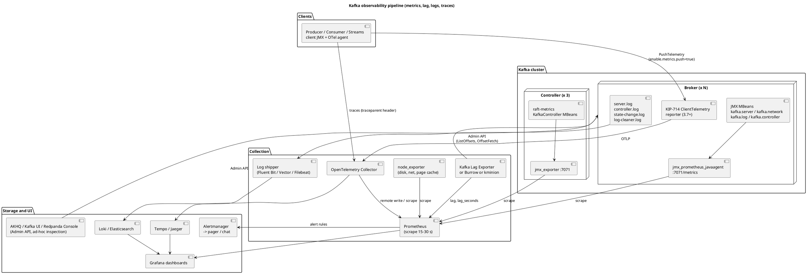
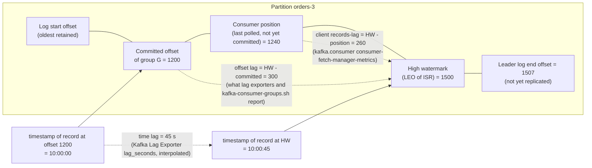
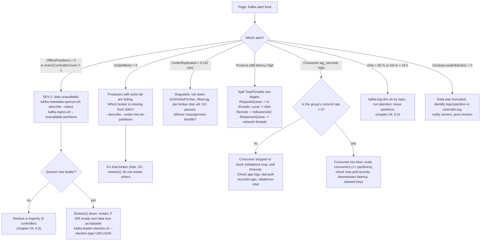

# Monitoring and Observability

**Roles:** [ADMIN] [ARCH] [DEV]   **Level:** Intermediate
**Prerequisites:** `03-admin/01-installation-and-deployment.md`, `03-admin/04-cluster-operations.md`, `01-architecture/` chapters on replication and consumer groups.

## What you will learn
- How Kafka metrics get from JMX MBeans into Prometheus and Grafana, and which alternatives exist.
- The broker, controller, JVM, OS and client metrics that matter, with exact MBean names and alert thresholds.
- Why consumer lag in messages is not enough and how to measure lag in seconds.
- What to look for in `server.log`, `controller.log`, `state-change.log` and `log-cleaner.log`.
- How to trace a record end to end with OpenTelemetry and how KIP-714 pushes client metrics into the broker.
- A Prometheus alert rule set, a Grafana dashboard layout and SLO definitions you can adopt.

## 1. Concept

Kafka exposes almost everything through JMX. Brokers register Yammer-style MBeans (`kafka.server:type=...`, `kafka.network:...`, `kafka.log:...`, `kafka.controller:...`) and Kafka-metrics-style MBeans (`kafka.server:type=raft-metrics`, `kafka.server:type=socket-server-metrics`, client metrics). Nothing is pushed by default; a collector has to read them. The standard pipeline is JMX -> Prometheus JMX exporter (a Java agent inside the broker JVM) -> Prometheus -> Grafana + Alertmanager, with consumer lag computed by a separate exporter because lag is a *derived* quantity (log end offset minus committed offset) that no broker MBean reports for external groups.

### 1.1 Pipeline



Source: `diagrams/admin-05-monitoring-and-observability-pipeline.puml`.

### 1.2 Tool landscape

| Tool | Role | Notes |
|------|------|-------|
| Prometheus JMX exporter + Prometheus + Grafana | Metrics (open source default) | Java agent `jmx_prometheus_javaagent.jar` in `KAFKA_OPTS`; Strimzi ships ready-made rules and dashboards |
| Kafka Lag Exporter (seglo) | Consumer lag in offsets and *seconds* per group/partition | Interpolates offset timestamps; runs outside the brokers |
| Burrow (LinkedIn) | Lag *evaluation* (OK/WARN/ERR/STALL/STOP) from commit history | HTTP API, no thresholds to tune; combine with a Prometheus exporter |
| kminion (Redpanda) | Lag, topic sizes, end-to-end produce/consume probe | Single binary, Prometheus native |
| Cruise Control | Load metrics per broker/partition (own metrics reporter topic) | Also a balancing engine, see chapter 03 |
| Datadog / New Relic / Dynatrace | Agents with built-in Kafka JMX integrations | Commercial; convenient for teams already on them |
| Confluent Control Center (Confluent-specific) | Cluster, topic, consumer lag and Connect/ksqlDB UI | Requires Confluent Platform; uses Confluent metrics reporter |
| AKHQ, Kafka UI (kafbat), Redpanda Console | Ad-hoc inspection: topics, messages, groups, ACLs, schemas | Not a monitoring system; no history |
| OpenTelemetry (agent + collector) | Traces across producer -> broker -> consumer, client metrics | Header propagation in records |

## 2. How it works internally

### 2.1 Where produce latency goes

`kafka.network:type=RequestMetrics,name=TotalTimeMs,request=Produce` is the sum of stages, each with its own MBean of the same shape:

| Stage MBean (`name=`) | Meaning | High value means |
|-----------------------|---------|------------------|
| `RequestQueueTimeMs` | Waiting in the request queue for an I/O thread | `num.io.threads` saturated (`RequestHandlerAvgIdlePercent` low) |
| `LocalTimeMs` | Leader appending to its log | Slow disk, page cache pressure, lock contention |
| `RemoteTimeMs` | Waiting in purgatory for followers (`acks=all`) or for `fetch.min.bytes` (consumers) | Slow follower, cross-AZ replication, `replica.fetch.wait.max.ms` |
| `ThrottleTimeMs` | Quota throttling | Quota hit |
| `ResponseQueueTimeMs` | Waiting for a network thread to send | `num.network.threads` saturated |
| `ResponseSendTimeMs` | Writing the response to the socket | Slow client, small socket buffers, TLS |

For consumers the request name is `FetchConsumer`; for replication `FetchFollower`. Each has `Count`, `Mean`, `50thPercentile`, `95thPercentile`, `99thPercentile`, `999thPercentile` attributes.

### 2.2 Lag anatomy



Three numbers, three meanings:

- **Offset lag** (`LOG-END-OFFSET - CURRENT-OFFSET` in `kafka-consumer-groups.sh`) counts records not yet *committed*. It depends on commit frequency: a consumer with `auto.commit.interval.ms=5000` shows saw-tooth lag even when it is keeping up.
- **Client-side `records-lag`** (`kafka.consumer:type=consumer-fetch-manager-metrics,client-id=...,topic=...,partition=...`) counts records not yet *fetched*, updated every poll. It is only visible if the consumer application exports its metrics.
- **Time lag** (seconds): the age of the oldest unprocessed record, estimated from record timestamps. It answers the question the business asks ("how stale is the dashboard?") and is comparable across topics with different throughput. 100 000 messages behind on a 50 000 msg/s topic is 2 seconds; on a 10 msg/s topic it is 3 hours.

Burrow avoids thresholds entirely: it stores the last N committed offsets per partition (default window 10) and evaluates trends. Rules: lag hit zero at any point in the window -> `OK`; committed offset not moving while lag > 0 -> `STALL`; commits stopped and lag > 0 -> `STOP`; lag increasing at every point -> `WARN` (partition) which escalates the group to `ERR`; no commits recently -> `NOTFOUND`. The status is served at `GET /v3/kafka/<cluster>/consumer/<group>/lag`.

### 2.3 Alert triage



## 3. Configuration that matters

### 3.1 Essential broker and controller metrics

Names are the JMX object names; the Prometheus names in the alert rules below follow the exporter rules in section 6.1.

| MBean | Type | Healthy | Alert | Meaning |
|-------|------|---------|-------|---------|
| `kafka.server:type=ReplicaManager,name=UnderReplicatedPartitions` | Gauge | 0 | > 0 for 10 min (warning), > 0 for 30 min (critical) | Partitions with fewer in-sync replicas than RF |
| `kafka.controller:type=KafkaController,name=OfflinePartitionsCount` | Gauge | 0 | > 0 for 1 min (critical) | Partitions with no leader; unavailable |
| `kafka.controller:type=KafkaController,name=ActiveControllerCount` | Gauge | sum over controllers = 1 | != 1 for 1 min (critical) | Exactly one active controller |
| `kafka.server:type=ReplicaManager,name=UnderMinIsrPartitionCount` | Gauge | 0 | > 0 for 2 min (critical) | Partitions below `min.insync.replicas`; `acks=all` writes fail |
| `kafka.server:type=ReplicaManager,name=AtMinIsrPartitionCount` | Gauge | 0 | > 0 for 15 min (warning) | One more failure causes write outage |
| `kafka.server:type=KafkaRequestHandlerPool,name=RequestHandlerAvgIdlePercent` | Meter (0-1) | > 0.5 | < 0.3 for 10 min (warning), < 0.1 (critical) | I/O thread pool saturation |
| `kafka.network:type=SocketServer,name=NetworkProcessorAvgIdlePercent` | Gauge (0-1) | > 0.5 | < 0.3 for 10 min | Network thread saturation |
| `kafka.network:type=RequestChannel,name=RequestQueueSize` | Gauge | near 0 | > 100 sustained | Requests waiting for I/O threads (`queued.max.requests` cap) |
| `kafka.network:type=RequestChannel,name=ResponseQueueSize` | Gauge | near 0 | > 100 sustained | Responses waiting for network threads |
| `kafka.server:type=BrokerTopicMetrics,name=BytesInPerSec` (optionally `,topic=`) | Meter | trend | > 70 % of NIC or capacity plan | Ingress |
| `kafka.server:type=BrokerTopicMetrics,name=BytesOutPerSec` | Meter | trend | same | Egress to consumers (excludes replication) |
| `kafka.server:type=BrokerTopicMetrics,name=ReplicationBytesInPerSec` / `ReplicationBytesOutPerSec` | Meter | trend | | Replication traffic |
| `kafka.server:type=BrokerTopicMetrics,name=MessagesInPerSec` | Meter | trend | drop to 0 on a busy topic | Records per second |
| `kafka.server:type=BrokerTopicMetrics,name=FailedProduceRequestsPerSec` / `FailedFetchRequestsPerSec` | Meter | 0 | > 0 sustained | Errors returned to clients |
| `kafka.server:type=BrokerTopicMetrics,name=BytesRejectedPerSec` | Meter | 0 | > 0 | Records over `message.max.bytes` |
| `kafka.network:type=RequestMetrics,name=TotalTimeMs,request=Produce` (`99thPercentile`) | Histogram | tens of ms with `acks=all` in-region | > 500 ms for 10 min | Produce latency, broker-side |
| `...request=FetchConsumer` (`99thPercentile`) | Histogram | ~`fetch.max.wait.ms` when idle | > 1000 ms + `fetch.max.wait.ms` | Consumer fetch latency (idle consumers inflate it by design) |
| `...request=FetchFollower` (`99thPercentile`) | Histogram | ~`replica.fetch.wait.max.ms` | sudden rise | Replication fetch latency |
| `kafka.log:type=LogFlushStats,name=LogFlushRateAndTimeMs` | Timer | p99 < 50 ms | p99 > 200 ms | Disk flush latency (segment roll / forced flush) |
| `kafka.server:type=ReplicaManager,name=IsrShrinksPerSec` / `IsrExpandsPerSec` | Meter | 0 | > 0 outside maintenance | ISR churn; a shrink without a matching expand is a lost replica |
| `kafka.controller:type=ControllerStats,name=LeaderElectionRateAndTimeMs` | Timer | 0 outside maintenance | > 0 | Leader elections (broker failures, restarts) |
| `kafka.controller:type=ControllerStats,name=UncleanLeaderElectionsPerSec` | Meter | 0 | > 0 (critical) | Data loss event |
| `kafka.server:type=ReplicaManager,name=PartitionCount` | Gauge | balanced across brokers | > 4000 (review) | Replicas hosted |
| `kafka.server:type=ReplicaManager,name=LeaderCount` | Gauge | balanced | one broker > 1.5x average | Leader imbalance |
| `kafka.server:type=ReplicaFetcherManager,name=MaxLag,clientId=Replica` | Gauge | small | growing | Max follower lag in messages on this broker |
| `kafka.log:type=Log,name=LogEndOffset,topic=*,partition=*` / `LogStartOffset` | Gauge | trend | flat on an active topic | Per-partition offsets (cardinality: enable per topic only) |
| `kafka.log:type=Log,name=Size,topic=*,partition=*` | Gauge | trend | sum per disk > 80 % | Bytes on disk per partition |
| `kafka.server:type=DelayedOperationPurgatory,name=PurgatorySize,delayedOperation=Produce` | Gauge | small | growing | `acks=all` requests waiting for followers |
| `kafka.server:type=DelayedOperationPurgatory,name=PurgatorySize,delayedOperation=Fetch` | Gauge | = idle consumers/followers | sudden jump | Fetches waiting for `fetch.min.bytes` |
| `kafka.log:type=LogManager,name=OfflineLogDirectoryCount` | Gauge | 0 | > 0 (critical) | Failed disk (JBOD) |
| `kafka.log:type=LogCleaner,name=DeadThreadCount` | Gauge | 0 | > 0 | Compaction thread died |
| `kafka.log:type=LogCleanerManager,name=uncleanable-partitions-count` / `max-dirty-percent` | Gauge | 0 / < 50 | > 0 / > 80 | Compaction backlog |
| `kafka.server:type=socket-server-metrics,listener=*,networkProcessor=*` `connection-count` / `connection-creation-rate` | Gauge | trend | near `max.connections`; creation rate spikes | Connection storms (clients reconnecting) |
| `kafka.server:type=group-coordinator-metrics` (`num-groups`, per-state counts; 4.0) / `kafka.coordinator.group:type=GroupMetadataManager,name=NumGroups`,`NumOffsets` (3.x) | Gauge | trend | runaway growth | Group count |

Controller / KRaft specific:

| MBean | Healthy | Alert | Meaning |
|-------|---------|-------|---------|
| `kafka.controller:type=KafkaController,name=MetadataErrorCount` | 0 | > 0 (critical) | Controller or broker hit an error applying metadata; investigate before anything else |
| `kafka.controller:type=KafkaController,name=FencedBrokerCount` | 0 | > 0 for 5 min | Brokers registered but fenced (stopped heartbeating or catching up) |
| `kafka.controller:type=KafkaController,name=ActiveBrokerCount` | = fleet size | < expected | Registered and unfenced brokers |
| `kafka.controller:type=KafkaController,name=GlobalTopicCount` / `GlobalPartitionCount` | trend | jump | Capacity |
| `kafka.controller:type=KafkaController,name=LastAppliedRecordLagMs` | < 1000 | > 5000 | Standby controller lag behind leader |
| `kafka.server:type=raft-metrics,name=current-state` | `leader` on one, `follower` on others | `candidate`/`unattached` for > 30 s | Raft role of this node |
| `kafka.server:type=raft-metrics,name=current-leader` | same id on all voters | -1 | Leader as seen by this node |
| `kafka.server:type=raft-metrics,name=current-epoch` | stable | frequent increments | Elections happening |
| `kafka.server:type=raft-metrics,name=high-watermark` | increasing | flat for > 30 s while `log-end-offset` grows | Quorum cannot commit |
| `kafka.server:type=raft-metrics,name=log-end-offset` | increasing | | |
| `kafka.server:type=raft-metrics,name=commit-latency-avg` / `commit-latency-max` | few ms | > 100 ms | Metadata fsync + replication latency |
| `kafka.server:type=raft-metrics,name=election-latency-avg` | | | Time to elect |
| `kafka.server:type=raft-metrics,name=number-of-voters` / `number-of-observers` | 3 / N brokers | fewer | Membership |
| `kafka.server:type=broker-metadata-metrics,name=last-applied-record-lag-ms` (brokers) | < 1000 | > 5000 | Broker behind on metadata |
| `kafka.server:type=broker-metadata-metrics,name=metadata-load-error-count` / `metadata-apply-error-count` | 0 | > 0 | Broker could not apply metadata |

### 3.2 JVM and OS

| Metric | Source | Alert | Why |
|--------|--------|-------|-----|
| `java.lang:type=GarbageCollector,name=G1 Young Generation` `CollectionTime` (rate), `G1 Old Generation` `CollectionCount` | JMX | old-gen collections > 0/min; young GC time > 5 % of wall clock | Pauses cause ISR shrinks and client timeouts |
| `java.lang:type=Memory` `HeapMemoryUsage.used` after GC | JMX | > 85 % of `-Xmx` sustained | Heap too small or leak (e.g. huge fetch responses) |
| `java.lang:type=OperatingSystem` `OpenFileDescriptorCount` / `MaxFileDescriptorCount` | JMX | > 80 % | Segments + sockets |
| `java.lang:type=Threading` `ThreadCount` | JMX | trend | |
| Disk utilisation, await, queue depth (`node_disk_io_time_seconds_total`, `node_disk_read/write_time_seconds_total`) | node_exporter | util > 80 %, await > 20 ms on SSD | Disk-bound broker |
| Filesystem free (`node_filesystem_avail_bytes{mountpoint="/data/kafka"}`) | node_exporter | < 20 % or full within 24 h (`predict_linear`) | Full disk stops the broker |
| Page cache (`node_memory_Cached_bytes`), major page faults (`node_vmstat_pgmajfault`) | node_exporter | cache shrinking, faults rising | Reads missing cache = consumers reading old data or heap too large |
| Network (`node_network_transmit_bytes_total`, `node_network_receive_bytes_total`, errors/drops) | node_exporter | > 70 % of link, any drops | Replication + client traffic saturation |
| CPU steal / iowait | node_exporter | steal > 5 %, iowait > 20 % | Noisy neighbour, disk-bound |
| Clock offset (`node_timex_offset_seconds`) | node_exporter | > 100 ms | Timestamp-based retention and TLS |

### 3.3 Client metrics

Producer (`kafka.producer:type=producer-metrics,client-id=*` and `producer-topic-metrics`):

| Metric | Watch for | Meaning |
|--------|-----------|---------|
| `record-send-rate`, `record-error-rate`, `record-retry-rate` | errors/retries > 0 | Delivery health |
| `request-latency-avg` / `-max` | rising | Broker round-trip incl. `acks` wait |
| `record-queue-time-avg` | rising | Time in the accumulator: `linger.ms` or broker backpressure |
| `batch-size-avg`, `records-per-request-avg`, `compression-rate-avg` | small batches | Batching efficiency; tune `linger.ms`, `batch.size` |
| `buffer-available-bytes`, `bufferpool-wait-ratio`, `waiting-threads` | wait ratio > 0 | `buffer.memory` exhausted; `send()` blocks up to `max.block.ms` |
| `produce-throttle-time-avg` | > 0 | Quota throttling |
| `outgoing-byte-rate` | | Throughput |

Consumer (`kafka.consumer:type=consumer-fetch-manager-metrics`, `consumer-coordinator-metrics`, `consumer-metrics`):

| Metric | Watch for | Meaning |
|--------|-----------|---------|
| `records-lag-max`, `records-lag` (per partition) | growing | Fetch-side lag |
| `records-consumed-rate`, `bytes-consumed-rate`, `fetch-rate`, `fetch-latency-avg`, `fetch-size-avg` | drops | Consumption throughput |
| `commit-rate`, `commit-latency-avg` | rate 0 with lag | Commits stopped |
| `rebalance-total`, `failed-rebalance-total`, `rebalance-latency-avg`, `last-rebalance-seconds-ago` | frequent rebalances | Membership churn (`session.timeout.ms`, `max.poll.interval.ms`, deploys) |
| `last-poll-seconds-ago`, `time-between-poll-avg`, `poll-idle-ratio-avg` | approaching `max.poll.interval.ms` | Slow processing; consumer will be kicked out |
| `heartbeat-rate`, `heartbeat-response-time-max` | | Coordinator health |
| `assigned-partitions` | 0 on a running instance | Not participating |

Streams adds `kafka.streams:type=stream-thread-metrics` (`process-rate`, `process-latency-avg`, `commit-latency-avg`, `punctuate-latency-avg`), `stream-task-metrics` (`record-lateness-avg`, `dropped-records-total`) and state store metrics.

### 3.4 KIP-714 client metrics push (Kafka 3.7+)

Clients (Java 3.7+, librdkafka 2.4+) push their metrics to the broker over the Kafka protocol (`GetTelemetrySubscriptions` / `PushTelemetry`), so the platform team sees client-side latency, retries and lag without access to the application's JMX. Requirements:

- Broker: a `metric.reporters` entry whose class implements `org.apache.kafka.server.telemetry.ClientTelemetry` (Kafka ships the interface, not a reporter; use an OpenTelemetry-based reporter or a vendor one).
- Client: `enable.metrics.push=true` (default).
- A subscription created with `kafka-client-metrics.sh`.

```bash
BS=broker-1.example.com:9092
# subscribe all Java producers/consumers, 30 s interval, producer and consumer metrics
/opt/kafka/bin/kafka-client-metrics.sh --bootstrap-server $BS --alter --name java-clients \
  --metrics org.apache.kafka.producer.,org.apache.kafka.consumer. \
  --interval 30000 \
  --match client_software_name=apache-kafka-java
/opt/kafka/bin/kafka-client-metrics.sh --bootstrap-server $BS --list
/opt/kafka/bin/kafka-client-metrics.sh --bootstrap-server $BS --describe --name java-clients
/opt/kafka/bin/kafka-client-metrics.sh --bootstrap-server $BS --delete --name java-clients
```

Match keys include `client_id`, `client_instance_id`, `client_software_name`, `client_software_version`, `client_source_address`, `client_source_port`. The client's instance id can be read with `KafkaProducer#clientInstanceId(Duration)` to correlate.

### 3.5 Distributed tracing with OpenTelemetry

- Context propagates in record headers (`traceparent`, `tracestate` per W3C Trace Context, plus `baggage`). The OpenTelemetry Java agent instruments `KafkaProducer`/`KafkaConsumer` automatically: a `PRODUCER` span `<topic> publish` on `send()`, a `CONSUMER` span `<topic> receive`/`process` around `poll()`/record iteration, linked by the header. Kafka Streams and Spring Kafka instrumentations exist; Connect can run the agent too.
- Without the agent, use interceptors: `interceptor.classes=io.opentelemetry.instrumentation.kafkaclients.v2_6.TracingProducerInterceptor` and `...TracingConsumerInterceptor` (artifact `opentelemetry-kafka-clients-2.6`), plus `OpenTelemetry` initialised in the app.
- Brokers themselves are not traced; the broker-side portion appears as time inside the producer span. Combine traces with `TotalTimeMs` stages for the broker view.
- Sampling: head-based sampling at 1-10 % is usual; keep 100 % for error spans. Header size adds ~60 bytes per record.

> **Production tip:** Put the trace id into the application log line that processes each record; correlation between logs, lag and traces is what makes an incident debuggable, not any of them alone.

### 3.6 Log files

Location `LOG_DIR` (`/var/log/kafka`), configured by `config/log4j.properties` (3.9) or `config/log4j2.yaml` (4.0, Log4j 2).

| File | Content | Lines to alert or grep on |
|------|---------|---------------------------|
| `server.log` | Everything at INFO on the broker | `Shrinking ISR`, `Expanding ISR`, `Truncating`, `Recovering unflushed segment`, `Loading producer state`, `Error while appending records`, `IOException`, `Disconnecting from node`, `Too many open files`, `Fenced`, `NotEnoughReplicasException`, `Rolled new log segment` (volume) |
| `controller.log` | Controller and Raft events (on controllers; brokers log the client side) | `Becoming the active controller`, `Registered new broker`, `Fencing broker`, `Unfenced broker`, `Elected as leader`, `election`, `MetadataErrorCount`, `Unable to elect a leader for ... (unclean election disabled)` |
| `state-change.log` | Per-partition leader/ISR transitions | `become-leader`, `become-follower`, `Truncating partition` bursts = leader storms |
| `log-cleaner.log` | Compaction runs and errors | `Log cleaner thread ... died`, `uncleanable`, `Corrupt`, `Beginning cleaning of log` / `Log cleaner thread ... cleaned log` (ratios, buffer utilisation) |
| `kafka-authorizer.log` | ACL denials (DEBUG in `log4j.properties` `log4j.logger.kafka.authorizer.logger=INFO`) | `Principal = User:x is Denied Operation = Write` |
| `kafka-request.log` | Every request (DEBUG only; never in production except short debugging) | |
| `kafkaServer-gc.log` | JVM GC | `Pause Full`, pauses > 1 s |

Ship logs with a structured parser (timestamp, level, logger, thread) and alert on `ERROR` rate per broker and on the specific strings above.

## 4. Failure modes and how to detect them

| Symptom | Likely cause | Metric / log to check | Fix |
|---------|--------------|-----------------------|-----|
| Prometheus shows no Kafka metrics after restart | JMX exporter agent not loaded (`KAFKA_OPTS` lost), port conflict | `curl broker:7071/metrics`, `server.log` startup line lists JVM args | Fix unit file; one agent port per JVM |
| Exporter scrape takes > 10 s, broker CPU up | Per-partition MBeans (`kafka.log:type=Log`) on a broker with 10k partitions | scrape duration in Prometheus | Restrict `whitelistObjectNames` or drop per-partition rules; use `kafka-log-dirs.sh` for sizes |
| Lag dashboard flat at 0 while consumers are behind | Lag exporter cannot see the group (ACL missing `Describe` on group) or measures a different cluster | exporter logs | Grant `--operation Describe --group '*'` to the exporter principal |
| Lag saw-tooth every 5 s | Auto-commit interval, not real lag | client `records-lag` vs group offset lag | Alert on time lag with a `for:` clause |
| p99 `FetchConsumer` = 500 ms on an idle cluster | `fetch.max.wait.ms` long-poll; not a problem | `RemoteTimeMs` = wait time | Alert on Produce latency; treat fetch latency relative to `fetch.max.wait.ms` |
| `ActiveControllerCount` sum = 0 or 2 | Scraping brokers instead of controllers; or a partitioned quorum | which targets report it | Scrape controllers; check quorum |
| Alerts flap during rolling restarts | No maintenance silence | Alertmanager | Silence with matchers per cluster during change windows |
| `UnderReplicatedPartitions` high on one broker only | That broker is the slow *follower* (metric is reported by the leader) - or leader of partitions whose followers are slow | `MaxLag` on each broker, `IsrShrinksPerSec` | Correlate with per-broker disk/GC |

## 5. Design guidance (architect view)

### 5.1 SLOs

| SLO | SLI (how measured) | Target (indicative, single region) |
|-----|--------------------|-------------------------------------|
| Produce availability | 1 - (failed produce requests / total) from broker `FailedProduceRequestsPerSec` / `TotalProduceRequestsPerSec`, and from producer `record-error-rate`; per 5-min window, over 30 days | 99.95 % of windows with error ratio < 0.1 % |
| Produce latency | Producer-side `request-latency` p99 (or broker `TotalTimeMs,request=Produce` p99) per 5-min window | p99 < 50 ms (`acks=all`, in-region) in 99 % of windows |
| End-to-end latency | Probe: produce a timestamped record, consume it, measure age (kminion `end_to_end` probe or own canary) | p99 < 1 s in 99 % of windows |
| Consumer freshness (per tier-1 consumer group) | Time lag (`kafka_consumergroup_group_lag_seconds`) | < 60 s in 99.9 % of windows |
| Controller availability | `ActiveControllerCount` sum = 1 | 99.99 % |
| Partition availability | `OfflinePartitionsCount` = 0 | 99.99 % |

Error budgets drive when to stop rolling changes: if the produce-availability budget for the month is 50 % consumed, structural changes wait.

### 5.2 Grafana dashboard layout

1. **Cluster overview** (one row of stats): active controller, offline partitions, URP, under-min-ISR, active/fenced brokers, total partitions, bytes in/out, messages in, consumer groups.
2. **Broker health** (one panel per metric, one line per broker): request handler idle %, network idle %, request/response queue size, produce/fetch p99, ISR shrinks/expands, leader count, partition count, connection count.
3. **Throughput** (per broker and per topic top-N): bytes in/out, messages in, replication bytes, rejected bytes, failed requests.
4. **Latency breakdown**: `TotalTimeMs` stages for Produce, FetchConsumer, FetchFollower at p50/p99.
5. **Storage**: disk usage per broker/log dir, `predict_linear` days-until-full, largest topics, segment count, log flush p99.
6. **Controller / KRaft**: raft state per controller, epoch, high-watermark vs log-end-offset, commit latency, metadata error count, last-applied lag on brokers.
7. **JVM / OS**: heap after GC, GC pause time, open FDs, page cache size, disk await, NIC utilisation, CPU.
8. **Consumers**: lag (offsets) and lag (seconds) per group, commit rate, rebalances, members; Burrow status table.
9. **Producers** (if client metrics are collected): send rate, error/retry rate, batch size, buffer wait, throttle time.
10. **Compaction**: dirty %, uncleanable partitions, cleaner dead threads, `__consumer_offsets` size.

Use template variables `cluster`, `broker`, `topic`, `group`; every panel carries the alert threshold as a dashed line.

### 5.3 What to avoid

> **Anti-pattern:** Alerting on offset lag with a fixed number ("lag > 10 000"). It pages for a fast topic during normal bursts and stays silent for a slow topic that is hours behind. Alert on time lag, or on Burrow status, with a `for:` duration.

> **Anti-pattern:** Exporting every per-partition MBean from every broker. Cardinality explodes (partitions x brokers x metrics), scrapes time out, and the exporter's JMX walk itself costs broker CPU. Whitelist what you need; get sizes from `kafka-log-dirs.sh` or a lag exporter's `kafka_partition_latest_offset`.

## 6. Hands-on

### 6.1 jmx_exporter configuration (`/opt/jmx_exporter/kafka.yml`)

Loaded by `KAFKA_OPTS=-javaagent:/opt/jmx_exporter/jmx_prometheus_javaagent.jar=7071:/opt/jmx_exporter/kafka.yml` (see chapter 01 unit file). Abridged from the Strimzi/Prometheus community rules:

```yaml
lowercaseOutputName: true
lowercaseOutputLabelNames: true
whitelistObjectNames:
  - "kafka.server:type=ReplicaManager,name=*"
  - "kafka.server:type=KafkaRequestHandlerPool,name=*"
  - "kafka.server:type=BrokerTopicMetrics,name=*"
  - "kafka.server:type=BrokerTopicMetrics,name=*,topic=*"
  - "kafka.server:type=ReplicaFetcherManager,name=*,clientId=*"
  - "kafka.server:type=DelayedOperationPurgatory,name=*,delayedOperation=*"
  - "kafka.server:type=raft-metrics,*"
  - "kafka.server:type=broker-metadata-metrics,*"
  - "kafka.server:type=socket-server-metrics,*"
  - "kafka.server:type=group-coordinator-metrics,*"
  - "kafka.network:type=SocketServer,name=*"
  - "kafka.network:type=RequestChannel,name=*"
  - "kafka.network:type=RequestMetrics,name=*,request=*"
  - "kafka.controller:type=KafkaController,name=*"
  - "kafka.controller:type=ControllerStats,name=*"
  - "kafka.log:type=LogFlushStats,name=*"
  - "kafka.log:type=LogManager,name=*"
  - "kafka.log:type=LogCleaner,name=*"
  - "kafka.log:type=LogCleanerManager,name=*"
  - "kafka.coordinator.group:type=GroupMetadataManager,name=*"
  - "java.lang:type=GarbageCollector,name=*"
  - "java.lang:type=Memory"
  - "java.lang:type=OperatingSystem"
rules:
  # Kafka-metrics style MBeans (raft, broker-metadata, socket-server, coordinator): kafka.server<type=raft-metrics><>high-watermark
  - pattern: kafka.server<type=(raft-metrics|broker-metadata-metrics|group-coordinator-metrics)><>([a-z-]+)
    name: kafka_server_$1_$2
    type: GAUGE
  - pattern: kafka.server<type=socket-server-metrics, listener=(.+), networkProcessor=(.+)><>(connection-count|connection-creation-rate|connection-close-rate)
    name: kafka_server_socket_server_metrics_$3
    type: GAUGE
    labels:
      listener: "$1"
      networkProcessor: "$2"
  # Request latency percentiles: kafka.network<type=RequestMetrics, name=TotalTimeMs, request=Produce><>99thPercentile
  - pattern: kafka.network<type=RequestMetrics, name=(.+), request=(.+)><>(\d+)thPercentile
    name: kafka_network_requestmetrics_$1
    type: GAUGE
    labels:
      request: "$2"
      quantile: "0.$3"
  - pattern: kafka.network<type=RequestMetrics, name=(.+), request=(.+)><>Count
    name: kafka_network_requestmetrics_$1_total
    type: COUNTER
    labels:
      request: "$2"
  # Per-topic meters -> counters: kafka.server<type=BrokerTopicMetrics, name=BytesInPerSec, topic=orders><>Count
  - pattern: kafka.server<type=BrokerTopicMetrics, name=(BytesInPerSec|BytesOutPerSec|MessagesInPerSec|FailedProduceRequestsPerSec|FailedFetchRequestsPerSec|BytesRejectedPerSec), topic=(.+)><>Count
    name: kafka_server_brokertopicmetrics_$1_total
    type: COUNTER
    labels:
      topic: "$2"
  - pattern: kafka.server<type=BrokerTopicMetrics, name=(.+)><>Count
    name: kafka_server_brokertopicmetrics_$1_total
    type: COUNTER
  # Meters exposed as rates (idle percent is a Meter whose OneMinuteRate is the useful value)
  - pattern: kafka.server<type=KafkaRequestHandlerPool, name=RequestHandlerAvgIdlePercent><>OneMinuteRate
    name: kafka_server_kafkarequesthandlerpool_requesthandleravgidlepercent_oneminuterate
    type: GAUGE
  # Timers: LogFlushRateAndTimeMs, LeaderElectionRateAndTimeMs
  - pattern: kafka.(\w+)<type=(.+), name=(.+)><>(\d+)thPercentile
    name: kafka_$1_$2_$3
    type: GAUGE
    labels:
      quantile: "0.$4"
  - pattern: kafka.(\w+)<type=(.+), name=(.+), clientId=(.+)><>Value
    name: kafka_$1_$2_$3
    type: GAUGE
    labels:
      clientId: "$4"
  - pattern: kafka.(\w+)<type=(.+), name=(.+), delayedOperation=(.+)><>Value
    name: kafka_$1_$2_$3
    type: GAUGE
    labels:
      delayedOperation: "$4"
  # Generic gauges and counters: kafka.server<type=ReplicaManager, name=UnderReplicatedPartitions><>Value
  - pattern: kafka.(\w+)<type=(.+), name=(.+)><>Value
    name: kafka_$1_$2_$3
    type: GAUGE
  - pattern: kafka.(\w+)<type=(.+), name=(.+)><>Count
    name: kafka_$1_$2_$3_total
    type: COUNTER
  # JVM
  - pattern: java.lang<type=GarbageCollector, name=(.+)><>(CollectionCount|CollectionTime)
    name: jvm_gc_$2
    type: COUNTER
    labels:
      gc: "$1"
  - pattern: java.lang<type=Memory><HeapMemoryUsage>(used|committed|max)
    name: jvm_memory_heap_$1_bytes
    type: GAUGE
  - pattern: java.lang<type=OperatingSystem><>(OpenFileDescriptorCount|MaxFileDescriptorCount|SystemCpuLoad|ProcessCpuLoad)
    name: jvm_os_$1
    type: GAUGE
```

Quick check:

```bash
curl -s broker-1.example.com:7071/metrics | grep -E '^kafka_(server_replicamanager_underreplicatedpartitions|controller_kafkacontroller_(activecontrollercount|offlinepartitionscount|metadataerrorcount)|server_raft_metrics_high_watermark)'
```

### 6.2 Prometheus scrape and lag exporter

```yaml
# prometheus.yml (excerpt)
scrape_configs:
  - job_name: kafka-broker
    scrape_interval: 30s
    static_configs:
      - targets: ["broker-1.example.com:7071","broker-2.example.com:7071","broker-3.example.com:7071"]
        labels: { cluster: prod-eu1 }
  - job_name: kafka-controller
    scrape_interval: 15s
    static_configs:
      - targets: ["controller-0.kafka.internal:7071","controller-1.kafka.internal:7071","controller-2.kafka.internal:7071"]
        labels: { cluster: prod-eu1 }
  - job_name: kafka-lag-exporter
    static_configs:
      - targets: ["kafka-lag-exporter.kafka.internal:8000"]
        labels: { cluster: prod-eu1 }
  - job_name: node
    static_configs:
      - targets: ["broker-1.example.com:9100","broker-2.example.com:9100","broker-3.example.com:9100"]
```

Kafka Lag Exporter (`application.conf`):

```hocon
kafka-lag-exporter {
  poll-interval = 30 seconds
  lookup-table-size = 120
  clusters = [
    {
      name = "prod-eu1"
      bootstrap-brokers = "broker-1.example.com:9092,broker-2.example.com:9092"
      group-whitelist = [".*"]
      topic-whitelist = [".*"]
      consumer-properties = {
        security.protocol = "SASL_SSL"
        sasl.mechanism = "SCRAM-SHA-512"
        sasl.jaas.config = "org.apache.kafka.common.security.scram.ScramLoginModule required username=\"lag-exporter\" password=\"changeit\";"
      }
      admin-client-properties = ${kafka-lag-exporter.clusters.0.consumer-properties}
    }
  ]
}
```

It needs `Describe` on all groups and topics (`kafka-acls.sh --bootstrap-server $BS --add --allow-principal User:lag-exporter --operation Describe --group '*' --topic '*'`). Exported series: `kafka_consumergroup_group_lag`, `kafka_consumergroup_group_lag_seconds`, `kafka_consumergroup_group_max_lag`, `kafka_consumergroup_group_max_lag_seconds`, `kafka_consumergroup_group_offset`, `kafka_partition_latest_offset`, `kafka_partition_earliest_offset`.

Lag from the CLI for a quick look:

```bash
/opt/kafka/bin/kafka-consumer-groups.sh --bootstrap-server $BS --describe --group invoice-mailer
/opt/kafka/bin/kafka-consumer-groups.sh --bootstrap-server $BS --describe --all-groups | awk 'NR>1 && $6 ~ /^[0-9]+$/ && $6 > 10000'
```

### 6.3 Alert rules (Prometheus, top alerts)

```yaml
groups:
  - name: kafka-critical
    rules:
      - alert: KafkaOfflinePartitions
        expr: sum by (cluster) (kafka_controller_kafkacontroller_offlinepartitionscount) > 0
        for: 1m
        labels: { severity: critical }
        annotations:
          summary: "{{ $labels.cluster }}: {{ $value }} partitions have no leader"
          runbook: "RB-kafka-offline-partitions"

      - alert: KafkaActiveControllerNotOne
        expr: sum by (cluster) (kafka_controller_kafkacontroller_activecontrollercount{job="kafka-controller"}) != 1
        for: 1m
        labels: { severity: critical }
        annotations:
          summary: "{{ $labels.cluster }}: active controller count is {{ $value }}"

      - alert: KafkaUnderMinIsr
        expr: sum by (cluster) (kafka_server_replicamanager_underminisrpartitioncount) > 0
        for: 2m
        labels: { severity: critical }
        annotations:
          summary: "{{ $labels.cluster }}: {{ $value }} partitions below min.insync.replicas; acks=all producers failing"

      - alert: KafkaMetadataError
        expr: max by (cluster) (kafka_controller_kafkacontroller_metadataerrorcount) > 0
        for: 1m
        labels: { severity: critical }
        annotations:
          summary: "{{ $labels.cluster }}: controller reported metadata errors; investigate before further changes"

      - alert: KafkaUncleanLeaderElection
        expr: increase(kafka_controller_controllerstats_uncleanleaderelectionspersec_total[10m]) > 0
        labels: { severity: critical }
        annotations:
          summary: "{{ $labels.cluster }}: unclean leader election occurred (data truncated)"

      - alert: KafkaBrokerDown
        expr: up{job="kafka-broker"} == 0
        for: 2m
        labels: { severity: critical }
        annotations:
          summary: "{{ $labels.instance }} not scrapeable (broker or exporter down)"

      - alert: KafkaOfflineLogDirectory
        expr: kafka_log_logmanager_offlinelogdirectorycount > 0
        for: 1m
        labels: { severity: critical }
        annotations:
          summary: "{{ $labels.instance }}: a log directory is offline (disk failure)"

  - name: kafka-warning
    rules:
      - alert: KafkaUnderReplicatedPartitions
        expr: sum by (cluster) (kafka_server_replicamanager_underreplicatedpartitions) > 0
        for: 10m
        labels: { severity: warning }
        annotations:
          summary: "{{ $labels.cluster }}: {{ $value }} under-replicated partitions for 10m"

      - alert: KafkaRequestHandlerSaturated
        expr: kafka_server_kafkarequesthandlerpool_requesthandleravgidlepercent_oneminuterate < 0.3
        for: 10m
        labels: { severity: warning }
        annotations:
          summary: "{{ $labels.instance }}: request handler idle {{ $value | humanizePercentage }}"

      - alert: KafkaProduceLatencyHigh
        expr: kafka_network_requestmetrics_totaltimems{request="Produce",quantile="0.99"} > 500
        for: 10m
        labels: { severity: warning }
        annotations:
          summary: "{{ $labels.instance }}: produce p99 {{ $value }} ms"

      - alert: KafkaDiskFillingUp
        expr: |
          (node_filesystem_avail_bytes{mountpoint=~"/data/kafka.*"} / node_filesystem_size_bytes{mountpoint=~"/data/kafka.*"} < 0.20)
          or (predict_linear(node_filesystem_avail_bytes{mountpoint=~"/data/kafka.*"}[6h], 24*3600) < 0)
        for: 15m
        labels: { severity: warning }
        annotations:
          summary: "{{ $labels.instance }} {{ $labels.mountpoint }}: < 20% free or full within 24h"

      - alert: KafkaConsumerGroupLagSeconds
        expr: max by (cluster, group) (kafka_consumergroup_group_max_lag_seconds{group=~"tier1-.*"}) > 300
        for: 10m
        labels: { severity: warning }
        annotations:
          summary: "{{ $labels.group }} is {{ $value }} s behind"

      - alert: KafkaIsrChurn
        expr: sum by (instance) (rate(kafka_server_replicamanager_isrshrinkspersec_total[5m])) > 0
        for: 15m
        labels: { severity: warning }
        annotations:
          summary: "{{ $labels.instance }}: ISR shrinking continuously"

      - alert: KafkaLogCleanerDead
        expr: kafka_log_logcleaner_deadthreadcount > 0
        for: 5m
        labels: { severity: warning }
        annotations:
          summary: "{{ $labels.instance }}: log cleaner thread died; compaction stopped"

      - alert: KafkaRaftHighWatermarkStalled
        expr: |
          (max by (cluster) (kafka_server_raft_metrics_log_end_offset{job="kafka-controller"}) - max by (cluster) (kafka_server_raft_metrics_high_watermark{job="kafka-controller"})) > 0
          and (delta(kafka_server_raft_metrics_high_watermark{job="kafka-controller"}[2m]) == 0)
        for: 2m
        labels: { severity: critical }
        annotations:
          summary: "{{ $labels.cluster }}: metadata quorum not committing"
```

Silence during change windows:

```bash
amtool silence add cluster=prod-eu1 alertname=~"KafkaUnderReplicatedPartitions|KafkaIsrChurn|KafkaBrokerDown" \
  --duration 2h --comment "rolling restart CHG-1234" --author "$USER"
```

### 6.4 Reading a request-latency problem end to end

```bash
BS=broker-1.example.com:9092
# 1. broker side: which stage?
curl -s broker-2.example.com:7071/metrics | grep -E 'kafka_network_requestmetrics_(totaltimems|requestqueuetimems|localtimems|remotetimems|responsequeuetimems|responsesendtimems)\{request="Produce",quantile="0.99"'
# 2. is it one broker? compare TotalTimeMs across brokers in Grafana; if one, check its disk:
ssh broker-2 'iostat -xz 5 3 | grep -E "nvme|Device"'
# 3. RemoteTimeMs high with acks=all -> followers are slow: who lags?
curl -s broker-2.example.com:7071/metrics | grep kafka_server_replicafetchermanager_maxlag
/opt/kafka/bin/kafka-topics.sh --bootstrap-server $BS --describe --under-replicated-partitions
# 4. client side: producer request-latency-avg, record-queue-time-avg and bufferpool-wait-ratio (app JMX or KIP-714 push)
```

### 6.5 Log greps for an incident timeline

```bash
sudo grep -hE 'Shrinking ISR|Expanding ISR' /var/log/kafka/server.log | tail -20
sudo grep -hE 'Fencing broker|Unfenced broker|Registered new broker|Becoming the active controller|Elected as leader' /var/log/kafka/controller.log | tail -20
sudo grep -hc 'become-leader' /var/log/kafka/state-change.log     # leader storm size
sudo grep -hE 'died|uncleanable|Corrupt' /var/log/kafka/log-cleaner.log | tail
sudo grep -hE 'Pause Full|Pause Young.*[0-9]{4,}\.[0-9]+ms' /var/log/kafka/kafkaServer-gc.log | tail
```

## 7. Interview questions for this chapter

### Q1. Which five broker metrics would you page on, and at what thresholds?
**Role:** [ADMIN] | **Difficulty:** ★☆☆ | **Topic:** Alerting

**Answer.**
`kafka.controller:type=KafkaController,name=OfflinePartitionsCount` > 0 for 1 min (data unavailable); `ActiveControllerCount` summed over controllers != 1 for 1 min (no or split control plane); `kafka.server:type=ReplicaManager,name=UnderMinIsrPartitionCount` > 0 for 2 min (`acks=all` producers failing); `kafka.controller:type=KafkaController,name=MetadataErrorCount` > 0 (metadata corruption risk); disk full within 24 h by `predict_linear`. `UnderReplicatedPartitions` > 0 is a warning after 10 min because it self-heals after restarts; `UncleanLeaderElectionsPerSec` > 0 is a post-hoc critical because data was already truncated.

**Follow-up probes.** Why is `UnderReplicatedPartitions` reported by the leader, and what does that mean for locating the slow broker? Why `for:` durations?

### Q2. Why is consumer lag in messages a poor alerting signal and what do you use instead?
**Role:** [ARCH] | **Difficulty:** ★★☆ | **Topic:** Lag

**Answer.**
Offset lag mixes throughput and staleness: 100 000 records is 2 s on a 50 k msg/s topic and 3 hours on a 10 msg/s topic, so one threshold cannot fit both, and auto-commit intervals make it saw-tooth even for healthy consumers. Use time lag, the age of the oldest unconsumed record, which Kafka Lag Exporter estimates by interpolating offset/timestamp samples (`kafka_consumergroup_group_lag_seconds`), or Burrow's trend evaluation (STALL/STOP/ERR) which needs no thresholds. Pair it with the group's commit rate: lag with zero commits means the consumer is dead or rebalancing, lag with commits means it is slow. Add an end-to-end canary for the latency SLO.

**Follow-up probes.** How does the lag exporter get offsets without joining the group? (Admin API `listConsumerGroupOffsets` + `listOffsets`.) What ACL does it need?

### Q3. Produce p99 latency jumped from 20 ms to 800 ms on all brokers. How do you narrow it down using broker metrics?
**Role:** [ADMIN] | **Difficulty:** ★★☆ | **Topic:** Latency

**Answer.**
Decompose `kafka.network:type=RequestMetrics,name=TotalTimeMs,request=Produce` into its stages. `RequestQueueTimeMs` high means I/O threads are saturated (check `RequestHandlerAvgIdlePercent`, raise `num.io.threads` or find the slow disk). `LocalTimeMs` high means the leader's append is slow (disk await, page cache pressure, `LogFlushRateAndTimeMs`). `RemoteTimeMs` high with `acks=all` means followers are slow to fetch: check `ReplicaFetcherManager MaxLag`, `IsrShrinksPerSec`, cross-AZ network, or a leftover reassignment throttle. `ResponseQueueTimeMs`/`ResponseSendTimeMs` high means network threads or client-side sockets. Since all brokers moved together, suspect a shared cause: a new topic with `acks=all` and cross-AZ replicas, a throttle, a network change, or a consumer surge raising `BytesOutPerSec`.

**Follow-up probes.** Why can `FetchConsumer` p99 be high on a healthy cluster? What does `ThrottleTimeMs` indicate?

### Q4. How do you monitor the KRaft controller quorum specifically?
**Role:** [ADMIN] | **Difficulty:** ★★☆ | **Topic:** KRaft

**Answer.**
Scrape the controllers, not just brokers. Watch `kafka.server:type=raft-metrics`: `current-state` should be `leader` on exactly one voter and `follower` on the others (a `candidate` for more than a few seconds is an election problem); `current-leader` should agree everywhere; `high-watermark` must advance whenever `log-end-offset` does (a growing gap means the quorum cannot commit); `commit-latency-avg` reflects metadata fsync and replication latency; `current-epoch` increments on every election. On the controller side `kafka.controller:type=KafkaController,name=MetadataErrorCount` must stay 0, `FencedBrokerCount` shows brokers that stopped heartbeating, and `LastAppliedRecordLagMs` shows standby lag. On brokers, `kafka.server:type=broker-metadata-metrics,name=last-applied-record-lag-ms` shows how stale their metadata view is. `kafka-metadata-quorum.sh --bootstrap-server ... describe --status` is the CLI equivalent.

**Follow-up probes.** What happens to clients if the quorum is down for 10 minutes? Which metric shows a broker is fenced?

### Q5. What is KIP-714 and why would a platform team enable it?
**Role:** [ARCH] | **Difficulty:** ★★★ | **Topic:** Client metrics

**Answer.**
KIP-714 (Kafka 3.7+) lets clients push their own metrics (request latency, retries, record queue time, consumer lag, rebalance counts) to the broker over the Kafka protocol; the broker forwards them to a `metric.reporters` plugin implementing `ClientTelemetry`, typically an OpenTelemetry exporter. The platform team then sees client-side behaviour for every application without asking each team to expose JMX or deploy agents, which is where most "Kafka is slow" tickets actually originate. Subscriptions are managed with `kafka-client-metrics.sh --alter --name ... --metrics org.apache.kafka.producer.,org.apache.kafka.consumer. --interval 30000 --match client_software_name=apache-kafka-java`; clients need `enable.metrics.push=true` (default) and a 3.7+ library. Costs: broker CPU and the reporter's egress; keep intervals at 30-60 s and subscribe to metric prefixes, not everything.

**Follow-up probes.** How do you correlate a pushed metric with an application instance (`client_instance_id`)? Does it replace tracing?

### Q6. How does OpenTelemetry trace a record through Kafka when the broker is not instrumented?
**Role:** [DEV] | **Difficulty:** ★★☆ | **Topic:** Tracing

**Answer.**
The producer instrumentation creates a `PRODUCER` span around `send()` and injects the W3C `traceparent` (and `tracestate`, `baggage`) headers into the record; headers travel through the broker untouched. The consumer instrumentation extracts them in `poll()` and creates a `CONSUMER` span for receive and one per record for processing, linked to the producer span so the trace shows producer -> (queue time) -> consumer even though the broker adds no span. It is done automatically by the OpenTelemetry Java agent or explicitly with `interceptor.classes=io.opentelemetry.instrumentation.kafkaclients.v2_6.TracingProducerInterceptor` / `TracingConsumerInterceptor`. Kafka Streams keeps headers across topology steps; Connect needs the agent on workers. The broker-side latency is visible only as the gap between spans plus broker `TotalTimeMs` metrics.

**Follow-up probes.** What does the trace look like for a batch consumer that processes 500 records per poll? How do you handle traces across MirrorMaker 2?

### Q7. Design the SLOs for a Kafka platform offered to internal teams.
**Role:** [ARCH] | **Difficulty:** ★★★ | **Topic:** SLO

**Answer.**
Define SLIs the platform controls and measure them where the customer feels them. Produce availability: error ratio from `FailedProduceRequestsPerSec`/`TotalProduceRequestsPerSec` (and producer `record-error-rate` where collected) per 5-minute window, target 99.95 % of windows good. Produce latency: p99 of producer `request-latency` (fallback broker `TotalTimeMs`) < 50 ms with `acks=all` in-region, 99 % of windows. End-to-end: a canary producing and consuming a timestamped record, p99 < 1 s. Partition and controller availability: `OfflinePartitionsCount` = 0 and `ActiveControllerCount` = 1, 99.99 %. Consumer freshness is a *shared* SLO: the platform commits to delivering data, the consuming team to time lag < 60 s, measured by `kafka_consumergroup_group_lag_seconds`. Publish an error budget and freeze rolling changes when it is half spent.

**Follow-up probes.** Why not use broker-side latency alone for the latency SLO? How do you attribute a lag SLO breach between platform and team?

### Q8. Scenario: at 02:00 the on-call gets `KafkaUnderReplicatedPartitions` on `prod-eu1`, value 340, no other alerts. Walk through the triage.
**Role:** [ADMIN] | **Difficulty:** ★★☆ | **Topic:** Triage

**Situation.** URP 340 for 10 min; `UnderMinIsr` = 0; `OfflinePartitions` = 0; all brokers scrapeable.
**Constraints.** Producers are healthy (`acks=all` still satisfied), so this is degradation, not outage.
**Expected reasoning.** Locate the slow replica, then the cause, without restarting things blindly.
**Model answer.** Because URP is reported by leaders, first find which broker is *missing* from ISRs: `kafka-topics.sh --bootstrap-server ... --describe --under-replicated-partitions` and compare `Replicas` vs `Isr`; usually one broker id is absent everywhere. On that broker look at `ReplicaFetcherManager MaxLag`, disk await and utilisation (node_exporter), GC pause log, `NetworkProcessorAvgIdlePercent`, and `server.log` for `Disconnecting from node` or `IOException`. Check whether a reassignment throttle is still applied (`kafka-configs.sh --describe --entity-type brokers --entity-name <id>` showing `follower.replication.throttled.rate`) and whether `kafka-reassign-partitions.sh --list` shows a running move. If the broker is unresponsive, a single controlled restart is acceptable; if it is a disk, follow the disk runbook. Do not restart any *other* broker while URP > 0. Close with the ISR expanding back (`IsrExpandsPerSec`) and URP = 0.

**Follow-up probes.** Why is `UnderMinIsr` = 0 here reassuring? When would you page instead of ticket?

## Key takeaways
- Pipeline: JMX -> jmx_exporter -> Prometheus -> Grafana/Alertmanager; a separate lag exporter for consumer lag; scrape controllers as well as brokers.
- Page on `OfflinePartitionsCount`, `ActiveControllerCount != 1`, `UnderMinIsrPartitionCount`, `MetadataErrorCount`, disk full; warn on URP, idle %, produce p99, lag seconds, ISR churn, cleaner death.
- Break produce latency into `RequestQueue`, `Local`, `Remote`, `ResponseQueue`, `ResponseSend` stages to find the bottleneck.
- Alert on lag in seconds or Burrow status, never on a fixed message count.
- Ship `server.log`, `controller.log`, `state-change.log`, `log-cleaner.log` and GC logs; grep for ISR changes, fencing, elections, cleaner deaths.
- Use OpenTelemetry headers for end-to-end traces and KIP-714 (3.7+) to see client metrics without touching applications.

## Further reading
- Apache Kafka documentation: "6.8 Monitoring" (full MBean list, KRaft monitoring section, client metrics, Streams metrics).
- KIP-714 (Client metrics and observability), KIP-500/KIP-631 (KRaft metrics), KIP-392 (rack-aware fetching, affects fetch latency metrics).
- Prometheus JMX exporter README and the Strimzi `kafka-metrics.yaml` / Grafana dashboards; Kafka Lag Exporter README; Burrow wiki (consumer lag evaluation rules); kminion README.
- OpenTelemetry Java instrumentation: "Kafka Clients" and "Kafka Streams" modules.
