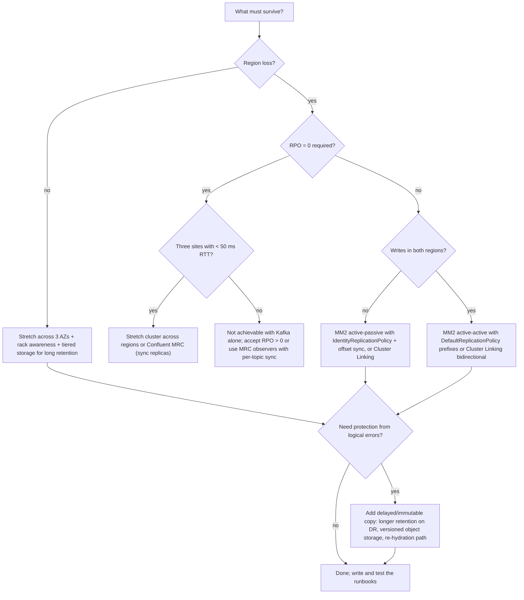
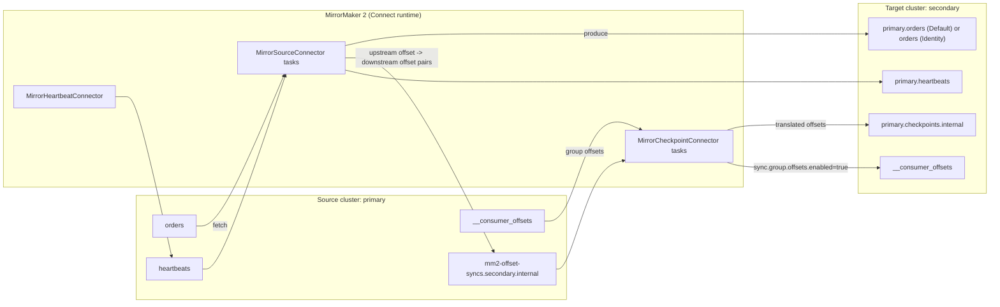
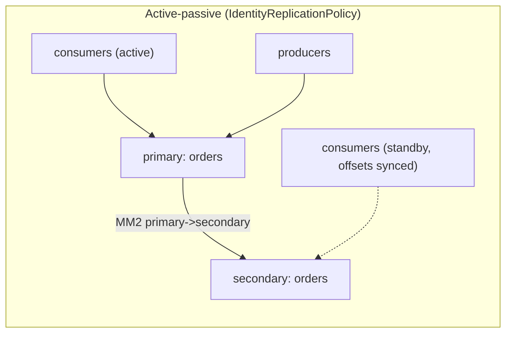
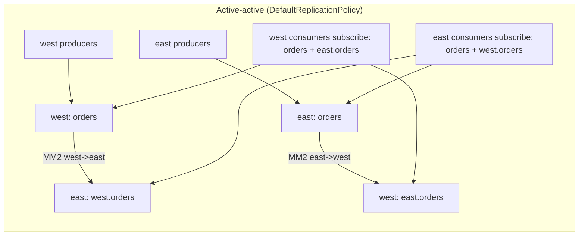
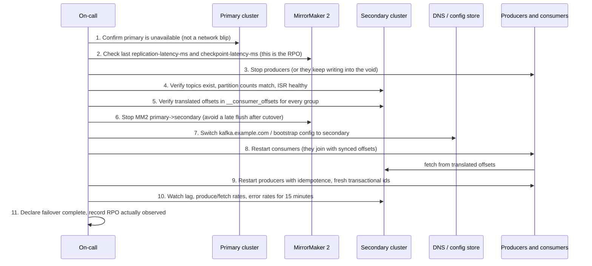

# Backup, Recovery and Disaster Recovery

**Roles:** [ARCH] [ADMIN]   **Level:** Advanced
**Prerequisites:** `01-fundamentals` (replication, ISR, log segments, KRaft quorum), `03-admin/03-storage-and-retention`, `03-admin/05-monitoring`

## What you will learn
- Why replication is not a backup, and what RPO and RTO mean for a Kafka cluster
- The DR strategy landscape: rack awareness, stretch clusters, MirrorMaker 2, Confluent Cluster Linking and Multi-Region Clusters, tiered storage, volume snapshots, re-hydration
- MirrorMaker 2 internals: the three connectors, replication policies, offset translation, exactly-once, monitoring
- Failover and failback runbooks that preserve consumer positions
- Recovering from broker loss, unclean leader election, corrupted segments, KRaft quorum loss and `__consumer_offsets` problems
- Keeping topics, ACLs, quotas and schemas as code so the control plane is restorable

## 1. Concept

### 1.1 Replication is not backup

Replication protects against **infrastructure** failures: a disk, a broker, an availability zone. Every replica applies the same append and the same delete. Replication does not protect against:

| Event | What replication does |
|-------|-----------------------|
| Topic deleted by mistake (`kafka-topics.sh --delete`) | deletes all replicas within seconds |
| Retention misconfigured (`retention.ms=60000` applied to the wrong topic) | every replica deletes the same segments |
| A producer bug writes garbage for two hours | garbage is replicated three times |
| Ransomware or a malicious admin with `super.users` | replicated |
| Region-wide outage | all replicas are in the region |
| Silent corruption in a leader before it is fetched by followers | corruption is replicated (Kafka checksums records, so this is rare but possible via application-level corruption) |

A **backup** is a copy that is isolated in time (you can go back to a point), in space (a different failure domain) and in privilege (a different credential can delete it). In Kafka this is achieved with cross-cluster replication to a cluster with different retention and different ACLs, with tiered storage to versioned object storage, or with re-hydration from the systems of record.

### 1.2 RPO and RTO for Kafka

- **RPO (Recovery Point Objective):** how much data you may lose, measured as the replication lag between primary and DR at the moment of failure. With asynchronous MirrorMaker 2 this is typically seconds to tens of seconds; with synchronous stretch clusters it is zero at the cost of latency.
- **RTO (Recovery Time Objective):** how long until producers and consumers are working again on the DR cluster. Dominated by human decision time, DNS/bootstrap changes, consumer offset translation and application restarts; rarely by Kafka itself.

Kafka-specific subtleties:
- Consumers care about **offset RPO**: after failover, will they re-read data (duplicates) or skip data (loss)? Offset translation decides.
- Producers with `enable.idempotence=true` lose their producer-id state on failover; the first batches to the DR cluster may produce duplicates of in-flight records.
- Kafka Streams and transactional applications have state (changelogs, transaction markers) that must also be mirrored, and MM2 does not replicate transaction markers as transactions.

### 1.3 Strategy landscape

| Strategy | RPO | RTO | Protects against | Cost / complexity | Notes |
|----------|-----|-----|------------------|-------------------|-------|
| Replication + rack awareness (`broker.rack`, RF=3, `min.insync.replicas=2`) | 0 within region | seconds (automatic) | broker, disk, single AZ | baseline | not a backup |
| Stretch cluster across AZs (one cluster, 3 AZs, < ~10 ms RTT) | 0 | seconds | AZ loss | cross-AZ traffic cost; `replica.selector.class=org.apache.kafka.common.replica.RackAwareReplicaSelector` to reduce it | the standard cloud deployment |
| Stretch cluster across regions | 0 | seconds | region loss | produce latency = inter-region RTT per ack; quorum needs 3 sites | only with < ~30-50 ms RTT and a third site for the controller quorum; otherwise fragile |
| MirrorMaker 2 active-passive | seconds | minutes to hours (runbook) | region loss, some logical errors if lag is exploited | second cluster + MM2 workers | offsets translated via checkpoints |
| MirrorMaker 2 active-active | seconds | near zero for reads, application-driven for writes | region loss | two clusters, both mirroring, topic prefixes | application must handle topic naming and duplicates |
| Confluent Cluster Linking (Confluent-specific) | seconds | minutes | region loss | Confluent Platform/Cloud | byte-for-byte mirror topics with identical offsets, no Connect workers |
| Confluent Multi-Region Clusters with observers (Confluent-specific) | 0 or seconds (per topic) | seconds (automatic) | region loss | Confluent Platform, 3-region quorum | sync replicas in one region, async observers in another, `replica.placement` per topic |
| Tiered storage as cold copy (`remote.storage.enable`, KIP-405, production-ready in 3.9) | minutes (upload lag) | hours (new cluster must be rebuilt, no direct restore tool in OSS) | broker/disk loss of historical data, cheap long retention | object storage | local segments are still the only copy for the active segment and the `local.retention.*` window |
| Volume snapshots (EBS/PD snapshots of `log.dirs`) | snapshot interval | hours | catastrophic logical error, region loss if snapshots are copied | storage | snapshots of a running broker are crash-consistent; recovery works because Kafka's log recovery truncates incomplete segments, but the cluster id, `meta.properties` and metadata log must be consistent across all brokers snapshotted at nearly the same time |
| Re-hydration from source systems (CDC from the database, event sourcing store) | depends on source | hours to days | everything, including Kafka-specific logic bugs | needs replayable sources | often the real answer for topics that are derived data |

### 1.4 Deciding



## 2. How it works internally: MirrorMaker 2

### 2.1 Architecture

MirrorMaker 2 (KIP-382, since 2.4) is a set of Kafka Connect connectors. Each source-to-target flow (`primary->secondary`) is implemented by three connectors:

| Connector | What it does | Internal topics it writes |
|-----------|--------------|---------------------------|
| `MirrorSourceConnector` | consumes topics matching `topics` from the source, produces to the target; syncs topic configs and ACLs; creates target topics with the same partition count | `mm2-offset-syncs.<target>.internal` (on the source cluster by default; `offset-syncs.topic.location=target` moves it) |
| `MirrorCheckpointConnector` | reads consumer group offsets on the source, translates them using offset-syncs, writes checkpoints to the target; optionally writes translated offsets directly into the target's `__consumer_offsets` (`sync.group.offsets.enabled=true`, since 2.7) | `<source>.checkpoints.internal` on the target |
| `MirrorHeartbeatConnector` | emits a heartbeat record every `emit.heartbeats.interval.seconds` so downstream can measure end-to-end replication and discover cluster topology | `heartbeats` on the source (mirrored to `<source>.heartbeats` on the target) |



### 2.2 Replication policies and topic naming

| Policy | Target topic name | Cycle protection | Use |
|--------|-------------------|------------------|-----|
| `org.apache.kafka.connect.mirror.DefaultReplicationPolicy` | `<source-alias>.<topic>` (separator from `replication.policy.separator`) | yes: MM2 will not mirror a topic that already carries an alias prefix back to its origin | active-active, fan-in, any topology where the same topic name exists in both clusters |
| `org.apache.kafka.connect.mirror.IdentityReplicationPolicy` (since 3.1) | `<topic>` unchanged | none: a bidirectional flow creates an infinite loop | active-passive DR, migration; applications keep the same topic names after failover |

Internal topics (`heartbeats`, `checkpoints`, `offset-syncs`) always keep their names regardless of policy. With the identity policy you must still avoid `primary->secondary` and `secondary->primary` on the same topics at the same time.

### 2.3 Offset translation

Offsets differ between clusters: the target topic starts at 0 and gaps appear from compaction, transaction markers, or retention. MM2 records `(upstreamOffset, downstreamOffset)` pairs in the offset-syncs topic whenever the source task passes a sync point (at most one per `offset.lag.max` records per partition, default 100). `MirrorCheckpointConnector` uses these pairs to translate a committed source offset to the **nearest earlier** target offset. That is why translated offsets are conservative: a consumer restarting on the target may re-read up to `offset.lag.max` records but never skips records.

Programmatic translation for applications that manage offsets themselves:

```java
Map<String, Object> props = Map.of("bootstrap.servers", "secondary-1.kafka.internal:9092");
Map<TopicPartition, OffsetAndMetadata> translated =
    RemoteClusterUtils.translateOffsets(props, "primary", "billing-app", Duration.ofSeconds(30));
// translated keys are target-side TopicPartitions (with the alias prefix if DefaultReplicationPolicy is used)
consumer.commitSync(translated);
```

`MirrorClient` (same package `org.apache.kafka.connect.mirror`) exposes `remoteTopics()`, `heartbeatTopics()`, `replicationHops()` and `remoteConsumerOffsets()` for tooling.

Automatic sync (`sync.group.offsets.enabled=true`) writes the translated offsets into the target's `__consumer_offsets` every `sync.group.offsets.interval.seconds` (default 60), **but only for groups that are not active on the target**. As soon as a consumer group joins on the target, MM2 stops overwriting its offsets.

### 2.4 Full `mm2.properties` example (active-passive, dedicated cluster)

```properties
# Cluster aliases and connection details
clusters = primary, secondary
primary.bootstrap.servers = primary-1.kafka.internal:9092,primary-2.kafka.internal:9092
secondary.bootstrap.servers = secondary-1.kafka.internal:9092,secondary-2.kafka.internal:9092

primary.security.protocol = SASL_SSL
primary.sasl.mechanism = SCRAM-SHA-512
primary.sasl.jaas.config = org.apache.kafka.common.security.scram.ScramLoginModule required username="mm2" password="${file:/etc/mm2/secrets.properties:primary.password}";
primary.ssl.truststore.location = /etc/kafka/tls/truststore.p12
primary.ssl.truststore.password = ${file:/etc/mm2/secrets.properties:truststore.password}
secondary.security.protocol = SASL_SSL
secondary.sasl.mechanism = SCRAM-SHA-512
secondary.sasl.jaas.config = org.apache.kafka.common.security.scram.ScramLoginModule required username="mm2" password="${file:/etc/mm2/secrets.properties:secondary.password}";
secondary.ssl.truststore.location = /etc/kafka/tls/truststore.p12
secondary.ssl.truststore.password = ${file:/etc/mm2/secrets.properties:truststore.password}

config.providers = file
config.providers.file.class = org.apache.kafka.common.config.provider.FileConfigProvider

# Flow definition
primary->secondary.enabled = true
secondary->primary.enabled = false
primary->secondary.topics = orders.*, billing.*, customer.*
primary->secondary.topics.exclude = .*\.internal, .*\.replica, __.*
primary->secondary.groups = billing-.*, orders-.*
primary->secondary.groups.exclude = console-consumer-.*

# Naming: keep topic names identical for active-passive DR
replication.policy.class = org.apache.kafka.connect.mirror.IdentityReplicationPolicy

# Consumer offset sync
sync.group.offsets.enabled = true
sync.group.offsets.interval.seconds = 30
emit.checkpoints.enabled = true
emit.checkpoints.interval.seconds = 30
offset.lag.max = 100
emit.heartbeats.interval.seconds = 5

# Topic metadata sync
sync.topic.configs.enabled = true
sync.topic.acls.enabled = true
refresh.topics.interval.seconds = 60
refresh.groups.interval.seconds = 60

# Target-side replication factors for created topics
replication.factor = 3
checkpoints.topic.replication.factor = 3
heartbeats.topic.replication.factor = 3
offset-syncs.topic.replication.factor = 3
# Connect internal topics of the dedicated MM2 cluster
offset.storage.replication.factor = 3
status.storage.replication.factor = 3
config.storage.replication.factor = 3

# Throughput and delivery
tasks.max = 12
primary->secondary.producer.override.compression.type = lz4
primary->secondary.producer.override.linger.ms = 50
primary->secondary.producer.override.batch.size = 262144
primary->secondary.producer.override.acks = all
primary->secondary.consumer.override.fetch.max.bytes = 52428800
primary->secondary.consumer.override.max.partition.fetch.bytes = 4194304

# Exactly-once (since 3.5): requires the internal REST server in dedicated mode
exactly.once.source.support = enabled
dedicated.mode.enable.internal.rest = true
listeners = http://0.0.0.0:8083
```

Run as a dedicated cluster (multiple workers with the same properties form one Connect group):

```bash
connect-mirror-maker.sh /etc/mm2/mm2.properties
# restrict a worker to a subset of target clusters
connect-mirror-maker.sh /etc/mm2/mm2.properties --clusters secondary
```

Run on an existing Connect cluster instead by posting the three connectors to the REST API with `connector.class=org.apache.kafka.connect.mirror.MirrorSourceConnector` (and the other two), `source.cluster.alias`, `target.cluster.alias`, `source.cluster.bootstrap.servers`, `target.cluster.bootstrap.servers` and the same flow settings.

**Exactly-once in MM2.** Since 3.5 (KIP-618 for Connect source connectors, KIP-710 for dedicated mode) `exactly.once.source.support=enabled` makes the source tasks write records and offsets in one transaction on the target. Requirements: target cluster 2.5+ with transactions enabled, MM2 principal with `WRITE`/`DESCRIBE` on prefixed `TRANSACTIONAL_ID` `connect-cluster-`, consumers on the target using `isolation.level=read_committed`. Throughput drops because of transaction commits; size `offset.flush.interval.ms` accordingly.

**Sizing and placement.** Run MM2 in the **target** region: the consumer side tolerates WAN latency better than the producer side (a producer waits for `acks=all` per batch across the WAN, a consumer prefetches). `tasks.max` should be at least the number of partitions divided by roughly 50, and the number of workers at least 2 for availability.

### 2.5 Monitoring MM2

JMX metrics from `MirrorSourceConnector` tasks are registered as `kafka.connect.mirror:type=MirrorSourceConnector,source=<alias>,target=<alias>,topic=<topic>,partition=<n>`:

| Metric | Meaning | Alert when |
|--------|---------|------------|
| `replication-latency-ms` (avg/max) | time between record timestamp at source and its arrival at target | > agreed RPO for more than a minute |
| `record-age-ms` | age of records when consumed at the source | rising: MM2 cannot keep up |
| `record-count`, `byte-rate` | throughput | drops to 0 while source has traffic |
| `kafka.connect.mirror:type=MirrorCheckpointConnector,...,checkpoint-latency-ms` | time from source commit to checkpoint on target | > `sync.group.offsets.interval.seconds` × 3 |
| Connect `kafka.connect:type=connector-task-metrics,connector=...,task=...,status` | task state | `failed` |
| Heartbeat consumer on target reading `primary.heartbeats` | end-to-end liveness | no heartbeat for > 3 intervals |

Also alert on the MM2 consumer group lag at the source (`kafka-consumer-groups.sh --describe --group` for the MM2 internal consumer, which uses `group.id = <source>-mm2` style ids only in legacy mode; in Connect mode look at the Connect offsets via `kafka.connect.mirror` metrics or the REST endpoint `GET /connectors/<name>/offsets`, since 3.5).

## 3. Configuration that matters

| Parameter | Default | Recommended | Why |
|-----------|---------|-------------|-----|
| `broker.rack` | unset | AZ or rack id on every broker | replica placement spreads across failure domains |
| `replica.selector.class` | leader only | `org.apache.kafka.common.replica.RackAwareReplicaSelector` | consumers fetch from same-AZ followers (KIP-392); cuts cross-AZ cost and keeps reads local during partial outages |
| `min.insync.replicas` | 1 | 2 with RF 3 | a single-replica ISR means a single-disk RPO |
| `unclean.leader.election.enable` | `false` | `false`; enable per topic only during a documented recovery | true trades durability for availability automatically |
| `remote.storage.enable` (topic) + `remote.log.storage.system.enable` (broker) | `false` | `true` for long-retention topics | segments beyond `local.retention.ms` live in object storage with its own durability and versioning |
| `local.retention.ms` / `local.retention.bytes` | -2 (same as retention) | hours to a day | limits what is lost with the local disk |
| `log.flush.interval.messages` | `Long.MAX_VALUE` | leave default | Kafka relies on replication, not fsync, for durability; forcing flushes hurts throughput without changing the cross-region RPO |
| `num.recovery.threads.per.data.dir` | 1 | number of cores per data dir | parallel log recovery after unclean shutdown; the RTO of a broker restart depends on it |
| `replica.lag.time.max.ms` | 30000 | 30000 | determines how stale a follower may be before leaving the ISR, and therefore how much data an ISR-member follower may lack |
| `offsets.retention.minutes` | 10080 | 10080 or more | groups idle longer than this lose their offsets, which turns a DR test into a replay |
| MM2 `offset.lag.max` | 100 | 100 (lower for precise offsets) | maximum re-read on failover per partition |
| MM2 `sync.group.offsets.enabled` | `false` | `true` for active-passive | consumers fail over without code changes |
| MM2 `replication.policy.class` | Default | Identity for DR, Default for active-active | naming |

## 4. Failure modes and how to detect them

| Symptom | Likely cause | Metric / log to check | Fix |
|---------|--------------|-----------------------|-----|
| MM2 `replication-latency-ms` climbing, `record-age-ms` climbing | not enough tasks, WAN throughput, producer batching | task count vs partition count; producer `record-send-rate` | raise `tasks.max`, tune batching/compression, add workers |
| Target topic has different partition count | topic was pre-created on target with wrong count | `kafka-topics.sh --describe` on both | MM2 does not change partitions; recreate or add partitions manually |
| Consumers on DR start from `auto.offset.reset` | checkpoints not synced or group excluded by `groups` filter | `primary.checkpoints.internal` content; `groups` regex | fix filter; translate manually with `RemoteClusterUtils` |
| Offsets synced but consumer re-reads a lot | `offset.lag.max` large, or compaction on source | translated offset lag | lower `offset.lag.max` |
| Offsets stop syncing for one group after a DR test | the group became active on target, MM2 will not overwrite an active group's offsets | MM2 log "skipping offset sync for active group" | delete the group on target (`kafka-consumer-groups.sh --delete`) after the test |
| Duplicate topics `primary.orders` and `orders` on target | replication policy changed after the flow existed | topic list | choose one policy, delete the other topic set, reset MM2 Connect offsets |
| Broker restart takes an hour | unclean shutdown with many partitions, one recovery thread | broker log "Recovering unflushed segment" | raise `num.recovery.threads.per.data.dir`; always stop with SIGTERM and wait for `controlled.shutdown` |
| After region failover, producers get `InvalidProducerEpochException` / `UnknownProducerIdException` | idempotent producer state does not exist on DR | producer log | restart producers with fresh clients (they get new PIDs); expect at most in-flight duplicates |
| Transactional app cannot resume on DR | transaction state and markers are not mirrored transactionally | `InvalidPidMappingException` | treat as new transactional id on DR, tolerate duplicates for the last batch |

## 5. Design guidance (architect view)

### 5.1 Active-passive and active-active topologies





Active-active rules: producers write only to the **local** unprefixed topic; consumers subscribe with a pattern (`.*orders`) to read both local and remote copies; records carry a header with the origin region so idempotent consumers can deduplicate; global ordering across regions does not exist. Cluster Linking's bidirectional mode gives the same shape with mirror topics named by the link, keeping offsets identical.

### 5.2 Stretch clusters: AZ vs region

A stretch cluster is one Kafka cluster whose brokers and controllers span sites. It works when:
- there are **three** sites (a quorum of controllers needs a majority; two sites always leave one side without quorum),
- RTT is low enough for `acks=all` latency to be acceptable (the leader waits for followers in the other sites) and for controller elections not to flap (`controller.quorum.election.timeout.ms` default 1000 ms, `controller.quorum.fetch.timeout.ms` default 2000 ms),
- `broker.rack` is set per site and `min.insync.replicas` is chosen so that a site loss still leaves an ISR of at least `min.insync.replicas` (RF=3 across 3 sites with `min.insync.replicas=2`; RF=4 across 2 sites plus a controller-only third site with `min.insync.replicas=2` and `replica.selector.class` rack-aware).

Across AZs in one region (1-2 ms RTT) this is the norm. Across regions it is viable roughly below 30-50 ms RTT and only with a third region for the controller quorum; above that, produce latency and ISR flapping (`IsrShrinksPerSec`) make MM2 the better choice.

```plantuml
@startuml
skinparam shadowing false
skinparam defaultFontName Helvetica
title Multi-region Kafka deployment: primary (eu-west-1) and DR (eu-central-1) with MirrorMaker 2

cloud "Global DNS\nkafka.example.com (weighted / failover record)" as dns

node "Region A: eu-west-1 (primary)" as A {
  node "AZ a" as Aa {
    node "controller-1" as ac1
    node "broker-1" as ab1
    node "broker-4" as ab4
  }
  node "AZ b" as Ab {
    node "controller-2" as ac2
    node "broker-2" as ab2
    node "broker-5" as ab5
  }
  node "AZ c" as Ac {
    node "controller-3" as ac3
    node "broker-3" as ab3
    node "broker-6" as ab6
  }
  database "Object storage\n(tiered storage bucket A)" as s3a
  component "Producers + consumers\n(active)" as appA
}

node "Region B: eu-central-1 (DR)" as B {
  node "AZ a" as Ba {
    node "controller-1" as bc1
    node "broker-1" as bb1
  }
  node "AZ b" as Bb {
    node "controller-2" as bc2
    node "broker-2" as bb2
  }
  node "AZ c" as Bc {
    node "controller-3" as bc3
    node "broker-3" as bb3
  }
  node "MirrorMaker 2 cluster\n(connect-mirror-maker.sh x3)" as mm2
  database "Object storage\n(tiered storage bucket B)" as s3b
  component "Consumers (warm standby)\nProducers (idle)" as appB
}

database "Git: topics, ACLs,\nschemas, quotas as code" as git

dns --> ab1 : active
dns ..> bb1 : failover
appA --> ab1
appB ..> bb1
mm2 --> ab1 : consume (source)\nSASL_SSL over inter-region link
mm2 --> bb1 : produce (target)
ab1 --> s3a : remote log segments
bb1 --> s3b : remote log segments
git ..> ab1 : apply
git ..> bb1 : apply

note bottom of mm2
  Run MM2 in the target region:
  a consumer tolerates WAN latency
  better than a producer does.
end note
note bottom of A
  rack awareness: broker.rack = AZ id
  replication.factor=3, min.insync.replicas=2
  Controllers spread one per AZ.
end note
@enduml
```



Source: `diagrams/07-backup-recovery-and-dr-multi-region-deployment.puml`.

### 5.3 Cluster Linking and Multi-Region Clusters (Confluent-specific)

- **Cluster Linking** replicates at the broker level: the destination brokers fetch from the source like followers, so mirror topics are byte-identical with the **same offsets**. No offset translation, no Connect workers, and consumers fail over with their own committed offsets. Mirror topics are read-only until promoted (`kafka-mirrors --promote` after the source is confirmed caught up, or `--failover` when the source is gone). Consumer offsets and ACLs sync via link configs (`consumer.offset.sync.enable`, `acl.sync.enable`).
- **Multi-Region Clusters (MRC)** is a single stretch cluster with **observers**: replicas that receive data asynchronously and do not count toward the ISR. `replica.placement` JSON per topic chooses which racks hold sync replicas and which hold observers; observer promotion (`observer.promotion.policy`) makes them eligible leaders when the sync replicas are gone. This gives RPO 0 within the sync region and automatic failover to another region without MM2, at the price of running Confluent Server.

### 5.4 Configuration as code

Data can be mirrored; the control plane must be **re-creatable**. Keep in git and apply through CI:

| Object | Export command (OSS) | Declarative tool |
|--------|----------------------|------------------|
| Topics and configs | `kafka-topics.sh --bootstrap-server ... --describe` and `kafka-configs.sh --describe --entity-type topics --all` | Strimzi `KafkaTopic`, Terraform `kafka_topic`, Julie Ops, `kafka-topics` in Ansible |
| ACLs | `kafka-acls.sh --bootstrap-server ... --list` | Strimzi `KafkaUser`, Terraform `kafka_acl`, Julie Ops |
| Quotas | `kafka-configs.sh --describe --entity-type users --entity-type clients` | Terraform `kafka_quota` |
| SCRAM users | `kafka-configs.sh --describe --entity-type users` (hashes only; passwords live in the vault) | Strimzi `KafkaUser` |
| Schemas | `GET /subjects`, `GET /subjects/<s>/versions/<v>` (Confluent Schema Registry) | schema files in git registered by CI; Confluent Schema Linking / exporter |
| Connectors | `GET /connectors?expand=info` | connector JSON in git, applied via `PUT /connectors/<name>/config` |
| Broker configs | `kafka-configs.sh --describe --entity-type brokers --entity-default` and per broker | Ansible/Helm values |

> **Production tip:** run a nightly job that dumps topics, ACLs, quotas and schemas from every cluster into an artifact store. It costs nothing and turns "we lost the cluster" into "we redeploy from last night's manifest and replay from DR".

## 6. Hands-on: runbooks

### 6.1 Failover runbook (active-passive, MM2, IdentityReplicationPolicy)



Commands for the steps:

```bash
SEC="--bootstrap-server secondary-1.kafka.internal:9092 --command-config /etc/kafka/admin.properties"

# Step 2: what was the lag when primary died? (from MM2 metrics, or last heartbeat seen on target)
kafka-console-consumer.sh $SEC --topic primary.heartbeats --from-beginning --max-messages 5 \
  --formatter kafka.tools.DefaultMessageFormatter --property print.timestamp=true 2>/dev/null | tail -1

# Step 4: topic and ISR health on the DR side
kafka-topics.sh $SEC --describe --under-replicated-partitions
kafka-topics.sh $SEC --describe --topic orders

# Step 5: translated consumer offsets present?
kafka-consumer-groups.sh $SEC --describe --group billing-app
# If sync.group.offsets.enabled was off, translate now from the checkpoints topic
kafka-console-consumer.sh $SEC --topic primary.checkpoints.internal --from-beginning \
  --formatter org.apache.kafka.connect.mirror.formatters.CheckpointFormatter --max-messages 100

# Optional: reset a group to a specific translated offset
kafka-consumer-groups.sh $SEC --group billing-app --topic orders:0 --reset-offsets --to-offset 1234567 --execute

# Step 6: stop MM2 (systemd unit on the MM2 workers)
sudo systemctl stop kafka-mirrormaker2

# Step 8/9: applications
# bootstrap.servers now resolves to secondary via DNS; verify from an app host
getent hosts kafka.example.com

# Step 10
kafka-consumer-groups.sh $SEC --describe --all-groups | awk '$6 > 10000'
```

Checks before declaring success: `UnderReplicatedPartitions=0`, `OfflinePartitionsCount=0`, `ActiveControllerCount=1` on the secondary; producer `record-error-rate=0`; consumer lag decreasing for every group; Schema Registry pointing at the secondary `_schemas` topic (mirrored with the same name, Schema Registry started in the DR region only after the primary is confirmed down to avoid two writers).

### 6.2 Failback runbook

Failback is a **second failover** in the other direction, with one extra danger: the old primary contains records that never reached the secondary (the RPO window) and may also contain records written after the outage if producers were not stopped in time.

1. Do not start the old primary's brokers with client access. Bring it up behind a firewall rule or with `advertised.listeners` on an isolated listener.
2. Decide what to do with the unreplicated tail on the old primary. Options: discard it (delete the topics and let MM2 recreate them), or export it with `kafka-console-consumer.sh` from the last replicated offset for reconciliation by the business.
3. Wipe the old primary's copies of the mirrored topics (or wipe its data directories entirely and reformat with `kafka-storage.sh format`). Mixed history with the secondary's new records is not reconcilable.
4. Configure MM2 `secondary->primary` with the same `IdentityReplicationPolicy` and `sync.group.offsets.enabled=true`. Start it and wait for `replication-latency-ms` to settle near the WAN RTT and for the consumer offsets to appear.
5. Run the failover runbook from 6.1 with the roles swapped, at a planned time.
6. Reverse MM2 again (`primary->secondary`) and delete the consumer groups on the secondary that became active during the DR period so that offset sync resumes for them.

### 6.3 Testing DR (game days)

- **Quarterly full failover** to the DR cluster with production traffic, during a maintenance window; measure the real RPO (heartbeat gap) and RTO (time from decision to first successful consumer poll).
- **Monthly read-only test**: start a copy of each consumer application against the DR cluster with `group.id=<group>-drtest` reset to the translated offsets, verify it processes without errors, then delete the group.
- **Continuous**: alert on missing heartbeats, on topics existing on primary but not on secondary (`refresh.topics.interval.seconds`), and on ACL drift between clusters.
- Test the boring parts: does the on-call have the DR admin credentials, does DNS TTL (`60s` recommended) match the RTO, do applications actually re-resolve bootstrap servers on reconnect (`client.dns.lookup=use_all_dns_ips`)?

### 6.4 Recovering from broker loss

Single broker with intact disks: restart, watch log recovery and ISR rejoin (`kafka-topics.sh --describe --under-replicated-partitions` shrinks to zero).

Broker whose disks are gone:

```bash
# 1. Provision a replacement with the SAME node.id and an empty log.dirs, formatted with the cluster id
kafka-storage.sh format --cluster-id $(cat /etc/kafka/cluster-id) --config /etc/kafka/server.properties
# 2. Start it; it registers with the controller and starts fetching every partition it was assigned
kafka-server-start.sh -daemon /etc/kafka/server.properties
# 3. Follow replication progress
kafka-log-dirs.sh --bootstrap-server broker-2.kafka.internal:9092 --command-config /etc/kafka/admin.properties \
  --describe --broker-list 1 | jq '.brokers[].logDirs[].partitions[] | select(.isFuture==false) | {partition, size, offsetLag}'
# 4. Throttle if recovery saturates the network
kafka-configs.sh --bootstrap-server broker-2.kafka.internal:9092 --command-config /etc/kafka/admin.properties \
  --entity-type brokers --entity-name 1 --alter --add-config 'follower.replication.throttled.rate=104857600'
```

If the broker cannot be rebuilt soon, reassign its partitions away with `kafka-reassign-partitions.sh --generate`/`--execute` and, once the cluster is healthy, unregister it: `kafka-cluster.sh unregister --bootstrap-server ... --id 1` (since 3.4).

### 6.5 Data-loss scenarios and unclean leader election

Data loss without unclean election happens only when a write was acknowledged with fewer replicas than you thought (`acks=1`, or `acks=all` with `min.insync.replicas=1`) and that replica died. Investigation: correlate the producer's acknowledged offsets with the log end offset on the surviving replicas; the gap is what was lost.

Unclean leader election (`unclean.leader.election.enable=true` or a manual `--election-type UNCLEAN`) promotes a non-ISR replica; everything between its log end offset and the old leader's is truncated when the old leader returns. Symptoms: `kafka.controller:type=ControllerStats,name=UncleanLeaderElectionsPerSec` > 0, followers log `Truncating to offset N`, consumers see `OffsetOutOfRangeException` and jump according to `auto.offset.reset`.

When all ISR replicas are gone and the partition is offline, a manual unclean election is the only way to restore availability:

```bash
kafka-leader-election.sh --bootstrap-server broker-1.kafka.internal:9092 --admin.config /etc/kafka/admin.properties \
  --election-type UNCLEAN --topic orders --partition 3
# or everything at once
kafka-leader-election.sh --bootstrap-server broker-1.kafka.internal:9092 --admin.config /etc/kafka/admin.properties \
  --election-type UNCLEAN --all-topic-partitions
```

Record the old leader's last known log end offset before doing it, so the lost range can be requested from upstream systems or from the DR cluster.

### 6.6 Corrupted segments

Kafka detects corruption via per-batch CRC32C when a segment is read. On startup, any segment after the last clean shutdown (no `.kafka_cleanshutdown` marker in the log dir) is recovered: batches are validated, the log is truncated at the first invalid batch, and indexes are rebuilt.

```bash
# Inspect a segment (works on a stopped or running broker; read-only)
kafka-dump-log.sh --files /var/lib/kafka/data/orders-3/00000000000012345678.log --print-data-log | head -50
kafka-dump-log.sh --files /var/lib/kafka/data/orders-3/00000000000012345678.log --deep-iteration | grep -i "invalid\|corrupt"
kafka-dump-log.sh --files /var/lib/kafka/data/orders-3/00000000000012345678.index --index-sanity-check
kafka-dump-log.sh --files /var/lib/kafka/data/orders-3/00000000000012345678.timeindex --verify-index-only
# Decoders for internal topics
kafka-dump-log.sh --files /var/lib/kafka/data/__consumer_offsets-12/00000000000000000000.log --offsets-decoder
kafka-dump-log.sh --files /var/lib/kafka/data/__transaction_state-0/00000000000000000000.log --transaction-log-decoder
kafka-dump-log.sh --files /var/lib/kafka/data/__cluster_metadata-0/00000000000000000000.log --cluster-metadata-decoder
```

`kafka-dump-log.sh` is the CLI wrapper for `kafka.tools.DumpLogSegments`; `kafka-run-class.sh kafka.tools.DumpLogSegments --files ...` is equivalent.

Fix pattern for a corrupt replica: stop the broker, delete only the affected partition directory (`rm -rf /var/lib/kafka/data/orders-3`), start the broker; it re-fetches the partition from the leader. Corrupt indexes alone: delete the `.index`/`.timeindex`/`.txnindex` files, they are rebuilt at startup. Never edit `.log` files by hand.

Speed up recovery for a large broker with `num.recovery.threads.per.data.dir=8` (default 1); the value is per data directory.

### 6.7 KRaft controller quorum loss

Losing a minority of controllers (1 of 3) is transparent: the remaining two elect a leader. Recovery: replace the failed node with the **same** `node.id`, format its metadata dir with the cluster id, start it; it fetches the metadata log and snapshots from the leader.

Losing the majority (2 of 3) stops all metadata changes (no leader elections, no topic creation, no consumer group coordinator moves), but brokers keep serving existing leaders and consumers keep working until something needs the controller.

Diagnosis:

```bash
kafka-metadata-quorum.sh --bootstrap-server broker-1.kafka.internal:9092 --command-config /etc/kafka/admin.properties describe --status
kafka-metadata-quorum.sh --bootstrap-server broker-1.kafka.internal:9092 --command-config /etc/kafka/admin.properties describe --replication
# On a controller host, inspect the metadata log and snapshots directly
ls -la /var/lib/kafka/metadata/__cluster_metadata-0/
kafka-metadata-shell.sh --snapshot /var/lib/kafka/metadata/__cluster_metadata-0/00000000000000120000-0000000042.checkpoint
kafka-dump-log.sh --cluster-metadata-decoder --files /var/lib/kafka/metadata/__cluster_metadata-0/00000000000000120000.log | tail -20
```

Recovery order of preference:
1. **Restore the failed controllers' disks** (volume re-attach, snapshot restore). Their logs are stale but valid; Raft catches them up.
2. **Rebuild controllers with the same node ids and empty metadata dirs** (static quorum, `controller.quorum.voters`): the surviving controller has the longest log, the rebuilt ones grant it their vote, it becomes leader and replicates. Data committed only on the lost controllers but not on the survivor is gone; verify with `describe --replication` that the survivor's `LogEndOffset` is at or beyond the last known high watermark.
3. **Dynamic quorum (3.9, KIP-853):** with `controller.quorum.bootstrap.servers`, remove the dead voters and add new ones: `kafka-metadata-quorum.sh --bootstrap-controller controller-1:9094 remove-controller --controller-id 102 --controller-directory-id <uuid>` then, on the replacement node, format the metadata dir with `kafka-storage.sh format --cluster-id <id> --config controller.properties --no-initial-controllers`, start it (it joins as an observer) and run `kafka-metadata-quorum.sh --bootstrap-controller controller-1:9094 add-controller`. Removing a dead voter needs a live majority, so this path only helps once at least a temporary majority is re-established via option 1 or 2.
4. **Rebuild from a metadata snapshot** as a last resort: copy `__cluster_metadata-0` from the surviving controller (or the most recent broker copy, brokers keep a full replica of the metadata log) to freshly formatted controllers with the same node ids, then start them. All controllers must have identical `cluster.id` in `meta.properties`.

> **Production tip:** back up `/var/lib/kafka/metadata/__cluster_metadata-0/*.checkpoint` from a controller daily. A snapshot plus the `cluster.id` is enough to rebuild the entire control plane (topics, partitions, ACLs, SCRAM users, quotas, configs) onto empty controllers, and brokers then re-register their existing data directories.

### 6.8 `__consumer_offsets` problems

| Problem | Symptom | Fix |
|---------|---------|-----|
| Topic grew to hundreds of GB | log cleaner died or `cleanup.policy` changed; `kafka.log:type=LogCleanerManager,name=uncleanable-partitions-count` > 0 | restart cleaner (broker restart), ensure `cleanup.policy=compact`, raise `log.cleaner.dedupe.buffer.size` |
| Coordinator loads for minutes after a broker restart | huge partitions; log "Finished loading offsets and group metadata from __consumer_offsets-N in 120000 milliseconds" | fix compaction; lower `offsets.retention.minutes` for abandoned groups; delete unused groups |
| Groups lost their offsets | `offsets.retention.minutes` expired while group was down (default 7 days) | reset offsets from application-side bookkeeping or from MM2 checkpoints; raise retention |
| Partition offline (RF 1 from an old default) | `offsets.topic.replication.factor=1` on the first broker start | `kafka-reassign-partitions.sh` to RF 3 while the cluster is healthy; never wait for the failure |
| Corrupt segment in `__consumer_offsets-N` | coordinator fails to load; `CorruptRecordException` | stop the broker, delete that partition dir on that replica only, restart (re-fetch from leader); if leader is corrupt, unclean election to a follower |

Inspect content with `kafka-dump-log.sh --offsets-decoder` (section 6.6) and `kafka-consumer-groups.sh --describe --all-groups`.

### 6.9 Restoring a topic from tiered storage

Apache Kafka 3.9 has no "restore from remote storage into a new cluster" tool: remote segments are indexed by topic id and cluster-specific metadata in `__remote_log_metadata`. What works in OSS:
- Losing local disks on all replicas of a tiered topic in an otherwise healthy cluster: the topic id and remote metadata survive on the controllers, so once brokers are rebuilt, consumers can read the remote segments; only the local tail (`local.retention.*`) is lost.
- Cross-cluster restore requires a custom `RemoteLogMetadataManager` and `RemoteStorageManager` pair or a re-ingestion job that reads segments from the bucket with `kafka-dump-log.sh`-style parsing and reproduces them. Confluent Platform and some vendors provide this as a feature; in OSS treat tiered storage as cheap long retention, not as a restore point.

## 7. Interview questions for this chapter

### Q1. "We have RF=3 across three AZs, so we do not need a backup." Argue against this.
**Role:** [ARCH] | **Difficulty:** ★☆☆ | **Topic:** Backup fundamentals

**Answer.**
Replication copies every operation including the destructive ones: a topic deletion, a retention misconfiguration, a producer bug, or a compromised admin credential affects all three replicas within seconds. It also does not survive a region outage. A backup must be isolated in time, place and privilege: a DR cluster in another region fed by MM2 or Cluster Linking with longer retention and different credentials, versioned object storage via tiered storage, or a replayable system of record. Which one you need depends on which of those failures the business is actually paying to survive.

**Follow-up probes.** How would you recover from a topic deleted an hour ago in each setup? What is the RPO of each?

### Q2. Explain how MirrorMaker 2 translates consumer offsets and why a consumer may re-read records after failover.
**Role:** [ADMIN] | **Difficulty:** ★★☆ | **Topic:** MirrorMaker 2

**Answer.**
Offsets differ between clusters, so `MirrorSourceConnector` writes `(upstream, downstream)` offset pairs to `mm2-offset-syncs.<target>.internal` at most every `offset.lag.max` records per partition. `MirrorCheckpointConnector` reads source group commits and maps each to the latest sync pair at or below it, producing a checkpoint that is a target offset less than or equal to the true position. With `sync.group.offsets.enabled=true` it writes those into the target's `__consumer_offsets` for groups not active there. The result is at-least-once: a consumer starting on the target may re-read up to `offset.lag.max` records but never skips any.

**Follow-up probes.** Why does MM2 stop syncing a group once it is active on the target? How does Cluster Linking avoid translation?

### Q3. Design a DR setup for a payments platform with RPO under 5 seconds and RTO under 15 minutes across two regions 80 ms apart.
**Role:** [ARCH] | **Difficulty:** ★★★ | **Topic:** DR design

**Answer.**
At 80 ms a stretch cluster is out: `acks=all` would cost at least one RTT per batch and controller elections would flap, and there is no third region for the quorum. Choose asynchronous replication: MM2 active-passive with `IdentityReplicationPolicy`, `sync.group.offsets.enabled=true`, `offset.lag.max` lowered to 10-20 for tighter offset RPO, MM2 running in the DR region with enough tasks that `replication-latency-ms` stays under 2-3 s. RTO is a runbook problem: DNS with 60 s TTL, producers that stop on primary loss, consumers restarted against the DR bootstrap, Schema Registry with `_schemas` mirrored. Add explicit deduplication in consumers (idempotent processing keyed by business id) since both the RPO window and idempotent-producer state loss create duplicates.

**Follow-up probes.** How do you prevent a split brain where both regions accept writes? What do you do with the un-replicated tail during failback?

### Q4. Two of three KRaft controllers lost their disks simultaneously. What still works, and how do you recover?
**Role:** [ADMIN] | **Difficulty:** ★★★ | **Topic:** KRaft recovery

**Answer.**
Brokers keep serving existing partition leaders and consumers keep committing offsets, because the data plane does not need the controller until a leader must change or metadata must be updated; but no new leader elections, topic creations, or ISR changes can be committed. Recover by rebuilding the two controllers with the same `node.id` and empty, freshly formatted metadata directories (same cluster id). Raft lets the survivor win the election because its log is the longest, and it replicates to the new voters. Verify with `kafka-metadata-quorum.sh describe --replication` that the survivor's log end offset covers the last known high watermark; anything committed only on the two lost nodes is gone. Restoring the volumes from snapshot, if available, is safer than rebuilding empty.

**Follow-up probes.** What changes with dynamic quorums in 3.9? Why must the node ids be reused?

### Q5. A broker restart after a crash takes 45 minutes. What is happening and what do you change?
**Role:** [ADMIN] | **Difficulty:** ★★☆ | **Topic:** Log recovery

**Answer.**
Without the `.kafka_cleanshutdown` marker, the broker validates every segment written since the last flush point in every partition, rebuilding indexes and truncating at the first corrupt batch. With thousands of partitions and the default `num.recovery.threads.per.data.dir=1` this is serial. Set it to the number of cores per data directory, keep segments reasonably sized (`log.segment.bytes`), and always stop brokers with SIGTERM and let controlled shutdown finish (`controlled.shutdown.enable=true`, default). Also check whether a single large `__consumer_offsets` partition is the culprit, which points at a compaction problem.

**Follow-up probes.** What does the broker do when it finds a corrupt batch mid-segment? Does recovery affect other brokers?

### Q6. When would you choose Confluent Cluster Linking over MirrorMaker 2?
**Role:** [ARCH] | **Difficulty:** ★★☆ | **Topic:** Replication technologies

**Answer.**
Cluster Linking when you run Confluent Platform or Confluent Cloud on both sides and want byte-identical mirror topics with preserved offsets, so consumers fail over with their own committed offsets and no Connect infrastructure is needed; it also has explicit promote/failover semantics. MM2 when either side is Apache Kafka or another vendor, when you need transformations or filtering (Connect SMTs), when licensing rules out Confluent, or for active-active with prefixed topic names. MM2 offset translation is approximate and requires the checkpoint machinery; Cluster Linking makes that problem disappear at the cost of vendor lock-in.

**Follow-up probes.** How does each handle a topic partition count change? What about ACL sync?

### Q7. An unclean leader election happened overnight. How do you determine what was lost and what do you tell the product team?
**Role:** [ADMIN] | **Difficulty:** ★★☆ | **Topic:** Data loss investigation

**Answer.**
Find the event in the controller log and the metric `UncleanLeaderElectionsPerSec`, then on the old leader (when it comes back) look for `Truncating to offset N` for the partition. The gap between the old leader's log end offset before the truncation and `N` is the lost range; `kafka-dump-log.sh` on the retained segments (if the old leader's directory was copied before restart) can show the exact records. Report the topic, partition, offset range, timestamps of first and last lost record, and which producers wrote there (from ACLs or record headers). Then prevent recurrence: `unclean.leader.election.enable=false`, `min.insync.replicas=2`, `acks=all`, and fix why all ISR members were lost together (usually shared failure domain).

**Follow-up probes.** Why would you ever enable unclean election? What do consumers experience during the truncation?

### Q8. What must be "backed up as code" so a cluster can be rebuilt from scratch, and how do you keep it current?
**Role:** [ADMIN] | **Difficulty:** ★☆☆ | **Topic:** Configuration as code

**Answer.**
Topics with their configs, ACLs, quotas, SCRAM user names (passwords in a vault), broker and dynamic configs, connector configurations, and schemas with their ids. Keep them declarative in git (Strimzi CRDs, Terraform, Julie Ops, or plain JSON applied by scripts around `kafka-topics.sh`, `kafka-acls.sh`, `kafka-configs.sh`, and the Schema Registry API) and run a nightly export-and-diff job that fails when the live cluster drifts from git. With that plus a DR data copy, rebuilding a cluster is an apply followed by a replay, not an archaeology project.

**Follow-up probes.** How do you preserve schema ids when restoring Schema Registry? Which comes first on rebuild, ACLs or topics?

## Key takeaways
- Replication handles infrastructure failure; backup handles logical failure and region loss. You need both, and they are different mechanisms.
- RPO in Kafka is replication lag; RTO is dominated by runbooks, DNS and offset handling, not by Kafka itself.
- MirrorMaker 2 is three Connect connectors; use `IdentityReplicationPolicy` with `sync.group.offsets.enabled=true` for active-passive DR and `DefaultReplicationPolicy` for active-active. Offset translation is at-least-once by design.
- Stretch clusters need three sites and low RTT; beyond ~50 ms use asynchronous replication.
- Recovery tools: `kafka-dump-log.sh` for segments, `kafka-leader-election.sh --election-type UNCLEAN` as the last resort, `kafka-metadata-quorum.sh` and metadata snapshots for the controller quorum, `num.recovery.threads.per.data.dir` for restart time.
- Keep the control plane (topics, ACLs, schemas, quotas) in git, exported nightly and diffed.

## Further reading
- KIP-382: MirrorMaker 2.0
- KIP-545: support automated consumer offset sync across clusters in MM 2.0
- KIP-690: Add additional configuration to control MirrorMaker 2 internal topics naming convention (IdentityReplicationPolicy)
- KIP-618 and KIP-710: Exactly-once support for source connectors; full support for distributed mode in dedicated MirrorMaker 2.0 clusters
- KIP-392: Allow consumers to fetch from closest replica
- KIP-405: Kafka Tiered Storage
- KIP-853: KRaft Controller Membership Changes (dynamic quorum, 3.9)
- Apache Kafka documentation, section 6.3 "Geo-Replication (Cross-Cluster Data Mirroring)"
- Confluent documentation: Cluster Linking, Multi-Region Clusters
