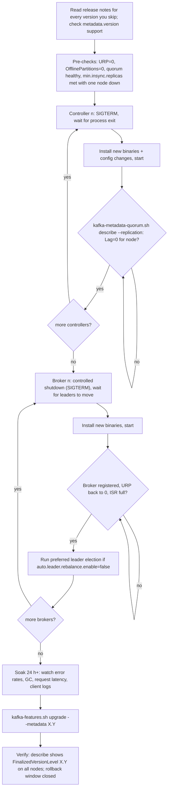
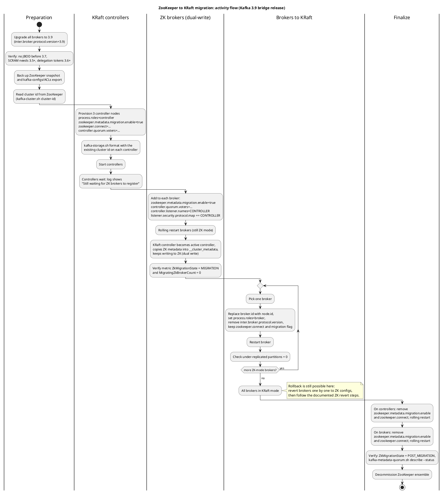
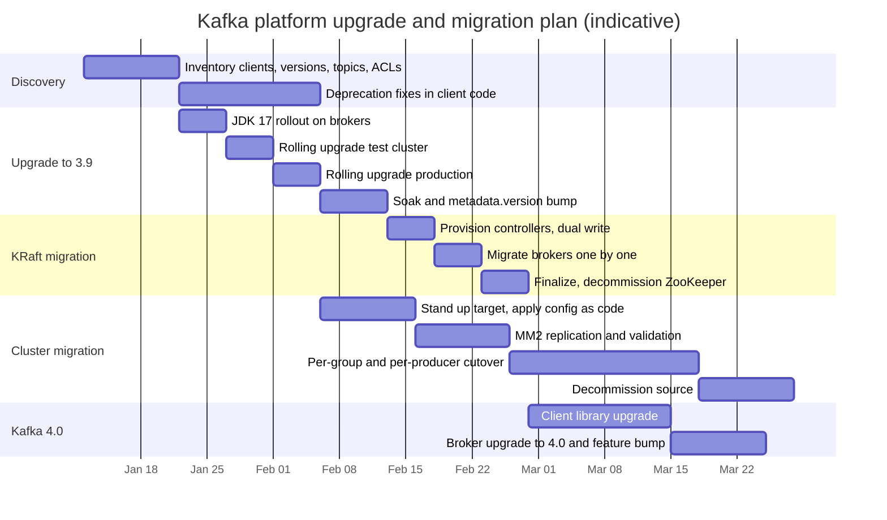

# Upgrades and Migration

**Roles:** [ARCH] [ADMIN] [DEV]   **Level:** Advanced
**Prerequisites:** `01-fundamentals` (KRaft roles, metadata log, protocol negotiation), `03-admin/01-cluster-setup`, `03-admin/07-backup-recovery-and-dr` (MM2, offset translation)

## What you will learn
- How versioning works in KRaft: `metadata.version` and `kafka-features.sh` replace `inter.broker.protocol.version`
- A rolling upgrade procedure with the checks that make it safe, and the client compatibility rules behind it
- The ZooKeeper to KRaft migration end to end: prerequisites, dual-write phase, broker migration, finalization, rollback windows
- What changes when moving to Kafka 4.0 (Java 17, removed configs and tools, new consumer protocol, log4j2)
- Migrating workloads between clusters (on-prem to cloud, self-managed to MSK or Confluent Cloud) with per-topic and per-group cutover and zero data loss
- Migrating from JMS-style brokers, choosing a managed platform, and planning the project with a risk register

## 1. Concept

### 1.1 Versioning in a KRaft cluster

Three things carry a version:

| What | Where it lives | How it changes | Purpose |
|------|----------------|----------------|---------|
| Software version | the jar on each node | rolling restart with new binaries | bug fixes, new code paths |
| `metadata.version` (a *feature*) | the metadata log, cluster-wide | `kafka-features.sh upgrade` after all nodes run the new software | gates which metadata records and RPCs the controller may write; the KRaft replacement for `inter.broker.protocol.version` |
| Other features (`kraft.version` since 3.9, `group.version`, `transaction.version`, `eligible.leader.replicas.version`, `share.version` since 4.0) | the metadata log | `kafka-features.sh upgrade --feature <name>=<level>` | enable behaviours that need every node to understand them |

In ZooKeeper mode the operator edited `inter.broker.protocol.version` in every `server.properties` and did a second rolling restart. In KRaft mode `inter.broker.protocol.version` is ignored (and removed in 4.0). The `metadata.version` is a single value stored once in the cluster and changed with one command:

```bash
kafka-features.sh --bootstrap-server broker-1.kafka.internal:9092 --command-config /etc/kafka/admin.properties describe
# Feature: metadata.version  SupportedMinVersion: 3.0-IV1  SupportedMaxVersion: 3.9-IV0  FinalizedVersionLevel: 3.8-IV0  Epoch: 42

kafka-features.sh --bootstrap-server broker-1.kafka.internal:9092 --command-config /etc/kafka/admin.properties upgrade --metadata 3.9
# or, since 3.9, upgrade every feature to the levels shipped with a release
kafka-features.sh --bootstrap-server broker-1.kafka.internal:9092 --command-config /etc/kafka/admin.properties upgrade --release-version 3.9
```

The upgrade is refused if any registered broker or controller does not support the requested level, which is the safety mechanism that replaced the manual two-phase restart.

**Downgrade rules.** `kafka-features.sh downgrade --metadata 3.8` works only when no metadata record written at the higher level exists in the log; otherwise the controller refuses. `--unsafe` forces it and may lose metadata (for example records that only the newer version understands). Practical rule: software can always be rolled back **until** `metadata.version` has been bumped; after the bump, plan for forward-only. Wait at least one full day of normal operation between the binary upgrade and the feature upgrade.

### 1.2 Client compatibility

- Since 0.10.0 (KIP-35) every client sends `ApiVersionsRequest` on connect and the broker returns, per API key, the version range it supports. Clients then use the highest common version.
- Since 0.10.2 (KIP-97) Java clients are **bidirectionally compatible**: a newer client talks to an older broker and vice versa, within the supported range.
- Kafka 4.0 brokers dropped the oldest protocol versions (KIP-896): clients must be 2.1 or newer (Java; librdkafka 1.0+ equivalents). A 1.x client will fail on connect with `UnsupportedVersionException`.
- New client features (idempotence by default in 3.0, the new consumer protocol in 4.0, `KIP-848` `group.protocol=consumer`) silently fall back or fail depending on the feature; read the release notes for each one.

Upgrade order that never breaks: **brokers and controllers first, then clients** for features; but a **newer client on an older broker** is also fine as long as you do not enable features the broker lacks. Streams applications should stay at most one or two minor versions ahead of the brokers and never require a broker feature that is not finalized.

Check what a broker exposes:

```bash
kafka-broker-api-versions.sh --bootstrap-server broker-1.kafka.internal:9092 --command-config /etc/kafka/admin.properties | head -20
```

## 2. How it works internally

### 2.1 Rolling upgrade flow (KRaft)



Controllers first, then brokers, is the order used by operators such as Strimzi, and it guarantees that the active controller understands every registration a new broker sends. Upgrading brokers first also works within a supported version range.

Per-node commands:

```bash
ADMIN="--bootstrap-server broker-1.kafka.internal:9092 --command-config /etc/kafka/admin.properties"

# Pre-checks
kafka-topics.sh $ADMIN --describe --under-replicated-partitions          # expect empty
kafka-topics.sh $ADMIN --describe --unavailable-partitions               # expect empty
kafka-metadata-quorum.sh $ADMIN describe --replication                   # Lag 0 on all voters
kafka-metadata-quorum.sh $ADMIN describe --status                        # one leader, all voters listed

# Stop one node gracefully (controlled shutdown moves leaders first)
sudo systemctl stop kafka
# Wait for the process; controlled.shutdown.max.retries=3 by default
# Upgrade binaries (package or tarball symlink switch), apply config changes, then:
sudo systemctl start kafka

# Post-checks for the node
kafka-broker-api-versions.sh $ADMIN | grep "broker-2"
kafka-topics.sh $ADMIN --describe --under-replicated-partitions          # wait until empty
kafka-leader-election.sh $ADMIN --election-type PREFERRED --all-topic-partitions

# After every node and the soak:
kafka-features.sh $ADMIN upgrade --metadata 3.9
kafka-features.sh $ADMIN describe
```

> **Production tip:** keep the previous binary directory on the host and make "rollback" a symlink switch plus restart. Once `metadata.version` is bumped, remove the old directory so nobody rolls back into an unsupported combination.

### 2.2 ZooKeeper to KRaft migration

The migration (KIP-866) was early access in 3.4, production-ready in 3.6, and the **last version that supports ZooKeeper and therefore the migration is 3.9**. Kafka 4.0 cannot read ZooKeeper at all, so every ZooKeeper cluster goes through 3.9 (the bridge release). Any earlier 3.x version can be used as a bridge (3.4+), but 3.9 has the most fixes and supports every feature during migration.

```mermaid
stateDiagram-v2
    [*] --> ZK_MODE : cluster on 3.9 with ZooKeeper
    ZK_MODE --> PRE_MIGRATION : KRaft controllers started with zookeeper.metadata.migration.enable=true
    PRE_MIGRATION --> MIGRATION : all ZK brokers restarted with migration configs; controller copies ZK metadata into __cluster_metadata (dual write)
    MIGRATION --> MIGRATION : brokers restarted one by one in KRaft mode (process.roles=broker)
    MIGRATION --> ZK_MODE : rollback: revert brokers to ZK configs, stop controllers, clean /controller and /migration znodes
    MIGRATION --> POST_MIGRATION : all brokers in KRaft mode; controllers restarted without migration flag and zookeeper.connect
    POST_MIGRATION --> KRAFT_ONLY : brokers restarted without zookeeper.connect; ZooKeeper decommissioned
    KRAFT_ONLY --> [*]
    note right of POST_MIGRATION
        No rollback to ZooKeeper after this point.
        Observe metric ZkMigrationState.
    end note
```



**Prerequisites**

| Check | Why |
|-------|-----|
| All brokers on 3.9 with `inter.broker.protocol.version=3.9` (3.4 minimum) | the controller requires a metadata version of at least 3.4 to migrate |
| No JBOD (multiple `log.dirs`) unless brokers are 3.7+ | KRaft JBOD support arrived in 3.7 (KIP-858); earlier versions refuse to migrate multi-dir brokers |
| SCRAM users: 3.5+ | SCRAM records in the metadata log (KIP-900) |
| Delegation tokens: 3.6+ | token records in the metadata log |
| No `AclAuthorizer` after migration | ZooKeeper-based; the migration copies ACLs into the metadata log, then switch to `StandardAuthorizer` |
| Node ids for controllers must not collide with any `broker.id` | controllers and brokers share the id space |
| ZooKeeper snapshot backed up; `kafka-acls.sh --list`, `kafka-configs.sh --describe --all` exported | rollback and audit |
| `kafka-cluster.sh cluster-id --bootstrap-server ...` recorded | controllers must be formatted with the **existing** cluster id |

**Phase 1: provision controllers**

```properties
# controller.properties (node 3001, one per controller host)
process.roles=controller
node.id=3001
controller.quorum.voters=3001@controller-1.kafka.internal:9094,3002@controller-2.kafka.internal:9094,3003@controller-3.kafka.internal:9094
listeners=CONTROLLER://controller-1.kafka.internal:9094
controller.listener.names=CONTROLLER
listener.security.protocol.map=CONTROLLER:SSL
log.dirs=/var/lib/kafka/metadata
# migration-specific
zookeeper.metadata.migration.enable=true
zookeeper.connect=zk-1.kafka.internal:2181,zk-2.kafka.internal:2181,zk-3.kafka.internal:2181/kafka
# same security settings as the brokers' inter-broker listener so brokers can connect
ssl.keystore.location=/etc/kafka/tls/controller-1.keystore.p12
ssl.keystore.password=...
ssl.truststore.location=/etc/kafka/tls/truststore.p12
ssl.truststore.password=...
ssl.client.auth=required
authorizer.class.name=org.apache.kafka.metadata.authorizer.StandardAuthorizer
super.users=User:CN=broker-1.kafka.internal;User:CN=broker-2.kafka.internal;User:CN=broker-3.kafka.internal;User:CN=controller-1.kafka.internal;User:CN=controller-2.kafka.internal;User:CN=controller-3.kafka.internal
```

```bash
CLUSTER_ID=$(kafka-cluster.sh cluster-id --bootstrap-server broker-1.kafka.internal:9092 --config /etc/kafka/admin.properties | awk '{print $NF}')
kafka-storage.sh format --cluster-id $CLUSTER_ID --config /etc/kafka/controller.properties
kafka-server-start.sh -daemon /etc/kafka/controller.properties
# Controller log: "Still waiting for ZK brokers [...] to register with KRaft"
```

The migration uses a **static** quorum (`controller.quorum.voters`); dynamic quorums (`controller.quorum.bootstrap.servers`, KIP-853) can be adopted after the migration.

**Phase 2: enable dual-write on the ZooKeeper brokers**

Add to every broker's `server.properties` (still `broker.id`, still `zookeeper.connect`, no `process.roles`):

```properties
inter.broker.protocol.version=3.9
zookeeper.metadata.migration.enable=true
controller.quorum.voters=3001@controller-1.kafka.internal:9094,3002@controller-2.kafka.internal:9094,3003@controller-3.kafka.internal:9094
controller.listener.names=CONTROLLER
listener.security.protocol.map=INTERNAL:SASL_SSL,EXTERNAL:SASL_SSL,CONTROLLER:SSL
```

Rolling restart. When the last broker registers, the KRaft leader takes over as active controller, copies ZooKeeper metadata into `__cluster_metadata` and logs `Completed migration of metadata from ZooKeeper to KRaft`. From now on, it writes every change to both stores (dual write), so the ZooKeeper brokers and any rollback keep working.

Verify:

```bash
# On any broker's JMX: kafka.controller:type=KafkaController,name=ZkMigrationState  (expect MIGRATION)
# kafka.controller:type=KafkaController,name=MigratingZkBrokerCount               (number of brokers still in ZK mode)
kafka-metadata-quorum.sh --bootstrap-server broker-1.kafka.internal:9092 --command-config /etc/kafka/admin.properties describe --status
kafka-topics.sh --bootstrap-server broker-1.kafka.internal:9092 --command-config /etc/kafka/admin.properties --describe --under-replicated-partitions
```

**Phase 3: migrate brokers one at a time**

For each broker, replace the ZooKeeper-mode settings with KRaft ones and restart:

```properties
process.roles=broker
node.id=1                                # same value as the old broker.id
controller.quorum.voters=3001@controller-1.kafka.internal:9094,3002@controller-2.kafka.internal:9094,3003@controller-3.kafka.internal:9094
controller.listener.names=CONTROLLER
listener.security.protocol.map=INTERNAL:SASL_SSL,EXTERNAL:SASL_SSL,CONTROLLER:SSL
# keep these two until finalization; they allow rollback
zookeeper.metadata.migration.enable=true
zookeeper.connect=zk-1.kafka.internal:2181,zk-2.kafka.internal:2181,zk-3.kafka.internal:2181/kafka
# remove: broker.id, inter.broker.protocol.version, control.plane.listener.name
```

The broker reads its `meta.properties` (which the migration upgraded to include the cluster id and node id), registers with the KRaft quorum, and serves the same partitions from the same `log.dirs`. Wait for under-replicated partitions to return to zero between brokers.

**Rollback window.** While any of these hold, you can revert:
- brokers still in ZooKeeper mode: just remove the migration configs and restart them;
- brokers already in KRaft mode but controllers still dual-writing: revert each broker to its ZooKeeper-mode configuration (since 3.7 the documented procedure is supported), then stop the KRaft controllers, delete `/controller` and `/migration` znodes in ZooKeeper (`zookeeper-shell.sh zk-1.kafka.internal:2181/kafka deleteall /migration`) so a ZooKeeper broker can become controller again, then restart brokers without migration configs.

**Phase 4: finalize**

1. Controllers: remove `zookeeper.metadata.migration.enable` and `zookeeper.connect`; rolling restart. The metric `ZkMigrationState` moves to `POST_MIGRATION`; dual write stops. **This is the point of no return.**
2. Brokers: remove `zookeeper.metadata.migration.enable` and `zookeeper.connect`; rolling restart.
3. Verify `kafka-metadata-quorum.sh describe --status`, run the DR test suite, then decommission ZooKeeper.



Source: `diagrams/08-upgrades-and-migration-zk-to-kraft-phases.puml`.

**What breaks or surprises people**

| Item | Detail |
|------|--------|
| `kafka-configs.sh --zookeeper`, `kafka-acls.sh --authorizer-properties zookeeper.connect` | stop working once brokers are in KRaft mode; use `--bootstrap-server` |
| Tools that read `/brokers/ids` in ZooKeeper (old monitoring, Burrow configs, Cruise Control ZK mode) | must be reconfigured to the Admin API |
| `AclAuthorizer` | must become `StandardAuthorizer` on brokers **and** controllers, with `super.users` including broker/controller principals |
| Dynamic broker configs with `password.encoder.secret` | KRaft does not use the ZooKeeper password encoder; re-apply sensitive dynamic configs after migration |
| Topic ids | ZooKeeper clusters upgraded from before 2.8 may have partitions without topic ids; the migration assigns them |
| `controller.quorum.voters` must match on every node | a typo in one broker produces `InconsistentClusterIdException` or a broker that never registers |
| Controller listener security | brokers connect to controllers as clients; the broker keystore must be trusted by controllers and the principal must be a super user |

### 2.3 Migrating to Kafka 4.0

| Change | Impact | Action |
|--------|--------|--------|
| ZooKeeper removed | no ZK mode, no migration | migrate to KRaft on 3.9 first; a KRaft cluster on `metadata.version` 3.3-IV3 or higher can upgrade directly (KIP-1124) |
| Java 17 minimum for brokers, Connect and tools; Java 11 minimum for clients and Streams (KIP-1013, KIP-1032) | JDK upgrade on every host and every client build | upgrade JDKs before the Kafka upgrade; check GC flags (`-XX:+UseG1GC` still default) |
| Old protocol versions dropped (KIP-896) | clients older than 2.1 cannot connect | inventory clients with `kafka.server:type=socket-server-metrics` `ClientSoftwareName`/`ClientSoftwareVersion` tags (KIP-511) or `kafka.network:type=RequestMetrics,name=RequestsPerSec,request=Produce,version=N` |
| `inter.broker.protocol.version`, `log.message.format.version`, `zookeeper.*`, `control.plane.listener.name`, `--zookeeper` flags removed | configs fail validation or are ignored | delete from `server.properties`; message format v0/v1 topics must be rewritten (KIP-724 dropped old format support in 4.0) |
| MirrorMaker 1 removed (`kafka-mirror-maker.sh`) | any MM1 pipelines stop | move to MM2 (`connect-mirror-maker.sh`) before 4.0 |
| log4j 1 / reload4j replaced by log4j2 (KIP-653) | `log4j.properties` no longer read | convert to `log4j2.yaml`; update `KAFKA_LOG4J_OPTS=-Dlog4j2.configurationFile=...`; logger names unchanged (`kafka.authorizer.logger`, `kafka.request.logger`) |
| New consumer rebalance protocol GA (KIP-848) | `group.protocol=consumer` on clients; broker `group.coordinator.rebalance.protocols=classic,consumer`; feature `group.version` | opt in per application; classic protocol still supported |
| Deprecated client APIs removed (for example `Producer.sendOffsetsToTransaction(Map, String)`, the old `org.apache.kafka.streams.processor.Processor` and `Transformer` APIs, `KStream#through`) | compile errors | fix code against 3.9 deprecation warnings first |
| `kafka.security.authorizer.AclAuthorizer` removed | broker fails to start | `StandardAuthorizer` |
| Eligible Leader Replicas (KIP-966), queues (KIP-932) | opt-in features | leave off until validated |

Sequence: JDK 17 on brokers -> upgrade to 3.9 -> KRaft migration -> fix deprecations in clients on 3.9 libraries -> upgrade brokers to 4.0 -> `kafka-features.sh upgrade --release-version 4.0` -> upgrade clients.

## 3. Configuration that matters

| Parameter | Default | Recommended during upgrades | Why |
|-----------|---------|-----------------------------|-----|
| `controlled.shutdown.enable` | `true` | `true` | leaders migrate before the process exits |
| `controlled.shutdown.max.retries` / `controlled.shutdown.retry.backoff.ms` | 3 / 5000 | 10 / 5000 | large brokers need more time to hand off leaders |
| `auto.leader.rebalance.enable` | `true` | `true` (or run `kafka-leader-election.sh --election-type PREFERRED` after each node) | restore leader balance after every restart |
| `leader.imbalance.check.interval.seconds` | 300 | 300 | rebalance cadence |
| `min.insync.replicas` vs RF | 1 | RF=3, `min.insync.replicas=2` | one broker down must not block producers |
| `replica.lag.time.max.ms` | 30000 | 30000 | a restarting broker rejoins the ISR after catching up within this window |
| `num.recovery.threads.per.data.dir` | 1 | cores per dir | faster restarts if a shutdown was not clean |
| `metadata.version` | as formatted | bump only after soak | rollback window |
| `unstable.api.versions.enable` / `unstable.feature.versions.enable` | `false` | `false` | never enable preview features in production |
| Client `reconnect.backoff.max.ms`, `retries`/`delivery.timeout.ms` | 1000 / 120000 | keep defaults or higher | producers ride through a broker restart |
| Consumer `session.timeout.ms` | 45000 | 45000 | consumers survive a coordinator move |

## 4. Failure modes and how to detect them

| Symptom | Likely cause | Metric / log to check | Fix |
|---------|--------------|-----------------------|-----|
| `kafka-features.sh upgrade` refused with "does not support" | one node still on old binaries | `kafka-features.sh describe`, broker registrations | upgrade the node |
| Broker fails to start after upgrade: `InconsistentClusterIdException` | wrong cluster id in `meta.properties` (formatted with a new random id) | `server.log` | reformat with the correct id; never `random-uuid` on an existing cluster |
| Producers time out during rolling restart | `min.insync.replicas` equals RF, or leaders not moved (SIGKILL) | `NotEnoughReplicasException`, `controlled.shutdown` log lines | fix ISR sizing; stop with SIGTERM and wait |
| Consumers rebalance on every restart | coordinator moved; `session.timeout.ms` too small | consumer log `Group coordinator ... is unavailable` | expected once per coordinator move; tune timeouts, use static membership |
| After migration, ACL changes are rejected | `AclAuthorizer` still configured | broker log | `StandardAuthorizer` |
| KRaft controller logs `Still waiting for ZK brokers` forever | a broker without migration configs, or `inter.broker.protocol.version` below 3.4 | controller log lists the ids | fix that broker's config, restart |
| Migrated broker does not register | `controller.quorum.voters` typo, wrong controller listener security | broker log connection errors to 9094 | fix config; check TLS trust and `super.users` |
| 4.0 broker refuses to start with `log4j` errors | old `log4j.properties` and `KAFKA_LOG4J_OPTS` | stdout | provide `log4j2.yaml` |
| Old clients fail with `UnsupportedVersionException` on 4.0 | KIP-896 | client log | upgrade clients to 2.1+ before brokers |
| Streams app stuck after broker upgrade | Streams version requires broker feature not finalized (for example transaction v2) | Streams log `UnsupportedVersionException` | finalize feature or downgrade `processing.guarantee` settings |

## 5. Design guidance (architect view)

### 5.1 Migrating between clusters

Typical drivers: data-centre exit, on-prem to cloud, self-managed to MSK or Confluent Cloud, or a cluster whose id, security or topology cannot be fixed in place. The pattern is always **replicate, then cut over per consumer group and per producer**, never a big-bang switch.

```mermaid
sequenceDiagram
    participant OLD as Old cluster
    participant REP as MM2 / Cluster Link
    participant NEW as New cluster
    participant CG as Consumer group billing-app
    participant PR as Producer orders-service

    Note over OLD,NEW: Phase 0 - topics, ACLs, quotas, schemas applied from git to NEW
    OLD->>REP: mirror topics + group offsets (IdentityReplicationPolicy, sync.group.offsets.enabled)
    REP->>NEW: orders, billing.*, _schemas ... with translated offsets
    Note over REP: wait until replication-latency-ms is stable and small
    CG->>CG: 1. stop consumers (drain in-flight work, commit)
    REP->>NEW: 2. final checkpoint sync for billing-app (wait one sync interval)
    CG->>NEW: 3. start consumers with new bootstrap.servers; they resume from translated offsets
    Note over CG,NEW: consumers now read replicated data on NEW; producers still write to OLD
    PR->>PR: 4. stop producer (or flip a feature flag)
    REP->>NEW: 5. wait until MM2 lag for orders = 0 (heartbeat / offsets)
    PR->>NEW: 6. start producer against NEW
    Note over OLD,NEW: repeat 1-6 per group/producer; topics with no writers on OLD are done
    REP-->>NEW: 7. stop mirroring topic once no producer writes to OLD; delete OLD topic later
```

Rules that keep this lossless:
1. **Consumers move before producers** for a given topic. A consumer reading from NEW sees everything the producer wrote to OLD via replication; the reverse (producer on NEW, consumer still on OLD) loses data unless you mirror both directions.
2. **Wait for lag zero** before starting the producer on NEW, otherwise NEW consumers see records out of order across the cutover boundary (late OLD records arriving after new ones).
3. **Never dual-write from the application** ("send to both clusters and stop later"). It doubles producer latency, creates non-identical histories when one send fails, and offsets between the two copies cannot be reconciled. Replication is the one writer to NEW until cutover.
4. **Idempotent consumers**: with MM2 offset translation a group may re-read up to `offset.lag.max` records per partition on cutover.
5. **Transactional producers** get fresh producer ids on NEW; in-flight transactions on OLD at the moment of stop are aborted by `transaction.timeout.ms` and must be re-sent by the application.
6. **Kafka Streams** apps: stop, let MM2 mirror the changelog and repartition topics (`<app.id>-*`), start on NEW with the same `application.id`; state stores rebuild from the mirrored changelogs. Or simpler: reset the application (`kafka-streams-application-reset.sh`) if reprocessing from the input topics is acceptable.

> **Anti-pattern:** cutting over by changing DNS for `bootstrap.servers` while both clusters serve traffic. Clients cache metadata and keep talking to the brokers they already know; you end up with producers split across clusters and no idea which records went where.

**Cloud-managed target specifics**

| Target | Replication tool | Notable constraints |
|--------|------------------|---------------------|
| Amazon MSK (provisioned) | MM2 on Connect or MSK Connect, or MSK Replicator (managed MM2-like, offset translation supported) | IAM auth (`sasl.mechanism=AWS_MSK_IAM`, extra client jar) or SCRAM via Secrets Manager; KRaft available on 3.7+ clusters; Express brokers limit some configs |
| Amazon MSK Serverless | MSK Replicator or MM2 | IAM only; partition, throughput and retention caps; no custom broker configs |
| Confluent Cloud | Cluster Linking from any Apache Kafka 2.4+ source (source-initiated links for firewalled sources), or MM2 | API-key or OAuth auth; Schema Registry migration via Schema Linking/exporter; cluster types (Basic/Standard/Enterprise/Dedicated) differ in limits |
| Azure Event Hubs (Kafka endpoint) | MM2 (Event Hubs cannot be an MM2 source for offset sync in all tiers) | Kafka protocol compatibility subset; check current limits on transactions, compaction and Streams; namespace-level throughput units |
| Redpanda | MM2 or Redpanda's own tooling | Kafka-API compatible, no KRaft or ZooKeeper; some admin APIs differ (`rpk`) |
| WarpStream (Confluent) | MM2 | object-storage-backed stateless agents; higher end-to-end latency (hundreds of ms) by design; some APIs unsupported |

### 5.2 Schema Registry migration (Confluent Schema Registry)

Schema ids are embedded in every record (`0x00` magic byte + 4-byte id). If the new registry assigns different ids, every already-produced record on the new cluster deserializes into the wrong schema or fails. Preserve ids:

1. Put the target registry in **IMPORT** mode: `curl -X PUT -H "Content-Type: application/json" --data '{"mode":"IMPORT"}' https://sr-new:8081/mode` (requires an empty registry, or `?force=true`).
2. Register each schema with its original id and version: `POST /subjects/<subject>/versions` with body `{"schema":"...","schemaType":"AVRO","id":42,"version":3}`. The `id` and `version` fields are honoured only in IMPORT mode.
3. Set the mode back: `{"mode":"READWRITE"}`.
4. Alternatively mirror the `_schemas` topic with MM2 (same name, compacted) and start the new registry against it, or use Confluent **Schema Linking** (`confluent schema-registry exporter create`) between Confluent registries, which keeps ids and contexts in sync continuously.

Export from the source:

```bash
SR=https://sr-old:8081
for s in $(curl -s $SR/subjects | jq -r '.[]'); do
  for v in $(curl -s $SR/subjects/$s/versions | jq -r '.[]'); do
    curl -s $SR/subjects/$s/versions/$v > "schemas/${s}-${v}.json"
  done
done
# each file carries subject, version, id, schemaType, schema
```

### 5.3 Migrating from RabbitMQ, ActiveMQ and JMS

| JMS / AMQP concept | Kafka equivalent | Semantic difference to design around |
|--------------------|------------------|--------------------------------------|
| Queue (competing consumers, message removed on ack) | topic + consumer group | records stay until retention; a group tracks offsets, other groups can re-read; `KIP-932` share groups (4.0 early access) are the closer analogue |
| Topic (pub/sub) | topic with one group per subscriber | same, plus replay |
| Per-message ack / nack / requeue | offset commit per partition | you cannot skip one bad message and ack the next in the same partition; use a dead-letter topic and commit past it |
| Message selectors / routing keys / exchanges | partition keys, separate topics, Streams/consumer-side filtering | brokers do not filter; design topics by consumer needs |
| Priority queues | none | separate topics per priority with independent consumers |
| Delayed / scheduled delivery | none built in | scheduler topic + Streams punctuator, or an external scheduler |
| TTL per message | retention per topic (`retention.ms`) | only whole-topic policies |
| Request/reply with temporary queues | reply topic + correlation id header | consumers must handle unrelated replies on the shared reply topic |
| Transactions across queues | Kafka transactions across topics and offsets | Kafka transactions are not XA; no 2PC with a database |
| Message ordering | per partition only | choose a key that carries the ordering requirement |
| Large messages (MB) | avoid; claim-check pattern with object storage | `message.max.bytes` default ~1 MB |

Migration pattern: bridge with Kafka Connect (JMS source connector, RabbitMQ source connector) so Kafka consumers can be built and validated while producers stay on the old broker; then move producers; then retire the bridge. Keep the message id in a header for deduplication because the bridge is at-least-once.

### 5.4 Compatibility matrix (indicative; verify against release notes)

| Component | Works with brokers | Notes |
|-----------|--------------------|-------|
| Java clients 3.x | 0.10.0+ (2.1+ for 4.0 brokers per KIP-896 applies the other way: 4.0 brokers need 2.1+ clients) | bidirectional since 0.10.2 |
| Java clients 4.0 | 2.1+ | dropped old protocol versions |
| Kafka Streams 3.x | 2.x+ brokers for most features; EOS v2 needs 2.5+ | keep Streams ≤ broker version + 1 minor when possible |
| Kafka Streams 4.0 | 2.1+; new group protocol for Streams (KIP-1071) needs 4.1+ brokers | Java 11+ |
| Kafka Connect | same version as brokers recommended; runtime compatible with 2.x+ brokers | EOS source connectors need 3.3+ workers and 2.5+ brokers |
| MirrorMaker 2 | 2.4+ on both sides; `IdentityReplicationPolicy` 3.1+; EOS 3.5+ | target must support topic creation by MM2 principal |
| Confluent Schema Registry (CP) | CP 7.7 pairs with Kafka 3.7, 7.8 with 3.8, 7.9 with 3.9, 8.0 with 4.0 | registry only needs a Kafka client; runs against older brokers |
| Strimzi operator | each Strimzi release supports the two or three most recent Kafka versions | operator upgrade before Kafka upgrade |

### 5.5 Project plan



### 5.6 Risk register

| # | Risk | Likelihood | Impact | Mitigation | Owner |
|---|------|------------|--------|------------|-------|
| 1 | Old client (< 2.1) discovered after 4.0 upgrade | medium | high | client inventory via `ClientSoftwareVersion` metrics before upgrade; block upgrade until fixed | platform |
| 2 | `metadata.version` bumped before a regression is found | low | high | 7-day soak; rollback rehearsed on test cluster | platform |
| 3 | Migration controller formatted with wrong cluster id | medium | high | script reads id from `kafka-cluster.sh`; review before format | platform |
| 4 | Broker restart during migration exceeds `min.insync.replicas` tolerance | medium | medium | pre-check URP=0; maintenance window; one node at a time | SRE |
| 5 | Consumer group offsets not translated at cutover | medium | high | verify `kafka-consumer-groups.sh --describe` on target before switching each group; idempotent consumers | app teams |
| 6 | Schema ids diverge on the new registry | medium | high | IMPORT mode with ids preserved; test deserialization of old records on the new cluster | data platform |
| 7 | Dual-write introduced by an app team "to be safe" | medium | high | architecture review; only replication writes to the target | architecture |
| 8 | ACL drift between clusters | high | medium | ACLs from git applied to both; nightly diff | platform |
| 9 | Cloud target limits (partition count, message size) block a topic | medium | medium | compare topic configs against target limits in discovery | architecture |
| 10 | Rollback window missed (ZooKeeper decommissioned too early) | low | high | keep ZooKeeper running (idle) for 30 days after finalization | SRE |

## 6. Hands-on

Rehearse a rolling upgrade and metadata bump on a 3-node KRaft lab (combined mode) using Docker or three local processes. The commands are the same as production:

```bash
ADMIN="--bootstrap-server localhost:9092"

# 1. Baseline
kafka-features.sh $ADMIN describe
kafka-broker-api-versions.sh $ADMIN | grep -c "id:"        # 3 nodes

# 2. Generate traffic during the whole exercise
kafka-producer-perf-test.sh --topic upgrade-test --num-records 5000000 --record-size 512 --throughput 5000 \
  --producer-props bootstrap.servers=localhost:9092,localhost:9093,localhost:9094 acks=all enable.idempotence=true &
kafka-consumer-perf-test.sh --bootstrap-server localhost:9092 --topic upgrade-test --group upgrade-cg --messages 5000000 --show-detailed-stats --reporting-interval 5000 &

# 3. Roll node 1
kafka-topics.sh $ADMIN --describe --under-replicated-partitions      # empty
kill -TERM $(pgrep -f "server-1.properties"); sleep 10
# switch symlink /opt/kafka -> /opt/kafka_2.13-3.9.x, then
kafka-server-start.sh -daemon /etc/kafka/server-1.properties
until [ -z "$(kafka-topics.sh $ADMIN --describe --under-replicated-partitions)" ]; do sleep 2; done
kafka-metadata-quorum.sh $ADMIN describe --replication

# 4. Repeat for nodes 2 and 3, then verify the producer never logged errors:
#    "record-error-rate" must be 0; the perf test output shows no "Expiring" messages

# 5. Bump metadata version and verify
kafka-features.sh $ADMIN upgrade --metadata 3.9
kafka-features.sh $ADMIN describe

# 6. Attempt a downgrade to see the guard rail
kafka-features.sh $ADMIN downgrade --metadata 3.8 || echo "refused as expected: metadata records at 3.9 exist"
```

For the ZooKeeper to KRaft rehearsal, use the Apache Kafka `docker-compose` examples from the 3.9 release or the Strimzi `KafkaNodePool` migration on a Kubernetes test namespace, and script the four phases exactly as in section 2.2 so the production run is a replay.

## 7. Interview questions for this chapter

### Q1. What replaced `inter.broker.protocol.version` in KRaft and why is it safer?
**Role:** [ADMIN] | **Difficulty:** ★☆☆ | **Topic:** Upgrades

**Answer.**
`metadata.version`, a feature level stored once in the metadata log and changed with `kafka-features.sh upgrade --metadata 3.9` (or `--release-version`). It is safer because the controller checks the supported range every node registered with and refuses the bump if any node cannot handle it, whereas `inter.broker.protocol.version` was a per-file setting that an operator could set inconsistently or forget on one broker. It also removes the second rolling restart: the bump is one RPC.

**Follow-up probes.** Can you downgrade? What does `--unsafe` risk?

### Q2. In what order do you upgrade brokers, controllers and clients, and what breaks if you get it wrong?
**Role:** [ADMIN] | **Difficulty:** ★★☆ | **Topic:** Compatibility

**Answer.**
Controllers, then brokers, then bump `metadata.version`, then clients that want new features. Clients negotiate API versions on connect (KIP-35) and Java clients are bidirectionally compatible since 0.10.2 (KIP-97), so a newer client on an older broker usually works but cannot use features the broker lacks; a client that enables such a feature (for example `group.protocol=consumer` on a 3.8 broker) fails with `UnsupportedVersionException`. Kafka 4.0 brokers refuse clients older than 2.1 (KIP-896), so client inventory precedes the 4.0 upgrade.

**Follow-up probes.** How do you find the versions of connected clients? Is Streams ahead of brokers acceptable?

### Q3. Walk through the ZooKeeper to KRaft migration and name the point of no return.
**Role:** [ADMIN] | **Difficulty:** ★★★ | **Topic:** KRaft migration

**Answer.**
Upgrade everything to 3.9 with `inter.broker.protocol.version=3.9`. Format new controller nodes with the existing cluster id, `process.roles=controller`, `zookeeper.metadata.migration.enable=true` and `zookeeper.connect`, start them. Add the migration flag, `controller.quorum.voters`, `controller.listener.names` and the CONTROLLER protocol mapping to every ZooKeeper broker and roll them; the KRaft controller becomes active, copies the metadata and dual-writes to ZooKeeper. Then convert brokers one at a time to `process.roles=broker`/`node.id`, keeping the migration flag and `zookeeper.connect`. Rollback to ZooKeeper mode is possible until you restart the controllers **without** the migration flag; that restart ends dual write and is the point of no return, after which brokers drop `zookeeper.connect` and ZooKeeper is decommissioned.

**Follow-up probes.** What must be true about SCRAM and JBOD? Which metric tells you the migration state?

### Q4. Why is application-level dual-writing to old and new clusters an anti-pattern during a migration?
**Role:** [ARCH] | **Difficulty:** ★★☆ | **Topic:** Cluster migration

**Answer.**
It creates two histories that are not identical: any send that succeeds on one cluster and fails on the other (timeouts, `NotEnoughReplicas`, ordering under retries) leaves gaps or reorders, and there is no offset relationship between the copies, so consumers cannot be switched deterministically. It doubles producer latency and error handling complexity, and it hides the real cutover problem instead of solving it. A single replication path (MM2 or Cluster Linking) gives one authoritative copy with offset translation, and the cutover becomes a per-group, per-producer sequence with a verifiable lag-zero condition.

**Follow-up probes.** How do you guarantee ordering across the cutover boundary? What about transactional producers?

### Q5. How do you move consumers to a new cluster without losing or duplicating data?
**Role:** [DEV] | **Difficulty:** ★★☆ | **Topic:** Cluster migration

**Answer.**
Replicate the topics and sync group offsets first (`sync.group.offsets.enabled=true`, `IdentityReplicationPolicy`). Stop the consumer group cleanly so it commits, wait one offset-sync interval so the final commit is translated, verify with `kafka-consumer-groups.sh --describe` on the new cluster, then start the consumers with the new `bootstrap.servers`. Loss is impossible because translation rounds down to an earlier offset; duplication is bounded by `offset.lag.max` per partition, so the consumer must be idempotent or deduplicate on a business key. Move producers only after the consumers, and only once replication lag is zero.

**Follow-up probes.** What if the group was excluded by the MM2 `groups` filter? How does Cluster Linking simplify this?

### Q6. What must you change to run on Kafka 4.0, beyond removing ZooKeeper?
**Role:** [ADMIN] | **Difficulty:** ★★☆ | **Topic:** Kafka 4.0

**Answer.**
Java 17 for brokers, Connect and tools (Java 11 for clients and Streams); remove `inter.broker.protocol.version`, `log.message.format.version`, all `zookeeper.*` and `control.plane.listener.name`; convert `log4j.properties` to `log4j2.yaml`; replace MirrorMaker 1 with MM2; ensure every client is 2.1+; recompile clients against 3.9 to fix removed deprecated APIs (old Streams `Transformer`/`Processor` APIs, `KStream#through`); switch any remaining `AclAuthorizer` to `StandardAuthorizer`. Optional: enable the new consumer protocol per app and finalize features with `kafka-features.sh upgrade --release-version 4.0`.

**Follow-up probes.** What does KIP-848 change for consumer rebalances? Which metadata.version can upgrade directly to 4.0?

### Q7. A team wants to move from ActiveMQ to Kafka and asks for "per-message ack and requeue". What do you tell them?
**Role:** [ARCH] | **Difficulty:** ★★☆ | **Topic:** Messaging migration

**Answer.**
Kafka has no per-message ack: a consumer commits an offset per partition, which means "everything before this is done". A poison message therefore cannot be skipped in place; the pattern is to write it to a dead-letter topic with the failure reason in headers, commit past it, and reprocess from the DLT later. Requeue with delay is a scheduler topic or retry topics with increasing delays. In exchange the team gains replay, multiple independent consumer groups and ordering per key. If they truly need queue semantics with individual acknowledgement, Kafka 4.0's share groups (KIP-932, early access) are the emerging answer, not yet a production default.

**Follow-up probes.** How do you preserve ordering with retry topics? What is the claim-check pattern?

### Q8. How do you preserve Schema Registry ids when migrating to a new registry, and what happens if you do not?
**Role:** [DEV] | **Difficulty:** ★★☆ | **Topic:** Schema migration

**Answer.**
Every serialized record starts with a magic byte and the 4-byte schema id, so a registry that assigns different ids makes existing records deserialize with the wrong schema or fail with a 40403 lookup error. Put the target in `IMPORT` mode (`PUT /mode {"mode":"IMPORT"}` on an empty registry), register each schema with explicit `id` and `version` in the request body, then return to `READWRITE`. Alternatives are mirroring the `_schemas` topic byte for byte or using Confluent Schema Linking, both of which preserve ids by construction.

**Follow-up probes.** What about subject naming strategies across clusters? How do contexts help in Schema Linking?

## Key takeaways
- In KRaft, software upgrades are rolling restarts; behaviour upgrades are `kafka-features.sh upgrade --metadata`, guarded by node registrations and only downgradable before new records are written.
- Clients negotiate protocol versions; upgrade brokers before enabling client features, and inventory clients before Kafka 4.0 (2.1+ required).
- The ZooKeeper to KRaft migration runs through 3.9: controllers with the migration flag, dual write, brokers converted one by one, finalization as the irreversible step.
- Kafka 4.0 removes ZooKeeper, MirrorMaker 1, log4j 1 and old configs, and requires Java 17 on the server side.
- Migrate between clusters with one replication path and per-group, per-producer cutover: consumers first, producers after lag zero, never dual-write from applications.
- Preserve Schema Registry ids, keep the control plane in git, and carry a risk register: most migration failures are process failures, not Kafka failures.

## Further reading
- Apache Kafka documentation, section 1.5 "Upgrading" and section 6.9 "ZooKeeper to KRaft Migration"
- KIP-35: Retrieving protocol version; KIP-97: Improved Kafka Client RPC Compatibility Policy; KIP-896: Remove old client protocol API versions in Kafka 4.0
- KIP-778: KRaft to KRaft Upgrades (`metadata.version`, `kafka-features.sh`); KIP-1022: Formatting and Updating Features
- KIP-866: ZooKeeper to KRaft Migration; KIP-858: Handle JBOD broker disk failure in KRaft; KIP-900: SCRAM in KRaft
- KIP-1013 and KIP-1032: Drop Java 8/11 support; KIP-653: Upgrade log4j to log4j2; KIP-724: Drop support for message formats v0 and v1
- KIP-848: The Next Generation of the Consumer Rebalance Protocol; KIP-932: Queues for Kafka
- Confluent documentation: Schema Registry IMPORT mode, Schema Linking, Cluster Linking migration guides; AWS MSK Replicator documentation
