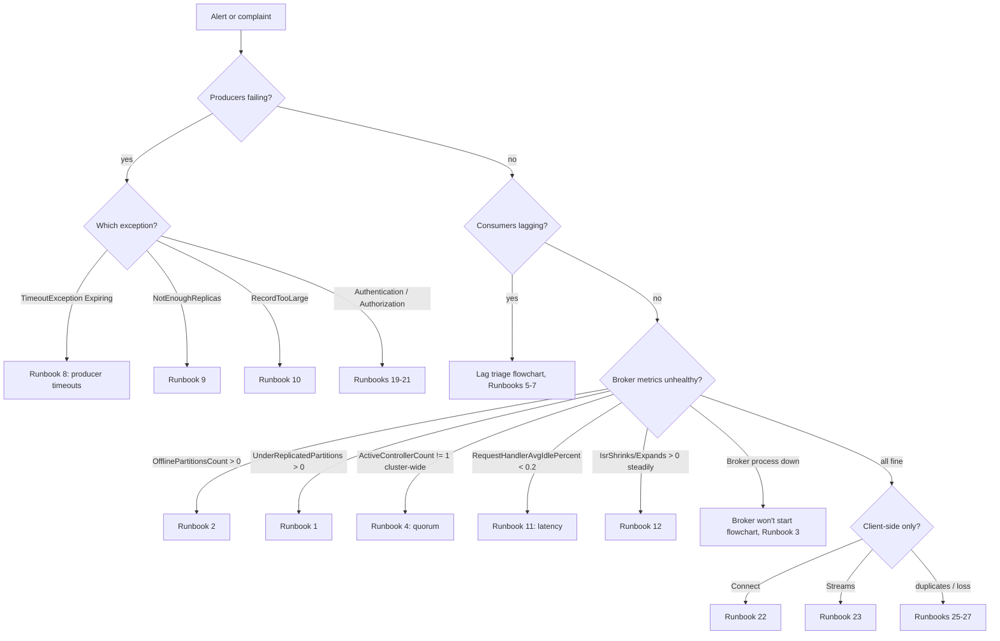
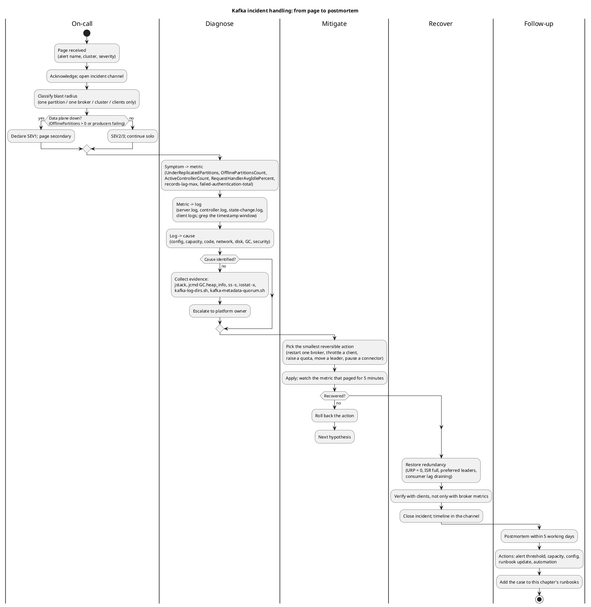
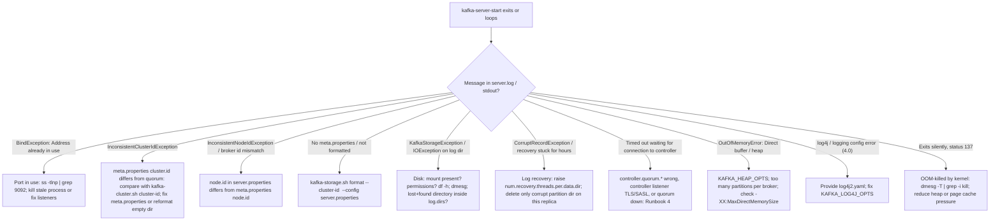
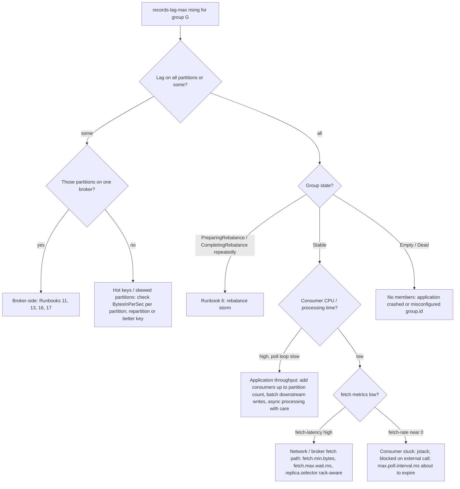

# Troubleshooting Runbooks

**Roles:** [ADMIN] [DEV] [ARCH]   **Level:** Advanced
**Prerequisites:** `03-admin/05-monitoring` (metric names, JMX), `03-admin/06-security`, `03-admin/07-backup-recovery-and-dr`

## What you will learn
- A repeatable diagnostic method: symptom -> metric -> log -> cause -> fix
- Runbooks for 28 recurring incidents, each with symptoms, diagnosis commands, root causes, fix and prevention
- The command toolbox: `kafka-dump-log.sh`, `kafka-log-dirs.sh`, `kafka-metadata-quorum.sh`, `kafka-replica-verification.sh`, `jstack`, `jcmd`, `ss`, `iostat`
- How to triage consumer lag and a broker that will not start with decision trees
- How to run an incident from page to postmortem

## 1. Concept: the diagnostic method

Kafka incidents look alike from the outside (lag, timeouts, errors) and differ inside (disk, GC, network, config, security, client bug). The method is to refuse to guess and to walk one ladder every time:

| Step | Question | Where |
|------|----------|-------|
| Symptom | What does the user or alert see? Which clients, which topics, since when? | alert, client logs, ticket |
| Metric | Which broker or client metric moved at that time? | JMX / Prometheus: `UnderReplicatedPartitions`, `OfflinePartitionsCount`, `ActiveControllerCount`, `RequestHandlerAvgIdlePercent`, `records-lag-max`, `failed-authentication-total` |
| Log | What did the broker, controller or client log in that window? | `server.log`, `controller.log`, `state-change.log`, `log-cleaner.log`, client logs |
| Cause | Which resource, config or code path explains both the metric and the log? | config diff, capacity, deploy history |
| Fix | Smallest reversible action that removes the cause, then restore redundancy | runbook |



Every runbook below uses `ADMIN="--bootstrap-server broker-1.kafka.internal:9092 --command-config /etc/kafka/admin.properties"`.

## 2. How it works internally: incident flow



Source: `diagrams/admin-09-troubleshooting-runbooks-incident-handling.puml`.

### The toolbox

```bash
# Cluster and partition state
kafka-topics.sh $ADMIN --describe --under-replicated-partitions
kafka-topics.sh $ADMIN --describe --unavailable-partitions
kafka-topics.sh $ADMIN --describe --at-min-isr-partitions
kafka-metadata-quorum.sh $ADMIN describe --status
kafka-metadata-quorum.sh $ADMIN describe --replication
kafka-cluster.sh cluster-id --bootstrap-server broker-1.kafka.internal:9092 --config /etc/kafka/admin.properties
kafka-broker-api-versions.sh $ADMIN

# Disk and log directories
kafka-log-dirs.sh $ADMIN --describe --broker-list 1,2,3 --topic-list orders
kafka-log-dirs.sh $ADMIN --describe | jq '.brokers[] | {broker, logDirs: [.logDirs[] | {logDir, error, size: ([.partitions[].size] | add)}]}'
kafka-dump-log.sh --files /var/lib/kafka/data/orders-0/00000000000000000000.log --print-data-log | head
kafka-dump-log.sh --files /var/lib/kafka/data/orders-0/00000000000000000000.index --index-sanity-check
kafka-replica-verification.sh --broker-list broker-1.kafka.internal:9092 --topics-include 'orders' --report-interval-ms 5000

# Consumer groups
kafka-consumer-groups.sh $ADMIN --describe --group billing-app
kafka-consumer-groups.sh $ADMIN --describe --all-groups --state
kafka-consumer-groups.sh $ADMIN --describe --group billing-app --members --verbose

# Configs
kafka-configs.sh $ADMIN --describe --entity-type brokers --entity-name 1 --all
kafka-configs.sh $ADMIN --describe --entity-type topics --entity-name orders --all

# JVM
PID=$(pgrep -f kafka.Kafka)
jstack $PID > /tmp/jstack-$(date +%s).txt
jcmd $PID GC.heap_info
jcmd $PID VM.flags
jstat -gcutil $PID 1000 10

# OS
ss -s                                   # socket summary: TIME-WAIT, ESTAB counts
ss -tnp | awk '{print $5}' | cut -d: -f1 | sort | uniq -c | sort -rn | head   # connections per client IP
iostat -x 5 3                           # await, %util per device
cat /proc/$PID/limits | grep "open files"
ls /proc/$PID/fd | wc -l
dmesg -T | tail -50                     # OOM killer, disk errors
```

`kafka-replica-verification.sh` accepts `--broker-list` in 3.9 (`--bootstrap-server` is accepted as an alias in newer builds); it fetches from all replicas and reports the maximum lag per partition, which finds replicas that diverge without appearing under-replicated.

## 3. Runbooks

### Runbook 1: Under-replicated partitions (URP)

**Symptoms.** `kafka.server:type=ReplicaManager,name=UnderReplicatedPartitions` > 0 for more than a few minutes; producers with `acks=all` may see higher latency; `--at-min-isr-partitions` non-empty.

**Diagnosis.**
```bash
kafka-topics.sh $ADMIN --describe --under-replicated-partitions | awk '{print $6}' | sort | uniq -c   # which broker is missing from ISRs
kafka-log-dirs.sh $ADMIN --describe --broker-list 2 | jq '.brokers[].logDirs[].error'
# On the lagging broker: replica fetcher health
# JMX: kafka.server:type=ReplicaFetcherManager,name=MaxLag,clientId=Replica
# JMX: kafka.server:type=FetcherLagMetrics,name=ConsumerLag,clientId=ReplicaFetcherThread-0-1,topic=orders,partition=3
grep -i "ReplicaFetcherThread\|error\|shutdown" /var/log/kafka/server.log | tail -50
iostat -x 5 3
```

**Root causes.** One broker down or restarting; one broker slow (disk saturated, GC pauses, network); replica fetcher threads dead (`num.replica.fetchers` too low for the partition count); `replica.fetch.max.bytes` smaller than a message on the leader (follower cannot make progress); log dir offline on the follower; inter-broker listener misconfigured after a change.

**Fix.** If a broker is down, bring it back; the ISR heals as followers catch up within `replica.lag.time.max.ms`. If a broker is slow, find the resource (Runbooks 11, 16, 17). If fetchers stopped, restart the broker. If a single partition stays under-replicated forever, check for a message larger than `replica.fetch.max.bytes` on that partition and raise it (it must be at least `message.max.bytes`). Use `kafka-reassign-partitions.sh` to move replicas away from a broker that cannot be repaired.

**Prevention.** Alert on URP > 0 for 5 minutes; `num.replica.fetchers` sized to partitions per broker; `replica.fetch.max.bytes >= message.max.bytes`; disks and network with headroom.

### Runbook 2: Offline partitions

**Symptoms.** `kafka.controller:type=KafkaController,name=OfflinePartitionsCount` > 0; producers get `NotLeaderOrFollowerException` then time out; consumers stall on those partitions.

**Diagnosis.**
```bash
kafka-topics.sh $ADMIN --describe --unavailable-partitions
kafka-topics.sh $ADMIN --describe --topic orders   # Leader: none, Isr: empty or contains only dead brokers
grep "orders-3" /var/log/kafka/controller.log | tail -20
```

**Root causes.** All ISR replicas of the partition are down (correlated broker failures, shared rack, RF=1); log directory failure on the only ISR member; `unclean.leader.election.enable=false` prevents promoting an out-of-sync replica.

**Fix.** Restore any ISR member (fastest and lossless). If none can be restored and availability matters more than the tail, run an unclean election: `kafka-leader-election.sh $ADMIN --election-type UNCLEAN --topic orders --partition 3`. Record the lost range (see chapter 07, section 6.5).

**Prevention.** RF=3 with `broker.rack` spread; never RF=1 in production, including `__consumer_offsets` (`offsets.topic.replication.factor=3`) and `__transaction_state`; alert on `OfflinePartitionsCount` > 0 immediately.

### Runbook 3: Broker will not start



**Diagnosis.**
```bash
journalctl -u kafka -n 200 --no-pager
tail -200 /var/log/kafka/server.log
cat /var/lib/kafka/data/meta.properties            # version, cluster.id, node.id, directory.id (3.7+)
ss -tlnp | grep -E '9092|9093|9094'
df -h /var/lib/kafka/data; ls -la /var/lib/kafka/data | head
dmesg -T | grep -iE 'kill|I/O error' | tail
```

**Root causes.** Port in use (stale JVM, another service); cluster id mismatch (dir formatted with `random-uuid` on an existing cluster, or a data dir copied from another cluster); `meta.properties` missing after a disk replacement; corrupt logs after power loss; log dir mounted at a path that contains `lost+found` (Kafka refuses unknown directories; use a subdirectory of the mount); controller unreachable; JVM memory limits; kernel OOM.

**Fix.** Follow the branch above. For the cluster id case, never delete `meta.properties` on a broker with data unless you are deliberately re-syncing it from other replicas; instead correct the value. For unrecoverable corruption, remove the partition directory on this replica only and let it re-fetch.

**Prevention.** Provisioning scripts read the cluster id from an existing node; `log.dirs` points to a subdirectory of the mount; systemd `Restart=on-failure` with a cap; controlled shutdown always.

### Runbook 4: Controller not elected / KRaft quorum lost

**Symptoms.** No broker reports `kafka.controller:type=KafkaController,name=ActiveControllerCount` = 1; topic creation and leader elections hang; brokers log `Timed out waiting for the controller`; `kafka.server:type=raft-metrics,name=current-state` is `candidate` or `unattached` on controllers; `current-leader` = -1.

**Diagnosis.**
```bash
kafka-metadata-quorum.sh $ADMIN describe --status       # LeaderId: -1, CurrentVoters, CurrentObservers
kafka-metadata-quorum.sh $ADMIN describe --replication  # per voter LogEndOffset, Lag, Status
# on a controller host
grep -iE "election|vote|leader" /var/log/kafka/controller.log | tail -30
ss -tnp | grep 9094
openssl s_client -connect controller-2.kafka.internal:9094 -servername controller-2.kafka.internal </dev/null 2>&1 | grep -E "Verify|error"
```

**Root causes.** Majority of controllers down; network partition between controllers; TLS failure on the controller listener after certificate rotation; `controller.quorum.voters` inconsistent across nodes; disk full on a controller (metadata log cannot append); clock/timeouts (`controller.quorum.election.timeout.ms`, `controller.quorum.fetch.timeout.ms`) too short for a WAN stretch.

**Fix.** Restore network or the dead controllers (same `node.id`). With a lost majority follow chapter 07 section 6.7. For TLS, fix the certificate; controllers re-establish connections without restart of brokers. For a full disk, free space and restart the controller.

**Prevention.** Three or five controllers on separate failure domains; dedicated controller nodes in clusters with more than a handful of brokers; alert when `ActiveControllerCount` summed across the cluster is not 1; monitor controller disk separately; test certificate rotation on controllers first.

### Runbook 5: Consumer lag growing



**Symptoms.** `kafka.consumer:type=consumer-fetch-manager-metrics,client-id=...,records-lag-max` grows; `kafka-consumer-groups.sh --describe` LAG column increasing; downstream SLA misses.

**Diagnosis.**
```bash
kafka-consumer-groups.sh $ADMIN --describe --group billing-app         # per-partition lag, consumer id, host
kafka-consumer-groups.sh $ADMIN --describe --group billing-app --state # Stable? members?
# on the consumer host
jstack $(pgrep -f billing-app) | grep -A 20 "kafka-coordinator-heartbeat\|main"
```

**Root causes.** Processing slower than production rate; fewer consumers than partitions (or more, so some idle); one slow partition (hot key); rebalances; consumer blocked on a downstream system; `max.poll.records` too high for `max.poll.interval.ms`; broker fetch latency.

**Fix.** Scale consumers to partition count; lower `max.poll.records` and make processing per poll bounded; move slow I/O out of the poll loop or use pause/resume; fix skew with a better key or more partitions (note: adding partitions changes key mapping); reset offsets only if the data is disposable (`kafka-consumer-groups.sh --reset-offsets --to-latest --execute`).

**Prevention.** Lag alerts in time units (lag divided by consumption rate) not only record counts; capacity tests; partition count sized for peak with headroom.

### Runbook 6: Rebalance storm / consumers constantly rebalancing

**Symptoms.** Group flips between `PreparingRebalance` and `Stable`; consumer logs show `Attempt to heartbeat failed since group is rebalancing`, `Member ... sending LeaveGroup request`; throughput sawtooth; broker `kafka.coordinator.group:type=GroupMetadataManager,name=NumGroupsPreparingRebalance` elevated.

**Diagnosis.**
```bash
kafka-consumer-groups.sh $ADMIN --describe --group billing-app --members --verbose   # membership churn
grep -E "Revoke|Assign|rebalance|LeaveGroup|max.poll.interval" /var/log/billing-app/app.log | tail -50
# coordinator broker log
grep "billing-app" /var/log/kafka/server.log | grep -iE "rebalance|join|leave" | tail -30
```

**Root causes.** `max.poll.interval.ms` (default 300000) exceeded because processing a batch takes too long; `session.timeout.ms` (default 45000) exceeded during GC pauses; pods restarting (crash loops, autoscaler flapping); many instances starting at once; consumers with different `partition.assignment.strategy`; a member with the same `group.instance.id` started twice (fenced).

**Fix.** Raise `max.poll.interval.ms` or lower `max.poll.records`; fix crash loops; use static membership (`group.instance.id`) with `session.timeout.ms` sized for restarts; use `CooperativeStickyAssignor` (or the 4.0 consumer protocol with `group.protocol=consumer`) so a rebalance does not stop the world; stagger deployments.

**Prevention.** Alert on rebalance count per group per hour; include `max.poll.interval.ms` in code review for each consumer; readiness probes that do not kill the pod during startup.

### Runbook 7: `CommitFailedException`

**Symptoms.** `org.apache.kafka.clients.consumer.CommitFailedException: Offset commit cannot be completed since the consumer is not part of an active group for auto partition assignment; it is likely that the consumer was kicked out of the group.`

**Diagnosis.** Measure time between two `poll()` calls in the application versus `max.poll.interval.ms`; check for GC pauses (`jstat -gcutil`) and for blocked threads (`jstack`).

**Root causes.** The consumer exceeded `max.poll.interval.ms` and the coordinator removed it; a rebalance completed while it was still processing; duplicate `group.instance.id`.

**Fix.** Handle the exception by discarding in-memory results for revoked partitions and re-polling (the records will be redelivered); reduce work per poll; commit more often with `commitAsync` inside the loop and `commitSync` on close; use the `ConsumerRebalanceListener` to commit in `onPartitionsRevoked`.

**Prevention.** Idempotent processing; `max.poll.records` × per-record time ≤ `max.poll.interval.ms` / 2.

### Runbook 8: Producer `TimeoutException` "Expiring N records"

**Symptoms.** `org.apache.kafka.common.errors.TimeoutException: Expiring 12 record(s) for orders-3:120000 ms has passed since batch creation`; `record-error-rate` > 0; `buffer-available-bytes` near 0; `bufferpool-wait-ratio` > 0.

**Diagnosis.**
```bash
# producer JMX: kafka.producer:type=producer-metrics,client-id=...: request-latency-avg, record-queue-time-avg, batch-size-avg, buffer-available-bytes
# broker side for the partition leaders
kafka-topics.sh $ADMIN --describe --topic orders | grep "Partition: 3"
# JMX broker: kafka.network:type=RequestMetrics,name=TotalTimeMs,request=Produce (p99) and RemoteTimeMs (waiting for followers)
kafka-topics.sh $ADMIN --describe --under-replicated-partitions
```

**Root causes.** Leader unavailable or slow (URP, GC, disk); network path (security groups, DNS returning unreachable advertised listeners); `acks=all` waiting on slow followers (`RemoteTimeMs`); producer buffer full because throughput exceeds what the cluster accepts (`buffer.memory`, `max.block.ms`); producer quotas throttling (`produce-throttle-time-avg`); `delivery.timeout.ms` too low for the retry policy.

**Fix.** Identify which partitions expire: if all, it is connectivity or the producer host; if some, it is their leaders. Confirm the producer can reach every `advertised.listeners` address. Fix the broker-side cause; raise `delivery.timeout.ms` (must be ≥ `linger.ms` + `request.timeout.ms`) only if the broker is healthy and latency is legitimately high.

**Prevention.** Alert on `record-error-rate`; producer and broker latency dashboards side by side; `advertised.listeners` resolvable from every client network.

### Runbook 9: `NotEnoughReplicasException`

**Symptoms.** Producer with `acks=all` receives `org.apache.kafka.common.errors.NotEnoughReplicasException: Messages are rejected since there are fewer in-sync replicas than required` (or `NotEnoughReplicasAfterAppendException`); broker metric `kafka.server:type=ReplicaManager,name=AtMinIsrPartitionCount`/`UnderMinIsrPartitionCount` > 0.

**Diagnosis.**
```bash
kafka-topics.sh $ADMIN --describe --under-min-isr-partitions
kafka-configs.sh $ADMIN --describe --entity-type topics --entity-name orders --all | grep min.insync.replicas
```

**Root causes.** ISR size dropped below `min.insync.replicas` (a broker down, follower slow); topic created with RF=2 and `min.insync.replicas=2` (no tolerance); a topic-level override set higher than RF.

**Fix.** Restore the follower (Runbook 1). If `min.insync.replicas` > RF-1 by mistake, lower it: `kafka-configs.sh $ADMIN --alter --entity-type topics --entity-name orders --add-config min.insync.replicas=2`. Do not lower to 1 as a reflex: that trades durability permanently for a temporary outage.

**Prevention.** Enforce RF=3 and `min.insync.replicas=2` in topic-creation policy (`create.topic.policy.class.name`); `--at-min-isr-partitions` alert.

### Runbook 10: `RecordTooLargeException`

**Symptoms.** Producer: `org.apache.kafka.common.errors.RecordTooLargeException: The message is 1548576 bytes when serialized which is larger than 1048576, which is the value of the max.request.size configuration` (client side) or `The request included a message larger than the max message size the server will accept` (broker side).

**Diagnosis.** Compare four settings: producer `max.request.size` (1048576), broker `message.max.bytes` (1048588), topic `max.message.bytes`, broker `replica.fetch.max.bytes` (1048576), consumer `max.partition.fetch.bytes` (1048576) and `fetch.max.bytes` (52428800).

**Root causes.** One of the limits above; compression applied on the producer but the limit checked on the compressed batch (broker) versus uncompressed record (client); a sudden payload growth (embedded images, unbounded lists).

**Fix.** Raise all limits consistently on the topic (`max.message.bytes`), the broker (`replica.fetch.max.bytes` ≥ the message size, otherwise replication breaks), the producer and the consumer. Better: claim-check pattern (store payload in object storage, send a reference), or split the record.

**Prevention.** Keep records under 1 MB; validate size in the producer; alert on `RecordTooLargeException` in client logs.

### Runbook 11: High request latency / request handler idle low

**Symptoms.** `kafka.server:type=KafkaRequestHandlerPool,name=RequestHandlerAvgIdlePercent` < 0.2; `kafka.network:type=SocketServer,name=NetworkProcessorAvgIdlePercent` < 0.3; `kafka.network:type=RequestMetrics,name=TotalTimeMs,request=Produce|FetchConsumer|FetchFollower` p99 rising; `RequestQueueTimeMs` rising (threads saturated) or `LocalTimeMs` rising (disk) or `RemoteTimeMs` rising (followers / `fetch.max.wait.ms`).

**Diagnosis.**
```bash
iostat -x 5 3                          # await > 10 ms, %util ~100 on the log device
jstack $PID | grep -c "data-plane-kafka-request-handler"
jstack $PID | grep -A 5 "data-plane-kafka-request-handler" | grep -E "BLOCKED|WAITING" | sort | uniq -c
# JMX: kafka.network:type=RequestMetrics,name=RequestsPerSec,request=Metadata (a metadata storm from misconfigured clients)
# JMX: kafka.server:type=BrokerTopicMetrics,name=TotalProduceRequestsPerSec / BytesInPerSec per topic
ss -s
```

**Root causes.** Too few `num.io.threads` / `num.network.threads` for the request rate; tiny batches (many small produce requests: `linger.ms=0`, `batch.size` small); metadata storms (`metadata.max.age.ms` low on thousands of clients, or clients re-creating producers per message); disk saturation (`LocalTimeMs`); slow followers (`RemoteTimeMs`); a single hot partition; SSL handshake storms from reconnecting clients; page cache pressure from consumers reading old data (lagging consumers cause disk reads).

**Fix.** Split by the `TotalTimeMs` components: queue time -> more threads or fewer requests (batching, quotas on the offender via `kafka-configs.sh --alter --add-config 'request_percentage=20' --entity-type clients --entity-name noisy-app`); local time -> disk (faster storage, `log.flush.*` left at defaults, separate disks); remote time -> follower health or `replica.fetch.wait.max.ms`. Increase `num.io.threads` (default 8) only with CPU headroom.

**Prevention.** Request-rate quotas per client; producer batching guidelines; `RequestHandlerAvgIdlePercent` alert at 0.3; capacity tests at 2× expected rate.

### Runbook 12: ISR shrink/expand flapping

**Symptoms.** `kafka.server:type=ReplicaManager,name=IsrShrinksPerSec` and `IsrExpandsPerSec` both non-zero continuously; `state-change.log` full of `Shrinking ISR` / `Expanding ISR`; producer p99 latency spiky.

**Diagnosis.**
```bash
grep -E "Shrinking ISR|Expanding ISR" /var/log/kafka/server.log | awk '{print $NF}' | sort | uniq -c | sort -rn | head
# JMX on the follower: kafka.server:type=ReplicaFetcherManager,name=MaxLag,clientId=Replica
jstat -gcutil $PID 1000 5              # GC pauses on the follower or the leader
iostat -x 5 3
```

**Root causes.** A follower periodically falling behind by more than `replica.lag.time.max.ms` (30 s): GC pauses, disk stalls, network saturation (cross-AZ bandwidth), too few `num.replica.fetchers`, follower CPU steal on cloud VMs; leader too slow to process fetches (Runbook 11); very large messages making fetches slow.

**Fix.** Address the resource on the flapping broker. Raising `replica.lag.time.max.ms` hides the symptom and increases how stale an in-sync replica may be; use it only as a last resort with a documented reason. Add `num.replica.fetchers` when a broker hosts many partitions.

**Prevention.** Per-broker GC and disk alerts; even partition distribution; avoid a mix of instance types in one cluster.

### Runbook 13: Leader skew / hot broker

**Symptoms.** One broker has far more leaders (`kafka.server:type=ReplicaManager,name=LeaderCount`) or bytes (`BytesInPerSec`) than the others; its request latency is worse; after every restart the imbalance returns or worsens.

**Diagnosis.**
```bash
kafka-topics.sh $ADMIN --describe | grep -oE "Leader: [0-9]+" | sort | uniq -c
kafka-topics.sh $ADMIN --describe --topic orders     # Replicas: 1,2,3 order shows preferred leader
kafka-log-dirs.sh $ADMIN --describe | jq '.brokers[] | {broker, size: ([.logDirs[].partitions[].size] | add)}'
```

**Root causes.** `auto.leader.rebalance.enable=false` or `leader.imbalance.per.broker.percentage` too high, so leaders that moved during restarts never return; partition assignment concentrated on one broker (topics created while another broker was down); a few high-volume partitions landing on the same broker; a new broker added without reassignment.

**Fix.** Preferred leader election: `kafka-leader-election.sh $ADMIN --election-type PREFERRED --all-topic-partitions`. For assignment skew, generate a reassignment: `kafka-reassign-partitions.sh $ADMIN --generate --topics-to-move-json-file topics.json --broker-list 1,2,3,4` then `--execute --reassignment-json-file plan.json --throttle 100000000`, then `--verify`. Use Cruise Control for continuous balancing on large clusters.

**Prevention.** `auto.leader.rebalance.enable=true`; reassignment as part of adding brokers; partition-count-per-broker and bytes-per-broker dashboards.

### Runbook 14: Log cleaner thread died / compaction not happening

**Symptoms.** Compacted topics (`__consumer_offsets`, changelogs) grow without bound; `kafka.log:type=LogCleanerManager,name=uncleanable-partitions-count` > 0 and `uncleanable-bytes` growing; `kafka.log:type=LogCleaner,name=max-dirty-percent` at 100; `kafka.log:type=LogCleanerManager,name=time-since-last-run-ms` large; `log-cleaner.log` shows an exception.

**Diagnosis.**
```bash
tail -100 /var/log/kafka/log-cleaner.log
grep -iE "uncleanable|died|exception" /var/log/kafka/log-cleaner.log | tail -20
kafka-configs.sh $ADMIN --describe --entity-type brokers --entity-default --all | grep -E "log.cleaner"
```

**Root causes.** `CorruptRecordException` in a segment (since 2.x the partition is marked uncleanable instead of killing the thread, KIP-346, but older behaviour or other exceptions can still stop it); `log.cleaner.dedupe.buffer.size` too small for the number of keys (cleaner logs "Cleaner buffer too small"); `log.cleaner.threads` too few for the number of compacted partitions; a record with a very large key/value exceeding `log.cleaner.io.buffer.size`; `log.cleaner.enable=false`; a topic with `cleanup.policy=compact` receiving null-key records (rejected by the broker, but a bug could leave a bad segment).

**Fix.** Restart the broker to restart cleaner threads. Raise `log.cleaner.dedupe.buffer.size` (dynamic per broker: `kafka-configs.sh $ADMIN --entity-type brokers --entity-name 1 --alter --add-config log.cleaner.dedupe.buffer.size=536870912`) and `log.cleaner.threads`. For a corrupt segment on one replica, delete the partition dir on that replica and let it re-fetch; if on the leader, elect a follower first.

**Prevention.** Alert on `uncleanable-partitions-count` > 0 and `time-since-last-run-ms` > 1 h; size `log.cleaner.dedupe.buffer.size` to about 24 bytes × distinct keys per cleaning pass; `log.cleaner.threads` ≥ 2.

### Runbook 15: `__consumer_offsets` too big

**Symptoms.** `kafka-log-dirs.sh` shows `__consumer_offsets-N` at tens of GB; coordinator moves take minutes (`Finished loading offsets and group metadata from __consumer_offsets-12 in 240000 milliseconds`); consumer groups stall during broker restarts.

**Diagnosis.**
```bash
kafka-log-dirs.sh $ADMIN --describe --topic-list __consumer_offsets | jq '[.brokers[].logDirs[].partitions[] | {partition, size}] | sort_by(-.size) | .[0:10]'
kafka-consumer-groups.sh $ADMIN --list | wc -l
kafka-dump-log.sh --files /var/lib/kafka/data/__consumer_offsets-12/00000000000000000000.log --offsets-decoder | head -40
```

**Root causes.** Log cleaner not running (Runbook 14); an application committing offsets at very high frequency (`enable.auto.commit` with `auto.commit.interval.ms=10` or manual commit per record); thousands of transient groups (`console-consumer-*`, per-pod random group ids) never expiring because `offsets.retention.minutes` is large; segment size (`offsets.topic.segment.bytes`) too large so the active segment is never compacted.

**Fix.** Fix the cleaner; cap commit frequency in the offending application (find it via `kafka-dump-log.sh --offsets-decoder` group ids); delete dead groups (`kafka-consumer-groups.sh $ADMIN --delete --group console-consumer-12345`); keep `offsets.topic.segment.bytes` at the 100 MB default.

**Prevention.** Commit interval guidelines (≥ 1 s); group id naming policy; dashboards on `__consumer_offsets` size per partition.

### Runbook 16: Too many open files

**Symptoms.** `java.io.IOException: Too many open files` in `server.log`; broker stops accepting connections; `KafkaStorageException` on new segments; `ls /proc/$PID/fd | wc -l` near the limit.

**Diagnosis.**
```bash
cat /proc/$PID/limits | grep "open files"
ls /proc/$PID/fd | wc -l
ls -l /proc/$PID/fd | awk '{print $NF}' | grep -c "\.log$\|\.index$\|\.timeindex$"    # segment files
ss -tnp | grep -c "$PID"                                                            # sockets
ss -tnp | awk '{print $5}' | cut -d: -f1 | sort | uniq -c | sort -rn | head           # per client IP
```

**Root causes.** `LimitNOFILE` too low for partitions × segments × 3 files plus connections; connection leaks from clients creating producers per request; small `log.segment.bytes` producing many segments; retention keeping years of small segments.

**Fix.** Raise the limit in the systemd unit (`LimitNOFILE=1000000`) and restart; throttle the leaking client with connection quotas (`max.connections.per.ip`, `max.connections`) or fix it; increase segment size / reduce retention for tiny topics.

**Prevention.** Alert at 70% of the FD limit; `max.connections.per.ip` set; client connection hygiene reviewed.

### Runbook 17: GC pauses / long stop-the-world

**Symptoms.** ISR flapping (Runbook 12), controller session loss (`broker.session.timeout.ms` 9 s exceeded, broker fenced by the controller), request latency spikes aligned with GC log entries; `jstat -gcutil` shows frequent full GCs or old-gen near 100%.

**Diagnosis.**
```bash
jcmd $PID GC.heap_info
jstat -gcutil $PID 1000 10
grep -E "Pause Full|Pause Young.*[0-9]{3,}ms" /var/log/kafka/gc.log | tail    # requires -Xlog:gc*:file=/var/log/kafka/gc.log
jcmd $PID VM.flags | tr ' ' '\n' | grep -E "Xmx|UseG1GC|MaxGCPauseMillis|InitiatingHeapOccupancyPercent"
free -g                                                                        # page cache room
```

**Root causes.** Heap too large (page cache starved) or too small (constant GC); `KAFKA_HEAP_OPTS` default `-Xmx1G` left in production; huge fetch responses buffered on heap (`fetch.max.bytes`, many consumers); too many partitions per broker; direct memory exhaustion with SSL; swap enabled.

**Fix.** Heap of 6-8 GB with G1 (`-XX:+UseG1GC -XX:MaxGCPauseMillis=20 -XX:InitiatingHeapOccupancyPercent=35`) is the common production baseline; leave the rest of RAM to the page cache; `vm.swappiness=1`; reduce partitions per broker; investigate memory-hungry consumers (`socket.request.max.bytes`, `queued.max.request.bytes` to bound in-flight bytes).

**Prevention.** GC logging always on; alert on pause time > 1 s; heap sizing in the build standard.

### Runbook 18: Network partition / split-brain symptoms

**Symptoms.** Brokers in one AZ see the others as down (URP, ISR shrinks) while clients in that AZ still produce; controllers lose quorum or re-elect repeatedly; `kafka-metadata-quorum.sh describe --status` differs depending on which node you ask; clients get inconsistent metadata (`NotLeaderOrFollowerException` storms).

**Diagnosis.**
```bash
kafka-metadata-quorum.sh --bootstrap-controller controller-1.kafka.internal:9094 --command-config /etc/kafka/admin.properties describe --status
kafka-metadata-quorum.sh --bootstrap-controller controller-2.kafka.internal:9094 --command-config /etc/kafka/admin.properties describe --status
for h in broker-1 broker-2 broker-3; do nc -zvw2 $h.kafka.internal 9092; done
mtr -rwc 20 broker-3.kafka.internal
ss -s
```

**Root causes.** Cloud network event, misapplied security group or firewall rule, MTU mismatch after a network change (large fetches fail while small requests work), DNS returning stale addresses, a saturated cross-AZ link.

**Fix.** KRaft cannot actually split-brain the controller (Raft needs a majority), but the data plane can appear split: a leader isolated from the controller keeps serving until fenced, then its partitions move. Restore the network; do not restart brokers in the minority side during the partition (they will rejoin cleanly once connectivity returns). Afterwards check for truncation messages and run preferred leader election.

**Prevention.** Controllers across three failure domains; `broker.session.timeout.ms` and `controller.quorum.*` timeouts tuned to actual RTT; network change management with Kafka on the checklist; MTU tests with `ping -M do -s 8972`.

### Runbook 19: SSL handshake failures

**Symptoms.** Client: `javax.net.ssl.SSLHandshakeException: PKIX path building failed`, `No subject alternative names matching IP address`, `Received fatal alert: certificate_required`, `handshake_failure` (protocol/cipher mismatch); broker `server.log`: `Failed authentication with /10.0.5.20 (SSL handshake failed)`; `kafka.server:type=socket-server-metrics,listener=EXTERNAL,networkProcessor=0,name=failed-authentication-total` rising.

**Diagnosis.**
```bash
openssl s_client -connect broker-1.kafka.internal:9093 -servername broker-1.kafka.internal -CAfile /etc/kafka/tls/ca.crt </dev/null 2>&1 | grep -E "Verify return|subject=|issuer=|Protocol|Cipher"
keytool -list -v -keystore /etc/kafka/tls/broker-1.keystore.p12 -storepass changeit | grep -E "Alias|Valid|DNSName|IPAddress"
keytool -list -v -keystore /etc/kafka/tls/truststore.p12 -storepass changeit | grep -E "Alias|Owner"
# verbose handshake on the client
KAFKA_OPTS="-Djavax.net.debug=ssl:handshake" kafka-console-producer.sh --bootstrap-server broker-1.kafka.internal:9093 --producer.config client.properties --topic test
```

**Root causes.** CA missing from truststore; SAN mismatch with `advertised.listeners`; expired certificate; mTLS required but client keystore absent; TLS version/cipher mismatch (old JVM without TLS 1.3, `ssl.enabled.protocols` restricted); wrong keystore password (`ssl.key.password` differs from `ssl.keystore.password`); client speaking plaintext to a TLS port (broker logs `SSL handshake failed` on random-looking bytes).

**Fix.** Correct the certificate chain, SAN or truststore; rotate expired certificates dynamically (chapter 06); align protocols; never set `ssl.endpoint.identification.algorithm=` empty.

**Prevention.** Certificate expiry monitoring (30-day warning); SAN template includes every advertised name; automated rotation.

### Runbook 20: SASL authentication failures

**Symptoms.** `org.apache.kafka.common.errors.SaslAuthenticationException: Authentication failed: Invalid username or password` (SCRAM/PLAIN); `Authentication failed due to invalid credentials with SASL mechanism SCRAM-SHA-512`; `Unexpected Kafka request of type METADATA during SASL handshake`; `Unsupported SASL mechanism`; Kerberos `Clock skew too great` or `Server not found in Kerberos database`; OAUTHBEARER `Invalid JWT`/`expired`.

**Diagnosis.**
```bash
kafka-configs.sh $ADMIN --describe --entity-type users --entity-name payments      # does the SCRAM credential exist, and for which mechanism?
kafka-configs.sh $ADMIN --describe --entity-type brokers --entity-name 1 --all | grep -E "sasl.enabled.mechanisms|listener.name.*sasl"
grep -i "payments" /var/log/kafka/server.log | grep -iE "auth|sasl" | tail
# Kerberos
KAFKA_OPTS="-Dsun.security.krb5.debug=true" kafka-console-consumer.sh --bootstrap-server broker-1.kafka.internal:9093 --consumer.config client.properties --topic test --max-messages 1
klist -kt /etc/security/keytabs/payments.keytab; date; ntpq -p
```

**Root causes.** User created with a different mechanism (`SCRAM-SHA-256` vs `-512`); wrong `security.protocol` on the client (plaintext or SSL against a SASL listener); mechanism not enabled on that listener; password rotated but client not redeployed; Kerberos clock skew > 5 minutes, missing SPN `kafka/<host>@REALM`, `sasl.kerberos.service.name` mismatch; OAuth token audience/issuer mismatch, JWKS unreachable from brokers.

**Fix.** Align mechanism and credentials; correct `security.protocol`; enable the mechanism per listener; fix NTP; fix `sasl.oauthbearer.expected.audience` and network access to the JWKS endpoint.

**Prevention.** Alert on `failed-authentication-total` rate; credential rotation tied to deployment; a smoke-test consumer per mechanism.

### Runbook 21: `TopicAuthorizationException`

**Symptoms.** `org.apache.kafka.common.errors.TopicAuthorizationException: Not authorized to access topics: [orders]`; producers with `auto.create.topics.enable=true` may see it as `Topic orders not present in metadata` because DESCRIBE is denied; `GroupAuthorizationException`, `TransactionalIdAuthorizationException`, `ClusterAuthorizationException` are the same family.

**Diagnosis.**
```bash
kafka-acls.sh $ADMIN --list --topic orders
kafka-acls.sh $ADMIN --list --principal User:payments
grep "DENIED" /var/log/kafka/kafka-authorizer.log | grep payments | tail          # principal, operation, resource, host
```

**Root causes.** Missing ACL; prefixed ACL that does not match (`billing.` vs `billing-`); principal name differs from expectation (full DN because `ssl.principal.mapping.rules` unset; realm suffix in Kerberos); `--allow-host` restriction; DENY rule; consumer missing the group ACL; producer missing transactional id ACL; authorizer enabled on brokers but not controllers, so `CreateTopics` behaves differently from `Produce`.

**Fix.** Add the exact ACL the DENIED line describes; fix principal mapping; remember DENY wins.

**Prevention.** ACLs from git with a per-application template; authorizer log shipped to a searchable store; smoke test after ACL changes.

### Runbook 22: Connect task FAILED with stack trace

**Symptoms.** `GET /connectors/<name>/status` shows `"state":"FAILED"` with a `trace`; `kafka.connect:type=connector-task-metrics,connector=...,task=...,status` = failed; data stops for that task only.

**Diagnosis.**
```bash
curl -s https://connect.kafka.internal:8083/connectors/jdbc-orders/status | jq '.tasks[] | select(.state=="FAILED") | .trace' -r | head -30
curl -s https://connect.kafka.internal:8083/connectors/jdbc-orders/config | jq
grep -A 30 "jdbc-orders" /var/log/kafka/connect.log | grep -E "ERROR|Exception" | tail
```

**Root causes.** Serialization (`DataException: Converting byte[] to Kafka Connect data failed`, wrong `value.converter` or schema mismatch); external system down (JDBC, S3 credentials, HTTP 4xx/5xx); `RetriableException` exhausted (`errors.retry.timeout`); schema incompatibility with Schema Registry (`409` compatibility); a poison record; `ProducerFencedException` in EOS source connectors after a rebalance; connector plugin version mismatch after a worker upgrade.

**Fix.** Read the trace top frame, fix the cause, then restart only the failed tasks: `curl -X POST "https://connect.kafka.internal:8083/connectors/jdbc-orders/restart?includeTasks=true&onlyFailed=true"` (since 3.0). For poison records enable `errors.tolerance=all`, `errors.deadletterqueue.topic.name=dlq.jdbc-orders`, `errors.deadletterqueue.context.headers.enable=true`, `errors.log.enable=true` (sink connectors only for the DLQ). For offsets, use `GET /connectors/<name>/offsets` and `PATCH`/`DELETE` (since 3.6) to skip or reset.

**Prevention.** DLQ on every sink; alert on failed tasks; converter and schema contracts tested in CI; plugin versions pinned.

### Runbook 23: Streams `TaskMigratedException`

**Symptoms.** `org.apache.kafka.streams.errors.TaskMigratedException: ... task 0_3 was migrated to another instance`; usually accompanied by `ProducerFencedException` or `CommitFailedException` in the cause; instance drops to `REBALANCING` and recovers; if repeated, throughput collapses and state stores keep restoring.

**Diagnosis.**
```bash
grep -E "TaskMigratedException|ProducerFenced|max.poll.interval|Rebalance" /var/log/streams-app/app.log | tail -50
kafka-consumer-groups.sh $ADMIN --describe --group billing-aggregator --members --verbose
# JMX streams: kafka.streams:type=stream-thread-metrics,thread-id=...,name=commit-latency-max / process-latency-max / poll-ratio
```

**Root causes.** Processing (including state store access and punctuation) exceeded `max.poll.interval.ms`; long GC; slow state restoration causing rebalance timeouts; instance killed and restarted with the same `application.id` before the old one was fenced; `exactly_once_v2` producer fenced after a rebalance; many threads and huge state with standby replicas disabled.

**Fix.** The exception itself is handled by Streams (thread rejoins). Fix the underlying cause: raise `max.poll.interval.ms`, lower `max.poll.records`, reduce work per record, enable `num.standby.replicas=1` to make failover cheap, use `statestore.cache.max.bytes` and `commit.interval.ms` sensibly, and give the app enough heap and disk for RocksDB.

**Prevention.** Warmup replicas (`max.warmup.replicas`), static membership, monitoring of `restore-latency` and rebalance counts.

### Runbook 24: Clock skew effects

**Symptoms.** Kerberos `Clock skew too great`; TLS `certificate not yet valid`; records rejected with `InvalidTimestampException: Timestamp ... is out of range` (broker `message.timestamp.before.max.ms` / `message.timestamp.after.max.ms`, since 3.6 replacing `message.timestamp.difference.max.ms`); time-based retention deleting data immediately (producer clocks in the past) or never (future timestamps keep the segment's max timestamp ahead of now); Streams windows misaligned; `kafka-consumer-groups.sh --reset-offsets --to-datetime` picking wrong offsets.

**Diagnosis.**
```bash
ntpq -p; chronyc tracking; timedatectl
kafka-dump-log.sh --files /var/lib/kafka/data/orders-0/00000000000012345678.log --print-data-log | grep -oE "CreateTime: [0-9]+" | sort -u | head
kafka-configs.sh $ADMIN --describe --entity-type topics --entity-name orders --all | grep -E "message.timestamp"
```

**Root causes.** NTP not running on brokers or producer hosts; containers inheriting a wrong host clock; producers setting explicit timestamps from bad data.

**Fix.** Fix NTP; for bad producers set the topic to `message.timestamp.type=LogAppendTime` or bound skew with `message.timestamp.before.max.ms`/`message.timestamp.after.max.ms`; for segments with future timestamps retention will only catch up after the clock passes them, so delete with `kafka-delete-records.sh` if needed.

**Prevention.** Clock skew alert (> 1 s) on all Kafka hosts; `LogAppendTime` for topics fed by untrusted producers.

### Runbook 25: Duplicate messages

**Symptoms.** Downstream sees the same business event twice; counts on a consumer exceed producer counts.

**Diagnosis.** Determine the layer: same offset consumed twice (consumer re-delivery after rebalance or restart without commit) vs two offsets with identical payload (producer retry without idempotence, or application resend). Compare `kafka-dump-log.sh --print-data-log` for the topic partition against the application's dedup key; check consumer logs for rebalances near the duplicates; check producer config for `enable.idempotence` (default `true` since 3.0, but `false` if `acks` or `retries` were set incompatibly, or `max.in.flight.requests.per.connection` > 5).

**Root causes.** Consumer at-least-once semantics (crash between processing and commit, `CommitFailedException`); producer without idempotence retrying on timeouts; application retries above the client; MM2 offset translation at failover; transactional consumer without `isolation.level=read_committed` reading aborted records.

**Fix.** Idempotent producer on; transactions (`transactional.id`) for consume-transform-produce with `read_committed` consumers; idempotent consumers keyed by a business id or by `(topic, partition, offset)`; commit after processing, not before.

**Prevention.** Duplicates are part of the contract of at-least-once; design consumers to tolerate them.

### Runbook 26: Message loss investigation

**Symptoms.** A producer claims to have sent a record that no consumer saw.

**Diagnosis.**
```bash
# 1. Did the broker ack it? Producer logs / metrics: record-send-total vs record-error-total; acks setting
# 2. Is it in the log? Find the partition by key and scan
kafka-console-consumer.sh $ADMIN --topic orders --partition 3 --offset 1234000 --max-messages 1000 --property print.offset=true --property print.key=true | grep order-98765
kafka-dump-log.sh --files /var/lib/kafka/data/orders-3/00000000000001200000.log --print-data-log | grep -B2 -A2 order-98765
# 3. Was there an unclean election or truncation?  JMX kafka.controller:type=ControllerStats,name=UncleanLeaderElectionsPerSec; grep "Truncating" server.log
# 4. Did the consumer skip it? auto.offset.reset=latest after losing offsets (offsets.retention.minutes), reset-offsets commands in history
kafka-consumer-groups.sh $ADMIN --describe --group billing-app
# 5. Was it filtered? read_committed hides aborted transactions; retention deleted it before the consumer caught up
```

**Root causes.** `acks=0`/`acks=1` with leader failure; `min.insync.replicas=1`; unclean leader election; producer `send()` without checking the callback / future (`record-error-total` > 0 ignored); consumer offsets expired and `auto.offset.reset=latest`; retention shorter than consumer downtime; consumer committed before processing and crashed; aborted transactions; a filter in Connect (`errors.tolerance=all` without DLQ silently drops).

**Fix.** Depends on the cause; data recovery from DR or upstream if the log itself lost it.

**Prevention.** `acks=all`, `min.insync.replicas=2`, `enable.idempotence=true`, callbacks checked, `unclean.leader.election.enable=false`, retention longer than the worst consumer outage, `auto.offset.reset=earliest` for critical consumers, DLQs everywhere.

### Runbook 27: Unclean leader election happened

**Symptoms.** `UncleanLeaderElectionsPerSec` > 0; `server.log` on the returning old leader: `Truncating to offset N`; consumers report `OffsetOutOfRangeException` and reset; producers may see `UnknownProducerIdException` / `OutOfOrderSequenceException` because idempotent producer state on the new leader is behind.

**Diagnosis.**
```bash
grep -iE "unclean" /var/log/kafka/controller.log | tail
grep -E "Truncating|truncat" /var/log/kafka/server.log | tail
kafka-topics.sh $ADMIN --describe --topic orders
kafka-configs.sh $ADMIN --describe --entity-type topics --entity-name orders --all | grep unclean
```

**Root causes.** `unclean.leader.election.enable=true` at topic or broker level, or a manual `--election-type UNCLEAN`; all ISR members lost together.

**Fix.** Quantify the lost range (old leader LEO before truncation minus new leader's LEO at election); notify data owners; restart producers hitting sequence errors (they obtain fresh producer ids); set `unclean.leader.election.enable=false` if it was on by accident.

**Prevention.** Rack awareness so ISR members do not fail together; `min.insync.replicas=2`; explicit decision process for manual unclean elections.

### Runbook 28: Disk full

**Symptoms.** `java.io.IOException: No space left on device`; `KafkaStorageException`; log dir goes offline (`kafka.server:type=ReplicaManager,name=OfflineLogDirectoryCount` > 0, since JBOD support the broker keeps running with other dirs); partitions on that dir become under-replicated or offline; `df -h` at 100%.

**Diagnosis.**
```bash
df -h /var/lib/kafka/data
kafka-log-dirs.sh $ADMIN --describe --broker-list 1 | jq '[.brokers[].logDirs[].partitions[] | {partition, size}] | sort_by(-.size) | .[0:15]'
du -sh /var/lib/kafka/data/* | sort -rh | head
kafka-configs.sh $ADMIN --describe --entity-type topics --entity-name orders --all | grep -E "retention|segment"
```

**Root causes.** Retention too long or unlimited (`retention.bytes=-1` with high volume); compaction stalled (Runbook 14); a runaway producer; `__consumer_offsets` bloat (Runbook 15); a topic with tiny `segment.ms` creating index files; logs or heap dumps on the same volume; a broker that took over too many partitions after reassignment.

**Fix.** Immediate: reduce retention on the largest topic (`kafka-configs.sh $ADMIN --alter --entity-type topics --entity-name events-raw --add-config retention.ms=3600000`), the deletion runs within `log.retention.check.interval.ms` (5 min); or `kafka-delete-records.sh $ADMIN --offset-json-file delete.json` to truncate a partition to an offset. Do not delete segment files by hand while the broker runs. Then move partitions to other brokers or add disk. Restore retention afterwards.

**Prevention.** Disk alert at 75% with growth-rate projection; `retention.bytes` on every topic as a safety cap; `log.dirs` on a dedicated volume; tiered storage for long retention.

## 4. Failure modes and how to detect them (summary matrix)

| Symptom | Likely cause | Metric / log to check | Runbook |
|---------|--------------|-----------------------|---------|
| URP > 0 | broker down / slow follower | `UnderReplicatedPartitions`, `ReplicaFetcherManager MaxLag` | 1 |
| Offline partitions | all ISR down | `OfflinePartitionsCount`, controller.log | 2 |
| Broker down | port, cluster id, disk, corruption | server.log first ERROR | 3 |
| No controller | quorum majority lost | `kafka-metadata-quorum.sh describe --status` | 4 |
| Lag | throughput, rebalance, hot partition | `records-lag-max`, group state | 5, 6, 7 |
| Producer errors | timeouts, ISR, size | `record-error-rate`, `TotalTimeMs` | 8, 9, 10 |
| Latency | threads, disk, followers | `RequestHandlerAvgIdlePercent`, `RequestQueueTimeMs` | 11 |
| ISR flapping | GC/disk on one broker | `IsrShrinksPerSec`, gc.log | 12, 17 |
| Hot broker | leader skew | `LeaderCount`, `BytesInPerSec` | 13 |
| Compacted topics growing | cleaner | `uncleanable-partitions-count` | 14, 15 |
| FD exhaustion | limits, leaks | `/proc/<pid>/fd` | 16 |
| Split network | infra | quorum status per node | 18 |
| Auth failures | TLS/SASL/ACL | `failed-authentication-total`, authorizer log | 19, 20, 21 |
| Connect/Streams failures | app-level | REST status, app logs | 22, 23 |
| Time-related oddities | NTP | `ntpq -p` | 24 |
| Duplicates / loss | semantics, elections | dump-log, election metrics | 25, 26, 27 |
| Disk full | retention, compaction | `df`, `kafka-log-dirs.sh` | 28 |

## 5. Design guidance (architect view)

- **Observability is a design input.** Every cluster ships the JMX exporter with the metrics named in this chapter, GC logs on, authorizer log on, and client-side metrics collected from producers and consumers. Incidents without client metrics take twice as long.
- **Failure domains decide the blast radius.** Rack awareness, three controllers across zones, `min.insync.replicas=2` and RF=3 turn most runbooks above into non-events.
- **Quotas are a safety system**, not a billing tool: `producer_byte_rate`, `consumer_byte_rate`, `request_percentage` and `max.connections.per.ip` make Runbooks 11 and 16 rare.
- **Platform policies** (`create.topic.policy.class.name`, `alter.config.policy.class.name`) prevent RF=1, `min.insync.replicas` mismatches, tiny segments and unlimited retention at creation time.
- **Runbooks live next to alerts.** Each alert carries a link to its runbook section; every postmortem either changes the runbook or adds one.

> **Anti-pattern:** "restart the broker and see" as the first action. Restarts destroy evidence (`jstack`, heap info, socket state) and turn a slow broker into an under-replicated one for the duration of log recovery. Collect evidence first unless the data plane is down.

## 6. Hands-on: evidence bundle script

Run this on a broker as the first action during any incident; it takes a few seconds and preserves what a restart would destroy.

```bash
#!/usr/bin/env bash
# /usr/local/bin/kafka-evidence.sh  -- collect broker evidence into /var/tmp/kafka-evidence-<ts>
set -u
TS=$(date +%Y%m%dT%H%M%S); OUT=/var/tmp/kafka-evidence-$TS; mkdir -p "$OUT"
PID=$(pgrep -f 'kafka\.Kafka' | head -1)
ADMIN="--bootstrap-server $(hostname -f):9092 --command-config /etc/kafka/admin.properties"

{ date; uptime; free -g; df -h; } > "$OUT/system.txt"
ss -s > "$OUT/ss-summary.txt"; ss -tnp > "$OUT/ss-connections.txt"
iostat -x 2 3 > "$OUT/iostat.txt"
dmesg -T | tail -200 > "$OUT/dmesg.txt"
cat /proc/$PID/limits > "$OUT/limits.txt"; ls /proc/$PID/fd | wc -l > "$OUT/fd-count.txt"
jstack $PID > "$OUT/jstack-1.txt"; sleep 5; jstack $PID > "$OUT/jstack-2.txt"
jcmd $PID GC.heap_info > "$OUT/heap-info.txt"; jcmd $PID VM.flags > "$OUT/vm-flags.txt"
jstat -gcutil $PID 1000 5 > "$OUT/jstat.txt"
tail -2000 /var/log/kafka/server.log > "$OUT/server.log"
tail -500 /var/log/kafka/controller.log > "$OUT/controller.log" 2>/dev/null
tail -500 /var/log/kafka/state-change.log > "$OUT/state-change.log" 2>/dev/null
tail -200 /var/log/kafka/log-cleaner.log > "$OUT/log-cleaner.log" 2>/dev/null
timeout 30 kafka-topics.sh $ADMIN --describe --under-replicated-partitions > "$OUT/urp.txt" 2>&1
timeout 30 kafka-topics.sh $ADMIN --describe --unavailable-partitions > "$OUT/offline.txt" 2>&1
timeout 30 kafka-metadata-quorum.sh $ADMIN describe --replication > "$OUT/quorum.txt" 2>&1
timeout 60 kafka-log-dirs.sh $ADMIN --describe --broker-list "$(grep -E '^node.id' /etc/kafka/server.properties | cut -d= -f2)" > "$OUT/log-dirs.json" 2>&1
timeout 60 kafka-consumer-groups.sh $ADMIN --describe --all-groups --state > "$OUT/groups.txt" 2>&1
tar czf "$OUT.tgz" -C /var/tmp "kafka-evidence-$TS" && echo "evidence: $OUT.tgz"
```

## 7. Interview questions for this chapter

### Q1. Producers report `TimeoutException: Expiring 5 record(s)` for one topic only. Walk through your diagnosis.
**Role:** [ADMIN] | **Difficulty:** ★★☆ | **Topic:** Producer troubleshooting

**Answer.**
One topic means the problem is on that topic's partition leaders, not the producer host. Identify the leaders with `kafka-topics.sh --describe --topic`, check whether they are under-replicated (`acks=all` waits for the ISR), then look at `TotalTimeMs` for Produce on those brokers and split it into queue, local and remote time. High remote time points to slow followers or `min.insync.replicas` waits; high local time to disk; queue time to thread saturation. Also verify the producer can reach those brokers' `advertised.listeners`, since a single unreachable broker produces exactly this per-topic pattern. Fix the broker-side cause before touching `delivery.timeout.ms`.

**Follow-up probes.** What does `buffer-available-bytes` at zero tell you? When is raising `delivery.timeout.ms` the right answer?

### Q2. A broker restarts and takes 40 minutes to come back. Is that normal, and what determines it?
**Role:** [ADMIN] | **Difficulty:** ★★☆ | **Topic:** Broker startup

**Answer.**
It is normal only after an unclean shutdown. Without the `.kafka_cleanshutdown` marker the broker recovers every partition's unflushed segments, validating CRCs and rebuilding indexes, with `num.recovery.threads.per.data.dir` threads (default 1). Time scales with partitions × unflushed bytes. Set the recovery threads to the core count, keep partitions per broker reasonable, and always stop with SIGTERM so controlled shutdown completes. After a clean shutdown a broker is serving within a minute; the ISR catch-up afterwards is separate and depends on how long it was down.

**Follow-up probes.** What happens when recovery finds a corrupt batch? How does log recovery interact with the metadata log?

### Q3. Consumer lag is growing, the group is Stable, consumer CPU is low. What are your top three hypotheses?
**Role:** [DEV] | **Difficulty:** ★★☆ | **Topic:** Lag triage

**Answer.**
First, the consumer is blocked on something outside Kafka (a database call, HTTP client without timeout) so the poll loop is slow; `jstack` shows the main thread waiting, and `poll-ratio`/`fetch-rate` are near zero. Second, fetch latency is high because the broker or network is slow; `fetch-latency-avg` is high while records per fetch are small. Third, a few partitions carry most traffic (hot keys) and the consumer assigned to them is the bottleneck while the others idle; per-partition lag in `kafka-consumer-groups.sh --describe` shows the skew. Each has a different fix: unblock the loop, fix the broker path, or repartition.

**Follow-up probes.** Why does adding consumers beyond the partition count not help? How do you alert on lag in seconds instead of records?

### Q4. Compacted topics keep growing although `cleanup.policy=compact`. Diagnose it.
**Role:** [ADMIN] | **Difficulty:** ★★☆ | **Topic:** Log cleaner

**Answer.**
Check `uncleanable-partitions-count` and `time-since-last-run-ms` on the `LogCleaner` and `LogCleanerManager` MBeans, then `log-cleaner.log` for the exception. Common causes: dedupe buffer too small for the key cardinality (raise `log.cleaner.dedupe.buffer.size`, dynamic), too few `log.cleaner.threads`, a corrupt segment that made the partition uncleanable, or a segment that never rolls because `segment.ms` is large and the active segment is never cleaned. Also confirm `log.cleaner.enable=true` and `min.cleanable.dirty.ratio` is not set to 1. Restarting the broker restarts the cleaner threads once the cause is fixed.

**Follow-up probes.** Why is the active segment never compacted? What does `log.cleaner.max.compaction.lag.ms` add?

### Q5. Two of three controllers are unreachable. What still works, what does not, and what do you do first?
**Role:** [ADMIN] | **Difficulty:** ★★★ | **Topic:** KRaft quorum

**Answer.**
The data plane keeps working for existing leaders: produce, fetch and offset commits continue. Anything needing the controller stops: leader elections when a broker fails, topic creation, config changes, ISR changes, and eventually broker fencing decisions. First determine whether it is a network partition or node loss with `kafka-metadata-quorum.sh describe --status` asked from each side and basic connectivity checks; do not restart brokers meanwhile. If the nodes are gone, rebuild them with the same node ids on fresh metadata directories formatted with the cluster id, and let the survivor win the election, verifying its log end offset against the last known high watermark.

**Follow-up probes.** Why is a network partition treated differently from node loss? What does KIP-853 change?

### Q6. What is your first action when paged for a broker with p99 produce latency of 5 s, and what is explicitly not your first action?
**Role:** [ADMIN] | **Difficulty:** ★☆☆ | **Topic:** Incident method

**Answer.**
Collect evidence before changing anything: `jstack` twice, `jcmd GC.heap_info`, `jstat`, `iostat -x`, `ss -s`, the last 2000 lines of `server.log`, and the request-time breakdown from JMX. Not a restart: it erases the evidence and adds a recovery window plus an under-replicated period. Then classify by the `TotalTimeMs` components and apply the smallest reversible mitigation, such as throttling an offending client with a quota, moving a hot leader, or lowering a runaway topic's retention, before considering a restart.

**Follow-up probes.** Which single metric separates a disk problem from a thread-pool problem? When is an immediate restart justified?

### Q7. An application team reports duplicates after a DR failover. Is this a bug?
**Role:** [ARCH] | **Difficulty:** ★★☆ | **Topic:** Semantics

**Answer.**
No, it is the expected outcome of at-least-once replication. MM2 offset translation rounds down to the last sync point (up to `offset.lag.max` records per partition), so consumers re-read a bounded window. Idempotent producer state is not carried across clusters, so in-flight batches at the moment of failure may be re-sent. Transactions do not span clusters either. The design answer is idempotent consumers keyed by a business identifier or by an origin `(cluster, partition, offset)` header, and a lower `offset.lag.max` if the window must be tighter.

**Follow-up probes.** How would Cluster Linking change this? Can exactly-once be achieved across regions?

### Q8. Explain how you would prove whether a specific record was lost by Kafka or never sent.
**Role:** [DEV] | **Difficulty:** ★★★ | **Topic:** Loss investigation

**Answer.**
Start at the producer: the callback or future for that send must have returned a `RecordMetadata` with partition and offset; if the application ignored errors (`record-error-total` > 0, `acks=0`), the record may never have been acknowledged and Kafka did nothing wrong. With a partition and offset, read that exact position with `kafka-console-consumer.sh --partition --offset` or `kafka-dump-log.sh --print-data-log` on the segment. If the offset now holds a different record or is below the log start offset, check for truncation (`Truncating to offset` on the old leader, `UncleanLeaderElectionsPerSec`) or retention deletion. If the record is present, the consumer skipped it: look for offset resets, `auto.offset.reset=latest` after offset expiry, or `read_committed` hiding an aborted transaction.

**Follow-up probes.** How does `min.insync.replicas=1` with `acks=all` still lose acknowledged data? What does the log start offset tell you?

## Key takeaways
- Always walk symptom -> metric -> log -> cause -> fix; collect evidence before restarting anything.
- Four broker metrics cover most pages: `UnderReplicatedPartitions`, `OfflinePartitionsCount`, `ActiveControllerCount`, `RequestHandlerAvgIdlePercent`; four client metrics cover the rest: `record-error-rate`, `request-latency-avg`, `records-lag-max`, rebalance counts.
- Producer timeouts, `NotEnoughReplicas` and ISR flapping are almost always one slow or dead broker; find it with `--under-replicated-partitions` and `iostat`/`jstat` on that host.
- Lag is either processing, rebalancing, skew, or broker fetch latency; the group state and per-partition lag tell you which.
- Security failures have precise messages: read the exact exception, then check truststore/SAN, mechanism/credential, or the authorizer DENIED line in that order.
- Duplicates are a contract, loss is a bug in configuration (`acks`, `min.insync.replicas`, unclean elections, offset resets); investigate loss with `kafka-dump-log.sh` and the election metrics.

## Further reading
- Apache Kafka documentation, section 6 "Operations" (6.1 Basic Kafka Operations, 6.6 Java Version, 6.7 Hardware and OS, 6.8 Monitoring)
- KIP-346: Improve LogCleaner behavior on error; KIP-112 and KIP-113: JBOD and log directory failure handling
- KIP-511: Collecting and Exposing Client's Name and Version in the Brokers
- KIP-937: Improve Message Timestamp Validation
- KIP-429: Kafka Consumer Incremental Rebalance Protocol; KIP-345: Static Membership; KIP-848: The Next Generation of the Consumer Rebalance Protocol
- KIP-875: First-class offsets support in Kafka Connect
- Confluent documentation: "Kafka Broker Metrics" and "Consumer Lag" monitoring guides
