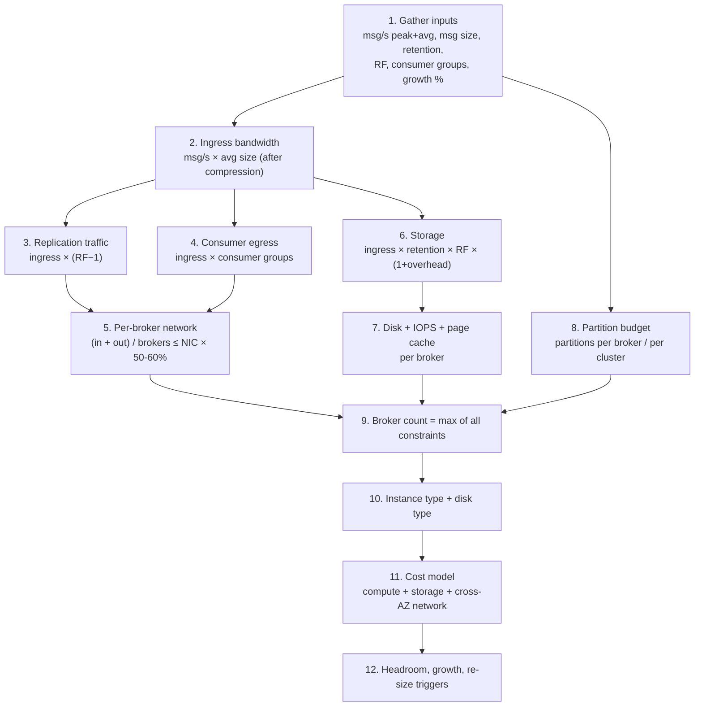
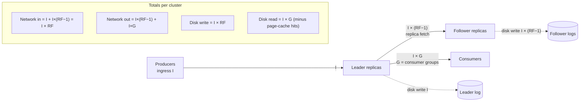
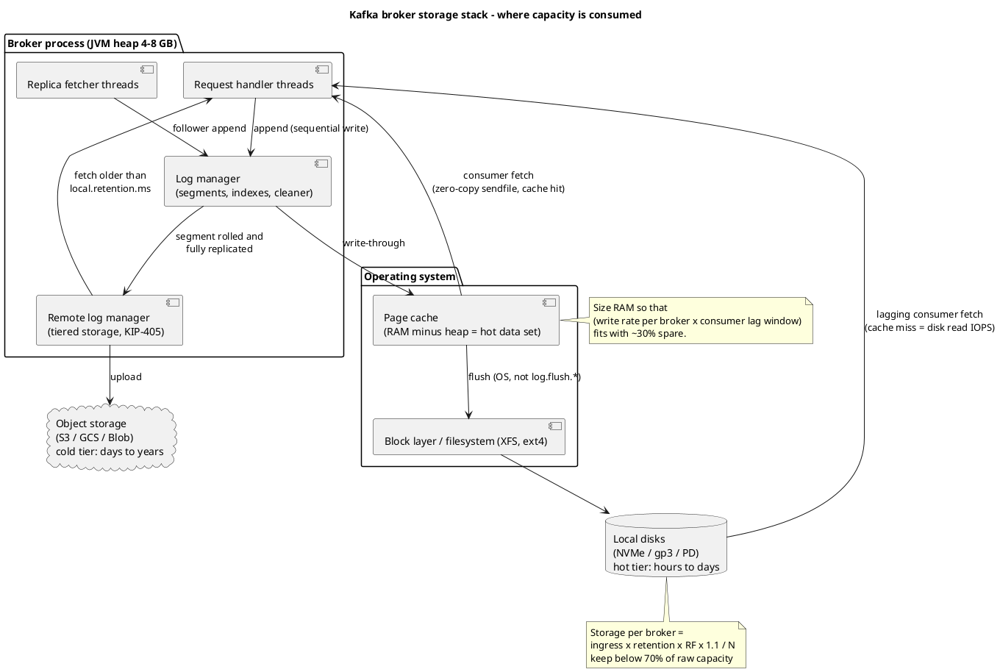

# Capacity Planning and Sizing

**Roles:** [ARCH] [ADMIN]   **Level:** Advanced
**Prerequisites:** Fundamentals – topics, partitions, replication and ISR (`../01-fundamentals/`); Admin – broker configuration, storage and monitoring (`../03-admin/`)

## What you will learn
- A repeatable, step-by-step sizing method that starts from business inputs and ends with a broker count and instance type
- How one byte of producer traffic multiplies into replication, consumer fan-out, and cross-AZ network cost
- How to size storage, IOPS, network, page cache, and the partition budget for a KRaft cluster
- A worked example (200k msg/s, 1 KB, 7 days, RF=3) with real arithmetic you can reuse
- Cloud instance and disk selection guidance, headroom rules, a capacity model layout, and re-sizing triggers

## 1. Concept

Capacity planning for Kafka is arithmetic, not guesswork. Almost every resource a cluster consumes can be derived from six inputs: message rate, message size, retention, replication factor, consumer fan-out, and growth. The mistakes architects make are rarely in the formulas; they are in forgetting a multiplier (replication, fan-out, cross-AZ), sizing for the average instead of the peak, or ignoring that a Kafka broker is really a *page-cache-and-network* appliance rather than a CPU-bound service.

The method below is deliberately linear so it can be repeated every quarter:



> **Production tip:** Size every dimension for the **peak** (the 95th or 99th percentile of the busiest hour, not the daily mean), then apply headroom on top of that. A cluster sized for the mean will fall behind during the exact window when the business cares most.

## 2. How it works internally – where the bytes go

A single produced byte does not stay a single byte. It is written by the leader, fetched by `RF−1` followers, kept on disk `RF` times, and read once per consumer group. If the cluster spans availability zones, most of that traffic crosses an AZ boundary and is billed.



Key mechanics that affect the numbers:

| Mechanism | Effect on sizing |
|-----------|------------------|
| Producer compression (`compression.type`) | Batches are compressed by the producer and stored compressed; broker network, disk, and replication all see the *compressed* size. Size with post-compression bytes. |
| Zero-copy consumer reads (`sendfile`) | Consumers reading data still in page cache cost almost no disk IO and little CPU. Lagging consumers that read from disk are what saturate disks. |
| Replication is a fetch, not a push | Each follower runs `num.replica.fetchers` threads pulling from leaders; replication traffic is "network out" on the leader and "network in" on the follower. |
| Log segments and indexes | Each partition holds `.log`, `.index`, `.timeindex` (and `.txnindex`) files; expect roughly 5–10 % overhead plus one extra active segment per partition that retention cannot delete yet. |
| Retention is per segment | Data is deleted a whole segment at a time, so real disk usage is retention + up to one `log.segment.bytes` per partition. |
| KRaft metadata log | Small in bytes (tens of MB to low GB) but the controller quorum must be sized for partition count and metadata churn, not throughput. |

### 2.1 The storage stack

The diagram below shows where each resource is consumed on a broker. The heap is deliberately small; the page cache is the real read path; local disk is the hot tier; object storage is the cold tier when tiered storage is enabled (KIP-405, production-ready since 3.9).



Source: `diagrams/capacity-planning-and-sizing-storage-stack.puml`.

## 3. The sizing method, step by step

### Step 1 – Gather inputs

| Input | Symbol | How to obtain it | Typical mistake |
|-------|--------|------------------|-----------------|
| Peak message rate | `R_peak` (msg/s) | Busiest sustained 5-minute window, plus planned campaigns/batch loads | Using daily average |
| Average message rate | `R_avg` | Daily mean; used for cost, not for sizing | – |
| Average message size (post-compression) | `S_avg` | Measure `kafka.server:type=BrokerTopicMetrics,name=BytesInPerSec` ÷ `MessagesInPerSec` on a pilot, or a producer-perf test with real payloads and the real codec | Using uncompressed JSON size |
| Max message size | `S_max` | Schema review; sets `message.max.bytes`, `max.request.size`, `fetch.max.bytes` | Ignoring occasional large blobs |
| Retention | `T` (seconds) | Business/regulatory requirement per topic class | One number for every topic |
| Replication factor | `RF` | Durability requirement (usually 3) | – |
| Consumer fan-out | `G` | Number of consumer groups that read the full topic, counted per topic | Forgetting Connect sinks, MirrorMaker, observability consumers |
| Growth | `g` (%/year) | Product roadmap; plan for 12–18 months | Sizing only for today |
| Partition count | `P` | Sum of `partitions × RF` across topics (replicas, not partitions) | Counting partitions, not replicas |

### Step 2 – Ingress bandwidth

```
I = R_peak × S_avg
```

Also compute `I_avg = R_avg × S_avg` for the cost model.

### Step 3 – Replication traffic

```
Replication in  (followers) = I × (RF − 1)
Replication out (leaders)   = I × (RF − 1)
```

### Step 4 – Consumer egress

```
Consumer egress = I × G
```

Add MirrorMaker 2, Connect sinks, and tiered-storage uploads as additional "consumer groups" if they read the full topic.

### Step 5 – Network per broker

```
Cluster network in  = I × RF
Cluster network out = I × (RF − 1) + I × G
Per broker (evenly balanced) = (in + out) / N
Constraint: per broker ≤ NIC_capacity × utilization_target (0.5–0.6)
```

NIC capacity is the *sustained* bandwidth of the instance, which on cloud instances is often lower than the advertised "up to" figure and may be burst-limited on small instances.

### Step 6 – Storage

```
Storage_total = I × T × RF × (1 + overhead)
overhead ≈ 0.10 (indexes, active segment slack, retention check interval)
Usable disk per broker = raw disk × (1 − headroom), headroom 0.25–0.35
Storage per broker = Storage_total / N ≤ usable disk per broker
```

For compacted topics, replace `I × T` with the steady-state key cardinality × average record size × (1 + `min.cleanable.dirty.ratio` slack).

### Step 7 – IOPS and disk throughput

Kafka's IO pattern is sequential appends and mostly sequential reads, so **throughput (MB/s)** matters more than random IOPS. Per broker:

```
Disk write MB/s = (I × RF) / N
Disk read  MB/s = (I × G × cache_miss_fraction) / N
```

`cache_miss_fraction` is 0 for consumers that keep up and 1 for consumers replaying history. Size disks to survive a full replay of one large consumer group plus normal traffic.

### Step 8 – Page cache sizing

The broker JVM heap should stay small (4–8 GB is typical; rarely more than 12 GB) and the rest of RAM is page cache. The page cache should hold the **hot data set**: the data written in the window that active consumers lag by, plus replication lag.

```
Hot set per broker ≈ (I × RF / N) × max_consumer_lag_seconds
RAM per broker     ≈ heap + hot set × 1.3 + OS
```

If the hot set does not fit, consumer reads become disk reads and compete with writes; this is the most common cause of "the cluster got slow when we added one more consumer".

### Step 9 – Partition budget

| Scope | Indicative guidance (KRaft, 3.9/4.0) | Why the limit exists |
|-------|--------------------------------------|----------------------|
| Replicas per broker | Plan ≤ 4,000; ≤ 10,000 with tuning and large heap; treat 20,000+ as a red flag | Open file handles, replica fetcher threads, memory per partition, unclean shutdown recovery time (`num.recovery.threads.per.data.dir`), rebalance/failover time |
| Partitions per cluster | KRaft removes the ZooKeeper-era ceiling (tens of thousands) and has been demonstrated with millions of partitions in metadata, but *clients*, monitoring systems, and operators do not scale linearly with partition count | Metadata response size, controller failover time, consumer group rebalance, metrics cardinality |
| Partitions per topic | Enough for target consumer parallelism and to keep a partition under ~ 10–25 MB/s indicative | Per-partition throughput is bounded by one leader thread and one consumer |
| Controller quorum | Sized by partition count and metadata churn, not throughput | Metadata log replication and snapshot size |

> **Anti-pattern:** Creating topics with 100+ partitions "for future growth" on a cluster with many topics. Partitions are not free; each replica costs file handles, fetcher slots, memory, metadata, and recovery time. Size partitions from throughput and consumer parallelism and add more later (keys will re-hash, so plan for that in the data model).

### Step 10 – Broker count

```
N = max(
  ceil(Storage_total / usable_disk_per_broker),
  ceil((network_in + network_out) / (NIC × 0.55)),
  ceil(total_replicas / replicas_per_broker),
  RF,                                  -- at least RF brokers
  number_of_AZs × k                    -- balanced across AZs (k ≥ 1)
)
```

Then round up to a multiple of the AZ count so rack awareness can place replicas evenly.

### Step 11 – Instance and disk type

See section 5.2.

### Step 12 – Cost model and headroom

See sections 5.3 and 5.4.

## 4. Worked example

**Inputs:** 200,000 msg/s peak, 1 KB average post-compression, 7-day retention, RF = 3, 3 consumer groups reading every topic (application, analytics sink, MirrorMaker 2), 600 partitions across all topics, 3 AZs, 40 % annual growth.

| Step | Calculation | Result |
|------|-------------|--------|
| Ingress `I` | 200,000 × 1 KB | 200 MB/s (≈ 1.6 Gbit/s) |
| Replication | 200 × (3 − 1) | 400 MB/s |
| Consumer egress | 200 × 3 | 600 MB/s |
| Cluster network in | 200 + 400 | 600 MB/s |
| Cluster network out | 400 + 600 | 1,000 MB/s |
| Storage raw | 200 MB/s × 604,800 s × 3 | ≈ 363 TB |
| Storage with 10 % overhead | 363 × 1.1 | ≈ 400 TB |
| Storage with 30 % headroom | 400 / 0.7 | ≈ 570 TB provisioned |
| Total replicas | 600 × 3 | 1,800 |
| Hot set (consumers lag ≤ 10 min) | 600 MB/s × 600 s | 360 GB cluster-wide |

**Broker count by constraint** (assume 10 Gbit/s sustained NIC ≈ 1,250 MB/s, 16 TB usable disk per broker, 4,000 replicas per broker):

| Constraint | Formula | Brokers |
|------------|---------|---------|
| Network | 1,600 MB/s ÷ (1,250 × 0.55) | 3 |
| Storage | 570 TB ÷ 16 TB | 36 |
| Partitions | 1,800 ÷ 4,000 | 1 |
| AZ balance | multiple of 3 | – |
| **Result** | max(...) rounded to multiple of 3 | **36 brokers** |

Storage dominates by a wide margin, which is the normal outcome for retention beyond a day or two. Three architectural levers change the answer:

| Lever | New storage on brokers | New broker count | Trade-off |
|-------|------------------------|------------------|-----------|
| Tiered storage (`remote.log.storage.system.enable=true`, local retention 6 h) | 200 MB/s × 21,600 s × 3 × 1.1 / 0.7 ≈ 20 TB | 6 (now bounded by network at ~ 55 % utilization with 40 % growth margin → 9) | Reads older than 6 h come from object storage with higher latency; requires Kafka ≥ 3.6 (GA in 3.9) and a `RemoteStorageManager` plugin |
| Bigger disks (e.g., 4 × 7.5 TB NVMe local = 30 TB raw ≈ 21 TB usable) | 570 TB ÷ 21 TB | 27 | Local NVMe is lost on instance stop; needs RF for durability and longer re-replication |
| Shorter retention for the largest topics (7 d → 2 d for raw click events) | Recompute per topic class | Varies | Needs a downstream archive (lakehouse) for history |

With tiered storage and 40 % growth, the 200 MB/s becomes 280 MB/s next year; the 9-broker cluster runs at roughly 60–65 % network utilization, which is the point to plan the next expansion.

**Per-broker view (9 brokers, tiered):**

| Resource | Per broker at peak | Notes |
|----------|-------------------|-------|
| Network in | 600 / 9 ≈ 67 MB/s | plus tiered uploads |
| Network out | 1,000 / 9 ≈ 111 MB/s | consumers + replication |
| Disk write | 600 / 9 ≈ 67 MB/s | sequential |
| Local disk | 20 TB / 9 ≈ 2.3 TB, provision 4 TB | gp3 or NVMe |
| Page cache | 360 GB / 9 = 40 GB hot set → 64 GB RAM instance (heap 6 GB) | r-family fits well |
| Replicas | 1,800 / 9 = 200 | far under budget |

## 5. Design guidance (architect view)

### 5.1 Headroom rules

| Resource | Target steady-state utilization | Reason |
|----------|--------------------------------|--------|
| Network | 50–60 % of sustained NIC | Absorbs a broker failure (traffic redistributes to N−1), replica catch-up, and consumer replays |
| Disk capacity | ≤ 70 % | Log cleaner, segment rolling, and retention lag need space; disks above 85 % make brokers unrecoverable in an incident |
| Disk throughput | ≤ 60 % | Replica catch-up after a broker outage doubles write load on the survivors |
| CPU | ≤ 50–60 % | TLS, compression re-encoding (if broker `compression.type` differs from producer), and request handler threads spike during failover |
| RAM (page cache) | Hot set fits with 30 % spare | Avoid disk reads for real-time consumers |
| Partitions per broker | ≤ 70 % of budget | Rebalancing after a broker loss moves leadership and replicas to survivors |

**Rule of N+1 (or N+2 across AZs):** the cluster must stay inside all limits with one broker (or one AZ's worth of brokers) offline.

### 5.2 Cloud instance and disk selection

Indicative guidance; verify against current provider documentation.

| Provider | Compute families that fit Kafka | Storage options | Notes |
|----------|--------------------------------|-----------------|-------|
| AWS | `m6i/m7i` (balanced), `r6i/r7i` (page-cache heavy), `i3en/i4i/im4gn` (local NVMe, storage-dense), Graviton `m7g/r7g` | EBS `gp3` (3,000 IOPS / 125 MB/s baseline, scalable to 16,000 IOPS / 1,000 MB/s), `io2 Block Express` (very high IOPS, expensive), local NVMe | Watch EBS bandwidth caps per instance, not just per volume; NVMe is ephemeral |
| AWS MSK | `kafka.m5.*`, `kafka.m7g.*` broker types; Express brokers (`express.m7g.*`) with MSK-managed storage; MSK Serverless | EBS provisioned per broker with provisioned throughput option; tiered storage on provisioned clusters | Express brokers remove local disk sizing but cap partitions and throughput per broker; see chapter 06 |
| GCP | `n2/n2d` (balanced), `c3` (compute), `m3` (memory) | Persistent Disk `pd-balanced` / `pd-ssd`, Hyperdisk Balanced / Throughput, Local SSD | PD throughput scales with size; Hyperdisk allows independent IOPS/throughput |
| Azure | `Dsv5/Ddsv5` (balanced), `Esv5` (memory), `Lsv3` (local NVMe) | Premium SSD v2 (independent IOPS/throughput), Premium SSD, Ultra Disk | Check VM-level disk bandwidth caps; Premium SSD v2 has zonal constraints |

Disk choice decision table:

| Criterion | EBS gp3 / PD balanced / Premium SSD v2 | io2 / Ultra | Local NVMe |
|-----------|----------------------------------------|-------------|------------|
| Sequential throughput | Good, provision explicitly | Excellent | Excellent |
| Survives instance stop/replace | Yes | Yes | **No** – replica must be rebuilt from peers |
| Cost per TB | Low | High | Included in instance; cannot scale independently |
| Best fit | Most clusters; tiered storage local tier | Latency-critical, small hot tier | Storage-dense, high-throughput, when re-replication time is acceptable |
| Gotcha | Instance-level EBS bandwidth cap | Cost | Broker replacement = full data copy; use tiered storage to shrink it |

> **Production tip:** Put the KRaft controller quorum on separate small instances (3 or 5 nodes, network-attached disk, `process.roles=controller`) rather than combined mode for any cluster with more than a handful of brokers. Controller sizing is driven by partition count and metadata churn, not by throughput.

### 5.3 Cost model

The three cost lines, in the order architects usually *underestimate* them:

| Cost line | Driver | Indicative order of magnitude in the worked example | Lever |
|-----------|--------|-----------------------------------------------------|-------|
| **Cross-AZ network** | Every byte that crosses an AZ: producers → leaders (≈ 2/3 of `I` with random leaders in 3 AZs), replication (2 of 3 replicas in other AZs = 2 × `I`), consumers (≈ 2/3 of `I × G` without follower fetching) | Producers 0.67 × 17 TB/day + replication 35 TB/day + consumers 35 TB/day ≈ 80 TB/day ≈ 2.4 PB/month; at an indicative $0.01/GB per direction ($0.02 per transferred GB) that is on the order of **$45–50k per month**, often more than compute | Follower fetching (KIP-392, `replica.selector.class`) for consumers, rack-aware producers/consumers, compression, fewer consumer groups over the wire (share via a local cache/stream job), single-AZ for non-critical clusters |
| **Storage** | `Storage_total` on block storage, plus object storage for the tiered remote log | 570 TB gp3 vs. ~ 20 TB gp3 + 400 TB object storage with tiering: object storage is typically an order of magnitude cheaper per TB-month | Tiered storage, retention discipline, compression |
| **Compute** | Broker count × instance price + controllers + Connect/Streams/MM2 workers | 36 × storage-dense instances vs. 9 × balanced instances | Tiering reduces brokers because storage stops being the binding constraint |

Tiered storage changes the economics because it decouples retention from broker count: brokers are sized for **throughput and hot data**, object storage is sized for **retention**. It does not reduce cross-AZ replication traffic; the leader still replicates to followers before tiering.

### 5.4 Capacity model layout

Keep the model as a spreadsheet (or a YAML file in Git) with one row per topic class; the columns below are the minimum.

| Column | Example value | Formula |
|--------|---------------|---------|
| Topic class | `orders.events` | – |
| Peak msg/s | 120,000 | input |
| Avg msg/s | 45,000 | input |
| Avg size post-compression (bytes) | 900 | measured |
| Ingress peak (MB/s) | 108 | msg/s × size |
| Ingress avg (MB/s) | 40.5 | – |
| Retention (h) | 168 | input |
| RF | 3 | input |
| Consumer groups | 3 | input |
| Partitions | 240 | input |
| Replicas | 720 | partitions × RF |
| Replication (MB/s) | 216 | ingress × (RF−1) |
| Consumer egress (MB/s) | 324 | ingress × G |
| Storage (TB) | 216 | ingress_avg × retention × RF × 1.1 (use avg for storage, peak for network) |
| Cross-AZ GB/month | … | see 5.3 |
| Growth (%/yr) | 40 | input |
| 12-month ingress (MB/s) | 151 | ingress × (1+g) |

Cluster-level totals sum the rows; the "constraints" block computes brokers per constraint; the "headroom" block shows utilization after N−1 and after 12-month growth.

> **Production tip:** Use average rate for storage (you pay for bytes actually written) and peak rate for network, CPU, and disk throughput (you must survive the burst). Mixing the two in one column is the most common spreadsheet error.

### 5.5 Growth planning and re-sizing triggers

| Trigger | Threshold | Action |
|---------|-----------|--------|
| Network utilization (`kafka.server:type=BrokerTopicMetrics,name=BytesInPerSec` + `BytesOutPerSec` vs NIC) | > 60 % sustained on any broker | Add brokers or rebalance partitions (`kafka-reassign-partitions.sh`, Cruise Control) |
| Disk usage (`kafka.log:type=LogManager` size or OS metric) | > 70 % on any broker | Add brokers, enable tiering, or reduce retention |
| Under-replicated partitions during peak (`UnderReplicatedPartitions`) | > 0 recurring at peak | Followers cannot keep up: disk or network saturation |
| Request queue time (`RequestQueueTimeMs` p99) | Rising trend | Add `num.network.threads` / `num.io.threads`, or more brokers |
| Replicas per broker | > 70 % of budget | Add brokers before adding topics |
| Consumer lag on real-time groups during peak | Growing | Consumers under-provisioned or brokers saturated; check `FetchConsumer` local time |
| Forecast | 12-month forecast breaches any limit | Start procurement/expansion; cloud expansion still needs weeks for reassignment |

Re-sizing is not instantaneous: adding a broker moves nothing until partitions are reassigned, and reassignment itself consumes network and disk throughput (throttle with `--throttle`). Plan expansions when utilization crosses 60 %, not 90 %.

> **Anti-pattern:** Vertical scaling by replacing brokers with larger instances one by one without tiered storage. Each replacement re-copies the entire broker's data over the network, which on a 30 TB broker at a throttled 200 MB/s takes over 40 hours per broker.

## 6. Hands-on

### 6.1 Measure real message size and rate on an existing cluster

```bash
# Bytes in and messages in per second for a topic (JMX via jmxterm/jconsole or your metrics stack)
# MBean: kafka.server:type=BrokerTopicMetrics,name=BytesInPerSec,topic=orders.events
# MBean: kafka.server:type=BrokerTopicMetrics,name=MessagesInPerSec,topic=orders.events
# avg_size = BytesInPerSec.OneMinuteRate / MessagesInPerSec.OneMinuteRate

# Log size per partition on disk
kafka-log-dirs.sh --bootstrap-server broker1:9092 --describe --topic-list orders.events \
  | tail -n1 | jq '[.brokers[].logDirs[].partitions[] | .size] | add / 1e9'   # GB
```

### 6.2 Pilot throughput and compression ratio with real payloads

```bash
# Create a scratch topic sized like production
kafka-topics.sh --bootstrap-server broker1:9092 --create --topic sizing-pilot \
  --partitions 24 --replication-factor 3 --config retention.ms=3600000

# Produce with the production codec and batch settings
kafka-producer-perf-test.sh --topic sizing-pilot --num-records 5000000 --record-size 1024 \
  --throughput -1 --producer-props bootstrap.servers=broker1:9092 \
  compression.type=zstd batch.size=131072 linger.ms=10 acks=all

# Compare producer-reported MB/s with broker BytesInPerSec to derive the compression ratio.
# (random payloads compress poorly; use --payload-file with real samples for realistic ratios)
kafka-producer-perf-test.sh --topic sizing-pilot --num-records 1000000 --throughput -1 \
  --payload-file samples.jsonl --payload-delimiter '\n' \
  --producer-props bootstrap.servers=broker1:9092 compression.type=zstd linger.ms=10
```

### 6.3 Quick sizing calculator (shell)

```bash
#!/usr/bin/env bash
# usage: ./size.sh <msg_per_s> <bytes_per_msg> <retention_days> <rf> <consumer_groups> <nic_MBps> <usable_disk_TB_per_broker>
R=$1; S=$2; T=$3; RF=$4; G=$5; NIC=$6; DISK=$7
I=$(echo "$R * $S / 1000000" | bc -l)                       # MB/s ingress
NET_IN=$(echo "$I * $RF" | bc -l)
NET_OUT=$(echo "$I * ($RF - 1) + $I * $G" | bc -l)
STORAGE_TB=$(echo "$I * 86400 * $T * $RF * 1.1 / 1000000 / 0.7" | bc -l)
N_NET=$(echo "($NET_IN + $NET_OUT) / ($NIC * 0.55)" | bc -l)
N_DISK=$(echo "$STORAGE_TB / $DISK" | bc -l)
printf "ingress %.1f MB/s, net in %.1f, net out %.1f MB/s\n" $I $NET_IN $NET_OUT
printf "storage to provision %.1f TB\n" $STORAGE_TB
printf "brokers by network %.0f, by storage %.0f\n" $(echo "$N_NET+0.999" | bc -l) $(echo "$N_DISK+0.999" | bc -l)
```

```bash
./size.sh 200000 1024 7 3 3 1250 16
# ingress 204.8 MB/s, net in 614.4, net out 1024.0 MB/s
# storage to provision 583.2 TB
# brokers by network 3, by storage 37
```

### 6.4 Check the partition budget on a running cluster

```bash
# Replicas per broker
kafka-metadata.sh --snapshot /var/lib/kafka/metadata/__cluster_metadata-0/00000000000000000000.log \
  --command "partition-count" 2>/dev/null || \
kafka-topics.sh --bootstrap-server broker1:9092 --describe \
  | grep -o 'Replicas: [0-9,]*' | tr ',' '\n' | sed 's/Replicas: //' | sort | uniq -c
```

## 7. Interview questions for this chapter

### Q1. Walk me through how you would size a Kafka cluster for a new workload.
**Role:** [ARCH] | **Difficulty:** ★★☆ | **Topic:** Capacity planning

**Answer.**
Start from six inputs: peak and average message rate, post-compression message size, retention, replication factor, consumer fan-out, and growth. Compute ingress (`rate × size`), replication (`ingress × (RF−1)`), consumer egress (`ingress × groups`), and storage (`ingress × retention × RF × 1.1`). Derive a broker count per constraint (network at 50–60 % of NIC, disk at 70 %, replicas per broker within budget, at least RF and a multiple of the AZ count) and take the maximum. Then choose instance and disk types, model cost including cross-AZ transfer, and add 12–18 months of growth. Validate with a producer-perf pilot using real payloads.

**Follow-up probes.** Which constraint usually dominates and why? How does tiered storage change the answer?

### Q2. A colleague says "we have 200 MB/s of producer traffic, so a 10 Gbit NIC per broker is plenty for a 3-broker cluster". What is wrong?
**Role:** [ARCH] | **Difficulty:** ★★☆ | **Topic:** Traffic multiplication

**Answer.**
They counted only ingress. With RF = 3 the cluster also receives 400 MB/s of replication fetches and sends 400 MB/s from leaders to followers; with three consumer groups it sends another 600 MB/s. Cluster totals are 600 MB/s in and 1,000 MB/s out; across three brokers that is roughly 530 MB/s combined per broker, about 43 % of a 10 Gbit NIC before headroom for a broker failure, at which point the two survivors carry 65 %. It works only if no consumer ever replays and nothing grows; six brokers is the defensible answer.

**Follow-up probes.** How would follower fetching change egress cost? What happens to network load during a partition reassignment?

### Q3. Why should the broker JVM heap be small, and how do you size RAM?
**Role:** [ARCH] [ADMIN] | **Difficulty:** ★★☆ | **Topic:** Page cache

**Answer.**
Kafka relies on the OS page cache and zero-copy `sendfile` for reads; data the broker keeps in heap is mostly request buffers and metadata. A 4–8 GB heap is normal, and a large heap only lengthens GC pauses and steals cache. RAM is sized so the hot data set (per-broker write rate × the lag window of active consumers, plus replication lag) fits in page cache with roughly 30 % spare. If the hot set spills, consumer fetches become disk reads and compete with appends; the symptom is rising fetch latency and disk read IOPS when a new consumer group is added.

**Follow-up probes.** What happens to page cache during a large consumer replay? How does `log.segment.bytes` interact with cache?

### Q4. How many partitions per broker is safe in KRaft, and what actually limits it?
**Role:** [ARCH] | **Difficulty:** ★★★ | **Topic:** Partition budget

**Answer.**
Plan for a few thousand replicas per broker (≤ 4,000 as a conservative budget, up to ~ 10,000 with tuning), even though KRaft's metadata layer scales to millions of partitions cluster-wide. The per-broker limit comes from open file handles (each segment has three files), replica fetcher throughput, per-partition memory buffers, unclean-shutdown log recovery time, and how long leadership failover takes when the broker dies. Cluster-wide, clients' metadata responses, consumer rebalances, and metrics cardinality grow with partition count and become the practical ceiling long before the controller does.

**Follow-up probes.** How does `num.recovery.threads.per.data.dir` affect restart time? What changed between ZooKeeper and KRaft in controller failover?

### Q5. Estimate storage for 200k msg/s at 1 KB with 7-day retention and RF = 3.
**Role:** [ARCH] | **Difficulty:** ★☆☆ | **Topic:** Storage sizing

**Answer.**
Ingress is 200 MB/s; 7 days is 604,800 seconds; raw data is 121 TB and with RF = 3 it is about 363 TB. Add roughly 10 % for indexes and undeletable active segments (≈ 400 TB) and provision so that sits at 70 % of disk, about 570 TB. If the 1 KB figure is pre-compression and the payload compresses 3:1, divide by three. The answer should prompt the question "do we really need 7 days on the brokers?", which leads to tiered storage or a lakehouse archive.

**Follow-up probes.** How does compaction change the calculation? Why use average rate for storage but peak rate for network?

### Q6. Which cost line surprises teams most when running Kafka across three AZs, and how do you reduce it?
**Role:** [ARCH] | **Difficulty:** ★★★ | **Topic:** Cost

**Answer.**
Cross-AZ data transfer. With replicas spread across three AZs, two of every three replication bytes cross an AZ, roughly two thirds of producer bytes do (leaders are in a random AZ), and two thirds of consumer bytes do unless follower fetching is enabled. In the worked example that is on the order of 80 TB per day, which at indicative per-GB inter-AZ pricing rivals or exceeds the compute bill. Mitigations: `replica.selector.class=org.apache.kafka.common.replica.RackAwareReplicaSelector` with `client.rack` on consumers (KIP-392), rack-aware producer placement where possible, compression, consolidating redundant consumer groups, and accepting single-AZ deployment for non-critical clusters.

**Follow-up probes.** Does tiered storage reduce cross-AZ cost? What is the latency cost of follower fetching?

### Q7. When would you choose local NVMe over network-attached disks for brokers?
**Role:** [ARCH] | **Difficulty:** ★★☆ | **Topic:** Storage selection

**Answer.**
When throughput per broker is the binding constraint and you can tolerate a full data copy whenever an instance is replaced. Local NVMe gives the best sequential throughput and lowest latency at a lower cost per TB, but the data is lost when the instance stops, so durability rests entirely on replication and re-replication time. With tiered storage keeping only hours of data locally, the copy is small and NVMe becomes attractive; with 30 TB of local retention, a broker replacement is a multi-day event and network-attached disks (which can be re-attached to a new instance) are safer.

**Follow-up probes.** How do you throttle re-replication? What instance-level EBS bandwidth caps exist?

### Q8. Scenario: the cluster is at 45 % network utilization and 65 % disk, and the product team announces 3× growth in six months. What do you do?
**Role:** [ARCH] | **Difficulty:** ★★★ | **Topic:** Growth planning

**Situation.** 12 brokers, 7-day retention on brokers, no tiered storage, three AZs.
**Constraints.** Budget pressure; expansion must not disturb producers.
**Expected reasoning.** Disk will breach first (65 % × 3 is far over). Network reaches ~ 135 % so brokers must roughly triple, unless retention on brokers is reduced. Reassignment traffic itself needs headroom, so start early.
**Model answer.** Enable tiered storage to break the storage constraint (local retention hours, remote days), so broker count is driven by network only: about 3 × 45 % / 55 % × 12 ≈ 30 brokers, or fewer with a larger NIC instance family. Expand in increments with throttled reassignment (Cruise Control or `kafka-reassign-partitions.sh --throttle`), keep AZ balance, and enable follower fetching to keep the cross-AZ bill from tripling. Re-baseline the capacity model monthly.

## Key takeaways
- Sizing is arithmetic over six inputs; the errors are missing multipliers (RF, consumer groups, cross-AZ), not the formulas.
- Storage almost always dominates broker count when retention exceeds a day; tiered storage turns it into an object-storage line item.
- Size network, CPU, and disk throughput for peak; size storage for average; keep every resource at 50–60 % so N−1 and replays fit.
- Page cache, not heap, is the memory that matters; the hot set must fit.
- Replicas per broker, not partitions per cluster, is the practical partition budget in KRaft.
- Cross-AZ network is the hidden cost line; follower fetching and compression are the first levers.

## Further reading
- Apache Kafka documentation: "Operations – Hardware and OS", "Tiered Storage"
- KIP-405 Kafka Tiered Storage; KIP-392 Allow consumers to fetch from closest replica; KIP-500 Replace ZooKeeper with a self-managed metadata quorum
- KIP-1150 Diskless Topics (direction for cloud cost reduction)
- Confluent "Running Kafka in Production" sizing guidance; AWS MSK sizing and pricing pages (for current instance limits)
- LinkedIn Cruise Control documentation (rebalancing and capacity goals)
