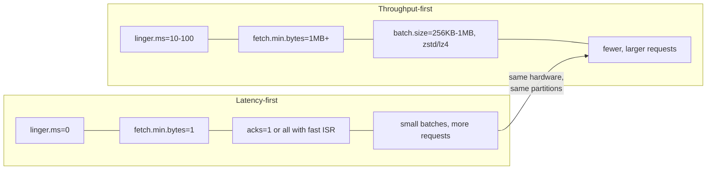
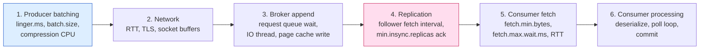
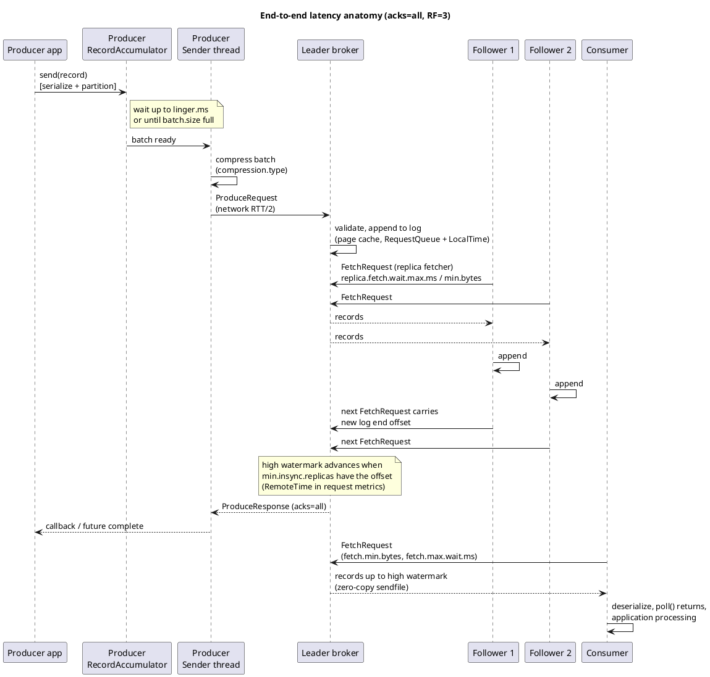
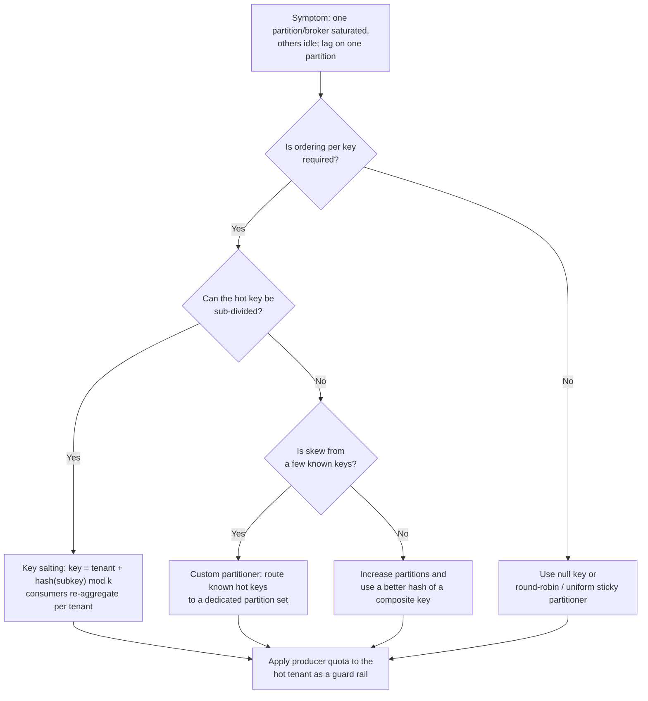

# Performance Tuning

**Roles:** [ARCH] [ADMIN] [DEV]   **Level:** Advanced
**Prerequisites:** Capacity Planning and Sizing (`01-capacity-planning-and-sizing.md`); Developer – producer and consumer internals (`../02-developer/`); Admin – broker configuration and monitoring (`../03-admin/`)

## What you will learn
- A framework for the latency vs throughput trade-off and where each millisecond of end-to-end latency goes
- Producer, broker, consumer, OS, and JVM tuning tables with defaults, recommended values, and the reason behind each
- How compression, partition count, message size, and key skew change performance, and how to fix hot partitions
- How to benchmark properly with `kafka-producer-perf-test.sh`, `kafka-consumer-perf-test.sh`, and the OpenMessaging benchmark, and how to read p50/p99/p999
- Tuning profiles for four workload archetypes and the anti-patterns that undo them

## 1. Concept

Kafka's design trades latency for throughput at every layer through **batching**: the producer batches records, the broker appends batches, followers fetch batches, and consumers fetch batches. Almost every tuning knob moves a slider between "send now" and "wait to fill a batch". The architect's job is to decide, per workload, where on that slider the business wants to be, and to make sure no single layer silently forces a different choice.



Three rules that hold across all versions:

1. **Requests, not bytes, are the scarce resource** on the broker. A broker that handles 50 MB/s in 50-byte messages with `linger.ms=0` is busier than one handling 500 MB/s in 100 KB batches.
2. **The tail (p99/p999) is dominated by queues and pauses**: request queue wait, replication wait for `acks=all`, GC pauses, page-cache misses, and consumer rebalances. Averages hide all of these.
3. **Tuning cannot fix a design problem**: hot keys, too few partitions, oversized messages, or synchronous request-reply patterns must be fixed in the data model.

## 2. How it works internally – latency anatomy

End-to-end latency is the sum of six stages. The diagram shows the stages for a producer with `acks=all` and one consumer.



Typical contribution at p99 in a well-tuned same-region cluster (indicative, not guaranteed):

| Stage | Typical p99 contribution | What inflates it |
|-------|--------------------------|------------------|
| 1. Producer batching | 0–`linger.ms` plus compression time | Large `linger.ms`, zstd at high level on small CPU, full `buffer.memory` (blocks `send()` for `max.block.ms`) |
| 2. Network | 0.1–2 ms same AZ; 1–3 ms cross-AZ; 20–100 ms cross-region | TLS handshakes (connection churn), tiny socket buffers over high-RTT links |
| 3. Broker append | < 1 ms | Request queue saturation (`RequestQueueTimeMs`), IO threads busy, page cache thrash, `log.flush.interval.messages` forcing fsync |
| 4. Replication | 1–10 ms | Follower fetch backoff (`replica.fetch.wait.max.ms`), slow follower disk, cross-AZ RTT, too few `num.replica.fetchers` |
| 5. Consumer fetch | 0–`fetch.max.wait.ms` | `fetch.min.bytes` too high for the rate, consumer far from leader |
| 6. Consumer processing | Application dependent | Slow `poll()` loop, synchronous commits per record, rebalances |

Detailed sequence with the exact configuration names on each hop:



Source: `diagrams/performance-tuning-latency-anatomy.puml`.

The broker exposes each server-side stage in `kafka.network:type=RequestMetrics,name=*,request=Produce|FetchConsumer|FetchFollower`: `RequestQueueTimeMs`, `LocalTimeMs` (append), `RemoteTimeMs` (waiting for replication or for `fetch.min.bytes`), `ResponseQueueTimeMs`, `ResponseSendTimeMs`, and `TotalTimeMs`. Reading these first tells you which layer to tune.

## 3. Configuration that matters

### 3.1 Producer

| Parameter | Default | Recommended | Why |
|-----------|---------|-------------|-----|
| `batch.size` | 16384 | 64–256 KB for throughput; 16–32 KB for latency | Upper bound of one partition batch; batches are sent when full *or* when `linger.ms` expires, so a large value costs nothing on quiet partitions |
| `linger.ms` | 0 in 3.x (KIP-1030 raises the 4.0 client default to 5 ms; check your client version) | 5–20 ms throughput; 0–2 ms latency | The main latency/throughput slider; even 5 ms dramatically increases batch fill and compression ratio |
| `compression.type` | none | `lz4` (CPU-cheap) or `zstd` (best ratio); `snappy` acceptable; `gzip` rarely | Compression applies per batch, so it interacts with `linger.ms`; see 5.1 |
| `acks` | `all` (since 3.0) | `all` for anything that matters; `1` only for lossy telemetry | `all` waits for `min.insync.replicas`; adds replication latency |
| `enable.idempotence` | true (since 3.0) | true | Exactly-once per partition without duplicates; requires `acks=all`, `retries>0`, `max.in.flight.requests.per.connection ≤ 5` |
| `max.in.flight.requests.per.connection` | 5 | 5 (idempotent keeps order) | Higher pipelining raises throughput on high-RTT links; ordering is preserved up to 5 with idempotence |
| `buffer.memory` | 32 MB | 64–256 MB for high throughput or many partitions | When full, `send()` blocks for `max.block.ms`; size ≥ throughput × worst-case broker stall |
| `max.request.size` | 1 MB | Match `message.max.bytes` | Batch-level cap |
| `delivery.timeout.ms` | 120000 | ≥ `linger.ms` + `request.timeout.ms` × retries | Total time a record may spend in the producer before failing |
| `partitioner.class` | built-in (sticky for null keys since 2.4; uniform sticky KIP-794 since 3.3) | default; custom only for skew fixes | The 3.3+ partitioner adapts to slow brokers (`partitioner.adaptive.partitioning.enable`) |

### 3.2 Broker

| Parameter | Default | Recommended | Why |
|-----------|---------|-------------|-----|
| `num.network.threads` | 3 | 8–16 on large brokers (≈ cores / 2 with TLS) | Network threads do TLS and request parsing; `NetworkProcessorAvgIdlePercent` < 30 % means add more |
| `num.io.threads` | 8 | 16–32 (≈ cores, or disks × 2–4) | IO threads execute requests (append, fetch from cache); `RequestHandlerAvgIdlePercent` < 30 % means add more |
| `num.replica.fetchers` | 1 | 2–8 | Threads per source broker fetching replicas; raise if `UnderReplicatedPartitions` at peak with idle disks |
| `replica.fetch.min.bytes` | 1 | 1 (latency) or 64 KB+ (throughput on high-RTT) | Followers wait for this many bytes or `replica.fetch.wait.max.ms` (500 ms); raising it batches replication but delays acks |
| `replica.fetch.max.bytes` | 1 MB | 4–10 MB for large-message or high-throughput partitions | Per-partition bytes per replica fetch |
| `replica.socket.receive.buffer.bytes` | 64 KB | 1–4 MB for cross-AZ/region replication | TCP window for replica traffic; with 2 ms RTT a 64 KB buffer caps a connection near 32 MB/s |
| `socket.send.buffer.bytes` / `socket.receive.buffer.bytes` | 100 KB | 1 MB+ or `-1` (OS auto-tune) for high-RTT clients | Same bandwidth-delay product argument for producers and consumers |
| `socket.request.max.bytes` | 100 MB | default | Cap per request |
| `log.flush.interval.messages` / `log.flush.interval.ms` | Long.MAX (OS flush) | leave default | Forcing fsync per N messages destroys throughput; durability comes from replication, not fsync |
| `log.segment.bytes` | 1 GB | 1 GB; 256–512 MB for many low-volume compacted topics | Smaller segments roll and compact sooner but raise file-handle count and index overhead |
| `log.retention.check.interval.ms` | 5 min | default | Retention granularity |
| `num.recovery.threads.per.data.dir` | 1 in 3.x (2 in 4.0, KIP-1030) | cores / data dirs | Parallel log recovery after unclean shutdown; directly cuts restart time |
| `message.max.bytes` | 1 MB | keep ≤ 1–2 MB; use claim-check for larger | Large messages hurt page cache, batching, and consumer memory |
| `compression.type` (broker/topic) | `producer` | `producer` | Anything else forces the broker to decompress and re-compress every batch |
| `queued.max.requests` | 500 | default | Request queue bound; when reached network threads stop reading |
| `log.cleaner.threads` | 1 | 2–4 with many compacted topics | Compaction throughput |
| `remote.log.manager.*` (tiered) | – | `remote.log.reader.threads` sized to cold-read demand | Cold reads are served from object storage with higher latency |

### 3.3 Consumer

| Parameter | Default | Recommended | Why |
|-----------|---------|-------------|-----|
| `fetch.min.bytes` | 1 | 1 for latency; 64 KB–1 MB for throughput | Broker holds the fetch until this many bytes or `fetch.max.wait.ms` |
| `fetch.max.wait.ms` | 500 | 100–500 throughput; 10–50 latency | Upper bound on the hold time above |
| `max.partition.fetch.bytes` | 1 MB | 1–4 MB; must be ≥ largest batch | Per-partition per-fetch cap; too small starves throughput on hot partitions |
| `fetch.max.bytes` | 50 MB | default | Per-fetch total cap |
| `max.poll.records` | 500 | Match processing time so `poll()` loop < `max.poll.interval.ms` | Records returned per `poll()`; does not change network fetch size |
| `max.poll.interval.ms` | 300000 | Set from processing budget | Exceeding it removes the consumer from the group |
| `session.timeout.ms` / `heartbeat.interval.ms` | 45000 / 3000 | defaults | Liveness detection; heartbeats are a background thread |
| `receive.buffer.bytes` | 64 KB | 1 MB+ or `-1` for high RTT | Bandwidth-delay product |
| `group.protocol` | `classic` (`consumer` since 4.0 KIP-848 GA) | `consumer` on 4.0 clusters | Server-side assignment, incremental rebalances, no stop-the-world |
| `partition.assignment.strategy` (classic) | Range + CooperativeSticky | `CooperativeStickyAssignor` | Avoids full revocation during rebalance |
| `enable.auto.commit` | true | false for at-least-once with manual commit after processing | Auto-commit commits on `poll()`, which can commit unprocessed offsets |

Consumer parallelism is bounded by partition count: one consumer thread per partition maximum per group. For CPU-heavy processing beyond that, decouple fetch from processing with an in-process worker pool and commit only after the slowest in-flight offset completes (the "Confluent parallel consumer" pattern), or use Kafka Streams with `num.stream.threads`.

### 3.4 OS and JVM

| Area | Setting | Recommendation | Why |
|------|---------|----------------|-----|
| JVM heap | `-Xms`/`-Xmx` | 4–8 GB (up to 12 GB for very high partition counts) | Leave RAM for page cache |
| GC | `-XX:+UseG1GC -XX:MaxGCPauseMillis=20 -XX:InitiatingHeapOccupancyPercent=35` (or ZGC on JDK 17+ for tail latency) | G1 is the default and well understood; ZGC removes multi-ms pauses | Pauses show up directly in p99 |
| JDK | 17 (3.x) / 17+ required for 4.0 brokers | Current LTS | Kafka 4.0 drops JDK 8 and 11 for brokers |
| File descriptors | `ulimit -n` | 100,000+ | Segments × 3 files + sockets |
| `vm.swappiness` | 60 | 1 | Never swap the broker |
| `vm.dirty_background_ratio` / `vm.dirty_ratio` | 10 / 20 | 5 / 60–80 | Let the page cache absorb bursts; flush in background |
| Filesystem | ext4/XFS | XFS, `noatime`, `largeio` | XFS handles large sequential files and many files well |
| Disk scheduler | mq-deadline / none for NVMe | `none` for NVMe, `mq-deadline` for SSD | Kafka's IO is sequential |
| `net.core.rmem_max` / `wmem_max` | 212992 | 16 MB+ | Allow large socket buffers |
| `net.ipv4.tcp_window_scaling` | 1 | 1 | Required for high-RTT throughput |
| Transparent huge pages | enabled | `madvise` or off | Avoid latency spikes |
| NUMA | – | Pin or use single-socket instances | Cross-socket page cache access is slower |

## 4. Failure modes and how to detect them

| Symptom | Likely cause | Metric / log to check | Fix |
|---------|--------------|-----------------------|-----|
| Produce p99 spikes while p50 is flat | Replication wait or request queue | `RequestMetrics,request=Produce` `RemoteTimeMs` vs `RequestQueueTimeMs` | If Remote: follower disks/network or `num.replica.fetchers`; if Queue: `num.io.threads`, more brokers |
| Throughput plateaus, CPU idle | Small batches | Producer `batch-size-avg`, `records-per-request-avg`; broker `RequestsPerSec` high | Raise `linger.ms`, `batch.size`, enable compression |
| Producer `send()` blocks / `TimeoutException` | `buffer.memory` full because broker slow | Producer `buffer-available-bytes`, `record-queue-time-avg` | Increase buffer, fix broker latency, check `max.block.ms` |
| One broker hot, others idle | Key skew or unbalanced leaders | Per-broker `BytesInPerSec`, `LeaderCount`; per-partition size | See 5.4; run preferred leader election / Cruise Control |
| Under-replicated partitions at peak only | Followers cannot keep up | `UnderReplicatedPartitions`, follower `FetchFollower` `TotalTimeMs`, disk util | More `num.replica.fetchers`, bigger `replica.fetch.max.bytes`, faster disks, socket buffers cross-AZ |
| Consumer lag grows though CPU is low | `max.partition.fetch.bytes` or `fetch.min.bytes` limiting | Consumer `fetch-size-avg`, `fetch-latency-avg`, `records-lag-max` | Raise fetch sizes; add partitions/consumers |
| Consumer repeatedly rebalances | `poll()` loop exceeds `max.poll.interval.ms` | Consumer logs "member ... has left", `rebalance-rate-per-hour` | Lower `max.poll.records`, offload processing, raise interval |
| Disk read IOPS high, fetch latency up | Page cache misses from replaying consumer | OS `iostat` read MB/s, `FetchConsumer` `LocalTimeMs` | More RAM, quotas on replaying consumers, tiered storage for history |
| Long restart after crash | Log recovery single-threaded | Broker log "Recovering unflushed segment" duration | `num.recovery.threads.per.data.dir` |
| Periodic latency spikes every few seconds | GC pauses or `log.flush` forcing | GC logs, `LogFlushRateAndTimeMs` | Tune GC, remove explicit flush settings |
| Latency jumps after enabling TLS | Network threads saturated by crypto | `NetworkProcessorAvgIdlePercent` | More `num.network.threads`, larger instances, keep connections long-lived |

## 5. Design guidance (architect view)

### 5.1 Compression

Indicative behaviour on typical JSON/Avro payloads, single core (measure your own data; ratios vary widely):

| Codec | Compression ratio (indicative) | Producer CPU cost | Decompression cost | When |
|-------|-------------------------------|-------------------|--------------------|------|
| none | 1.0 | none | none | Already-compressed payloads (images, encrypted blobs) |
| `lz4` | 2–3× | low | very low | Default choice for throughput with low latency |
| `snappy` | 2–3× | low | low | Legacy default in many stacks; lz4 usually better |
| `zstd` | 3–5× | moderate (level-dependent; default level 3) | low | Best ratio, since 2.1; ideal when network/storage cost dominates |
| `gzip` | 3–4× | high | moderate | Rarely justified now that zstd exists |

Compression happens on the producer per batch, so its effectiveness grows with `linger.ms` and `batch.size`; a 16 KB batch of 500-byte messages compresses far worse than a 256 KB batch. Consumers decompress; brokers do not unless `compression.type` on the topic differs from the producer (avoid).

### 5.2 Partition count vs performance

| Partitions | Effect |
|------------|--------|
| Too few | Producer throughput capped (one leader per partition, one batch in flight per partition), consumer parallelism capped |
| Right-sized | Target per-partition throughput ≈ 5–25 MB/s indicative; consumers = partitions in the busiest group |
| Too many | More open files and memory per broker, longer leader failover, larger metadata responses, more `linger.ms` needed to fill batches per partition (throughput per partition drops), longer rebalances, more end-to-end latency under `acks=all` because each producer batch is smaller |

A simple sizing rule: `partitions = max(target_throughput / per_partition_producer_throughput, target_throughput / per_partition_consumer_throughput, max_consumers_in_one_group)`, measured with the perf tools on one partition first. Add ~ 30 % for growth because increasing partitions later changes key-to-partition mapping.

### 5.3 Message size

| Size | Effect and guidance |
|------|---------------------|
| < 100 bytes | Per-record overhead (record headers, batch headers) dominates; batching is essential; consider aggregating at the edge (IoT) |
| 100 B – 10 KB | Sweet spot |
| 10 KB – 1 MB | Fewer records per batch; raise `batch.size`, `max.partition.fetch.bytes`, `replica.fetch.max.bytes`; watch consumer memory (`fetch.max.bytes` × partitions) |
| > 1 MB | Use the claim-check pattern (store payload in object storage, send a reference), chunking, or a dedicated large-message cluster; raise `message.max.bytes`, `max.request.size`, `replica.fetch.max.bytes` consistently if unavoidable |

### 5.4 Key skew and hot partitions

A hot partition appears when a small number of keys carry most traffic (a big tenant, a default key, `null` keys with an old partitioner). The partition's leader broker becomes the bottleneck for the whole topic.



| Technique | How | Cost |
|-----------|-----|------|
| Key salting | Append a small random or hashed suffix (`orderId#3`) so one logical key spreads over k partitions | Ordering is now per salted key; downstream must tolerate or re-order |
| Composite key | Partition on `(tenantId, deviceId)` instead of `tenantId` | Ordering only within the finer key; aggregation across a tenant needs a repartition |
| Custom `Partitioner` | Map known hot keys to a reserved range of partitions | Operational coupling: the hot-key list must be maintained |
| Dedicated topic per large tenant | Move the whale tenant to its own topic/cluster | More topics, but clean isolation and chargeback |
| Quotas | `producer_byte_rate` per client/user as a guard rail | Protects the cluster but throttles the tenant |

> **Anti-pattern:** Fixing a hot partition by increasing the partition count alone. The hot key still hashes to exactly one partition; you just made the other partitions emptier.

### 5.5 Quotas as protection

Quotas cap bytes per second per user/client-id (`producer_byte_rate`, `consumer_byte_rate`) and request-handler utilization (`request_percentage`), and since 2.x can also cap connection creation rate and controller mutations (`controller_mutation_rate`, KIP-599). They are throttled by delaying responses, so a throttled client sees latency rise rather than errors. Use them to keep one team's replay from consuming the page cache and disk throughput everyone else relies on; monitor `kafka.server:type=Produce,user=...,client-id=...` `throttle-time`.

### 5.6 KRaft controller performance

The controller quorum (since 3.3 production-ready, 4.0 KRaft-only) handles metadata: topic creation, ISR changes, leader elections, broker registration. Its performance limits are metadata-event rate and snapshot size, not data throughput. Keep controllers on dedicated nodes with fast disks for `metadata.log.dir`, watch `kafka.controller:type=KafkaController,name=MetadataErrorCount` and quorum metrics (`kafka.server:type=raft-metrics` `commit-latency-avg`, `high-watermark`), and avoid partition-mutation storms (mass topic creation, rapid reassignment) during peak. Controller failover in KRaft is sub-second to a few seconds because followers already hold the metadata, versus tens of seconds to minutes with ZooKeeper on large clusters.

### 5.7 Tiered storage performance

With `remote.storage.enable=true` on a topic, segments beyond `local.retention.ms/bytes` are read from object storage. Expect cold reads to have tens to hundreds of milliseconds of first-byte latency and to be limited by `remote.log.reader.threads` and object-store throughput; hot reads (within local retention) are unchanged. Design real-time consumers to stay in the local window and treat historical replays as a batch workload with their own quota. Tiering also shortens broker rebuild time because only the local tier is copied.

### 5.8 Benchmarking method

1. **Fix the question**: "max sustainable MB/s at p99 ≤ 20 ms with acks=all" is a benchmark; "how fast is Kafka" is not.
2. **Mirror production**: same instance types, disks, RF, `min.insync.replicas`, TLS, compression, message size distribution, partition count, and *cross-AZ placement*.
3. **Warm up** for several minutes; page cache and JIT matter.
4. **Ramp**: run at 25/50/75/100/125 % of target and record p50/p99/p999 at each step. The knee where p99 rises steeply is your capacity.
5. **Run long enough** (≥ 30 minutes at the target) to hit segment rolls, retention deletes, and GC cycles.
6. **Run consumers concurrently** with producers; producer-only benchmarks overstate capacity.
7. **Break something** during the run: kill a broker, trigger a reassignment.
8. **Record everything**: broker request metrics, OS `iostat`/`sar`, client metrics.

Reading results:

| Percentile | Meaning | Use |
|------------|---------|-----|
| p50 | Typical request | Sanity check of batching configuration |
| p99 | 1 in 100 requests | The SLO number for most services; dominated by queueing and replication |
| p999 | 1 in 1,000 | GC pauses, page cache misses, leader changes; the number that matters for user-facing paths with many Kafka hops (latency compounds per hop) |
| max | Outliers | Usually rebalances or broker restarts; investigate but do not tune for |

The OpenMessaging Benchmark (OMB) framework drives distributed producers and consumers with realistic payload files, rate control, and consumer backlog scenarios, and produces percentile reports; use it rather than single-machine perf tools when you need multi-client results.

### 5.9 Tuning profiles

| Setting | Low latency (trading signals, ≤ 10 ms p99) | High throughput (logs, clickstream) | Durable financial (payments, EOS) | IoT many small messages |
|---------|-------------------------------------------|-------------------------------------|-----------------------------------|-------------------------|
| `acks` | `all` with `min.insync.replicas=2` (or `1` if loss tolerable) | `all` | `all` | `all` (or `1` for lossy sensors) |
| `linger.ms` | 0–1 | 20–100 | 5–10 | 50–200 (or aggregate at gateway) |
| `batch.size` | 16–32 KB | 512 KB–1 MB | 64 KB | 256 KB–1 MB |
| `compression.type` | `lz4` or none | `zstd` | `lz4` | `zstd` |
| `enable.idempotence` | true | true | true + `transactional.id` | true |
| `max.in.flight...` | 5 | 5 | 5 | 5 |
| `fetch.min.bytes` / `fetch.max.wait.ms` | 1 / 10 | 1 MB / 500 | 1 / 100 | 512 KB / 200 |
| `max.poll.records` | 100 | 5000 | 500 with `isolation.level=read_committed` | 5000 |
| Partitions | Fewer, high replica fetchers, same-AZ leaders where possible | Many (per-partition 10–25 MB/s) | Sized by key parallelism; ordering per account | Many; keyed by device or gateway |
| Broker | `num.replica.fetchers` ≥ 4, `replica.fetch.min.bytes=1`, ZGC | Large socket buffers, `num.io.threads` high | `unclean.leader.election.enable=false`, RF=3, `min.insync.replicas=2` | `message.max.bytes` small, aggressive compression |
| Hardware | NVMe, same-AZ or follower fetching, low-RTT network | Storage-dense, high NIC | Standard, cross-AZ replicas | Many partitions per broker within budget |

### 5.10 Common performance anti-patterns

> **Anti-pattern:** One producer instance per request thread, or creating a `KafkaProducer` per message. Producers are thread-safe and heavy; one per process (or a few) is correct.

> **Anti-pattern:** `linger.ms=0` with `acks=all` on a high-RTT cross-AZ cluster and complaining about throughput; each tiny batch pays the full replication round-trip.

> **Anti-pattern:** Setting `fetch.min.bytes=1 MB` on a low-volume topic; consumers wait `fetch.max.wait.ms` on every poll and latency becomes 500 ms.

> **Anti-pattern:** Synchronous `commitSync()` after every record. Commit per batch or by time, or use `commitAsync()` with a periodic `commitSync()`.

> **Anti-pattern:** Topic-level `compression.type` different from the producer's, forcing the broker to recompress every batch.

> **Anti-pattern:** Forcing `log.flush.interval.messages=1` "for durability". Durability in Kafka comes from `acks=all` and `min.insync.replicas`, not from fsync.

> **Anti-pattern:** Benchmarking with random payloads and reporting the compression ratio.

## 6. Hands-on

### 6.1 Producer benchmark ramp

```bash
TOPIC=perf-test
kafka-topics.sh --bootstrap-server broker1:9092 --create --topic $TOPIC \
  --partitions 48 --replication-factor 3 --config min.insync.replicas=2

for RATE in 50000 100000 200000 400000 -1; do
  echo "== target rate $RATE msg/s"
  kafka-producer-perf-test.sh --topic $TOPIC --num-records 3000000 --record-size 1024 \
    --throughput $RATE \
    --producer-props bootstrap.servers=broker1:9092 acks=all linger.ms=10 \
      batch.size=262144 compression.type=lz4 enable.idempotence=true \
    --print-metrics 2>/dev/null | grep -E 'records/sec|batch-size-avg|record-queue-time-avg|compression-rate-avg'
done
# Output line format: N records sent, X records/sec (Y MB/sec), avg latency, max latency, 50th, 95th, 99th, 99.9th
```

### 6.2 Consumer benchmark (run concurrently with 6.1)

```bash
kafka-consumer-perf-test.sh --bootstrap-server broker1:9092 --topic perf-test \
  --messages 3000000 --group perf-consumer --timeout 60000 \
  --consumer.config <(printf "fetch.min.bytes=1048576\nfetch.max.wait.ms=200\nmax.partition.fetch.bytes=4194304\n") \
  --show-detailed-stats --reporting-interval 5000
# Columns: time, data.consumed.in.MB, MB.sec, data.consumed.in.nMsg, nMsg.sec, rebalance.time.ms, fetch.time.ms, fetch.MB.sec, fetch.nMsg.sec
```

### 6.3 End-to-end latency

```bash
# Measures produce -> consume latency using a single partition, acks=all
kafka-run-class.sh org.apache.kafka.tools.EndToEndLatency broker1:9092 perf-test 10000 all 1024
# args: bootstrap-server topic num-messages acks message-size (older releases: kafka.tools.EndToEndLatency)
```

### 6.4 Read broker request-time breakdown

```bash
# Using the JMX tool shipped with Kafka
kafka-run-class.sh org.apache.kafka.tools.JmxTool \
  --jmx-url service:jmx:rmi:///jndi/rmi://broker1:9999/jmxrmi \
  --object-name 'kafka.network:type=RequestMetrics,name=RemoteTimeMs,request=Produce' \
  --attributes 99thPercentile,Mean --reporting-interval 5000
```

### 6.5 Apply a quota to a replaying consumer

```bash
kafka-configs.sh --bootstrap-server broker1:9092 --alter \
  --add-config 'consumer_byte_rate=52428800' \
  --entity-type clients --entity-name analytics-replay
```

### 6.6 OpenMessaging benchmark (outline)

```bash
git clone https://github.com/openmessaging/benchmark && cd benchmark
# driver-kafka/kafka-latency.yaml / kafka-throughput.yaml describe producer/consumer configs
# workloads/1-topic-16-partitions-1kb.yaml etc. describe rate, payload, consumer backlog
bin/benchmark --drivers driver-kafka/kafka-throughput.yaml workloads/1-topic-16-partitions-1kb.yaml
# Results (JSON) include publish and end-to-end latency percentiles per interval
```

## 7. Interview questions for this chapter

### Q1. Explain the latency vs throughput trade-off in Kafka and which settings control it.
**Role:** [ARCH] [DEV] | **Difficulty:** ★★☆ | **Topic:** Tuning

**Answer.**
Every layer batches, and batching trades latency for throughput. On the producer `linger.ms` and `batch.size` decide how long to wait to fill a batch; on the broker `replica.fetch.min.bytes`/`replica.fetch.wait.max.ms` decide how followers batch replication; on the consumer `fetch.min.bytes`/`fetch.max.wait.ms` decide how long the broker holds a fetch. Bigger batches also compress better and cost fewer requests, which is the broker's scarce resource. A latency-first profile uses `linger.ms≈0`, `fetch.min.bytes=1`; a throughput-first profile uses `linger.ms` 20–100 ms, large batches, zstd, and `fetch.min.bytes` around 1 MB.

**Follow-up probes.** Why does raising `linger.ms` from 0 to 5 ms often *increase* throughput tenfold? What does `RemoteTimeMs` measure?

### Q2. Produce p99 latency is 80 ms but p50 is 3 ms. How do you find the cause?
**Role:** [ADMIN] [ARCH] | **Difficulty:** ★★★ | **Topic:** Diagnosis

**Answer.**
Read the broker `RequestMetrics` for `Produce`: `RequestQueueTimeMs` high means IO threads are saturated (add `num.io.threads` or brokers); `RemoteTimeMs` high means waiting for followers under `acks=all` (check follower disk utilization, `num.replica.fetchers`, cross-AZ socket buffers, under-replicated partitions); `LocalTimeMs` high means the append itself is slow (page cache pressure, forced flush). On the client, `record-queue-time-avg` reveals accumulator waiting and `buffer-available-bytes` reveals back-pressure. GC logs explain periodic spikes. Tail latency is almost always queueing or replication, not raw disk speed.

**Follow-up probes.** How would ZGC change the picture? What if only one broker shows high `RemoteTimeMs`?

### Q3. A tenant key produces 40 % of all traffic on a 64-partition topic. What happens and what are the options?
**Role:** [ARCH] | **Difficulty:** ★★★ | **Topic:** Hot partitions

**Answer.**
That key lands on one partition, so one broker's leader thread, disk, and one consumer in every group carry 40 % of the topic; the rest of the cluster sits idle and lag accumulates on that partition. Adding partitions does not help because the key still maps to one partition. Options: salt the key (`tenant#n`) if consumers can re-aggregate, use a finer composite key if ordering is only needed per sub-entity, write a custom partitioner that spreads known hot keys across a reserved partition range, or move the tenant to its own topic. Add a producer quota as a guard rail either way.

**Follow-up probes.** How does salting affect Kafka Streams aggregations? How would you detect skew before it hurts?

### Q4. Why is `log.flush.interval.messages=1` an anti-pattern if durability matters?
**Role:** [ADMIN] [ARCH] | **Difficulty:** ★★☆ | **Topic:** Durability vs performance

**Answer.**
Kafka's durability guarantee is replication: a record acknowledged with `acks=all` exists in the page cache of `min.insync.replicas` brokers, which are on different machines (and racks, with rack awareness). Forcing fsync per message only protects against the simultaneous power loss of all in-sync replicas while adding a synchronous disk round-trip to every append, collapsing throughput. Leave flushing to the OS (`vm.dirty_*`) and spend the budget on RF=3, `min.insync.replicas=2`, and `unclean.leader.election.enable=false`.

**Follow-up probes.** When would fsync tuning be justified (single-rack, correlated failure)? What does `log.flush.offset.checkpoint.interval.ms` do?

### Q5. How do you choose a compression codec?
**Role:** [DEV] [ARCH] | **Difficulty:** ★☆☆ | **Topic:** Compression

**Answer.**
Default to `lz4` when CPU on producers is scarce or latency matters, and `zstd` when network and storage cost dominate; both decompress cheaply on consumers. Ratios are indicative and payload-dependent, so benchmark with real samples and a realistic `linger.ms`, because compression is per batch and tiny batches compress poorly. Keep topic `compression.type=producer` so brokers never recompress. `gzip` is rarely worth its CPU; `none` is right only for already-compressed or encrypted payloads.

**Follow-up probes.** Where does decompression happen with a Kafka Streams topology? How does compression interact with `message.max.bytes` (it is checked on compressed batch size)?

### Q6. What limits consumer throughput and how do you scale past one consumer per partition?
**Role:** [DEV] [ARCH] | **Difficulty:** ★★☆ | **Topic:** Consumer scaling

**Answer.**
Within a group, at most one consumer reads a partition, so parallelism is capped at the partition count; fetch size (`max.partition.fetch.bytes`, `fetch.max.bytes`), `max.poll.records`, and the `poll()` loop's processing time set per-consumer throughput. To exceed one thread per partition, hand records from `poll()` to a worker pool and commit the lowest fully-processed offset per partition (or use a library that does this), accepting that per-key ordering is preserved only if work is sharded by key. Alternatively add partitions or move processing to Kafka Streams.

**Follow-up probes.** How does KIP-848's consumer protocol change rebalances? What happens if processing exceeds `max.poll.interval.ms`?

### Q7. Describe a proper benchmark for "will this cluster sustain 500 MB/s at p99 < 30 ms".
**Role:** [ARCH] | **Difficulty:** ★★☆ | **Topic:** Benchmarking

**Answer.**
Use production-identical hardware, RF, `min.insync.replicas`, TLS, compression, partition count, and cross-AZ placement. Warm up, then ramp producers through 25/50/75/100/125 % of 500 MB/s with realistic payloads while consumers run concurrently, recording p50/p99/p999 at each step for at least 30 minutes at target so segment rolls, retention, and GC occur. Kill a broker mid-run and confirm the SLO holds at N−1. Capture broker request metrics and OS IO stats alongside client percentiles. The OpenMessaging benchmark automates the distributed driver and reporting.

**Follow-up probes.** Why run consumers concurrently? What does the knee in the p99 curve tell you?

### Q8. How does tiered storage change performance characteristics?
**Role:** [ARCH] | **Difficulty:** ★★☆ | **Topic:** Tiered storage

**Answer.**
Hot reads within `local.retention.ms` are unchanged; reads beyond it are served through the remote log manager from object storage with tens to hundreds of milliseconds of first-byte latency and throughput bounded by `remote.log.reader.threads` and the object store. Writes and replication are unchanged, so cross-AZ replication cost is unchanged. Benefits are that broker disk sizing decouples from retention and that a broker rebuild copies only the local tier. Treat historical replays as a separate, quota-limited workload.

**Follow-up probes.** Which topic types cannot be tiered (compacted topics as of 3.9)? How do you monitor remote fetch latency?

## Key takeaways
- Batching is the universal knob; every layer has a "wait vs send" setting and they must be tuned together.
- Read `RequestQueueTimeMs`, `LocalTimeMs`, and `RemoteTimeMs` before touching any configuration; they tell you which layer is slow.
- Compression, `linger.ms`, and `batch.size` are a triad; tune them as one.
- Hot partitions are a data-model problem; fix keys, not partition counts.
- Benchmark at N−1 with consumers running, on production-like placement, and report p99/p999 not averages.
- Keep the broker heap small, XFS, no swap, large socket buffers cross-AZ, and never force fsync.

## Further reading
- Apache Kafka documentation: "Producer Configs", "Consumer Configs", "Broker Configs", "Operations – OS, Disks and Filesystem, Java"
- KIP-98 (Idempotent and transactional producer), KIP-392 (follower fetching), KIP-405 (tiered storage), KIP-599 (controller mutation quotas), KIP-794 (uniform sticky partitioner), KIP-848 (next-gen consumer protocol), KIP-1030 (client default changes in 4.0)
- OpenMessaging Benchmark project documentation
- Confluent "Optimizing your Apache Kafka deployment" white paper (throughput/latency/durability/availability goals)
