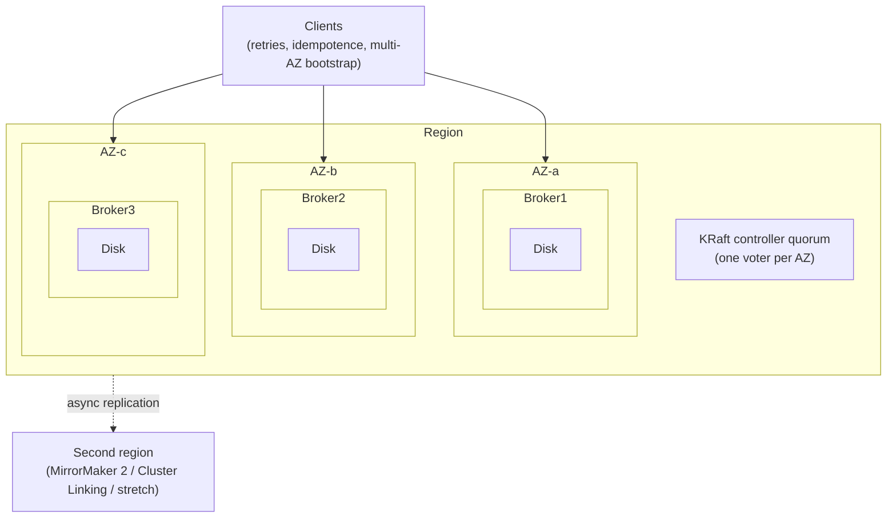
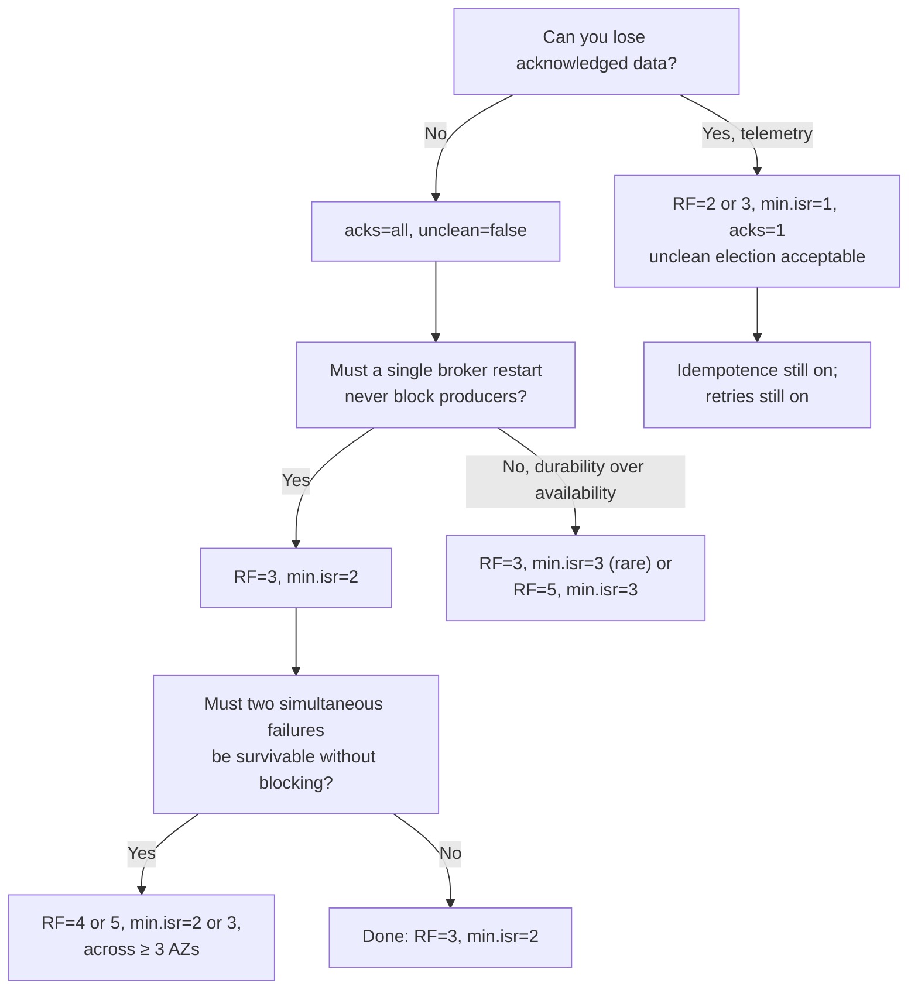
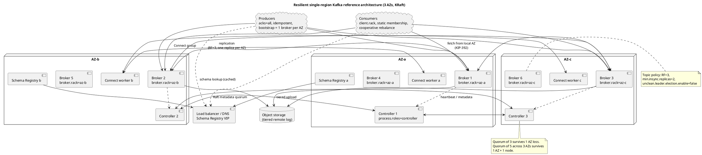
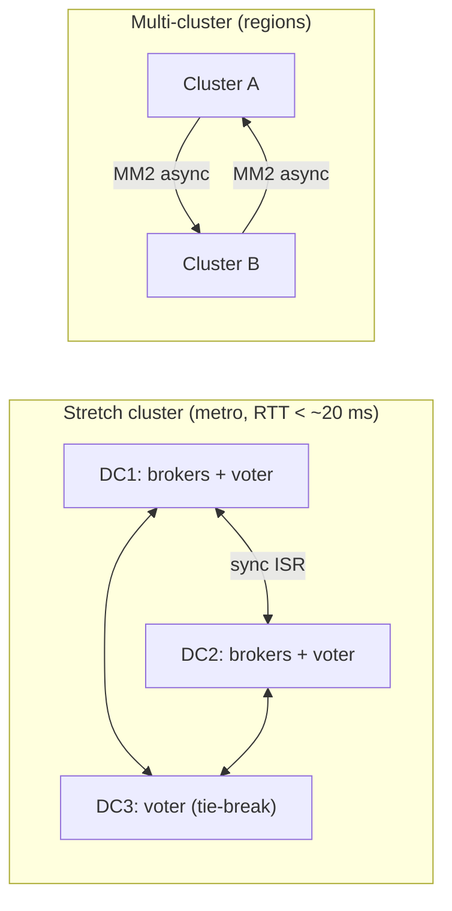

# Resiliency and High Availability

**Roles:** [ARCH] [ADMIN] [DEV]   **Level:** Advanced
**Prerequisites:** Fundamentals – replication, ISR, leader election, KRaft quorum (`../01-fundamentals/`); Capacity Planning (`01-capacity-planning-and-sizing.md`); Admin – operations and monitoring (`../03-admin/`)

## What you will learn
- The failure domains a Kafka deployment must survive, from a single disk to a whole region, and which control handles each
- The durability matrix: how `acks`, `min.insync.replicas`, replication factor, and unclean leader election combine into a guarantee
- Placement rules for brokers and KRaft controllers across racks and availability zones, and follower fetching for cross-AZ cost
- Client, consumer, Streams, and Connect resiliency settings and patterns, including backpressure and poison-pill isolation
- A "what happens when" table for a dozen failure scenarios, a chaos-engineering experiment list, and SLO/error-budget framing

## 1. Concept

Kafka is resilient by *replication and re-election*, not by making any single component reliable. A partition survives because copies exist on other brokers, a cluster survives because the metadata quorum survives, and an application survives because clients retry against whichever broker currently leads. Every layer adds a failure domain, and each domain needs an explicit decision: what is replicated across it, how failure is detected, and how long recovery takes.



| Failure domain | What fails | Primary control | Detection | Typical recovery |
|----------------|------------|-----------------|-----------|------------------|
| Disk / volume | One log dir becomes read-only or full | JBOD with multiple `log.dirs` (KRaft JBOD since 3.7), replication to other brokers | `OfflineLogDirectoryCount`, `OfflineReplicaCount` | Replicas on the failed dir go offline; leaders move to other brokers; replace disk and re-replicate |
| Broker | Process crash, host loss, kernel panic | RF ≥ 3, leader election by the controller | `ActiveBrokerCount`, `UnderReplicatedPartitions`, broker session timeout (`broker.session.timeout.ms`, 9 s) | Seconds to elect new leaders; minutes to hours to re-replicate if the host is gone |
| Rack / AZ | Power, network, or cloud AZ outage | `broker.rack` + rack-aware replica placement; quorum voters spread over AZs | Multiple brokers unreachable at once | Remaining AZs carry full load; needs N+1 AZ capacity headroom |
| Region | Whole region unavailable | Multi-cluster replication (chapter 04) | External health checks | Client failover to secondary region; RPO > 0 unless synchronous |
| Network partition | Brokers can reach some peers but not others | Controller decides membership; `min.insync.replicas` fences minority writes | ISR shrink, `IsrShrinksPerSec`, fenced broker logs | Partition heals; brokers rejoin ISR after catch-up |
| Controller quorum | Voter loss, disk loss on `metadata.log.dir` | 3 or 5 voters across AZs (`controller.quorum.voters` or dynamic quorum KIP-853 since 3.9) | `kafka.server:type=raft-metrics` `current-state`, `MetadataErrorCount` | Leader election within the quorum in seconds; data plane keeps serving with the last known metadata meanwhile |
| Client | Application crash, GC pause, slow consumer | Idempotent producers, static membership, cooperative rebalance, committed offsets | Consumer lag, rebalance rate, producer error rate | Group rebalance; producer reconnect and retry |
| Dependency | Schema Registry, IAM/OAuth provider, DNS, object storage (tiered) | Caching, redundancy, graceful degradation | Dependency health checks | See 5.7 |

## 2. How it works internally

### 2.1 The durability matrix

A write is durable when it exists on enough replicas that any surviving leader must have it. Four settings determine that:

- `replication.factor` (RF): how many copies exist in total.
- `min.insync.replicas` (min.isr): how many replicas must acknowledge before the leader responds to `acks=all`.
- `acks` on the producer: `0` (fire and forget), `1` (leader only), `all` (wait for min.isr).
- `unclean.leader.election.enable`: whether a replica *outside* the ISR may become leader when no ISR member is available.

| RF | min.isr | acks | unclean election | Guarantee on ack | Survives | Writes blocked when | Risk |
|----|---------|------|------------------|------------------|----------|---------------------|------|
| 1 | 1 | any | – | On one broker's page cache | Nothing | Broker down | Total loss on broker loss |
| 3 | 1 | 1 | false | Leader only | Loss of followers | Never (until 0 replicas) | Leader dies before followers fetch → acked data lost |
| 3 | 1 | all | false | Leader only (min.isr=1 means "all" = 1) | Same as above | Never | Same as `acks=1` |
| 3 | 2 | all | false | 2 replicas | 1 broker loss with no data loss; 2 broker loss with no loss but unavailability | 2 of 3 replicas down | None for acked data; availability trade-off |
| 3 | 2 | all | true | 2 replicas | 1 broker loss | Never | If both ISR members die, a stale replica becomes leader → acked data lost and log divergence |
| 3 | 3 | all | false | 3 replicas | 2 broker losses with no loss | Any single broker down | Any restart blocks producers; avoid |
| 4 | 2 | all | false | 2 replicas | 2 broker losses with no loss (if 2 remaining include one ISR member) | 3 of 4 down | Extra storage and replication cost |
| 5 | 3 | all | false | 3 replicas | 2 broker losses with no loss and no unavailability | 3 of 5 down | Used for critical metadata-like topics (`__consumer_offsets`, transaction state) in large clusters |

The standard production choice is **RF=3, `min.insync.replicas=2`, `acks=all`, `unclean.leader.election.enable=false`**: one broker can fail (or be restarted for maintenance) with no loss and no producer impact; a second simultaneous failure blocks writes rather than losing acknowledged data. RF=3/min.isr=1 is the common misconfiguration that looks durable and is not.



### 2.2 Rack awareness and AZ placement

With `broker.rack=<az>` set on every broker, the controller's replica assignment spreads a partition's replicas across racks (and, in KRaft, so does `kafka-reassign-partitions.sh --generate` and Cruise Control's rack-aware goal). Combined with RF=3 across three AZs, an AZ loss removes exactly one replica per partition, leaving two in the ISR, which is enough for `min.insync.replicas=2`.

Placement rules:

| Rule | Reason |
|------|--------|
| Broker count is a multiple of the AZ count | Even replica and leader spread |
| RF = number of AZs (3) or RF = AZs + 1 when two AZ-local replicas are wanted | One replica per AZ is the simplest failure reasoning |
| Never RF=3 across two AZs with min.isr=2 unless you accept that losing the two-replica AZ blocks writes | 2 of 3 replicas land in one AZ |
| Leaders spread evenly (`auto.leader.rebalance.enable=true`, preferred replica election after recovery) | Otherwise one AZ carries all producer traffic after a failover |
| Capacity headroom sized for N+1 AZ | Losing one of three AZs puts 150 % of normal load on survivors |

### 2.3 Controller quorum sizing and placement

| Voters | Tolerates | Placement | When |
|--------|-----------|-----------|------|
| 3 | 1 voter loss | One per AZ | Default for most clusters |
| 5 | 2 voter losses | 2-2-1 across 3 AZs, or one per AZ in 5 AZs | Large clusters, or when one AZ + one maintenance must overlap |
| 1 | Nothing | – | Dev only |

Controllers should run as dedicated `process.roles=controller` nodes for anything beyond small clusters, with their own disks for `metadata.log.dir`; a broker's disk saturation must not slow metadata commits. Since 3.9 (KIP-853) voters can be added and removed dynamically, which makes controller replacement an online operation. If the quorum loses majority, the data plane keeps serving with the last metadata (no new leader elections, no new topics), so a quorum outage is a *degraded* state, not a total outage, until the next broker failure.

### 2.4 Follower fetching (KIP-392)

By default consumers fetch from the leader, so two thirds of consumer traffic crosses AZs in a three-AZ cluster. With `replica.selector.class=org.apache.kafka.common.replica.RackAwareReplicaSelector` on brokers and `client.rack=<az>` on consumers, the broker steers each consumer to an in-sync replica in its own rack. The follower serves only up to the high watermark, so the consumer may see a few extra milliseconds of latency; if the local replica falls out of the ISR, the consumer is redirected to the leader. Producers always write to the leader.

### 2.5 The resilient reference architecture



Source: `diagrams/resiliency-and-high-availability-reference-architecture.puml`.

## 3. Configuration that matters

| Parameter | Scope | Default | Recommended | Why |
|-----------|-------|---------|-------------|-----|
| `default.replication.factor` / topic RF | broker/topic | 1 | 3 | Survive one broker loss without loss |
| `min.insync.replicas` | broker/topic | 1 | 2 | Acked data on two machines |
| `unclean.leader.election.enable` | broker/topic | false | false (true only for loss-tolerant topics) | Avoid divergence and loss |
| `broker.rack` | broker | unset | AZ id | Rack-aware placement |
| `replica.selector.class` | broker | LeaderSelector | `RackAwareReplicaSelector` | Follower fetching |
| `replica.lag.time.max.ms` | broker | 30000 | 10000–30000 | How long a follower may lag before ISR eviction; too low causes ISR flapping |
| `controller.quorum.voters` / dynamic quorum | controller | – | 3 or 5 voters across AZs | Metadata availability |
| `offsets.topic.replication.factor`, `transaction.state.log.replication.factor`, `transaction.state.log.min.isr` | broker | 3 / 3 / 2 | 3 / 3 / 2 (5/3 on large clusters) | Consumer offsets and transaction state must be at least as durable as data |
| `auto.leader.rebalance.enable` / `leader.imbalance.check.interval.seconds` | broker | true / 300 | true / 300 | Return leadership after recovery |
| `log.dirs` (multiple) | broker | one | several with JBOD (KRaft JBOD since 3.7) | Disk failure isolates to one dir |
| `acks` | producer | all | all | Durability |
| `enable.idempotence` | producer | true | true | No duplicates on retry |
| `retries` / `delivery.timeout.ms` | producer | MAX / 120000 | MAX / ≥ 2 × expected failover time | Ride through leader elections |
| `max.block.ms` | producer | 60000 | Application budget | Bound blocking when metadata or buffer unavailable |
| `bootstrap.servers` | client | – | ≥ 3 entries, one per AZ, or a DNS name resolving to several | First connection must survive an AZ loss |
| `group.instance.id` | consumer | unset | Set (static membership) for stateful/long-running consumers | Avoid rebalance on restart |
| `partition.assignment.strategy` | consumer (classic) | Range, CooperativeSticky | `CooperativeStickyAssignor` (or `group.protocol=consumer` on 4.0) | Incremental rebalances |
| `session.timeout.ms` | consumer | 45000 | 45000 (allow restarts under static membership) | Liveness window |
| `isolation.level` | consumer | read_uncommitted | read_committed with transactions | Never read aborted data |
| `num.standby.replicas` | Streams | 0 | 1 | Warm state on another instance |
| `rack.aware.assignment.tags` / `client.tag.*` | Streams | unset | AZ tag (KIP-708, since 3.2) | Standbys in a different AZ |
| `connector.client.config.override.policy`, `errors.tolerance`, `errors.deadletterqueue.topic.name` | Connect | none | `All` / `all` / DLQ topic (sinks) | Poison-pill isolation in Connect |

## 4. Failure modes and how to detect them

| Symptom | Likely cause | Metric / log to check | Fix |
|---------|--------------|-----------------------|-----|
| `NotEnoughReplicasException` on producers | Fewer than `min.insync.replicas` in ISR | `UnderMinIsrPartitionCount`, `IsrShrinksPerSec` | Restore the failed broker; check follower disk/network; do not lower min.isr in a panic |
| Leader elections spike | Broker crash, or ISR flapping due to slow followers | `LeaderElectionRateAndTimeMs`, `UncleanLeaderElectionsPerSec` (must be 0) | Fix lagging followers; raise `replica.lag.time.max.ms` slightly if flapping |
| Offline partitions | All replicas of a partition unavailable | `OfflinePartitionsCount` | Restore any replica; if only out-of-ISR replicas remain, decide on unclean election per topic |
| Producers stuck after broker restart | Metadata refresh delayed or `max.block.ms` exhausted | Producer `metadata-age`, error logs | Ensure ≥ 3 bootstrap servers; tune `metadata.max.age.ms`; check DNS |
| Consumer group rebalances every restart | No static membership; eager assignor | `rebalance-rate-per-hour`, coordinator logs | `group.instance.id`, cooperative assignor / KIP-848 |
| Consumer stuck on one record | Poison pill | Lag on one partition, repeated exception | Dead-letter topic, skip-with-log, schema validation |
| Whole cluster read-only for metadata | Controller quorum lost majority | `raft-metrics` `current-state` (no leader), `MetadataErrorCount` | Restore voters; with dynamic quorum, add a replacement voter |
| Schema Registry unreachable → producers fail | Registry down, cache cold | Serializer exceptions | Cache schemas (`auto.register.schemas=false`, pre-warm), run registry HA behind LB |
| Cross-AZ latency spike → produce p99 | Follower fetch slow across AZ | `RemoteTimeMs`, network metrics | Socket buffers, `num.replica.fetchers`, check AZ health |
| Disk full on one broker | Retention or compaction not keeping up | `LogDirectoryOffline`, `Size` | Free space, throttle producers with quotas, add capacity |

## 5. Design guidance (architect view)

### 5.1 Graceful degradation

Design so that each failure removes capability rather than the whole system:

| Failure | Degraded behaviour to design for |
|---------|----------------------------------|
| One AZ down | Full function at reduced headroom; alert on capacity |
| Controller quorum down | Existing leaders keep serving; no topic creation, no leader election; treat as P1 |
| Schema Registry down | Producers/consumers with cached schemas continue; new schemas fail; queue at the edge |
| Tiered object storage down | Hot reads and writes continue; cold reads fail; uploads back up on local disk (watch local disk) |
| One partition offline | Only keys mapping to it are affected; other keys proceed; make consumers per-partition-independent |
| Cross-region link down | Each region continues; replication lag grows; alert on `replication-latency-ms` (MM2) |

### 5.2 Client resiliency

| Concern | Setting or pattern |
|---------|--------------------|
| Bootstrap survives an AZ loss | ≥ 3 `bootstrap.servers` across AZs or a DNS name with several A records; clients only use bootstrap for the first metadata request, then talk to leaders directly |
| Leader failover | Producer retries with `retries=MAX` and `delivery.timeout.ms` ≥ 2 × failover time; `NotLeaderOrFollowerException` is retriable |
| Duplicates on retry | `enable.idempotence=true` (sequence numbers per partition); `transactional.id` for cross-partition atomicity |
| Producer blocking the request thread | `max.block.ms` bounded; send asynchronously; a circuit breaker in the application opens after N consecutive failures and spills to local buffer/DLQ |
| DNS changes | Clients re-resolve on reconnect; use `client.dns.lookup=use_all_dns_ips` so every IP behind a name is tried |
| Timeouts | `request.timeout.ms` (30 s) < `delivery.timeout.ms`; consumer `default.api.timeout.ms` for admin operations |
| Backpressure | Producer `buffer.memory` full ⇒ `send()` blocks ⇒ upstream slows; do not raise the buffer without bound, propagate the pressure |

### 5.3 Consumer resiliency

- **Static membership** (`group.instance.id`) avoids a rebalance when a consumer restarts within `session.timeout.ms`; essential for Streams and for consumers with heavy startup.
- **Cooperative rebalancing** (`CooperativeStickyAssignor`, or the KIP-848 `consumer` protocol GA in 4.0) revokes only the partitions that move, so the rest keep processing.
- **Offset commit strategy**: commit after processing (at-least-once) and make handlers idempotent; commit per batch or per interval, never per record; on rebalance, commit in `onPartitionsRevoked`.
- **Rack-aware fetching** with `client.rack` keeps consumers working from a local replica when a remote AZ degrades.
- **Isolation**: consume each partition independently (per-partition worker), so one poison pill or one slow key does not stall the others.

### 5.4 Kafka Streams resiliency

| Mechanism | Effect |
|-----------|--------|
| `num.standby.replicas=1` | A warm copy of each state store on another instance; failover restores in seconds instead of replaying the changelog |
| Rack-aware task assignment (KIP-708, `rack.aware.assignment.tags`, `client.tag.<name>`) | Active and standby tasks land in different AZs |
| Changelog topics RF=3, `min.insync.replicas=2` (set via `replication.factor` and topic-level overrides) | State is as durable as data |
| `processing.guarantee=exactly_once_v2` | Transactional writes with per-task producer fencing |
| `acceptable.recovery.lag` | Prefer a slightly stale standby over a full restore |
| Static membership and cooperative rebalance | Built-in since 2.4/2.6 |

### 5.5 Connect resiliency

Connect workers form a group; tasks are redistributed when a worker dies. Use ≥ 3 workers across AZs, internal topics (`config.storage.topic`, `offset.storage.topic`, `status.storage.topic`) with RF=3 and (for config) a single partition, `errors.tolerance=all` with a dead-letter queue for sinks, and source connectors with idempotent or exactly-once support (`exactly.once.source.support=enabled`, KIP-618 since 3.3). Connect's own failure domain is the worker cluster, so run it separately from brokers.

### 5.6 Stretch cluster vs multi-cluster

| Criterion | Stretch cluster (one cluster across sites) | Multi-cluster (MM2 / Cluster Linking) |
|-----------|--------------------------------------------|---------------------------------------|
| RPO | 0 (synchronous replication via ISR) | > 0 (asynchronous) |
| RTO | Seconds (leader election) | Minutes (client failover + offset translation) |
| Latency budget | Inter-site RTT added to every `acks=all` write; practical ceiling ~ 50 ms RTT, ideally < 10–20 ms | No effect on local writes |
| Sites required | 3 (or 2 + a tie-breaker site for the controller quorum) | 2 |
| Offsets and consumer groups | Identical everywhere | Must be translated (MM2 `checkpoints` topic) |
| Complexity | Lower application complexity, higher infra sensitivity | Higher application complexity, isolated blast radius |
| Blast radius | One cluster: a bad config or metadata bug hits every site | Independent clusters |
| Use when | Metro-distance DCs with strict RPO 0 | Regions, cloud multi-region, DR with cost control |



Chapter 04 covers both in depth.

### 5.7 Dependency failures

| Dependency | Failure effect | Mitigation |
|------------|----------------|------------|
| Schema Registry | Serializer cannot resolve schema id → produce/consume exceptions for uncached schemas | HA deployment (leader election over Kafka, stateless followers behind LB), client-side cache, `auto.register.schemas=false` with `use.latest.version` pinned, pre-register in CI |
| OAuth / IAM token endpoint | New connections fail; existing sessions continue until re-auth (`connections.max.reauth.ms`) | Token caching, long-lived connections, redundant IdP |
| DNS | Bootstrap fails; running clients keep cached leader addresses | Multiple bootstrap entries, low TTL only if resolution is reliable |
| Object storage (tiered) | Cold reads fail; uploads back up locally | Alert on `RemoteCopyLagBytes`; local disk headroom |
| ZooKeeper (legacy, ≤ 3.9 ZK mode) | Controller cannot elect leaders; session expiries | Migrate to KRaft (removed in 4.0) |
| Monitoring stack | Blind operations | Independent alerting on broker liveness |

### 5.8 Backpressure

Kafka is pull-based, so the broker never pushes work to a consumer; backpressure is natural downstream. The producer side is where it must be designed: when `buffer.memory` fills, `send()` blocks up to `max.block.ms`, which propagates to the caller. Options, in order of preference:

1. Let the caller slow down (HTTP 429/503, bounded queue).
2. Spill to a local durable buffer (disk queue) and replay; accept ordering implications.
3. Shed load by priority (drop telemetry, keep transactions).
4. Never grow buffers without bound.

On the consumer side, use `pause()`/`resume()` on partitions when an in-process queue is full, so the consumer keeps heartbeating without pulling more.

### 5.9 Poison-pill isolation

| Layer | Technique |
|-------|-----------|
| Producer | Validate against schema before send; reject at the edge |
| Consumer | Catch deserialization errors (`ErrorHandlingDeserializer` in Spring, custom wrapper otherwise), write the raw record and error to a dead-letter topic with headers (`origin.topic`, `origin.partition`, `origin.offset`, `exception`), commit, continue |
| Streams | `default.deserialization.exception.handler=LogAndContinueExceptionHandler` (or a DLQ handler), `production.exception.handler` |
| Connect | `errors.tolerance=all`, `errors.deadletterqueue.topic.name`, `errors.deadletterqueue.context.headers.enable=true` |
| Design | Bounded retry with backoff; retry topics (`orders.retry.5m`, `orders.retry.1h`) for transient failures; alert on DLQ rate |

> **Anti-pattern:** Infinite retry on the same record in a consumer with auto-commit off. The partition stalls, lag grows silently, and the consumer eventually exceeds `max.poll.interval.ms` and triggers a rebalance that moves the same record to another consumer.

### 5.10 Chaos engineering for Kafka

| Experiment | Expected result | Watch |
|------------|-----------------|-------|
| Kill one broker (SIGKILL) | Leaders move in seconds; no producer errors with retries; URP > 0 until rebuild | `LeaderElectionRateAndTimeMs`, producer error rate, consumer lag |
| Graceful broker restart (controlled shutdown) | Leaders migrate before shutdown; near-zero client impact | `ControlledShutdown` logs |
| Stop one AZ (all brokers + controller) | No loss, writes continue, capacity headroom holds | `UnderMinIsrPartitionCount` = 0, network utilization on survivors |
| Fill a broker disk | Log dir goes offline; replicas move; broker stays up for other dirs (JBOD) | `OfflineLogDirectoryCount` |
| Inject 50 ms latency between AZs | Produce p99 rises; ISR should not shrink if `replica.lag.time.max.ms` is sane | `IsrShrinksPerSec`, `RemoteTimeMs` |
| Partition the network between a broker and the controller | Broker fenced, leaders move; broker rejoins after heal | Controller logs "fenced" |
| Kill the controller leader | New quorum leader in seconds; no data-plane impact | `raft-metrics` |
| Kill 2 of 3 controllers | Metadata read-only; data plane serves; topic creation fails | Confirm alerting fires |
| Kill Schema Registry | Warm clients continue; cold clients fail | Serializer errors |
| Slow consumer / consumer stall | Lag grows; no broker impact; DLQ or alert triggers | `records-lag-max` |
| Consumer instance crash | Cooperative rebalance moves only its partitions; static membership avoids rebalance if it returns in time | `rebalance-rate-per-hour` |
| Producer burst 3× | Quotas throttle the tenant; others unaffected | `throttle-time` |
| Reassignment during peak | Throttled reassignment keeps p99 in SLO | `ReassigningPartitions` |

Run these in staging with production-like placement first, then in production during a declared window with a rollback plan.

### 5.11 SLOs and error budgets

| SLI | Example SLO | Measured by |
|-----|-------------|-------------|
| Produce availability | 99.95 % of produce requests succeed within `delivery.timeout.ms` | Client `record-error-rate`, broker `ErrorsPerSec` |
| Produce latency | p99 ≤ 20 ms (same region, acks=all) | Client `request-latency-avg`/p99, broker `Produce TotalTimeMs` |
| End-to-end latency | p99 ≤ 200 ms produce→consume | Timestamp diff in consumer or e2e probe |
| Durability | 0 acknowledged records lost | `UncleanLeaderElectionsPerSec` = 0, audit consumer counts |
| Consumer availability | Lag on tier-1 groups < 60 s 99.9 % of the time | Lag exporter |
| Metadata availability | Topic create/alter succeed within 5 s 99.9 % | Synthetic probe |

Error budgets (e.g., 21.6 minutes per month at 99.95 %) decide whether risky changes (upgrades, reassignments, chaos experiments) proceed this month.

### 5.12 "What happens when" table

| # | Scenario | Expected behaviour | Recovery |
|---|----------|--------------------|----------|
| 1 | One broker crashes (RF=3, min.isr=2) | Controller elects new leaders from ISR within seconds; producers retry transparently; URP rises; consumers reconnect | Broker restarts, catches up, rejoins ISR; preferred leader election restores balance |
| 2 | Two brokers crash holding both ISR members of a partition (min.isr=2) | Partition has a leader only if the third replica is in ISR; otherwise offline; producers get `NotEnoughReplicas` / timeouts; no acked data lost | Restore a broker; if impossible and loss acceptable, enable unclean election for that topic only |
| 3 | Disk fails on a JBOD broker | Log dir offline; replicas on it offline; others on that broker unaffected | Replace disk, or reassign replicas to other dirs/brokers |
| 4 | Whole AZ lost (3 AZs, rack-aware) | One replica per partition lost; ISR = 2; writes continue; load +50 % on survivors | AZ returns; replicas catch up; run preferred leader election |
| 5 | Network partition isolates a broker from controller but not from clients | Controller fences the broker (missed heartbeats); leaders move; clients following metadata switch; the isolated broker rejects writes for partitions it no longer leads (epoch check) | Partition heals; broker re-registers |
| 6 | Controller quorum leader dies | Raft election among voters in ~ seconds; brokers reconnect to new leader | Automatic |
| 7 | Controller quorum loses majority | No metadata changes; leaders keep serving; broker failures cannot be handled | Restore voters (dynamic quorum: add new voter) |
| 8 | Producer process crashes mid-transaction | Transaction aborted after `transaction.timeout.ms`; consumers with `read_committed` never see partial writes; new producer with same `transactional.id` fences the old epoch | Automatic |
| 9 | Consumer exceeds `max.poll.interval.ms` | Removed from group; partitions reassigned; may double-process records after last commit | Reduce `max.poll.records`, offload work |
| 10 | Slow follower (disk degraded) | ISR shrinks after `replica.lag.time.max.ms`; if it was one of two ISR members, min.isr no longer met → producers blocked | Fix or replace disk; consider RF=4 for hot topics |
| 11 | Schema Registry outage | Clients with cached schemas continue; new schema ids fail; consumers of unknown ids fail | Restore; pre-cache schemas at startup |
| 12 | Cross-region link down (MM2) | Source region unaffected; target lag grows; DR readiness degrades | Link restores; MM2 catches up from committed offsets |
| 13 | Broker disk 100 % full | Broker marks dir offline or crashes; replicas move if capacity exists elsewhere | Add space; retention emergency reduction; quotas |
| 14 | Upgrade with rolling restart | One broker at a time; min.isr=2 keeps writes flowing; leaders migrate via controlled shutdown | Standard procedure |

## 6. Hands-on

### 6.1 Create a durable topic and verify placement

```bash
kafka-topics.sh --bootstrap-server broker1:9092 --create --topic payments.ledger \
  --partitions 12 --replication-factor 3 \
  --config min.insync.replicas=2 --config unclean.leader.election.enable=false

kafka-topics.sh --bootstrap-server broker1:9092 --describe --topic payments.ledger
# Verify each partition's Replicas span three different broker.rack values:
kafka-broker-api-versions.sh --bootstrap-server broker1:9092 >/dev/null  # connectivity check
kafka-configs.sh --bootstrap-server broker1:9092 --describe --entity-type brokers --all | grep broker.rack
```

### 6.2 Enable follower fetching

```bash
# Broker (all brokers, dynamic):
kafka-configs.sh --bootstrap-server broker1:9092 --alter --entity-type brokers --entity-default \
  --add-config replica.selector.class=org.apache.kafka.common.replica.RackAwareReplicaSelector
# Consumer: client.rack=az-a in consumer properties
```

### 6.3 Simulate a broker failure and watch recovery

```bash
# Terminal 1: watch under-replicated and offline partitions
watch -n2 'kafka-topics.sh --bootstrap-server broker1:9092 --describe --under-replicated-partitions | wc -l; \
           kafka-topics.sh --bootstrap-server broker1:9092 --describe --unavailable-partitions'
# Terminal 2: kill broker 2 (systemd example)
sudo systemctl kill -s SIGKILL kafka
# Terminal 3: keep producing with retries and observe no errors
kafka-producer-perf-test.sh --topic payments.ledger --num-records 500000 --record-size 512 --throughput 5000 \
  --producer-props bootstrap.servers=broker1:9092,broker2:9092,broker3:9092 acks=all enable.idempotence=true
# After restart: restore preferred leaders
kafka-leader-election.sh --bootstrap-server broker1:9092 --election-type PREFERRED --all-topic-partitions
```

### 6.4 Check the KRaft quorum

```bash
kafka-metadata-quorum.sh --bootstrap-server broker1:9092 describe --status
kafka-metadata-quorum.sh --bootstrap-server broker1:9092 describe --replication
# Since 3.9 (KIP-853) voters can be added/removed:
kafka-metadata-quorum.sh --bootstrap-controller controller1:9093 add-controller  # run on the new controller host
```

### 6.5 Static membership and cooperative rebalancing (consumer properties)

```properties
group.id=payments-processor
group.instance.id=payments-processor-${HOSTNAME}
session.timeout.ms=45000
partition.assignment.strategy=org.apache.kafka.clients.consumer.CooperativeStickyAssignor
# On Kafka 4.0 clusters with new clients:
# group.protocol=consumer
enable.auto.commit=false
isolation.level=read_committed
client.rack=az-a
```

## 7. Interview questions for this chapter

### Q1. Why is RF=3 with `min.insync.replicas=2` the standard, rather than min.isr=1 or 3?
**Role:** [ARCH] | **Difficulty:** ★★☆ | **Topic:** Durability

**Answer.**
It is the only combination of the three that gives both durability and availability under a single failure. With min.isr=1 and `acks=all`, the leader alone acknowledges, so a leader crash before followers fetch loses acknowledged data. With min.isr=3, any single broker restart blocks all producers, so routine maintenance becomes an outage. min.isr=2 means every acknowledged record is on two machines (two AZs with rack awareness), one broker can be down for any reason, and a second simultaneous failure blocks writes instead of losing data, which is the correct failure direction for most systems.

**Follow-up probes.** What does `acks=all` mean when the ISR has shrunk to 1 and min.isr=1? When would you use RF=4 or 5?

### Q2. What happens during a network partition that isolates a broker from the controller but not from its clients?
**Role:** [ARCH] [ADMIN] | **Difficulty:** ★★★ | **Topic:** Split brain

**Answer.**
The controller stops receiving the broker's heartbeats and fences it after `broker.session.timeout.ms`, electing new leaders from the remaining ISR for the partitions it led. Clients that refresh metadata switch to the new leaders. The isolated broker may still think it is leader briefly, but any produce it acknowledges cannot advance the high watermark because followers are no longer fetching from it, and leader-epoch checks reject its stale state when the partition heals. With `acks=all` and min.isr=2 a stale leader cannot acknowledge alone, which is why that configuration also protects against this scenario. Once connectivity returns, the broker re-registers, truncates to the new leader's epoch, and catches up.

**Follow-up probes.** How does leader epoch prevent log divergence? What is different in ZooKeeper mode?

### Q3. How do you place a KRaft controller quorum across availability zones and why?
**Role:** [ARCH] | **Difficulty:** ★★☆ | **Topic:** Controller quorum

**Answer.**
Three dedicated controller nodes, one per AZ, so any single AZ loss leaves a majority; five in a 2-2-1 layout when you need to survive an AZ loss plus one maintenance. Controllers should be `process.roles=controller` only with their own disks, because metadata commit latency must not depend on broker data disks. Losing the quorum majority does not stop the data plane immediately (leaders keep serving) but prevents leader elections, so a subsequent broker failure becomes an outage; treat it as a P1. Since 3.9 (KIP-853) voters can be replaced online.

**Follow-up probes.** Should the quorum be stretched across regions? What does a quorum voter's disk loss mean?

### Q4. Explain follower fetching and its trade-offs.
**Role:** [ARCH] [DEV] | **Difficulty:** ★★☆ | **Topic:** KIP-392

**Answer.**
With `replica.selector.class=RackAwareReplicaSelector` on brokers and `client.rack` on consumers, the broker directs each consumer to an in-sync replica in the same rack instead of the leader, eliminating most cross-AZ consumer traffic and its cost. Trade-offs: a follower can serve only up to the high watermark, so consumers see slightly higher latency; if the local replica leaves the ISR, the consumer is bounced to the leader; producers still cross AZs to the leader. Cross-AZ replication traffic is unchanged.

**Follow-up probes.** How does it interact with consumer lag metrics? Can it be used for cross-region reads?

### Q5. A team wants a stretch cluster across two data centres 80 km apart. Advise.
**Role:** [ARCH] | **Difficulty:** ★★★ | **Topic:** Stretch vs multi-cluster

**Answer.**
Two sites cannot host a majority-based controller quorum symmetrically; you need a third site (even a small one) for the tie-breaking voter, and every `acks=all` write pays the inter-site RTT. At 80 km the RTT is likely a few milliseconds, which is fine for latency; the real questions are whether the link is reliable enough that ISR flapping will not become the norm, whether a link failure blocks writes (it will, for partitions whose min.isr needs the other site) and whether the business accepts that. If they need RPO 0 and can supply a third site, a stretch cluster with `broker.rack` per site and `min.insync.replicas=2` works; if not, run two clusters with MirrorMaker 2 or Cluster Linking and accept an RPO of seconds.

**Follow-up probes.** How would you place `min.insync.replicas` so that a site loss does not block writes? What is an observer replica (Confluent-specific)?

### Q6. How do you isolate a poison-pill message in a consumer without losing ordering for other keys?
**Role:** [DEV] [ARCH] | **Difficulty:** ★★☆ | **Topic:** Error handling

**Answer.**
Catch the failure at deserialization or processing, write the raw record with diagnostic headers to a dead-letter topic, commit the offset, and continue. Ordering for other keys is preserved because only the bad record leaves the stream; ordering for the poisoned key is deliberately broken, which must be acceptable or handled by a retry topic with delayed reprocessing. Never retry the same record forever: it stalls the partition and triggers `max.poll.interval.ms` rebalances. Connect and Streams have built-in equivalents (`errors.tolerance=all` with a DLQ; `LogAndContinueExceptionHandler`).

**Follow-up probes.** How do you replay a DLQ safely? How do you preserve per-key ordering when using retry topics?

### Q7. Design the chaos experiments you would run before declaring a Kafka platform production-ready.
**Role:** [ARCH] [ADMIN] | **Difficulty:** ★★★ | **Topic:** Chaos engineering

**Answer.**
Kill a broker with SIGKILL and confirm leader election time and zero producer errors; stop a whole AZ and confirm writes continue with min.isr satisfied and survivors under 60 % utilization; kill the controller leader and then two of three controllers to confirm degraded-metadata behaviour and alerting; fill a disk to test JBOD isolation; inject cross-AZ latency to test ISR stability; kill Schema Registry to test client caching; crash a consumer to test cooperative rebalance and static membership; run a throttled reassignment during peak to confirm SLO adherence. Each experiment has a hypothesis, a metric to watch, and a rollback.

**Follow-up probes.** Which experiment most often fails on first run? How do you run these safely in production?

### Q8. What does an SLO for a Kafka platform look like and how do you use the error budget?
**Role:** [ARCH] | **Difficulty:** ★★☆ | **Topic:** SLOs

**Answer.**
Define SLIs the platform controls: produce success rate within `delivery.timeout.ms`, produce p99 latency, end-to-end latency measured by a synthetic probe, unclean elections (must be zero), and metadata-operation availability. Set SLOs like 99.95 % produce success and p99 ≤ 20 ms same-region. The error budget (about 22 minutes per month at 99.95 %) is spent on planned risk: upgrades, reassignments, chaos experiments. When the budget is exhausted, freeze non-essential change. Consumer lag SLOs belong to application teams, with the platform providing the lag metrics.

**Follow-up probes.** How do you measure end-to-end latency without clock skew problems? What is the platform's SLO for a consumer group that the application misconfigured?

## Key takeaways
- Resilience is replication plus re-election; every failure domain needs an explicit replication and detection decision.
- RF=3, `min.insync.replicas=2`, `acks=all`, `unclean.leader.election.enable=false` is the production baseline; min.isr=1 is the common silent misconfiguration.
- Spread brokers and controller voters across three AZs, keep broker count a multiple of AZs, and keep N+1 AZ headroom.
- Follower fetching removes most cross-AZ consumer traffic; producers and replication still cross AZs.
- Clients need idempotence, retries with adequate timeouts, multi-AZ bootstrap, static membership, and cooperative rebalancing.
- Test failure with chaos experiments and measure with SLOs; the "what happens when" table is the runbook's backbone.

## Further reading
- Apache Kafka documentation: "Replication", "Rack awareness", "KRaft – Controller quorum", "Kafka Streams – Standby replicas"
- KIP-392 (follower fetching), KIP-500/KIP-631 (KRaft), KIP-853 (dynamic controller quorum, 3.9), KIP-708 (rack-aware Streams assignment), KIP-848 (consumer rebalance protocol), KIP-618 (exactly-once source connectors), KIP-858 (JBOD in KRaft, 3.7)
- Google SRE Workbook: "Implementing SLOs"
- Principles of Chaos Engineering (principlesofchaos.org)
