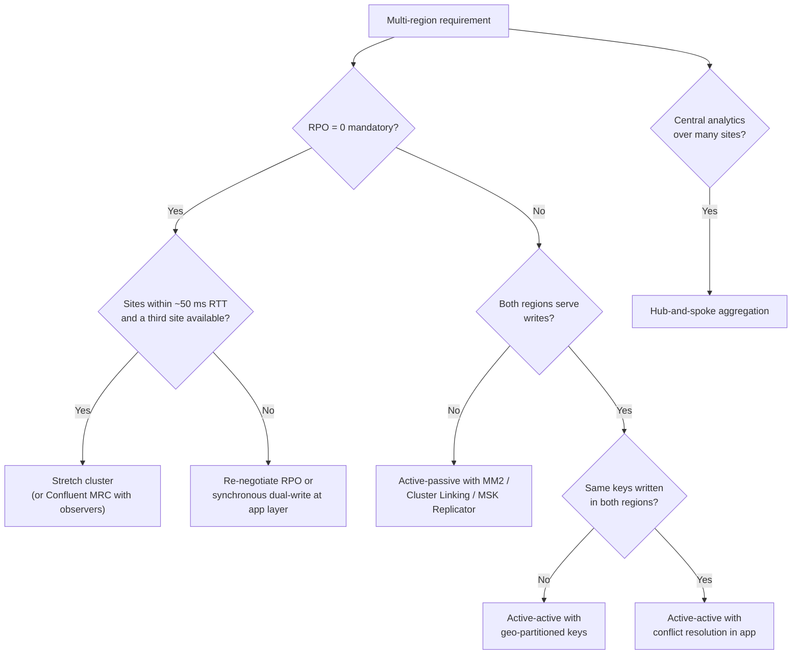
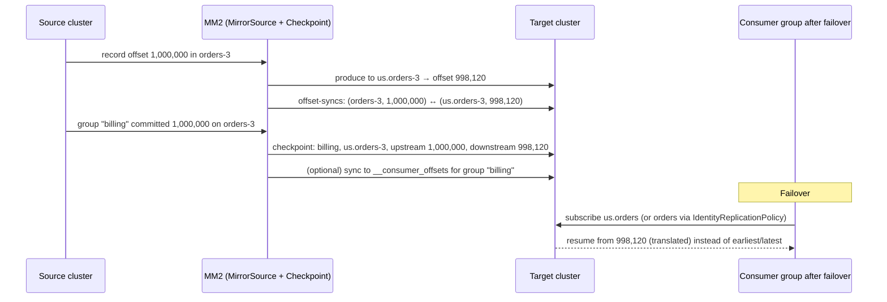
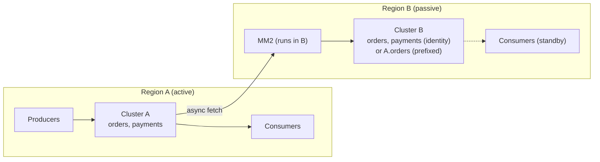
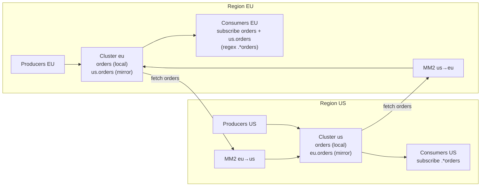
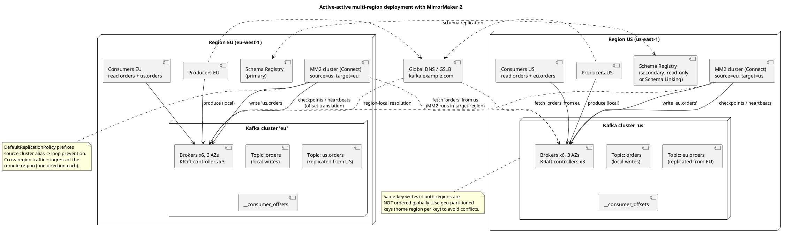
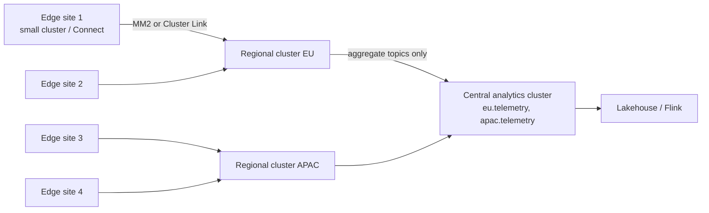
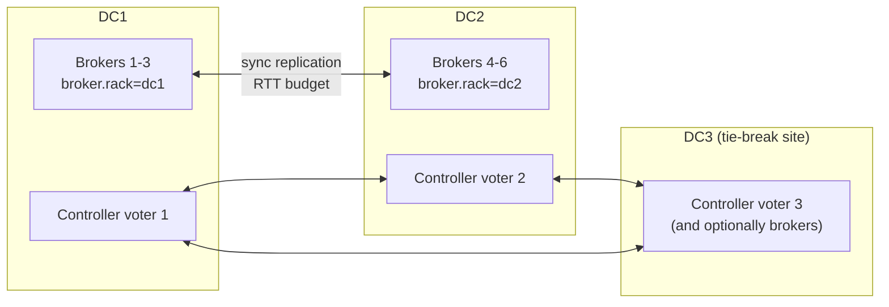

# Multi-Datacenter and Multi-Region Architectures

**Roles:** [ARCH] [ADMIN]   **Level:** Advanced
**Prerequisites:** Resiliency and High Availability (`03-resiliency-and-high-availability.md`); Admin – MirrorMaker 2 operations and security (`../03-admin/`); Fundamentals – consumer groups and offsets (`../01-fundamentals/`)

## What you will learn
- How to frame multi-region requirements (DR, locality, latency, residency, aggregation) before choosing a pattern
- The five patterns in depth: active-passive, active-active, hub-and-spoke, stretch cluster, and vendor-specific options (Confluent Multi-Region Clusters, Cluster Linking, MSK Replicator)
- The consumer offset translation problem and how MirrorMaker 2 checkpoints, Cluster Linking, and application design solve it
- Producer failover with DNS and service discovery, schema registry topology, ordering caveats, network cost, and cross-DC security
- A comparison matrix against RPO/RTO/cost/complexity and three reference architectures (banking, e-commerce, IoT)

## 1. Concept

A single Kafka cluster is a single failure domain for metadata and a single latency domain for `acks=all`. Anything that must survive a region loss, keep data inside a jurisdiction, or serve users on two continents needs more than one cluster (or a cluster deliberately stretched across sites). The design question is never "which replication tool" first; it is "which requirement dominates":

| Requirement | Question to answer | Pattern it pushes toward |
|-------------|-------------------|--------------------------|
| Disaster recovery | RPO (how much data may be lost) and RTO (how long to recover)? | RPO 0 → stretch cluster; RPO seconds → async replication (active-passive) |
| Data locality / latency | Do producers and consumers in each region need local, low-latency access? | Active-active with local clusters |
| Compliance / data residency | Must certain data never leave a jurisdiction? | Geo-partitioning; per-region clusters with selective replication |
| Aggregation | Do central analytics need a global view? | Hub-and-spoke (edge → regional → central) |
| Cost | What is the cross-region egress budget? | Fewer replicated topics; compression; one-way flows |
| Ordering | Is global ordering per key required? | Single home region per key |



## 2. How it works internally

### 2.1 MirrorMaker 2 mechanics

MirrorMaker 2 (MM2, since 2.4, KIP-382) is a set of Kafka Connect connectors:

| Connector | Role | Internal topic it writes |
|-----------|------|--------------------------|
| `MirrorSourceConnector` | Consumes topics from the source cluster and produces them to the target, preserving partition (partition *i* → partition *i*), key, headers, and timestamps; syncs topic configs and ACLs (optionally) | `<target>.offset-syncs.<source>.internal` (source offset ↔ target offset pairs) |
| `MirrorCheckpointConnector` | Reads consumer group offsets on the source, translates them via offset-syncs, writes checkpoints on the target; with `sync.group.offsets.enabled=true` writes translated offsets directly into the target's `__consumer_offsets` for idle groups | `<source>.checkpoints.internal` |
| `MirrorHeartbeatConnector` | Emits heartbeats so replication liveness and lag can be measured end-to-end | `heartbeats` |

Replicated topics are renamed by the `replication.policy.class`: the `DefaultReplicationPolicy` prefixes the source alias (`us.orders`), which is what prevents loops in active-active (MM2 never re-replicates a topic whose name already carries a remote prefix). The `IdentityReplicationPolicy` (since 3.x) keeps names unchanged for active-passive migrations but *cannot* be used bidirectionally without loops.

Offsets are **not** identical across clusters: the target topic's offsets differ from the source (different segment history, compaction, retries), which is why offset translation exists.

### 2.2 Offset translation



Translation is *approximate to the nearest sync point* (`offset.lag.max` controls sync granularity, default 100), so a failed-over consumer may reprocess a small window. Consumers must therefore be idempotent. Alternatives:

| Approach | Mechanism | Caveat |
|----------|-----------|--------|
| MM2 checkpoints + `RemoteClusterUtils.translateOffsets()` or `sync.group.offsets.enabled` | Described above | Only for groups that committed on the source; small replay window |
| Confluent Cluster Linking | Byte-for-byte mirror topics preserve *identical* offsets, so consumer offsets can be synced verbatim (`consumer.offset.sync.enable`) | Confluent-specific; mirror topics are read-only until promoted |
| MSK Replicator | Offset translation for consumer groups when using identical topic names (since 2024) | AWS-specific |
| Application-level | Consumers store the event timestamp or a business watermark and resume by `offsetsForTimes()` | Works with any tool; needs timestamps to be meaningful |

### 2.3 Failover sequence (active-passive)

```mermaid
sequenceDiagram
    participant Ops as Operator / automation
    participant DNS as DNS / service discovery
    participant P as Producers
    participant A as Primary cluster (down)
    participant B as Secondary cluster
    participant C as Consumers
    Ops->>Ops: Declare disaster (RTO clock starts)
    Ops->>B: Stop MM2 (avoid writing stale data after promotion)
    Ops->>B: Verify replication lag at time of failure (RPO actual)
    Ops->>DNS: kafka.example.com → secondary bootstrap
    P->>DNS: re-resolve on reconnect (client.dns.lookup, metadata refresh)
    P->>B: produce to orders (IdentityReplicationPolicy) or primary.orders
    Ops->>C: restart consumers with translated offsets (checkpoints / synced groups)
    C->>B: consume from translated offset; idempotent processing absorbs replay
    Note over A,B: When A returns: reverse MM2 direction B → A, reconcile, plan failback
```

## 3. Patterns in depth

### 3.1 Active-passive with MM2



| Aspect | Detail |
|--------|--------|
| Pros | Simple mental model; one writer; no conflicts; cheap (one-way traffic) |
| Cons | Secondary idle (cost without utilization); RPO = replication lag; failover requires DNS/config change and offset translation; failback is a project |
| When | DR for a single-region product; regulatory requirement for a secondary site |
| Topic naming | `IdentityReplicationPolicy` so applications use the same topic names after failover; or prefixed with a consumer-side alias |
| MM2 placement | Run MM2 in the *target* region: consuming across regions is more tolerant of latency than producing with `acks=all` |
| Key configs | `replication.factor=3` for internal topics, `sync.group.offsets.enabled=true`, `emit.checkpoints.interval.seconds=10`, `refresh.topics.interval.seconds`, `tasks.max` ≈ partitions / 10 |

> **Production tip:** Run the failover every quarter as a drill, including failback. An untested DR site is a cost line, not a control.

### 3.2 Active-active with MM2



| Aspect | Detail |
|--------|--------|
| Pros | Both regions serve local reads and writes; no idle site; region loss degrades rather than fails |
| Cons | Two copies of every topic (local + remote) in each region; consumers must subscribe to both; no global ordering; conflict handling if the same key is written in both regions; double cross-region traffic |
| Loop prevention | `DefaultReplicationPolicy` prefix: `eu.orders` is never re-replicated to US as `us.eu.orders` because MM2 filters topics already carrying a cluster alias; with `IdentityReplicationPolicy` bidirectional replication **loops**, do not do it |
| Conflict handling | Prefer *geo-partitioned keys* (each key has a home region; the other region only reads); otherwise last-writer-wins by event timestamp, CRDT-style merge in a Streams job, or an application-level reconciliation topic |
| Consumers | Subscribe with a pattern (`.*\.?orders`) and process both streams; per-key ordering holds only within one region's stream |
| Local-only topics | Exclude via `topics.exclude` (e.g., `.*\.internal`, `.*-changelog`, `.*-repartition`) |

Deployment view with both regions, MM2 in each target, schema registry topology, and global DNS:



Source: `diagrams/multi-datacenter-and-multi-region-active-active-deployment.puml`.

### 3.3 Hub-and-spoke aggregation



| Aspect | Detail |
|--------|--------|
| Pros | One-way flows (cheap, no conflicts); local autonomy at the edge; central global view |
| Cons | Central cluster must be sized for the sum; replication lag varies per spoke; edge sites need local retention to buffer link outages |
| When | IoT, retail stores, factories, regional subsidiaries feeding group analytics |
| Design | Prefix by site (`store-042.pos.sales`); replicate only aggregate or pre-filtered topics; local retention at edge ≥ longest plausible link outage |

### 3.4 Stretch cluster



| Aspect | Detail |
|--------|--------|
| Pros | RPO 0; one cluster, one set of offsets; failover is a leader election, not a project; no offset translation |
| Cons | Every `acks=all` write pays inter-site RTT; link instability causes ISR churn; needs a third site for quorum majority; a single metadata bug or bad config affects all sites; capacity must absorb one site's loss |
| Latency budget | Indicative practical ceiling around 50 ms RTT; comfortable below 10–20 ms (metro distances) |
| The "2.5 DC" layout | Two full data centres with brokers plus a small third site holding only a controller voter (and, in Confluent Platform, observers); Apache Kafka needs the voter only |
| `min.insync.replicas` placement | With RF=4 (2 per DC) and min.isr=2, a full DC loss keeps writes flowing, but min.isr can be satisfied by two replicas in the same DC, so an ack does not prove the data reached the other site (RPO 0 is only guaranteed when min.isr=3 forces the ISR to span both DCs at ack time, at the cost of blocking writes on DC loss). With RF=3 (2+1) and min.isr=2, losing the two-replica DC leaves one replica and blocks writes. Model each topic's RF/min.isr against "which DC can I lose, and do I want writes to block or to continue" |
| Confluent observers (Confluent Platform, Multi-Region Clusters) | Replicas that follow asynchronously and do not count toward ISR/min.isr, with automatic observer promotion when the ISR falls below a threshold; gives RPO 0 within a DC and async DR to the other without stretching `acks=all` latency. **Confluent-specific** |
| Client placement | Consumers use `client.rack` for follower fetching; producers see the RTT regardless |

> **Anti-pattern:** Stretching one cluster across two sites with no third site, "because we only have two DCs". A two-site quorum cannot distinguish site loss from link loss; the survivor either freezes or risks split-brain depending on where the majority was.

### 3.5 Confluent Cluster Linking and other vendor options (vendor-specific)

| Option | Vendor | Mechanism | Notable properties |
|--------|--------|-----------|--------------------|
| Cluster Linking | Confluent Platform / Cloud | Broker-to-broker replication protocol (no Connect workers); mirror topics are byte-identical and read-only, offsets preserved, consumer offsets and ACLs syncable; "promote"/"failover" makes the mirror writable | No offset translation problem; supports bidirectional linking with prefixing; requires Confluent on at least the destination |
| Multi-Region Clusters (MRC) | Confluent Platform | Stretch cluster with sync replicas + async observers, `replica.placement` per topic | RPO 0 in-region + async DR in one cluster; Confluent-specific |
| Schema Linking | Confluent | Replicates schema subjects between registries | Keeps schema ids consistent for mirrored data |
| MSK Replicator | AWS MSK | Managed replication between MSK clusters (same or cross-region), identical topic names option, consumer offset sync | AWS-specific; cost per GB replicated |
| Redpanda remote read replicas / tiered | Redpanda | Read-only replicas hydrated from object storage | Vendor-specific |

### 3.6 Geo-partitioning of keys

Assign each key a **home region** (customer's country, tenant's region, account's ledger site). Producers write only in the home region; other regions receive the mirror for read purposes. Benefits: no write conflicts, global per-key ordering (within the home stream), and data residency by construction (mirror only the topics allowed to leave). Implement with a routing table (key → region) in the producer or an API gateway, and put the region in the topic name or a header so mis-routed writes are detectable.

### 3.7 Producer failover via DNS and service discovery

| Technique | How | Watch out |
|-----------|-----|-----------|
| DNS alias for bootstrap (`kafka.example.com` → region CNAME) | Change the record on failover; clients re-resolve on new connections | Bootstrap only affects new metadata fetches; running clients keep broker addresses until connections drop; `metadata.max.age.ms` and `client.dns.lookup=use_all_dns_ips` |
| Advertised listeners per region | Brokers advertise region-local names; clients never learn cross-region addresses | Clients cannot accidentally follow leaders into another region (good) but need explicit failover |
| Service discovery (Consul/Kubernetes/Config service) | Application reads active cluster from a config source and rebuilds the producer | Most controllable; requires application support for "swap cluster" |
| Dual producers | Application writes to both clusters (sync or async) | Dual-write consistency problems; usually worse than replication |

Failover must be deliberate (a human or a tested automation declares it) to avoid split-brain where both regions think they are primary.

### 3.8 Global schema registry topology

| Topology | Mechanism | Trade-off |
|----------|-----------|-----------|
| Single global registry with regional read replicas | One primary (writes), followers forward writes; regional caches serve reads | Writes cross regions (rare); simple ids |
| Registry per region + Schema Linking / MM2 of `_schemas` | Subjects replicated; ids must remain consistent (import mode) | Independent regions; more operational work |
| Registry per cluster, no linking | Each region registers its own | Same schema may get different ids → mirrored data unreadable unless ids match; avoid |

Whichever topology, mirrored messages carry the *source* registry's schema id in their bytes, so the destination registry must resolve that id to the same schema.

### 3.9 Ordering across regions

Ordering in Kafka is per partition within one cluster. Mirrored topics preserve order per partition from the source, but a consumer reading `orders` and `us.orders` sees two independent streams with no cross-stream ordering. Global ordering per key requires a single home region per key (geo-partitioning) or an application-level sequence (versioned records with conflict resolution). Timestamps are not a total order; clocks drift.

### 3.10 Network cost and security across DCs

| Concern | Guidance |
|---------|----------|
| Cross-region egress | Billed per GB in every cloud; replicate only what is needed (`topics` allow-list), compress at producers (mirrored bytes stay compressed), and prefer one-way flows |
| Bandwidth | MM2 throughput per task is bounded by consumer fetch and producer settings; raise `tasks.max`, `fetch.max.bytes`, `batch.size`, socket buffers for high-RTT links |
| Encryption | TLS on every cross-DC listener (`security.inter.broker.protocol=SSL` for stretch clusters; MM2 source/target `security.protocol=SASL_SSL`) |
| Authentication | Separate principals for MM2 per direction with minimal ACLs (read source topics + group, write target topics + internal topics) |
| Private connectivity | VPC peering / Transit Gateway / interconnect; avoid public endpoints |
| Data residency | Topic-level allow-lists per link; classification tags decide what may cross (chapter 07) |

### 3.11 Testing failover

1. **Table-top**: walk through the runbook and the "who declares" decision.
2. **Consumer-only failover**: point a read-only consumer group at the mirror and validate offset translation and data completeness (count by key, compare checksums over a window).
3. **Producer failover in staging**: flip DNS/config, measure RTO (time to first acknowledged write), RPO (last source offset − last mirrored offset at cut), and duplicates observed.
4. **Full game day in production** with error budget allocated; verify failback.
5. **Chaos on the link**: inject latency and packet loss and confirm MM2 lag alerts (`replication-latency-ms`, `record-age-ms`) and stretch-cluster ISR stability.

## 4. Failure modes and how to detect them

| Symptom | Likely cause | Metric / log to check | Fix |
|---------|--------------|-----------------------|-----|
| MM2 lag climbing | Link bandwidth, too few tasks, target `acks=all` latency | MM2 `replication-latency-ms`, `record-age-ms`, `byte-rate` per topic | Increase `tasks.max`, fetch/batch sizes, socket buffers; run MM2 in target region |
| Consumer group resumes from earliest/latest after failover | Checkpoints not synced or group not found | `checkpoint-latency-ms`, `<source>.checkpoints.internal` content | `sync.group.offsets.enabled=true`, `emit.checkpoints.enabled=true`; translate manually with `RemoteClusterUtils` |
| Topics duplicated with double prefixes (`us.eu.orders`) | Wrong replication policy or misconfigured aliases | Topic list on both clusters | Use `DefaultReplicationPolicy` with correct `clusters` aliases; exclude patterns |
| Data readable in source, deserialization fails in target | Schema id mismatch between registries | Serializer exceptions on consumers | Link registries / import ids; never register independently |
| Stretch cluster ISR flapping | Inter-site latency spikes above `replica.lag.time.max.ms` | `IsrShrinksPerSec`, `IsrExpandsPerSec` | Fix link; raise `replica.lag.time.max.ms` moderately; reconsider stretch |
| Both regions writing the same keys | No home-region routing | Conflict detector / duplicate ids downstream | Geo-partition keys; add region header; reconcile |
| Failover takes hours | Manual runbook, DNS TTLs, consumer restarts | RTO measurement from drills | Automate DNS/config flip; pre-provision consumers in standby; short TTLs |
| MM2 re-replicates everything after restart | Lost Connect offset storage | Connect `offset.storage.topic` | RF=3 for Connect internal topics; do not recreate MM2 with a new name casually |

## 5. Design guidance (architect view)

### 5.1 Comparison matrix

| Pattern | RPO | RTO | Cross-region cost | Complexity | Ordering | Best for |
|---------|-----|-----|-------------------|------------|----------|----------|
| Active-passive (MM2 / Cluster Linking / MSK Replicator) | Seconds to minutes (lag) | Minutes (DNS + offset translation) with drills; hours without | 1× ingress one-way | Low–medium | Preserved per partition within the mirror | DR for single-region products |
| Active-active (MM2, prefixed) | Seconds (for the other region's data) | Near zero for local data; minutes for remote data | 2× (each direction) | High (dual subscriptions, conflicts) | Per region only | Global products with local writes; geo-partitioned keys |
| Hub-and-spoke | Seconds to minutes per spoke | N/A (analytics) | Sum of spokes, one-way | Medium | Per spoke | Aggregation, IoT, retail |
| Stretch cluster (3 sites / 2.5 DC) | 0 | Seconds | Replication traffic continuous between sites | Medium infra, low app | Global per partition | Metro DR with RPO 0 |
| Confluent MRC (observers) | 0 within sync set; async to observers | Seconds | Continuous | Medium | Global per partition | Confluent customers needing RPO 0 + async DR in one cluster |
| Cluster Linking active-passive | Seconds | Minutes; offsets preserved | 1× | Low–medium | Preserved with identical offsets | Confluent customers; migrations |

### 5.2 Decision table

| If… | Then… |
|-----|-------|
| RPO must be 0 and sites are metro-distance with a third site | Stretch cluster (Apache) or MRC (Confluent) |
| RPO of seconds is acceptable, one region writes | Active-passive; drill quarterly |
| Users on two continents write the same entity types but different keys | Active-active with geo-partitioned keys |
| Same keys written on both sides is unavoidable | Active-active plus explicit conflict resolution (versioned records, reconciliation job); expect complexity |
| Hundreds of small sites | Hub-and-spoke; replicate aggregates; edge retention ≥ outage window |
| Data must not leave a jurisdiction | Per-region clusters; allow-listed replication; residency tags |
| Already on Confluent and want identical offsets | Cluster Linking |

### 5.3 Reference architectures

**Banking core ledger (RPO 0, strict ordering per account)**

- Two metro data centres (< 5 ms RTT) plus a third site for the controller voter; stretch cluster, `broker.rack` per DC, RF=4 (2+2), `min.insync.replicas=3` so the ISR always spans both DCs at ack time (write blocks on DC loss until an operator lowers min.isr deliberately, which is the desired failure direction for a ledger), `unclean.leader.election.enable=false`, transactional producers.
- Async MM2 to a distant DR region for regulatory copies (RPO minutes, never promoted without a control decision).
- Consumers per account key; account → partition mapping fixed; partitions never increased without a re-key migration.

**E-commerce (active-active EU/US)**

- Cluster per region; customers geo-partitioned by home region; `orders` written locally, mirrored with prefix; catalog and pricing topics mirrored one-way from the region owning the catalog.
- Consumers subscribe `.*orders`; Streams jobs compute regional views and a global view from both streams.
- Region loss: DNS shifts the failed region's users to the survivor; their keys are temporarily "homed" there with a conflict-reconciliation job on return.

**IoT aggregation (edge → regional → central)**

- Edge gateways batch and compress; small edge clusters (or Connect-only) with days of local retention; MM2 one-way to regional clusters with site prefix.
- Regional Streams jobs downsample; only aggregates flow to the central cluster (10–100× less data), which feeds Flink and the lakehouse.
- Link outages are absorbed by edge retention; ordering per device is preserved by keying on device id at the edge.

## 6. Hands-on

### 6.1 MM2 active-active configuration (dedicated MM2 cluster mode)

```properties
# mm2.properties
clusters = eu, us
eu.bootstrap.servers = eu-broker1:9092,eu-broker2:9092,eu-broker3:9092
us.bootstrap.servers = us-broker1:9092,us-broker2:9092,us-broker3:9092

eu->us.enabled = true
us->eu.enabled = true
eu->us.topics = orders.*, catalog.*
us->eu.topics = orders.*
topics.exclude = .*\.internal, .*-changelog, .*-repartition, __.*

replication.policy.class = org.apache.kafka.connect.mirror.DefaultReplicationPolicy
replication.factor = 3
checkpoints.topic.replication.factor = 3
heartbeats.topic.replication.factor = 3
offset-syncs.topic.replication.factor = 3

sync.group.offsets.enabled = true
emit.checkpoints.interval.seconds = 10
sync.topic.configs.enabled = true
sync.topic.acls.enabled = false
refresh.topics.interval.seconds = 60
tasks.max = 24

# security (per cluster)
eu.security.protocol = SASL_SSL
eu.sasl.mechanism = SCRAM-SHA-512
us.security.protocol = SASL_SSL
us.sasl.mechanism = SCRAM-SHA-512
```

```bash
connect-mirror-maker.sh mm2.properties            # run one instance per region, in the target region
```

### 6.2 Check replication lag and checkpoints

```bash
kafka-console-consumer.sh --bootstrap-server us-broker1:9092 --topic eu.checkpoints.internal \
  --from-beginning --formatter org.apache.kafka.connect.mirror.formatters.CheckpointFormatter | tail -5

kafka-console-consumer.sh --bootstrap-server us-broker1:9092 --topic heartbeats --from-beginning \
  --formatter org.apache.kafka.connect.mirror.formatters.HeartbeatFormatter | tail -3

# MM2 JMX: kafka.connect.mirror:type=MirrorSourceConnector,target=us,topic=eu.orders,partition=0
#   attributes replication-latency-ms-max, record-age-ms-max, byte-rate
```

### 6.3 Translate offsets manually in an application (Java)

```java
Map<TopicPartition, OffsetAndMetadata> translated =
    RemoteClusterUtils.translateOffsets(usClientProps, "eu", "billing", Duration.ofSeconds(30));
consumer.assign(translated.keySet());
translated.forEach((tp, om) -> consumer.seek(tp, om.offset()));
```

### 6.4 Failover drill checklist (active-passive)

```bash
# 1. Capture RPO: last mirrored offset vs source (if source reachable)
kafka-get-offsets.sh --bootstrap-server us-broker1:9092 --topic eu.orders --time -1
# 2. Stop MM2 in the target region
# 3. Flip DNS (example with AWS CLI Route53 change batch, TTL 30s)
aws route53 change-resource-record-sets --hosted-zone-id Z123 --change-batch file://failover.json
# 4. Restart consumers with group offsets already synced (sync.group.offsets.enabled) and verify
kafka-consumer-groups.sh --bootstrap-server us-broker1:9092 --describe --group billing
# 5. Record RTO = time until first successful produce on the secondary
```

## 7. Interview questions for this chapter

### Q1. Compare active-passive and active-active with MirrorMaker 2. When would you pick each?
**Role:** [ARCH] | **Difficulty:** ★★☆ | **Topic:** Patterns

**Answer.**
Active-passive replicates one way; a single region writes, the other holds a warm copy. It is simple, cheap, and conflict-free, but the passive site is idle, RPO equals replication lag, and failover needs a DNS/config flip plus offset translation. Active-active runs a cluster per region with bidirectional prefixed replication; each region serves local writes and reads both streams, so region loss degrades instead of failing, but there is no global ordering, storage and egress double, and same-key writes in both regions need conflict handling. Pick active-passive for DR of a single-region product; pick active-active when users on both sides need local write latency, ideally with geo-partitioned keys so conflicts cannot occur.

**Follow-up probes.** How does MM2 avoid replication loops? How do consumers subscribe in active-active?

### Q2. Why can't a consumer just use its committed offset after failing over to the mirror cluster?
**Role:** [ARCH] [DEV] | **Difficulty:** ★★☆ | **Topic:** Offset translation

**Answer.**
Offsets are per-partition positions in a specific log; the mirror topic is a different log with different history (retries, compaction, start point), so offset 1,000,000 on the source may be 998,120 on the target. MM2's `MirrorCheckpointConnector` records source→target offset pairs in `offset-syncs` and emits per-group checkpoints; with `sync.group.offsets.enabled=true` it writes translated offsets into the target's `__consumer_offsets` for idle groups, or the application calls `RemoteClusterUtils.translateOffsets()`. Translation is approximate to the nearest sync point, so consumers must be idempotent. Confluent Cluster Linking sidesteps the issue by preserving offsets byte-for-byte.

**Follow-up probes.** What does `offset.lag.max` control? What happens for a group that never committed on the source?

### Q3. What is a "2.5 DC" stretch cluster and what latency budget does it need?
**Role:** [ARCH] | **Difficulty:** ★★★ | **Topic:** Stretch cluster

**Answer.**
Two full data centres run brokers with `broker.rack` per DC, and a small third site runs only a KRaft controller voter (plus, in Confluent Platform, observers) so that the metadata quorum keeps a majority when either DC is lost. Every `acks=all` write waits for replication across the inter-DC link, so the RTT is added to produce latency; metro distances (single-digit ms) are comfortable and roughly 50 ms is the practical ceiling before ISR churn and throughput loss make it unworkable. Choose RF and `min.insync.replicas` per topic so you know exactly which DC loss blocks writes and which does not.

**Follow-up probes.** With RF=4 (2+2) and min.isr=2, is RPO truly 0 on DC loss? Why does a two-site quorum fail?

### Q4. How would you enforce data residency in a multi-region Kafka estate?
**Role:** [ARCH] | **Difficulty:** ★★☆ | **Topic:** Compliance

**Answer.**
Run a cluster per jurisdiction, classify topics (chapter 07), and let replication links carry only allow-listed topics (`eu->us.topics` explicit list, never `.*`), with residency enforced in the GitOps pipeline that generates MM2 or Cluster Link configuration. Geo-partition keys so that a resident's data is only written in its home region, and put the region in headers to detect mis-routing. Encrypt in transit with mTLS between regions and give the replication principal read-only ACLs on the allowed topics. Audit the mirrored topic list periodically.

**Follow-up probes.** How do you handle a global analytics need on restricted data (aggregation/pseudonymisation at source)? What about consumer offsets and checkpoints, which contain group names?

### Q5. Describe the failover runbook for an active-passive deployment and how you measure RPO and RTO.
**Role:** [ARCH] [ADMIN] | **Difficulty:** ★★☆ | **Topic:** Failover

**Answer.**
Declare the disaster (a named decision-maker), stop MM2 in the target so stale data cannot arrive after promotion, record the last mirrored offsets per partition against the last known source offsets to compute actual RPO, flip the bootstrap DNS/config to the secondary, restart or re-point consumers using synced group offsets, and measure RTO as the time to the first acknowledged produce on the secondary. Afterwards, run replication in the reverse direction before failback. Practise quarterly; unpractised failovers take hours because of DNS TTLs, missing offsets, and unknown ACL gaps.

**Follow-up probes.** Why stop MM2 before promotion? How do you prevent both regions from being primary at once?

### Q6. Where should MM2 run, in the source or the target region, and why?
**Role:** [ADMIN] [ARCH] | **Difficulty:** ★☆☆ | **Topic:** MM2 placement

**Answer.**
In the target region. MM2's consumer side tolerates high RTT well (large fetches, no ack wait), whereas its producer side with `acks=all` pays the RTT on every batch; placing MM2 next to the target cluster keeps produce latency local and lets remote fetches be batched. It also means the target region is self-sufficient during failover: nothing in the failed region is needed to keep the mirror alive.

**Follow-up probes.** How do you size `tasks.max`? What internal topics does MM2 create and where?

### Q7. Global ordering per customer is required, but customers travel between regions. How do you design it?
**Role:** [ARCH] | **Difficulty:** ★★★ | **Topic:** Ordering

**Answer.**
Assign each customer a home region and route all writes for that customer there, regardless of where the request lands (an API gateway or routing table does the redirect); other regions consume the mirrored stream read-only. Ordering then holds because all writes for the key go to one partition in one cluster. Moving a customer's home region is an explicit migration: drain in-flight events, flip the routing entry, and accept a brief write pause for that key. Trying to achieve ordering with dual writes and timestamps fails because clocks drift and replication lag reorders events.

**Follow-up probes.** What happens during a region outage for customers homed there? How would Confluent Cluster Linking or MRC change the design?

### Q8. Scenario: an existing active-passive setup uses `IdentityReplicationPolicy`. The business now wants active-active. What breaks?
**Role:** [ARCH] | **Difficulty:** ★★★ | **Topic:** Replication policy

**Situation.** Topics have identical names in both clusters; MM2 replicates A→B.
**Constraints.** Applications hard-code topic names; downtime for renames is expensive.
**Expected reasoning.** Enabling B→A with identity naming creates an infinite loop because MM2 cannot distinguish local from mirrored records. The prefix in `DefaultReplicationPolicy` is what makes bidirectional replication safe.
**Model answer.** Move to the default prefixed policy for the bidirectional link (`orders` + `b.orders` in A, `orders` + `a.orders` in B) and change consumers to pattern subscriptions, or keep identity naming one-way and introduce geo-partitioning so that only one cluster writes each key with a separate prefixed link for the reverse direction. Alternatively use Cluster Linking (Confluent) whose bidirectional mode handles loop prevention with prefixes as well. Plan the change as a migration with a cut-over window and a consumer subscription change behind a feature flag.

## Key takeaways
- Frame by requirement (RPO, RTO, locality, residency, aggregation, cost) before choosing a replication tool.
- Stretch clusters deliver RPO 0 at the price of inter-site latency on every write and a mandatory third site; async patterns deliver isolation at the price of offset translation.
- MM2 prefixes prevent loops in active-active; identity naming is one-way only.
- Consumer offsets do not transfer; plan translation (checkpoints, Cluster Linking, timestamps) and make consumers idempotent.
- Geo-partition keys to get global per-key ordering and residency without conflict resolution.
- Drill the failover; measure RPO and RTO; replicate only allow-listed topics to control cost and compliance.

## Further reading
- Apache Kafka documentation: "Geo-Replication (Cross-Cluster Data Mirroring)"; KIP-382 (MirrorMaker 2), KIP-545 (MM2 automated consumer offset sync), KIP-690 (replication policy improvements), KIP-853 (dynamic quorum)
- Confluent documentation: Multi-Region Clusters (observers, `replica.placement`), Cluster Linking, Schema Linking (vendor-specific)
- AWS documentation: MSK Replicator (vendor-specific)
- "Disaster Recovery for Multi-Datacenter Apache Kafka Deployments" (Confluent white paper)
