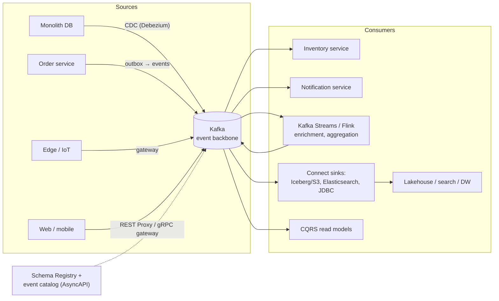
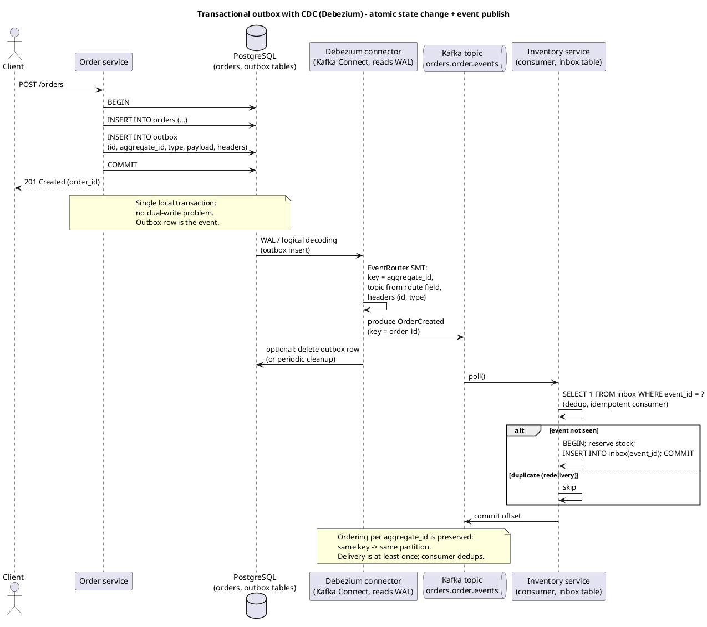
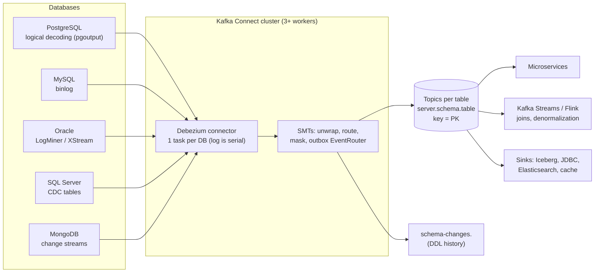
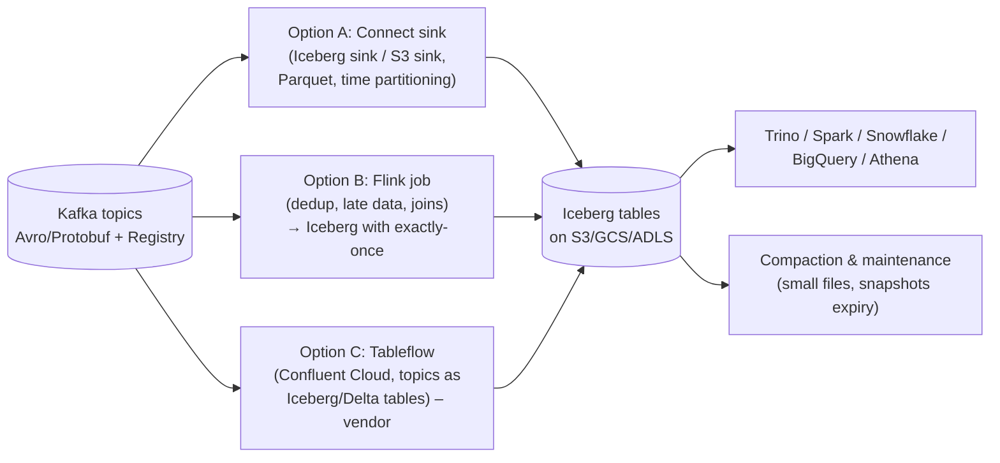
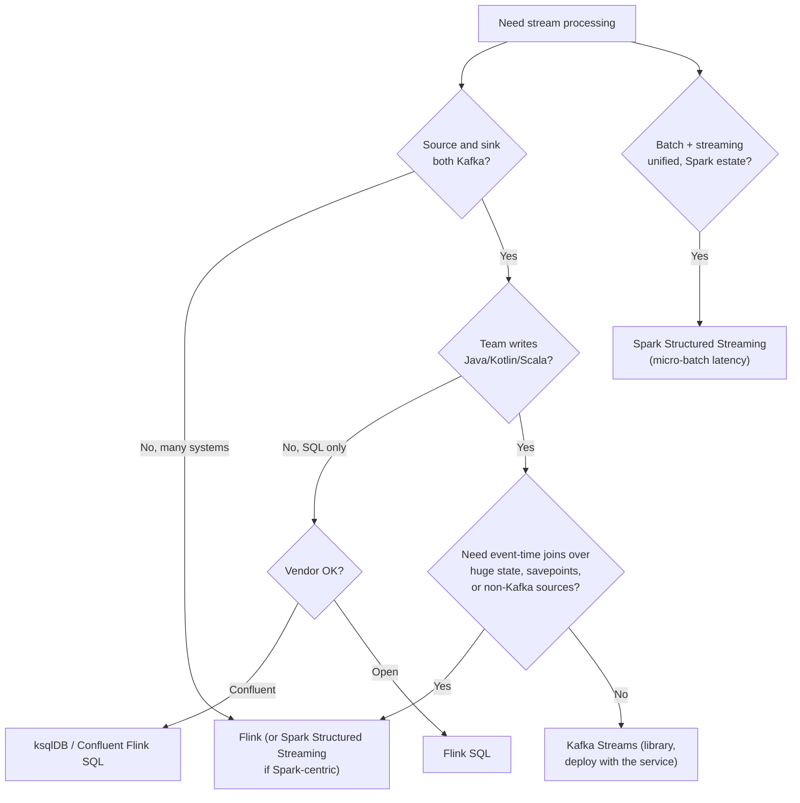

# Integration and Data Architecture Patterns

**Roles:** [ARCH] [DEV]   **Level:** Advanced
**Prerequisites:** Developer – producers, consumers, transactions, Kafka Streams, Connect (`../02-developer/`); Fundamentals – topics, keys, compaction (`../01-fundamentals/`); Resiliency (`03-resiliency-and-high-availability.md`)

## What you will learn
- Where Kafka sits in an enterprise architecture: event backbone, streaming platform, and shared log for microservices
- Event-driven microservice patterns (notification, state transfer, event sourcing, CQRS, sagas, outbox + CDC, idempotent consumer, inbox) with when-to-use guidance
- CDC architectures with Debezium, lakehouse integration (Iceberg, Flink, Tableflow), and how to choose a stream-processing engine
- Topic design and data modelling: entity vs event-type topics, key choice, tenant partitioning, envelopes (CloudEvents), versioning
- API management (AsyncAPI, REST Proxy, gRPC gateways), event catalogs, and the anti-patterns that turn Kafka into a liability

## 1. Concept

Kafka plays three distinct roles, and confusion between them causes most integration mistakes:

| Role | What Kafka is | What it is not | Typical topics |
|------|---------------|----------------|----------------|
| **Event backbone** | Durable, ordered, replayable notification bus between systems; decouples producers from consumers in time and topology | A request/response RPC transport | `orders.order.created`, `customer.profile.updated` |
| **Streaming platform** | Log plus stream processing (Streams, Flink, ksqlDB) plus connectors; continuous computation over events | A batch data warehouse | Enriched streams, aggregates, changelogs |
| **Shared log / system of record** | Compacted or infinitely retained topics that are the authoritative history of state (event sourcing, CDC feeds) | A queryable database with indexes and ad-hoc reads | Compacted entity topics, event-sourced aggregates |



The reference shape: systems of record publish facts via outbox/CDC; services react asynchronously; stream processors derive new streams; sinks materialize into stores optimized for queries; schemas and a catalog govern the contracts.

## 2. How it works internally

### 2.1 Event-driven microservice patterns

| Pattern | Mechanism | Payload | Coupling | When to use | Pitfall |
|---------|-----------|---------|----------|-------------|---------|
| **Event notification** | Producer emits "something happened" with an id; consumers call back for details | Small (ids) | Consumers depend on the producer's API for details | Low-volume, details rarely needed | Thundering herd of callbacks; producer must stay up for consumers to function |
| **Event-carried state transfer** | Event carries the full (or delta) state so consumers keep a local copy | Full record | Consumers depend only on the schema | Read-heavy consumers, resilience against producer outages | Large events; schema evolution discipline required |
| **Event sourcing** | The event log *is* the state; current state is a fold over events | Domain events per aggregate | Internal to the service; expose projections externally | Audit, temporal queries, complex domains | Kafka is a poor per-aggregate store (no read-by-key without a projection); snapshotting needed |
| **CQRS** | Separate write model (commands → events) from read models (projections in optimized stores) | Events → read model updates | Read models eventually consistent | Different read/write scaling, multiple views | Users see stale reads; needs versioning/ETags |
| **Saga (choreography)** | Each service reacts to events and emits the next; compensating events on failure | Domain events | Implicit workflow across services | Few steps, stable participants | Workflow invisible; hard to reason about, hard to change |
| **Saga (orchestration)** | An orchestrator (Streams app, workflow engine) sends commands and tracks state | Commands + replies | Explicit workflow | Multi-step business transactions (orders, payments) | Orchestrator is a critical service; keep its state in a compacted topic |
| **Transactional outbox + CDC** | Service writes state and the event in one DB transaction; CDC publishes the outbox row | Event | None between DB and Kafka | Any service that owns a database and must publish reliably | Outbox growth (delete or TTL), duplicates on connector restart (consumers dedup) |
| **Idempotent consumer** | Consumer records processed event ids (inbox table) or uses natural idempotent operations (upsert by key/version) | – | – | Every consumer of at-least-once delivery | Id table growth; use TTL or per-key version comparison |
| **Inbox pattern** | Consumer first persists the event to an inbox table (dedup by id) in the same transaction as its state change, then processes | – | – | Consumers with their own DB that must process exactly once | Two-phase within the consumer's DB; still async to Kafka commit (commit after DB commit) |

Outbox with CDC is the default way to publish from a database-owning service; it removes the dual-write problem (writing to the DB and Kafka separately can leave them inconsistent on any crash between the two).



Source: `diagrams/integration-and-data-architecture-patterns-outbox-cdc-sequence.puml`.

### 2.2 CDC architectures with Debezium



| Aspect | Detail |
|--------|--------|
| Snapshot vs streaming | Initial **snapshot** reads existing rows (consistent point in the log), then **streaming** follows the transaction log from that position; incremental snapshots (signal table) allow re-snapshotting tables without stopping streaming |
| Ordering | Preserved per key (primary key → partition); cross-table/transaction ordering is not preserved across topics; Debezium can emit transaction metadata (`provide.transaction.metadata`) for consumers that need boundaries |
| Schema changes | DDL captured to a history topic; Debezium evolves the Kafka schema (Avro/Protobuf/JSON Schema via Registry); consumers need backward-compatible handling; destructive changes require coordination |
| Envelope | Debezium's change event has `before`, `after`, `source`, `op` (c/u/d/r), `ts_ms`; use the `ExtractNewRecordState` SMT to flatten when consumers only need the row |
| Deletes | Emitted as `op=d` followed by a tombstone (null value) so compacted topics remove the key |
| Throughput | One task per database log; parallelism comes from partitions downstream, not from the connector |
| Sinks | JDBC sink with `insert.mode=upsert` and `pk.mode=record_key` for idempotent materialization; delete handling via `delete.enabled=true` |
| Data ownership | CDC exposes a database's *internal* schema; wrap with an outbox or a Streams "anti-corruption layer" before publishing as a public contract |

### 2.3 Lakehouse integration



| Aspect | Guidance |
|--------|----------|
| File format and layout | Parquet, partition by event time (day/hour) not by Kafka partition; align with query patterns |
| Small files | Sinks flush by size/time (`flush.size`, `rotate.interval.ms`); schedule Iceberg compaction; too-frequent flushes create thousands of small files |
| Exactly-once | S3 sink connector supports exactly-once via deterministic partitioning + rotation; Flink → Iceberg uses checkpoint-committed snapshots; JDBC upsert is idempotent |
| Schema evolution | Registry-compatible Avro/Protobuf evolves Iceberg schema automatically in most sinks (add columns); renames and type changes need migration |
| Late data and dedup | Flink (event time, watermarks) handles late events and duplicates; a plain sink writes what arrives |
| Confluent Tableflow | Materializes topics as Iceberg (and Delta) tables managed by Confluent Cloud with schema mapping from Schema Registry; **vendor-specific** and reduces pipeline code, at the cost of lock-in |
| Retention | The lakehouse becomes the long-term store; Kafka retention can shrink to days (or use tiered storage for replay) |

### 2.4 Stream-processing engine choice



| Criterion | Kafka Streams | Apache Flink | ksqlDB (Confluent) | Spark Structured Streaming |
|-----------|---------------|--------------|--------------------|----------------------------|
| Deployment | Library inside your JVM service; scale by instances | Cluster (JobManager/TaskManagers) or Kubernetes operator; separate platform | Server cluster (Confluent Platform/Cloud); SQL over REST | Spark cluster; micro-batch (continuous mode limited) |
| Sources/sinks | Kafka only (plus Connect) | Kafka, files, JDBC, CDC, Iceberg, Pulsar, many | Kafka (+ Connect integration) | Kafka, files, many |
| Semantics | Exactly-once v2 (Kafka transactions) | Exactly-once with checkpoints + transactional sinks | Exactly-once via Streams | At-least-once by default; exactly-once for idempotent sinks |
| State | RocksDB local + changelog topics; standby replicas | Managed state backends (RocksDB), savepoints, rescaling | Streams under the hood | Checkpointed state |
| Event time | Yes (stream time, grace periods) | Rich watermarks, late-data handling | Yes | Watermarks |
| Latency | Milliseconds | Milliseconds | Milliseconds | Hundreds of ms to seconds (micro-batch) |
| Ops burden | Low (no cluster) | Medium–high (own platform) or managed | Managed by Confluent | Spark platform |
| Language | Java/Kotlin/Scala DSL | Java/Scala/Python/SQL | SQL | Scala/Python/SQL |
| Best for | Per-service stream logic, microservice enrichment, moderate state | Enterprise-wide pipelines, complex event time, large state, multi-source | SQL-first teams on Confluent | Spark-centric data engineering |

### 2.5 Kafka with databases

| Direction | Pattern | Exactly-once approach |
|-----------|---------|-----------------------|
| DB → Kafka | Debezium CDC or outbox | At-least-once from connector; dedup downstream by event id or (table, PK, version) |
| Kafka → DB | JDBC sink with `insert.mode=upsert`, key as PK | Idempotent upsert: replaying the same record yields the same row; include a version/timestamp column and reject older versions for out-of-order protection |
| Kafka → DB (custom consumer) | Write DB then commit offset; make the write idempotent (upsert by key, or inbox table for event id dedup) | Exactly-once *effect* without distributed transactions |
| Kafka ↔ DB both | Streams app with `exactly_once_v2` writing derived events; DB updated by a separate idempotent sink | Do not attempt XA transactions spanning Kafka and a DB |

> **Anti-pattern:** "Exactly-once to the database" by wrapping Kafka commit and DB commit in a two-phase commit. Kafka does not participate in XA; the robust approach is idempotent writes plus at-least-once delivery.

### 2.6 Request/response over Kafka

Possible (correlation id header + reply topic per service or per instance, `ReplyingKafkaTemplate` in Spring), but only appropriate when the caller is itself asynchronous and can tolerate p99 latencies of tens of milliseconds and the operational cost of reply topics. Use HTTP/gRPC for synchronous request/response; use Kafka for commands whose result is another event.

> **Anti-pattern:** Chatty request/reply between microservices over Kafka, one topic pair per call. Latency compounds per hop, reply topics multiply, and debugging requires correlating across partitions; it recreates RPC with worse tooling.

### 2.7 Kafka as system of record vs transport

| Mode | Retention | Compaction | Tiered storage | Consequences |
|------|-----------|------------|----------------|--------------|
| Transport | Hours to days (`retention.ms`) | No | Optional | Consumers must keep up or lose data; source of truth elsewhere |
| Replayable history | Weeks to years | No | Yes (KIP-405) | Reprocessing possible; storage on object store; consumers re-derive state |
| Current-state store | Infinite (`retention.ms=-1`) | Yes (`cleanup.policy=compact`) | Not supported for compacted topics as of 3.9 | Latest value per key kept forever; tombstones delete; bootstrap by full scan |
| System of record | Infinite | Compact or not | Depends | Requires backup strategy (MM2 to a second cluster or lake export), schema governance, and acceptance that reads are scans, not lookups |

Kafka can be a system of record for event-sourced aggregates and CDC feeds, but it needs the same discipline as a database: backups, schema control, retention/legal policies, and a query layer (projections) for reads.

## 3. Configuration that matters

| Parameter / setting | Where | Recommended | Why |
|---------------------|-------|-------------|-----|
| `cleanup.policy` | topic | `compact` for entity/state topics, `delete` for event streams, `compact,delete` for bounded state history | Determines whether Kafka keeps latest-per-key or time-bounded history |
| `min.compaction.lag.ms` / `max.compaction.lag.ms` | topic | Set `max.compaction.lag.ms` (e.g., 7 d) for GDPR deletion guarantees | Bounds how long an old value or a deleted key survives |
| `delete.retention.ms` | topic | ≥ longest consumer bootstrap time (default 24 h) | Tombstones must remain long enough for consumers to see them |
| `transactional.id`, `processing.guarantee=exactly_once_v2` | producer / Streams | For read-process-write pipelines | Atomic multi-partition writes and offset commits |
| `isolation.level=read_committed` | consumer | Where transactions are used | Never expose aborted data |
| `key.converter`, `value.converter` with `schema.registry.url` | Connect | Avro or Protobuf converters | Typed contracts; JSON without schema is a liability |
| `transforms=unwrap,route` (Debezium `ExtractNewRecordState`, `EventRouter`) | Connect | Flatten envelopes; outbox routing | Consumers receive domain events, not CDC internals |
| `insert.mode=upsert`, `pk.mode=record_key`, `delete.enabled=true` | JDBC sink | For idempotent materialization | Replays are safe |
| `flush.size`, `rotate.interval.ms`, `partitioner.class` (time-based) | S3/Iceberg sink | Tune for file size 128 MB–1 GB | Avoid small files |
| `auto.register.schemas=false`, `use.latest.version=true` | serializers | Production | Schemas registered by CI, not by applications at runtime |

## 4. Failure modes and how to detect them

| Symptom | Likely cause | Metric / log to check | Fix |
|---------|--------------|-----------------------|-----|
| DB and Kafka disagree after a crash | Dual write without outbox | Reconciliation job diff | Adopt outbox + CDC |
| Consumers see the same event twice | At-least-once redelivery, connector restart | Duplicate ids in inbox table | Idempotent consumer; dedup by event id |
| Debezium falls behind | Single task, large transactions, slow WAL read, downstream `acks=all` latency | Connector `MilliSecondsBehindSource`, `QueueRemainingCapacity` | Tune `max.batch.size`, `max.queue.size`; split databases across connectors; check target broker latency |
| Postgres disk filling | Replication slot retained WAL because connector stopped | `pg_replication_slots` lag | Monitor slot lag; alert; remove abandoned slots |
| Deleted rows still appear in compacted consumer state | Tombstones expired before consumer bootstrapped | `delete.retention.ms` vs bootstrap time | Raise `delete.retention.ms`; snapshot-based bootstrap |
| Thousands of small Parquet files | Sink flushing too often | Object store listing; query planner time | Larger `flush.size`, time-based rotation, Iceberg compaction |
| Schema change breaks consumers | Incompatible change bypassed registry checks | Registry compatibility logs; consumer deserialization errors | Enforce compatibility in CI (chapter 07); expand-then-contract migrations |
| Saga stuck half-way | Missing compensation, orchestrator state lost | Orchestrator state topic; timeouts | Time-boxed steps with compensation; state in compacted topic |
| Request/reply timeouts | Reply topic partition mismatch, consumer lag | Reply latency histogram | Replace with HTTP where sync needed |
| Hot partition in CDC topic | Single busy table/key | Per-partition throughput | Route by PK; split tables into topics (`topic.creation`/route SMT) |

## 5. Design guidance (architect view)

### 5.1 Topic design and data modelling

| Decision | Options | Guidance |
|----------|---------|----------|
| Topic per entity vs per event type | `orders.order.events` (all order events, keyed by order id) vs `orders.order.created`, `orders.order.cancelled` | Prefer **per entity (aggregate)** when consumers need ordering across event types for one key; per event type when consumers are interested in exactly one type and volume differs widely. Ordering only exists within a topic-partition |
| Key choice | Aggregate id, tenant id, device id, null | Key = the identity whose ordering matters; avoid low-cardinality keys (hot partitions); null only when ordering is irrelevant |
| Partitioning by tenant | Key prefix (`tenant:entity`) vs topic per tenant | Shared topics with tenant in key for many small tenants; dedicated topics for whales or for isolation/compliance |
| Envelope | Custom vs **CloudEvents** (`id`, `source`, `type`, `specversion`, `time`, `subject`, `datacontenttype`, `data`) in structured or binary (headers) mode | Standardize one envelope; put metadata in headers so brokers/tools can route without deserializing payload |
| Schema format | Avro, Protobuf, JSON Schema | Avro for data-centric evolution and compact size; Protobuf for polyglot RPC ecosystems; JSON Schema when consumers are JavaScript-heavy; always via Registry |
| Versioning | Compatible evolution (add optional fields) vs new topic version (`...v2`) | Evolve in place under `BACKWARD` or `FULL` compatibility; create `v2` topic only for breaking changes, run both, migrate consumers, retire |
| Record size | Small events with ids vs full state | Full state ≤ ~ 100 KB is fine; beyond ~ 1 MB use claim-check |
| Headers | Correlation id, trace context (W3C `traceparent`), schema id, tenant, PII classification | Enables tracing and routing without payload parsing |
| Partition count | From throughput and consumer parallelism (chapter 01) plus growth margin | Changing partitions breaks key→partition mapping for stateful consumers |

Naming convention (detailed in chapter 07): `<domain>.<subdomain>.<entity>.<event-or-purpose>.<version>`, lowercase, dots as separators, no environment in the name.

### 5.2 API management for Kafka

| Tool | Purpose | Notes |
|------|---------|-------|
| **AsyncAPI** | Machine-readable description of channels (topics), messages (schemas), bindings (Kafka: partitions, keys, cluster) | Generates docs, client stubs, and catalog entries; equivalent of OpenAPI for events |
| **REST Proxy** (Confluent, vendor-specific; also Strimzi HTTP Bridge, Karapace) | HTTP produce/consume for clients without a Kafka library | Adds latency and a stateful consumer session; suitable for edge/legacy, not for high-throughput |
| **gRPC / GraphQL gateways** | Custom façade that validates, authenticates, and publishes | Enforces the public contract; hides topic names from external parties |
| **Schema Registry** | Contract enforcement at serialization time | Compatibility modes per subject; see chapter 07 |
| **Event catalog** (EventCatalog, Backstage plugin, Confluent Stream Catalog, DataHub) | Discoverability, ownership, lineage | Populated from AsyncAPI in CI |

### 5.3 Domain-driven event catalogs

Organize topics by bounded context (domain) with an owning team, a published AsyncAPI document per domain, and explicit **public** vs **internal** topics. Public events are stable contracts (versioned, compatibility-enforced, documented); internal topics (changelogs, repartitions, raw CDC) are not consumable by other domains. Cross-domain consumers depend only on public events; an anti-corruption layer (Streams job) translates raw CDC into public domain events.

### 5.4 Decision table: which pattern

| Situation | Pattern |
|-----------|---------|
| Service owns a DB and must publish reliably | Outbox + CDC |
| Legacy monolith DB, no code changes allowed | Debezium CDC on tables + Streams anti-corruption layer |
| Multi-step business transaction across services | Orchestrated saga with compensations |
| Consumers need current state of entities quickly | Event-carried state transfer on a compacted topic |
| Audit trail and time travel | Event sourcing with snapshots; history in Kafka (tiered) and lake |
| Analytics over all events | Sink to Iceberg via Connect or Flink |
| Complex joins across many sources, event-time correctness | Flink |
| Per-service enrichment inside a microservice | Kafka Streams |
| Synchronous user-facing request | HTTP/gRPC, not Kafka |

### 5.5 Anti-patterns

> **Anti-pattern:** Kafka as a database of record without design: infinite retention, no schema governance, no backup, consumers scanning the whole topic to answer "what is the state of key X". Add projections, compaction, backups, and a catalog, or keep the system of record elsewhere.

> **Anti-pattern:** Giant "everything" topics (`events`) with heterogeneous payloads and no key discipline; consumers filter 99 % of what they read, ordering guarantees are meaningless, and retention/ACLs cannot be tuned per use.

> **Anti-pattern:** Publishing raw CDC table topics as the public contract. Every schema change in the source database becomes a breaking change for other domains.

> **Anti-pattern:** Synchronous request/reply chains across microservices over Kafka (see 2.6).

> **Anti-pattern:** Event notification with callbacks at high volume: a thousand consumers calling the producer's API on every event turns the producer into the bottleneck and re-couples the systems.

> **Anti-pattern:** Changing partition count on a keyed topic consumed by stateful applications without a migration plan; state stores and per-key ordering silently break.

> **Production tip:** Put the event id, event type, aggregate id, occurred-at timestamp, and trace context in headers as well as (or instead of) the payload. Operators and tooling can then route, dedup, and trace without decoding the schema.

## 6. Hands-on

### 6.1 Debezium PostgreSQL connector with outbox routing

```bash
curl -s -X PUT http://connect:8083/connectors/orders-outbox/config -H 'Content-Type: application/json' -d '{
  "connector.class": "io.debezium.connector.postgresql.PostgresConnector",
  "database.hostname": "orders-db", "database.port": "5432",
  "database.user": "debezium", "database.password": "${file:/secrets/db.properties:password}",
  "database.dbname": "orders", "topic.prefix": "ordersdb",
  "plugin.name": "pgoutput", "slot.name": "orders_outbox",
  "table.include.list": "public.outbox",
  "transforms": "outbox",
  "transforms.outbox.type": "io.debezium.transforms.outbox.EventRouter",
  "transforms.outbox.route.by.field": "aggregatetype",
  "transforms.outbox.route.topic.replacement": "orders.${routedByValue}.events",
  "transforms.outbox.table.field.event.key": "aggregateid",
  "transforms.outbox.table.fields.additional.placement": "type:header:eventType,id:header:eventId",
  "key.converter": "org.apache.kafka.connect.storage.StringConverter",
  "value.converter": "io.confluent.connect.avro.AvroConverter",
  "value.converter.schema.registry.url": "http://schema-registry:8081",
  "tombstones.on.delete": "false",
  "heartbeat.interval.ms": "10000"
}'
```

```sql
-- Outbox table
CREATE TABLE outbox (
  id            uuid PRIMARY KEY,
  aggregatetype text NOT NULL,   -- e.g. 'order'
  aggregateid   text NOT NULL,   -- key
  type          text NOT NULL,   -- 'OrderCreated'
  payload       jsonb NOT NULL,
  created_at    timestamptz NOT NULL DEFAULT now()
);
-- Application transaction
BEGIN;
INSERT INTO orders(id, customer_id, total) VALUES ('o-123', 'c-9', 42.00);
INSERT INTO outbox(id, aggregatetype, aggregateid, type, payload)
  VALUES (gen_random_uuid(), 'order', 'o-123', 'OrderCreated', '{"orderId":"o-123","total":42.00}');
COMMIT;
```

### 6.2 Idempotent consumer with an inbox table (Java sketch)

```java
try (var tx = db.begin()) {
    if (tx.exists("SELECT 1 FROM inbox WHERE event_id = ?", eventId)) { return; } // duplicate
    tx.execute("UPDATE stock SET reserved = reserved + ? WHERE sku = ?", qty, sku);
    tx.execute("INSERT INTO inbox(event_id, processed_at) VALUES (?, now())", eventId);
    tx.commit();
}
consumer.commitSync(Map.of(tp, new OffsetAndMetadata(record.offset() + 1)));
```

### 6.3 JDBC sink with idempotent upsert

```bash
curl -s -X PUT http://connect:8083/connectors/orders-to-postgres/config -H 'Content-Type: application/json' -d '{
  "connector.class": "io.confluent.connect.jdbc.JdbcSinkConnector",
  "topics": "orders.order.events",
  "connection.url": "jdbc:postgresql://reporting-db:5432/reporting",
  "insert.mode": "upsert", "pk.mode": "record_key", "pk.fields": "order_id",
  "delete.enabled": "true", "auto.create": "false", "auto.evolve": "true",
  "value.converter": "io.confluent.connect.avro.AvroConverter",
  "value.converter.schema.registry.url": "http://schema-registry:8081"
}'
```

### 6.4 Compacted entity topic for event-carried state transfer

```bash
kafka-topics.sh --bootstrap-server broker1:9092 --create --topic customer.profile.state \
  --partitions 24 --replication-factor 3 \
  --config cleanup.policy=compact --config min.insync.replicas=2 \
  --config delete.retention.ms=604800000 --config max.compaction.lag.ms=604800000 \
  --config segment.ms=86400000
```

### 6.5 AsyncAPI skeleton for a public topic

```yaml
asyncapi: 3.0.0
info: { title: Orders domain events, version: 1.2.0 }
servers:
  prod: { host: kafka.example.com:9092, protocol: kafka, security: [ { sasl: [] } ] }
channels:
  ordersOrderEvents:
    address: orders.order.events.v1
    messages:
      OrderCreated: { $ref: '#/components/messages/OrderCreated' }
    bindings:
      kafka: { partitions: 48, replicas: 3, topicConfiguration: { cleanup.policy: [delete], retention.ms: 604800000 } }
operations:
  publishOrderEvents:
    action: send
    channel: { $ref: '#/channels/ordersOrderEvents' }
components:
  messages:
    OrderCreated:
      headers: { type: object, properties: { eventId: { type: string }, traceparent: { type: string } } }
      payload: { schemaFormat: application/vnd.apache.avro;version=1.9.0, schema: { $ref: 'schemas/OrderCreated.avsc' } }
      bindings: { kafka: { key: { type: string, description: order id } } }
```

## 7. Interview questions for this chapter

### Q1. What is the dual-write problem and how does the outbox pattern solve it?
**Role:** [DEV] [ARCH] | **Difficulty:** ★★☆ | **Topic:** Outbox

**Answer.**
A service that updates its database and then publishes to Kafka in two separate operations can crash between them, leaving state without an event or an event without state; there is no atomic commit spanning a DB and Kafka. The outbox pattern writes the event into an outbox table in the same local transaction as the state change, and a CDC connector (Debezium) or a poller publishes outbox rows to Kafka. Delivery is at-least-once, so consumers dedup by event id. Debezium's `EventRouter` SMT routes rows to topics by aggregate type and keys by aggregate id to preserve ordering.

**Follow-up probes.** How do you keep the outbox table small? What if the connector re-snapshots?

### Q2. When would you choose Kafka Streams over Flink, and vice versa?
**Role:** [ARCH] | **Difficulty:** ★★☆ | **Topic:** Engine choice

**Answer.**
Kafka Streams is a library: it ships inside a microservice, needs no cluster, gives exactly-once via Kafka transactions, and fits per-service enrichment, joins on Kafka data, and moderate state with standby replicas. Flink is a platform: it reads and writes many systems, has richer event-time and late-data semantics, savepoints for stateful rescaling and upgrades, and handles very large state and complex multi-source pipelines, at the cost of running (or paying for) a Flink cluster. Choose Streams when both ends are Kafka and the logic belongs to a service team; choose Flink for enterprise pipelines, lakehouse ingestion with dedup, and non-Kafka sources or sinks.

**Follow-up probes.** How does each handle rescaling a stateful job? What does ksqlDB add or remove?

### Q3. Design the topics for an order domain with created, paid, shipped, and cancelled events.
**Role:** [ARCH] [DEV] | **Difficulty:** ★★☆ | **Topic:** Topic design

**Answer.**
One topic per aggregate, `orders.order.events.v1`, keyed by order id, so all events for one order are ordered within a partition and consumers building order state see a coherent sequence. Use a common envelope (CloudEvents-style `type`, `id`, `time`, `subject`) with the event type in a header and an Avro union or one-schema-per-type under a TopicRecordNameStrategy subject. Add a compacted `orders.order.state.v1` topic if consumers need the latest state without replay. Separate per-type topics only when a consumer needs exactly one type at a very different volume, accepting that cross-type ordering is lost.

**Follow-up probes.** How many partitions and why? How do you evolve the schema when "shipped" gains a carrier field?

### Q4. How do you get exactly-once semantics from Kafka into a relational database?
**Role:** [DEV] [ARCH] | **Difficulty:** ★★★ | **Topic:** EOS to DB

**Answer.**
Not with distributed transactions; Kafka is not an XA participant. Make the database write idempotent: upsert by key (`insert.mode=upsert` in the JDBC sink, or `INSERT ... ON CONFLICT` in custom code) with a version or timestamp column so an older replayed record cannot overwrite a newer row, or record processed event ids in an inbox table inside the same DB transaction as the business write. Commit the Kafka offset only after the DB commit; a crash in between causes a redelivery that the idempotent write absorbs. The result is exactly-once *effect* with at-least-once delivery.

**Follow-up probes.** How does this interact with deletes and tombstones? What about ordering across partitions?

### Q5. A team wants to expose raw Debezium CDC topics of the customer database to other domains. What do you advise?
**Role:** [ARCH] | **Difficulty:** ★★☆ | **Topic:** CDC contracts

**Answer.**
Do not publish raw CDC as the public contract. Table topics mirror the database's internal schema, so every column rename or normalization change becomes a breaking change for other domains, and they leak PII and internal flags. Keep CDC topics internal to the owning domain, and derive public domain events through an anti-corruption layer (a Streams or Flink job, or the outbox pattern in the application) that maps tables to well-named, versioned, schema-governed events with only the fields other domains should see.

**Follow-up probes.** How would you handle the initial snapshot for downstream consumers? Where does PII masking happen?

### Q6. Explain CQRS with Kafka and its main operational trade-off.
**Role:** [ARCH] | **Difficulty:** ★★☆ | **Topic:** CQRS

**Answer.**
Commands change the write model and produce events; projections consume the events and build read models in stores optimized for queries (Elasticsearch, a cache, a reporting DB, a Streams state store with interactive queries). Reads and writes scale and evolve independently, and new views are built by replaying the topic. The trade-off is eventual consistency: a user may read stale data immediately after writing, so the UI or API needs read-your-writes strategies (version tokens, waiting on the projection's offset, or reading the write model for the just-written entity).

**Follow-up probes.** How do you rebuild a projection without downtime? How long must the topic retain events for rebuilds?

### Q7. When is request/response over Kafka acceptable?
**Role:** [DEV] [ARCH] | **Difficulty:** ★☆☆ | **Topic:** Messaging patterns

**Answer.**
Rarely: when the caller is itself asynchronous (a workflow step), when the "response" is really a subsequent event that other consumers also care about, or when a legacy JMS request-reply pattern must be preserved during migration. Implement with a correlation id header and a reply topic, and bound the wait. For synchronous user-facing calls, HTTP or gRPC are simpler and lower latency; chaining Kafka request/reply across services compounds latency per hop and multiplies reply topics.

**Follow-up probes.** How do you route replies to the right instance? How does Spring's `ReplyingKafkaTemplate` do it?

### Q8. Describe a Kafka-to-lakehouse pipeline and the choices that matter.
**Role:** [ARCH] | **Difficulty:** ★★☆ | **Topic:** Lakehouse

**Answer.**
Topics carry Avro/Protobuf with a registry; either a Connect sink (S3/Iceberg sink) or a Flink job writes Parquet into Iceberg tables partitioned by event time; a catalog (Glue, Hive, Nessie, Polaris) exposes them to Trino/Spark/Snowflake. Choices: Connect is simpler but writes what arrives; Flink adds dedup, late-data handling, and exactly-once snapshots. Tune flush size and rotation to produce 128 MB–1 GB files and schedule compaction. Schema evolution flows from the registry to the table (additive changes). Confluent Tableflow is a managed alternative (vendor-specific). With the lake as long-term store, Kafka retention shrinks or moves to tiered storage for replay.

**Follow-up probes.** How do you backfill a new table from history? How do you handle GDPR deletes in the lake?

## Key takeaways
- Decide which role Kafka plays (backbone, streaming platform, system of record) per use case and design accordingly.
- Outbox + CDC is the default reliable publish mechanism for services with databases; consumers are idempotent.
- Keep raw CDC internal; publish versioned, schema-governed domain events through an anti-corruption layer.
- Choose Streams for in-service logic on Kafka data, Flink for multi-source, event-time-heavy, large-state pipelines.
- Model topics per aggregate with the ordering key as the message key; standardize envelopes and headers; evolve schemas compatibly.
- Use AsyncAPI and a catalog to make events discoverable; avoid request/reply chains and "everything" topics.

## Further reading
- Debezium documentation: connectors, Outbox Event Router, incremental snapshots
- Apache Iceberg documentation; Apache Flink Kafka and Iceberg connectors
- AsyncAPI specification 3.0; CloudEvents specification (Kafka protocol binding)
- Martin Fowler: "What do you mean by Event-Driven?"; Chris Richardson: microservices.io patterns (Saga, Transactional outbox, Idempotent consumer)
- KIP-98 (transactions), KIP-405 (tiered storage), KIP-1150 (diskless topics direction)
- Confluent Tableflow documentation (vendor-specific)
