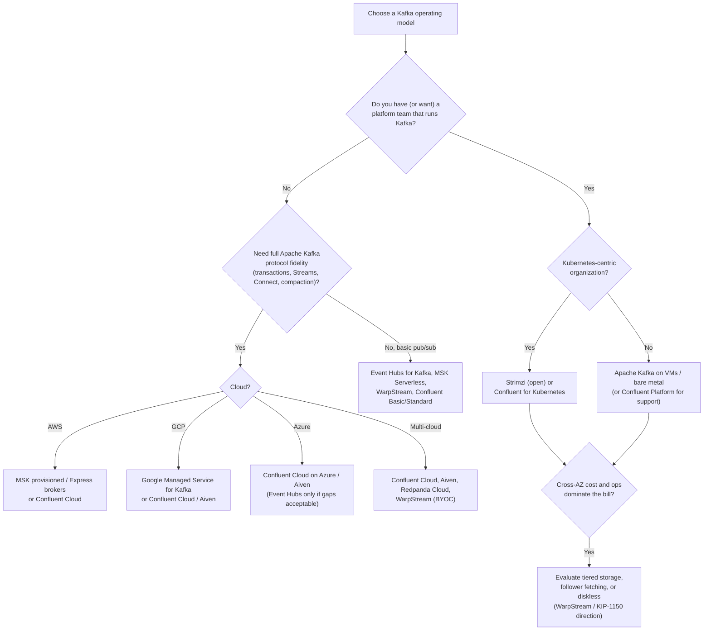
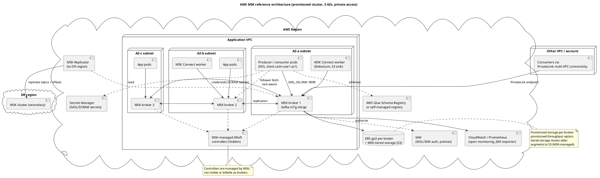
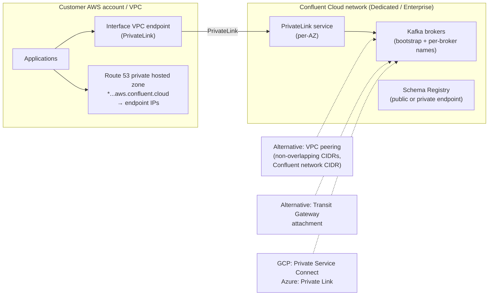
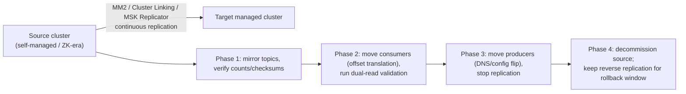

# Cloud and Managed Kafka

**Roles:** [ARCH] [ADMIN]   **Level:** Advanced
**Prerequisites:** Capacity Planning and Sizing (`01-capacity-planning-and-sizing.md`); Resiliency (`03-resiliency-and-high-availability.md`); Multi-Region (`04-multi-datacenter-and-multi-region.md`); Admin – security and networking (`../03-admin/`)

## What you will learn
- A decision framework for self-managed vs managed Kafka based on TCO, control, features, lock-in, and operational maturity
- What each major option actually offers: Apache Kafka self-managed, Strimzi on Kubernetes, Confluent Platform and Cloud, AWS MSK, Azure Event Hubs for Kafka, Google Managed Service for Apache Kafka, Redpanda, WarpStream, Aiven, Instaclustr
- Where the Kafka protocol compatibility gaps are and why they matter to architects
- Networking (PrivateLink, VPC peering, Private Service Connect), authentication differences, and cost model shapes
- Migration paths between options, multi-cloud considerations, and the direction set by KIP-1150 diskless topics

## 1. Concept

"Managed Kafka" covers a spectrum from *hosted Apache Kafka you still tune* to *a Kafka-compatible API on a different engine*. The right question is not "managed or not" but **which responsibilities do you want to keep**:

| Responsibility | Self-managed | Kubernetes operator (Strimzi) | Managed provisioned (MSK, Confluent Dedicated, Google) | Serverless / API-only (Confluent Basic/Standard/Enterprise, MSK Serverless, Event Hubs, WarpStream) |
|----------------|--------------|-------------------------------|--------------------------------------------------------|------------------------------------------------------------------------------------------------------|
| Hardware, OS, JVM | You | Cloud + you (node pools) | Provider | Provider |
| Broker configuration | You | You (CR) | You (subset) | Provider (mostly fixed) |
| Upgrades, patching | You | Operator, you schedule | Provider, you schedule window | Provider |
| Capacity sizing | You (chapter 01) | You | You (broker count/type) | Provider (you pay per usage, within limits) |
| Rebalancing, partition placement | You (Cruise Control) | Operator + Cruise Control | Provider tooling (MSK: Cruise Control optional; Confluent: self-balancing) | Provider |
| Security integration | You | You | Provider primitives (IAM, RBAC) | Provider primitives |
| Protocol fidelity | Full | Full | Full (Apache Kafka) | Varies (see 5.3) |
| Cost visibility | Infra bills | Infra bills | Broker-hours + storage + transfer | Usage units (partitions, GB, eCKU) |



## 2. How it works internally – what "managed" changes

Managed services keep the Kafka protocol but change the deployment shape underneath. Understanding those changes explains their limits.

| Service | Under the hood (as documented by the vendor) | Consequences |
|---------|---------------------------------------------|--------------|
| MSK provisioned | Apache Kafka brokers on EC2 in your VPC subnets (ENIs), EBS storage, MSK-managed controllers (KRaft on current versions), optional tiered storage to S3 | You size brokers and storage; you see broker DNS names; cross-AZ traffic between brokers and clients is charged like any EC2 traffic (MSK does not charge in-cluster replication transfer, but client↔broker cross-AZ is standard EC2 data transfer; verify current pricing) |
| MSK Express brokers | MSK-managed storage layer detached from the broker; brokers hold no long-term local data | Faster scaling and recovery, no storage sizing, higher per-broker throughput, but limits on partitions per broker and some configs |
| MSK Serverless | Multi-tenant Kafka with per-cluster throughput and partition limits, IAM auth only | No broker tuning; hard caps on MB/s and partitions per cluster; pay per cluster-hour, partition-hour, GB |
| Confluent Cloud Dedicated | Single-tenant Kafka (Confluent's Kora engine) sized in CKUs (Confluent Kafka Units) with published per-CKU limits (ingress/egress MB/s, partitions, connections) | Predictable isolation; you scale CKUs; private networking options |
| Confluent Cloud Basic/Standard/Enterprise/Freight | Multi-tenant (Basic/Standard) or elastic single-tenant-like Enterprise/Freight billed in eCKUs (elastic CKUs) by usage | Enterprise adds private networking and higher limits; Freight targets high-throughput, latency-tolerant workloads at lower cost (relaxed latency, object-storage-backed design); details are vendor-specific and evolve |
| Azure Event Hubs for Kafka | Event Hubs engine exposing a Kafka 1.0+ protocol endpoint; namespace = cluster, event hub = topic | Not Apache Kafka; feature gaps depend on tier (Standard/Premium/Dedicated) |
| Google Managed Service for Apache Kafka | Apache Kafka brokers managed by Google, sized by vCPU and memory, in Google-managed project with Private Service Connect / VPC access | Apache Kafka semantics; Connect clusters also offered; Google IAM auth |
| Redpanda | C++ reimplementation of the Kafka protocol, Raft per partition, thread-per-core, no JVM, no ZooKeeper, built-in tiered storage | Different operational profile (single binary, lower tail latency claims); not every Kafka feature/KIP is implemented at the same time; check the compatibility matrix |
| WarpStream (Confluent) | Stateless agents that write directly to object storage; metadata service; no local disks; "diskless" | Zero cross-AZ replication cost and elastic agents, but produce latency measured in hundreds of milliseconds (object-store round trips); BYOC model (agents in your account, control plane vendor-hosted) |
| Aiven for Apache Kafka | Apache Kafka on VMs in Aiven's or your cloud account (BYOC), with Karapace registry, Connect, MirrorMaker 2 | Apache Kafka fidelity; multi-cloud; vendor tooling |
| Instaclustr (NetApp) | Managed Apache Kafka with open-source add-ons (Connect, Karapace/Schema Registry), in vendor or customer account | Apache Kafka fidelity; open-source stack emphasis |

### 2.1 MSK reference architecture



Source: `diagrams/cloud-and-managed-kafka-msk-reference-architecture.puml`.

### 2.2 Confluent Cloud private networking



The recurring gotcha in every private-connectivity design: Kafka clients must resolve **each broker's advertised hostname**, not just the bootstrap address, so a wildcard private DNS zone (or provider-managed DNS) is mandatory; a load balancer in front of brokers does not work without per-broker routing (SNI-based routing or a port per broker).

## 3. Configuration that matters

Managed services expose a subset of broker configuration. What is typically tunable (verify against current documentation):

| Setting | Self-managed | MSK provisioned | Confluent Cloud Dedicated | Event Hubs | Google MSK |
|---------|--------------|-----------------|---------------------------|------------|------------|
| Broker count / size | Free | Yes (types, count multiple of AZs) | CKUs | N/A (throughput/processing units) | vCPU/memory per broker, count |
| `num.partitions`, topic configs | Free | Yes (custom configuration) | Topic-level only | Partition count at creation (tier limits) | Yes |
| `min.insync.replicas`, RF | Free | Yes (default RF=3) | Fixed RF=3, min.isr=2 | N/A (managed replication) | Yes |
| `log.retention.*`, tiered | Free | Yes; tiered storage on supported versions/types | Infinite retention with tiered by default on Dedicated/Enterprise | Retention up to tier limit (days) | Yes |
| `message.max.bytes` | Free | Yes (up to a cap) | Up to a cap (~8 MB on Dedicated, check) | 1 MB (Standard) to larger on Premium/Dedicated | Yes |
| `replica.selector.class` (follower fetch) | Free | Yes (via configuration) | Managed (rack-aware by default with `client.rack`) | N/A | Check |
| Quotas | Free | Yes | Per-CKU limits | Throughput units | Check |
| Auth | Any SASL/mTLS | IAM, SASL/SCRAM (Secrets Manager), mTLS (ACM PCA), unauthenticated | API keys (SASL/PLAIN), OAuth/OIDC, mTLS (Dedicated) | SAS keys, Entra ID OAuth | Google IAM via SASL/OAUTHBEARER, SASL/PLAIN with tokens |
| Authorization | ACLs (`kafka-acls.sh`) | IAM policies or ACLs | RBAC + ACLs | Azure RBAC on namespace/hub | Google IAM |
| Connect | Self-run | MSK Connect (custom plugins, capacity autoscaling) | Fully managed connectors (fixed catalog) + custom connectors | Not Kafka Connect (use Azure integrations or self-host Connect) | Managed Connect clusters |
| Cross-cluster replication | MM2 | MSK Replicator, MM2 | Cluster Linking, MM2 | Geo-replication (Event Hubs feature) | MM2 |

## 4. Failure modes and how to detect them

| Symptom | Likely cause | Metric / log to check | Fix |
|---------|--------------|-----------------------|-----|
| Clients connect to bootstrap but time out on produce | Per-broker DNS names not resolvable over PrivateLink/peering | Client logs "Connection to node -1"/"node 3 could not be established" | Private DNS zone for broker names; correct endpoint policy |
| Throttling with no obvious load | Serverless/CKU limits (partition count, connections, MB/s) reached | Provider metrics (MSK `BytesInPerSec` vs quota; Confluent `cluster_load_percent`, hot partitions) | Scale CKUs/brokers; reduce partitions; consolidate clients |
| IAM auth failures under load | Token generation rate, missing `kafka-cluster:*` permissions per topic/group | Client `SaslAuthenticationException`; CloudTrail | Cache tokens (IAM auth library), correct policy resources (`topic/*`, `group/*`) |
| High bill from data transfer | Cross-AZ client traffic, cross-region replication | Cost explorer by usage type | `client.rack` + rack-aware fetching; place consumers with brokers; compress |
| Event Hubs client errors with Streams/transactions | Tier lacks feature (transactions/compaction) or protocol gap | Client exceptions (`UnsupportedVersionException`) | Choose tier with feature or a different service |
| Connector not available | Managed connector catalog missing it | Provider catalog | Custom connector (MSK Connect, Confluent custom connectors) or self-run Connect |
| Version pinned, cannot use new client feature | Provider lags Apache releases | Provider version list | Plan upgrades with provider cadence; avoid features the provider lacks |
| Storage full on MSK broker | EBS not scaled; auto-scaling disabled | `KafkaDataLogsDiskUsed` | Enable storage auto-scaling; tiered storage |

## 5. Design guidance (architect view)

### 5.1 Self-managed vs managed: TCO and control

| Dimension | Self-managed | Managed |
|-----------|--------------|---------|
| Infrastructure cost | Lowest unit cost (instances, disks) | Premium (30–100 %+ over raw infra, indicative) |
| People cost | 2–5 engineers for a production platform with on-call (indicative) | Fraction of an engineer for platform integration; you still own topic/schema governance and client tuning |
| Control | Every config, every version, custom plugins, exotic deployment | Subset; vendor cadence |
| Features | All of Apache Kafka; anything you can build | Vendor catalog (may add: RBAC, self-balancing, linking; may lack: custom authorizers, plugins) |
| Lock-in | Kafka protocol only | Protocol plus vendor APIs (IAM auth, RBAC, connectors, linking, Tableflow); data is portable via MM2 |
| Ops maturity required | High: sizing, upgrades, incident response, security | Medium: capacity limits, IAM, cost management |
| Compliance | Your controls | Vendor attestations (SOC 2, ISO, PCI, HIPAA) plus your configuration |
| Time to production | Weeks to months | Days |

A practical rule: if Kafka is not your product and you run fewer than a handful of clusters, managed wins on TCO once engineer time is counted. If you run tens of clusters, need custom plugins/authorizers, or operate at a scale where the managed premium is millions per year, self-managed (often on Kubernetes with Strimzi) wins.

### 5.2 Comparison matrix

| Option | Engine | Deployment | Strengths | Limits to check | Vendor-specific extras |
|--------|--------|------------|-----------|-----------------|------------------------|
| Apache Kafka self-managed | Apache Kafka | VMs / bare metal | Full control, lowest infra cost, any version | You run everything | – |
| Strimzi | Apache Kafka | Kubernetes operator (CNCF) | Declarative CRs (`Kafka`, `KafkaTopic`, `KafkaUser`, `KafkaConnect`, `KafkaMirrorMaker2`), rolling upgrades, Cruise Control integration, KRaft support | Kubernetes storage and networking skills; node-pool sizing | Entity operators, OAuth, Drain Cleaner |
| Confluent Platform | Apache Kafka + Confluent components | Self-managed (VMs or Confluent for Kubernetes) | Support, RBAC, Self-Balancing, Tiered Storage, MRC, Cluster Linking, Control Center, Schema Registry, ksqlDB | License cost; component sprawl | Proprietary components on top of Apache Kafka |
| Confluent Cloud | Kora (Kafka-protocol engine) | SaaS on AWS/GCP/Azure | Basic/Standard/Enterprise/Dedicated/Freight cluster types; eCKU/CKU sizing; managed connectors; Schema Registry; RBAC; Cluster Linking; Flink; Tableflow; private networking (PrivateLink, peering, TGW, PSC, Azure Private Link) | Per-cluster-type limits (partitions, throughput, connections, message size); connector catalog; cost at high throughput | Stream Governance, Stream Catalog, Tableflow |
| AWS MSK | Apache Kafka | Provisioned (Standard or Express brokers) or Serverless | In-VPC brokers, IAM auth, MSK Connect, MSK Replicator, tiered storage, multi-VPC PrivateLink, CloudWatch/Prometheus | Version lag, per-cluster limits (Serverless: MB/s, partitions), broker types, some configs locked; Serverless is IAM-only | Express brokers, MSK Replicator, Glue Schema Registry |
| Azure Event Hubs for Kafka | Event Hubs | SaaS | Azure-native (Entra ID, RBAC, private endpoints), simple pub/sub, geo-replication, Capture to storage | Protocol gaps: transactions only on some tiers (historically absent), compaction newer and tier-bound, partition count limits per hub, retention caps, no Kafka Connect, Kafka Streams support historically limited (verify current tier support), 1 MB message limit on Standard | Capture, Schema Registry (Azure) |
| Google Managed Service for Apache Kafka | Apache Kafka | Google-managed in your project's VPC via PSC | Apache Kafka semantics, Google IAM, Connect clusters, per-vCPU pricing | Newer service (GA 2024); feature and region coverage evolving | – |
| Redpanda | Redpanda (C++) | Self-hosted or Redpanda Cloud (Serverless, BYOC, Dedicated) | No JVM/ZK, single binary, tiered storage, low tail latency claims, Kafka API | Not Apache Kafka: check KIP-level compatibility (transactions, Streams, some admin APIs) | Redpanda Console, Connect, Data Transforms (Wasm) |
| WarpStream | WarpStream agents + object storage | BYOC (agents in your cloud) | Diskless, no cross-AZ replication cost, elastic stateless agents, S3 durability | Produce latency in hundreds of ms (indicative, object-store bound); compaction and some features differ; check compatibility | Owned by Confluent (2024) |
| Aiven | Apache Kafka | Aiven-hosted or BYOC on AWS/GCP/Azure | Apache Kafka fidelity, multi-cloud, Karapace registry, Connect, MM2, Terraform | Plans and quotas; vendor tooling | Karapace (open-source registry/REST) |
| Instaclustr (NetApp) | Apache Kafka | Vendor or customer account | Open-source stack, multi-cloud, SLA | Plans; catalog | – |

### 5.3 Protocol compatibility gaps that matter

| Capability | Why architects care | Where gaps have existed |
|------------|---------------------|-------------------------|
| Idempotent producers | Default since 3.0; clients fail if unsupported | Older Event Hubs; now supported |
| Transactions (`transactional.id`, EOS) | Kafka Streams EOS, outbox consumers, read-process-write | Event Hubs (tier-dependent, added later), some Kafka-compatible engines at various times |
| Log compaction | Entity/state topics, Streams changelogs | Event Hubs (added later, tier-bound), WarpStream (different implementation) |
| Kafka Streams | Needs compaction, transactions (for EOS), admin APIs | Verify on non-Apache engines and Event Hubs |
| Kafka Connect | Ecosystem of 200+ connectors | Not on Event Hubs; managed catalogs elsewhere |
| Admin API / ACLs | Automation, GitOps | Providers substitute IAM/RBAC; tooling must adapt |
| Consumer protocol KIP-848 | 4.0 clients default `group.protocol=classic`; `consumer` needs broker support | Provider version cadence |
| Tiered storage semantics | Retention and cost | Provider-specific implementations |

### 5.4 Networking

| Mechanism | How | Pros | Cons |
|-----------|-----|------|------|
| Brokers in your VPC (MSK, Google via PSC, Aiven/Confluent BYOC) | ENIs in your subnets | Simple routing, security groups, no extra hop | Cross-AZ transfer between clients and brokers is billed like any EC2 traffic |
| VPC peering (Confluent Cloud, Aiven) | Peer your VPC with the provider's network | Full mesh to brokers, low latency | CIDR planning, transitive routing limits, many peerings at scale |
| Transit Gateway attachment | Hub routing | Scales across many VPCs | TGW data processing charges |
| PrivateLink / Private Service Connect / Azure Private Link | Endpoint in your VPC to provider's service | No CIDR overlap issues, one-way initiation, multi-account | Requires per-broker DNS resolution (private hosted zone); per-AZ endpoints; endpoint charges |
| Public endpoints with TLS + auth | Internet | Easiest | Security review burden; NAT egress cost |

### 5.5 Authentication and authorization differences

| Provider | Auth options | Authorization | Note |
|----------|--------------|---------------|------|
| Self-managed / Strimzi | SASL/SCRAM, SASL/OAUTHBEARER (OIDC), mTLS, Kerberos | ACLs, custom authorizers (OPA) | Full flexibility |
| MSK | IAM (SASL/IAM via `aws-msk-iam-auth` library), SASL/SCRAM with Secrets Manager, mTLS via ACM PCA | IAM policies (`kafka-cluster:WriteData` on `topic/…`) or ACLs | IAM auth adds token overhead; keep connections long-lived; Serverless is IAM-only |
| Confluent Cloud | API keys (SASL/PLAIN), OAuth/OIDC identity providers, mTLS (Dedicated) | RBAC (roles on environment/cluster/topic prefixes) + ACLs | Service accounts, identity pools |
| Event Hubs | SAS keys (SASL/PLAIN with connection string), Entra ID OAuth | Azure RBAC (Data Sender/Receiver/Owner) | No Kafka ACLs |
| Google MSK | SASL/OAUTHBEARER with Google credentials, SASL/PLAIN with tokens | Google IAM roles | Workload identity |
| Redpanda / WarpStream / Aiven / Instaclustr | SASL/SCRAM, mTLS, OAuth (varies) | ACLs (+ vendor RBAC) | Check per vendor |

### 5.6 Cost model shapes

| Model | Charged by | Used by | Design implication |
|-------|------------|---------|--------------------|
| Per broker-hour + storage GB-month + data transfer | Instance size and count | Self-managed, MSK provisioned, Google (per vCPU/GB), Aiven/Instaclustr plans | Utilization matters: 60 % target; idle brokers still cost |
| Per CKU/eCKU-hour + GB in/out + storage + partition-hours | Capacity units and usage | Confluent Cloud (Dedicated: CKU; Enterprise/Freight: eCKU elastic) | Throughput and partitions drive cost; consolidate topics; watch egress fan-out |
| Per cluster-hour + partition-hour + GB in/out + storage | Usage | MSK Serverless, Confluent Basic/Standard | Cheap when idle, expensive at sustained high throughput; partition count is a direct cost |
| Throughput / processing units | Reserved capacity units | Event Hubs (TU/PU/CU) | Bursty workloads pay for peak |
| Object storage + agent compute | GB stored, API calls, agent instances | WarpStream (plus vendor fee), diskless designs | No cross-AZ replication transfer; latency trade-off |

Two cross-cutting truths: **cross-AZ and cross-region transfer** is a cost line under every model where brokers are in your VPC (chapter 01), and **partition count is money** in usage-billed models.

### 5.7 Migration paths



| From → To | Tool | Watch out |
|-----------|------|-----------|
| Self-managed → MSK | MSK Replicator (identical names, offset sync) or MM2 | IAM auth library in clients; broker configs subset; version alignment |
| Self-managed → Confluent Cloud | Cluster Linking from Confluent Platform 7+ or MM2 (any source) | Schema Registry migration (Schema Linking / export-import preserving ids); RBAC mapping from ACLs |
| Any → Event Hubs | MM2 (target as Kafka endpoint) | Feature gaps; namespace/hub limits; consumer group semantics |
| Managed → self-managed (repatriation) | MM2 | Loss of managed connectors; rebuild auth |
| ZooKeeper → KRaft (same cluster) | In-place migration (3.4+ bridge release → 3.9), see chapter 08 scenario 11 | Must complete before 4.0 |

### 5.8 Multi-cloud considerations

- Prefer providers available on all target clouds (Confluent Cloud, Aiven, Redpanda Cloud, WarpStream BYOC, Strimzi self-run) if a single control plane matters; native services (MSK, Event Hubs, Google) differ in auth, limits, and tooling.
- Cross-cloud replication costs internet/interconnect egress on both sides; design one-way flows and compress.
- Keep client code cloud-agnostic: SASL/OAUTHBEARER or SCRAM instead of provider-specific IAM libraries where possible, topic names without provider prefixes, schema registry with a portable API (Confluent-compatible API is the de facto standard, implemented by Karapace and Apicurio).

### 5.9 KIP-1150 diskless topics – direction

KIP-1150 (proposed 2025, "Diskless Topics") describes topics whose data is written directly to object storage by a leaderless path so that cross-AZ replication traffic disappears and brokers become stateless for those topics, trading latency for cost. It is the Apache community's response to designs like WarpStream and Confluent Freight. As of Kafka 4.0 it is a proposal under discussion, not a shipped feature; architects should watch it because it would change the economics in chapter 01 (replication and cross-AZ terms drop out) for latency-tolerant workloads. Do not plan production around it until it ships.

### 5.10 Managed Kafka limitations that matter to architects

| Limitation | Impact | Mitigation |
|------------|--------|------------|
| Partition and connection caps per cluster/CKU | Architecture must budget partitions (chapter 01, 07) | Consolidate topics; larger units; multiple clusters per domain |
| Version cadence | New client features (KIP-848, share groups/queues KIP-932 in 4.x) unavailable until provider upgrades | Design for the provider's version; avoid bleeding-edge dependence |
| No custom plugins (authorizers, `RemoteStorageManager`, SMTs in some catalogs) | Custom governance logic moves to the client or a gateway | Policy-as-code in CI; custom connectors where allowed |
| Hidden controllers / metadata | Cannot tune quorum, cannot see `kafka-metadata-quorum.sh` output | Trust provider SLA; monitor via provider metrics |
| Message size caps | Claim-check pattern mandatory earlier | Object storage references |
| Data transfer pricing | Dominant cost at high fan-out | Follower fetching, co-location, compression |
| Maintenance windows and forced upgrades | Rolling restarts under provider control | Clients with retries and `min.insync.replicas=2` handle it |
| Regional availability | Some services missing in some regions | Multi-cloud vendor or self-managed there |

> **Anti-pattern:** Choosing a Kafka-compatible service for a design that depends on transactions, Kafka Streams, or Connect without testing those paths on that service first. Compatibility matrices change; run the real workload in a proof of concept.

> **Production tip:** Whatever the provider, keep topic definitions, ACL/RBAC bindings, and schemas in Git and applied by CI (chapter 07). It is the only part of the platform that stays portable when the provider changes.

## 6. Hands-on

### 6.1 MSK IAM authentication (client properties)

```properties
bootstrap.servers=b-1.mycluster.abc123.c2.kafka.eu-west-1.amazonaws.com:9098,b-2....:9098,b-3....:9098
security.protocol=SASL_SSL
sasl.mechanism=AWS_MSK_IAM
sasl.jaas.config=software.amazon.msk.auth.iam.IAMLoginModule required;
sasl.client.callback.handler.class=software.amazon.msk.auth.iam.IAMClientCallbackHandler
client.rack=euw1-az1
```

```bash
# Get bootstrap brokers and cluster ARN
aws kafka get-bootstrap-brokers --cluster-arn arn:aws:kafka:eu-west-1:123456789012:cluster/mycluster/uuid
# Create topic using Apache tools with the IAM library on the classpath
export CLASSPATH=/opt/aws-msk-iam-auth-2.2.0-all.jar
kafka-topics.sh --bootstrap-server b-1...:9098 --command-config client-iam.properties \
  --create --topic orders.order.events.v1 --partitions 48 --replication-factor 3 --config min.insync.replicas=2
```

### 6.2 Confluent Cloud (CLI, vendor-specific)

```bash
confluent login
confluent environment use env-abc123
confluent kafka cluster create orders-prod --type dedicated --cloud aws --region eu-west-1 --cku 2 --network n-xyz
confluent kafka topic create orders.order.events.v1 --partitions 48 --config retention.ms=604800000 --cluster lkc-123
confluent iam rbac role-binding create --principal User:sa-abc --role DeveloperWrite \
  --resource Topic:orders. --prefix --kafka-cluster lkc-123 --environment env-abc123
```

Client properties for Confluent Cloud use `security.protocol=SASL_SSL`, `sasl.mechanism=PLAIN`, and an API key/secret in `sasl.jaas.config`, plus `basic.auth.credentials.source=USER_INFO` for Schema Registry.

### 6.3 Strimzi Kafka custom resource (KRaft, 3 brokers, 3 controllers)

```yaml
apiVersion: kafka.strimzi.io/v1beta2
kind: KafkaNodePool
metadata: { name: controllers, labels: { strimzi.io/cluster: prod } }
spec:
  replicas: 3
  roles: [controller]
  storage: { type: persistent-claim, size: 100Gi, class: gp3 }
---
apiVersion: kafka.strimzi.io/v1beta2
kind: KafkaNodePool
metadata: { name: brokers, labels: { strimzi.io/cluster: prod } }
spec:
  replicas: 6
  roles: [broker]
  storage: { type: jbod, volumes: [ { id: 0, type: persistent-claim, size: 4Ti, class: gp3, deleteClaim: false } ] }
  resources: { requests: { memory: 32Gi, cpu: "8" }, limits: { memory: 32Gi } }
  jvmOptions: { -Xms: 6g, -Xmx: 6g }
  template:
    pod:
      topologySpreadConstraints:
        - maxSkew: 1
          topologyKey: topology.kubernetes.io/zone
          whenUnsatisfiable: DoNotSchedule
          labelSelector: { matchLabels: { strimzi.io/pool-name: brokers } }
---
apiVersion: kafka.strimzi.io/v1beta2
kind: Kafka
metadata:
  name: prod
  annotations: { strimzi.io/node-pools: enabled, strimzi.io/kraft: enabled }
spec:
  kafka:
    version: 3.9.0
    metadataVersion: 3.9-IV0
    listeners:
      - { name: tls, port: 9093, type: internal, tls: true, authentication: { type: tls } }
    config:
      default.replication.factor: 3
      min.insync.replicas: 2
      unclean.leader.election.enable: false
      replica.selector.class: org.apache.kafka.common.replica.RackAwareReplicaSelector
    rack: { topologyKey: topology.kubernetes.io/zone }
  cruiseControl: {}
  entityOperator: { topicOperator: {}, userOperator: {} }
```

### 6.4 Event Hubs Kafka endpoint (client properties)

```properties
bootstrap.servers=mynamespace.servicebus.windows.net:9093
security.protocol=SASL_SSL
sasl.mechanism=PLAIN
sasl.jaas.config=org.apache.kafka.common.security.plain.PlainLoginModule required username="$ConnectionString" password="Endpoint=sb://mynamespace.servicebus.windows.net/;SharedAccessKeyName=...;SharedAccessKey=...";
# Or OAuth with Entra ID: sasl.mechanism=OAUTHBEARER and a callback handler
```

## 7. Interview questions for this chapter

### Q1. How do you decide between self-managed Kafka and a managed service?
**Role:** [ARCH] | **Difficulty:** ★★☆ | **Topic:** Operating model

**Answer.**
Compare total cost including people, not just infrastructure: a production Kafka platform needs sizing, upgrades, security integration, on-call, and tooling, which is a multi-engineer commitment. Managed services charge a premium on infrastructure but remove most of that. Then check the hard constraints: protocol features you need (transactions, Streams, Connect, compaction), custom plugins or authorizers, version cadence, private networking, compliance, regions, and lock-in tolerance. Managed wins for most organizations with a few clusters; self-managed (often Strimzi on Kubernetes) wins at large scale, with special requirements, or where Kafka is core to the product.

**Follow-up probes.** What still remains your responsibility on a managed service? How would you quantify the lock-in?

### Q2. What differs between MSK provisioned, MSK Express brokers, and MSK Serverless?
**Role:** [ARCH] | **Difficulty:** ★★☆ | **Topic:** AWS MSK

**Answer.**
Provisioned runs Apache Kafka brokers of a chosen instance type in your VPC with EBS you size (optionally tiered to S3) and most broker configs available. Express brokers keep Apache Kafka but detach storage into an MSK-managed layer, so you no longer size disks, scaling and recovery are much faster, and throughput per broker is higher, at the cost of some configuration and partition limits. Serverless is multi-tenant with IAM-only auth, per-cluster throughput and partition caps, and usage pricing; it suits variable or small workloads but not sustained high throughput. All three keep Apache Kafka protocol fidelity; the difference is who sizes what and which limits apply.

**Follow-up probes.** How is cross-AZ traffic billed with MSK? What does MSK Replicator add over MM2?

### Q3. Which Kafka features have historically been missing or limited on Azure Event Hubs for Kafka, and why does it matter?
**Role:** [ARCH] | **Difficulty:** ★★☆ | **Topic:** Protocol compatibility

**Answer.**
Event Hubs implements the Kafka wire protocol on its own engine, so features arrive as the engine supports them: transactions were absent for years and are tier-dependent, log compaction came later and is tier-bound, Kafka Connect does not run there, Kafka Streams support has been limited, partition counts and retention are capped per tier, and message size is 1 MB on Standard. This matters because outbox consumers, Streams EOS, and entity-state topics rely on exactly those features. Treat Event Hubs as a good Azure-native pub/sub with Kafka clients, and verify the current tier matrix before designing around advanced features.

**Follow-up probes.** How would you run Connect against Event Hubs? What is the Event Hubs equivalent of a cluster and a topic?

### Q4. Explain the DNS problem with PrivateLink to a managed Kafka cluster.
**Role:** [ADMIN] [ARCH] | **Difficulty:** ★★☆ | **Topic:** Networking

**Answer.**
A Kafka client uses the bootstrap address only to fetch metadata; it then connects directly to each broker by the hostname that broker advertises. Behind PrivateLink there is one endpoint, so the provider either publishes per-broker hostnames that all resolve to the endpoint (with SNI or port-based routing behind it) or requires you to create a private hosted zone with a wildcard record for the cluster's domain. If those per-broker names do not resolve inside your VPC, clients connect to bootstrap, then fail on every produce or fetch. The fix is the provider-documented private DNS zone, and per-AZ endpoints to keep traffic local.

**Follow-up probes.** Why does a plain load balancer in front of brokers not work? How does this interact with `client.rack`?

### Q5. Compare cost models of MSK provisioned, Confluent Cloud Dedicated, and a serverless offering for a steady 100 MB/s workload with 2,000 partitions.
**Role:** [ARCH] | **Difficulty:** ★★★ | **Topic:** Cost

**Answer.**
MSK provisioned bills broker-hours, EBS GB-months, and data transfer; cost is flat with utilization, so a right-sized cluster at 60 % is efficient for steady load and partitions are free up to the broker's practical budget. Confluent Dedicated bills CKU-hours (each CKU carries throughput, partition, and connection limits) plus GB in/out and storage; you size CKUs to the higher of throughput and partition needs, so 2,000 partitions may force more CKUs than the throughput alone. Serverless models bill partition-hours and GB, so 2,000 partitions and a sustained 100 MB/s (≈ 8.6 TB/day in, more out with fan-out) accumulate quickly and usually exceed provisioned options for steady load. Steady, high-throughput, high-partition workloads favor provisioned or CKU models; bursty or small workloads favor serverless. Always add cross-AZ transfer to the MSK estimate.

**Follow-up probes.** What changes if the workload is 10× bursty? How does consumer fan-out change each bill?

### Q6. What is WarpStream's architecture and what trade-off does it make?
**Role:** [ARCH] | **Difficulty:** ★★☆ | **Topic:** Diskless designs

**Answer.**
WarpStream replaces brokers with stateless agents that write batches straight to object storage (S3 and equivalents) and a metadata service that orders them; there are no local disks and no inter-broker replication, so cross-AZ replication traffic and disk management disappear, agents scale elastically, and durability is the object store's. The trade-off is latency: every produce waits for an object-store write, so p99 produce latency is hundreds of milliseconds (indicative) rather than single-digit milliseconds, which excludes low-latency use cases but suits logs, telemetry, and analytics feeds. It exposes the Kafka protocol with some feature differences; it is now part of Confluent, and KIP-1150 proposes a similar model inside Apache Kafka.

**Follow-up probes.** How does it handle consumer reads for recent data (caching)? Where would you not use it?

### Q7. A regulated bank on Azure wants managed Kafka with transactions, Connect, and RBAC. Recommend.
**Role:** [ARCH] | **Difficulty:** ★★★ | **Topic:** Vendor selection

**Answer.**
Event Hubs for Kafka does not satisfy Connect and has tier-bound transaction support, so the realistic options are Confluent Cloud on Azure (Dedicated or Enterprise with Azure Private Link, RBAC, managed connectors, Schema Registry, compliance attestations), Aiven for Apache Kafka on Azure (Apache Kafka fidelity, Connect, Karapace, BYOC option), or self-managed Strimzi on AKS if the bank has a platform team and wants full control. For a bank, evaluate private networking, key management (customer-managed keys), audit logging, data residency in the chosen Azure regions, and exit strategy (MM2 portability). Run a proof of concept with the actual outbox/Streams workload before signing.

**Follow-up probes.** How would you migrate from an existing on-prem Confluent Platform? How does RBAC map from existing ACLs?

### Q8. Scenario: your MSK bill is dominated by data transfer. What are the first three changes?
**Role:** [ARCH] [ADMIN] | **Difficulty:** ★★☆ | **Topic:** Cost optimization

**Situation.** Six brokers across three AZs, 12 consumer groups, no `client.rack`, uncompressed JSON.
**Constraints.** No application rewrite; two-week window.
**Expected reasoning.** Consumer fan-out crosses AZs 2/3 of the time; producers 2/3; compression reduces every term.
**Model answer.** First, enable `replica.selector.class=RackAwareReplicaSelector` in the cluster configuration and set `client.rack` on all consumers (an environment variable in most deployments) so consumer traffic stays in-AZ. Second, enable producer compression (`compression.type=lz4` or `zstd`) which cuts network and storage across producers, replication, and consumers without code changes. Third, audit the 12 consumer groups: consolidate duplicate readers (several teams reading the same topic for the same purpose) behind one materialized view or a Streams job, and place consumers in the same AZ set as brokers. Then measure with Cost Explorer by usage type and re-baseline; later steps include tiered storage and reviewing MSK Express brokers.

## Key takeaways
- "Managed" is a spectrum of responsibilities; pick by which ones you keep, not by brand.
- Apache Kafka fidelity (MSK, Google, Aiven, Instaclustr, Confluent's Kora with full feature set) vs Kafka-compatible engines (Event Hubs, Redpanda, WarpStream) is the first filter; test transactions, Streams, Connect, and compaction on the target.
- Private networking always needs per-broker DNS resolution; plan the private hosted zone early.
- Cost models differ in shape (broker-hour, CKU/eCKU, partition-hour, throughput units); cross-AZ transfer and partition count are the universal hidden drivers.
- Keep topics, ACL/RBAC, and schemas as code so the platform remains portable; MM2 is the universal migration and exit tool.
- KIP-1150 diskless topics and vendor diskless designs trade latency for cost; watch them for latency-tolerant workloads.

## Further reading
- AWS MSK Developer Guide (broker types, Express brokers, Serverless quotas, IAM access control, MSK Replicator, tiered storage)
- Confluent Cloud documentation (cluster types and limits, CKU/eCKU, Cluster Linking, private networking, Tableflow) – vendor-specific
- Azure Event Hubs "Use Azure Event Hubs from Apache Kafka applications" and feature/tier matrix – vendor-specific
- Google Cloud "Managed Service for Apache Kafka" documentation – vendor-specific
- Strimzi documentation (KRaft, node pools, Cruise Control); Redpanda, WarpStream, Aiven, Instaclustr documentation and compatibility matrices
- KIP-1150 Diskless Topics; KIP-405 Tiered Storage; KIP-392 Follower fetching
