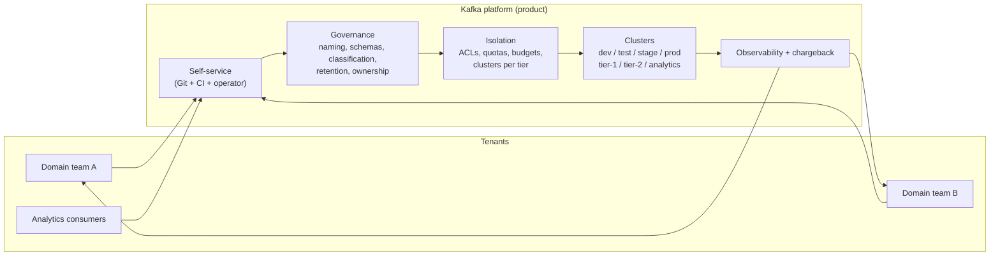
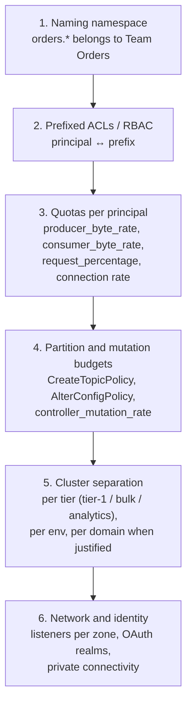
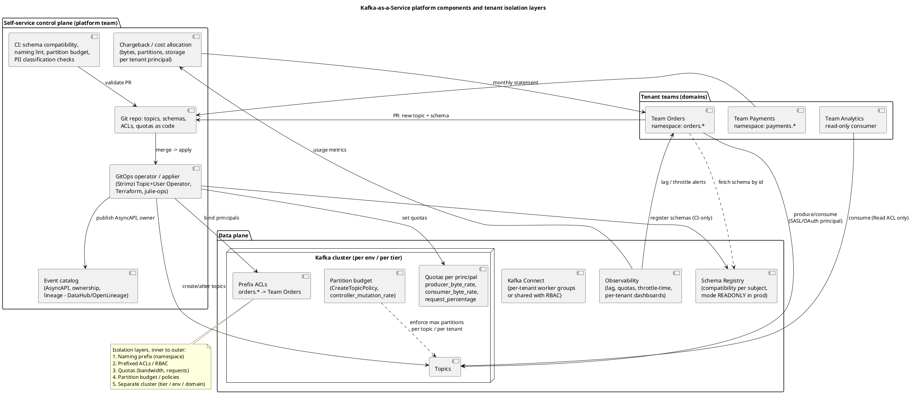

# Governance, Multi-tenancy, and Kafka as a Platform

**Roles:** [ARCH] [ADMIN]   **Level:** Advanced
**Prerequisites:** Capacity Planning (`01-capacity-planning-and-sizing.md`); Integration Patterns (`05-integration-and-data-architecture-patterns.md`); Admin – security, ACLs, quotas, Schema Registry operations (`../03-admin/`)

## What you will learn
- How to run Kafka as an internal platform ("Kafka-as-a-Service") with a clear operating model, SLAs, and on-call
- Multi-tenancy models and the isolation layers (naming, ACLs, quotas, partition budgets, separate clusters) with chargeback
- Topic naming standards, ownership metadata, schema governance with compatibility policy and CI enforcement, and data contracts
- Data classification and PII handling: encryption, tokenization, GDPR erasure with compacted topics and tombstones, crypto-shredding, retention and legal holds
- Lineage and catalogs, self-service GitOps tooling, environment strategy, capacity governance, and documentation standards (AsyncAPI)

## 1. Concept

A Kafka cluster used by one team is infrastructure; a Kafka cluster used by twenty teams is a **product** with tenants, contracts, quotas, and a bill. The platform team's job is to make the safe path the easy path: a team should be able to get a topic, a schema, credentials, and a dashboard through a pull request in minutes, and should be unable to break another team by accident.



## 2. How it works internally

### 2.1 Isolation layers

Isolation is layered; each layer stops a different class of problem.



| Layer | Stops | Mechanism | Cost |
|-------|-------|-----------|------|
| Naming | Accidental collisions, unclear ownership | Convention enforced in CI | None |
| ACLs / RBAC | Reading or writing another tenant's data | `kafka-acls.sh --resource-pattern-type prefixed`; Confluent RBAC role bindings on prefixes; IAM policies on MSK | Low |
| Quotas | One tenant consuming the cluster's bandwidth or request handlers | `kafka-configs.sh --entity-type users/clients` | Low; tenants see throttling |
| Budgets and policies | Partition explosions, dangerous configs (`min.insync.replicas=1`, `retention.ms=-1` without approval) | `create.topic.policy.class.name`, `alter.config.policy.class.name` (custom classes on self-managed), CI checks on managed | Requires plugin (self-managed) or CI gate |
| Cluster separation | Blast radius of incidents, noisy neighbours, compliance | Separate clusters | High (cost, replication between clusters) |
| Network / identity | Cross-environment access | Separate listeners, OAuth realms, VPCs | Medium |

### 2.2 Self-service GitOps flow

```mermaid
sequenceDiagram
    participant Dev as Domain team
    participant Git as Git repo (topics/, schemas/, acls/)
    participant CI as CI pipeline
    participant Op as Applier (Strimzi operator / Terraform / julie-ops)
    participant K as Kafka + Schema Registry
    participant Cat as Catalog (AsyncAPI, DataHub)
    Dev->>Git: PR: orders.order.events.v1 (48 partitions, 7d, owner, PII=false) + Avro schema
    Git->>CI: trigger
    CI->>CI: naming lint, partition budget check, retention policy, classification tags present
    CI->>K: schema compatibility test against registry (dry run)
    CI-->>Git: status checks pass; platform reviewer approves only if budget exceeded
    Git->>Op: merge to main
    Op->>K: create topic, prefixed ACLs, quotas, register schema
    Op->>Cat: publish AsyncAPI doc, owner, lineage stub
    K-->>Dev: credentials via secret store; dashboard auto-created
```

### 2.3 Platform components



Source: `diagrams/governance-multitenancy-and-platform-platform-components.puml`.

## 3. Configuration that matters

| Parameter / control | Where | Recommended | Why |
|---------------------|-------|-------------|-----|
| `auto.create.topics.enable` | broker | `false` | Topics exist only through the governed path |
| `create.topic.policy.class.name` / `alter.config.policy.class.name` | broker (self-managed) | Custom policy: RF=3, min.isr=2, partition cap, naming regex, required retention | Server-side enforcement even for CLI users |
| `delete.topic.enable` | broker | `true` with ACL restricted to platform principal | Controlled deletion |
| Prefixed ACLs | cluster | `--resource-pattern-type prefixed --topic orders.` per team principal; `--group orders-` for consumer groups; `--transactional-id orders-` | Namespace ownership |
| Quotas | users/clients | Default per-user quota (e.g., `producer_byte_rate=50 MB/s`, `consumer_byte_rate=100 MB/s`, `request_percentage=100`) with overrides by request | Fair share |
| `controller_mutation_rate` quota | users | e.g., 10 partition mutations/s per tenant principal | Prevents topic-creation storms |
| Schema Registry compatibility | subject | `BACKWARD` (consumers upgrade first) as default; `FULL_TRANSITIVE` for public/regulated topics | Evolution safety |
| Schema Registry `mode` | registry (prod) | `READONLY` for applications; CI principal in `READWRITE` | Schemas registered only via CI |
| `auto.register.schemas` | producers | `false` in prod | Applications cannot push schemas |
| `retention.ms`, `retention.bytes` | topic | Per classification: e.g., 7 d default, 30 d with approval, infinite only for compacted or tiered with legal review | Cost and compliance |
| `cleanup.policy=compact` with `max.compaction.lag.ms` | topic (PII) | ≤ 30 d (or the erasure SLA) | Bounds deletion time for tombstoned keys |
| `delete.retention.ms` | compacted topics | ≥ 7 d | Tombstones visible to slow consumers |
| `message.max.bytes` | topic | 1 MB default; larger by exception | Cluster health |
| `confluent.value.schema.validation` (Confluent) / broker-side validation | topic | Enabled for public topics where available | Rejects records with unknown schema ids (vendor-specific) |

## 4. Failure modes and how to detect them

| Symptom | Likely cause | Metric / log to check | Fix |
|---------|--------------|-----------------------|-----|
| Cluster-wide slowdown from one team | No quotas; replay job | Per-principal `BytesInPerSec`, `throttle-time` (should be > 0 for the offender) | Default quotas; emergency quota on the principal |
| Partition count grows unchecked | No budget or policy | Replicas per broker vs budget (chapter 01) | `CreateTopicPolicy`; CI gate; quarterly cleanup of unused topics |
| Consumers break after a producer deploy | Incompatible schema change registered by an app | Registry audit log; consumer deserialization errors | `mode=READONLY`, `auto.register.schemas=false`, compatibility in CI |
| PII found in a topic classified as non-PII | Classification not enforced | Data scanner (sampled decode with regex/ML), DLP tool | Classification as required PR field; schema-level tags; scanning |
| Erasure request cannot be fulfilled | Non-compacted topic with long retention; no key per person | Topic inventory by classification | Design PII topics for erasure (see 5.5) |
| "Who owns this topic?" during an incident | No ownership metadata | Catalog gap | Ownership mandatory in topic-as-code; catalog sync |
| Dev credentials used in prod | Shared identities across envs | Auth logs | Separate OAuth realms/principals per env; no shared secrets |
| Surprise bill | No chargeback visibility | Per-tenant usage report missing | Chargeback pipeline from metrics |
| Topic sprawl (thousands of unused topics) | No lifecycle | Topics with zero bytes in 90 d | TTL for non-prod topics; deprecation process |

## 5. Design guidance (architect view)

### 5.1 Multi-tenancy models

| Model | Description | Pros | Cons | When |
|-------|-------------|------|------|------|
| Shared cluster with quotas, ACLs, naming | One cluster per environment; tenants isolated logically | Best utilization; simplest ops; cheapest | Blast radius (a bad upgrade hits everyone); noisy neighbours bounded only by quotas; partition budget shared | Default for most organizations up to a few hundred tenants |
| Cluster per tier | Tier-1 (transactional, strict SLO), bulk/analytics (high throughput, relaxed), sandbox | Isolates SLO classes; different tuning per tier | More clusters; replication between tiers | When SLO classes conflict (low latency vs replay-heavy) |
| Cluster per domain | Each large domain owns a cluster | Full isolation; domain autonomy | Cost; cross-domain events need replication; N sets of ops | Very large orgs, regulatory separation, or Confluent/managed where clusters are cheap to create |
| Cluster per environment | dev/test/stage/prod separated | Mandatory separation of prod | Baseline; not a tenancy model by itself | Always |
| Cluster per application | Each app gets a cluster | Total isolation | Wasteful; sprawl | Only for extreme scale or compliance |

Most platforms combine: **per environment × per tier**, with shared tenancy inside each cluster, and a small number of dedicated clusters for exceptional domains.

### 5.2 Topic naming standard

Pattern: `<domain>.<subdomain>.<entity>.<event-or-purpose>.<version>`

| Segment | Rule | Examples |
|---------|------|----------|
| domain | Bounded context, owned by one team; also the ACL prefix | `orders`, `payments`, `customer` |
| subdomain | Optional refinement | `checkout`, `ledger` |
| entity | The aggregate or noun | `order`, `payment`, `profile` |
| event-or-purpose | `events` (all events of the entity), a specific event (`created`), `state` (compacted current state), `cdc` (internal), `dlq`, `retry-5m` | `events`, `state`, `dlq` |
| version | `v1`, `v2` – incremented only on breaking change | `v1` |

Rules: lowercase, dots between segments, hyphens inside a segment, no environment or cluster name in the topic (environments are separate clusters), no team names (teams change, domains do not), no PII in names, internal topics suffixed or under an `internal` subdomain and excluded from cross-domain ACLs and replication. Kafka Streams internal topics inherit the `application.id` prefix, so the application id must itself follow the domain prefix (`orders-enrichment`).

Examples: `orders.checkout.order.events.v1`, `customer.profile.state.v2`, `payments.ledger.entry.events.v1`, `orders.internal.order.cdc.v1`.

### 5.3 Ownership metadata and data contracts

Every topic carries, as code (and mirrored into the catalog):

| Field | Purpose |
|-------|---------|
| `owner` (team) and `contact` (channel, on-call) | Who to call |
| `tier` (1/2/3) | SLO class and support expectation |
| `classification` (public/internal/confidential/PII/PCI) | Controls encryption, replication, retention, access |
| `retention` and `legal_hold` | Compliance |
| `schema` subject(s) and compatibility | Contract |
| `consumers` (registered, via ACL requests) | Impact analysis |
| `sla` (availability, lag, freshness) | Contract with consumers |
| `deprecation` date and successor | Lifecycle |

A **data contract** is this metadata plus the schema plus semantic guarantees (ordering key, delivery semantics, timezone/currency conventions, null semantics, expected volume) agreed between producer and consumers and versioned in Git. CI validates the technical part (schema compatibility, naming, classification); reviews validate the semantics.

### 5.4 Schema governance

| Policy element | Recommendation |
|----------------|----------------|
| Format | Avro or Protobuf via Schema Registry (Confluent-API-compatible: Confluent, Karapace, Apicurio, AWS Glue with its own API) |
| Subject naming | `TopicNameStrategy` for single-type topics; `TopicRecordNameStrategy` for per-aggregate topics carrying several event types |
| Compatibility | `BACKWARD` default (add optional fields with defaults, remove fields); `FULL_TRANSITIVE` for public/regulated topics; `NONE` never in prod |
| Registration | Only by CI with a service principal; registry in `READONLY` mode for applications in prod; `auto.register.schemas=false` |
| Review | Schema PRs reviewed by the owning team plus a data-governance reviewer for PII/public topics; automated diff comments |
| Environments | Registry per environment; promote schemas via CI (export/import preserving ids, or Schema Linking on Confluent) |
| Breaking change | New topic version (`.v2`), dual-publish, migrate consumers, retire `.v1` with a deprecation date |
| Validation | Broker-side schema id validation where the platform supports it (Confluent `confluent.value.schema.validation`); otherwise consumer-side rejection to DLQ |
| Documentation | Field-level `doc` attributes mandatory; classification tags on PII fields (`"pii": true` custom property, Confluent tags) |

### 5.5 Data classification and PII handling

| Concern | Technique | Notes |
|---------|-----------|-------|
| Encryption in transit | TLS everywhere, mTLS or SASL | Baseline |
| Encryption at rest | Disk/volume encryption (KMS) | Protects against media loss, not against authorized readers |
| Field-level encryption | Client-side encryption of PII fields with per-tenant or per-subject keys (Confluent CSFLE, vendor-specific; or custom serializer wrapper) | Brokers never see plaintext; consumers need key access |
| Tokenization / pseudonymization | Replace identifiers with tokens from a vault; analytics consumers get tokens only | Enables residency and analytics without PII |
| Data minimization | Do not put PII in keys, headers, or topic names; keys must be stable identifiers, not emails | Keys cannot be encrypted without breaking partitioning; use surrogate ids |
| GDPR right to erasure – compacted topics | Key each person's record by a subject id; erase by writing a tombstone (null value); compaction removes prior values within `max.compaction.lag.ms`; consumers must honour tombstones in their stores | Non-compacted history still holds old values until retention expires |
| GDPR erasure – event streams | Either short retention (data "forgotten" by retention within the SLA) or **crypto-shredding**: encrypt each subject's PII with a per-subject key stored in a key store; erasure = delete the key, making all historical records unreadable without rewriting the log | Crypto-shredding is the only way to "delete" from immutable, long-retained, replicated, and tiered logs |
| Downstream copies | Lake, search indexes, caches, MM2 mirrors all need the same erasure process | Lineage tells you where |
| Access | PII topics readable only by principals with a justified ACL; audit logs of ACL grants | Quarterly access reviews |

> **Anti-pattern:** Storing PII in message keys or in topic names "for easy routing". Keys are visible in every tool, unencrypted, and cannot be changed without breaking ordering and compaction.

### 5.6 Retention policies and legal holds

| Class | Default retention | Notes |
|-------|-------------------|-------|
| Transport events | 3–7 days | Consumers must keep up; lake holds history |
| Replayable history | 30–90 days on tiered storage | Approval required |
| State (compacted) | Infinite, compacted | Tombstone-based erasure |
| Audit / regulated | As mandated (years) | Prefer export to WORM object storage over Kafka retention; Kafka mirrors for replay only |
| Legal hold | Freeze deletion: raise `retention.ms` on affected topics and pause compaction (`min.cleanable.dirty.ratio=1` or remove compact policy) via a documented emergency change; export the affected offsets range to immutable storage | Kafka has no native "hold" flag; document the procedure |

### 5.7 Lineage and catalogs

| Tool | What it provides | Integration |
|------|------------------|-------------|
| OpenLineage | Standard for emitting lineage events (job, inputs, outputs) | Emit from Flink/Spark jobs, Connect (via plugins), custom producers |
| DataHub / OpenMetadata / Amundsen | Catalog with Kafka topic ingestion (schemas from registry), ownership, tags, lineage graph | Ingest from Schema Registry and Connect config; push from CI |
| Confluent Stream Catalog and Stream Lineage (vendor-specific) | Tags, business metadata, and automatic lineage from client interceptors | Confluent Cloud/Platform |
| AsyncAPI documents | Per-domain API descriptions | Generated in CI; rendered in a developer portal (Backstage, EventCatalog) |

Minimum viable lineage: for every topic, the producing principals (from ACLs and client ids) and consuming groups (from `__consumer_offsets` and ACLs), refreshed daily; it answers "who breaks if I change this" and "where did this PII go".

### 5.8 Environment strategy

| Environment | Cluster | Data | Access |
|-------------|---------|------|--------|
| dev | Shared small cluster (or ephemeral per-branch namespaces on a shared cluster; local Docker/Testcontainers for unit tests) | Synthetic; TTL topics (auto-delete after 14 days) | Self-service, broad |
| test / CI | Ephemeral (Testcontainers, Strimzi namespace) | Synthetic | Pipeline principals |
| stage / pre-prod | Production-like sizing (scaled down but same topology, TLS, auth) | Masked production samples or replay of non-PII topics | Restricted; prod-like ACLs |
| prod | Per tier | Real | Least privilege; break-glass |

Never share credentials or registries across environments; promote configuration through Git, not by copying.

### 5.9 Capacity governance and chargeback

| Control | Implementation |
|---------|----------------|
| Partition budget per tenant | Declared in topic-as-code; CI sums partitions × RF per domain against budget; over-budget requires platform approval |
| Throughput budget | Default quotas; step-up via PR with justification; capacity model (chapter 01) updated |
| Storage budget | Retention policy caps; per-topic size dashboards; alerts at 80 % of tenant budget |
| Chargeback | Monthly cost = (bytes in + bytes out) × network rate + partitions × partition rate + GB-days × storage rate + Connect tasks; rates derived from cluster cost / total usage; report per domain from per-principal metrics (`kafka.server:type=Produce,user=...`, log sizes by topic prefix) |
| Showback first | Publish costs for two quarters before enforcing; it changes behaviour without conflict |

### 5.10 SLAs, SLOs, and the operating model

| Aspect | Guidance |
|--------|----------|
| Platform SLOs | Produce availability and latency, metadata operation availability, replication health, self-service turnaround (PR to topic ready < 1 h) |
| Tenant responsibilities | Consumer lag, client configuration, schema evolution, DLQ handling; the platform provides dashboards and defaults |
| Support tiers | Tier-1 topics: 24×7 on-call, incident bridge; tier-2: business hours; tier-3: best effort |
| Team shape | Platform team owns clusters, tooling, registry, catalog, chargeback; 3–6 engineers for a mid-size estate (indicative); embedded "Kafka champions" in domains |
| On-call | Platform on-call for cluster health; domain on-call for their consumers; alerts route by topic owner metadata |
| Change management | Rolling upgrades announced with error-budget checks; breaking-change calendar for schema retirements |
| Documentation | Golden-path guides (produce, consume, Streams, Connect), AsyncAPI per domain, runbooks per alert |

> **Production tip:** Make ownership metadata the routing key for alerts. A consumer-lag alert on `orders.*` pages Team Orders, not the platform team; a `UnderMinIsr` alert pages the platform. Without this, the platform team becomes the help desk for every application bug.

## 6. Hands-on

### 6.1 Topic-as-code example (Strimzi `KafkaTopic` with ownership annotations)

```yaml
apiVersion: kafka.strimzi.io/v1beta2
kind: KafkaTopic
metadata:
  name: orders.checkout.order.events.v1
  labels: { strimzi.io/cluster: prod }
  annotations:
    platform.example.com/owner: team-orders
    platform.example.com/contact: "#orders-oncall"
    platform.example.com/tier: "1"
    platform.example.com/classification: internal
    platform.example.com/schema-subject: orders.checkout.order.events.v1-value
spec:
  partitions: 48
  replicas: 3
  config:
    min.insync.replicas: 2
    retention.ms: 604800000
    cleanup.policy: delete
    max.message.bytes: 1048576
```

### 6.2 Prefixed ACLs and quotas for a tenant

```bash
# Team Orders may produce/consume anything under orders.* with groups orders-* and transactional ids orders-*
kafka-acls.sh --bootstrap-server broker1:9092 --command-config admin.properties --add \
  --allow-principal User:svc-orders --operation Read --operation Write --operation Describe \
  --topic orders. --resource-pattern-type prefixed
kafka-acls.sh --bootstrap-server broker1:9092 --command-config admin.properties --add \
  --allow-principal User:svc-orders --operation Read --group orders- --resource-pattern-type prefixed
kafka-acls.sh --bootstrap-server broker1:9092 --command-config admin.properties --add \
  --allow-principal User:svc-orders --operation Write --operation Describe \
  --transactional-id orders- --resource-pattern-type prefixed

# Analytics may only read
kafka-acls.sh --bootstrap-server broker1:9092 --command-config admin.properties --add \
  --allow-principal User:svc-analytics --operation Read --operation Describe \
  --topic orders. --resource-pattern-type prefixed

# Quotas (default for all users, override for the tenant)
kafka-configs.sh --bootstrap-server broker1:9092 --command-config admin.properties --alter \
  --entity-type users --entity-default \
  --add-config 'producer_byte_rate=52428800,consumer_byte_rate=104857600,request_percentage=100,controller_mutation_rate=10'
kafka-configs.sh --bootstrap-server broker1:9092 --command-config admin.properties --alter \
  --entity-type users --entity-name svc-orders --add-config 'producer_byte_rate=209715200'
```

### 6.3 Schema compatibility check in CI

```bash
# Confluent Schema Registry API (also implemented by Karapace / Apicurio compat endpoint)
SUBJECT=orders.checkout.order.events.v1-value
curl -s -X POST "http://schema-registry:8081/compatibility/subjects/$SUBJECT/versions/latest" \
  -H 'Content-Type: application/vnd.schemaregistry.v1+json' \
  --data "{\"schema\": $(jq -Rs . < schemas/OrderEvent.avsc)}"
# {"is_compatible":true}

# Set compatibility for public subjects
curl -s -X PUT "http://schema-registry:8081/config/$SUBJECT" \
  -H 'Content-Type: application/vnd.schemaregistry.v1+json' -d '{"compatibility":"FULL_TRANSITIVE"}'

# Lock the registry for applications in prod
curl -s -X PUT http://schema-registry:8081/mode -H 'Content-Type: application/vnd.schemaregistry.v1+json' -d '{"mode":"READONLY"}'
# CI uses a principal that is allowed to override mode per subject (IMPORT/READWRITE) during registration
```

### 6.4 Naming lint (CI script)

```bash
#!/usr/bin/env bash
# Validates topic names in topics/*.yaml against the standard
RE='^[a-z][a-z0-9-]*(\.[a-z][a-z0-9-]*){3,4}\.v[0-9]+$'
fail=0
for f in topics/*.yaml; do
  name=$(yq '.metadata.name' "$f")
  owner=$(yq '.metadata.annotations."platform.example.com/owner"' "$f")
  cls=$(yq '.metadata.annotations."platform.example.com/classification"' "$f")
  [[ $name =~ $RE ]] || { echo "BAD NAME: $name ($f)"; fail=1; }
  [[ $owner != null ]] || { echo "MISSING OWNER: $name"; fail=1; }
  [[ $cls =~ ^(public|internal|confidential|pii|pci)$ ]] || { echo "BAD CLASSIFICATION: $name"; fail=1; }
  minisr=$(yq '.spec.config."min.insync.replicas"' "$f"); [[ $minisr == 2 ]] || { echo "min.isr must be 2: $name"; fail=1; }
done
exit $fail
```

### 6.5 GDPR erasure on a compacted PII topic

```bash
# Tombstone the subject key; compaction removes prior values within max.compaction.lag.ms
kafka-console-producer.sh --bootstrap-server broker1:9092 --producer.config app.properties \
  --topic customer.profile.state.v2 --property parse.key=true --property key.separator=: \
  --property null.marker=NULL <<< "cust-8812:NULL"
# Verify topic settings allow bounded erasure
kafka-configs.sh --bootstrap-server broker1:9092 --describe --entity-type topics --entity-name customer.profile.state.v2 \
  | grep -E 'cleanup.policy|max.compaction.lag.ms|delete.retention.ms'
```

### 6.6 Per-tenant usage for chargeback (JMX names)

```
kafka.server:type=Produce,user=svc-orders            byte-rate, throttle-time
kafka.server:type=Fetch,user=svc-analytics           byte-rate, throttle-time
kafka.server:type=Request,user=svc-orders            request-time
kafka.log:type=Log,name=Size,topic=orders.*,partition=*   (sum by prefix)
```

## 7. Interview questions for this chapter

### Q1. How do you isolate tenants on a shared Kafka cluster?
**Role:** [ARCH] | **Difficulty:** ★★☆ | **Topic:** Multi-tenancy

**Answer.**
Layer the controls: a naming namespace per domain that doubles as the ACL prefix (`orders.*`), prefixed ACLs or RBAC binding each tenant's principals to its prefix (topics, groups, transactional ids), default quotas per principal for bytes and request-handler share plus a `controller_mutation_rate` to stop partition storms, a partition budget enforced by a `CreateTopicPolicy` or CI gate, and separate clusters per tier where SLO classes conflict. Observability per principal (`throttle-time`, byte rates, lag) and chargeback make the isolation visible and the costs attributable.

**Follow-up probes.** What can quotas not protect against (page cache pollution, metadata size)? When would you give a tenant its own cluster?

### Q2. Propose a topic naming standard and justify each rule.
**Role:** [ARCH] | **Difficulty:** ★☆☆ | **Topic:** Naming

**Answer.**
`<domain>.<subdomain>.<entity>.<purpose>.<version>`, e.g. `orders.checkout.order.events.v1`. Domain first so it is the ACL prefix and ownership boundary; entity and purpose so consumers know what the stream is; explicit version so breaking changes get a new topic without ambiguity; lowercase with dots so tools and regexes stay simple; no environment (environments are separate clusters), no team names (teams reorganize), no PII. Internal topics live under an `internal` subdomain and are excluded from cross-domain ACLs and replication.

**Follow-up probes.** How do Kafka Streams internal topics fit? How do you rename an existing badly named topic?

### Q3. How do you implement the GDPR right to erasure in Kafka?
**Role:** [ARCH] | **Difficulty:** ★★★ | **Topic:** PII

**Answer.**
Design PII topics for erasure up front. For current-state topics use compaction keyed by a stable subject id and delete by tombstone; set `max.compaction.lag.ms` and `delete.retention.ms` so removal completes within the SLA and consumers see the tombstone. For long-retained or tiered event streams, where rewriting the log is impractical, use crypto-shredding: encrypt each subject's PII fields with a per-subject key and delete the key on request, making all copies (replicas, mirrors, tiered segments, backups) unreadable. Keep PII out of keys and headers, track downstream copies through lineage so the lake, indexes, and caches are erased too, and log the request-to-completion evidence.

**Follow-up probes.** What about data still inside retention on a plain topic? How do you prove erasure to an auditor?

### Q4. How would you govern schema evolution across dozens of teams without slowing them down?
**Role:** [ARCH] | **Difficulty:** ★★☆ | **Topic:** Schema governance

**Answer.**
Make CI the gate: schemas live in Git next to the topic definition, a compatibility check runs against the environment's registry on every PR, and only the CI principal can register (registry `mode=READONLY` for applications, `auto.register.schemas=false`). Default `BACKWARD` compatibility so consumers can upgrade first; `FULL_TRANSITIVE` for public and regulated topics. Breaking changes require a new topic version with a documented migration and deprecation date. Field-level docs and PII tags are mandatory, and the catalog publishes the resulting AsyncAPI so consumers discover changes before they hit production.

**Follow-up probes.** How do you promote schemas between environments while keeping ids consistent? How do you handle a consumer that still reads v1 after retirement?

### Q5. What does a chargeback model for Kafka look like?
**Role:** [ARCH] | **Difficulty:** ★★☆ | **Topic:** Cost allocation

**Answer.**
Attribute cluster cost to tenants by the drivers they control: bytes produced and consumed per principal (network and CPU), partitions owned (metadata, file handles, managed-service partition fees), storage GB-days per topic prefix (retention), and Connect tasks. Derive unit rates by dividing the cluster's monthly cost across the total of each driver, produce a monthly statement per domain from metrics, and run showback for a couple of quarters before enforcing budgets. The behavioural effect is immediate: teams shrink retention, consolidate consumer groups, and stop over-partitioning.

**Follow-up probes.** How do you attribute cross-AZ transfer? What about shared consumers like the lake sink?

### Q6. Describe the self-service flow for a team that needs a new topic, schema, and credentials.
**Role:** [ARCH] [ADMIN] | **Difficulty:** ★★☆ | **Topic:** Platform

**Answer.**
The team opens a pull request adding a topic definition (name, partitions, retention, owner, tier, classification), the Avro/Protobuf schema, and an ACL request for its service principal; CI lints the name, checks the partition and retention budget, validates schema compatibility, and requires classification; a platform reviewer approves only when a budget is exceeded. On merge, an applier (Strimzi Topic/User Operator, Terraform, or a CLI such as julie-ops) creates the topic, prefixed ACLs, quotas, and registers the schema; credentials land in the team's secret store, a dashboard is auto-provisioned, and the catalog entry (AsyncAPI, owner, lineage stub) is published. Target: under an hour from PR to producing.

**Follow-up probes.** How do you handle emergency changes outside Git? How do you prevent drift between Git and the cluster?

### Q7. When should the platform split a shared cluster into several?
**Role:** [ARCH] | **Difficulty:** ★★★ | **Topic:** Cluster topology

**Answer.**
When isolation needs outgrow logical controls: conflicting SLO classes (a replay-heavy analytics workload polluting page cache for tier-1 producers), partition or connection budgets near the cluster ceiling, compliance requiring physical separation (PCI scope, residency), blast-radius concerns for upgrades of a cluster serving hundreds of applications, or organizational autonomy where a domain wants its own upgrade cadence. Split by tier first (tier-1 / bulk / analytics), then by compliance boundary, and only then by domain; each split adds replication between clusters, ops overhead, and cost, so it must buy measurable isolation.

**Follow-up probes.** How do cross-cluster events flow after a split? How do you migrate topics between clusters without downtime?

### Q8. How do you keep a legal hold on Kafka data?
**Role:** [ARCH] [ADMIN] | **Difficulty:** ★★☆ | **Topic:** Retention

**Answer.**
Kafka has no native hold flag, so the procedure is: identify affected topics and offset ranges, raise `retention.ms`/`retention.bytes` to prevent deletion and suspend compaction on compacted topics (or export the current state), export the affected range to immutable (WORM) object storage with checksums as the authoritative preserved copy, record the change in the change log, and make CI reject retention reductions on held topics until the hold is lifted. For long-term regulatory retention, prefer a lake or WORM archive as the system of retention and keep Kafka retention operational.

**Follow-up probes.** What happens to tiered segments under a hold? How does erasure interact with a hold?

## Key takeaways
- Treat Kafka as a product: self-service through Git and CI, governance encoded as checks, and isolation layered from naming to separate clusters.
- Prefixed ACLs, default quotas, mutation-rate quotas, and partition budgets are the minimum controls on a shared cluster.
- A naming standard with domain prefix and explicit version, plus ownership and classification metadata, is the backbone of ACLs, alerts, chargeback, and catalogs.
- Schema governance belongs in CI with a read-only registry for applications; breaking changes get a new topic version.
- Design PII topics for erasure (compaction + tombstones, crypto-shredding), keep PII out of keys, and track downstream copies via lineage.
- Publish AsyncAPI, run showback then chargeback, route alerts by owner, and define platform SLOs separately from tenant responsibilities.

## Further reading
- Apache Kafka documentation: "Security – Authorization and ACLs", "Quotas", "Log compaction"; KIP-290 (prefixed ACLs), KIP-599 (controller mutation quotas), KIP-108/KIP-201 (topic and config policies)
- Confluent Schema Registry documentation (compatibility types, modes, subject name strategies); Karapace and Apicurio Registry documentation
- AsyncAPI specification; OpenLineage specification; DataHub Kafka ingestion
- Strimzi Topic Operator and User Operator; julie-ops; Terraform providers for Kafka and Confluent
- Team Topologies (Skelton, Pais) for platform team operating models
