# Design Scenarios and Case Studies

**Roles:** [ARCH] [ADMIN] [DEV]   **Level:** Advanced
**Prerequisites:** All previous architect chapters (`01`–`07`); Developer – transactions, Streams, Connect (`../02-developer/`); Admin – operations, security, KRaft migration (`../03-admin/`)

## What you will learn
- How to work an architecture scenario end to end: requirements, constraints, decisions, topology, topic design, sizing, failure handling, security, observability, pitfalls
- Twelve worked scenarios spanning payments, e-commerce, IoT, clickstream, CDC, logging, multi-region, MQ migration, GDPR, fan-out, KRaft migration, and cross-AZ cost
- The recurring decisions (keys, partitions, RF/min.isr, EOS, retention, replication) and how requirements change the answers
- An architecture review checklist to apply to any Kafka design

## 1. Concept – how to work a scenario

Every scenario below follows the same structure so that the reasoning, not just the answer, is visible. The ordering matters: requirements and constraints first, because a "correct" Kafka design for the wrong RPO or ordering requirement is wrong. Numbers are indicative and rounded; recompute them with chapter 01's method for a real system.

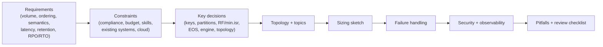

## 2. Scenarios

### Scenario 1 – Real-time payments platform (exactly-once, strict ordering per account)

**Requirements.** 5,000 payments/s peak (20k during salary days), each payment produces 2–4 ledger entries; every entry must be applied exactly once to the account balance; entries for one account must be applied in order; end-to-end p99 under 500 ms; ledger retained 10 years; zero acknowledged data loss.

**Constraints.** PCI DSS scope; regulator requires audit trail and reconciliation; Java teams; single cloud region with three AZs plus a DR region (RPO ≤ 1 min acceptable for the *event* stream because the ledger DB is the system of record with its own synchronous replication).

**Key decisions.**

| Decision | Choice | Why |
|----------|--------|-----|
| Ordering key | `account_id` | All operations on an account in one partition; cross-account transfer becomes two ordered legs plus a saga |
| Semantics | Kafka Streams `exactly_once_v2` for the ledger processor; outbox + Debezium from the payment API DB | Atomic consume-process-produce; no dual writes |
| Durability | RF=3, `min.insync.replicas=2`, `acks=all`, `unclean.leader.election.enable=false`; `transaction.state.log.min.isr=2` | Standard durable baseline |
| DB write | Idempotent upsert keyed by `ledger_entry_id` | Exactly-once effect into core banking |
| Retention | `payments.ledger.entries.v1` infinite with tiered storage; regulator copy exported to WORM storage | Kafka replay plus immutable archive |
| Partitions | 96 for commands and ledger (≈ 200 entries/s per partition at peak, room for 3× growth) | Parallelism without over-partitioning stateful Streams tasks |

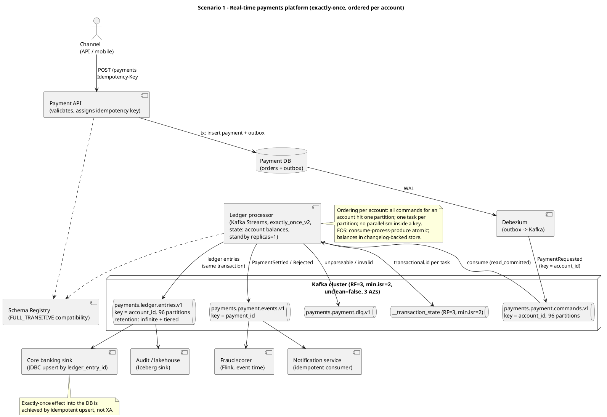

Source: `diagrams/design-scenarios-and-case-studies-payments-platform.puml`.

**Topic/partition design.**

| Topic | Key | Partitions | RF / min.isr | Cleanup / retention | Schema compat |
|-------|-----|------------|--------------|---------------------|---------------|
| `payments.payment.commands.v1` | account_id | 96 | 3 / 2 | delete, 7 d | FULL_TRANSITIVE |
| `payments.ledger.entries.v1` | account_id | 96 | 3 / 2 | delete, infinite (tiered, local 3 d) | FULL_TRANSITIVE |
| `payments.payment.events.v1` | payment_id | 96 | 3 / 2 | delete, 30 d | FULL_TRANSITIVE |
| `payments.account.balance.state.v1` (Streams changelog) | account_id | 96 | 3 / 2 | compact | internal |
| `payments.payment.dlq.v1` | original key | 12 | 3 / 2 | delete, 30 d | – |

**Sizing sketch.** 20k payments/s × 3 entries × ~600 B ≈ 36 MB/s ledger ingress plus ~12 MB/s commands/events ≈ 50 MB/s; RF=3 → 150 MB/s replication write; 5 consumer groups → 250 MB/s egress; storage on brokers with 3-day local tier ≈ 50 MB/s × 259,200 s × 3 × 1.1 ≈ 43 TB; six brokers (two per AZ) of 32 GB RAM/8 vCPU with 10 TB gp3 each run under 30 % network; ledger history to object storage ≈ 4.7 TB/month growth.

**Failure handling.** Broker loss: transparent (min.isr=2). Streams instance loss: standby replica takes over within seconds; `acceptable.recovery.lag` tuned; static membership. Transaction timeout on crash: aborted, consumers `read_committed` never see partial results; new instance fences the old `transactional.id`. Poison command: validation failure → DLQ with reason header, never blocks the partition. Region loss: MM2 to DR region for events (RPO ≤ 1 min); ledger DB replicated synchronously by the database; on failover, the Streams app rebuilds balance state from the mirrored changelog or re-snapshots from the DB (documented runbook).

**Security.** mTLS between services and brokers; OAuth principals per service; prefixed ACLs on `payments.`; field-level encryption of PAN-adjacent fields (or tokenization before Kafka so no PAN ever enters the cluster, the preferred PCI scope reduction); audit logging of ACL changes; Schema Registry read-only for apps.

**Observability.** Streams `commit-latency`, `process-rate`, task lag per partition; broker `RemoteTimeMs` for produce; reconciliation job comparing ledger entries count by account per hour between Kafka and core banking; SLO: p99 command→settled ≤ 500 ms; alert on transaction abort rate.

**Pitfalls.** Keying by `payment_id` (loses account ordering); running the ledger processor with more instances than partitions (idle); enabling `unclean.leader.election`; treating Kafka as the ledger of record without the WORM export; forgetting `transaction.state.log.min.isr=2`; partition count changes after go-live (state re-keying).

### Scenario 2 – E-commerce order processing with sagas

**Requirements.** 2,000 orders/s peak (Black Friday 10×); an order spans inventory reservation, payment authorization, shipping booking; failures must compensate (release stock, void authorization); customers see order status within 2 s; order history retained 1 year.

**Constraints.** Polyglot services (Java, Go, Node); each service owns its DB; existing monolith emits order events via CDC; managed Kafka on AWS (MSK).

**Key decisions.** Orchestrated saga with a Kafka Streams orchestrator whose state lives in a compacted changelog; outbox pattern in every participant; commands and replies as separate topics keyed by `order_id`; idempotent participants (inbox table); CloudEvents envelope with `traceparent` header.

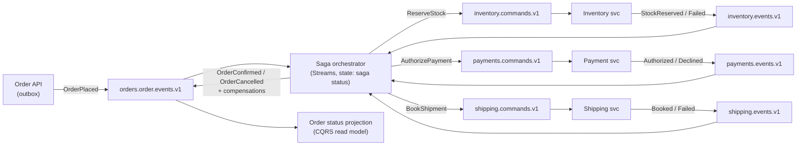

**Topic/partition design.**

| Topic | Key | Partitions | Retention | Notes |
|-------|-----|------------|-----------|-------|
| `orders.order.events.v1` | order_id | 64 | 365 d (tiered) | Public contract |
| `orders.saga.state.v1` (changelog) | order_id | 64 | compact | Orchestrator state |
| `inventory.commands.v1` / `inventory.events.v1` | order_id | 64 | 7 d | Same partition count as orders for co-partitioning |
| `payments.commands.v1` / `payments.events.v1` | order_id | 64 | 7 d | |
| `shipping.commands.v1` / `shipping.events.v1` | order_id | 64 | 7 d | |

**Sizing sketch.** 20k orders/s peak × ~8 messages per saga × 1 KB ≈ 160 MB/s at peak for a few hours; MSK provisioned with 9 `kafka.m7g.xlarge`-class brokers (indicative) across 3 AZs, or Express brokers to absorb the burst; compression `lz4`; `client.rack` on all services.

**Failure handling.** Step timeouts in the orchestrator (punctuator) trigger compensation; participants idempotent by `command_id`; orchestrator EOS v2; DLQ per participant; MSK Replicator to a second region for the order events topic (RPO minutes) while services stay single-region.

**Security.** IAM auth with per-service roles scoped to topic prefixes; Schema Registry (Glue or self-managed) with BACKWARD compatibility; PII (addresses) tokenized in shipping events.

**Observability.** Saga duration histogram, stuck-saga count (no terminal state after 10 min), per-participant reply latency, DLQ rate; trace propagation through headers to see one order across services.

**Pitfalls.** Choreography-only sagas that no one can reason about; different partition counts across command/event topics breaking co-partitioning in Streams joins; missing compensation for the last step; using Kafka request/reply for the customer-facing status call instead of the read model.

### Scenario 3 – IoT telemetry ingestion from 1M devices

**Requirements.** 1M devices, each sending a 120-byte reading every 10 s (100k msg/s, ≈ 12 MB/s raw); bursts to 500k msg/s after outages; per-device ordering; 30-day raw retention; real-time alerts within 5 s; devices connect over MQTT.

**Constraints.** Devices cannot batch much; constrained bandwidth; regional edge sites with intermittent uplinks; budget-sensitive.

**Key decisions.** MQTT broker/gateway that batches per device group before producing (never one Kafka producer per device); key by `device_id`; `linger.ms=100`, `batch.size=512 KB`, `zstd`; 200 partitions; alerts via Kafka Streams windowed aggregation; raw to lakehouse via S3 sink with hourly Parquet; downsampled aggregates to central cluster (hub-and-spoke).

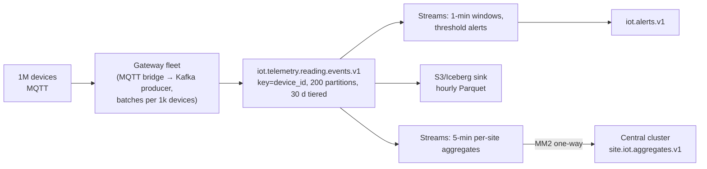

**Topic/partition design.**

| Topic | Key | Partitions | Retention | Notes |
|-------|-----|------------|-----------|-------|
| `iot.telemetry.reading.events.v1` | device_id | 200 | 30 d, tiered (local 24 h) | `message.max.bytes` 64 KB |
| `iot.alerts.v1` | device_id | 50 | 7 d | Low volume |
| `iot.site.aggregates.v1` | site_id | 24 | 30 d | Mirrored to central |
| `iot.device.state.v1` | device_id | 200 | compact | Last-known state |

**Sizing sketch.** Raw 12 MB/s (60 MB/s burst) compresses roughly 3–5× with zstd on batched numeric payloads (indicative) → 3–4 MB/s on wire; the challenge is *requests*, not bytes: gateway batching turns 100k msg/s into ~200 produce requests/s per gateway. Storage 30 d × 4 MB/s × 3 × 1.1 ≈ 34 TB with tiering to object storage; 3–6 brokers suffice; bursts are absorbed by gateway buffering and producer `buffer.memory=256 MB`.

**Failure handling.** Gateway disk buffer for uplink loss (ordering per device preserved by single-producer-per-device-group); duplicates from gateway retries handled by idempotent producer per gateway and dedup on `(device_id, seq)` in Streams; late data handled with grace periods; hot device (chatty firmware) throttled by gateway-level quotas.

**Security.** mTLS from gateways with per-gateway certificates; devices authenticate to MQTT, never to Kafka; ACLs per gateway prefix.

**Observability.** Gateway batch size and queue depth, `records-per-request-avg`, per-partition skew, Streams window lateness, alert latency SLO 5 s.

**Pitfalls.** One producer per device (connection storm); tiny messages without batching (request-bound brokers); keying by site (hot partitions); infinite retention "for ML" without tiering; no dedup on gateway retries.

### Scenario 4 – Clickstream analytics pipeline to a lakehouse

**Requirements.** 300k events/s peak (page views, clicks), 1.5 KB JSON each (~450 MB/s raw); sessionization and real-time dashboards (1-minute freshness); daily batch analytics in Iceberg; 90-day replay ability; loss of < 0.1 % acceptable for real-time, zero for the lake.

**Constraints.** Cost-sensitive; AWS; data science team on Spark/Trino; PII (user ids, IPs) must be pseudonymized before the lake.

**Key decisions.** Convert JSON to Avro at the edge collector (size −60 %, indicative) with Schema Registry; `acks=1` acceptable for the raw firehose? No: the lake needs zero loss, so `acks=all`, min.isr=2, but tolerate consumer-side sampling for dashboards; Flink for sessionization and pseudonymization writing Iceberg with exactly-once checkpoints; tiered storage for 90 days; 600 partitions keyed by `session_id`.

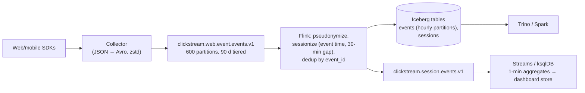

**Topic/partition design.**

| Topic | Key | Partitions | Retention | Notes |
|-------|-----|------------|-----------|-------|
| `clickstream.web.event.events.v1` | session_id | 600 | 90 d tiered (local 12 h) | Avro, zstd |
| `clickstream.session.events.v1` | session_id | 200 | 7 d | Derived |
| `clickstream.metrics.1m.v1` | metric_key | 24 | 1 d | Dashboard feed |

**Sizing sketch.** 450 MB/s JSON → ~150 MB/s Avro+zstd on wire (indicative); RF=3 → 450 MB/s replication; 3 consumer groups → 450 MB/s egress; ~12 brokers with 10 Gbit NICs at ~55 %; local storage 12 h × 150 MB/s × 3 × 1.1 ≈ 21 TB; object storage 90 d ≈ 1.2 PB (raw Kafka tier) plus Iceberg copies, so consider 30 days in Kafka and rely on Iceberg for older replays.

**Failure handling.** Collector buffers locally; Flink checkpoints every 60 s with exactly-once Iceberg commits; late events beyond 1 h go to a late-events table; broker loss transparent; Flink job restart from savepoint on upgrade.

**Security.** Pseudonymization (HMAC of user id with rotating key) in Flink before any lake write; raw topic ACL restricted to the Flink principal and a break-glass group; IP truncation.

**Observability.** Collector error rate, `records-lag-max` for Flink, checkpoint duration, Iceberg small-file count, freshness SLO (event time to dashboard ≤ 60 s), cost dashboard for cross-AZ transfer (use `client.rack` on Flink task managers).

**Pitfalls.** JSON on the wire at this volume; hourly-partitioned Iceberg with per-minute flushes (small files); keying by `user_id` (hot keys for bots); 90 days of raw data on broker disks; forgetting that Trino queries on Kafka directly (Kafka connector) are not a substitute for the lake.

### Scenario 5 – CDC from a monolith database to microservices

**Requirements.** Oracle (or PostgreSQL) monolith with 400 tables; new microservices need customer, product, and order data in near real time (< 5 s); the monolith cannot be modified beyond adding triggers or enabling logs; consumers must get full state on first start.

**Constraints.** DBA restrictions on log retention; some tables have no primary key; PII in customer tables; strangler migration over 18 months.

**Key decisions.** Debezium (LogMiner for Oracle / pgoutput for Postgres) capturing an allow-list of tables to internal `cdc.*` topics; anti-corruption layer (Streams) producing public `customer.profile.state.v1` (compacted) and `orders.order.events.v1`; initial snapshot plus incremental snapshots (signal table) for new tables; tables without PK get a surrogate key via SMT or are excluded; PII masked in the ACL before publishing.

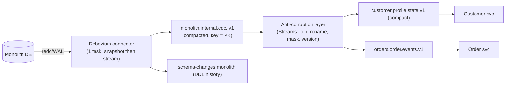

**Topic/partition design.**

| Topic | Key | Partitions | Cleanup | Notes |
|-------|-----|------------|---------|-------|
| `monolith.internal.cdc.customers.v1` | PK | 24 | compact | Internal only |
| `monolith.internal.cdc.orders.v1` | PK | 48 | delete 7 d | Internal |
| `customer.profile.state.v1` | customer_id | 24 | compact | Public, masked |
| `orders.order.events.v1` | order_id | 48 | delete 30 d | Public |

**Sizing sketch.** Change rate ~2k rows/s average, 20k/s during batch jobs; Debezium envelope ~2 KB → 40 MB/s peak; single connector task limits throughput to what the log reader delivers (indicative low hundreds of MB/s for Postgres, less for Oracle LogMiner); 3 Connect workers; small Kafka cluster (3–6 brokers).

**Failure handling.** Connector restart resumes from committed log position (at-least-once → consumers dedup by `(table, PK, source.lsn)`); replication slot lag alert to prevent WAL/redo exhaustion; DDL changes captured and compatibility-checked; incremental snapshot for backfills without stopping streaming; downstream consumers bootstrap from compacted public state topics.

**Security.** Debezium DB user with minimal replication privileges; masking SMT (`io.debezium.transforms...` or custom) for PII before `cdc.*` topics leave the connector where required; public topics classified and ACLed.

**Observability.** `MilliSecondsBehindSource`, `QueueRemainingCapacity`, replication slot size, snapshot progress, schema-change events, consumer lag on public topics.

**Pitfalls.** Exposing `cdc.*` topics directly to other domains; tables without PKs producing unkeyed events; batch jobs in the monolith flooding the log; long-running connector outages exhausting DB log retention; treating Debezium's `ts_ms` as event time (it is commit time).

### Scenario 6 – Log and metrics aggregation pipeline

**Requirements.** 50k hosts and containers emitting 2 TB/day logs and 500k metric points/s; searchable within 30 s; 14-day hot retention in a search cluster; 1-year cold archive; loss of a few seconds during incidents tolerable; must not impact application clusters.

**Constraints.** Cheapest possible per GB; observability team of three; on-prem Kubernetes with Strimzi.

**Key decisions.** Dedicated bulk-tier cluster (never share with tier-1); `acks=1` with RF=2 for logs (loss tolerated) but `acks=all` RF=3 for audit logs; `zstd`; large batches (`linger.ms=500`, `batch.size=1 MB`); agents (Fluent Bit/Vector/OpenTelemetry Collector) with local buffering; Connect sinks to OpenSearch and S3; topics per log class, not per service.

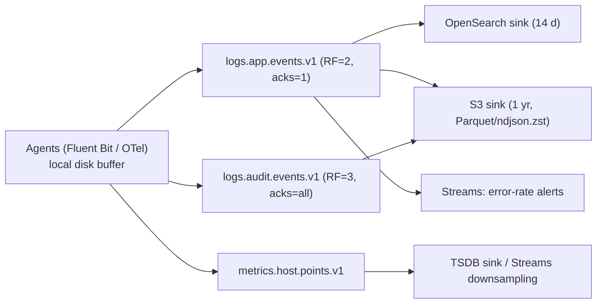

**Topic/partition design.**

| Topic | Key | Partitions | RF / acks | Retention |
|-------|-----|------------|-----------|-----------|
| `logs.app.events.v1` | null (sticky) | 120 | 2 / 1 | 3 d |
| `logs.audit.events.v1` | host_id | 24 | 3 / all | 30 d |
| `metrics.host.points.v1` | host_id | 60 | 2 / 1 | 1 d |

**Sizing sketch.** 2 TB/day ≈ 23 MB/s average, 100 MB/s peak, compressed ~4× → 25 MB/s peak on wire; metrics 500k pts/s × 60 B ≈ 30 MB/s raw, ~8 MB/s compressed; RF=2 → modest replication; 3-day retention ≈ 25 MB/s × 259,200 × 2 × 1.1 ≈ 14 TB; 3–4 brokers with 8 TB each; cost dominated by the search cluster, not Kafka.

**Failure handling.** Agents buffer to disk during broker outages; consumers (sinks) lag but catch up; RF=2 means a double-broker failure loses recent logs (accepted, documented); audit logs on the durable topic; quotas per agent fleet to protect against log storms; sampling in agents when lag exceeds threshold.

**Security.** mTLS from agents; no PII in logs by policy with a scrubbing stage; audit topic ACL restricted.

**Observability.** Sink lag, agent buffer usage, bytes per namespace (chargeback to teams for log volume), storm detection (bytes/s per source > 10× baseline).

**Pitfalls.** Sharing the logging cluster with transactional workloads; topic per service (thousands of low-volume topics); `acks=all` RF=3 for everything (3× cost for data nobody will miss); no agent-side buffering; retention set by "what if we need it" instead of the search cluster's window.

### Scenario 7 – Multi-region active-active customer profile service

**Requirements.** Customers in EU and US read and update their profiles with < 100 ms local latency; profile changes visible in the other region within 5 s; region loss must not stop reads or writes; GDPR residency for EU customers' data.

**Constraints.** Two regions; existing MM2 skills; Confluent not in scope; legal review says EU profile data may be mirrored to US only if pseudonymized.

**Key decisions.** Cluster per region; **geo-partitioned keys**: each customer has a home region; writes accepted only in the home region (API gateway redirects); compacted `customer.profile.state.v1` per region mirrored with MM2 prefix; EU→US mirror goes through a pseudonymizing Streams job (`customer.profile.state.pseudo.v1`) to satisfy residency; region loss: customers homed in the lost region become read-only elsewhere (or emergency re-home with reconciliation).

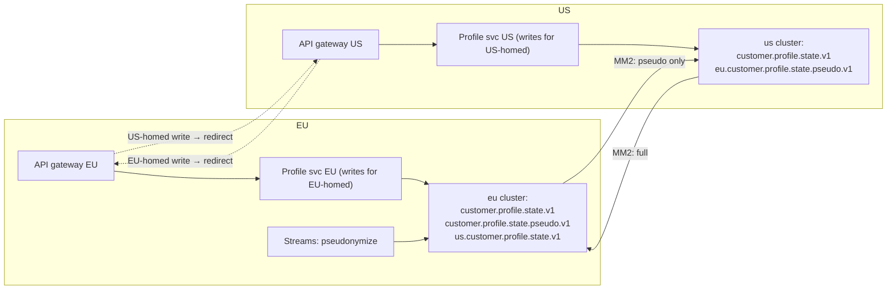

**Topic/partition design.**

| Topic (per region) | Key | Partitions | Cleanup | Mirrored? |
|--------------------|-----|------------|---------|-----------|
| `customer.profile.state.v1` | customer_id | 48 | compact | US→EU full; EU→US no |
| `customer.profile.state.pseudo.v1` (EU only) | customer_id | 48 | compact | EU→US |
| `customer.profile.events.v1` | customer_id | 48 | delete 30 d | both (pseudo for EU) |

**Sizing sketch.** Low volume (hundreds of updates/s); the cost is cross-region egress (compacted state is small) and the operational cost of two MM2 flows plus the pseudonymization job; 3–6 brokers per region.

**Failure handling.** MM2 lag alerts; offset translation irrelevant for compacted state (consumers rebuild from mirror); region loss: reads served from mirror, writes for lost-region customers rejected with a clear error or emergency re-home procedure with a conflict log; DNS/GSLB steers users.

**Security.** Separate principals per MM2 direction; EU raw topic has no ACL for the US MM2 principal (structural enforcement of residency); pseudonymization keys held in EU KMS only.

**Observability.** Replication latency per direction, count of redirected writes, residency audit (US cluster must contain zero raw EU records: scheduled scan), profile read staleness SLO 5 s.

**Pitfalls.** Allowing writes in both regions for the same key "temporarily"; mirroring raw EU data and pseudonymizing downstream; assuming timestamps resolve conflicts; forgetting that Streams internal topics must be excluded from mirroring.

### Scenario 8 – Migrating from IBM MQ / JMS to Kafka in a bank

**Requirements.** 350 JMS queues and topics, 40 applications, request/reply and pub/sub patterns, guaranteed once-and-only-once delivery expectations, message-level TTL, priority queues on a few flows; zero message loss during migration; 24-month program.

**Constraints.** Applications cannot all change at once; some are COTS products with JMS only; regulators require the migration to be reversible per flow; ordering only within a queue today.

**Key decisions.** Bridge pattern with Kafka Connect (IBM MQ source/sink connectors) per flow during coexistence; semantic mapping table (queue → topic with key; JMS selectors → separate topics or header filtering in consumers; TTL → retention plus consumer-side expiry header; priority → separate topics with consumer weighting; request/reply → HTTP or correlation-id reply topics for the few genuinely async flows); at-least-once + idempotent consumers replaces "exactly-once" expectations, with transactions where read-process-write exists; Kafka 4.0 share groups (KIP-932, queues for Kafka) evaluated for queue-like consumption once GA on the platform.

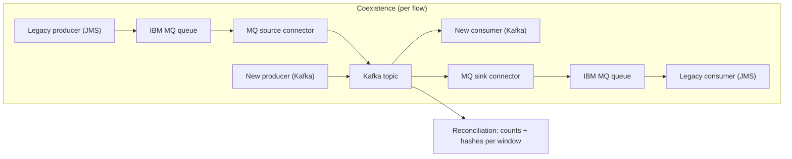

**Topic/partition design (mapping rules).**

| JMS construct | Kafka mapping | Note |
|---------------|---------------|------|
| Queue `PAYMENTS.IN` | `payments.inbound.request.events.v1`, key = business id | Ordering within key rather than global |
| Topic with durable subscribers | Topic with one consumer group per subscriber | Offsets replace durable subscriptions |
| Message selector | Separate topics or consumer-side filter by header | No broker-side filtering in Kafka |
| TTL / expiry | `retention.ms` + `expires_at` header checked by consumer | |
| Priority | `...priority-high.v1` / `...priority-normal.v1` | Consumer polls high first |
| Request/reply | HTTP/gRPC, or reply topic + `correlation_id` header | Avoid for synchronous paths |
| Transacted session | Transactional producer / EOS in Streams | |
| Dead-letter queue | `.dlq.v1` topic with error headers | |

**Sizing sketch.** MQ volumes are usually modest (thousands/s); a 6-broker cluster with RF=3 across 3 AZs is ample; the sizing effort goes into Connect capacity (one task per queue for ordering) and the number of topics (~350 → governance and partition budget).

**Failure handling.** Connector offsets and MQ transactional gets ensure no loss (at-least-once); duplicates possible on restart → idempotent consumers; per-flow rollback = stop the Kafka consumer and re-enable the JMS consumer (messages still flow through MQ during coexistence); reconciliation counts per window as the acceptance gate.

**Security.** Kerberos/OAuth mapping from MQ identities; per-flow ACLs; TLS; audit of who consumed which queue replaced by ACL and consumer-group logs.

**Observability.** Per-flow lag, connector task status, duplicate-rate estimate, reconciliation diffs, TTL-expired count.

**Pitfalls.** Promising "exactly-once like MQ" without redesigning consumers; preserving global queue ordering by using one partition (throughput cliff); mapping every selector to a topic (explosion); leaving the bridge in place forever; ignoring poison messages that MQ used to park in backout queues.

### Scenario 9 – GDPR-compliant user data topics

**Requirements.** User profile and activity data across 12 topics; erasure requests must complete within 30 days across Kafka, mirrors, and the lake; access must be auditable; data minimization.

**Constraints.** Some topics have 1-year retention for analytics; MM2 to a DR region; tiered storage enabled; consumers in 8 teams.

**Key decisions.** Split PII from non-PII: `user.profile.state.v1` compacted (erasure by tombstone) and `user.activity.events.v1` with PII fields encrypted per user (crypto-shredding) via a serializer wrapper with per-user data keys in a KMS-backed key store; surrogate `user_id` as key, no emails; classification tags in schema; erasure workflow topic `privacy.erasure.requests.v1` consumed by every downstream owner with completion acknowledgements.

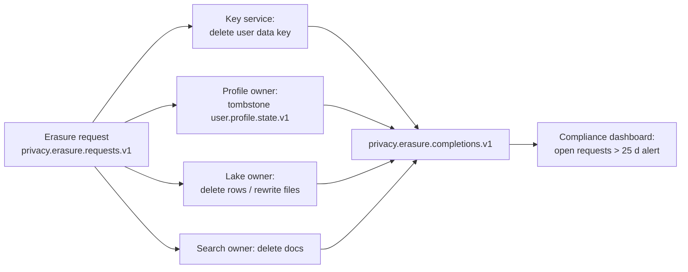

**Topic/partition design.**

| Topic | Key | Cleanup | PII handling |
|-------|-----|---------|--------------|
| `user.profile.state.v1` | user_id | compact, `max.compaction.lag.ms=7 d`, `delete.retention.ms=7 d` | Tombstone erasure |
| `user.activity.events.v1` | user_id | delete 365 d, tiered | Field encryption, crypto-shredding |
| `privacy.erasure.requests.v1` | user_id | delete 90 d | Contains only ids |
| `privacy.erasure.completions.v1` | request_id | compact | Audit evidence |

**Sizing sketch.** Field-level encryption adds CPU on producers/consumers and ~10–30 % payload (indicative); key service must handle key lookups with caching (consumers cache keys per user with TTL); otherwise ordinary volumes.

**Failure handling.** Erasure is a saga with acknowledgements and a 25-day alert; tombstones re-emitted if compaction has not run (verify via consumer read); key deletion is irreversible so it is the last step after other owners acknowledge; MM2 mirrors receive tombstones naturally and encrypted data becomes unreadable once keys are gone.

**Security.** PII topics readable only by justified principals; quarterly access review generated from ACLs; KMS audit logs; no PII in keys/headers/topic names; Schema Registry tags drive CI checks that PII fields use the encrypting serializer.

**Observability.** Open erasure requests by age, compaction lag per PII topic (`kafka.log:type=LogCleanerManager` `max-dirty-percent`, `time-since-last-run-ms`), key service latency, unauthorized access attempts.

**Pitfalls.** Emails as keys; relying on retention alone with tiered 1-year data; forgetting Streams changelogs and repartition topics (they carry PII too); erasing in Kafka but not in the lake; deleting keys before downstream owners finish.

### Scenario 10 – High-fan-out notification system

**Requirements.** 50k events/s (order updates, promotions) must be delivered to 30 downstream channels (push, email, SMS, partner webhooks, in-app) with per-channel filtering and rate limits; partner webhooks are slow and flaky; no channel may slow another; duplicates tolerated but minimized.

**Constraints.** Partner SLAs vary; some channels need per-user ordering (in-app feed); managed Kafka with a partition cap.

**Key decisions.** One canonical `notifications.notification.events.v1` topic, and a routing Streams job that fans out to **per-channel topics** (not 30 consumer groups on the firehose reading and discarding 97 %); per-channel consumers with their own lag, quota, retry topics, and DLQ; slow partner channel isolated with its own topic and bounded retry (`retry-1m`, `retry-10m`); key by `user_id` for ordered channels, null key for broadcast channels.

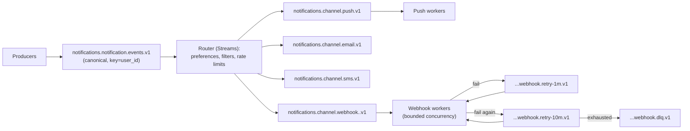

**Topic/partition design.**

| Topic | Key | Partitions | Retention | Notes |
|-------|-----|------------|-----------|-------|
| `notifications.notification.events.v1` | user_id | 120 | 3 d | Canonical |
| `notifications.channel.push.v1` | user_id | 60 | 1 d | Ordered per user |
| `notifications.channel.email.v1` | null | 30 | 1 d | Broadcast |
| `notifications.channel.webhook.<partner>.v1` | null | 6 each | 1 d | Isolated per partner |
| Retry / DLQ topics | original key | 6 | 7 d | Delay via consumer pause until due time |

**Sizing sketch.** 50k/s × 1 KB = 50 MB/s canonical; fan-out writes ≈ 50 MB/s × average channels per event (say 2) = 100 MB/s; total ingress ~150 MB/s, egress ~200 MB/s; RF=3 → ~450 MB/s replication; ~9 brokers; partition budget matters on managed clusters: 120 + 60 + 30 + 30 partners × 6 + retries ≈ 450 partitions × 3.

**Failure handling.** Partner down: its topic backs up, retries escalate, DLQ after exhaustion, alert to partner manager; other channels unaffected; router EOS optional (duplicates tolerated); consumer `pause()`/`resume()` implements delay in retry topics without blocking heartbeats.

**Security.** Partner webhooks signed; per-channel worker principals with ACLs only on their topics; PII (email, phone) tokenized in channel topics and resolved at send time.

**Observability.** Lag per channel, delivery success rate per partner, retry depth, DLQ rate, end-to-end delivery latency per channel, router rule-evaluation latency.

**Pitfalls.** 30 consumer groups on the firehose (30× egress, cross-AZ bill, filtering waste); one shared worker pool where a slow partner starves others; unbounded retries; using Kafka delay by sleeping in the poll loop (rebalances).

### Scenario 11 – ZooKeeper to KRaft migration of a 30-broker cluster with zero downtime

**Requirements.** Migrate a 30-broker Kafka 3.5 cluster (ZooKeeper mode, 60k partitions, 24×7 traffic) to KRaft before upgrading to 4.0 (which removes ZooKeeper); no client-visible downtime; rollback possible until the final step.

**Constraints.** Change windows are weekly; controllers must be new dedicated nodes; monitoring must show migration state.

**Key decisions.** Upgrade to the 3.9 bridge release first (3.9 is the final release with ZooKeeper support and the recommended migration version); provision 3 dedicated KRaft controllers across 3 AZs; follow the documented migration phases with rollback points; freeze topic/ACL changes during metadata copy; validate with `kafka-metadata-quorum.sh` and controller logs; only after full stabilization, finalize (removes rollback) and then plan the 4.0 upgrade.

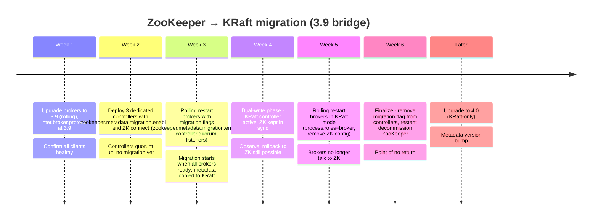

**Migration checklist (mapped to the Apache documentation phases).**

| Phase | Actions | Validation | Rollback |
|-------|---------|------------|----------|
| Prepare | Upgrade to 3.9; `inter.broker.protocol.version=3.9`; record cluster id from ZK; provision controllers with `process.roles=controller`, `node.id` unique and not colliding with `broker.id`s, `controller.quorum.voters`, `zookeeper.connect`, `zookeeper.metadata.migration.enable=true`, same `cluster.id` | Controllers form quorum (`kafka-metadata-quorum.sh describe --status`); log "Waiting for brokers" | Stop controllers |
| Enable brokers | Add to each broker: `zookeeper.metadata.migration.enable=true`, `controller.quorum.voters`, `controller.listener.names` and a controller listener mapping; rolling restart | Controller log "Completed migration of metadata from ZooKeeper to KRaft"; `kafka.controller:type=KafkaController,name=ZkMigrationState` | Restart brokers without migration configs (ZK still authoritative until migration completes) |
| Dual-write | KRaft controller active; writes mirrored to ZK | Soak 1–2 weeks; measure controller metrics, election times | Documented ZK rollback procedure (controllers stopped, brokers restarted in ZK mode) |
| Brokers to KRaft | Replace ZK configs with `process.roles=broker`, remove `zookeeper.*`; rolling restart | Brokers register with quorum only | Still possible via documented steps until finalization |
| Finalize | Remove `zookeeper.metadata.migration.enable` and `zookeeper.connect` from controllers; restart | `ZkMigrationState` = NONE/finalized; ZK has no active sessions | None |
| Decommission ZK | Stop ZooKeeper ensemble after retention of backups | – | – |

**Sizing sketch.** Controllers: 3 nodes, 4 vCPU/16 GB, fast SSD for `metadata.log.dir`; 60k partitions produce a metadata snapshot of tens to a few hundred MB (indicative); ensure `metadata.log.max.record.bytes.between.snapshots` defaults are fine and monitor snapshot generation.

**Failure handling.** Broker restart failing during migration → fix config, the cluster continues on the remaining brokers (min.isr=2); controller loss during dual-write → quorum tolerates one; rollback procedures rehearsed in staging with a metadata copy of production; topic creation frozen during metadata copy to avoid divergence.

**Security.** Controller listener with mTLS/SASL; ACLs migrated automatically (verify counts before and after with `kafka-acls.sh --list`); ZK ACLs irrelevant after migration.

**Observability.** `ZkMigrationState`, `kafka.server:type=raft-metrics` (`current-state`, `commit-latency-avg`, `high-watermark`), `MetadataErrorCount`, active controller count = 1, leader election rate during rolling restarts, client error rates.

**Pitfalls.** Node id collisions between controllers and brokers; skipping the 3.9 bridge; running controllers combined with brokers on a 30-node cluster; changing topics/ACLs during metadata copy; finalizing before a full soak; forgetting client-side `zookeeper`-based tooling (old scripts using `--zookeeper` flags, removed since 3.x).

### Scenario 12 – Reducing cross-AZ cost on AWS by 40 %

**Requirements.** An MSK provisioned cluster (9 brokers, 3 AZs) with 150 MB/s ingress, 8 consumer groups, JSON payloads; the data transfer line is $60k/month (indicative); reduce it by 40 % within a quarter without application rewrites.

**Constraints.** No downtime; consumer teams are busy; Kafka Streams apps included.

**Key decisions.** Attribute the bill (producers 2/3 × ingress cross-AZ; replication 2 × ingress; consumers 2/3 × 8 × ingress); prioritize by lever size: consumer follower fetching (largest), compression (multiplies every term), consumer group consolidation, AZ-aware producer placement where possible (cannot avoid leader crossing without Confluent-style rack-aware leadership; can only reduce by co-locating producers per AZ with their partition leaders, which is impractical, so focus on the other levers).

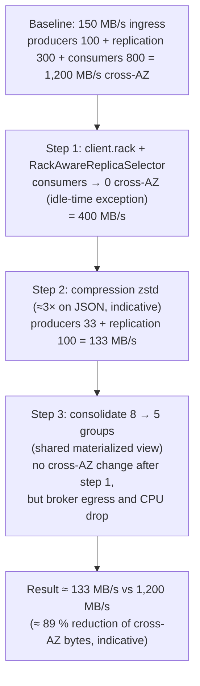

**Topic/partition design.** Unchanged; the work is configuration.

**Sizing sketch of the savings.**

| Term | Before (MB/s cross-AZ) | After step 1 | After step 2 |
|------|------------------------|--------------|--------------|
| Producers → leaders (2/3 of 150) | 100 | 100 | 33 |
| Replication (2 × 150) | 300 | 300 | 100 |
| Consumers (2/3 × 8 × 150) | 800 | ~0 | ~0 |
| Total | 1,200 | 400 | 133 |

Even if compression yields only 1.5× and a third of consumers cannot set `client.rack`, the reduction exceeds 40 %. Note MSK does not charge for in-cluster replication transfer (verify current pricing); the dominant billed term is then client traffic, which step 1 and 2 address directly.

**Failure handling.** Follower fetching: if a local replica leaves the ISR, consumers are redirected to the leader (temporary cost increase, no outage). Compression rollout per producer with canary; consumers decompress transparently. Streams apps: set `client.rack` through the Streams config (Kafka Streams forwards consumer settings, so `client.rack` or the prefixed `consumer.client.rack` reaches the embedded consumer) and use `rack.aware.assignment.tags` for standby placement.

**Security.** Unchanged.

**Observability.** Cost Explorer by usage type (`DataTransfer-Regional-Bytes`), broker `BytesOutPerSec` per AZ, consumer `fetch-latency-avg` (follower fetching adds a few ms), `preferred-read-replica` in fetch responses (visible in client debug logs), compression ratio (`compression-rate-avg`).

**Pitfalls.** Expecting tiered storage to cut cross-AZ cost (it does not); setting `client.rack` to the wrong AZ id format (must match `broker.rack` values MSK uses, e.g., `use1-az1`); enabling compression at the topic level instead of the producer (forces broker recompression); consolidating consumer groups by putting two teams' logic in one app without ownership clarity.

## 3. Architecture review checklist

Use this list in design reviews; every "no" needs a written justification.

**Requirements and semantics**
- [ ] Ordering requirement stated per key, and the message key implements exactly that
- [ ] Delivery semantics stated (at-most/at-least/exactly-once) and consumers are idempotent where at-least-once applies
- [ ] Latency SLO (p99) and throughput (peak, not average) stated with growth for 12–18 months
- [ ] RPO/RTO stated and matched to topology (single region, stretch, active-passive, active-active)
- [ ] Retention justified per topic (transport vs replay vs state) with legal review for > 90 days or infinite

**Topic and data design**
- [ ] Naming standard followed; owner, tier, classification, contact present
- [ ] Partition count derived from throughput and consumer parallelism, within the partition budget; plan for the day it must change
- [ ] Schema in registry with compatibility mode; breaking changes via new version topic
- [ ] No PII in keys, headers, or topic names; PII fields tagged; erasure path designed (tombstone or crypto-shredding)
- [ ] Internal topics (CDC, changelogs, repartitions) not exposed as contracts; excluded from mirroring

**Durability and resilience**
- [ ] RF=3, `min.insync.replicas=2`, `acks=all`, `unclean.leader.election.enable=false` (or documented exception)
- [ ] Rack awareness across ≥ 3 AZs; controller quorum 3 or 5 across AZs, dedicated nodes
- [ ] Producers idempotent, retries with adequate `delivery.timeout.ms`, ≥ 3 bootstrap servers
- [ ] Consumers with static membership / cooperative rebalance; commit after processing; `max.poll.interval.ms` fits processing time
- [ ] Poison pill isolation (DLQ, retry topics) and backpressure strategy defined
- [ ] Failure scenarios walked through (broker, AZ, region, controller quorum, Schema Registry, dependency)

**Capacity and cost**
- [ ] Capacity model exists (chapter 01) with utilization ≤ 60 % at N−1
- [ ] Cross-AZ traffic estimated; follower fetching and compression applied
- [ ] Storage on brokers vs tiered/object storage decided; re-sizing triggers defined
- [ ] Managed-service limits (partitions, throughput, message size, connections) checked against the design

**Security and governance**
- [ ] Authentication (mTLS/SASL/OAuth/IAM) and least-privilege prefixed ACLs/RBAC per principal
- [ ] Quotas per principal; mutation-rate quota; topic policies or CI gates
- [ ] Encryption in transit everywhere; at rest; field-level where classification demands
- [ ] Audit: ACL changes, schema changes, admin operations logged

**Operability**
- [ ] Dashboards: URP, under-min-ISR, offline partitions, request latency breakdown, lag per group, quotas/throttle, controller quorum health
- [ ] Alerts route by owner metadata; runbooks for the top 10 alerts
- [ ] Upgrade and migration plan (KRaft, version cadence) with rollback points
- [ ] Chaos experiments and failover drills scheduled
- [ ] AsyncAPI/catalog entries published; consumers registered for impact analysis

## 4. Interview questions for this chapter

### Q1. Design a payments ledger on Kafka with strict per-account ordering and exactly-once. Walk through the key decisions.
**Role:** [ARCH] | **Difficulty:** ★★★ | **Topic:** Scenario 1

**Answer.**
Key every command and ledger entry by `account_id` so an account's history lives in one partition; publish commands via an outbox from the payment API's database; run the ledger processor as Kafka Streams with `exactly_once_v2` so consuming a command, updating the balance store, and emitting entries commit atomically; keep balances in a changelog-backed store with standby replicas. Cluster settings RF=3, `min.insync.replicas=2`, `acks=all`, unclean election off, `transaction.state.log.min.isr=2`. Write to core banking with idempotent upserts keyed by entry id, retain the ledger topic with tiered storage and export an immutable archive for the regulator. Partition count is fixed at go-live because state is keyed; choose with headroom.

**Follow-up probes.** How is a cross-account transfer ordered? What happens when a Streams instance dies mid-transaction?

### Q2. Thirty consumers each need a filtered slice of a 50k msg/s stream. Why is "30 consumer groups on the firehose" wrong and what is the alternative?
**Role:** [ARCH] | **Difficulty:** ★★☆ | **Topic:** Scenario 10

**Answer.**
Thirty groups read the whole stream and discard most of it, multiplying broker egress and cross-AZ transfer by 30, and a slow consumer's lag still occupies page cache and fetch capacity. The alternative is a router (Streams) that evaluates filters once and writes to per-channel topics; each channel then has its own consumers, quota, retry topics, and DLQ, so a slow partner backs up only its own topic. It costs one extra write per delivered event and more topics, which is far cheaper than 30 full reads, and it gives per-channel observability for free.

**Follow-up probes.** How do you implement delayed retries without blocking the poll loop? How do you keep per-user ordering for the in-app channel?

### Q3. Outline the ZooKeeper-to-KRaft migration for a large cluster and its rollback points.
**Role:** [ADMIN] [ARCH] | **Difficulty:** ★★★ | **Topic:** Scenario 11

**Answer.**
Upgrade to the 3.9 bridge release; deploy three dedicated controllers with `zookeeper.metadata.migration.enable=true`, `zookeeper.connect`, the quorum voters, and the ZK cluster id; rolling-restart brokers with the migration flag and controller listener config, which triggers the metadata copy once all brokers are ready; soak in dual-write mode where the KRaft controller leads but ZK is kept in sync (rollback to ZK still possible); rolling-restart brokers in pure KRaft mode; finally remove the migration flag and ZK config from the controllers, the point of no return, and decommission ZooKeeper. Validate with `kafka-metadata-quorum.sh`, the `ZkMigrationState` metric, and ACL/topic counts before and after; freeze metadata changes during the copy.

**Follow-up probes.** Why must controllers be dedicated on a large cluster? What node id constraints exist?

### Q4. A CDC pipeline exposes 400 monolith tables to microservices. What architecture keeps the microservices decoupled from the monolith's schema?
**Role:** [ARCH] | **Difficulty:** ★★☆ | **Topic:** Scenario 5

**Answer.**
Capture with Debezium into internal `cdc.*` topics that only the owning domain can read, then build an anti-corruption layer (Streams or Flink) that joins, renames, masks, and versions the data into public domain topics: compacted state topics for entities (`customer.profile.state.v1`) and event topics for facts. Microservices consume only the public contracts under schema governance; when the monolith changes a column, only the ACL job changes. Use snapshots plus incremental snapshots for bootstrap, exclude or surrogate-key tables without primary keys, and monitor replication slot/redo lag so a stalled connector cannot exhaust database logs.

**Follow-up probes.** How do consumers get initial state? How do you handle a table split in the monolith?

### Q5. How would you cut an MSK cross-AZ bill by 40 % without touching application code?
**Role:** [ARCH] [ADMIN] | **Difficulty:** ★★☆ | **Topic:** Scenario 12

**Answer.**
Attribute the bill first: consumer fan-out is typically the largest term (two thirds of every consumer group's bytes cross AZs). Enable `replica.selector.class=RackAwareReplicaSelector` in the cluster configuration and set `client.rack` on consumers via configuration or environment, which removes most consumer cross-AZ bytes. Turn on producer compression (`zstd`/`lz4`) via config, which shrinks producer, replication, and consumer bytes at once. Then consolidate redundant consumer groups. Verify with Cost Explorer usage types and the compression ratio metric. Tiered storage does not help here; it addresses storage, not transfer.

**Follow-up probes.** What latency does follower fetching add? How do Kafka Streams apps get `client.rack`?

### Q6. Design a GDPR erasure process spanning Kafka, mirrors, and the lake.
**Role:** [ARCH] | **Difficulty:** ★★★ | **Topic:** Scenario 9

**Answer.**
Separate PII into a compacted state topic keyed by surrogate user id, erased by tombstone with bounded `max.compaction.lag.ms`, and encrypt PII fields in long-lived event topics with per-user keys so erasure is key deletion (crypto-shredding), which also covers mirrors, tiered segments, and backups. Drive erasure as a saga: a request topic consumed by every downstream owner (profile, lake, search, key service) with completion acknowledgements, a dashboard of open requests, and an alert before the legal deadline; delete the key last. Keep PII out of keys and headers, tag PII in schemas so CI enforces the encrypting serializer, and cover Streams changelog and repartition topics.

**Follow-up probes.** What if a downstream owner never acknowledges? How do you prove erasure to an auditor?

### Q7. When migrating JMS queues to Kafka, which semantics do not map one-to-one, and what do you do?
**Role:** [ARCH] [DEV] | **Difficulty:** ★★☆ | **Topic:** Scenario 8

**Answer.**
Global queue ordering (Kafka orders per partition; pick a business key), message selectors (no broker-side filtering; split topics or filter in consumers), TTL (retention plus an expiry header), priority (separate topics), competing consumers with per-message acknowledgement (consumer groups with offset semantics; Kafka 4.0 share groups, KIP-932, bring queue-like semantics once available on your platform), and "exactly-once" expectations (at-least-once plus idempotent consumers, or transactions for read-process-write). Bridge each flow with MQ source/sink connectors during coexistence, reconcile counts per window, and keep per-flow rollback until the legacy consumer is retired.

**Follow-up probes.** How do you handle poison messages that MQ parked in backout queues? When is request/reply legitimate in Kafka?

### Q8. Your review finds a design with `min.insync.replicas=1`, 500-partition topics for 5 MB/s, emails as keys, and one consumer group per team on the firehose. Prioritize the feedback.
**Role:** [ARCH] | **Difficulty:** ★★☆ | **Topic:** Review checklist

**Answer.**
First durability: min.isr=1 with `acks=all` loses acknowledged data on a single leader failure; set RF=3/min.isr=2 before go-live. Second privacy: emails as keys are PII in the clear in every tool and cannot be erased or changed without breaking ordering; use surrogate ids now because keys cannot be migrated later. Third cost and capacity: 500 partitions for 5 MB/s wastes the partition budget and slows failover; size from throughput and consumer parallelism (24–48). Fourth efficiency: per-team firehose groups multiply egress; route or share materialized views. Order by irreversibility: keys and partitions are hard to change after launch, min.isr is a config change, groups can be refactored later.

**Follow-up probes.** Which of these can be fixed after launch without a migration? What would you require before approving?

## Key takeaways
- Requirements (ordering, semantics, RPO/RTO, retention, residency) determine the design; the same Kafka features yield different answers under different requirements.
- The irreversible decisions are keys, partition counts, and topic contracts; get them right before launch.
- Fan-out, replication, and cross-AZ transfer are where cost hides; route instead of filter, compress, and fetch from local replicas.
- Exactly-once is a property of the whole pipeline: outbox in, EOS in the middle, idempotent writes out.
- Migrations (MQ, ZooKeeper, cloud) succeed through coexistence, reconciliation, and rehearsed rollback points.
- The review checklist turns these scenarios into repeatable standards.

## Further reading
- Apache Kafka documentation: "KRaft – ZooKeeper to KRaft migration" (3.9), "Exactly-once semantics", "Tiered storage"
- KIP-866 (ZooKeeper to KRaft migration), KIP-932 (Queues for Kafka / share groups), KIP-392 (follower fetching), KIP-405 (tiered storage)
- Debezium documentation (Outbox Event Router, incremental snapshots); Apache Flink Iceberg connector documentation
- IBM MQ Kafka connectors (source/sink) documentation
- AWS MSK documentation on rack awareness, `client.rack`, and data transfer pricing (vendor-specific)
