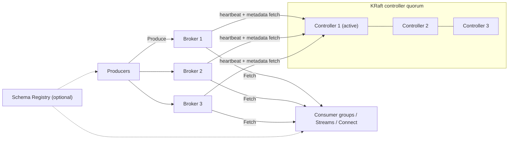
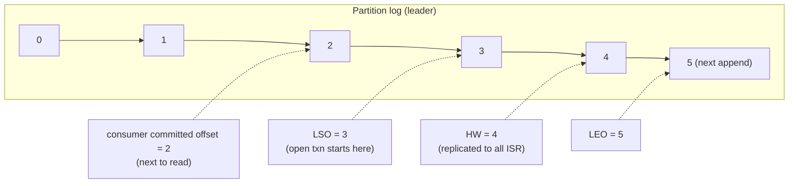
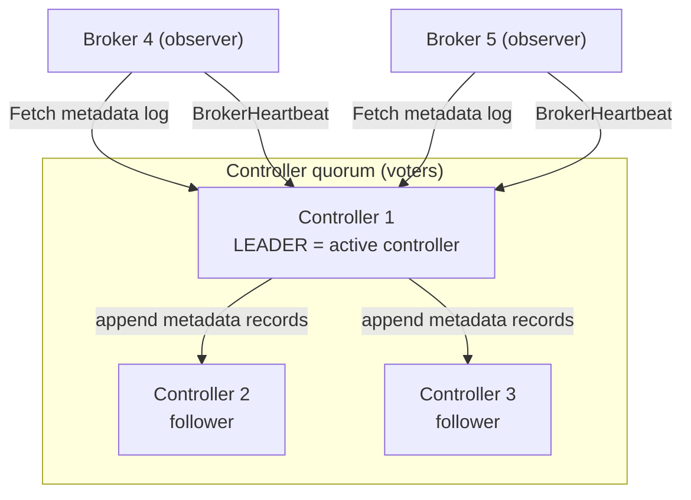
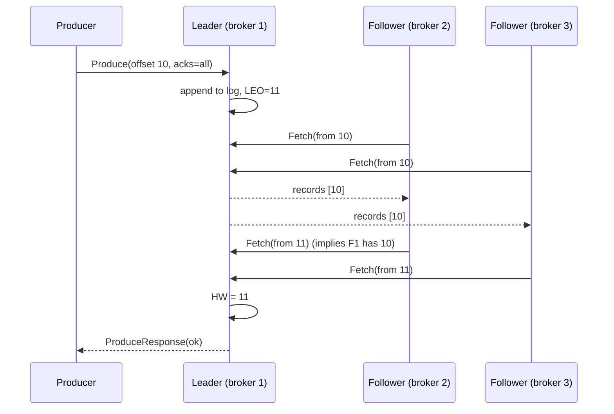
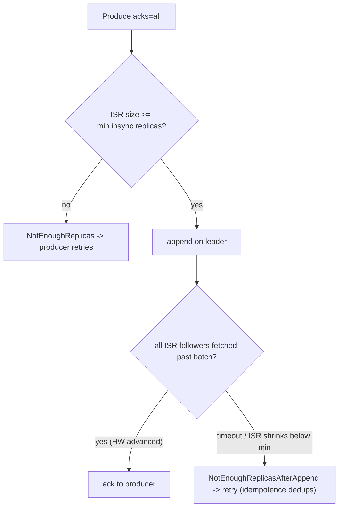
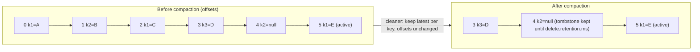
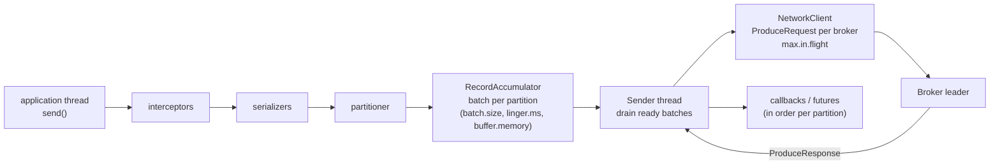
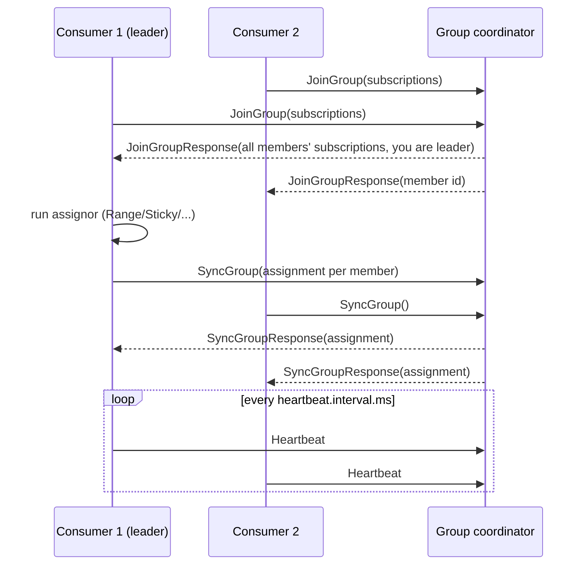
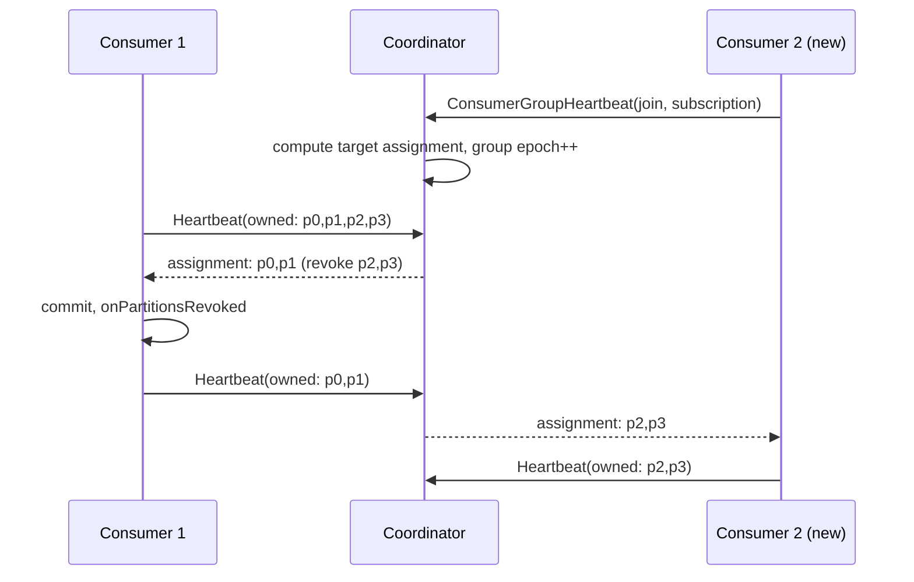
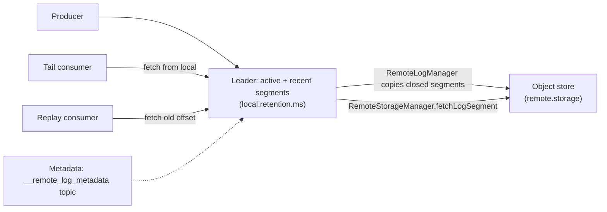

# Fundamentals Question Bank

**Roles:** [ARCH] [ADMIN] [DEV]   **Level:** Foundation to Advanced
**Baseline:** Apache Kafka 3.9 / 4.0, KRaft only. ZooKeeper is mentioned only where migration context matters.

This bank covers the concepts every Kafka role is expected to explain without notes: the log model, partitions and ordering,
brokers and the KRaft controller quorum, replication and durability, storage internals, producer and consumer internals,
delivery semantics, and the on-disk record format. Answers lead with the direct answer, then the mechanism, then the gotcha.
Difficulty is marked ★☆☆ (foundation), ★★☆ (intermediate), ★★★ (advanced). Use the follow-up probes to go one level deeper.

## Table of contents

| Topic | Questions |
|-------|-----------|
| Core concepts | Q1 – Q5 |
| Topics, partitions and offsets | Q6 – Q10 |
| Keys and ordering | Q11 – Q14 |
| Brokers | Q15 – Q17 |
| KRaft controller and quorum | Q18 – Q24 |
| Replication, ISR, high watermark, leader epoch | Q25 – Q32 |
| `acks` and `min.insync.replicas` | Q33 – Q36 |
| Retention and compaction | Q37 – Q41 |
| Storage internals and segments | Q42 – Q45 |
| Page cache and zero-copy | Q46 – Q47 |
| Producer internals | Q48 – Q53 |
| Consumer internals and group protocol | Q54 – Q60 |
| Delivery semantics | Q61 – Q63 |
| Kafka versus other brokers | Q64 – Q65 |
| Record format and compression | Q66 – Q67 |
| Timestamps | Q68 |
| Tiered storage basics | Q69 – Q70 |

---

## Core concepts

### Q1. What is Apache Kafka and what problem does it solve?
**Role:** [ARCH] | **Difficulty:** ★☆☆ | **Topic:** Core concepts

**Answer.**
Kafka is a distributed, replicated, append-only commit log exposed as topics, used as the backbone for event streaming between systems.
It solves the "N producers to M consumers" integration problem: producers write once, any number of independent consumer groups read
at their own pace, and data is retained for a configured period rather than deleted on delivery. Durability comes from partition
replication across brokers; scale comes from partitioning topics across brokers and consumers. Since 3.3 the KRaft metadata mode is
production-ready and since 4.0 ZooKeeper is removed entirely, so a cluster is only brokers and controllers.
Gotcha: Kafka is not a database and not a classic queue; it does not index by key for random reads and it does not track
per-message acknowledgements (consumers track their own position via committed offsets).

**Follow-up probes.** What does "log" mean here versus an application log? Why is retention decoupled from consumption?
What changed operationally when ZooKeeper was removed?

### Q2. What is the difference between an event log and a message queue?
**Role:** [ARCH] | **Difficulty:** ★☆☆ | **Topic:** Core concepts

**Answer.**
A queue deletes a message when one consumer acknowledges it; a log keeps every record in offset order until retention expires and
lets many readers replay it independently. In Kafka a "delivered" record is simply one whose offset a consumer group has committed,
so reprocessing is a matter of seeking backwards. Queues give per-message competing consumers and per-message acks; Kafka gives
per-partition exclusive ownership inside a group, which is what preserves ordering. Gotcha: parallelism in Kafka is bounded by the
partition count, not the consumer count. Kafka 4.0 adds share groups (KIP-932, early access) which offer queue-like per-record
acknowledgement on top of the same log, but the default consumer group model remains partition-based.

**Follow-up probes.** When would you still choose a queue broker? How do share groups change the ordering guarantee?

### Q3. Name the main components of a Kafka deployment on the 4.0 baseline.
**Role:** [ADMIN] | **Difficulty:** ★☆☆ | **Topic:** Core concepts

**Answer.**
Brokers (store partition replicas and serve produce/fetch), KRaft controllers (a Raft quorum that owns cluster metadata and elects
partition leaders), producers, consumers (organised in groups), and optionally Kafka Connect workers, Kafka Streams applications and
a schema registry. Each node's role is set by `process.roles=broker`, `controller`, or `broker,controller` (combined mode).



Gotcha: the controllers are not a data path component; a controller outage stops metadata changes (leader election, topic creation)
but existing leaders keep serving traffic.

**Follow-up probes.** What stops working if the whole controller quorum is down? Where do committed consumer offsets live?

### Q4. What guarantees does Kafka actually make?
**Role:** [DEV] | **Difficulty:** ★★☆ | **Topic:** Core concepts

**Answer.**
Kafka guarantees: (1) records sent by one producer to one partition are appended in send order (strict only with idempotence and
bounded `max.in.flight.requests.per.connection`); (2) a consumer reads a partition's records in offset order; (3) with replication
factor N the log tolerates N-1 broker failures without losing committed records, where "committed" means acknowledged by every
in-sync replica under `acks=all`; (4) consumers never see a record above the high watermark, so they never see data that could be
lost by leader failover. Kafka does not guarantee cross-partition ordering, global timestamps ordering, or delivery exactly once by
default; exactly-once requires idempotent producers plus transactions and `isolation.level=read_committed`.
Gotcha: "N-1 failures" assumes `min.insync.replicas` is set high enough; with `min.insync.replicas=1` a write can be acknowledged by
the leader alone and lost when it dies.

**Follow-up probes.** Which of these guarantees weaken with `acks=1`? What does "committed" mean for a record versus an offset?

### Q5. What does a Kafka record consist of?
**Role:** [DEV] | **Difficulty:** ★☆☆ | **Topic:** Core concepts

**Answer.**
A record is key (nullable bytes), value (nullable bytes), an ordered list of headers (string key, byte value), a timestamp, and the
broker-assigned offset plus partition after append. Key and value are opaque to the broker; serialization is a client concern
(`key.serializer`, `value.serializer`). The timestamp is either the producer's `CreateTime` or the broker's `LogAppendTime` depending
on `message.timestamp.type`. A null value on a compacted topic is a tombstone. Records are always stored and transmitted inside a
record batch (format v2), never individually, so the "size" of a record on disk is amortised across its batch.
Gotcha: headers are not compacted on or indexed; they are for metadata such as trace IDs, schema IDs, or retry counts.

**Follow-up probes.** Where does a schema ID live in the Confluent wire format? Why are headers preferable to key prefixes for metadata?

## Topics, partitions and offsets

### Q6. What is a topic, what is a partition, and why partition at all?
**Role:** [ARCH] | **Difficulty:** ★☆☆ | **Topic:** Topics and partitions

**Answer.**
A topic is a named category of records; a partition is one ordered, immutable, append-only log within that topic, and the topic is
the union of its partitions. Partitioning exists for two reasons: horizontal scale (partitions of one topic are spread across brokers
and disks, so throughput is not bounded by one machine) and consumer parallelism (each partition is owned by exactly one consumer
in a group). Ordering is guaranteed only within a partition. The count is set at creation (`--partitions`, or the broker default
`num.partitions=1`) and can only grow. Gotcha: more partitions means more open files, more replication fetch sessions, longer
controller failover and, on the producer, more batches per request; do not default to hundreds per topic without a reason.

**Follow-up probes.** What is the maximum useful consumer count for a 12-partition topic? What does the partition count cost the controller?

### Q7. Explain log-end offset, high watermark, committed offset and last stable offset.
**Role:** [DEV] | **Difficulty:** ★★☆ | **Topic:** Topics and partitions

**Answer.**
Log-end offset (LEO) is the next offset to be written on a replica; the high watermark (HW) is the highest offset replicated to all
in-sync replicas and is the upper bound of what consumers may read; the committed offset is a consumer group's stored position
(the next offset to read, not the last one read); the last stable offset (LSO) is the first offset of any open transaction, and
`read_committed` consumers cannot read past it.



Gotcha: consumer lag reported by `kafka-consumer-groups.sh --bootstrap-server localhost:9092 --describe --group g1` is
HW minus committed offset, so a stalled follower that holds the HW back shows up as lag even though the consumer is caught up.

**Follow-up probes.** Why does the HW lag the LEO by one round trip? What happens to the HW during leader failover?

### Q8. How do you choose the number of partitions for a new topic?
**Role:** [ARCH] | **Difficulty:** ★★★ | **Topic:** Topics and partitions

**Answer.**
Start from the larger of two numbers: target throughput divided by the per-partition throughput you measured for your record size
and `acks` setting, and the maximum consumer parallelism you will ever need in the slowest consuming group; then round up to a
number with useful divisors (12, 24, 30, 60) and leave headroom because you cannot shrink later. Per-partition throughput is
workload-specific; treat published figures (tens of MB/s per partition) as indicative only and run `kafka-producer-perf-test.sh`
against your cluster. Cap the total: on 3.x/4.0 KRaft a broker comfortably hosts a few thousand replicas and a cluster hundreds of
thousands of partitions, but every partition costs memory for producer batches (`batch.size` each), file handles, and controller
work on failover. Keyed topics that feed Streams joins must match the partition count of their join partner.
> **Anti-pattern:** creating one partition per tenant or per key; use key hashing and let partitions be a scaling unit, not an identity.

**Follow-up probes.** How does `batch.size` interact with partition count on the producer? What are the costs of over-partitioning
on the controller?

### Q9. Can you reduce the number of partitions? What happens when you add partitions?
**Role:** [ADMIN] | **Difficulty:** ★☆☆ | **Topic:** Topics and partitions

**Answer.**
No; Kafka never reduces partitions because it has no way to merge two ordered logs and keep offsets meaningful, so the only path is
to create a new topic and migrate. Adding partitions with `kafka-topics.sh --bootstrap-server localhost:9092 --alter --topic t
--partitions 24` is immediate but changes the key-to-partition mapping for all future records, so key ordering is broken across the
boundary and compacted topics can end up with the same key in two partitions. Existing data is not redistributed. Consumers pick
up the new partitions on the next metadata refresh (`metadata.max.age.ms`, default 5 min) and a rebalance follows.
Gotcha: Kafka Streams applications will refuse to start (`TopologyException` about partition mismatch) if a co-partitioned input
topic changes count.

**Follow-up probes.** How would you migrate a keyed topic to more partitions safely? Why does the producer keep sending to old
partitions for a while after the change?

### Q10. Does consuming a record delete it? How do retention and consumer position relate?
**Role:** [DEV] | **Difficulty:** ★☆☆ | **Topic:** Topics and partitions

**Answer.**
No; consumption never deletes data. Records are removed only by retention (`retention.ms`, `retention.bytes`) or compaction, whole
segments at a time, independent of whether any consumer has read them. A consumer group's committed offset is a bookmark stored in
`__consumer_offsets`; if the bookmark falls behind the log start offset because retention already deleted that data, the consumer
resets according to `auto.offset.reset` (`latest` by default, `earliest`, or `none` which throws `OffsetOutOfRangeException`).
Committed offsets themselves are expired by `offsets.retention.minutes` (default 7 days) once the group is empty.
Gotcha: a consumer that is down longer than the topic retention silently skips data with the default `auto.offset.reset=latest`;
alert on `records-lag-max` and on log start offset overtaking committed offsets.

**Follow-up probes.** What is the difference between `earliest` and "the offset the group last committed"? When are offsets for an
active group deleted?

## Keys and ordering

### Q11. How does a record's key determine its partition?
**Role:** [DEV] | **Difficulty:** ★☆☆ | **Topic:** Keys and ordering

**Answer.**
The default Java partitioner hashes the serialized key bytes with murmur2 and takes `toPositive(hash) % numPartitions`, so equal
keys always land on the same partition as long as the partition count does not change. Records with a null key are not hashed; since
3.3 (KIP-794) the built-in partitioner fills one batch per partition and then switches ("sticky"), and by default adapts to broker
speed (`partitioner.adaptive.partitioning.enable=true`). You can override the choice per record by passing an explicit partition to
`ProducerRecord`, or globally with `partitioner.class`. Gotcha: other clients hash differently (librdkafka defaults to
`consistent_random` which is crc32-based unless configured to `murmur2_random`), so mixed-language producers to one keyed topic
must align `partitioner` settings or ordering per key breaks.

**Follow-up probes.** What happens to the mapping when you add partitions? How would you make the Python and Java producers agree?

### Q12. What exactly is Kafka's ordering guarantee, and what breaks it?
**Role:** [DEV] | **Difficulty:** ★★☆ | **Topic:** Keys and ordering

**Answer.**
Ordering is per partition: records appended to one partition are read in append order by every consumer, and one producer's
records to that partition are appended in send order provided idempotence is on (`enable.idempotence=true`, the default since 3.0)
and `max.in.flight.requests.per.connection` is at most 5. Things that break the observed order: retries without idempotence with
in-flight greater than 1, changing the partition count, producing the same key from multiple producers without coordination,
consumer-side parallelism that processes records of one partition on several threads, and retry topics that re-deliver a record
after its successors. Nothing orders records across partitions; if you need global order you need one partition, and you accept
its throughput ceiling.

**Follow-up probes.** How does the idempotent producer preserve order across retries? How do you keep order while using a retry topic?

### Q13. Why does adding partitions break key ordering, and how do you mitigate it?
**Role:** [ARCH] | **Difficulty:** ★★☆ | **Topic:** Keys and ordering

**Answer.**
Because the partition is `hash(key) % n`, changing `n` moves most keys to a different partition; records for key K written before
the change sit in partition 3 and records after it in partition 17, and a consumer group has no way to order across them.
Mitigations: over-provision partitions at creation; drain the consumer (commit and stop) before altering, then restart so old and
new records are read in a known order; or create a new topic with the target count and copy with a Streams or MirrorMaker 2 job,
switching producers and consumers at a known offset. For compacted topics you must re-key into a fresh topic because compaction
never reconciles the same key in two partitions.

**Follow-up probes.** How does Streams detect the mismatch? What is the effect on a compacted changelog topic?

### Q14. A single key produces 40% of traffic. How do you handle a hot partition?
**Role:** [ARCH] | **Difficulty:** ★★★ | **Topic:** Keys and ordering

**Answer.**
First confirm it with per-partition metrics (`kafka.server:type=BrokerTopicMetrics,name=BytesInPerSec` has no per-partition split,
so use `kafka.log:type=Log,name=Size,topic=t,partition=p` deltas or `kafka-log-dirs.sh --bootstrap-server localhost:9092 --describe`).
Then decide whether ordering for that key is really required. If not, salt the key (`tenant42-<n>` with n from a small round-robin)
so its records spread across n partitions; consumers still get ordering within each salted sub-stream. If per-key order is required,
partition by a finer natural key (tenant + account) or move that tenant to a dedicated topic with its own partition budget. Never
fix a hot key by adding partitions; it changes every other key's mapping without helping the hot one.
> **Production tip:** put the salt in a header and the original key in the key so downstream re-keying is trivial.

**Follow-up probes.** How would a Streams aggregation over the salted key be re-combined? What does the hot partition do to
`ISR` shrink rates on its leader?

## Brokers

### Q15. What does a broker do, and what happens when one starts in KRaft mode?
**Role:** [ADMIN] | **Difficulty:** ★★☆ | **Topic:** Brokers

**Answer.**
A broker stores partition replicas in `log.dirs`, serves Produce and Fetch requests as leader, replicates as follower, hosts group
and transaction coordinators, and enforces quotas and ACLs. On startup in KRaft it reads `meta.properties` (cluster ID, node ID),
recovers logs, registers with the active controller (`BrokerRegistration`), then sends `BrokerHeartbeat` every
`broker.heartbeat.interval.ms` (2 s) while fetching the metadata log until it has caught up. Until it is caught up and marked
unfenced it is not eligible to lead partitions; it moves through fenced, then unfenced/active, and can be placed in controlled
shutdown on stop. A broker that misses heartbeats for `broker.session.timeout.ms` (9 s) is fenced and loses leadership.
Gotcha: the broker `node.id` and the `cluster.id` in `meta.properties` are permanent; a mismatch refuses startup.

**Follow-up probes.** What does "fenced" mean for a KRaft broker? What does `kafka-storage.sh format` write?

### Q16. Describe the broker request path: network threads, I/O threads and purgatory.
**Role:** [ADMIN] | **Difficulty:** ★★★ | **Topic:** Brokers

**Answer.**
A client connection is accepted by an acceptor and assigned to one of `num.network.threads` (default 3) processors per listener,
which read and write bytes only; complete requests are queued (`queued.max.requests=500`) for the `num.io.threads` (default 8)
request handlers that run the actual log append or read. Requests that cannot complete immediately, such as a Produce waiting for
`acks=all` or a Fetch waiting for `fetch.min.bytes`, are parked in a purgatory (a timing-wheel) and completed later by the
replication or timeout path, so I/O threads are not blocked. Health metrics: `NetworkProcessorAvgIdlePercent` and
`RequestHandlerAvgIdlePercent` (below about 0.3 means saturation), `RequestQueueSize`, and the per-request breakdown
`kafka.network:type=RequestMetrics,name=TotalTimeMs,request=Produce` split into queue, local, remote (purgatory) and response times.
Gotcha: high `RemoteTimeMs` on Produce is slow followers, not a slow broker.

**Follow-up probes.** Which time component grows when a follower is slow? When would you raise `num.io.threads` versus adding disks?

### Q17. What is rack awareness and what does `broker.rack` change?
**Role:** [ARCH] | **Difficulty:** ★☆☆ | **Topic:** Brokers

**Answer.**
`broker.rack` labels a broker with a failure domain (availability zone, rack); the controller then spreads the replicas of each
partition across racks when creating topics or reassigning, so losing one zone leaves at least one replica of every partition.
It also feeds follower fetching (`replica.selector.class=org.apache.kafka.common.replica.RackAwareReplicaSelector` plus
consumer `client.rack`) so consumers read from a local replica, and Streams rack-aware task assignment
(`rack.aware.assignment.strategy`). Rule: replication factor 3 with 3 racks and `min.insync.replicas=2`. Gotcha: rack-aware
placement applies at assignment time only; after manual reassignments or if racks are added later you must re-check with
`kafka-reassign-partitions.sh` or a balancer.

**Follow-up probes.** What happens to `acks=all` latency when replicas are in different zones? Does rack awareness apply to
the KRaft controller quorum?

## KRaft controller and quorum

### Q18. What is KRaft and why did Kafka replace ZooKeeper?
**Role:** [ADMIN] | **Difficulty:** ★☆☆ | **Topic:** KRaft

**Answer.**
KRaft (KIP-500) is Kafka's built-in Raft-based consensus for cluster metadata: a quorum of controller nodes replicates a single
metadata log (`__cluster_metadata`) and the leader of that quorum is the active controller. It replaced ZooKeeper to remove a
second distributed system to operate and secure, to make metadata changes ordered and replayable events instead of watches, and
to scale to far more partitions with much faster controller failover (the standby controllers already hold the full metadata in
memory). Timeline: early access 2.8, production-ready 3.3, ZooKeeper deprecated 3.5, migration tooling 3.6, ZooKeeper removed 4.0.
Gotcha: a 4.0 cluster cannot be started from ZooKeeper metadata; migrate on a 3.9 bridge release first.

**Follow-up probes.** What is the last version that can run the ZooKeeper-to-KRaft migration? How is the metadata log different
from a normal topic?

### Q19. Explain `process.roles`, the controller quorum and the active controller.
**Role:** [ADMIN] | **Difficulty:** ★★☆ | **Topic:** KRaft

**Answer.**
`process.roles` decides what a node is: `controller` nodes form the Raft quorum (voters), `broker` nodes serve data and act as
observers of the metadata log, and `broker,controller` does both (combined mode). Voters elect one leader via Raft; that leader is
the active controller and is the only node that writes metadata records (topic creation, ISR changes, leader elections). Followers
in the quorum replicate the log and can take over in a few hundred milliseconds because they already have the state in memory.
Brokers reach the quorum through `controller.quorum.bootstrap.servers` (3.9, dynamic quorum) or the static
`controller.quorum.voters=1@c1:9093,2@c2:9093,3@c3:9093`, over `controller.listener.names`.



Gotcha: `ActiveControllerCount` must sum to exactly 1 across the quorum; 0 for more than a few seconds means no leader elections
or topic changes are possible.

**Follow-up probes.** What is `controller.quorum.election.timeout.ms` and what happens when it fires? Why are brokers observers
and not voters?

### Q20. How does the metadata log work, and what are metadata snapshots?
**Role:** [ADMIN] | **Difficulty:** ★★☆ | **Topic:** KRaft

**Answer.**
All cluster state is a sequence of typed records (RegisterBroker, TopicRecord, PartitionChangeRecord, ConfigRecord, and so on) in
the single-partition `__cluster_metadata` log stored under `metadata.log.dir`. Every controller and broker replays it into an
in-memory image; brokers act on the delta (a new leader, a new config) as they replay. To bound replay time, nodes periodically
write a snapshot of the full image, controlled by `metadata.log.max.record.bytes.between.snapshots` (20 MB) and
`metadata.log.max.snapshot.interval.ms` (1 h), after which older log segments are deleted. A new or lagging node loads the latest
snapshot then fetches the tail. Inspect with `kafka-metadata-shell.sh --snapshot /var/kafka/meta/__cluster_metadata-0/<offset>.checkpoint`
or `kafka-dump-log.sh --cluster-metadata-decoder --files ...`.
Gotcha: unlike data logs, the metadata log is fsynced on every append on the controllers (`controller.quorum.fetch.timeout.ms`
tuning does not change that), so put `metadata.log.dir` on low-latency storage.

**Follow-up probes.** How is the metadata log different from a normal replicated topic? What does the `metadata-load-error-count`
metric indicate on a broker?

### Q21. How many controllers should a quorum have and how many failures does it tolerate?
**Role:** [ARCH] | **Difficulty:** ★★☆ | **Topic:** KRaft

**Answer.**
Three for most clusters, five for large or multi-zone deployments where you want to lose one node and still tolerate a second
during maintenance; a quorum of N voters tolerates floor((N-1)/2) failures, so 3 tolerates 1 and 5 tolerates 2. Even numbers add
cost without tolerance. Controllers need little CPU or disk but do need low-latency fsync, so isolated small nodes with SSD are
the norm above roughly a dozen brokers; combined mode is fine for small clusters and development. Losing quorum does not stop
producers and consumers on already-elected leaders; it stops leader election, so the next broker failure takes partitions offline.
Watch `kafka.server:type=raft-metrics,name=current-state`, `high-watermark` and `commit-latency-avg`.

**Follow-up probes.** Why is 4 not better than 3? What happens if a controller's disk fills up?

### Q22. How do brokers receive metadata updates in KRaft compared with the ZooKeeper era?
**Role:** [ADMIN] | **Difficulty:** ★★★ | **Topic:** KRaft

**Answer.**
In KRaft brokers pull: each broker continuously fetches the metadata log from the active controller (the same Fetch API used for
replication) and applies records in order, so a broker is never told "you are leader" by an RPC; it learns it by reading a
PartitionChangeRecord. In the ZooKeeper design the controller pushed `LeaderAndIsr`, `UpdateMetadata` and `StopReplica` RPCs to
every broker, which meant O(brokers × partitions) work on failover and lost updates on broker restarts. Pull-based replay gives
every broker the exact same ordered view, makes catch-up after restart a log fetch from its last applied offset, and means the
metadata a broker has is versioned by log offset (visible in `kafka-metadata-quorum.sh --bootstrap-server localhost:9092 describe
--replication` as each node's `LogEndOffset` and `Lag`). Gotcha: a broker lagging on metadata will fence itself for leadership but
keeps answering client `Metadata` requests with stale state until it catches up.

**Follow-up probes.** How does a broker know it should stop being leader after an ISR change? What is the role of the
broker's metadata offset in heartbeats?

### Q23. What did KIP-853 (dynamic quorum, Kafka 3.9) change about controller membership?
**Role:** [ADMIN] | **Difficulty:** ★★★ | **Topic:** KRaft

**Answer.**
Since 3.9 controllers can be added and removed at runtime instead of being fixed by `controller.quorum.voters`: format the new
controller with `kafka-storage.sh format --standalone` (first voter) or `--no-initial-controllers`, start it as an observer, then
run `kafka-metadata-quorum.sh --bootstrap-controller c1:9093 add-controller` and later `remove-controller --controller-id 3
--controller-directory-id <uuid>`. Every controller log directory now has a directory ID stored in `meta.properties`, so a
controller whose disk was replaced is recognised as a new replica rather than a stale voter. Clients and brokers point at
`controller.quorum.bootstrap.servers` and discover the voter set from the log itself (a VotersRecord). Requires
`kraft.version=1` (`kafka-features.sh --bootstrap-server localhost:9092 upgrade --feature kraft.version=1`).
Gotcha: mixing the static voters config and the dynamic bootstrap config in one cluster is rejected at startup.

**Follow-up probes.** Why did a directory ID become necessary? What is the procedure to replace a failed controller's disk on 3.8
versus 3.9?

### Q24. When would you run combined mode versus isolated controllers?
**Role:** [ARCH] | **Difficulty:** ★☆☆ | **Topic:** KRaft

**Answer.**
Combined mode (`process.roles=broker,controller`) is right for development, tests and small clusters (roughly up to 3–6 nodes)
where extra machines are not justified; isolated controllers are right for production clusters beyond that because a controller
sharing a JVM with a busy broker competes for GC, disk I/O and network threads, and a broker crash or rolling restart then also
takes a voter out. Isolated controllers can be small (2 CPU, 4 GB, SSD) and restart independently of data nodes. In both modes
the `controller.listener.names` listener must not be advertised to clients. Gotcha: in combined mode you cannot take a node out
of the quorum without also draining its partitions; that couples two very different maintenance procedures.

**Follow-up probes.** What happens to client connections if a combined-mode node loses quorum? How does rolling restart order
differ between the two modes?

## Replication, ISR, high watermark, leader epoch

### Q25. How does partition replication work?
**Role:** [DEV] | **Difficulty:** ★☆☆ | **Topic:** Replication

**Answer.**
Each partition has one leader replica and N-1 followers on other brokers (`replication.factor`, default topic-level from
`default.replication.factor=1` which you should raise to 3). All produce and consume traffic goes through the leader; followers run
replica fetcher threads that issue Fetch requests to the leader exactly like consumers do and append what they receive. The leader
advances the high watermark once every in-sync follower has fetched past an offset, and only then is the produce acknowledged under
`acks=all`.



Gotcha: the follower's next fetch position is what tells the leader the previous batch is safe, so replication latency is at least
one extra fetch round trip (`replica.fetch.wait.max.ms`, `replica.fetch.min.bytes`).

**Follow-up probes.** Why does the leader not push to followers? How many fetcher threads does a broker run
(`num.replica.fetchers`)?

### Q26. What is the ISR and how does a replica leave and rejoin it?
**Role:** [ADMIN] | **Difficulty:** ★★☆ | **Topic:** Replication

**Answer.**
The in-sync replica set is the leader plus every follower that has fetched up to the leader's log end within
`replica.lag.time.max.ms` (default 30 s). A follower that has not caught up to the LEO at least once in that window (slow disk,
GC pause, network) is removed from the ISR by the leader, which writes the change to the controller (an `AlterPartition` request);
it rejoins automatically when it catches up. Shrinks show as `kafka.server:type=ReplicaManager,name=IsrShrinksPerSec` and the
partition counts in `UnderReplicatedPartitions`; a partition whose ISR size drops below `min.insync.replicas` appears in
`UnderMinIsrPartitionCount` and rejects `acks=all` writes. Gotcha: ISR membership is about time, not message count; a follower
can be thousands of messages behind and still in sync if it caught up within the window.

**Follow-up probes.** Why did Kafka drop the old `replica.lag.max.messages`? What does a persistent ISR flap indicate?

### Q27. What is the high watermark and why can't consumers read beyond it?
**Role:** [DEV] | **Difficulty:** ★★☆ | **Topic:** Replication

**Answer.**
The high watermark is the largest offset known to be replicated on every ISR member; consumers (and followers for the purpose of
truncation) are only allowed to read below it because anything above might exist on the leader alone and be discarded if that
leader fails and a follower without it is elected. The leader computes the HW as the minimum LEO across the ISR and piggybacks the
value in fetch responses so followers learn it; the follower's own HW lags the leader's by one fetch. Under `acks=all` the produce
response is sent when the HW passes the batch. Gotcha: a shrinking ISR makes the HW jump forward (fewer replicas to wait for),
which is precisely why `min.insync.replicas` exists: without it an ISR of one turns `acks=all` into `acks=1`.

**Follow-up probes.** How is the HW exposed to a consumer? What is the relation between HW and `records-lag`?

### Q28. What is the leader epoch and what problem does it solve?
**Role:** [ADMIN] | **Difficulty:** ★★★ | **Topic:** Replication

**Answer.**
The leader epoch is a monotonically increasing integer bumped by the controller on every leader change and stamped into every
record batch (`partitionLeaderEpoch` in the batch header) and into the `leader-epoch-checkpoint` file of each replica. It replaces
HW-based truncation (KIP-101): when a follower starts following a new leader it sends `OffsetsForLeaderEpoch` with its last epoch,
the leader replies with the end offset of that epoch, and the follower truncates exactly to that point, no more and no less. Without
epochs, two failure sequences could lead to divergent logs that both replicas believed were committed, or to a follower truncating
below the HW and losing data. Epochs also let fetchers and consumers detect stale metadata (`FENCED_LEADER_EPOCH`,
`UNKNOWN_LEADER_EPOCH` errors, KIP-320) instead of reading from a zombie leader. Gotcha: the epoch is per partition, distinct from
the controller epoch and from the producer epoch used by idempotence.

**Follow-up probes.** Walk through the divergence scenario that KIP-101 fixes. How does a consumer use the epoch when it seeks?

### Q29. What is unclean leader election and when is it acceptable?
**Role:** [ARCH] | **Difficulty:** ★★☆ | **Topic:** Replication

**Answer.**
Unclean election lets the controller pick an out-of-sync replica as leader when no ISR member is alive, trading data loss (everything
the dead ISR had beyond the chosen replica) for availability. It is off by default (`unclean.leader.election.enable=false`, settable
per topic) and should stay off for anything financial, audit or exactly-once; it is acceptable for metrics, logs and caches where a
gap is cheaper than an outage. Trigger it manually and deliberately instead: `kafka-leader-election.sh --bootstrap-server
localhost:9092 --election-type unclean --topic t --partition 3`. Gotcha: after an unclean election the old leader, when it returns,
truncates its log to the new leader's epoch boundary, so the "lost" records are gone from every replica.

**Follow-up probes.** What alerts precede the need for an unclean election? How does KIP-966 ELR reduce the need for it?

### Q30. What is a preferred leader and why does leadership need rebalancing?
**Role:** [ADMIN] | **Difficulty:** ★★☆ | **Topic:** Replication

**Answer.**
The preferred leader is the first replica in the partition's assigned replica list; the controller spreads first replicas evenly
so leadership (and therefore client load) is balanced when every preferred replica leads. After broker restarts leadership piles up
on the survivors, so the controller runs periodic preferred election when `auto.leader.rebalance.enable=true` (default),
checked every `leader.imbalance.check.interval.seconds` (300) once a broker's imbalance exceeds
`leader.imbalance.per.broker.percentage` (10). Force it with `kafka-leader-election.sh --bootstrap-server localhost:9092
--election-type preferred --all-topic-partitions`. Watch `kafka.controller:type=KafkaController,name=PreferredReplicaImbalanceCount`.
Gotcha: preferred election only succeeds if the preferred replica is in the ISR; a broker that came back and is still catching up
will not take leadership until it is in sync.

**Follow-up probes.** Why can a burst of preferred elections cause a latency blip for clients? What does a reassignment do to the
preferred leader?

### Q31. What is follower fetching (KIP-392) and when should you enable it?
**Role:** [ARCH] | **Difficulty:** ★★☆ | **Topic:** Replication

**Answer.**
Follower fetching lets a consumer read from an in-sync follower in its own rack instead of the leader, cutting cross-zone egress
cost and latency. Enable it on the broker with `replica.selector.class=org.apache.kafka.common.replica.RackAwareReplicaSelector`
and set `broker.rack`, and on the consumer set `client.rack=<zone>`; the leader answers the first fetch with a
`PreferredReadReplica` and the consumer switches. Producers always write to the leader. Reads from a follower are bounded by the
follower's HW, so end-to-end latency rises by one replication round trip, and a follower falling out of the ISR pushes the consumer
back to the leader. Gotcha: `records-lag` on the consumer is measured against the follower's HW, so it can read lower than the true lag
against the leader.

**Follow-up probes.** Does follower fetching apply to Kafka Streams and Connect? How does it affect `read_committed` consumers?

### Q32. What are Eligible Leader Replicas (KIP-966) and what do they fix?
**Role:** [ARCH] | **Difficulty:** ★★★ | **Topic:** Replication

**Answer.**
ELR adds a second controller-tracked set next to the ISR: replicas that dropped out of the ISR after the ISR had already shrunk to
`min.insync.replicas`, and which therefore still hold every committed record. If the last ISR member dies, the controller can elect
an ELR member as a clean leader instead of forcing an unclean election or leaving the partition offline. The fix targets a real gap:
with `min.insync.replicas=2`, once the ISR shrinks to one replica, that replica alone holds the HW and its loss meant unavailability
or data loss. Introduced as a preview in 4.0 behind the `eligible.leader.replicas.version` feature flag
(`kafka-features.sh --bootstrap-server localhost:9092 upgrade --feature eligible.leader.replicas.version=1`); check your exact
release notes before relying on it in production. Gotcha: ELR also changes the semantics of `min.insync.replicas` so it is enforced
during leader election, not only on produce.

**Follow-up probes.** Why could a replica outside the ISR still be safe to elect? What is the "last known ELR" used for?

## `acks` and `min.insync.replicas`

### Q33. Explain `acks=0`, `acks=1` and `acks=all`.
**Role:** [DEV] | **Difficulty:** ★☆☆ | **Topic:** acks

**Answer.**
`acks=0`: the producer does not wait for any response; fastest, and a broker crash or full socket buffer loses records silently.
`acks=1`: the leader acknowledges after appending to its own log; a leader crash before followers fetch loses the record.
`acks=all` (`-1`, the default since 3.0 together with idempotence): the leader acknowledges after every in-sync replica has the
record, so durability equals the ISR size, bounded from below by `min.insync.replicas`. Latency ordering is 0 < 1 < all, but with
`linger.ms` and batching the throughput difference at `acks=all` is usually small compared with the durability gain.
Gotcha: `acks=all` with `min.insync.replicas=1` still lets a lone leader acknowledge; the two settings only give durability together.

**Follow-up probes.** Which setting does the idempotent producer require? What does `acks=all` mean when the ISR has one member?

### Q34. How do `acks=all` and `min.insync.replicas` work together?
**Role:** [ADMIN] | **Difficulty:** ★★☆ | **Topic:** acks

**Answer.**
`min.insync.replicas` (broker default 1, set per topic) is the minimum ISR size the leader requires before accepting an `acks=all`
produce; if the ISR is smaller the leader rejects with `NotEnoughReplicasException` (or `NotEnoughReplicasAfterAppendException` if
it shrank mid-write) and the producer retries until `delivery.timeout.ms`. It does not affect `acks=0/1` writes or reads.



Standard: RF=3, `min.insync.replicas=2`, so one broker can be down for maintenance and writes continue with two copies.
Gotcha: setting `min.insync.replicas=3` with RF=3 makes any single broker restart a write outage.

**Follow-up probes.** Why is the retry after `NotEnoughReplicasAfterAppend` safe? How do you audit topics whose
`min.insync.replicas` is below policy?

### Q35. Why is RF=3 with `min.insync.replicas=2` the standard, and what happens when the ISR drops to 1?
**Role:** [ARCH] | **Difficulty:** ★★☆ | **Topic:** acks

**Answer.**
Because it is the smallest configuration that survives one planned outage plus one unplanned failure without losing acknowledged
data: writes are always on two brokers, and a third copy is available to rebuild. When the ISR drops to one, `acks=all` producers
receive `NotEnoughReplicasException` and block (they retry until `delivery.timeout.ms`, 120 s by default) while `acks=1` producers
and all consumers continue; the partition is listed in `UnderMinIsrPartitionCount` and you have lost write availability but not
data. The fix is to restore a follower (restart the broker, or reassign the replica elsewhere), not to lower
`min.insync.replicas`. RF=4/min.isr=2 or RF=5/min.isr=3 are used for stretched clusters where a zone can vanish.
> **Production tip:** alert on `UnderMinIsrPartitionCount > 0` for more than a minute; it is the leading indicator of an
imminent write outage.

**Follow-up probes.** Why is RF=2 with `min.insync.replicas=2` worse than RF=3 with 1? How does this interact with
`replica.lag.time.max.ms`?

### Q36. Does `acks=all` guarantee the record is on disk?
**Role:** [ADMIN] | **Difficulty:** ★★★ | **Topic:** acks

**Answer.**
No; `acks=all` guarantees the record is in the page cache of every ISR replica, not that any of them has called fsync. Kafka relies
on replication for durability and on the OS to flush dirty pages in the background; `log.flush.interval.messages` and
`log.flush.interval.ms` default to effectively never, and forcing them costs a lot of throughput. The failure that loses acknowledged
data is therefore simultaneous power loss of every ISR replica before the OS flushed, which rack- and zone-aware placement is meant
to make improbable. On recovery a broker rebuilds from the recovery point checkpoint (`recovery-point-offset-checkpoint`) and
re-validates CRCs of unflushed segments. Note the contrast with the KRaft metadata log, which is fsynced on every append because a
lost metadata record cannot be recovered by re-replication. Gotcha: cloud block storage that acknowledges writes before they are
durable makes the same trade-off one layer down; check the volume's durability guarantee.

**Follow-up probes.** What does `log.flush.offset.checkpoint.interval.ms` control? How does Redpanda differ on this point?

## Retention and compaction

### Q37. How does time and size retention work, and at what granularity?
**Role:** [ADMIN] | **Difficulty:** ★☆☆ | **Topic:** Retention

**Answer.**
Retention deletes whole segments, never individual records: a segment is eligible when its largest timestamp is older than
`retention.ms` (default 7 days) or when the partition size exceeds `retention.bytes` (default -1, unlimited, and it is per
partition, not per topic), and only closed segments are deleted, so the active segment is always kept. The log cleaner thread checks
every `log.retention.check.interval.ms` (5 min). Because the active segment rolls only when it hits `segment.bytes` (1 GiB) or
`segment.ms` (7 days), a low-traffic topic can keep data far longer than `retention.ms`. Set `retention.ms=-1` to keep forever.
Gotcha: retention uses the segment's max timestamp, so a producer sending a far-future `CreateTime` pins the segment; since 3.6
`message.timestamp.after.max.ms` (default 1 hour since 4.0) rejects such records.

**Follow-up probes.** Why is `retention.bytes` confusing for topics with many partitions? How do you force fast deletion for a test?

### Q38. What is log compaction and how does the cleaner work?
**Role:** [DEV] | **Difficulty:** ★★☆ | **Topic:** Compaction

**Answer.**
Compaction (`cleanup.policy=compact`) keeps at least the latest record for every key, giving a topic that behaves like a changelog
or a snapshot of a table, used by `__consumer_offsets`, Streams changelogs and Connect config topics. The cleaner
(`log.cleaner.threads`) builds an offset map of key to latest offset from the "dirty" tail (memory bounded by
`log.cleaner.dedupe.buffer.size`), then rewrites the older "clean" segments copying only records whose offset matches the map.



Offsets are preserved (gaps appear), the active segment is never cleaned, and a partition is chosen for cleaning when its dirty
ratio exceeds `min.cleanable.dirty.ratio` (0.5). Gotcha: compaction is per partition, so keys must be consistently partitioned or
old values survive in another partition.

**Follow-up probes.** What happens if the key set does not fit in the dedupe buffer? Why is compaction not a substitute for a database?

### Q39. What is a tombstone and what does `delete.retention.ms` control?
**Role:** [DEV] | **Difficulty:** ★☆☆ | **Topic:** Compaction

**Answer.**
A tombstone is a record with a key and a null value on a compacted topic; it tells compaction to drop all earlier values for that
key and tells consumers the key was deleted. The tombstone itself is kept for `delete.retention.ms` (default 24 h) after the
segment is cleaned so that a consumer that was offline still sees the deletion before the tombstone is removed; after that the
key disappears entirely. Debezium and Streams `KTable` deletes emit tombstones, and the Streams `KTable` treats a null value as a
delete. Gotcha: a consumer that lags more than `delete.retention.ms` can miss the delete and keep a stale key in its local state;
size the value against your longest realistic consumer outage.

**Follow-up probes.** How does a Streams state store restore handle tombstones? What is the difference between a tombstone and an
empty-string value?

### Q40. Explain `min.compaction.lag.ms`, `max.compaction.lag.ms` and `min.cleanable.dirty.ratio`.
**Role:** [ADMIN] | **Difficulty:** ★★★ | **Topic:** Compaction

**Answer.**
`min.cleanable.dirty.ratio` (0.5) is the fraction of uncleaned bytes that must accumulate before a partition is eligible, trading
I/O amplification for space; `min.compaction.lag.ms` (0) guarantees a record stays uncompacted for at least that long, which lets
consumers observe every intermediate value for a window; `max.compaction.lag.ms` (Long.MAX) forces the log to be cleaned once the
oldest dirty record is that old, even if the dirty ratio is low, which is how you satisfy "delete within N days" obligations on
low-traffic compacted topics. The cleaner still never touches the active segment, so pair `max.compaction.lag.ms` with a matching
`segment.ms` or the guarantee is not met. Metrics: `kafka.log:type=LogCleaner,name=max-dirty-percent`,
`uncleanable-partitions-count` and `max-clean-time-secs`; a stuck cleaner thread (often a corrupt segment) shows as growing
dirty percent. Gotcha: compaction is throttled by `log.cleaner.io.max.bytes.per.second`; on large changelogs it can take hours.

**Follow-up probes.** Which setting would you use to meet a right-to-erasure deadline? How do you recover a partition marked
uncleanable?

### Q41. When would you use `cleanup.policy=compact,delete`?
**Role:** [ARCH] | **Difficulty:** ★★☆ | **Topic:** Compaction

**Answer.**
When you need "latest value per key" but only for keys touched in the last N days, for example a session or presence store where
stale keys must expire without a tombstone from the producer. With both policies the cleaner compacts and the retention thread also
deletes segments older than `retention.ms`, so old keys vanish with their segment. Streams uses this for windowed state store
changelogs (retention is the window retention plus grace). Gotcha: retention deletes whole segments by max timestamp, so a key that
was updated recently in a segment still shared with old keys keeps those old keys alive until the segment rolls; and a key whose
only value sits in an expired segment is silently lost even if it is "current" to your application.

**Follow-up probes.** How does Streams size retention for a windowed changelog? What is the risk of `compact,delete` for a
KTable source topic?

## Storage internals and segments

### Q42. What files make up a partition on disk?
**Role:** [ADMIN] | **Difficulty:** ★☆☆ | **Topic:** Storage

**Answer.**
Under `log.dirs/<topic>-<partition>/` each segment is named by its base offset and consists of:

```
00000000000000000000.log        record batches (the data)
00000000000000000000.index      sparse offset -> file position (every log.index.interval.bytes = 4 KiB)
00000000000000000000.timeindex  sparse timestamp -> offset
00000000000000000000.txnindex   aborted transactions (only if transactions were used)
00000000000000012345.snapshot   producer state (PID/epoch/sequence) at segment roll
leader-epoch-checkpoint         epoch -> start offset history
partition.metadata              topic ID
```

Segment files are preallocated when `log.preallocate=true`, indexes are memory-mapped and sized by `segment.index.bytes`
(10 MiB). Gotcha: the index is sparse, so a fetch does a binary search in the index and then a short linear scan in the `.log`;
`log.index.interval.bytes` trades index size for scan length.

**Follow-up probes.** What is in `recovery-point-offset-checkpoint` and `replication-offset-checkpoint` at the log dir root?
Why is `partition.metadata` needed since 2.8?

### Q43. How does the broker locate offset X inside a partition for a fetch?
**Role:** [DEV] | **Difficulty:** ★★☆ | **Topic:** Storage

**Answer.**
It finds the segment by binary search over the sorted segment base offsets in memory (the segment whose base offset is the largest
one not greater than X), then binary-searches that segment's `.index` for the largest indexed offset not greater than X to get a
byte position, and scans forward from that position in the `.log` until it reaches the batch containing X. The response is then
served from that byte position as a contiguous range up to `max.partition.fetch.bytes` (consumer) or `replica.fetch.max.bytes`,
ideally via zero-copy. Time-based lookups (`offsetsForTimes`, `--to-datetime` resets) use the `.timeindex` the same way and then
scan to the first record with timestamp >= target. Gotcha: because scans start at a batch boundary, a fetch can return a batch whose
first records precede the requested offset; the consumer client filters them out.

**Follow-up probes.** Why are index files memory-mapped? What does a fetch from a tiered (remote) segment look like?

### Q44. When does a segment roll and what happens during log recovery?
**Role:** [ADMIN] | **Difficulty:** ★★★ | **Topic:** Storage

**Answer.**
A new segment is started when the active one reaches `segment.bytes`, when `segment.ms` since the first record's timestamp has
elapsed (`segment.jitter.ms` staggers the roll), when its index or time index is full, or when an offset or timestamp delta would
overflow the 32-bit relative fields. Rolling closes the old segment, flushes its indexes and writes a producer state `.snapshot`.
On startup after an unclean shutdown (no clean `.kafka_cleanshutdown` marker) the broker recovers every segment beyond the
`recovery-point-offset-checkpoint`: it re-reads batches, validates CRCs, truncates at the first corrupt batch, and rebuilds indexes
and producer state, using `num.recovery.threads.per.data.dir` (default 2 since 4.0) threads. Recovery time scales with unflushed
bytes and partition count, which is why controlled shutdown matters. Gotcha: a full disk during a roll leaves a zero-length
segment that some versions treat as corrupt; free space alerts must fire well before 100%.

**Follow-up probes.** How does the producer state snapshot shorten recovery? What is `log.flush.offset.checkpoint.interval.ms`?

### Q45. What is the producer state snapshot and why does the broker keep it?
**Role:** [DEV] | **Difficulty:** ★★★ | **Topic:** Storage

**Answer.**
It is a per-partition map from producer ID to (producer epoch, last sequence numbers, last offset, open transaction) that the
broker needs to implement idempotence and transactions: on each write it checks the incoming batch's sequence against the map to
detect duplicates (returns the original offset, KIP-360) or gaps (`OutOfOrderSequenceException`). The map is checkpointed to a
`.snapshot` file at each segment roll and on shutdown so that after restart, or after a follower becomes leader, the state can be
rebuilt from the latest snapshot plus a replay of the tail instead of the whole log. Entries expire after
`producer.id.expiration.ms` (7 days) of inactivity; a producer whose state expired and that then sends a low sequence gets
`UnknownProducerIdException` handled by the client by bumping its epoch. Gotcha: many short-lived producers (one per request in a
web tier) blow up this map and the `.snapshot` files; reuse producers.

**Follow-up probes.** How is the producer ID allocated and what is `InitProducerId`? What changed in 3.x for expired producer
IDs with transactions?

## Page cache and zero-copy

### Q46. Why does Kafka rely on the OS page cache instead of an in-process cache?
**Role:** [ADMIN] | **Difficulty:** ★★☆ | **Topic:** Page cache

**Answer.**
Because a sequential log written once and read soon after by several consumers is exactly the access pattern the page cache serves
best, and keeping data outside the JVM heap avoids duplicating bytes, GC pressure and the double-copy through the heap on every
read. Writes go to the page cache and are flushed asynchronously; reads by tail-following consumers are served from the cache
without touching disk. This is why the broker heap is kept small (6–8 GB typical) and the rest of the machine's RAM is left free,
and why a lagging consumer that forces disk reads can evict hot pages and slow everyone. Watch `kafka.server:type=BrokerTopicMetrics,
name=BytesOutPerSec` against disk read throughput to spot cache misses, and keep `vm.dirty_background_ratio` moderate.
Gotcha: a broker restart loses the page cache, so a freshly restarted broker taking leadership serves cold reads until it warms up.

**Follow-up probes.** How does tiered storage interact with the page cache? What is the effect of running other memory-hungry
processes on a broker host?

### Q47. What is zero-copy in Kafka and when does it not apply?
**Role:** [ADMIN] | **Difficulty:** ★★☆ | **Topic:** Page cache

**Answer.**
Zero-copy means the broker serves a fetch by asking the kernel to send a byte range of the segment file straight from the page
cache to the socket (`FileChannel.transferTo`, the `sendfile` system call), without copying into user space; because producers,
followers and consumers all use the same batch format on the wire and on disk, no re-encoding is needed. It does not apply when
the broker has to touch the bytes: TLS listeners (the JVM encrypts in user space, so SSL clusters pay a copy and some CPU), message
format down-conversion for very old clients (removed in 4.0 with formats v0/v1), and compressed batches that need recompression
because topic `compression.type` differs from the producer's. Gotcha: since TLS is now standard, most production clusters no
longer get zero-copy; kernel TLS is not used by the JVM, so budget CPU for it.

**Follow-up probes.** Why is `compression.type=producer` the right broker default? How would you measure the cost of TLS on a
broker?

## Producer internals

### Q48. Walk through what happens inside `KafkaProducer.send()`.
**Role:** [DEV] | **Difficulty:** ★★☆ | **Topic:** Producer internals

**Answer.**
`send()` is asynchronous: it runs interceptors, serializes key and value, chooses a partition, and appends the record to a
per-partition batch in the `RecordAccumulator` (bounded by `buffer.memory`, blocking up to `max.block.ms` when full), then returns
a `Future`. A single background Sender thread drains ready batches, groups them per broker into a `ProduceRequest`, sends up to
`max.in.flight.requests.per.connection` per broker, and completes futures and callbacks when responses arrive.



Callbacks run on the Sender thread, so they must be fast and never call `send()` synchronously in a loop or block.
Gotcha: a metadata fetch for an unknown topic happens inside `send()` and blocks the caller up to `max.block.ms`.

**Follow-up probes.** What makes a batch "ready"? Where does compression happen?

### Q49. What is the relationship between `batch.size` and `linger.ms`?
**Role:** [DEV] | **Difficulty:** ★☆☆ | **Topic:** Producer internals

**Answer.**
A batch is sent when it is full (`batch.size`, 16 KiB default) or when `linger.ms` has elapsed since its first record, whichever
comes first; `linger.ms` is therefore the maximum artificial delay you add to gain batching, and `batch.size` the ceiling on how
much that delay can buy. Default `linger.ms` was 0 through 3.9 and is 5 ms since 4.0 (KIP-1030). A batch also ships early whenever
the Sender has another ready batch for the same broker. Larger batches improve compression ratio and reduce request count; on the
producer watch `batch-size-avg`, `records-per-request-avg` and `record-queue-time-avg` (time in the accumulator). Gotcha:
`batch.size` is per partition, so a producer writing to 1,000 partitions with a 1 MiB batch size needs a `buffer.memory`
budget to match.

**Follow-up probes.** Why can a low `batch.size` throttle throughput even with a high `linger.ms`? How does `max.request.size`
bound a batch?

### Q50. How does the idempotent producer work?
**Role:** [DEV] | **Difficulty:** ★★☆ | **Topic:** Producer internals

**Answer.**
On startup the producer obtains a producer ID (PID) and epoch from a broker (`InitProducerId`); every batch carries the PID, epoch
and a per-partition sequence number starting at 0. The leader keeps the last sequence per PID per partition (the producer state,
Q45) and accepts a batch only if its sequence is exactly last+1: a duplicate (retry of an already-appended batch) is acknowledged
without a second append, and a gap is rejected with `OutOfOrderSequenceException`. This gives exactly-once per producer session
per partition and, with `max.in.flight.requests.per.connection` up to 5, preserves ordering across retries because the broker
re-orders by sequence. It has been the default since 3.0 (`enable.idempotence=true`, which forces `acks=all` and `retries` > 0).
Gotcha: idempotence does not survive a producer restart (new PID) and does not span partitions or topics; that is what
transactions add.

**Follow-up probes.** Which errors are fatal for an idempotent producer? What does the broker do when the PID is unknown
(KIP-360)?

### Q51. How does `max.in.flight.requests.per.connection` affect ordering and throughput?
**Role:** [DEV] | **Difficulty:** ★★☆ | **Topic:** Producer internals

**Answer.**
It is the number of unacknowledged produce requests the Sender may have outstanding to one broker (default 5). Higher values
pipeline requests and hide latency; without idempotence, any value above 1 can reorder records because a failed request is
retried after later requests already succeeded. With `enable.idempotence=true` the broker uses sequence numbers to keep order
for up to 5 in-flight batches per partition, so 5 is both the default and the maximum allowed; configuring more with idempotence
throws `ConfigException`. Setting it to 1 is no longer needed for ordering and costs throughput on high-latency links.
Gotcha: the limit is per connection (broker), not per partition; a broker leading 200 of your partitions shares the same window.

**Follow-up probes.** Why is the limit exactly 5 with idempotence? How does `linger.ms` interact with a saturated in-flight window?

### Q52. Describe the default partitioner behaviour since Kafka 3.3 and the adaptive option.
**Role:** [DEV] | **Difficulty:** ★★★ | **Topic:** Producer internals

**Answer.**
Since 3.3 (KIP-794) there is no `partitioner.class` set by default; the built-in logic hashes keyed records with murmur2 and, for
null keys, uses a "uniform sticky" strategy that fills one batch (`batch.size` bytes, or `linger.ms`) for a partition before
moving to the next, which keeps batches large without the old behaviour of switching partition on every batch flush regardless
of size. With `partitioner.adaptive.partitioning.enable=true` (default) the choice of next partition is weighted by broker
responsiveness measured from queue sizes, so a slow broker receives fewer records; `partitioner.availability.timeout.ms` (0,
disabled) can exclude a broker whose batches have waited longer than that. `partitioner.ignore.keys=true` applies sticky
distribution even to keyed records. The old `DefaultPartitioner` and `UniformStickyPartitioner` classes are deprecated because
they suffer from the "switch on every flush" skew. Gotcha: adaptive partitioning changes the record distribution over time, so do
not rely on null-key records being evenly spread per partition in tests.

**Follow-up probes.** Why did `UniformStickyPartitioner` produce uneven partitions under `linger.ms=0`? When would you set
`partitioner.ignore.keys`?

### Q53. Explain `delivery.timeout.ms`, `request.timeout.ms`, `retries` and `retry.backoff.ms`.
**Role:** [DEV] | **Difficulty:** ★★★ | **Topic:** Producer internals

**Answer.**
`delivery.timeout.ms` (120 s) is the total budget from `send()` returning until the record must be acknowledged or fail; it covers
time in the accumulator, in flight, and all retries, and must be at least `linger.ms + request.timeout.ms`. `request.timeout.ms`
(30 s) bounds one request on the wire before the client gives up on it and retries (to a possibly new leader). `retries` defaults
to `Integer.MAX_VALUE` and is effectively unused: the delivery timeout is the real limit. Retries are spaced by `retry.backoff.ms`
(100 ms) with exponential growth to `retry.backoff.max.ms` (1 s, KIP-580 since 3.7). The callback receives `TimeoutException` when
the delivery budget expires; watch `record-error-rate` and `record-retry-rate`. Gotcha: a long `delivery.timeout.ms` plus a full
`buffer.memory` means `send()` blocks the caller for `max.block.ms` (60 s) during a broker outage; size the buffer and the
timeout together with your caller's latency budget.

**Follow-up probes.** Which timeout fires when the leader is unavailable but the connection is healthy? Why should
`delivery.timeout.ms` be shorter than a Streams `max.poll.interval.ms`?

## Consumer internals and group protocol

### Q54. What is a consumer group and how are partitions shared within it?
**Role:** [DEV] | **Difficulty:** ★☆☆ | **Topic:** Consumer internals

**Answer.**
A consumer group (`group.id`) is a set of consumers that jointly read a topic with each partition assigned to exactly one member at
a time; the group as a whole reads every record once, and different groups read independently. Members beyond the partition count
sit idle. When a member joins, leaves or fails, or when partitions are added, the group rebalances and partitions are reassigned.
Each group stores its committed offsets in `__consumer_offsets` under the coordinator broker. A consumer that calls
`assign()` instead of `subscribe()` uses no group coordination and no rebalancing, though it can still commit offsets under a
`group.id`. Gotcha: two unrelated applications accidentally sharing a `group.id` split the data between them; make the group ID
the application's identity.

**Follow-up probes.** What is the maximum useful group size? What happens to committed offsets if the group is deleted?

### Q55. What is the group coordinator and how are offsets stored?
**Role:** [ADMIN] | **Difficulty:** ★★☆ | **Topic:** Consumer internals

**Answer.**
Every group hashes (`group.id` hash modulo `offsets.topic.num.partitions`, default 50) to one partition of the compacted internal
topic `__consumer_offsets`, and the leader of that partition is the group's coordinator, found by the client via `FindCoordinator`.
The coordinator runs the rebalance protocol, tracks heartbeats, and turns `OffsetCommit` requests into records keyed
(group, topic, partition) so compaction keeps the latest committed offset; it serves `OffsetFetch` from an in-memory cache loaded
from that partition. Offsets of an empty group expire after `offsets.retention.minutes` (7 days). The topic must be created with
`offsets.topic.replication.factor=3` (the default) before the first group appears; a lower value is a durability bug. Gotcha: a
coordinator partition leader change forces every group on it to rediscover the coordinator and can trigger rebalances cluster-wide.

**Follow-up probes.** Why is `__consumer_offsets` compacted? What does a "group load" mean on coordinator failover?

### Q56. Walk through a rebalance under the classic protocol.
**Role:** [DEV] | **Difficulty:** ★★☆ | **Topic:** Consumer internals

**Answer.**
The classic protocol (`group.protocol=classic`) is client-driven: the coordinator only collects and distributes bytes; one member,
the group leader, runs the assignor.



A rebalance is triggered by a join or leave, a missed `session.timeout.ms` (45 s), a `max.poll.interval.ms` (5 min) violation, or a
subscription/metadata change. Gotcha: with eager assignors every member revokes all partitions between JoinGroup and SyncGroup,
so the whole group stops consuming (stop-the-world).

**Follow-up probes.** What is the generation ID for? What does the `rebalance.timeout` map to in client configs?

### Q57. What is the difference between eager and cooperative (incremental) rebalancing?
**Role:** [DEV] | **Difficulty:** ★★☆ | **Topic:** Consumer internals

**Answer.**
Eager rebalancing (`RangeAssignor`, `RoundRobinAssignor`, `StickyAssignor`) makes every member give up all its partitions at the
start of a rebalance and receive a full assignment at the end, so consumption pauses for everyone. Cooperative rebalancing
(`CooperativeStickyAssignor`, KIP-429, since 2.4) performs two rounds: the first only revokes the partitions that must move, the
second assigns them, and members keep consuming the partitions they retain throughout. It requires all members to use a
cooperative assignor; the migration path is to list both (`partition.assignment.strategy=CooperativeStickyAssignor,RangeAssignor`)
through one rolling restart, then drop the eager one. In your `ConsumerRebalanceListener`, `onPartitionsRevoked` now receives only
the moved partitions and `onPartitionsAssigned` only the new ones. Gotcha: mixing eager and cooperative members in one group
fails the rebalance with an `IllegalStateException` on the leader.

**Follow-up probes.** Why are two rounds needed? Which is the default assignor list in 3.x?

### Q58. Compare the built-in partition assignors.
**Role:** [DEV] | **Difficulty:** ★★☆ | **Topic:** Consumer internals

**Answer.**
| Assignor | Strategy | Stickiness | Protocol | Use |
|----------|----------|------------|----------|-----|
| `RangeAssignor` (default first) | per topic, contiguous ranges to members sorted by ID | none | eager | co-partitioned joins (same partition numbers to same member) |
| `RoundRobinAssignor` | all partitions of all topics dealt round-robin | none | eager | even spread across topics |
| `StickyAssignor` | balanced, minimises movement | yes | eager | fewer state rebuilds, still stop-the-world |
| `CooperativeStickyAssignor` | as sticky | yes | cooperative | recommended for most groups |

Range assignment is uneven when members subscribe to many topics with few partitions (the first members get one extra of each
topic). The 3.x default `partition.assignment.strategy` is `[RangeAssignor, CooperativeStickyAssignor]`, meaning range is used
unless the group votes cooperative. Under KIP-848 the client-side assignor is replaced by the server-side `uniform` (default) and
`range` assignors selected with `group.remote.assignor`. Gotcha: `RangeAssignor` since 3.4 is rack-aware (KIP-881) when
`client.rack` is set, which can override the "same partition number" property you may rely on for joins; Streams uses its own
`StreamsPartitionAssignor`.

**Follow-up probes.** Which assignor guarantees that partition 3 of topics A and B land on the same member? What does Streams use?

### Q59. What does the KIP-848 consumer rebalance protocol change?
**Role:** [ARCH] | **Difficulty:** ★★★ | **Topic:** Consumer internals

**Answer.**
KIP-848 (early access 3.7, GA in 4.0 with `group.protocol=consumer`) moves assignment to the coordinator and replaces
JoinGroup/SyncGroup/Heartbeat with a single `ConsumerGroupHeartbeat` RPC. Each member heartbeats its subscription and current
assignment; the coordinator computes a target assignment with a server-side assignor (`uniform` or `range`), bumps a group epoch,
and reconciles member by member: partitions are revoked from their current owner via the heartbeat response, and only once the
owner acknowledges the revocation are they given to the new owner. There is no group-wide synchronisation barrier, so rebalances
are incremental by construction and a slow member only delays the partitions it holds.



Timeouts become group-level broker configs (`group.consumer.session.timeout.ms`, `group.consumer.heartbeat.interval.ms`) and the
broker must enable it via `group.coordinator.rebalance.protocols=classic,consumer`. Gotcha: `partition.assignment.strategy`,
`session.timeout.ms` and `heartbeat.interval.ms` are ignored (and rejected) under the new protocol; Streams keeps its own
protocol until KIP-1071 lands.

**Follow-up probes.** How do you observe the new protocol (`kafka-consumer-groups.sh --describe` shows the type)? Can classic
and consumer members coexist in one group?

### Q60. Explain `session.timeout.ms`, `heartbeat.interval.ms`, `max.poll.interval.ms` and static membership.
**Role:** [DEV] | **Difficulty:** ★★☆ | **Topic:** Consumer internals

**Answer.**
Heartbeats are sent by a background thread every `heartbeat.interval.ms` (3 s); if the coordinator misses them for
`session.timeout.ms` (45 s since 3.0) the member is considered dead and a rebalance starts. `max.poll.interval.ms` (5 min) is
enforced by the client itself: if the application does not call `poll()` within it, the consumer leaves the group and later
rejoins, which is the typical cause of "rebalance storms" in slow consumers; reduce `max.poll.records` or raise the interval.
Static membership (`group.instance.id`, KIP-345) lets a restarting member reclaim its old assignment without a rebalance as long
as it returns within `session.timeout.ms`, so you set a longer session timeout for static members and use it with Streams and
Kubernetes StatefulSets. Gotcha: a static member that is really gone still holds its partitions until the session timeout, so
longer timeouts delay recovery.

**Follow-up probes.** Which timeout fires when a consumer is stuck in a database call? Why does `close()` on a static member
not trigger a rebalance?

## Delivery semantics

### Q61. Define at-most-once, at-least-once and exactly-once in Kafka terms.
**Role:** [DEV] | **Difficulty:** ★☆☆ | **Topic:** Delivery semantics

**Answer.**
At-most-once: commit the offset before processing (or `enable.auto.commit=true` with processing after poll and a crash), so a
failure loses records but never duplicates. At-least-once: process, then commit; a crash between the two re-delivers the batch,
so processing must be idempotent; this is the default Kafka recommendation and what most systems run. Exactly-once: each record's
effect is applied once even across failures, which Kafka delivers for Kafka-to-Kafka flows via idempotent producers plus
transactions that commit output records and input offsets atomically, read by `isolation.level=read_committed` consumers. Sending
to a non-Kafka sink (database, HTTP) needs an idempotent write or the outbox/dedup pattern; Kafka transactions cannot span it.
Gotcha: on the producer side, at-least-once needs `acks=all` and retries; with `acks=0/1` you have at-most-once regardless of the
consumer.

**Follow-up probes.** Where exactly can a duplicate arise in an at-least-once consumer? What does "effectively once" mean?

### Q62. How does Kafka implement exactly-once end to end?
**Role:** [DEV] | **Difficulty:** ★★★ | **Topic:** Delivery semantics

**Answer.**
Three mechanisms compose: (1) idempotent producer (PID, epoch, sequence) removes duplicates from retries; (2) transactions
(`transactional.id`) let a producer write to many partitions and commit consumer offsets (`sendOffsetsToTransaction`) atomically,
with a transaction coordinator writing prepare/commit records to `__transaction_state` and then commit or abort control markers
into every touched partition; (3) `isolation.level=read_committed` consumers only read below the last stable offset and skip
aborted batches using the `.txnindex`. Zombie producers are fenced by the epoch bump on `initTransactions()`
(`ProducerFencedException`), and since KIP-447 (2.5) fencing is also tied to the consumer group generation so one producer per
thread is enough (`exactly_once_v2` in Streams). Kafka 4.0 ships transactions v2 (KIP-890) with server-side partition registration
and stronger zombie fencing. Gotcha: transactions add latency (commit every `commit.interval.ms`, 100 ms in Streams EOS) and
consumer lag appears higher because `read_committed` waits for commit markers.

**Follow-up probes.** Where do the commit markers live and how do consumers skip aborted data? What happens to an open
transaction when the producer dies?

### Q63. When a consumer commits offset 42, what does that mean exactly?
**Role:** [DEV] | **Difficulty:** ★☆☆ | **Topic:** Delivery semantics

**Answer.**
It means "the next record I need is 42", so records up to and including 41 are considered processed. When committing manually you
therefore commit `record.offset() + 1`, which is what `commitSync()` without arguments does for the last polled offsets. Auto
commit (`enable.auto.commit=true`, every `auto.commit.interval.ms` = 5 s) commits the position returned by the last `poll()` on
the next `poll()` or on `close()`, which is at-least-once only if you finish processing a batch before polling again. Commits go to
`__consumer_offsets` through the coordinator; `commitSync` blocks until acknowledged, `commitAsync` does not and must not be
retried naively because an older commit can overwrite a newer one. Gotcha: committing inside `onPartitionsRevoked` is the
only reliable place to persist progress before a rebalance takes a partition away.

**Follow-up probes.** Why is retrying `commitAsync` dangerous? What does the `metadata` string in `OffsetAndMetadata` allow?

## Kafka versus other brokers

### Q64. How does Kafka compare with RabbitMQ (or another AMQP/JMS broker)?
**Role:** [ARCH] | **Difficulty:** ★★☆ | **Topic:** Comparison

**Answer.**
| Dimension | Kafka | RabbitMQ / AMQP |
|-----------|-------|-----------------|
| Model | partitioned, replayable log; consumers track offsets | queues; broker tracks per-message ack, deletes on ack |
| Routing | topic + partition by key; no broker-side filtering | exchanges, bindings, routing keys, headers |
| Ordering | per partition | per queue with one consumer; lost with competing consumers |
| Retention / replay | days or forever; replay is a seek | none after ack (streams plugin adds a log) |
| Throughput | very high, batch and sequential I/O | lower per queue, per-message overhead |
| Consumer scaling | bounded by partition count | unbounded competing consumers per queue |
| Delivery features | transactions, EOS within Kafka | per-message TTL, priorities, DLX, delayed delivery |

Choose Kafka for event streaming, multiple independent consumers, replay and high throughput; choose a queue broker for
request/reply, per-message routing, priorities and many short-lived work queues. Gotcha: Kafka 4.0 share groups (KIP-932) narrow
the gap for work-queue use cases but are early access.

**Follow-up probes.** How would you implement delayed delivery on Kafka? What replaces the dead-letter exchange?

### Q65. How do Apache Pulsar and Redpanda differ from Kafka architecturally?
**Role:** [ARCH] | **Difficulty:** ★★★ | **Topic:** Comparison

**Answer.**
Pulsar separates compute from storage: stateless brokers serve topics whose segments live in Apache BookKeeper, with ZooKeeper (or
its newer metadata alternatives) for coordination, giving fast broker scaling and native tiered storage at the cost of three
systems and more hops per write. Redpanda reimplements the Kafka protocol in C++ with a thread-per-core design, Raft per partition,
no page-cache dependence (it manages I/O itself and fsyncs by default) and a single binary, trading ecosystem breadth (no Streams
runtime, its own Connect story) for latency and operational simplicity. Kafka's answer to both is KRaft (no external coordinator
since 4.0), tiered storage (KIP-405, production-ready 3.9), and the largest client and connector ecosystem; its costs remain
JVM tuning and partition rebalancing on broker changes. Gotcha: "Kafka-compatible" means the client protocol, not identical
semantics for transactions, quotas or ACLs; test the exact features you use.

**Follow-up probes.** Which of these designs makes adding a broker cheapest? How do their durability defaults differ?

## Record format and compression

### Q66. Describe the record batch format (magic v2).
**Role:** [DEV] | **Difficulty:** ★★☆ | **Topic:** Record format

**Answer.**
Since 0.11 records are grouped in a batch with a 61-byte header: base offset, batch length, partition leader epoch, magic (2),
CRC32C (covering everything after it), attributes (compression codec, timestamp type, transactional flag, control flag,
delete-horizon flag), last offset delta, base and max timestamps, producer ID, producer epoch, base sequence, and record count.
Each record inside is varint-encoded relative to the batch: length, attributes, timestamp delta, offset delta, key, value and
headers. Compression applies to the whole record array, not per record, which is why bigger batches compress better, and the
broker can store the batch exactly as received (no recompression when `compression.type=producer`). Kafka 4.0 removed support
for magic v0/v1 entirely (KIP-724), so down-conversion is gone. Gotcha: the offset in a batch is the base offset plus delta, and
the broker assigns offsets by rewriting only the base offset, which is how it appends a compressed batch without decompressing.

**Follow-up probes.** What are control batches? Why must the broker sometimes decompress anyway (validation)?

### Q67. Where does compression happen and which codec should you choose?
**Role:** [DEV] | **Difficulty:** ★★☆ | **Topic:** Compression

**Answer.**
Compression is done by the producer per batch (`compression.type=none|gzip|snappy|lz4|zstd`), stored as-is by the broker when
its `compression.type=producer` (the default, per topic or broker), and decompressed by the consumer; only if the topic codec
differs does the broker recompress at a CPU cost. Indicative guidance: `lz4` for speed with moderate ratio, `zstd` (since 2.1) for
the best ratio at good speed and the usual production choice, `gzip` for maximum ratio when CPU is cheap, `snappy` as a legacy
default. Since 3.8 (KIP-390) levels are tunable: `compression.zstd.level`, `compression.gzip.level`, `compression.lz4.level`.
Measure with the producer metric `compression-rate-avg` (compressed/uncompressed, lower is better). Gotcha: the broker still
decompresses to validate records for `LogAppendTime` topics or when it must assign per-record fields, so "zero CPU" is not
guaranteed.

**Follow-up probes.** Why does compression need batching to be effective? What does a broker-side `compression.type=zstd` do to
producer batches from a snappy producer?

## Timestamps

### Q68. What timestamp does a record carry and how is it used?
**Role:** [DEV] | **Difficulty:** ★☆☆ | **Topic:** Timestamps

**Answer.**
Each record has one 64-bit millisecond timestamp; with the topic's `message.timestamp.type=CreateTime` (default) it is whatever
the producer set (defaults to `System.currentTimeMillis()` at `send()`), with `LogAppendTime` the broker overwrites it with its
own clock on append. The timestamp drives time-based retention (segment max timestamp), the `.timeindex` used by
`offsetsForTimes()` and `kafka-consumer-groups.sh --reset-offsets --to-datetime`, and Streams event time (`TimestampExtractor`,
windows, grace). Since 3.6 (KIP-937) the broker rejects records whose timestamp is more than `message.timestamp.before.max.ms`
in the past or `message.timestamp.after.max.ms` in the future (the latter defaults to 1 hour since 4.0). Gotcha: timestamps are
not monotonic within a partition under `CreateTime`, so time-based offset lookup returns the first offset whose timestamp is at
or after the target, which may skip out-of-order older records.

**Follow-up probes.** Which timestamp type should an audit topic use? How does a windowed Streams aggregation handle a
producer with a skewed clock?

## Tiered storage basics

### Q69. What is tiered storage (KIP-405) and how does it work?
**Role:** [ARCH] | **Difficulty:** ★★☆ | **Topic:** Tiered storage

**Answer.**
Tiered storage lets a broker keep only recent segments on local disk and copy closed segments to object storage (S3, GCS, HDFS)
through a pluggable `RemoteStorageManager`, so retention is decoupled from broker disk size and brokers become cheaper to rebuild.
Early access in 3.6, production-ready in 3.9. Enable cluster-wide with `remote.log.storage.system.enable=true` plus the plugin
classes, then per topic `remote.storage.enable=true`; `local.retention.ms` / `local.retention.bytes` control what stays local while
`retention.ms` / `retention.bytes` cover the total.



Reads of tiered offsets are served by the leader fetching from remote storage (with a local index cache), so they are slower and
consume `remote.log.reader.threads`. Gotcha: only closed segments are uploaded, so data is not "in S3" until the segment rolls;
size `segment.bytes` and `segment.ms` accordingly.

**Follow-up probes.** Where is the mapping from offsets to remote segments stored? What happens to the page cache when a replay
consumer hits remote data?

### Q70. What are the limitations and operational gotchas of tiered storage on 3.9/4.0?
**Role:** [ADMIN] | **Difficulty:** ★★★ | **Topic:** Tiered storage

**Answer.**
Compacted topics cannot be tiered (`cleanup.policy=compact` and `remote.storage.enable=true` are rejected); JBOD with multiple
`log.dirs` is supported only from 3.7 (KIP-858) and remote fetch is leader-only, so follower fetching does not help for old data.
Disabling tiering on a topic became possible in 3.9 (KIP-950, `remote.storage.enable=false` with `remote.log.delete.on.disable`
choosing whether remote data is removed). Every tiered partition needs a metadata record stream in the internal
`__remote_log_metadata` topic (`remote.log.metadata.manager.class.name`), so losing that topic loses the offset-to-object mapping.
Replay consumers reading remote data see higher latency and can saturate `remote.log.reader.threads` (10) and the reader queue;
watch `kafka.server:type=BrokerTopicMetrics,name=RemoteFetchRequestsPerSec`, `RemoteCopyLagBytes` and `RemoteDeleteLagBytes`.
Transactions work but the `.txnindex` is uploaded with the segment, so `read_committed` reads from remote are slower still.
Gotcha: `local.retention.ms` shorter than your typical consumer lag turns every normal consumer into a remote reader.

**Follow-up probes.** How do you size `local.retention.ms`? What is the cost model difference between local SSD and object
storage reads for a replay-heavy workload?
