# Developer Question Bank

**Roles:** [DEV] (with [ARCH] where a design trade-off is the point)   **Level:** Foundation to Advanced
**Baseline:** Apache Kafka 3.9 / 4.0 (kafka-clients 3.9, Kafka Streams 3.9, Kafka Connect 3.9), Confluent Schema Registry
7.x, Spring for Apache Kafka 3.x. Confluent-specific and Spring-specific items are labelled as such.

This bank covers what a Kafka developer is asked in design reviews and interviews: the Producer and Consumer APIs in depth,
Kafka Streams, Kafka Connect, schema management, transactions and exactly-once, the error-handling patterns that keep
pipelines alive, Spring Kafka specifics, and testing. Every answer leads with the direct answer, then the mechanism, then the
gotcha, and names real configs, metrics, classes and commands.

## Table of contents

| Topic | Questions |
|-------|-----------|
| Producer API | Q1 – Q11 |
| Consumer API | Q12 – Q23 |
| Kafka Streams | Q24 – Q41 |
| Kafka Connect | Q42 – Q52 |
| Schema Registry | Q53 – Q59 |
| Transactions and exactly-once | Q60 – Q65 |
| Error handling patterns | Q66 – Q72 |
| Spring Kafka | Q73 – Q77 |
| Testing | Q78 – Q80 |

---

## Producer API

### Q1. Which producer configurations must every production producer set explicitly?
**Role:** [DEV] | **Difficulty:** ★☆☆ | **Topic:** Producer API

**Answer.**
`bootstrap.servers` (at least two brokers), `key.serializer`, `value.serializer`, `client.id` (for quotas and metrics),
`acks=all` and `enable.idempotence=true` (defaults since 3.0 but state them), `compression.type` (`lz4` or `zstd`), `linger.ms`
(5–50 ms for throughput; 5 ms is the 4.0 default) and `batch.size` (64–256 KiB for high-volume topics), `delivery.timeout.ms`
sized to your caller's tolerance, and `max.block.ms` so a broker outage does not hang request threads for the default 60 s.
Security settings (`security.protocol`, `sasl.*`, `ssl.*`) belong in a shared config source, not in code. Gotcha: `retries`
is effectively unlimited and bounded by `delivery.timeout.ms`; setting `retries=0` disables idempotence and is almost never
what you want.

**Follow-up probes.** What does the producer do if only one bootstrap broker is reachable? Why is `client.id` more than a label?

### Q2. What is the difference between `send()` with a callback and `send().get()`?
**Role:** [DEV] | **Difficulty:** ★☆☆ | **Topic:** Producer API

**Answer.**
Both are the same asynchronous `send()`; `get()` blocks the calling thread until the broker acknowledges, which serialises every
record behind a full round trip and destroys batching, while the callback (`Callback.onCompletion(RecordMetadata, Exception)`)
is invoked on the Sender I/O thread when the batch completes and lets the caller keep producing. Callbacks for one partition are
invoked in offset order, so a callback that records the last acknowledged offset is safe. Exactly one of `metadata` (with
non-null offset when `acks != 0`) and `exception` is non-null. Gotcha: the callback runs on the single I/O thread; blocking in it
(a database write, a synchronous `send().get()`) stalls the whole producer.

> **Anti-pattern:** `producer.send(record).get()` inside a request handler "to be safe". Use `acks=all` plus a callback; if you
need synchronous confirmation for a batch, call `flush()` once for the batch.

**Follow-up probes.** In which thread does a `SerializationException` surface? How do you propagate a callback failure to the
caller of a REST endpoint?

### Q3. Which producer exceptions are retriable, which are fatal, and where do they surface?
**Role:** [DEV] | **Difficulty:** ★★★ | **Topic:** Producer API

**Answer.**
Synchronously from `send()`: `SerializationException`, `TimeoutException` when metadata is not available or the buffer is full
for `max.block.ms`, `IllegalStateException` for transactional misuse, `InterruptException`. Asynchronously via callback or future:
subclasses of `RetriableException` (`NotLeaderOrFollowerException`, `NotEnoughReplicasException`, `TimeoutException`,
`UnknownTopicOrPartitionException`) are retried automatically until `delivery.timeout.ms`, after which the callback gets a
`TimeoutException`; non-retriable ones (`RecordTooLargeException`, `InvalidTopicException`, `TopicAuthorizationException`,
`UnknownServerException`) fail the record immediately. Fatal for the producer instance: `ProducerFencedException`,
`OutOfOrderSequenceException` when it cannot be recovered, and `AuthorizationException` inside a transaction; after these the
producer must be closed and recreated. Gotcha: a retriable error that lasts longer than `delivery.timeout.ms` is reported as
`TimeoutException`, so log the `RecordMetadata`-less callback with topic and key so you can replay.

**Follow-up probes.** Which errors bump the producer epoch instead of failing (KIP-360)? What happens to later records in the
same batch when one record is too large?

### Q4. How do serializers work and how do you write a custom one?
**Role:** [DEV] | **Difficulty:** ★☆☆ | **Topic:** Producer API

**Answer.**
A serializer implements `org.apache.kafka.common.serialization.Serializer<T>` with `byte[] serialize(String topic, T data)` (and
an overload that also receives `Headers` since 2.1), plus optional `configure(Map<String,?> configs, boolean isKey)` and
`close()`. Built-ins cover `String`, `Long`, `Integer`, `Double`, `ByteArray`, `ByteBuffer`, `UUID`, `Bytes`, `Void`, and
`Serdes` pairs them with deserializers for Streams. A custom serializer typically wraps Jackson, Avro, or Protobuf and must
return `null` for a `null` input so tombstones work. Pass it by class name (`value.serializer=com.acme.OrderSerializer`) or by
instance to the `KafkaProducer` constructor when it needs dependencies. Gotcha: the serializer runs on the caller thread inside
`send()`, so it must be thread-safe.

**Follow-up probes.** Why must a serializer map `null` to `null`? How does the Confluent Avro serializer use the `topic` argument?

### Q5. How do you implement a custom partitioner and when is it justified?
**Role:** [DEV] | **Difficulty:** ★★☆ | **Topic:** Producer API

**Answer.**
Implement `org.apache.kafka.clients.producer.Partitioner` with `int partition(String topic, Object key, byte[] keyBytes,
Object value, byte[] valueBytes, Cluster cluster)`, `configure(Map)` and `close()`, and register it with `partitioner.class`.
Use `cluster.partitionsForTopic(topic).size()` for the count and `Utils.toPositive(Utils.murmur2(keyBytes)) % n` to stay
compatible with the default hashing for keys you do not special-case. Justified cases: pinning a hot tenant to a dedicated set of
partitions, routing by a field that is not the key while keeping the key for compaction, or salting. Not justified: "even
distribution" (the default already does it) or business routing that belongs in separate topics. Gotcha: since 3.3 the
`onNewBatch` hook is deprecated and removed in 4.0, so a custom partitioner cannot rely on batch-boundary callbacks; the
`ProducerRecord(topic, partition, key, value)` constructor is the simpler alternative for one-off routing.

**Follow-up probes.** How would you unit-test a partitioner without a cluster? What happens if it returns a partition that does
not exist?

### Q6. What are producer interceptors and what are they good for?
**Role:** [DEV] | **Difficulty:** ★☆☆ | **Topic:** Producer API

**Answer.**
`ProducerInterceptor<K,V>` has `onSend(ProducerRecord)` (called on the caller thread before serialization; it may return a
modified record) and `onAcknowledgement(RecordMetadata, Exception)` (called on the I/O thread before the user callback), wired
with `interceptor.classes` as a comma-separated list executed in order. Typical uses: injecting trace headers (OpenTelemetry's
Kafka instrumentation is an interceptor), audit counters, or mutating headers for lineage. Exceptions thrown by interceptors are
caught and logged, never propagated, so an interceptor cannot veto a send. Gotcha: `onAcknowledgement` runs for every record and
must be non-blocking; measuring latency there is fine, calling a remote service is not.

**Follow-up probes.** How does an interceptor differ from a serializer wrapper? Where is the consumer-side equivalent invoked?

### Q7. How do you shut a producer down gracefully?
**Role:** [DEV] | **Difficulty:** ★★☆ | **Topic:** Producer API

**Answer.**
Call `close(Duration)` from a thread that is not the I/O thread: it stops accepting sends, flushes every buffered batch, waits
for outstanding acknowledgements up to the timeout, and then closes connections; `close()` with no argument waits indefinitely.
`flush()` alone blocks until all previously sent records complete and is the tool for "checkpoint after this batch". Register a
JVM shutdown hook that calls `close(Duration.ofSeconds(30))`, and make sure the application stops producing first or the hook
races new sends. Gotcha: calling `close()` from inside a callback is detected and turned into a forced immediate close
(pending records are failed with `KafkaException`), so never close from `onCompletion`; for transactional producers, abort or
commit before closing or the transaction is aborted by timeout on the broker.

**Follow-up probes.** What does `close(Duration.ZERO)` do to buffered records? How does Spring's `KafkaTemplate` handle this?

### Q8. Why is a synchronous `send().get()` per record slow, and what are the alternatives?
**Role:** [DEV] | **Difficulty:** ★☆☆ | **Topic:** Producer API

**Answer.**
Because it forces one network round trip per record and prevents the accumulator from ever building a batch, throughput
collapses to roughly 1 / round-trip-time records per thread (indicatively hundreds per second on a LAN instead of hundreds of
thousands). Alternatives: fire-and-forget with a callback that counts failures; batch-and-flush (send N records, `flush()`, then
commit whatever upstream state you have); or, when a caller really needs confirmation, collect the futures and wait on all of
them at once. Use `linger.ms` of a few milliseconds so parallel callers share batches. Gotcha: with `acks=all` and per-record
`get()`, a slow follower makes every call wait for the replication round trip too.

**Follow-up probes.** How does a Streams application avoid this problem? Does `flush()` respect `linger.ms`?

### Q9. Which producer metrics do you watch and what does each tell you?
**Role:** [DEV] | **Difficulty:** ★★☆ | **Topic:** Producer API

**Answer.**
| Metric (`producer-metrics`) | Meaning | Action |
|-----------------------------|---------|--------|
| `record-send-rate`, `record-error-rate`, `record-retry-rate` | volume, failures, retries | retries rising = broker or ISR trouble |
| `request-latency-avg` / `-max` | broker round trip | correlate with broker `TotalTimeMs` |
| `batch-size-avg`, `records-per-request-avg` | batching efficiency | raise `linger.ms` if tiny |
| `record-queue-time-avg` | wait in accumulator | close to `linger.ms` is normal; higher = Sender backlog |
| `buffer-available-bytes`, `bufferpool-wait-ratio` | `buffer.memory` pressure | wait ratio > 0 means `send()` is blocking |
| `compression-rate-avg` | compressed/uncompressed | > 0.9 means compression is wasted CPU |
| `produce-throttle-time-avg` | quota throttling | check `client.id` quotas |
| `waiting-threads` | threads blocked on buffer | must be 0 |

Per-topic rates live under `producer-topic-metrics`. Gotcha: JMX names use the `client.id`, so give every producer a distinct,
stable `client.id` or dashboards merge them.

**Follow-up probes.** Which single metric first shows a broker slowdown? How do you export these from a non-JMX runtime?

### Q10. How do you send messages larger than 1 MB?
**Role:** [DEV] | **Difficulty:** ★★☆ | **Topic:** Producer API

**Answer.**
Prefer not to: use the claim-check pattern (store the payload in object storage, send a reference) or chunk it. If you must, raise
the whole chain consistently: producer `max.request.size` (1 MiB default, batch-level), topic `max.message.bytes` (broker
`message.max.bytes`, 1 MiB, measured after compression), broker `replica.fetch.max.bytes` (must be at least the message size or
followers cannot replicate and the ISR shrinks), and consumer `max.partition.fetch.bytes` / `fetch.max.bytes` (since KIP-74 the
consumer always receives the first batch even if oversized, so these only affect batching, not correctness). Also raise
`buffer.memory` so a few large records do not block `send()`. Gotcha: `RecordTooLargeException` from the producer is
non-retriable and surfaces in the callback; from the broker it fails the whole batch.

**Follow-up probes.** Why is `replica.fetch.max.bytes` the one people forget? How does compression change which limit applies?

### Q11. Is `KafkaProducer` thread-safe, and how many instances should an application create?
**Role:** [DEV] | **Difficulty:** ★☆☆ | **Topic:** Producer API

**Answer.**
Yes, `KafkaProducer` is thread-safe and sharing one instance across all threads is the recommended pattern: it batches across
callers, uses one connection per broker, and keeps a single producer ID. Create more only when you need different configs
(different `acks`, different serializers), separate quotas by `client.id`, or transactions, where each transactional unit
(a Streams task thread or a consumer thread doing consume-transform-produce) needs its own producer with a unique
`transactional.id`. Gotcha: creating a producer per request leaks threads (each has a Sender), floods the broker's producer
state map with new PIDs, and never benefits from batching; treat `new KafkaProducer` inside a request path as a bug.

**Follow-up probes.** Why does a transactional producer need to be per thread? How many producer instances does a Streams
application create under `exactly_once_v2`?

## Consumer API

### Q12. What happens inside `poll()` beyond fetching records?
**Role:** [DEV] | **Difficulty:** ★★☆ | **Topic:** Consumer API

**Answer.**
`poll(Duration)` drives the whole consumer state machine on the calling thread: it discovers the coordinator, joins or rejoins
the group and runs the rebalance callbacks, fetches committed offsets and resets positions on first assignment, sends offset
commit responses to `commitAsync` callbacks, refreshes metadata, sends prefetch requests for assigned partitions so the next
poll is served from the buffer, and returns up to `max.poll.records` (500) already-fetched records. In the classic client only
heartbeats run on a background thread; since 3.7 the new `AsyncKafkaConsumer` (used automatically with `group.protocol=consumer`)
moves network I/O to a background thread and `poll()` reads from an event queue.

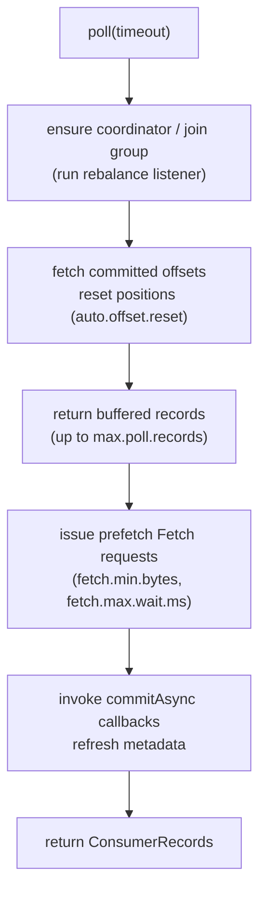

Gotcha: because rebalances happen inside `poll()`, a consumer that stops polling (busy processing) also stops participating
in rebalances until it returns; that is why `max.poll.interval.ms` exists.

**Follow-up probes.** Why can `poll()` return zero records while the buffer is full? What does `poll(Duration.ZERO)` still do?

### Q13. Compare auto commit, `commitSync`, `commitAsync` and per-partition commits.
**Role:** [DEV] | **Difficulty:** ★★☆ | **Topic:** Consumer API

**Answer.**
Auto commit (`enable.auto.commit=true`, every `auto.commit.interval.ms`) commits the offsets returned by the previous `poll()`
during the next `poll()` or on `close()`: at-least-once only if you finish processing each batch before polling again, and it
commits nothing for records you have not processed yet unless your loop is asynchronous. `commitSync()` blocks and retries
retriable errors until `default.api.timeout.ms`; `commitAsync()` returns immediately and invokes an `OffsetCommitCallback`, does
not retry, and can be overtaken by a later commit, so never retry it naively. Per-partition commits
(`commitSync(Map<TopicPartition, OffsetAndMetadata>)`) let you commit exactly what you processed, for example after each
partition's records in a batch. The standard pattern is `commitAsync()` in the loop for throughput and `commitSync()` in the
`finally` before `close()` and in `onPartitionsRevoked`. Gotcha: commit `offset + 1`; committing the last processed offset
re-delivers that record after restart.

**Follow-up probes.** How would you retry `commitAsync` safely? What does the coordinator do with a commit for a partition the
member no longer owns?

### Q14. What do the three `ConsumerRebalanceListener` callbacks do and what belongs in each?
**Role:** [DEV] | **Difficulty:** ★★☆ | **Topic:** Consumer API

**Answer.**
`onPartitionsRevoked(partitions)` runs before the member gives partitions away (inside `poll()`); commit processed offsets for
them and flush any in-flight work. `onPartitionsAssigned(partitions)` runs after the new assignment; seek to externally stored
offsets, initialise per-partition state, or start local caches. `onPartitionsLost(partitions)` (since 2.4) runs when the
consumer has already lost ownership (session timeout, `max.poll.interval.ms` exceeded, fenced by a static-member replacement);
do not commit here (the commit would be rejected or, worse, overwrite the new owner's), only clean up.

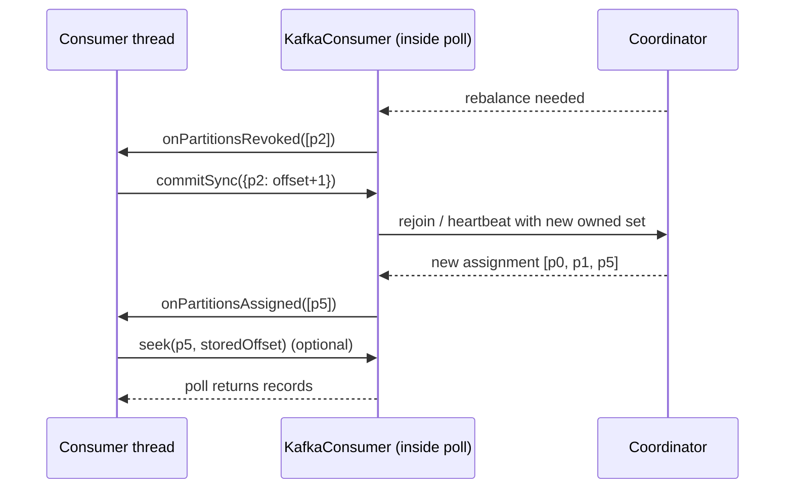

Under cooperative assignors and KIP-848 the callbacks receive only the partitions that moved, not the full set. Gotcha: the
callbacks run on the polling thread; a slow `onPartitionsRevoked` delays the whole rebalance for everyone.

**Follow-up probes.** Why is `onPartitionsLost` different from `onPartitionsRevoked`? What happens if the listener throws?

### Q15. How do `seek()`, `seekToBeginning()`, `offsetsForTimes()` and `auto.offset.reset` interact?
**Role:** [DEV] | **Difficulty:** ★★☆ | **Topic:** Consumer API

**Answer.**
`auto.offset.reset` (`latest` default, `earliest`, `none`) applies only when there is no committed offset for the group or the
committed offset is out of range; it never overrides a valid committed offset. `seek(tp, offset)` sets the position for the next
fetch and is only valid on an assigned partition, so call it in `onPartitionsAssigned` or after the first `poll()` when using
`subscribe()`; with `assign()` it works immediately. `seekToBeginning`/`seekToEnd` are lazy (evaluated on next poll).
`offsetsForTimes(Map<TopicPartition, Long>)` asks the broker for the first offset with timestamp at or after the given time and
returns `null` for partitions with no such record. A seek does not commit; if you want the new position to survive a restart,
commit after the seek. Gotcha: with `auto.offset.reset=none` a new group throws `NoOffsetForPartitionException`, which is the
correct choice for pipelines where silently starting at `latest` would lose data.

**Follow-up probes.** How do you replay from a timestamp for a whole group offline? What does seeking do to already-fetched records?

### Q16. How do `pause()` and `resume()` work and what are they for?
**Role:** [DEV] | **Difficulty:** ★☆☆ | **Topic:** Consumer API

**Answer.**
`pause(Collection<TopicPartition>)` stops `poll()` from returning records for those partitions while the consumer keeps polling,
heartbeating, and staying in the group; `resume()` re-enables them; `paused()` lists them. Use it for backpressure (a downstream
sink is slow, so pause and keep polling to avoid `max.poll.interval.ms`), for delayed retries (pause the partition until the
retry time), and for priority handling. Paused partitions do not trigger a rebalance and their fetch position is unchanged.
Gotcha: a rebalance that revokes and reassigns a partition clears its paused state, so re-apply pauses in
`onPartitionsAssigned` if they must survive; and code that stops calling `poll()` "because everything is paused" still hits
`max.poll.interval.ms`.

**Follow-up probes.** How does Spring Kafka expose pause/resume? Why is `pause()` better than `Thread.sleep()` for a retry delay?

### Q17. Is `KafkaConsumer` thread-safe, and how do you parallelise processing?
**Role:** [DEV] | **Difficulty:** ★★★ | **Topic:** Consumer API

**Answer.**
No; every method except `wakeup()` must be called from the thread that owns the consumer, and concurrent access throws
`ConcurrentModificationException`. Parallelism options: (1) one consumer per thread, the simplest and what Spring's
`concurrency` does; (2) one consumer that hands records to a worker pool per partition, pauses partitions whose queues are full,
and commits only offsets up to the lowest completed record per partition (the "confluent-parallel-consumer" approach); (3) more
partitions and more consumer instances. Option 2 preserves per-partition order only if each partition maps to one worker.
Gotcha: hand-off breaks the `poll()`/commit coupling, so you must track completion per partition and commit from the consumer
thread, and handle `onPartitionsRevoked` by draining the workers first.

**Follow-up probes.** How does key-level parallelism differ from partition-level? Where does ordering get lost in option 2?

### Q18. How do you stop a consumer cleanly from another thread?
**Role:** [DEV] | **Difficulty:** ★☆☆ | **Topic:** Consumer API

**Answer.**
Call `consumer.wakeup()` from the other thread (it is the only thread-safe method); the next or current `poll()` throws
`WakeupException`, which the poll loop catches, then it commits (`commitSync`) and calls `close()` in a `finally`. `close()` sends
a `LeaveGroup` so the group rebalances immediately instead of waiting for `session.timeout.ms` (static members do not leave and
keep their assignment). Wire this into a shutdown hook and `join()` the consumer thread so the JVM waits. Gotcha: `wakeup()`
throws from the next blocking call, which might be `commitSync()` inside your `finally`; call `commitSync` before `close` inside
the `try` or catch `WakeupException` a second time.

**Follow-up probes.** What does `close(Duration)` wait for? Why does a static member's `close()` not trigger a rebalance?

### Q19. Explain the fetch-sizing configs and how they interact with `max.poll.records`.
**Role:** [DEV] | **Difficulty:** ★☆☆ | **Topic:** Consumer API

**Answer.**
A fetch request asks each broker for data from all assigned partitions it leads: `fetch.min.bytes` (1) and `fetch.max.wait.ms`
(500) tell the broker to wait until that much data exists or that long has passed, `max.partition.fetch.bytes` (1 MiB) caps each
partition's share and `fetch.max.bytes` (50 MiB) the whole response. `max.poll.records` (500) only limits how many buffered
records one `poll()` returns; it does not shrink the fetch, so lowering it reduces per-poll processing time without touching
network efficiency. Raise `fetch.min.bytes` to cut request rate on quiet topics at the cost of latency. Gotcha: the consumer
prefetches the next batch while you process, so memory is roughly `fetch.max.bytes` times the number of brokers you fetch from,
not `max.poll.records` times record size.

**Follow-up probes.** Which config do you change when `max.poll.interval.ms` is exceeded? How does the broker honour
`fetch.max.wait.ms` (purgatory)?

### Q20. How do you handle a deserialization failure in a plain consumer?
**Role:** [DEV] | **Difficulty:** ★★☆ | **Topic:** Consumer API

**Answer.**
`poll()` throws `RecordDeserializationException` (since 2.8, KIP-334) and the consumer does not advance; the exception carries
`topicPartition()` and `offset()`, and since 3.8 (KIP-1036) the raw `keyBuffer()`, `valueBuffer()`, `headers()` and `timestamp()`,
so you can publish the bytes to a dead-letter topic, then `seek(tp, offset + 1)` and continue. Without that handling the loop
throws forever on the same record (a poison pill). The alternative is to consume with `ByteArrayDeserializer` and deserialize in
your own code, which gives full control at the price of doing it for every record. Spring Kafka wraps the same idea in
`ErrorHandlingDeserializer`. Gotcha: after the seek the records already buffered for that partition are discarded and refetched,
which is correct but costs a round trip per poison record.

**Follow-up probes.** Why is the exception thrown by `poll()` rather than returned per record? How would you rate-limit a
stream of poison pills?

### Q21. When would you use static membership, and how does the KIP-848 protocol change the consumer's configuration?
**Role:** [DEV] | **Difficulty:** ★★★ | **Topic:** Consumer API

**Answer.**
Set `group.instance.id` to a stable per-instance value (the pod ordinal in a StatefulSet) when restarts are frequent and
rebalances expensive, such as Streams instances with large state or consumers with long `onPartitionsAssigned` setup; the
coordinator keeps the assignment for `session.timeout.ms` (raise it to a few minutes for static members) so a restart within
that window skips the rebalance. With `group.protocol=consumer` (KIP-848, GA in 4.0) you drop `partition.assignment.strategy`,
`session.timeout.ms` and `heartbeat.interval.ms` (they become broker-side `group.consumer.*` configs, tunable per group with
`kafka-configs.sh --bootstrap-server localhost:9092 --alter --entity-type groups --entity-name g1 --add-config
consumer.session.timeout.ms=60000`) and optionally set `group.remote.assignor=uniform|range`. `max.poll.interval.ms` and static
membership still apply. Gotcha: a group is migrated online by restarting members with the new protocol one at a time; the
coordinator converts it when all members speak `consumer`, and the classic and new clients cannot be mixed indefinitely.

**Follow-up probes.** What happens when two instances start with the same `group.instance.id`? Which client class serves the
new protocol?

### Q22. Which consumer metrics do you alert on?
**Role:** [DEV] | **Difficulty:** ★★☆ | **Topic:** Consumer API

**Answer.**
| Metric | Group | Meaning |
|--------|-------|---------|
| `records-lag-max`, `records-lag` (per partition) | `consumer-fetch-manager-metrics` | how far behind the HW; alert on sustained growth |
| `fetch-latency-avg`, `bytes-consumed-rate`, `records-consumed-rate` | fetch manager | throughput and broker latency |
| `commit-latency-avg`, `commit-rate` | `consumer-coordinator-metrics` | coordinator health |
| `rebalance-total`, `failed-rebalance-total`, `rebalance-latency-avg` | coordinator | rebalance storms |
| `last-rebalance-seconds-ago`, `last-poll-seconds-ago` | coordinator / consumer | a stuck poll loop shows here first |
| `poll-idle-ratio-avg`, `time-between-poll-avg` | `consumer-metrics` | processing time versus `max.poll.interval.ms` |
| `fetch-throttle-time-avg` | fetch manager | quota throttling |

Broker-side lag from `kafka-consumer-groups.sh --bootstrap-server localhost:9092 --describe --group g1` or an exporter is the
source of truth when consumers are down (client metrics vanish with the process). Gotcha: `records-lag` is measured against the
HW of the replica you fetch from, so follower fetching under-reports it.

**Follow-up probes.** Why should lag alerts be on the rate of change, not the absolute value? What does `time-between-poll-max`
approaching `max.poll.interval.ms` predict?

### Q23. What is the difference between `subscribe()` and `assign()`, and when is `assign()` right?
**Role:** [DEV] | **Difficulty:** ★☆☆ | **Topic:** Consumer API

**Answer.**
`subscribe(topics | pattern, listener)` joins a consumer group and lets the coordinator hand out partitions and rebalance them;
`assign(partitions)` sets a fixed partition list with no group coordination, no rebalancing and no automatic failover, while
still allowing offset commits under a `group.id`. Use `assign()` for tools that must read a specific partition (a replay utility,
a Kafka Streams global store, a partition-level auditor), for consumers that must read every partition regardless of instance
count (a broadcast cache), or when your own scheduler owns partition placement. Gotcha: `assign()` and `subscribe()` are mutually
exclusive on one instance, and an `assign()` consumer with a `group.id` still shows up in `kafka-consumer-groups.sh` as a group
with no members, which confuses lag monitoring.

**Follow-up probes.** How does a manually assigned consumer learn about new partitions? Can two `assign()` consumers commit to
the same group?

## Kafka Streams

### Q24. What is a Streams topology and how does it map to tasks and threads?
**Role:** [DEV] | **Difficulty:** ★☆☆ | **Topic:** Kafka Streams

**Answer.**
A topology is a directed graph of source nodes (topics), processor nodes and sink nodes built with `StreamsBuilder` or the
Processor API; Streams splits it into sub-topologies at repartition topics, and for each sub-topology creates one task per
input partition (so a sub-topology over a 12-partition topic has 12 tasks). Tasks are the unit of parallelism and of state: each
owns its partitions, its state stores and a record buffer. Threads (`num.stream.threads`) run tasks; instances of the same
`application.id` share the tasks via the group protocol.

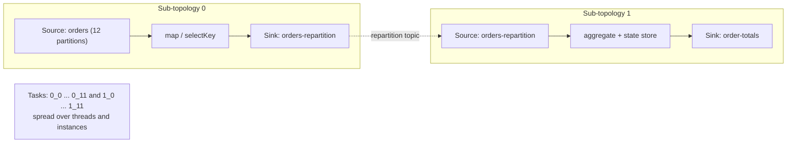

Print it with `topology.describe()` and paste into a visualiser. Gotcha: adding a `selectKey`/`map` that changes the key inserts
a repartition topic and therefore a second sub-topology with its own tasks.

**Follow-up probes.** What determines the task count of a join? Why can a topology change break restart?

### Q25. Compare KStream, KTable and GlobalKTable.
**Role:** [DEV] | **Difficulty:** ★☆☆ | **Topic:** Kafka Streams

**Answer.**
| | KStream | KTable | GlobalKTable |
|--|---------|--------|--------------|
| Semantics | every record is an event (insert) | changelog: latest value per key (upsert; null = delete) | same as KTable |
| Partitioning | task sees its partitions | task sees its partitions | every instance holds all partitions |
| State | none unless aggregated | local store, changelog-backed | local store, restored from the topic directly |
| Joins | with KStream (windowed), KTable, GlobalKTable | with KTable (FK joins since 2.4) | only as the right side of a KStream join |
| Time | event time, windows | latest wins per key (versioned tables since 3.5 respect timestamps) | bootstrapped fully before processing |

Choose KTable for state that is partitioned by the same key as the stream; GlobalKTable for small reference data (currencies,
country codes) that any key must look up without co-partitioning. Gotcha: a GlobalKTable is replicated in full on every
instance and is not a substitute for a large dimension table.

**Follow-up probes.** Why does a GlobalKTable join not need co-partitioning? What does `KTable.toStream()` emit?

### Q26. Which joins exist, and what does co-partitioning require?
**Role:** [DEV] | **Difficulty:** ★★☆ | **Topic:** Kafka Streams

**Answer.**
KStream–KStream (windowed inner/left/outer, both sides buffered in window stores), KStream–KTable (inner/left, stream drives, table
is looked up), KTable–KTable (inner/left/outer, either side drives; foreign-key joins via `join(other, foreignKeyExtractor, ...)`),
and KStream–GlobalKTable (inner/left with a `KeyValueMapper` to derive the lookup key). All except GlobalKTable joins require
co-partitioning: same number of partitions, same key type and serializer, and the same partitioner so key K is in partition
i on both sides; Streams checks the partition counts at startup and throws `TopologyException` on mismatch.

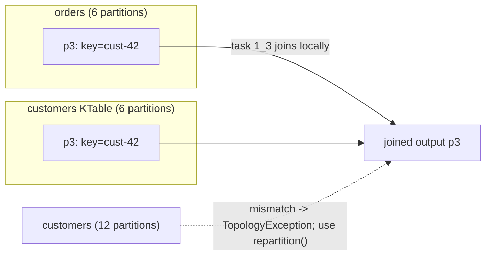

Gotcha: co-partitioning also fails silently when producers of the two topics use different partitioners (Java murmur2 versus
librdkafka crc32) even though counts match.

**Follow-up probes.** How does a foreign-key KTable join avoid co-partitioning? What is the memory cost of a KStream–KStream join?

### Q27. When does Streams create repartition topics, and how do you control them?
**Role:** [DEV] | **Difficulty:** ★★☆ | **Topic:** Kafka Streams

**Answer.**
Any key-changing operation (`selectKey`, `map`, `flatMap`, `transform` with key change, `groupBy` with a new key) marks the
stream as needing repartitioning; the next stateful operation or join then writes through an internal topic
`<application.id>-<name>-repartition` so records with the same new key land in the same task. Name them with `Repartitioned.as`
or `Grouped.as` so they survive topology edits, set their partition count with `Repartitioned.withNumberOfPartitions`, or force
one explicitly with `repartition()`. `topology.optimization=all` (or `reuse.ktable.source.topics`, `merge.repartition.topics`
since 3.4) collapses multiple repartitions of the same stream into one. Gotcha: `mapValues` and `flatMapValues` do not change the
key and never trigger repartitioning; prefer them whenever you do not touch the key.

**Follow-up probes.** What retention do repartition topics have and who deletes from them? Why does a renamed operator create an
orphan topic?

### Q28. Explain tumbling, hopping, sliding and session windows.
**Role:** [DEV] | **Difficulty:** ★☆☆ | **Topic:** Kafka Streams

**Answer.**
Tumbling: fixed size, non-overlapping (`TimeWindows.ofSizeAndGrace(Duration.ofMinutes(5), Duration.ofMinutes(1))`).
Hopping: fixed size with an advance smaller than the size, so windows overlap and a record belongs to several
(`.advanceBy(Duration.ofMinutes(1))`). Sliding (`SlidingWindows.ofTimeDifferenceAndGrace`, since 2.7): a window per record
covering the last N time units, used for "count in the last 10 minutes per event". Session
(`SessionWindows.ofInactivityGapAndGrace`): data-driven, a window closes after a gap of inactivity per key and merges when a late
record bridges two sessions.

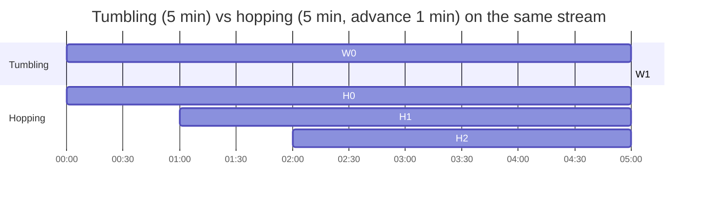

Windowed aggregations produce a `KTable<Windowed<K>, V>`; the window store retention is at least size plus grace. Gotcha:
hopping windows multiply state and output by size/advance; prefer sliding windows for "last N minutes" semantics.

**Follow-up probes.** Which window type has a changelog with `compact,delete`? How is retention derived from grace?

### Q29. What is the grace period and how does Streams handle late records?
**Role:** [DEV] | **Difficulty:** ★★★ | **Topic:** Kafka Streams

**Answer.**
Grace is how long after a window's end (in stream time, the maximum event timestamp seen by the task) Streams still accepts records
for that window; records arriving later are dropped and counted in the `dropped-records-total` metric. Since 3.0 the default
grace is zero (`ofSizeWithNoGrace`) and you must opt in with `ofSizeAndGrace`; earlier versions defaulted to 24 hours, which is
why old apps "never closed" windows. Event time comes from the record timestamp via `default.timestamp.extractor`
(`FailOnInvalidTimestamp` by default; `WallclockTimestampExtractor` or a custom extractor for payload timestamps). Stream time
only advances with new records, so a quiet partition keeps its windows open. Gotcha: grace also sets the changelog and window
store retention (size + grace), so a long grace multiplies state.

**Follow-up probes.** How does stream time behave across partitions of one task? What does `max.task.idle.ms` do for
out-of-order joins?

### Q30. How do `suppress()` and `emitStrategy` differ for final window results?
**Role:** [DEV] | **Difficulty:** ★★★ | **Topic:** Kafka Streams

**Answer.**
By default a windowed aggregation emits an update for every input record (subject to caching), so downstream sees intermediate
counts. `suppress(Suppressed.untilWindowCloses(BufferConfig.unbounded()))` buffers updates in an in-memory store (backed by a
changelog) and emits one final result per window when stream time passes window end plus grace; `untilTimeLimit` emits the
latest value at a rate limit instead. Since 3.3 (KIP-825) `windowedBy(...).emitStrategy(EmitStrategy.onWindowClose())` achieves
final results inside the aggregation itself without an extra buffer, which is cheaper and is the preferred approach for
tumbling and sliding windows. Both depend on stream time advancing, so a topic that goes quiet never emits its last window until
the next record arrives (or a dummy heartbeat record does). Gotcha: `BufferConfig.maxRecords/maxBytes` with `emitEarlyWhenFull`
breaks the "exactly one final result" contract; use `unbounded()` for correctness and size memory accordingly.

**Follow-up probes.** Why is `suppress` state in memory rather than RocksDB? How would you make a quiet partition emit?

### Q31. How do state stores, changelogs and restoration work?
**Role:** [DEV] | **Difficulty:** ★★☆ | **Topic:** Kafka Streams

**Answer.**
Each stateful task owns local stores (RocksDB by default, or in-memory via `Stores.inMemoryKeyValueStore`) under `state.dir`,
and every write is also produced to a compacted changelog topic `<application.id>-<store>-changelog`, which makes the store
recoverable. On (re)assignment a task without local state restores by replaying the changelog through a dedicated restore
consumer before it processes anything; with local state and a matching `.checkpoint` file only the tail is replayed.

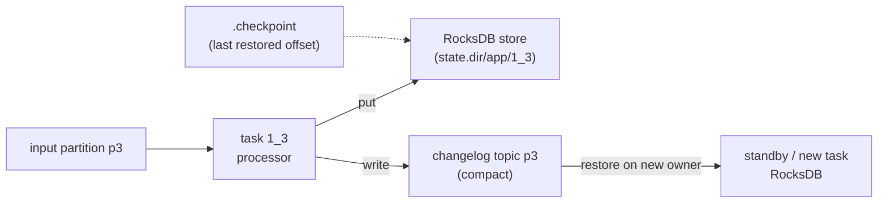

Observe with `StateRestoreListener` and the `restore-rate` / `restore-remaining-records-total` metrics. Gotcha: under
`exactly_once_v2` an unclean shutdown discards local state and restores from scratch (the checkpoint is only written on clean
close), so large stores make crash recovery slow; that is what standbys are for.

**Follow-up probes.** Why is the changelog compacted while a windowed store's changelog is `compact,delete`? What does
`disableLogging()` cost you?

### Q32. What are standby replicas and how does task assignment handle stateful scaling?
**Role:** [ARCH] | **Difficulty:** ★★★ | **Topic:** Kafka Streams

**Answer.**
`num.standby.replicas=1` makes another instance keep a warm copy of each task's stores by continuously consuming the changelog, so
on failover the task moves to the standby and only replays the tail. The `HighAvailabilityTaskAssignor` (default since 2.6)
assigns active tasks to instances whose local state is within `acceptable.recovery.lag` (10,000 records) of the changelog end,
otherwise it keeps the task where the state is and starts `max.warmup.replicas` (2) warm-up replicas on the target instance;
every `probing.rebalance.interval.ms` (10 min) it rebalances again to check whether warm-ups caught up and then moves the task.
Rack-aware placement of standbys uses `rack.aware.assignment.tags` and since 3.8 `task.assignor.class` allows a custom assignor.
Gotcha: standbys double changelog consumption and disk; and interactive queries against standbys need
`StoreQueryParameters.enableStaleStores()`.

**Follow-up probes.** Why does scaling out a stateful app take several rebalances? What happens if `acceptable.recovery.lag` is
set to `Long.MAX`?

### Q33. How does `processing.guarantee=exactly_once_v2` work and what does it cost?
**Role:** [DEV] | **Difficulty:** ★★★ | **Topic:** Kafka Streams

**Answer.**
Each stream thread owns one transactional producer (since KIP-447, brokers 2.5 and later); for every commit interval
(`commit.interval.ms`, forced to 100 ms under EOS) it atomically commits the output records, the changelog writes and the input
offsets (`sendOffsetsToTransaction` with the consumer's group metadata), and downstream `read_committed` consumers see the
results only after the commit marker. Zombie threads are fenced through the producer epoch tied to the consumer generation.
`exactly_once` (one producer per task) and `exactly_once_beta` were removed in 4.0; `exactly_once_v2` is the only EOS mode.
Costs: more, smaller transactions (latency and broker `__transaction_state` load), higher end-to-end latency for consumers
waiting on commit markers, and full state restoration after a crash. Gotcha: `transaction.timeout.ms` (10 s default in Streams)
must exceed the time a thread can be blocked, or the coordinator aborts and the thread is fenced.

**Follow-up probes.** Where are aborted output records visible? Why does EOS force a small commit interval?

### Q34. How do you unit-test a topology with `TopologyTestDriver`?
**Role:** [DEV] | **Difficulty:** ★☆☆ | **Topic:** Kafka Streams

**Answer.**
Build the `Topology`, create `new TopologyTestDriver(topology, props)` with at least `application.id` and `bootstrap.servers`
(any value; no broker is contacted), then `driver.createInputTopic("in", keySer, valueSer)` and
`driver.createOutputTopic("out", keyDeser, valueDeser)`. `pipeInput(key, value, Instant)` runs the record synchronously through
the whole topology including repartitions and state stores; read results with `readKeyValuesToList()` or `readRecord()`,
inspect stores via `driver.getKeyValueStore("counts")`, advance event time by piping records with later timestamps and wall-clock
time with `driver.advanceWallClockTime(Duration)` to fire punctuators. Always `close()` the driver (try-with-resources) or the
RocksDB state directory leaks. Gotcha: the driver is single-threaded and single-partition, so it cannot test co-partitioning
errors, rebalances, standbys or timing between partitions; use Testcontainers for those.

**Follow-up probes.** How do you test a suppressed window's final result? Why must serde configs be passed in `props`?

### Q35. How do you tune RocksDB in Kafka Streams and what memory does it use?
**Role:** [DEV] | **Difficulty:** ★★★ | **Topic:** Kafka Streams

**Answer.**
Provide a `rocksdb.config.setter` class implementing `RocksDBConfigSetter.setConfig(String storeName, Options options,
Map<String,Object> configs)`; the main knobs are the block cache (`BlockBasedTableConfig.setBlockCache`, default 50 MB per
store), memtable size and count (`options.setWriteBufferSize`, `setMaxWriteBufferNumber`), compaction style and compression
(`setCompressionType`). Memory is off-heap and per store, so an instance with 100 tasks × 3 stores can use many GB by default;
bound it with one shared static `Cache` and `WriteBufferManager` passed to every store (the pattern in the Streams docs) and
size the container accordingly. Watch the RocksDB metrics at `metrics.recording.level=DEBUG`
(`block-cache-data-hit-ratio`, `memtable-hit-ratio`, `bytes-written-rate`, `num-running-compactions`,
`size-all-mem-tables`, `estimate-num-keys`). Gotcha: close the objects you create in `setConfig` in the `close()` method or
native memory leaks on each store close.

**Follow-up probes.** Why does `statestore.cache.max.bytes` (the Streams record cache) sit above RocksDB? When would you
choose in-memory stores instead?

### Q36. How do interactive queries work, including across instances?
**Role:** [DEV] | **Difficulty:** ★★★ | **Topic:** Kafka Streams

**Answer.**
A materialized store (`Materialized.as("orders-by-customer")`) can be read locally with
`streams.store(StoreQueryParameters.fromNameAndType(name, QueryableStoreTypes.keyValueStore()))` or the typed IQv2 API
`streams.query(StateQueryRequest.inStore(name).withQuery(KeyQuery.withKey(k)))`. Because each instance holds only its tasks'
keys, set `application.server=host:port`, ask `streams.queryMetadataForKey(name, key, serializer)` which instance owns the key,
and forward the request there (your own REST or gRPC layer; Streams does not ship one). `enableStaleStores()` lets you serve from
standbys or during restoration at the cost of staleness. Queries fail with `InvalidStateStoreException` while the instance is in
`REBALANCING`, so retry with backoff. Gotcha: the record cache means a value written by the processor may not be visible to a
query until the cache flushes (`commit.interval.ms`) unless you set `statestore.cache.max.bytes=0`.

**Follow-up probes.** How do you query a windowed store for a key over a time range? What does IQv2 add over the classic API?

### Q37. How do you scale a Streams application and what limits it?
**Role:** [DEV] | **Difficulty:** ★★☆ | **Topic:** Kafka Streams

**Answer.**
Parallelism equals the number of tasks, which equals the maximum partition count among a sub-topology's input topics; you can
spread tasks over `num.stream.threads` per instance and any number of instances up to the task count, and extra instances idle.
Scale up by adding instances (a rebalance moves tasks; stateful ones warm up first), by `KafkaStreams.addStreamThread()` at
runtime (since 2.8), or by increasing input partitions and then resetting the application. Limits: per-task throughput (single
thread per task), state size and restoration time, and repartition topics that are created with the source's partition count.
Gotcha: increasing partitions of an input topic invalidates existing repartition and changelog topics, so it requires
`kafka-streams-application-reset.sh` and a state rebuild; plan partition counts with growth in mind.

**Follow-up probes.** How do you observe that a thread is the bottleneck (`process-rate`, `process-latency-avg`)? What happens to
tasks when a thread dies and `REPLACE_THREAD` is configured?

### Q38. Which exception handlers does Streams provide and how do you choose their behaviour?
**Role:** [DEV] | **Difficulty:** ★★☆ | **Topic:** Kafka Streams

**Answer.**
Three record-level handlers and one thread-level handler. `deserialization.exception.handler` (`LogAndFailExceptionHandler` by
default, `LogAndContinueExceptionHandler` to skip poison pills; config name `default.deserialization.exception.handler` before
4.0) runs when a source record cannot be deserialized. `production.exception.handler` (`DefaultProductionExceptionHandler`) runs
when a sink write fails with a non-retriable error such as `RecordTooLargeException`. `processing.exception.handler` (since 3.9,
KIP-1033: `LogAndFailProcessingExceptionHandler` or `LogAndContinueProcessingExceptionHandler`) covers exceptions thrown by user
code in processors. Uncaught errors reach `streams.setUncaughtExceptionHandler(StreamsUncaughtExceptionHandler)` which returns
`REPLACE_THREAD`, `SHUTDOWN_CLIENT` or `SHUTDOWN_APPLICATION` (since 2.8). Skipped records increment `dropped-records-total`.
Gotcha: "continue" handlers silently lose data; pair them with a metric alert and a DLQ producer inside the handler.

**Follow-up probes.** Why does `REPLACE_THREAD` risk an infinite loop on a poison record? How would a handler send to a DLQ
without breaking EOS?

### Q39. When do you drop from the DSL to the Processor API?
**Role:** [DEV] | **Difficulty:** ★★☆ | **Topic:** Kafka Streams

**Answer.**
When you need punctuation (scheduled work on stream time or wall-clock time), direct access to several state stores in one
step, custom emission logic, per-record header manipulation, or forwarding to multiple children by name. Since 3.3 the DSL
exposes it through `process(ProcessorSupplier)` and `processValues(FixedKeyProcessorSupplier)` (the old `transform*` methods are
deprecated), using `org.apache.kafka.streams.processor.api.Processor<KIn,VIn,KOut,VOut>` with `init(ProcessorContext)`,
`process(Record)` and `context.schedule(Duration, PunctuationType.STREAM_TIME | WALL_CLOCK_TIME, Punctuator)`. Stores are
attached with `ConnectedStoreProvider.stores()` on the supplier or `Topology.addStateStore`. `processValues` keeps the key and
avoids a repartition. Gotcha: `STREAM_TIME` punctuation fires only when records arrive, `WALL_CLOCK_TIME` fires in `poll` gaps
based on system time; neither is exact to the millisecond.

**Follow-up probes.** How do you forward to a specific child? What is the difference between `Record` and the old
`KeyValue` API?

### Q40. How do KTable materialization, caching and versioned stores affect what downstream sees?
**Role:** [DEV] | **Difficulty:** ★★★ | **Topic:** Kafka Streams

**Answer.**
A KTable update is written to its store and, after the record cache (`statestore.cache.max.bytes`, 10 MiB per thread) flushes at
`commit.interval.ms`, the latest value per key is emitted downstream, so consecutive updates within one interval are collapsed;
set the cache to 0 to see every update. Materialization is explicit (`Materialized.as(...)`) or automatic when a store is needed;
a KTable read via `builder.table()` from a source topic can be a logical view only. Versioned stores (since 3.5,
`Stores.persistentVersionedKeyValueStore(name, historyRetention)`) keep multiple timestamped values per key so stream–table and
table–table joins use the table value that was current at the stream record's timestamp instead of the latest value, and
out-of-order table updates no longer overwrite newer ones. Gotcha: versioned tables cannot be used with `suppress`, need
`historyRetention` at least the join grace, and are not the default.

**Follow-up probes.** Why can a stream–table join produce different results after a restart with an unversioned table? What
does the cache do to a `count()` on a KTable?

### Q41. How do you evolve a running Streams topology safely?
**Role:** [DEV] | **Difficulty:** ★★☆ | **Topic:** Kafka Streams

**Answer.**
Name every stateful operator and repartition explicitly (`Materialized.as`, `Grouped.as`, `Repartitioned.as`, `Named.as`) so
adding or removing an unrelated node does not renumber the auto-generated `KSTREAM-AGGREGATE-STATE-STORE-0000000003` names and
orphan the changelogs. Compatible changes (stateless nodes, adding a sink) can be rolled out in place; incompatible ones
(changing keys, serdes, window sizes, store types) need a new `application.id` or a reset: stop all instances, run
`kafka-streams-application-reset.sh --bootstrap-server localhost:9092 --application-id app --input-topics orders
--to-earliest`, call `KafkaStreams.cleanUp()` on start, and delete or rename old internal topics. Use `upgrade.from` during
Streams version upgrades that change the assignor protocol. Gotcha: the reset tool does not delete output topics or external
state, and running it while an instance is up corrupts the group's offsets.

**Follow-up probes.** How do you run blue/green Streams deployments? Which topology changes are safe under EOS?

## Kafka Connect

### Q42. Describe the Kafka Connect architecture: workers, connectors, tasks, converters and transforms.
**Role:** [DEV] | **Difficulty:** ★☆☆ | **Topic:** Kafka Connect

**Answer.**
A Connect cluster is a set of worker JVMs sharing a `group.id`; a connector is a configuration plus a `Connector` class that
splits the work into `tasks.max` tasks, each a `SourceTask` (polls an external system and returns `SourceRecord`s) or `SinkTask`
(receives `SinkRecord`s from a consumer group named `connect-<connector>`). The worker runs the tasks, owns the producer or
consumer, applies the transform chain (SMTs), converts between Connect's internal `Schema`/`Struct` data and bytes with the
configured converters, and handles offsets, retries and dead-letter routing.

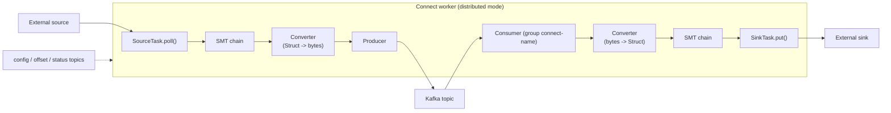

Gotcha: the converter is a worker-level setting that connectors can override (`value.converter` in the connector config);
mismatched converters between source and sink are the most common Connect failure.

**Follow-up probes.** Which component owns the consumer group for a sink? Where do source offsets go?

### Q43. What is the difference between a converter and a serializer, and how do you choose?
**Role:** [DEV] | **Difficulty:** ★☆☆ | **Topic:** Kafka Connect

**Answer.**
A converter (`org.apache.kafka.connect.storage.Converter`) translates between Connect's schema-aware in-memory data model and
bytes on the topic, in both directions, and is aware of schemas; a serializer only turns an application object into bytes.
Built-ins: `JsonConverter` (with `schemas.enable=true` it embeds the schema in every message, doubling size; `false` produces
plain JSON with no schema, which sink connectors that need types reject), `StringConverter`, `ByteArrayConverter`,
`org.apache.kafka.connect.converters.LongConverter` and friends; Confluent adds `AvroConverter`, `ProtobufConverter` and
`JsonSchemaConverter` backed by Schema Registry. Set `key.converter` and `value.converter` per worker as defaults and override
per connector; `header.converter` defaults to `SimpleHeaderConverter`. Gotcha: a sink with `JsonConverter` and
`schemas.enable=true` reading plain JSON fails with `DataException: JsonConverter with schemas.enable requires "schema" and
"payload" fields`; the fix is the converter config, not the data.

**Follow-up probes.** Why do JDBC sinks need a schema? Can a source use Avro for the value and String for the key?

### Q44. How do Single Message Transforms and predicates work?
**Role:** [DEV] | **Difficulty:** ★★☆ | **Topic:** Kafka Connect

**Answer.**
SMTs run per record in the order listed in `transforms=a,b` with each configured as `transforms.a.type=<class>` plus its
properties; a source applies them after `poll()` and before conversion, a sink after conversion and before `put()`. Built-ins:
`InsertField`, `ReplaceField`, `MaskField`, `ValueToKey`, `ExtractField`, `HoistField`, `Flatten`, `Cast`, `TimestampConverter`,
`SetSchemaMetadata`, `RegexRouter`, `TimestampRouter`, `Filter`, `HeaderFrom`, `InsertHeader`, `DropHeaders`, each with a
`$Key` or `$Value` inner class. Predicates (`predicates=p`, `predicates.p.type=TopicNameMatches|HasHeaderKey|RecordIsTombstone`)
gate a transform with `transforms.a.predicate=p` and `transforms.a.negate=true`. Returning `null` from a transform drops the
record. Gotcha: SMTs are for light per-record shaping; anything stateful, joining, or slow belongs in Streams, and a slow SMT
stalls the entire task.

**Follow-up probes.** How does `RegexRouter` interact with sink topic-to-table mapping? Why must a custom SMT be careful with
schemaless (`Map`) values?

### Q45. How does distributed mode coordinate connectors and tasks across workers?
**Role:** [DEV] | **Difficulty:** ★★☆ | **Topic:** Kafka Connect

**Answer.**
Workers with the same `group.id` form a Connect group; configs, offsets and statuses live in three compacted internal topics
(`config.storage.topic`, `offset.storage.topic` with 25 partitions, `status.storage.topic`) so any worker can take over. The
group leader assigns connectors and tasks; since 2.3 the default `connect.protocol=sessioned` uses incremental cooperative
rebalancing, so adding a worker or connector only moves what is needed and a lost worker's tasks are reassigned after
`scheduled.rebalance.max.delay.ms` (5 min) to allow it to return. Standalone mode (`connect-standalone.sh`) keeps offsets in a
local file and is for development. Gotcha: the internal topics must be created with replication factor 3 and
`cleanup.policy=compact`; a `delete` policy on the config topic silently loses connector definitions after retention.

**Follow-up probes.** Why does a connector config change not restart the tasks of other connectors? What is the
`exactly.once.source.support` worker setting?

### Q46. Which Connect REST endpoints do you use daily?
**Role:** [DEV] | **Difficulty:** ★☆☆ | **Topic:** Kafka Connect

**Answer.**
`GET /connectors?expand=status,info` for an overview; `PUT /connectors/{name}/config` to create or update idempotently
(prefer it over `POST /connectors`); `GET /connectors/{name}/status` for connector and task states with the failure trace;
`POST /connectors/{name}/restart?includeTasks=true&onlyFailed=true` (since 3.0) to restart failed tasks in one call;
`PUT /connectors/{name}/pause`, `/resume` and `/stop` (since 3.5; stop releases resources and is required before offset edits);
`GET|PATCH|DELETE /connectors/{name}/offsets` (since 3.6, KIP-875); `PUT /connector-plugins/{class}/config/validate` to
validate a config before deploying; `GET /admin/loggers` and `PUT /admin/loggers/{logger}` to change log levels at runtime.
Gotcha: a `PAUSED` sink keeps its consumer group membership and holds partitions; use `STOPPED` when you want the group to
release them.

**Follow-up probes.** What is the difference between pause and stop? How do you find which worker runs a task?

### Q47. How does Connect error handling and the dead-letter queue work?
**Role:** [DEV] | **Difficulty:** ★★☆ | **Topic:** Kafka Connect

**Answer.**
By default any error fails the task (`errors.tolerance=none`). With `errors.tolerance=all` the framework retries retriable errors
for `errors.retry.timeout` (0 = no retries; -1 = forever) with backoff up to `errors.retry.delay.max.ms`, logs them if
`errors.log.enable=true` (add `errors.log.include.messages=true` to see payloads), and for sinks writes the failed record to
`errors.deadletterqueue.topic.name` with `errors.deadletterqueue.context.headers.enable=true` adding
`__connect.errors.topic`, `.partition`, `.offset`, `.exception.class.name`, `.exception.message` and `.stage` headers.

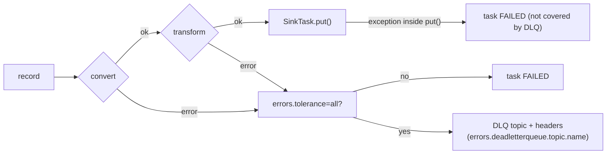

Gotcha: the DLQ covers only the framework stages (conversion, transformation, header conversion); errors thrown inside the
connector's `put()` or a source's `poll()` are the connector's responsibility, and many connectors add their own
`behavior.on.error`-style options.

**Follow-up probes.** Why is there no DLQ for source connectors? How do you replay a DLQ record back into the pipeline?

### Q48. Where are Connect offsets stored and how do you reset them?
**Role:** [DEV] | **Difficulty:** ★★★ | **Topic:** Kafka Connect

**Answer.**
Source connectors store their own logical offsets (for example a table's last ID or a file position) as records in
`offset.storage.topic`, keyed by `[connector, sourcePartition]` with the `sourceOffset` map as value, flushed every
`offset.flush.interval.ms` (60 s); sink connectors use ordinary Kafka consumer offsets under the group `connect-<name>`. Since
3.6 (KIP-875) you stop the connector (`PUT /connectors/x/stop`), then `GET /connectors/x/offsets` to see them,
`PATCH /connectors/x/offsets` with a JSON body to move them (for a sink, `{"partition": {"kafka_topic": "t",
"kafka_partition": 0}, "offset": {"kafka_offset": 100}}`; for a source, the connector's own partition/offset maps, with
`"offset": null` to delete), or `DELETE /connectors/x/offsets` to reset fully. Before 3.6 the only way was writing a tombstone
to the offsets topic with the exact key. Exactly-once sources (`exactly.once.source.support=enabled` on all workers plus the
connector's `exactly.once.support=required`) commit offsets in the same transaction as the records. Gotcha: source offsets are
compacted by key, so renaming a connector orphans its offsets and it restarts from the beginning.

**Follow-up probes.** Why does a sink's DLQ record still advance the consumer offset? How does a source connector reconcile
offsets on a task count change?

### Q49. How does Debezium do change data capture and which settings matter?
**Role:** [DEV] | **Difficulty:** ★★☆ | **Topic:** Kafka Connect

**Answer.**
Debezium is a family of source connectors that read the database's transaction log (MySQL binlog, Postgres logical replication
slot, SQL Server CDC tables, Oracle LogMiner) and emit one event per row change with an envelope of `before`, `after`, `op`
(`c`, `u`, `d`, `r` for snapshot reads), `ts_ms` and `source` metadata, to topics named `<topic.prefix>.<schema>.<table>`.
Important settings: `snapshot.mode` (`initial`, `never`, `when_needed`, `no_data`), `table.include.list`,
`tombstones.on.delete` (emits a tombstone after the delete event so compaction removes the key), `decimal.handling.mode`,
`heartbeat.interval.ms` (keeps the replication slot advancing on quiet databases), `schema.history.internal.kafka.topic` for
MySQL and others, and the `ExtractNewRecordState` SMT to flatten the envelope. Incremental snapshots are triggered through a
signal table. Gotcha: a Postgres replication slot that is not consumed retains WAL forever and fills the database disk; monitor
slot lag independently of Connect.

**Follow-up probes.** How does Debezium guarantee ordering per row? What is the outbox event router?

### Q50. How do you write a custom source or sink connector?
**Role:** [DEV] | **Difficulty:** ★★★ | **Topic:** Kafka Connect

**Answer.**
Implement `SourceConnector` (or `SinkConnector`) with `version()`, `start(Map)`, `taskClass()`, `taskConfigs(int maxTasks)`
that splits the work into at most `maxTasks` configurations, `config()` returning a `ConfigDef` used by REST validation, and
`stop()`. A `SourceTask` implements `start(Map)`, `poll()` returning `List<SourceRecord>` (block briefly, never spin; return
`null` for nothing), optional `commitRecord(SourceRecord, RecordMetadata)` for acknowledgements, and `stop()`; it reads its last
position with `context.offsetStorageReader().offset(sourcePartition)`. A `SinkTask` implements `open(Collection<TopicPartition>)`,
`put(Collection<SinkRecord>)` (buffer and write), `flush` or `preCommit(Map<TopicPartition, OffsetAndMetadata>)` to control
which offsets are committed, and `close`. Package as a fat directory under `plugin.path`, and since 3.6 add a `ServiceLoader`
manifest (`connect-plugin-path.sh sync-manifests`) for `plugin.discovery=service_load`. Gotcha: throw `RetriableException`
from `put()` to have the framework redeliver the same batch; any other exception fails the task.

**Follow-up probes.** How do you make a source connector exactly-once capable (`exactlyOnceSupport()`)? Why should a task
never hold the offsets in memory only?

### Q51. What delivery guarantee does a sink connector give and how do you make it effectively exactly-once?
**Role:** [DEV] | **Difficulty:** ★★☆ | **Topic:** Kafka Connect

**Answer.**
At-least-once: the framework commits consumer offsets after `put()` and `flush`/`preCommit` succeed, so a crash between writing
to the sink and the commit redelivers the batch. Make the write idempotent: upsert keyed by the record key or by
`(topic, partition, offset)` written alongside (JDBC sink `insert.mode=upsert` with `pk.mode=record_key`), or use a sink that
stores the Kafka offset transactionally with the data (the "consumer-side transaction" pattern). Override the consumer with
`consumer.override.isolation.level=read_committed` when upstream uses transactions (requires
`connector.client.config.override.policy=All` on the worker). Gotcha: `tasks.max` above the topic's partition count leaves
tasks idle, and the JDBC sink's batch size and `max.poll.records` decide how much is redelivered after a failure.

**Follow-up probes.** Where does the DLQ fit into this guarantee? Why is `preCommit` more precise than `flush`?

### Q52. A Connect task is in `FAILED` state. How do you diagnose and recover it?
**Role:** [DEV] | **Difficulty:** ★☆☆ | **Topic:** Kafka Connect

**Answer.**
`GET /connectors/{name}/status` shows the task's `trace` (a full stack trace); read the innermost cause: `DataException` points
to a converter or schema mismatch, `RecordTooLargeException` to `producer.override.max.request.size`,
`SerializationException` with a 40x from Schema Registry to auth or compatibility, `ConnectException: ... timed out` to the
external system. Raise logging on the connector package at runtime with `PUT /admin/loggers/io.debezium {"level":"DEBUG"}`,
fix the config with `PUT /connectors/{name}/config`, then `POST /connectors/{name}/restart?includeTasks=true&onlyFailed=true`.
For a poison record set `errors.tolerance=all` with a DLQ rather than skipping offsets by hand. Gotcha: a connector in `RUNNING`
with all tasks `FAILED` is a silent outage; alert on task state from the status topic or the
`kafka.connect:type=connector-task-metrics,connector=x,task=0` `status` metric.

**Follow-up probes.** Why does restarting the connector without `includeTasks` often do nothing? Which metric tells you the
sink is falling behind?

## Schema Registry

### Q53. Why use a schema registry, and what is the Confluent wire format?
**Role:** [DEV] | **Difficulty:** ★☆☆ | **Topic:** Schema Registry

**Answer.**
A registry gives producers and consumers a shared, versioned contract enforced at produce time, so a breaking change is rejected
before it reaches a topic, and it keeps messages small by shipping a schema ID instead of the schema. Confluent Schema Registry
(the de facto standard; Apicurio and AWS Glue Schema Registry are alternatives with different wire formats) prefixes each payload
with a magic byte `0` and a 4-byte big-endian schema ID, followed by the Avro binary, Protobuf (plus message-index varints) or
JSON bytes.

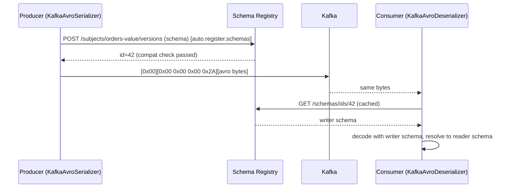

Gotcha: a consumer using a plain `StringDeserializer` on such a topic sees five garbage bytes before the payload; and the
registry is a runtime dependency of every client, so cache aggressively and treat it as tier-1 infrastructure.

**Follow-up probes.** What does the consumer do if the registry is down? Why is the ID global and not per subject?

### Q54. What are the subject name strategies and when do you use each?
**Role:** [DEV] | **Difficulty:** ★★☆ | **Topic:** Schema Registry

**Answer.**
The subject is the unit of versioning and compatibility. `TopicNameStrategy` (default): subject `<topic>-key` / `<topic>-value`,
one schema type per topic; `RecordNameStrategy`: subject is the fully qualified record name, so one schema is shared across
topics and a topic can carry many record types; `TopicRecordNameStrategy`: `<topic>-<record name>`, many types per topic but
versioned per topic. Set with `value.subject.name.strategy` (and `key.subject.name.strategy`) on producers and consumers,
which must agree. Use `TopicNameStrategy` for classic one-type topics, `TopicRecordNameStrategy` for event-sourced topics where
ordering across event types matters and each type evolves independently. Gotcha: with `RecordNameStrategy` a change is checked
against every topic using that record, so a compatible change for one topic can be rejected because of another.

**Follow-up probes.** How does the strategy interact with Connect converters? How do you keep several event types on one topic
with `TopicNameStrategy` (schema references)?

### Q55. Explain the compatibility modes and which one to pick.
**Role:** [DEV] | **Difficulty:** ★☆☆ | **Topic:** Schema Registry

**Answer.**
| Mode | New schema must be able to... | Upgrade order | Allowed changes (Avro) |
|------|------------------------------|---------------|------------------------|
| `BACKWARD` (default) | read data written with the previous version | consumers first | add optional field (with default), delete field |
| `BACKWARD_TRANSITIVE` | read all previous versions | consumers first | same, checked against every version |
| `FORWARD` | be read by the previous version | producers first | add field, delete optional field (with default) |
| `FORWARD_TRANSITIVE` | be read by all previous versions | producers first | same, transitive |
| `FULL` / `FULL_TRANSITIVE` | both directions | any order | add or delete optional fields with defaults only |
| `NONE` | anything | coordinated | anything |

Set per subject (`PUT /config/orders-value {"compatibility": "FULL_TRANSITIVE"}`) or globally. For topics with retention longer
than a deploy cycle or many consumer teams use `FULL_TRANSITIVE`; it forces every field to have a default, which is the habit
you want. Gotcha: `BACKWARD` only compares with the latest version, so two individually compatible steps can leave a consumer
on version 1 unable to read version 3; transitive modes exist for that.

**Follow-up probes.** Why does `BACKWARD` imply consumers upgrade first? Which mode does replay from the beginning of a
7-day topic require?

### Q56. Compare Avro, Protobuf and JSON Schema for Kafka payloads.
**Role:** [ARCH] | **Difficulty:** ★★☆ | **Topic:** Schema Registry

**Answer.**
| | Avro | Protobuf | JSON Schema |
|--|------|----------|-------------|
| Encoding | compact binary, no field tags (needs writer schema) | compact binary with field tags | text JSON |
| Evolution | defaults, aliases; strict rules, well understood | field numbers; add/remove freely, renames safe | `additionalProperties`, open/closed content model; weakest tooling |
| Schema in code | generated `SpecificRecord` or `GenericRecord` | generated classes, gRPC synergy | POJOs with annotations |
| Registry support | first, most mature (Connect, ksqlDB) | full, with references and multiple messages per file | full |
| Size/CPU | smallest | close to Avro | largest, slowest |
| Readability | needs tools | needs tools | human readable |

Pick Avro for Kafka-native data platforms and Connect-heavy stacks, Protobuf when the same contracts feed gRPC services or
polyglot teams already use `.proto`, JSON Schema only when consumers are browsers or tools that cannot decode binary. Gotcha:
Protobuf's "unknown fields are ignored" makes accidental data loss on `FORWARD` compatibility easy to miss; and Avro unions
with `null` first are the idiom for optional fields.

**Follow-up probes.** How does each represent a deleted field? Which format can carry several event types in one schema?

### Q57. What are the concrete Avro evolution rules that keep compatibility?
**Role:** [DEV] | **Difficulty:** ★★☆ | **Topic:** Schema Registry

**Answer.**
Safe: add a field with a default (`{"name":"channel","type":["null","string"],"default":null}`), remove a field that had a
default, add an alias to rename (`"aliases":["oldName"]`), widen `int` to `long` or `float` to `double`, add a symbol at the end
of an enum only if the enum has a `default`. Breaking: add a required field without default, remove a field consumers still
require, rename without alias, change a field's type (string to int), reorder union branches when it changes the default, change
the record's namespace or name (a new subject under `RecordNameStrategy`). Nested records follow the same rules recursively.
Test before deploying with the Maven plugin `mvn io.confluent:kafka-schema-registry-maven-plugin:test-compatibility` or the
registry's `POST /compatibility/subjects/orders-value/versions/latest` endpoint. Gotcha: Avro `default` values for complex
types must be JSON-encoded exactly as the type expects (`{}` for a record with all-default fields), and a wrong default is
rejected at registration, not at compile time.

**Follow-up probes.** Why is the union `["null","string"]` order significant? How does logical type `decimal` evolve?

### Q58. Which Schema Registry client settings matter in production? (Confluent-specific)
**Role:** [DEV] | **Difficulty:** ★★☆ | **Topic:** Schema Registry

**Answer.**
`schema.registry.url` (several, comma-separated), `basic.auth.credentials.source=USER_INFO` with
`basic.auth.user.info`, `auto.register.schemas=false` in production so schemas are registered through CI, not by whichever
producer starts first, `use.latest.version=true` (with `latest.compatibility.strict`) when producers must use the approved
schema rather than the one compiled in, `specific.avro.reader=true` so `KafkaAvroDeserializer` returns your generated class
instead of `GenericRecord`, `value.subject.name.strategy` as agreed, `schema.reflection` off, and `normalize.schemas=true`
(since 7.x) to avoid duplicate IDs from formatting differences. The client caches schemas by ID and by schema text
(`max.schemas.per.subject`), so a registry outage affects only new IDs. Gotcha: with `auto.register.schemas=false` a producer
whose compiled schema is not registered fails at first send with `RestClientException: Schema not found (40403)`; make the
registration step part of the deployment pipeline.

**Follow-up probes.** How do you handle a schema change that CI rejects as incompatible but is intentional? What does
`key.subject.name.strategy` do for compacted topics?

### Q59. How do you put several event types on one topic while keeping schema enforcement?
**Role:** [ARCH] | **Difficulty:** ★★★ | **Topic:** Schema Registry

**Answer.**
Option 1: `TopicRecordNameStrategy`, each type registered under `<topic>-<RecordName>`, so each evolves independently; the
consumer must handle a `GenericRecord`/`SpecificRecord` of several types (switch on `getSchema().getName()`), and Connect sinks
need per-type routing. Option 2 (preferred since 5.5): keep `TopicNameStrategy` and register one top-level Avro union (or
Protobuf `oneof`, JSON Schema `oneOf`) with schema references, so the subject `orders-value` has one schema whose versions add
new referenced types; compatibility is then enforced across the whole set and the consumer gets a strongly typed union. Order
matters per key, so a customer's `Created`, `Updated`, `Cancelled` events keep their sequence on one partition, which is the
main reason to share the topic. Gotcha: a union schema with `auto.register.schemas=true` and `use.latest.version=false` fails
because the serializer tries to register the branch type, not the union; set `use.latest.version=true`.

**Follow-up probes.** How does ksqlDB or a JDBC sink cope with a union topic? When is a topic per type the better design?

## Transactions and exactly-once

### Q60. What does `transactional.id` do and how does fencing work?
**Role:** [DEV] | **Difficulty:** ★★★ | **Topic:** Transactions

**Answer.**
`transactional.id` is a stable name for a logical producer across restarts: `initTransactions()` asks the transaction coordinator
for the producer ID mapped to that name and bumps its epoch, and the coordinator then rejects any request from an older epoch
with `ProducerFencedException`, which is how a zombie (a previous instance that is still alive after a network partition) is
prevented from committing. The coordinator also aborts any transaction the previous incarnation left open.

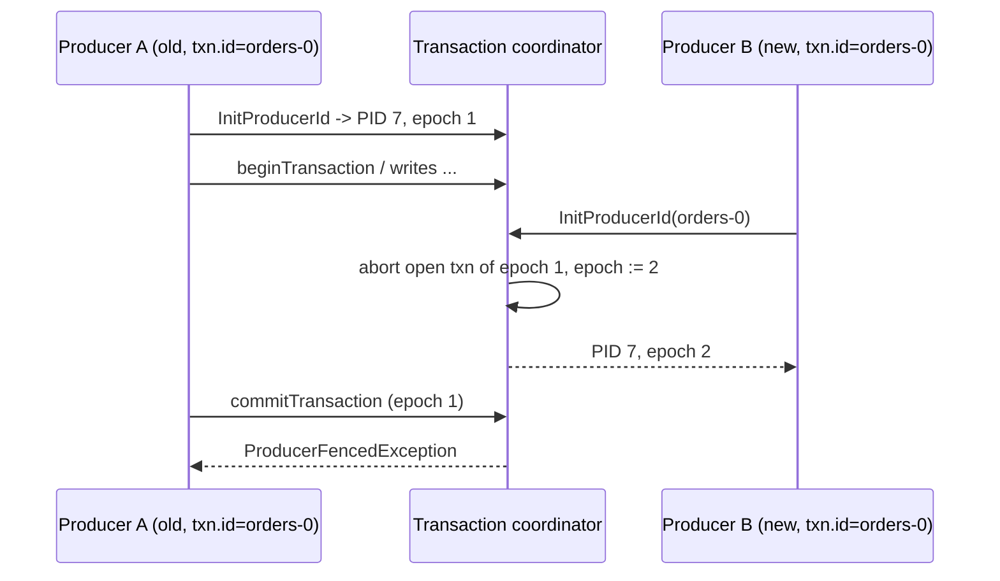

The ID must be unique per logical producer instance: in consume-transform-produce use one per input partition set (Streams
uses `<application.id>-<task>` or, under v2, `<application.id>-<thread>`). Gotcha: reusing one `transactional.id` across
parallel instances fences them against each other continuously.

**Follow-up probes.** What happens to the open transaction when the producer crashes and is not replaced? What does
`transactional.id.expiration.ms` control?

### Q61. What does `isolation.level=read_committed` change for a consumer?
**Role:** [DEV] | **Difficulty:** ★★☆ | **Topic:** Transactions

**Answer.**
The consumer only receives records below the last stable offset (LSO), the first offset of any still-open transaction in that
partition, and it skips batches belonging to aborted transactions using the aborted-transaction index returned by the broker.
`read_uncommitted` (default) returns everything up to the HW including data of transactions that may later abort. Effects:
a long-running or hung transaction blocks all readers of that partition, lag looks larger (measured to the HW), and
`endOffsets()` returns the LSO. Find and abort stuck transactions with `kafka-transactions.sh --bootstrap-server localhost:9092
find-hanging --broker-id 1` and `abort` (since 3.0, KIP-664). Gotcha: control records (commit/abort markers) occupy offsets, so
consumers see gaps in offsets and `position()` can jump; do not treat gaps as lost data.

**Follow-up probes.** Why can the LSO lag the HW even with a healthy producer? What is `transaction.timeout.ms` for?

### Q62. Why does `sendOffsetsToTransaction` take `ConsumerGroupMetadata`, and how is the consume-transform-produce loop structured?
**Role:** [DEV] | **Difficulty:** ★★★ | **Topic:** Transactions

**Answer.**
Because since KIP-447 (2.5) the transaction coordinator verifies the consumer's group generation and member ID when it writes
the offsets, so a producer whose consumer was kicked out of the group (a zombie) cannot commit stale offsets; this is what makes
one transactional producer per thread (instead of per partition) safe. The loop: `consumer.subscribe` with
`enable.auto.commit=false` and `isolation.level=read_committed`; for each `poll()` batch: `beginTransaction()`, process and
`send()` outputs, build the `offset+1` map per partition, `sendOffsetsToTransaction(offsets, consumer.groupMetadata())`,
`commitTransaction()`; on `ProducerFencedException`/`OutOfOrderSequenceException`/`AuthorizationException` close both clients
and exit; on other `KafkaException` call `abortTransaction()`, `consumer.seek` back to the last committed positions (or simply
re-poll, since the offsets were never committed) and retry. Gotcha: never commit offsets through the consumer in this pattern;
that would split the atomic unit.

**Follow-up probes.** Where are the offsets written and who reads them back after a restart? How does Streams hide this?

### Q63. Which exceptions are fatal to a transactional producer and which are recoverable?
**Role:** [DEV] | **Difficulty:** ★★☆ | **Topic:** Transactions

**Answer.**
Fatal (close the producer and create a new one): `ProducerFencedException`, `InvalidProducerEpochException` when raised as
fatal, `OutOfOrderSequenceException` that the client cannot recover, `UnsupportedVersionException`, `AuthorizationException`
(the transactional ID or topic is not authorised), and `IllegalStateException` from calling methods in the wrong order.
Recoverable (call `abortTransaction()` and retry the unit of work): any other `KafkaException`, including
`TimeoutException` from a send inside the transaction, `NotEnoughReplicasException`, `TransactionAbortedException`
delivered to callbacks of records in an aborted transaction, and `InvalidPidMappingException` after
`transactional.id.expiration.ms`, which the client handles by re-initialising. Gotcha: `commitTransaction()` can throw
`TimeoutException` after the commit actually succeeded on the broker; retrying `commitTransaction` is safe, aborting after a
commit timeout is not (it throws `IllegalStateException`).

**Follow-up probes.** Why is a retry of `commitTransaction` idempotent? What does the callback of an in-transaction send
receive when the transaction aborts?

### Q64. What does the transaction coordinator store, and what changed with KIP-890 in 4.0?
**Role:** [ARCH] | **Difficulty:** ★★★ | **Topic:** Transactions

**Answer.**
The coordinator for a `transactional.id` is the leader of its partition in the compacted `__transaction_state` topic
(`transaction.state.log.num.partitions=50`, `transaction.state.log.replication.factor=3`, `transaction.state.log.min.isr=2`);
it stores the PID and epoch, the transaction state (Empty, Ongoing, PrepareCommit, PrepareAbort, CompleteCommit, CompleteAbort)
and the set of partitions in the transaction, and writes commit/abort markers into every participating partition on completion.
Transactions expire after `transaction.timeout.ms` (producer, capped by broker `transaction.max.timeout.ms`, 15 min) and the
ID mapping after `transactional.id.expiration.ms` (7 days). KIP-890 (transactions v2, GA in 4.0 with `transaction.version=2`)
removes the client-side `AddPartitionsToTxn` round trip (the partition leader registers itself), bumps the epoch on every
commit or abort so a delayed write from a previous transaction can no longer sneak into the next one, and thereby closes the
"hanging transaction" class of bugs. Gotcha: v2 requires 4.0 brokers and clients; a 3.x client still uses the old flow.

**Follow-up probes.** How does a consumer learn that a batch was aborted (the `.txnindex`)? Why does a partition's LSO not
advance until the marker is written?

### Q65. Where does Kafka's exactly-once stop, and how do you extend it to an external system?
**Role:** [ARCH] | **Difficulty:** ★★☆ | **Topic:** Transactions

**Answer.**
Kafka transactions are atomic only across Kafka partitions (including `__consumer_offsets`); a database write, an HTTP call or an
email inside the loop is executed at least once. To extend: make the external effect idempotent (upsert keyed by a message ID, an
idempotency key on the HTTP request), store the consumed offset in the same database transaction as the data and seek to it on
start (the "offset in the sink" pattern used by JDBC sinks with `pk.mode=kafka`), or invert the flow with the outbox pattern so
the database is the source of truth and Kafka is fed by CDC. Deduplicate on the consumer with a key store when the producer
cannot be made idempotent. Gotcha: "exactly-once" in Streams means the state stores and outputs are consistent; a
`foreach` that calls a REST API inside a Streams topology is still at-least-once.

**Follow-up probes.** What does the "idempotent consumer" need to persist and for how long? Why is the outbox preferable to
dual writes?

## Error handling patterns

### Q66. What is a poison pill and what are the options for handling it?
**Role:** [DEV] | **Difficulty:** ★☆☆ | **Topic:** Error handling

**Answer.**
A poison pill is a record that fails processing deterministically (bad bytes, unknown schema ID, a null where the code expects a
value), so naive retry blocks the partition forever and, in a plain consumer, `poll()` throws the same
`RecordDeserializationException` on every call. Options, in order of preference: deserialize defensively (Spring
`ErrorHandlingDeserializer`, Streams `LogAndContinueExceptionHandler`, or raw bytes plus try/catch), route the record to a
dead-letter topic with context headers and skip it, or count attempts and skip after N. Never fix it by editing committed
offsets by hand in production. Gotcha: a poison pill on a compacted or keyed stream may be the latest state of a key; skipping
it means downstream keeps a stale value, so DLQ monitoring must be a paging alert for stateful pipelines.

**Follow-up probes.** How is a poison pill different from a transient failure? What does skipping do under exactly-once?

### Q67. Compare blocking retries with non-blocking retry topics.
**Role:** [DEV] | **Difficulty:** ★★☆ | **Topic:** Error handling

**Answer.**
Blocking retry (retry in place with backoff, pausing the partition) preserves ordering and needs no extra topics, but holds the
partition and must stay under `max.poll.interval.ms`; it fits transient errors with short recovery (a database failover).
Non-blocking retry publishes the failed record to `orders-retry-1s`, `orders-retry-10s`, ... consumed by delayed consumers, and
finally to `orders-dlq`, so the main partition keeps flowing, but ordering per key is lost and the retry consumer must delay
(pause the partition until `retry-after` in the header) rather than sleep.

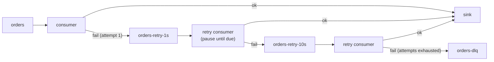

Decision rule: if a later record for the same key makes the retried record invalid, you need blocking retry or a key-aware
retry consumer. Gotcha: retry topics need the same retention, ACLs and schema subjects as the main topic, and the number of
partitions on retry topics decides retry parallelism.

**Follow-up probes.** How does Spring's `@RetryableTopic` implement the delay? How do you keep the original offset and
partition in the retried record?

### Q68. How do you design a dead-letter topic properly?
**Role:** [DEV] | **Difficulty:** ★★☆ | **Topic:** Error handling

**Answer.**
One DLQ per source topic (`<topic>.DLT` or `-dlq`) with the same partition count so partition affinity survives, the original
record bytes unchanged in key and value, and the context in headers: original topic, partition, offset, timestamp, exception
class and message, stack trace (truncated), consumer group, attempt count, and the failing host. Give it long retention, a
compatibility mode of `NONE` on its subject if you keep Avro, restrictive write ACLs, a dashboard on `MessagesInPerSec` and an
alert on any message for business-critical sources. Provide a replay tool that reads the DLQ, optionally patches records, and
produces them back to the original topic with the same key. Gotcha: never make the DLQ consumer's own failures go to the same
DLQ; a serialization bug then loops forever.

**Follow-up probes.** Should the DLQ store the deserialized object or the raw bytes? How do you avoid replaying a record that
was already fixed manually?

### Q69. What is an idempotent consumer and what does its deduplication store need?
**Role:** [DEV] | **Difficulty:** ★★☆ | **Topic:** Error handling

**Answer.**
A consumer that applies each logical message at most once even when Kafka delivers it more than once (at-least-once
redelivery, producer retries without idempotence, replays). It needs a stable message identity (an `event-id` header or a
business key; `topic-partition-offset` only covers redelivery, not a producer-side duplicate), a store checked before the side
effect and updated atomically with it (same database transaction, or Redis `SET NX EX`), and a TTL longer than the maximum
redelivery window (topic retention plus retry delays). Ordering of "check, apply, record" matters: recording first gives
at-most-once, applying first gives a window for duplicates unless both are in one transaction. Gotcha: with Kafka Streams the
same pattern is a `processValues` with a windowed store keyed by event ID, which is state-store size bounded by the window.

**Follow-up probes.** How large must the dedup window be for a 7-day topic? Where does the outbox pattern place this
responsibility?

### Q70. Explain the outbox pattern and why dual writes are wrong.
**Role:** [ARCH] | **Difficulty:** ★★☆ | **Topic:** Error handling

**Answer.**
Dual write (update the database, then `send()` to Kafka) fails when either half succeeds alone: a crash after the commit loses
the event, a Kafka failure after the send leaves an event without state. The outbox pattern writes the event into an `outbox`
table in the same database transaction as the state change, then a relay (Debezium's outbox event router SMT, or a poller)
publishes rows to Kafka and marks or deletes them; the event exists exactly if the state change committed.

```mermaid
sequenceDiagram
  participant S as Service
  participant DB as Database
  participant DZ as Debezium (CDC)
  participant K as Kafka
  S->>DB: BEGIN; UPDATE orders; INSERT INTO outbox(id, aggregate_id, type, payload); COMMIT
  DB-->>DZ: WAL / binlog change for outbox
  DZ->>K: produce(key=aggregate_id, value=payload, headers: id, type)
  Note over K: consumers dedup on outbox id (at-least-once relay)
```

Debezium's router config: `transforms.outbox.type=io.debezium.transforms.outbox.EventRouter`, `table.field.event.key`,
`route.by.field`. Gotcha: the relay is at-least-once, so consumers still need to be idempotent on the outbox ID; and the outbox
table must be pruned or it becomes the largest table in the database.

**Follow-up probes.** How do you preserve ordering per aggregate? What is the polling-relay alternative's cost?

### Q71. What is the claim-check pattern and when do you use it?
**Role:** [ARCH] | **Difficulty:** ★☆☆ | **Topic:** Error handling

**Answer.**
For payloads above the practical Kafka message size (a few hundred KB, or anything near `max.message.bytes`), the producer
stores the payload in an object store (S3, GCS, a blob table) and sends a small record with a reference (bucket, key, size,
checksum) plus routing metadata; the consumer fetches the payload by reference. Kafka keeps its throughput and page-cache
efficiency, the broker never holds large blobs, and the reference record can still be keyed and ordered. Requirements:
object-store retention at least as long as topic retention plus consumer lag, a lifecycle rule or a cleanup consumer, encryption
and ACLs on both stores, and a header (`claim-check=true`) so consumers know when to resolve. Gotcha: replaying an old offset
after the blob expired fails at the consumer, not at Kafka, so monitor "dangling reference" errors.

**Follow-up probes.** How do you keep exactly-once semantics with an external blob write? Would you inline small payloads and
claim-check only large ones?

### Q72. How do large messages interact with brokers and consumers, and what alternatives exist?
**Role:** [DEV] | **Difficulty:** ★★★ | **Topic:** Error handling

**Answer.**
A large record forces a large batch: it must fit `max.request.size` on the producer, `max.message.bytes` on the topic (checked
after compression, per batch), `replica.fetch.max.bytes` for replication, and it stalls the page cache and network threads while
it is copied; it also inflates `fetch.max.bytes` responses and makes `max.poll.records` batches uneven, so processing time per
poll becomes unpredictable and `max.poll.interval.ms` trips. Alternatives ordered by preference: claim check (Q71), splitting into
chunks with a `chunk-index`/`chunk-count` header reassembled by the consumer (must handle partial sequences after a rebalance,
so keep the chunks on one partition via the key), or compression when the payload is text. Indicatively, keep records under
1 MB and batches under 10 MB; sizes beyond that need a design review. Gotcha: a single 50 MB record on a topic with
`min.insync.replicas=2` can knock a slow follower out of the ISR during replication and cause `NotEnoughReplicas` for
everyone.

**Follow-up probes.** Why does compression not solve the chunking problem for binary data? How does tiered storage change the
calculus?

## Spring Kafka (Spring-specific)

### Q73. How does `@KafkaListener` map to consumers, threads and acknowledgement modes?
**Role:** [DEV] | **Difficulty:** ★☆☆ | **Topic:** Spring Kafka

**Answer.**
Each `@KafkaListener(topics = "orders", groupId = "billing", concurrency = "3")` creates a
`ConcurrentMessageListenerContainer` with `concurrency` child containers, each owning one `KafkaConsumer` on its own thread,
so `concurrency` should not exceed the partition count. The container's `AckMode` decides when offsets are committed:
`BATCH` (default; after the whole poll batch is processed), `RECORD`, `TIME`, `COUNT`, `MANUAL` (commit after the batch when
`Acknowledgment.acknowledge()` was called) and `MANUAL_IMMEDIATE` (commit immediately). Set it with
`spring.kafka.listener.ack-mode=manual_immediate` and inject `Acknowledgment ack` into the method; `ack.nack(Duration)`
re-delivers after a pause. The method can receive `ConsumerRecord`, the payload, `@Header` values, or `List<...>` in batch mode.
Gotcha: Spring disables `enable.auto.commit` itself; do not set it to true in properties or you get double commits.

**Follow-up probes.** What happens to concurrency when a topic has fewer partitions? How does Spring decide the deserializer?

### Q74. How do Spring Kafka error handlers and `ErrorHandlingDeserializer` work together?
**Role:** [DEV] | **Difficulty:** ★★☆ | **Topic:** Spring Kafka

**Answer.**
The container's `CommonErrorHandler` (default `DefaultErrorHandler` with 9 retries and no backoff) catches listener exceptions:
it seeks the unprocessed records back and retries per its `BackOff` (`new DefaultErrorHandler(recoverer, new
ExponentialBackOffWithMaxRetries(5))`), then invokes the recoverer, typically `DeadLetterPublishingRecoverer(kafkaTemplate)`
which sends to `<topic>.DLT` (same partition by default) with exception headers.

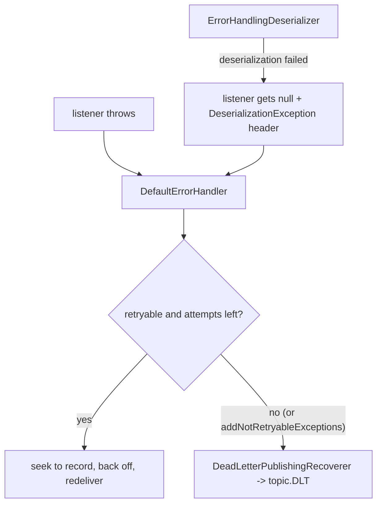

`ErrorHandlingDeserializer` wraps the real deserializer (`spring.deserializer.value.delegate.class`) so a bad payload does not
break `poll()`; the handler then routes it to the DLT immediately because `DeserializationException` is not retryable.
Exceptions such as `DeserializationException`, `MessageConversionException`, `ClassCastException` are non-retryable by default;
add your own with `addNotRetryableExceptions`. Gotcha: for batch listeners throw `BatchListenerFailedException(msg, index)` so
the handler knows which record failed; otherwise the whole batch is retried.

**Follow-up probes.** How do you commit the offset of a record sent to the DLT? What does `setAckAfterHandle` change?

### Q75. What does `@RetryableTopic` do and what are its trade-offs?
**Role:** [DEV] | **Difficulty:** ★★☆ | **Topic:** Spring Kafka

**Answer.**
`@RetryableTopic(attempts = "4", backoff = @Backoff(delay = 1000, multiplier = 2.0), dltTopicSuffix = "-dlt")` on a listener
turns blocking retries into non-blocking retry topics: Spring creates `orders-retry-1000`, `orders-retry-2000`,
`orders-retry-4000` (naming via `topicSuffixingStrategy` and `sameIntervalTopicReuseStrategy`) and `orders-dlt`, a listener
per retry topic that pauses the partition until the record's due time (a `retry_topic-backoff-timestamp` header), and calls
the method annotated `@DltHandler` when attempts are exhausted. `include`/`exclude` select exception types; `autoCreateTopics`
should be `false` in production with topics provisioned with the right partitions and retention; `dltStrategy = DltStrategy.
FAIL_ON_ERROR` re-attempts the DLT publish. Trade-offs: ordering per key is lost, topic count multiplies, and each retry
consumer uses `concurrency` threads. Gotcha: with `AckMode.MANUAL` the retry send and the original acknowledgement are not
atomic; enable the container's transaction manager if the duplicate matters.

**Follow-up probes.** How does it behave with batch listeners? How do you observe retry rates per level?

### Q76. How do `KafkaTemplate` and Spring transactions fit together?
**Role:** [DEV] | **Difficulty:** ★★★ | **Topic:** Spring Kafka

**Answer.**
`KafkaTemplate.send()` returns a `CompletableFuture<SendResult<K,V>>` (since Spring Kafka 3.0) built on a `ProducerFactory`;
`sendDefault`, `send(Message)` and `RoutingKafkaTemplate` (per-topic producers) and `ReplyingKafkaTemplate` (request/reply
over Kafka) are variants. Setting `spring.kafka.producer.transaction-id-prefix=tx-` makes the factory transactional; then
`kafkaTemplate.executeInTransaction(t -> ...)` or a `@Transactional` method with a `KafkaTransactionManager` wraps sends in a
Kafka transaction, and a `@KafkaListener` container configured with that transaction manager runs
consume-transform-produce with `sendOffsetsToTransaction` automatically (set `isolation.level=read_committed` on consumers).
For Kafka plus JPA, the recommended approach is `@Transactional` on the JPA manager with the listener container's Kafka
transaction synchronised ("best effort 1PC"; `ChainedKafkaTransactionManager` is deprecated). Gotcha: the transactional
producer pool assigns `transactional.id` values as `<prefix><n>` per thread; on listener containers Spring appends
`group.topic.partition` for fencing (`producerPerConsumerPartition`), so do not disable that without understanding zombies.

**Follow-up probes.** Why are the JPA and Kafka commits not atomic? When does `KafkaTemplate.flush()` matter?

### Q77. How do batch listeners and manual acknowledgement work in Spring Kafka?
**Role:** [DEV] | **Difficulty:** ★★★ | **Topic:** Spring Kafka

**Answer.**
Set `spring.kafka.listener.type=batch` (or `batch = "true"` on the annotation) and the method receives
`List<ConsumerRecord<K,V>>` (or `ConsumerRecords`) for one `poll()`, bounded by `max.poll.records`; with `AckMode.MANUAL` you
call `ack.acknowledge()` once for the batch, or `ack.nack(index, Duration)` to commit records before `index`, pause, and
redeliver from `index`. Failures: throw `BatchListenerFailedException(message, record)` so `DefaultErrorHandler` commits the
successful prefix, retries from the failing record, and sends only that record to the DLT; a plain exception retries the whole
batch (`FallbackBatchErrorHandler` semantics with backoff and pause). Use batch mode for sinks that benefit from bulk writes
(JDBC, Elasticsearch). Gotcha: `max.poll.interval.ms` now bounds the processing of the whole batch, and batch listeners with
`@RetryableTopic` are not supported; combine batch mode with `DefaultErrorHandler` instead.

**Follow-up probes.** How would you implement per-partition ordering within a batch? What does the container do on
`nack` regarding rebalances?

## Testing

### Q78. How do `MockProducer` and `MockConsumer` work and what can they test?
**Role:** [DEV] | **Difficulty:** ★☆☆ | **Topic:** Testing

**Answer.**
`MockProducer<K,V>` (`new MockProducer<>(autoComplete, keySerializer, valueSerializer)`) implements `Producer` and records every
`send()` in `history()`; with `autoComplete=false` you drive completion with `completeNext()` or `errorNext(exception)` to test
callbacks and retry logic, and `flush()`, transactions (`initTransactions`, `beginTransaction`, `commitTransaction`,
`transactionCommitted()`, `sentOffsets()`) and `close()` are all tracked. `MockConsumer<K,V>`
(`new MockConsumer<>(OffsetResetStrategy.EARLIEST)` in 3.9; a string-based constructor in 4.0) requires you to
`assign()` or simulate a subscription with `rebalance(partitions)`, set `updateBeginningOffsets`/`updateEndOffsets`, and
`addRecord(new ConsumerRecord<>(...))` before `poll()`; `schedulePollTask(Runnable)` injects actions (like `wakeup()`) into the
next poll. They test your code's use of the API, not the broker's behaviour. Gotcha: `MockConsumer` does not run rebalance
listeners unless you call `rebalance()` yourself, and it ignores `max.poll.records`.

**Follow-up probes.** How do you test a `ConsumerRebalanceListener` with `MockConsumer`? What can only be tested against a
real broker?

### Q79. Testcontainers or embedded Kafka: how do you choose and set each up?
**Role:** [DEV] | **Difficulty:** ★★☆ | **Topic:** Testing

**Answer.**
Testcontainers runs a real broker in Docker (`org.testcontainers.kafka.KafkaContainer` with `apache/kafka:3.9.0` or
`apache/kafka-native:3.9.0` in KRaft mode; the older `org.testcontainers.containers.KafkaContainer` targets
`confluentinc/cp-kafka` and `ConfluentKafkaContainer` its 7.x images), giving production-identical behaviour for rebalances,
transactions and version-specific features at the cost of Docker on CI and a few seconds of startup; share one container
per test class or JVM. Embedded Kafka (Spring's `@EmbeddedKafka(partitions = 3, topics = "orders")` backed by
`EmbeddedKafkaKraftBroker` in Spring Kafka 3.x, or `KafkaClusterTestKit` from `kafka-server` test artifacts) runs in-process,
faster and Docker-free, but pulls the broker and its dependencies into your test classpath and diverges in subtle ways
(single node, classpath conflicts with Scala versions). Rule: Testcontainers for integration tests, TopologyTestDriver and mocks
for unit tests, embedded only when Docker is unavailable. Gotcha: Kafka 4.0 removed ZooKeeper, so any embedded or container
setup that still uses `zookeeper.connect` fails; use KRaft images and the KRaft test kit.

**Follow-up probes.** How do you wait for a consumer group to be stable in a test (`Awaitility` on `describeConsumerGroups`)?
How do you reuse a container across modules?

### Q80. What does a complete test strategy for a Kafka application look like?
**Role:** [ARCH] | **Difficulty:** ★★★ | **Topic:** Testing

**Answer.**
Layered: (1) unit tests of serializers, partitioners, handlers and Streams topologies with `TopologyTestDriver`, `MockProducer`
and `MockConsumer`, run in milliseconds; (2) contract tests of schemas against the registry's compatibility rules in CI
(`kafka-schema-registry-maven-plugin:test-compatibility`) so an incompatible change fails the build, not production;
(3) integration tests with Testcontainers covering the real behaviours: rebalance with a `ConsumerRebalanceListener`, EOS
commit/abort, retries to the DLT, and consumer restart from committed offsets, asserting with `Awaitility` on
`AdminClient.listConsumerGroupOffsets` rather than `Thread.sleep`; (4) failure injection with Toxiproxy (latency, connection
cut) to verify `delivery.timeout.ms` and `max.poll.interval.ms` handling; (5) a performance baseline with
`kafka-producer-perf-test.sh --bootstrap-server localhost:9092 --topic t --num-records 1000000 --record-size 1024
--throughput -1 --producer-props acks=all` recorded as an indicative number per release. Gotcha: tests that use `auto.offset.reset=latest`
with a consumer started after the produce are flaky by design; produce after the group is stable or use `earliest` with a
unique `group.id` per test.

**Follow-up probes.** How do you test a Streams app's behaviour on a rebalance? What is the minimum test for a custom SMT?
