# Admin Question Bank

**Roles:** [ADMIN]   **Level:** Foundation → Advanced
**Baseline:** Apache Kafka 3.9 / 4.0, KRaft mode. ZooKeeper appears only in the migration section.

This bank contains 80 questions for Kafka administrators and SREs. Every answer leads with the direct answer, then the mechanism, then the gotcha, and names the exact config, metric, MBean, or script involved. Use it for interview preparation, on-call onboarding, or as a self-test after reading the admin chapters. Difficulty mix: about 30% ★☆☆, 45% ★★☆, 25% ★★★.

## Table of contents

| # | Topic | Questions |
|---|-------|-----------|
| 1 | Installation and KRaft bootstrap | Q1–Q7 |
| 2 | Hardware, OS and JVM tuning | Q8–Q12 |
| 3 | Broker configuration and dynamic configs | Q13–Q19 |
| 4 | Topic and partition management | Q20–Q25 |
| 5 | Reassignment, leader election, Cruise Control, quotas | Q26–Q32 |
| 6 | Consumer group administration | Q33–Q36 |
| 7 | Cluster lifecycle: restarts, brokers, disks, controllers | Q37–Q43 |
| 8 | Monitoring and logging | Q44–Q51 |
| 9 | Security | Q52–Q61 |
| 10 | Backup and disaster recovery | Q62–Q66 |
| 11 | Upgrades, ZooKeeper→KRaft migration, Kafka 4.0 | Q67–Q72 |
| 12 | Troubleshooting | Q73–Q80 |

---

## 1. Installation and KRaft bootstrap

### Q1. What does `process.roles` control, and what else must be set for each role?
**Role:** [ADMIN] | **Difficulty:** ★☆☆ | **Topic:** KRaft bootstrap

**Answer.**
`process.roles` decides whether a node is a `broker`, a `controller`, or both (`broker,controller`, called combined mode). Every node needs a cluster-unique `node.id`; controllers additionally need `controller.listener.names` plus a matching entry in `listeners`, and brokers need to know how to reach the quorum (`controller.quorum.voters` for a static quorum or `controller.quorum.bootstrap.servers` for a dynamic quorum, see Q3). Combined mode is fine for development and small clusters; in production run 3 or 5 dedicated controllers so metadata replication and elections are not delayed by broker I/O or GC. Since 4.0 the ZooKeeper code path is gone, so a node without `process.roles` refuses to start, and `zookeeper.connect` is an unknown config.

> **Production tip:** keep controller configs minimal (`process.roles=controller`, `node.id`, `listeners=CONTROLLER://:9093`, `controller.listener.names=CONTROLLER`, `log.dirs`) and give them their own SSD; the metadata log is fsynced on every append.

**Follow-up probes.** Why 3 or 5 controllers and never 2 or 4? What happens to brokers if all controllers are down (they keep serving, but no metadata changes, and new brokers cannot register)?

### Q2. Walk through bootstrapping a fresh 3-controller / 3-broker KRaft cluster.
**Role:** [ADMIN] | **Difficulty:** ★☆☆ | **Topic:** KRaft bootstrap

**Answer.**
Generate one cluster id, format every node's log directories with it, start controllers, then brokers, then verify the quorum. `kafka-storage.sh format` writes a `meta.properties` file into each directory listed in `log.dirs` and `metadata.log.dir`; a node with an unformatted directory will not start in KRaft mode.

```bash
CLUSTER_ID=$(bin/kafka-storage.sh random-uuid)          # run once, reuse everywhere
# controllers (3.9: config/kraft/controller.properties, 4.0: config/controller.properties)
# dynamic quorum (KIP-853): each entry is id@host:port:directory-id, directory ids from random-uuid
bin/kafka-storage.sh format -t $CLUSTER_ID -c config/controller.properties \
  --initial-controllers "1@ctrl1:9093:$D1,2@ctrl2:9093:$D2,3@ctrl3:9093:$D3"
# brokers
bin/kafka-storage.sh format -t $CLUSTER_ID -c config/broker.properties
bin/kafka-server-start.sh -daemon config/controller.properties   # on each controller first
bin/kafka-server-start.sh -daemon config/broker.properties       # then each broker
bin/kafka-metadata-quorum.sh --bootstrap-server broker1:9092 describe --status
```

The gotcha is that `--initial-controllers` must list the same three controllers with the same directory ids on all three nodes, otherwise you create three one-node clusters. For a static quorum you omit `--initial-controllers` and put `controller.quorum.voters=1@ctrl1:9093,2@ctrl2:9093,3@ctrl3:9093` in every config.

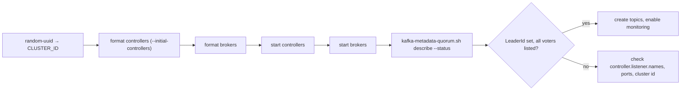

**Follow-up probes.** What does `--standalone` do (formats a single-controller dynamic quorum)? Why must controllers start before brokers (brokers block in `STARTING` until they can register with the active controller)?

### Q3. Compare a static `controller.quorum.voters` quorum with a KIP-853 dynamic quorum. How do you add and remove a controller in each?
**Role:** [ADMIN] | **Difficulty:** ★★☆ | **Topic:** KRaft quorum

**Answer.**
A static quorum hard-codes the voter set in `controller.quorum.voters` on every node; changing it means editing all configs and doing a rolling restart, and there is no safe way to replace a failed controller id without downtime risk. A dynamic quorum (KIP-853, production-ready since 3.9, `kraft.version=1`) stores the voter set in the metadata log itself; nodes only need `controller.quorum.bootstrap.servers=ctrl1:9093,ctrl2:9093,ctrl3:9093` to find the quorum.

| Operation | Static (`kraft.version=0`) | Dynamic (`kraft.version=1`) |
|-----------|----------------------------|-----------------------------|
| Bootstrap | `controller.quorum.voters` everywhere | `format --standalone` or `--initial-controllers` |
| Add controller | edit config on all nodes, rolling restart | `kafka-storage.sh format -t ID -c ctrl4.properties --no-initial-controllers`, start it as observer, then `kafka-metadata-quorum.sh --command-config ctrl4.properties --bootstrap-server b1:9092 add-controller` |
| Remove controller | edit config on all nodes, rolling restart | `kafka-metadata-quorum.sh --bootstrap-server b1:9092 remove-controller --controller-id 4 --controller-directory-id <uuid>` |
| Upgrade path | – | `kafka-features.sh --bootstrap-server b1:9092 upgrade --feature kraft.version=1` once all nodes run ≥3.9 |

Gotcha: setting both `controller.quorum.voters` and `controller.quorum.bootstrap.servers` is rejected at startup, and `add-controller` must be run with the new controller's own properties file so the tool can read its `node.id`, listeners and `directory.id`.

**Follow-up probes.** What happens to the quorum size when you add a fourth voter (majority becomes 3 of 4; always go back to an odd number)? Where do you find the directory id (`meta.properties` in `metadata.log.dir`)?

### Q4. What is stored in `meta.properties`, and what errors do you see when it is wrong?
**Role:** [ADMIN] | **Difficulty:** ★★☆ | **Topic:** KRaft bootstrap

**Answer.**
`meta.properties` (version 1) holds `cluster.id`, `node.id`, and since 3.7 a per-directory `directory.id` used by JBOD-aware replica placement. It lives in every `log.dirs` entry and in `metadata.log.dir`. If `cluster.id` differs from what the controller reports, the node fails with `InconsistentClusterIdException`; if `node.id` differs from the config you get `InconsistentNodeIdException`; a directory without the file stops startup with a message that the log directory is not formatted. The fix for a new or replaced disk is `bin/kafka-storage.sh format -t <cluster-id> -c server.properties --ignore-formatted`, which formats only the empty directories. Never copy `meta.properties` from another node: two directories with the same `directory.id` confuse the controller's replica-to-directory mapping.

**Follow-up probes.** How do you read the cluster id of a running cluster (`kafka-cluster.sh cluster-id --bootstrap-server b1:9092`)? Why does a cloned VM image cause `InconsistentNodeIdException`?

### Q5. How does the `__cluster_metadata` log work, how does it grow, and how do you inspect it?
**Role:** [ADMIN] | **Difficulty:** ★★☆ | **Topic:** KRaft internals

**Answer.**
All cluster metadata (brokers, topics, partitions, ISR, configs, ACLs, SCRAM credentials, quotas, features) is a single-partition Raft log, `__cluster_metadata-0`, stored under `metadata.log.dir` (defaults to the first `log.dirs` entry). Controllers replicate it as voters; brokers fetch it as observers and apply records into their in-memory metadata image. Growth is bounded by snapshots: a new snapshot is written after `metadata.log.max.record.bytes.between.snapshots` (20 MiB) or `metadata.log.max.snapshot.interval.ms` (1 h), and old segments are deleted per `metadata.max.retention.bytes` (100 MiB) and `metadata.max.retention.ms` (7 days). Inspect with `bin/kafka-dump-log.sh --cluster-metadata-decoder --files /data/kafka/__cluster_metadata-0/00000000000000000000.log` or open a snapshot in the metadata shell `bin/kafka-metadata.sh --snapshot /data/kafka/__cluster_metadata-0/00000000000012345678-0000000042.checkpoint`. Watch `kafka.controller:type=KafkaController,name=LastAppliedRecordLagMs` on controllers and `kafka.server:type=broker-metadata-metrics,name=last-applied-record-lag-ms` on brokers; a growing lag means a broker is falling behind on metadata, not on data.

**Follow-up probes.** What is the difference between `LastCommittedRecordOffset` and `LastAppliedRecordOffset`? What happens if `metadata.log.dir` fills up (the controller stops accepting metadata changes; brokers cannot register)?

### Q6. Explain `listeners`, `advertised.listeners`, `listener.security.protocol.map`, `inter.broker.listener.name` and `controller.listener.names` and how they fit together.
**Role:** [ADMIN] | **Difficulty:** ★☆☆ | **Topic:** Broker configuration

**Answer.**
`listeners` is what the process binds; `advertised.listeners` is what it tells clients and other brokers to connect to; the other three pick which listener each traffic type uses.

| Config | Example | Purpose |
|--------|---------|---------|
| `listeners` | `INTERNAL://0.0.0.0:9092,EXTERNAL://0.0.0.0:9094,CONTROLLER://0.0.0.0:9093` | bind addresses, one per named listener |
| `advertised.listeners` | `INTERNAL://b1.internal:9092,EXTERNAL://b1.example.com:9094` | addresses returned in metadata responses; must be resolvable from the client |
| `listener.security.protocol.map` | `INTERNAL:SASL_SSL,EXTERNAL:SASL_SSL,CONTROLLER:SSL` | protocol per listener name |
| `inter.broker.listener.name` | `INTERNAL` | replication and inter-broker RPC (do not also set `security.inter.broker.protocol`) |
| `controller.listener.names` | `CONTROLLER` | brokers use it to talk to controllers; controllers bind it |

The classic gotcha is a client that reaches the bootstrap address but then fails with `Connection to node 1 (b1/10.0.0.1:9092) could not be established` because `advertised.listeners` points at an address that is only valid inside the cluster network. Each named listener needs its own security config prefix, for example `listener.name.external.ssl.keystore.location`.

**Follow-up probes.** How would you expose a cluster to Kubernetes-external clients (one advertised listener per broker with a NodePort or LoadBalancer)? Why is the controller listener never returned in client metadata?

### Q7. How do you verify quorum health, and how do you diagnose a controller leadership that keeps flapping?
**Role:** [ADMIN] | **Difficulty:** ★★★ | **Topic:** KRaft quorum

**Answer.**
Start with `bin/kafka-metadata-quorum.sh --bootstrap-server b1:9092 describe --status` (LeaderId, LeaderEpoch, HighWatermark, MaxFollowerLag, MaxFollowerLagTimeMs, CurrentVoters, CurrentObservers) and `describe --replication` for per-node log end offsets and lag. A healthy quorum has one leader whose epoch is stable and `MaxFollowerLagTimeMs` in the low hundreds of milliseconds. Flapping shows up as a rising `kafka.server:type=raft-metrics,name=current-epoch`, spikes in `election-latency-avg`, and `ActiveControllerCount` moving between nodes. The usual causes, in order of likelihood: GC pauses or a slow fsync on `metadata.log.dir` making the leader miss `controller.quorum.fetch.timeout.ms` (2000 ms) so followers start an election; a saturated network or a firewall dropping the controller port; or a combined-mode node whose broker side is starving the controller thread. Fix the root cause (dedicated SSD, heap of a few GB with G1, dedicated controllers) before raising `controller.quorum.election.timeout.ms` (1000 ms) or `controller.quorum.fetch.timeout.ms`; raising them just lengthens every real failover.

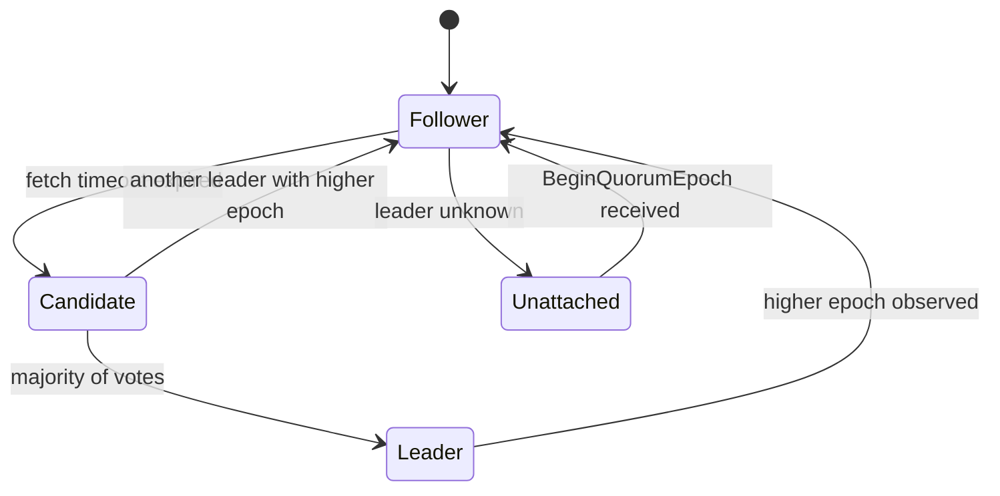

**Follow-up probes.** What does `number-unknown-voter-connections` > 0 indicate? Why is a 4-node quorum no better than a 3-node quorum (both tolerate one failure)?

## 2. Hardware, OS and JVM tuning

### Q8. What hardware profile do you give a Kafka broker and why?
**Role:** [ADMIN] | **Difficulty:** ★☆☆ | **Topic:** Hardware

**Answer.**
Brokers are network- and disk-throughput-bound, not CPU-bound, so prioritize NICs, sequential disk throughput and RAM for page cache. An indicative general-purpose profile is 8–16 vCPU, 32–64 GiB RAM (of which only 6–8 GiB is JVM heap; the rest is page cache), 10–25 Gbit/s network, and NVMe SSD or several SATA/SAS disks in JBOD or RAID 10. Avoid RAID 5/6 (write penalty on the sequential append path) and avoid NAS/NFS. CPU matters when TLS is enabled on all listeners (encryption disables zero-copy `sendfile`) or when the broker has to recompress because `compression.type` on the topic differs from the producer's. Controllers are small: 4 vCPU, 8–16 GiB, a fast SSD for the metadata log. Figures are indicative; measure with `kafka-producer-perf-test.sh` and `kafka-consumer-perf-test.sh` on the actual hardware.

**Follow-up probes.** What changes if you run tiered storage (smaller local disks, more network)? Why does more RAM often help more than more CPU?

### Q9. Which Linux kernel and OS settings do you change on a broker, and why?
**Role:** [ADMIN] | **Difficulty:** ★★☆ | **Topic:** OS tuning

**Answer.**

| Setting | Recommended | Why |
|---------|-------------|-----|
| `vm.swappiness` | `1` | swapping a broker heap causes multi-second pauses and ISR shrinks |
| `vm.dirty_background_ratio` / `vm.dirty_ratio` | `5` / `60`–`80` | let the page cache absorb bursts; flushes happen in the background; replication, not fsync, provides durability |
| `vm.max_map_count` | `262144` or higher | every segment maps `.index` and `.timeindex`; thousands of partitions exceed the default 65530 and fail with `Map failed` |
| `fs.file-max` and `LimitNOFILE=200000` in the systemd unit | ≥ 100000 | each segment is 3–4 open files plus one per client connection; `Too many open files` kills the log dir |
| `net.core.rmem_max`, `net.core.wmem_max`, `net.ipv4.tcp_rmem`, `net.ipv4.tcp_wmem` | ≥ 4–16 MiB max | cross-AZ and high-throughput links need larger socket buffers; pair with `socket.send.buffer.bytes` / `socket.receive.buffer.bytes` on the broker |
| `net.core.somaxconn`, `net.ipv4.tcp_max_syn_backlog` | 4096+ | reconnect storms after a broker restart |
| Filesystem | XFS, `noatime` | XFS handles large sequential files and many directories well; `noatime` removes a write per read |
| Transparent huge pages | disabled (`never`) | THP compaction stalls the JVM |
| Clock | chrony/NTP | timestamps, SASL/Kerberos, TLS validity, MM2 checkpoints depend on it |

Set file limits in the systemd unit, not only in `/etc/security/limits.conf`, because systemd services ignore PAM limits. Verify with `cat /proc/$(pgrep -f kafka.Kafka)/limits`.

**Follow-up probes.** Why is a high `vm.dirty_ratio` acceptable for Kafka when it would be dangerous for a database? What is the risk of `noatime` for compliance tooling?

### Q10. How do you size and tune the broker JVM?
**Role:** [ADMIN] | **Difficulty:** ★★☆ | **Topic:** JVM tuning

**Answer.**
Give the broker a small heap and leave the rest of RAM to the page cache: 6 GiB is a common production heap, rarely more than 8–12 GiB, because the broker keeps little on-heap (request buffers, indexes are mmapped off-heap, records go through the page cache). Use G1 with a short pause target, as in `KAFKA_HEAP_OPTS="-Xms6g -Xmx6g"` and `KAFKA_JVM_PERFORMANCE_OPTS="-server -XX:+UseG1GC -XX:MaxGCPauseMillis=20 -XX:InitiatingHeapOccupancyPercent=35 -XX:G1HeapRegionSize=16M -XX:MetaspaceSize=96m -XX:MinMetaspaceFreeRatio=50 -XX:MaxMetaspaceFreeRatio=80 -XX:+ExplicitGCInvokesConcurrent -Djava.awt.headless=true"`. Enable GC logging (`KAFKA_GC_LOG_OPTS` writes `logs/kafkaServer-gc.log`) and export `java.lang:type=GarbageCollector,name=G1 Young Generation` `CollectionTime`. Kafka 4.0 requires Java 17 for brokers, Connect and tools (clients and Streams still support Java 11); Java 17 also makes ZGC an option for latency-sensitive clusters, but test it, because G1 is what most deployments run. The gotcha is a large heap combined with `socket.request.max.bytes` or big `replica.fetch.response.max.bytes`: humongous allocations fragment G1 and produce long pauses that show up as `IsrShrinksPerSec` spikes.

**Follow-up probes.** Why does a GC pause longer than `broker.session.timeout.ms` (9 s) cause the controller to fence the broker? How would you confirm a pause caused an ISR shrink (correlate GC log timestamps with `kafka.server:type=ReplicaManager,name=IsrShrinksPerSec`)?

### Q11. Disk layout: XFS or ext4, RAID or JBOD, one disk or many, and where does the metadata log go?
**Role:** [ADMIN] | **Difficulty:** ★★☆ | **Topic:** Storage

**Answer.**
Use XFS on dedicated data disks mounted `noatime`, keep the OS and Kafka application logs on a separate device, and choose between RAID 10 and JBOD based on how you want to handle disk failure. RAID 10 hides a single disk failure from Kafka at the cost of half the capacity; JBOD (`log.dirs=/data1,/data2,/data3`) gives full capacity and per-disk throughput, and since KIP-858 (3.7) is supported in KRaft, where the controller tracks which directory each replica lives in. With JBOD, a failed disk takes only its partitions offline on that broker and the controller elects new leaders elsewhere; you then replace the disk and re-replicate (see Q41). Never use RAID 5/6 or network filesystems. For controllers, or combined-mode nodes, put `metadata.log.dir` on its own fast SSD: the Raft log is fsynced on every append and a slow fsync directly becomes controller latency. Kafka does not balance new partitions by disk usage; it places new replicas on the directory with the fewest partitions, so monitor `kafka.log:type=LogManager,name=LogDirectoryOffline,logDirectory=...` per directory and use `kafka-reassign-partitions.sh` with `log_dirs` (Q29) or Cruise Control to level disks.

**Follow-up probes.** What are the pros and cons of one big volume versus several with JBOD? Why is EBS-style network-attached block storage acceptable while NFS is not?

### Q12. How do the page cache and zero-copy transfer shape Kafka performance, and what breaks them?
**Role:** [ADMIN] | **Difficulty:** ★★★ | **Topic:** Internals

**Answer.**
Kafka writes go to the page cache and are acknowledged once replicated, not once fsynced; reads for consumers that are near the tail are served from the same page cache and sent with `sendfile` (zero-copy) straight from the cache to the socket, so a healthy broker does almost no disk reads and copies nothing through the JVM. Three things break this: (1) lagging consumers that read days-old data force disk reads and evict hot pages for everyone (page cache thrash, visible as rising `iowait` and `kafka.network:type=RequestMetrics,name=LocalTimeMs,request=FetchConsumer`); (2) TLS on the listener, because data must be encrypted in user space, which disables `sendfile` and adds CPU; (3) format conversion, either a topic `compression.type` different from what the producer used or, before 4.0, old `log.message.format.version` down-conversion for very old clients (4.0 removed message formats v0/v1 and clients older than 2.1). Size RAM so that the working set (roughly ingest rate × the time your slowest healthy consumer lags × 2) fits in cache, and isolate historical replays on a separate cluster, on tiered storage (`remote.storage.enable=true`, reads served from object storage through a separate path), or by throttling them with quotas.

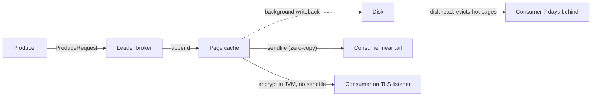

**Follow-up probes.** How do you see whether fetches are hitting disk (`iostat -x`, `kafka.server:type=BrokerTopicMetrics,name=BytesOutPerSec` versus disk read throughput)? Why does replication traffic also benefit from the page cache?

## 3. Broker configuration and dynamic configs

### Q13. How do `log.retention.ms`, `log.retention.bytes`, `log.segment.bytes` and `log.roll.ms` interact?
**Role:** [ADMIN] | **Difficulty:** ★☆☆ | **Topic:** Broker configuration

**Answer.**
Retention is enforced per segment, never per record, so a message is deleted only when its whole segment is eligible. A segment closes when it reaches `log.segment.bytes` (1 GiB default) or its age reaches `log.roll.ms` (`log.roll.hours=168` default), and the active segment is never deleted. `log.retention.ms` (topic: `retention.ms`) deletes closed segments whose newest timestamp is older than the limit; `log.retention.bytes` (topic: `retention.bytes`) is per partition, not per topic, and deletes oldest segments once the partition exceeds it; whichever triggers first wins. Deletion runs every `log.retention.check.interval.ms` (5 min), and deleted files are first renamed with a `.deleted` suffix and removed after `log.segment.delete.delay.ms` (60 s). Practical consequence: a low-volume topic with `retention.ms=3600000` and default segment size keeps data for up to 7 days because the segment never fills; set `segment.ms` lower to make retention precise, but not so low that you create thousands of tiny segments and index files.

**Follow-up probes.** Why does `retention.bytes=10GB` on a 12-partition topic allow 120 GB on disk? What does `log.message.timestamp.type=LogAppendTime` change for retention of replayed historical data?

### Q14. Explain the broker thread pools, their configs, and the metrics that tell you when to change them.
**Role:** [ADMIN] | **Difficulty:** ★★☆ | **Topic:** Broker configuration

**Answer.**

| Config | Default | Thread pool | Saturation metric |
|--------|---------|-------------|-------------------|
| `num.network.threads` | 3 (per listener) | read requests from sockets, write responses | `kafka.network:type=SocketServer,name=NetworkProcessorAvgIdlePercent` < 0.3 |
| `num.io.threads` | 8 | request handlers: append to log, serve fetches | `kafka.server:type=KafkaRequestHandlerPool,name=RequestHandlerAvgIdlePercent` < 0.3 |
| `num.replica.fetchers` | 1 | follower fetch threads per source broker | `kafka.server:type=ReplicaFetcherManager,name=MaxLag,clientId=Replica` growing, URP during load |
| `background.threads` | 10 | retention, segment deletion, misc | rarely changed |
| `num.recovery.threads.per.data.dir` | 1 (2 since 4.0) | log recovery at unclean start and shutdown flush | startup time after crash; raise to core count during recovery |
| `log.cleaner.threads` | 1 | compaction | `kafka.log:type=LogCleanerManager,name=max-dirty-percent` staying high |
| `queued.max.requests` | 500 | bound on request queue before network threads stop reading | `kafka.network:type=RequestChannel,name=RequestQueueSize` near limit |

Raise `num.io.threads` to roughly the core count and `num.network.threads` when idle percent stays below 30%; raise `num.replica.fetchers` (2–4) when followers lag under high ingest with many partitions from the same leader. All of these are dynamic cluster-wide configs except the recovery threads, so you can change them without a restart (`kafka-configs.sh --bootstrap-server b1:9092 --entity-type brokers --entity-default --alter --add-config num.io.threads=16`). A common gotcha is raising I/O threads on a disk-bound broker: idle percent stays low because threads block on disk, and more threads only add contention.

**Follow-up probes.** Why does a request that waits on followers (acks=all) not occupy an I/O thread (purgatory)? What is `RequestQueueTimeMs` telling you versus `LocalTimeMs`?

### Q15. Trace a 5 MB record through every size limit from producer to consumer.
**Role:** [ADMIN] | **Difficulty:** ★★☆ | **Topic:** Broker configuration

**Answer.**
Every hop has its own limit and all must be raised consistently or you get a stuck partition.

| Hop | Config | Default | Note |
|-----|--------|---------|------|
| Producer request | `max.request.size` | 1 MiB | the whole batch after compression |
| Producer buffer | `buffer.memory`, `batch.size` | 32 MiB / 16 KiB | a record larger than `batch.size` gets its own batch |
| Broker / topic | `message.max.bytes` / `max.message.bytes` | 1048588 | per record batch after compression |
| Follower fetch | `replica.fetch.max.bytes`, `replica.fetch.response.max.bytes` | 1 MiB / 10 MiB | since KIP-74 the first batch is always returned even if larger, so replication progresses, but throughput collapses |
| Consumer | `max.partition.fetch.bytes`, `fetch.max.bytes` | 1 MiB / 50 MiB | same first-batch rule since KIP-74 |
| Connect / Streams | `producer.max.request.size`, `consumer.max.partition.fetch.bytes` overrides | – | often forgotten |

The gotcha is that `message.max.bytes` is checked on the compressed batch, so a 5 MB JSON record that compresses to 800 KB passes the broker but a consumer with `max.partition.fetch.bytes=1MiB` still receives it (one batch at a time) and may blow its own memory. Large-message designs usually keep Kafka limits at a few MB and put payloads in object storage (claim-check pattern).

**Follow-up probes.** What error does the producer get when it exceeds `message.max.bytes` (`RecordTooLargeException`, not retriable)? Why is `socket.request.max.bytes` (100 MiB) the hard ceiling?

### Q16. What are dynamic broker configs, what are the three update modes, and what is the precedence order?
**Role:** [ADMIN] | **Difficulty:** ★☆☆ | **Topic:** Dynamic configuration

**Answer.**
Dynamic configs are broker settings you can change at runtime through the Admin API without a restart; in KRaft they are stored as `ConfigRecord`s in the metadata log, not in a properties file. The broker documentation marks each config with a "Dynamic Update Mode": `read-only` (needs restart, e.g. `node.id`, `log.dirs`, `process.roles`), `per-broker` (can differ per broker, e.g. `listeners`, `ssl.keystore.location`, `log.dirs` throttles), and `cluster-wide` (one value for all, e.g. `log.retention.ms`, `num.io.threads`, `message.max.bytes`, `unclean.leader.election.enable`, `log.cleaner.threads`, `max.connections`). Precedence, highest first: per-broker dynamic (`--entity-name 1`) → cluster-wide dynamic (`--entity-default`) → static `server.properties` → Kafka default. Dynamic values survive restarts because they live in the metadata log, which surprises people who "fix" a setting in `server.properties` and see no effect; check `kafka-configs.sh --describe` first.

**Follow-up probes.** Which configs would you deliberately keep static? How are sensitive values (keystore passwords) protected in KRaft (they are stored in the metadata log; there is no `password.encoder.secret` in KRaft, so protect the controller disks and the controller listener)?

### Q17. Show how to change a cluster-wide dynamic config, verify where the effective value comes from, and roll it back.
**Role:** [ADMIN] | **Difficulty:** ★★☆ | **Topic:** Dynamic configuration

**Answer.**

```bash
# change cluster-wide default (all brokers)
bin/kafka-configs.sh --bootstrap-server b1:9092 --entity-type brokers --entity-default \
  --alter --add-config log.retention.ms=259200000,num.replica.fetchers=2
# override on one broker only
bin/kafka-configs.sh --bootstrap-server b1:9092 --entity-type brokers --entity-name 3 \
  --alter --add-config num.replica.fetchers=4
# see effective values with their source (DYNAMIC_BROKER_CONFIG, DYNAMIC_DEFAULT_BROKER_CONFIG, STATIC_BROKER_CONFIG, DEFAULT_CONFIG)
bin/kafka-configs.sh --bootstrap-server b1:9092 --entity-type brokers --entity-name 3 --describe --all
# roll back
bin/kafka-configs.sh --bootstrap-server b1:9092 --entity-type brokers --entity-name 3 \
  --alter --delete-config num.replica.fetchers
```

`--describe --all` prints every config with `sensitive=` and `synonyms=` showing the precedence chain, which is the fastest way to find a forgotten per-broker override. Some cluster-wide changes have side effects: changing `num.network.threads` resizes the pool per listener, changing `log.retention.ms` triggers deletion on the next retention check, changing `listeners` adds or removes sockets live. Topic-level and user/client quota changes use the same tool with `--entity-type topics|users|clients`.

**Follow-up probes.** What happens if a per-broker dynamic value is invalid for another broker's hardware? Which entity types exist (`brokers`, `broker-loggers`, `topics`, `users`, `clients`, `ips`, `client-metrics`, `groups` since 4.0)?

### Q18. Which broker configs should never be left at their defaults in production?
**Role:** [ADMIN] | **Difficulty:** ★★☆ | **Topic:** Broker configuration

**Answer.**

| Config | Default | Production | Why |
|--------|---------|------------|-----|
| `default.replication.factor` | 1 | 3 | a single replica loses data on any broker failure |
| `min.insync.replicas` | 1 | 2 | `acks=all` is meaningless with 1 |
| `auto.create.topics.enable` | true | false | typos create 1-partition RF-1 topics |
| `num.partitions` | 1 | fits your policy | only used by auto-create |
| `unclean.leader.election.enable` | false | keep false | true trades durability for availability |
| `offsets.topic.replication.factor`, `transaction.state.log.replication.factor` | 3 | 3 (and `transaction.state.log.min.isr=2`) | a 1-broker dev cluster forces them lower; do not copy that |
| `log.retention.hours` | 168 | per data class | disk sizing depends on it |
| `delete.topic.enable` | true | true, but guard with ACLs | Delete needs `Delete` on topic |
| `broker.rack` | unset | AZ or rack id | rack-aware replica placement and follower fetching |
| `replica.selector.class` | unset | `org.apache.kafka.common.replication.RackAwareReplicaSelector` when consumers set `client.rack` | cross-AZ cost |
| `log.dirs` | `/tmp/kafka-logs` | real disks | `/tmp` is cleaned on reboot |
| `group.initial.rebalance.delay.ms` | 3000 | keep or raise | lets all members join before the first assignment |
| `connections.max.idle.ms` | 600000 | lower than load-balancer idle timeout | avoids half-open connections |
| `controlled.shutdown.enable` | true | true | leadership moves before the process stops |

Check with `kafka-configs.sh --describe --all` after deployment, because automation templates frequently carry development values into production.

**Follow-up probes.** Why is `min.insync.replicas=3` with RF=3 usually a mistake (any single broker restart blocks writes)? Which of these are topic-level overridable?

### Q19. Explain how the log cleaner decides what to compact and how `min.cleanable.dirty.ratio`, `min.compaction.lag.ms`, `max.compaction.lag.ms`, `delete.retention.ms` and `segment.ms` interplay.
**Role:** [ADMIN] | **Difficulty:** ★★★ | **Topic:** Log compaction

**Answer.**
The cleaner thread picks, every `log.cleaner.backoff.ms` (15 s), the partition with the highest dirty ratio (bytes in uncompacted "dirty" segments ÷ total bytes) that exceeds `min.cleanable.dirty.ratio` (0.5), or any partition whose oldest dirty segment is older than `max.compaction.lag.ms`; it never touches the active segment, nor any segment newer than `min.compaction.lag.ms`. It builds an offset map of the latest offset per key in the dirty region using `log.cleaner.dedupe.buffer.size` (128 MiB, split across `log.cleaner.threads`) and rewrites the clean-plus-dirty segments keeping only the newest value per key. Tombstones (null values) survive one more pass and are removed only after `delete.retention.ms` (24 h) has elapsed since the segment was cleaned, which is why a consumer that reads a compacted topic must finish its scan within `delete.retention.ms` to see every delete. Since `segment.ms` and `segment.bytes` decide when a segment leaves the active state, a compacted topic with little traffic and default `segment.ms` (7 days) is not compacted for a week; set `segment.ms` to hours on compacted topics with low traffic. `max.compaction.lag.ms` is the only way to bound the time-to-compaction for GDPR-style deletion guarantees, and `log.cleaner.io.max.bytes.per.second` bounds the disk load.

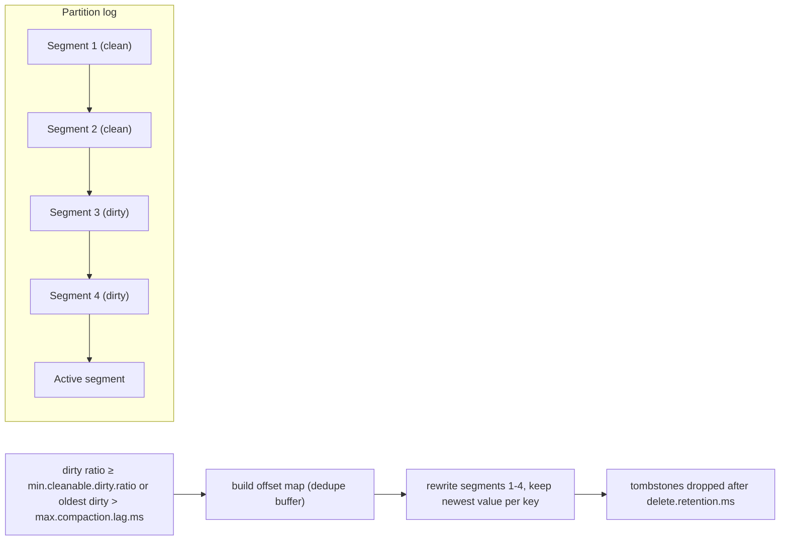

**Follow-up probes.** What does `kafka.log:type=LogCleaner,name=DeadThreadCount` > 0 mean and what happens to `__consumer_offsets`? How does `cleanup.policy=compact,delete` behave?

## 4. Topic and partition management

### Q20. Create a topic with custom configs, then describe and modify it — commands.
**Role:** [ADMIN] | **Difficulty:** ★☆☆ | **Topic:** Topic management

**Answer.**

```bash
bin/kafka-topics.sh --bootstrap-server b1:9092 --create --topic payments.authorized.v1 \
  --partitions 12 --replication-factor 3 \
  --config min.insync.replicas=2 --config retention.ms=604800000 --config cleanup.policy=delete
bin/kafka-topics.sh --bootstrap-server b1:9092 --describe --topic payments.authorized.v1
bin/kafka-configs.sh --bootstrap-server b1:9092 --entity-type topics --entity-name payments.authorized.v1 \
  --alter --add-config retention.ms=1209600000,max.message.bytes=2097152
bin/kafka-configs.sh --bootstrap-server b1:9092 --entity-type topics --entity-name payments.authorized.v1 --describe
bin/kafka-topics.sh --bootstrap-server b1:9092 --alter --topic payments.authorized.v1 --partitions 24   # increase only
bin/kafka-topics.sh --bootstrap-server b1:9092 --list --exclude-internal
```

Since 3.x the `--zookeeper` flag is gone from all tools and `kafka-topics.sh --alter` only changes partition count; all other properties go through `kafka-configs.sh`. Use `--command-config client.properties` for secured clusters. Topic names allow `[a-zA-Z0-9._-]`, at most 249 characters, and mixing `.` and `_` in one cluster is a known metric-name collision (`kafka.log:type=Log,topic=a.b` and `a_b` collide).

**Follow-up probes.** What ACLs are needed to create a topic (`Create` on the topic or on the cluster)? Why does `--describe --topics-with-overrides` matter during audits?

### Q21. Why can partitions only be increased, and what happens to key ordering when you do?
**Role:** [ADMIN] | **Difficulty:** ★☆☆ | **Topic:** Partitions

**Answer.**
Partitions cannot be decreased because records already live in specific partitions with monotonically increasing offsets, and merging two partitions would break offsets, consumer positions and the per-partition ordering guarantee; Kafka never re-shuffles existing data. Increasing works because new partitions start empty, but the default partitioner uses `murmur2(key) mod partitionCount`, so after the change a key that used to hash to partition 3 may now go to partition 17: old records for the key stay in 3 while new ones arrive in 17, and a consumer can see the new record before the old one. Consumers also rebalance to pick up the new partitions, and Kafka Streams applications will fail because their internal changelog and repartition topics must match the source partition count. If ordering per key matters, create a new topic with the target count and migrate producers then consumers, or use a custom partitioner that is stable across the change.

**Follow-up probes.** How does the increase affect compacted topics (the same key exists in two partitions; compaction runs per partition, so both survive)? What is the effect on `__consumer_offsets` (none; its 50 partitions are fixed at creation by `offsets.topic.num.partitions`)?

### Q22. How do you decide the partition count for a new topic?
**Role:** [ADMIN] | **Difficulty:** ★★☆ | **Topic:** Partitions

**Answer.**
Start from throughput, then apply the consumer-parallelism and operational ceilings. Measure per-partition producer throughput (p) and per-partition consumer throughput (c) with `kafka-producer-perf-test.sh` and `kafka-consumer-perf-test.sh` on your hardware; with target ingest T and consumer throughput requirement C the minimum is `max(T/p, C/c)`. Then take the maximum expected consumer instance count in any one group (a partition can only be read by one consumer per group), add headroom (about 2×) because increasing later breaks key ordering (Q21), and round to a number with many divisors (12, 24, 48) so consumers spread evenly. Cap by the per-broker budget: each partition costs open files, mmapped index memory, replica-fetcher work and recovery time; a working guideline is a few thousand partitions per broker and tens of thousands per cluster in KRaft, with lower numbers if brokers are small. Finally, check downstream: Streams state stores, Connect sink tasks and MM2 tasks scale with partitions, and a topic with 5000 partitions and 1 KB/s of traffic wastes memory in every producer (`batch.size` per partition) and consumer (`max.partition.fetch.bytes` per partition).

**Follow-up probes.** Why is a partition count higher than the consumer count harmless but the reverse wasteful? How does linger/batching change per-partition throughput?

### Q23. Which `kafka-topics.sh --describe` filters do you use for a quick health check?
**Role:** [ADMIN] | **Difficulty:** ★☆☆ | **Topic:** Topic management

**Answer.**

```bash
bin/kafka-topics.sh --bootstrap-server b1:9092 --describe --under-replicated-partitions   # ISR < replicas
bin/kafka-topics.sh --bootstrap-server b1:9092 --describe --under-min-isr-partitions      # ISR < min.insync.replicas: producers with acks=all fail
bin/kafka-topics.sh --bootstrap-server b1:9092 --describe --at-min-isr-partitions         # ISR == min.insync.replicas: one more failure blocks writes
bin/kafka-topics.sh --bootstrap-server b1:9092 --describe --unavailable-partitions        # no leader
bin/kafka-topics.sh --bootstrap-server b1:9092 --describe --topics-with-overrides         # non-default topic configs
```

An empty output for the first four means healthy; the same information is in `kafka.server:type=ReplicaManager,name=UnderReplicatedPartitions`, `UnderMinIsrPartitionCount`, `AtMinIsrPartitionCount` and `kafka.controller:type=KafkaController,name=OfflinePartitionsCount`. The output also shows `Leader: -1` for offline partitions and `Elr:` (Eligible Leader Replicas) columns on 4.0 clusters with ELR enabled. A gotcha is that `--describe` on a topic with thousands of partitions is slow; filter by `--topic` in scripts.

**Follow-up probes.** What is the difference between under-replicated and under-min-ISR from a producer's point of view? How would you script this into a cron-based check without JMX?

### Q24. What actually happens when you delete a topic, and why does it sometimes linger?
**Role:** [ADMIN] | **Difficulty:** ★☆☆ | **Topic:** Topic management

**Answer.**
`kafka-topics.sh --delete --topic t` sends `DeleteTopics`; the controller writes a `RemoveTopicRecord` to the metadata log, brokers stop serving the partitions and asynchronously rename each partition directory to `<topic>-<partition>.<uuid>-delete` and remove it after `log.segment.delete.delay.ms`. In KRaft the topic id is retired immediately, so a topic of the same name can be recreated at once, but a producer or consumer that cached the old topic id gets `UNKNOWN_TOPIC_ID` until it refreshes metadata (`metadata.max.age.ms`). Deletion appears to linger when a broker holding a replica is down (the deletion completes when it returns and applies the record), when `delete.topic.enable=false` (the request is rejected), or when a client with `auto.create.topics.enable=true` on the broker recreates it by simply sending metadata requests for it; disable auto-creation before deleting. Consumer offsets for the topic stay in `__consumer_offsets` until expired or removed with `kafka-consumer-groups.sh --delete-offsets`.

**Follow-up probes.** Which ACL is required (`Delete` on the topic)? How do you find a topic recreated by auto-create (the creation log line in the controller log and `kafka-topics.sh --describe` showing 1 partition RF 1)?

### Q25. What actually limits the number of partitions per broker and per cluster in KRaft?
**Role:** [ADMIN] | **Difficulty:** ★★★ | **Topic:** Partitions

**Answer.**
The ZooKeeper-era limits (indicatively 4000 per broker, 200 000 per cluster) came from controller failover time, because the controller had to read every partition's state from ZooKeeper and send full `LeaderAndIsr` requests; KRaft removes that ceiling because the metadata log is already replicated to every broker and a new controller becomes active in seconds. What remains are per-broker resource limits: (1) file descriptors, 3–4 per segment plus one per connection; (2) mmapped index memory and `vm.max_map_count`; (3) log recovery time after an unclean shutdown, which scans the last segment of every partition and is parallelized only by `num.recovery.threads.per.data.dir`; (4) replica fetcher fan-out: every partition adds work to the follower fetch sessions and `replica.fetch.max.bytes` × partitions per fetch response bounds memory; (5) client-side memory: producers keep a batch per partition, consumers fetch `max.partition.fetch.bytes` per partition; (6) metadata image size and snapshot time; and (7) unavailability window on broker failure, since the controller must elect a new leader for every partition the broker led. Practically, keep to low thousands per broker with modern hardware, measure recovery time by killing a test broker with `kill -9`, and track `kafka.server:type=ReplicaManager,name=PartitionCount` and `LeaderCount` per broker so leadership is balanced.

**Follow-up probes.** Why does a broker with 10 000 partitions take minutes to restart after a crash and seconds after a clean stop (`.kafka_cleanshutdown` marker)? How does KIP-966 ELR change the failover story?

## 5. Reassignment, leader election, Cruise Control, quotas

### Q26. Walk through moving partitions onto newly added brokers with a throttle.
**Role:** [ADMIN] | **Difficulty:** ★★☆ | **Topic:** Partition reassignment

**Answer.**
Generate a plan, execute it with a throttle, verify it, and only then remove the throttle.

```bash
cat > topics.json <<'EOF'
{"version":1,"topics":[{"topic":"payments.authorized.v1"},{"topic":"orders.v2"}]}
EOF
bin/kafka-reassign-partitions.sh --bootstrap-server b1:9092 --generate \
  --topics-to-move-json-file topics.json --broker-list "1,2,3,4,5,6" > plan.out   # save "Current" block as rollback.json
bin/kafka-reassign-partitions.sh --bootstrap-server b1:9092 --execute \
  --reassignment-json-file plan.json --throttle 50000000        # 50 MB/s per broker, indicative
bin/kafka-reassign-partitions.sh --bootstrap-server b1:9092 --list
bin/kafka-reassign-partitions.sh --bootstrap-server b1:9092 --verify --reassignment-json-file plan.json  # removes throttle when done
```

Internally the controller adds the new replicas to the assignment (`adding_replicas`), they catch up as followers, join the ISR, and the controller then drops the old replicas (`removing_replicas`) and, if the preferred leader changed, moves leadership; the metrics `kafka.server:type=ReplicaManager,name=ReassigningPartitions` and `kafka.server:type=BrokerTopicMetrics,name=ReassignmentBytesInPerSec` show progress. `--cancel` reverts in-flight reassignments (KIP-455). The gotcha: `--generate` produces a random balanced plan that may move far more data than needed; for large clusters compute a minimal plan (Cruise Control, or a script that only touches partitions that must move) and run it in batches so replication traffic and page-cache pressure stay bounded.

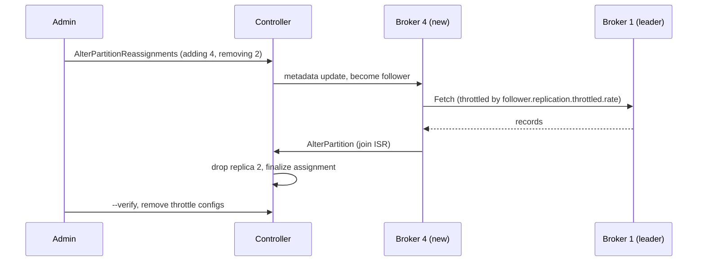

**Follow-up probes.** Why should you not use `--throttle` alone as a safety valve for leaders under heavy client load? How do you move a partition to a specific `log_dirs` entry?

### Q27. How does replication throttling work, and why must you always finish with `--verify`?
**Role:** [ADMIN] | **Difficulty:** ★★☆ | **Topic:** Partition reassignment

**Answer.**
`--throttle N` sets two dynamic broker configs on every involved broker, `leader.replication.throttled.rate` and `follower.replication.throttled.rate` (bytes/s), and two topic configs, `leader.replication.throttled.replicas` and `follower.replication.throttled.replicas`, listing the `partition:broker` pairs being moved. The broker applies the rate limit only to fetches for the listed replicas, using the same quota mechanism as client quotas, so normal in-sync replication is unaffected. Because the throttle applies only to the replicas in the list, a replica that is already in the ISR is not throttled, which is why the throttle does not slow down steady-state replication; but if you set a throttle below the topic's ingest rate the new replica never catches up and the reassignment never completes. `--verify` checks completion and removes those four configs; skipping it leaves the throttle in place, and the next reassignment (or a broker recovering from an outage, if its replicas were listed) is silently slow. You can adjust a running throttle by re-running `--execute --additional` or `--throttle` with a new value.

**Follow-up probes.** Where does throttled replication show in metrics (`kafka.server:type=LeaderReplication,name=byte-rate`, `FollowerReplication`)? What about `--replica-alter-log-dirs-throttle` for intra-broker moves?

### Q28. What is preferred leader election and how do you trigger it?
**Role:** [ADMIN] | **Difficulty:** ★☆☆ | **Topic:** Leader election

**Answer.**
The first replica in a partition's replica list is the preferred leader, chosen at creation time so leadership is spread evenly; after broker restarts leadership piles up on the brokers that stayed up, and preferred leader election moves it back. By default the controller does this automatically (`auto.leader.rebalance.enable=true`) every `leader.imbalance.check.interval.seconds` (300) when a broker's imbalance exceeds `leader.imbalance.per.broker.percentage` (10). Run it manually with `bin/kafka-leader-election.sh --bootstrap-server b1:9092 --election-type preferred --all-topic-partitions` or for one partition with `--topic t --partition 0`, or a list in `--path-to-json-file`. Election only succeeds if the preferred replica is in the ISR; `kafka.controller:type=KafkaController,name=PreferredReplicaImbalanceCount` tells you how many partitions are led by a non-preferred replica. Gotcha: on a large cluster an automatic rebalance moving thousands of leaders at once causes a burst of client `NOT_LEADER_OR_FOLLOWER` retries; some operators disable auto-rebalance and run it in batches after maintenance.

**Follow-up probes.** What does `--election-type unclean` do and when is it justified? Why does leadership matter for load (leaders serve all client reads and writes)?

### Q29. How do you move a replica between log directories on the same broker (JBOD)?
**Role:** [ADMIN] | **Difficulty:** ★★☆ | **Topic:** JBOD

**Answer.**
Use the same reassignment tool with a `log_dirs` array in the plan (KIP-113); an entry of `"any"` keeps the current directory.

```bash
cat > move.json <<'EOF'
{"version":1,"partitions":[
 {"topic":"orders.v2","partition":7,"replicas":[2,3,4],"log_dirs":["/data2","any","any"]}]}
EOF
bin/kafka-reassign-partitions.sh --bootstrap-server b1:9092 --execute \
  --reassignment-json-file move.json --replica-alter-log-dirs-throttle 100000000
bin/kafka-reassign-partitions.sh --bootstrap-server b1:9092 --verify --reassignment-json-file move.json
```

The broker creates a future replica in the target directory, copies segments via a `ReplicaAlterLogDirsThread`, catches up, and swaps atomically. The throttle sets `replica.alter.log.dirs.io.max.bytes.per.second`. Use `bin/kafka-log-dirs.sh --bootstrap-server b1:9092 --describe --broker-list 2 --topic-list orders.v2` to see current sizes per directory before and after. In KRaft with JBOD (3.7+, `metadata.version` ≥ 3.7-IV2), the broker reports the directory assignment to the controller so leader election knows which replicas are on a failed disk.

**Follow-up probes.** Why is the intra-broker move disk-bound and not network-bound? What happens if the target directory fills up mid-move?

### Q30. What does Cruise Control add over the built-in tools, and how do you run a rebalance with it?
**Role:** [ADMIN] | **Difficulty:** ★★☆ | **Topic:** Cruise Control

**Answer.**
Cruise Control (LinkedIn, open source) continuously builds a load model per replica from broker metrics and computes reassignment plans that satisfy an ordered list of goals, then executes them in bounded batches with throttling; it replaces hand-written `--generate` plans and handles adding, removing and demoting brokers, plus self-healing on broker or disk failure. It requires the `CruiseControlMetricsReporter` on brokers (`metric.reporters=com.linkedin.kafka.cruisecontrol.metricsreporter.CruiseControlMetricsReporter`, writing to `__CruiseControlMetrics`) and a `capacity.config.file` describing disk, CPU and network per broker. Typical `goals`: `RackAwareGoal`, `ReplicaCapacityGoal`, `DiskCapacityGoal`, `NetworkInboundCapacityGoal`, `NetworkOutboundCapacityGoal`, `CpuCapacityGoal`, `ReplicaDistributionGoal`, `DiskUsageDistributionGoal`, `LeaderReplicaDistributionGoal`, `TopicReplicaDistributionGoal`. Operate through the REST API: `GET /kafkacruisecontrol/state`, `GET /kafkacruisecontrol/proposals`, `POST /kafkacruisecontrol/rebalance?dryrun=false`, `POST /kafkacruisecontrol/add_broker?brokerid=7`, `POST /kafkacruisecontrol/remove_broker?brokerid=3`, `POST /kafkacruisecontrol/demote_broker?brokerid=3` before maintenance. Anomaly detectors (`broker.failures`, `goal.violations`, `disk.failure`, `metric.anomaly`, `topic.anomaly`) can trigger self-healing when `self.healing.enabled=true`. Gotcha: it needs 2.5.x releases with KRaft support and enough metric samples (`num.metric.fetchers`, sample windows) before it will produce proposals; a fresh install reports `NotEnoughValidWindows` for a while.

**Follow-up probes.** Which goal would you mark as hard? How does the executor throttle and what is `num.concurrent.partition.movements.per.broker`?

### Q31. What quota types exist and how do you set them?
**Role:** [ADMIN] | **Difficulty:** ★☆☆ | **Topic:** Quotas

**Answer.**
Kafka has four client quota types: `producer_byte_rate` and `consumer_byte_rate` (bytes/s per broker), `request_percentage` (share of network+I/O thread time per broker, KIP-124; 100 = one full thread), and `controller_mutation_rate` (partition creations/deletions per second, KIP-599), plus IP connection-rate quotas (`connection_creation_rate` on `--entity-type ips`). Quotas are set per user, per client-id, per (user, client-id) or as defaults:

```bash
bin/kafka-configs.sh --bootstrap-server b1:9092 --alter \
  --add-config 'producer_byte_rate=10485760,consumer_byte_rate=31457280,request_percentage=200' \
  --entity-type users --entity-name analytics-svc
bin/kafka-configs.sh --bootstrap-server b1:9092 --alter --add-config 'consumer_byte_rate=5242880' \
  --entity-type users --entity-default --entity-type clients --entity-name replay-tool
bin/kafka-configs.sh --bootstrap-server b1:9092 --describe --entity-type users
```

Quotas are per broker, so a client spread across 6 brokers with a 10 MB/s quota can move 60 MB/s in total. Without authentication all clients are the same anonymous user, so client-id quotas are the only option and are trivially bypassed by changing the client id.

**Follow-up probes.** What is the precedence when both user and client-id quotas match? How does a producer notice it is throttled (`produce-throttle-time-avg` client metric)?

### Q32. How does quota enforcement actually work on the broker, and how do you see it in metrics?
**Role:** [ADMIN] | **Difficulty:** ★★★ | **Topic:** Quotas

**Answer.**
The broker measures each quota entity's rate over a sliding window of `quota.window.num` samples of `quota.window.size.seconds` (11 × 1 s by default) and, when a request would push the rate over the quota, computes a delay so that the average drops back under the limit, then holds the response for that delay in a throttle purgatory and mutes the client's channel so it cannot pile up more requests (clients also receive `throttle_time_ms` in the response and, since KIP-219, stop sending for that long). Precedence, most specific first: `/config/users/<user>/clients/<client-id>` → `/config/users/<user>/clients/<default>` → `/config/users/<user>` → `/config/users/<default>/clients/<client-id>` → `/config/users/<default>/clients/<default>` → `/config/users/<default>` → `/config/clients/<client-id>` → `/config/clients/<default>`. Observe it on the broker under `kafka.server:type=Produce,user=<u>,client-id=<c>` and `kafka.server:type=Fetch,...` with attributes `byte-rate` and `throttle-time`, `kafka.server:type=Request,...` with `request-time` and `throttle-time` for the request quota, and `kafka.server:type=ControllerMutation` for mutation quotas; on clients watch `produce-throttle-time-avg` and `fetch-throttle-time-avg`. Replication throttles use a separate mechanism (Q27). Custom multi-tenant policies (per-tenant rather than per-user) can be implemented with `client.quota.callback.class`.

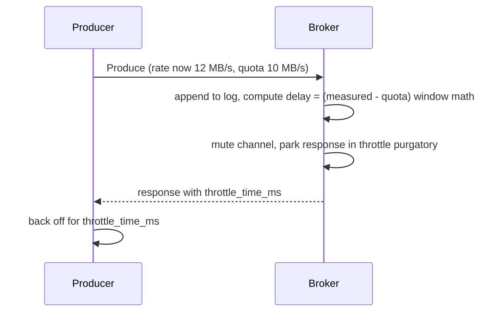

**Follow-up probes.** Why does the broker append the batch before throttling (throttling delays the response, it does not reject)? How do you throttle a Kafka Streams app given it uses several client ids (quota by user)?

## 6. Consumer group administration

### Q33. Describe a consumer group and interpret each column.
**Role:** [ADMIN] | **Difficulty:** ★☆☆ | **Topic:** Consumer groups

**Answer.**

```bash
bin/kafka-consumer-groups.sh --bootstrap-server b1:9092 --describe --group fraud-scorer
# GROUP  TOPIC  PARTITION  CURRENT-OFFSET  LOG-END-OFFSET  LAG  CONSUMER-ID  HOST  CLIENT-ID
bin/kafka-consumer-groups.sh --bootstrap-server b1:9092 --describe --group fraud-scorer --members --verbose
bin/kafka-consumer-groups.sh --bootstrap-server b1:9092 --describe --group fraud-scorer --state
bin/kafka-consumer-groups.sh --bootstrap-server b1:9092 --list --state Stable
```

`CURRENT-OFFSET` is the last committed offset (not the position of the running consumer), `LOG-END-OFFSET` the partition's high watermark, `LAG` the difference; a `-` consumer id with a non-zero lag means a partition with no assigned member. `--state` shows `Empty`, `PreparingRebalance`, `CompletingRebalance`, `Stable` or `Dead` and the coordinator broker; `--members --verbose` lists the assignment per member. Lag measured this way only moves when commits happen, so a consumer with `auto.commit.interval.ms=5000` shows a sawtooth; use the consumer's `records-lag-max` metric for a real-time view. Since 4.0 the tool also shows the group type (`classic` or `consumer`), and `kafka-groups.sh --bootstrap-server b1:9092 --list` (KIP-1043) lists every group kind including share groups.

**Follow-up probes.** Why can lag be stable but consumption still failing (the consumer keeps re-reading the same batch and never commits)? What does a large lag on `__consumer_offsets` itself mean?

### Q34. How do you reset a consumer group's offsets, and what are the preconditions?
**Role:** [ADMIN] | **Difficulty:** ★☆☆ | **Topic:** Consumer groups

**Answer.**
The group must be inactive (state `Empty`), so stop all consumers first; the tool defaults to a dry run and needs `--execute` to apply.

```bash
bin/kafka-consumer-groups.sh --bootstrap-server b1:9092 --group fraud-scorer --reset-offsets \
  --topic payments.authorized.v1 --to-datetime 2026-09-01T06:00:00.000 --dry-run
bin/kafka-consumer-groups.sh --bootstrap-server b1:9092 --group fraud-scorer --reset-offsets \
  --topic payments.authorized.v1:3 --to-offset 1250000 --execute            # single partition
bin/kafka-consumer-groups.sh --bootstrap-server b1:9092 --group fraud-scorer --reset-offsets \
  --all-topics --shift-by -1000 --execute
bin/kafka-consumer-groups.sh --bootstrap-server b1:9092 --group fraud-scorer --reset-offsets \
  --all-topics --to-earliest --export > offsets.csv     # --from-file offsets.csv to apply later
```

Other options: `--to-latest`, `--to-current`, `--by-duration PT2H`. Time-based resets use the partition's time index (`ListOffsets` with a timestamp), which respects `message.timestamp.type`, so a topic with `LogAppendTime` resets by arrival time, not event time. Under the hood the tool just commits the chosen offsets on behalf of the group, which is why the group must be empty: an active member would immediately overwrite them. Deleting offsets for one topic uses `--delete-offsets --group g --topic t`; deleting the group uses `--delete --group g`.

**Follow-up probes.** How do you reset a Kafka Streams application (`kafka-streams-application-reset.sh`, which also deletes internal topics and local state)? What if the group is a KIP-848 `consumer` protocol group (same tool works since 4.0)?

### Q35. A consumer group was stopped for 9 days; on restart it reprocessed everything. Why, and how do you prevent it?
**Role:** [ADMIN] | **Difficulty:** ★★☆ | **Topic:** Consumer groups

**Answer.**
Committed offsets for a group are expired by the group coordinator once the group has been `Empty` for longer than `offsets.retention.minutes` (10080 = 7 days since 2.0), checked every `offsets.retention.check.interval.ms` (10 min); after expiry the group has no position and the consumer falls back to `auto.offset.reset`, which was `earliest`. Prevention: raise `offsets.retention.minutes` on the brokers (cluster-wide static config) to cover your longest planned outage, keep at least one member alive, or export offsets before a long shutdown (`--reset-offsets --export`) and re-import them. Note the difference with an active group with an unsubscribed partition: since 2.1 offsets for partitions no longer subscribed by an active group also expire after the same retention. Also make sure the reset fallback is what you want: `auto.offset.reset=latest` silently skips data, `earliest` reprocesses, and `none` throws so the failure is explicit.

**Follow-up probes.** Where are the offsets stored and what is the tombstone written on expiry? How does this interact with MM2 checkpoints for a group that has no consumer on the DR cluster?

### Q36. What changes for consumer group administration in Kafka 4.0 (KIP-848 and share groups)?
**Role:** [ADMIN] | **Difficulty:** ★★☆ | **Topic:** Consumer groups

**Answer.**
Kafka 4.0 makes the new consumer rebalance protocol (KIP-848) generally available: a consumer sets `group.protocol=consumer`, the broker-side group coordinator computes assignments incrementally (`group.consumer.assignors`, uniform or range) and members reconcile partition by partition, so there is no stop-the-world JoinGroup/SyncGroup and a single slow member no longer blocks the group. Brokers must enable it in `group.coordinator.rebalance.protocols=classic,consumer` (the 4.0 default includes both) and the `group.version` feature must be at level 1; classic and consumer members cannot mix in one group id, although the coordinator supports online upgrade of a group from classic to consumer when all members switch. Admin-visible differences: `kafka-consumer-groups.sh --describe` shows the protocol and the target assignment epoch; group-level dynamic configs (`--entity-type groups`, e.g. `consumer.session.timeout.ms`, `consumer.heartbeat.interval.ms`) replace the client-side session settings; new metrics live under `kafka.server:type=group-coordinator-metrics`. Share groups (KIP-932, early access in 4.0, `group.protocol=share`) give queue-like semantics with per-record acknowledgement and a `share.coordinator`; they are administered with `kafka-share-groups.sh` and are not for production yet in 4.0. The gotcha: the old `heartbeat.interval.ms` and `session.timeout.ms` consumer configs are ignored by `consumer` protocol clients, which confuses teams tuning rebalances.

**Follow-up probes.** Why does the new protocol need the coordinator to store a target assignment in `__consumer_offsets`? How do you find groups still on the classic protocol (`kafka-consumer-groups.sh --list --type classic`)?

## 7. Cluster lifecycle: restarts, brokers, disks, controllers

### Q37. Describe a safe rolling restart of a KRaft cluster, including the checks between nodes.
**Role:** [ADMIN] | **Difficulty:** ★★☆ | **Topic:** Operations

**Answer.**
Restart one node at a time, controllers first (one at a time, never losing quorum majority), then brokers, and gate each step on cluster health rather than on a timer.

1. Pre-check: `UnderReplicatedPartitions=0`, `OfflinePartitionsCount=0`, `ActiveControllerCount` sums to 1, `kafka-metadata-quorum.sh describe --replication` shows no lagging voter.
2. Controllers: stop one (`SIGTERM`, `kafka-server-stop.sh`), wait for it to rejoin the quorum with lag near 0, continue.
3. Brokers: optionally `demote_broker` in Cruise Control; send `SIGTERM` so controlled shutdown (`controlled.shutdown.enable=true`) asks the controller to move leadership before the process exits; wait until the process is gone.
4. Start; wait for `kafka.server:type=KafkaServer,name=BrokerState=3` (Running), `UnderReplicatedPartitions` back to 0 on all brokers, and the broker to reappear in every ISR (`--describe --under-replicated-partitions` empty).
5. Only then move to the next broker; after the last one run or wait for preferred leader election (Q28).

The gotcha is restarting the next broker while the previous one is still catching up: with RF=3 and `min.insync.replicas=2` two brokers out of an ISR means `NotEnoughReplicasException` for producers with `acks=all`, and with `unclean.leader.election.enable=false` an unlucky combination makes partitions offline. Never rely on `kill -9`, which skips controlled shutdown and forces log recovery on restart.

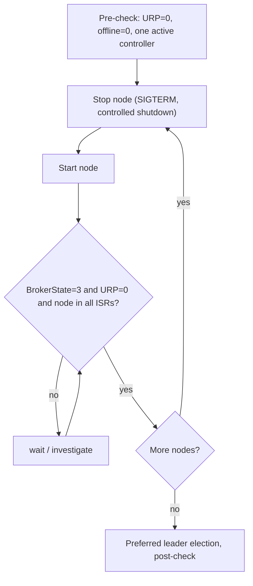

**Follow-up probes.** Why do you restart controllers before brokers in an upgrade? How long can a broker be down before its replicas are dropped from the ISR (`replica.lag.time.max.ms`, 30 s)?

### Q38. What happens during controlled shutdown in KRaft, and what settings affect it?
**Role:** [ADMIN] | **Difficulty:** ★★☆ | **Topic:** Operations

**Answer.**
On `SIGTERM` a KRaft broker sets `wantShutDown` in its next `BrokerHeartbeat` to the active controller; the controller marks the broker as shutting down, elects new leaders for every partition it leads (choosing among in-sync replicas), and only when the broker leads nothing (or `controlled.shutdown.max.retries` × `controlled.shutdown.retry.backoff.ms` elapsed) does the heartbeat response tell it to proceed; the broker then flushes logs, writes the `.kafka_cleanshutdown` marker per log dir so the next start skips recovery, closes sockets and exits. Clients see one `NOT_LEADER_OR_FOLLOWER` per partition and refresh metadata. The broker is still fenced for `broker.session.timeout.ms` (9 s) after it stops heartbeating, which is what triggers replica removal from the ISR. The two things that make controlled shutdown slow are partitions without any other in-sync replica (the controller cannot move leadership, and the partition goes offline when the broker stops) and thousands of leaders on one broker; watch `kafka.controller:type=KafkaController,name=EventQueueTimeMs` during the process. Systemd must give the process enough `TimeoutStopSec` (several minutes for large brokers), otherwise it sends `SIGKILL` mid-shutdown.

**Follow-up probes.** What is `BrokerState` 6 (PendingControlledShutdown)? Why is the `.kafka_cleanshutdown` file important for restart time?

### Q39. How do you add a broker to a running KRaft cluster?
**Role:** [ADMIN] | **Difficulty:** ★☆☆ | **Topic:** Cluster lifecycle

**Answer.**
Install the same version, give it a new unique `node.id` and the same `controller.quorum.bootstrap.servers` (or `controller.quorum.voters`), set `broker.rack` and listeners, format its log dirs with the existing cluster id (`bin/kafka-storage.sh format -t <cluster-id> -c broker.properties`), and start it. It registers with the controller, becomes `Running`, and is immediately eligible for new partitions, but Kafka does not move any existing partitions to it; you must reassign (Q26) or use Cruise Control `add_broker`. Verify with `kafka-metadata-quorum.sh describe --status` (it appears as an observer) and with `kafka-broker-api-versions.sh --bootstrap-server newbroker:9092`. Common mistakes: reusing a `node.id` that was recently removed (the controller still holds its registration until unregistered), cloning a disk with an old `meta.properties`, and forgetting to add the new broker to the load balancer or DNS used by clients as bootstrap.

**Follow-up probes.** How do you confirm the new broker is receiving replicas (`PartitionCount` on its JMX)? Why does `add_broker` in Cruise Control move only enough replicas to balance rather than a random set?

### Q40. How do you decommission a broker safely?
**Role:** [ADMIN] | **Difficulty:** ★★☆ | **Topic:** Cluster lifecycle

**Answer.**
Move every replica off it, verify nothing remains, stop it, and then remove its registration.

```bash
# plan that excludes broker 3 from the target list, for every topic
bin/kafka-topics.sh --bootstrap-server b1:9092 --list | jq -R -s -c 'split("\n")|map(select(length>0))|{version:1,topics:map({topic:.})}' > all.json
bin/kafka-reassign-partitions.sh --bootstrap-server b1:9092 --generate --topics-to-move-json-file all.json --broker-list "1,2,4,5,6"
bin/kafka-reassign-partitions.sh --bootstrap-server b1:9092 --execute --reassignment-json-file plan.json --throttle 100000000
bin/kafka-reassign-partitions.sh --bootstrap-server b1:9092 --verify --reassignment-json-file plan.json
bin/kafka-topics.sh --bootstrap-server b1:9092 --describe | grep -E 'Replicas: .*\b3\b' | wc -l   # must be 0
bin/kafka-server-stop.sh          # on broker 3
bin/kafka-cluster.sh unregister --bootstrap-server b1:9092 --id 3
```

Cruise Control's `remove_broker` does the plan generation with minimal movement and rack awareness. Before executing, confirm the remaining brokers have disk and partition headroom, and remember that `--generate` reshuffles everything: for a large cluster generate a minimal plan that only touches partitions on the broker being removed. `kafka-cluster.sh unregister` (KRaft only) deletes the broker registration from the metadata log so the id can be reused and it stops appearing as a fenced broker in `kafka.controller:type=KafkaController,name=FencedBrokerCount`.

**Follow-up probes.** What if the broker being removed is the only in-sync replica of some partition? How does this differ for a controller node (Q43)?

### Q41. A disk in a JBOD broker fails. What does Kafka do and what do you do?
**Role:** [ADMIN] | **Difficulty:** ★★★ | **Topic:** Disk failure

**Answer.**
On the first I/O error the broker marks that `log.dirs` entry offline (`kafka.log:type=LogManager,name=OfflineLogDirectoryCount` goes to 1, `LogDirectoryOffline,logDirectory=/data2` = 1), stops serving every replica on it and reports them as offline (`kafka.server:type=ReplicaManager,name=OfflineReplicaCount`); in KRaft (KIP-858, 3.7+) the broker tells the controller which directory failed, and the controller elects new leaders for those partitions from other in-sync replicas, so the partitions stay available as long as RF > 1 and only one replica lived on that disk. The broker itself keeps running on its remaining directories; only if all directories fail does it shut down. Your procedure: (1) confirm with `dmesg`/SMART and the broker log (`KafkaStorageException`, `Stopping serving logs in dir /data2`); (2) check `UnderReplicatedPartitions` and that no partition is offline; (3) replace the disk, recreate the filesystem and mount; (4) run `bin/kafka-storage.sh format -t <cluster-id> -c broker.properties --ignore-formatted` so the new directory gets `meta.properties` with a fresh `directory.id`; (5) restart the broker, after which the replicas that were on the failed disk are recreated (the controller reassigns them to a directory on this broker, or you move them explicitly with `log_dirs`) and catch up from the leaders. Gotcha: the failed directory's replicas were assigned to this broker id, so until it comes back they are under-replicated everywhere; if the disk cannot be replaced quickly, reassign those partitions to other brokers instead of waiting.

**Follow-up probes.** What was different before 3.7 in KRaft (JBOD unsupported; a failed dir meant restarting the broker without it)? How does RAID 10 change this runbook?

### Q42. A broker's data disk is at 100%. How do you recover without losing more than necessary?
**Role:** [ADMIN] | **Difficulty:** ★★☆ | **Topic:** Disk full

**Answer.**
Free space with retention changes rather than by deleting files by hand. When the disk fills, appends fail with `IOException: No space left on device`, the broker marks the directory offline exactly as in a disk failure, leaders move away and the broker is under-replicated on every partition it hosted. Steps: (1) identify the biggest partitions with `bin/kafka-log-dirs.sh --bootstrap-server b1:9092 --describe --broker-list 3` (the JSON has sizes per partition) or `du -sh /data/kafka/* | sort -h`; (2) lower retention on the culprit topics dynamically (`kafka-configs.sh --entity-type topics --entity-name big-topic --alter --add-config retention.ms=43200000` or `retention.bytes`), which takes effect on the next `log.retention.check.interval.ms` cycle; if the directory is offline, restart the broker after the change so the log manager comes back and applies it; (3) if that is not enough, reassign partitions away from the broker; (4) as a last resort, stop the broker and delete the oldest closed segments of a partition together with their `.index`, `.timeindex` and `.txnindex` files, never the active segment and never anything under `__cluster_metadata` or `__consumer_offsets`; (5) afterwards fix the root cause: missing `retention.bytes` guardrails, a producer that quadrupled its rate, or disk-usage alerts set at 90% instead of 70%. Alert on `node_filesystem_avail_bytes` early, because from 85% onward a single burst fills the disk before retention can react.

**Follow-up probes.** Why is `retention.bytes` per partition a weak guardrail with many partitions? Why should `log.dirs` never share a filesystem with the OS or application logs?

### Q43. How do you replace a failed controller node in a dynamic quorum and in a static quorum?
**Role:** [ADMIN] | **Difficulty:** ★★★ | **Topic:** KRaft quorum

**Answer.**
Dynamic quorum (`kraft.version=1`): remove the dead voter first, then add the replacement, keeping the voter count odd at the end.

```bash
bin/kafka-metadata-quorum.sh --bootstrap-server b1:9092 describe --status          # note failed voter id and directory id
bin/kafka-metadata-quorum.sh --bootstrap-server b1:9092 remove-controller --controller-id 2 --controller-directory-id <dir-uuid>
# on the replacement node (new id 4 or reuse 2 with a fresh directory id)
bin/kafka-storage.sh format -t <cluster-id> -c controller.properties --no-initial-controllers
bin/kafka-server-start.sh -daemon controller.properties                              # joins as observer
bin/kafka-metadata-quorum.sh --command-config controller.properties --bootstrap-server b1:9092 add-controller
```

Static quorum: bring up a replacement with the same `node.id` and host:port as the failed voter (it is listed in every node's `controller.quorum.voters`), format it with the cluster id, and let it catch up from the leader; if the address must change you have to edit `controller.quorum.voters` on every broker and controller and roll them, which is why static quorums should pin voters to stable DNS names. In both cases the quorum must keep a majority throughout: with 3 voters you can lose one; if you lose two, no election is possible and the cluster freezes for metadata (see the scenario bank for the recovery path). Verify with `describe --replication` that the new voter's lag drops to 0 and with `kafka.server:type=raft-metrics,name=current-state` on each controller.

**Follow-up probes.** Why remove before add (adding a 4th voter while one is dead makes the majority 3 of 4 with only 2 alive)? What is the observer role and why do brokers appear as observers?

## 8. Monitoring and logging

### Q44. Which ten broker MBeans do you alert on first, and with what thresholds?
**Role:** [ADMIN] | **Difficulty:** ★☆☆ | **Topic:** Monitoring

**Answer.**

| MBean | Alert when | Meaning |
|-------|------------|---------|
| `kafka.server:type=ReplicaManager,name=UnderReplicatedPartitions` | > 0 for 5 min | replicas missing from ISR |
| `kafka.server:type=ReplicaManager,name=UnderMinIsrPartitionCount` | > 0 | producers with `acks=all` are failing |
| `kafka.controller:type=KafkaController,name=OfflinePartitionsCount` | > 0 | partitions without leader: data unavailable |
| `kafka.controller:type=KafkaController,name=ActiveControllerCount` | sum ≠ 1 across controllers | no or split controller |
| `kafka.server:type=ReplicaManager,name=IsrShrinksPerSec` | rate > 0 sustained | brokers dropping out (GC, disk, network) |
| `kafka.network:type=SocketServer,name=NetworkProcessorAvgIdlePercent` | < 0.3 | network threads saturated |
| `kafka.server:type=KafkaRequestHandlerPool,name=RequestHandlerAvgIdlePercent` | < 0.3 | I/O threads saturated |
| `kafka.network:type=RequestMetrics,name=TotalTimeMs,request=Produce` (99thPercentile) | above your SLO (e.g. 100 ms) | produce latency |
| `kafka.log:type=LogManager,name=OfflineLogDirectoryCount` | > 0 | disk failed or full |
| `kafka.server:type=BrokerTopicMetrics,name=FailedProduceRequestsPerSec` / `FailedFetchRequestsPerSec` | > 0 | client-visible errors |

Add `kafka.server:type=KafkaServer,name=BrokerState` (3 = Running) and `java.lang:type=GarbageCollector` collection time. Thresholds are indicative; derive them from a week of baseline data, and alert on duration (for example `for: 5m`) so a rolling restart does not page anyone.

**Follow-up probes.** Why is `UnderReplicatedPartitions` expected to be non-zero during a rolling restart and how do you suppress that? Which of these are per-broker and which are cluster-level (controller MBeans only mean something on the active controller)?

### Q45. Break down a request's latency using the `RequestMetrics` MBeans and explain what each component tells you.
**Role:** [ADMIN] | **Difficulty:** ★★☆ | **Topic:** Monitoring

**Answer.**
`kafka.network:type=RequestMetrics,name=<stage>,request=<Produce|FetchConsumer|FetchFollower|Metadata|...>` exposes histograms (`50thPercentile`, `99thPercentile`, `Mean`) for each stage, and `TotalTimeMs` is their sum:

| Stage | High value means |
|-------|------------------|
| `RequestQueueTimeMs` | too few I/O threads or they are blocked on disk; check `RequestHandlerAvgIdlePercent` |
| `LocalTimeMs` | leader work: disk append, page-cache miss on fetch, lock contention on the partition |
| `RemoteTimeMs` | Produce: waiting for followers (`acks=all`); FetchConsumer: waiting for `fetch.min.bytes`/`fetch.max.wait.ms` (normal); FetchFollower: waiting for new data (normal) |
| `ThrottleTimeMs` | quota throttling |
| `ResponseQueueTimeMs` | network threads busy; check `NetworkProcessorAvgIdlePercent` |
| `ResponseSendTimeMs` | slow client or network, large responses, TLS |

For produce latency, `RemoteTimeMs` is usually the biggest component and points at follower fetch performance (`num.replica.fetchers`, follower disk, cross-AZ latency) rather than the leader. `RequestsPerSec,request=Produce,version=N` also tells you which API versions clients use, which is how you find old clients before a 4.0 upgrade (KIP-896 removed support for pre-2.1 protocol versions).

**Follow-up probes.** Why is a high `RemoteTimeMs` for `FetchConsumer` not a problem? How does purgatory size (`kafka.server:type=DelayedOperationPurgatory,name=PurgatorySize,delayedOperation=Produce`) relate?

### Q46. How do you monitor consumer lag properly? Compare the approaches.
**Role:** [ADMIN] | **Difficulty:** ★★☆ | **Topic:** Lag monitoring

**Answer.**
Measure both offset lag and time lag, from a vantage point independent of the application. Options: (1) consumer client metrics `kafka.consumer:type=consumer-fetch-manager-metrics,client-id=…,topic=…,partition=…` attributes `records-lag`, `records-lag-max`, `records-lead-min`; accurate and real-time, but they vanish when the app is down, which is exactly when you need them; (2) broker-side committed offsets via `kafka-consumer-groups.sh --describe` or an exporter such as kafka_exporter (`kafka_consumergroup_lag`), kminion or Kafka Lag Exporter; stays visible when the app is down, but only moves at commit time; (3) Burrow (LinkedIn), which reads `__consumer_offsets` directly, keeps a sliding window of commits per partition and evaluates a status (`OK`, `WARN`, `ERR`, `STALL`, `STOP`) from whether the committed offset is advancing and the lag trend, with no static threshold; queried over HTTP at `/v3/kafka/<cluster>/consumer/<group>/lag`. Time lag (how old is the record the consumer is at now) is what business SLOs care about; Kafka Lag Exporter and kminion estimate it by interpolating offset timestamps. Alert on lag that grows over 10–15 minutes and on `STALL`, not on absolute lag, because a batch job legitimately has millions of lag at 09:00 and zero at 09:20.

**Follow-up probes.** Why does lag on one partition with the others at zero usually mean a hot key or a stuck consumer thread rather than under-capacity? How do you monitor lag for a group that commits with transactions (committed offsets appear only after commit)?

### Q47. Set up jmx_exporter for a broker and write the core Prometheus alert rules.
**Role:** [ADMIN] | **Difficulty:** ★★☆ | **Topic:** Monitoring

**Answer.**
Run the exporter as a Java agent so it scrapes MBeans in-process, and keep the rule set explicit to avoid exporting per-partition series for every topic.

```bash
export KAFKA_OPTS="-javaagent:/opt/jmx_prometheus_javaagent-1.1.0.jar=7071:/opt/kafka/kafka-jmx.yml"
```

```yaml
# kafka-jmx.yml (excerpt)
lowercaseOutputName: true
rules:
  - pattern: kafka.server<type=(ReplicaManager|KafkaRequestHandlerPool), name=(.+)><>(Value|OneMinuteRate)
    name: kafka_server_$1_$2
  - pattern: kafka.controller<type=KafkaController, name=(.+)><>Value
    name: kafka_controller_kafkacontroller_$1
  - pattern: kafka.network<type=RequestMetrics, name=(.+), request=(Produce|FetchConsumer|FetchFollower)><>99thPercentile
    name: kafka_network_requestmetrics_$1_p99
    labels: {request: "$2"}
  - pattern: kafka.server<type=BrokerTopicMetrics, name=(BytesInPerSec|BytesOutPerSec|MessagesInPerSec), topic=(.+)><>OneMinuteRate
    name: kafka_server_brokertopicmetrics_$1
    labels: {topic: "$2"}
```

```yaml
groups:
- name: kafka
  rules:
  - alert: KafkaUnderReplicatedPartitions
    expr: sum(kafka_server_replicamanager_underreplicatedpartitions) > 0
    for: 5m
  - alert: KafkaNoActiveController
    expr: sum(kafka_controller_kafkacontroller_activecontrollercount) != 1
    for: 1m
  - alert: KafkaOfflinePartitions
    expr: sum(kafka_controller_kafkacontroller_offlinepartitionscount) > 0
    for: 1m
  - alert: KafkaRequestHandlersSaturated
    expr: kafka_server_kafkarequesthandlerpool_requesthandleravgidlepercent < 0.3
    for: 10m
  - alert: KafkaProduceLatencyHigh
    expr: kafka_network_requestmetrics_totaltimems_p99{request="Produce"} > 200
    for: 10m
  - alert: KafkaDiskSpaceLow
    expr: node_filesystem_avail_bytes{mountpoint=~"/data.*"} / node_filesystem_size_bytes < 0.2
    for: 5m
```

The gotcha is cardinality: the default community rule files export `kafka.log:type=Log,name=Size,topic=…,partition=…` for every partition, which on a 50 000-partition cluster produces hundreds of thousands of series per broker; restrict with `whitelistObjectNames` or targeted patterns.

**Follow-up probes.** Why prefer the Java agent over a standalone JMX exporter (no RMI, no `JMX_PORT` exposure)? How would you get the same metrics from a Confluent or MSK cluster (Metrics API / Open Monitoring, vendor-specific)?

### Q48. Which controller and KRaft quorum metrics do you watch, and what do they tell you?
**Role:** [ADMIN] | **Difficulty:** ★★★ | **Topic:** Monitoring

**Answer.**

| Metric | Healthy | Problem |
|--------|---------|---------|
| `kafka.controller:type=KafkaController,name=ActiveControllerCount` | 1 on exactly one controller | 0 everywhere = no quorum leader |
| `kafka.server:type=raft-metrics,name=current-state` | `leader` on one, `follower` on others, `observer` on brokers | `candidate` or `unattached` persisting |
| `kafka.server:type=raft-metrics,name=current-epoch` | stable | rising = elections (Q7) |
| `kafka.server:type=raft-metrics,name=high-watermark` vs `log-end-offset` | close on all nodes | gap = lagging voter/observer |
| `kafka.server:type=raft-metrics,name=commit-latency-avg`, `append-records-rate` | ms | slow metadata disk |
| `kafka.controller:type=KafkaController,name=LastAppliedRecordLagMs` | < 1 s | controller/broker not applying metadata |
| `kafka.server:type=broker-metadata-metrics,name=last-applied-record-lag-ms` | < 1 s | broker behind on metadata |
| `kafka.server:type=broker-metadata-metrics,name=metadata-load-error-count`, `metadata-apply-error-count` | 0 | corrupt or unsupported records |
| `kafka.controller:type=KafkaController,name=MetadataErrorCount` | 0 | controller hit an unexpected state |
| `kafka.controller:type=KafkaController,name=FencedBrokerCount`, `ActiveBrokerCount` | fenced = 0 | brokers not heartbeating |
| `kafka.controller:type=KafkaController,name=TimedOutBrokerHeartbeatCount` | 0 | broker heartbeats beyond `broker.session.timeout.ms` |
| `kafka.controller:type=KafkaController,name=EventQueueTimeMs`, `EventQueueProcessingTimeMs` | low ms | controller thread overloaded |
| `kafka.controller:type=KafkaController,name=GlobalPartitionCount`, `GlobalTopicCount` | your budget | runaway topic creation |

A broker whose `last-applied-record-lag-ms` climbs while others are fine is starving its metadata thread (often GC), and it will soon be fenced; it is the earliest warning you get. Controller MBeans exist on every controller process but are meaningful mostly on the active one, so aggregate with `max` or `sum` across the quorum.

**Follow-up probes.** What is the difference between a fenced broker and a broker in controlled shutdown? Why are `LastCommittedRecordOffset` and `high-watermark` the same concept seen from two components?

### Q49. Where are broker logs, which loggers matter, and how do you change a log level at runtime?
**Role:** [ADMIN] | **Difficulty:** ★☆☆ | **Topic:** Logging

**Answer.**
Logs go to `$LOG_DIR` (default `logs/` under the Kafka home; set `LOG_DIR` in the environment). Kafka 3.x configures Log4j 1.x via `config/log4j.properties`; Kafka 4.0 moved to Log4j 2 (KIP-653) with `config/log4j2.yaml`, and the old file is ignored, which breaks copy-pasted deployment templates. Files and their loggers:

| File | Logger | Use |
|------|--------|-----|
| `server.log` | root, `kafka.*`, `org.apache.kafka.*` | everything at INFO |
| `controller.log` | `org.apache.kafka.controller`, `kafka.controller` | leadership changes, broker registration, fencing |
| `state-change.log` | `state.change.logger` | per-partition leader/ISR transitions |
| `kafka-request.log` | `kafka.request.logger` | every request when set to DEBUG/TRACE (heavy) |
| `log-cleaner.log` | `kafka.log.LogCleaner` | compaction runs and cleaner errors |
| `kafka-authorizer.log` | `kafka.authorizer.logger` | ACL allow/deny (DEBUG shows allowed, INFO shows denied) |
| `kafkaServer-gc.log` | JVM GC log via `KAFKA_GC_LOG_OPTS` | pause analysis |

Change levels without restart via the `broker-loggers` entity: `bin/kafka-configs.sh --bootstrap-server b1:9092 --entity-type broker-loggers --entity-name 3 --alter --add-config kafka.request.logger=DEBUG`, and revert with `--delete-config kafka.request.logger`. Request logging at DEBUG on a busy broker can write hundreds of MB per minute, so scope it to one broker and a few minutes.

**Follow-up probes.** Which log line proves a partition went through an unclean election (state-change log)? How do you ship logs to a central store without losing the multi-line stack traces?

### Q50. What is KIP-714 client metrics push, how do you enable it, and why does it matter for operators?
**Role:** [ADMIN] | **Difficulty:** ★★★ | **Topic:** Monitoring

**Answer.**
KIP-714 (3.7+) lets Java clients (3.7+) push their own metrics (`org.apache.kafka.producer.*`, `org.apache.kafka.consumer.*`) to the broker they are connected to over the Kafka protocol, so the platform team can see client-side latency, lag, retries and versions without the application team wiring up JMX. It needs (1) a broker-side `metric.reporters` plugin that implements `ClientTelemetry` (Apache ships the interface, not a store; vendors and open-source exporters such as the OpenTelemetry-based ones implement it), (2) a subscription created by the admin, and (3) clients with `enable.metrics.push=true` (the default in 3.7+ clients).

```bash
bin/kafka-client-metrics.sh --bootstrap-server b1:9092 --alter --name consumer-basics \
  --metrics org.apache.kafka.consumer.coordinator.rebalance.,org.apache.kafka.consumer.fetch.manager.records.lag \
  --interval 60000 --match client_software_name=apache-kafka-java
bin/kafka-client-metrics.sh --bootstrap-server b1:9092 --list
bin/kafka-client-metrics.sh --bootstrap-server b1:9092 --describe --name consumer-basics
```

Metrics arrive as OpenTelemetry-encoded payloads with client instance ids, so you can correlate a broker-side throttling event with the client's `produce-throttle-time-avg`. Gotcha: subscriptions matching every client with a short interval add load on the broker; match on `client_software_name`, `client_id` prefix or `client_source_address` and keep intervals at 30–60 s.

**Follow-up probes.** How does a client find its `client.instance.id` (`KafkaConsumer.clientInstanceId(Duration)`)? Why is this valuable during a 4.0 upgrade (identifies old clients precisely)?

### Q51. Which OS and disk metrics do you collect next to the JMX metrics, and why?
**Role:** [ADMIN] | **Difficulty:** ★☆☆ | **Topic:** Monitoring

**Answer.**
Kafka's own metrics show symptoms; node metrics show causes. Collect with node_exporter: disk utilization and latency (`node_disk_io_time_seconds_total`, `node_disk_read_time_seconds_total` / `node_disk_reads_completed_total` for average read latency), read bytes (`node_disk_read_bytes_total`; rising reads mean page-cache misses, Q12), filesystem free (`node_filesystem_avail_bytes`), page cache and dirty pages (`node_memory_Cached_bytes`, `node_memory_Dirty_bytes`), swap in/out (must be zero), network bytes and errors per interface (`node_network_receive_bytes_total`, `node_network_transmit_drop_total`), TCP retransmits (`node_netstat_Tcp_RetransSegs`), open file descriptors (`process_open_fds` versus `process_max_fds` from the JVM exporter), CPU steal on VMs, and NTP offset (`node_timex_offset_seconds`). Correlate `IsrShrinksPerSec` spikes with disk `io_time` and GC logs to separate storage from JVM problems, and keep 15 s scrape intervals so 30 s ISR timeouts are visible.

**Follow-up probes.** What does a rising `Dirty_bytes` with flat throughput indicate? Why is CPU steal important for KRaft controllers?

## 9. Security

### Q52. Configure TLS encryption on a client listener and verify it.
**Role:** [ADMIN] | **Difficulty:** ★☆☆ | **Topic:** TLS

**Answer.**

```properties
listeners=INTERNAL://0.0.0.0:9092,CLIENT://0.0.0.0:9093,CONTROLLER://0.0.0.0:9094
advertised.listeners=INTERNAL://b1.internal:9092,CLIENT://b1.example.com:9093
listener.security.protocol.map=INTERNAL:SSL,CLIENT:SSL,CONTROLLER:SSL
inter.broker.listener.name=INTERNAL
listener.name.client.ssl.keystore.type=PKCS12
listener.name.client.ssl.keystore.location=/etc/kafka/ssl/b1.p12
listener.name.client.ssl.keystore.password=changeit
listener.name.client.ssl.truststore.location=/etc/kafka/ssl/truststore.p12
listener.name.client.ssl.truststore.password=changeit
ssl.enabled.protocols=TLSv1.3,TLSv1.2
ssl.client.auth=none
```

The keystore's certificate must have a SAN matching the advertised hostname because clients verify hostnames by default (`ssl.endpoint.identification.algorithm=https`). PEM files are supported since 2.7 (`ssl.keystore.type=PEM` with `ssl.keystore.key`, `ssl.keystore.certificate.chain`, `ssl.truststore.certificates`), which fits cert-manager style automation. Verify with `openssl s_client -connect b1.example.com:9093 -servername b1.example.com </dev/null | openssl x509 -noout -dates -ext subjectAltName` and a client run: `bin/kafka-broker-api-versions.sh --bootstrap-server b1.example.com:9093 --command-config client-ssl.properties`. TLS disables zero-copy and costs CPU (Q12); measure before enabling on the inter-broker listener.

**Follow-up probes.** What error do you get when a client connects with PLAINTEXT to this port? Why are listener-prefixed configs preferable to the global `ssl.*` ones?

### Q53. How do you enable mTLS and map certificate DNs to Kafka principals?
**Role:** [ADMIN] | **Difficulty:** ★★☆ | **Topic:** TLS

**Answer.**
Set `listener.name.client.ssl.client.auth=required` (or `requested` during rollout) so the broker demands a client certificate signed by a CA in its truststore; the principal is then the certificate's full DN, for example `User:CN=orders-svc,OU=payments,O=Example,C=DE`, which is unwieldy in ACLs. Use `ssl.principal.mapping.rules` to reduce it: `ssl.principal.mapping.rules=RULE:^CN=([^,]+),.*$/$1/L,DEFAULT` gives `User:orders-svc` (lower-cased by `/L`). Rules are evaluated in order and the first match wins; test them because a rule that fails to match falls to `DEFAULT`, which is the full DN, and your ACLs silently stop matching. Clients need `ssl.keystore.*` with their own certificate and `ssl.truststore.*` with the broker CA. Certificate revocation is not checked by default; short-lived certificates plus rotation (Q59) is the practical approach. Alternatively implement `principal.builder.class` (`KafkaPrincipalBuilder`) to derive principals from SAN fields or certificate extensions.

**Follow-up probes.** What do you see in the broker log when the client certificate is not trusted (`SSLHandshakeException ... certificate_unknown` and `failed-authentication-rate` increments)? How do you run mTLS on the inter-broker listener and keep `super.users` working (`super.users=User:CN=broker...` must match after mapping)?

### Q54. Compare the SASL mechanisms Kafka supports and when to use each.
**Role:** [ADMIN] | **Difficulty:** ★☆☆ | **Topic:** SASL

**Answer.**

| Mechanism | Credentials stored | Pros | Cons / use when |
|-----------|--------------------|------|-----------------|
| `PLAIN` | broker JAAS file or custom `sasl.server.callback.handler.class` | simple | passwords in config, restart to change users; only with TLS; dev or external secret backend |
| `SCRAM-SHA-256` / `SCRAM-SHA-512` | salted hashes in the metadata log (KRaft, since 3.5) | no restart to add users, no plaintext at rest | still needs TLS to protect the handshake from downgrade; default choice for service accounts |
| `GSSAPI` (Kerberos) | KDC | enterprise SSO, keytabs | complex, clock-sensitive, `sasl.kerberos.service.name`, DNS-dependent |
| `OAUTHBEARER` | identity provider (JWT) | short-lived tokens, central identity, works with OIDC (KIP-768, 3.1+) | needs an IdP and token endpoint reachable from every client |

Enable with `sasl.enabled.mechanisms=SCRAM-SHA-512,OAUTHBEARER`, per listener `listener.name.client.sasl.enabled.mechanisms`, and choose `sasl.mechanism.inter.broker.protocol` and `sasl.mechanism.controller.protocol` explicitly. Always pair SASL with TLS (`SASL_SSL`); `SASL_PLAINTEXT` sends SCRAM safely but everything else in cleartext.

**Follow-up probes.** Why is `PLAIN` with a JAAS file a problem for rotation? How does re-authentication (`connections.max.reauth.ms`, KIP-368) interact with token expiry?

### Q55. How does SCRAM work in KRaft, including bootstrapping the inter-broker user?
**Role:** [ADMIN] | **Difficulty:** ★★☆ | **Topic:** SASL

**Answer.**
Since 3.5 (KIP-900) SCRAM credentials are stored as `UserScramCredentialRecord`s in the metadata log instead of ZooKeeper, and are managed with the same tool as before:

```bash
bin/kafka-configs.sh --bootstrap-server b1:9092 --command-config admin.properties --alter \
  --add-config 'SCRAM-SHA-512=[iterations=8192,password=s3cret]' --entity-type users --entity-name orders-svc
bin/kafka-configs.sh --bootstrap-server b1:9092 --command-config admin.properties --describe --entity-type users --entity-name orders-svc
bin/kafka-configs.sh --bootstrap-server b1:9092 --command-config admin.properties --alter \
  --delete-config 'SCRAM-SHA-512' --entity-type users --entity-name orders-svc
```

The chicken-and-egg problem is the inter-broker user: brokers authenticate to each other and to the controllers with SCRAM, but the credential lives in a metadata log they cannot reach until authenticated. KIP-900 solves it at format time: `bin/kafka-storage.sh format -t <cluster-id> -c server.properties --add-scram 'SCRAM-SHA-512=[name=kafka-broker,password=broker-secret]'` writes the credential into the bootstrap metadata snapshot on the controllers. Broker JAAS then uses `listener.name.internal.scram-sha-512.sasl.jaas.config=org.apache.kafka.common.security.scram.ScramLoginModule required username="kafka-broker" password="broker-secret";`. Credentials are replicated to all brokers through the metadata log, so a new user is usable within milliseconds cluster-wide.

**Follow-up probes.** What is the difference between `iterations` 4096 and 8192 (CPU per handshake versus brute-force cost)? Why must SCRAM still run over TLS?

### Q56. Configure OAUTHBEARER with an OIDC provider for both brokers and clients.
**Role:** [ADMIN] | **Difficulty:** ★★★ | **Topic:** SASL

**Answer.**
Since 3.1 (KIP-768) Kafka ships production-grade OAuth support: the client obtains a JWT with the client-credentials grant, the broker validates it against the provider's JWKS.

```properties
# broker
listener.name.client.sasl.enabled.mechanisms=OAUTHBEARER
listener.name.client.oauthbearer.sasl.server.callback.handler.class=org.apache.kafka.common.security.oauthbearer.OAuthBearerValidatorCallbackHandler
listener.name.client.oauthbearer.sasl.jaas.config=org.apache.kafka.common.security.oauthbearer.OAuthBearerLoginModule required;
sasl.oauthbearer.jwks.endpoint.url=https://idp.example.com/realms/kafka/protocol/openid-connect/certs
sasl.oauthbearer.expected.audience=kafka
sasl.oauthbearer.expected.issuer=https://idp.example.com/realms/kafka
sasl.oauthbearer.sub.claim.name=sub
sasl.oauthbearer.scope.claim.name=scope
sasl.oauthbearer.clock.skew.seconds=30
connections.max.reauth.ms=3600000
```

```properties
# client
security.protocol=SASL_SSL
sasl.mechanism=OAUTHBEARER
sasl.login.callback.handler.class=org.apache.kafka.common.security.oauthbearer.OAuthBearerLoginCallbackHandler
sasl.oauthbearer.token.endpoint.url=https://idp.example.com/realms/kafka/protocol/openid-connect/token
sasl.jaas.config=org.apache.kafka.common.security.oauthbearer.OAuthBearerLoginModule required clientId="orders-svc" clientSecret="..." scope="kafka";
```

The principal is `User:<sub claim>` unless `sasl.oauthbearer.sub.claim.name` points elsewhere (for example `azp` or `preferred_username`), and ACLs must use that value. `connections.max.reauth.ms` (KIP-368) forces clients to re-authenticate before the token expires; the login module refreshes tokens in the background (`sasl.login.refresh.*`). Gotchas: the JWKS endpoint must be reachable from every broker (and cached: `sasl.oauthbearer.jwks.endpoint.refresh.ms`), the default unsecured JWT handler (`unsecuredLoginStringClaim_sub`) is for development only, and the broker's own inter-broker authentication is best kept on mTLS or SCRAM so an IdP outage cannot partition the cluster.

**Follow-up probes.** How would you support Kafka Connect and Streams, which create multiple clients (same login config; tokens are cached per JAAS config)? What happens to existing connections when the IdP is down (they keep working until re-authentication)?

### Q57. Show the essential `kafka-acls.sh` commands for a producer, a consumer, and prefixed resources.
**Role:** [ADMIN] | **Difficulty:** ★☆☆ | **Topic:** ACLs

**Answer.**

```bash
A="bin/kafka-acls.sh --bootstrap-server b1:9092 --command-config admin.properties"
$A --add --allow-principal User:orders-svc --producer --topic orders.v2               # Write, Describe, Create on topic
$A --add --allow-principal User:fraud-scorer --consumer --topic orders.v2 --group fraud-scorer   # Read+Describe topic, Read group
$A --add --allow-principal User:payments-team --operation Read --operation Describe \
   --topic payments. --resource-pattern-type prefixed --group payments- --resource-pattern-type prefixed
$A --add --allow-principal User:orders-svc --operation Write --operation Describe --transactional-id orders-tx- --resource-pattern-type prefixed
$A --add --deny-principal User:'*' --operation Delete --topic '*'                     # deny wins over allow
$A --list --topic orders.v2
$A --remove --allow-principal User:orders-svc --producer --topic orders.v2
```

Operations are `Read`, `Write`, `Create`, `Delete`, `Alter`, `Describe`, `ClusterAction`, `DescribeConfigs`, `AlterConfigs`, `IdempotentWrite`, `CreateTokens`, `DescribeTokens`, `All` on resources `topic`, `group`, `cluster`, `transactional-id`, `delegation-token`, `user`. Since 2.8 (KIP-679) `Write` on a topic implies the cluster-level `IdempotentWrite`, so idempotent producers no longer need a cluster ACL. Use prefixed patterns per team to avoid an ACL explosion; literal `*` is a wildcard resource, not a prefix.

**Follow-up probes.** Which ACL does a consumer need to commit offsets (`Read` on group)? What does `--allow-host` restrict and why is it weak (IP spoofing behind NAT)?

### Q58. How does `StandardAuthorizer` work in KRaft, and what do `super.users`, `allow.everyone.if.no.acl.found` and `early.start.listeners` do?
**Role:** [ADMIN] | **Difficulty:** ★★☆ | **Topic:** Authorization

**Answer.**
`authorizer.class.name=org.apache.kafka.metadata.authorizer.StandardAuthorizer` (KRaft, since 3.2) stores ACLs as `AccessControlEntryRecord`s in the metadata log, so every broker and controller has the full ACL set in memory and there is no external dependency; the ZooKeeper-era `kafka.security.authorizer.AclAuthorizer` is removed in 4.0. Evaluation: super users bypass everything; then any matching `DENY` wins; then any matching `ALLOW` grants; with no match the result is `allow.everyone.if.no.acl.found` (default `false`, keep it false). `super.users=User:admin;User:CN=kafka-broker` lists principals (after principal mapping) that must include the inter-broker and broker-to-controller identities, otherwise brokers cannot replicate. The same `authorizer.class.name` and `super.users` must be set on controllers, because controllers authorize broker registration and metadata RPCs. `early.start.listeners` names listeners that come up before the authorizer has finished loading ACLs (the controller listener by default, so the metadata log can be read at all); do not put client listeners there. Denials are logged by `kafka.authorizer.logger` at INFO (`Principal = User:x is Denied operation = Read from host = ... on resource = Topic:LITERAL:orders`), which is the audit trail.

**Follow-up probes.** Why does a wrong `ssl.principal.mapping.rules` on brokers stop replication (super user no longer matches)? How would you migrate ACLs from `AclAuthorizer` (they are migrated automatically during the ZK→KRaft migration; otherwise export with `--list` and replay)?

### Q59. Rotate broker certificates across the cluster without downtime, including the CA.
**Role:** [ADMIN] | **Difficulty:** ★★★ | **Topic:** TLS

**Answer.**
Rotate trust first, then identity, then remove old trust, and use dynamic config so no broker restarts are needed. Keystore and truststore settings are per-broker dynamic configs; the broker validates that a new keystore has the same DN and SANs as the old one (to prevent accidental identity changes) and reloads it live.

1. Add the new CA certificate to every truststore (brokers and clients) while the old CA is still present; brokers pick up a changed truststore file when you re-alter the config: `bin/kafka-configs.sh --bootstrap-server b1:9092 --entity-type brokers --entity-name 1 --alter --add-config listener.name.client.ssl.truststore.location=/etc/kafka/ssl/truststore.p12,listener.name.client.ssl.truststore.password=changeit` (same path is fine; the alter triggers the reload).
2. Issue new broker certificates from the new CA, install the new keystore, and alter `listener.name.client.ssl.keystore.location` (and `...password`, `...key.password`) per broker, one at a time, for every listener including the inter-broker one.
3. Rotate client certificates (clients reload on restart, or via their own hot-reload).
4. Remove the old CA from all truststores and re-alter to reload.

Track expiry with an external probe (`probe_ssl_earliest_cert_expiry` from blackbox_exporter against each advertised listener) because the broker has no expiry metric, and alert 30 days out. Gotcha: a PEM keystore given inline (`ssl.keystore.key`) is also dynamically updatable, but the controller listener on dedicated controllers cannot be altered dynamically through the broker API, so plan a rolling restart for controllers.

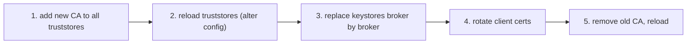

**Follow-up probes.** What happens if you do step 3 before step 1 (clients reject the new broker cert: `PKIX path building failed`)? How do you rotate the certificate used for the KRaft controller listener?

### Q60. How do you secure the controller listener and broker-to-controller traffic?
**Role:** [ADMIN] | **Difficulty:** ★★☆ | **Topic:** KRaft security

**Answer.**
The controller listener carries all metadata changes and, in KRaft, sensitive dynamic configs and SCRAM records, so treat it like an inter-broker link: map it to `SSL` or `SASL_SSL` in `listener.security.protocol.map`, give it its own keystore/truststore prefix (`listener.name.controller.ssl.*`), and choose the authentication mechanism with `sasl.mechanism.controller.protocol` (for SASL) or `ssl.client.auth=required` (for mTLS). Brokers use the same `controller.listener.names` entry and the corresponding `listener.name.controller.*` client-side configs to connect. Firewall the controller port to brokers and controllers only; clients never need it, and admin tools that talk to controllers directly (`--bootstrap-controller`, KIP-919, 3.7+) should be limited to operators. The broker and controller principals must appear in `super.users` on the controllers, and `authorizer.class.name` must be set there too; forgetting this yields `ClusterAuthorizationException` on broker registration. Keep `early.start.listeners` at the controller listener only.

**Follow-up probes.** Why should the controller listener not share a certificate with a public client listener? What does `kafka-metadata-quorum.sh --bootstrap-controller` allow that `--bootstrap-server` does not (works while brokers are down)?

### Q61. Walk through debugging SSL and SASL authentication failures.
**Role:** [ADMIN] | **Difficulty:** ★★★ | **Topic:** Security troubleshooting

**Answer.**
Match the error text to the layer, then reproduce with `openssl` and a minimal client.

| Symptom | Cause | Fix |
|---------|-------|-----|
| `PKIX path building failed` | client truststore lacks the broker CA | add CA, check `ssl.truststore.location` and type |
| `No subject alternative names matching IP address` / `hostname ... not verified` | cert SAN does not match `advertised.listeners` | reissue cert with correct SAN; do not blank `ssl.endpoint.identification.algorithm` in prod |
| `Received fatal alert: certificate_unknown` / `bad_certificate` (broker side `failed-authentication-rate` up) | broker requires client cert (`ssl.client.auth=required`) and does not trust it | client keystore, CA in broker truststore |
| `Connection to node -1 terminated during authentication` on client, `SSL handshake failed` on broker | protocol mismatch: PLAINTEXT client to SSL port or vice versa | set `security.protocol` correctly |
| `Unexpected Kafka request of type METADATA during SASL handshake` | client sent no SASL against a SASL listener | `security.protocol=SASL_SSL`, `sasl.mechanism` |
| `SaslAuthenticationException: Authentication failed: Invalid username or password` | wrong SCRAM/PLAIN credential, or user not created for that mechanism (`SCRAM-SHA-256` vs `512`) | `kafka-configs.sh --describe --entity-type users` |
| `Keystore was tampered with, or password was incorrect` | wrong `ssl.keystore.password` or wrong type (JKS vs PKCS12) | `keytool -list -v -keystore x.p12 -storetype PKCS12` |
| `Server not found in Kerberos database`, `Clock skew too great` | SPN or DNS reverse mapping wrong, NTP | fix `sasl.kerberos.service.name`, principal, time sync |
| `Invalid JWT` / `expired` with OAUTHBEARER | audience/issuer mismatch or skew | `sasl.oauthbearer.expected.audience`, `clock.skew.seconds` |

Tools: `openssl s_client -connect b1:9093 -servername b1 -showcerts`, `keytool -list -v`, `KAFKA_OPTS="-Djavax.net.debug=ssl:handshake"` on the client, `kafka-broker-api-versions.sh --command-config client.properties` as a minimal round trip, and broker metrics `kafka.server:type=socket-server-metrics,listener=CLIENT,networkProcessor=0` attributes `failed-authentication-total`, `successful-authentication-total`, `failed-reauthentication-total`. Authorization failures are a different layer: they appear only after authentication succeeded, as `TopicAuthorizationException` or `GroupAuthorizationException`, and are logged by `kafka.authorizer.logger`.

**Follow-up probes.** Why does a producer with a missing ACL sometimes hang instead of failing (metadata for unauthorized topics is filtered, so `max.block.ms` expires with `TimeoutException: Topic not present in metadata`)? How do you test a new CA without touching production clients (a canary listener)?

## 10. Backup and disaster recovery

### Q62. What are the realistic options for "backing up" Kafka?
**Role:** [ADMIN] | **Difficulty:** ★☆☆ | **Topic:** Backup

**Answer.**
Kafka has no snapshot or point-in-time backup; a backup is another copy of the log kept by replication. The options are: (1) intra-cluster replication with RF=3 across racks/AZs, which protects against broker and AZ loss but not against a bad delete or a logical error; (2) cross-cluster replication with MirrorMaker 2 (Apache) or Cluster Linking / Replicator (Confluent-specific) into a DR cluster, which adds an independent failure domain and a delay you can exploit (a replica that lags 15 minutes is a 15-minute undo window only if you can stop it in time); (3) tiered storage (KIP-405, production-ready since 3.9, `remote.storage.enable=true`), which keeps older segments in object storage with its own versioning and cross-region replication; (4) consumer-based archival to object storage with a Connect S3/GCS sink, which is the only option that supports a real point-in-time restore of a topic's content by replaying files; and (5) metadata export: topic list and configs (`kafka-topics.sh --describe`, `kafka-configs.sh --describe --all`), ACLs (`kafka-acls.sh --list`), quotas and SCRAM users, plus Schema Registry subjects, stored in git or an object bucket, because rebuilding a cluster is mostly rebuilding its metadata. Filesystem snapshots of a running broker are not consistent across brokers and are not a supported restore path.

**Follow-up probes.** How does a compacted topic change the picture (its current state is the backup, so an S3 sink of it is an easy restore)? What is the restore procedure for a single accidentally deleted topic under each option?

### Q63. Explain the internal architecture of MirrorMaker 2.
**Role:** [ADMIN] | **Difficulty:** ★★☆ | **Topic:** MirrorMaker 2

**Answer.**
MM2 is a set of three Kafka Connect connectors plus a driver that runs them: `MirrorSourceConnector` reads topics from the source cluster and writes them to the target (creating topics, syncing partition counts, topic configs and ACLs, and writing `offset-syncs` records that map source offsets to target offsets), `MirrorCheckpointConnector` reads consumer group commits on the source, translates them with the offset syncs, and writes them to `<source>.checkpoints.internal` on the target (and, with `sync.group.offsets.enabled=true`, directly into the target's `__consumer_offsets` for groups that are not active there), and `MirrorHeartbeatConnector` writes to a `heartbeats` topic so you can measure replication latency and detect which clusters are upstream. Dedicated mode (`bin/connect-mirror-maker.sh mm2.properties`) runs an embedded distributed Connect worker per replication flow with its own internal topics (`mm2-configs.<alias>.internal`, `mm2-offsets.<alias>.internal`, `mm2-status.<alias>.internal`); since 3.5 it also exposes the Connect REST API when `dedicated.mode.enable.internal.rest=true`, which is required for multi-node dedicated deployments to share task configs. Topic names on the target follow `replication.policy.class`: `DefaultReplicationPolicy` prefixes with the source alias (`primary.orders`), which prevents loops in active-active setups; `IdentityReplicationPolicy` (3.1+) keeps names for active-passive migrations.

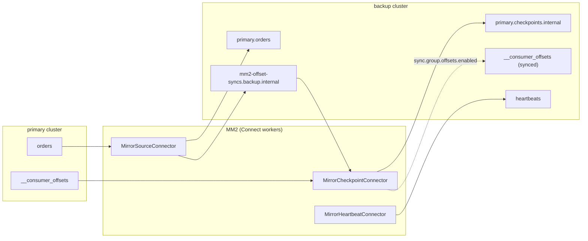

**Follow-up probes.** Where does the `offset-syncs` topic live (`offset-syncs.topic.location=source` by default, `target` optional since 3.3)? Why does MM2 need `Read` on `__consumer_offsets`-equivalent group metadata (it uses the Admin API `listConsumerGroupOffsets`)?

### Q64. Write a minimal production MM2 configuration for an active/passive DR setup and explain each line.
**Role:** [ADMIN] | **Difficulty:** ★★☆ | **Topic:** MirrorMaker 2

**Answer.**

```properties
clusters = primary, backup
primary.bootstrap.servers = p1:9093,p2:9093,p3:9093
backup.bootstrap.servers  = d1:9093,d2:9093,d3:9093
primary.security.protocol = SASL_SSL
primary.sasl.mechanism = SCRAM-SHA-512
primary.sasl.jaas.config = org.apache.kafka.common.security.scram.ScramLoginModule required username="mm2" password="...";
backup.security.protocol = SASL_SSL
# ... backup.sasl.* similarly

primary->backup.enabled = true
primary->backup.topics = payments\..*, orders\..*
primary->backup.groups = .*
primary->backup.topics.exclude = .*\.internal, .*\.replica, __.*
backup->primary.enabled = false

replication.policy.class = org.apache.kafka.connect.mirror.IdentityReplicationPolicy
replication.factor = 3
checkpoints.topic.replication.factor = 3
heartbeats.topic.replication.factor = 3
offset-syncs.topic.replication.factor = 3
sync.topic.configs.enabled = true
sync.topic.acls.enabled = false
sync.group.offsets.enabled = true
sync.group.offsets.interval.seconds = 30
emit.checkpoints.interval.seconds = 30
refresh.topics.interval.seconds = 300
tasks.max = 24
primary->backup.producer.override.compression.type = zstd
primary->backup.consumer.override.fetch.max.bytes = 52428800
```

Run it on at least two hosts with `bin/connect-mirror-maker.sh mm2.properties` (and `dedicated.mode.enable.internal.rest=true` in 3.5+ for a real multi-node cluster), always deployed next to the target cluster so that the slower, long-distance hop is the consume side, which retries safely. `IdentityReplicationPolicy` keeps topic names so consumers need no changes at failover, but it removes loop protection, so the reverse flow must stay disabled. `sync.group.offsets.enabled=true` makes DR consumers resume from translated positions automatically; MM2 only writes offsets for groups that have no active members on the target. `tasks.max` bounds parallelism across `MirrorSourceConnector` tasks (partitions are split among them); size it to partition count and to the NIC of the MM2 hosts.

**Follow-up probes.** Why is the default `sync.topic.acls.enabled` a risk with `IdentityReplicationPolicy` (ACLs are copied, which may grant unintended DR access)? How do you exclude a group from offset sync?

### Q65. How does MM2 offset translation work internally, and why can a DR consumer still see duplicates after failover?
**Role:** [ADMIN] | **Difficulty:** ★★★ | **Topic:** MirrorMaker 2

**Answer.**
Offsets differ between clusters (compaction, retention, producer retries, different partition start), so MM2 records mapping points. As `MirrorSourceConnector` produces each record it learns the target offset from the producer callback and, when the gap since the last recorded pair exceeds `offset.lag.max` (100 by default) or on partition start, emits an `OffsetSync(upstreamOffset, downstreamOffset)` to the `offset-syncs` topic; since 3.5 it keeps an in-memory, exponentially spaced history of syncs per partition so translation stays possible for old offsets. `MirrorCheckpointConnector` polls source group commits every `emit.checkpoints.interval.seconds`, finds the newest sync whose upstream offset is ≤ the committed offset, and emits a `Checkpoint(group, topicPartition, upstreamOffset, downstreamOffset, metadata)`; the translated offset is the sync's downstream offset plus (only when the sync is exact) the difference, so the result is always at or before the true position. Because the translation is conservative, a consumer resumed on DR from the checkpoint re-reads up to `offset.lag.max` records per partition, plus whatever was committed on the source but not yet replicated when the primary died (RPO). Applications must therefore be idempotent; MM2 guarantees at-least-once (it can be run with `exactly.once.source.support=enabled` on a Connect 3.5+ cluster, which removes MM2's own duplicates but not the translation slack). `RemoteClusterUtils.translateOffsets(...)` and `MirrorClient` expose the checkpoints for scripts.

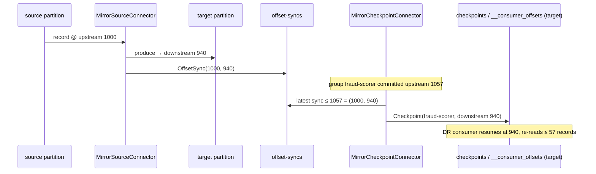

**Follow-up probes.** Why does a compacted source topic make translation less precise? What does `sync.group.offsets.enabled` refuse to do when the group is active on the target?

### Q66. Describe failover and failback procedures with MM2, and how Cluster Linking changes them.
**Role:** [ADMIN] | **Difficulty:** ★★★ | **Topic:** Disaster recovery

**Answer.**
Failover with MM2 (active/passive, `IdentityReplicationPolicy`): (1) confirm the primary is really unavailable and stop any MM2 instances still able to write to the DR cluster's topics (to prevent a late catch-up from writing behind your new producers); (2) check replication lag at the moment of failure from the `heartbeats` topic or `kafka.connect.mirror:type=MirrorSourceConnector,target=backup,topic=...,partition=...` `replication-latency-ms`, which is your RPO; (3) verify consumer offsets exist on DR (`kafka-consumer-groups.sh --bootstrap-server d1:9093 --describe --group fraud-scorer`) and, if `sync.group.offsets.enabled` was off, apply the checkpoints with a script using `RemoteClusterUtils.translateOffsets` and `--reset-offsets --from-file`; (4) repoint clients via DNS/bootstrap config, consumers first (they only read), then producers; (5) make DR the system of record: update monitoring, Schema Registry, Connect. Failback: when the old primary returns, wipe its stale tail (the records after the failover point that were never replicated are now divergent) or, simpler, treat it as a fresh cluster and mirror `backup->primary` until caught up (checkpoints included), then repeat the failover procedure in reverse during a maintenance window. Cluster Linking (Confluent Platform/Cloud, not Apache) replicates at the partition level with byte-identical offsets, so there is no translation and consumer groups resume from the same offsets; a mirror topic is read-only until you run `kafka-mirrors --promote` (waits for lag 0, needs the source reachable) or `--failover` (cuts immediately, accepting RPO), and failback uses a reverse link with a truncate-and-restore step. In both technologies the untested part is always client bootstrap switching and offsets, so run the failover as a scheduled drill quarterly.

**Follow-up probes.** Why should producers be the last to move and the first to stop? How does exactly-once processing (transactional producers) survive a failover (transaction state is not replicated; producers restart with new epochs, in-flight transactions are lost)?

## 11. Upgrades, ZooKeeper→KRaft migration, Kafka 4.0

### Q67. Describe a rolling upgrade of a KRaft cluster from 3.8 to 3.9 or 4.0, including `metadata.version`.
**Role:** [ADMIN] | **Difficulty:** ★★☆ | **Topic:** Upgrades

**Answer.**
Upgrade binaries on every node first while keeping the finalized `metadata.version` unchanged, verify, then bump the feature level with `kafka-features.sh`.

1. Check the current level: `bin/kafka-features.sh --bootstrap-server b1:9092 describe` (shows `metadata.version` `FinalizedVersionLevel` and each broker's `SupportedMaxVersion`).
2. Read the upgrade notes for the target release (Java 17 required for 4.0 brokers; Log4j 2 config; removed configs).
3. Roll controllers one at a time to the new binaries, then brokers (Q37).
4. Run for a while on the old metadata version; a downgrade of binaries is still possible at this point.
5. Finalize: `bin/kafka-features.sh --bootstrap-server b1:9092 upgrade --release-version 4.0` (sets every feature to the levels bundled with 4.0: `metadata.version`, `kraft.version`, `transaction.version`, `group.version`, `eligible.leader.replicas.version`), or `upgrade --feature metadata.version=<level>` for one feature.
6. Verify with `describe` and check `kafka.controller:type=KafkaController,name=MetadataErrorCount` stays 0.

In KRaft `inter.broker.protocol.version` and `log.message.format.version` are ignored (and removed in 4.0), so the metadata version is the only switch. Kafka 4.0 requires the cluster to already be on `metadata.version` ≥ 3.3-IV3 and in KRaft mode; ZooKeeper clusters must migrate on 3.9 first (Q69).

**Follow-up probes.** Why do you wait between binary upgrade and feature upgrade? What is the difference between a "safe" and an "unsafe" metadata downgrade?

### Q68. What does `kafka-features.sh` manage, and when can you downgrade?
**Role:** [ADMIN] | **Difficulty:** ★★☆ | **Topic:** Upgrades

**Answer.**
It manages finalized feature levels stored in the metadata log: `metadata.version` (record formats and controller behaviors, e.g. `3.9-IV0`, `4.0-IV3`), `kraft.version` (0 static, 1 dynamic quorum), `transaction.version` (2 enables KIP-890 transactions v2 in 4.0), `group.version` (1 enables the KIP-848 consumer protocol), `eligible.leader.replicas.version` (1 enables KIP-966 ELR in 4.0), and `share.version` for share groups. Commands: `describe`, `upgrade --feature name=level` or `--release-version X.Y`, `downgrade --feature metadata.version=<level>` and `disable --feature name`; every command takes `--bootstrap-server` or, when brokers are down, `--bootstrap-controller`. Upgrades are validated against every registered broker's supported range, so a node that was skipped in the rolling upgrade blocks the finalize with a clear error. Downgrading `metadata.version` is only allowed if no metadata record written at the higher level would be lost ("safe" downgrade); otherwise the tool refuses unless you pass `--unsafe`, which drops those records and is a last resort. New clusters are formatted at the binary's latest level unless `kafka-storage.sh format --release-version 3.9` or `--feature metadata.version=...` pins a lower one, which is useful when you must keep the ability to roll back to older binaries.

**Follow-up probes.** Why can a feature upgrade be a one-way door for binaries (a 3.8 binary cannot read 3.9 record versions)? How is this different from the ZooKeeper-era `inter.broker.protocol.version` two-step?

### Q69. List the steps of a ZooKeeper→KRaft migration.
**Role:** [ADMIN] | **Difficulty:** ★★★ | **Topic:** Migration

**Answer.**
The migration (KIP-866, GA since 3.6, last supported in 3.9; removed in 4.0) runs a KRaft controller quorum in a bridge mode that copies ZooKeeper metadata into the metadata log and then dual-writes until every broker is switched.

1. Upgrade the ZK cluster to 3.9 with `inter.broker.protocol.version=3.9` and confirm no ZK-dependent plugins (custom authorizers, `AclAuthorizer` is migrated automatically to `StandardAuthorizer` ACLs).
2. Read the cluster id from ZooKeeper (`bin/zookeeper-shell.sh zk1:2181 get /cluster/id` or `kafka-cluster.sh cluster-id`) and provision 3 controllers with `process.roles=controller`, `controller.quorum.voters`, `zookeeper.connect=...`, `zookeeper.metadata.migration.enable=true`; format each with `kafka-storage.sh format -t <cluster-id> -c controller.properties` and start them.
3. Roll every broker with `zookeeper.metadata.migration.enable=true`, `controller.quorum.voters`, `controller.listener.names`, the CONTROLLER entry in `listener.security.protocol.map`, and `inter.broker.protocol.version=3.9`; they stay ZK brokers but can talk to the KRaft controllers.
4. When all brokers are registered, the active controller performs the copy and logs `Completed migration of metadata from ZooKeeper to KRaft`; `kafka.controller:type=KafkaController,name=ZkMigrationState` reports the phase, `MigratingZkBrokerCount` the brokers still in ZK mode. The cluster is now in dual-write mode: KRaft is the source of truth and every change is also written to ZK so a rollback stays possible.
5. Roll brokers into KRaft mode one at a time: `process.roles=broker`, `node.id` = old `broker.id`, remove `zookeeper.connect`, `zookeeper.metadata.migration.enable` and `inter.broker.protocol.version`; do not format their log dirs (the migration writes `meta.properties`).
6. When no ZK-mode brokers remain, roll the controllers removing `zookeeper.metadata.migration.enable` and `zookeeper.connect` to finalize; from here rollback is impossible. Decommission ZooKeeper.

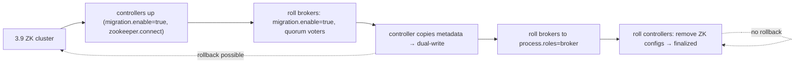

**Follow-up probes.** How do you roll back from dual-write mode (revert brokers to ZK configs, then stop controllers and delete `/migration` in ZK)? Why must the controller quorum be a separate set of nodes during migration (combined mode is not supported for migration)?

### Q70. What are the common gotchas in a ZooKeeper→KRaft migration?
**Role:** [ADMIN] | **Difficulty:** ★★★ | **Topic:** Migration

**Answer.**

| Gotcha | Consequence | Mitigation |
|--------|-------------|------------|
| JBOD brokers (multiple `log.dirs`) on releases before 3.7 | migration refuses to start | run the migration on 3.8/3.9 where KIP-858 JBOD is supported |
| Custom `authorizer.class.name` or plugins using ZooKeeper | brokers fail after switching | port to `StandardAuthorizer`; test on staging |
| Tooling and automation with `--zookeeper` | scripts break | rewrite to `--bootstrap-server` before, not during |
| `broker.id` versus `node.id` and `meta.properties` version 0 vs 1 | broker refuses to start in KRaft mode | keep the same id; the migration rewrites `meta.properties` |
| Controller quorum sized for metadata write load | slow migration or timeouts on large clusters | dedicated controllers with SSDs; check `ZkMigrationState` and controller log for retries |
| Large metadata (100k+ partitions, many ACLs) | the initial copy takes minutes and the ZK controller is busy | schedule off-peak; raise `zookeeper.session.timeout.ms` temporarily |
| `inter.broker.protocol.version` left unset | migration blocked by the version check | set it explicitly to the bridge release |
| SCRAM users, delegation tokens, quotas | migrated automatically in 3.6+, but verify | `kafka-configs.sh --describe --entity-type users` after the copy |
| Dynamic broker configs in ZK | migrated; per-broker configs keyed by id | verify with `--describe --all` |
| Consumers of `__consumer_offsets` timing | none, data topics are untouched | no data movement occurs; this is metadata only |
| Finalizing too early | no rollback | soak in dual-write mode for days, run a restart test |

The migration touches metadata only; partition data stays on disk untouched, which is why the process is safe to run under production traffic when done one broker at a time.

**Follow-up probes.** How do you verify that KRaft holds the same ACLs as ZooKeeper (diff `kafka-acls.sh --list` before and after)? What breaks if a broker was accidentally formatted with `kafka-storage.sh format` during step 5 (it would lose its `broker.id` mapping and, worse, an empty `meta.properties` on top of full log dirs)?

### Q71. What changes in Kafka 4.0 does an administrator have to know?
**Role:** [ADMIN] | **Difficulty:** ★★☆ | **Topic:** Kafka 4.0

**Answer.**

| Change | Impact |
|--------|--------|
| ZooKeeper removed; KRaft only | `zookeeper.connect` unknown; migrate on 3.9 before upgrading; minimum `metadata.version` 3.3-IV3 |
| Java 17 for brokers, Connect and tools (Java 11 for clients and Streams) | update base images and `JAVA_HOME` |
| Log4j 2 (`config/log4j2.yaml`, KIP-653) | old `log4j.properties` ignored; `broker-loggers` still works |
| KIP-848 consumer protocol GA (`group.protocol=consumer`, `group.coordinator.rebalance.protocols`) | new coordinator metrics, group-level configs (`--entity-type groups`) |
| KIP-896: pre-2.1 client protocol versions removed; KIP-724: message format v0/v1 removed | clients older than 2.1 cannot connect; old on-disk v0/v1 segments must be gone (upgrade path via 3.x) |
| KIP-890 transactions v2 (`transaction.version=2`) | stronger fencing; enable with `kafka-features.sh` |
| KIP-966 ELR (`eligible.leader.replicas.version=1`) | safer leader election; `--describe` shows Elr |
| KIP-932 share groups (early access) | `kafka-share-groups.sh`, `share.coordinator.*` configs; not for production |
| KIP-1030 default changes | producer `linger.ms` 0→5, `num.recovery.threads.per.data.dir` 1→2, timestamp validation defaults |
| Removed tools and configs | MirrorMaker 1 gone, `--zookeeper` flags gone, `kafka-preferred-replica-election.sh` gone (use `kafka-leader-election.sh`), `inter.broker.protocol.version` and `log.message.format.version` removed |
| Tiered storage production-ready (since 3.9) | `remote.log.storage.system.enable`, disable per topic since KIP-950 |
| `kafka-groups.sh` (KIP-1043) | one tool to list all group types |

The most common upgrade-day failures are the Java version, the Log4j config, and a forgotten legacy client that stops connecting.

**Follow-up probes.** How do you inventory client versions before upgrading (`RequestsPerSec` by `version`, request log at DEBUG, KIP-714 telemetry)? Which of these can be enabled later rather than at upgrade time?

### Q72. Which clients can talk to a Kafka 4.0 broker, and how do you find the ones that cannot?
**Role:** [ADMIN] | **Difficulty:** ★☆☆ | **Topic:** Kafka 4.0

**Answer.**
Kafka brokers negotiate API versions with each client (`ApiVersions` request), so any Java client from 2.1 onward, and non-Java clients built on librdkafka 1.x+ that support the corresponding API versions, work with 4.0 brokers; KIP-896 removed the oldest request versions, so clients released before Kafka 2.1 (2018) get `UNSUPPORTED_VERSION` on connect. Kafka Streams and Connect from older 2.x releases are also affected because they embed those clients. To find them before the upgrade: enable the request log briefly (`kafka-configs.sh --entity-type broker-loggers --alter --add-config kafka.request.logger=DEBUG`) and grep for `clientSoftwareName`/`clientSoftwareVersion` (reported by 2.4+ clients; anything missing it is old), read `kafka.network:type=RequestMetrics,name=RequestsPerSec,request=Produce,version=N` for low `version` values, use KIP-714 telemetry on 3.7+, and check `kafka-broker-api-versions.sh --bootstrap-server b1:9092` output to see the supported ranges. Note that 4.0 brokers still support the classic consumer protocol, so old-but-supported clients simply keep using it.

**Follow-up probes.** What is the minimum librdkafka version you would accept and how would you verify it? How does this interact with MM2 between a 2.0 cluster and a 4.0 cluster (run MM2 on 3.x binaries in between)?

## 12. Troubleshooting

### Q73. Under-replicated partitions: how do you find the cause quickly?
**Role:** [ADMIN] | **Difficulty:** ★☆☆ | **Topic:** Troubleshooting

**Answer.**
Establish which replicas are missing and whether one broker or one leader is involved, then check that broker's disk, GC and network. Start with `bin/kafka-topics.sh --bootstrap-server b1:9092 --describe --under-replicated-partitions`; if the missing replica is always the same broker, look at that broker (down, restarting, `OfflineLogDirectoryCount`, GC log, `iowait`); if the missing replica varies but the leader is always the same broker, the leader is overloaded (`RequestHandlerAvgIdlePercent`, `NetworkProcessorAvgIdlePercent`); if it is cluster-wide and transient, suspect network or a saturated cross-AZ link. Followers are removed from the ISR when they have not caught up to the leader's log end within `replica.lag.time.max.ms` (30 s), so anything that delays a follower fetch cycle (a large message with too small `replica.fetch.max.bytes`, too few `num.replica.fetchers`, a slow disk) shows here. `kafka.server:type=ReplicaFetcherManager,name=MaxLag,clientId=Replica` on the follower and `IsrShrinksPerSec` on the leader tell you which side it is.

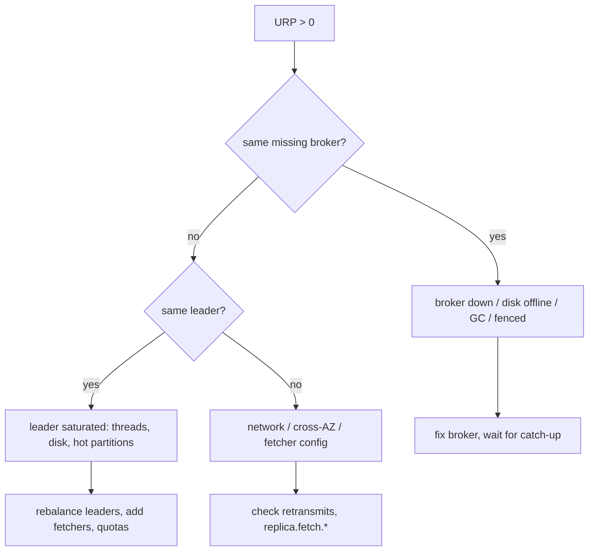

**Follow-up probes.** What is the difference between URP and under-min-ISR for clients? Why do URPs during a reassignment not count as a problem (they are expected while new replicas catch up)?

### Q74. A partition is offline. What are the options, and what does each cost?
**Role:** [ADMIN] | **Difficulty:** ★★☆ | **Topic:** Troubleshooting

**Answer.**
A partition is offline when no in-sync replica is alive to become leader, which with `unclean.leader.election.enable=false` means the last ISR member is down. Check `kafka.controller:type=KafkaController,name=OfflinePartitionsCount` and `kafka-topics.sh --describe --unavailable-partitions` to see which brokers hold the last ISR replica. Option 1: bring that broker back (no data loss); this is always preferred and is often just a restart. Option 2: unclean election, `bin/kafka-leader-election.sh --bootstrap-server b1:9092 --election-type unclean --topic t --partition 3`, which makes an out-of-sync replica leader and loses every record it had not replicated (and consumers may see offsets go backwards); do it only when availability matters more than those records, and record it in the incident log. Option 3 (4.0 with ELR, KIP-966): the controller can elect from the Eligible Leader Replicas set, replicas that were in sync up to the high watermark before being dropped, without data loss, so many former offline situations resolve automatically. Never set `unclean.leader.election.enable=true` cluster-wide as a "fix"; do it per topic and per incident.

**Follow-up probes.** What happens to a producer with `acks=all` during the outage (`NotEnoughReplicasException` retries until `delivery.timeout.ms`)? How do you find which records were lost after an unclean election (leader epoch and log truncation in `state-change.log`)?

### Q75. A broker will not start. What do you check, in order?
**Role:** [ADMIN] | **Difficulty:** ★★☆ | **Topic:** Troubleshooting

**Answer.**
Read the last 200 lines of `server.log` before touching anything; the message is nearly always explicit.

| Log message | Cause | Fix |
|-------------|-------|-----|
| `InconsistentClusterIdException` / `Invalid cluster.id in meta.properties` | wrong cluster id, cloned disk | fix or re-format the specific dir |
| `InconsistentNodeIdException` | `node.id` differs from `meta.properties` | align config |
| `No readable meta.properties files found` / log dir unformatted | new disk | `kafka-storage.sh format --ignore-formatted` |
| `Address already in use` | old process or port conflict | `ss -lntp` |
| `Too many open files` / `Map failed` | limits | systemd `LimitNOFILE`, `vm.max_map_count` |
| `Found a corrupted index file`, long `Recovering unflushed segment` lines | unclean shutdown | wait; raise `num.recovery.threads.per.data.dir`; startup can take minutes |
| `CorruptRecordException` on a segment | disk corruption | move the partition directory away, let it re-replicate |
| `Unable to register broker ... ` or stuck in `STARTING` | cannot reach controllers, wrong `controller.quorum.*`, TLS/SASL on controller listener, super.users | check controller logs, `kafka-metadata-quorum.sh --bootstrap-controller` |
| `Broker ... is fenced` and restarting loop | duplicate `node.id` on another host | find the other process |
| `java.lang.OutOfMemoryError` at start | `KAFKA_HEAP_OPTS` too big for the host | fix heap |
| `Unrecognized VM option` / Java version errors | 4.0 needs Java 17 | update JDK |

Check `BrokerState` via JMX (1 Starting, 2 Recovery, 3 Running) to distinguish "slow" from "stuck"; a broker in `Recovery` with rising disk reads is working. Do not delete log directories to "fix" startup unless you have confirmed the data is replicated elsewhere.

**Follow-up probes.** Why does a broker in `STARTING` still answer nothing on 9092 (listeners open only when registered and unfenced)? What does `kafka-dump-log.sh --files ... --verify-index-only` do?

### Q76. A consumer group rebalances every few minutes. How do you diagnose and fix it?
**Role:** [ADMIN] | **Difficulty:** ★★★ | **Topic:** Troubleshooting

**Answer.**
Identify which member leaves and why from the coordinator's log and the client metrics, then fix the timing configuration or the processing loop. On the broker hosting the group coordinator, `server.log` shows either `Member ... has failed, removing it from the group` (missed heartbeats, `session.timeout.ms` 45 s default since 3.0) or `Member ... left the group` / `consumer poll timeout has expired` (the consumer called `poll()` too late; `max.poll.interval.ms` 5 min), or `Preparing to rebalance group ... (reason: Adding new member)` (members restarting, autoscaling, or a deployment loop). Client-side, `kafka.consumer:type=consumer-coordinator-metrics,client-id=…` `rebalance-rate-per-hour`, `failed-rebalance-rate-per-hour`, `last-rebalance-seconds-ago` and `kafka.consumer:type=consumer-fetch-manager-metrics` `records-consumed-rate` distinguish slow processing from crashes. Fixes: reduce `max.poll.records` or make processing asynchronous so `poll()` is called within `max.poll.interval.ms`; raise `max.poll.interval.ms` only with a reason; use static membership (`group.instance.id`) so restarts within `session.timeout.ms` do not trigger rebalances; use `CooperativeStickyAssignor` (3.x) or the KIP-848 `group.protocol=consumer` in 4.0 so that a rebalance no longer stops the whole group; check for a member that is stuck on a poison record and loops; and verify the group is not shared by two different applications with the same `group.id`. On the broker, `kafka.coordinator.group:type=GroupMetadataManager,name=NumGroupsPreparingRebalance` and the `__consumer_offsets` leader's load tell you whether the coordinator itself is slow.

**Follow-up probes.** How does a long GC pause in the consumer show up (heartbeat thread is separate, so the member survives until `max.poll.interval.ms`)? Why does `session.timeout.ms` need to stay within `group.min.session.timeout.ms`–`group.max.session.timeout.ms` on the broker?

### Q77. Producers report `TimeoutException`. Which timeout, and how do you tell?
**Role:** [ADMIN] | **Difficulty:** ★☆☆ | **Topic:** Troubleshooting

**Answer.**
The message text names the timer. `Topic X not present in metadata after 60000 ms` is `max.block.ms`: the producer could not get metadata, which means it cannot reach any bootstrap broker, the topic does not exist (with auto-create off), or the principal lacks `Describe`/`Write` on the topic (unauthorized topics are hidden). `Expiring N record(s) for X-0: 120000 ms has passed since batch creation` is `delivery.timeout.ms`: batches sat in the accumulator or were retried longer than allowed, usually because the partition leader was unavailable or `NOT_ENOUGH_REPLICAS` kept retrying (check `UnderMinIsrPartitionCount`), or throughput exceeds what the connection can push (`buffer.memory` full, `record-queue-time-avg` high). A per-request timeout (`request.timeout.ms`, 30 s) shows in the broker as slow `TotalTimeMs` and on the client as `NetworkException`/disconnects. `Connection to node -1 could not be established` is neither: it is DNS or `advertised.listeners`. Check the producer metrics `record-error-rate`, `record-retry-rate`, `request-latency-avg` and the broker's `RequestMetrics` for Produce to locate the delay, then fix the cause instead of raising the timeout.

**Follow-up probes.** Why must `delivery.timeout.ms` ≥ `linger.ms` + `request.timeout.ms`? How does `acks=all` with a slow follower show in `RemoteTimeMs`?

### Q78. The broker log shows `Too many open files` or `Map failed`. What do you do?
**Role:** [ADMIN] | **Difficulty:** ★☆☆ | **Topic:** Troubleshooting

**Answer.**
Both are OS limits hit by the number of segments and connections. `java.io.IOException: Too many open files` means the process hit `RLIMIT_NOFILE`; the log directory is marked offline and replicas go offline. Check the current usage with `ls /proc/$(pgrep -f kafka.Kafka)/fd | wc -l` versus `grep 'open files' /proc/<pid>/limits`, and fix permanently by setting `LimitNOFILE=200000` in the systemd unit (PAM limits do not apply to services) and restarting. `java.io.IOException: Map failed` or `OutOfMemoryError: Map failed` is `vm.max_map_count` (65530 default) exhausted by mmapped `.index` and `.timeindex` files; set `sysctl -w vm.max_map_count=262144` (persist in `/etc/sysctl.d/`) and restart the broker. Reduce the pressure structurally: fewer partitions, larger `segment.bytes` for high-volume topics so fewer segments exist, shorter retention, and `connections.max.idle.ms` to close idle client sockets. Watch `process_open_fds` per broker with an alert at 80% of the limit.

**Follow-up probes.** How many files per partition do you budget (roughly 3–4 per segment times segments per partition)? Why does the count spike during log compaction (new `.cleaned` and `.swap` files)?

### Q79. How do you recognize and fix GC-induced instability on a broker?
**Role:** [ADMIN] | **Difficulty:** ★★★ | **Topic:** Troubleshooting

**Answer.**
The signature is periodic `IsrShrinksPerSec` spikes followed by `IsrExpandsPerSec`, produce p99 latency spikes, occasional broker fencing (`TimedOutBrokerHeartbeatCount` on the controller, since a pause over `broker.session.timeout.ms` = 9 s misses heartbeats) and, in `kafkaServer-gc.log`, pauses of hundreds of ms or full GCs. Correlate timestamps first; if pauses match the incidents, look at why: heap too large or too small (`-Xmx` far above what is used makes G1 young collections longer; too small forces frequent mixed collections), humongous allocations from large `replica.fetch.response.max.bytes`, `fetch.max.bytes` or big messages (raise `-XX:G1HeapRegionSize` to 16–32 MB so fewer allocations count as humongous), an explicit `System.gc()` from a JMX agent (`-XX:+ExplicitGCInvokesConcurrent`), memory pressure from too much page cache eviction (swap must be zero), or a metric reporter leaking objects. Standard remedy: 6–8 GiB heap, `-XX:+UseG1GC -XX:MaxGCPauseMillis=20 -XX:InitiatingHeapOccupancyPercent=35`, Java 17, and keep `socket.request.max.bytes` sane. Confirm the fix by watching `java.lang:type=GarbageCollector,name=G1 Old Generation` `CollectionCount` staying flat and ISR churn at zero.

**Follow-up probes.** Why does raising `replica.lag.time.max.ms` hide rather than fix this? When would you consider ZGC?

### Q80. The log cleaner died. How do you detect it, what are the consequences, and how do you recover?
**Role:** [ADMIN] | **Difficulty:** ★★★ | **Topic:** Troubleshooting

**Answer.**
Detect it with `kafka.log:type=LogCleaner,name=DeadThreadCount` > 0 and `kafka.log:type=LogCleanerManager,name=time-since-last-run-ms` growing without bound, plus the stack trace in `log-cleaner.log`. Since KIP-346 (2.6) most per-partition failures (corrupt segment, unexpected exception) mark just that partition uncleanable (`uncleanable-partitions-count`, `uncleanable-bytes`) and the thread continues, but disk errors and some bugs still kill it. Consequences: compacted topics stop shrinking, most importantly `__consumer_offsets` and `__transaction_state`, so disk fills, and any coordinator move loads a huge partition, making consumer groups take minutes to become available; Streams changelog restores also grow. Recovery: fix the underlying issue (disk, corrupt segment which you move out of the partition directory while the broker is stopped), then restart the broker, which restarts the cleaner; verify `max-dirty-percent` dropping and `cleaner-recopy-percent` moving. Tuning that prevents recurrences: `log.cleaner.threads=2` or more on brokers with many compacted partitions, `log.cleaner.dedupe.buffer.size` sized so `max-buffer-utilization-percent` stays under 100 (the cleaner processes fewer segments per pass otherwise), `log.cleaner.io.max.bytes.per.second` to keep compaction from starving fetches, and `log.cleaner.backoff.ms` left at default. Never delete `__consumer_offsets` segments by hand.

**Follow-up probes.** How do you find which partition is uncleanable (`kafka-log-dirs.sh` sizes plus the cleaner log)? What does `max.compaction.lag.ms` do if the cleaner is dead (nothing; it is a scheduling hint, not a guarantee)?
