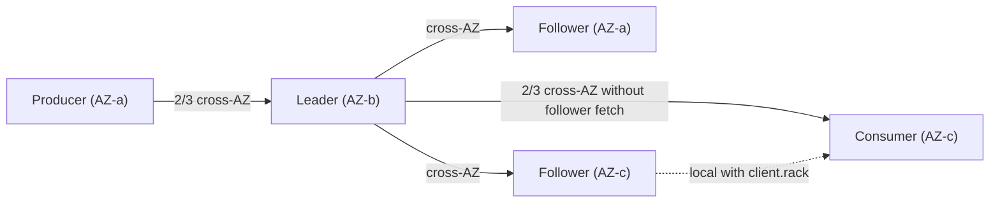
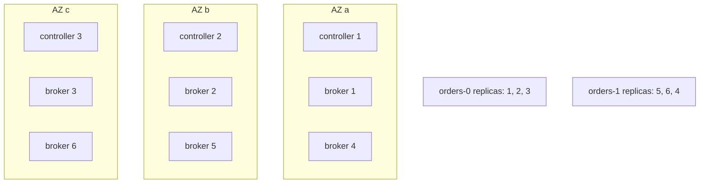
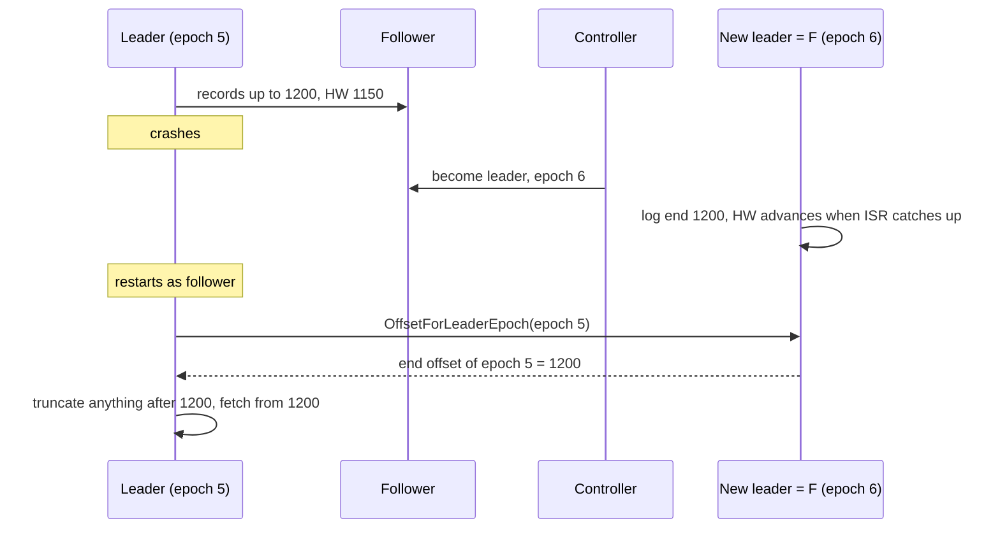
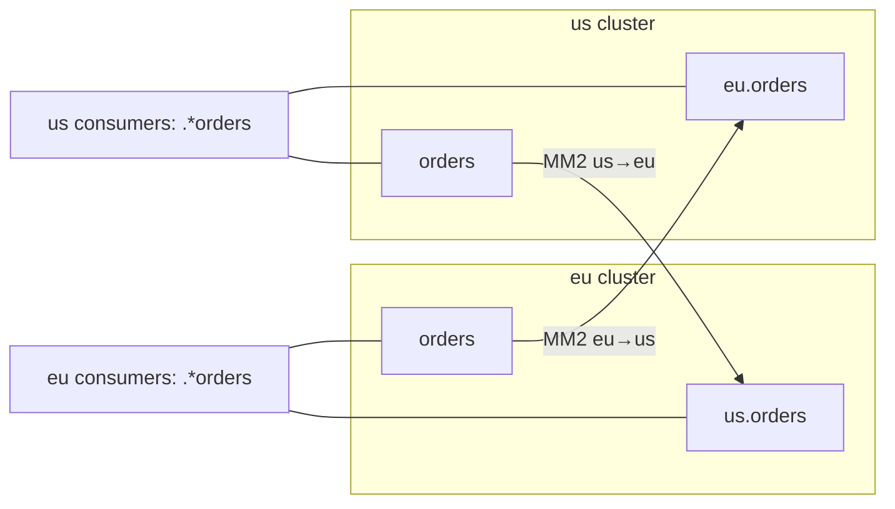
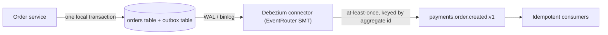
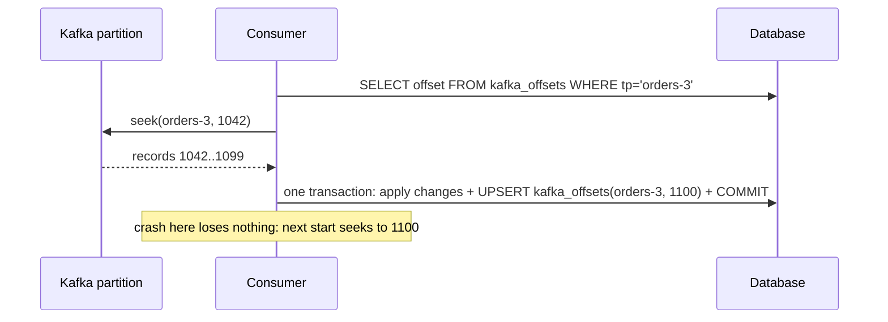
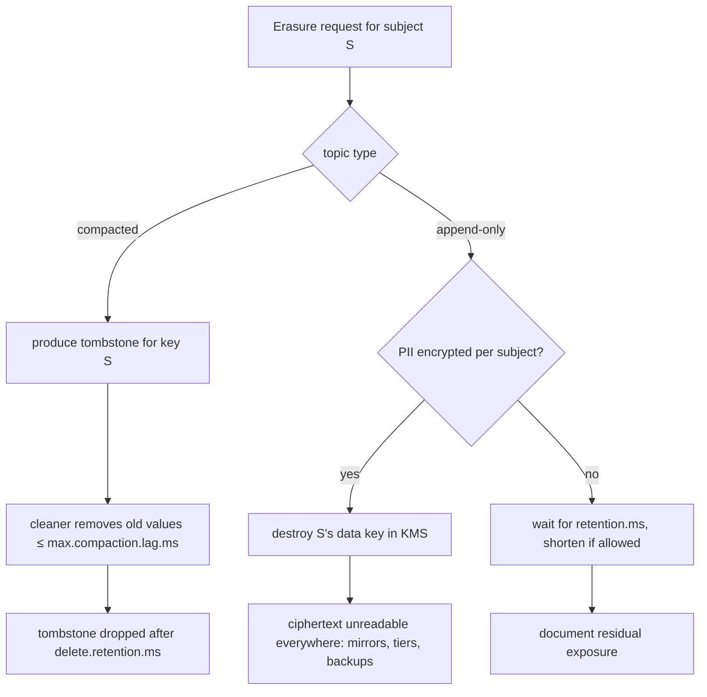
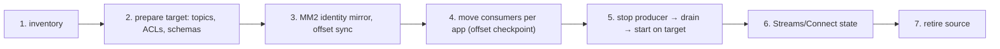

# Architect Question Bank

**Roles:** [ARCH]   **Level:** Intermediate → Advanced
**Baseline:** Apache Kafka 3.9 / 4.0, KRaft mode. Vendor-specific features (Confluent, MSK, Event Hubs, Redpanda, WarpStream) are named as such.

This bank contains 70 questions for Kafka architects. The answers are about trade-offs, sizing method, failure domains, topology, cost and governance rather than about running commands, although each one names the configs, metrics and formulas that make the reasoning concrete. Numbers are indicative unless they are Kafka defaults. Difficulty mix: about 30% ★☆☆, 45% ★★☆, 25% ★★★.

## Table of contents

| # | Topic | Questions |
|---|-------|-----------|
| 1 | Capacity planning and sizing | Q1–Q10 |
| 2 | Performance trade-offs | Q11–Q17 |
| 3 | Durability and availability | Q18–Q25 |
| 4 | Multi-datacenter, DR and multi-region | Q26–Q34 |
| 5 | Event-driven patterns and stream processing | Q35–Q44 |
| 6 | Topic and schema design, data contracts, governance, privacy | Q45–Q53 |
| 7 | Platform strategy: managed vs self-managed, vendors, cost, SLOs | Q54–Q63 |
| 8 | Security architecture and migration strategy | Q64–Q70 |

---

## 1. Capacity planning and sizing

### Q1. Describe your method for sizing a new Kafka cluster from business requirements.
**Role:** [ARCH] | **Difficulty:** ★☆☆ | **Topic:** Capacity planning

**Answer.**
Turn the requirements into four numbers, ingest throughput, fan-out, retention and durability, and derive storage, network, partitions and broker count from them, then validate with a load test. Inputs: peak messages/s and average compressed message size (giving write throughput W in MB/s), number of consumer groups reading each byte (fan-out F), retention period R, replication factor RF (3), and growth (usually 2× over the planning horizon). Derived: storage = W × R × RF × (1 + 10% index/overhead) ÷ target disk utilization (0.6–0.7); network in per cluster = W × RF (producer plus replication) and out = W × (RF − 1 + F); partitions from per-partition throughput measurements (Q3); brokers = max over the storage, network and partition budgets, then rounded up to a multiple of the AZ count and plus one for failure headroom. Validate with `kafka-producer-perf-test.sh` and `kafka-consumer-perf-test.sh` on the chosen instance type, because per-broker throughput depends on message size, compression, `acks` and TLS more than on the vendor's spec sheet. Finally reserve 30% headroom on every dimension for a broker outage, and document the assumptions so the numbers can be revisited.

**Follow-up probes.** Which of the four inputs do product teams usually get wrong (peak versus average, and message size before compression)? What changes when consumers replay history regularly?

### Q2. Work the storage and network math for 200 MB/s ingest, 7-day retention, RF=3, 4 consumer groups.
**Role:** [ARCH] | **Difficulty:** ★★☆ | **Topic:** Capacity planning

**Answer.**
Storage: 200 MB/s × 86 400 s × 7 days = 121 TB of raw data; × RF 3 = 363 TB; × 1.1 overhead ÷ 0.65 utilization ≈ 615 TB usable disk cluster-wide. With 12 brokers that is about 51 TB per broker, which already argues for tiered storage (Q10) or shorter local retention. Network per cluster: inbound = 200 MB/s from producers + 400 MB/s replication = 600 MB/s; outbound = 400 MB/s replication + 4 × 200 MB/s to consumers = 1 200 MB/s. Per broker (12): 50 MB/s in and 100 MB/s out on average, but leaders of hot partitions and the brokers left after a failure carry more, so plan for 2× that, i.e. 200 MB/s ≈ 1.6 Gbit/s per broker, well within a 10 Gbit/s NIC but not within a burstable cloud instance's baseline. Page cache: to keep the last 30 minutes of writes hot for consumers, 200 MB/s × 1800 s = 360 GB cluster-wide, 30 GB per broker, which sets the memory floor beyond the JVM heap. All figures are indicative and ignore compression ratio, which typically cuts storage and network by 2–5× for JSON.

**Follow-up probes.** How does cross-AZ placement change the network bill (Q5)? What happens to these numbers with `acks=1` (nothing for storage; the replication traffic is the same)?

### Q3. How do you set a partition budget for a cluster and for a topic?
**Role:** [ARCH] | **Difficulty:** ★★☆ | **Topic:** Partition budget

**Answer.**
A topic's partition count comes from throughput and consumer parallelism; the cluster's budget comes from per-broker resource limits and failure behavior. Per topic: `max(W / p, C / c, max consumers per group)` with p and c the measured per-partition producer and consumer throughput (indicatively 10–50 MB/s in, 20–100 MB/s out with batching and compression), then 1.5–2× headroom because increasing later breaks key ordering, rounded to a highly divisible number. Per cluster: sum partitions × RF ÷ brokers must stay within a per-broker budget defined by file handles, mmap, recovery time and controller failover; in KRaft the ZooKeeper-era cluster cap is gone, but a working guideline remains a few thousand partitions per broker, with the actual number validated by measuring restart-after-crash time (log recovery scans every partition) and time-to-new-leader after killing a broker. Add governance: `create.topic.policy.class.name` to cap partitions per topic, `controller_mutation_rate` quotas, and a rule that a topic with less than ~1 MB/s does not get more than 6–12 partitions. The trap is over-partitioning "for the future": each partition costs producer batch memory, consumer fetch memory, replica fetcher work and metadata, and 100 000 near-empty partitions cost more than 10 000 busy ones.

**Follow-up probes.** Why does per-partition throughput fall as partitions per broker rise (less batching per fetch, more random I/O)? How does KIP-848 change the consumer parallelism argument (it does not; a partition is still read by one member)?

### Q4. How do you choose replication factor and how does it enter the cost model?
**Role:** [ARCH] | **Difficulty:** ★☆☆ | **Topic:** Capacity planning

**Answer.**
RF=3 with `min.insync.replicas=2` across three failure domains is the default for anything that matters; RF=2 is only for data you can regenerate, and RF≥4 is for very high-value data or clusters spanning more than three racks where you want two failures tolerated without losing write availability. RF multiplies disk (RF × raw), replication network (RF − 1 × ingest) and CPU on followers, and it defines availability: with RF=3, `min.insync.replicas=2` and `acks=all`, one broker can be down without impacting producers, and the second failure blocks writes but loses nothing; with RF=2 the first failure already blocks `acks=all` writes at `min.insync.replicas=2`, so RF=2 in practice forces `min.insync.replicas=1` and accepts loss. Internal topics (`__consumer_offsets`, `__transaction_state`) must be RF=3 regardless of the data topics. Cost note: with RF=3 across AZs, replication is the largest cross-AZ traffic (Q5), so the "cheap" choice of RF=2 saves both disk and about a third of the AZ egress, at the price of the availability model above.

**Follow-up probes.** Why is RF=3 with `min.insync.replicas=1` almost as unsafe as RF=1 for acknowledged writes? How does tiered storage interact with RF (remote copies are not replicated by Kafka; object storage provides its own durability)?

### Q5. Quantify AWS cross-AZ traffic and cost for a 3-AZ Kafka cluster and explain what reduces it.
**Role:** [ARCH] | **Difficulty:** ★★★ | **Topic:** Cost

**Answer.**
With brokers spread over three AZs and rack-aware placement (`broker.rack`), each partition has one replica per AZ, so per byte produced: the producer-to-leader hop crosses an AZ boundary 2/3 of the time (the leader is in the producer's AZ only one third of the time), replication crosses twice (the two followers are always in other AZs), and each consumer fetch crosses 2/3 of the time unless follower fetching is enabled. Expected cross-AZ bytes per produced byte ≈ 2/3 + 2 + 2/3 × F, where F is the number of consumer groups; with F=4 that is about 5.3 bytes crossing per byte written. AWS bills both directions at $0.01/GB each (indicative, region dependent), so 100 MB/s of ingest ≈ 8.6 TB/day × 5.3 ≈ 46 TB/day crossing ≈ $920/day, i.e. roughly $28 000/month, often more than the instances. Reductions, in order of payoff: (1) follower fetching (KIP-392: `replica.selector.class=org.apache.kafka.common.replication.RackAwareReplicaSelector` on brokers, `client.rack` on consumers) removes the consumer term; (2) compression (zstd/lz4) shrinks every term; (3) AZ-aware producers are not possible with leaders, but keeping producers and consumers in the same AZ as the majority of their traffic through leader placement is not practical, so accept the 2/3; (4) RF=2 (accepting the availability model in Q4); (5) MSK does not bill in-cluster replication traffic across AZs (MSK-specific pricing), which changes the equation; (6) WarpStream-style diskless architectures (Q60) write to S3 per AZ and avoid inter-AZ traffic entirely at a latency cost; (7) single-AZ clusters plus MM2 to another AZ are cheaper but weaken durability.

**Follow-up probes.** What does follower fetching cost in end-to-end latency (the record must reach the follower and the high watermark must propagate)? How would you measure actual cross-AZ bytes (VPC flow logs aggregated by AZ, or per-listener `BytesOutPerSec` when listeners are per AZ)?

### Q6. Which cloud instance and disk types do you choose for brokers, and why?
**Role:** [ARCH] | **Difficulty:** ★★☆ | **Topic:** Instance selection

**Answer.**
Choose memory-and-network-heavy instances with either local NVMe or high-throughput network block storage, and size the disk for throughput first, capacity second. Two viable patterns: (1) local NVMe (`i3en`, `i4i`, `is4gen` on AWS; similar on other clouds) gives the highest and most predictable disk throughput at the lowest cost per TB, but the data disappears when the instance is stopped or fails, so RF must carry durability and every replacement is a full re-replication, which on a 20 TB broker takes hours and stresses the cluster; (2) network block storage (`gp3` with provisioned throughput up to 1 000 MB/s and 16 000 IOPS, or `io2`) on `m6i`/`r6i`-class instances, which allows a broker to be replaced in minutes by re-attaching the volume (this is how MSK and most Kubernetes operators work) at higher cost per TB and with a per-volume throughput ceiling that becomes the bottleneck for hot brokers. Avoid burstable instances and baseline-limited network; check the instance's sustained network bandwidth, not the "up to" figure. Memory: 64 GB+ so that page cache covers the consumer working set; CPU: 8–16 vCPU unless TLS everywhere or heavy recompression. ARM (Graviton) runs Kafka well and is cheaper per throughput. Numbers are indicative.

**Follow-up probes.** Why is `st1`-style throughput-optimized HDD acceptable for archival topics but not for a mixed cluster? How does tiered storage let you move to smaller local disks?

### Q7. How do you plan capacity for a broker failure and for an AZ failure?
**Role:** [ARCH] | **Difficulty:** ★★☆ | **Topic:** Capacity planning

**Answer.**
Plan so that the cluster stays within its throughput and disk limits with one AZ down, not just one broker. Losing one broker of N moves its leadership and follower fetch load onto N − 1 brokers (about N/(N−1) extra load each) and, if the broker does not return, the re-replication of its data adds sustained network and disk write load equal to its size divided by the time you want the rebuild to take. Losing an AZ in a 3-AZ cluster removes a third of the brokers: the remaining two thirds must carry 100% of the client load (1.5× per broker) and every partition drops to two replicas, so `min.insync.replicas=2` still works but any further single failure blocks writes; the cluster is now running with no headroom, which is why the per-broker utilization target is 50–65%, not 80%. Disk: with an AZ out, no re-replication happens (the replicas are in the lost AZ), but if you rebalance partitions onto the remaining brokers to restore RF=3 within two AZs, you need a third more disk on them. Controllers: 3 controllers in 3 AZs keep a majority with one AZ down; 5 controllers spread 2-2-1 as well. Test this by draining an AZ in staging and watching `RequestHandlerAvgIdlePercent`, `UnderMinIsrPartitionCount` and produce p99.

**Follow-up probes.** Why do you not want the controller to move replicas automatically after an AZ outage? What is the point of rack-aware placement if you never plan for AZ loss?

### Q8. A team requests a "1 million events per second" cluster. How do you push back and what do you actually size?
**Role:** [ARCH] | **Difficulty:** ★☆☆ | **Topic:** Capacity planning

**Answer.**
Events per second alone does not size anything; you need bytes per second, key distribution, fan-out, retention and delivery guarantee. Ask: average and p99 event size (1 million × 200 bytes = 200 MB/s; 1 million × 5 KB = 5 GB/s, a very different cluster), compression ratio, `acks` and `min.insync.replicas` (which affect throughput per broker), whether ordering per key is required (it constrains partitioning and prevents key salting), number of consumer groups and whether any replays, retention, peak-to-average ratio and expected growth. Then size with the method in Q1 and prove it with a producer-perf test using the real message size and compression, because per-broker sustainable ingest varies from tens to several hundred MB/s depending on those parameters and on TLS. The design answer is usually a modest cluster (e.g. 6–12 brokers) for 200 MB/s and a much larger one, possibly split by domain, for multi-GB/s; either way the partition count, not the broker count, is what the client teams need to agree on first.

**Follow-up probes.** Why does message size matter more than message count for Kafka? What is the effect of `linger.ms` and `batch.size` on the requests per second the brokers see?

### Q9. How do you size the consumer side and Kafka Streams state, not just the brokers?
**Role:** [ARCH] | **Difficulty:** ★★★ | **Topic:** Capacity planning

**Answer.**
Consumers are sized by partitions and by per-record processing cost, Streams applications also by state size and restore time. For a plain consumer group: instances ≤ partitions; each instance must sustain (partition throughput × partitions assigned) with `max.poll.records` × processing time < `max.poll.interval.ms`, and memory ≥ assigned partitions × `max.partition.fetch.bytes` plus application memory. For Kafka Streams: tasks = partitions of the input topics (repartition topics inherit that count); each stateful task holds a RocksDB store on local disk with a changelog topic on the brokers, so local disk = state size × tasks per instance plus RocksDB overhead, and the brokers hold state size × RF in changelog topics (compacted). Restore time after a failure = state size ÷ restore throughput (indicatively tens of MB/s per thread), which is why standby replicas (`num.standby.replicas=1`) and `max.warmup.replicas` matter for RTO; KIP-1035/KIP-892-style shared state is not in 4.0. Budget network for changelog writes (every state update is also produced to the broker) and for interactive queries if used. The common failure is sizing the broker cluster carefully and leaving Streams instances with 2 GB of memory and a 20 GB ephemeral disk that fills after a week.

**Follow-up probes.** How does `num.standby.replicas` change the broker-side load (more consumers of the changelog)? What is the effect of many small partitions on RocksDB (more instances, more memtables)?

### Q10. When does tiered storage change your sizing, and what does it not solve?
**Role:** [ARCH] | **Difficulty:** ★★☆ | **Topic:** Tiered storage

**Answer.**
Tiered storage (KIP-405, production-ready since 3.9) decouples retention from broker disk: with `remote.storage.enable=true` on a topic, closed segments are copied to object storage by the `RemoteLogManager` and deleted locally after `local.retention.ms`/`local.retention.bytes`, while `retention.ms` governs the remote copy. Sizing changes: local disk shrinks to the hot window (hours or a day) × ingest × RF, so brokers can be smaller and re-replication after failure copies only the local tail, which makes local NVMe more attractive; storage cost moves to object storage, which is cheaper per TB and includes its own replication; historical replays read from object storage through the broker and no longer thrash the page cache of the hot path in the same way, although they still consume broker network and CPU. What it does not solve: it does not reduce replication or cross-AZ traffic for the hot path, does not change partition limits, adds latency and variance for reads beyond the local window, requires a plugin for the storage backend (`remote.log.storage.manager.class.name`, for example the Aiven open-source tiered-storage plugin for S3/GCS/Azure; MSK and Confluent ship their own), and compacted topics cannot be tiered. Deleting data for compliance means deleting from both tiers, and object-storage lifecycle rules must not fight Kafka's retention.

**Follow-up probes.** How do you monitor the remote copy lag (`kafka.server:type=BrokerTopicMetrics,name=RemoteCopyLagBytes`, `RemoteCopyLagSegments`, `RemoteLogSizeBytes`)? What happens to consumers reading remote data when object storage is slow?

## 2. Performance trade-offs

### Q11. Explain the latency versus throughput trade-off in the producer and how you tune it for each side.
**Role:** [ARCH] | **Difficulty:** ★☆☆ | **Topic:** Performance

**Answer.**
Throughput comes from batching and compression, latency from sending immediately; the producer knobs let you pick a point. `linger.ms` (0 in 3.x, 5 since 4.0 by KIP-1030) waits to fill batches; `batch.size` (16 KiB) caps a batch per partition; `compression.type` reduces bytes per request at CPU cost; `max.in.flight.requests.per.connection` (5) pipelines; `acks` decides how long the broker holds the response; `buffer.memory` bounds the accumulator. For throughput: `linger.ms=10–100`, `batch.size=64–256 KiB`, `compression.type=lz4` or `zstd`, keep `acks=all` with idempotence (throughput cost of `acks=all` is mostly latency, not bandwidth, once batches are large). For latency: `linger.ms=0`, small batches, `compression.type=none` or `lz4`, and avoid the leader being a busy cross-AZ hop. Indicatively, a producer sending 1 KB records can go from a few thousand records/s with `linger.ms=0` and no compression to several hundred thousand records/s per instance with 50 ms linger and lz4, so the batching decision is worth more than the hardware. The broker side has its own trade-off: `fetch.min.bytes`/`fetch.max.wait.ms` on consumers and `replica.fetch.min.bytes`/`replica.fetch.wait.max.ms` on followers decide how long fetches wait for data.

**Follow-up probes.** Why does increasing partitions reduce batching efficiency per partition? Where in the broker metrics can you see the effect (`kafka.network:type=RequestMetrics,name=RequestsPerSec,request=Produce` drops while `BytesInPerSec` stays)?

### Q12. Compare the compression codecs and explain where compression should happen.
**Role:** [ARCH] | **Difficulty:** ★☆☆ | **Topic:** Performance

**Answer.**

| Codec | Ratio (indicative, JSON) | CPU | Notes |
|-------|--------------------------|-----|-------|
| `none` | 1× | none | only for already-compressed payloads (images, encrypted blobs) |
| `gzip` | high (3–5×) | high | slow; rarely the right choice today |
| `snappy` | medium (2–3×) | low | old default in many stacks |
| `lz4` | medium (2–3×) | very low | best throughput per CPU; default recommendation |
| `zstd` | high (3–5×) | low–medium | best ratio at reasonable CPU; since 2.1; levels via `compression.zstd.level` (3.8+) |

Compress on the producer (`compression.type` on the producer) and keep the broker at `compression.type=producer` so it stores and forwards the batch as received: that way the bytes on the wire, on disk, in replication and to consumers are all compressed and the broker never spends CPU recompressing. Setting a different codec on the topic forces the broker to decompress and recompress every batch, breaking zero-copy and costing CPU; the only justification is a producer you do not control that sends uncompressed data. Compression efficiency depends on batch size, which is why `linger.ms` and `batch.size` appear in every compression discussion, and it is measured with the producer metric `compression-rate-avg`. Note that consumers decompress, so a fleet of tiny consumers with zstd at high levels pays CPU there.

**Follow-up probes.** Why can a poorly batched zstd producer compress worse than a well batched lz4 one? What does compression do to `message.max.bytes` checks (applied after compression)?

### Q13. What does `acks=all` cost, and how do you keep throughput with it?
**Role:** [ARCH] | **Difficulty:** ★☆☆ | **Topic:** Performance

**Answer.**
`acks=all` adds one follower fetch round trip to every produce request's latency (the leader waits until `min.insync.replicas` replicas have the batch), it does not add bandwidth, so the throughput cost is entirely a function of how well the producer pipelines around that latency. With `max.in.flight.requests.per.connection=5`, idempotence (`enable.idempotence=true`, which is the default since 3.0 and keeps ordering with 5 in flight), `linger.ms` of 5–20 ms and larger batches, a producer keeps the same throughput as with `acks=1`, at a higher p99. What hurts is a producer that waits synchronously on each `send()` (`.get()` per record): its throughput becomes 1/latency and drops several times over when the follower round trip is added, especially cross-AZ (1–2 ms) or with slow follower disks. On the broker side, follower fetch efficiency (`num.replica.fetchers`, `replica.fetch.min.bytes`, `replica.fetch.wait.max.ms`) sets the latency floor, visible as `RemoteTimeMs` for Produce. The design decision is therefore: always `acks=all` for anything that must not be lost, fix producers to be asynchronous with callbacks, and measure the p99 rather than the mean.

**Follow-up probes.** Why does `acks=1` not even guarantee the leader's disk (page cache)? How does `min.insync.replicas` change the latency (it waits for the slowest of the required replicas, not all)?

### Q14. Hot partitions: how do you detect them, why do they happen, and how do you design keys to avoid them?
**Role:** [ARCH] | **Difficulty:** ★★☆ | **Topic:** Key design

**Answer.**
A hot partition is one that receives a disproportionate share of a topic's traffic because the key distribution is skewed (one big tenant, a null key with the old round-robin off, a low-cardinality key such as country code), and it shows up as one broker or one consumer at 100% while the others idle. Detect per partition by the growth rate of `kafka.log:type=Log,name=LogEndOffset,topic=...,partition=...` or partition size, by consumer lag concentrated on one partition, and by `BytesInPerSec` skew across brokers. Design options: (1) choose a higher-cardinality key that still gives the ordering you need (order id instead of customer id when only per-order ordering is required); (2) compound keys with a bucket suffix, `tenantId + hash(entityId) % 16`, so a large tenant spreads over 16 partitions while each entity remains ordered; (3) no key for events without ordering requirements, letting the sticky partitioner (`partitioner.adaptive.partitioning.enable=true` since 3.3, which also avoids slow brokers) balance batches; (4) a custom `partitioner.class` that maps known heavy keys to dedicated partition ranges; (5) isolating the heavy tenant on its own topic. What does not work: adding partitions (the hot key still lands in one), or increasing the hot partition's broker size (the consumer is still single-threaded per partition).

**Follow-up probes.** How does key salting interact with Kafka Streams joins (both sides must be co-partitioned on the same key)? Why can idempotent producer sequencing still be preserved with a compound key (per partition ordering is unchanged)?

### Q15. How do you tune consumers and the broker for high fan-out, many consumer groups reading the same topics?
**Role:** [ARCH] | **Difficulty:** ★★☆ | **Topic:** Performance

**Answer.**
Fan-out multiplies broker egress and page-cache demand, so keep consumers near the tail, batch their fetches, and spread them across replicas. Consumer side: `fetch.min.bytes` in the tens of KB with `fetch.max.wait.ms=100–500` to reduce request rate, `max.partition.fetch.bytes` sized to the batch size, and `client.rack` for follower fetching so the egress is spread over all replicas and stays inside the AZ (KIP-392). Broker side: `replica.selector.class=RackAwareReplicaSelector`, enough `num.network.threads` because fan-out is network-bound, `socket.send.buffer.bytes` sized for the bandwidth-delay product, and memory so that the working set of the slowest healthy consumer stays in the page cache (Q2). Design side: if 20 teams need the same events, consider one or two "distribution" consumers that push into a per-domain topic or a different medium (a materialized view, an API), and put replays and batch jobs on their own quota (`consumer_byte_rate`) so they cannot evict the cache for the real-time consumers; a dedicated read-replica cluster fed by MM2 is the last resort. Watch `BytesOutPerSec` per broker versus NIC capacity and `NetworkProcessorAvgIdlePercent`.

**Follow-up probes.** Why does zero-copy make fan-out almost free until the page cache misses? How does TLS change that (every consumer fetch is encrypted separately, so CPU grows linearly with fan-out)?

### Q16. When would you set `unclean.leader.election.enable=true`, and what is the design alternative?
**Role:** [ARCH] | **Difficulty:** ★★☆ | **Topic:** Availability

**Answer.**
Only for topics where availability is worth more than the last few seconds of data, and never cluster-wide: metrics, logs, clickstream sampling, cache invalidation. Unclean election lets an out-of-sync replica become leader when the ISR is empty, so the partition stays writable and readable but loses whatever the old leader had that the new leader never fetched, and consumers may see the log truncate (offsets reused with different data). For everything else keep it `false` (the default since 0.11) and design for availability differently: RF=3 across failure domains with `min.insync.replicas=2` so an empty ISR is a double failure, rack awareness so that both failures are unlikely to be correlated, fast broker replacement, and in 4.0 the Eligible Leader Replicas feature (KIP-966), which tracks replicas that were fully caught up when they left the ISR and lets the controller elect one of them without loss, covering the most common "last ISR member died" case. Producers should be built for the remaining window with `delivery.timeout.ms` long enough to ride out a leader election (seconds) and a dead-letter or local spool for longer outages when the data cannot be dropped.

**Follow-up probes.** How do you tell afterwards that an unclean election happened (state-change log, `kafka.controller:type=KafkaController,name=UncleanLeaderElectionsPerSec`)? Why can the topic-level override be dangerous when applied during an incident and forgotten?

### Q17. What is the difference between end-to-end latency and produce latency, and how do you measure and budget each?
**Role:** [ARCH] | **Difficulty:** ★★☆ | **Topic:** Performance

**Answer.**
Produce latency is the time from `send()` to the acknowledgement; end-to-end latency is the time from `send()` to the consumer's `poll()` returning the record, which additionally includes replication to the high watermark, the consumer's fetch wait and its own processing delay. Budget them separately: produce p99 ≈ `linger.ms` + network to leader + leader append + follower fetch round trip (for `acks=all`) + queueing; end-to-end p99 ≈ produce + `fetch.max.wait.ms`/`fetch.min.bytes` wait + consumer poll loop delay + (with follower fetching) one more replication hop. Measure produce latency from the producer metric `request-latency-avg`/`max` and the broker's `TotalTimeMs` for Produce; measure end-to-end with a canary that produces timestamped records and consumes them on every partition (Xinfra Monitor, `kafka-e2e-latency.sh`, or a small in-house probe), because neither the producer nor the broker can see it. Typical in-region numbers are single-digit milliseconds produce p50 and low tens of milliseconds end-to-end p99 under load with sensible batching, indicative only; cross-region stretch clusters add the WAN round trip to the produce path. The gotcha is `LogAppendTime` versus `CreateTime`: if the topic uses `message.timestamp.type=LogAppendTime`, consumer-side latency computed from the record timestamp excludes the produce leg.

**Follow-up probes.** Which single config most often doubles end-to-end latency in practice (`fetch.max.wait.ms` combined with `fetch.min.bytes` on low-traffic topics)? How does a transactional producer change the visible latency (consumers with `isolation.level=read_committed` see records only after the commit marker)?

## 3. Durability and availability

### Q18. Draw the durability matrix of `acks` × `min.insync.replicas` × RF × unclean election and explain each cell.
**Role:** [ARCH] | **Difficulty:** ★★☆ | **Topic:** Durability

**Answer.**

| `acks` | RF | `min.insync.replicas` | unclean | Acknowledged write survives | Writes blocked when |
|--------|----|-----------------------|---------|-----------------------------|---------------------|
| 0 | any | any | any | nothing guaranteed; producer does not even wait for TCP delivery | never |
| 1 | 3 | any | false | leader page cache only; lost if leader dies before followers fetch | never (leader alive) |
| all | 3 | 1 | false | same as `acks=1` when ISR has shrunk to the leader | never |
| all | 3 | 2 | false | at least 2 replicas have it; survives one broker loss | 2 of 3 replicas down |
| all | 3 | 2 | true | as above until an unclean election, which may discard acknowledged records | never (but loss possible) |
| all | 3 | 3 | false | all replicas; survives 2 losses | any 1 replica down: not practical |
| all | 5 | 3 | false | survives 2 losses; still writable with 2 down | 3 of 5 down |

The keys: `acks=all` alone is not durability, `min.insync.replicas` is what makes it so; the ISR can shrink to just the leader, at which point `min.insync.replicas=1` gives no protection; and unclean election undoes any guarantee after the fact. Kafka acknowledges on replication, not on fsync (`log.flush.interval.messages` is effectively infinite), so the model assumes replicas fail independently; correlated failures such as a power loss across the whole rack or an AZ with all replicas in it can lose acknowledged data, which is why `broker.rack` and cross-AZ placement are part of the durability design, not just availability.

**Follow-up probes.** Why does Kafka not fsync by default and what would you lose in throughput if you set `log.flush.interval.messages=1`? How does KIP-966 ELR change the `min.insync.replicas=2` row (a replica that left the ISR while caught up remains electable)?

### Q19. How do rack awareness and controller placement work across three AZs, and what do you do in a region with only two?
**Role:** [ARCH] | **Difficulty:** ★★☆ | **Topic:** Topology

**Answer.**
Set `broker.rack` to the AZ id on each broker; at topic creation and in `kafka-reassign-partitions.sh --generate`, Kafka assigns replicas so that each partition's replicas are spread across as many racks as possible (three AZs, RF=3 → one replica per AZ), which makes an AZ loss cost one replica per partition and keeps `min.insync.replicas=2` satisfiable. Rack awareness is applied at placement time only; a hand-written reassignment or a `--broker-list` limited to two AZs breaks it silently, so audit with a script or with Cruise Control's `RackAwareGoal`. Controllers: three (or five) dedicated controllers, one per AZ (or 2-2-1), so a single AZ outage leaves a majority; brokers per AZ equal so that leadership and capacity stay balanced after failover. With only two AZs the quorum majority cannot survive the loss of the AZ that holds two of three controllers; options are a third controller in a nearby region or a different cloud provider zone (latency for the metadata log is tolerable at tens of milliseconds), accepting that losing the "big" AZ requires a manual quorum recovery, or running two independent clusters with MM2. Never place all controllers in one AZ "because they are small".

**Follow-up probes.** Why is RF=4 with `min.insync.replicas=2` across two AZs still not safe against losing the AZ with the two in-sync replicas? What is the effect of rack awareness on `__consumer_offsets` (same rules apply at creation)?

### Q20. Explain follower fetching (KIP-392): benefits, costs, and when not to use it.
**Role:** [ARCH] | **Difficulty:** ★☆☆ | **Topic:** Topology

**Answer.**
Follower fetching lets a consumer read from the replica in its own rack instead of from the leader: the broker's `replica.selector.class=org.apache.kafka.common.replication.RackAwareReplicaSelector` matches the consumer's `client.rack` against `broker.rack` and returns a preferred read replica in the fetch response. Benefits: cross-AZ egress for consumers goes to near zero (Q5) and consumer read load spreads across all replicas instead of concentrating on leaders. Costs: the consumer sees a record only after it reaches that follower and the follower learns the new high watermark on its next fetch, adding one replication round trip (a few ms in-region) to end-to-end latency; a lagging or out-of-ISR follower is not selected, so the consumer falls back to the leader with a metadata refresh, which creates a latency blip; and offsets for time (`ListOffsets`) still go to the leader. Do not use it for latency-critical consumers, for consumers without a stable rack identity (spot instances hopping AZs are fine, they just refresh), or when the follower is in another region. Producers cannot use it; writes always go to the leader.

**Follow-up probes.** How does the consumer learn the preferred replica changed (fetch response `preferred_read_replica`, refreshed on `NOT_LEADER_OR_FOLLOWER`)? Does it work with transactions and `read_committed` (yes; the last stable offset is replicated)?

### Q21. Stretch cluster versus multiple clusters: how do you decide?
**Role:** [ARCH] | **Difficulty:** ★★★ | **Topic:** Topology

**Answer.**
Use a stretch cluster within one region across AZs with low, stable latency (indicatively under 5 ms round trip); use multiple clusters with asynchronous replication across regions or across networks you do not control. A stretch cluster gives synchronous replication (RPO 0 for `acks=all`), one set of offsets, no consumer offset translation and simple client configuration; its costs are produce latency equal to the slowest in-sync replica's round trip, replication traffic across the link, quorum sensitivity (controller timeouts at `controller.quorum.fetch.timeout.ms`, ISR shrinks at `replica.lag.time.max.ms` when the link degrades), and a blast radius that covers the whole region: a misconfiguration or a bad upgrade affects everything. Multiple clusters with MM2 (or Cluster Linking on Confluent) give independent failure domains, per-region latency and the ability to upgrade one side at a time, at the price of asynchronous RPO, offset translation, duplicated topics and a real failover procedure. Confluent's Multi-Region Clusters (observers with asynchronous replicas, Confluent-specific) are a middle ground for two regions. Decision rule: synchronous within the region, asynchronous across regions, and never stretch a KRaft quorum across a WAN with variable latency.

**Follow-up probes.** What happens to a 2-region stretch cluster when the link fails (the minority side loses the controller quorum and stops accepting metadata changes; partitions with leaders there keep serving until ISR shrinks)? How does follower fetching help a stretch cluster's read traffic?

### Q22. What are the failure modes of a stretch cluster under network partition, and how do you configure for them?
**Role:** [ARCH] | **Difficulty:** ★★★ | **Topic:** Topology

**Answer.**
Under a partition the controller quorum majority side continues; the minority side's brokers keep serving partitions whose leaders they hold until they miss the controller's fencing (they cannot renew their broker session, `broker.session.timeout.ms` = 9 s) and clients on the minority side lose access to leaders on the majority side immediately. ISR handling: followers on the far side fall out of the ISR after `replica.lag.time.max.ms` (30 s); with one replica per AZ and `min.insync.replicas=2`, the majority side still has two replicas per partition and stays writable; the minority side's leaders, once fenced, are re-elected on the majority side (with rack-aware placement this always works). What breaks: producers on the minority side with `delivery.timeout.ms=120000` fail after two minutes; consumers there lose their leaders; a transactional producer mid-transaction is aborted on re-connection. Configure for it: rack awareness (Q19), controllers spread 1-1-1 (never 2 in one AZ unless there are 5), `min.insync.replicas=2` with RF=3 so a single AZ isolation neither blocks writes nor loses acknowledged data, client `metadata.max.age.ms` low enough (30 s) and `reconnect.backoff.max.ms` bounded, and monitoring of `IsrShrinksPerSec` and `kafka.server:type=raft-metrics,name=current-state` per AZ. The one configuration that turns a partition into data loss is `unclean.leader.election.enable=true`: the minority leader keeps accepting writes with `acks=1` while the majority side elects a new leader; when the link returns, the minority leader truncates and those writes are gone.

**Follow-up probes.** Why is `acks=1` on the minority side exactly the split-brain window? How does the KRaft leader epoch prevent two controllers from both writing metadata?

### Q23. Design a Kafka deployment for a regulated workload with a "no acknowledged message loss" requirement. List the settings and the residual risks.
**Role:** [ARCH] | **Difficulty:** ★★☆ | **Topic:** Durability

**Answer.**
Settings: topics with `replication.factor=3` (or 4–5 across more domains), `min.insync.replicas=2`, `unclean.leader.election.enable=false`; producers with `acks=all`, `enable.idempotence=true`, `retries=Integer.MAX_VALUE` (default), `delivery.timeout.ms` long enough to survive a leader election but short enough to surface real outages (60–120 s), and a failure path (spool, DLQ, alert) for records that still time out; consumers with manual commit after processing (`enable.auto.commit=false`) and `isolation.level=read_committed` if transactions are used; brokers with `broker.rack` across three AZs, dedicated controllers, `offsets.topic.replication.factor=3`, `transaction.state.log.min.isr=2`, tiered storage or MM2 for retention beyond local disks. Residual risks you must state to the auditor: correlated failure of two replicas before the follower replication completed (mitigated by AZ placement and by disk durability of at least one replica; Kafka does not fsync per record), a producer that drops records itself (buffer exhaustion with `block.on.buffer.full` semantics, or application code that ignores the callback), consumer-side loss by committing before processing, operator error (unclean election run manually, topic deleted, retention shortened), and DR replication lag if the region is lost (RPO > 0 with MM2). Evidence: `UnderMinIsrPartitionCount=0`, `UncleanLeaderElectionsPerSec=0`, producer `record-error-rate=0` in the monitoring history.

**Follow-up probes.** Where do you need `log.flush.interval.messages` after all (single-replica edge clusters; the answer is usually "add replicas")? How would you prove no loss end-to-end (sequence numbers per key audited by a downstream reconciler)?

### Q24. How do you reason about availability targets for a Kafka platform (99.9 vs 99.99), and what changes between them?
**Role:** [ARCH] | **Difficulty:** ★★☆ | **Topic:** Availability

**Answer.**
Define availability as "producers can write and consumers can read within latency X" measured by a canary per partition class, not as "brokers are up", then map the number of nines to the failure classes you must survive without a human. 99.9% (about 43 minutes/month) is achievable with a single well-run cluster: RF=3 across AZs, automated broker replacement, rolling upgrades, and on-call response; a single AZ failure or a bad deploy fits in the budget. 99.99% (about 4 minutes/month) leaves no room for human response, so it needs: no single points of failure in the client path (bootstrap via DNS with multiple brokers, no shared load balancer that can fail), automated failover for AZ loss (rack awareness handles this in-cluster), controller quorum in three AZs, canary-driven alerts, change management that rolls one broker at a time with automatic abort on URP, capacity headroom for AZ loss (Q7), and, for region failure, a warm standby cluster with clients able to switch (which pushes complexity into applications: offset translation, idempotency). Beyond that (multi-region active-active) the platform becomes an application-level design problem. Also decide what counts: metadata operations (topic creation) can have a looser target than the data path, and per-partition unavailability during leader election (seconds) is usually excluded by the latency term.

**Follow-up probes.** Why is a load balancer in front of Kafka usually a mistake (Kafka clients connect to individual brokers after bootstrap)? How do you measure availability from the client's point of view without instrumenting every application?

### Q25. Explain how the high watermark, leader epochs and log truncation protect consistency, and what a consumer can observe during a leader change.
**Role:** [ARCH] | **Difficulty:** ★★★ | **Topic:** Replication internals

**Answer.**
The high watermark (HW) is the offset up to which every in-sync replica has the data; consumers can only read below it, so a record is visible only after it is replicated to the ISR, which means a leader change among ISR members never makes a visible record disappear. Leader epochs (KIP-101, KIP-279) number each leadership term; every batch carries the epoch of the leader that wrote it, and on becoming follower a replica asks the new leader for the end offset of its last epoch (`OffsetForLeaderEpoch`) and truncates to it, which fixes the old "truncate to HW" divergence bugs. What a consumer sees on a leader change: a `NOT_LEADER_OR_FOLLOWER` error, a metadata refresh, and continuation from its last position; if its position was above the new leader's log end (only possible after an unclean election), it gets `OFFSET_OUT_OF_RANGE` and applies `auto.offset.reset`, or, since KIP-320, it can detect log truncation via the leader epoch in its fetch and surface `LogTruncationException` (`KafkaConsumer.seek` then decides). For producers, idempotence plus epochs mean a retried batch after the change is deduplicated by (producer id, sequence) on the new leader. The design implication: with clean elections consumers never see data reordered or removed; with unclean elections they can, so applications on such topics must tolerate replays and gaps.

**Follow-up probes.** Why can a follower's log end be ahead of the HW without violating anything? How does `replica.lag.time.max.ms` bound how stale a member of the ISR can be, and therefore how much a clean election can lose (nothing acknowledged)?

## 4. Multi-datacenter, DR and multi-region

### Q26. Design an active-active two-region deployment with MirrorMaker 2. How do you prevent replication loops and what do consumers subscribe to?
**Role:** [ARCH] | **Difficulty:** ★★★ | **Topic:** Multi-region

**Answer.**
Run two independent clusters, `eu` and `us`, each accepting local producers, and mirror in both directions with `DefaultReplicationPolicy`, which prefixes remote topics with the source alias: `orders` produced in `eu` appears in `us` as `eu.orders`, and vice versa. Loop prevention is built into the policy: MM2 will not replicate a topic whose name already carries the target's alias as source (`us.orders` is not sent back to `us`) and `topics.exclude` filters the internal topics; with `IdentityReplicationPolicy` there is no such protection, so it must not be used bidirectionally. Consumers in each region subscribe with a pattern, `Pattern.compile(".*orders")`, to get local plus remote records, and must be idempotent because ordering across the two partitions of the same logical stream is not preserved and MM2 is at-least-once. Producers write only to the local unprefixed topic. Keys: the same key exists in `orders` and `eu.orders`, so any Kafka Streams join or compacted view has to merge both topics; a common design is a per-region "merged" Streams job that writes `orders.global` for local consumers. Offsets: `MirrorCheckpointConnector` translates group offsets for `eu.orders` into `us` so a consumer group can move regions and resume; keep `sync.group.offsets.enabled=true` only for groups that are passive in the other region. Sizing: MM2 workers deployed in the target region, `tasks.max` per direction, and a heartbeat-based lag alert (`replication-latency-ms`).

**Follow-up probes.** How do you handle a write that must be globally unique (route the key's owner region, or use a global sequence in a single region)? What do you do with `__consumer_offsets` for a group that consumes both `orders` and `us.orders` when the region moves?

### Q27. How does offset translation shape your failover design, and what must applications do about it?
**Role:** [ARCH] | **Difficulty:** ★★☆ | **Topic:** Disaster recovery

**Answer.**
Because offsets differ between clusters, a consumer group cannot simply carry its committed offsets to the DR cluster; MM2's `MirrorCheckpointConnector` translates them using the `offset-syncs` mapping, but the translation is conservative (it points at or before the true position, by up to `offset.lag.max` records per partition plus the replication lag at failure), and it is only as recent as `emit.checkpoints.interval.seconds`. Consequences for design: every consumer must tolerate replay of a bounded number of records (idempotent handlers keyed on a business id, or a dedup store), you must decide whether consumers that never had an offset in DR start from `earliest` (reprocess everything, usually wrong) or from the checkpoint (right), and the `auto.offset.reset` policy must be `none` or explicitly `latest` for groups you expect to be checkpointed, so a missing checkpoint fails loudly instead of replaying a week. Confluent Cluster Linking (Confluent-specific) preserves offsets byte for byte, which removes the translation but not the replication-lag replay. Test it: run a DR drill quarterly that fails a real consumer group over and measures duplicates against the business ledger.

**Follow-up probes.** Why is a consumer that commits rarely worse off after failover (checkpoints follow commits)? What is the effect of transactions on the source group (committed offsets appear only at commit, so checkpoints lag by the transaction interval)?

### Q28. Compare MirrorMaker 2 and Confluent Cluster Linking for DR and migration.
**Role:** [ARCH] | **Difficulty:** ★☆☆ | **Topic:** Replication

**Answer.**

| Aspect | MirrorMaker 2 (Apache) | Cluster Linking (Confluent-specific) |
|--------|------------------------|--------------------------------------|
| Mechanism | Connect source connector: consume, produce | broker-to-broker fetch, replica-style |
| Offsets | translated via offset-syncs/checkpoints | identical on both sides |
| Topic names | prefixed (`DefaultReplicationPolicy`) or identical (`IdentityReplicationPolicy`) | identical; mirror topics are read-only until promoted |
| Consumer group offsets | checkpoints, optional sync into `__consumer_offsets` | `consumer.offset.sync.enable`, byte-identical |
| Delivery | at-least-once (EOS possible with 3.5+ Connect) | exactly the source log |
| Extra infrastructure | Connect workers, internal topics | none beyond the brokers (Confluent Platform 7+/Cloud) |
| Compression / re-batching | records are re-produced (recompressed by MM2 producer) | segments mirrored as-is |
| Cost / licensing | free | Confluent license or Cloud pricing |
| Active-active loops | handled by prefixing | bidirectional needs separate topic names |
| Failover tooling | manual scripting | `kafka-mirrors --failover` / `--promote`, reverse link for failback |

Choose MM2 when both sides are Apache Kafka or mixed vendors, or when you need the Connect ecosystem (SMTs, filtering); choose Cluster Linking when both sides are Confluent and you want offset preservation, simpler failover and less operational surface. For migrations MM2 with `IdentityReplicationPolicy` and offset sync is the usual Apache-only path; MSK Replicator (MSK-specific) is a managed MM2 with identical-name support.

**Follow-up probes.** Why is "mirror topics are read-only" important during a migration (prevents split writes)? What does MM2 do with topic config changes on the source (`sync.topic.configs.enabled`, on an interval)?

### Q29. How do you reason about RPO and RTO for a Kafka platform, and which components dominate each?
**Role:** [ARCH] | **Difficulty:** ★★☆ | **Topic:** Disaster recovery

**Answer.**
RPO is the replication lag at the moment of failure; RTO is detection plus decision plus client redirection plus offset recovery plus application restart. RPO: in a stretch cluster with `acks=all` it is zero for acknowledged writes; with MM2 it is the end-to-end mirror latency (`record-age-ms`, `replication-latency-ms` per partition), usually seconds under normal load but minutes when MM2 falls behind at peak or after a restart, so the RPO you promise is the p99 of that lag under load, not the average. RTO: detection (monitoring plus a human confirming it is a region loss, often 10–30 minutes), redirect (DNS TTL, client restart with a new bootstrap, or a service-discovery push; clients cannot switch clusters live), offsets (checkpoint application if not synced automatically), producers restarting with new transactional epochs, then downstream systems (Schema Registry, Connect clusters, Streams state restores from changelogs, which can take a long time for large state). Realistic self-managed MM2 RTO is 30–60 minutes unless the redirection is automated and drilled. Design levers: automate the bootstrap switch (a config service or DNS with short TTL), pre-create consumer groups and ACLs in DR, run Connect and Streams warm in DR against the mirrored topics where semantics allow, and keep Streams state small or rebuilt from compacted topics.

**Follow-up probes.** Why is failback often harder than failover (divergent tails, reverse replication setup)? What is the RPO of tiered storage in another region's bucket (segment copy lag, typically the last local segment)?

### Q30. Present the reference multi-region patterns and when to use each.
**Role:** [ARCH] | **Difficulty:** ★☆☆ | **Topic:** Multi-region

**Answer.**

| Pattern | Description | RPO / RTO | Use when |
|---------|-------------|-----------|----------|
| Single region, 3 AZ stretch | one cluster, rack-aware, RF=3 | 0 / seconds (AZ loss) | default for most workloads; region loss accepted |
| Active-passive with MM2 | primary serves, DR mirrors with identity names and offset sync | seconds–minutes / 30–60 min | regulatory DR requirement, applications can restart in DR |
| Active-active with MM2 | both regions produce locally, prefixed mirrors, pattern subscriptions | seconds / near zero for reads, application-defined for writes | regional latency for users, tolerance for eventual consistency |
| Hub and spoke (aggregation) | edge clusters mirror into a central analytics cluster | n/a (analytics) | many sites, central processing, IoT |
| Confluent Multi-Region Cluster (observers) | one stretched cluster with sync replicas in one region and async observers elsewhere (Confluent-specific) | 0 for sync replicas / automatic leader failover | two regions with a low-latency link and a Confluent license |
| Cluster Linking active-passive (Confluent-specific) | mirror topics with identical offsets, promote on failover | seconds / minutes | Confluent on both sides |
| Diskless / object-storage replicated (WarpStream, KIP-1150 direction) | data in object storage replicated by the storage layer | storage replication lag / depends | cost-driven, latency-tolerant |

The trap is choosing active-active for availability when the applications are not designed for two writers; most teams get more reliability from a well-drilled active-passive than from an active-active they never fully finished.

**Follow-up probes.** Which pattern lets you upgrade Kafka with zero impact (any two-cluster pattern)? Where does the Schema Registry live in each (must be replicated or shared; Schema Linking on Confluent, or one global registry with local caches)?

### Q31. What does a hub-and-spoke aggregation topology look like and what are its pitfalls?
**Role:** [ARCH] | **Difficulty:** ★☆☆ | **Topic:** Multi-region

**Answer.**
Edge or per-region clusters take local writes; MM2 flows (`site-a->hub`, `site-b->hub`) mirror selected topics into a central cluster where they arrive as `site-a.orders`, `site-b.orders`, and central consumers subscribe to `.*\.orders` or a Streams job merges them into `orders.all`. Benefits: local latency and independence at the edge, one place for analytics and cross-site processing, a natural place for long retention and tiered storage. Pitfalls: the hub's partition count is the sum of the sources, so budget it; the hub becomes a single point of failure for analytics (mirror the hub or keep sources long enough to re-mirror); topics with the same name but different schemas at different sites collide logically; keys from different sites are not co-partitioned unless the Streams merge repartitions; late data from a disconnected site arrives out of order in time, so windowed processing needs generous grace; and MM2 running at the hub must have credentials and network reach to every site, which is a security boundary to design (read-only principals at the edge, TLS, private links).

**Follow-up probes.** Where should MM2 run, at the edge or at the hub (at the hub, pulling; the consumer side tolerates the WAN better)? How do you back-propagate reference data to the sites (a reverse flow with prefixed names)?

### Q32. How do you keep Kafka Streams applications and Kafka Connect working after a regional failover?
**Role:** [ARCH] | **Difficulty:** ★★★ | **Topic:** Disaster recovery

**Answer.**
Both hold state in the cluster that failed, so they must be either mirrored or rebuilt. Kafka Streams: its state lives in changelog topics (`<app>-<store>-changelog`) and repartition topics; if you mirror them with identity names the application can start in DR and restore state from the mirrored changelogs, but only if the changelog offsets and the input offsets are consistent, which MM2 does not guarantee (each topic is mirrored independently), so the safe approach is to let the application rebuild from the input topics with a reset (`kafka-streams-application-reset.sh`) when the state is derivable, or to keep state in an external store that has its own DR. Never mirror `__consumer_offsets` or the Streams internal topics with prefixes; `application.id` must be the same and `num.standby.replicas` does not help across clusters. Kafka Connect: mirror the three internal topics (`connect-configs`, `connect-offsets`, `connect-status`) with identity names so a DR Connect cluster starts with the same connectors and, for source connectors, the same source offsets; for sink connectors the consumer group offsets need translation like any consumer group, and idempotent sinks (upsert by key) are the way to absorb the replay. Test the whole chain in the drill: many "successful" DR tests only validated the brokers.

**Follow-up probes.** Why must the Streams input and changelog topics be mirrored by the same MM2 task set to reduce skew (they are not; hence rebuild)? How does exactly-once in Streams (`processing.guarantee=exactly_once_v2`) behave on the DR cluster (transactional state is not mirrored; it restarts cleanly with new producer epochs)?

### Q33. Where do Schema Registry, ACLs and quotas live in a multi-cluster design?
**Role:** [ARCH] | **Difficulty:** ★☆☆ | **Topic:** Multi-region

**Answer.**
They are part of the platform state and need their own replication plan. Schema Registry (Confluent, Apicurio, Karapace: none is part of Apache Kafka): schema ids are embedded in every record, so the DR registry must return the same id for the same schema; run one global registry with a mirrored `_schemas` topic in read-only follower mode, use Confluent Schema Linking (Confluent-specific) or export/import with preserved ids, and never let two registries assign ids independently. ACLs: MM2 can copy topic ACLs (`sync.topic.acls.enabled`) but not group or cluster ACLs; keep ACLs in code (GitOps with a tool that applies to both clusters) rather than relying on sync. Quotas and SCRAM users: not replicated by MM2; same GitOps answer. Topic configs: `sync.topic.configs.enabled=true` covers most, but partition count changes propagate only on refresh and RF is a target-side decision. The principle: every cluster must be rebuildable from a repository plus the data streams, so nothing is configured by hand on one side only.

**Follow-up probes.** What breaks if the DR registry assigns a different id for the same schema (every consumer deserializes with the wrong schema or fails)? Which naming strategy makes cross-cluster schema management easiest (`TopicNameStrategy` with identical topic names)?

### Q34. When is asynchronous geo-replication not acceptable, and what do you do then?
**Role:** [ARCH] | **Difficulty:** ★★☆ | **Topic:** Multi-region

**Answer.**
When the business cannot tolerate any acknowledged event being lost on region failure (financial ledgers, legal audit trails) or when two regions must agree on the order of events for the same key (inventory decrements, seat reservations), asynchronous mirroring fails the requirement by construction, because RPO > 0 and concurrent writers cannot be ordered. Options: (1) synchronous replication across regions within one cluster, i.e. a stretch cluster over regions with a low-latency dedicated link (it exists, for example between paired metro regions with a few milliseconds RTT) and `min.insync.replicas` set so that at least one remote replica must acknowledge; produce latency then includes the WAN round trip, and the quorum must be placed to survive a region loss (3 regions, or 2 plus a witness controller elsewhere); (2) Confluent Multi-Region Clusters with sync replicas in both regions (Confluent-specific) for the critical topics only; (3) accept asynchronous replication but move the durability to the source of truth: the event is durable in a database with its own synchronous replication and Kafka is a derived stream re-generated from it (outbox/CDC, Q39), which is the most common enterprise answer; (4) for ordering, single-region ownership per key (route all writes for a key to its home region) with async mirroring for reads. Whichever you choose, the decision belongs in the data-classification policy, not in per-team improvisation.

**Follow-up probes.** What is the produce latency of a stretch cluster across 30 ms RTT with `acks=all` (≥ 30 ms plus batching; every produce pays it)? Why does a "witness" controller in a third region not need to hold any data topics?

## 5. Event-driven patterns and stream processing

### Q35. What is event sourcing, and where does Kafka fit and not fit as the event store?
**Role:** [ARCH] | **Difficulty:** ★★★ | **Topic:** Event-driven patterns

**Answer.**
Event sourcing stores every state change of an aggregate as an immutable event and rebuilds current state by replaying them; Kafka is an excellent event log for publishing and replaying those events but a weak per-aggregate event store. What fits: durable ordered log per key (partition ordering with the aggregate id as key), replay from any offset, compaction for snapshots, fan-out to projections. What does not fit: reading the history of one aggregate (Kafka has no key lookup; you must scan a partition or keep a Streams state store or a database projection), optimistic concurrency on a per-aggregate version (no conditional append; you need a single writer per key, typically via a Streams task or a service that owns the partition), and infinite retention of billions of small keys (compaction keeps only the last event per key, which is the opposite of event sourcing; without compaction you pay full storage, tiered or not). The usual architecture is a database or purpose-built event store as the system of record for aggregates, with Kafka as the event distribution and replay log (fed by outbox/CDC), or Kafka Streams with a `KTable` per aggregate for cases where the aggregate state fits the stream model.

**Follow-up probes.** How would you implement "load aggregate X" on Kafka alone (interactive queries on a Streams store, or a projection database)? What does GDPR erasure do to an immutable event stream (Q52)?

### Q36. Explain CQRS with Kafka and the consistency model consumers get.
**Role:** [ARCH] | **Difficulty:** ★☆☆ | **Topic:** Event-driven patterns

**Answer.**
Command Query Responsibility Segregation splits writes (commands handled by a service that validates and emits events) from reads (query models built by consuming those events into a store shaped for the queries). With Kafka: the command service writes events to a topic (through outbox/CDC or a transactional producer), and one or more projection consumers (Kafka Streams, Connect sinks into Elasticsearch/Postgres/Redis, or application consumers) build the read models. The consistency model is eventual: a client that issues a command and immediately queries can miss its own write until the projection catches up, typically milliseconds but unbounded under lag; handle it with read-your-writes tricks (return the new state from the command response, or poll the projection until the event's offset is applied), version numbers in events, and lag SLOs on the projections (`records-lag-max` per projection). Benefits: independent scaling of reads and writes, many purpose-built read models from one stream, replayability to build a new read model. Costs: duplication of data, a schema contract to govern, and a debugging surface across several systems.

**Follow-up probes.** How do you rebuild a projection from scratch (new consumer group from `earliest`, blue/green switch of the store)? Why should the projection consumer be idempotent even with exactly-once Streams (the sink is outside Kafka's transaction)?

### Q37. Choreography versus orchestration for sagas on Kafka: how do you choose and what are the failure handling rules?
**Role:** [ARCH] | **Difficulty:** ★★☆ | **Topic:** Event-driven patterns

**Answer.**
A saga splits a distributed transaction into local transactions with compensating actions; choreography lets each service react to the previous service's event, orchestration puts a coordinator that sends commands and tracks state. Choose choreography for short sagas (2–3 steps) with stable participants and no cross-cutting decisions; choose orchestration (a Streams application or a service with a durable state store, keyed by saga id) when there are more than three steps, timeouts, branching, or when you need one place to answer "where is order 123", which choreography cannot. Rules either way: every step is idempotent (retries and MM2 replays will happen), every command and event carries the saga id and a step sequence, compensations are themselves events that may fail and need retries, timeouts are modeled explicitly (punctuators in Streams or a scheduler topic), and the saga state must be in Kafka or in a database with an outbox, never only in memory. Partition by saga id so all events of one saga are ordered and handled by one task. Anti-pattern: using Kafka transactions across services to "make the saga atomic"; Kafka transactions are atomic across topics of one producer, not across independent services and their databases.

**Follow-up probes.** Where does a Streams orchestrator keep its timers (state store plus punctuation)? How do you observe saga health (a compacted "saga state" topic queried by an interactive query or sunk to a database)?

### Q38. Explain the transactional outbox pattern and why it exists.
**Role:** [ARCH] | **Difficulty:** ★☆☆ | **Topic:** Event-driven patterns

**Answer.**
A service that writes to its database and then publishes to Kafka has a dual-write problem: either action can succeed while the other fails, producing a database row without an event or an event without a row. The outbox pattern writes the event into an `outbox` table in the same local database transaction as the business change, and a separate relay publishes rows from that table to Kafka: either a polling publisher, or better, CDC with Debezium reading the database log (Debezium's `EventRouter` SMT, `io.debezium.transforms.outbox.EventRouter`, turns outbox rows into events with the right topic, key and headers). Delivery is at-least-once (the relay may re-publish after a crash), so consumers must be idempotent or the outbox row carries an event id used for dedup; ordering per aggregate is preserved when the aggregate id is the Kafka key. Costs: an extra table and a growing outbox that must be pruned (Debezium can delete rows after capture), latency of the CDC path (tens to hundreds of ms), and a Connect cluster to run. Kafka transactions do not replace the outbox because the database is not a participant; the outbox is the standard answer whenever "the database is the source of truth and Kafka must reflect it".

**Follow-up probes.** Why is "write to Kafka first, then the database" not a solution (the same dual write, mirrored)? When is the listen-to-yourself pattern (write only to Kafka, consume your own event to update the database) acceptable?

### Q39. Design a CDC pipeline with Debezium: key decisions and pitfalls.
**Role:** [ARCH] | **Difficulty:** ★★☆ | **Topic:** CDC

**Answer.**
Debezium connectors (Postgres logical decoding, MySQL binlog, SQL Server CDC, Oracle LogMiner, MongoDB change streams) run in Kafka Connect and emit one change event per row into a topic per table (`<server>.<schema>.<table>`), keyed by the primary key, so per-row ordering is preserved. Decisions: snapshot strategy (`snapshot.mode=initial` loads existing rows first, incremental snapshots via signals for large tables), event shape (raw envelope with `before`/`after`/`op` versus flattened with `ExtractNewRecordState`, `transforms=unwrap`, `delete.handling.mode`), tombstones on delete (`tombstones.on.delete=true` so compacted topics drop the key), schema evolution (Avro/Protobuf with a registry and `BACKWARD` compatibility; DDL changes flow through the connector's schema history topic), and topic configuration (compact for current-state topics, delete for audit streams). Pitfalls: the database's replication slot or binlog retention must survive Connect downtime or the connector must re-snapshot (Postgres slots hold WAL and can fill the disk); a single connector task per database means throughput is bounded by log decoding, not by Kafka; large transactions produce bursts; PII flows through unless filtered with SMTs or column masking (`column.mask.with.*`); and the "one topic per table" model leaks the database schema as a public contract, which the outbox pattern (Q38) avoids by publishing domain events instead.

**Follow-up probes.** How do you cut over from the initial snapshot to streaming without duplicates (Debezium marks the snapshot boundary; consumers see at-least-once)? Where would you put Debezium Server instead of Connect (no Connect cluster, non-Kafka sinks)?

### Q40. Kafka Streams versus Flink versus ksqlDB: how do you choose the stream processing engine?
**Role:** [ARCH] | **Difficulty:** ★★☆ | **Topic:** Stream processing

**Answer.**

| Criterion | Kafka Streams | Apache Flink | ksqlDB (Confluent-specific) |
|-----------|---------------|--------------|------------------------------|
| Deployment | a library in your JVM service; no cluster | a cluster (JobManager/TaskManagers) or Kubernetes operator | a server cluster running SQL on Streams |
| Sources/sinks | Kafka only | Kafka, files, databases, CDC, object stores | Kafka (plus Connect integration) |
| State | RocksDB local + changelog topics; size bounded by local disk | RocksDB with checkpoints to object storage; very large state | as Streams |
| Time semantics | event time, grace period, no watermarks | watermarks, allowed lateness, rich windowing, CEP | SQL windows over Streams |
| Scaling | instances ≤ partitions; rebalance-based | parallelism independent of partitions for keyed operators after shuffle | as Streams |
| Exactly-once | `exactly_once_v2` within Kafka | checkpoints plus transactional sinks, end-to-end with two-phase commit sinks | within Kafka |
| Language | Java/Kotlin/Scala | Java, Scala, Python (PyFlink), SQL | SQL |
| Operational load | low; part of the app deployment | high; a platform to run (or managed: Confluent Flink, Ververica, AWS Managed Flink) | medium |

Choose Streams when the team is JVM, the pipeline is Kafka-to-Kafka, state fits local disks, and you want to ship it like any microservice; choose Flink for large state, non-Kafka sources or sinks, complex event-time logic, Python teams, or when a central stream-processing platform with SQL is a goal; choose ksqlDB for quick SQL-defined materializations and filters on a Confluent stack, knowing that its license and future are Confluent decisions. Either way, prototype the hardest query (largest join, longest window) before deciding.

**Follow-up probes.** How does Flink handle a Kafka partition count increase (it can rescale operators; Streams cannot without reset)? What is the state restore story for each after a node loss (standby replicas vs checkpoints)?

### Q41. Can Kafka be the system of record? Give the conditions and the design you would insist on.
**Role:** [ARCH] | **Difficulty:** ★★★ | **Topic:** Architecture

**Answer.**
Yes for streams whose truth is the sequence of events itself (ledgers, telemetry, audit logs, change streams) and no for entities that need point lookup, ad-hoc query, per-key concurrency control or selective deletion. Conditions: infinite retention (`retention.ms=-1`) backed by tiered storage (KIP-405, GA since 3.9) so disk is not the limit; RF=3 across AZs with `min.insync.replicas=2`, `acks=all`, idempotent producers; cross-region replication or an object-storage archive with a tested restore, because Kafka has no backup; schema governance with a registry and compatibility rules so a 5-year-old record is still readable; encryption of PII at the field level so erasure is possible by key destruction (Q52); a documented way to rebuild every downstream store from the log (which is the whole point); and monitoring of `UncleanLeaderElectionsPerSec=0` and `UnderMinIsrPartitionCount=0` as evidence. Design: partition by entity id, keep a compacted "current state" companion topic if lookups by key are needed via Streams interactive queries, and treat the topic contract as a public API with owners. Where teams get burned: they discover that "replay everything to rebuild the warehouse" takes days at the consumer's throughput, so the architecture needs partition counts and consumer parallelism planned for replay, not just for steady state.

**Follow-up probes.** How does compaction conflict with system-of-record semantics (it discards history per key; use it only for state topics)? What is the retrieval plan for a single record by business id after 3 years (secondary index in a database keyed to topic/partition/offset)?

### Q42. How do you implement request-reply over Kafka, and when should you not?
**Role:** [ARCH] | **Difficulty:** ★☆☆ | **Topic:** Messaging patterns

**Answer.**
Send the request to a request topic with a correlation id and a reply-to topic name in headers (`kafka_correlationId`, `kafka_replyTopic` in Spring's `ReplyingKafkaTemplate`, or your own), have the responder produce the reply to that topic with the same correlation id, and have the requester consume its reply topic and match by id with a timeout. Design points: one reply topic per requesting service (not per request), partition the reply topic so each instance of the requester consumes its own partition (put the instance's partition in the header, `kafka_replyPartition`) to avoid a broadcast where every instance reads every reply, set latencies with `linger.ms=0`, and treat a missing reply as a timeout, not as an error. It works for workflows that are already asynchronous and need durability and fan-out of requests (a pricing engine consumed by many, back-pressure by partitions). Do not use it for user-facing synchronous calls where a gRPC/HTTP call would do: end-to-end latency is tens of milliseconds at best, failure semantics are at-least-once (duplicate replies), and the consumer group machinery (rebalances, `max.poll.interval.ms`) adds failure modes a request-response protocol does not have. Kafka 4.0 share groups (KIP-932, early access) will make queue-style consumption easier but do not change the reply-routing problem.

**Follow-up probes.** How do you handle a requester instance that dies with in-flight requests (replies land in its partition; on restart it can ignore or reprocess by correlation store)? Why is a single reply topic with N instances and no partition routing an O(N) waste?

### Q43. Design exactly-once processing from Kafka into a relational database.
**Role:** [ARCH] | **Difficulty:** ★★★ | **Topic:** Delivery semantics

**Answer.**
Kafka's transactions give exactly-once only within Kafka (consume-transform-produce with `isolation.level=read_committed`); as soon as the sink is a database you need one of two techniques: idempotent writes or storing the consumer offset in the database transaction. Pattern A (offset in the database): disable auto commit, and in one database transaction apply the batch's changes and upsert `(topic, partition, offset)` into a `kafka_offsets` table; on start, read the offsets from that table and `seek()` to them, ignoring Kafka's committed offsets (or committing them as a convenience). A crash between the database commit and anything else cannot cause loss or duplication because the offset and the effect are atomic. Pattern B (idempotent sink): give every event a unique id (or use the natural key with a version), write with `INSERT ... ON CONFLICT DO NOTHING/UPDATE WHERE version < new`, and commit Kafka offsets after the batch; duplicates on replay become no-ops. Pattern A gives strict exactly-once for any write; pattern B is simpler and works with Connect JDBC sinks in upsert mode (`insert.mode=upsert`, `pk.mode=record_key`). Both require partition-to-connection affinity so that ordering per key is not violated by parallel writers, and both need the database to be the failure domain: if it is unavailable, the consumer must pause (`pause()`/`resume()`), not skip. What does not work: Kafka transactions plus a separate database commit (dual write), or "two-phase commit" with XA across Kafka and the database (Kafka is not an XA resource).

**Follow-up probes.** What happens in pattern A during a consumer rebalance (the new owner reads the database offset; the old owner's in-flight transaction must roll back or be fenced by a generation check)? How does Debezium-style CDC combine with pattern B for round trips (avoid loops with source headers)?

### Q44. How do you choose between Kafka Streams and Flink for a fraud-detection use case with sub-second decisions?
**Role:** [ARCH] | **Difficulty:** ★★☆ | **Topic:** Stream processing

**Answer.**
Ask what the detection needs: per-key state (velocity checks per card over sliding windows), enrichment (customer profile joins), pattern matching across events (three declined then one approved within 2 minutes), model scoring, and how large and long-lived the state is. Kafka Streams fits when the logic is per-key windowed aggregation and joins against compacted reference topics (`KTable`/`GlobalKTable`), the state per key is small (counters, recent events), the team is JVM and wants to deploy the detector as a service next to the decision API, and sub-second latency is met by `commit.interval.ms` and cache settings (`statestore.cache.max.bytes`, `commit.interval.ms=100` with `exactly_once_v2` if needed). Flink fits when the detection needs complex event processing (Flink CEP), event-time watermarks across sources with different lateness, very large state (hundreds of GB, checkpointed to object storage), async enrichment against external services (Async I/O), or Python/ML integration; it also rescales without a partition-bound limit. A pragmatic split: Streams for the hot-path rules (velocity, blacklists, simple joins) with millisecond latency, Flink or a batch stack for model training and complex patterns feeding decisions back through a topic. Either way, out-of-order and late events must be handled by design (grace periods, allowed lateness) because payment events arrive from multiple channels.

**Follow-up probes.** How does each engine handle a 100× traffic spike (Streams: partitions cap parallelism; Flink: rescale with checkpoint)? Where does the model live (a `GlobalKTable` of model parameters, or a sidecar)?

## 6. Topic and schema design, data contracts, governance, privacy

### Q45. How do you decide topic granularity: one topic per event type, per entity, or per aggregate?
**Role:** [ARCH] | **Difficulty:** ★☆☆ | **Topic:** Topic design

**Answer.**
Group events into one topic when consumers need them in order relative to each other for the same key; separate them when they have different consumers, retention, security or throughput profiles. Rule of thumb: events about the same entity that must be seen in causal order (`OrderCreated`, `OrderPaid`, `OrderShipped`) go into one topic keyed by order id, using a schema union or a per-record type header; unrelated streams (`OrderCreated` versus `InventoryAdjusted`) get their own topics even if the same service produces both. Other splitting reasons: different retention or `cleanup.policy` (a compacted current-state topic versus an append-only history), different PII classification and ACLs, very different volumes (a 10 MB/s clickstream and a 1 KB/s configuration stream do not belong together), and consumer isolation (a slow batch consumer should not share a topic with a latency-critical one, since it forces the page cache and quota design). Costs of too many topics: partition sprawl (each topic × partitions × RF), ACL and schema management, and cross-topic ordering problems; costs of too few: everyone parses everything, retention is one-size-fits-all, and a schema change hits all consumers. Name and document each topic as a product with an owner (Q47).

**Follow-up probes.** How do multiple event types in one topic work with a schema registry (`RecordNameStrategy`/`TopicRecordNameStrategy`, or a union schema)? When does a "fat" event with full state beat a thin event with ids (consumers without lookup capability)?

### Q46. Compare Avro, Protobuf and JSON Schema for Kafka and explain schema compatibility modes.
**Role:** [ARCH] | **Difficulty:** ★☆☆ | **Topic:** Schema design

**Answer.**

| Aspect | Avro | Protobuf | JSON Schema |
|--------|------|----------|-------------|
| Size / speed | compact, fast; schema not embedded (registry id) | compact, fast; field tags | verbose text |
| Evolution | defaults required for backward compatibility; renames via aliases | field numbers make add/remove easy; no required fields since proto3 | flexible, validation-oriented; open content models |
| Ecosystem | best in Kafka Connect, Debezium, Flink, Hadoop | best in gRPC/service ecosystems, polyglot | best for web teams, weakest for strict evolution |
| Registry support | Confluent, Apicurio, Karapace, AWS Glue | Confluent, Apicurio, AWS Glue | Confluent, Apicurio |

Compatibility modes (registry concepts, enforced on `register`): `BACKWARD` (default: new schema can read old data; consumers upgrade first; you may delete fields and add optional fields), `FORWARD` (old schema can read new data; producers upgrade first; add fields, delete optional fields), `FULL` (both), and the `_TRANSITIVE` variants that check against all previous versions instead of only the last, which is what you want on long-retention topics. Production rules: `auto.register.schemas=false` on clients so schemas are registered by CI, `use.latest.version` carefully, one subject naming strategy per cluster (`TopicNameStrategy` by default), and a review step for compatibility breaks that require a new topic (`orders.v2`) rather than an in-place incompatible change.

**Follow-up probes.** Why does BACKWARD compatibility need consumers to deploy first? How does a schema id in each record help DR (Q33) and cost (5 bytes per record instead of a schema)?

### Q47. What is a data contract for a Kafka topic, and how do you enforce it?
**Role:** [ARCH] | **Difficulty:** ★★☆ | **Topic:** Data contracts

**Answer.**
A data contract is the agreement between a topic's owner and its consumers covering structure (schema and compatibility mode), semantics (field meanings, units, nullability, event-time definition, key and ordering guarantees), quality and SLOs (freshness, completeness, duplicate policy), operational terms (retention, partitions, throughput ceiling, deprecation notice period) and classification (PII fields, access tiers). Enforce structure with a schema registry in `BACKWARD_TRANSITIVE` or `FULL_TRANSITIVE` mode with CI-driven registration and PR review of schema changes; enforce semantics and quality with registry-level rules where available (Confluent Data Contracts with rule sets are Confluent-specific), with validation in the producer library, or with a validation consumer that measures violations into a metric; enforce operational terms with topic-as-code (GitOps definitions of topics, ACLs and quotas applied by a tool such as Strimzi's `KafkaTopic`, Julie/kafka-gitops or a Terraform provider) and a `create.topic.policy.class.name` that rejects non-conforming topics; enforce classification with ACL groups derived from the contract's tier. Publish the contract where consumers discover topics (a catalog), version it with the topic (`.v1`), and give the owner the authority and the obligation to run deprecations: parallel-run old and new topic, migrate consumers, then delete after the notice period.

**Follow-up probes.** Who owns a topic produced by CDC from a database (the application team owning the database, not the platform)? How do you measure freshness for a contract (end-to-end canary or event-time lag per partition)?

### Q48. Propose a topic naming convention and justify each part.
**Role:** [ARCH] | **Difficulty:** ★☆☆ | **Topic:** Governance

**Answer.**
Use a dotted, lowercase, hierarchical scheme that encodes ownership and content, for example `<domain>.<subdomain>.<entity>.<event-or-state>.<version>`: `payments.card.authorization.approved.v1`, `inventory.warehouse.stock-level.state.v2`. Domain and subdomain enable prefixed ACLs (`--resource-pattern-type prefixed --topic payments.`), per-team quotas and chargeback grouping; entity and event make the content self-describing and let consumers subscribe by pattern; the `state` marker distinguishes compacted current-state topics from event streams; the version suffix supports incompatible schema changes by creating a new topic and running both. Rules: no environment in the name (clusters are per environment), no team names (teams reorganize; domains do not), no PII classification in the name (use metadata and ACLs instead; the name leaks), only `[a-z0-9.-]` (avoid mixing `.` and `_`, which collide in JMX metric names), and a maximum length well under the 249-character limit. Internal or technical topics get a reserved prefix (`_`, `sys.`, `<app>-` for Streams internals) so patterns and retention policies can target them. Enforce the convention in the topic creation policy and in the GitOps pipeline, not by documentation alone.

**Follow-up probes.** How do you handle a topic shared by two domains (owned by one; the other is a consumer)? What breaks if you rename a topic (nothing renames; you create, migrate, delete)?

### Q49. Design multi-tenancy on a shared Kafka cluster: isolation, quotas, ownership and chargeback.
**Role:** [ARCH] | **Difficulty:** ★★★ | **Topic:** Multi-tenancy

**Answer.**
Isolate by identity and prefix, bound by quotas, and measure by tenant. Identity: one principal per application per environment (SCRAM user, mTLS DN or OAuth client), never shared; ACLs with prefixed patterns on the tenant's namespace (`tenant-a.`) for topics, groups and transactional ids, and no `Create` on the cluster resource so topics come through the platform's GitOps pipeline with the policy plugin enforcing naming, partition and RF limits. Quotas per user (not per client id): `producer_byte_rate`, `consumer_byte_rate`, `request_percentage` to stop a chatty client from saturating request handlers, and `controller_mutation_rate` to stop partition-creation storms; set defaults for every user and raise per tenant on request. Placement: heavy tenants on dedicated clusters once they exceed a threshold (indicatively a third of a cluster's capacity), because quotas cannot protect the page cache or disk from one tenant's replay. Ownership: every namespace has an owning team, an on-call contact and a cost center recorded in the topic catalog. Chargeback: allocate cluster cost by measured share, using `kafka.server:type=BrokerTopicMetrics,name=BytesInPerSec,topic=…` and `BytesOutPerSec` for network, the sum of `kafka.log:type=Log,name=Size,topic=…,partition=…` for storage, and partition counts for the fixed overhead, aggregated per prefix into a monthly report; publish the unit prices (per GB in, per GB-month stored, per partition) so teams can predict their bill. Noisy-neighbor detection: alert when one tenant exceeds 40% of any broker dimension, and keep `client.quota.callback.class` in mind for tenant-level (not user-level) quota policies.

**Follow-up probes.** Why are per-client-id quotas insufficient without authentication? How do you prevent a tenant from consuming another tenant's topic via a pattern subscription (ACLs apply per topic at fetch time; pattern subscription only sees authorized topics)?

### Q50. How do you run governance for topic creation, partition limits and retention on a platform used by 50 teams?
**Role:** [ARCH] | **Difficulty:** ★★☆ | **Topic:** Governance

**Answer.**
Make the safe path the only path: `auto.create.topics.enable=false`, no `Create` ACLs for applications, and a self-service pipeline (pull request with a topic definition, reviewed automatically against policy, applied by a controller such as Strimzi's topic operator, kafka-gitops/Julie, or Terraform) that creates topics, ACLs, quotas and registers schemas. Broker-side guardrails that hold even if the pipeline is bypassed: `create.topic.policy.class.name` and `alter.config.policy.class.name` implementations that enforce RF=3, `min.insync.replicas=2`, partition count ceilings per topic (e.g. 48 without an exception) and total partitions per namespace, a retention ceiling per data class (e.g. 7 days by default, up to 30 with approval, infinite only with tiered storage and a contract), naming rules (Q48), and rejection of `unclean.leader.election.enable=true`. Reporting: a weekly inventory of topics with owner, size, throughput, last produce time and consumer groups, so idle topics (no traffic for 90 days) get flagged for deletion, and a partition-budget dashboard per cluster against the ceiling (Q3). Change management: schema changes via registry compatibility with CI; deprecations with a notice period; cluster upgrades communicated with client version requirements (Kafka 4.0 drops clients older than 2.1). Governance works when it is fast: a new topic in minutes via the pipeline, so nobody looks for a way around it.

**Follow-up probes.** How would the policy plugin handle Streams internal topics that applications create dynamically (allow-list by `application.id` prefix with limits)? What is the deletion procedure for a topic with unknown consumers (block reads with ACL removal for 2 weeks, then delete)?

### Q51. What are the design rules for PII in Kafka?
**Role:** [ARCH] | **Difficulty:** ★★☆ | **Topic:** Privacy

**Answer.**
Minimize, classify, encrypt at the field level, and bound retention. Minimize: do not put PII in Kafka when an id and a lookup in the owning system will do; never in keys (keys are visible in metadata tooling and cannot be encrypted without breaking partitioning; use a hashed or surrogate key) and never in headers. Classify each topic and field in the contract (Q47) and derive ACLs from it (a PII tier readable only by named principals; no pattern subscriptions across tiers). Encrypt PII fields with per-subject keys (envelope encryption: a data-encryption key per user wrapped by a KMS key, key ids in the record) so that erasure is key destruction, i.e. crypto-shredding (Q52); disk-level encryption at rest protects against stolen disks only, and TLS in transit is assumed. Keep retention short on PII topics (days) and derive long-retention analytics topics from pseudonymized data. Control copies: MM2 mirrors, Connect DLQs, Streams changelogs and state stores, tiered storage buckets and consumer-side caches all hold copies and must be in the inventory. Log and audit access (authorizer logs, Q65). Field-level encryption is available as a product feature on Confluent (CSFLE, Confluent-specific) and as libraries or custom serializers elsewhere; Apache Kafka has no built-in field encryption.

**Follow-up probes.** Why is encrypting the whole record value worse than encrypting fields (stream processors cannot filter or route without decrypting everything)? How does the schema registry help (tags on fields to drive encryption and access rules)?

### Q52. How do you satisfy a GDPR erasure request for data in Kafka, across compacted and non-compacted topics?
**Role:** [ARCH] | **Difficulty:** ★★★ | **Topic:** Privacy

**Answer.**
Kafka cannot delete an individual record in place, so the design must make erasure possible by other means: crypto-shredding for immutable streams and tombstones for compacted state. Compacted topics: produce a tombstone (null value) for the subject's key; after the cleaner runs (bounded by `max.compaction.lag.ms`, which you must set) the old values are gone, and the tombstone itself is removed after `delete.retention.ms`. Non-compacted topics: the record stays until its segment expires by `retention.ms`, so keep PII topics on short retention and, for long-retention topics, store PII fields encrypted with a per-subject key and destroy the key on request; the ciphertext remains but is unrecoverable, which regulators have accepted when documented. Truncation tools (`kafka-delete-records.sh --offset-json-file`) delete everything before an offset per partition and are a last resort for "purge the whole history up to date X", not for one subject. Copies: the same erasure must propagate to MM2 mirrors (the tombstone replicates; the key destruction covers all copies), tiered storage segments (retention applies; encryption covers them), Streams state stores and changelogs (tombstone flows through if the store is keyed by subject; otherwise the application must handle it), Connect sink targets and DLQs, and backups. Evidence: log the request, the tombstone offsets, the key destruction time, and the expiry dates, and verify with a scan (consumer with `read_uncommitted` from earliest on the affected partitions, encrypted fields unreadable). Design up front: subject id as the key or as a derived partitioning key, per-subject encryption keys, `max.compaction.lag.ms` set, retention documented per topic.

**Follow-up probes.** What does the 30-day clock mean for `max.compaction.lag.ms` (set it below the legal deadline minus verification time)? How do you handle a subject whose events are keyed by order id, not by subject id (crypto-shredding is the only practical answer)?

### Q53. How do you version and evolve a topic contract when a breaking change is unavoidable?
**Role:** [ARCH] | **Difficulty:** ★☆☆ | **Topic:** Schema evolution

**Answer.**
Create a new topic with a new version suffix, run both in parallel, migrate consumers, then producers, then retire. Steps: publish the `v2` contract and schema; the producer emits to both `orders.v1` and `orders.v2` (dual-publish, from the same transaction if atomicity between them matters) or a Streams job translates `v1` into `v2`; consumers move to `v2` at their own pace with their own consumer groups starting from `latest` or from a mapped point; when the consumer inventory of `v1` (from `kafka-consumer-groups.sh --list` plus ACL usage and the catalog) is empty, stop producing `v1`, wait one retention period, delete it and its ACLs and schemas. Avoid in-place breaking changes even with a registry compatibility override: a consumer that lags past the change point will fail on old data, and replays become impossible. Non-breaking changes (adding optional fields with defaults) go in place under `BACKWARD_TRANSITIVE`. Keep the notice period and the deprecation state in the catalog so it is discoverable, and use the migration to fix the partition count or key if those were also wrong, since a new topic is the only time you can.

**Follow-up probes.** How do you translate committed offsets from `v1` to `v2` for a migrating consumer (by timestamp with `--to-datetime`, accepting overlap)? When is a type-tagged union in one topic better than versioned topics (when ordering across versions matters)?

## 7. Platform strategy: managed vs self-managed, vendors, cost, SLOs

### Q54. Managed or self-managed Kafka: how do you make the decision?
**Role:** [ARCH] | **Difficulty:** ★☆☆ | **Topic:** Platform strategy

**Answer.**
Decide on total cost including people, on the features you need that the managed service lacks or the self-managed team cannot run, and on the exit path. Self-managed (VMs or Kubernetes with Strimzi) wins when you need full control of configs, plugins (custom authorizers, quota callbacks, tiered storage backends), very large or unusual clusters, on-prem or air-gapped deployments, or when the platform team already exists and the volume is high enough that the managed service's per-GB or per-unit pricing dominates. Managed (MSK, Confluent Cloud, Event Hubs, Redpanda Cloud, Aiven, WarpStream) wins when the team is small, the workload is standard, upgrades and patching are a burden, and you value integrated extras (registry, connectors, replication, observability) over control. Compare on: the price at your projected volume including egress and cross-AZ, the operational SLA (what they guarantee and what they do not, such as client-visible unavailability during their maintenance), feature gaps (exactly-once, transactions, compaction, Streams support, KRaft features, custom plugins), version cadence (how long you sit on old versions), data residency and security integration (private networking, KMS, IAM), and the migration path out (MM2 works everywhere; identical offsets do not). Whichever you choose, keep the application contract vendor-neutral: standard clients, a registry with an open API, topics-as-code.

**Follow-up probes.** What is the real headcount for a self-managed platform at scale (indicatively 2–4 engineers for on-call coverage before any feature work)? How do you evaluate a managed service's behavior during broker failure (run a chaos test in their environment)?

### Q55. Compare Amazon MSK, Confluent Cloud, Azure Event Hubs, Redpanda and WarpStream.
**Role:** [ARCH] | **Difficulty:** ★★☆ | **Topic:** Vendor comparison

**Answer.**

| Aspect | Amazon MSK | Confluent Cloud | Azure Event Hubs (Kafka API) | Redpanda | WarpStream |
|--------|------------|-----------------|-------------------------------|----------|------------|
| Engine | Apache Kafka (Provisioned, Serverless, Express brokers) | Kora (Confluent's cloud-native engine), Kafka-compatible | AMQP-native service exposing the Kafka protocol | C++ reimplementation, Raft per partition, thread-per-core | Stateless agents over object storage (diskless), acquired by Confluent 2024 |
| Version / features | close to upstream, lags months; KRaft on newer versions | ahead on Confluent features, hidden upstream version | subset: no transactions historically, limited compaction/Streams support, check current docs | Kafka API compatible, no ZooKeeper/KRaft, tiered storage, some KIPs lag | Kafka API compatible, no transactions historically, higher latency (hundreds of ms p99) |
| Pricing drivers | broker-hours, storage, no charge for in-cluster cross-AZ replication (MSK-specific), client cross-AZ still billed | CKU/eCKU, ingress/egress per GB, storage; egress and cluster type dominate | throughput units / processing units, partitions per namespace | self-managed licenses or Cloud (BYOC) | agents (cheap compute) + S3 request/storage costs; near-zero cross-AZ |
| Ecosystem | MSK Connect, MSK Replicator, Glue Schema Registry, IAM auth | Schema Registry, Connect, ksqlDB, Flink, Cluster Linking, Stream Governance | Azure integrations, Schema Registry in Event Hubs | Redpanda Connect (Benthos), Console | Connect-compatible, Schema Registry-compatible endpoints |
| Control | configs subset, no custom plugins | none on brokers; many knobs via API | minimal | full on self-managed | minimal |
| Best fit | AWS shops wanting upstream Kafka with less ops | teams wanting the full Confluent platform and multi-cloud | Azure-native event ingestion with modest Kafka needs | low-latency, simple ops, resource-efficient self-hosting | cost-driven high-volume streams tolerant of latency |

Verify feature claims against current documentation before deciding; all five change quarterly, and the gaps that matter most in practice are transactions/exactly-once, compaction semantics, Streams support, quotas and observability.

**Follow-up probes.** Which of these can you leave with MM2 alone (all, at the price of offset translation)? What is the effect of IAM authentication on client libraries (MSK-specific SASL mechanism `AWS_MSK_IAM` requires a client plugin)?

### Q56. Explain the "diskless" direction (WarpStream, KIP-1150) and what it trades away.
**Role:** [ARCH] | **Difficulty:** ★★★ | **Topic:** Architecture trends

**Answer.**
Diskless designs move the log from broker disks to object storage: brokers (or agents) become stateless, batches from many partitions are written together into object-store files, a metadata or batch coordinator tracks which file holds which offsets, and replication and cross-AZ traffic disappear because object storage is already regional and durable. WarpStream shipped this as a Kafka-compatible product (now part of Confluent); KIP-1150 "Diskless Topics" (proposed by Aiven in 2025, with a related KIP-1163 for the batch coordinator) brings the idea into Apache Kafka as a per-topic option (`diskless.enable`), coexisting with classic topics in the same cluster and reusing tiered storage plumbing; as of Kafka 4.0 it is a design under discussion and development, not a shipped feature, so treat it as direction. Trade-offs: produce latency rises from milliseconds to hundreds of milliseconds because a write is acknowledged only when the object-store PUT is durable (batched across partitions to control request costs); consumers read from a cache or from object storage; ordering per partition is preserved via the coordinator; the coordinator becomes the new critical component; costs shift from instances and cross-AZ traffic to object-storage PUT/GET requests, which favors high-volume low-fan-out streams and punishes tiny latency-sensitive messages. Fit: logs, telemetry, CDC archives, analytics ingestion at scale in the cloud; not fit: sub-10 ms interactive pipelines or on-prem without an object store.

**Follow-up probes.** How does a diskless topic interact with `acks=all` and `min.insync.replicas` (replaced by object-store durability)? Why does batching across partitions into one object matter for cost (PUT requests are billed per call)?

### Q57. Give a cost optimization checklist for a Kafka platform in the cloud.
**Role:** [ARCH] | **Difficulty:** ★☆☆ | **Topic:** Cost

**Answer.**

| Lever | Effect | Watch out |
|-------|--------|-----------|
| Producer compression (`zstd`/`lz4`), broker `compression.type=producer` | 2–5× less network, disk, cross-AZ | CPU on tiny consumers |
| Follower fetching (`client.rack`, `RackAwareReplicaSelector`) | removes consumer cross-AZ egress | latency, stale followers |
| Tiered storage (`remote.storage.enable`) | small local disks, cheap long retention | plugin, read latency for old data |
| Right-size retention per topic; delete idle topics | disk | contracts must state retention |
| Fewer, larger partitions; partition budget | memory, files, fetch overhead | consumer parallelism |
| Instance right-sizing (memory/network first), ARM instances, reserved pricing | compute | never burstable |
| Batching (`linger.ms`, `batch.size`, `fetch.min.bytes`) | fewer requests per byte, lower CPU | latency |
| Consolidate small clusters onto a governed shared cluster | fixed costs (controllers, monitoring, headcount) | multi-tenancy design (Q49) |
| Consumer isolation via quotas; separate replay cluster only if needed | stops page-cache thrash from requiring bigger brokers | quotas are per broker |
| Replace cross-region MM2 of everything with selective topics | WAN egress | DR contract |
| Chargeback (Q49) | behavior change from teams | needs measurement |

Measure before and after with the per-topic `BytesInPerSec`/`BytesOutPerSec`, disk usage per topic and the cloud bill's cross-AZ line item, because the biggest item is often traffic rather than instances (Q5).

**Follow-up probes.** Which lever has the best payoff-to-risk ratio (compression, if not already on)? Why does RF=2 rarely make the list (durability, Q4)?

### Q58. Define SLOs for a Kafka platform and the SLIs behind them.
**Role:** [ARCH] | **Difficulty:** ★★☆ | **Topic:** SLOs

**Answer.**

| SLO | SLI | Source |
|-----|-----|--------|
| Write availability 99.95%: a produce with `acks=all` succeeds within 1 s | ratio of successful canary produces per minute; `FailedProduceRequestsPerSec` | canary producer per broker/partition class; broker metrics |
| Read availability 99.95% | canary consumer receives its records within N s | canary |
| Produce latency: p99 < 50 ms in-region | `kafka.network:type=RequestMetrics,name=TotalTimeMs,request=Produce` 99th; canary `request-latency` | broker JMX, canary |
| End-to-end latency: p99 < 500 ms | canary timestamp delta | canary (Xinfra Monitor or in-house) |
| Durability: zero acknowledged-message loss | `UncleanLeaderElectionsPerSec=0`, `UnderMinIsrPartitionCount=0` duration, canary sequence gaps | broker JMX, canary |
| Consumer freshness per tier: lag < 60 s for tier-1 groups | time lag per group | lag exporter / Burrow |
| Metadata operations: topic creation < 30 s, 99% | pipeline timing | GitOps pipeline |
| Change safety: no SLO breach during rolling upgrades | error budget consumption during change windows | all of the above |

Run the canary as a real client through the same path (DNS, TLS, SASL, ACLs) so it detects auth and network failures, and compute error budgets monthly. Numbers are indicative; set them from observed baselines and the applications' actual needs, and keep separate SLOs for tiers of topics so a batch-only cluster is not held to a payment cluster's latency.

**Follow-up probes.** Why is broker uptime a poor SLI? What is the SLO for a DR failover (RTO/RPO, Q29) and how do you test it?

### Q59. How do you design the platform for upgrades so that Kafka version changes never stall for years?
**Role:** [ARCH] | **Difficulty:** ★★☆ | **Topic:** Platform strategy

**Answer.**
Treat upgrades as a routine, automated, tested pipeline rather than a project: one staging cluster that mirrors production traffic (MM2 from production, read-only) receives every new release first; upgrades roll one node at a time with automated health gates (URP, offline partitions, active controller, produce canary) and automatic pause; `metadata.version` is finalized only after a soak; and the client fleet is inventoried continuously (request-log sampling, KIP-714 telemetry) so version floors like Kafka 4.0's minimum client 2.1 are known months ahead. Policy: never more than one major version behind, minor upgrades quarterly, and a compatibility matrix in the platform docs listing which client and Streams versions are supported. Architecture choices that keep upgrades easy: dedicated controllers (upgrade separately, smaller blast radius), no custom broker plugins unless owned by the platform team (custom authorizers and metric reporters are the usual blockers), Strimzi or equivalent automation on Kubernetes, and a two-cluster pattern (Q30) for the tier where zero-impact upgrades are mandatory. Keep an eye on deprecations early: the ZooKeeper removal in 4.0 stranded clusters that had not migrated on 3.9, and the same will happen with the classic consumer protocol and old message formats.

**Follow-up probes.** How do you upgrade Kafka Streams applications safely (`upgrade.from` for cross-version rebalances, then remove)? Why is finalizing `metadata.version` the point of no return and how do you communicate it?

### Q60. What does a reference architecture for a Kafka platform on Kubernetes look like, and what are the risks?
**Role:** [ARCH] | **Difficulty:** ★★☆ | **Topic:** Platform strategy

**Answer.**
Use an operator (Strimzi is the common open-source choice; Confluent for Kubernetes is Confluent-specific) that manages KRaft node pools as StatefulSets with persistent volumes (network block storage or local persistent volumes), one broker per node via anti-affinity, `broker.rack` from the node's zone label, dedicated controller pods, per-broker external listeners (NodePort, LoadBalancer or Ingress with TLS passthrough) with `advertised.listeners` rendered by the operator, topics, users and ACLs as custom resources (`KafkaTopic`, `KafkaUser`) driven from git, rolling updates gated on URP by the operator, and Connect and MM2 as separate deployments. Risks: storage, since pods rescheduled onto another node must re-attach the same volume (needs zonal volume binding and enough capacity per zone) or re-replicate from scratch with local disks; networking, since each external listener requires a stable per-broker address and the cluster's DNS/LB layer becomes part of Kafka's availability; resource limits, where CPU throttling from cgroup quotas produces GC-like pauses and ISR shrinks (set requests = limits and give headroom); node pool upgrades that drain nodes faster than Kafka re-replicates (use PodDisruptionBudgets with `maxUnavailable: 1` and drain hooks); and page cache accounting inside containers, which needs memory limits well above the JVM heap. Operators make day-2 operations declarative, but they do not remove the need to understand what a restart does to the ISR.

**Follow-up probes.** Why is `maxUnavailable: 1` not sufficient when the rolling process ignores URP (the operator must check cluster health, not just pod readiness)? How do you expose a cluster to clients outside Kubernetes without a load balancer per broker (NodePort with per-broker ports, or an ingress with SNI routing)?

### Q61. Explain the migration strategy from a JMS broker to Kafka, including the semantic gaps.
**Role:** [ARCH] | **Difficulty:** ★★☆ | **Topic:** Migration

**Answer.**
Migrate use case by use case behind a bridge, mapping each JMS feature to a Kafka design rather than emulating JMS. Gaps: JMS queues with competing consumers map to a topic with partitions ≥ consumers and a consumer group (no per-message acknowledgement in classic groups; a slow message blocks its partition; Kafka 4.0 share groups, KIP-932 early access, close this gap later); JMS topics map to consumer groups per subscriber (durable subscriptions become committed offsets); message selectors become filtering in the consumer or separate topics per selector value; priority has no equivalent, so use separate topics per priority class and consumer scheduling; per-message TTL becomes topic retention or a consumer-side expiry check on a timestamp; request-reply needs correlation ids and reply topics (Q42); XA/JTA transactions spanning the broker and a database become the outbox (Q38) or idempotent consumers; poison messages need an explicit dead-letter topic and retry topics with backoff; ordering, which JMS queues do not guarantee across consumers, becomes a first-class design decision by key. Mechanics: run a bridge (Connect with a JMS source/sink connector; Confluent's are proprietary, open-source alternatives exist, or a small bridging service) so producers and consumers can move independently, strangler-style; migrate consumers first onto Kafka topics fed by the bridge, then producers, then remove the bridge. Success criteria per use case: delivery semantics documented (at-least-once with idempotent consumers is the usual target), latency measured, and the JMS-era assumptions (message-level ack, redelivery counts) removed from the code.

**Follow-up probes.** Which JMS workloads should not move to Kafka (low-volume request-reply with strict per-message semantics, where a queue broker fits better)? How do you handle a consumer that must process one message at a time with manual ack (single-partition assignment with `max.poll.records=1`, or wait for share groups)?

### Q62. How do you migrate from one Kafka cluster to another (for example on-prem to cloud) with minimal downtime?
**Role:** [ARCH] | **Difficulty:** ★★★ | **Topic:** Migration

**Answer.**
Mirror, move consumers, move producers, then retire, one application group at a time, with offsets translated and topic names preserved.

1. Inventory: topics, partitions, configs, ACLs, quotas, schemas, consumer groups and their owners, Connect and Streams applications, client versions.
2. Prepare the target: topics-as-code applied with the same names and partition counts (partition count must match for key compatibility), schemas registered with the same ids (Schema Linking or export/import with ids), ACLs and users.
3. Replicate with MM2 (`IdentityReplicationPolicy`, `sync.group.offsets.enabled=true`, `emit.checkpoints.interval.seconds` low) or the vendor's tool (MSK Replicator, Cluster Linking) from source to target; wait for lag near zero and verify counts per partition.
4. Move consumers per application: stop the group on the source, confirm the checkpoint is applied on the target (`kafka-consumer-groups.sh --describe` on the target), start on the target with `auto.offset.reset=none` to catch missing offsets; accept a bounded replay (Q27) and rely on idempotency.
5. Move producers per topic: stop the producer, wait for MM2 to drain that topic (lag 0), then restart it against the target; from now on that topic is written only on the target. The stop-drain-start window is the downtime, typically seconds per producer.
6. Streams and Connect: rebuild state on the target (reset) or migrate internal topics with identity names when semantics allow (Q32); source connectors move with their offsets in `connect-offsets`.
7. Retire: remove MM2 flows per topic, keep the source read-only for a retention period, then decommission.

Risks: topics written on both sides during a botched step 5 (prevent with ACL removal on the source at cutover), schema id mismatches, and the "big bang" temptation; the per-application cadence is what keeps the blast radius small.

**Follow-up probes.** Why must the producer stop before switching (to avoid interleaving mirrored and direct writes on the target)? How do you validate data completeness (per-partition record counts and key checksums over a window)?

### Q63. What is your strategy for migrating a large ZooKeeper-based estate (many clusters, hundreds of brokers) to KRaft?
**Role:** [ARCH] | **Difficulty:** ★★★ | **Topic:** Migration

**Answer.**
Run it as a program with a fixed bridge version, a repeatable per-cluster runbook, and a wave plan from least to most critical. Constraints: the migration exists only in 3.4–3.9 and 4.0 removes it, so every cluster must reach 3.9 first; the migration is metadata-only and online, but each cluster needs 3 (or 5) new controller nodes, a staged broker roll into the migration mode, a dual-write soak, a second roll into KRaft mode and a finalization (see the admin bank). Program design: (1) inventory blockers per cluster: JBOD (needs 3.7+), custom authorizers and plugins using ZooKeeper, tooling with `--zookeeper`, very large metadata, client versions; (2) fix blockers first as ordinary maintenance; (3) build automation (Ansible/Terraform/Strimzi) for controller provisioning and the two rolls with health gates, validated on a production-like staging cluster with the same partition count; (4) waves: dev and test clusters, then low-tier production, then tier-1, each with a rollback point at dual-write mode and a soak of at least a week before finalization; (5) observability: `ZkMigrationState`, `MigratingZkBrokerCount`, controller quorum metrics, ACL and config diffs before/after; (6) communication: client teams see nothing, but scripts and dashboards that used ZooKeeper must change. Capacity: dedicated controller hardware per cluster is the main new cost; consolidating small ZK clusters onto fewer KRaft clusters during the program can pay for it. Timeline: a few weeks per wave; the long pole is fixing the blockers, not the migration itself.

**Follow-up probes.** Why not skip the migration and rebuild clusters with MM2 (viable for small clusters; for large estates the metadata migration is faster and keeps offsets)? What is your decision rule for combining the migration with the 4.0 upgrade (never in the same change; migrate on 3.9, soak, then upgrade)?

## 8. Security architecture and migration strategy

### Q64. Describe a zero-trust security architecture for a Kafka platform.
**Role:** [ARCH] | **Difficulty:** ★★☆ | **Topic:** Security architecture

**Answer.**
Every connection authenticated and encrypted, every principal least-privileged, every access logged, no shared credentials. Transport: TLS 1.2/1.3 on all listeners including inter-broker and controller, with certificates from an internal CA and automated rotation (Q59 in the admin bank), private networking (VPC peering or private endpoints; no public listeners). Authentication: mTLS or OAuth/OIDC (OAUTHBEARER, KIP-768) for applications so that identities come from the organization's IdP with short-lived tokens; SCRAM only for legacy clients; separate principals for inter-broker, controller and admin tooling. Authorization: `StandardAuthorizer` with prefixed ACLs per namespace, no `allow.everyone.if.no.acl.found`, `super.users` limited to the broker identities and a break-glass admin, ACLs managed as code, and periodic access reviews from the ACL inventory. Secrets: keystores, tokens and SCRAM passwords from a vault (Connect `config.providers` such as `FileConfigProvider`, `EnvVarConfigProvider`, `DirectoryConfigProvider` or a vault provider; never in connector JSON). Data: field-level encryption for PII with KMS-managed keys (Q51), disk encryption at rest as baseline. Audit: authorizer logs shipped centrally and retained, admin actions logged with principals, and produce/consume audit where required (Q65). Segmentation: separate clusters for security tiers where ACLs are not enough (regulated data, external partners), and MM2 with read-only principals across boundaries. Supply chain: pinned client versions, no plaintext listener anywhere, including "internal only" ones.

**Follow-up probes.** Why is mTLS between brokers and controllers particularly important in KRaft (the metadata log carries credentials and ACLs)? How do you enforce that no team can create a topic outside its namespace (ACL `Create` with prefix, policy plugin)?

### Q65. Audit needs to know who produced what and who read what. How do you provide that?
**Role:** [ARCH] | **Difficulty:** ★★☆ | **Topic:** Security architecture

**Answer.**
Kafka records the producer's identity only in the authorizer log and in the connection, not in the message, so build the audit from three layers. (1) Authorization audit: `kafka.authorizer.logger` logs every authorization decision (at DEBUG including allowed operations) with principal, host, operation and resource; sample or aggregate it, since logging every allowed fetch is heavy, and ship it to a central SIEM. Confluent Audit Logs (Confluent-specific) emit structured events to an audit topic. (2) Message provenance: the producer stamps headers (`producer-principal`, `producer-app`, `trace-id`, `schema-version`) via an interceptor or the platform's client library, and a broker-side check is impossible in Apache Kafka, so pair it with ACLs that make impersonation impossible (only `orders-svc` can write `payments.orders.*`, so the header is corroborated by the ACL) and, for high-assurance cases, sign the payload with the producer's key. (3) Consumption audit: consumer group membership and committed offsets show which principal read which partition ranges (`kafka-consumer-groups.sh --describe --members` plus authorizer logs of `Read` on the group and topic); for "who read record X" you correlate the record's partition/offset with the group's commit history, which is why audited consumers should commit frequently and use distinct principals per application. Add KIP-714 client telemetry for client identity and versions. Document the limits honestly: Kafka cannot prove that a consumer read a specific record, only that it fetched the range containing it.

**Follow-up probes.** How does a shared service account destroy this design? What is the retention and integrity requirement for the audit log itself (write-once storage)?

### Q66. How do you design authentication for many client languages and frameworks (Java, Go, Python, Connect, Streams, MM2)?
**Role:** [ARCH] | **Difficulty:** ★☆☆ | **Topic:** Security architecture

**Answer.**
Standardize on mechanisms every client library supports and centralize credential issuance. Support matrix: TLS and SASL `SCRAM-SHA-512` are implemented in the Java client, librdkafka (Go, Python, .NET, C/C++), and the JVM frameworks (Connect, Streams, MM2 embed the Java client), so they are the lowest common denominator; `OAUTHBEARER` is supported by Java (KIP-768) and librdkafka 1.9+/2.x with OIDC (`sasl.oauthbearer.method=oidc`), and is the preferred mechanism when the IdP is available; Kerberos works everywhere but is heavy; vendor mechanisms (MSK IAM, Confluent API keys which are SASL PLAIN) need their own plugins or are PLAIN over TLS. Framework specifics: Connect workers have separate credentials for the worker (`sasl.jaas.config`) and for connectors (`producer.override.*`, `consumer.override.*`, allowed by `connector.client.config.override.policy`), MM2 has per-cluster prefixes (`primary.sasl.jaas.config`), Streams uses one set for all its clients. Design: one principal per application per environment issued by a pipeline (SCRAM user created via `kafka-configs.sh` from a secrets manager, or an OIDC client registration), ACLs derived from the application's namespace, secrets injected at runtime (Kubernetes secrets, vault sidecars, Connect config providers), rotation without restarts where the mechanism allows (OAuth naturally; SCRAM by adding a second credential and switching; certificates by hot reload where the client supports it).

**Follow-up probes.** Why should Connect connectors not share the worker's principal (per-connector ACLs and audit)? How do you deal with a language client that lacks OAUTHBEARER (SCRAM as the fallback tier with shorter rotation)?

### Q67. Where do you place security boundaries in a multi-cluster, multi-environment estate?
**Role:** [ARCH] | **Difficulty:** ★★☆ | **Topic:** Security architecture

**Answer.**
Put hard boundaries at cluster level and soft boundaries at namespace level. Hard: separate clusters per environment (dev, test, prod) with no shared credentials or trust anchors, separate clusters for regulated data classes when ACLs alone would not satisfy the auditor, and separate network zones with only MM2 (read-only source principals, write-only target principals) crossing them. Soft: namespaces via topic prefixes with prefixed ACLs, per-application principals, quotas and the policy plugin inside one cluster. The controller listener is its own boundary (brokers and controllers only). Trust anchors: one CA per environment or per cluster, so a compromised dev certificate cannot reach prod; the IdP realm per environment for OAuth. Data flow across boundaries is explicit and reviewed: a mirror from prod to a lower environment must anonymize (an SMT in MM2 or a Streams job) or is forbidden. Admin access: the platform team's admin principal is in `super.users` only for the break-glass identity, day-to-day administration uses scoped ACLs (`Alter`, `Describe` on cluster; `Create` on prefixes), and all admin tools go through a bastion with audit. Kubernetes: a namespace per cluster with network policies restricting who can reach the broker listeners.

**Follow-up probes.** Why is "one big prod cluster with ACLs" acceptable for most data but not for all (regulatory isolation, blast radius of misconfiguration)? How do you test the boundary (attempt cross-namespace reads with a test principal in CI)?

### Q68. How do Kafka Connect and Kafka Streams change the security design?
**Role:** [ARCH] | **Difficulty:** ★★☆ | **Topic:** Security architecture

**Answer.**
Connect is a multi-tenant runtime with a REST API that can run arbitrary plugins and holds external system credentials, so treat it as a privileged service: secure the REST API (TLS, authentication via a `rest.extension.classes` plugin or a reverse proxy, and network restriction), keep secrets out of connector configs with `config.providers` (`FileConfigProvider`, `DirectoryConfigProvider`, `EnvVarConfigProvider`, or vault providers), give each connector its own Kafka principal through `producer.override.sasl.jaas.config` / `consumer.override.*` with `connector.client.config.override.policy=Principal` (so overrides can only change credentials), restrict the plugin path to reviewed connectors, and run separate Connect clusters per trust zone (a Connect cluster is a shared blast radius: one bad connector can consume all worker resources). Its internal topics (`connect-configs`, which contains connector configs including any inline secret, `connect-offsets`, `connect-status`) need ACLs limited to the worker principal. Streams runs inside the application, so it inherits the application's principal and needs ACLs for its internal topics (`Create`, `Read`, `Write` on the `<application.id>-` prefix, plus `Describe`), and interactive-query endpoints need their own authentication; local state on disk (RocksDB) is unencrypted unless the volume is, which matters for PII. MM2 needs read on source topics and groups, write and create on the target, and its own internal topics; use distinct principals per direction.

**Follow-up probes.** Why is `connector.client.config.override.policy=All` dangerous (a connector could point its producer at another cluster or change `security.protocol`)? How do you rotate the credential a source connector uses against a database without restart (config provider with TTL; Connect re-resolves on connector restart)?

### Q69. What is your decision framework for exactly-once versus at-least-once across a whole platform?
**Role:** [ARCH] | **Difficulty:** ★★★ | **Topic:** Delivery semantics

**Answer.**
Default to at-least-once with idempotent consumers, and reserve Kafka transactions for Kafka-to-Kafka pipelines where duplicates are expensive to handle downstream. Reasoning: exactly-once in Kafka (`enable.idempotence`, `transactional.id`, `isolation.level=read_committed`, Streams `exactly_once_v2`) is exact only within Kafka; every external effect (database, HTTP call, email) needs idempotency or the offset-in-database pattern anyway (Q43), so the platform still requires idempotent handlers, and once you have those, at-least-once is sufficient for most flows. Transactions cost latency (`commit.interval.ms`, consumers see data only at commit), throughput (small transactions are expensive), operational complexity (`__transaction_state`, fenced producers, hanging transactions blocking `read_committed` consumers until `transaction.max.timeout.ms`), and they do not survive MM2 replication. Use them for Streams topologies with multi-topic outputs where partial writes would corrupt derived state, for consume-transform-produce services that cannot easily dedupe, and for atomic multi-topic publishing from one producer. Write the rule into the platform standards: "handlers are idempotent by business key; transactions where the consumer is Kafka and correctness depends on atomicity", and provide libraries for dedup stores and outbox so teams do not each invent one. Kafka 4.0's transactions v2 (KIP-890) reduce hanging-transaction risks but do not change this framework.

**Follow-up probes.** How do you detect a hanging transaction (`kafka-transactions.sh --bootstrap-server b1:9092 find-hanging` and `describe`)? Why does `read_committed` increase consumer latency (last stable offset lags behind the high watermark)?

### Q70. A CTO asks for "Kafka as the enterprise event backbone for everything". What do you say yes and no to?
**Role:** [ARCH] | **Difficulty:** ★★★ | **Topic:** Architecture strategy

**Answer.**
Yes to Kafka as the standard for high-volume, ordered, replayable event streams between domains, with governance, contracts and a platform team; no to Kafka as the universal transport for every interaction. Say yes for: domain events and CDC feeding many consumers, analytics and ML ingestion, audit and telemetry streams, stream processing, decoupling producers from consumers with replay, and system integration where at-least-once plus idempotency is acceptable. Say no, or "not Kafka alone", for: synchronous request-reply with strict latency (use RPC), workflows needing per-message acknowledgement, priorities or delayed delivery (use a queue broker or wait for share groups to mature), small-volume enterprise messaging where a queue's semantics matter more than throughput, storing entities for point queries (use a database; Kafka as source of truth only under the conditions in Q41), and anything where teams are not ready to own contracts and idempotency. Preconditions for the yes: a platform team with SLOs (Q58), topics-as-code and governance (Q50), a registry and contract process (Q47), multi-tenancy and chargeback (Q49), a DR story that has been drilled (Q29), a security architecture (Q64), and a client-library and version policy. Deliver it in stages, starting with two or three domains that have real fan-out, and publish the criteria for "should this be a Kafka topic" so the backbone does not become a dumping ground.

**Follow-up probes.** How do you measure that the backbone is working (number of consumers per topic, time-to-onboard, incidents caused by contract breaks)? When does a second cluster become necessary rather than desirable (regulatory isolation, partition budget, blast radius)?
