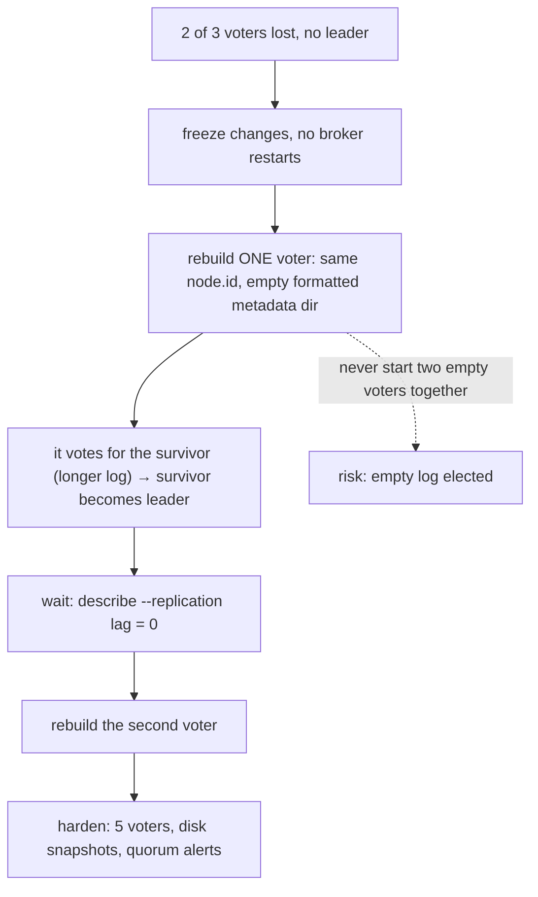
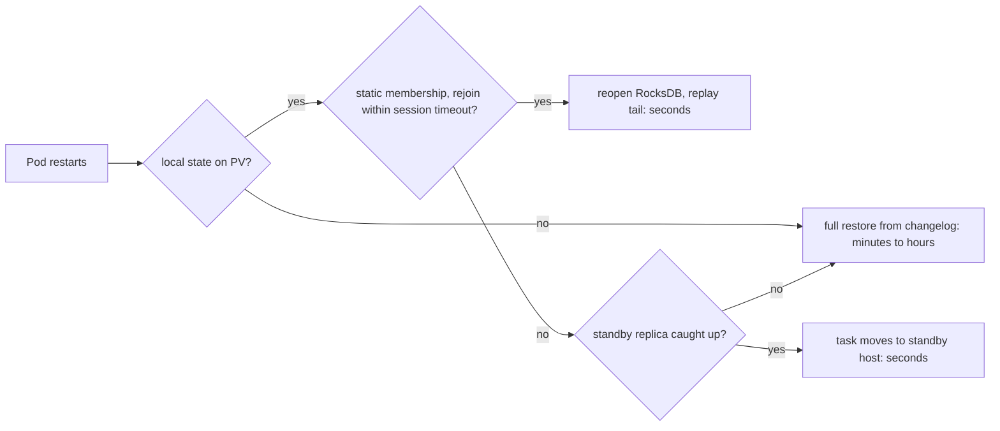
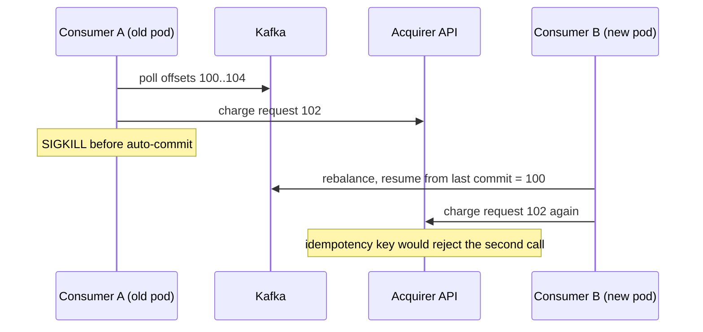
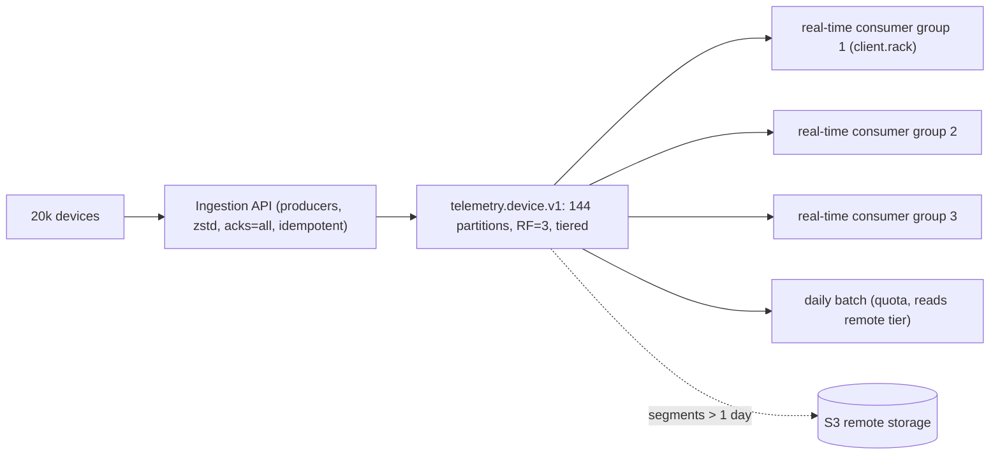
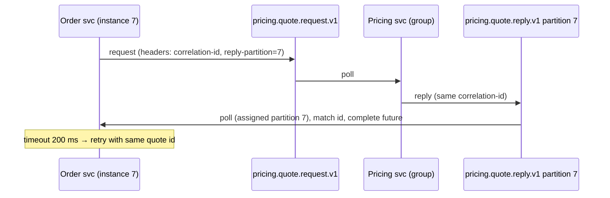
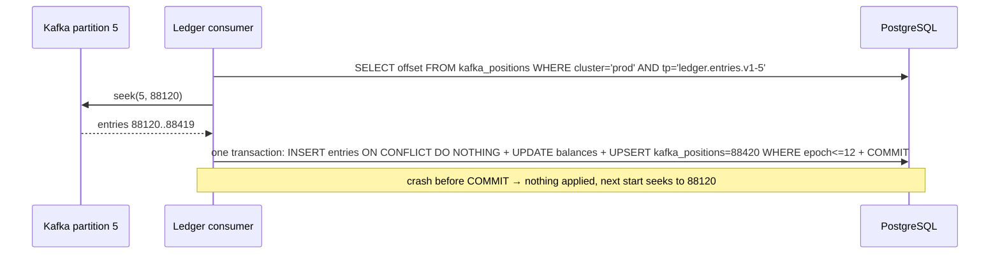
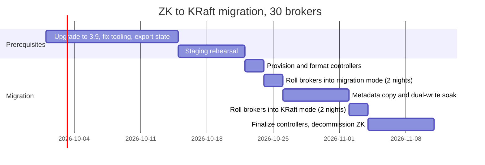
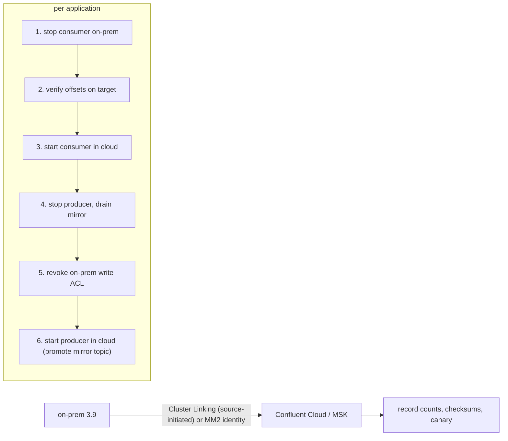
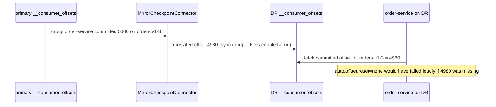

# Scenario Question Bank

**Roles:** [ARCH] [ADMIN] [DEV]   **Level:** Intermediate → Advanced
**Baseline:** Apache Kafka 3.9 / 4.0, KRaft mode. Vendor-specific tools are named as such.

This bank contains 35 scenario questions of the kind used in senior interviews and incident reviews. Each scenario gives the situation as it would be presented, the constraints, the reasoning path a strong candidate walks through, a model answer with concrete configs, commands and designs, and the red flags that indicate weakness. Numbers are indicative unless they are Kafka defaults. Scenarios S1–S20 are operational incidents, S21–S30 are design problems, S31–S35 are migrations and DR.

## Table of contents

| # | Topic | Scenarios |
|---|-------|-----------|
| 1 | Consumer and producer incidents | S1, S2, S6, S13, S19, S20 |
| 2 | Broker, disk, replication and controller incidents | S3, S4, S5, S7, S10, S11, S12, S14 |
| 3 | Operations and security incidents | S8, S9, S17, S18 |
| 4 | Streams and Connect incidents | S15, S16 |
| 5 | Design problems | S21–S30 |
| 6 | Migrations, upgrades and DR | S31–S35 |

---

## 1. Operational incidents

### S1. Consumer lag climbs every day at 09:00 and recovers by 11:00
**Role:** [ADMIN] [DEV] | **Difficulty:** ★☆☆ | **Topic:** Consumer lag

**Situation.** A consumer group for `orders.placed.v1` (24 partitions, 12 consumer instances) shows lag rising from near zero to several million records starting at 09:00 every weekday and draining by 11:00. Producers report no errors. The business complains that order confirmations are late every morning.
**Constraints.**
- No budget for more brokers this quarter.
- The consumer writes each order to a relational database.
- Partition count cannot change without a schema-registry and Streams review.

**Expected reasoning.**
1. Confirm whether the input rate or the consumer throughput changes at 09:00 (`MessagesInPerSec` for the topic versus the group's consumption rate).
2. Check whether lag is uniform across partitions or concentrated (hot key, stuck instance).
3. Look at the consumer's per-record processing time and the database's morning behavior (batch jobs, backups, connection pool limits).
4. Decide between more consumer parallelism, faster processing per record, or smoothing the input.
5. Define a lag SLO and alert on trend rather than absolute value.

**Model answer.**
Start with the two curves: `kafka.server:type=BrokerTopicMetrics,name=MessagesInPerSec,topic=orders.placed.v1` and the group's `records-consumed-rate` (or the derivative of committed offsets from the lag exporter). In the usual version of this story the input triples at 09:00 (users start ordering) while the consumer's rate stays flat at its ceiling, which means the consumer is throughput-bound, not broken. Per-partition lag shows whether all 24 partitions lag equally (capacity) or a few (hot keys or a slow instance, which would show as one host with high `records-lag-max`). If the consumer's ceiling is the database, the fix is on that side: batch the inserts per poll (`max.poll.records=500`, one multi-row insert per batch, commit offsets after the batch), increase the connection pool, or move to an upsert with fewer round trips; this typically gives 5–10× per instance. If the consumer is CPU-bound, add instances up to 24 (one per partition) and only then consider more partitions (which needs the new-topic migration because of key ordering, see S20). Also verify `max.poll.interval.ms` is not being hit during the peak (that would cause rebalances and make it worse) and that `fetch.min.bytes`/`max.partition.fetch.bytes` allow large batches. Finally set an alert on lag growing for more than 15 minutes and on time lag over the SLO (for example 5 minutes), not on absolute lag, so the alert reflects the business impact.

**Red flags.** Proposing to add brokers (brokers are not the bottleneck); increasing `max.poll.interval.ms` as the fix; resetting offsets to `latest` to "clear" the lag; not asking whether the lag is per partition or global.

### S2. Producer throughput dropped 60% after enabling `acks=all`
**Role:** [DEV] [ADMIN] | **Difficulty:** ★★☆ | **Topic:** Producer tuning

**Situation.** A team switched a producer from `acks=1` to `acks=all` for durability and saw its throughput fall from 50 000 to 20 000 records/s. Brokers show no saturation. The team wants to revert.
**Constraints.**
- Durability is now a compliance requirement; reverting is not acceptable.
- The producer is a Java service that calls `send(record).get()` for each record.
- Cluster spans 3 AZs with RF=3, `min.insync.replicas=2`.

**Expected reasoning.**
1. Recognize that `acks=all` adds latency (follower round trip), not bandwidth cost.
2. Identify the synchronous `.get()` as turning latency into a throughput ceiling.
3. Check follower fetch health (`RemoteTimeMs`, `num.replica.fetchers`).
4. Fix the producer's concurrency and batching; keep `acks=all`.
5. Verify with producer metrics.

**Model answer.**
With `acks=all` the broker holds each response until two replicas have the batch, so the produce round trip grows from roughly one AZ hop to two or three; a producer that waits synchronously on every record sends one record per round trip and its throughput becomes 1/latency, which is exactly a 2–3× drop. Fix the producer, not the durability: send asynchronously with callbacks (or `CompletableFuture`), let the client batch (`linger.ms=5–20`, `batch.size=131072`), enable `enable.idempotence=true` (default since 3.0; it keeps ordering with `max.in.flight.requests.per.connection=5`), use `compression.type=lz4` or `zstd`, and handle errors in the callback with a bounded retry or DLQ. Measured on the broker, `kafka.network:type=RequestMetrics,name=RemoteTimeMs,request=Produce` shows the follower wait; if it is high (tens of ms), check `num.replica.fetchers` (raise to 2–4), follower disk latency and cross-AZ RTT. With batching the same producer typically exceeds its old throughput because it now sends far fewer, larger requests. Confirm with the producer metrics `batch-size-avg`, `records-per-request-avg`, `request-latency-avg` and `record-queue-time-avg`.

**Red flags.** Reverting to `acks=1`; setting `min.insync.replicas=1`; raising `request.timeout.ms`; not asking how the producer sends.

### S3. A broker's disk failed at 02:00
**Role:** [ADMIN] | **Difficulty:** ★☆☆ | **Topic:** Disk failure

**Situation.** At 02:00 monitoring pages: broker 5 reports `OfflineLogDirectoryCount=1`, `UnderReplicatedPartitions` on the cluster jumped to 180, and one topic's producers logged `NotEnoughReplicasException` for two minutes. Broker 5 is a JBOD node with four disks; the failed one held 180 replicas.
**Constraints.**
- Hardware replacement is possible only at 09:00.
- RF=3, `min.insync.replicas=2` everywhere.
- Kafka 3.9 KRaft with JBOD.

**Expected reasoning.**
1. Confirm the blast radius: offline partitions (none expected with RF=3), under-min-ISR partitions.
2. Explain why producers saw two minutes of errors (leaders on the failed disk until re-election, then ISR at 2).
3. Decide whether to wait for the disk or reassign the 180 replicas now.
4. Plan the disk replacement and re-formatting.
5. Post-incident: why did leadership take two minutes to move and were there partitions with two replicas on the same broker.

**Model answer.**
First `kafka-topics.sh --bootstrap-server b1:9092 --describe --unavailable-partitions` and `--under-min-isr-partitions`: with RF=3 and one disk lost, every affected partition still has two replicas elsewhere, so nothing is offline, and the cluster is at `min.insync.replicas` for those partitions, which is the risk to manage until the disk is back. The two minutes of `NotEnoughReplicasException` came from partitions whose leader was on the failed disk: the broker reported the failed directory to the controller (KIP-858), the controller elected new leaders, and producers retried through it; two minutes suggests slow detection, so check `replica.lag.time.max.ms` and the broker log timestamps. Decision at 02:00: since the disk cannot be replaced for seven hours and the affected partitions are one failure away from blocking writes, reassign the 180 replicas to other brokers now with a throttle (`kafka-reassign-partitions.sh --execute --throttle 100000000`) if the remaining brokers have capacity; otherwise accept the exposure and watch. At 09:00: replace the disk, create the filesystem, run `bin/kafka-storage.sh format -t <cluster-id> -c broker.properties --ignore-formatted` so the new directory receives `meta.properties`, restart broker 5, and either let the reassignment bring replicas back or rebalance with Cruise Control. Post-incident checks: `vm.max_map_count` and file limits on the recovering broker, SMART alerts to catch the next disk earlier, and rack-aware placement so no partition ever has two replicas on one broker (impossible by design) or in one AZ.

**Red flags.** Restarting broker 5 immediately without understanding the state; deleting the failed directory from `log.dirs` permanently; setting `min.insync.replicas=1` to stop the errors; not knowing that the new directory must be formatted.

### S4. Cluster shows hundreds of URPs after an AZ outage that has ended
**Role:** [ADMIN] [ARCH] | **Difficulty:** ★★☆ | **Topic:** Replication

**Situation.** An AZ was unavailable for 40 minutes. It is back, all brokers are running, but `UnderReplicatedPartitions` is still 600 an hour later and produce latency p99 has tripled. Consumers are fine.
**Constraints.**
- 12 brokers, 4 per AZ, RF=3 rack-aware.
- A reassignment with a throttle of 20 MB/s from a previous migration was never verified.
- Change freeze for the day.

**Expected reasoning.**
1. Verify which replicas are missing: the returning AZ's brokers catching up.
2. Check whether catch-up is progressing (`FetcherLagMetrics`, `ReplicationBytesInPerSec` on the returned brokers).
3. Find why it is slow: a leftover replication throttle, insufficient `num.replica.fetchers`, disk or network.
4. Remove the throttle and confirm the rate.
5. Explain the latency: leadership piled onto 8 brokers; run preferred leader election after ISR recovery.

**Model answer.**
`kafka-topics.sh --describe --under-replicated-partitions` shows the missing replicas are exactly the four brokers of the returned AZ, which is expected: they must fetch 40 minutes of writes for every partition they host. An hour of no progress is not expected, so check `kafka.server:type=BrokerTopicMetrics,name=ReplicationBytesInPerSec` on those brokers and `kafka.server:type=FetcherLagMetrics,name=ConsumerLag,clientId=ReplicaFetcherThread-*` for the lagging partitions; if the rate is capped near 20 MB/s, the unverified reassignment left `leader.replication.throttled.rate`/`follower.replication.throttled.rate` and the `*.replication.throttled.replicas` lists in place, and the returning replicas that appear in those lists are being throttled. Fix within the freeze rules (it is a rollback of an incomplete change): run `kafka-reassign-partitions.sh --bootstrap-server b1:9092 --verify --reassignment-json-file old-plan.json` to clear it, or delete the four configs directly with `kafka-configs.sh --alter --delete-config`. Then raise `num.replica.fetchers` dynamically to 4 on the catching-up brokers if their disks and NICs are idle. Produce latency tripled because all leaders moved to the 8 surviving brokers during the outage and stayed there; once ISR is complete, run `kafka-leader-election.sh --election-type preferred --all-topic-partitions` (or wait for `auto.leader.rebalance.enable`, which acts only once the preferred replica is back in the ISR). Post-incident: alert on lingering throttle configs and add a "verify" step to the reassignment runbook.

**Red flags.** Restarting the returned brokers "to speed it up" (restarts the catch-up); not knowing that throttles persist; running preferred leader election before ISR is complete (it fails per partition); blaming the AZ instead of finding the cap.

### S5. Messages were lost after a leader change
**Role:** [ARCH] [ADMIN] [DEV] | **Difficulty:** ★★★ | **Topic:** Durability

**Situation.** A downstream reconciliation shows 214 events missing from `payments.captured.v1` for a 30-second window last night. The producer's logs show successful sends. The broker logs show a leader change for partition 7 at that time after broker 2 crashed.
**Constraints.**
- Topic: RF=3, `min.insync.replicas=1` (a default that was never changed), `unclean.leader.election.enable=false`.
- Producer: `acks=all`, `enable.idempotence=true`.
- Consumers are `read_uncommitted` plain consumers.

**Expected reasoning.**
1. Reconstruct the replication state at the time: was the ISR just the leader?
2. Explain why `acks=all` with `min.insync.replicas=1` acknowledges leader-only writes.
3. Confirm with metrics (`IsrShrinksPerSec` before the crash, `UnderMinIsrPartitionCount`) and `state-change.log`.
4. Fix the configuration and the guardrail.
5. Address recovery of the lost events (from the producer's source system).

**Model answer.**
The sequence: minutes before the crash, followers of partition 7 fell out of the ISR (a slow disk, GC, or a network blip on the followers; see `IsrShrinksPerSec` on broker 2 and the `Shrinking ISR` lines), leaving the ISR as `[2]`. Because `min.insync.replicas=1`, `acks=all` was satisfied by the leader alone, so the producer got acknowledgements for records that existed only in broker 2's page cache. When broker 2 crashed, no in-sync replica existed; with unclean election disabled the partition went offline until a follower... unless a follower re-joined the ISR just before the crash, in which case a clean election elected it, and the 214 records were the ones acknowledged during the leader-only window and never fetched. Either way the root cause is `min.insync.replicas=1`, which makes `acks=all` equivalent to `acks=1` whenever the ISR shrinks. Evidence: `state-change.log` on the controller shows the ISR transitions and the new leader's epoch; the new leader's log end for epoch N is below the producer's last acknowledged offsets. Fix: `kafka-configs.sh --alter --entity-type topics --entity-name payments.captured.v1 --add-config min.insync.replicas=2`, set the broker default `min.insync.replicas=2`, add a topic-creation policy that rejects anything else, and alert on `UnderMinIsrPartitionCount` and on `IsrShrinksPerSec`. Recover the 214 events by replaying from the payment gateway's own log using the reconciliation's ids; Kafka cannot produce them back. In 4.0, KIP-966 ELR would also have helped if a follower was fully caught up when it left the ISR.

**Red flags.** Blaming the producer; claiming `acks=all` alone guarantees no loss; proposing unclean election; not knowing that the ISR can shrink to one.

### S6. A consumer group rebalances every few minutes
**Role:** [DEV] [ADMIN] | **Difficulty:** ★☆☆ | **Topic:** Consumer groups

**Situation.** A group of 30 consumers on `events.raw.v1` (60 partitions) rebalances every 3–5 minutes. Each rebalance pauses processing for 20–40 s and lag grows. The application processes events by calling an external HTTP API.
**Constraints.**
- Kafka 3.9 brokers; Java client 3.6; default assignor.
- Deployments are frequent (several per day) via Kubernetes rolling updates.
- The HTTP API sometimes takes seconds per call.

**Expected reasoning.**
1. Read the coordinator log to classify the cause: poll timeout, session timeout, or member join/leave.
2. Correlate with deployments and with HTTP latency.
3. Fix processing time per poll (batch size, async calls, timeouts).
4. Reduce rebalance cost: cooperative assignor, static membership, or KIP-848.
5. Verify with `rebalance-rate-per-hour`.

**Model answer.**
On the broker that coordinates the group (`kafka-consumer-groups.sh --describe --group g --state` shows it), `server.log` says which of three things happens: `consumer poll timeout has expired` means an instance took longer than `max.poll.interval.ms` (5 min) between polls, typical when a batch of `max.poll.records=500` records each takes a slow HTTP call; `Member ... has failed` means missed heartbeats (`session.timeout.ms`, 45 s), typical of GC pauses or pod kills; `Adding new member` every few minutes correlates with the rolling deployments. Fix the processing loop first: lower `max.poll.records` to 50, put an HTTP timeout below one second with a retry topic for failures, or process the batch with bounded parallelism so each poll finishes well within the interval; only raise `max.poll.interval.ms` if the work is legitimately slow. Reduce the cost of each rebalance: `partition.assignment.strategy=org.apache.kafka.clients.consumer.CooperativeStickyAssignor` so unaffected partitions keep flowing, `group.instance.id` (static membership) so a pod restart within `session.timeout.ms` does not trigger a rebalance, and on 4.0 brokers with `group.version` ≥ 1 switch to `group.protocol=consumer` (KIP-848), which reconciles incrementally and removes the stop-the-world sync. Verify with `kafka.consumer:type=consumer-coordinator-metrics` `rebalance-rate-per-hour`, `failed-rebalance-rate-per-hour` and `last-rebalance-seconds-ago`, and with lag trend.

**Red flags.** Raising `session.timeout.ms` and `max.poll.interval.ms` to huge values as the only fix; not reading the coordinator log; not knowing the cooperative assignor or static membership; blaming brokers.

### S7. The controller quorum lost two of three nodes
**Role:** [ADMIN] [ARCH] | **Difficulty:** ★★★ | **Topic:** KRaft quorum

**Situation.** A storage incident destroyed the disks of two of the three dedicated KRaft controllers. The third controller is alive but `ActiveControllerCount` is 0 everywhere. Brokers are still serving traffic. Nobody can create topics, and a broker that was restarted an hour ago is stuck in `STARTING`.
**Constraints.**
- Static quorum (`controller.quorum.voters`), Kafka 3.9.
- No volume snapshots of the controller disks.
- Production traffic must keep flowing.

**Expected reasoning.**
1. Explain why brokers keep working (metadata is cached; only changes need the controller) and why the restarted broker cannot register.
2. Stop the bleeding: no more broker restarts, no reassignments.
3. Recover the quorum: replace lost voters one at a time so the surviving voter's log wins the election.
4. Explain why starting both replacements at once risks electing an empty log.
5. Harden: 5 voters, disk snapshots, alerts on quorum size.

**Model answer.**
Brokers hold the full metadata image and serve reads and writes without a controller, but every metadata change (leader election on failure, ISR changes, topic creation, broker registration) needs a quorum leader, so the cluster is running on borrowed time: the next broker failure leaves its partitions leaderless. First, freeze changes and tell teams not to restart anything. Recovery with a static quorum: rebuild one controller with the same `node.id` and host:port as a lost voter, format its metadata directory with the cluster id (`kafka-storage.sh format -t <cluster-id> -c controller.properties`), and start it. It joins as a voter with an empty log and, under Raft's rule that a voter only grants its vote to a candidate whose log is at least as complete as its own, it votes for the surviving controller; the survivor plus the newcomer form a majority, the survivor becomes leader, and the newcomer replicates the metadata log. Verify with `kafka-metadata-quorum.sh --bootstrap-controller ctrl3:9093 describe --replication` that the new voter's lag reaches 0, then rebuild the third controller the same way. Starting both empty replacements at once is dangerous: they could vote for each other and elect a leader with an empty log, effectively wiping the cluster's metadata while brokers still hold data they can no longer map to topics. With a dynamic quorum (`kraft.version=1`), lost voters are identified by directory id and there is no supported force-recovery tool in 3.9/4.0; the answer there is restoring the metadata directories from disk snapshots, which is why controller volumes must be snapshotted and why 5 voters across AZs are cheap insurance. After recovery the stuck broker registers automatically; check `MetadataErrorCount` and `LastAppliedRecordLagMs`.



**Red flags.** Restarting brokers to "reconnect"; formatting a new cluster id; starting both replacements simultaneously; believing data topics are lost because the controllers are; not knowing that brokers keep serving without a controller.

### S8. 50 broker certificates expire next week
**Role:** [ADMIN] | **Difficulty:** ★★☆ | **Topic:** TLS

**Situation.** An external audit found that the TLS certificates on all 50 brokers (three clusters) expire in six days. Clients use TLS on a `CLIENT` listener with hostname verification; inter-broker traffic uses TLS on an `INTERNAL` listener; controllers use TLS on the `CONTROLLER` listener. There is no automation for certificates.
**Constraints.**
- No downtime allowed for the payment cluster.
- The CA certificate itself is valid for five more years.
- Cert issuance takes minutes via the internal PKI API.

**Expected reasoning.**
1. Check whether only leaf certificates expire (yes) so truststores need no change.
2. Use dynamic per-broker keystore updates for broker listeners; no restarts.
3. Plan the controller listener (restart required on dedicated controllers).
4. Automate the loop and verify each broker with `openssl`.
5. Add expiry monitoring and a rotation schedule.

**Model answer.**
Because the CA is unchanged, only keystores change; truststores on clients and brokers stay valid, so this is a keystore rotation without a trust rotation. For each broker: request a certificate with the same DN and SANs (the broker rejects a dynamically loaded keystore whose DN or SANs differ), build a PKCS12 keystore at a new path, then update the two broker listeners dynamically, one broker at a time:

```bash
bin/kafka-configs.sh --bootstrap-server b1:9093 --command-config admin.properties \
  --entity-type brokers --entity-name 7 --alter --add-config \
  listener.name.client.ssl.keystore.location=/etc/kafka/ssl/2026-09.p12,listener.name.client.ssl.keystore.password=...,listener.name.client.ssl.key.password=...,\
listener.name.internal.ssl.keystore.location=/etc/kafka/ssl/2026-09.p12,listener.name.internal.ssl.keystore.password=...,listener.name.internal.ssl.key.password=...
openssl s_client -connect b7.example.com:9093 -servername b7.example.com </dev/null 2>/dev/null | openssl x509 -noout -enddate
```

Existing connections keep the old certificate until they reconnect, which is fine. The `CONTROLLER` listener on dedicated controllers cannot be altered through the broker admin API, so replace the keystore file at its configured path and do a rolling restart of the three controllers, one at a time, verifying quorum with `kafka-metadata-quorum.sh describe --status` between restarts; the brokers' controller-client keystore is the `listener.name.controller.ssl.keystore.*` broker config and can be altered dynamically. Script the whole loop (issue, install, alter, verify, next) and run it first on the least critical cluster. Then add monitoring: a blackbox_exporter probe per broker listener with `probe_ssl_earliest_cert_expiry`, alert at 30 days, and schedule quarterly rotation so the process stays exercised; consider moving to short-lived certificates issued by cert-manager or the PKI's ACME endpoint with PEM keystores (`ssl.keystore.type=PEM`) for easier automation.

**Red flags.** Planning a full cluster restart; changing the DN and being surprised by rejection; forgetting the controller listener or the broker-to-controller client keystore; not knowing dynamic keystore updates exist; no expiry monitoring afterwards.

### S9. A topic with 5 000 partitions was created by mistake
**Role:** [ADMIN] [ARCH] | **Difficulty:** ★☆☆ | **Topic:** Partitions

**Situation.** A developer created `analytics.clicks.v1` with 5 000 partitions on a 6-broker cluster (a typo for 50). Producers have been writing to it for two days; one consumer group reads it. Broker restarts have become slow and `vm.max_map_count` warnings appear.
**Constraints.**
- The data (two days) must be kept.
- Partition count cannot be decreased.
- The consumer group has 8 instances.

**Expected reasoning.**
1. Quantify the damage: 15 000 replicas, file handles, mmap, controller load.
2. Explain that partitions cannot be reduced; a new topic is needed.
3. Migrate producers and consumers to a correctly sized topic, then drain and delete.
4. Preserve the two days by mirroring or by keeping the old topic until retention expires.
5. Add the guardrail (topic policy, mutation quota, GitOps).

**Model answer.**
Impact: 5 000 × RF 3 = 15 000 replicas, 2 500 per broker, each with at least one segment and two index files, so file handles and `vm.max_map_count` climb, log recovery after a crash scans 2 500 logs per broker, and every metadata change is larger; with `num.partitions` this high, the producer keeps 5 000 batches and the consumer fetches from hundreds of partitions per instance with tiny batches. Since partitions cannot be decreased, create `analytics.clicks.v2` with 48 partitions (fits 8 consumers with headroom), switch the producer to it, and move the consumer group: stop the group, note its position on `v1`, start it on `v2` from `earliest` while a bridge consumer (a small Streams or plain consumer app, or MM2 within the same cluster with `IdentityReplicationPolicy` and a topic rename SMT) copies the two days from `v1` into `v2` in key order; if two days of duplicates are acceptable, skip the bridge and let the group read `v1` to the end before switching. Once the consumer group has drained `v1` (`kafka-consumer-groups.sh --describe` shows zero lag) and the producer has been on `v2` for a retention period, delete `v1` (`kafka-topics.sh --delete`), which frees the handles immediately. Guardrails: a `create.topic.policy.class.name` implementation that caps partitions per topic (for example 100 without approval), `auto.create.topics.enable=false`, `controller_mutation_rate` quotas per user, and topics-as-code so counts are reviewed.

**Red flags.** Trying to "shrink" partitions; deleting the topic with the data; not knowing the per-partition costs; leaving the door open for the next typo.

### S10. Page-cache thrash after adding a consumer that reads 7 days back
**Role:** [ADMIN] [ARCH] | **Difficulty:** ★★☆ | **Topic:** Performance

**Situation.** A new analytics consumer group started reading `events.raw.v1` from 7 days ago. Within minutes produce p99 doubled on all brokers, `iowait` rose to 40%, and the latency-critical consumers on the same topic started lagging.
**Constraints.**
- The replay is legitimate and must finish this week.
- Brokers have 64 GB RAM, 6 GB heap; the cluster ingests 150 MB/s.
- No spare cluster.

**Expected reasoning.**
1. Explain the mechanism: historical reads miss the page cache, evict hot pages, and turn tail consumers into disk readers too.
2. Throttle the replay with a consumer byte-rate quota.
3. Reduce the replay's cache footprint and I/O pattern.
4. Consider structural fixes: tiered storage, follower fetching, a replay cluster.
5. Monitor recovery.

**Model answer.**
A consumer at the tail is served from the page cache with zero copy; a consumer 7 days behind reads segments from disk, and the kernel promotes those pages into the cache, evicting the hot tail, so the latency-critical consumers and even follower replication start hitting disk (`node_disk_read_bytes_total` up, `LocalTimeMs` for FetchConsumer and FetchFollower up, `iowait` up). Immediate action: apply a consumer quota to the replay's principal, `kafka-configs.sh --alter --add-config consumer_byte_rate=20971520 --entity-type users --entity-name analytics-replay` (20 MB/s per broker, indicative; the quota is per broker, so total is brokers × rate), sized so that the replay finishes within the week while disk reads stay below the point where tail latency recovers; verify with the broker's `kafka.server:type=Fetch,user=analytics-replay` `throttle-time` and the recovering p99. Also ask the replay to use larger fetches (`fetch.max.bytes`, `max.partition.fetch.bytes`) so reads are sequential, and to read partitions in order rather than all 48 at once, which reduces random I/O. Structural options for next time: tiered storage (`remote.storage.enable=true`, `local.retention.ms` of one day), so replays older than the local window read from object storage through a separate broker path instead of thrashing local disk; follower fetching for the replay (`client.rack`) to spread reads over replicas; a quota by default for any new consumer principal; or an isolated replay cluster fed by MM2 for teams that do this regularly.

**Red flags.** Increasing the heap (page cache is outside the JVM); killing the legitimate replay without offering a path; not knowing quotas are per broker; suggesting more partitions.

### S11. One `__consumer_offsets` partition's leader is hot
**Role:** [ADMIN] [DEV] | **Difficulty:** ★★★ | **Topic:** Consumer groups

**Situation.** Broker 4 shows 3× the request rate of its peers, all on `__consumer_offsets-23`. Consumer groups whose coordinator is broker 4 see slow commits and occasional `REBALANCE_IN_PROGRESS` errors. The topic has the default 50 partitions.
**Constraints.**
- 200 consumer groups on the cluster.
- One group, `edge-ingest`, has 400 members committing after every record.
- `offsets.topic.num.partitions` cannot be changed after creation.

**Expected reasoning.**
1. Explain the mapping: group coordinator = leader of `__consumer_offsets` partition `hash(group.id) % 50`.
2. Identify the group(s) on partition 23 and their commit rates.
3. Reduce commit frequency and member churn; spread groups across partitions by naming.
4. Check compaction health on `__consumer_offsets`.
5. Balance leadership so no broker leads more of the hot partitions.

**Model answer.**
Each group's coordinator is the leader of `__consumer_offsets` partition `abs(hash(group.id)) % offsets.topic.num.partitions`, so all commits, heartbeats and joins for every group that hashes to 23 land on broker 4, and `edge-ingest` committing after every record from 400 members produces thousands of tiny writes per second into that one partition. Find the groups: `kafka-consumer-groups.sh --describe --group edge-ingest --state` shows the coordinator; `kafka.coordinator.group:type=GroupMetadataManager,name=NumGroups` and the per-request `RequestsPerSec,request=OffsetCommit` on broker 4 confirm the load. Fixes in order: (1) change `edge-ingest` to commit per batch (`enable.auto.commit=true` with `auto.commit.interval.ms=5000`, or manual commit once per poll), which cuts commit volume by orders of magnitude; (2) if several heavy groups collide on partition 23, rename them (a new `group.id` hashes elsewhere; migrate offsets with `--reset-offsets --export`/`--from-file`); (3) check that the log cleaner is compacting `__consumer_offsets` (`kafka.log:type=LogCleanerManager,name=uncleanable-partitions-count`, size of the partition directory); a bloated partition makes every coordinator move load for minutes and shows exactly as slow commits after a broker restart; (4) verify leadership of the 50 offset partitions is spread (`kafka-topics.sh --describe --topic __consumer_offsets`) and run preferred leader election if broker 4 also leads more than its share. Changing `offsets.topic.num.partitions` requires recreating the topic, which is not a live operation; sizing it larger at cluster creation is the preventive step for clusters with hundreds of groups.

**Red flags.** Adding partitions to `__consumer_offsets` on a live cluster; not knowing how the coordinator is chosen; blaming broker 4's hardware; ignoring commit frequency.

### S12. ISR flaps on the busiest topic every evening
**Role:** [ADMIN] | **Difficulty:** ★★☆ | **Topic:** Replication

**Situation.** Between 19:00 and 21:00, `IsrShrinksPerSec` and `IsrExpandsPerSec` spike on brokers 1–3, always for partitions of `video.playback.v1` (2 MB/s per partition, 96 partitions). Producers see intermittent `NotEnoughReplicasException`. No broker is down.
**Constraints.**
- `replica.lag.time.max.ms` is the default 30 s.
- `num.replica.fetchers=1`.
- The topic uses `acks=all`, `min.insync.replicas=2`.

**Expected reasoning.**
1. Determine which side lags: followers fetching too slowly versus leader too slow to serve fetches.
2. Check fetcher configuration and follower disk/network.
3. Check message sizes against `replica.fetch.max.bytes` and response limits.
4. Fix fetch parallelism and sizing; avoid raising the lag timeout as a first step.
5. Verify with `MaxLag` and ISR metrics.

**Model answer.**
Follower replication for all partitions led by a given broker shares the fetcher threads of each follower, and with `num.replica.fetchers=1` one thread per source broker must keep up with 32 partitions × 2 MB/s = 64 MB/s from each leader in the evening peak; the follower falls behind, exceeds `replica.lag.time.max.ms`, is dropped from the ISR, catches up during a lull, and re-joins, which is exactly the flap. Confirm on the followers with `kafka.server:type=ReplicaFetcherManager,name=MaxLag,clientId=Replica` climbing toward the peak and `kafka.server:type=FetcherLagMetrics,name=ConsumerLag` for the affected partitions, and on the leaders with `RequestMetrics,request=FetchFollower` `TotalTimeMs` (if the leader is slow, fix the leader: disk, `num.io.threads`). Fix: set `num.replica.fetchers=4` dynamically (`kafka-configs.sh --entity-type brokers --entity-default --alter --add-config num.replica.fetchers=4`), raise `replica.fetch.max.bytes` (1 MiB default per partition per fetch) to 4–8 MiB and `replica.fetch.response.max.bytes` accordingly so each fetch moves more data, check `replica.socket.receive.buffer.bytes` and the OS TCP buffers for cross-AZ links, and confirm the followers' disks are not saturated by evening compaction (`log.cleaner.io.max.bytes.per.second`). Only if the flap is caused by short, unavoidable stalls, consider raising `replica.lag.time.max.ms` modestly, knowing that it widens the window in which a clean election can lose acknowledged data.

**Red flags.** Raising `replica.lag.time.max.ms` to minutes as the first fix; setting `min.insync.replicas=1`; not distinguishing leader-side from follower-side lag; not knowing what `num.replica.fetchers` does.

### S13. A consumer group was down for 8 days and reprocessed everything on restart
**Role:** [ADMIN] [DEV] | **Difficulty:** ★☆☆ | **Topic:** Consumer offsets

**Situation.** A reporting consumer was switched off for an 8-day migration. When it restarted it began from the oldest record of a 30-day topic and flooded the reporting database with duplicates.
**Constraints.**
- `auto.offset.reset=earliest` in the consumer config.
- Broker `offsets.retention.minutes` is the default.
- Similar planned shutdowns will happen again.

**Expected reasoning.**
1. Identify offset expiry (`offsets.retention.minutes`=10080, 7 days) as the cause.
2. Explain the interaction with `auto.offset.reset`.
3. Immediate remediation: stop, reset to a sensible point, restart.
4. Prevent: raise retention, export offsets before shutdowns, use `none` to fail loudly.
5. Make the sink idempotent.

**Model answer.**
The group was `Empty` for longer than `offsets.retention.minutes` (7 days), so the coordinator expired its committed offsets; on restart the group had no position, and `auto.offset.reset=earliest` sent it to the beginning of the 30-day retention. Remediation: stop the group, reset it to the time the migration started, `kafka-consumer-groups.sh --bootstrap-server b1:9092 --group reporting --reset-offsets --all-topics --to-datetime 2026-08-30T00:00:00.000 --execute`, and restart; clean the duplicate rows in the database (or rely on an upsert). Prevention: set `offsets.retention.minutes=43200` (30 days) on the brokers so it exceeds the topic retention and any plausible shutdown, export the offsets before planned stops (`--reset-offsets --all-topics --to-current --export > offsets.csv`, later `--from-file offsets.csv --execute`), and change the consumer to `auto.offset.reset=none` for groups where silent replays or skips are unacceptable, so a missing offset raises `NoOffsetForPartitionException` and a human decides. Make the reporting sink an upsert by event id so that any future replay is harmless.

**Red flags.** Not knowing offsets expire; suggesting `latest` without considering data loss; treating the database duplicates as a Kafka problem only.

### S14. A compacted topic keeps growing and never shrinks
**Role:** [ADMIN] | **Difficulty:** ★★☆ | **Topic:** Log compaction

**Situation.** `customer.profile.state` is a compacted topic with 2 million keys, each updated a few times per day. It has grown to 900 GB and the Streams application that materializes it takes hours to restore. Cleaner threads are alive.
**Constraints.**
- Topic configs: `cleanup.policy=compact`, everything else default.
- Producer sends one record per change; a few tenants generate 90% of updates.
- Brokers have `log.cleaner.dedupe.buffer.size` at default.

**Expected reasoning.**
1. Check the conditions for compaction: active segment excluded, `segment.ms` (7 days default) delays it, dirty ratio threshold.
2. Check cleaner health per partition (`max-dirty-percent`, `uncleanable-partitions-count`, buffer utilization).
3. Fix topic configs: `segment.ms`, `min.cleanable.dirty.ratio`, `max.compaction.lag.ms`.
4. Fix broker cleaner sizing.
5. Reduce restore time on the Streams side.

**Model answer.**
The cleaner never touches the active segment, and with default `segment.bytes=1 GiB` and `segment.ms=7 days` a partition with modest traffic keeps a week of updates in an uncleanable active segment; furthermore it only cleans when the dirty ratio exceeds `min.cleanable.dirty.ratio=0.5`, so half the partition is always dirty. Check `kafka.log:type=LogCleanerManager,name=max-dirty-percent` (stuck high means the cleaner cannot keep up), `uncleanable-partitions-count` (a corrupt or oversized partition), and `kafka.log:type=LogCleaner,name=max-buffer-utilization-percent` (100% means `log.cleaner.dedupe.buffer.size` is too small for 2 million keys per pass: the cleaner then cleans fewer segments per run). Fix the topic: `kafka-configs.sh --alter --entity-type topics --entity-name customer.profile.state --add-config segment.ms=3600000,segment.bytes=268435456,min.cleanable.dirty.ratio=0.2,max.compaction.lag.ms=86400000,delete.retention.ms=86400000`, which rolls segments hourly and forces a clean at least daily. Fix the brokers: `log.cleaner.threads=2–4` and `log.cleaner.dedupe.buffer.size=536870912` (dynamic; the buffer is shared across threads and each key costs 24 bytes), with `log.cleaner.io.max.bytes.per.second` set so the first big cleanup does not starve fetches. Expect the size to fall over the next day; the hot tenants' keys are what compaction removes best. On the Streams side, restore time shrinks with the topic; additionally enable `num.standby.replicas=1` and keep state on persistent volumes so a restart does not restore at all (see S15).

**Red flags.** Deleting segments by hand; assuming compaction is immediate; not knowing that the active segment is never compacted; raising retention (irrelevant for compact).

### S15. A Kafka Streams application takes 40 minutes to restart
**Role:** [DEV] [ADMIN] | **Difficulty:** ★★☆ | **Topic:** Kafka Streams

**Situation.** Every deployment of a Streams application (12 instances, 96 tasks, 300 GB of aggregated state across `KTable`s and windowed stores) causes a 40-minute outage while state is restored from changelog topics. The team deploys twice a week.
**Constraints.**
- Runs on Kubernetes with ephemeral pod storage.
- Kafka 3.9 brokers, Streams 3.9.
- Exactly-once (`exactly_once_v2`) is required.

**Expected reasoning.**
1. Identify that state is lost on every pod restart (ephemeral disks) so every restart is a full changelog restore.
2. Keep local state: persistent volumes and a stable `state.dir`; static membership.
3. Standby replicas and warmup replicas for failover, rack-aware standbys.
4. Reduce restore cost: changelog compaction health, `restore.consumer` tuning, state size.
5. Verify with restore metrics and deployment strategy (one instance at a time).

**Model answer.**
With ephemeral storage every restarted pod has no RocksDB state and must rebuild all of its tasks' stores from the changelogs, and at (indicatively) 50–100 MB/s per instance 300 GB takes tens of minutes, during which those tasks are not processing. Fix in this order: (1) give each pod a persistent volume mounted at `state.dir` with a stable identity (StatefulSet), and set `group.instance.id` per pod (static membership) so a restart within `session.timeout.ms` keeps its tasks; a restart then reopens local stores and only replays the changelog tail; (2) `num.standby.replicas=1` so that when a task does move, a warm copy exists on another instance, with `rack.aware.assignment.tags` (3.6+) to keep standbys in another AZ, and `acceptable.recovery.lag` (10 000 default) plus `max.warmup.replicas` so the assignor migrates tasks only to instances that are nearly caught up; (3) deploy with `maxUnavailable: 1` and wait for `kafka.streams:type=stream-thread-metrics` `restore-rate`/`restore-total` to settle before the next pod, so at most one instance's tasks are affected; (4) keep changelogs healthy: they are compacted topics, so apply the S14 settings (`segment.ms`, `min.cleanable.dirty.ratio`) so restores read only current values; (5) since 3.5 the state updater thread (KIP-869) restores in the background while active tasks continue, and the restore consumer can be tuned with `restore.consumer.fetch.max.bytes` and `restore.consumer.max.poll.records`; (6) reduce state: retention on windowed stores, avoid unbounded `KTable`s of high-cardinality keys, and offload cold aggregates. `exactly_once_v2` is unaffected by these changes. After the fixes a deployment should cost seconds per instance, not 40 minutes for all.



**Red flags.** Accepting the restore as inherent; increasing partitions; disabling exactly-once for speed; not knowing standby replicas or static membership; not mentioning persistent volumes.

### S16. A Connect sink to Elasticsearch keeps failing on bad records
**Role:** [DEV] [ADMIN] | **Difficulty:** ★★☆ | **Topic:** Kafka Connect

**Situation.** An Elasticsearch sink connector (8 tasks) fails several times a day with mapping exceptions on individual documents; every failure stops the task, an operator restarts it, and lag builds up. Producers sometimes emit records with fields whose type changed (a string where a number was).
**Constraints.**
- Losing a bad record is acceptable if it is recorded somewhere.
- The Connect cluster runs 3.9; the connector is the Confluent Elasticsearch sink (community licensed, Confluent-specific).
- Index mappings are dynamic today.

**Expected reasoning.**
1. Separate the Connect framework's error handling (conversion/transform stages) from the connector's own put-stage behavior.
2. Configure a dead-letter queue and tolerance for the framework stages.
3. Configure the connector's malformed-document behavior and retries.
4. Fix the root cause: explicit index templates and a schema contract.
5. Automate task restarts and alert on DLQ volume.

**Model answer.**
Connect's `errors.*` settings cover failures in the converter and SMT stages, not errors raised inside the connector's `put()`, so both layers need configuration. Framework: `errors.tolerance=all`, `errors.deadletterqueue.topic.name=dlq.es-sink`, `errors.deadletterqueue.topic.replication.factor=3`, `errors.deadletterqueue.context.headers.enable=true` (adds topic, partition, offset, exception headers), `errors.log.enable=true`, `errors.log.include.messages=false` (PII), `errors.retry.timeout=300000`, `errors.retry.delay.max.ms=60000`. Connector: `behavior.on.malformed.documents=warn` (or `ignore`) so a mapping rejection from Elasticsearch is logged and skipped instead of killing the task, `behavior.on.null.values=delete` if tombstones mean deletes, `max.retries` and `retry.backoff.ms` for transient 429/503 responses, `write.method=upsert` with `key.ignore=false` so replays are idempotent, and `batch.size`/`linger.ms` for throughput. Note that the connector's skip does not write to the DLQ, so pair it with a small consumer of the connector's error log or, better, add a validating SMT upstream (a custom SMT or `Cast`/`Filter` with a predicate) that routes type-mismatched records to the DLQ via the framework path. Root cause: define explicit index templates with strict mappings and a schema in the registry with compatibility checks so a type change is rejected at produce time, not at index time. Operations: `POST /connectors/es-sink/restart?includeTasks=true&onlyFailed=true` (3.0+) in a cron or via the operator until the fixes land, and an alert on `kafka.connect:type=connector-task-metrics,connector=es-sink,task=*` `status=FAILED` and on DLQ produce rate.

**Red flags.** Setting `errors.tolerance=all` and assuming connector-side errors are covered; deleting the bad records from the topic; restarting tasks by hand indefinitely; not proposing a schema contract.

### S17. One tenant is starving others on a shared cluster
**Role:** [ADMIN] [ARCH] | **Difficulty:** ★★☆ | **Topic:** Multi-tenancy

**Situation.** Since a new tenant onboarded, other teams see produce p99 up 5× and `RequestHandlerAvgIdlePercent` sits at 10%. The tenant runs 200 small consumers with `fetch.max.wait.ms=1` and `fetch.min.bytes=1` and a producer with `linger.ms=0` sending 20-byte records.
**Constraints.**
- All clients authenticate with SASL; each application has its own user.
- The tenant cannot change code this week.
- No dedicated cluster is available.

**Expected reasoning.**
1. Diagnose that the problem is request rate, not bytes (`RequestsPerSec` by client, thread idle percent).
2. Apply request-percentage quotas per user, then byte quotas.
3. Verify throttling in the tenant's metrics and the recovery of others.
4. Agree client-side changes with the tenant (batching, fetch waits).
5. Platform defaults: quotas for every new user; chargeback.

**Model answer.**
Byte-rate quotas would not help: the tenant moves few bytes but generates tens of thousands of tiny fetch and produce requests per second, consuming network and I/O thread time (`kafka.network:type=RequestMetrics,name=RequestsPerSec,request=Fetch` by client id, `NetworkProcessorAvgIdlePercent`, `RequestHandlerAvgIdlePercent`). Apply a request quota to the tenant's user: `kafka-configs.sh --bootstrap-server b1:9092 --alter --add-config 'request_percentage=100' --entity-type users --entity-name tenant-x` (100 = one full thread per broker of the combined pools; a value around 5–10% of the total thread capacity is a reasonable cap, indicatively), plus `producer_byte_rate` and `consumer_byte_rate` as guardrails. The broker then delays responses to that user (`kafka.server:type=Request,user=tenant-x` `throttle-time`), and the other tenants' latency recovers within a minute; the tenant sees `fetch-throttle-time-avg` and `produce-throttle-time-avg` on the client side, which is the conversation starter. With the tenant, agree on `fetch.min.bytes=65536`, `fetch.max.wait.ms=500`, `linger.ms=10`, `batch.size` larger, and fewer consumers with more partitions each; once the client is fixed, loosen the quota. Platform-wide: set default user quotas (`--entity-type users --entity-default`) so every new principal is bounded, require a throughput profile at onboarding, and publish chargeback by request count as well as bytes so that behavior has a price.

**Red flags.** Adding I/O threads as the first response; byte quotas only; not knowing `request_percentage`; kicking the tenant off without a mechanism.

### S18. A schema change broke consumers in production
**Role:** [DEV] [ARCH] | **Difficulty:** ★★☆ | **Topic:** Schema evolution

**Situation.** A producer team renamed a required Avro field and deployed at 14:00 with `auto.register.schemas=true`. By 14:05 three consumer services in two other teams were crash-looping with deserialization errors on `orders.placed.v1`. Records with the new schema are already in the topic.
**Constraints.**
- The registry's compatibility level for the subject was `NONE` (set years ago for a migration).
- Consumers cannot skip records: every order matters.
- Rolling back the producer is possible in minutes.

**Expected reasoning.**
1. Stop the bleeding: roll back the producer to the old schema so no more breaking records arrive.
2. Handle the records already written: consumers need a reader that can handle both versions, or a repair path.
3. Restore the registry guardrail: `BACKWARD_TRANSITIVE`, `auto.register.schemas=false`, CI registration.
4. Define the correct evolution (add new field with default, deprecate old) instead of a rename.
5. Contract and ownership follow-up.

**Model answer.**
Immediately roll back the producer so the stream returns to the old writer schema; the consumers still cannot pass the window of new-schema records, so either (a) hot-fix the consumers with a reader schema that has both fields (old name with default, new name with default; Avro aliases can map the rename) so both versions deserialize, or (b) if a consumer cannot be changed quickly, run a small repair job that reads the affected offset range with the new schema, re-emits the records in the old schema to the same topic (ordering caveat: append at the end), and skips the offending range in the consumer by resetting to just past it; (a) is the normal path. Then fix the registry: set the subject's compatibility to `BACKWARD_TRANSITIVE` (`PUT /config/orders.placed.v1-value {"compatibility":"BACKWARD_TRANSITIVE"}`), set `auto.register.schemas=false` on all producers so schemas are registered by CI with a compatibility check, and add `use.latest.version` only where intended. The correct evolution for a rename is additive: add the new field with a default, have consumers read both, switch the producer to populate both, later remove the old field in a backward-compatible step. Organizationally, the topic gets a data contract with an owner, the compatibility level is part of the topic definition in git, and consumers are listed so the owner knows whom a change affects.

**Red flags.** Telling consumers to "just handle it"; setting compatibility to `NONE` again; deleting the bad records; not knowing the difference between backward and forward compatibility.

### S19. Duplicate payments observed
**Role:** [DEV] [ARCH] | **Difficulty:** ★★★ | **Topic:** Delivery semantics

**Situation.** A payment service consumes `payments.requested.v1` and calls the acquirer's API; a reconciliation found 37 customers charged twice last week. Duplicates cluster around deployments and around one broker restart.
**Constraints.**
- The consumer commits with `enable.auto.commit=true` (default interval).
- The producer has `retries` at default but `enable.idempotence` was explicitly set to false years ago.
- The acquirer's API accepts an idempotency key.

**Expected reasoning.**
1. Enumerate the duplicate sources: producer retries without idempotence, consumer reprocessing after rebalance/restart before commit, at-least-once semantics in general.
2. Use the timing evidence (deployments, broker restart) to point at consumer-side reprocessing and producer retries.
3. Fix the producer (idempotence), the consumer (commit after effect, or offsets stored with the effect), and the external call (idempotency key).
4. Explain why Kafka transactions do not cover the acquirer API.
5. Add detection (dedup metrics) and reconciliation.

**Model answer.**
Two mechanisms match the evidence. Around the broker restart, the producer retried batches after leader changes and, without `enable.idempotence=true`, the broker could not deduplicate them, so the same payment request exists twice in the topic with different offsets. Around deployments, consumers were killed after calling the acquirer but before the next auto-commit (`auto.commit.interval.ms=5000`), so the new owner of the partition re-read and re-charged; a rebalance with the default eager assignor has the same effect. Fixes: producer `enable.idempotence=true` (also `acks=all`, `max.in.flight.requests.per.connection≤5`) so retries are deduplicated by (producer id, sequence); consumer `enable.auto.commit=false` with a commit after the charge is confirmed, `CooperativeStickyAssignor` or the KIP-848 protocol, and graceful shutdown (`consumer.close()` in the shutdown hook, `terminationGracePeriodSeconds` long enough); and, decisively, an idempotency key derived from the payment request id sent to the acquirer, so a replayed record cannot charge twice regardless of Kafka semantics; keep a local dedup store keyed by request id (a compacted topic or database table) for a window longer than the maximum replay. Kafka transactions would make the consume-transform-produce step exactly-once only if the output were another Kafka topic; the acquirer is outside, so idempotency at the boundary is the only real fix (see S25 for the database version). Detection: count duplicate request ids per hour as a metric and reconcile daily against the acquirer.



**Red flags.** Claiming exactly-once Kafka would solve it end to end; only fixing the producer; suggesting `auto.commit.interval.ms=0`; not proposing the idempotency key.

### S20. Ordering violated after increasing partitions
**Role:** [DEV] [ARCH] | **Difficulty:** ★★☆ | **Topic:** Partitions

**Situation.** To add consumer parallelism a team increased `inventory.stock.v1` from 12 to 24 partitions during business hours. Since then, stock-level updates for some SKUs are applied out of order and a Streams join against it produces wrong results.
**Constraints.**
- Key = SKU; per-key ordering is a hard requirement.
- The Streams application has internal repartition topics with 12 partitions.
- Cannot lose events.

**Expected reasoning.**
1. Explain the mechanism: hash-based partitioner maps a key to a new partition, old and new records of one key live in two partitions, consumers process them concurrently.
2. Explain the Streams failure (co-partitioning broken).
3. Recover: drain and reprocess in order, or rebuild derived state from a new topic.
4. The safe procedure for future changes: new topic + migration, or a stop-drain-change-restart window.
5. Governance: partition changes as reviewed changes.

**Model answer.**
The default partitioner sends a key to `murmur2(key) mod 24` after the change, so for many SKUs older records sit in partition p (0–11) while newer ones go to p′ (12–23); with consumers on both partitions the newer record can be processed first and the stale one later overwrites it, and a Streams join fails its co-partitioning check (the input has 24 partitions, the repartition/changelog topics 12), which is why its results went wrong. Recovery: stop producers to the topic; let consumers drain the old partitions; then, because the events already written are interleaved across partitions, rebuild the derived state from a correct source: create `inventory.stock.v2` with 24 partitions, replay `v1` into it through a single-threaded copier ordered by event timestamp per SKU (or, if the source system can re-emit current stock, produce a fresh snapshot), reset the Streams application (`kafka-streams-application-reset.sh --application-id inv-join --input-topics inventory.stock.v1`), and point everything at `v2`. Safe procedure for the future: either (a) create a new topic with the target count and migrate producers then consumers (the only way with zero ordering risk), or (b) if a short outage is acceptable: stop producers, wait until consumers have zero lag, increase partitions, restart consumers, restart producers; the ordering risk then vanishes because no key has pending records in the old partition. Add to the change policy that partition increases on keyed topics require this procedure and a Streams impact check.

**Red flags.** Thinking partition increases are harmless; not knowing Streams co-partitioning requirements; reducing partitions back (impossible); "just use a single partition".

## 2. Design problems

### S21. Design a 500 000 messages/s ingestion pipeline
**Role:** [ARCH] | **Difficulty:** ★★★ | **Topic:** Capacity and design

**Situation.** A telemetry product must ingest 500 000 messages/s (average 800 bytes JSON, p99 4 KB) from 20 000 devices via an ingestion API, keep 14 days, serve three real-time consumers and one daily batch job, and tolerate an AZ loss without data loss.
**Constraints.**
- AWS, three AZs, budget-conscious.
- Per-device ordering required.
- Kafka 4.0 self-managed or MSK.

**Expected reasoning.**
1. Convert to bytes: 500k × 800 B = 400 MB/s raw, ~130 MB/s with zstd (indicative 3×).
2. Storage and network math; broker count; partition count from per-device ordering and consumer parallelism.
3. Producer, topic and consumer configuration.
4. Cross-AZ cost and follower fetching; tiered storage for 14 days.
5. Operations: monitoring, quotas, schema, DR statement.

**Model answer.**
Throughput: 400 MB/s uncompressed; with producer `compression.type=zstd` in batches of hundreds of records, indicatively 130 MB/s on the wire and disk. Storage: 130 MB/s × 14 days ≈ 157 TB raw × RF 3 = 472 TB, too much for local disks at a sane broker count, so use tiered storage: `remote.storage.enable=true`, `local.retention.ms=86400000` (1 day local ≈ 34 TB × 1.1 ÷ 0.65 ≈ 57 TB cluster-wide), `retention.ms=1209600000` in S3. Brokers: 9 (3 per AZ) with 10–25 Gbit/s network, 64–128 GB RAM, 8 TB NVMe each; per-broker steady load ≈ 15 MB/s in from producers + 29 MB/s replication in, ~30 MB/s replication out + consumer egress ≈ 45 MB/s, leaving headroom for AZ loss (1.5×) and replay. Topic `telemetry.device.v1`: 144 partitions (per-device ordering via key = device id; 144 gives each of 3 real-time consumer groups up to 144 instances and about 1 MB/s per partition), RF=3, `min.insync.replicas=2`, `cleanup.policy=delete`, `max.message.bytes=2097152`. Ingestion API producers: `acks=all`, `enable.idempotence=true`, `linger.ms=20`, `batch.size=262144`, `compression.type=zstd`, `buffer.memory=128MB`, async sends with backpressure to the HTTP layer; key = device id; schema in a registry (Avro or Protobuf) with `BACKWARD_TRANSITIVE`. Consumers: `client.rack` + `RackAwareReplicaSelector` for follower fetching to cut cross-AZ egress; the batch job under a `consumer_byte_rate` quota reading from tiered storage. Cross-AZ estimate (indicative): 130 MB/s × (2/3 + 2 + 0 with follower fetching) ≈ 350 MB/s ≈ 30 TB/day at $0.02/GB ≈ $600/day, dominated by replication; MSK would remove the replication share from the bill (MSK-specific). Durability under AZ loss: rack-aware placement with `broker.rack`, 3 dedicated controllers one per AZ, `acks=all` and `min.insync.replicas=2` keep writes flowing with one AZ down. Operations: topics-as-code, `create.topic.policy`, quotas per producer principal, SLOs (produce p99 < 50 ms, e2e p99 < 1 s, zero acknowledged loss), alerts from the admin bank, and a DR statement (14 days recoverable from S3; cross-region via bucket replication plus a rebuild procedure, RPO of the last local segment).



**Red flags.** Sizing from message count without bytes; 1 000+ partitions "for scale"; RF=2 to save money; ignoring cross-AZ cost; no compression; no statement about AZ loss.

### S22. Cut the AWS cross-AZ bill of a Kafka platform by half
**Role:** [ARCH] [ADMIN] | **Difficulty:** ★★☆ | **Topic:** Cost

**Situation.** Finance flags $40 000/month of inter-AZ data transfer attributed to the Kafka VPC. The cluster ingests 250 MB/s across three AZs with RF=3, has six consumer groups reading everything, and uses no compression on half of the topics.
**Constraints.**
- Durability (RF=3, three AZs) must stay.
- Consumers are in all three AZs.
- Six months to deliver.

**Expected reasoning.**
1. Model the traffic: producer → leader (2/3), replication (2×), consumers (2/3 × 6).
2. Rank levers by saved bytes: follower fetching, compression, fewer full-topic consumers, MSK pricing, diskless.
3. Estimate savings per lever.
4. Plan and measure (flow logs by AZ).
5. Guard against regressions.

**Model answer.**
Per byte written, cross-AZ bytes ≈ 2/3 (produce) + 2 (replication) + 2/3 × 6 (consumers) = 6.67, so consumers account for 4 of the 6.67, replication for 2. Lever 1, follower fetching: set `replica.selector.class=org.apache.kafka.common.replication.RackAwareReplicaSelector` on brokers and `client.rack=<az>` on every consumer; consumer cross-AZ drops to near zero, saving about 60% of the bill on its own; cost is a few milliseconds of end-to-end latency. Lever 2, compression: enable `compression.type=zstd` or `lz4` on the producers of the uncompressed half (and confirm topics use `compression.type=producer`); at an indicative 3× ratio this cuts every remaining term (produce, replication, and any residual consumer traffic) for those topics roughly by two thirds. Lever 3, reduce full-topic consumers: two of the six groups are audit and archival; feed them from one consumer that writes to S3 in-AZ (a Connect S3 sink with `client.rack`) instead of two independent reads. Lever 4, tiered storage plus smaller brokers does not reduce cross-AZ traffic but reduces instance cost; keep it in the plan for the same budget review. Lever 5, if the platform moves to MSK, in-cluster replication traffic is not billed (MSK-specific), removing the 2× term. Measure with VPC flow logs aggregated by source/destination AZ before and after each step, and keep a monthly dashboard of bytes per producer and consumer principal so a new full-topic consumer is noticed. Expected outcome: levers 1–3 typically deliver well over the 50% target.

**Red flags.** Proposing RF=2 or a single AZ; not knowing follower fetching; estimating without a per-byte model; ignoring that consumers dominate.

### S23. A team needs to send 50 MB messages
**Role:** [ARCH] [DEV] | **Difficulty:** ★★☆ | **Topic:** Large messages

**Situation.** A document-processing team wants to publish scanned PDFs (up to 50 MB) through Kafka so five downstream services can process them. They ask the platform to raise the message size limit.
**Constraints.**
- Shared cluster with latency-sensitive tenants.
- Default `message.max.bytes`; brokers have 6 GB heap.
- Downstream services need the file content, not just a notification.

**Expected reasoning.**
1. Explain what a 50 MB record does to the broker (memory per request, humongous allocations, replication fetch sizes, page cache) and to consumers.
2. Propose the claim-check pattern: object storage plus a small event with a reference.
3. If Kafka must carry the bytes: the full chain of size configs and a dedicated topic/cluster, or chunking.
4. Security and lifecycle of the object store.
5. Decide and document.

**Model answer.**
Recommend the claim-check pattern: the producer uploads the PDF to object storage (S3/GCS/Azure Blob) with a content-addressed key, then publishes a small event (`document.received.v1`: id, URI, checksum, size, metadata) of a few KB; consumers fetch the file from the store. This keeps broker memory, page cache, replication and consumer fetch sizes normal, lets five services download in parallel from a system built for large objects, and gives a lifecycle policy (expire the object when the event expires, or after processing). Access control: pre-signed URLs or a bucket policy tied to the consumers' identities; encryption at rest in the bucket. If the requirement to carry bytes through Kafka stands (for example an air-gapped environment), it needs a dedicated topic on a dedicated cluster, with `message.max.bytes=52428800` and `replica.fetch.max.bytes` ≥ that on brokers and topic, `replica.fetch.response.max.bytes` and `socket.request.max.bytes` above it (100 MiB default is the hard ceiling for a request), producer `max.request.size=52428800` and `buffer.memory` several times larger, consumer `max.partition.fetch.bytes` and `fetch.max.bytes` ≥ 50 MB, `compression.type=none` for already-compressed PDFs, broker heap raised and `-XX:G1HeapRegionSize=32m` to limit humongous allocation fragmentation, and low partition counts; alternatively chunk files into 1 MB records with a document id key and sequence numbers, which keeps broker limits default but pushes reassembly, ordering and partial-failure handling into every consumer. On a shared cluster with latency-sensitive tenants, the platform's answer is claim-check, with the size limit stated in the tenant contract (for example 1 MB).

**Red flags.** Raising `message.max.bytes` on the shared cluster and stopping there; not knowing the full chain of size configs; ignoring consumer memory and GC.

### S24. Request-reply semantics are needed over Kafka
**Role:** [ARCH] [DEV] | **Difficulty:** ★☆☆ | **Topic:** Messaging patterns

**Situation.** A pricing service must answer quote requests from 40 instances of an order service within 200 ms. The organization wants everything on Kafka for auditability and to avoid direct service coupling.
**Constraints.**
- p99 200 ms end to end.
- Requests are 1 KB; replies 2 KB; 2 000 requests/s peak.
- Order service instances scale up and down.

**Expected reasoning.**
1. Describe the correlation-id and reply-topic design; per-instance reply routing.
2. Configure for latency (`linger.ms=0`, small fetch waits, `acks=1` or `all`?).
3. Handle timeouts, duplicates, instance churn.
4. Challenge the requirement: synchronous RPC may fit better; hybrid option (RPC for the call, event for audit).
5. Decide and state trade-offs.

**Model answer.**
Design: `pricing.quote.request.v1` (24 partitions, keyed by quote id) and `pricing.quote.reply.v1` with as many partitions as the maximum number of order-service instances (say 64); each order instance owns one reply partition (assigned manually with `assign()`, not a consumer group, so churn does not rebalance others) and sends in headers `correlation-id`, `reply-topic`, `reply-partition`; the pricing service consumes requests as a group, computes, and produces the reply to the given partition with the correlation id; the order instance matches replies from a local map with a 200 ms timeout. Latency settings: producers `linger.ms=0`, `acks=all` is still fine in-region (a few ms) but `acks=1` is acceptable if a lost reply simply times out and the request is retried idempotently; consumers `fetch.max.wait.ms=10`, `fetch.min.bytes=1`; topics on the low-latency tier of the cluster. Expected end to end: produce + fetch on each leg, indicatively 5–20 ms in-region, within 200 ms with margin. Duplicates and timeouts: the order service retries with the same quote id; the pricing service is idempotent per quote id; replies after the timeout are ignored. Then challenge the requirement: two Kafka hops add failure modes (partition leadership changes, consumer group rebalances on the pricing side) that a gRPC call does not have, and Kafka gives auditability equally well by emitting a `quote.issued` event after a synchronous call; recommend the hybrid unless the asynchronous benefits (buffering under load, many consumers of the requests) are actually wanted. Kafka 4.0 share groups (early access) do not change reply routing.



**Red flags.** One reply topic consumed by a consumer group of 40 instances (replies land on random instances); no correlation id; ignoring the synchronous alternative; using `group.id` for the reply consumer.

### S25. Exactly-once end to end from Kafka into a relational database
**Role:** [ARCH] [DEV] | **Difficulty:** ★★★ | **Topic:** Delivery semantics

**Situation.** A ledger service consumes `ledger.entries.v1` and writes balances into PostgreSQL. Auditors require that every entry is applied exactly once, including across crashes, rebalances and DR failover. The team proposes "enable Kafka transactions".
**Constraints.**
- PostgreSQL is the system of record for balances.
- 48 partitions, 12 consumer instances, 5 000 entries/s.
- DR cluster mirrored by MM2.

**Expected reasoning.**
1. Explain the scope of Kafka transactions (within Kafka only).
2. Choose between offsets-in-database and idempotent upserts; combine both for defense in depth.
3. Handle rebalances with generation fencing.
4. Handle DR: translated offsets are approximate, so the database offsets table must be the authority.
5. Testing and observability.

**Model answer.**
Kafka transactions make consume-transform-produce atomic across Kafka topics; PostgreSQL is not a participant, so they cannot give the auditors what they ask for. Use the offsets-in-database pattern: `enable.auto.commit=false`; for each poll, open a database transaction, apply the entries, and upsert `(topic, partition, offset+1)` into `kafka_positions`, then commit; on assignment (`onPartitionsAssigned`) read the positions from PostgreSQL and `seek()` to them, ignoring Kafka's committed offsets except as a hint. A crash anywhere leaves the database consistent: either the batch and its position were committed together or neither was. Add a unique constraint on `entry_id` in the ledger table so that even a logic bug or a manual replay cannot double-apply an entry (idempotent insert with `ON CONFLICT DO NOTHING`), which also covers MM2 duplicates and the imprecise offset translation after a DR failover: the new cluster's offsets differ, so on failover the consumer starts from the translated checkpoint, the database's `kafka_positions` for the DR cluster are absent (key the table by cluster id), and the unique constraint absorbs the replay while positions are re-established. Rebalance safety: use `CooperativeStickyAssignor` or KIP-848, and fence writers by including the consumer group generation/epoch in the position row (`WHERE epoch <= new_epoch`), so a zombie instance that lost its partition cannot commit late. Throughput: 5 000 entries/s is easy with batches of a few hundred per transaction; keep `max.poll.interval.ms` above the worst database latency. Observability: a reconciliation job that compares the sum of entries per account from Kafka (replayed) and PostgreSQL daily, plus metrics for duplicate-key conflicts (should be zero outside failovers). Kafka transactions remain useful if the same service also emits derived events to Kafka; they then guarantee the Kafka side, while the database side stays on this pattern.



**Red flags.** "Enable transactions and `read_committed`" as the full answer; committing Kafka offsets before the database transaction; ignoring rebalances and zombies; not handling DR offsets.

### S26. GDPR erasure request for one user across compacted and non-compacted topics
**Role:** [ARCH] [ADMIN] | **Difficulty:** ★★★ | **Topic:** Privacy

**Situation.** Legal forwards an erasure request for user 4711. The user's data is in `customer.profile.state` (compacted, key = user id), `orders.placed.v1` (append-only, 90-day retention, key = order id, contains name and address), and in three downstream Streams changelogs and a Snowflake sink. The request must be fulfilled within 30 days with evidence.
**Constraints.**
- No field-level encryption exists today.
- `orders.placed.v1` is mirrored to a DR cluster and tiered to S3.
- Topics cannot be deleted.

**Expected reasoning.**
1. Handle the compacted topic with a tombstone and bounded compaction time.
2. Handle the append-only topic: no in-place delete; the record expires with retention; document; consider shortening retention or a rewrite.
3. Propagate to changelogs, DR, tiered storage, and the sink.
4. Build evidence.
5. Fix the architecture for next time (crypto-shredding, key design).

**Model answer.**
`customer.profile.state`: produce a tombstone for key 4711; ensure `max.compaction.lag.ms` is set (for example 7 days) and `delete.retention.ms` short (1 day), otherwise the previous values can persist indefinitely in dirty segments; verify after the cleaner runs by consuming the partition for the key. The Streams changelogs keyed by user id receive the tombstone through the topology if the stores are keyed by the same id; for stores keyed otherwise, the application must delete the entries explicitly (a maintenance record type handled by the topology). `orders.placed.v1` is keyed by order id and append-only: Kafka cannot remove one record, so the honest position is that the data exists until the 90-day retention deletes the segments, on the primary, on the DR mirror (the same retention applies there) and in the S3 tier (the broker deletes remote segments by `retention.ms`; verify no bucket lifecycle or versioning keeps copies); if 90 days is longer than legal accepts, the options are shortening retention for the whole topic or rewriting the topic (copy to a new topic filtering out the user, switch consumers, delete the old one), which is expensive and should be an explicit business decision. The Snowflake sink and any other downstream stores execute their own deletes; list them from the topic's consumer inventory. Evidence: a ticket with the tombstone offsets, cleaner run timestamps, segment deletion dates per cluster and tier, and the downstream confirmations. Architecture fix: per-user data encryption keys for PII fields (envelope encryption with a KMS) so that erasure becomes key destruction in one place covering all copies, PII removed from topics that are keyed by something other than the user, short retention on PII-bearing streams, and `max.compaction.lag.ms` as a default on compacted topics via the topic policy.

**Red flags.** Claiming `kafka-delete-records.sh` deletes one user's records; forgetting DR, tiered storage, changelogs and sinks; proposing to delete the topic; not mentioning crypto-shredding as the sustainable fix.

### S27. Audit needs to know who produced what
**Role:** [ARCH] [ADMIN] | **Difficulty:** ★★☆ | **Topic:** Security

**Situation.** Internal audit asks for a report of which application wrote each record to `finance.journal.v1` for the last year, and who read it. Currently all finance services share one SASL user, and the authorizer log is at WARN.
**Constraints.**
- Records cannot be modified retroactively.
- 20 producing services, 8 consuming services.
- Apache Kafka only (no Confluent audit log).

**Expected reasoning.**
1. State what Kafka records today (nothing per record about identity) and what can be reconstructed (per-connection authorization decisions).
2. Fix identity: one principal per application; ACLs that make impersonation impossible.
3. Add provenance headers at produce time via a shared client wrapper or interceptor.
4. Turn on and ship authorizer logs; sample fetches.
5. Report format and limits.

**Model answer.**
For the past year, the only available evidence is the authorizer log (at WARN it recorded nothing) and application deployment logs, so the report for the past must say that per-record attribution is not possible and per-application access can be inferred only from ACLs and connection metadata that were not retained; audit needs the honest statement. Going forward: (1) one principal per application per environment (SCRAM users or mTLS DNs, OAuth clients where possible), with prefixed ACLs so `finance-ap` can write only `finance.journal.*` and nothing else; a record in the topic then implies one of a known small set of writers; (2) a mandatory producer interceptor or client wrapper that adds headers `x-producer-principal`, `x-producer-app`, `x-producer-version`, `x-trace-id` to every record, and a broker-side check is impossible in Apache Kafka, so pair it with the ACL restriction so that a false header would still name an authorized producer; for the highest tier, sign the record payload with the application's key; (3) `kafka.authorizer.logger=INFO` in log4j2 (DEBUG if allowed operations must be logged, which is heavy for fetches), shipped to the SIEM with a retention of a year; (4) consumer attribution via consumer group principals and committed offset history (each group uses a distinct principal; the log shows `Read` on the group and topic), and KIP-714 client telemetry for client versions and hosts. Report: for each record, the producer headers and the ACL set at that time; for each consumer, the principal, group, partitions and offset ranges committed with timestamps. Limits to state: Kafka proves that a consumer fetched a range, not that it processed a specific record; and headers are producer-asserted.

**Red flags.** Claiming the broker logs the producer identity per record; leaving the shared user; proposing to store the principal in the payload only; not knowing the authorizer logger.

### S28. Choose Kafka Streams or Flink for fraud detection
**Role:** [ARCH] | **Difficulty:** ★★☆ | **Topic:** Stream processing

**Situation.** A bank wants real-time card fraud detection: velocity rules per card over 10-minute and 24-hour windows, enrichment with customer profiles, a pattern rule ("three declines then an approval within 5 minutes from a new merchant"), and a model score. Decisions must be available within 300 ms of the authorization event.
**Constraints.**
- 20 000 authorizations/s peak; 50 million cards.
- Team is JVM-based; a data science team uses Python.
- Kafka 3.9 platform exists; no Flink platform yet.

**Expected reasoning.**
1. Map each requirement to engine capabilities (windows, joins, CEP, ML).
2. Estimate state size and latency constraints.
3. Weigh operational cost (Flink platform) against capability.
4. Propose a split or a phased approach.
5. Address late/out-of-order events and exactly-once needs.

**Model answer.**
Velocity rules and profile enrichment fit Kafka Streams well: a `KStream` keyed by card id with `windowedBy(TimeWindows.ofSizeAndGrace(...))` for 10-minute and 24-hour sliding counts, a `GlobalKTable` or a co-partitioned `KTable` for customer profiles fed by CDC, and a decision emitted to `fraud.decision.v1`; state per card is small (counters, recent merchants) so 50 million cards fit in RocksDB across 24–48 partitions with standby replicas; end-to-end latency in tens of milliseconds with `commit.interval.ms=100` and `statestore.cache.max.bytes` small or zero for immediate emission, well inside 300 ms. The pattern rule is where Streams gets awkward: it is expressible with a `Processor` and a per-card state store holding recent events and punctuators for the 5-minute window, but it is hand-written; Flink CEP expresses it declaratively and handles event-time ordering with watermarks. The model score is best served by a scoring service or an embedded model (ONNX) inside the Streams processor; Python-trained models are exported, not run in Python on the hot path. Recommendation: phase 1 on Kafka Streams for velocity, enrichment, the pattern rule as a processor, and embedded scoring, deployed as a service next to the authorization API, because it needs no new platform and meets latency; phase 2 evaluates Flink (self-managed operator or a managed offering) when patterns multiply, state grows beyond local disks, or the data science team needs PyFlink/SQL for feature computation; keep the topic contracts stable so engines can be swapped per job. Both must handle out-of-order authorization events (grace periods / allowed lateness) and both provide exactly-once within Kafka (`exactly_once_v2`, Flink checkpoints with transactional sinks); the decision must be idempotent downstream regardless.

**Red flags.** Choosing on popularity; ignoring the CEP requirement or the model deployment; not estimating state; proposing to run Python on the hot path; not addressing late events.

### S29. Multi-tenant SaaS with 10 000 tenants: how do you partition?
**Role:** [ARCH] | **Difficulty:** ★★★ | **Topic:** Topic and key design

**Situation.** A SaaS platform with 10 000 tenants (a few very large, most tiny) wants per-tenant event streams for order processing and analytics, tenant isolation for compliance, and the ability to replay one tenant's history. A proposal on the table is "one topic per tenant".
**Constraints.**
- Total 50 000 events/s; the largest tenant alone produces 10 000/s.
- Some tenants require data residency (EU-only).
- Platform team of four.

**Expected reasoning.**
1. Reject topic-per-tenant at this scale (partition sprawl, metadata, ACL count, consumer fan-in).
2. Design shared topics keyed by tenant id with bucketing for large tenants; tiers for very large tenants.
3. Address isolation: ACLs are per topic, so tenant isolation on shared topics is application-enforced; regulated tenants get dedicated topics or clusters.
4. Address per-tenant replay and retention.
5. Address noisy tenants and residency.

**Model answer.**
Topic-per-tenant would mean 10 000 topics × partitions × RF (tens of thousands of replicas even at 1 partition), ACLs per tenant, and consumers subscribing to thousands of topics; it collapses under metadata and file-handle limits and makes every tenant a tiny, badly batched stream. Instead: shared domain topics (`orders.placed.v1`, `orders.updated.v1`) keyed by a composite key `tenantId|entityId` so each tenant's entities stay ordered and spread across partitions; for the largest tenants, either a dedicated set of topics (`orders.placed.tenant-big.v1`, the "tiered tenant" model, chosen by throughput thresholds, e.g. > 5% of the cluster) or key bucketing (`tenantId|bucket`) when consumers can merge; partition counts sized from total throughput (say 96 for 50 000 events/s) with a `tenant-id` header on every record for routing and filtering. Isolation: on shared topics Kafka ACLs cannot separate tenants, so tenant data may only be consumed by platform services that enforce tenant scoping in code; tenants never get direct Kafka access to shared topics; tenants with contractual isolation get dedicated topics with their own ACLs, and EU-residency tenants live on an EU cluster with routing at the ingestion layer (a regional router that picks the cluster by tenant), never mirrored out. Replay of one tenant: a filtering replay service that reads the shared topic and re-emits the tenant's records to a scoped topic, or a per-tenant index of (partition, offset) ranges built by a Streams job; per-tenant retention is not possible on shared topics, so retention is per topic class and per-tenant erasure is crypto-shredding (per-tenant keys). Noisy tenants: ingestion-layer rate limits per tenant (Kafka quotas apply per principal, and all tenants share the platform's producer principal), plus bucketing to avoid hot partitions. Governance: tenant tier changes (shared → dedicated) are a migration with a replay, so define the threshold and automate it.

**Red flags.** Accepting topic-per-tenant; keying by tenant id alone (hot partitions for big tenants); claiming ACLs isolate tenants on shared topics; no answer for residency.

### S30. Keep one year of history without growing the broker fleet
**Role:** [ARCH] [ADMIN] | **Difficulty:** ★★☆ | **Topic:** Tiered storage

**Situation.** Compliance requires 365 days of `trades.executed.v1` (80 MB/s) to be replayable from Kafka. Today retention is 14 days on 12 brokers with 8 TB NVMe each and disks are already at 60%.
**Constraints.**
- Apache Kafka 3.9 or 4.0 self-managed on AWS.
- Replays of old data are rare (a few per month) and may be slow.
- Budget prefers object storage over more brokers.

**Expected reasoning.**
1. Quantify: 80 MB/s × 365 d ≈ 2.5 PB raw, ×3 on brokers is impossible; object storage holds one copy.
2. Enable tiered storage cluster-wide and per topic with local retention of days.
3. Choose and configure a plugin (S3), the metadata manager, thread pools.
4. Handle caveats: compacted topics, deletion, read path performance, monitoring.
5. DR and compliance evidence.

**Model answer.**
365 days at 80 MB/s is about 2.5 PB; on brokers with RF=3 that is 7.5 PB, unrealistic, but in S3 it is one copy (S3 provides its own durability) at object-storage prices. Kafka tiered storage (KIP-405, production-ready in 3.9): broker-wide `remote.log.storage.system.enable=true`, `remote.log.storage.manager.class.name` set to an S3 implementation (for example the Aiven open-source `tiered-storage-for-apache-kafka` plugin with its S3 backend and chunk cache), `remote.log.metadata.manager.class.name` left at the default `TopicBasedRemoteLogMetadataManager` (uses the internal `__remote_log_metadata` topic; set its replication factor and partitions), thread pools `remote.log.manager.thread.pool.size` and `remote.log.reader.threads` sized for the copy and read load. Per topic: `remote.storage.enable=true`, `local.retention.ms=259200000` (3 days locally ≈ 80 MB/s × 3 d × 3 ≈ 62 TB, fitting the existing disks with headroom), `retention.ms=31536000000`, `segment.bytes=536870912` so segments upload in reasonable units. Caveats: tiering cannot be enabled on compacted topics; enabling it on an existing topic uploads eligible closed segments immediately (watch network); deletion of remote segments follows `retention.ms` and must not be undermined by bucket versioning; old-data reads go through the broker's remote fetch path with higher latency and use `remote.log.reader.threads`, so replays should be quota-limited; disabling per topic is possible since 3.9 (KIP-950) with a policy of retaining or deleting remote data. Monitoring: `kafka.server:type=BrokerTopicMetrics,name=RemoteCopyLagBytes` and `RemoteCopyLagSegments` (upload backlog), `RemoteCopyErrorsPerSec`, `RemoteFetchErrorsPerSec`, `RemoteLogSizeBytes`, plus S3 request metrics. Compliance: the bucket gets object lock or versioning per the retention policy (aligned with Kafka's deletion) and cross-region replication for DR; evidence is the bucket inventory plus a monthly replay test of a 1-day window.

**Red flags.** Proposing to triple the broker fleet; not knowing tiered storage exists or needs a plugin; forgetting `local.retention.ms` versus `retention.ms`; enabling it on compacted topics.

## 3. Migrations, upgrades and DR

### S31. Migrate a 30-broker ZooKeeper cluster to KRaft with zero downtime
**Role:** [ADMIN] [ARCH] | **Difficulty:** ★★★ | **Topic:** Migration

**Situation.** A 30-broker production cluster on Kafka 3.6 with ZooKeeper, 40 000 partitions, SCRAM users, ACLs via `AclAuthorizer`, JBOD (four disks per broker), and a custom metrics reporter must move to KRaft before the Kafka 4.0 upgrade. The business allows no client-visible downtime.
**Constraints.**
- 3 new controller nodes can be provisioned.
- One rolling restart of brokers takes about 6 hours.
- Change windows are nightly, 4 hours each.

**Expected reasoning.**
1. Prerequisites: upgrade to 3.9 (bridge release), JBOD support (3.7+), plugins without ZK dependencies, tooling without `--zookeeper`.
2. Provision and format controllers in migration mode with the ZK cluster id.
3. Roll brokers into migration mode; controller copies metadata; dual-write soak.
4. Roll brokers into KRaft mode; finalize controllers; decommission ZK.
5. Verification at each stage; rollback points; timeline.

**Model answer.**
Plan four phases over several weeks, each a set of one-broker-at-a-time rolls that are invisible to clients (RF=3, `min.insync.replicas=2`, controlled shutdown, URP gates). Phase 0, prerequisites: upgrade to 3.9 with `inter.broker.protocol.version=3.9` (JBOD migration needs KIP-858, 3.7+), confirm the metrics reporter has no ZooKeeper dependency, replace all `--zookeeper` tooling and dashboards, export ACLs (`kafka-acls.sh --list`), SCRAM users, quotas and topic configs for later diffs, and rehearse on a staging cluster with 40 000 partitions. Phase 1, controllers: read the cluster id (`kafka-cluster.sh cluster-id --bootstrap-server b1:9092`), provision three controllers on separate hosts with SSDs, configure `process.roles=controller`, `controller.quorum.voters=100@c1:9093,101@c2:9093,102@c3:9093`, `zookeeper.connect`, `zookeeper.metadata.migration.enable=true`, format (`kafka-storage.sh format -t <id> -c controller.properties`), start, and confirm they are waiting for brokers. Phase 2, brokers into migration mode (night 1–2): add `zookeeper.metadata.migration.enable=true`, `controller.quorum.voters`, `controller.listener.names=CONTROLLER`, the CONTROLLER mapping in `listener.security.protocol.map`, and roll; when the last broker is in, the active controller copies ZK metadata (minutes for 40 000 partitions) and logs completion; check `kafka.controller:type=KafkaController,name=ZkMigrationState` and diff ACLs, SCRAM users and configs against the exports. Soak in dual-write mode for at least a week including one planned broker restart; this is the last rollback point. Phase 3, brokers into KRaft mode (night 3–4): `process.roles=broker`, `node.id` = old `broker.id`, remove `zookeeper.connect`, `zookeeper.metadata.migration.enable` and `inter.broker.protocol.version`, do not format anything, roll; `MigratingZkBrokerCount` reaches 0. Phase 4: remove `zookeeper.metadata.migration.enable` and `zookeeper.connect` from the controllers and roll them one at a time (finalization; no rollback), then decommission ZooKeeper after a week. The 4.0 upgrade is a separate change after another soak.



**Red flags.** Attempting it on 3.6 with JBOD; formatting broker log dirs; combining with the 4.0 upgrade; no soak or rollback point; not knowing the finalization is irreversible.

### S32. Migrate from on-prem Kafka to Confluent Cloud or MSK with zero data loss
**Role:** [ARCH] [ADMIN] | **Difficulty:** ★★★ | **Topic:** Migration

**Situation.** An on-prem 3.9 cluster (200 topics, 60 consumer groups, Connect and Streams applications, Schema Registry) must move to a managed cloud service within a quarter. No record may be lost and consumers must not reprocess more than a few minutes of data.
**Constraints.**
- On-prem is behind a firewall; only outbound connections allowed.
- Applications migrate to the cloud over several weeks, not all at once.
- Target is either Confluent Cloud or MSK (decision pending).

**Expected reasoning.**
1. Choose the replication mechanism per target: Cluster Linking (source-initiated) for Confluent Cloud, MM2 for MSK (MSK Replicator cannot use an on-prem source).
2. Prepare the target: topics-as-code, schemas with preserved ids, ACLs/identities, quotas.
3. Migrate application by application: consumers with offset sync, then producers with stop-drain-start.
4. Handle Connect and Streams state.
5. Validation, cutover controls, rollback, and decommission.

**Model answer.**
Mechanism: for Confluent Cloud use Cluster Linking with a source-initiated link (the on-prem cluster connects outbound to the cloud, satisfying the firewall; Confluent-specific), which mirrors topics with identical offsets and syncs consumer group offsets, so consumers resume exactly; for MSK use MirrorMaker 2 running in the cloud is impossible inbound, so run MM2 on-prem (outbound only) with `IdentityReplicationPolicy`, `sync.group.offsets.enabled=true`, `emit.checkpoints.interval.seconds=10`, and accept translated offsets (a few seconds of replay at most, within the constraint). Preparation: topics from git with identical names and partition counts; schemas migrated with preserved ids (Schema Linking to Confluent Cloud, or export/import into the target registry in IMPORT mode; for MSK, Glue Schema Registry or a self-hosted registry with imported ids); identities (API keys or IAM/SCRAM), ACLs and quotas from the same repository; private connectivity (PrivateLink or VPN) for the applications after they move. Per-application migration, consumers first: stop the group on-prem, confirm the offsets on the target (`kafka-consumer-groups.sh --describe` against the cloud bootstrap), start the consumer in the cloud with `auto.offset.reset=none`; producers per topic: stop, wait for mirror lag 0 on that topic, revoke the on-prem write ACL for that principal, start in the cloud; for Cluster Linking, promote the mirror topic (`--promote`, which requires lag 0) before the producer starts. Connect: recreate connectors in the cloud (managed connectors on Confluent Cloud or MSK Connect) and migrate source offsets via the connector's offset API (`PATCH /connectors/{name}/offsets`, 3.6+) or by mirroring `connect-offsets` where the runtime allows; sinks are consumer groups. Streams: rebuild state on the target from inputs (reset), scheduled during a low-traffic window per application. Validation per topic: record counts per partition over a window and checksums of keys, plus a canary end to end. Rollback per application until the producer moves; after that the on-prem topic is read-only and is retained one retention period. Decommission on-prem after all producers have moved and the last mirror flow is removed.



**Red flags.** A big-bang cutover; ignoring the firewall direction; assuming schema ids match automatically; letting producers write on both sides; not addressing Connect and Streams state.

### S33. The DR test failed: consumers restarted from the beginning in the DR cluster
**Role:** [ADMIN] [ARCH] | **Difficulty:** ★★☆ | **Topic:** Disaster recovery

**Situation.** During a planned DR drill, the order service was switched to the DR cluster (MM2 active/passive). It started consuming from the earliest offset of a 30-day topic and had to be stopped. The runbook said "switch the bootstrap servers and restart".
**Constraints.**
- MM2 runs with `DefaultReplicationPolicy` (topics are prefixed `primary.orders.v1` on DR).
- The consumer subscribes to `orders.v1` and has `auto.offset.reset=earliest`.
- `sync.group.offsets.enabled` was never set.

**Expected reasoning.**
1. Identify the layered causes: wrong topic name on DR (prefix), no offsets synced, `earliest` fallback.
2. Fix the replication policy or the subscription; enable group offset sync; use `none` to fail loudly.
3. Define the failover runbook with offset verification.
4. Test again with a measurable acceptance criterion (max replay minutes).
5. Add failback considerations.

**Model answer.**
Three things went wrong at once. The consumer subscribed to `orders.v1`, which on DR is an empty or auto-created topic, while the mirrored data is in `primary.orders.v1`; the group had no committed offsets on DR because checkpoints were only written to `primary.checkpoints.internal` and never applied to `__consumer_offsets` (`sync.group.offsets.enabled` defaults to false); and `auto.offset.reset=earliest` turned the missing offset into a full replay. Fixes: switch MM2 to `replication.policy.class=org.apache.kafka.connect.mirror.IdentityReplicationPolicy` for this active/passive flow so topic names match (this requires recreating the mirror flow, since existing prefixed topics are not renamed; plan a fresh mirror), set `sync.group.offsets.enabled=true` and `sync.group.offsets.interval.seconds=30` so translated offsets are written into DR's `__consumer_offsets` for groups that are inactive there, set `emit.checkpoints.interval.seconds=30`, and change the consumer to `auto.offset.reset=none` so a missing offset is an error a human sees rather than a silent replay. Runbook: before switching a group, verify on DR `kafka-consumer-groups.sh --bootstrap-server dr1:9093 --describe --group order-service` shows offsets for every partition and that the lag is small; if offsets are missing, translate manually with `RemoteClusterUtils.translateOffsets` and apply with `--reset-offsets --from-file`; only then start the consumer; expect a replay bounded by `offset.lag.max` (100 records per partition) plus the mirror lag at the moment of switch. Acceptance criterion for the next drill: no group replays more than 5 minutes of data, measured by comparing the first offset consumed on DR with the checkpoint. Also plan failback: after the drill, the DR consumer's commits must be checkpointed back (a reverse `backup->primary` checkpoint flow) or the primary group reset by time.



**Red flags.** Blaming the consumer's reset policy alone; not knowing the prefix policy; proposing to mirror `__consumer_offsets` directly; not adding verification to the runbook.

### S34. Plan the Kafka 4.0 upgrade for a platform with legacy clients
**Role:** [ARCH] [ADMIN] | **Difficulty:** ★★☆ | **Topic:** Upgrades

**Situation.** A KRaft cluster on 3.8 serves 300 applications. An inventory shows Java clients from 2.0 to 3.9, a legacy Python service on an old librdkafka, a Kafka Streams app on 2.6, Connect on 3.8, and MM1 still used for one feed. Leadership wants Kafka 4.0 in six months.
**Constraints.**
- Brokers must move to Java 17 (currently 11).
- Several legacy owners have no engineering capacity.
- No client-visible downtime.

**Expected reasoning.**
1. List 4.0 breaking changes relevant here: clients < 2.1 unsupported (KIP-896), MM1 removed, Java 17, Log4j 2, message format v0/v1 removed, config removals.
2. Inventory precisely (request log sampling, `RequestsPerSec` by version, KIP-714).
3. Sequence: clients first (new clients are backward compatible with old brokers), then MM1 replacement, then broker upgrade to 3.9 (soak), then 4.0, then feature finalization.
4. Provide escape hatches for clients that cannot move (a 3.9 relay cluster via MM2, a REST proxy).
5. Communicate and gate.

**Model answer.**
Blockers: clients older than 2.1 (KIP-896 removed their protocol versions; the 2.0 Java clients and possibly the old librdkafka), MM1 (removed in 4.0; replace with MM2), brokers on Java 17, Log4j 2 configuration, and `inter.broker.protocol.version`/`log.message.format.version` removed (verify no v0/v1 segments remain: they cannot exist on a cluster created ≥ 2.x, but a very old cluster needs a check). Inventory with evidence: enable `kafka.request.logger=DEBUG` for a few minutes per broker to capture `clientSoftwareName`/`clientSoftwareVersion` (absent for < 2.4 clients), read `kafka.network:type=RequestMetrics,name=RequestsPerSec,request=Produce,version=N` and `Fetch` for low versions, and enable KIP-714 client metrics push for 3.7+ clients. Sequence: months 1–3, client upgrades first, because new clients work with old brokers (bidirectional compatibility since KIP-35): Java clients to 3.9, librdkafka to a current 2.x, the Streams 2.6 application to 3.9 with a two-step rolling upgrade (`upgrade.from=2.6` then remove) and MM1 replaced by MM2 in dedicated mode; month 4, brokers to 3.9 with Java 17 and Log4j 2 (`log4j2.yaml`), soak; month 5, brokers to 4.0 keeping `metadata.version` at 3.9 for a week, then `kafka-features.sh upgrade --release-version 4.0` (which also enables `kraft.version`, `transaction.version=2`, `group.version=1`, ELR) after verifying `MetadataErrorCount=0`; month 6, opt-in of KIP-848 consumers per team. For clients that truly cannot move, provide a 3.9 relay cluster fed by MM2 in both directions for their topics, with a sunset date, or a REST proxy; do not hold the platform hostage. Gates: no requests with version below the 4.0 minimum for 30 days before the broker upgrade, and a rollback plan (binary downgrade is possible until `metadata.version` is finalized).

**Red flags.** Upgrading brokers first; not knowing KIP-896; forgetting MM1 removal and Java 17; finalizing `metadata.version` on upgrade day; no evidence-based inventory.

### S35. Replace every broker with a new instance type without downtime
**Role:** [ADMIN] [ARCH] | **Difficulty:** ★★☆ | **Topic:** Operations

**Situation.** A 12-broker cluster (4 per AZ, RF=3, 20 TB per broker) must move from an old instance family with local disks to a new family with network block storage. No client impact is allowed and the cluster is at 55% disk utilization.
**Constraints.**
- New instances can be added; old ones removed after.
- Network capacity allows about 200 MB/s of extra replication per broker.
- Rack awareness must be preserved.

**Expected reasoning.**
1. Compare strategies: add-and-reassign (data moves) versus in-place replacement with volume reattachment (not possible from local disks).
2. Plan batches by AZ, throttle, and keep rack awareness.
3. Estimate duration from data volume and throttle.
4. Health gates and leadership balance.
5. Controllers and client bootstrap updates.

**Model answer.**
Because the old brokers use local disks, data must be copied, so the strategy is add-and-reassign in AZ-aligned batches: add one new broker per AZ (three at a time) with new `node.id`s and the correct `broker.rack`, formatted with the cluster id; generate a plan that moves the replicas of one old broker per AZ to the new brokers with rack awareness preserved (Cruise Control `add_broker` then `remove_broker`, or a script that substitutes old id → new id in the assignment of each partition, which keeps the rack layout identical), and execute with a throttle of about 150 MB/s per broker: 20 TB at 150 MB/s is roughly 37 hours per broker, so plan 4–5 days per batch and 3 weeks in total; throttling protects clients, and the reassignment metrics (`ReassignmentBytesInPerSec`, `ReassigningPartitions`) show progress. Gates before each step: `UnderReplicatedPartitions=0` apart from the reassigning ones, produce p99 within SLO, disk headroom on the targets. After a batch completes (`--verify` clears the throttle), run preferred leader election, stop the old brokers, and `kafka-cluster.sh unregister --id <old>`. Controllers are replaced separately: in a dynamic quorum, `add-controller` a new one, then `remove-controller` an old one, keeping an odd count; in a static quorum, replace one voter at a time with the same id and address. Update the client bootstrap list (DNS alias or config) to include new brokers early and drop old ones only after removal. With network block storage in the future, a replacement becomes stop-detach-attach-start with the same `node.id`, minutes instead of days, which is a reason to pick the new family.

**Red flags.** Replacing all brokers in one AZ at once (loses rack diversity); no throttle; removing an old broker before `--verify`; forgetting controllers and client bootstrap lists; not computing the copy time.
