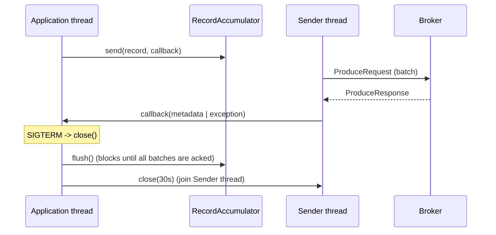
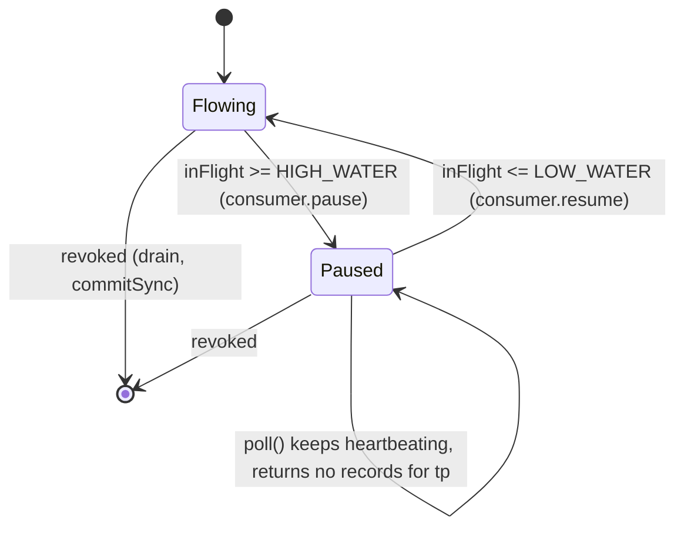
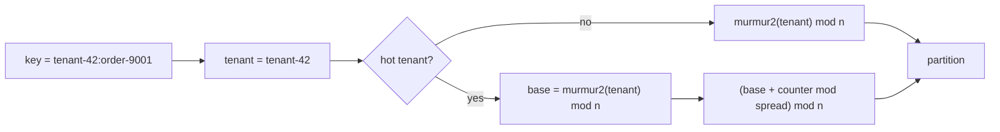
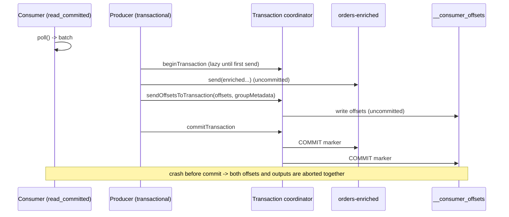
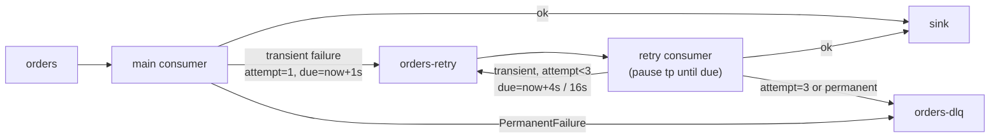
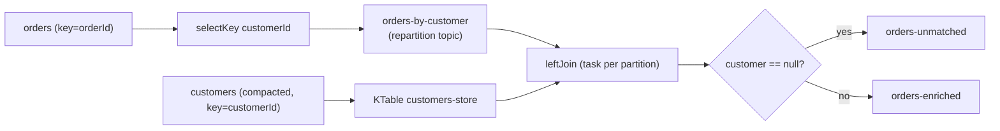
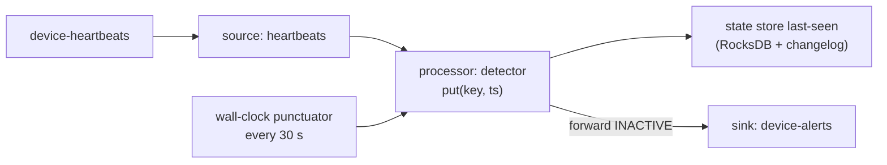
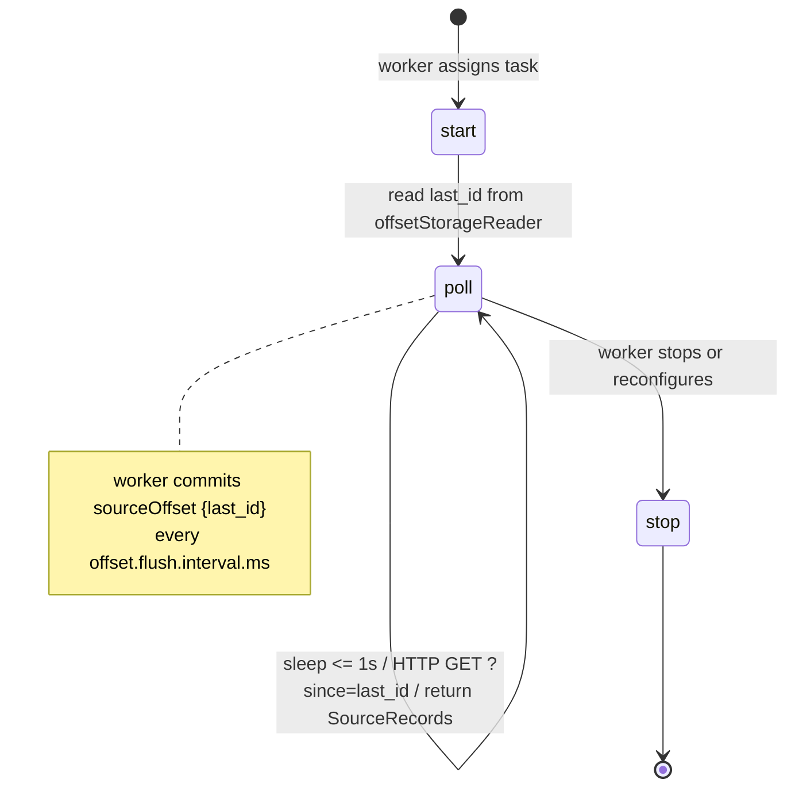
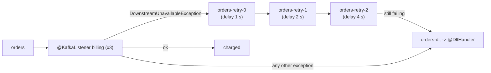
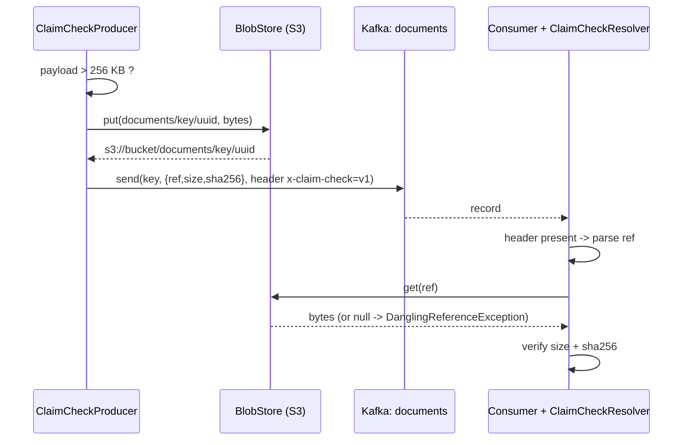

# Coding Exercise Bank

**Roles:** [DEV]   **Level:** Foundation to Advanced
**Baseline:** Java 17, `org.apache.kafka:kafka-clients:3.9.0` and `kafka-streams:3.9.0`; Kafka Connect 3.9 API; Confluent
`kafka-avro-serializer` 7.x (Confluent-specific, labelled); Spring for Apache Kafka 3.x (Spring-specific, labelled);
Testcontainers 1.20.x; `confluent-kafka` Python 2.x for the one Python exercise. Brokers are Kafka 3.9 / 4.0 in KRaft mode.

Each exercise gives a problem statement and constraints, a complete solution, the decisions that matter, and follow-up
variations an interviewer or reviewer would ask for. Solutions favour clarity over framework: plain `main` methods, explicit
configuration, no hidden helpers. `log(...)` stands for your logging framework. All code is meant to compile as shown given the
listed dependencies; package declarations and imports of `java.util.*` are abbreviated where obvious.

## Table of contents

| Topic | Exercises |
|-------|-----------|
| Producer API | Q1, Q4, Q5, Q23 |
| Consumer API | Q2, Q3, Q7, Q24 |
| Transactions and exactly-once | Q6 |
| Error handling patterns | Q8, Q25 |
| Kafka Streams | Q9 – Q14 |
| AdminClient | Q15 – Q17 |
| Kafka Connect | Q18 – Q19 |
| Schema Registry | Q20 |
| Spring Kafka | Q21 |
| Testing | Q14, Q22 |

Shared dependency block (Maven) used by most exercises:

```xml
<dependency><groupId>org.apache.kafka</groupId><artifactId>kafka-clients</artifactId><version>3.9.0</version></dependency>
<dependency><groupId>org.apache.kafka</groupId><artifactId>kafka-streams</artifactId><version>3.9.0</version></dependency>
<dependency><groupId>org.apache.kafka</groupId><artifactId>kafka-streams-test-utils</artifactId><version>3.9.0</version><scope>test</scope></dependency>
<dependency><groupId>com.fasterxml.jackson.core</groupId><artifactId>jackson-databind</artifactId><version>2.17.2</version></dependency>
```

---

## Producer API

### Q1. Write a robust producer with a completion callback and graceful shutdown.
**Role:** [DEV] | **Difficulty:** ★☆☆ | **Topic:** Producer API

**Problem.** Build a reusable `OrderProducer` that sends `(orderId, json)` records to topic `orders`, counts successes and
failures, distinguishes retriable-exhausted failures from non-retriable ones in the callback, and shuts down cleanly on
SIGTERM without losing buffered records.

**Constraints.** `acks=all` and idempotence on; the callback must never block; shutdown must flush and wait at most 30 s;
a `send()` after shutdown has started must fail fast rather than be silently dropped.

**Answer.**

```java
package com.acme.kafka;

import org.apache.kafka.clients.producer.*;
import org.apache.kafka.common.errors.RetriableException;
import org.apache.kafka.common.serialization.StringSerializer;

import java.time.Duration;
import java.util.Properties;
import java.util.concurrent.atomic.AtomicBoolean;
import java.util.concurrent.atomic.AtomicLong;

public final class OrderProducer implements AutoCloseable {

    private static final String TOPIC = "orders";

    private final KafkaProducer<String, String> producer;
    private final AtomicBoolean closing = new AtomicBoolean(false);
    private final AtomicLong acked = new AtomicLong();
    private final AtomicLong failedRetriable = new AtomicLong();
    private final AtomicLong failedFatal = new AtomicLong();

    public OrderProducer(String bootstrapServers) {
        Properties p = new Properties();
        p.put(ProducerConfig.BOOTSTRAP_SERVERS_CONFIG, bootstrapServers);
        p.put(ProducerConfig.CLIENT_ID_CONFIG, "orders-producer-" + System.getenv().getOrDefault("HOSTNAME", "local"));
        p.put(ProducerConfig.KEY_SERIALIZER_CLASS_CONFIG, StringSerializer.class.getName());
        p.put(ProducerConfig.VALUE_SERIALIZER_CLASS_CONFIG, StringSerializer.class.getName());
        p.put(ProducerConfig.ACKS_CONFIG, "all");
        p.put(ProducerConfig.ENABLE_IDEMPOTENCE_CONFIG, true);
        p.put(ProducerConfig.COMPRESSION_TYPE_CONFIG, "lz4");
        p.put(ProducerConfig.LINGER_MS_CONFIG, 10);
        p.put(ProducerConfig.BATCH_SIZE_CONFIG, 64 * 1024);
        p.put(ProducerConfig.DELIVERY_TIMEOUT_MS_CONFIG, 60_000);   // total budget incl. retries
        p.put(ProducerConfig.REQUEST_TIMEOUT_MS_CONFIG, 15_000);
        p.put(ProducerConfig.MAX_BLOCK_MS_CONFIG, 10_000);          // fail fast if buffer/metadata unavailable
        this.producer = new KafkaProducer<>(p);
        Runtime.getRuntime().addShutdownHook(new Thread(this::close, "orders-producer-shutdown"));
    }

    /** Asynchronous send; the returned future completes with RecordMetadata or the failure. */
    public java.util.concurrent.Future<RecordMetadata> send(String orderId, String json) {
        if (closing.get()) {
            throw new IllegalStateException("producer is shutting down; rejecting order " + orderId);
        }
        ProducerRecord<String, String> record = new ProducerRecord<>(TOPIC, orderId, json);
        return producer.send(record, (metadata, exception) -> {
            if (exception == null) {
                acked.incrementAndGet();
                return;
            }
            // Runs on the Sender I/O thread: only counters, logging and non-blocking hand-off here.
            if (exception instanceof RetriableException) {
                failedRetriable.incrementAndGet();   // retries exhausted within delivery.timeout.ms
                log("delivery timed out; consider spooling", orderId, exception);
            } else {
                failedFatal.incrementAndGet();       // RecordTooLarge, InvalidTopic, authorization ...
                log("non-retriable failure", orderId, exception);
            }
        });
    }

    /** Idempotent: safe to call from the shutdown hook and from application code. */
    @Override
    public void close() {
        if (!closing.compareAndSet(false, true)) {
            return;
        }
        try {
            producer.flush();                          // push every buffered batch
            producer.close(Duration.ofSeconds(30));    // wait for in-flight acks, then release threads
        } finally {
            log(String.format("closed: acked=%d retriableFailed=%d fatalFailed=%d",
                    acked.get(), failedRetriable.get(), failedFatal.get()), null, null);
        }
    }

    private static void log(String msg, String key, Throwable t) {
        System.err.println(msg + (key == null ? "" : " key=" + key) + (t == null ? "" : " cause=" + t));
    }

    public static void main(String[] args) throws Exception {
        try (OrderProducer op = new OrderProducer(args.length > 0 ? args[0] : "localhost:9092")) {
            for (int i = 0; i < 1_000; i++) {
                op.send("order-" + i, "{\"id\":" + i + ",\"total\":" + (i * 1.5) + "}");
            }
        } // try-with-resources triggers flush + close before the JVM exits
    }
}
```



**Key decisions.**
- `closing` is checked before `send()` so the shutdown hook and callers cannot race: nothing enters the buffer after
  `flush()` started.
- The callback only classifies (`RetriableException` means the retry budget `delivery.timeout.ms` was exhausted) and counts;
  any spooling to disk would be queued to another thread, never done inline.
- `max.block.ms` is lowered from the default 60 s so a broker outage surfaces as a `TimeoutException` to the caller within 10 s
  instead of freezing request threads.
- `close()` is idempotent (`compareAndSet`) because both try-with-resources and the shutdown hook call it.

**Follow-up probes.**
1. Add a bounded on-disk spool for records whose callback reports `TimeoutException`, and a replayer that drains it on startup.
2. Expose `acked`, `failedRetriable` and the producer's `record-error-rate` metric through Micrometer, reading
   `producer.metrics()`.
3. Make `send()` return a `CompletableFuture<RecordMetadata>` by completing it inside the callback, so callers can compose.

## Consumer API

### Q2. Write a consumer with manual per-partition offset commits and a rebalance listener.
**Role:** [DEV] | **Difficulty:** ★★☆ | **Topic:** Consumer API

**Problem.** Consume `orders` in group `billing`, process each record, and commit exactly the offsets you have processed, per
partition, asynchronously during normal operation and synchronously on revocation and shutdown. Support a clean stop from
another thread.

**Constraints.** `enable.auto.commit=false`; never commit an offset for a record that has not finished processing; use the
cooperative assignor; the poll loop must survive `WakeupException` only when shutting down.

**Answer.**

```java
package com.acme.kafka;

import org.apache.kafka.clients.consumer.*;
import org.apache.kafka.common.TopicPartition;
import org.apache.kafka.common.errors.WakeupException;
import org.apache.kafka.common.serialization.StringDeserializer;

import java.time.Duration;
import java.util.*;
import java.util.concurrent.atomic.AtomicBoolean;

public final class BillingConsumer implements Runnable {

    private final KafkaConsumer<String, String> consumer;
    private final AtomicBoolean running = new AtomicBoolean(true);
    /** Offsets processed but not yet committed. Touched only by the polling thread (listener callbacks run inside poll()). */
    private final Map<TopicPartition, OffsetAndMetadata> pending = new HashMap<>();

    public BillingConsumer(String bootstrapServers) {
        Properties p = new Properties();
        p.put(ConsumerConfig.BOOTSTRAP_SERVERS_CONFIG, bootstrapServers);
        p.put(ConsumerConfig.GROUP_ID_CONFIG, "billing");
        p.put(ConsumerConfig.CLIENT_ID_CONFIG, "billing-" + UUID.randomUUID());
        p.put(ConsumerConfig.KEY_DESERIALIZER_CLASS_CONFIG, StringDeserializer.class.getName());
        p.put(ConsumerConfig.VALUE_DESERIALIZER_CLASS_CONFIG, StringDeserializer.class.getName());
        p.put(ConsumerConfig.ENABLE_AUTO_COMMIT_CONFIG, false);
        p.put(ConsumerConfig.AUTO_OFFSET_RESET_CONFIG, "earliest");
        p.put(ConsumerConfig.MAX_POLL_RECORDS_CONFIG, 200);
        p.put(ConsumerConfig.MAX_POLL_INTERVAL_MS_CONFIG, 300_000);
        p.put(ConsumerConfig.PARTITION_ASSIGNMENT_STRATEGY_CONFIG, CooperativeStickyAssignor.class.getName());
        this.consumer = new KafkaConsumer<>(p);
    }

    private final ConsumerRebalanceListener listener = new ConsumerRebalanceListener() {
        @Override
        public void onPartitionsRevoked(Collection<TopicPartition> partitions) {
            Map<TopicPartition, OffsetAndMetadata> toCommit = new HashMap<>();
            for (TopicPartition tp : partitions) {
                OffsetAndMetadata o = pending.remove(tp);
                if (o != null) toCommit.put(tp, o);
            }
            if (!toCommit.isEmpty()) {
                consumer.commitSync(toCommit);          // synchronous: the partition is about to move
            }
        }

        @Override
        public void onPartitionsAssigned(Collection<TopicPartition> partitions) {
            System.out.println("assigned " + partitions);  // seek here if offsets live outside Kafka
        }

        @Override
        public void onPartitionsLost(Collection<TopicPartition> partitions) {
            partitions.forEach(pending::remove);         // ownership is gone; committing would be rejected
        }
    };

    @Override
    public void run() {
        try {
            consumer.subscribe(List.of("orders"), listener);
            while (running.get()) {
                ConsumerRecords<String, String> records = consumer.poll(Duration.ofMillis(500));
                for (TopicPartition tp : records.partitions()) {
                    for (ConsumerRecord<String, String> r : records.records(tp)) {
                        process(r);
                        pending.put(tp, new OffsetAndMetadata(r.offset() + 1, "billing@" + System.currentTimeMillis()));
                    }
                }
                if (!pending.isEmpty()) {
                    Map<TopicPartition, OffsetAndMetadata> snapshot = new HashMap<>(pending);
                    consumer.commitAsync(snapshot, (offsets, ex) -> {
                        if (ex != null) System.err.println("async commit failed for " + offsets + ": " + ex);
                    });
                    // Keep 'pending' so a later commitSync (revoke/shutdown) still covers these offsets if the async one failed.
                }
            }
        } catch (WakeupException e) {
            if (running.get()) throw e;                  // unexpected wakeup
        } finally {
            try {
                if (!pending.isEmpty()) consumer.commitSync(pending);
            } catch (RuntimeException e) {
                System.err.println("final commit failed: " + e);
            } finally {
                consumer.close(Duration.ofSeconds(10));  // sends LeaveGroup -> immediate rebalance
            }
        }
    }

    public void shutdown() {
        running.set(false);
        consumer.wakeup();                               // the only thread-safe KafkaConsumer method
    }

    private void process(ConsumerRecord<String, String> r) {
        // business logic; must be idempotent because redelivery after a crash is possible
    }

    public static void main(String[] args) throws InterruptedException {
        BillingConsumer bc = new BillingConsumer(args.length > 0 ? args[0] : "localhost:9092");
        Thread t = new Thread(bc, "billing-consumer");
        Runtime.getRuntime().addShutdownHook(new Thread(() -> {
            bc.shutdown();
            try { t.join(15_000); } catch (InterruptedException ignored) { Thread.currentThread().interrupt(); }
        }));
        t.start();
        t.join();
    }
}
```

**Key decisions.**
- Offsets are committed as `offset + 1` (the next record to read) and tracked per partition, so a rebalance moving only some
  partitions commits only those.
- `commitAsync` is used in the loop for throughput; the async callback is never retried (a stale retry could overwrite a
  newer commit). `pending` is retained so the synchronous commit on revoke or shutdown covers any failed async commit; a
  duplicate commit of the same offset is harmless.
- `onPartitionsLost` clears state without committing: the coordinator would reject the commit (`UnknownMemberId` /
  `IllegalGeneration`) and a stale commit could overwrite the new owner's progress.
- `WakeupException` is treated as an error unless `running` is false, so bugs that call `wakeup()` accidentally are visible.

**Follow-up probes.**
1. Store offsets in the same database transaction as the processed result and use `onPartitionsAssigned` to `seek()` to them,
   ignoring Kafka's committed offsets entirely.
2. Replace the per-record `pending.put` with a commit every N records or every T milliseconds, and measure the difference in
   `commit-rate` and redelivery size after a crash.
3. Convert the consumer to the KIP-848 protocol (`group.protocol=consumer`) and remove the configs the new protocol rejects.

### Q3. Implement backpressure with `pause()` / `resume()` and a bounded worker pool.
**Role:** [DEV] | **Difficulty:** ★★★ | **Topic:** Consumer API

**Problem.** Records on `events` are processed by a slow downstream call (50–500 ms). Decouple processing from polling with a
worker pool, but never let more than 1,000 records per partition be in flight, keep polling so the consumer is not kicked out
by `max.poll.interval.ms`, and commit only contiguous completed offsets per partition.

**Constraints.** Per-partition ordering of commits (not of processing) must be preserved; paused partitions must be resumed
automatically; a rebalance must drain or discard in-flight work safely.

**Answer.**

```java
package com.acme.kafka;

import org.apache.kafka.clients.consumer.*;
import org.apache.kafka.common.TopicPartition;
import org.apache.kafka.common.errors.WakeupException;
import org.apache.kafka.common.serialization.StringDeserializer;

import java.time.Duration;
import java.util.*;
import java.util.concurrent.*;
import java.util.concurrent.atomic.AtomicBoolean;

public final class BackpressureConsumer implements Runnable {

    private static final int HIGH_WATER = 1_000;   // pause above
    private static final int LOW_WATER = 200;      // resume below

    /** Tracks completed offsets and yields the highest contiguous committable offset. */
    static final class OffsetTracker {
        private long nextExpected;                 // first offset not yet completed
        private final TreeSet<Long> completedOutOfOrder = new TreeSet<>();
        private int inFlight;

        OffsetTracker(long startOffset) { this.nextExpected = startOffset; }

        synchronized void submitted() { inFlight++; }

        /** Returns the new committable position, or -1 if it did not move. */
        synchronized long completed(long offset) {
            inFlight--;
            if (offset != nextExpected) { completedOutOfOrder.add(offset); return -1; }
            nextExpected++;
            while (!completedOutOfOrder.isEmpty() && completedOutOfOrder.first() == nextExpected) {
                completedOutOfOrder.pollFirst();
                nextExpected++;
            }
            return nextExpected;
        }

        synchronized int inFlight() { return inFlight; }
        synchronized long committable() { return nextExpected; }
    }

    private final KafkaConsumer<String, String> consumer;
    private final ExecutorService workers = Executors.newFixedThreadPool(16);
    private final Map<TopicPartition, OffsetTracker> trackers = new HashMap<>();
    private final Map<TopicPartition, Long> lastCommitted = new HashMap<>();
    private final AtomicBoolean running = new AtomicBoolean(true);

    public BackpressureConsumer(String bootstrap) {
        Properties p = new Properties();
        p.put(ConsumerConfig.BOOTSTRAP_SERVERS_CONFIG, bootstrap);
        p.put(ConsumerConfig.GROUP_ID_CONFIG, "events-sink");
        p.put(ConsumerConfig.KEY_DESERIALIZER_CLASS_CONFIG, StringDeserializer.class.getName());
        p.put(ConsumerConfig.VALUE_DESERIALIZER_CLASS_CONFIG, StringDeserializer.class.getName());
        p.put(ConsumerConfig.ENABLE_AUTO_COMMIT_CONFIG, false);
        p.put(ConsumerConfig.MAX_POLL_RECORDS_CONFIG, 500);
        p.put(ConsumerConfig.PARTITION_ASSIGNMENT_STRATEGY_CONFIG, CooperativeStickyAssignor.class.getName());
        this.consumer = new KafkaConsumer<>(p);
    }

    @Override
    public void run() {
        try {
            consumer.subscribe(List.of("events"), new ConsumerRebalanceListener() {
                @Override public void onPartitionsRevoked(Collection<TopicPartition> parts) {
                    // Drain: wait briefly for in-flight work, then commit what is contiguous.
                    long deadline = System.currentTimeMillis() + 10_000;
                    for (TopicPartition tp : parts) {
                        OffsetTracker t = trackers.get(tp);
                        while (t != null && t.inFlight() > 0 && System.currentTimeMillis() < deadline) {
                            try { Thread.sleep(20); } catch (InterruptedException e) { Thread.currentThread().interrupt(); break; }
                        }
                    }
                    commit(parts, true);
                    parts.forEach(tp -> { trackers.remove(tp); lastCommitted.remove(tp); });
                }
                @Override public void onPartitionsAssigned(Collection<TopicPartition> parts) {
                    for (TopicPartition tp : parts) {
                        trackers.put(tp, new OffsetTracker(consumer.position(tp)));  // position = committed or reset policy
                    }
                }
                @Override public void onPartitionsLost(Collection<TopicPartition> parts) {
                    parts.forEach(tp -> { trackers.remove(tp); lastCommitted.remove(tp); }); // work in flight becomes redelivery
                }
            });

            while (running.get()) {
                ConsumerRecords<String, String> records = consumer.poll(Duration.ofMillis(200));
                for (TopicPartition tp : records.partitions()) {
                    OffsetTracker tracker = trackers.get(tp);
                    if (tracker == null) continue;                        // lost between poll and here
                    for (ConsumerRecord<String, String> r : records.records(tp)) {
                        tracker.submitted();
                        workers.submit(() -> {
                            try { slowDownstreamCall(r); }
                            catch (Exception e) { System.err.println("failed " + tp + "@" + r.offset() + ": " + e); /* DLQ here */ }
                            finally { tracker.completed(r.offset()); }
                        });
                    }
                }
                applyBackpressure();
                commit(consumer.assignment(), false);
            }
        } catch (WakeupException e) {
            if (running.get()) throw e;
        } finally {
            workers.shutdown();
            try { workers.awaitTermination(30, TimeUnit.SECONDS); } catch (InterruptedException ignored) { Thread.currentThread().interrupt(); }
            commit(consumer.assignment(), true);
            consumer.close();
        }
    }

    private void applyBackpressure() {
        List<TopicPartition> toPause = new ArrayList<>(), toResume = new ArrayList<>();
        Set<TopicPartition> paused = consumer.paused();
        for (Map.Entry<TopicPartition, OffsetTracker> e : trackers.entrySet()) {
            int inFlight = e.getValue().inFlight();
            if (inFlight >= HIGH_WATER && !paused.contains(e.getKey())) toPause.add(e.getKey());
            else if (inFlight <= LOW_WATER && paused.contains(e.getKey())) toResume.add(e.getKey());
        }
        if (!toPause.isEmpty()) consumer.pause(toPause);
        if (!toResume.isEmpty()) consumer.resume(toResume);
    }

    private void commit(Collection<TopicPartition> parts, boolean sync) {
        Map<TopicPartition, OffsetAndMetadata> offsets = new HashMap<>();
        for (TopicPartition tp : parts) {
            OffsetTracker t = trackers.get(tp);
            if (t == null) continue;
            long committable = t.committable();
            if (committable > lastCommitted.getOrDefault(tp, -1L)) {
                offsets.put(tp, new OffsetAndMetadata(committable));
                lastCommitted.put(tp, committable);
            }
        }
        if (offsets.isEmpty()) return;
        if (sync) consumer.commitSync(offsets);
        else consumer.commitAsync(offsets, (o, ex) -> { if (ex != null) System.err.println("commit failed " + ex); });
    }

    private void slowDownstreamCall(ConsumerRecord<String, String> r) throws Exception {
        Thread.sleep(ThreadLocalRandom.current().nextInt(50, 500));
    }

    public void shutdown() { running.set(false); consumer.wakeup(); }
}
```



**Key decisions.**
- `poll()` is called continuously even when everything is paused; that is what keeps the member alive and lets commits flow.
- `OffsetTracker` commits only the highest contiguous completed offset, so out-of-order completion never commits past a
  failed or still-running record; redelivery after a crash re-runs at most the in-flight window.
- Hysteresis (`HIGH_WATER`/`LOW_WATER`) avoids pause/resume flapping on every poll.
- On revocation the listener waits up to 10 s for in-flight work, then commits; whatever is not finished is redelivered to
  the new owner, which is the at-least-once contract. `onPartitionsLost` never commits.
- Paused state is not restored after a partition is revoked and re-assigned; `applyBackpressure()` recomputes it every loop.

**Follow-up probes.**
1. Route failed records to a DLQ inside the worker and still mark the offset completed, so a permanent failure cannot stall
   the partition.
2. Make ordering per key instead of per partition by hashing the key to one of N single-thread executors.
3. Add a metric for `inFlight` per partition and the age of the oldest uncommitted offset, and alert when either grows.

### Q4. Implement a custom partitioner that keys by tenant and salts hot tenants across several partitions.
**Role:** [DEV] | **Difficulty:** ★★☆ | **Topic:** Producer API

**Problem.** Keys look like `tenant-42:order-9001`. Normal tenants must map deterministically to one partition (all of a
tenant's records on one partition). A configurable set of hot tenants must be spread over `hot.tenant.spread` consecutive
partitions in round-robin fashion so no single partition carries 40% of the traffic.

**Constraints.** Non-hot tenants must hash the tenant prefix, not the whole key, using murmur2 so the mapping matches what
other Java producers would compute for the tenant ID; null keys must not throw and should land on a random partition (a
custom partitioner must return a non-negative partition; returning `-1` makes `KafkaProducer` throw
`IllegalArgumentException`); configuration via producer properties `hot.tenants` and `hot.tenant.spread`.

**Answer.**

```java
package com.acme.kafka;

import org.apache.kafka.clients.producer.Partitioner;
import org.apache.kafka.common.Cluster;
import org.apache.kafka.common.PartitionInfo;
import org.apache.kafka.common.utils.Utils;

import java.nio.charset.StandardCharsets;
import java.util.*;
import java.util.concurrent.ConcurrentHashMap;
import java.util.concurrent.ThreadLocalRandom;
import java.util.concurrent.atomic.AtomicInteger;

public final class TenantSaltingPartitioner implements Partitioner {

    public static final String HOT_TENANTS = "hot.tenants";           // comma separated tenant IDs
    public static final String HOT_TENANT_SPREAD = "hot.tenant.spread"; // partitions per hot tenant

    private Set<String> hotTenants = Set.of();
    private int spread = 4;
    private final Map<String, AtomicInteger> counters = new ConcurrentHashMap<>();

    @Override
    public void configure(Map<String, ?> configs) {
        Object hot = configs.get(HOT_TENANTS);
        if (hot != null && !hot.toString().isBlank()) {
            hotTenants = Set.of(hot.toString().split("\\s*,\\s*"));
        }
        Object s = configs.get(HOT_TENANT_SPREAD);
        if (s != null) spread = Math.max(1, Integer.parseInt(s.toString()));
    }

    @Override
    public int partition(String topic, Object key, byte[] keyBytes, Object value, byte[] valueBytes, Cluster cluster) {
        List<PartitionInfo> partitions = cluster.partitionsForTopic(topic);
        int n = partitions.size();
        if (keyBytes == null || !(key instanceof String stringKey)) {
            return ThreadLocalRandom.current().nextInt(n);            // null key: no ordering promise anyway
        }
        String tenant = tenantOf(stringKey);
        int base = Utils.toPositive(Utils.murmur2(tenant.getBytes(StandardCharsets.UTF_8))) % n;
        if (!hotTenants.contains(tenant)) {
            return base;
        }
        int salt = counters.computeIfAbsent(tenant, t -> new AtomicInteger()).getAndIncrement();
        return (base + Math.floorMod(salt, Math.min(spread, n))) % n;
    }

    static String tenantOf(String key) {
        int i = key.indexOf(':');
        return i < 0 ? key : key.substring(0, i);
    }

    @Override
    public void close() { }
}
```

Producer configuration:

```java
props.put(ProducerConfig.PARTITIONER_CLASS_CONFIG, TenantSaltingPartitioner.class.getName());
props.put(TenantSaltingPartitioner.HOT_TENANTS, "tenant-42,tenant-7");
props.put(TenantSaltingPartitioner.HOT_TENANT_SPREAD, "4");
```



**Key decisions.**
- Hashing the tenant prefix rather than the full key keeps every order of a tenant on one partition, which is the ordering
  unit the business wants; the full-key hash would spread a tenant randomly.
- `Utils.murmur2` + `Utils.toPositive` replicate the built-in keyed algorithm so tools and other Java producers agree on
  where `tenant-42` lives when it is not hot.
- The salt counter is per tenant and in memory; it does not need to be shared across producer instances because each
  instance round-robins independently and the union is still spread.
- Hot tenants lose cross-partition ordering by design; the consumer must accept per-(tenant, salt) ordering.

**Follow-up probes.**
1. Make the hot-tenant set dynamic by reading it from a compacted `partitioner-config` topic in a background thread.
2. Write a JUnit test using `Cluster` built from fake `PartitionInfo` objects that asserts (a) determinism for a cold tenant
   and (b) that a hot tenant's records cover exactly `spread` partitions.
3. Discuss what happens to the mapping when the topic's partition count changes, and how you would migrate.

### Q5. Write a custom Serde for a domain object.
**Role:** [DEV] | **Difficulty:** ★☆☆ | **Topic:** Producer API

**Problem.** Provide `OrderSerde` usable by producers, consumers and Kafka Streams for `Order(String id, String customerId,
long amountCents, Instant createdAt)`, JSON-encoded, with correct null handling and a fail-fast error on corrupt input.

**Constraints.** No Schema Registry; `null` must round-trip as `null` (tombstones); the deserializer must throw
`SerializationException` so `poll()` surfaces `RecordDeserializationException`.

**Answer.**

```java
package com.acme.kafka;

import com.fasterxml.jackson.databind.ObjectMapper;
import com.fasterxml.jackson.databind.json.JsonMapper;
import com.fasterxml.jackson.datatype.jsr310.JavaTimeModule;
import org.apache.kafka.common.errors.SerializationException;
import org.apache.kafka.common.serialization.*;

import java.io.IOException;
import java.time.Instant;
import java.util.Map;

public record Order(String id, String customerId, long amountCents, Instant createdAt) { }

public final class OrderSerializer implements Serializer<Order> {
    private static final ObjectMapper MAPPER = JsonMapper.builder().addModule(new JavaTimeModule()).build();
    @Override public byte[] serialize(String topic, Order data) {
        if (data == null) return null;                        // tombstone
        try { return MAPPER.writeValueAsBytes(data); }
        catch (IOException e) { throw new SerializationException("cannot serialize Order " + data.id(), e); }
    }
}

public final class OrderDeserializer implements Deserializer<Order> {
    private static final ObjectMapper MAPPER = JsonMapper.builder().addModule(new JavaTimeModule()).build();
    @Override public Order deserialize(String topic, byte[] data) {
        if (data == null) return null;
        try { return MAPPER.readValue(data, Order.class); }
        catch (IOException e) { throw new SerializationException("corrupt Order on topic " + topic, e); }
    }
}

/** One class to reference from Streams: Serdes.serdeFrom(...) style wrapper. */
public final class OrderSerde extends Serdes.WrapperSerde<Order> {
    public OrderSerde() { super(new OrderSerializer(), new OrderDeserializer()); }
    @Override public void configure(Map<String, ?> configs, boolean isKey) { /* nothing configurable */ }
}
```

Usage:

```java
// Producer / consumer
props.put(ProducerConfig.VALUE_SERIALIZER_CLASS_CONFIG, OrderSerializer.class.getName());
props.put(ConsumerConfig.VALUE_DESERIALIZER_CLASS_CONFIG, OrderDeserializer.class.getName());

// Streams
KStream<String, Order> orders = builder.stream("orders", Consumed.with(Serdes.String(), new OrderSerde()));
streamsProps.put(StreamsConfig.DEFAULT_VALUE_SERDE_CLASS_CONFIG, OrderSerde.class.getName()); // needs the no-arg constructor
```

**Key decisions.**
- A Java `record` with Jackson 2.12+ needs no annotations; `JavaTimeModule` handles `Instant`.
- Static, shared `ObjectMapper` instances: Jackson mappers are thread-safe after configuration and expensive to build; the
  serializer runs on caller threads concurrently.
- `null` in, `null` out preserves tombstone semantics for compacted topics and KTables.
- Throwing `SerializationException` (not a custom exception) is what the clients and Streams error handlers expect.
- `Serdes.WrapperSerde` gives a no-arg constructor so the Serde can be named in `default.value.serde`.

**Follow-up probes.**
1. Add a one-byte version prefix to the payload and support reading v1 and v2 layouts in the deserializer.
2. Make the deserializer lenient (`FAIL_ON_UNKNOWN_PROPERTIES=false`) and argue when that is safe.
3. Replace JSON with Avro and the Confluent serializer, and list which of these classes disappear.

## Transactions and exactly-once

### Q6. Implement consume-transform-produce with exactly-once semantics.
**Role:** [DEV] | **Difficulty:** ★★★ | **Topic:** Transactions

**Problem.** Read `orders`, enrich each record, write to `orders-enriched`, and commit the input offsets atomically with the
outputs so a crash never produces duplicates or gaps as seen by a `read_committed` consumer.

**Constraints.** One transactional producer per consumer thread; `transactional.id` stable per instance; recoverable
`KafkaException`s must abort and retry the batch, fatal ones must stop the instance; no offsets committed via the consumer.

**Answer.**

```java
package com.acme.kafka;

import org.apache.kafka.clients.consumer.*;
import org.apache.kafka.clients.producer.*;
import org.apache.kafka.common.KafkaException;
import org.apache.kafka.common.TopicPartition;
import org.apache.kafka.common.errors.*;
import org.apache.kafka.common.serialization.*;

import java.time.Duration;
import java.util.*;

public final class ExactlyOnceEnricher implements Runnable {

    private final KafkaConsumer<String, String> consumer;
    private final KafkaProducer<String, String> producer;
    private volatile boolean running = true;

    public ExactlyOnceEnricher(String bootstrap, String instanceId) {
        Properties c = new Properties();
        c.put(ConsumerConfig.BOOTSTRAP_SERVERS_CONFIG, bootstrap);
        c.put(ConsumerConfig.GROUP_ID_CONFIG, "orders-enricher");
        c.put(ConsumerConfig.KEY_DESERIALIZER_CLASS_CONFIG, StringDeserializer.class.getName());
        c.put(ConsumerConfig.VALUE_DESERIALIZER_CLASS_CONFIG, StringDeserializer.class.getName());
        c.put(ConsumerConfig.ENABLE_AUTO_COMMIT_CONFIG, false);
        c.put(ConsumerConfig.ISOLATION_LEVEL_CONFIG, "read_committed");
        c.put(ConsumerConfig.AUTO_OFFSET_RESET_CONFIG, "earliest");
        c.put(ConsumerConfig.MAX_POLL_RECORDS_CONFIG, 500);
        this.consumer = new KafkaConsumer<>(c);

        Properties p = new Properties();
        p.put(ProducerConfig.BOOTSTRAP_SERVERS_CONFIG, bootstrap);
        p.put(ProducerConfig.KEY_SERIALIZER_CLASS_CONFIG, StringSerializer.class.getName());
        p.put(ProducerConfig.VALUE_SERIALIZER_CLASS_CONFIG, StringSerializer.class.getName());
        p.put(ProducerConfig.TRANSACTIONAL_ID_CONFIG, "orders-enricher-" + instanceId); // stable across restarts
        p.put(ProducerConfig.ENABLE_IDEMPOTENCE_CONFIG, true);
        p.put(ProducerConfig.ACKS_CONFIG, "all");
        p.put(ProducerConfig.TRANSACTION_TIMEOUT_CONFIG, 60_000);
        this.producer = new KafkaProducer<>(p);
    }

    @Override
    public void run() {
        producer.initTransactions();                     // fences older instances with the same transactional.id
        consumer.subscribe(List.of("orders"));
        try {
            while (running) {
                ConsumerRecords<String, String> records = consumer.poll(Duration.ofMillis(250));
                if (records.isEmpty()) continue;
                try {
                    processBatch(records);
                } catch (ProducerFencedException | OutOfOrderSequenceException | AuthorizationException e) {
                    throw new IllegalStateException("fatal transactional error; restart the instance", e);
                } catch (KafkaException e) {
                    System.err.println("aborting batch: " + e);
                    producer.abortTransaction();
                    rewindTo(records);                   // re-read the same records on the next poll
                }
            }
        } catch (WakeupException ignored) {
        } finally {
            producer.close(Duration.ofSeconds(10));      // open txn (if any) is aborted by the coordinator
            consumer.close();
        }
    }

    private void processBatch(ConsumerRecords<String, String> records) {
        producer.beginTransaction();
        Map<TopicPartition, OffsetAndMetadata> offsets = new HashMap<>();
        for (ConsumerRecord<String, String> r : records) {
            producer.send(new ProducerRecord<>("orders-enriched", r.key(), enrich(r.value())));
            offsets.put(new TopicPartition(r.topic(), r.partition()), new OffsetAndMetadata(r.offset() + 1));
        }
        producer.sendOffsetsToTransaction(offsets, consumer.groupMetadata()); // KIP-447 fencing via group generation
        producer.commitTransaction();                    // blocks until markers are written
    }

    private void rewindTo(ConsumerRecords<String, String> records) {
        for (TopicPartition tp : records.partitions()) {
            consumer.seek(tp, records.records(tp).get(0).offset());
        }
    }

    private String enrich(String json) { return json.replaceFirst("\\}$", ",\"enriched\":true}"); }

    public void shutdown() { running = false; consumer.wakeup(); }

    public static void main(String[] args) {
        ExactlyOnceEnricher app = new ExactlyOnceEnricher(args[0], args.length > 1 ? args[1] : "0");
        Runtime.getRuntime().addShutdownHook(new Thread(app::shutdown));
        app.run();
    }
}
```



**Key decisions.**
- `consumer.groupMetadata()` in `sendOffsetsToTransaction` lets the coordinator reject offsets from a consumer that lost its
  generation (KIP-447), so one producer per thread is safe; no `transactional.id` per partition is needed.
- The consumer never commits; its only durable state is what the transaction writes.
- After `abortTransaction()` the code seeks back to the first offset of each partition in the aborted batch; without the
  seek the next `poll()` would continue from the in-memory position and skip the batch.
- Fatal errors escalate to a process restart; retrying `initTransactions()` in place after `ProducerFencedException`
  usually means another instance is alive with the same ID.
- `transaction.timeout.ms` (60 s) must exceed the longest batch processing time or the coordinator aborts mid-flight.

**Follow-up probes.**
1. Wrap `commitTransaction()` so a `TimeoutException` is retried rather than followed by `abortTransaction()`, and explain why.
2. Add a `ConsumerRebalanceListener` that aborts an in-progress transaction on `onPartitionsRevoked` and argue whether it is
   necessary under KIP-447.
3. Measure end-to-end latency for a `read_committed` consumer as a function of batch size and `poll` timeout.

## Error handling patterns

### Q7. Build an idempotent consumer with a deduplication store.
**Role:** [DEV] | **Difficulty:** ★★☆ | **Topic:** Error handling

**Problem.** Payments on topic `payments` may be delivered more than once (producer retries without idempotence from a legacy
system, consumer redelivery after crashes, operator replays). Apply each payment exactly once to the ledger. Every record
carries an `event-id` header; if it is missing, fall back to `topic-partition-offset`.

**Constraints.** The dedup check and the side effect must be atomic (or the check must be conservative); entries expire after
a TTL longer than the topic retention; the store interface must be swappable for Redis or a database.

**Answer.**

```java
package com.acme.kafka;

import org.apache.kafka.clients.consumer.*;
import org.apache.kafka.common.header.Header;
import org.apache.kafka.common.serialization.StringDeserializer;

import java.nio.charset.StandardCharsets;
import java.time.Duration;
import java.util.*;
import java.util.concurrent.ConcurrentHashMap;

/** Records an ID atomically; returns true if this call was the first to record it. */
public interface DedupStore {
    boolean markIfAbsent(String id, Duration ttl);
}

/** In-memory reference implementation; replace with Redis SET NX PX or a DB unique index in production. */
public final class InMemoryDedupStore implements DedupStore {
    private final ConcurrentHashMap<String, Long> seen = new ConcurrentHashMap<>();

    @Override
    public boolean markIfAbsent(String id, Duration ttl) {
        long now = System.currentTimeMillis();
        long expiresAt = now + ttl.toMillis();
        Long previous = seen.putIfAbsent(id, expiresAt);
        if (previous == null) return true;
        if (previous < now) return seen.replace(id, previous, expiresAt); // expired entry: reclaim atomically
        return false;
    }

    /** Call periodically from a scheduler. */
    public void evictExpired() {
        long now = System.currentTimeMillis();
        seen.entrySet().removeIf(e -> e.getValue() < now);
    }
}

public final class IdempotentPaymentConsumer {

    private static final Duration DEDUP_TTL = Duration.ofDays(8); // topic retention 7d + margin

    private final KafkaConsumer<String, String> consumer;
    private final DedupStore dedup;
    private final Ledger ledger;

    public IdempotentPaymentConsumer(String bootstrap, DedupStore dedup, Ledger ledger) {
        Properties p = new Properties();
        p.put(ConsumerConfig.BOOTSTRAP_SERVERS_CONFIG, bootstrap);
        p.put(ConsumerConfig.GROUP_ID_CONFIG, "ledger");
        p.put(ConsumerConfig.KEY_DESERIALIZER_CLASS_CONFIG, StringDeserializer.class.getName());
        p.put(ConsumerConfig.VALUE_DESERIALIZER_CLASS_CONFIG, StringDeserializer.class.getName());
        p.put(ConsumerConfig.ENABLE_AUTO_COMMIT_CONFIG, false);
        p.put(ConsumerConfig.AUTO_OFFSET_RESET_CONFIG, "earliest");
        this.consumer = new KafkaConsumer<>(p);
        this.dedup = dedup;
        this.ledger = ledger;
    }

    public void run() {
        consumer.subscribe(List.of("payments"));
        try {
            while (true) {
                ConsumerRecords<String, String> records = consumer.poll(Duration.ofMillis(500));
                for (ConsumerRecord<String, String> r : records) {
                    String id = dedupKey(r);
                    if (!dedup.markIfAbsent(id, DEDUP_TTL)) {
                        System.out.println("duplicate skipped: " + id);
                        continue;
                    }
                    try {
                        ledger.apply(r.key(), r.value());          // the side effect
                    } catch (RuntimeException e) {
                        // The mark exists but the effect failed: the next delivery would be skipped.
                        // Either undo the mark (below) or make ledger.apply() itself record the id in the same DB txn.
                        throw e;
                    }
                }
                if (!records.isEmpty()) consumer.commitSync();
            }
        } finally {
            consumer.close();
        }
    }

    static String dedupKey(ConsumerRecord<String, String> r) {
        Header h = r.headers().lastHeader("event-id");
        if (h != null && h.value() != null) return new String(h.value(), StandardCharsets.UTF_8);
        return r.topic() + "-" + r.partition() + "-" + r.offset();
    }

    public interface Ledger { void apply(String account, String paymentJson); }
}
```

Database-backed variant of `DedupStore` and `Ledger` in one transaction (pseudo-SQL, PostgreSQL syntax):

```sql
BEGIN;
INSERT INTO processed_events(event_id, processed_at) VALUES (:id, now())
  ON CONFLICT (event_id) DO NOTHING;            -- affected rows = 0  => duplicate, ROLLBACK and skip
UPDATE ledger SET balance = balance + :amount WHERE account = :account;
COMMIT;
-- retention job: DELETE FROM processed_events WHERE processed_at < now() - interval '8 days'
```

**Key decisions.**
- The business `event-id` covers producer-side duplicates (same event, different offsets); the `topic-partition-offset`
  fallback covers only consumer redelivery, so the header should be mandatory for new producers.
- `markIfAbsent` before the effect is at-most-once for the effect if the process dies in between; the database variant
  removes that window by putting the mark and the effect in one transaction. Choose based on whether a lost payment or a
  double payment is the worse failure.
- TTL is retention plus margin because a replay from the earliest offset is the longest redelivery window.
- The in-memory store is per instance; a rebalance moving a partition to another instance loses its memory, which is why the
  production store must be shared (Redis, database).

**Follow-up probes.**
1. Implement `DedupStore` on Redis with `SET key 1 NX PX <ttl>` and discuss what happens when Redis is unavailable.
2. Implement the same dedup as a Kafka Streams `processValues` with a `WindowStore` keyed by event ID, and compare memory.
3. Change the loop so the commit happens after each partition's records rather than each poll, and explain the trade-off.

### Q8. Implement a retry topic with delayed redelivery and a dead-letter queue.
**Role:** [DEV] | **Difficulty:** ★★★ | **Topic:** Error handling

**Problem.** Records from `orders` are processed by a handler that can fail transiently (downstream 503) or permanently
(validation). On transient failure, redeliver with exponential backoff (1 s, 4 s, 16 s) without blocking the main partition;
after three attempts, or on permanent failure, send to `orders-dlq` with full context in headers.

**Constraints.** The retry consumer must not `Thread.sleep()` (it would exceed `max.poll.interval.ms` and block other
records); instead pause the partition until the record's due time. Original topic, partition, offset, attempt and exception
must travel in headers.

**Answer.**

```java
package com.acme.kafka;

import org.apache.kafka.clients.consumer.*;
import org.apache.kafka.clients.producer.*;
import org.apache.kafka.common.TopicPartition;
import org.apache.kafka.common.header.Header;
import org.apache.kafka.common.header.Headers;
import org.apache.kafka.common.header.internals.RecordHeader;
import org.apache.kafka.common.serialization.*;

import java.nio.charset.StandardCharsets;
import java.time.Duration;
import java.util.*;

/** Shared routing logic used by the main consumer and the retry consumer. */
public final class RetryRouter {
    static final String RETRY_TOPIC = "orders-retry";
    static final String DLQ_TOPIC = "orders-dlq";
    static final int MAX_ATTEMPTS = 3;
    static final long[] BACKOFF_MS = {1_000, 4_000, 16_000};

    static final String H_ATTEMPT = "x-retry-attempt";
    static final String H_DUE = "x-retry-due-ms";
    static final String H_ORIG_TOPIC = "x-original-topic";
    static final String H_ORIG_PARTITION = "x-original-partition";
    static final String H_ORIG_OFFSET = "x-original-offset";
    static final String H_EXCEPTION = "x-exception";

    private final KafkaProducer<String, byte[]> producer;

    public RetryRouter(String bootstrap) {
        Properties p = new Properties();
        p.put(ProducerConfig.BOOTSTRAP_SERVERS_CONFIG, bootstrap);
        p.put(ProducerConfig.KEY_SERIALIZER_CLASS_CONFIG, StringSerializer.class.getName());
        p.put(ProducerConfig.VALUE_SERIALIZER_CLASS_CONFIG, ByteArraySerializer.class.getName());
        p.put(ProducerConfig.ACKS_CONFIG, "all");
        p.put(ProducerConfig.ENABLE_IDEMPOTENCE_CONFIG, true);
        this.producer = new KafkaProducer<>(p);
    }

    /** Decide where a failed record goes; returns the destination topic. Synchronous so the caller can commit safely. */
    public String route(ConsumerRecord<String, byte[]> r, Exception failure, boolean permanent) throws Exception {
        int attempt = intHeader(r.headers(), H_ATTEMPT, 0);
        String origTopic = stringHeader(r.headers(), H_ORIG_TOPIC, r.topic());
        int origPartition = intHeader(r.headers(), H_ORIG_PARTITION, r.partition());
        long origOffset = longHeader(r.headers(), H_ORIG_OFFSET, r.offset());

        boolean toDlq = permanent || attempt >= MAX_ATTEMPTS;
        String dest = toDlq ? DLQ_TOPIC : RETRY_TOPIC;

        ProducerRecord<String, byte[]> out = new ProducerRecord<>(dest, null, r.key(), r.value());
        Headers h = out.headers();
        r.headers().forEach(orig -> { if (!orig.key().startsWith("x-")) h.add(orig); });   // keep business headers
        h.add(header(H_ORIG_TOPIC, origTopic));
        h.add(header(H_ORIG_PARTITION, Integer.toString(origPartition)));
        h.add(header(H_ORIG_OFFSET, Long.toString(origOffset)));
        h.add(header(H_EXCEPTION, failure.getClass().getName() + ": " + String.valueOf(failure.getMessage())));
        if (!toDlq) {
            h.add(header(H_ATTEMPT, Integer.toString(attempt + 1)));
            h.add(header(H_DUE, Long.toString(System.currentTimeMillis() + BACKOFF_MS[attempt])));
        } else {
            h.add(header(H_ATTEMPT, Integer.toString(attempt)));
        }
        producer.send(out).get();       // synchronous: the caller commits the source offset right after
        return dest;
    }

    public void close() { producer.close(Duration.ofSeconds(10)); }

    static Header header(String k, String v) { return new RecordHeader(k, v.getBytes(StandardCharsets.UTF_8)); }
    static String stringHeader(Headers h, String k, String dflt) {
        Header x = h.lastHeader(k); return x == null ? dflt : new String(x.value(), StandardCharsets.UTF_8);
    }
    static int intHeader(Headers h, String k, int dflt) { return Integer.parseInt(stringHeader(h, k, Integer.toString(dflt))); }
    static long longHeader(Headers h, String k, long dflt) { return Long.parseLong(stringHeader(h, k, Long.toString(dflt))); }
}

/** Consumes orders-retry; pauses a partition until the head record is due instead of sleeping. */
public final class RetryConsumer implements Runnable {

    public static final class PermanentFailure extends RuntimeException {
        public PermanentFailure(String m) { super(m); }
    }

    private final KafkaConsumer<String, byte[]> consumer;
    private final RetryRouter router;
    private final Map<TopicPartition, Long> resumeAt = new HashMap<>();
    private volatile boolean running = true;

    public RetryConsumer(String bootstrap) {
        Properties p = new Properties();
        p.put(ConsumerConfig.BOOTSTRAP_SERVERS_CONFIG, bootstrap);
        p.put(ConsumerConfig.GROUP_ID_CONFIG, "orders-retry-handler");
        p.put(ConsumerConfig.KEY_DESERIALIZER_CLASS_CONFIG, StringDeserializer.class.getName());
        p.put(ConsumerConfig.VALUE_DESERIALIZER_CLASS_CONFIG, ByteArrayDeserializer.class.getName());
        p.put(ConsumerConfig.ENABLE_AUTO_COMMIT_CONFIG, false);
        p.put(ConsumerConfig.AUTO_OFFSET_RESET_CONFIG, "earliest");
        p.put(ConsumerConfig.MAX_POLL_RECORDS_CONFIG, 50);
        this.consumer = new KafkaConsumer<>(p);
        this.router = new RetryRouter(bootstrap);
    }

    @Override
    public void run() {
        consumer.subscribe(List.of(RetryRouter.RETRY_TOPIC), new ConsumerRebalanceListener() {
            @Override public void onPartitionsRevoked(Collection<TopicPartition> parts) { parts.forEach(resumeAt::remove); }
            @Override public void onPartitionsAssigned(Collection<TopicPartition> parts) { }
        });
        try {
            while (running) {
                resumeDuePartitions();
                ConsumerRecords<String, byte[]> records = consumer.poll(Duration.ofMillis(200));
                Map<TopicPartition, OffsetAndMetadata> commits = new HashMap<>();
                for (TopicPartition tp : records.partitions()) {
                    for (ConsumerRecord<String, byte[]> r : records.records(tp)) {
                        long due = RetryRouter.longHeader(r.headers(), RetryRouter.H_DUE, 0L);
                        long now = System.currentTimeMillis();
                        if (due > now) {
                            consumer.pause(List.of(tp));
                            consumer.seek(tp, r.offset());        // re-read from this record after resume
                            resumeAt.put(tp, due);
                            break;                                 // remaining records of tp are refetched later
                        }
                        handle(r);
                        commits.put(tp, new OffsetAndMetadata(r.offset() + 1));
                    }
                }
                if (!commits.isEmpty()) consumer.commitSync(commits);
            }
        } finally {
            router.close();
            consumer.close();
        }
    }

    private void resumeDuePartitions() {
        long now = System.currentTimeMillis();
        List<TopicPartition> ready = new ArrayList<>();
        resumeAt.forEach((tp, due) -> { if (due <= now) ready.add(tp); });
        if (!ready.isEmpty()) {
            consumer.resume(ready);
            ready.forEach(resumeAt::remove);
        }
    }

    private void handle(ConsumerRecord<String, byte[]> r) {
        try {
            OrderHandler.process(r.key(), r.value());
        } catch (PermanentFailure e) {
            routeQuietly(r, e, true);
        } catch (Exception e) {
            routeQuietly(r, e, false);
        }
    }

    private void routeQuietly(ConsumerRecord<String, byte[]> r, Exception e, boolean permanent) {
        try { router.route(r, e, permanent); }
        catch (Exception routing) { throw new IllegalStateException("cannot route failed record; stopping", routing); }
    }

    public void shutdown() { running = false; consumer.wakeup(); }
}

/** The main consumer of 'orders' uses the same handle()/routeQuietly() shape with RETRY as first hop. */
final class OrderHandler {
    static void process(String key, byte[] value) {
        // business logic; throw RetryConsumer.PermanentFailure for validation errors, anything else for transient ones
    }
}
```



**Key decisions.**
- One retry topic with a per-record due time and a paused partition gives arbitrary backoff without N topics; the cost is
  head-of-line blocking inside the retry topic (a 16 s record ahead of a 1 s record delays it). Per-level topics
  (`orders-retry-1s`, `-4s`, `-16s`) remove that; see variation 1.
- `pause` + `seek` back to the head record, then `break`: records after it in the same poll are dropped and refetched, which
  is simpler and safer than buffering them in memory across polls.
- `route()` is synchronous (`send().get()`) so the source offset is committed only after the retry or DLQ record is durable;
  a crash between the two produces a duplicate retry, never a lost record.
- Business headers are preserved, `x-` headers are rewritten, and the original coordinates are carried from the first hop so
  the DLQ entry points at the record in `orders`, not in `orders-retry`.
- The DLQ producer failure is fatal on purpose: silently dropping is worse than stopping.

**Follow-up probes.**
1. Split into per-delay topics consumed by one `RetryConsumer` each and compare ordering and head-of-line behaviour.
2. Add a DLQ replay tool that reads `orders-dlq`, strips `x-` headers, and republishes to `orders` with the original key.
3. Preserve per-key ordering: when a key is in retry, park subsequent records for that key too (hint: a small KTable of
   "keys in retry" or a state store in Streams).

## Kafka Streams

### Q9. Implement word count with Kafka Streams.
**Role:** [DEV] | **Difficulty:** ★☆☆ | **Topic:** Kafka Streams

**Problem.** Read lines from `text-lines`, count occurrences of each word (case-insensitive, non-word characters as
separators), and continuously publish updated counts to `word-counts`.

**Constraints.** The count table must be queryable by name; the app must survive a thread crash and shut down cleanly.

**Answer.**

```java
package com.acme.streams;

import org.apache.kafka.common.serialization.Serdes;
import org.apache.kafka.common.utils.Bytes;
import org.apache.kafka.streams.*;
import org.apache.kafka.streams.errors.StreamsUncaughtExceptionHandler;
import org.apache.kafka.streams.kstream.*;
import org.apache.kafka.streams.state.KeyValueStore;

import java.time.Duration;
import java.util.Arrays;
import java.util.Locale;
import java.util.Properties;
import java.util.concurrent.CountDownLatch;

public final class WordCount {

    public static Topology build() {
        StreamsBuilder builder = new StreamsBuilder();
        KStream<String, String> lines = builder.stream("text-lines", Consumed.with(Serdes.String(), Serdes.String()));

        KTable<String, Long> counts = lines
                .flatMapValues(line -> Arrays.asList(line.toLowerCase(Locale.ROOT).split("\\W+")))
                .filter((key, word) -> !word.isBlank())
                .groupBy((key, word) -> word, Grouped.with("by-word", Serdes.String(), Serdes.String()))
                .count(Materialized.<String, Long, KeyValueStore<Bytes, byte[]>>as("word-counts")
                        .withKeySerde(Serdes.String())
                        .withValueSerde(Serdes.Long()));

        counts.toStream().to("word-counts", Produced.with(Serdes.String(), Serdes.Long()));
        return builder.build();
    }

    public static Properties config(String bootstrap) {
        Properties p = new Properties();
        p.put(StreamsConfig.APPLICATION_ID_CONFIG, "word-count");
        p.put(StreamsConfig.BOOTSTRAP_SERVERS_CONFIG, bootstrap);
        p.put(StreamsConfig.DEFAULT_KEY_SERDE_CLASS_CONFIG, Serdes.String().getClass());
        p.put(StreamsConfig.DEFAULT_VALUE_SERDE_CLASS_CONFIG, Serdes.String().getClass());
        p.put(StreamsConfig.NUM_STREAM_THREADS_CONFIG, 2);
        p.put(StreamsConfig.STATE_DIR_CONFIG, "/var/lib/kafka-streams");
        p.put(StreamsConfig.COMMIT_INTERVAL_MS_CONFIG, 1_000);
        return p;
    }

    public static void main(String[] args) throws InterruptedException {
        Topology topology = build();
        System.out.println(topology.describe());
        KafkaStreams streams = new KafkaStreams(topology, config(args.length > 0 ? args[0] : "localhost:9092"));
        streams.setUncaughtExceptionHandler(e -> {
            System.err.println("stream thread died: " + e);
            return StreamsUncaughtExceptionHandler.StreamThreadExceptionResponse.REPLACE_THREAD;
        });
        CountDownLatch latch = new CountDownLatch(1);
        Runtime.getRuntime().addShutdownHook(new Thread(() -> { streams.close(Duration.ofSeconds(30)); latch.countDown(); }));
        streams.start();
        latch.await();
    }
}
```

**Key decisions.**
- `groupBy` with a new key inserts a repartition topic; naming it via `Grouped.with("by-word", ...)` keeps the internal
  topic name stable (`word-count-by-word-repartition`) across topology edits.
- `Materialized.as("word-counts")` names the store and its changelog so it can be queried and survives refactors.
- `REPLACE_THREAD` keeps the instance alive on transient thread failures; a poison record would loop, which is why the
  deserialization handler (Q38 in the developer bank) should be `LogAndContinue` with a DLQ.
- `commit.interval.ms=1000` makes updates visible faster than the 30 s default at the cost of more commits.

**Follow-up probes.**
1. Emit only the top 10 words every minute (hint: windowed aggregation plus a custom `Processor` or `suppress`).
2. Add `processing.guarantee=exactly_once_v2` and describe what changes in the output topic's offsets.
3. Query the `word-counts` store via IQv2 `KeyQuery` from an HTTP endpoint.

### Q10. Count events per key per minute and emit only the final result per window.
**Role:** [DEV] | **Difficulty:** ★★☆ | **Topic:** Kafka Streams

**Problem.** `page-views` is keyed by page. Produce one record per page per one-minute tumbling window with the final count,
tolerating events that arrive up to 30 s late, to `views-per-minute-final`.

**Constraints.** No intermediate updates downstream; late records inside the grace period must be counted; records after
the grace period are dropped (and visible in metrics).

**Answer.**

```java
package com.acme.streams;

import org.apache.kafka.common.serialization.Serdes;
import org.apache.kafka.common.utils.Bytes;
import org.apache.kafka.streams.*;
import org.apache.kafka.streams.kstream.*;
import org.apache.kafka.streams.state.WindowStore;

import java.time.Duration;
import java.util.Properties;

public final class PageViewsPerMinute {

    public static final String INPUT = "page-views";
    public static final String OUTPUT = "views-per-minute-final";

    public static Topology build() {
        StreamsBuilder builder = new StreamsBuilder();
        builder.stream(INPUT, Consumed.with(Serdes.String(), Serdes.String()))
                .groupByKey()
                .windowedBy(TimeWindows.ofSizeAndGrace(Duration.ofMinutes(1), Duration.ofSeconds(30)))
                .count(Materialized.<String, Long, WindowStore<Bytes, byte[]>>as("views-per-minute")
                        .withKeySerde(Serdes.String())
                        .withValueSerde(Serdes.Long()))
                .suppress(Suppressed.untilWindowCloses(Suppressed.BufferConfig.unbounded()).withName("final-per-minute"))
                .toStream()
                .map((windowedKey, count) ->
                        KeyValue.pair(windowedKey.key() + "@" + windowedKey.window().startTime(), count))
                .to(OUTPUT, Produced.with(Serdes.String(), Serdes.Long()));
        return builder.build();
    }

    public static Properties config(String bootstrap) {
        Properties p = new Properties();
        p.put(StreamsConfig.APPLICATION_ID_CONFIG, "page-views-per-minute");
        p.put(StreamsConfig.BOOTSTRAP_SERVERS_CONFIG, bootstrap);
        p.put(StreamsConfig.DEFAULT_KEY_SERDE_CLASS_CONFIG, Serdes.String().getClass());
        p.put(StreamsConfig.DEFAULT_VALUE_SERDE_CLASS_CONFIG, Serdes.String().getClass());
        // event time from the record timestamp (default extractor); use a custom TimestampExtractor for payload time
        return p;
    }

    public static void main(String[] args) {
        KafkaStreams streams = new KafkaStreams(build(), config(args.length > 0 ? args[0] : "localhost:9092"));
        Runtime.getRuntime().addShutdownHook(new Thread(() -> streams.close(Duration.ofSeconds(30))));
        streams.start();
    }
}
```

Alternative without a suppress buffer (Kafka 3.3+), replacing the `.count(...).suppress(...)` pair:

```java
.windowedBy(TimeWindows.ofSizeAndGrace(Duration.ofMinutes(1), Duration.ofSeconds(30)))
.emitStrategy(EmitStrategy.onWindowClose())
.count(Materialized.<String, Long, WindowStore<Bytes, byte[]>>as("views-per-minute")
        .withKeySerde(Serdes.String()).withValueSerde(Serdes.Long()))
```

**Key decisions.**
- `ofSizeAndGrace(1 min, 30 s)` sets both the lateness tolerance and the window store retention (size + grace).
- `untilWindowCloses` with `unbounded()` is the only configuration that guarantees exactly one result per window; a bounded
  buffer with `emitEarlyWhenFull` would emit intermediate results under load.
- The final result is emitted when stream time (max observed timestamp in the task) passes window end + grace, so a quiet
  key or partition delays its last window until new data arrives; `emitStrategy(onWindowClose())` has the same property
  but avoids the extra in-memory buffer and changelog.
- The output key embeds the window start so consumers can distinguish windows without a windowed serde.

**Follow-up probes.**
1. Replace tumbling with `SlidingWindows.ofTimeDifferenceAndGrace(...)` for "views in the last minute per event" and explain
   the output cardinality change.
2. Add a heartbeat producer that advances stream time on idle partitions and show why it is needed.
3. Extract event time from a JSON `ts` field with a custom `TimestampExtractor` and handle records without it.

### Q11. Enrich a stream of orders with customer data using a KStream–KTable join.
**Role:** [DEV] | **Difficulty:** ★★☆ | **Topic:** Kafka Streams

**Problem.** `orders` is keyed by order ID with JSON containing `customerId`. `customers` is a compacted topic keyed by
customer ID. Produce `orders-enriched` with the customer merged in, and route orders whose customer is unknown to
`orders-unmatched`.

**Constraints.** Orders must be re-keyed by customer ID before the join (co-partitioning); the customer table must be
materialized; no GlobalKTable (the customer set is large).

**Answer.**

```java
package com.acme.streams;

import com.fasterxml.jackson.databind.JsonNode;
import com.fasterxml.jackson.databind.ObjectMapper;
import org.apache.kafka.common.serialization.Serdes;
import org.apache.kafka.common.utils.Bytes;
import org.apache.kafka.streams.*;
import org.apache.kafka.streams.kstream.*;
import org.apache.kafka.streams.state.KeyValueStore;

import java.util.Map;

public final class OrderEnrichment {

    private static final ObjectMapper MAPPER = new ObjectMapper();

    /** In-memory join result; no Serde needed because nothing between the join and the sinks repartitions. */
    record Enriched(String order, String customer) { }

    public static Topology build() {
        StreamsBuilder builder = new StreamsBuilder();

        KTable<String, String> customers = builder.table("customers",
                Consumed.with(Serdes.String(), Serdes.String()),
                Materialized.<String, String, KeyValueStore<Bytes, byte[]>>as("customers-store"));

        KStream<String, String> ordersByCustomer = builder
                .stream("orders", Consumed.with(Serdes.String(), Serdes.String()))
                .selectKey((orderId, json) -> field(json, "customerId"), Named.as("key-by-customer"))
                .repartition(Repartitioned.<String, String>as("orders-by-customer")
                        .withKeySerde(Serdes.String()).withValueSerde(Serdes.String()));

        KStream<String, Enriched> joined = ordersByCustomer.leftJoin(customers,
                Enriched::new,
                Joined.with(Serdes.String(), Serdes.String(), Serdes.String(), "orders-customers"));

        Map<String, KStream<String, Enriched>> branches = joined
                .split(Named.as("route-"))
                .branch((customerId, e) -> e.customer() == null, Branched.as("unmatched"))
                .defaultBranch(Branched.as("matched"));

        branches.get("route-unmatched")
                .mapValues(Enriched::order)
                .to("orders-unmatched", Produced.with(Serdes.String(), Serdes.String()));

        branches.get("route-matched")
                .mapValues(e -> merge(e.order(), e.customer()))
                .to("orders-enriched", Produced.with(Serdes.String(), Serdes.String()));

        return builder.build();
    }

    static String field(String json, String name) {
        try { JsonNode n = MAPPER.readTree(json).get(name); return n == null ? "" : n.asText(); }
        catch (Exception e) { throw new IllegalArgumentException("bad order json", e); }
    }

    static String merge(String order, String customer) {
        return "{\"order\":" + order + ",\"customer\":" + customer + "}";
    }
}
```



**Key decisions.**
- `selectKey` marks the stream for repartitioning; the explicit `repartition()` with a name pins the topic name and lets you
  set its partition count to match `customers` if the source topics differ.
- `leftJoin` keeps unmatched orders (customer `null`) so they can be routed instead of silently dropped by an inner join;
  a late-arriving customer will not retroactively enrich them (stream–table joins are not symmetric).
- `split`/`Branched` (2.8+) replaces the deprecated `branch()` array API and returns named streams.
- The `Enriched` record needs no Serde because it never crosses a topic; the sinks re-serialize to JSON strings.

**Follow-up probes.**
1. Make the join temporal with a versioned customer table (`Stores.persistentVersionedKeyValueStore`) so an order joins the
   customer version valid at its timestamp.
2. Replace the KTable with a `GlobalKTable` and list what changes (no repartition, full replication, join by extracted key).
3. Handle orders that arrive before their customer by parking them in a state store and retrying on customer updates
   (a KTable–KTable join or Processor API).

### Q12. Join two streams within a time window (impressions and clicks).
**Role:** [DEV] | **Difficulty:** ★★☆ | **Topic:** Kafka Streams

**Problem.** `impressions` and `clicks` are both keyed by impression ID. Emit an `attributed-clicks` record when a click
arrives within 10 minutes after its impression, tolerating 2 minutes of out-of-order arrival.

**Constraints.** Only clicks after the impression count (no negative window); both inputs must be co-partitioned; the join
stores must be named.

**Answer.**

```java
package com.acme.streams;

import org.apache.kafka.common.serialization.Serdes;
import org.apache.kafka.streams.*;
import org.apache.kafka.streams.kstream.*;

import java.time.Duration;

public final class ClickAttribution {

    public static Topology build() {
        StreamsBuilder builder = new StreamsBuilder();
        KStream<String, String> impressions = builder.stream("impressions", Consumed.with(Serdes.String(), Serdes.String()));
        KStream<String, String> clicks = builder.stream("clicks", Consumed.with(Serdes.String(), Serdes.String()));

        JoinWindows window = JoinWindows.ofTimeDifferenceAndGrace(Duration.ofMinutes(10), Duration.ofMinutes(2))
                .before(Duration.ZERO);            // click.ts in [impression.ts, impression.ts + 10 min]

        KStream<String, String> attributed = impressions.join(clicks,
                (impression, click) -> "{\"impression\":" + impression + ",\"click\":" + click + "}",
                window,
                StreamJoined.with(Serdes.String(), Serdes.String(), Serdes.String())
                        .withName("impression-click")
                        .withStoreName("impression-click-window"));

        attributed.to("attributed-clicks", Produced.with(Serdes.String(), Serdes.String()));
        return builder.build();
    }

    public static void main(String[] args) {
        java.util.Properties p = new java.util.Properties();
        p.put(StreamsConfig.APPLICATION_ID_CONFIG, "click-attribution");
        p.put(StreamsConfig.BOOTSTRAP_SERVERS_CONFIG, args.length > 0 ? args[0] : "localhost:9092");
        p.put(StreamsConfig.DEFAULT_KEY_SERDE_CLASS_CONFIG, Serdes.String().getClass());
        p.put(StreamsConfig.DEFAULT_VALUE_SERDE_CLASS_CONFIG, Serdes.String().getClass());
        p.put(StreamsConfig.MAX_TASK_IDLE_MS_CONFIG, 1_000L);   // wait briefly for the slower input before advancing time
        KafkaStreams streams = new KafkaStreams(build(), p);
        Runtime.getRuntime().addShutdownHook(new Thread(() -> streams.close(Duration.ofSeconds(30))));
        streams.start();
    }
}
```

**Key decisions.**
- `ofTimeDifferenceAndGrace(10 min, 2 min).before(ZERO)` makes the window asymmetric: a click joins an impression only if its
  timestamp is at or after the impression's and within 10 minutes; the grace lets a click that arrives 2 minutes late still
  match.
- Both sides are buffered in window stores (`impression-click-window-this-join-store` and `-other-join-store`), retained for
  window + grace; store size is bounded by input rate × 12 minutes.
- `max.task.idle.ms` makes the task wait for data on both partitions before advancing stream time, which reduces spurious
  misses when one topic lags.
- Inner join emits one record per (impression, click) pair; a click that matches twice (duplicate impression) emits twice.

**Follow-up probes.**
1. Use `leftJoin` to also emit "impression without click" once the window closes (since 3.1 the outer/left join emits the
   unmatched side only after the window closes) and explain the timing.
2. Change the key from impression ID to user ID and discuss the fan-out and store growth.
3. Replace the JSON string concatenation with a typed `Serde` from Q5 and a `record` value.

### Q13. Use the Processor API with a punctuator and a state store to detect inactive devices.
**Role:** [DEV] | **Difficulty:** ★★★ | **Topic:** Kafka Streams

**Problem.** Devices send heartbeats on `device-heartbeats` (key = device ID). Every 30 s of wall-clock time, emit
`{"device": id, "status": "INACTIVE"}` to `device-alerts` for every device that has not sent a heartbeat for 5 minutes, then
forget it until it reappears.

**Constraints.** Use the `org.apache.kafka.streams.processor.api` Processor (not the deprecated `Transformer`); the store must
be persistent and changelog-backed; the sweep must not mutate the store while iterating.

**Answer.**

```java
package com.acme.streams;

import org.apache.kafka.common.serialization.Serdes;
import org.apache.kafka.streams.*;
import org.apache.kafka.streams.processor.PunctuationType;
import org.apache.kafka.streams.processor.api.*;
import org.apache.kafka.streams.state.*;

import java.time.Duration;
import java.util.*;

public final class InactivityDetector implements Processor<String, String, String, String> {

    static final String STORE = "last-seen";
    private static final long INACTIVE_AFTER_MS = Duration.ofMinutes(5).toMillis();

    private ProcessorContext<String, String> context;
    private KeyValueStore<String, Long> lastSeen;

    @Override
    public void init(ProcessorContext<String, String> context) {
        this.context = context;
        this.lastSeen = context.getStateStore(STORE);
        context.schedule(Duration.ofSeconds(30), PunctuationType.WALL_CLOCK_TIME, this::sweep);
    }

    @Override
    public void process(Record<String, String> record) {
        lastSeen.put(record.key(), record.timestamp());     // event time of the heartbeat
    }

    private void sweep(long nowWallClock) {
        List<String> inactive = new ArrayList<>();
        try (KeyValueIterator<String, Long> it = lastSeen.all()) {
            while (it.hasNext()) {
                KeyValue<String, Long> kv = it.next();
                if (nowWallClock - kv.value > INACTIVE_AFTER_MS) inactive.add(kv.key);
            }
        }
        for (String device : inactive) {
            context.forward(new Record<>(device, "{\"device\":\"" + device + "\",\"status\":\"INACTIVE\"}", nowWallClock));
            lastSeen.delete(device);                          // forget until it reappears
        }
        if (!inactive.isEmpty()) context.commit();            // request a commit so alerts and store changes flush together
    }

    /** Supplier that also declares the store, so Topology wires it automatically (ConnectedStoreProvider). */
    public static final class Supplier implements ProcessorSupplier<String, String, String, String> {
        @Override public Processor<String, String, String, String> get() { return new InactivityDetector(); }
        @Override public Set<StoreBuilder<?>> stores() {
            return Set.of(Stores.keyValueStoreBuilder(
                    Stores.persistentKeyValueStore(STORE), Serdes.String(), Serdes.Long()).withLoggingEnabled(Map.of()));
        }
    }

    public static Topology build() {
        return new Topology()
                .addSource("heartbeats", Serdes.String().deserializer(), Serdes.String().deserializer(), "device-heartbeats")
                .addProcessor("detector", new Supplier(), "heartbeats")
                .addSink("alerts", "device-alerts", Serdes.String().serializer(), Serdes.String().serializer(), "detector");
    }

    public static void main(String[] args) {
        Properties p = new Properties();
        p.put(StreamsConfig.APPLICATION_ID_CONFIG, "device-inactivity");
        p.put(StreamsConfig.BOOTSTRAP_SERVERS_CONFIG, args.length > 0 ? args[0] : "localhost:9092");
        KafkaStreams streams = new KafkaStreams(build(), p);
        Runtime.getRuntime().addShutdownHook(new Thread(() -> streams.close(Duration.ofSeconds(30))));
        streams.start();
    }
}
```



**Key decisions.**
- `WALL_CLOCK_TIME` punctuation is required because the whole point is to fire when no records arrive; `STREAM_TIME` would
  never advance on a silent topic.
- The iterator is closed in try-with-resources and deletions happen after iteration; RocksDB iterators are snapshots, but
  mutating during iteration is a common source of leaks and confusion.
- The store is declared via `ProcessorSupplier.stores()` so the topology connects it; `withLoggingEnabled` makes it
  recoverable from the changelog after a failover, at which point the punctuator on the new instance continues the sweep.
- Comparing wall clock to the record's event time assumes producers' clocks are roughly synchronised; for skewed clocks store
  `context.currentSystemTimeMs()` instead.
- `context.commit()` is a request, not a synchronous commit; it just shortens the time until the alerts become visible.

**Follow-up probes.**
1. Emit an `ACTIVE` record when a device reappears after being marked inactive (needs a second state or a status flag).
2. Convert to the DSL using `processValues()` on a `KStream` and compare the resulting topology.
3. Explain what happens to punctuation timing during a rebalance and after a standby takes over.

### Q14. Unit-test the windowed topology with `TopologyTestDriver`.
**Role:** [DEV] | **Difficulty:** ★☆☆ | **Topic:** Testing

**Problem.** Write JUnit 5 tests for `PageViewsPerMinute` (Q10) proving that (a) three views in one minute produce exactly one
final record with count 3 once the window closes, (b) a view within the 30 s grace is counted, and (c) nothing is emitted
before the window closes. Also test `WordCount` (Q9) counts.

**Constraints.** No broker; deterministic event time; state directory cleaned up after each test.

**Answer.**

```java
package com.acme.streams;

import org.apache.kafka.common.serialization.*;
import org.apache.kafka.streams.*;
import org.apache.kafka.streams.test.TestRecord;
import org.junit.jupiter.api.*;

import java.time.Duration;
import java.time.Instant;
import java.util.List;
import java.util.Properties;

import static org.junit.jupiter.api.Assertions.*;

class PageViewsPerMinuteTest {

    private TopologyTestDriver driver;
    private TestInputTopic<String, String> input;
    private TestOutputTopic<String, Long> output;

    @BeforeEach
    void setUp() {
        Properties p = new Properties();
        p.put(StreamsConfig.APPLICATION_ID_CONFIG, "test");
        p.put(StreamsConfig.BOOTSTRAP_SERVERS_CONFIG, "dummy:1234");
        p.put(StreamsConfig.DEFAULT_KEY_SERDE_CLASS_CONFIG, Serdes.String().getClass());
        p.put(StreamsConfig.DEFAULT_VALUE_SERDE_CLASS_CONFIG, Serdes.String().getClass());
        driver = new TopologyTestDriver(PageViewsPerMinute.build(), p);
        input = driver.createInputTopic(PageViewsPerMinute.INPUT, new StringSerializer(), new StringSerializer());
        output = driver.createOutputTopic(PageViewsPerMinute.OUTPUT, new StringDeserializer(), new LongDeserializer());
    }

    @AfterEach
    void tearDown() { driver.close(); }   // deletes the temporary state dir

    @Test
    void emitsOneFinalCountPerWindowAfterGrace() {
        Instant t0 = Instant.EPOCH;
        input.pipeInput("home", "v1", t0);
        input.pipeInput("home", "v2", t0.plusSeconds(10));
        input.pipeInput("home", "v3", t0.plusSeconds(59));
        assertTrue(output.isEmpty(), "nothing before the window closes");

        // stream time moves to 80s; this record belongs to window [60s,120s), window [0,60s) stays open (grace ends at 90s)
        input.pipeInput("home", "next-window", t0.plusSeconds(80));
        assertTrue(output.isEmpty());

        // out-of-order record with timestamp 55s arrives while stream time is 80s: inside grace -> counted in window 0
        input.pipeInput("home", "v4-late", t0.plusSeconds(55));
        // a record on another key advances stream time past 60s + 30s grace and closes window 0
        input.pipeInput("other", "x", t0.plusSeconds(91));

        List<KeyValue<String, Long>> results = output.readKeyValuesToList();
        assertEquals(List.of(KeyValue.pair("home@1970-01-01T00:00:00Z", 4L)), results);
    }

    @Test
    void dropsRecordsAfterGrace() {
        Instant t0 = Instant.EPOCH;
        input.pipeInput("home", "v1", t0);
        input.pipeInput("other", "advance", t0.plusSeconds(200));  // closes window 0 (end 60s + grace 30s)
        assertEquals(List.of(KeyValue.pair("home@1970-01-01T00:00:00Z", 1L)), output.readKeyValuesToList());

        input.pipeInput("home", "too-late", t0.plusSeconds(30));   // window 0 is closed: dropped
        input.pipeInput("other", "advance-more", t0.plusSeconds(400));
        // only 'other' windows close now; 'home' window 0 is not re-emitted
        List<KeyValue<String, Long>> rest = output.readKeyValuesToList();
        assertTrue(rest.stream().noneMatch(kv -> kv.key.startsWith("home@1970-01-01T00:00:00Z")));
    }
}

class WordCountTest {

    @Test
    void countsWordsCaseInsensitively() {
        Properties p = new Properties();
        p.put(StreamsConfig.APPLICATION_ID_CONFIG, "wc-test");
        p.put(StreamsConfig.BOOTSTRAP_SERVERS_CONFIG, "dummy:1234");
        p.put(StreamsConfig.STATESTORE_CACHE_MAX_BYTES_CONFIG, 0);   // see every update, not the cached last one
        try (TopologyTestDriver driver = new TopologyTestDriver(WordCount.build(), p)) {
            TestInputTopic<String, String> in = driver.createInputTopic("text-lines", new StringSerializer(), new StringSerializer());
            TestOutputTopic<String, Long> out = driver.createOutputTopic("word-counts", new StringDeserializer(), new LongDeserializer());

            in.pipeInput(null, "Kafka kafka streams");
            List<TestRecord<String, Long>> records = out.readRecordsToList();
            assertEquals(3, records.size());
            assertEquals(2L, driver.<String, Long>getKeyValueStore("word-counts").get("kafka"));
            assertEquals(1L, driver.<String, Long>getKeyValueStore("word-counts").get("streams"));
        }
    }
}
```

**Key decisions.**
- Timestamps are passed explicitly with `pipeInput(key, value, Instant)`; stream time in the driver is the max timestamp
  seen, so a record on another key (`other`) is the tool to close windows.
- `statestore.cache.max.bytes=0` in the word-count test disables the record cache so every update is emitted; without it
  the driver would emit only the final value per key at commit/close.
- The driver is closed in `@AfterEach`/try-with-resources; it deletes its temporary `state.dir`, and leaking it makes later
  tests read old RocksDB state.
- `readKeyValuesToList()` is used only after all inputs so the assertion covers ordering; `isEmpty()` guards the "no early
  emission" property.

**Follow-up probes.**
1. Test the `emitStrategy(onWindowClose())` variant and show the test needs no change.
2. Test the `InactivityDetector` punctuator with `driver.advanceWallClockTime(Duration.ofSeconds(31))`.
3. Explain what the driver cannot test (co-partition mismatch, standby failover) and write the Testcontainers equivalent.

## AdminClient

### Q15. Create topics with configs and describe the cluster with `AdminClient`.
**Role:** [DEV] | **Difficulty:** ★☆☆ | **Topic:** AdminClient

**Problem.** Write a tool that idempotently creates `orders` (12 partitions, RF 3, 7-day retention, `min.insync.replicas=2`)
and `customers` (compacted), then prints the cluster ID, controller, brokers with racks, and for `orders` each partition's
leader, replicas and ISR, and finally lowers `orders` retention to 3 days.

**Constraints.** Existing topics must not fail the run; use `incrementalAlterConfigs` (not the deprecated `alterConfigs`);
bounded waits.

**Answer.**

```java
package com.acme.kafka.admin;

import org.apache.kafka.clients.admin.*;
import org.apache.kafka.common.KafkaFuture;
import org.apache.kafka.common.Node;
import org.apache.kafka.common.TopicPartitionInfo;
import org.apache.kafka.common.config.ConfigResource;
import org.apache.kafka.common.config.TopicConfig;
import org.apache.kafka.common.errors.TopicExistsException;

import java.util.*;
import java.util.concurrent.ExecutionException;
import java.util.concurrent.TimeUnit;
import java.util.stream.Collectors;

public final class TopicProvisioner {

    public static void main(String[] args) throws Exception {
        Properties p = new Properties();
        p.put(AdminClientConfig.BOOTSTRAP_SERVERS_CONFIG, args.length > 0 ? args[0] : "localhost:9092");
        p.put(AdminClientConfig.REQUEST_TIMEOUT_MS_CONFIG, 15_000);
        p.put(AdminClientConfig.DEFAULT_API_TIMEOUT_MS_CONFIG, 30_000);

        try (Admin admin = Admin.create(p)) {
            NewTopic orders = new NewTopic("orders", 12, (short) 3).configs(Map.of(
                    TopicConfig.RETENTION_MS_CONFIG, Long.toString(7L * 24 * 3600 * 1000),
                    TopicConfig.MIN_IN_SYNC_REPLICAS_CONFIG, "2",
                    TopicConfig.CLEANUP_POLICY_CONFIG, TopicConfig.CLEANUP_POLICY_DELETE,
                    TopicConfig.COMPRESSION_TYPE_CONFIG, "producer"));
            NewTopic customers = new NewTopic("customers", 12, (short) 3).configs(Map.of(
                    TopicConfig.CLEANUP_POLICY_CONFIG, TopicConfig.CLEANUP_POLICY_COMPACT,
                    TopicConfig.MIN_IN_SYNC_REPLICAS_CONFIG, "2",
                    TopicConfig.MIN_COMPACTION_LAG_MS_CONFIG, "60000",
                    TopicConfig.DELETE_RETENTION_MS_CONFIG, Long.toString(24L * 3600 * 1000)));

            createIdempotently(admin, List.of(orders, customers));
            describeCluster(admin);
            describeTopic(admin, "orders");

            ConfigResource ordersRes = new ConfigResource(ConfigResource.Type.TOPIC, "orders");
            admin.incrementalAlterConfigs(Map.of(ordersRes, List.of(
                    new AlterConfigOp(new ConfigEntry(TopicConfig.RETENTION_MS_CONFIG,
                            Long.toString(3L * 24 * 3600 * 1000)), AlterConfigOp.OpType.SET))))
                    .all().get(30, TimeUnit.SECONDS);

            Config cfg = admin.describeConfigs(List.of(ordersRes)).all().get(30, TimeUnit.SECONDS).get(ordersRes);
            System.out.println("orders retention.ms=" + cfg.get(TopicConfig.RETENTION_MS_CONFIG).value()
                    + " source=" + cfg.get(TopicConfig.RETENTION_MS_CONFIG).source());
        }
    }

    static void createIdempotently(Admin admin, List<NewTopic> topics) throws Exception {
        CreateTopicsResult result = admin.createTopics(topics, new CreateTopicsOptions().timeoutMs(30_000));
        for (Map.Entry<String, KafkaFuture<Void>> e : result.values().entrySet()) {
            try {
                e.getValue().get(30, TimeUnit.SECONDS);
                System.out.println("created " + e.getKey());
            } catch (ExecutionException ex) {
                if (ex.getCause() instanceof TopicExistsException) {
                    System.out.println("exists  " + e.getKey() + " (config not re-applied)");
                } else {
                    throw ex;
                }
            }
        }
    }

    static void describeCluster(Admin admin) throws Exception {
        DescribeClusterResult c = admin.describeCluster();
        System.out.println("cluster " + c.clusterId().get() + " controller=" + c.controller().get().id());
        for (Node n : c.nodes().get()) {
            System.out.printf("  broker %d %s:%d rack=%s%n", n.id(), n.host(), n.port(), n.rack());
        }
    }

    static void describeTopic(Admin admin, String topic) throws Exception {
        TopicDescription d = admin.describeTopics(List.of(topic)).allTopicNames().get(30, TimeUnit.SECONDS).get(topic);
        System.out.println("topic " + d.name() + " id=" + d.topicId() + " internal=" + d.isInternal());
        for (TopicPartitionInfo pi : d.partitions()) {
            String replicas = pi.replicas().stream().map(n -> Integer.toString(n.id())).collect(Collectors.joining(","));
            String isr = pi.isr().stream().map(n -> Integer.toString(n.id())).collect(Collectors.joining(","));
            boolean underReplicated = pi.isr().size() < pi.replicas().size();
            System.out.printf("  p%d leader=%s replicas=[%s] isr=[%s]%s%n", pi.partition(),
                    pi.leader() == null ? "none" : pi.leader().id(), replicas, isr, underReplicated ? "  UNDER-REPLICATED" : "");
        }
    }
}
```

**Key decisions.**
- `TopicExistsException` is unwrapped from the `ExecutionException` per topic so one existing topic does not abort creation of
  the others; note that an existing topic's config is not reconciled, which variation 1 addresses.
- `allTopicNames()` replaces the deprecated `all()` on `DescribeTopicsResult` (3.1+), and `topicId()` is printed because since
  KRaft topics are identified by ID, not name, in metadata.
- `incrementalAlterConfigs` changes only the listed keys; the older `alterConfigs` replaced the whole config set and could
  silently reset other overrides.
- `ConfigEntry.source()` tells you whether a value is a topic override, a broker default or a static default; useful in audits.

**Follow-up probes.**
1. Turn the tool into a reconciler: compare the desired config map with `describeConfigs` and apply only the differences
   (`SET` for changed, `DELETE` to fall back to broker defaults).
2. Add `createPartitions` to grow `orders` to 24 and explain the effect on keyed producers.
3. List all topics with `min.insync.replicas` below 2 across the cluster using one `describeConfigs` call.

### Q16. Compute consumer group lag with `AdminClient`.
**Role:** [DEV] | **Difficulty:** ★★☆ | **Topic:** AdminClient

**Problem.** For a given group, print per-partition committed offset, log-end offset, lag and the owning member, plus total
lag, without starting a consumer. Partitions assigned but never committed must show lag from the earliest offset.

**Constraints.** Use `listConsumerGroupOffsets`, `listOffsets` and `describeConsumerGroups` only; respect the group's
isolation level for the end offset (`read_committed` groups should see the LSO).

**Answer.**

```java
package com.acme.kafka.admin;

import org.apache.kafka.clients.admin.*;
import org.apache.kafka.clients.consumer.OffsetAndMetadata;
import org.apache.kafka.common.IsolationLevel;
import org.apache.kafka.common.TopicPartition;

import java.util.*;
import java.util.concurrent.TimeUnit;

public final class GroupLag {

    record PartitionLag(TopicPartition tp, long committed, long begin, long end, String member) {
        long lag() { return end - (committed < 0 ? begin : committed); }
    }

    public static List<PartitionLag> compute(Admin admin, String groupId, boolean readCommitted) throws Exception {
        ConsumerGroupDescription desc = admin.describeConsumerGroups(List.of(groupId))
                .describedGroups().get(groupId).get(30, TimeUnit.SECONDS);

        Map<TopicPartition, String> owner = new HashMap<>();
        for (MemberDescription m : desc.members()) {
            for (TopicPartition tp : m.assignment().topicPartitions()) {
                owner.put(tp, m.consumerId() + "@" + m.host());
            }
        }

        Map<TopicPartition, OffsetAndMetadata> committed = admin.listConsumerGroupOffsets(groupId)
                .partitionsToOffsetAndMetadata().get(30, TimeUnit.SECONDS);

        Set<TopicPartition> all = new HashSet<>(committed.keySet());
        all.addAll(owner.keySet());
        if (all.isEmpty()) return List.of();

        ListOffsetsOptions opts = new ListOffsetsOptions(readCommitted ? IsolationLevel.READ_COMMITTED : IsolationLevel.READ_UNCOMMITTED);
        Map<TopicPartition, OffsetSpec> latestSpec = new HashMap<>(), earliestSpec = new HashMap<>();
        for (TopicPartition tp : all) { latestSpec.put(tp, OffsetSpec.latest()); earliestSpec.put(tp, OffsetSpec.earliest()); }
        Map<TopicPartition, ListOffsetsResult.ListOffsetsResultInfo> latest = admin.listOffsets(latestSpec, opts).all().get(30, TimeUnit.SECONDS);
        Map<TopicPartition, ListOffsetsResult.ListOffsetsResultInfo> earliest = admin.listOffsets(earliestSpec, opts).all().get(30, TimeUnit.SECONDS);

        List<PartitionLag> out = new ArrayList<>();
        for (TopicPartition tp : all) {
            OffsetAndMetadata c = committed.get(tp);
            out.add(new PartitionLag(tp, c == null ? -1 : c.offset(),
                    earliest.get(tp).offset(), latest.get(tp).offset(), owner.getOrDefault(tp, "-")));
        }
        out.sort(Comparator.comparing((PartitionLag l) -> l.tp().topic()).thenComparingInt(l -> l.tp().partition()));
        return out;
    }

    public static void main(String[] args) throws Exception {
        String bootstrap = args[0], group = args[1];
        try (Admin admin = Admin.create(Map.of(AdminClientConfig.BOOTSTRAP_SERVERS_CONFIG, bootstrap))) {
            List<PartitionLag> lags = compute(admin, group, false);
            long total = 0;
            System.out.printf("%-30s %-10s %-10s %-8s %s%n", "partition", "committed", "end", "lag", "member");
            for (PartitionLag l : lags) {
                total += l.lag();
                System.out.printf("%-30s %-10s %-10d %-8d %s%n", l.tp(),
                        l.committed() < 0 ? "-" : Long.toString(l.committed()), l.end(), l.lag(), l.member());
            }
            System.out.println("total lag " + total + " (state " + admin.describeConsumerGroups(List.of(group))
                    .describedGroups().get(group).get().state() + ")");
        }
    }
}
```

**Key decisions.**
- Lag is computed against `OffsetSpec.latest()` under the group's isolation level: for `read_committed` consumers the
  visible end is the LSO, so measuring against the HW would report phantom lag during open transactions.
- Partitions that are assigned but have no committed offset are included (from `describeConsumerGroups`) and their lag is
  measured from the earliest offset, which is what a consumer with `auto.offset.reset=earliest` would actually process.
- Committed offsets and end offsets are read at slightly different instants; for alerting, treat the number as indicative
  and alert on trend, not on a single sample.
- `ConsumerGroupDescription.state()` returns `ConsumerGroupState` in 3.9; in 4.0 prefer `groupState()` (`GroupState`), which
  also covers share groups.

**Follow-up probes.**
1. Export the result as Prometheus metrics (`kafka_consumergroup_lag{group,topic,partition}`) on a schedule.
2. Add lag in seconds by reading the timestamp of the record at the committed offset (hint: a short-lived consumer with
   `assign` and `seek`) and discuss the cost.
3. Detect a "stuck" group: committed offsets unchanged for N minutes while the end offset advances.

### Q17. Reset a consumer group's offsets to a timestamp programmatically.
**Role:** [DEV] | **Difficulty:** ★★☆ | **Topic:** AdminClient

**Problem.** Reset group `billing` on topic `orders` so that it resumes from the first record at or after
`2026-09-01T00:00:00Z`. Partitions with no record after that time must be set to their end offset. Refuse to run while the
group has active members.

**Constraints.** `AdminClient` only; dry-run mode that prints the plan; verify the result after applying.

**Answer.**

```java
package com.acme.kafka.admin;

import org.apache.kafka.clients.admin.*;
import org.apache.kafka.clients.consumer.OffsetAndMetadata;
import org.apache.kafka.common.ConsumerGroupState;
import org.apache.kafka.common.TopicPartition;
import org.apache.kafka.common.TopicPartitionInfo;

import java.time.Instant;
import java.util.*;
import java.util.concurrent.TimeUnit;

public final class ResetOffsetsToTimestamp {

    public static void main(String[] args) throws Exception {
        String bootstrap = args[0], group = args[1], topic = args[2];
        Instant target = Instant.parse(args[3]);
        boolean execute = args.length > 4 && args[4].equals("--execute");

        try (Admin admin = Admin.create(Map.of(AdminClientConfig.BOOTSTRAP_SERVERS_CONFIG, bootstrap))) {
            ConsumerGroupDescription desc = admin.describeConsumerGroups(List.of(group))
                    .describedGroups().get(group).get(30, TimeUnit.SECONDS);
            if (desc.state() != ConsumerGroupState.EMPTY && desc.state() != ConsumerGroupState.DEAD) {
                throw new IllegalStateException("group " + group + " is " + desc.state() + "; stop all members first");
            }

            TopicDescription td = admin.describeTopics(List.of(topic)).allTopicNames().get(30, TimeUnit.SECONDS).get(topic);
            Map<TopicPartition, OffsetSpec> byTime = new HashMap<>();
            Map<TopicPartition, OffsetSpec> latest = new HashMap<>();
            for (TopicPartitionInfo pi : td.partitions()) {
                TopicPartition tp = new TopicPartition(topic, pi.partition());
                byTime.put(tp, OffsetSpec.forTimestamp(target.toEpochMilli()));
                latest.put(tp, OffsetSpec.latest());
            }
            Map<TopicPartition, ListOffsetsResult.ListOffsetsResultInfo> timeOffsets = admin.listOffsets(byTime).all().get(30, TimeUnit.SECONDS);
            Map<TopicPartition, ListOffsetsResult.ListOffsetsResultInfo> endOffsets = admin.listOffsets(latest).all().get(30, TimeUnit.SECONDS);
            Map<TopicPartition, OffsetAndMetadata> current = admin.listConsumerGroupOffsets(group)
                    .partitionsToOffsetAndMetadata().get(30, TimeUnit.SECONDS);

            Map<TopicPartition, OffsetAndMetadata> plan = new TreeMap<>(Comparator.comparingInt(TopicPartition::partition));
            for (TopicPartition tp : byTime.keySet()) {
                long ts = timeOffsets.get(tp).offset();          // -1 when no record has timestamp >= target
                long chosen = ts >= 0 ? ts : endOffsets.get(tp).offset();
                plan.put(tp, new OffsetAndMetadata(chosen, "reset-to " + target));
                System.out.printf("%s: %s -> %d%s%n", tp,
                        current.containsKey(tp) ? current.get(tp).offset() : "(none)", chosen, ts >= 0 ? "" : " (end: no data after target)");
            }

            if (!execute) { System.out.println("dry run; pass --execute to apply"); return; }

            admin.alterConsumerGroupOffsets(group, plan).all().get(30, TimeUnit.SECONDS);

            Map<TopicPartition, OffsetAndMetadata> after = admin.listConsumerGroupOffsets(group)
                    .partitionsToOffsetAndMetadata().get(30, TimeUnit.SECONDS);
            for (Map.Entry<TopicPartition, OffsetAndMetadata> e : plan.entrySet()) {
                long got = after.get(e.getKey()).offset();
                if (got != e.getValue().offset()) throw new IllegalStateException("verification failed for " + e.getKey());
            }
            System.out.println("applied and verified " + plan.size() + " partitions");
        }
    }
}
```

Equivalent CLI for comparison:

```bash
kafka-consumer-groups.sh --bootstrap-server localhost:9092 --group billing --topic orders \
  --reset-offsets --to-datetime 2026-09-01T00:00:00.000 --execute
```

**Key decisions.**
- `OffsetSpec.forTimestamp` returns `-1` when no record in the partition has a timestamp at or after the target; the sensible
  fallback is the end offset (skip everything), matching the CLI's behaviour.
- The state check is mandatory: `alterConsumerGroupOffsets` on a group with live members fails on the broker
  (`UnknownMemberIdException` under the classic protocol), and even if it succeeded the members' in-memory positions would
  overwrite it on their next commit.
- The result is read back and compared, because the alter call returns success per partition and a partial failure would
  otherwise go unnoticed.
- The `metadata` string records why the offset moved; it is visible in `__consumer_offsets` for audits.

**Follow-up probes.**
1. Support `--shift-by N` and `--to-earliest` modes with the same verification.
2. Explain why the timestamp lookup can skip out-of-order older records under `CreateTime`, and how `LogAppendTime`
   topics differ.
3. Reset a Kafka Streams application instead: which additional topics (repartition, changelog) must be handled and why the
   `kafka-streams-application-reset.sh` tool exists.

## Kafka Connect

### Q18. Write a Connect source connector that polls a REST API.
**Role:** [DEV] | **Difficulty:** ★★★ | **Topic:** Kafka Connect

**Problem.** An HTTP endpoint `GET /events?since=<lastId>` returns a JSON array of `{ "id": 123, "type": "...", "ts": 1700000000000,
"payload": {...} }`. Build a source connector that polls it every N seconds, emits one record per event to a configured topic,
keyed by ID with a structured value, and resumes from the last delivered ID after a restart.

**Constraints.** Offsets must go through Connect's offset storage (no local files); `poll()` must not spin; configuration
must be validated by the REST `validate` endpoint via a `ConfigDef`; one task (single endpoint).

**Answer.**

```java
package com.acme.connect.http;

import com.fasterxml.jackson.databind.JsonNode;
import com.fasterxml.jackson.databind.ObjectMapper;
import org.apache.kafka.common.config.ConfigDef;
import org.apache.kafka.common.config.ConfigDef.Importance;
import org.apache.kafka.common.config.ConfigDef.Type;
import org.apache.kafka.connect.connector.Task;
import org.apache.kafka.connect.data.Schema;
import org.apache.kafka.connect.data.SchemaBuilder;
import org.apache.kafka.connect.data.Struct;
import org.apache.kafka.connect.source.SourceConnector;
import org.apache.kafka.connect.source.SourceRecord;
import org.apache.kafka.connect.source.SourceTask;

import java.io.IOException;
import java.net.URI;
import java.net.http.HttpClient;
import java.net.http.HttpRequest;
import java.net.http.HttpResponse;
import java.time.Duration;
import java.util.*;

public final class HttpSourceConnector extends SourceConnector {

    static final String URL = "http.url";
    static final String TOPIC = "topic";
    static final String POLL_INTERVAL_MS = "poll.interval.ms";

    static final ConfigDef CONFIG_DEF = new ConfigDef()
            .define(URL, Type.STRING, Importance.HIGH, "Base URL returning a JSON array of events; ?since=<id> is appended")
            .define(TOPIC, Type.STRING, Importance.HIGH, "Target topic")
            .define(POLL_INTERVAL_MS, Type.LONG, 5_000L, ConfigDef.Range.atLeast(500), Importance.MEDIUM, "Poll interval");

    private Map<String, String> config;

    @Override public String version() { return "1.0.0"; }
    @Override public void start(Map<String, String> props) { this.config = Map.copyOf(props); }
    @Override public Class<? extends Task> taskClass() { return HttpSourceTask.class; }
    @Override public List<Map<String, String>> taskConfigs(int maxTasks) { return List.of(config); } // one endpoint, one task
    @Override public void stop() { }
    @Override public ConfigDef config() { return CONFIG_DEF; }
}

public final class HttpSourceTask extends SourceTask {

    static final Schema VALUE_SCHEMA = SchemaBuilder.struct().name("com.acme.HttpEvent").version(1)
            .field("id", Schema.INT64_SCHEMA)
            .field("type", Schema.STRING_SCHEMA)
            .field("payload", Schema.STRING_SCHEMA)     // raw JSON; a typed sub-struct is variation 2
            .build();

    private static final ObjectMapper MAPPER = new ObjectMapper();

    private HttpClient client;
    private String url, topic;
    private long pollIntervalMs;
    private long nextPollAt;
    private long lastId;
    private Map<String, String> sourcePartition;

    @Override public String version() { return "1.0.0"; }

    @Override
    public void start(Map<String, String> props) {
        url = props.get(HttpSourceConnector.URL);
        topic = props.get(HttpSourceConnector.TOPIC);
        pollIntervalMs = Long.parseLong(props.getOrDefault(HttpSourceConnector.POLL_INTERVAL_MS, "5000"));
        sourcePartition = Map.of("url", url);
        Map<String, Object> offset = context.offsetStorageReader().offset(sourcePartition);
        lastId = offset == null ? 0L : ((Number) offset.get("last_id")).longValue();
        client = HttpClient.newBuilder().connectTimeout(Duration.ofSeconds(5)).build();
        nextPollAt = System.currentTimeMillis();
    }

    @Override
    public List<SourceRecord> poll() throws InterruptedException {
        long wait = nextPollAt - System.currentTimeMillis();
        if (wait > 0) { Thread.sleep(Math.min(wait, 1_000)); return null; }   // short naps keep stop() responsive
        nextPollAt = System.currentTimeMillis() + pollIntervalMs;

        HttpRequest request = HttpRequest.newBuilder(URI.create(url + "?since=" + lastId))
                .timeout(Duration.ofSeconds(10)).GET().build();
        HttpResponse<String> response;
        try {
            response = client.send(request, HttpResponse.BodyHandlers.ofString());
        } catch (IOException e) {
            System.err.println("http poll failed: " + e);        // transient: retry on next interval
            return null;
        }
        if (response.statusCode() != 200) {
            System.err.println("http status " + response.statusCode());
            return null;
        }

        List<SourceRecord> records = new ArrayList<>();
        try {
            for (JsonNode event : MAPPER.readTree(response.body())) {
                long id = event.get("id").asLong();
                if (id <= lastId) continue;                       // endpoint may be inclusive; be idempotent
                Struct value = new Struct(VALUE_SCHEMA)
                        .put("id", id)
                        .put("type", event.path("type").asText("unknown"))
                        .put("payload", event.path("payload").toString());
                records.add(new SourceRecord(
                        sourcePartition, Map.of("last_id", id),
                        topic, null,
                        Schema.STRING_SCHEMA, Long.toString(id),
                        VALUE_SCHEMA, value,
                        event.path("ts").asLong(System.currentTimeMillis())));
                lastId = id;
            }
        } catch (IOException e) {
            throw new org.apache.kafka.connect.errors.ConnectException("unparseable response", e); // fails the task
        }
        return records.isEmpty() ? null : records;
    }

    @Override public void stop() { }
}
```

Deploy (`plugin.path` contains the jar directory):

```bash
curl -s -X PUT localhost:8083/connectors/http-events/config -H 'Content-Type: application/json' -d '{
  "connector.class": "com.acme.connect.http.HttpSourceConnector",
  "http.url": "https://api.example.com/events",
  "topic": "http-events",
  "poll.interval.ms": "5000",
  "tasks.max": "1",
  "value.converter": "org.apache.kafka.connect.json.JsonConverter",
  "value.converter.schemas.enable": "false"
}'
```



**Key decisions.**
- The source offset is `{"last_id": id}` per record, so Connect's periodic flush stores the highest delivered ID and a restart
  resumes from it; the endpoint must support `since` semantics or delivery becomes at-least-once with overlap (handled by
  the `id <= lastId` guard only within one task lifetime).
- `poll()` sleeps in short slices and returns `null` when there is nothing, which is the contract: never spin, never block
  for long (the worker cannot stop a task stuck in `poll()`).
- A transport error returns `null` (retry next interval); a parse error throws `ConnectException`, failing the task loudly,
  because a changed API contract needs a human.
- The value is a `Struct` with a named, versioned schema so any converter (JSON with schema, Avro) works and SMTs can act on
  fields.

**Follow-up probes.**
1. Shard the endpoint by a `partition` query parameter and return `maxTasks` task configs, each with its own source
   partition map.
2. Implement `exactlyOnceSupport()` returning `SUPPORTED` and explain what the worker changes with
   `exactly.once.source.support=enabled`.
3. Add a `commitRecord()` override that logs acknowledged IDs and discuss whether it is needed for correctness.

### Q19. Write a custom Single Message Transform that masks fields.
**Role:** [DEV] | **Difficulty:** ★★☆ | **Topic:** Kafka Connect

**Problem.** Implement `MaskFields$Value`, an SMT that replaces the configured string fields (for example `email`, `phone`)
with `***` in both schema-based (`Struct`) and schemaless (`Map`) records, leaving everything else untouched and preserving
tombstones.

**Constraints.** Must implement `Transformation<R>`; expose a `ConfigDef`; never mutate the incoming record; nested field
support is a variation.

**Answer.**

```java
package com.acme.connect.smt;

import org.apache.kafka.common.config.ConfigDef;
import org.apache.kafka.common.config.ConfigDef.Importance;
import org.apache.kafka.common.config.ConfigDef.Type;
import org.apache.kafka.connect.connector.ConnectRecord;
import org.apache.kafka.connect.data.Field;
import org.apache.kafka.connect.data.Schema;
import org.apache.kafka.connect.data.Struct;
import org.apache.kafka.connect.transforms.Transformation;
import org.apache.kafka.connect.transforms.util.Requirements;
import org.apache.kafka.connect.transforms.util.SimpleConfig;

import java.util.*;

public abstract class MaskFields<R extends ConnectRecord<R>> implements Transformation<R> {

    public static final String FIELDS = "fields";
    public static final String REPLACEMENT = "replacement";

    public static final ConfigDef CONFIG_DEF = new ConfigDef()
            .define(FIELDS, Type.LIST, Importance.HIGH, "Names of top-level string fields to mask")
            .define(REPLACEMENT, Type.STRING, "***", Importance.LOW, "Replacement value");

    private Set<String> fields;
    private String replacement;

    @Override
    public void configure(Map<String, ?> configs) {
        SimpleConfig c = new SimpleConfig(CONFIG_DEF, configs);
        fields = new HashSet<>(c.getList(FIELDS));
        replacement = c.getString(REPLACEMENT);
    }

    @Override
    public R apply(R record) {
        Object value = operatingValue(record);
        if (value == null) return record;                          // tombstone or null key: pass through
        Schema schema = operatingSchema(record);
        if (schema == null) {
            Map<String, Object> original = Requirements.requireMap(value, "mask fields (schemaless)");
            Map<String, Object> copy = new HashMap<>(original);
            for (String f : fields) {
                if (copy.get(f) instanceof String) copy.put(f, replacement);
            }
            return newRecord(record, null, copy);
        }
        Struct original = Requirements.requireStruct(value, "mask fields");
        Struct copy = new Struct(schema);
        for (Field f : schema.fields()) {
            Object v = original.get(f);
            if (fields.contains(f.name()) && v instanceof String) v = replacement;
            copy.put(f, v);
        }
        return newRecord(record, schema, copy);
    }

    @Override public ConfigDef config() { return CONFIG_DEF; }
    @Override public void close() { }

    protected abstract Schema operatingSchema(R record);
    protected abstract Object operatingValue(R record);
    protected abstract R newRecord(R record, Schema updatedSchema, Object updatedValue);

    public static final class Value<R extends ConnectRecord<R>> extends MaskFields<R> {
        @Override protected Schema operatingSchema(R r) { return r.valueSchema(); }
        @Override protected Object operatingValue(R r) { return r.value(); }
        @Override protected R newRecord(R r, Schema s, Object v) {
            return r.newRecord(r.topic(), r.kafkaPartition(), r.keySchema(), r.key(), s, v, r.timestamp());
        }
    }

    public static final class Key<R extends ConnectRecord<R>> extends MaskFields<R> {
        @Override protected Schema operatingSchema(R r) { return r.keySchema(); }
        @Override protected Object operatingValue(R r) { return r.key(); }
        @Override protected R newRecord(R r, Schema s, Object k) {
            return r.newRecord(r.topic(), r.kafkaPartition(), s, k, r.valueSchema(), r.value(), r.timestamp());
        }
    }
}
```

Connector configuration and a unit test:

```json
"transforms": "mask",
"transforms.mask.type": "com.acme.connect.smt.MaskFields$Value",
"transforms.mask.fields": "email,phone",
"transforms.mask.replacement": "***",
"transforms.mask.predicate": "isCustomers",
"predicates": "isCustomers",
"predicates.isCustomers.type": "org.apache.kafka.connect.transforms.predicates.TopicNameMatches",
"predicates.isCustomers.pattern": "customers.*"
```

```java
@Test
void masksStructField() {
    MaskFields.Value<SinkRecord> smt = new MaskFields.Value<>();
    smt.configure(Map.of("fields", "email"));
    Schema schema = SchemaBuilder.struct().field("id", Schema.INT64_SCHEMA).field("email", Schema.STRING_SCHEMA).build();
    Struct in = new Struct(schema).put("id", 1L).put("email", "a@b.c");
    SinkRecord out = smt.apply(new SinkRecord("customers", 0, null, null, schema, in, 42L));
    assertEquals("***", ((Struct) out.value()).getString("email"));
    assertEquals(1L, ((Struct) out.value()).getInt64("id"));
    assertSame(schema, out.valueSchema());
}
```

**Key decisions.**
- The abstract base with `Key`/`Value` inner classes follows the convention of the built-in SMTs so the class name in config
  (`MaskFields$Value`) reads the same way.
- `Requirements.requireStruct/requireMap` produce the standard `DataException` messages when the record shape is wrong,
  which makes DLQ headers (`__connect.errors.exception.message`) actionable.
- A new `Struct`/`Map` is built instead of mutating the input; other SMTs in the chain or the framework may still hold the
  original.
- Masking keeps the schema unchanged (string in, string out), so downstream converters and sinks do not see a schema change;
  hashing instead of replacing would also keep the type.
- Tombstones and null values pass through untouched so compaction semantics survive.

**Follow-up probes.**
1. Support dotted paths (`address.email`) by recursing into nested `Struct`s and `Map`s, copying schemas as needed.
2. Replace the constant with a keyed HMAC so masked values stay joinable, and discuss key management.
3. Explain the difference between this SMT and doing the same in the converter or in a Streams job.

## Schema Registry (Confluent-specific)

### Q20. Produce and consume Avro records with Schema Registry.
**Role:** [DEV] | **Difficulty:** ★★☆ | **Topic:** Schema Registry

**Problem.** Define an `Order` Avro schema, generate the Java class, produce `Order` records to `orders` using
`KafkaAvroSerializer`, and consume them as the generated class with `KafkaAvroDeserializer`. Schemas must be registered by CI,
not by the producer at runtime.

**Constraints.** `auto.register.schemas=false`; `TopicNameStrategy`; the consumer must reject unknown-type records rather than
silently producing `GenericRecord`s; compatibility `BACKWARD` on the subject.

**Answer.**

`src/main/avro/order.avsc`:

```json
{
  "type": "record", "name": "Order", "namespace": "com.acme.avro",
  "fields": [
    {"name": "id", "type": "string"},
    {"name": "customerId", "type": "string"},
    {"name": "amountCents", "type": "long"},
    {"name": "currency", "type": "string", "default": "EUR"},
    {"name": "createdAt", "type": {"type": "long", "logicalType": "timestamp-millis"}},
    {"name": "channel", "type": ["null", "string"], "default": null}
  ]
}
```

Maven (Confluent artifacts come from `https://packages.confluent.io/maven/`):

```xml
<dependency><groupId>io.confluent</groupId><artifactId>kafka-avro-serializer</artifactId><version>7.7.1</version></dependency>
<dependency><groupId>org.apache.avro</groupId><artifactId>avro</artifactId><version>1.11.4</version></dependency>
<plugin>
  <groupId>org.apache.avro</groupId><artifactId>avro-maven-plugin</artifactId><version>1.11.4</version>
  <executions><execution><phase>generate-sources</phase><goals><goal>schema</goal></goals>
    <configuration><sourceDirectory>${project.basedir}/src/main/avro</sourceDirectory><stringType>String</stringType></configuration>
  </execution></executions>
</plugin>
<plugin>
  <groupId>io.confluent</groupId><artifactId>kafka-schema-registry-maven-plugin</artifactId><version>7.7.1</version>
  <configuration>
    <schemaRegistryUrls><param>http://schema-registry:8081</param></schemaRegistryUrls>
    <subjects><orders-value>src/main/avro/order.avsc</orders-value></subjects>
  </configuration>
  <!-- CI runs: mvn schema-registry:test-compatibility  then  mvn schema-registry:register -->
</plugin>
```

```java
package com.acme.kafka.avro;

import com.acme.avro.Order;
import io.confluent.kafka.serializers.AbstractKafkaSchemaSerDeConfig;
import io.confluent.kafka.serializers.KafkaAvroDeserializer;
import io.confluent.kafka.serializers.KafkaAvroDeserializerConfig;
import io.confluent.kafka.serializers.KafkaAvroSerializer;
import org.apache.kafka.clients.consumer.*;
import org.apache.kafka.clients.producer.*;
import org.apache.kafka.common.errors.SerializationException;
import org.apache.kafka.common.serialization.StringDeserializer;
import org.apache.kafka.common.serialization.StringSerializer;

import java.time.Duration;
import java.time.Instant;
import java.util.List;
import java.util.Properties;

public final class AvroOrders {

    static Properties producerProps(String bootstrap, String registry) {
        Properties p = new Properties();
        p.put(ProducerConfig.BOOTSTRAP_SERVERS_CONFIG, bootstrap);
        p.put(ProducerConfig.KEY_SERIALIZER_CLASS_CONFIG, StringSerializer.class.getName());
        p.put(ProducerConfig.VALUE_SERIALIZER_CLASS_CONFIG, KafkaAvroSerializer.class.getName());
        p.put(AbstractKafkaSchemaSerDeConfig.SCHEMA_REGISTRY_URL_CONFIG, registry);
        p.put(AbstractKafkaSchemaSerDeConfig.AUTO_REGISTER_SCHEMAS, false);     // CI registers; runtime only looks up
        p.put(AbstractKafkaSchemaSerDeConfig.USE_LATEST_VERSION, false);        // use the compiled schema's ID
        p.put(ProducerConfig.ACKS_CONFIG, "all");
        p.put(ProducerConfig.ENABLE_IDEMPOTENCE_CONFIG, true);
        return p;
    }

    static Properties consumerProps(String bootstrap, String registry) {
        Properties p = new Properties();
        p.put(ConsumerConfig.BOOTSTRAP_SERVERS_CONFIG, bootstrap);
        p.put(ConsumerConfig.GROUP_ID_CONFIG, "orders-avro-reader");
        p.put(ConsumerConfig.KEY_DESERIALIZER_CLASS_CONFIG, StringDeserializer.class.getName());
        p.put(ConsumerConfig.VALUE_DESERIALIZER_CLASS_CONFIG, KafkaAvroDeserializer.class.getName());
        p.put(AbstractKafkaSchemaSerDeConfig.SCHEMA_REGISTRY_URL_CONFIG, registry);
        p.put(KafkaAvroDeserializerConfig.SPECIFIC_AVRO_READER_CONFIG, true);  // return com.acme.avro.Order, not GenericRecord
        p.put(ConsumerConfig.AUTO_OFFSET_RESET_CONFIG, "earliest");
        p.put(ConsumerConfig.ENABLE_AUTO_COMMIT_CONFIG, false);
        return p;
    }

    public static void produce(String bootstrap, String registry) {
        try (KafkaProducer<String, Order> producer = new KafkaProducer<>(producerProps(bootstrap, registry))) {
            Order order = Order.newBuilder()
                    .setId("o-1001").setCustomerId("c-42").setAmountCents(1999L)
                    .setCreatedAt(Instant.now())           // logicalType timestamp-millis maps to java.time.Instant
                    .setChannel("web")
                    .build();
            producer.send(new ProducerRecord<>("orders", order.getId(), order), (md, ex) -> {
                if (ex instanceof SerializationException) {
                    // typical causes: schema not registered (40403) or incompatible (409); fix CI, do not enable auto-register
                    System.err.println("schema problem: " + ex.getMessage());
                } else if (ex != null) {
                    System.err.println("send failed: " + ex);
                }
            });
            producer.flush();
        }
    }

    public static void consume(String bootstrap, String registry) {
        try (KafkaConsumer<String, Order> consumer = new KafkaConsumer<>(consumerProps(bootstrap, registry))) {
            consumer.subscribe(List.of("orders"));
            while (true) {
                ConsumerRecords<String, Order> records = consumer.poll(Duration.ofSeconds(1));
                for (ConsumerRecord<String, Order> r : records) {
                    Order o = r.value();                    // reader schema = compiled Order; writer schema fetched by ID
                    System.out.printf("%s %s %d %s channel=%s%n", o.getId(), o.getCustomerId(),
                            o.getAmountCents(), o.getCurrency(), o.getChannel());
                }
                if (!records.isEmpty()) consumer.commitSync();
            }
        }
    }

    public static void main(String[] args) {
        String bootstrap = args.length > 0 ? args[0] : "localhost:9092";
        String registry = args.length > 1 ? args[1] : "http://localhost:8081";
        produce(bootstrap, registry);
        consume(bootstrap, registry);
    }
}
```

Registering and setting compatibility outside the application:

```bash
curl -s -X PUT http://localhost:8081/config/orders-value -H 'Content-Type: application/json' -d '{"compatibility":"BACKWARD"}'
mvn io.confluent:kafka-schema-registry-maven-plugin:7.7.1:test-compatibility && \
mvn io.confluent:kafka-schema-registry-maven-plugin:7.7.1:register
```

**Key decisions.**
- `auto.register.schemas=false` makes schema registration an explicit, reviewed CI step; a producer with an unregistered
  schema fails fast with a clear `SerializationException` instead of quietly creating a new version.
- `specific.avro.reader=true` returns the generated class; a record written with a different Avro record name would fail
  deserialization (`ClassCastException`/`SerializationException`), which is the "reject unknown types" requirement.
- Defaults on `currency` and `channel` keep the schema `BACKWARD`-compatible for the next evolution; the union with `null`
  first is the Avro idiom for optional.
- `stringType=String` in the generator avoids `CharSequence`/`Utf8` surprises in equality checks and JSON mapping.
- The consumer resolves writer to reader schema automatically, so a producer on schema v1 and a consumer compiled against v2
  (with defaults) interoperate.

**Follow-up probes.**
1. Evolve the schema by adding `shippingAddress` as a nested optional record and show the CI compatibility check passing;
   then remove `customerId` and show it failing.
2. Switch to `TopicRecordNameStrategy` and add a second event type `OrderCancelled` on the same topic; update the consumer
   to dispatch on `r.value().getClass()`.
3. Replace the Confluent serializer with Apicurio's or AWS Glue's and list every config and wire-format difference.

## Spring Kafka (Spring-specific)

### Q21. Implement a Spring Kafka listener with `@RetryableTopic` and a DLT handler.
**Role:** [DEV] | **Difficulty:** ★★☆ | **Topic:** Spring Kafka

**Problem.** In a Spring Boot 3.x service, consume `orders` with three concurrent consumers; retry `DownstreamUnavailableException`
non-blockingly with exponential backoff (1 s, 2 s, 4 s), send to `orders-dlt` after four total attempts or immediately for any
other exception, and log DLT arrivals with the original coordinates and exception.

**Constraints.** Retry and DLT topics are provisioned by operations (no auto-creation); deserialization errors must not block
the partition; per-record acknowledgement.

**Answer.**

`application.yml`:

```yaml
spring:
  kafka:
    bootstrap-servers: localhost:9092
    consumer:
      auto-offset-reset: earliest
      key-deserializer: org.springframework.kafka.support.serializer.ErrorHandlingDeserializer
      value-deserializer: org.springframework.kafka.support.serializer.ErrorHandlingDeserializer
      properties:
        spring.deserializer.key.delegate.class: org.apache.kafka.common.serialization.StringDeserializer
        spring.deserializer.value.delegate.class: org.apache.kafka.common.serialization.StringDeserializer
    producer:
      key-serializer: org.apache.kafka.common.serialization.StringSerializer
      value-serializer: org.apache.kafka.common.serialization.StringSerializer
      acks: all
    listener:
      ack-mode: record
```

```java
package com.acme.billing;

import org.apache.kafka.clients.consumer.ConsumerRecord;
import org.apache.kafka.common.header.Header;
import org.springframework.boot.SpringApplication;
import org.springframework.boot.autoconfigure.SpringBootApplication;
import org.springframework.kafka.annotation.DltHandler;
import org.springframework.kafka.annotation.KafkaListener;
import org.springframework.kafka.annotation.RetryableTopic;
import org.springframework.kafka.retrytopic.DltStrategy;
import org.springframework.kafka.retrytopic.TopicSuffixingStrategy;
import org.springframework.kafka.support.KafkaHeaders;
import org.springframework.retry.annotation.Backoff;
import org.springframework.stereotype.Component;

import java.nio.charset.StandardCharsets;

@SpringBootApplication
public class BillingApplication {
    public static void main(String[] args) { SpringApplication.run(BillingApplication.class, args); }
}

class DownstreamUnavailableException extends RuntimeException {
    DownstreamUnavailableException(String msg, Throwable cause) { super(msg, cause); }
}

@Component
class OrderListener {

    private final BillingService billing;

    OrderListener(BillingService billing) { this.billing = billing; }

    @RetryableTopic(
            attempts = "4",                                        // 1 main + 3 retries
            backoff = @Backoff(delay = 1000, multiplier = 2.0, maxDelay = 4000),
            autoCreateTopics = "false",                            // orders-retry-0, -1, -2 and orders-dlt exist already
            topicSuffixingStrategy = TopicSuffixingStrategy.SUFFIX_WITH_INDEX_VALUE,
            retryTopicSuffix = "-retry",
            dltTopicSuffix = "-dlt",
            include = DownstreamUnavailableException.class,        // anything else goes straight to the DLT
            dltStrategy = DltStrategy.FAIL_ON_ERROR)               // if the DLT handler throws, retry the DLT delivery
    @KafkaListener(id = "billing", topics = "orders", groupId = "billing", concurrency = "3")
    public void onOrder(ConsumerRecord<String, String> record) {
        billing.charge(record.key(), record.value());              // throws DownstreamUnavailableException on 503
    }

    @DltHandler
    public void onDeadLetter(ConsumerRecord<String, String> record) {
        String originalTopic = header(record, KafkaHeaders.DLT_ORIGINAL_TOPIC);
        String exception = header(record, KafkaHeaders.DLT_EXCEPTION_MESSAGE);
        String attempts = header(record, "retry_topic-attempts");
        System.err.printf("DLT: key=%s from=%s attempts=%s cause=%s%n", record.key(), originalTopic, attempts, exception);
        // persist to an incident table / emit a metric; do not throw unless you want redelivery to the DLT
    }

    private static String header(ConsumerRecord<?, ?> r, String name) {
        Header h = r.headers().lastHeader(name);
        return h == null ? "-" : new String(h.value(), StandardCharsets.UTF_8);
    }
}

@Component
class BillingService {
    void charge(String orderId, String json) {
        try {
            // call the payment gateway
        } catch (RuntimeException e) {
            throw new DownstreamUnavailableException("gateway unavailable for " + orderId, e);
        }
    }
}
```

Topics to provision (same partition count as `orders` so partition affinity is preserved):

```bash
for t in orders-retry-0 orders-retry-1 orders-retry-2 orders-dlt; do
  kafka-topics.sh --bootstrap-server localhost:9092 --create --topic $t --partitions 6 --replication-factor 3 \
    --config retention.ms=1209600000
done
```



**Key decisions.**
- `ErrorHandlingDeserializer` turns a poison payload into a `DeserializationException` that the retry-topic error handler
  treats as non-retryable, so it goes to the DLT immediately instead of stalling the partition.
- `include = DownstreamUnavailableException.class` limits retries to the transient case; validation errors skip the delays.
- `SUFFIX_WITH_INDEX_VALUE` gives predictable topic names for provisioning; the default suffixes topics with the delay value.
- `ack-mode: record` commits after each record; combined with the retry send happening before the acknowledgement, a crash in
  between yields a duplicate retry, never a lost order.
- The DLT handler reads Spring's `kafka_dlt-*` headers directly from the record; taking them as `@Header` parameters requires
  knowing their raw types (byte arrays for offsets), so raw access is less error-prone.

**Follow-up probes.**
1. Add a `@KafkaListener` on `orders-dlt` in a separate "replayer" service that republishes fixed records to `orders`.
2. Make the listener transactional (`transaction-id-prefix`) and explain how the retry publish and offset commit become
   atomic.
3. Write a `@SpringBootTest` with `@EmbeddedKafka(kraft = true, topics = {...})` that forces two failures and asserts the
   record lands on `orders-retry-1`, then succeeds.

## Testing

### Q22. Write a Testcontainers integration test for the producer and consumer.
**Role:** [DEV] | **Difficulty:** ★☆☆ | **Topic:** Testing

**Problem.** Using a real Kafka 3.9 broker in Docker, verify that `OrderProducer` (Q1) delivers 100 records to `orders`, that
`BillingConsumer` (Q2) consumes and commits all of them, and that a restarted consumer resumes from the committed offsets
without reprocessing.

**Constraints.** JUnit 5, one shared container per test class, no `Thread.sleep` (use Awaitility), assertions via
`AdminClient` committed offsets.

**Answer.**

```xml
<dependency><groupId>org.testcontainers</groupId><artifactId>kafka</artifactId><version>1.20.4</version><scope>test</scope></dependency>
<dependency><groupId>org.testcontainers</groupId><artifactId>junit-jupiter</artifactId><version>1.20.4</version><scope>test</scope></dependency>
<dependency><groupId>org.awaitility</groupId><artifactId>awaitility</artifactId><version>4.2.2</version><scope>test</scope></dependency>
```

```java
package com.acme.kafka;

import org.apache.kafka.clients.admin.*;
import org.apache.kafka.clients.consumer.OffsetAndMetadata;
import org.apache.kafka.common.TopicPartition;
import org.junit.jupiter.api.*;
import org.testcontainers.junit.jupiter.Container;
import org.testcontainers.junit.jupiter.Testcontainers;
import org.testcontainers.kafka.KafkaContainer;

import java.time.Duration;
import java.util.List;
import java.util.Map;

import static org.awaitility.Awaitility.await;
import static org.junit.jupiter.api.Assertions.assertEquals;

@Testcontainers
class OrdersPipelineIT {

    @Container
    static final KafkaContainer KAFKA = new KafkaContainer("apache/kafka:3.9.0");   // KRaft, single node

    static Admin admin;

    @BeforeAll
    static void createTopics() throws Exception {
        admin = Admin.create(Map.of(AdminClientConfig.BOOTSTRAP_SERVERS_CONFIG, KAFKA.getBootstrapServers()));
        admin.createTopics(List.of(new NewTopic("orders", 3, (short) 1))).all().get();
    }

    @AfterAll
    static void closeAdmin() { admin.close(); }

    @Test
    void producesConsumesCommitsAndResumes() throws Exception {
        try (OrderProducer producer = new OrderProducer(KAFKA.getBootstrapServers())) {
            for (int i = 0; i < 100; i++) producer.send("order-" + i, "{\"id\":" + i + "}");
        }

        BillingConsumer first = new BillingConsumer(KAFKA.getBootstrapServers());
        Thread t1 = new Thread(first, "consumer-1");
        t1.start();
        await().atMost(Duration.ofSeconds(60)).pollInterval(Duration.ofMillis(200))
                .untilAsserted(() -> assertEquals(100, committedTotal("billing")));
        first.shutdown();
        t1.join(15_000);

        try (OrderProducer producer = new OrderProducer(KAFKA.getBootstrapServers())) {
            for (int i = 100; i < 150; i++) producer.send("order-" + i, "{\"id\":" + i + "}");
        }

        BillingConsumer second = new BillingConsumer(KAFKA.getBootstrapServers());
        Thread t2 = new Thread(second, "consumer-2");
        t2.start();
        await().atMost(Duration.ofSeconds(60)).untilAsserted(() -> assertEquals(150, committedTotal("billing")));
        second.shutdown();
        t2.join(15_000);

        // a resumed consumer never re-reads: committed == produced, and the group is empty afterwards
        ConsumerGroupDescription d = admin.describeConsumerGroups(List.of("billing")).describedGroups().get("billing").get();
        assertEquals(0, d.members().size());
    }

    static long committedTotal(String group) throws Exception {
        Map<TopicPartition, OffsetAndMetadata> offsets = admin.listConsumerGroupOffsets(group)
                .partitionsToOffsetAndMetadata().get();
        return offsets.values().stream().mapToLong(OffsetAndMetadata::offset).sum();
    }
}
```

**Key decisions.**
- `org.testcontainers.kafka.KafkaContainer` (Testcontainers 1.19.7+) starts the official `apache/kafka` image in KRaft mode;
  the older `org.testcontainers.containers.KafkaContainer` is for Confluent images and should not be mixed with 4.0 images
  that have no ZooKeeper.
- One static `@Container` is shared across tests in the class; a per-test container would add several seconds each.
- Progress is asserted from the broker's view (committed offsets via `AdminClient`), which is what production monitoring
  sees, rather than from counters inside the consumer.
- `OrderProducer` is closed by try-with-resources before the consumer starts, so `flush()` guarantees all 100 records are
  acknowledged and the test cannot race the producer.
- Committed offsets sum to the record count because `BillingConsumer` commits `offset + 1`; this doubles as a regression test
  for the off-by-one.

**Follow-up probes.**
1. Add a second consumer instance while the first is running and assert that partitions are split (cooperative rebalance)
   and no offset goes backwards.
2. Use Toxiproxy (`org.testcontainers:toxiproxy`) between the client and the broker to inject 5 s latency and verify
   `delivery.timeout.ms` behaviour.
3. Run the same test against `apache/kafka:4.0.0` with `group.protocol=consumer` and note the configs that must be removed.

## Producer API

### Q23. Build a producer throughput micro-benchmark harness.
**Role:** [DEV] | **Difficulty:** ★★☆ | **Topic:** Producer API

**Problem.** Write a harness that sends N records of S bytes to a topic with a given producer configuration, then reports
records/s, MB/s, p50/p99/p99.9/max send-to-ack latency, error count, and the producer's own `batch-size-avg`,
`compression-rate-avg` and `record-queue-time-avg` metrics, so different `linger.ms`/`batch.size`/`compression.type` settings
can be compared.

**Constraints.** Latency measured per record via callback; a warm-up phase excluded from results; any `key=value` argument
after the fixed ones overrides producer config; results printed as one JSON line for scripting.

**Answer.**

```java
package com.acme.kafka.bench;

import org.apache.kafka.clients.producer.*;
import org.apache.kafka.common.Metric;
import org.apache.kafka.common.MetricName;
import org.apache.kafka.common.serialization.ByteArraySerializer;

import java.util.*;
import java.util.concurrent.CountDownLatch;
import java.util.concurrent.ThreadLocalRandom;
import java.util.concurrent.atomic.AtomicLong;

public final class ProducerBench {

    public static void main(String[] args) throws Exception {
        if (args.length < 4) {
            System.err.println("usage: ProducerBench <bootstrap> <topic> <records> <recordBytes> [key=value ...]");
            System.exit(2);
        }
        String bootstrap = args[0], topic = args[1];
        int records = Integer.parseInt(args[2]);
        int size = Integer.parseInt(args[3]);
        int warmup = Math.min(10_000, records / 10);

        Properties p = new Properties();
        p.put(ProducerConfig.BOOTSTRAP_SERVERS_CONFIG, bootstrap);
        p.put(ProducerConfig.CLIENT_ID_CONFIG, "bench");
        p.put(ProducerConfig.KEY_SERIALIZER_CLASS_CONFIG, ByteArraySerializer.class.getName());
        p.put(ProducerConfig.VALUE_SERIALIZER_CLASS_CONFIG, ByteArraySerializer.class.getName());
        p.put(ProducerConfig.ACKS_CONFIG, "all");
        p.put(ProducerConfig.ENABLE_IDEMPOTENCE_CONFIG, true);
        p.put(ProducerConfig.LINGER_MS_CONFIG, 5);
        p.put(ProducerConfig.BATCH_SIZE_CONFIG, 16 * 1024);
        p.put(ProducerConfig.COMPRESSION_TYPE_CONFIG, "none");
        for (int i = 4; i < args.length; i++) {
            String[] kv = args[i].split("=", 2);
            p.put(kv[0], kv[1]);
        }

        byte[] payload = new byte[size];
        ThreadLocalRandom.current().nextBytes(payload);        // random bytes: worst case for compression; use text for best case

        long[] latencyNs = new long[records];
        AtomicLong errors = new AtomicLong();
        CountDownLatch done = new CountDownLatch(records);

        try (KafkaProducer<byte[], byte[]> producer = new KafkaProducer<>(p)) {
            // warm-up: metadata, connections, JIT, initial batches
            CountDownLatch warm = new CountDownLatch(warmup);
            for (int i = 0; i < warmup; i++) producer.send(new ProducerRecord<>(topic, payload), (m, e) -> warm.countDown());
            warm.await();

            long start = System.nanoTime();
            for (int i = 0; i < records; i++) {
                final int idx = i;
                final long t0 = System.nanoTime();
                producer.send(new ProducerRecord<>(topic, payload), (metadata, exception) -> {
                    latencyNs[idx] = System.nanoTime() - t0;
                    if (exception != null) errors.incrementAndGet();
                    done.countDown();
                });
            }
            producer.flush();
            done.await();
            long elapsedNs = System.nanoTime() - start;

            Arrays.sort(latencyNs);
            double seconds = elapsedNs / 1e9;
            double recPerSec = records / seconds;
            double mbPerSec = (double) records * size / (1024 * 1024) / seconds;

            Map<String, Object> out = new LinkedHashMap<>();
            out.put("records", records);
            out.put("recordBytes", size);
            out.put("seconds", round(seconds));
            out.put("recordsPerSec", round(recPerSec));
            out.put("mbPerSec", round(mbPerSec));
            out.put("p50Ms", ms(percentile(latencyNs, 0.50)));
            out.put("p99Ms", ms(percentile(latencyNs, 0.99)));
            out.put("p999Ms", ms(percentile(latencyNs, 0.999)));
            out.put("maxMs", ms(latencyNs[latencyNs.length - 1]));
            out.put("errors", errors.get());
            for (String name : List.of("batch-size-avg", "compression-rate-avg", "record-queue-time-avg",
                    "request-latency-avg", "records-per-request-avg", "buffer-available-bytes")) {
                out.put(name, metric(producer, name));
            }
            out.put("config", Map.of("linger.ms", p.get("linger.ms"), "batch.size", p.get("batch.size"),
                    "compression.type", p.get("compression.type"), "acks", p.get("acks")));
            System.out.println(toJson(out));
        }
    }

    static long percentile(long[] sorted, double q) {
        int idx = (int) Math.ceil(q * sorted.length) - 1;
        return sorted[Math.max(0, Math.min(idx, sorted.length - 1))];
    }

    static Object metric(KafkaProducer<?, ?> producer, String name) {
        for (Map.Entry<MetricName, ? extends Metric> e : producer.metrics().entrySet()) {
            if (e.getKey().group().equals("producer-metrics") && e.getKey().name().equals(name)) {
                Object v = e.getValue().metricValue();
                return v instanceof Double d ? round(d) : v;
            }
        }
        return null;
    }

    static double ms(long ns) { return round(ns / 1e6); }
    static double round(double d) { return Math.round(d * 1000.0) / 1000.0; }

    static String toJson(Map<String, Object> m) {
        StringBuilder sb = new StringBuilder("{");
        m.forEach((k, v) -> {
            if (sb.length() > 1) sb.append(',');
            sb.append('"').append(k).append("\":");
            if (v instanceof Map<?, ?> nested) {
                sb.append('{');
                StringBuilder inner = new StringBuilder();
                nested.forEach((nk, nv) -> inner.append(inner.length() > 0 ? "," : "").append('"').append(nk).append("\":\"").append(nv).append('"'));
                sb.append(inner).append('}');
            } else if (v instanceof Number) {
                sb.append(v);
            } else {
                sb.append('"').append(v).append('"');
            }
        });
        return sb.append('}').toString();
    }
}
```

Run a comparison:

```bash
for cfg in "linger.ms=0" "linger.ms=20 batch.size=131072" "linger.ms=20 batch.size=131072 compression.type=zstd"; do
  java -cp bench.jar com.acme.kafka.bench.ProducerBench localhost:9092 bench-topic 500000 1024 $cfg
done
```

**Key decisions.**
- Latency is send-to-callback, which includes accumulator wait; that is what a caller experiences, and
  `record-queue-time-avg` separates the batching delay from the broker round trip.
- The warm-up phase removes connection setup, metadata fetch and JIT effects from the numbers; without it, p99.9 is
  dominated by the first requests.
- Random payloads defeat compression by design; run a second series with realistic payloads before drawing conclusions
  about `compression.type`, and report every figure as indicative for your topology.
- `flush()` followed by `done.await()` ensures the elapsed time includes the last acknowledgement, not just the last send.
- Numbers are printed as one JSON line to be collected into a table by a shell loop or CI job; compare with
  `kafka-producer-perf-test.sh` as a sanity check.

**Follow-up probes.**
1. Add multiple producer threads sharing one `KafkaProducer` versus one producer per thread, and compare.
2. Record a latency histogram (HdrHistogram) instead of a sorted array to support hundreds of millions of records.
3. Extend the harness to measure end-to-end latency with a consumer reading the record timestamp.

## Consumer API

### Q24. Write a Python `confluent-kafka` consumer with manual commits and clean shutdown.
**Role:** [DEV] | **Difficulty:** ★☆☆ | **Topic:** Consumer API

**Problem.** Consume `orders` in group `billing-py` with librdkafka, process records, commit offsets manually per partition
every 100 records or 5 seconds, commit synchronously on revocation and on SIGTERM, and use the cooperative assignor.

**Constraints.** `enable.auto.commit=False`; never commit an unprocessed offset; commit `offset + 1`; log commit failures via
the `on_commit` callback; Python 3.10+, `confluent-kafka>=2.3`.

**Answer.**

```python
#!/usr/bin/env python3
"""Manual-commit consumer for topic 'orders' using confluent-kafka (librdkafka)."""
import logging
import signal
import sys
import time

from confluent_kafka import Consumer, KafkaError, KafkaException, TopicPartition

log = logging.getLogger("billing")
logging.basicConfig(level=logging.INFO, format="%(asctime)s %(levelname)s %(message)s")

COMMIT_EVERY_RECORDS = 100
COMMIT_EVERY_SECONDS = 5.0

running = True
pending: dict[tuple[str, int], int] = {}  # (topic, partition) -> next offset to commit


def on_commit(err, partitions):
    if err is not None:
        log.error("commit failed: %s", err)
    else:
        log.debug("committed %s", [(p.topic, p.partition, p.offset) for p in partitions])


def pending_offsets():
    return [TopicPartition(t, p, o) for (t, p), o in pending.items()]


def commit(consumer: Consumer, asynchronous: bool):
    if not pending:
        return
    consumer.commit(offsets=pending_offsets(), asynchronous=asynchronous)
    pending.clear()


def on_assign(consumer, partitions):
    log.info("assigned %s", [(p.topic, p.partition) for p in partitions])
    # with cooperative-sticky, not calling consumer.assign() lets librdkafka apply incremental_assign automatically


def on_revoke(consumer, partitions):
    revoked = {(p.topic, p.partition) for p in partitions}
    to_commit = [TopicPartition(t, p, o) for (t, p), o in pending.items() if (t, p) in revoked]
    if to_commit:
        try:
            consumer.commit(offsets=to_commit, asynchronous=False)
        except KafkaException as e:
            log.error("commit on revoke failed: %s", e)
    for key in revoked:
        pending.pop(key, None)
    log.info("revoked %s", sorted(revoked))


def on_lost(consumer, partitions):
    for p in partitions:
        pending.pop((p.topic, p.partition), None)  # ownership already gone; do not commit
    log.warning("lost %s", [(p.topic, p.partition) for p in partitions])


def process(msg):
    # business logic; must be idempotent because redelivery after a crash is possible
    pass


def handle_signal(signum, frame):
    global running
    log.info("signal %s received, shutting down", signum)
    running = False


def main(bootstrap: str):
    signal.signal(signal.SIGTERM, handle_signal)
    signal.signal(signal.SIGINT, handle_signal)

    consumer = Consumer({
        "bootstrap.servers": bootstrap,
        "group.id": "billing-py",
        "client.id": "billing-py-1",
        "enable.auto.commit": False,
        "auto.offset.reset": "earliest",
        "partition.assignment.strategy": "cooperative-sticky",
        "max.poll.interval.ms": 300000,
        "session.timeout.ms": 45000,
        "on_commit": on_commit,
    })
    consumer.subscribe(["orders"], on_assign=on_assign, on_revoke=on_revoke, on_lost=on_lost)

    since_commit = 0
    last_commit = time.monotonic()
    try:
        while running:
            msg = consumer.poll(timeout=1.0)
            if msg is None:
                pass
            elif msg.error():
                if msg.error().code() == KafkaError._PARTITION_EOF:
                    continue
                if msg.error().fatal():
                    raise KafkaException(msg.error())
                log.warning("non-fatal error: %s", msg.error())
            else:
                process(msg)
                pending[(msg.topic(), msg.partition())] = msg.offset() + 1
                since_commit += 1

            now = time.monotonic()
            if since_commit >= COMMIT_EVERY_RECORDS or (pending and now - last_commit >= COMMIT_EVERY_SECONDS):
                commit(consumer, asynchronous=True)
                since_commit, last_commit = 0, now
    finally:
        try:
            commit(consumer, asynchronous=False)
        except KafkaException as e:
            log.error("final commit failed: %s", e)
        consumer.close()  # leaves the group and triggers a rebalance immediately
        log.info("consumer closed")


if __name__ == "__main__":
    main(sys.argv[1] if len(sys.argv) > 1 else "localhost:9092")
```

**Key decisions.**
- Offsets are tracked as `offset + 1` per partition and committed with an explicit `offsets=` list; the convenience
  `consumer.commit(message=msg)` is avoided because it commits only that message's partition and is easy to misuse in batches.
- Asynchronous commits in the loop, synchronous on revoke and shutdown, mirror the Java pattern; `on_commit` surfaces
  failures without blocking.
- `commit()` is only called when there is something to commit: librdkafka raises `_NO_OFFSET` for an empty commit.
- Signal handlers flip a flag rather than calling `close()` from the handler; the poll loop exits at the next iteration
  within `poll(timeout)`.
- With `cooperative-sticky`, `on_revoke` receives only the moved partitions and the callback must not call `assign()`
  (librdkafka performs `incremental_assign`/`incremental_unassign` when the callback does not).

**Follow-up probes.**
1. Replace the manual `pending` map with `enable.auto.offset.store=False` plus `consumer.store_offsets(msg)` and periodic
   `commit()` and explain the difference.
2. Add a dead-letter producer (`confluent_kafka.Producer`) for records whose `process()` raises, with `flush()` before the
   commit.
3. Measure lag from inside the process using `consumer.get_watermark_offsets(tp)` versus the committed offset.

## Error handling patterns

### Q25. Implement the claim-check pattern for large payloads with a pluggable object store.
**Role:** [DEV] | **Difficulty:** ★★★ | **Topic:** Error handling

**Problem.** Documents up to 50 MB must flow through topic `documents`, which has the default 1 MB limit. Payloads above 256 KB
must be stored in an object store and replaced by a reference record; small payloads stay inline. Consumers must resolve
references transparently, verify integrity, and fail clearly when the blob is gone.

**Constraints.** A `BlobStore` interface with an in-memory implementation for tests and an S3-shaped implementation
sketch; the reference carries a checksum; a header identifies claim-check records; the blob is written before the Kafka
record is sent.

**Answer.**

```java
package com.acme.kafka.claimcheck;

import com.fasterxml.jackson.databind.ObjectMapper;
import org.apache.kafka.clients.consumer.ConsumerRecord;
import org.apache.kafka.clients.producer.*;
import org.apache.kafka.common.header.Header;
import org.apache.kafka.common.header.internals.RecordHeader;
import org.apache.kafka.common.serialization.ByteArraySerializer;
import org.apache.kafka.common.serialization.StringSerializer;

import java.nio.charset.StandardCharsets;
import java.security.MessageDigest;
import java.util.*;
import java.util.concurrent.ConcurrentHashMap;

public interface BlobStore {
    /** Stores the bytes under the key and returns a URI-like reference. */
    String put(String key, byte[] data);
    /** Returns the bytes or null if the blob does not exist (expired or deleted). */
    byte[] get(String ref);
}

public final class InMemoryBlobStore implements BlobStore {
    private final Map<String, byte[]> blobs = new ConcurrentHashMap<>();
    @Override public String put(String key, byte[] data) { blobs.put(key, data.clone()); return "mem://" + key; }
    @Override public byte[] get(String ref) { return blobs.get(ref.substring("mem://".length())); }
}

/** S3 implementation sketch (AWS SDK v2, software.amazon.awssdk:s3). Bucket lifecycle rule: expire after topic retention + margin. */
public final class S3BlobStore implements BlobStore {
    private final software.amazon.awssdk.services.s3.S3Client s3;
    private final String bucket;
    public S3BlobStore(software.amazon.awssdk.services.s3.S3Client s3, String bucket) { this.s3 = s3; this.bucket = bucket; }
    @Override public String put(String key, byte[] data) {
        s3.putObject(b -> b.bucket(bucket).key(key), software.amazon.awssdk.core.sync.RequestBody.fromBytes(data));
        return "s3://" + bucket + "/" + key;
    }
    @Override public byte[] get(String ref) {
        String key = ref.substring(("s3://" + bucket + "/").length());
        try {
            return s3.getObjectAsBytes(b -> b.bucket(bucket).key(key)).asByteArray();
        } catch (software.amazon.awssdk.services.s3.model.NoSuchKeyException e) {
            return null;
        }
    }
}

/** Reference payload stored in the Kafka record when the claim check is used. */
record ClaimCheckRef(String ref, long size, String sha256) { }

public final class ClaimCheckProducer implements AutoCloseable {
    static final String HEADER = "x-claim-check";           // value "v1" when the value is a ClaimCheckRef
    static final int THRESHOLD_BYTES = 256 * 1024;
    private static final ObjectMapper MAPPER = new ObjectMapper();

    private final KafkaProducer<String, byte[]> producer;
    private final BlobStore store;
    private final String topic;

    public ClaimCheckProducer(String bootstrap, BlobStore store, String topic) {
        Properties p = new Properties();
        p.put(ProducerConfig.BOOTSTRAP_SERVERS_CONFIG, bootstrap);
        p.put(ProducerConfig.KEY_SERIALIZER_CLASS_CONFIG, StringSerializer.class.getName());
        p.put(ProducerConfig.VALUE_SERIALIZER_CLASS_CONFIG, ByteArraySerializer.class.getName());
        p.put(ProducerConfig.ACKS_CONFIG, "all");
        p.put(ProducerConfig.ENABLE_IDEMPOTENCE_CONFIG, true);
        p.put(ProducerConfig.COMPRESSION_TYPE_CONFIG, "zstd");
        this.producer = new KafkaProducer<>(p);
        this.store = store;
        this.topic = topic;
    }

    public void send(String key, byte[] payload, Callback callback) throws Exception {
        ProducerRecord<String, byte[]> record;
        if (payload.length <= THRESHOLD_BYTES) {
            record = new ProducerRecord<>(topic, key, payload);
        } else {
            String blobKey = topic + "/" + key + "/" + UUID.randomUUID();
            String ref = store.put(blobKey, payload);          // blob first; if this throws nothing was sent
            ClaimCheckRef cc = new ClaimCheckRef(ref, payload.length, sha256Hex(payload));
            record = new ProducerRecord<>(topic, key, MAPPER.writeValueAsBytes(cc));
            record.headers().add(new RecordHeader(HEADER, "v1".getBytes(StandardCharsets.UTF_8)));
        }
        producer.send(record, callback);
    }

    static String sha256Hex(byte[] data) throws Exception {
        byte[] d = MessageDigest.getInstance("SHA-256").digest(data);
        StringBuilder sb = new StringBuilder();
        for (byte b : d) sb.append(String.format("%02x", b));
        return sb.toString();
    }

    @Override public void close() { producer.close(); }
}

public final class ClaimCheckResolver {
    private static final ObjectMapper MAPPER = new ObjectMapper();
    private final BlobStore store;

    public ClaimCheckResolver(BlobStore store) { this.store = store; }

    public static final class DanglingReferenceException extends RuntimeException {
        public DanglingReferenceException(String m) { super(m); }
    }

    /** Returns the original payload whether it was inline or claim-checked. */
    public byte[] resolve(ConsumerRecord<String, byte[]> r) throws Exception {
        Header h = r.headers().lastHeader(ClaimCheckProducer.HEADER);
        if (h == null) return r.value();
        ClaimCheckRef cc = MAPPER.readValue(r.value(), ClaimCheckRef.class);
        byte[] data = store.get(cc.ref());
        if (data == null) {
            throw new DanglingReferenceException("blob missing for " + r.topic() + "-" + r.partition() + "@" + r.offset() + " ref=" + cc.ref());
        }
        if (data.length != cc.size() || !ClaimCheckProducer.sha256Hex(data).equals(cc.sha256())) {
            throw new IllegalStateException("blob integrity check failed for " + cc.ref());
        }
        return data;
    }
}
```



**Key decisions.**
- The blob is written before the Kafka record: a failure between the two leaves an orphan blob (cleaned by the bucket's
  lifecycle rule) rather than a record pointing at nothing.
- The header, not the payload shape, marks a claim check, so consumers can branch cheaply and small payloads keep their
  native encoding.
- Size and SHA-256 in the reference detect truncated or overwritten objects; the blob key embeds the record key and a UUID
  so concurrent producers never collide and objects are traceable to a key.
- `DanglingReferenceException` is a distinct type so consumers can route it to a DLQ or alert; it is the failure mode
  that appears when replaying offsets older than the bucket's retention.
- The store interface is minimal (`put`, `get`) so it can be backed by S3, GCS, or a database blob table, and tests use the
  in-memory version.

**Follow-up probes.**
1. Add a `delete` on the consumer side for single-consumer topics and explain why it is wrong for topics with several
   consumer groups.
2. Encrypt blobs client-side with a per-topic key and put the key ID in the reference.
3. Compare with chunking: implement `chunk-index`/`chunk-count` headers and describe the reassembly state a consumer needs
   across rebalances.
