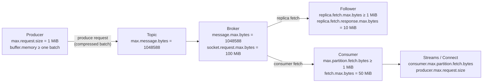
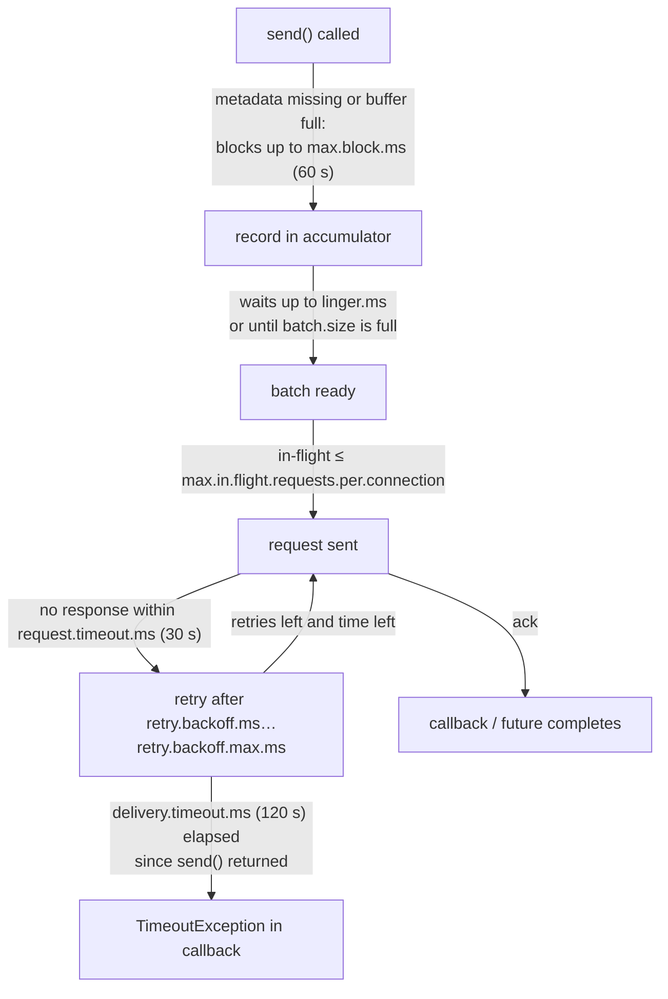
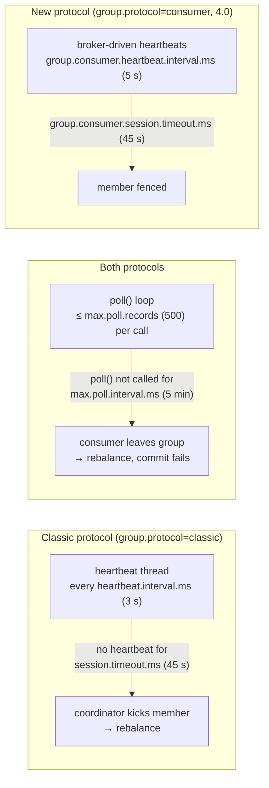
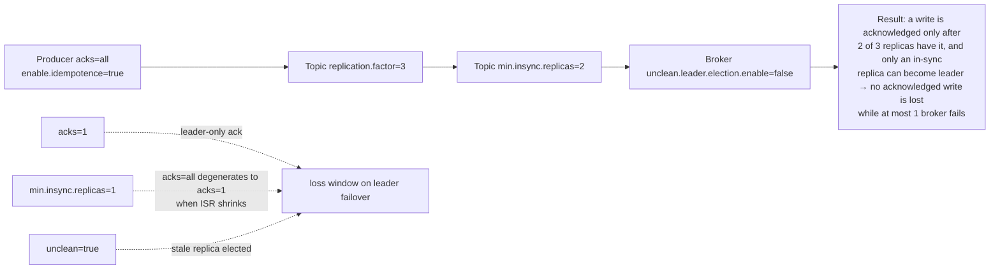

# Configuration Cheatsheet: Broker, Topic, Client, Streams, Connect, MM2, Schema Registry

**Roles:** [ARCH] [ADMIN] [DEV]   **Level:** Reference
**Prerequisites:** [Core concepts](../01-fundamentals/01-core-concepts.md), [CLI cheatsheet](01-cli-cheatsheet.md)

## What you will learn
- The configuration names that matter for each component, with the Apache Kafka 4.0 default and a typical production value
- Which broker settings are dynamic (changeable at runtime with `kafka-configs.sh`) and which need a restart
- How settings chain together across producer, topic, broker and consumer (message size, timeouts, durability, transactions)
- Where Kafka Streams, Connect, MirrorMaker 2 and Schema Registry differ from the raw clients

How to read the tables:

- **Default** is the Apache Kafka 4.0 default unless a version is given. Defaults that changed are noted with the version.
- **Typical prod value** is a starting point for a general-purpose, 3-replica cluster serving mixed workloads. It is not a recommendation for every workload; sizing chapters explain the trade-offs.
- **Dyn** marks broker configs that can be changed at runtime: `C` cluster-wide (`--entity-default`), `B` per broker, `R` read-only (restart required).
- Units: `ms` milliseconds, `B` bytes. `Long.MAX` = 9223372036854775807, `Int.MAX` = 2147483647.

---

## 1. Broker configuration

### 1.1 Identity, roles and KRaft

| Config | Default | Typical prod value | Dyn | Notes |
|--------|---------|--------------------|-----|-------|
| `process.roles` | (none) | `broker` or `controller` (separate) | R | `broker,controller` combined mode is for dev and very small clusters. Required since 4.0 (KRaft only). |
| `node.id` | -1 | unique int per node | R | Replaces `broker.id`; must be unique across brokers **and** controllers. `broker.id` is still accepted as an alias for brokers. |
| `controller.quorum.voters` | (empty) | `1@ctrl-1:9093,2@ctrl-2:9093,3@ctrl-3:9093` | R | Static quorum. Mutually exclusive with `controller.quorum.bootstrap.servers` (dynamic quorum, 3.9 KIP-853). |
| `controller.quorum.bootstrap.servers` | (empty) | `ctrl-1:9093,ctrl-2:9093,ctrl-3:9093` | R | Dynamic quorum (`kraft.version=1`). Voter set lives in the metadata log. |
| `controller.listener.names` | (none) | `CONTROLLER` | R | Listener(s) used for controller traffic; must be in `listener.security.protocol.map`. Brokers need it too (to reach controllers). |
| `metadata.log.dir` | first of `log.dirs` | dedicated disk on controllers | R | Holds `__cluster_metadata-0`. Put it on fast, durable storage. |
| `metadata.log.segment.bytes` | 1073741824 | default | R | 1 GiB segments of the metadata log. |
| `metadata.log.max.record.bytes.between.snapshots` | 20971520 | default | R | Snapshot after 20 MiB of new records. |
| `metadata.log.max.snapshot.interval.ms` | 3600000 | default | R | Or at least every hour. |
| `metadata.max.retention.bytes` / `metadata.max.retention.ms` | 104857600 / 604800000 | default | R | Metadata log retention after snapshots. |
| `controller.quorum.election.timeout.ms` | 1000 | default | R | Follower starts an election if no fetch response from leader within this. |
| `controller.quorum.fetch.timeout.ms` | 2000 | default | R | Leader steps down if a majority has not fetched within this. |
| `controller.quorum.request.timeout.ms` | 2000 | default | R | Raft RPC timeout. |
| `controller.quorum.append.linger.ms` | 25 | default | R | Batching of metadata records before fsync. |
| `broker.heartbeat.interval.ms` | 2000 | default | R | Broker to active controller. |
| `broker.session.timeout.ms` | 9000 | default | R | Broker is fenced after this without heartbeats. |
| `initial.broker.registration.timeout.ms` | 60000 | default | R | Broker exits if it cannot register in time. |
| `unclean.leader.election.interval.ms` | 300000 | default | R | 4.0, KIP-966: how often the controller looks for partitions that may use unclean election. |
| `eligible.leader.replicas.enable` | false | keep false until tested | R | 4.0, KIP-966 ELR. Normally enabled via `kafka-features.sh --feature eligible.leader.replicas.version=1`. |
| `early.start.listeners` | controller listeners | default | R | Listeners that come up before metadata is fully loaded. |
| `server.max.startup.time.ms` | Long.MAX | default | R | Fail fast if startup hangs. |

Removed in 4.0: `zookeeper.connect` and every `zookeeper.*` config, `inter.broker.protocol.version` (use `metadata.version` feature), `log.message.format.version`, `broker.id.generation.enable`, `reserved.broker.max.id`, `control.plane.listener.name`.

### 1.2 Listeners and networking

| Config | Default | Typical prod value | Dyn | Notes |
|--------|---------|--------------------|-----|-------|
| `listeners` | `PLAINTEXT://:9092` | `INTERNAL://0.0.0.0:9092,EXTERNAL://0.0.0.0:9093,CONTROLLER://0.0.0.0:9094` | R | Bind addresses. Listener names are arbitrary; map them to protocols below. |
| `advertised.listeners` | `listeners` | `INTERNAL://broker-1.internal:9092,EXTERNAL://kafka-1.example.com:9093` | B | What clients receive in metadata. Must be reachable from every client network. |
| `listener.security.protocol.map` | `PLAINTEXT:PLAINTEXT,SSL:SSL,SASL_PLAINTEXT:SASL_PLAINTEXT,SASL_SSL:SASL_SSL,CONTROLLER:PLAINTEXT` | `INTERNAL:SASL_SSL,EXTERNAL:SASL_SSL,CONTROLLER:SASL_SSL` | R | Required when listener names are custom. |
| `inter.broker.listener.name` | (none) | `INTERNAL` | R | Replication traffic. Mutually exclusive with `security.inter.broker.protocol`. |
| `num.network.threads` | 3 | 8 (per listener) | C/B | Socket readers/writers. Raise if `NetworkProcessorAvgIdlePercent` < 0.3. |
| `num.io.threads` | 8 | 16 (≥ number of disks) | C/B | Request handlers (disk I/O). Raise if `RequestHandlerAvgIdlePercent` < 0.3. |
| `queued.max.requests` | 500 | default | R | Request queue depth before network threads stop reading. |
| `queued.max.request.bytes` | -1 | default | R | Byte-based bound on the request queue. |
| `socket.send.buffer.bytes` / `socket.receive.buffer.bytes` | 102400 | 1048576 for cross-DC links | R | -1 = OS default. |
| `socket.request.max.bytes` | 104857600 | default | R | Max request size; must exceed `message.max.bytes`. |
| `socket.listen.backlog.size` | 50 | 500 under connection storms | R | 3.6, KIP-902. |
| `max.connections` | Int.MAX | 10000-ish per broker | C/B | Broker-wide connection cap. |
| `max.connections.per.ip` | Int.MAX | 200 | C/B | Protects against client leaks. |
| `max.connections.per.ip.overrides` | (empty) | `"10.0.0.5:1000"` | C/B | Exceptions (proxies, MM2 hosts). |
| `max.connection.creation.rate` | Int.MAX | 100 | C/B | Broker-wide new-connection throttle (KIP-612). |
| `connections.max.idle.ms` | 600000 | default | R | Idle connections are closed after 10 min. |
| `connections.max.reauth.ms` | 0 | 3600000 with OAUTHBEARER | R | Forces SASL re-authentication (KIP-368). |
| `connection.failed.authentication.delay.ms` | 100 | 1000 | R | Slows brute-force attempts. |
| `replica.socket.timeout.ms` | 30000 | default | R | Follower fetch socket timeout. |
| `request.timeout.ms` | 30000 | default | R | Broker-internal client timeout (controller/forwarding). |
| `num.replica.fetchers` | 1 | 4 | C/B | Fetcher threads per source broker. Raise if follower lag grows with idle disks. |
| `background.threads` | 10 | default | C/B | Log cleanup, flush, etc. |
| `num.recovery.threads.per.data.dir` | 1 | number of cores / dirs | C/B | Log recovery on unclean start; also used at shutdown. Raise it to shorten restart time. |

### 1.3 Log, retention and segments

| Config | Default | Typical prod value | Dyn | Notes |
|--------|---------|--------------------|-----|-------|
| `log.dirs` | `/tmp/kafka-logs` | `/data/kafka-1,/data/kafka-2` | R | One entry per disk for JBOD. Never `/tmp`. |
| `log.retention.hours` / `.minutes` / `.ms` | 168 / null / null | `log.retention.ms=604800000` | C | Most specific unit wins. Per-topic override is `retention.ms`. |
| `log.retention.bytes` | -1 | -1 (or per-partition cap) | C | Per **partition**, not per topic. |
| `log.retention.check.interval.ms` | 300000 | default | R | How often retention runs. |
| `log.segment.bytes` | 1073741824 | default | C | Per-topic: `segment.bytes`. Smaller segments = faster retention granularity, more open files. |
| `log.roll.ms` / `log.roll.hours` | null / 168 | default | C | Time-based roll; per-topic `segment.ms`. |
| `log.roll.jitter.ms` | 0 | default | C | Spread rolls to avoid I/O bursts. |
| `log.segment.delete.delay.ms` | 60000 | default | C | Grace period before deleting a segment file. |
| `log.index.interval.bytes` | 4096 | default | C | Bytes between offset index entries. |
| `log.index.size.max.bytes` | 10485760 | default | C | Index size cap (also triggers roll). |
| `log.preallocate` | false | true on Windows only | C | |
| `log.flush.interval.messages` | Long.MAX | default (never fsync explicitly) | C | Durability comes from replication, not fsync. |
| `log.flush.interval.ms` | null | default | C | Same. |
| `log.flush.offset.checkpoint.interval.ms` | 60000 | default | R | Recovery-point checkpoint. |
| `log.message.timestamp.type` | `CreateTime` | `CreateTime` (`LogAppendTime` for audit topics) | C | Per-topic `message.timestamp.type`. |
| `log.message.timestamp.before.max.ms` / `.after.max.ms` | Long.MAX / Long.MAX | `before` = 7 d for retention safety | C | 3.6, KIP-937; replaces `log.message.timestamp.difference.max.ms` (removed in 4.0). Rejects records with wild timestamps. |
| `message.max.bytes` | 1048588 | 1048588 (raise per topic instead) | C | Batch size limit after compression. See §10.1. |
| `compression.type` | `producer` | `producer` | C | Broker recompresses if set to a codec; costs CPU. |
| `log.cleanup.policy` | `delete` | default | C | Per-topic `cleanup.policy`; `compact,delete` allowed. |
| `num.partitions` | 1 | 6 (only matters with auto-create) | C | |
| `default.replication.factor` | 1 | 3 | C | Used by auto-created topics and by Streams/Connect with `replication.factor=-1`. |
| `auto.create.topics.enable` | true | **false** | C | Typos create topics with 1 partition/RF 1 otherwise. |
| `delete.topic.enable` | true | true | C | |
| `log.dir.failure.timeout.ms` | 30000 | default | R | 3.7: broker shuts down if it cannot report a failed dir to the controller in time. |
| `log.initial.task.delay.ms` | 30000 | default | R | Delay before first retention/cleaner pass after startup. |

### 1.4 Replication and durability

| Config | Default | Typical prod value | Dyn | Notes |
|--------|---------|--------------------|-----|-------|
| `min.insync.replicas` | 1 | **2** | C | With `acks=all`, producer fails if fewer replicas are in sync. Per-topic override. |
| `unclean.leader.election.enable` | false | false | C | true = availability over durability. Per-topic override. |
| `replica.lag.time.max.ms` | 30000 | 30000 (10000 for tight SLAs) | R | Follower drops out of ISR after this without catching up. |
| `replica.fetch.max.bytes` | 1048576 | ≥ largest `max.message.bytes` | R | Per partition per fetch; a batch larger than this is still fetched (one at a time) since 0.10.1. |
| `replica.fetch.response.max.bytes` | 10485760 | default | R | Whole fetch response cap. |
| `replica.fetch.min.bytes` / `replica.fetch.wait.max.ms` | 1 / 500 | default | R | Follower long-poll. |
| `replica.fetch.backoff.ms` | 1000 | default | R | Backoff after a fetch error. |
| `replica.high.watermark.checkpoint.interval.ms` | 5000 | default | R | |
| `replica.selector.class` | null | `org.apache.kafka.common.replica.RackAwareReplicaSelector` | R | Enables fetch-from-follower (KIP-392) for consumers with `client.rack`. |
| `broker.rack` | null | `az1` | R | Rack-aware replica placement and follower fetching. |
| `auto.leader.rebalance.enable` | true | true | R | Preferred leader election on a schedule. |
| `leader.imbalance.check.interval.seconds` | 300 | default | R | |
| `leader.imbalance.per.broker.percentage` | 10 | default | R | |
| `controlled.shutdown.enable` | true | true | R | Leaders are moved before the broker stops. |
| `leader.replication.throttled.rate` / `follower.replication.throttled.rate` | (none) | set by reassignment tool | B | Bytes/s. Applies only to replicas listed in the topic-level throttled-replicas configs. |
| `replica.alter.log.dirs.io.max.bytes.per.second` | Long.MAX | set during JBOD moves | B | |
| `max.incremental.fetch.session.cache.slots` | 1000 | default | R | Fetch sessions (KIP-227). Raise for thousands of consumers per broker. |
| `fetch.max.bytes` | 57671680 | default | R | Broker-side cap on any fetch response (55 MiB). |
| `max.request.partition.size.limit` | 2000 | default | R | Max partitions per Fetch request; protects the broker from oversized fetch requests. |

### 1.5 Group coordinator, offsets and transactions

| Config | Default | Typical prod value | Dyn | Notes |
|--------|---------|--------------------|-----|-------|
| `offsets.topic.num.partitions` | 50 | 50 | R | Cannot be changed after creation. |
| `offsets.topic.replication.factor` | 3 | 3 | R | Topic creation fails until this many brokers are up. |
| `offsets.topic.segment.bytes` | 104857600 | default | R | Small segments compact faster. |
| `offsets.retention.minutes` | 10080 | 10080 (7 d); 43200 for batch groups | R | Offsets of **empty** groups expire after this (KIP-211 semantics). |
| `offsets.retention.check.interval.ms` | 600000 | default | R | |
| `offsets.commit.timeout.ms` | 5000 | default | R | |
| `offsets.load.buffer.size` | 5242880 | default | R | |
| `group.initial.rebalance.delay.ms` | 3000 | 3000 | R | Wait for more members before the first rebalance of a new group. |
| `group.min.session.timeout.ms` / `group.max.session.timeout.ms` | 6000 / 1800000 | default | R | Bounds for classic `session.timeout.ms`. |
| `group.max.size` | Int.MAX | default | R | |
| `group.coordinator.rebalance.protocols` | `classic,consumer` | `classic,consumer` | R | 4.0: enables KIP-848. Add `share` for share groups (EA). |
| `group.consumer.session.timeout.ms` | 45000 | default | R | KIP-848 groups: server-side session timeout. |
| `group.consumer.heartbeat.interval.ms` | 5000 | default | R | KIP-848 groups: server-driven heartbeat. |
| `group.consumer.max.session.timeout.ms` / `min` | 60000 / 45000 | default | R | Bounds for per-group override. |
| `group.consumer.assignors` | uniform, range | default | R | Server-side assignors for KIP-848. |
| `group.consumer.max.size` | Int.MAX | default | R | |
| `group.coordinator.threads` | 1 | 4 on busy clusters | R | 3.7+ new coordinator runtime threads. |
| `group.coordinator.append.linger.ms` | 5 | default | R | 4.0: batching of coordinator writes. |
| `transaction.state.log.num.partitions` | 50 | 50 | R | |
| `transaction.state.log.replication.factor` | 3 | 3 | R | |
| `transaction.state.log.min.isr` | 2 | 2 | R | |
| `transaction.state.log.segment.bytes` | 104857600 | default | R | |
| `transaction.max.timeout.ms` | 900000 | 900000 | R | Upper bound on producer `transaction.timeout.ms`. |
| `transactional.id.expiration.ms` | 604800000 | default | R | Idle transactional ids are forgotten after 7 d. |
| `transaction.abort.timed.out.transaction.cleanup.interval.ms` | 10000 | default | R | |
| `transaction.remove.expired.transaction.cleanup.interval.ms` | 3600000 | default | R | |
| `transaction.partition.verification.enable` | true | true | C | 3.6, KIP-890 part 1: verifies a partition was added to the transaction before writing. |
| `producer.id.expiration.ms` | 86400000 | default | C | Idempotent producer state kept 24 h after last write. |
| `producer.id.expiration.check.interval.ms` | 600000 | default | R | |

### 1.6 Quotas

| Config | Default | Typical prod value | Dyn | Notes |
|--------|---------|--------------------|-----|-------|
| `quota.window.num` | 11 | default | R | Samples retained for client quotas. |
| `quota.window.size.seconds` | 1 | default | R | |
| `replication.quota.window.num` / `.size.seconds` | 11 / 1 | default | R | |
| `controller.quota.window.num` / `.size.seconds` | 11 / 1 | default | R | For `controller_mutation_rate`. |
| `client.quota.callback.class` | null | custom | R | Plug in tenant-aware quotas (KIP-257). |
| `producer_byte_rate` / `consumer_byte_rate` / `request_percentage` / `controller_mutation_rate` | unlimited | per client via `kafka-configs.sh` | C | Entity configs, not broker properties. Per broker, not cluster-wide. |
| `connection_creation_rate` | unlimited | per IP | C | `--entity-type ips`. |

### 1.7 Security

| Config | Default | Typical prod value | Dyn | Notes |
|--------|---------|--------------------|-----|-------|
| `security.inter.broker.protocol` | `PLAINTEXT` | (use `inter.broker.listener.name`) | R | |
| `sasl.enabled.mechanisms` | `GSSAPI` | `SCRAM-SHA-512,OAUTHBEARER` | B | Per-listener: `listener.name.<l>.sasl.enabled.mechanisms`. |
| `sasl.mechanism.inter.broker.protocol` | `GSSAPI` | `SCRAM-SHA-512` | R | |
| `sasl.mechanism.controller.protocol` | `GSSAPI` | `SCRAM-SHA-512` | R | Broker → controller auth. |
| `listener.name.<l>.<mech>.sasl.jaas.config` | null | per listener | B | Preferred over a JAAS file. |
| `sasl.server.callback.handler.class` / `sasl.login.callback.handler.class` | null | OAuth validators | R | OIDC: `OAuthBearerValidatorCallbackHandler` + `sasl.oauthbearer.jwks.endpoint.url`. |
| `ssl.keystore.location` / `.password` / `.type` | null / null / `JKS` | PKCS12 or PEM | B | Per listener: `listener.name.<l>.ssl.keystore.location`. |
| `ssl.truststore.location` / `.password` / `.type` | null / null / `JKS` | PKCS12 or PEM | B | |
| `ssl.client.auth` | `none` | `required` on mTLS listeners | B | `requested` breaks nothing but authenticates nothing. |
| `ssl.enabled.protocols` | `TLSv1.2,TLSv1.3` | `TLSv1.3` | B | |
| `ssl.protocol` | `TLSv1.3` | default | B | |
| `ssl.cipher.suites` | null (JVM) | restrict for compliance | B | |
| `ssl.endpoint.identification.algorithm` | `https` | `https` | B | Empty string disables hostname verification. |
| `ssl.principal.mapping.rules` | `DEFAULT` | `RULE:^CN=([^,]+).*$/$1/,DEFAULT` | R | DN → principal name. |
| `ssl.secure.random.implementation` | null | default | R | |
| `authorizer.class.name` | (empty) | `org.apache.kafka.metadata.authorizer.StandardAuthorizer` | R | KRaft authorizer; `kafka.security.authorizer.AclAuthorizer` (ZK) removed in 4.0. |
| `super.users` | (empty) | `User:admin;User:CN=broker-1,...` | R | Semicolon-separated. Brokers' own principals should be super users. |
| `allow.everyone.if.no.acl.found` | false | false | R | |
| `principal.builder.class` | `DefaultKafkaPrincipalBuilder` | default | R | |
| `delegation.token.secret.key` | null | random 32+ bytes, same on all brokers | R | Enables delegation tokens (SCRAM required). |
| `delegation.token.max.lifetime.ms` / `.expiry.time.ms` | 604800000 / 86400000 | default | R | |
| `sasl.kerberos.service.name` | null | `kafka` | R | |
| `security.providers` | null | custom | R | |

### 1.8 Log cleaner (compaction)

| Config | Default | Typical prod value | Dyn | Notes |
|--------|---------|--------------------|-----|-------|
| `log.cleaner.enable` | true | true | R | Required for `__consumer_offsets`. |
| `log.cleaner.threads` | 1 | 2–4 | C/B | One thread cleans one log at a time. |
| `log.cleaner.dedupe.buffer.size` | 134217728 | 268435456+ for large compacted topics | C/B | Total across threads; 24 B per key in the offset map. Undersized = many passes (`cleaner-recopy-percent` high). |
| `log.cleaner.io.buffer.size` | 524288 | default | C/B | |
| `log.cleaner.io.buffer.load.factor` | 0.9 | default | C/B | |
| `log.cleaner.io.max.bytes.per.second` | Double.MAX | throttle on shared disks | C/B | |
| `log.cleaner.backoff.ms` | 15000 | default | C/B | Sleep when nothing to clean. |
| `log.cleaner.min.cleanable.ratio` | 0.5 | 0.5 (0.1–0.3 for state topics) | C | Per-topic `min.cleanable.dirty.ratio`. |
| `log.cleaner.min.compaction.lag.ms` | 0 | default | C | Per-topic `min.compaction.lag.ms`: records younger than this are never compacted. |
| `log.cleaner.max.compaction.lag.ms` | Long.MAX | default | C | Per-topic `max.compaction.lag.ms`: forces compaction of old dirty data (GDPR). |
| `log.cleaner.delete.retention.ms` | 86400000 | default | C | Per-topic `delete.retention.ms`: tombstone lifetime after the segment is cleaned. |

### 1.9 Tiered storage (3.6 EA, 3.9 GA; KIP-405)

| Config | Default | Typical prod value | Dyn | Notes |
|--------|---------|--------------------|-----|-------|
| `remote.log.storage.system.enable` | false | true (cluster-wide, once) | R | Cannot be disabled while any topic has `remote.storage.enable=true`. |
| `remote.log.storage.manager.class.name` | null | plugin class (S3/GCS/Azure) | R | Plugin-specific `rsm.config.*` keys. |
| `remote.log.metadata.manager.class.name` | `TopicBasedRemoteLogMetadataManager` | default | R | Uses `__remote_log_metadata` topic. |
| `remote.log.metadata.manager.listener.name` | null | `INTERNAL` | R | |
| `remote.log.manager.copier.thread.pool.size` / `.expiration.thread.pool.size` | 10 / 10 | default | C | 3.9 split of the former `remote.log.manager.thread.pool.size`. |
| `remote.log.reader.threads` | 10 | default | C | |
| `remote.log.reader.max.pending.tasks` | 100 | default | R | |
| `remote.log.manager.copy.max.bytes.per.second` / `.fetch.max.bytes.per.second` | Long.MAX | throttle | C | 3.9, KIP-956 quotas. |
| `remote.log.index.file.cache.total.size.bytes` | 1073741824 | default | C | |
| `log.local.retention.ms` / `log.local.retention.bytes` | -2 / -2 | e.g. 21600000 (6 h) | C | -2 = same as full retention. Per-topic `local.retention.ms/bytes`. |

### 1.10 Metrics and misc

| Config | Default | Typical prod value | Dyn | Notes |
|--------|---------|--------------------|-----|-------|
| `metric.reporters` | (empty) | Prometheus/OTel reporter class | C | JMX reporter is always on unless `auto.include.jmx.reporter=false` (deprecated in 4.0; use `metric.reporters` explicitly). |
| `metrics.num.samples` / `metrics.sample.window.ms` | 2 / 30000 | default | R | |
| `metrics.recording.level` | `INFO` | `INFO` | R | |
| `kafka.metrics.reporters` | (empty) | — | R | Legacy Yammer reporters. |
| `telemetry.max.bytes` | 1048576 | default | R | 3.7, KIP-714 client-metrics payload cap. |
| `client.metrics.*` | via `kafka-configs.sh --entity-type client-metrics` | | C | Subscriptions, not broker properties. |
| `unstable.api.versions.enable` / `unstable.feature.versions.enable` | false | false | R | Only for testing early-access features (share groups in 4.0). |

---

## 2. Topic-level configuration

| Config | Default (broker fallback) | Typical prod value | Notes |
|--------|---------------------------|--------------------|-------|
| `cleanup.policy` | `delete` (`log.cleanup.policy`) | `delete`; `compact` for state | `compact,delete` = compact **and** expire by time. |
| `retention.ms` | 604800000 (`log.retention.ms`) | per topic | -1 = infinite. |
| `retention.bytes` | -1 (`log.retention.bytes`) | -1 or cap | Per partition. |
| `segment.bytes` | 1073741824 | default; 104857600 on compacted topics | Smaller = faster compaction and retention, more files. |
| `segment.ms` | 604800000 (`log.roll.ms`) | default; 86400000 for low-volume topics with time retention | Time retention can only delete rolled segments. |
| `segment.jitter.ms` | 0 | default | |
| `segment.index.bytes` | 10485760 | default | |
| `min.insync.replicas` | 1 (`min.insync.replicas`) | 2 | Effective only with `acks=all`. |
| `unclean.leader.election.enable` | false | false | |
| `max.message.bytes` | 1048588 (`message.max.bytes`) | per topic | |
| `compression.type` | `producer` (`compression.type`) | `producer` | `gzip`, `snappy`, `lz4`, `zstd`, `uncompressed`, `producer`. |
| `compression.gzip.level` / `compression.lz4.level` / `compression.zstd.level` | -1 / 9 / 3 | default | 3.8, KIP-390; only apply when the broker recompresses. |
| `message.timestamp.type` | `CreateTime` | `CreateTime` | |
| `message.timestamp.before.max.ms` / `.after.max.ms` | Long.MAX | | 3.6, KIP-937. |
| `min.cleanable.dirty.ratio` | 0.5 | 0.1–0.5 | Lower = more frequent compaction, more I/O. |
| `min.compaction.lag.ms` | 0 | 0 | Guarantee a read window for unconsolidated data. |
| `max.compaction.lag.ms` | Long.MAX | 7 d for GDPR topics | |
| `delete.retention.ms` | 86400000 | ≥ longest consumer downtime | Tombstones must survive until every consumer has seen them. |
| `file.delete.delay.ms` | 60000 | default | |
| `flush.messages` / `flush.ms` | Long.MAX | default | Do not force fsync. |
| `index.interval.bytes` | 4096 | default | |
| `preallocate` | false | default | |
| `follower.replication.throttled.replicas` / `leader.replication.throttled.replicas` | (empty) | set by reassignment | `*` or `partition:broker` list. |
| `remote.storage.enable` | false | per topic | Cannot be disabled before 3.9 (`remote.log.copy.disable`, `remote.log.delete.on.disable`, KIP-950). |
| `local.retention.ms` / `local.retention.bytes` | -2 | e.g. 6 h | Hot set kept on local disk. |
| `message.downconversion.enable` | true | true | Deprecated: only affects very old clients, which 4.0 no longer accepts. |

---

## 3. Producer configuration

| Config | Default | Typical prod value | Notes |
|--------|---------|--------------------|-------|
| `bootstrap.servers` | (none) | 3+ brokers across AZs | Only used for initial metadata. |
| `key.serializer` / `value.serializer` | (none) | e.g. `StringSerializer`, `KafkaAvroSerializer` | |
| `client.id` | (empty) | `<app>-<instance>` | Appears in quotas, logs, metrics. |
| `acks` | `all` (since 3.0; `1` before) | `all` | `0`, `1`, `all`/`-1`. |
| `enable.idempotence` | true (since 3.0) | true | Requires `acks=all`, `retries>0`, `max.in.flight.requests.per.connection<=5`. |
| `retries` | Int.MAX | default | Bounded by `delivery.timeout.ms`. |
| `max.in.flight.requests.per.connection` | 5 | 5 | Ordering preserved with idempotence up to 5. |
| `delivery.timeout.ms` | 120000 | 120000 | Upper bound for `send()` completion; must be ≥ `linger.ms + request.timeout.ms`. |
| `request.timeout.ms` | 30000 | 30000 | Per request. |
| `linger.ms` | 0 | 5–100 | Wait for batching. KIP-1030 proposes 5 as the future default. |
| `batch.size` | 16384 | 65536–262144 | Per partition; upper bound of a batch, not a minimum. |
| `buffer.memory` | 33554432 | 64–128 MiB for high-throughput | Total accumulator memory. |
| `max.block.ms` | 60000 | 60000 | `send()`/`partitionsFor()` block cap when buffer is full or metadata missing. |
| `max.request.size` | 1048576 | ≤ topic `max.message.bytes` | Size of one produce request (batch, compressed). |
| `compression.type` | `none` | `lz4` or `zstd` | `compression.<codec>.level` since 3.8. |
| `partitioner.class` | null (built-in uniform sticky) | default | `DefaultPartitioner`/`UniformStickyPartitioner` classes removed in 4.0. |
| `partitioner.adaptive.partitioning.enable` | true | true | 3.3, KIP-794: prefers faster brokers for key-less records. |
| `partitioner.availability.timeout.ms` | 0 | 0 | |
| `partitioner.ignore.keys` | false | false | |
| `transactional.id` | null | `<app>-<stable-instance-id>` | Enables transactions; needs `enable.idempotence=true`. |
| `transaction.timeout.ms` | 60000 | 60000 (≤ broker `transaction.max.timeout.ms`) | Coordinator aborts after this. |
| `retry.backoff.ms` / `retry.backoff.max.ms` | 100 / 1000 | default | 3.7, KIP-580 exponential backoff. |
| `reconnect.backoff.ms` / `reconnect.backoff.max.ms` | 50 / 1000 | default | |
| `metadata.max.age.ms` | 300000 | default | Forced metadata refresh. |
| `metadata.max.idle.ms` | 300000 | default | Forget idle topics. |
| `metadata.recovery.strategy` | `rebootstrap` (4.0; `none` in 3.8/3.9) | `rebootstrap` | KIP-899/1102: re-resolve `bootstrap.servers` if all known brokers vanish. |
| `metadata.recovery.rebootstrap.trigger.ms` | 300000 | default | 4.0. |
| `connections.max.idle.ms` | 540000 | default | |
| `send.buffer.bytes` / `receive.buffer.bytes` | 131072 / 32768 | -1 (OS) on WAN | |
| `interceptor.classes` | (empty) | tracing | |
| `enable.metrics.push` | true | true | 3.7, KIP-714. |
| `security.protocol` + `sasl.*` / `ssl.*` | `PLAINTEXT` | `SASL_SSL` | See client templates in the CLI cheatsheet. |

---

## 4. Consumer configuration

| Config | Default | Typical prod value | Notes |
|--------|---------|--------------------|-------|
| `bootstrap.servers` | (none) | 3+ brokers | |
| `group.id` | null | `<app>` | Required for `subscribe()` and offset commits. |
| `group.instance.id` | null | `<app>-<pod-ordinal>` | Static membership (KIP-345). |
| `group.protocol` | `classic` | `consumer` once brokers are 4.0 | 4.0, KIP-848. `consumer` moves assignment to the broker. |
| `group.remote.assignor` | null (broker default `uniform`) | `uniform` | KIP-848 only. |
| `key.deserializer` / `value.deserializer` | (none) | | |
| `enable.auto.commit` | true | false for at-least-once with manual commit | |
| `auto.commit.interval.ms` | 5000 | 5000 | |
| `auto.offset.reset` | `latest` | `earliest` for most apps | Also `none`; 4.0 adds `by_duration:PT1H` (KIP-1106). |
| `fetch.min.bytes` | 1 | 1 (raise to reduce broker load) | |
| `fetch.max.wait.ms` | 500 | 500 | Long-poll wait when `fetch.min.bytes` is not satisfied. |
| `fetch.max.bytes` | 52428800 | default | Whole response cap (soft). |
| `max.partition.fetch.bytes` | 1048576 | ≥ largest message | Per partition per fetch (soft: first batch always returned). |
| `max.poll.records` | 500 | 100–500 | Records per `poll()`; does not affect fetch size. |
| `max.poll.interval.ms` | 300000 | sized to worst-case processing of `max.poll.records` | Consumer leaves the group if `poll()` is not called in time. |
| `session.timeout.ms` | 45000 (since 3.0) | 45000 | Classic protocol; must be within broker `group.min/max.session.timeout.ms`. Ignored by `group.protocol=consumer`. |
| `heartbeat.interval.ms` | 3000 | 3000 (≤ 1/3 of session timeout) | Classic protocol only. |
| `partition.assignment.strategy` | `RangeAssignor, CooperativeStickyAssignor` | `CooperativeStickyAssignor` | Classic protocol only. |
| `isolation.level` | `read_uncommitted` | `read_committed` for transactional topics | |
| `client.rack` | (empty) | `az1` | Fetch from nearest replica (KIP-392). |
| `allow.auto.create.topics` | true | false | |
| `exclude.internal.topics` | true | true | |
| `check.crcs` | true | true | |
| `default.api.timeout.ms` | 60000 | default | For `commitSync()`, `position()` without explicit timeout. |
| `request.timeout.ms` | 30000 | default | |
| `metadata.max.age.ms` | 300000 | default | |
| `receive.buffer.bytes` / `send.buffer.bytes` | 65536 / 131072 | | |
| `retry.backoff.ms` / `retry.backoff.max.ms` | 100 / 1000 | | |
| `interceptor.classes` | (empty) | | |
| `enable.metrics.push` | true | true | |
| `metadata.recovery.strategy` | `rebootstrap` (4.0) | | |
| `share.acknowledgement.mode` | `implicit` | | Share consumer (KIP-932), 4.1. |

---

## 5. Kafka Streams configuration

| Config | Default | Typical prod value | Notes |
|--------|---------|--------------------|-------|
| `application.id` | (none) | `<app>` | Becomes `group.id`, `client.id` prefix, internal topic prefix. |
| `bootstrap.servers` | (none) | | |
| `num.stream.threads` | 1 | cores per instance (≤ total tasks) | |
| `processing.guarantee` | `at_least_once` | `exactly_once_v2` when needed | `exactly_once` (v1) and `exactly_once_beta` removed in 4.0. |
| `commit.interval.ms` | 30000 (100 with EOS) | default | Also the flush interval for caches and changelogs. |
| `statestore.cache.max.bytes` | 10485760 | 100 MiB+ per instance | 3.4, replaces `cache.max.bytes.buffering` (removed 4.0). Shared across threads. |
| `input.buffer.max.bytes` | 536870912 | default | 3.4, replaces `buffered.records.per.partition`. |
| `state.dir` | `/${java.io.tmpdir}/kafka-streams` | persistent volume | RocksDB and checkpoints live here. |
| `replication.factor` | -1 (broker default, since 3.0) | -1 or 3 | Internal topics. |
| `num.standby.replicas` | 0 | 1 for stateful apps | Faster failover; doubles state storage. |
| `acceptable.recovery.lag` | 10000 | default | Task is assigned to a "warm" instance if lag below this. |
| `max.warmup.replicas` | 2 | default | |
| `probing.rebalance.interval.ms` | 600000 | default | |
| `rack.aware.assignment.tags` | (empty) | `zone` | With `client.tag.zone=az1` for standby distribution. |
| `rack.aware.assignment.strategy` | `none` | `min_traffic` | 3.6, KIP-925. |
| `task.assignor.class` | null (HighAvailabilityTaskAssignor) | default | 3.8, KIP-924. |
| `max.task.idle.ms` | 0 | 0 (or >0 for strict time ordering across inputs) | -1 disables idling entirely. |
| `default.key.serde` / `default.value.serde` | null | explicit per operator | Since 3.0 no default. |
| `default.timestamp.extractor` | `FailOnInvalidTimestamp` | `LogAndSkipOnInvalidTimestamp` or custom | |
| `default.deserialization.exception.handler` | `LogAndFailExceptionHandler` | `LogAndContinueExceptionHandler` + DLQ | 4.0 renames to `deserialization.exception.handler` (old name deprecated). |
| `default.production.exception.handler` | `DefaultProductionExceptionHandler` | custom | 4.0: `production.exception.handler`. |
| `processing.exception.handler` | `LogAndFailProcessingExceptionHandler` | custom | 3.9, KIP-1033. |
| `default.dsl.store` | `rocksDB` | default | `in_memory` for small state. |
| `dsl.store.suppliers.class` | `BuiltInDslStoreSuppliers.RocksDBDslStoreSuppliers` | | 3.7, KIP-954. |
| `rocksdb.config.setter` | null | class bounding block cache and write buffers | Required in production to cap RocksDB memory. |
| `topology.optimization` | `none` | `all` | `reuse.ktable.source.topics,merge.repartition.topics,single.store.self.join`. |
| `windowstore.changelog.additional.retention.ms` | 86400000 | default | |
| `window.size.ms` | null | | Only for the deserializer of windowed keys in plain consumers. |
| `poll.ms` | 100 | default | |
| `task.timeout.ms` | 300000 | default | Retries on transient errors before the task fails. |
| `repartition.purge.interval.ms` | 30000 | default | |
| `state.cleanup.delay.ms` | 600000 | default | |
| `upgrade.from` | null | set during rolling upgrades from < 2.4 or across protocol changes | |
| `metrics.recording.level` | `INFO` | `INFO` (`DEBUG` for RocksDB details) | |
| `log.summary.interval.ms` | 120000 | default | 3.7 processing summary log line. |
| `enable.metrics.push` | true | | KIP-1076. |
| `group.protocol` | `classic` | `streams` (4.1 EA, KIP-1071) | Broker-side Streams rebalance protocol. |
| `ensure.explicit.internal.resource.naming` | false | true for new apps | 4.1, KIP-1111: refuses to start if internal topics/stores are not named. |
| `producer.*` / `consumer.*` / `main.consumer.*` / `restore.consumer.*` / `global.consumer.*` / `admin.*` | | e.g. `producer.linger.ms=50` | Prefixes for embedded clients. |

EOS v2 sets: `producer.enable.idempotence=true`, `producer.transactional.id=<app>-<thread>`, `consumer.isolation.level=read_committed`, `commit.interval.ms=100` default. Requires brokers ≥ 2.5.

---

## 6. Kafka Connect worker configuration

| Config | Default | Typical prod value | Notes |
|--------|---------|--------------------|-------|
| `bootstrap.servers` | `localhost:9092` | | |
| `group.id` | `connect-cluster` | `connect-<env>-<purpose>` | Distinct per Connect cluster; must not collide with consumer groups. |
| `config.storage.topic` / `offset.storage.topic` / `status.storage.topic` | (none) | `connect-configs`, `connect-offsets`, `connect-status` | Must be unique per Connect cluster. `config` topic needs exactly 1 partition, compacted. |
| `config.storage.replication.factor` / `offset.storage.replication.factor` / `status.storage.replication.factor` | 3 | 3 | -1 = broker default. |
| `offset.storage.partitions` | 25 | 25 | |
| `status.storage.partitions` | 5 | 5 | |
| `key.converter` / `value.converter` | (none) | `AvroConverter`/`JsonConverter`/`StringConverter` | Worker default; connectors may override. |
| `key.converter.schemas.enable` / `value.converter.schemas.enable` | true (JsonConverter) | false for plain JSON | |
| `header.converter` | `SimpleHeaderConverter` | default | |
| `plugin.path` | null | `/usr/share/kafka/plugins` | Comma-separated directories; one subdirectory per plugin. |
| `plugin.discovery` | `hybrid_warn` | `service_load` | 3.6, KIP-898. `service_load` requires manifests; fastest startup. |
| `listeners` | `http://:8083` | `https://0.0.0.0:8083` | |
| `rest.advertised.host.name` / `rest.advertised.port` / `rest.advertised.listener` | null | resolvable host | Used for forwarding requests to the leader worker. |
| `admin.listeners` | null | separate port for `/admin/*` | |
| `offset.flush.interval.ms` | 60000 | 10000–60000 | Source offset commit interval. |
| `offset.flush.timeout.ms` | 5000 | default | |
| `task.shutdown.graceful.timeout.ms` | 5000 | default | |
| `connector.client.config.override.policy` | `All` (since 3.0) | `All` or `Principal` | Allows `producer.override.*` in connector configs. |
| `connect.protocol` | `sessioned` | default | Incremental cooperative rebalancing (KIP-415). |
| `scheduled.rebalance.max.delay.ms` | 300000 | default | Wait before reassigning tasks of a lost worker. |
| `session.timeout.ms` / `heartbeat.interval.ms` / `rebalance.timeout.ms` | 10000 / 3000 / 60000 | default | Worker group membership. |
| `worker.sync.timeout.ms` / `worker.unsync.backoff.ms` | 3000 / 300000 | default | |
| `exactly.once.source.support` | `disabled` | `enabled` (after `preparing` round) | 3.3, KIP-618. |
| `topic.creation.enable` | true | true | Source connectors may create topics (KIP-158). |
| `topic.tracking.enable` / `topic.tracking.allow.reset` | true / true | default | `/connectors/{n}/topics` endpoint. |
| `config.providers` | (empty) | `file,env,vault` | `config.providers.file.class=org.apache.kafka.common.config.provider.FileConfigProvider`. |
| `producer.*` / `consumer.*` / `admin.*` | | `producer.compression.type=lz4`, `consumer.max.poll.records=1000` | Defaults for embedded clients. |
| `rest.extension.classes` | (empty) | auth extension | |
| `response.http.headers.config` | (empty) | security headers | |
| `metric.reporters` | (empty) | | |
| `ssl.*` for REST | | with `listeners=https://` | `ssl.client.auth=required` for mTLS REST. |

Standalone mode additionally needs `offset.storage.file.filename`.

---

## 7. Connector common configuration

| Config | Default | Typical prod value | Notes |
|--------|---------|--------------------|-------|
| `name` | (none) | | Unique in the Connect cluster. |
| `connector.class` | (none) | FQCN or alias | |
| `tasks.max` | 1 | ≤ partitions (sink) or source parallelism | |
| `tasks.max.enforce` | true | true | 3.8, KIP-1004. |
| `key.converter` / `value.converter` / `header.converter` | worker default | | Plus `*.converter.<prop>` passthrough (e.g. `value.converter.schema.registry.url`). |
| `topics` / `topics.regex` | (none) | sink only, one of the two | |
| `errors.tolerance` | `none` | `all` with DLQ | `none` = fail task on first error. |
| `errors.retry.timeout` | 0 | 60000 | Total time to retry a failed operation (-1 = infinite). |
| `errors.retry.delay.max.ms` | 60000 | default | |
| `errors.log.enable` | false | true | |
| `errors.log.include.messages` | false | true (careful with PII) | |
| `errors.deadletterqueue.topic.name` | (empty) | `dlq.<connector>` | Sink only. |
| `errors.deadletterqueue.topic.replication.factor` | 3 | 3 | |
| `errors.deadletterqueue.context.headers.enable` | false | true | Adds `__connect.errors.*` headers. |
| `transforms` | (empty) | `unwrap,route` | Ordered list of SMT aliases. |
| `transforms.<alias>.type` | | e.g. `org.apache.kafka.connect.transforms.RegexRouter` | Plus `transforms.<alias>.<prop>`. |
| `predicates` / `transforms.<alias>.predicate` / `transforms.<alias>.negate` | | | KIP-585 conditional SMTs. |
| `config.action.reload` | `restart` | default | On config-provider change. |
| `exactly.once.support` | `requested` | `required` for EOS sources | Source only (KIP-618). |
| `transaction.boundary` | `poll` | `poll` or `interval` | Source only. `transaction.boundary.interval.ms` with `interval`. |
| `offsets.storage.topic` | null | | Source only: per-connector offsets topic (needed for EOS with a different cluster). |
| `topic.creation.groups` / `topic.creation.default.partitions` / `topic.creation.default.replication.factor` | | `default.partitions=6`, `replication.factor=3` | Source only. |
| `producer.override.*` / `consumer.override.*` / `admin.override.*` | | `producer.override.linger.ms=100` | Requires the override policy on the worker. |
| `consumer.override.auto.offset.reset` | `earliest` (Connect default) | | Sinks read from earliest by default, unlike raw consumers. |

Sink task consumer group id is `connect-<connector name>`; sink offsets are ordinary committed offsets.

---

## 8. MirrorMaker 2 configuration

| Config | Default | Typical prod value | Notes |
|--------|---------|--------------------|-------|
| `clusters` | (none) | `primary, dr` | Aliases. |
| `<alias>.bootstrap.servers` | (none) | | Plus `<alias>.security.protocol` etc. |
| `<src>-><tgt>.enabled` | false | true | One flow per direction. |
| `<src>-><tgt>.topics` / `topics` | `.*` | explicit list or regex | |
| `topics.exclude` | `.*[\-\.]internal, .*\.replica, __.*` | default + `connect-.*` | |
| `groups` / `groups.exclude` | `.*` / `console-consumer-.*, connect-.*, __.*` | | |
| `replication.factor` | 2 | 3 | For replicated topics on the target. |
| `replication.policy.class` | `DefaultReplicationPolicy` | `IdentityReplicationPolicy` for same-name topics | Default prefixes `primary.orders`. |
| `replication.policy.separator` | `.` | `.` | |
| `replication.policy.internal.topic.separator.enabled` | true | | 3.x. |
| `sync.topic.configs.enabled` / `.interval.seconds` | true / 600 | | |
| `sync.topic.acls.enabled` | true | false if ACLs differ per cluster | |
| `refresh.topics.enabled` / `.interval.seconds` | true / 600 | 600 | New topics are picked up on this interval. |
| `refresh.groups.enabled` / `.interval.seconds` | true / 600 | | |
| `emit.heartbeats.enabled` / `.interval.seconds` | true / 1 | | `heartbeats` topic. |
| `emit.checkpoints.enabled` / `.interval.seconds` | true / 60 | 30 | `<src>.checkpoints.internal` topic. |
| `sync.group.offsets.enabled` / `.interval.seconds` | false / 60 | true / 60 | Writes translated offsets into target `__consumer_offsets` for inactive groups. |
| `offset.lag.max` | 100 | default | Offset-sync emission granularity. |
| `offset-syncs.topic.location` | `source` | `target` when source is read-only | 3.x. |
| `checkpoints.topic.replication.factor` / `heartbeats.topic.replication.factor` / `offset-syncs.topic.replication.factor` | 3 | 3 | |
| `tasks.max` | 1 | number of partitions / 8 | Per connector. |
| `config.properties.exclude` | `follower\.replication\.throttled\.replicas, leader\.replication\.throttled\.replicas, message\.timestamp\.difference\.max\.ms, message\.timestamp\.type, unclean\.leader\.election\.enable, min\.insync\.replicas` | | Topic configs not synced. |
| `dedicated.mode.enable.internal.rest` | false | true for multi-node dedicated mode | 3.5, KIP-710. |
| `<alias>.producer.*` / `<alias>.consumer.*` / `<alias>.admin.*` | | `dr.producer.compression.type=zstd` | Client overrides per cluster. |

---

## 9. Schema Registry (Confluent) configuration

Confluent-specific. Karapace/Apicurio have equivalents with different names.

| Config | Default | Typical prod value | Notes |
|--------|---------|--------------------|-------|
| `listeners` | `http://0.0.0.0:8081` | `https://0.0.0.0:8081` | |
| `kafkastore.bootstrap.servers` | (none) | | Backing Kafka cluster. |
| `kafkastore.topic` | `_schemas` | `_schemas` | Compacted, 1 partition. |
| `kafkastore.topic.replication.factor` | 3 | 3 | |
| `kafkastore.security.protocol` + `kafkastore.sasl.*` / `kafkastore.ssl.*` | `PLAINTEXT` | `SASL_SSL` | |
| `schema.registry.group.id` | `schema-registry` | per environment | Leader election group. |
| `leader.eligibility` | true | true (false on read-only replicas) | |
| `host.name` | hostname | resolvable name | Used for forwarding writes to the leader. |
| `schema.compatibility.level` | `backward` | `backward` or `full_transitive` | Global default; per-subject via REST. |
| `mode.mutability` | false | true if you need IMPORT mode | |
| `schema.registry.inter.instance.protocol` | `http` | `https` | |
| `resource.extension.class` | (empty) | auth extension | |
| `schema.providers` | AVRO, JSON, PROTOBUF | default | |

Serializer/deserializer client settings (Java `KafkaAvroSerializer` and friends):

| Config | Default | Typical prod value | Notes |
|--------|---------|--------------------|-------|
| `schema.registry.url` | (none) | `https://sr:8081` | |
| `auto.register.schemas` | true | **false** in production | Register through CI, not from producers. |
| `use.latest.version` | false | true with `auto.register.schemas=false` | Otherwise the serializer looks up the exact schema. |
| `key.subject.name.strategy` / `value.subject.name.strategy` | `TopicNameStrategy` | default; `TopicRecordNameStrategy` for multi-type topics | |
| `specific.avro.reader` | false | true with generated classes | |
| `basic.auth.credentials.source` + `basic.auth.user.info` | | `USER_INFO`, `key:secret` | |
| `schema.reflection` | false | | |
| `max.schemas.per.subject` | 1000 | | Client cache size. |

---

## 10. Configuration interplay

### 10.1 Message size chain

A record must fit at every hop. The relevant sizes are compared **after** compression on the producer and **per batch** on the broker.



Rules:

1. `producer max.request.size` ≤ `topic max.message.bytes` ≤ `broker message.max.bytes`, else the producer gets `RecordTooLargeException` (client-side check if `max.request.size` is the limit; broker `MESSAGE_TOO_LARGE` otherwise).
2. `replica.fetch.max.bytes` and `max.partition.fetch.bytes` are soft limits since 0.10.1 (KIP-74): the first batch is always returned even if larger, so replication and consumption do not stall. They still bound memory per partition per fetch, so keep them ≥ `max.message.bytes` to avoid one-batch-per-fetch throughput collapse.
3. `message.max.bytes` counts the **batch** (all records in it, compressed) plus 12 bytes of overhead, hence the odd 1048588 default (1 MiB + 12).
4. Consumer memory ≈ `min(fetch.max.bytes, partitions × max.partition.fetch.bytes)` per in-flight fetch, per broker. 100 partitions × 1 MiB on one consumer = 100 MiB of heap per broker fetched from.
5. For Connect, set `producer.override.max.request.size` on the connector and `consumer.override.max.partition.fetch.bytes` for sinks.

> **Production tip:** raise `max.message.bytes` per topic, not `message.max.bytes` cluster-wide. Large messages on every topic silently multiply the memory footprint of every consumer.

### 10.2 Producer timeout chain



- `delivery.timeout.ms` ≥ `linger.ms` + `request.timeout.ms` is enforced at startup.
- `retries` is effectively unbounded (Int.MAX) and `delivery.timeout.ms` is the real limit since 2.1 (KIP-91).
- `max.block.ms` is about **entering** the accumulator; `delivery.timeout.ms` is about leaving it successfully. The worst-case latency of a `send().get()` is `max.block.ms + delivery.timeout.ms`.
- With idempotence, `max.in.flight.requests.per.connection` ≤ 5 keeps ordering across retries; without it, `1` is needed for strict ordering.
- Batching: a batch is sent when it reaches `batch.size` **or** `linger.ms` expires **or** another batch to the same broker is ready (piggybacking). `linger.ms=0` still batches under load.

### 10.3 Consumer timing chain



- `max.poll.interval.ms` must exceed the worst-case time to process `max.poll.records` records. Lower `max.poll.records` before raising the interval; a large interval delays detection of stuck consumers.
- Classic: `heartbeat.interval.ms` ≤ `session.timeout.ms / 3`, and `session.timeout.ms` within broker `group.min.session.timeout.ms`..`group.max.session.timeout.ms`.
- New protocol: session and heartbeat intervals are broker configs (per-group overrides via `kafka-configs.sh --entity-type groups`); client-side values are ignored.
- `fetch.max.wait.ms` and `fetch.min.bytes` control how long `poll()` may block on the broker when there is little data; they do not affect group membership.
- Static membership (`group.instance.id`) suppresses rebalances on restart as long as the member returns within `session.timeout.ms`; size the session timeout to the restart time.

### 10.4 Durability chain



- `acks=all` with `min.insync.replicas=1` gives no more durability than `acks=1` once the ISR has shrunk to the leader.
- `min.insync.replicas` ≥ `replication.factor` makes the partition unwritable as soon as one replica lags: RF 3 / min ISR 2 tolerates one failure for writes; RF 3 / min ISR 3 tolerates none.
- Replication, not fsync, is the durability mechanism: `log.flush.interval.*` defaults leave fsync to the OS. Correlated power loss across all replicas in one rack is the residual risk, hence `broker.rack` and spreading replicas across AZs.
- The "committed" line for consumers is the high watermark (the offset replicated to all ISR members); `read_committed` additionally hides open transactions (last stable offset).
- Transactional state and consumer offsets follow the same chain through `transaction.state.log.min.isr=2` and `offsets.topic.replication.factor=3`.

### 10.5 Transaction timeouts

```mermaid
sequenceDiagram
    participant P as Producer
    participant TC as Transaction coordinator
    participant L as Partition leaders
    P->>TC: InitProducerId(transactional.id) — blocks ≤ max.block.ms
    TC-->>P: producerId, epoch (fences older instances)
    P->>TC: beginTransaction (local)
    P->>L: produce (verification per partition since 3.6; implicit AddPartitions in transaction v2, 4.0)
    Note over TC: timer: transaction.timeout.ms (60 s, capped by broker transaction.max.timeout.ms 15 min)
    P->>TC: sendOffsetsToTransaction / commitTransaction
    TC->>L: write COMMIT markers (WriteTxnMarkers)
    TC-->>P: committed
    Note over TC: no commit within transaction.timeout.ms → coordinator aborts, producer gets ProducerFencedException / InvalidProducerEpochException on next call
```

- `transaction.timeout.ms` (producer) must be ≤ `transaction.max.timeout.ms` (broker) or `InitProducerId` fails with `INVALID_TRANSACTION_TIMEOUT`.
- Long transactions block `read_committed` consumers on every partition they touch (LSO stops advancing). Keep transactions short (hundreds of ms to a few seconds).
- Streams EOS: `commit.interval.ms` (100 ms default with EOS) is effectively the transaction length; the producer transaction timeout is set to `producer.transaction.timeout.ms` (default 10 s in Streams) and must exceed `commit.interval.ms` comfortably.
- `transactional.id.expiration.ms` (7 d) must exceed the longest planned downtime of a transactional app, or its epoch state is lost (harmless for correctness, but the first transaction after restart pays the init cost and old zombies could theoretically write before fencing if they were still running).
- Transaction v2 (`transaction.version=2`, 4.0, KIP-890): the epoch is bumped on every commit/abort and partitions are added implicitly by the produce request; removes the `AddPartitionsToTxn` round trip and closes the hanging-transaction race.

### 10.6 Streams commit interval vs exactly-once

| Setting | at_least_once | exactly_once_v2 | Effect |
|---------|---------------|-----------------|--------|
| `commit.interval.ms` | 30000 | 100 | Offset commit and cache flush frequency; under EOS also the transaction duration. |
| `statestore.cache.max.bytes` | 10 MiB | 10 MiB | Cache is flushed at every commit, so short EOS intervals emit more downstream records (less deduplication in the cache). |
| `producer.transaction.timeout.ms` | n/a | 10000 | Must exceed the longest commit interval plus processing stall. |
| `consumer.isolation.level` | read_uncommitted | read_committed (forced) | Downstream apps must also use `read_committed` to see only committed results. |
| `num.standby.replicas` | 0 | 0–1 | EOS does not change this, but restore time matters more because tasks are fenced on failover. |
| Throughput cost | baseline | 10–30 % lower (indicative) | Transaction markers, more frequent commits, smaller batches. Tune `commit.interval.ms` up to 1000–5000 if end-to-end latency allows. |

> **Anti-pattern:** enabling `exactly_once_v2` while leaving downstream consumers at `read_uncommitted`. They will read aborted records and duplicates; the guarantee only holds inside the `read_committed` boundary.

---

## Key takeaways
- Broker defaults favour a single-node dev setup (`min.insync.replicas=1`, `default.replication.factor=1`, `auto.create.topics.enable=true`); every production cluster overrides these.
- Client defaults since 3.0 are safe (`acks=all`, idempotence on, 45 s session timeout); the settings you tune are batching (`linger.ms`, `batch.size`), poll sizing (`max.poll.records`, `max.poll.interval.ms`) and fetch memory.
- Sizes and timeouts form chains across components; changing one end without the other produces `RecordTooLargeException`, rebalance storms or stalled `read_committed` consumers.
- Use `kafka-configs.sh --describe --all` to see the effective value and its source before assuming a default applies.
- Streams, Connect and MM2 expose the underlying producer/consumer configs through prefixes (`producer.`, `consumer.override.`, `<alias>.producer.`); most "why is my connector slow" questions end there.

## Further reading
- Apache Kafka documentation §3 "Configuration" (broker, topic, producer, consumer, Connect, Streams, admin, MM2).
- KIP-74 (fetch response size), KIP-91 (delivery timeout), KIP-98/890 (transactions), KIP-345 (static membership), KIP-405 (tiered storage), KIP-679 (producer defaults), KIP-848 (consumer protocol), KIP-937 (timestamp validation), KIP-1030 (default value changes).
- Confluent documentation: Schema Registry configuration reference.
