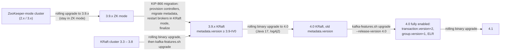

# Kafka Versions, Compatibility and Roadmap

**Roles:** [ARCH] [ADMIN] [DEV]   **Level:** Reference
**Prerequisites:** [Glossary](04-glossary.md)

## What you will learn
- What each Apache Kafka release from 2.8 to 4.1 brought, and roughly when
- Exactly what changed in 4.0 (KRaft-only, Java 17, new consumer protocol, removed APIs and configs)
- Which broker, client, Streams and Connect versions work together, and how to plan an upgrade path
- What is on the roadmap: share groups, diskless topics, eligible leader replicas, transaction v2, client metrics

Dates are the general-availability month of the `x.y.0` release and are indicative (patch releases follow every few months). Apache Kafka has a time-based release plan of roughly three minor releases per year in the 3.x line and two per year from 4.0 on; each minor release is supported with bug-fix releases until roughly two further minors have shipped.

---

## 1. Release history 2.8 → 4.1

| Version | Date (indicative) | Headline features | Notable KIPs and changes |
|---------|-------------------|-------------------|--------------------------|
| **2.8** | Apr 2021 | KRaft early access (no ZooKeeper, dev/test only) | KIP-500/595/631 KRaft; KIP-516 topic ids; KIP-700 `describeCluster`; KIP-679 first step (`IdempotentWrite` implied by `Write`); KIP-684 SSL certificate reload API; last release with Scala 2.12 and Java 8 not yet deprecated |
| **3.0** | Sep 2021 | Producer defaults `acks=all` + idempotence; deprecations for the 4.0 clean-up | KIP-679 producer defaults; KIP-724 deprecate message formats v0/v1; KIP-750/751 deprecate Java 8 and Scala 2.12; KIP-734 `--to-current`/`ListOffsets max timestamp`; KIP-735 consumer `session.timeout.ms` 45 s; KIP-745 Connect restart connector + tasks; KIP-630 KRaft snapshots (completed in 3.1); Streams: KIP-633 grace-period APIs, KIP-695 improved task idling, KIP-732 `exactly_once_v2`, KIP-741 no default serdes; KIP-709 batch offset fetch |
| **3.1** | Jan 2022 | OIDC for OAUTHBEARER; Streams FK-join partitioners | KIP-768 OAuth/OIDC out of the box; KIP-773 latency metric naming; KIP-748 broker count metrics; KIP-775 custom partitioners for foreign-key joins; KIP-766 `fetch offset for timestamp` fix |
| **3.2** | May 2022 | KRaft `StandardAuthorizer`; IQv2; console producer headers | KIP-801 `StandardAuthorizer`; KIP-704 unclean election in KRaft; KIP-796/805/806 Interactive Queries v2; KIP-798 console producer headers; KIP-800 leave-group reason; KIP-814 static member rejoin fix; KIP-708 rack-aware standby tasks; KIP-791 record metadata in state stores; Connect: KIP-769 `connector-plugins` lists converters/transforms/predicates; log4j 1.x replaced by reload4j |
| **3.3** | Oct 2022 | **KRaft production-ready**; EOS source connectors; uniform sticky partitioner | KIP-833 KRaft GA; KIP-618 exactly-once source connectors; KIP-794 uniform sticky partitioner; KIP-778 KRaft upgrades (`metadata.version`); KIP-836 `describeMetadataQuorum`; KIP-841 fenced replicas leave ISR; KIP-827 log dir total/usable bytes; Streams: KIP-834 pause/resume topologies, KIP-820 typed Processor API completion, KIP-846 source/repartition node metrics |
| **3.4** | Feb 2023 | ZooKeeper → KRaft migration (early access); rack-aware consumer assignment | KIP-866 migration EA; KIP-881 rack-aware consumer partition assignment; KIP-830 disable JMX reporter; KIP-770 `statestore.cache.max.bytes` / `input.buffer.max.bytes`; KIP-837 multi-record emit in Streams; Connect: KIP-787 MM2 custom admin client |
| **3.5** | Jun 2023 | SCRAM in KRaft; Connect offsets API; versioned state stores; ZooKeeper deprecated | KIP-900 `--add-scram` at format; KIP-875 Connect `STOPPED` state + read offsets; KIP-889 versioned state stores; KIP-903 stale broker epoch ISR guard; KIP-868 metadata transactions; KIP-710 MM2 dedicated-mode internal REST; KIP-887 `EnvVarConfigProvider`; ZooKeeper mode formally deprecated |
| **3.6** | Oct 2023 | **Tiered storage early access**; migration GA; transaction verification | KIP-405 tiered storage EA; KIP-866 ZK→KRaft migration GA; KIP-890 part 1 (transaction verification, `transaction.partition.verification.enable`); KIP-875 alter/reset Connect offsets; KIP-898 Connect plugin discovery (`plugin.discovery`); KIP-937 timestamp validation; KIP-925 rack-aware task assignment in Streams; KIP-902 socket listen backlog; KIP-863 reduced fetch allocations |
| **3.7** | Feb 2024 | **KIP-848 early access**; client metrics (KIP-714); JBOD in KRaft; Docker image | KIP-848 new consumer protocol EA; KIP-714 client metrics push; KIP-858 JBOD for KRaft; KIP-919 `--bootstrap-controller`; KIP-951 faster leader discovery; KIP-580 exponential backoff; KIP-974/975 official Docker image; KIP-1000 list client metrics; Connect: KIP-976 cluster-wide dynamic log levels, KIP-980 create connectors STOPPED; Streams: KIP-954 custom DSL store suppliers, KIP-960/968/985 versioned IQ queries, KIP-962 relaxed non-null join keys, KIP-988 standby update listener, KIP-989 iterator metrics; KIP-963 tiered storage metrics |
| **3.8** | Jul 2024 | Compression levels; feature versioning; Connect `tasks.max` enforcement | KIP-390 compression levels; KIP-1022 feature versions (`--release-version`); KIP-1004 `tasks.max.enforce`; KIP-924 pluggable Streams task assignor; KIP-899 client rebootstrap (opt-in); KIP-1028 GraalVM native Docker image; KIP-848 improvements; KIP-1036 Streams `ErrorHandlerContext` |
| **3.9** | Nov 2024 | **Tiered storage GA**; **dynamic KRaft quorum**; final ZooKeeper-capable release (bridge release) | KIP-405 GA; KIP-853 dynamic controller quorum (`kraft.version=1`, add/remove controllers); KIP-950 tiered storage disablement; KIP-956 tiered storage quotas; KIP-1057 dump-log remote metadata decoder; KIP-1005 `earliest-local`/`latest-tiered` offsets; KIP-1033 Streams processing exception handler; 3.9.x is the required stepping stone from ZooKeeper to 4.0 |
| **4.0** | Mar 2025 | **KRaft only**; **KIP-848 GA**; share groups EA; transaction v2; Java 17; log4j2 | KIP-500 completion (ZooKeeper removed); KIP-848 GA (`group.protocol=consumer`); KIP-932 share groups EA; KIP-890 part 2 (`transaction.version=2`); KIP-966 eligible leader replicas (part 1); KIP-896 old protocol versions removed; KIP-750/1013 Java 17 (brokers/Connect/tools) and Java 11 (clients/Streams); KIP-724 message formats v0/v1 removed; KIP-653 log4j2; KIP-720 MirrorMaker 1 removed; KIP-1102 rebootstrap default; KIP-1106 `auto.offset.reset=by_duration`; KIP-1076/1091 Streams metrics push and state metrics; KIP-1092 `Consumer#close(CloseOptions)`; KIP-1017 Connect `/health` |
| **4.1** | Sep 2025 (indicative) | Share groups preview; Streams rebalance protocol EA; KRaft pre-vote | KIP-932 preview (`share.version`); KIP-1071 Streams rebalance protocol EA (`group.protocol=streams`, `streams.version`); KIP-996 pre-vote; KIP-1111 explicit internal resource naming in Streams; KIP-877 plugin metrics; KIP-848 hardening; Java 17 for brokers continues, Java 11 for clients |
| **4.2** | early 2026 (indicative, verify) | Expected: share groups GA, KIP-1071 progress, further ELR work, KIP-939 2PC steps | Check the official release notes; contents were not final at the time of writing. |

Headline items in bold are stable facts; the KIP lists are the notable subset, not the full release notes. Verify minor KIP numbers against the release announcement before quoting them in a design document.

---

## 2. What changed in 4.0

Kafka 4.0 (March 2025) is the first major release since 2017 and is defined more by what it removes than by what it adds.

### 2.1 KRaft only

- ZooKeeper mode is gone: `zookeeper.connect`, `zookeeper.*` configs, `--zookeeper` flags on every tool, and the `kafka.zk` code are removed.
- A cluster must already run KRaft to upgrade. The migration (KIP-866) must be completed on a 3.9.x bridge release, and `metadata.version` must be at least `3.3-IV3` before the first 4.0 binary starts.
- `inter.broker.protocol.version` and `log.message.format.version` are removed; feature levels (`kafka-features.sh`) are the only versioning mechanism.
- Dynamic quorum (KIP-853) is available but not required; static `controller.quorum.voters` still works.

### 2.2 Java and build

- Brokers, Connect workers and command-line tools require **Java 17** (KIP-1013). Clients and Kafka Streams require **Java 11** (KIP-750); Java 8 is unsupported everywhere.
- Scala 2.12 builds are dropped (KIP-751); only Scala 2.13 artifacts exist (`kafka_2.13-4.0.0`).
- Logging moved to **log4j 2** (KIP-653): `config/log4j2.yaml` replaces `log4j.properties`; `KAFKA_LOG4J_OPTS` must reference `log4j2.configurationFile`. A `log4j-1.2-api` bridge is bundled so most old property files still load with warnings.
- The official Docker images (`apache/kafka`, `apache/kafka-native`) are the recommended container distribution.

### 2.3 Protocol and client compatibility (KIP-896)

- Brokers drop request versions older than those supported by Kafka **2.1** clients. Any client (Java, librdkafka, Sarama, kafka-python …) built against a protocol older than 2.1 (2018) cannot connect.
- 4.0 clients likewise cannot talk to brokers older than 2.1.
- Message formats v0 and v1 are removed (KIP-724); a 4.0 broker refuses to append them and no longer down-converts for old fetchers (`message.downconversion.enable` is effectively irrelevant).

### 2.4 New consumer protocol GA (KIP-848)

- `group.protocol=consumer` is production-ready: server-side assignment, incremental reconciliation, no JoinGroup/SyncGroup barrier. Brokers default to `group.coordinator.rebalance.protocols=classic,consumer`.
- The client default remains `classic` in 4.0 to preserve compatibility with older brokers; switch per application once every broker is 4.0.
- The new `AsyncKafkaConsumer` implementation backs the new protocol; `session.timeout.ms`, `heartbeat.interval.ms` and `partition.assignment.strategy` are ignored under `group.protocol=consumer` (broker-side configs and `group.remote.assignor` apply instead).
- New tooling: `kafka-consumer-groups.sh --list --type`, per-group configs via `kafka-configs.sh --entity-type groups`.

### 2.5 Transactions v2 (KIP-890 part 2)

- `transaction.version=2` (enable with `kafka-features.sh upgrade --feature transaction.version=2`) makes the producer epoch bump on every commit/abort and lets produce requests add partitions to the transaction implicitly; `AddPartitionsToTxn` round trips disappear and the hanging-transaction bug class is closed.
- Requires 4.0 clients to benefit; older clients continue to work with server-side verification (part 1).

### 2.6 Removed or changed APIs and configs (selection)

| Area | Removed / changed in 4.0 | Replacement |
|------|--------------------------|-------------|
| Broker configs | `zookeeper.*`, `inter.broker.protocol.version`, `log.message.format.version`, `log.message.timestamp.difference.max.ms`, `broker.id.generation.enable`, `reserved.broker.max.id`, `control.plane.listener.name`, `password.encoder.*`, `remote.log.manager.thread.pool.size` (deprecated) | feature levels; `log.message.timestamp.before/after.max.ms`; `remote.log.manager.copier/expiration.thread.pool.size` |
| Authorizer | `kafka.security.authorizer.AclAuthorizer` | `org.apache.kafka.metadata.authorizer.StandardAuthorizer` |
| Topic configs | `message.format.version` | (none) |
| Producer | `DefaultPartitioner`, `UniformStickyPartitioner` classes; `send()` without idempotence guarantees for old brokers | built-in partitioner (leave `partitioner.class` unset) |
| Consumer | Deprecated `poll(long)`; `KafkaConsumer#close(Duration)` complemented by `close(CloseOptions)` (KIP-1092); `MockConsumer` constructors | `poll(Duration)` |
| Admin | Deprecated `alterConfigs()` (use `incrementalAlterConfigs()`), various `Options` overloads | incremental APIs |
| Streams API | `KStream#through`, `KStream#branch` (use `split`), `TimeWindows.of/grace` (use `ofSizeAndGrace`), `JoinWindows.of`, `SessionWindows.with`, `Transformer`/`ValueTransformer` deprecated (KIP-1081/1097 direction; `process()` with Processor API), `KafkaStreams#setUncaughtExceptionHandler(Thread.UncaughtExceptionHandler)`, old `StreamsBuilder#addGlobalStore` variants, `Topology#connectProcessorAndStateStores` variants | `split()`, `ofSizeAndGrace`, `process()`/`processValues()`, `StreamsUncaughtExceptionHandler` |
| Streams configs | `cache.max.bytes.buffering`, `buffered.records.per.partition`, `processing.guarantee=exactly_once` (v1) and `exactly_once_beta`, `default.deserialization.exception.handler` / `default.production.exception.handler` deprecated | `statestore.cache.max.bytes`, `input.buffer.max.bytes`, `exactly_once_v2`, `deserialization.exception.handler` / `production.exception.handler` |
| Connect / MM2 | MirrorMaker 1 (`kafka-mirror-maker.sh`) removed (KIP-720); `connect-standalone` file offsets format unchanged; Connect requires Java 17 | MirrorMaker 2 (`connect-mirror-maker.sh` or on Connect) |
| Tools | `--zookeeper` on all tools; `kafka-console-consumer.sh --whitelist`/`--blacklist`; Scala `kafka.tools.*` classes (moved to `org.apache.kafka.tools`); `kafka.coordinator.group.GroupMetadataManager$OffsetsMessageFormatter` | `--bootstrap-server`; `--include`; `org.apache.kafka.tools.consumer.group.OffsetsMessageFormatter` |
| Metrics | `kafka.server:type=SessionExpireListener,*` and other ZK metrics; `auto.include.jmx.reporter` deprecated | KRaft metrics (`raft-metrics`, `broker-metadata-metrics`) |
| Build | Scala 2.12 artifacts, Java 8/11 broker support | Scala 2.13, Java 17 |

### 2.7 Behaviour changes worth testing

- Default `metadata.recovery.strategy=rebootstrap` on all clients: clients now re-resolve `bootstrap.servers` after `metadata.recovery.rebootstrap.trigger.ms` (5 min) without any known broker; DNS records must stay correct.
- Consumer `auto.offset.reset` accepts `by_duration:PT24H` (KIP-1106).
- Kafka Streams: the processing exception handler (KIP-1033) defaults to fail; `ensure.explicit.internal.resource.naming` (4.1) is opt-in but recommended for new apps.
- `log4j2` changes log file names/rotation; ship the new `log4j2.yaml` with your configuration management.
- Broker `group.coordinator.rebalance.protocols` includes `consumer` by default; monitoring dashboards need the new `group-coordinator-metrics` names.

---

## 3. Compatibility matrix

### 3.1 Brokers vs clients

Kafka clients and brokers negotiate API versions at connection time (KIP-97, 0.10.2), so any client/broker pair within the supported window works; features simply degrade when the other side is older.

| Broker version | Oldest Java client supported | Newest client supported | Notes |
|----------------|------------------------------|-------------------------|-------|
| 2.8 – 3.9 | 0.10.x (with limitations; 0.11 for headers/idempotence) | any newer client (4.x) | 4.x clients against ≤ 3.x brokers work but require broker ≥ 2.1 (KIP-896). |
| 4.0 – 4.1 | **2.1** | any | Clients < 2.1 are rejected at `ApiVersions`. |

| Client version | Oldest broker supported | Feature gates |
|----------------|-------------------------|---------------|
| 3.x clients | 0.10.0 (practically 0.11+) | Idempotence needs broker ≥ 0.11; EOS v2 (KIP-447) needs ≥ 2.5; rack-aware fetch needs ≥ 2.4. |
| 4.0 – 4.1 clients | **2.1** | `group.protocol=consumer` needs broker ≥ 4.0 with `consumer` in `group.coordinator.rebalance.protocols`; transaction v2 benefits need broker `transaction.version=2`; share consumers need broker ≥ 4.0 EA / 4.1 preview; rebootstrap works with any broker. |

Non-Java clients: librdkafka (and therefore confluent-kafka-python/go/.NET, kcat) supports brokers ≥ 0.10 and works with 4.0 brokers from librdkafka 1.x (protocol ≥ 2.1 is satisfied by any release since 2019); KIP-848 support arrived in librdkafka 2.8+ (preview) and later versions. Check each client's changelog before enabling new protocols.

### 3.2 Kafka Streams

| Streams version | Minimum broker | Recommended broker | Notes |
|-----------------|----------------|--------------------|-------|
| 2.8 – 3.9 | 0.11 (2.5 for `exactly_once_v2`) | same or newer minor | Rolling upgrade across Streams versions may need `upgrade.from` when crossing 2.3 or earlier, and for cooperative rebalancing changes (2.4). |
| 4.0 | **2.1** (2.5 for EOS v2) | 4.0 | Java 11+. Rolling upgrade from 3.x Streams to 4.0 works without `upgrade.from` unless coming from < 2.4. |
| 4.1 | 2.1; **4.1** for `group.protocol=streams` | 4.1 | KIP-1071 requires `streams.version` feature enabled on brokers. |

Streams applications should be upgraded **after** brokers when adopting broker-gated features (EOS v2, KIP-1071), and can otherwise be upgraded independently.

### 3.3 Kafka Connect and MirrorMaker 2

| Connect version | Minimum broker | Notes |
|-----------------|----------------|-------|
| 2.8 – 3.9 | 0.11 (2.5 for `exactly.once.source.support=enabled`) | Workers in one cluster must run the same version during normal operation; rolling upgrades between adjacent versions are supported. |
| 4.0 – 4.1 | **2.1** (2.5 for EOS sources) | Java 17. Plugins compiled for 3.x generally load unchanged; plugins depending on removed Scala classes or log4j 1.x internals need rebuilding. MM2 in 4.0 talks to source/target clusters ≥ 2.1. |

### 3.4 Upgrade paths

Rules that follow from the matrix:

1. Never skip the 3.9 bridge when leaving ZooKeeper; 4.0 binaries refuse to start with `zookeeper.connect` set.
2. Upgrade binaries first, features second: `metadata.version` (and `transaction.version`, `group.version`, `kraft.version`) are bumped only after every broker and controller runs the new binary, because downgrading a finalized feature may be impossible without `--unsafe` and data loss.
3. Upgrade controllers before brokers in KRaft rolling upgrades.
4. Inventory clients before 4.0: `kafka-broker-api-versions.sh` shows what the broker offers, but to find old clients look at `kafka.network:type=RequestMetrics,name=RequestsPerSec,request=*,version=*` for low `version` values, or enable the request logger briefly.
5. Test log4j2 configuration, JVM flags (`-XX:+UseZGC` or G1 on Java 17) and any custom plugins (authorizers, principal builders, config providers, Connect plugins, RSM implementations) against the 4.0 artifacts before touching production.

---

## 4. Deprecation notes (what to stop using now)

| Deprecated | Since | Removal | Use instead |
|------------|-------|---------|-------------|
| ZooKeeper mode | 3.5 | 4.0 | KRaft (migrate on 3.9). |
| Classic consumer protocol (`group.protocol=classic`) | not deprecated in 4.0/4.1, but no longer the direction | future 5.x (indicative) | `group.protocol=consumer` once brokers are 4.0. |
| `alterConfigs()` Admin API | 2.3 | future | `incrementalAlterConfigs()`. |
| `kafka-features.sh upgrade --metadata` flag | 3.8 | future | `--feature metadata.version=<n>` or `--release-version`. |
| `remote.log.manager.thread.pool.size` | 3.9 | future | copier/expiration pool sizes. |
| Streams `Transformer`, `ValueTransformer`, `transform()` family | 3.3 – 4.0 | future | `process()` / `processValues()` with the typed Processor API. |
| Streams `default.deserialization.exception.handler`, `default.production.exception.handler` | 4.0 | future | `deserialization.exception.handler`, `production.exception.handler`. |
| `auto.include.jmx.reporter` | 3.4 | 4.x | list `JmxReporter` explicitly in `metric.reporters`. |
| `message.downconversion.enable` | 4.0 (effectively no-op) | future | none needed. |
| Java 11 for clients | not yet | likely 5.x (indicative) | Java 17. |
| `partition.assignment.strategy` eager assignors (`RangeAssignor` default) | de facto | n/a | `CooperativeStickyAssignor` or the new protocol. |
| `kafka-metadata-quorum.sh` static-quorum `controller.quorum.voters` | not deprecated | n/a | dynamic quorum (`kraft.version=1`) is the direction for new clusters. |

---

## 5. Roadmap overview

The items below are in flight as of this guide's baseline; release targets are indicative and should be verified against the current KIP status pages.

### 5.1 Queues for Kafka: share groups (KIP-932)

- **What:** a consumption model where records of a partition can be processed by many consumers concurrently, with per-record acknowledgement (`accept`, `release`, `reject`), redelivery, delivery-count limits and lock timeouts, coordinated by a *share coordinator* persisting state in `__share_group_state`.
- **Why:** work-queue workloads (task distribution, many slow consumers) no longer need more partitions than consumers, and a stuck record does not block a partition.
- **Status:** early access in 4.0 (`unstable.api.versions.enable=true`), preview in 4.1 (`share.version`), GA targeted for 4.2 (indicative). Java `KafkaShareConsumer`, `kafka-share-groups.sh`, `kafka-console-share-consumer.sh`. Ordering is not guaranteed across a share group.

### 5.2 Diskless topics (KIP-1150) and related storage proposals

- **What:** topics whose partitions have no single leader disk: any broker in the cluster accepts writes for them and batches records into objects written directly to object storage (S3-style), with a metadata layer (a "batch coordinator") tracking offsets. Reads are served from object storage with local caches.
- **Why:** in cloud deployments cross-AZ replication traffic dominates the bill; diskless topics trade tens to hundreds of milliseconds of latency for near-zero inter-AZ transfer and simpler rebalancing (no data movement).
- **Status:** proposed in 2025 (with companion KIPs for the batch coordinator and object storage layout); under discussion, no release target. Similar functionality exists today in proprietary systems (Confluent Freight clusters, WarpStream, AutoMQ, Bufstream), which is why the community wants a first-party design.
- **Interaction with tiered storage:** KIP-405 keeps a leader and local hot set; diskless removes the local log entirely. Expect both to coexist per topic.

### 5.3 Eligible leader replicas and unclean recovery (KIP-966)

- **What:** when the ISR shrinks to `min.insync.replicas`, replicas that fall out afterwards are tracked as *eligible leader replicas* because they are known to contain everything committed; if the last ISR member dies, an ELR can be elected without data loss. A second phase ("unclean recovery") lets the controller inspect replica logs to choose the best candidate when no ELR exists, replacing blind unclean election.
- **Status:** ELR shipped in 4.0 behind `eligible.leader.replicas.version=1`; unclean recovery is follow-up work. Also changes semantics: `min.insync.replicas` becomes a controller-enforced invariant for leader election, and the tool output gains `Elr`/`LastKnownElr` columns.

### 5.4 Transactions v2 and two-phase commit (KIP-890, KIP-939)

- **KIP-890** is complete in 4.0 (`transaction.version=2`): fewer round trips, epoch bump per transaction, no hanging transactions. Enable it cluster-wide after all clients are ≥ 4.0 (older clients still work via server-side verification).
- **KIP-939** adds an explicit "prepare" phase so that a Kafka transaction can be one participant in an external two-phase commit (Flink's `TwoPhaseCommitSinkFunction`, XA-style database coordination); it introduces `transaction.two.phase.commit.enable` and `Producer#prepareTransaction()`. Status: accepted, implementation landing across 4.x releases (indicative).

### 5.5 Client metrics and observability (KIP-714 and follow-ups)

- Brokers can subscribe to metrics pushed by clients (`kafka-configs.sh --entity-type client-metrics`), exported through a broker-side `ClientTelemetry` plugin (for example to OpenTelemetry). Java clients support it since 3.7 (`enable.metrics.push`), Streams since 4.0 (KIP-1076), librdkafka since 2.x.
- Follow-ups: KIP-1000 (list subscriptions), KIP-1091 (Streams state as metrics), KIP-877 (metrics for broker plugins: authorizers, config providers, RSM). The goal is that operators can see client-side lag, latency and errors for every application without instrumenting each one.

### 5.6 Other threads to watch

| Theme | KIPs | Status (indicative) |
|-------|------|---------------------|
| Streams rebalance protocol on the broker | KIP-1071 | EA in 4.1; GA planned for a later 4.x. |
| KRaft resilience | KIP-996 pre-vote (4.1), KIP-853 follow-ups (auto-join controllers), controller-side rate limiting | in progress |
| Tiered storage completeness | KIP-950 (disablement, 3.9), KIP-956 (quotas, 3.9), compacted topics on tiered storage, KIP-1057 tooling | ongoing |
| Producer/consumer ergonomics | KIP-1030 (safer defaults), KIP-1102 (rebootstrap), KIP-1092 (`close` options), KIP-1106 (`by_duration` reset) | mostly 4.0/4.1 |
| Connect | KIP-1017 health endpoint (4.0), KIP-980 stopped connectors (3.7), plugin versioning per connector (KIP-891) | 4.x |
| Security | OIDC/OAuth follow-ups to KIP-768, SCRAM and ACL tooling in KRaft | ongoing |
| Removal of the classic consumer protocol, Java 11 clients | tracked for the next major (5.x) | discussion only |

> **Production tip:** treat "early access" and "preview" literally. Share groups in 4.0 require an unstable-API flag and their on-disk state format changed between 4.0 and 4.1; do not put them in production before the release notes say GA.

---

## Key takeaways
- 3.9 is the last ZooKeeper-capable release and the mandatory bridge to 4.0; 4.0 is KRaft-only, Java 17 on the server side, and rejects clients older than 2.1.
- Upgrade order is binaries first (controllers, then brokers), features second (`kafka-features.sh`), applications when they need broker-gated features.
- KIP-848 (consumer), KIP-890 v2 (transactions), KIP-966 (ELR) and KIP-853 (dynamic quorum) are the 4.0-era features that change day-to-day operations; enable them deliberately, one at a time.
- The roadmap points at cloud economics (diskless topics, tiered storage), queue semantics (share groups) and observability (client metrics); design new systems so these can be adopted without re-architecture.

## Further reading
- Apache Kafka release notes and upgrade guide ("Upgrading to 4.0.0 from any version 0.8.x through 3.9.x").
- KIP-896 (protocol removals), KIP-750 and KIP-1013 (Java version policy), KIP-932, KIP-966, KIP-1150, KIP-939 design pages.
- Apache Kafka "Time Based Release Plan" wiki page for the current schedule.
