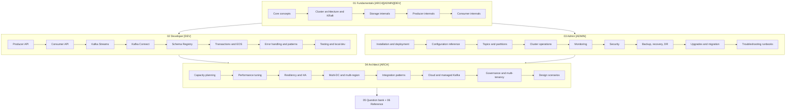

# The Kafka Guide – Architect · Admin · Developer

A complete, evolving guide book and question bank for Apache Kafka, written for three roles:
**Kafka Architect**, **Kafka Administrator / SRE**, and **Kafka Developer**.

- Baseline: Apache Kafka 3.9 / 4.0 (KRaft). ZooKeeper appears only in migration and legacy sections.
- Diagrams: Mermaid (renders on GitHub) plus PlantUML sources in `diagrams/`.
- Every chapter ends with interview questions. The question bank holds 300+ more, plus 35 scenarios and 25 coding exercises.
- The guide grows with reader input. See `CHANGELOG.md` and the "Requesting additions" section.

## Start here

| I am a... | Read | Roadmap |
|-----------|------|---------|
| Developer | `01-fundamentals` then `02-developer` | [Developer roadmap](00-roadmaps/README.md#roadmap-1--kafka-developer) |
| Administrator / SRE | `01-fundamentals` then `03-admin` | [Admin roadmap](00-roadmaps/README.md#roadmap-2--kafka-administrator--sre) |
| Architect | everything, then `04-architect` | [Architect roadmap](00-roadmaps/README.md#roadmap-3--kafka-architect) |
| Preparing for an interview | `05-question-bank` by role, then scenarios | [2-week plan](00-roadmaps/README.md#interview-preparation-plan-2-weeks) |

## Map of the book

## Table of contents

### 00 – Roadmaps
- [Learning roadmaps by role and 2-week interview plan](00-roadmaps/README.md)

### 01 – Fundamentals `[ARCH] [ADMIN] [DEV]`
1. [Core concepts](01-fundamentals/01-core-concepts.md) – records, topics, partitions, offsets, keys, ordering, consumer groups, Kafka vs other brokers
2. [Cluster architecture and KRaft](01-fundamentals/02-cluster-architecture.md) – brokers, controller quorum, replication protocol, ISR, high watermark, leader election, request pipeline
3. [Storage internals](01-fundamentals/03-storage-internals.md) – segments, indexes, page cache, retention, compaction, tiered storage, compression
4. [Producer internals](01-fundamentals/04-producer-internals.md) – accumulator, batching, idempotence, acks, retries, partitioners
5. [Consumer internals](01-fundamentals/05-consumer-internals.md) – group protocol, rebalances, assignors, KIP-848, offsets, share groups

### 02 – Developer `[DEV]`
1. [Producer API](02-developer/01-producer-api.md)
2. [Consumer API](02-developer/02-consumer-api.md)
3. [Kafka Streams](02-developer/03-kafka-streams.md)
4. [Kafka Connect](02-developer/04-kafka-connect.md)
5. [Schema Registry and serialization](02-developer/05-schema-registry-serialization.md)
6. [Transactions and exactly-once](02-developer/06-transactions-exactly-once.md)
7. [Error handling and messaging patterns](02-developer/07-error-handling-and-patterns.md)
8. [Testing and local development](02-developer/08-testing-and-local-dev.md)

### 03 – Admin `[ADMIN]`
1. [Installation and deployment](03-admin/01-installation-and-deployment.md)
2. [Configuration reference](03-admin/02-configuration-reference.md)
3. [Topic and partition management](03-admin/03-topic-and-partition-management.md)
4. [Cluster operations](03-admin/04-cluster-operations.md)
5. [Monitoring and observability](03-admin/05-monitoring-and-observability.md)
6. [Security](03-admin/06-security.md)
7. [Backup, recovery and disaster recovery](03-admin/07-backup-recovery-and-dr.md)
8. [Upgrades and migration](03-admin/08-upgrades-and-migration.md)
9. [Troubleshooting runbooks](03-admin/09-troubleshooting-runbooks.md)

### 04 – Architect `[ARCH]`
1. [Capacity planning and sizing](04-architect/01-capacity-planning-and-sizing.md)
2. [Performance tuning](04-architect/02-performance-tuning.md)
3. [Resiliency and high availability](04-architect/03-resiliency-and-high-availability.md)
4. [Multi-datacenter and multi-region](04-architect/04-multi-datacenter-and-multi-region.md)
5. [Integration and data architecture patterns](04-architect/05-integration-and-data-architecture-patterns.md)
6. [Cloud and managed Kafka](04-architect/06-cloud-and-managed-kafka.md)
7. [Governance, multi-tenancy and platform](04-architect/07-governance-multitenancy-and-platform.md)
8. [Design scenarios and case studies](04-architect/08-design-scenarios-and-case-studies.md)

### 05 – Question bank
1. [Fundamentals questions](05-question-bank/01-fundamentals-questions.md) – 70
2. [Developer questions](05-question-bank/02-developer-questions.md) – 80
3. [Admin questions](05-question-bank/03-admin-questions.md) – 80
4. [Architect questions](05-question-bank/04-architect-questions.md) – 70
5. [Scenario questions](05-question-bank/05-scenario-questions.md) – 35 situational problems with model answers
6. [Coding questions](05-question-bank/06-coding-questions.md) – 25 exercises with full solutions

### 06 – Reference
1. [CLI cheat sheet](06-reference/01-cli-cheatsheet.md)
2. [Configuration cheat sheet](06-reference/02-configuration-cheatsheet.md)
3. [Metrics and alerts cheat sheet](06-reference/03-metrics-and-alerts-cheatsheet.md)
4. [Glossary and essential KIPs](06-reference/04-glossary.md)
5. [Versions, 4.0 changes and roadmap](06-reference/05-kafka-versions-and-roadmap.md)

### Diagrams
- [Diagram catalogue and rendering instructions](diagrams/README.md)

### Meta
- [Style guide for contributors](STYLE-GUIDE.md)
- [Changelog](CHANGELOG.md)

## Requesting additions

This guide is meant to keep growing. To add or deepen content, ask for it with:

1. **Topic** – for example "Kafka Streams state restore tuning" or "MSK IAM auth setup".
2. **Role** – Architect, Admin, Developer, or all.
3. **Form** – a chapter section, a set of questions, a scenario, a runbook, a diagram, or a coding exercise.

Additions follow `STYLE-GUIDE.md` and are logged in `CHANGELOG.md`.

## Conventions used throughout

| Marker | Meaning |
|--------|---------|
| `[ARCH]` `[ADMIN]` `[DEV]` | Role the content is aimed at |
| ★☆☆ / ★★☆ / ★★★ | Question difficulty: foundation / intermediate / advanced |
| **Production tip:** | Something learned from running Kafka in production |
| **Anti-pattern:** | Something that looks reasonable but hurts |
| `config.name` | An actual Kafka configuration key |
